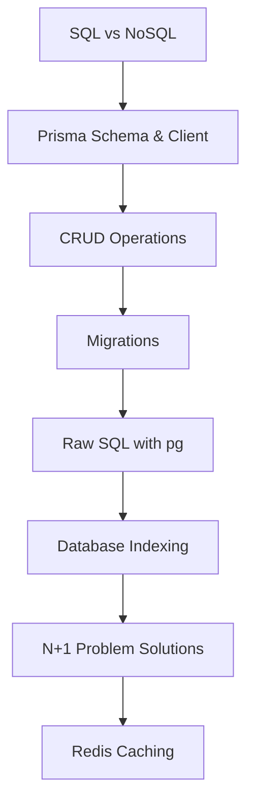
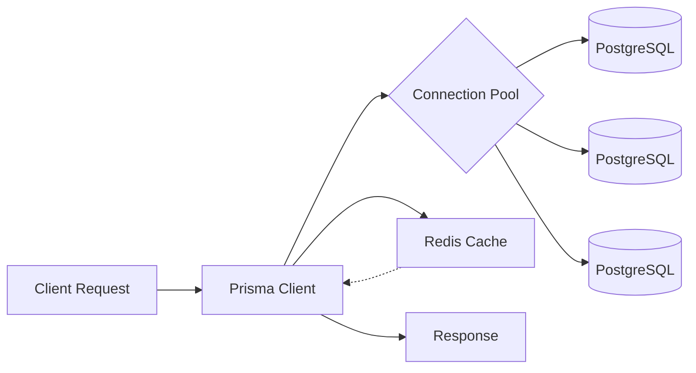
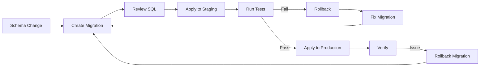

# Chapter 11: Databases in Web Applications

> **Previous:** [10-auth](./10-auth.md) | **Next:** [12-deployment](./12-deployment.md)

## Learning Objectives

> **One-Sentence Takeaway:** SQL databases suit structured relational data while NoSQL offers flexible schemas for unstructured data.

By the end of this chapter, you will be able to:

## Chapter at a Glance

> **One-Sentence Takeaway:** Prisma ORM provides type-safe database access with auto-generated queries and schema migrations.

| Topic | Key Insight | Practical Takeaway |
|-------|-------------|-------------------|
|SQL vs NoSQL|SQL enforces schemas and relationships; NoSQL offers flexible documents|Use SQL for structured relational data, NoSQL for high-velocity unstructured or denormalized data|
|Prisma ORM|Type-safe query builder with auto-generated client and migrations|Define models in schema.prisma, run `prisma generate` for the typed client|
|Migrations|Version-controlled schema changes applied in order across environments|Write descriptive migration names, test down migrations, never edit applied migrations|
|Raw SQL|Parameterized queries with the `pg` library prevent injection|Always use `$1`, `$2` placeholders — never string interpolation for values|
|Indexing|Database indexes speed up reads at the cost of write performance|Create composite indexes matching query filter/sort patterns, use partial indexes for filtered queries|
|N+1 Problem|Fetching parent rows then querying children individually causes N extra queries|Always eager-load relations with `include` in Prisma or JOIN in raw SQL|
|Redis Caching|In-memory key-value store reduces database load for frequent queries|Set TTLs appropriate to data freshness needs, invalidate cache on writes|

## Chapter Roadmap

> **One-Sentence Takeaway:** Database migrations version-control schema changes and ensure consistent application across environments.




- Choose between SQL and NoSQL databases for web applications
- Use Prisma ORM for type-safe database access
- Design database schemas with proper relationships and indexes
- Write optimized SQL queries and avoid the N+1 problem
- Implement Redis caching for improved performance
- Handle database migrations in production

## 11.1 SQL vs NoSQL

> **One-Sentence Takeaway:** Parameterized queries with `pg` prevent SQL injection by separating query structure from user data.


```typescript
// SQL: Structured data with relationships
const query = `
  SELECT users.*, COUNT(posts.id) as post_count
  FROM users
  LEFT JOIN posts ON posts.user_id = users.id
  WHERE users.active = true
  GROUP BY users.id
  ORDER BY post_count DESC
`;

// NoSQL: Flexible schema, denormalized data
const user = await db.collection("users").findOne({ email });
await db.collection("posts").insertOne({
  userId: user._id,
  title: "My Post",
  tags: ["web", "database"],
});
```

## 11.2 Prisma ORM Setup and Configuration

```bash
# Initialize Prisma in an existing project
npm install @prisma/client
npm install prisma --save-dev
npx prisma init

# This creates:
# prisma/schema.prisma - Your data model
# .env - Database connection string
```

```typescript
// prisma/seed.ts - Database seeding for development
import { PrismaClient } from "@prisma/client";
import bcrypt from "bcryptjs";

const prisma = new PrismaClient();

async function main() {
  // Create users with posts
  const alice = await prisma.user.upsert({
    where: { email: "alice@example.com" },
    update: {},
    create: {
      email: "alice@example.com",
      name: "Alice Johnson",
      passwordHash: await bcrypt.hash("password123", 12),
      posts: {
        create: [
          { title: "Getting Started with Prisma", published: true },
          { title: "Advanced Database Patterns", published: true },
          { title: "Draft: Upcoming Features", published: false },
        ],
      },
    },
  });

  console.log("Seeded user:", alice.email);
}

main()
  .catch((e) => { console.error(e); process.exit(1); })
  .finally(() => prisma.$disconnect());
```

### CRUD with Prisma

> **One-Sentence Takeaway:** Proper indexing dramatically improves query performance with minimal write overhead.

```prisma
generator client {
  provider = "prisma-client-js"
}

datasource db {
  provider = "postgresql"
  url      = env("DATABASE_URL")
}

model User {
  id    String @id @default(cuid())
  email String @unique
  name  String
  posts Post[]
}

model Post {
  id        String   @id @default(cuid())
  title     String
  content   String?
  published Boolean  @default(false)
  createdAt DateTime @default(now())
  updatedAt DateTime @updatedAt
  author    User     @relation(fields: [authorId], references: [id])
  authorId  String
  tags      Tag[]
}

model Tag {
  id    String @id @default(cuid())
  name  String @unique
  posts Post[]
}
```

### CRUD with Prisma

```typescript
import { PrismaClient } from "@prisma/client";

const prisma = new PrismaClient();

// Create
const user = await prisma.user.create({
  data: { email: "alice@example.com", name: "Alice" },
});

// Read with relations
const userWithPosts = await prisma.user.findUnique({
  where: { email: "alice@example.com" },
  include: { posts: { include: { tags: true } } },
});

// Update
const updated = await prisma.post.update({
  where: { id: "postId" },
  data: { published: true },
});

// Delete
await prisma.post.delete({ where: { id: "postId" } });

// Paginated query with filtering
const posts = await prisma.post.findMany({
  where: { published: true, title: { contains: "Web" } },
  orderBy: { createdAt: "desc" },
  skip: 0,
  take: 20,
  include: { author: { select: { name: true, email: true } } },
});
```

## 11.3 Migrations

> **One-Sentence Takeaway:** The N+1 problem is solved by eager-loading related data in a single query.

```bash
# Create migration
npx prisma migrate dev --name add_user_role

# Apply to production
npx prisma migrate deploy

# Check migration status
npx prisma migrate status
```

```prisma
// Migration file auto-generated by Prisma
model User {
  id    String @id @default(cuid())
  email String @unique
  name  String
  role  String @default("MEMBER") // New field
  posts Post[]
}
```

## 11.4 Raw SQL with pg

> **One-Sentence Takeaway:** Redis caching reduces database load by serving frequently accessed data from memory.

```typescript
import { Pool } from "pg";

const pool = new Pool({
  connectionString: process.env.DATABASE_URL,
});

// Parameterized queries prevent SQL injection
async function getUserWithPosts(userId: string) {
  const { rows } = await pool.query(
    `
    SELECT u.*, json_agg(
      json_build_object('id', p.id, 'title', p.title)
    ) FILTER (WHERE p.id IS NOT NULL) as posts
    FROM users u
    LEFT JOIN posts p ON p.author_id = u.id
    WHERE u.id = $1
    GROUP BY u.id
    `,
    [userId]
  );
  return rows[0];
}
```

## 11.5 Indexing for Performance

```sql
-- Single column index
CREATE INDEX idx_posts_published ON posts(published);

-- Composite index for common query patterns
CREATE INDEX idx_posts_author_published ON posts(author_id, published);

-- Partial index for filtered queries
CREATE INDEX idx_posts_recent ON posts(created_at DESC)
WHERE published = true AND created_at > NOW() - INTERVAL '30 days';

-- Full-text search index
CREATE INDEX idx_posts_search ON posts
USING GIN(to_tsvector('english', title || ' ' || content));
```

## 11.6 Solving the N+1 Problem

```typescript
// BAD: N+1 queries - fetches author for each post individually
const posts = await prisma.post.findMany({ where: { published: true } });
for (const post of posts) {
  const author = await prisma.user.findUnique({ where: { id: post.authorId } });
  console.log(post.title, author.name);
}

// GOOD: Single query with eager loading
const postsWithAuthors = await prisma.post.findMany({
  where: { published: true },
  include: { author: true },
});

// For raw SQL batch loading
const posts = await pool.query("SELECT * FROM posts WHERE published = true");
const authorIds = [...new Set(posts.rows.map((p) => p.author_id))];
const authors = await pool.query("SELECT * FROM users WHERE id = ANY($1)", [authorIds]);
const authorMap = new Map(authors.rows.map((a) => [a.id, a]));
```

## 11.7 Redis Caching

```typescript
import { createClient } from "redis";

const redis = createClient({ url: process.env.REDIS_URL });
await redis.connect();

// Caching middleware
async function getCachedOrFetch<T>(
  key: string,
  fetchFn: () => Promise<T>,
  ttlSeconds: number = 300
): Promise<T> {
  const cached = await redis.get(key);
  if (cached) return JSON.parse(cached);

  const data = await fetchFn();
  await redis.setEx(key, ttlSeconds, JSON.stringify(data));
  return data;
}

// Usage
app.get("/api/posts", async (req, res) => {
  const posts = await getCachedOrFetch(
    `posts:${req.query.page}`,
    () => prisma.post.findMany({ skip, take: 20 }),
    60
  );
  res.json({ data: posts });
});
```


> [!TIP]
> Use `prisma.$transaction([])` for operations that must all succeed or all fail — it wraps multiple queries in a database transaction with automatic rollback.

> [!WARNING]
> Never edit an applied migration file. Always create a new migration for schema changes. Editing applied migrations leads to inconsistent database states across environments.

> [!REMEMBER]
> Indexes speed up SELECT but slow down INSERT/UPDATE/DELETE. Only index columns that are actually used in WHERE, JOIN, or ORDER BY clauses.


## 11.8 Transactions and Batch Operations

Database transactions ensure atomicity — a group of operations either all succeed or all fail.

```typescript
import { PrismaClient } from "@prisma/client";

const prisma = new PrismaClient();

// Transaction with rollback on failure
async function transferFunds(fromId: string, toId: string, amount: number) {
  return prisma.$transaction(async (tx) => {
    const fromAccount = await tx.account.findUniqueOrThrow({
      where: { id: fromId },
    });
    if (fromAccount.balance < amount) {
      throw new Error("Insufficient funds");
    }

    await tx.account.update({
      where: { id: fromId },
      data: { balance: { decrement: amount } },
    });

    await tx.account.update({
      where: { id: toId },
      data: { balance: { increment: amount } },
    });

    return { success: true };
  });
}

// Batch create with skipDuplicates
await prisma.user.createMany({
  data: [
    { email: "a@test.com", name: "Alice" },
    { email: "b@test.com", name: "Bob" },
    { email: "a@test.com", name: "Alice Dup" },
  ],
  skipDuplicates: true, // Skips conflicting records
});
```

### Connection Pooling

```typescript
import { Pool } from "pg";

const pool = new Pool({
  connectionString: process.env.DATABASE_URL,
  max: 20,                // Maximum connections in pool
  idleTimeoutMillis: 30000, // Close idle connections after 30s
  connectionTimeoutMillis: 5000, // Fail if can't connect in 5s
});

// Query using pool — automatically acquires and releases connections
async function getUsers() {
  const client = await pool.connect();
  try {
    const { rows } = await client.query("SELECT * FROM users");
    return rows;
  } finally {
    client.release(); // Always release back to pool
  }
}
```



### Prisma Middleware and Logging

Prisma middleware intercepts query operations for logging, caching, or modification.

```typescript
import { PrismaClient } from "@prisma/client";

const prisma = new PrismaClient();

// Middleware: log all queries
prisma.$use(async (params, next) => {
  const before = Date.now();
  const result = await next(params);
  const after = Date.now();
  console.log(`Query ${params.model}.${params.action} took ${after - before}ms`);
  return result;
});

// Middleware: soft-delete filter
prisma.$use(async (params, next) => {
  if (params.model === "Post" && params.action === "findMany") {
    if (!params.args) params.args = {};
    if (!params.args.where) params.args.where = {};
    params.args.where.deletedAt = null;
  }
  return next(params);
});
```

### Database Migration Strategy



### Query Performance Analysis

Use `EXPLAIN ANALYZE` to understand query execution plans.

```sql
-- Analyze a slow query
EXPLAIN ANALYZE
SELECT u.*, COUNT(p.id) as post_count
FROM users u
LEFT JOIN posts p ON p.author_id = u.id
WHERE u.active = true
  AND p.created_at > NOW() - INTERVAL '30 days'
GROUP BY u.id
ORDER BY post_count DESC;

-- Look for: Sequential scans on large tables, missing indexes
-- Expected: Index Scan using idx_users_active, Index Scan using idx_posts_author_created
```

### Read Replicas and Sharding

For read-heavy workloads, offload queries to read replicas:

```typescript
const prisma = new PrismaClient({
  datasources: {
    db: {
      url: process.env.READ_REPLICA_URL, // Read replica for queries
    },
  },
});

// Replica-aware configuration with separate clients
const writeClient = new PrismaClient({
  datasources: { db: { url: process.env.DATABASE_URL } },
});

const readClient = new PrismaClient({
  datasources: { db: { url: process.env.READ_REPLICA_URL } },
});

// Route reads to replica, writes to primary
export async function getPosts() {
  return readClient.post.findMany(); // Read replica
}

export async function createPost(data: CreatePostInput) {
  return writeClient.post.create({ data }); // Primary
}
```

## Concept Comparison Table

| Concept | Description | Use Case |
|---------|-------------|---------|
|SQL vs NoSQL|Structured schema, ACID, JOINs|Flexible schema, BASE, denormalized|
|Prisma vs Raw SQL|Type-safe, auto-generated, migrations|Full control, maximum performance|
|Index vs No Index|Fast reads, slower writes|Faster writes, sequential reads|
|B-tree vs Hash Index|Range queries, ORDER BY|Exact match lookups only|
|Prisma `include` vs `select`|Eager-loads relations, all fields|Eager-loads with specific field selection|

## Quick Reference

| Topic | Key Points |
|-------|-----------|
|Prisma Client|`create()`, `findUnique()`, `findMany()`, `update()`, `delete()`, `upsert()`|
|Migration Commands|`prisma migrate dev`, `prisma migrate deploy`, `prisma migrate status`|
|SQL Join Types|`INNER JOIN`, `LEFT JOIN`, `RIGHT JOIN`, `FULL OUTER JOIN`, `CROSS JOIN`|
|Index Types|B-tree, Hash, GiST, GIN, Partial, Composite, Covering|
|Cache Patterns|Cache-aside, Read-through, Write-through, Write-behind, Cache invalidation|

## Cross-Application Matrix

| Domain | Application | Benefit |
|--------|------------|--------|
|E-commerce|PostgreSQL with Prisma for products/orders/inventory|ACID compliance for financial transactions|
|Real-time Analytics|Redis for leaderboards, session stores|Sub-millisecond reads at scale|
|Content Platform|PostgreSQL with full-text search indexes|Fast article and tag queries|
|IoT Dashboard|TimescaleDB for time-series sensor data|Efficient range queries on timestamp data|
|Social Network|PostgreSQL with GIN indexes for JSONB user profiles|Flexible schema evolution for user data|

## Chapter Quiz

Test your understanding with these quick questions.

**Q1. What is the N+1 problem in database queries?**

- A) Running N+1 different queries that should be one
- B) A query that uses N+1 JOINs
- C) An index that spans N+1 columns
- D) A migration that fails on step N+1

<details><summary>Answer</summary>

**A) The N+1 problem occurs when code fetches a list of N parent entities, then executes N additional queries to fetch related child entities — instead of one query with a JOIN.**

</details>

**Q2. What is the primary advantage of Prisma ORM over raw SQL?**

- A) It is faster than raw SQL
- B) It provides type-safe queries with auto-completion and compile-time error checking
- C) It does not require a database
- D) It automatically deploys migrations

<details><summary>Answer</summary>

**B) Prisma generates a TypeScript client from the schema, giving compile-time type safety and auto-completion for all queries, migrations, and relations.**

</details>

**Q3. Which index type is best for range queries (WHERE created_at > ?)?**

- A) Hash index
- B) B-tree index
- C) GIN index
- D) GiST index

<details><summary>Answer</summary>

**B) B-tree indexes support range queries, sorting, and pattern matching. Hash indexes only support exact equality comparisons.**

</details>

**Q4. How should you invalidate a Redis cache when data is updated?**

- A) Delete the cache key and let the next read repopulate it
- B) Update the cache directly with the new data
- C) Restart the Redis server
- D) Set the TTL to 0

<details><summary>Answer</summary>

**A) Cache invalidation typically deletes (or updates) the cache key when the underlying data changes. The next read triggers a cache miss, fetches fresh data, and repopulates the cache.**

</details>

## Summary

Databases are the persistence layer of web applications. Prisma ORM provides type-safe database access with auto-generated queries and migrations. SQL databases suit structured relational data, while NoSQL offers schema flexibility. Proper indexing, solving N+1 queries, and Redis caching are essential for performance at scale.

## Exercises

### Review Questions

1. When would you choose a NoSQL database over SQL?
2. How do database indexes improve query performance?
3. What is the N+1 problem and how do you solve it?

### Application Projects

1. Add full-text search to a blog using PostgreSQL tsvector
2. Implement a leaderboard feature using Redis sorted sets
3. Create a database migration strategy with rollback support

4. Implement a database transaction for transferring inventory between warehouse locations, ensuring stock consistency across multiple product tables.
5. Write a Prisma middleware that logs all slow queries (execution time > 100ms) with their parameters and duration.

6. Implement a database read-replica pattern where `GET` requests use a read replica and `POST/PUT/DELETE` requests use the primary database, with automatic fallback if the replica is unavailable.
7. Create a migration rollback strategy with a script that can revert the last N migrations while preserving data integrity across all environments.

### Challenge Project

Build a database layer for an e-commerce platform with products, categories, inventory, orders, and users. Include composite indexes for reporting queries, Redis caching for product listings, migration scripts for schema changes, and a query analysis tool that identifies slow queries.

### Practical Takeaways

1. **Always use parameterized queries** — never interpolate user input into SQL strings, even in internal tools.
2. **Model first, then migrate** — define your Prisma schema completely before generating the first migration to minimize schema drift.
3. **Index with intent** — add indexes only for actual query patterns, not speculatively. Use `EXPLAIN ANALYZE` to verify index usage.
4. **Cache judiciously** — cache only data that is expensive to compute and frequently read. Set TTLs and invalidate on writes.
5. **Batch in transactions** — wrap multi-row operations in `$transaction` to ensure atomicity and improve throughput.
