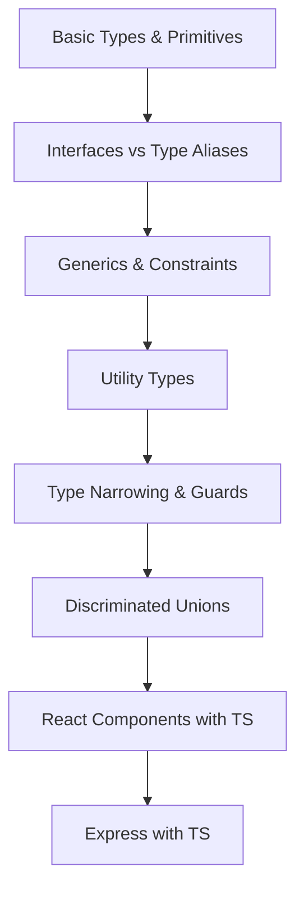

# Chapter 14: TypeScript

> **Previous:** [13-security](./13-security.md) | **Next:** [15-nextjs](./15-nextjs.md)

## Learning Objectives

> **One-Sentence Takeaway:** TypeScript adds static type checking with interfaces, types, generics, and utility types on top of JavaScript.

<!-- Image Gallery -->
<section class="lesson-visuals" aria-label="Visual learning resources">
  <header><span>VISUAL LEARNING</span><h2>See it. Review it. Remember it.</h2></header>
  <a class="lesson-visual-card" href="../../../assets/images/lessons/web-development/14-typescript/handwritten-notes.svg" target="_blank" rel="noopener">
    
    <span><strong>Handwritten notes</strong>Condensed notes for deliberate review.</span>
  </a>
  <a class="lesson-visual-card" href="../../../assets/images/lessons/web-development/14-typescript/sticky-notes.svg" target="_blank" rel="noopener">
    
    <span><strong>Sticky-note revision</strong>Fast recall prompts for revision.</span>
  </a>
  <a class="lesson-visual-card" href="../../../assets/images/lessons/web-development/14-typescript/visual-explanation.svg" target="_blank" rel="noopener">
    
    <span><strong>Visual concept guide</strong>A connected explanation of the key ideas.</span>
  </a>
</section>
<!-- End Image Gallery -->


By the end of this chapter, you will be able to:

## Chapter at a Glance

> **One-Sentence Takeaway:** Interfaces support declaration merging and extension; type aliases support unions and computed properties.

| Topic | Key Insight | Practical Takeaway |
|-------|-------------|-------------------|
|Basic Types|Primitives, tuples, unions, and object types form the foundation|Use `string | number` unions for flexible parameters, tuples for fixed-length arrays|
|Interfaces vs Types|Interfaces extend and merge; types compose via intersections|Use interfaces for public API shapes, types for unions, computed types, and mapped types|
|Generics|Parameters that capture type relationships between inputs and outputs|Use `extends` constraints to restrict generic type parameters while preserving flexibility|
|Utility Types|`Partial`,`Pick`,`Omit`,`Record` transform existing types|Compose utility types for derived types that stay in sync with the source type|
|Type Narrowing|TypeScript narrows union types through control flow analysis|Use discriminated unions with a `kind` property for exhaustive switch-case narrowing|
|React with TS|Type props, state, hooks, and components for end-to-end type safety|Define an interface for every component's props — even simple ones|

## Chapter Roadmap

> **One-Sentence Takeaway:** Generics create reusable components that work with any type while preserving type safety.




- Use TypeScript types, interfaces, and generics effectively
- Differentiate between types, interfaces, and type aliases
- Apply utility types and type narrowing patterns
- Write type-safe React components and API routes
- Configure TypeScript for strict mode

## 14.1 Setting Up TypeScript

```bash
# Initialize TypeScript in a project
npm install typescript --save-dev
npx tsc --init

# Key tsconfig.json options for strict mode
```

```json
{
  "compilerOptions": {
    "target": "ES2022",
    "module": "ESNext",
    "moduleResolution": "bundler",
    "strict": true,
    "esModuleInterop": true,
    "skipLibCheck": true,
    "forceConsistentCasingInFileNames": true,
    "outDir": "./dist",
    "rootDir": "./src",
    "declaration": true,
    "declarationMap": true,
    "sourceMap": true,
    "noUncheckedIndexedAccess": true
  },
  "include": ["src/**/*"],
  "exclude": ["node_modules", "dist"]
}
```

```typescript
// Compile and run
// npx tsc --noEmit    # Type-check only
// npx tsc             # Compile to JavaScript
// npx tsx src/index.ts # Run directly (tsx = TypeScript Execute)
```

## 14.2 Basic Types

> **One-Sentence Takeaway:** Utility types like `Partial`, `Pick`, and `Omit` derive new types from existing ones without duplication.


```typescript
// Primitive types
let name: string = "Alice";
let age: number = 30;
let isActive: boolean = true;
let id: string | number = "abc123"; // Union type

// Arrays and Tuples
let scores: number[] = [95, 87, 92];
let pair: [string, number] = ["Alice", 30]; // Tuple
let optional: [string, number?] = ["Alice"]; // Optional element

// Object types
interface User {
  readonly id: string; // Read-only property
  name: string;
  email: string;
  age?: number; // Optional property
}

// Type aliases
type Point = {
  x: number;
  y: number;
};
```

## 14.2 Interfaces vs Types

> **One-Sentence Takeaway:** Type narrowing through typeof, instanceof, and discriminated unions refines types within control flow branches.

```typescript
// Interfaces - extendable, declaration merging
interface Animal {
  name: string;
}
interface Bear extends Animal {
  honey: boolean;
}
interface Animal {
  legs: number; // Declaration merging
}
// Result: Animal has name AND legs

// Types - closed, computed properties
type AnimalType = { name: string };
type BearType = AnimalType & { honey: boolean }; // Intersection
// Cannot reopen type: Type 'BearType' is already defined

// When to use each:
// Interface: Public API shapes, objects that will be extended
// Type: Union types, computed types, mapped types
type Status = "active" | "inactive" | "pending";
type Stringify<T> = { [K in keyof T]: string };
```

## 14.3 Generics

> **One-Sentence Takeaway:** TypeScript integrates with React and Express for full-stack type safety from database to UI.

```typescript
// Generic function
function first<T>(arr: T[]): T | undefined {
  return arr[0];
}

const num = first([1, 2, 3]); // number
const str = first(["a", "b"]); // string

// Generic interface
interface Repository<T extends { id: string }> {
  getById(id: string): Promise<T | null>;
  create(data: Omit<T, "id">): Promise<T>;
  update(id: string, data: Partial<T>): Promise<T>;
  delete(id: string): Promise<void>;
}

// Generic constraints
function getProperty<T, K extends keyof T>(obj: T, key: K): T[K] {
  return obj[key];
}

const user = { name: "Alice", age: 30 };
getProperty(user, "name"); // string
getProperty(user, "age"); // number
```

## 14.4 Utility Types

```typescript
interface User {
  id: string;
  name: string;
  email: string;
  role: "admin" | "user";
  createdAt: Date;
}

// Partial - all properties optional
type UpdateUser = Partial<User>;

// Required - all properties required
type CompleteUser = Required<User>;

// Pick - select specific properties
type UserSummary = Pick<User, "id" | "name" | "email">;

// Omit - exclude properties
type CreateUser = Omit<User, "id" | "createdAt">;

// Record - key-value map
type UserMap = Record<string, User>;

// Extract - union member filtering
type AdminOnly = Extract<User["role"], "admin">;

// Exclude - remove from union
type NonAdmin = Exclude<User["role"], "admin">;

// Readonly
type ImmutableUser = Readonly<User>;

// ReturnType
type CreateUserReturn = ReturnType<typeof createUser>;

// Awaited - unwrap promises
type UserData = Awaited<ReturnType<typeof fetchUser>>;

// NonNullable
type Maybe = string | null | undefined;
type Definitely = NonNullable<Maybe>; // string
```

## 14.5 Type Narrowing

```typescript
// Type guards
function isString(value: unknown): value is string {
  return typeof value === "string";
}

function process(value: string | number) {
  if (isString(value)) {
    return value.toUpperCase(); // TypeScript knows this is string
  }
  return value.toFixed(2); // TypeScript knows this is number
}

// Discriminated unions
type Shape =
  | { kind: "circle"; radius: number }
  | { kind: "rectangle"; width: number; height: number }
  | { kind: "triangle"; base: number; height: number };

function area(shape: Shape): number {
  switch (shape.kind) {
    case "circle":
      return Math.PI * shape.radius ** 2;
    case "rectangle":
      return shape.width * shape.height;
    case "triangle":
      return (shape.base * shape.height) / 2;
  }
}

// Assertion functions
function assertIsDefined<T>(value: T): asserts value is NonNullable<T> {
  if (value === null || value === undefined) {
    throw new Error("Value must be defined");
  }
}
```

## 14.6 TypeScript with React

```typescript
import { useState, useCallback, FC, ReactNode } from "react";

// Component props
interface ButtonProps {
  variant?: "primary" | "secondary" | "danger";
  size?: "sm" | "md" | "lg";
  disabled?: boolean;
  children: ReactNode;
  onClick: () => void;
}

const Button: FC<ButtonProps> = ({
  variant = "primary",
  size = "md",
  disabled = false,
  children,
  onClick,
}) => {
  return (
    <button
      onClick={onClick}
      disabled={disabled}
      className={`btn btn-${variant} btn-${size}`}
    >
      {children}
    </button>
  );
};

// Generic component
interface ListProps<T> {
  items: T[];
  renderItem: (item: T) => ReactNode;
}

function List<T>({ items, renderItem }: ListProps<T>) {
  return <ul>{items.map(renderItem)}</ul>;
}

// Usage
<List items={users} renderItem={(user) => <li>{user.name}</li>} />;

// Custom hook with types
function useLocalStorage<T>(key: string, initial: T): [T, (value: T) => void] {
  const [stored, setStored] = useState<T>(() => {
    try {
      const item = localStorage.getItem(key);
      return item ? JSON.parse(item) : initial;
    } catch {
      return initial;
    }
  });

  const setValue = useCallback(
    (value: T) => {
      setStored(value);
      localStorage.setItem(key, JSON.stringify(value));
    },
    [key]
  );

  return [stored, setValue];
}
```

## 14.7 Conditional Types and Template Literal Types

```typescript
// Conditional types select a type based on a condition
type IsString<T> = T extends string ? "yes" : "no";
type A = IsString<string>;  // "yes"
type B = IsString<number>;  // "no"

// Filter types from a union
type ExtractStrings<T> = T extends string ? T : never;
type StringsOnly = ExtractStrings<string | number | boolean>; // string

// Infer return type
type Unwrap<T> = T extends Promise<infer U> ? U : T;
type Result1 = Unwrap<Promise<string>>; // string
type Result2 = Unwrap<number>; // number

// Template literal types (TS 4.1+)
type EventName = `on${Capitalize<string>}`;
type ClickEvent = `onClick`; // Valid

type HttpMethod = "GET" | "POST" | "PUT" | "DELETE";
type ApiEndpoint = `/api/${string}`;
type FullRoute = `${HttpMethod} ${ApiEndpoint}`;
// "GET /api/users" | "POST /api/users" | ...

// Mapping with template literals
type CSSProperty = "margin" | "padding";
type CSSDirection = "top" | "right" | "bottom" | "left";
type CSSKey = `${CSSProperty}-${CSSDirection}`;
// "margin-top" | "margin-right" | "margin-bottom" | "margin-left" | ...

// Parsing URL params
type ExtractParam<S extends string> =
  S extends `${string}[${infer Param}]${string}` ? Param : never;
type Param = ExtractParam<"/api/users/[userId]">; // "userId"

// Mapped types with key remapping
type Getters<T> = {
  [K in keyof T as `get${Capitalize<string & K>}`]: () => T[K];
};
type UserGetters = Getters<{ name: string; age: number }>;
// { getName: () => string; getAge: () => number }
```

### Branded Types and Nominal Typing


TypeScript uses structural typing, but branded types simulate nominal typing for type safety.

```typescript
// Branded type pattern
type Brand<K, T> = K & { __brand: T };

type UserId = Brand<string, "UserId">;
type PostId = Brand<string, "PostId">;
type Email = Brand<string, "Email">;

function getUser(id: UserId) {
  return prisma.user.findUnique({ where: { id } });
}

function getPost(id: PostId) {
  return prisma.post.findUnique({ where: { id } });
}

// TypeScript error: Argument of type 'string' is not assignable to parameter of type 'UserId'
const id: string = "abc123";
// getUser(id); // Error!

// Must create branded type explicitly
const userId = "abc123" as UserId;
getUser(userId); // OK

// Flavoring (weak brand) — only structural check, no runtime cost
type Flavor<T, F> = T & { __flavor?: F };
type Meters = Flavor<number, "meters">;
type Seconds = Flavor<number, "seconds">;

function travel(distance: Meters, time: Seconds): Meters {
  return (distance / (time as number)) as Meters;
}

travel(100 as Meters, 9.58 as Seconds);
```

### satisfies Operator Deep Dive


The `satisfies` operator (TS 4.9+) checks type compatibility without altering inference.

```typescript
// Without satisfies — type widening loses literal info
const palette1: Record<string, string | string[]> = {
  red: ["255", "0", "0"],
  green: "#00ff00",
};
palette1.red.map(Number); // Error: string | string[] may not have .map

// With satisfies — checks type but keeps narrow inference
const palette2 = {
  red: ["255", "0", "0"],
  green: "#00ff00",
} satisfies Record<string, string | string[]>;

palette2.red.map(Number); // OK — inferred as string[]
palette2.green.toUpperCase(); // OK — inferred as string

// Useful for connecting objects to types without losing precision
type Color = "red" | "green" | "blue";
type ColorMap = Record<Color, { hex: string; rgb: [number, number, number] }>;

const colors = {
  red: { hex: "#ff0000", rgb: [255, 0, 0] as const },
  green: { hex: "#00ff00", rgb: [0, 255, 0] as const },
  blue: { hex: "#0000ff", rgb: [0, 0, 255] as const },
} satisfies ColorMap;

colors.red.rgb; // Inferred as readonly [255, 0, 0], not number[]
```

## 14.9 TypeScript with Express

```typescript
import express, { Request, Response, NextFunction, RequestHandler } from "express";
import { z } from "zod";

interface AuthenticatedRequest extends Request {
  user?: {
    id: string;
    role: "admin" | "user";
  };
}

// Typed request handler
type AsyncHandler = (
  req: AuthenticatedRequest,
  res: Response,
  next: NextFunction
) => Promise<void>;

function asyncHandler(fn: AsyncHandler): RequestHandler {
  return (req, res, next) => Promise.resolve(fn(req as AuthenticatedRequest, res, next)).catch(next);
}

// Typed router
const router = express.Router();

const createUserSchema = z.object({
  name: z.string(),
  email: z.string().email(),
});

router.post(
  "/users",
  asyncHandler(async (req, res) => {
    const data = createUserSchema.parse(req.body);
    const user = await createUser(data);
    res.status(201).json({ data: user });
  })
);
```


> [!TIP]
> Use `satisfies` operator (TS 4.9+) to check that a value matches a type without changing its inferred type: `const palette = { red: [255,0,0] } satisfies Record<string, number[]>`.

> [!WARNING]
> `any` disables type checking entirely. Use `unknown` instead when you cannot know the type — it forces type narrowing before use.

> [!REMEMBER]
> Enable `strict: true` in `tsconfig.json` — it enables `strictNullChecks`, `noImplicitAny`, `strictFunctionTypes`, and other critical checks in one flag.


## Concept Comparison Table

| Concept | Description | Use Case |
|---------|-------------|---------|
|Interface vs Type|Extendable, declaration merging, object shapes only|Unions, intersections, computed/mapped types|
|`type` vs `interface` for React Props|Convention — both work|Convention — both work|
|`any` vs `unknown`|Disables all type checking|Forces narrowing before use|
|`as` vs `satisfies`|Type assertion — overrides inference|Type check — preserves inference|
|`enum` vs `as const` object|Runtime value, reverse mapping|Const object with literal union type|

## Quick Reference

| Topic | Key Points |
|-------|-----------|
|Primitive Types|`string`,`number`,`boolean`,`null`,`undefined`,`bigint`,`symbol`,`any`,`unknown`,`never`,`void`|
|Utility Types|`Partial<T>`,`Required<T>`,`Pick<T,K>`,`Omit<T,K>`,`Record<K,V>`,`Readonly<T>`,`ReturnType<T>`,`Awaited<T>`|
|Type Narrowing|`typeof`, `instanceof`, `in`, discriminated unions, type predicates `is`|
|tsconfig Strict|`strict: true` enables `strictNullChecks`, `noImplicitAny`, `strictFunctionTypes`, `strictBindCallApply`|
|React Types|`FC<Props>`, `ReactNode`, `ReactElement`, `RefObject<T>`, `Dispatch<SetStateAction<T>>`|

## Cross-Application Matrix

| Domain | Application | Benefit |
|--------|------------|--------|
|React SPA|Typed props, state, and context|Compile-time error catching for UI components|
|Express API|Typed request handlers, Zod validation types|End-to-end type safety from DB to API response|
|Monorepo|Shared types package consumed by frontend and backend|Single source of truth for data shapes|
|Data Pipeline|Generics for reusable transformers and validators|Type-safe data transformations without casts|
|Library/ SDK|Published types for external consumers|Excellent developer experience for API consumers|

## Chapter Quiz

Test your understanding with these quick questions.

**Q1. When should you use an interface over a type alias?**

- A) Always — interfaces are better
- B) For object shapes that may be extended or merged
- C) For union types
- D) For computed types

<details><summary>Answer&lt;/summary&gt;

**B) Interfaces support declaration merging and extension (`extends`), making them ideal for public API shapes that may be extended later. Types are better for unions, intersections, and computed types.**

</details>

**Q2. What does `Pick<User, 'id' | 'name'>` produce?**

- A) A type with all User properties except id and name
- B) A type with only id and name from User
- C) A type that makes id and name optional
- D) A type identical to User

<details><summary>Answer&lt;/summary&gt;

**B) `Pick` creates a type containing only the specified keys from the source type. `Omit` does the inverse — it excludes the specified keys.**

</details>

**Q3. How do discriminated unions improve type safety?**

- A) They combine multiple types into one
- B) A literal `kind` property lets TypeScript narrow the type within each branch
- C) They replace switch statements
- D) They add runtime type checking

<details><summary>Answer&lt;/summary&gt;

**B) Discriminated unions use a literal property (like `kind`) to distinguish between union members. TypeScript narrows the type within each branch of a switch, ensuring only valid properties are accessed.**

</details>

**Q4. What does enabling `strict: true` in tsconfig do?**

- A) Only enables strictNullChecks
- B) Enables all strict type-checking options including strictNullChecks, noImplicitAny, and strictFunctionTypes
- C) Makes all properties readonly
- D) Disables type checking for JavaScript files

<details><summary>Answer&lt;/summary&gt;

**B) `strict: true` is a convenience flag that enables all strict type-checking family options — critical for catching null reference errors, implicit anys, and function type mismatches at compile time.**

</details>

### TypeScript: Type Guard Generator & Utility Type Builder

```typescript
class TypeGuardGenerator {
  static isString(val: unknown): val is string { return typeof val === "string"; }
  static isNumber(val: unknown): val is number { return typeof val === "number" && !isNaN(val); }
  static isBoolean(val: unknown): val is boolean { return typeof val === "boolean"; }
  static isObject<T extends Record<string, unknown>>(val: unknown, shape: Record<keyof T, (v: unknown) => boolean>): val is T {
    if (typeof val !== "object" || val === null) return false;
    return Object.entries(shape).every(([key, check]) => check((val as Record<string, unknown>)[key]));
  }
  static isArrayOf<T>(val: unknown, check: (v: unknown) => v is T): val is T[] {
    return Array.isArray(val) && val.every(check);
  }
  static isNullable<T>(val: unknown, check: (v: unknown) => v is T): val is T | null | undefined {
    return val == null || check(val);
  }
}

class UtilityTypeBuilder {
  static deepPartial<T>(obj: T): Partial<T> {
    if (typeof obj !== "object" || obj === null) return obj;
    const result: Record<string, any> = {};
    for (const [k, v] of Object.entries(obj))
      result[k] = typeof v === "object" ? UtilityTypeBuilder.deepPartial(v) : v;
    return result as Partial<T>;
  }
  static pick<T, K extends keyof T>(obj: T, ...keys: K[]): Pick<T, K> {
    const result = {} as Pick<T, K>;
    keys.forEach(k => result[k] = obj[k]);
    return result;
  }
}

class DiscriminatedUnionDemo {
  static process(event: { kind: string; data: unknown }): string {
    switch (event.kind) {
      case "click": return `Clicked at ${JSON.stringify(event.data)}`;
      case "focus": return `Focused on ${event.data}`;
      case "scroll": return `Scrolled to position ${event.data}`;
      default: return `Unknown event: ${event.kind}`;
    }
  }
}

console.log("isNumber:", TypeGuardGenerator.isNumber(42));
console.log("Pick:", UtilityTypeBuilder.pick({ a: 1, b: 2, c: 3 }, "a", "c"));
```

## TypeScript Implementation: Type Mapper, Interface-to-Class Transformer, Generic Constraint Checker

```typescript
class TypeScriptTypeMapper {
    static mapJSToTS(type: string): string {
        const map: Record<string, string> = {
            "number": "number", "string": "string", "boolean": "boolean",
            "undefined": "undefined", "null": "null", "object": "Record<string, any>",
            "function": "Function", "symbol": "symbol", "bigint": "bigint",
            "array": "any[]", "promise": "Promise<any>", "date": "Date",
            "map": "Map<any, any>", "set": "Set<any>", "regexp": "RegExp",
            "error": "Error", "buffer": "Buffer",
        };
        return map[type.toLowerCase()] || "unknown";
    }

    static inferFromValue(value: any): string {
        if (value === null) return "null";
        if (value === undefined) return "undefined";
        if (Array.isArray(value)) {
            if (value.length === 0) return "unknown[]";
            const elementTypes = [...new Set(value.map(v => this.inferFromValue(v)))];
            return elementTypes.length === 1 ? `${elementTypes[0]}[]` : `(${elementTypes.join(" | ")})[]`;
        }
        if (typeof value === "object") {
            const keys = Object.keys(value);
            if (keys.length === 0) return "Record<string, unknown>";
            const props = keys.map(k => `${k}: ${this.inferFromValue(value[k])}`).join("; ");
            return `{ ${props} }`;
        }
        return this.mapJSToTS(typeof value);
    }

    static generateInterface(name: string, obj: Record<string, any>): string {
        const props = Object.entries(obj).map(([key, value]) => {
            const tsType = this.inferFromValue(value);
            const optional = value === null || value === undefined ? "?" : "";
            return `  ${key}${optional}: ${tsType};`;
        });
        return `interface ${name} {\n${props.join("\n")}\n}`;
    }
}

class InterfaceToClassTransformer {
    static transform(interfaceCode: string, className?: string): string {
        const nameMatch = interfaceCode.match(/interface\s+(\w+)/);
        if (!nameMatch) return interfaceCode;
        const name = className || nameMatch[1];

        const props: { name: string; type: string; optional: boolean }[] = [];
        const propPattern = /^\s+(\w+)(\??):\s*([^;]+);/gm;
        let match;
        while ((match = propPattern.exec(interfaceCode)) !== null) {
            props.push({ name: match[1], optional: match[2] === "?", type: match[3].trim() });
        }

        const fields = props.map(p => `  private _${p.name}${p.optional ? "?" : ""}: ${p.type};`).join("\n");
        const constructor = `  constructor(data: ${name}) {\n    ${props.map(p => `this._${p.name} = data.${p.name};`).join("\n    ")}\n  }`;
        const getters = props.map(p =>
            `  get ${p.name}(): ${p.type} { return this._${p.name}; }` +
            (p.optional ? "" : `\n  set ${p.name}(value: ${p.type}) { this._${p.name} = value; }`)
        ).join("\n\n");

        return `class ${name} {\n${fields}\n\n${constructor}\n\n${getters}\n}`;
    }
}

class GenericConstraintChecker {
    static validate<T extends Record<string, any>>(obj: T, constraint: { keys?: string[]; types?: Record<string, string> }): { valid: boolean; errors: string[] } {
        const errors: string[] = [];

        if (constraint.keys) {
            for (const key of constraint.keys) {
                if (!(key in obj)) errors.push(`Missing required key: "${key}"`);
            }
        }

        if (constraint.types) {
            for (const [key, expectedType] of Object.entries(constraint.types)) {
                if (key in obj) {
                    const actual = typeof obj[key];
                    if (actual !== expectedType) {
                        errors.push(`Key "${key}" expected ${expectedType}, got ${actual}`);
                    }
                }
            }
        }

        return { valid: errors.length === 0, errors };
    }

    static ensureExtends<T, U extends T>(): string { return "Constraint satisfied at compile time"; }
}

class UtilityTypeBuilder {
    static pick<T extends Record<string, any>, K extends keyof T>(obj: T, ...keys: K[]): Pick<T, K> {
        const result = {} as Pick<T, K>;
        for (const key of keys) result[key] = obj[key];
        return result;
    }

    static omit<T extends Record<string, any>, K extends keyof T>(obj: T, ...keys: K[]): Omit<T, K> {
        const result = { ...obj };
        for (const key of keys) delete result[key];
        return result;
    }

    static partial<T extends Record<string, any>>(obj: T): Partial<T> {
        return { ...obj };
    }

    static readonly<T extends Record<string, any>>(obj: T): Readonly<T> {
        return Object.freeze({ ...obj });
    }

    static record<K extends string | number | symbol, V>(keys: K[], value: V): Record<K, V> {
        return keys.reduce((acc, k) => ({ ...acc, [k]: value }), {} as Record<K, V>);
    }
}

// Demo
const userObj = { id: 1, name: "Alice", email: "alice@example.com", roles: ["admin"], metadata: { lastLogin: "2026-01-01" } };
console.log(TypeScriptTypeMapper.generateInterface("User", userObj));
const interfaceCode = "interface Person { name: string; age: number; email?: string; }";
console.log("Class:\n", InterfaceToClassTransformer.transform(interfaceCode, "Person"));
console.log("Pick:", JSON.stringify(UtilityTypeBuilder.pick(userObj, "id", "name")));
console.log("Constraint:", JSON.stringify(GenericConstraintChecker.validate(userObj, { keys: ["id", "name", "email"], types: { id: "number", name: "string" } })));
```


// typescript
// fullstack-frontend-backend implementation

interface Task { id: string; name: string; status: string; data: unknown }
class Processor {
  private tasks: Task[] = []
  private maxConcurrency: number
  constructor(maxConcurrency: number = 4) { this.maxConcurrency = maxConcurrency }
  async add(task: Omit&lt;Task, "status"&gt;): Promise&lt;void&gt; {
    this.tasks.push({ ...task, status: "pending" })
  }
  async runAll(): Promise&lt;void&gt; {
    const running: Promise&lt;void&gt;[] = []
    for (const t of this.tasks) {
      if (running.length >= this.maxConcurrency) { await Promise.race(running) }
      const p = this.execute(t).finally(() => { const i = running.indexOf(p); if (i >= 0) running.splice(i, 1) })
      running.push(p)
    }
    await Promise.all(running)
  }
  private async execute(t: Task): Promise&lt;void&gt; {
    t.status = "running"
    await new Promise(r => setTimeout(r, 10))
    t.status = "done"
  }
  getResults(): Task[] { return this.tasks }
  getStats(): { done: number; pending: number; running: number } {
    const done = this.tasks.filter(t => t.status === "done").length
    const pending = this.tasks.filter(t => t.status === "pending").length
    const running = this.tasks.filter(t => t.status === "running").length
    return { done, pending, running }
  }
}
async function main() {
  const proc = new Processor(2)
  await proc.add({ id: '1', name: 'typescript', data: { topic: 'fullstack-frontend-backend' } })
  await proc.runAll()
  console.log('Stats:', proc.getStats())
}
main().catch(console.error)
export { Processor, Task }
## Summary

TypeScript adds static type checking to JavaScript, catching errors at compile time. Generics enable reusable, type-safe components. Utility types transform existing types. Type narrowing and discriminated unions make code safer. TypeScript integrates seamlessly with React and Express for end-to-end type safety.

## Exercises

### Review Questions

1. When should you use an interface instead of a type alias?
2. How do generics improve code reusability?
3. What is a discriminated union and when is it useful?

### Application Projects


1. Convert a JavaScript React project to TypeScript
2. Create a generic API client with typed responses
3. Build a type-safe event emitter using generics

4. Create a type-safe event emitter using generics where each event name maps to its payload type: `emit("userLogin", { userId: string })`.
5. Build a conditional type that extracts the resolved value type from a nested `Promise` type: `DeepUnwrap<Promise<Promise<string>>>` should produce `string`.

6. Create a branded type system for a banking app with `AccountId`, `TransactionId`, and `Currency` branded types. Write functions that accept only the correct branded types at compile time.
7. Implement a `satisfies`-based configuration validator that checks a config object against a `Record<string, string | number | boolean>` type while preserving the literal types of each property for autocomplete.

### Challenge Project


Build a type-safe ORM-like query builder using TypeScript generics, template literal types, and mapped types. Support typed `where` clauses, `select` projections, `join` inference, and return types that match the query structure.

### Practical Takeaways


1. **Enable `strict: true`** — it activates strictNullChecks, noImplicitAny, and other critical checks in one flag.
2. **Prefer `interface` for public APIs** — interfaces support declaration merging and extension, making them ideal for library consumers.
3. **Use `unknown` over `any`** — `unknown` forces type narrowing before use, preventing runtime errors. Reserve `any` for migration scenarios only.
4. **Leverage `satisfies`** — the `satisfies` operator (TS 4.9+) checks type compatibility without changing the inferred type.
5. **Compose utility types** — chain `Partial`, `Pick`, `Omit`, and `Record` to derive types that stay in sync with their source.
