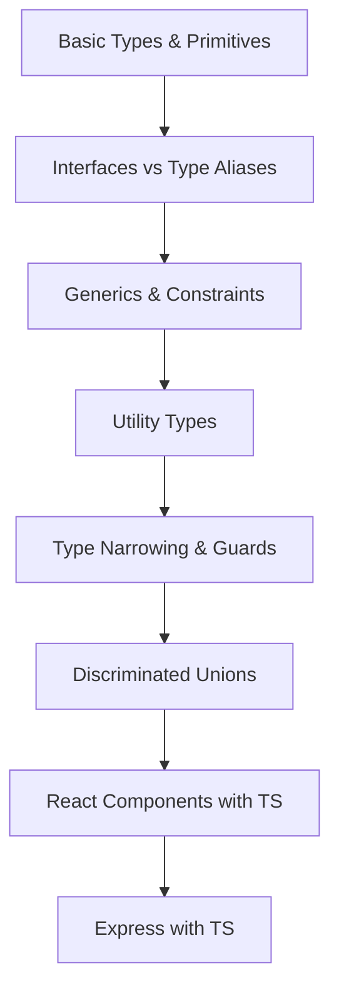

# Chapter 14: TypeScript

> **Previous:** [13-security](./13-security.md) | **Next:** [15-nextjs](./15-nextjs.md)

## Learning Objectives

> **One-Sentence Takeaway:** TypeScript adds static type checking with interfaces, types, generics, and utility types on top of JavaScript.

By the end of this chapter, you will be able to:

## Chapter at a Glance

> **One-Sentence Takeaway:** Interfaces support declaration merging and extension; type aliases support unions and computed properties.

| Topic | Key Insight | Practical Takeaway |
|-------|-------------|-------------------|
|Basic Types|Primitives, tuples, unions, and object types form the foundation|Use `string | number` unions for flexible parameters, tuples for fixed-length arrays|
|Interfaces vs Types|Interfaces extend and merge; types compose via intersections|Use interfaces for public API shapes, types for unions, computed types, and mapped types|
|Generics|Parameters that capture type relationships between inputs and outputs|Use `extends` constraints to restrict generic type parameters while preserving flexibility|
|Utility Types|`Partial`,`Pick`,`Omit`,`Record` transform existing types|Compose utility types for derived types that stay in sync with the source type|
|Type Narrowing|TypeScript narrows union types through control flow analysis|Use discriminated unions with a `kind` property for exhaustive switch-case narrowing|
|React with TS|Type props, state, hooks, and components for end-to-end type safety|Define an interface for every component's props — even simple ones|

## Chapter Roadmap

> **One-Sentence Takeaway:** Generics create reusable components that work with any type while preserving type safety.




- Use TypeScript types, interfaces, and generics effectively
- Differentiate between types, interfaces, and type aliases
- Apply utility types and type narrowing patterns
- Write type-safe React components and API routes
- Configure TypeScript for strict mode

## 14.1 Basic Types

> **One-Sentence Takeaway:** Utility types like `Partial`, `Pick`, and `Omit` derive new types from existing ones without duplication.


```typescript
// Primitive types
let name: string = "Alice";
let age: number = 30;
let isActive: boolean = true;
let id: string | number = "abc123"; // Union type

// Arrays and Tuples
let scores: number[] = [95, 87, 92];
let pair: [string, number] = ["Alice", 30]; // Tuple
let optional: [string, number?] = ["Alice"]; // Optional element

// Object types
interface User {
  readonly id: string; // Read-only property
  name: string;
  email: string;
  age?: number; // Optional property
}

// Type aliases
type Point = {
  x: number;
  y: number;
};
```

## 14.2 Interfaces vs Types

> **One-Sentence Takeaway:** Type narrowing through typeof, instanceof, and discriminated unions refines types within control flow branches.

```typescript
// Interfaces - extendable, declaration merging
interface Animal {
  name: string;
}
interface Bear extends Animal {
  honey: boolean;
}
interface Animal {
  legs: number; // Declaration merging
}
// Result: Animal has name AND legs

// Types - closed, computed properties
type AnimalType = { name: string };
type BearType = AnimalType & { honey: boolean }; // Intersection
// Cannot reopen type: Type 'BearType' is already defined

// When to use each:
// Interface: Public API shapes, objects that will be extended
// Type: Union types, computed types, mapped types
type Status = "active" | "inactive" | "pending";
type Stringify<T> = { [K in keyof T]: string };
```

## 14.3 Generics

> **One-Sentence Takeaway:** TypeScript integrates with React and Express for full-stack type safety from database to UI.

```typescript
// Generic function
function first<T>(arr: T[]): T | undefined {
  return arr[0];
}

const num = first([1, 2, 3]); // number
const str = first(["a", "b"]); // string

// Generic interface
interface Repository<T extends { id: string }> {
  getById(id: string): Promise<T | null>;
  create(data: Omit<T, "id">): Promise<T>;
  update(id: string, data: Partial<T>): Promise<T>;
  delete(id: string): Promise<void>;
}

// Generic constraints
function getProperty<T, K extends keyof T>(obj: T, key: K): T[K] {
  return obj[key];
}

const user = { name: "Alice", age: 30 };
getProperty(user, "name"); // string
getProperty(user, "age"); // number
```

## 14.4 Utility Types

```typescript
interface User {
  id: string;
  name: string;
  email: string;
  role: "admin" | "user";
  createdAt: Date;
}

// Partial - all properties optional
type UpdateUser = Partial<User>;

// Required - all properties required
type CompleteUser = Required<User>;

// Pick - select specific properties
type UserSummary = Pick<User, "id" | "name" | "email">;

// Omit - exclude properties
type CreateUser = Omit<User, "id" | "createdAt">;

// Record - key-value map
type UserMap = Record<string, User>;

// Extract - union member filtering
type AdminOnly = Extract<User["role"], "admin">;

// Exclude - remove from union
type NonAdmin = Exclude<User["role"], "admin">;

// Readonly
type ImmutableUser = Readonly<User>;

// ReturnType
type CreateUserReturn = ReturnType<typeof createUser>;

// Awaited - unwrap promises
type UserData = Awaited<ReturnType<typeof fetchUser>>;

// NonNullable
type Maybe = string | null | undefined;
type Definitely = NonNullable<Maybe>; // string
```

## 14.5 Type Narrowing

```typescript
// Type guards
function isString(value: unknown): value is string {
  return typeof value === "string";
}

function process(value: string | number) {
  if (isString(value)) {
    return value.toUpperCase(); // TypeScript knows this is string
  }
  return value.toFixed(2); // TypeScript knows this is number
}

// Discriminated unions
type Shape =
  | { kind: "circle"; radius: number }
  | { kind: "rectangle"; width: number; height: number }
  | { kind: "triangle"; base: number; height: number };

function area(shape: Shape): number {
  switch (shape.kind) {
    case "circle":
      return Math.PI * shape.radius ** 2;
    case "rectangle":
      return shape.width * shape.height;
    case "triangle":
      return (shape.base * shape.height) / 2;
  }
}

// Assertion functions
function assertIsDefined<T>(value: T): asserts value is NonNullable<T> {
  if (value === null || value === undefined) {
    throw new Error("Value must be defined");
  }
}
```

## 14.6 TypeScript with React

```typescript
import { useState, useCallback, FC, ReactNode } from "react";

// Component props
interface ButtonProps {
  variant?: "primary" | "secondary" | "danger";
  size?: "sm" | "md" | "lg";
  disabled?: boolean;
  children: ReactNode;
  onClick: () => void;
}

const Button: FC<ButtonProps> = ({
  variant = "primary",
  size = "md",
  disabled = false,
  children,
  onClick,
}) => {
  return (
    <button
      onClick={onClick}
      disabled={disabled}
      className={`btn btn-${variant} btn-${size}`}
    >
      {children}
    </button>
  );
};

// Generic component
interface ListProps<T> {
  items: T[];
  renderItem: (item: T) => ReactNode;
}

function List<T>({ items, renderItem }: ListProps<T>) {
  return <ul>{items.map(renderItem)}</ul>;
}

// Usage
<List items={users} renderItem={(user) => <li>{user.name}</li>} />;

// Custom hook with types
function useLocalStorage<T>(key: string, initial: T): [T, (value: T) => void] {
  const [stored, setStored] = useState<T>(() => {
    try {
      const item = localStorage.getItem(key);
      return item ? JSON.parse(item) : initial;
    } catch {
      return initial;
    }
  });

  const setValue = useCallback(
    (value: T) => {
      setStored(value);
      localStorage.setItem(key, JSON.stringify(value));
    },
    [key]
  );

  return [stored, setValue];
}
```

## 14.7 TypeScript with Express

```typescript
import express, { Request, Response, NextFunction, RequestHandler } from "express";
import { z } from "zod";

interface AuthenticatedRequest extends Request {
  user?: {
    id: string;
    role: "admin" | "user";
  };
}

// Typed request handler
type AsyncHandler = (
  req: AuthenticatedRequest,
  res: Response,
  next: NextFunction
) => Promise<void>;

function asyncHandler(fn: AsyncHandler): RequestHandler {
  return (req, res, next) => Promise.resolve(fn(req as AuthenticatedRequest, res, next)).catch(next);
}

// Typed router
const router = express.Router();

const createUserSchema = z.object({
  name: z.string(),
  email: z.string().email(),
});

router.post(
  "/users",
  asyncHandler(async (req, res) => {
    const data = createUserSchema.parse(req.body);
    const user = await createUser(data);
    res.status(201).json({ data: user });
  })
);
```


> [!TIP]
> Use `satisfies` operator (TS 4.9+) to check that a value matches a type without changing its inferred type: `const palette = { red: [255,0,0] } satisfies Record<string, number[]>`.

> [!WARNING]
> `any` disables type checking entirely. Use `unknown` instead when you cannot know the type — it forces type narrowing before use.

> [!REMEMBER]
> Enable `strict: true` in `tsconfig.json` — it enables `strictNullChecks`, `noImplicitAny`, `strictFunctionTypes`, and other critical checks in one flag.


## Concept Comparison Table

| Concept | Description | Use Case |
|---------|-------------|---------|
|Interface vs Type|Extendable, declaration merging, object shapes only|Unions, intersections, computed/mapped types|
|`type` vs `interface` for React Props|Convention — both work|Convention — both work|
|`any` vs `unknown`|Disables all type checking|Forces narrowing before use|
|`as` vs `satisfies`|Type assertion — overrides inference|Type check — preserves inference|
|`enum` vs `as const` object|Runtime value, reverse mapping|Const object with literal union type|

## Quick Reference

| Topic | Key Points |
|-------|-----------|
|Primitive Types|`string`,`number`,`boolean`,`null`,`undefined`,`bigint`,`symbol`,`any`,`unknown`,`never`,`void`|
|Utility Types|`Partial<T>`,`Required<T>`,`Pick<T,K>`,`Omit<T,K>`,`Record<K,V>`,`Readonly<T>`,`ReturnType<T>`,`Awaited<T>`|
|Type Narrowing|`typeof`, `instanceof`, `in`, discriminated unions, type predicates `is`|
|tsconfig Strict|`strict: true` enables `strictNullChecks`, `noImplicitAny`, `strictFunctionTypes`, `strictBindCallApply`|
|React Types|`FC<Props>`, `ReactNode`, `ReactElement`, `RefObject<T>`, `Dispatch<SetStateAction<T>>`|

## Cross-Application Matrix

| Domain | Application | Benefit |
|--------|------------|--------|
|React SPA|Typed props, state, and context|Compile-time error catching for UI components|
|Express API|Typed request handlers, Zod validation types|End-to-end type safety from DB to API response|
|Monorepo|Shared types package consumed by frontend and backend|Single source of truth for data shapes|
|Data Pipeline|Generics for reusable transformers and validators|Type-safe data transformations without casts|
|Library/ SDK|Published types for external consumers|Excellent developer experience for API consumers|

## Chapter Quiz

Test your understanding with these quick questions.

**Q1. When should you use an interface over a type alias?**

- A) Always — interfaces are better
- B) For object shapes that may be extended or merged
- C) For union types
- D) For computed types

<details><summary>Answer</summary>

**B) Interfaces support declaration merging and extension (`extends`), making them ideal for public API shapes that may be extended later. Types are better for unions, intersections, and computed types.**

</details>

**Q2. What does `Pick<User, 'id' | 'name'>` produce?**

- A) A type with all User properties except id and name
- B) A type with only id and name from User
- C) A type that makes id and name optional
- D) A type identical to User

<details><summary>Answer</summary>

**B) `Pick` creates a type containing only the specified keys from the source type. `Omit` does the inverse — it excludes the specified keys.**

</details>

**Q3. How do discriminated unions improve type safety?**

- A) They combine multiple types into one
- B) A literal `kind` property lets TypeScript narrow the type within each branch
- C) They replace switch statements
- D) They add runtime type checking

<details><summary>Answer</summary>

**B) Discriminated unions use a literal property (like `kind`) to distinguish between union members. TypeScript narrows the type within each branch of a switch, ensuring only valid properties are accessed.**

</details>

**Q4. What does enabling `strict: true` in tsconfig do?**

- A) Only enables strictNullChecks
- B) Enables all strict type-checking options including strictNullChecks, noImplicitAny, and strictFunctionTypes
- C) Makes all properties readonly
- D) Disables type checking for JavaScript files

<details><summary>Answer</summary>

**B) `strict: true` is a convenience flag that enables all strict type-checking family options — critical for catching null reference errors, implicit anys, and function type mismatches at compile time.**

</details>

## Summary

TypeScript adds static type checking to JavaScript, catching errors at compile time. Generics enable reusable, type-safe components. Utility types transform existing types. Type narrowing and discriminated unions make code safer. TypeScript integrates seamlessly with React and Express for end-to-end type safety.

## Exercises

### Review Questions

1. When should you use an interface instead of a type alias?
2. How do generics improve code reusability?
3. What is a discriminated union and when is it useful?

### Application Projects

1. Convert a JavaScript React project to TypeScript
2. Create a generic API client with typed responses
3. Build a type-safe event emitter using generics

### Challenge Project

Build a type-safe ORM-like query builder using TypeScript generics, template literal types, and mapped types. Support typed `where` clauses, `select` projections, `join` inference, and return types that match the query structure.
