# Chapter 15: Next.js

> **Previous:** [14-typescript](./14-typescript.md) | **Next:** [16-testing-web](./16-testing-web.md)

## Learning Objectives

> **One-Sentence Takeaway:** Next.js App Router uses file-based routing with nested layouts that persist across navigations.

By the end of this chapter, you will be able to:

## Chapter at a Glance

> **One-Sentence Takeaway:** Next.js supports SSR, SSG, ISR, and client-side rendering — choose based on data freshness needs.

| Topic | Key Insight | Practical Takeaway |
|-------|-------------|-------------------|
|App Router|File-based routing with nested layouts, loading states, error boundaries|Use `layout.tsx` for persistent UI (navbars, sidebars), `page.tsx` for route content|
|Rendering|SSR, SSG, ISR, and client rendering serve different use cases|Default to SSG/ISR for public content, SSR for personalized pages, client for highly interactive UI|
|Data Fetching|Server Components fetch directly; client components use SWR/React Query|Fetch in Server Components by default to eliminate client waterfalls|
|API Routes|Route handlers in `/api/*` replace separate backend servers|Use for lightweight BFF (Backend for Frontend) patterns, not for full API backends|
|Middleware|Edge functions that intercept requests before they reach routes|Good for auth checks, redirects, i18n — but keep logic minimal for low latency|
|SEO|Metadata API, sitemaps, and Open Graph tags improve search visibility|Generate metadata dynamically in `generateMetadata` for each page|

## Chapter Roadmap

> **One-Sentence Takeaway:** Server Components fetch data on the server, reducing client JavaScript bundle size.

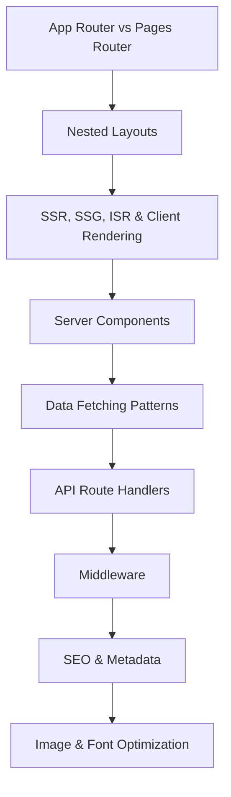


- Set up a Next.js project with App Router
- Implement SSR, SSG, ISR, and client-side rendering
- Create API routes and middleware
- Optimize images, fonts, and metadata for SEO
- Implement dynamic imports and code splitting
- Deploy Next.js applications to production

## 15.1 App Router vs Pages Router

> **One-Sentence Takeaway:** API Routes in the App Router replace separate backend servers for lightweight use cases.


```typescript
// App Router (Next.js 13+) - file-based routing with layouts
// app/page.tsx       -> /
// app/about/page.tsx -> /about
// app/blog/[slug]/page.tsx -> /blog/hello-world
// app/api/tasks/route.ts -> /api/tasks

// Layouts persist across navigations
// app/layout.tsx
export default function RootLayout({ children }: { children: React.ReactNode }) {
  return (
    <html lang="en">
      <body>
        <Navbar />
        <main>{children}</main>
        <Footer />
      </body>
    </html>
  );
}

// Nested layout
// app/dashboard/layout.tsx
export default function DashboardLayout({ children }: { children: React.ReactNode }) {
  return (
    <section>
      <Sidebar />
      {children}
    </section>
  );
}
```

## 15.2 Rendering Strategies

> **One-Sentence Takeaway:** Middleware runs at the edge, intercepting requests for auth checks, redirects, and rewrites.

```typescript
// Static Site Generation (SSG) - default, builds at compile time
// app/about/page.tsx
export default function AboutPage() {
  return <h1>About Us</h1>; // Pre-rendered at build time
}

// Server-Side Rendering (SSR) - renders on each request
// app/profile/page.tsx
export default async function ProfilePage() {
  const data = await fetch("https://api.example.com/profile");
  const profile = await data.json();
  return <Profile {...profile} />; // Rendered per request
}
export const dynamic = "force-dynamic";

// Incremental Static Regeneration (ISR) - static + revalidation
// app/blog/[slug]/page.tsx
interface Props {
  params: { slug: string };
}

async function getPost(slug: string) {
  const res = await fetch(`https://api.example.com/posts/${slug}`, {
    next: { revalidate: 3600 }, // Revalidate every hour
  });
  return res.json();
}

export default async function BlogPost({ params }: Props) {
  const post = await getPost(params.slug);
  return (
    <article>
      <h1>{post.title}</h1>
      <div>{post.content}</div>
    </article>
  );
}

// Generate static params for ISR
export async function generateStaticParams() {
  const posts = await fetch("https://api.example.com/posts").then((r) => r.json());
  return posts.map((post: any) => ({ slug: post.slug }));
}
```

## 15.3 Data Fetching Patterns

> **One-Sentence Takeaway:** Next.js provides built-in image optimization, font loading, and SEO metadata management.

```typescript
// Server component - fetch directly
async function getPosts() {
  const res = await fetch("https://api.example.com/posts");
  if (!res.ok) throw new Error("Failed to fetch");
  return res.json();
}

export default async function PostsPage() {
  const posts = await getPosts();
  return (
    <ul>
      {posts.map((post: any) => (
        <li key={post.id}>{post.title}</li>
      ))}
    </ul>
  );
}

// Client component with SWR
"use client";
import useSWR from "swr";

const fetcher = (url: string) => fetch(url).then((r) => r.json());

function UserProfile({ userId }: { userId: string }) {
  const { data, error, isLoading } = useSWR(
    `/api/users/${userId}`,
    fetcher,
    { revalidateOnFocus: false }
  );

  if (isLoading) return <div>Loading...</div>;
  if (error) return <div>Error loading user</div>;
  return <div>{data.name}</div>;
}

// Parallel data fetching
export default async function Dashboard() {
  const [user, projects, tasks] = await Promise.all([
    fetch("/api/user").then((r) => r.json()),
    fetch("/api/projects").then((r) => r.json()),
    fetch("/api/tasks").then((r) => r.json()),
  ]);

  return <DashboardView user={user} projects={projects} tasks={tasks} />;
}
```

## 15.4 API Routes

```typescript
// app/api/tasks/route.ts
import { NextRequest, NextResponse } from "next/server";

// GET /api/tasks
export async function GET(request: NextRequest) {
  const searchParams = request.nextUrl.searchParams;
  const page = parseInt(searchParams.get("page") ?? "1");
  const limit = parseInt(searchParams.get("limit") ?? "20");

  const tasks = await prisma.task.findMany({
    skip: (page - 1) * limit,
    take: limit,
  });
  const total = await prisma.task.count();

  return NextResponse.json({ data: tasks, total, page, limit });
}

// POST /api/tasks
export async function POST(request: NextRequest) {
  const body = await request.json();
  const task = await prisma.task.create({ data: body });
  return NextResponse.json({ data: task }, { status: 201 });
}

// Dynamic route: app/api/tasks/[id]/route.ts
export async function PUT(
  request: NextRequest,
  { params }: { params: { id: string } }
) {
  const body = await request.json();
  const task = await prisma.task.update({
    where: { id: params.id },
    data: body,
  });
  return NextResponse.json({ data: task });
}

export async function DELETE(
  _request: NextRequest,
  { params }: { params: { id: string } }
) {
  await prisma.task.delete({ where: { id: params.id } });
  return new NextResponse(null, { status: 204 });
}
```

## 15.5 Middleware

```typescript
// middleware.ts
import { NextResponse } from "next/server";
import type { NextRequest } from "next/server";

export function middleware(request: NextRequest) {
  const token = request.cookies.get("session")?.value;
  const isAuthPage = request.nextUrl.pathname.startsWith("/login") ||
    request.nextUrl.pathname.startsWith("/register");
  const isApiAuth = request.nextUrl.pathname.startsWith("/api/auth");

  // Redirect to login if not authenticated
  if (!token && !isAuthPage && !isApiAuth) {
    return NextResponse.redirect(new URL("/login", request.url));
  }

  // Redirect to dashboard if already authenticated
  if (token && isAuthPage) {
    return NextResponse.redirect(new URL("/dashboard", request.url));
  }

  return NextResponse.next();
}

export const config = {
  matcher: ["/dashboard/:path*", "/api/protected/:path*", "/login", "/register"],
};
```

## 15.6 SEO and Metadata

```typescript
// app/blog/[slug]/page.tsx
import { Metadata } from "next";

interface Props {
  params: { slug: string };
}

export async function generateMetadata({ params }: Props): Promise<Metadata> {
  const post = await getPost(params.slug);
  return {
    title: post.title,
    description: post.excerpt,
    openGraph: {
      title: post.title,
      description: post.excerpt,
      type: "article",
      publishedTime: post.createdAt,
      authors: [post.author.name],
      images: [{ url: post.coverImage }],
    },
    twitter: {
      card: "summary_large_image",
      title: post.title,
      description: post.excerpt,
    },
    alternates: {
      canonical: `/blog/${params.slug}`,
    },
  };
}

// app/sitemap.ts
export default async function sitemap() {
  const posts = await getPosts();
  const postUrls = posts.map((post: any) => ({
    url: `https://example.com/blog/${post.slug}`,
    lastModified: post.updatedAt,
    changeFrequency: "weekly" as const,
    priority: 0.8,
  }));

  return [
    { url: "https://example.com", lastModified: new Date(), priority: 1.0 },
    { url: "https://example.com/about", priority: 0.5 },
    ...postUrls,
  ];
}
```

## 15.7 Error Handling and Loading States

```typescript
// app/dashboard/error.tsx
"use client";

export default function Error({
  error,
  reset,
}: {
  error: Error & { digest?: string };
  reset: () => void;
}) {
  return (
    <div className="error-container">
      <h2>Something went wrong!</h2>
      <p>{error.message}</p>
      <button onClick={() => reset()}>Try again</button>
    </div>
  );
}

// app/dashboard/loading.tsx
export default function Loading() {
  return (
    <div className="loading-skeleton">
      <div className="skeleton-header" />
      <div className="skeleton-content">
        {Array.from({ length: 3 }).map((_, i) => (
          <div key={i} className="skeleton-card" />
        ))}
      </div>
    </div>
  );
}

// app/dashboard/not-found.tsx
import Link from "next/link";

export default function NotFound() {
  return (
    <div>
      <h2>Page Not Found</h2>
      <p>Could not find the requested dashboard page.</p>
      <Link href="/dashboard">Return to Dashboard</Link>
    </div>
  );
}
```

### Route Groups and Parallel Routes

<a href="../../assets/images/diagrams/web-development/15-nextjs/route-groups-and-parallel-routes-handwritten.svg" target="_blank" rel="noopener">
  
</a>
<a href="../../assets/images/diagrams/web-development/15-nextjs/route-groups-and-parallel-routes-diagram.svg" target="_blank" rel="noopener">
  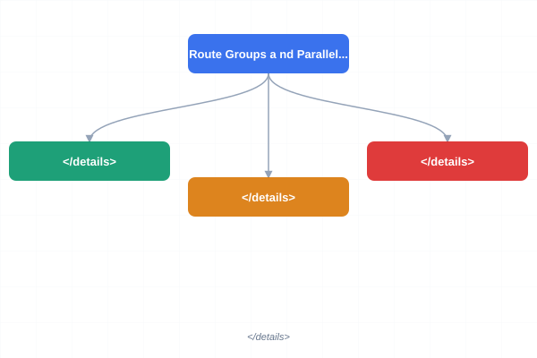
</a>
<a href="../../assets/images/diagrams/web-development/15-nextjs/route-groups-and-parallel-routes-sticky.svg" target="_blank" rel="noopener">
  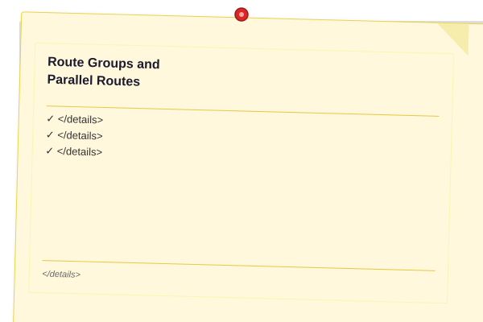
</a>


```typescript
// Route groups organize routes without affecting URL structure
// app/(marketing)/about/page.tsx -> /about
// app/(marketing)/pricing/page.tsx -> /pricing
// app/(dashboard)/dashboard/page.tsx -> /dashboard

// Parallel routes render multiple pages in the same layout
// app/dashboard/@analytics/page.tsx
// app/dashboard/@tasks/page.tsx

// app/dashboard/layout.tsx
export default function DashboardLayout({
  children,
  analytics,
  tasks,
}: {
  children: React.ReactNode;
  analytics: React.ReactNode;
  tasks: React.ReactNode;
}) {
  return (
    <div className="dashboard-grid">
      <main>{children}</main>
      <aside>{analytics}</aside>
      <aside>{tasks}</aside>
    </div>
  );
}

// Intercepting routes for modal patterns
// app/feed/page.tsx -> /feed
// app/feed/(..)photo/[id]/page.tsx -> Intercepts /photo/123 from /feed
```

## 15.8 Image and Font Optimization

```typescript
// Image optimization with next/image
import Image from "next/image";

export default function Profile() {
  return (
    <Image
      src="/avatar.jpg"
      alt="Profile picture"
      width={200}
      height={200}
      priority // Load with high priority for above-the-fold
      placeholder="blur"
      blurDataURL="data:image/jpeg;base64,..."
      sizes="(max-width: 768px) 100vw, 200px"
      quality={85}
    />
  );
}

// Remote images - configure in next.config.js
// next.config.ts
import type { NextConfig } from "next";

const nextConfig: NextConfig = {
  images: {
    remotePatterns: [
      {
        protocol: "https",
        hostname: "images.example.com",
        pathname: "/uploads/**",
      },
    ],
  },
};

export default nextConfig;
```


> [!TIP]
> Use `next: { revalidate: 3600 }` in fetch options for ISR — it gives you static speed with periodic content freshness without deploying.

> [!WARNING]
> Prefetch all `Link` components by default in App Router. Disable prefetch for non-critical links with `prefetch={false}` to save bandwidth.

> [!REMEMBER]
> Server Components cannot use hooks (`useState`, `useEffect`) or browser APIs. Add `'use client'` at the top of any file that needs interactivity.


## Concept Comparison Table

| Concept | Description | Use Case |
|---------|-------------|---------|
|SSR vs SSG vs ISR|Renders per request|Builds once at build time|
|Server vs Client Component|Renders on server, no JS sent|Renders on client, full JS bundle|
|App Router vs Pages Router|Nested layouts, RSC, file-based API routes|Based on React component per page, getServerSideProps|
|Route Handler vs API route|Runs in edge runtime|Runs in Node.js runtime|
|next/image vs img|Auto-webp, lazy load, responsive, blur placeholder|Manual optimization needed|

## Quick Reference

| Topic | Key Points |
|-------|-----------|
|File Conventions|`layout.tsx`, `page.tsx`, `loading.tsx`, `error.tsx`, `not-found.tsx`, `route.tsx`|
|Rendering Methods|`force-dynamic` (SSR), `revalidate` (ISR), `generateStaticParams` (SSG)|
|Data Fetching|`fetch()` in Server Components, `useSWR`/`useQuery` in Client Components|
|Metadata|`export const metadata`, `generateMetadata()`, `generateStaticParams()`|
|Middleware Matcher|`export const config = { matcher: ['/protected/:path*'] }`|

## Cross-Application Matrix

| Domain | Application | Benefit |
|--------|------------|--------|
|Marketing Site|SSG with ISR for content pages|Fast load times with periodic content updates|
|SaaS App|SSR for authenticated dashboard, SSG for landing|Personalized data with fast public pages|
|Blog|ISR with on-demand revalidation|Instant publish with CDN-cached posts|
|E-commerce|ISR for product pages, SSR for cart|Fresh inventory with fast product browsing|
|Admin Panel|Client-side rendering with SWR|Rich interactivity with real-time data|

## Chapter Quiz

Test your understanding with these quick questions.

**Q1. What is the difference between SSR and ISR?**

- A) SSR renders on every request; ISR renders at build time then revalidates periodically
- B) ISR is faster than SSR
- C) SSR is for static sites
- D) ISR requires a database

<details><summary>Answer&lt;/summary&gt;

**A) SSR (Server-Side Rendering) generates HTML for every request. ISR (Incremental Static Regeneration) pre-builds static pages and revalidates them after a configured time period.**

</details>

**Q2. What is the purpose of `layout.tsx` in the App Router?**

- A) To define the page content
- B) To create persistent UI (navbars, sidebars) that do not remount on navigation
- C) To configure build settings
- D) To define API routes

<details><summary>Answer&lt;/summary&gt;

**B) Layouts wrap page content and persist across navigations, preventing remounting of shared UI elements like navbars, sidebars, and footers.**

</details>

**Q3. Why should you prefer Server Components for data fetching?**

- A) They are easier to write
- B) They fetch data on the server, reducing client bundle size and eliminating client waterfalls
- C) They support all React hooks
- D) They render faster on the client

<details><summary>Answer&lt;/summary&gt;

**B) Server Components fetch data during server rendering, so no client JavaScript is needed for data fetching. This reduces bundle size and eliminates the request waterfall effect common in client-side fetching.**

</details>

**Q4. When would you use `force-dynamic` on a page?**

- A) When the page should be statically generated
- B) When the page needs fresh data on every request (personalized content)
- C) When the page has images
- D) When the page uses TypeScript

<details><summary>Answer&lt;/summary&gt;

**B) `force-dynamic` opts a page into SSR (server-side rendering on every request), which is necessary for pages that display user-specific or frequently changing data that cannot be cached.**

</details>

### TypeScript: Next.js SSR/SSG Comparator & Middleware Builder

```typescript
class RenderingStrategy {
  static compare(strategy: "ssr" | "ssg" | "isr" | "csr"): { dataAge: string; freshPerRequest: boolean; cached: boolean; revalidate?: number } {
    const configs = {
      ssr: { dataAge: "Request time", freshPerRequest: true, cached: false },
      ssg: { dataAge: "Build time", freshPerRequest: false, cached: true },
      isr: { dataAge: "Build time + revalidate", freshPerRequest: false, cached: true, revalidate: 60 },
      csr: { dataAge: "Client render time", freshPerRequest: true, cached: false },
    };
    return configs[strategy];
  }
  static recommend(pages: Array<{ path: string; updateFreq: string; userSpecific: boolean }>): Record<string, string> {
    const recommendations: Record<string, string> = {};
    pages.forEach(p => {
      if (p.userSpecific) recommendations[p.path] = "SSR";
      else if (p.updateFreq === "never") recommendations[p.path] = "SSG";
      else recommendations[p.path] = "ISR (revalidate: 60)";
    });
    return recommendations;
  }
}

class MiddlewareBuilder {
  static createRedirect(from: string, to: string, permanent: boolean = false): Record<string, any> {
    return { source: from, destination: to, permanent };
  }
  static createRewrite(from: string, to: string): Record<string, any> {
    return { source: from, destination: to };
  }
  static header(source: string, headers: Record<string, string>): Record<string, any> {
    return { source, headers: Object.entries(headers).map(([k, v]) => ({ key: k, value: v })) };
  }
}

class ServerActionBuilder {
  static create<T>(name: string, fn: (data: T) => Promise<Record<string, any>>): string {
    return `"use server";

export async function ${name}(formData: FormData) {
  const data = Object.fromEntries(formData) as unknown as T;
  return JSON.stringify(await fn(data));
}`;
  }
}

console.log("Strategy:", RenderingStrategy.compare("isr"));
console.log("Recommend:", RenderingStrategy.recommend([{ path: "/dashboard", updateFreq: "daily", userSpecific: true }]));
```

## TypeScript Implementation: SSG/SSR Data Flow Simulator, Dynamic Route Builder, Middleware Chain

```typescript
type RenderStrategy = "ssg" | "ssr" | "isr" | "csr";

interface PageConfig {
    path: string;
    strategy: RenderStrategy;
    revalidate?: number;
    dynamicParams?: boolean;
    generateStaticParams?: () => Record<string, string>[];
}

class RenderingStrategyEngine {
    static simulate(config: PageConfig): { html: string; timestamp: number; strategy: string; cacheHeaders: string } {
        const now = Date.now();
        let html: string;
        let cacheHeaders: string;

        switch (config.strategy) {
            case "ssg":
                html = `<!-- SSG: built at build time --><html><body><h1>${config.path}</h1><p>Generated: ${new Date(now).toISOString()}</p></body></html>`;
                cacheHeaders = "public, max-age=31536000, immutable";
                break;
            case "ssr":
                html = `<!-- SSR: rendered per request --><html><body><h1>${config.path}</h1><p>Rendered: ${new Date(now).toISOString()}</p></body></html>`;
                cacheHeaders = "no-cache, no-store, must-revalidate";
                break;
            case "isr":
                html = `<!-- ISR: revalidated every ${config.revalidate || 60}s --><html><body><h1>${config.path}</h1><p>Generated: ${new Date(now).toISOString()}</p></body></html>`;
                cacheHeaders = `public, s-maxage=${config.revalidate || 60}, stale-while-revalidate=${(config.revalidate || 60) * 10}`;
                break;
            case "csr":
                html = `<!-- CSR: shell only, hydrate client-side --><html><body><div id="root"></div><script src="bundle.js"></script></body></html>`;
                cacheHeaders = "public, max-age=0, must-revalidate";
                break;
            default:
                html = "";
                cacheHeaders = "";
        }

        return { html, timestamp: now, strategy: config.strategy, cacheHeaders };
    }

    static recommend(path: string, updateFreq: "realtime" | "daily" | "weekly" | "static", userSpecific: boolean): PageConfig {
        let strategy: RenderStrategy;
        let revalidate: number | undefined;

        if (userSpecific) {
            strategy = "ssr";
        } else if (updateFreq === "realtime") {
            strategy = "ssr";
        } else if (updateFreq === "daily") {
            strategy = "isr";
            revalidate = 86400;
        } else if (updateFreq === "weekly") {
            strategy = "isr";
            revalidate = 604800;
        } else {
            strategy = "ssg";
        }

        return { path, strategy, revalidate, generateStaticParams: strategy === "ssg" ? () => [] : undefined };
    }
}

class DynamicRoutePathBuilder {
    static build(pattern: string, params: Record<string, string>): string {
        let path = pattern;
        for (const [key, value] of Object.entries(params)) {
            path = path.replace(`[${key}]`, value);
            path = path.replace(`[...${key}]`, value);
        }
        path = path.replace(/\[\[\.\.\.[^\]]+\]\]/g, "");
        return path;
    }

    static match(pattern: string, url: string): Record<string, string> | null {
        const patternParts = pattern.split("/").filter(Boolean);
        const urlParts = url.split("/").filter(Boolean);
        if (patternParts.length !== urlParts.length) return null;

        const params: Record<string, string> = {};
        for (let i = 0; i < patternParts.length; i++) {
            if (patternParts[i].startsWith("[...") || patternParts[i].startsWith("[[...")) {
                const key = patternParts[i].replace(/[[\].]/g, "");
                params[key] = urlParts.slice(i).join("/");
                return params;
            }
            if (patternParts[i].startsWith("[") && patternParts[i].endsWith("]")) {
                const key = patternParts[i].replace(/[[\]]/g, "").split("?")[0];
                params[key] = urlParts[i];
            } else if (patternParts[i] !== urlParts[i]) {
                return null;
            }
        }
        return params;
    }

    static sitemap(routes: string[]): string {
        return `<?xml version="1.0" encoding="UTF-8"?>\n<urlset xmlns="http://www.sitemaps.org/schemas/sitemap/0.9">\n${
            routes.map(r => `  <url><loc>https://example.com${r}</loc><lastmod>${new Date().toISOString()}</lastmod></url>`).join("\n")
        }\n</urlset>`;
    }
}

class NextJSMiddlewareChain {
    private middlewares: Array<{
        pattern: RegExp;
        handler: (req: { url: string; headers: Record<string, string>; cookies: Record<string, string> }) => { redirect?: string; rewrite?: string; headers?: Record<string, string>; next?: boolean }
    }> = [];

    add(pattern: RegExp, handler: typeof this.middlewares[0]["handler"]): void {
        this.middlewares.push({ pattern, handler });
    }

    run(url: string, req: { headers: Record<string, string>; cookies: Record<string, string> }): any {
        for (const mw of this.middlewares) {
            if (mw.pattern.test(url)) {
                const result = mw.handler({ ...req, url });
                if (result.redirect || result.rewrite) return result;
                if (result.headers) Object.assign(req.headers, result.headers);
            }
        }
        return { next: true };
    }

    static authMiddleware(allowedRoles: string[]): typeof this.middlewares[0]["handler"] {
        return (req) => {
            const role = req.cookies["role"] || "guest";
            if (!allowedRoles.includes(role)) return { redirect: "/login" };
            return { next: true };
        };
    }
}

// Demo
console.log("SSG:", RenderingStrategyEngine.simulate({ path: "/about", strategy: "ssg" }).cacheHeaders);
console.log("ISR:", RenderingStrategyEngine.simulate({ path: "/blog", strategy: "isr", revalidate: 60 }).cacheHeaders);
console.log("Recommend /dashboard realtime user:", RenderingStrategyEngine.recommend("/dashboard", "daily", true).strategy);
console.log("Route build:", DynamicRoutePathBuilder.build("/blog/[slug]/[id]", { slug: "hello-world", id: "42" }));
console.log("Match:", DynamicRoutePathBuilder.match("/users/[id]", "/users/5"));
const chain = new NextJSMiddlewareChain();
chain.add(/^\/admin/, NextJSMiddlewareChain.authMiddleware(["admin"]));
console.log("Middleware /admin:", chain.run("/admin", { headers: {}, cookies: { role: "user" } }));
console.log("Middleware /public:", chain.run("/public", { headers: {}, cookies: {} }));
```


// nextjs
// fullstack-frontend-backend implementation

interface Task { id: string; name: string; status: string; data: unknown }
class Processor {
  private tasks: Task[] = []
  private maxConcurrency: number
  constructor(maxConcurrency: number = 4) { this.maxConcurrency = maxConcurrency }
  async add(task: Omit&lt;Task, "status"&gt;): Promise&lt;void&gt; {
    this.tasks.push({ ...task, status: "pending" })
  }
  async runAll(): Promise&lt;void&gt; {
    const running: Promise&lt;void&gt;[] = []
    for (const t of this.tasks) {
      if (running.length >= this.maxConcurrency) { await Promise.race(running) }
      const p = this.execute(t).finally(() => { const i = running.indexOf(p); if (i >= 0) running.splice(i, 1) })
      running.push(p)
    }
    await Promise.all(running)
  }
  private async execute(t: Task): Promise&lt;void&gt; {
    t.status = "running"
    await new Promise(r => setTimeout(r, 10))
    t.status = "done"
  }
  getResults(): Task[] { return this.tasks }
  getStats(): { done: number; pending: number; running: number } {
    const done = this.tasks.filter(t => t.status === "done").length
    const pending = this.tasks.filter(t => t.status === "pending").length
    const running = this.tasks.filter(t => t.status === "running").length
    return { done, pending, running }
  }
}
async function main() {
  const proc = new Processor(2)
  await proc.add({ id: '1', name: 'nextjs', data: { topic: 'fullstack-frontend-backend' } })
  await proc.runAll()
  console.log('Stats:', proc.getStats())
}
main().catch(console.error)
export { Processor, Task }
## Summary

Next.js is a React framework providing SSR, SSG, ISR, and client rendering. The App Router uses file-based routing with nested layouts. Server Components fetch data directly without client JavaScript. API routes handle backend logic. Middleware intercepts requests. SEO is managed through metadata export and sitemap generation.

### Server Actions Deep Dive

<a href="../../assets/images/diagrams/web-development/15-nextjs/server-actions-deep-dive-handwritten.svg" target="_blank" rel="noopener">
  
</a>
<a href="../../assets/images/diagrams/web-development/15-nextjs/server-actions-deep-dive-diagram.svg" target="_blank" rel="noopener">
  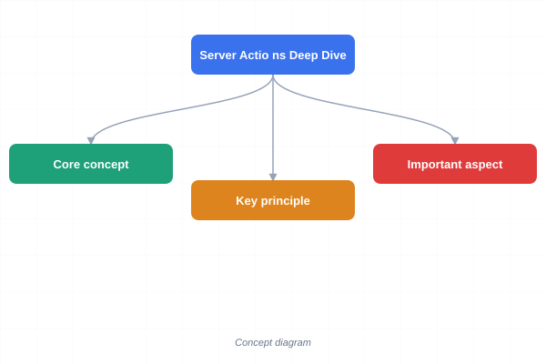
</a>
<a href="../../assets/images/diagrams/web-development/15-nextjs/server-actions-deep-dive-sticky.svg" target="_blank" rel="noopener">
  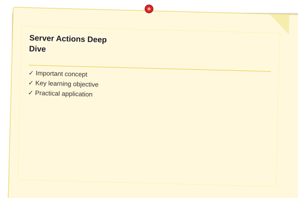
</a>


Server Actions let you mutate server-side data directly from client components.

```typescript
// app/actions/todo.ts — Server Action
"use server";

import { revalidatePath } from "next/cache";

export async function addTodo(formData: FormData) {
  const title = formData.get("title");
  if (!title || typeof title !== "string") {
    throw new Error("Title is required");
  }

  const todo = await prisma.todo.create({
    data: { title, userId: "user_123" },
  });

  revalidatePath("/todos");
  return { success: true, todo };
}
```

```typescript
// app/todos/page.tsx — consuming Server Action
export default function TodoPage() {
  return (
    <form action={addTodo}>
      <input name="title" required />
      <button type="submit">Add</button>
    </form>
  );
}
```

### Caching Deep Dive

<a href="../../assets/images/diagrams/web-development/15-nextjs/caching-deep-dive-handwritten.svg" target="_blank" rel="noopener">
  
</a>
<a href="../../assets/images/diagrams/web-development/15-nextjs/caching-deep-dive-diagram.svg" target="_blank" rel="noopener">
  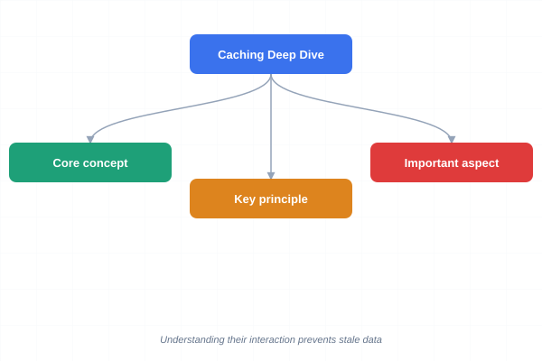
</a>
<a href="../../assets/images/diagrams/web-development/15-nextjs/caching-deep-dive-sticky.svg" target="_blank" rel="noopener">
  
</a>


Next.js has four cache layers. Understanding their interaction prevents stale data.

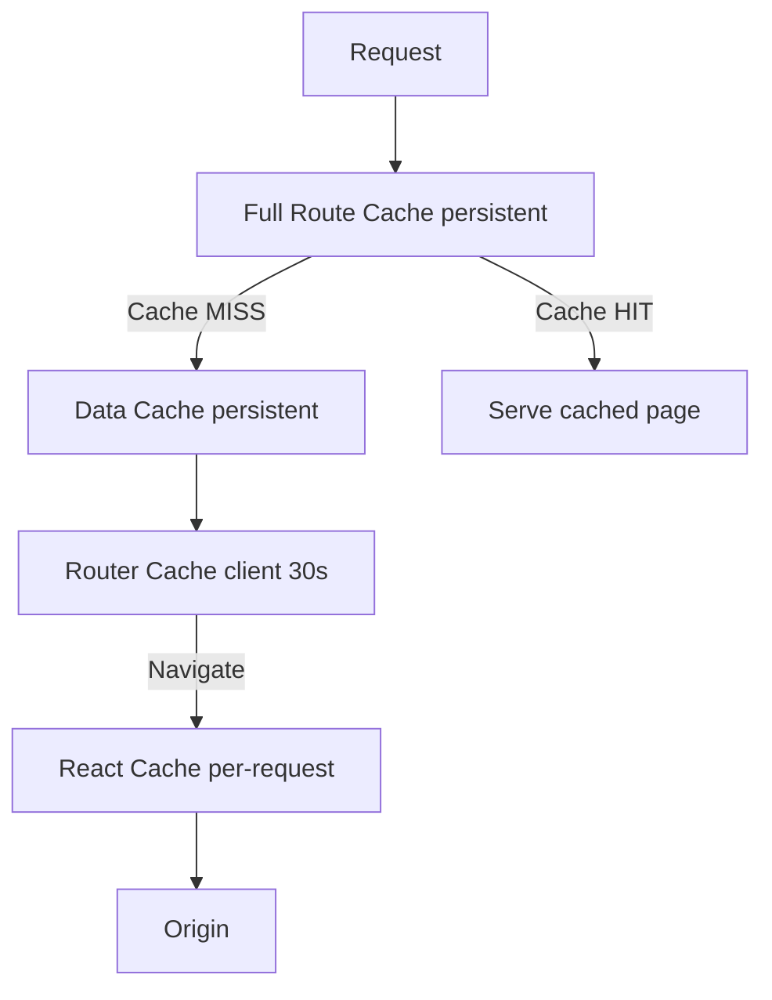

| Cache | Location | Duration | Invalidation |
|-------|----------|----------|-------------|
| Full Route Cache | Server (disk) | Persistent until rebuild | `revalidatePath`, `revalidateTag`, redeploy |
| Data Cache | Server (disk) | Configurable via `next: { revalidate }` or `cache: "no-store"` | `revalidateTag`, time-based |
| Router Cache | Client (memory) | 30s default, 5min for static pages | `router.refresh()`, mutation |
| React Cache | Server (request) | Single request lifetime | Automatic (per-request) |

## Exercises

### Review Questions

1. What is the difference between SSR, SSG, and ISR?
2. How do Server Components reduce client-side JavaScript?
3. Why use next/image instead of a regular img tag?

### Application Projects

<a href="../../assets/images/diagrams/web-development/15-nextjs/application-projects-handwritten.svg" target="_blank" rel="noopener">
  
</a>
<a href="../../assets/images/diagrams/web-development/15-nextjs/application-projects-diagram.svg" target="_blank" rel="noopener">
  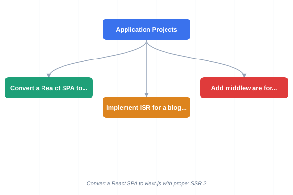
</a>
<a href="../../assets/images/diagrams/web-development/15-nextjs/application-projects-sticky.svg" target="_blank" rel="noopener">
  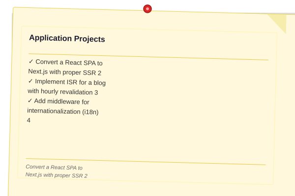
</a>


1. Convert a React SPA to Next.js with proper SSR
2. Implement ISR for a blog with hourly revalidation
3. Add middleware for internationalization (i18n)

4. Implement an error boundary and loading skeleton for a dashboard page that fetches data from three separate API endpoints.
5. Create a modal using intercepting routes that shows a photo detail view when navigated from a gallery page.

### Challenge Project

<a href="../../assets/images/diagrams/web-development/15-nextjs/challenge-project-handwritten.svg" target="_blank" rel="noopener">
  
</a>
<a href="../../assets/images/diagrams/web-development/15-nextjs/challenge-project-diagram.svg" target="_blank" rel="noopener">
  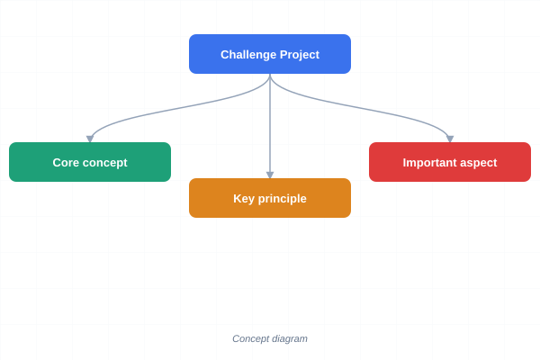
</a>
<a href="../../assets/images/diagrams/web-development/15-nextjs/challenge-project-sticky.svg" target="_blank" rel="noopener">
  
</a>


Build a multi-tenant SaaS application in Next.js with dynamic routing by tenant subdomain, middleware for authentication, ISR for public pages, API routes for data operations, image optimization for user uploads, and a complete sitemap with all public URLs.

### Practical Takeaways

<a href="../../assets/images/diagrams/web-development/15-nextjs/practical-takeaways-handwritten.svg" target="_blank" rel="noopener">
  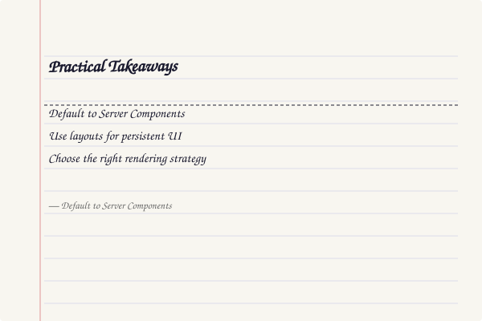
</a>
<a href="../../assets/images/diagrams/web-development/15-nextjs/practical-takeaways-diagram.svg" target="_blank" rel="noopener">
  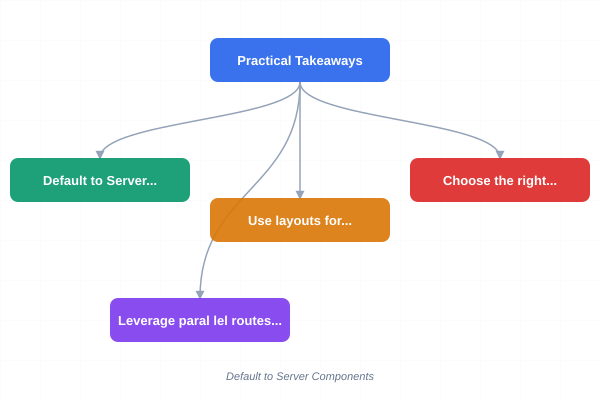
</a>
<a href="../../assets/images/diagrams/web-development/15-nextjs/practical-takeaways-sticky.svg" target="_blank" rel="noopener">
  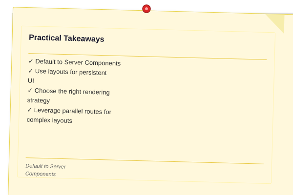
</a>


1. **Default to Server Components** — fetch data in Server Components to eliminate client-side waterfalls and reduce bundle size. Add `"use client"` only for interactivity.
2. **Use layouts for persistent UI** — navbars, sidebars, and footers belong in `layout.tsx` so they do not remount on navigation.
3. **Choose the right rendering strategy** — SSG for static marketing pages, ISR for blog content with periodic updates, SSR for personalized dashboards, client rendering for highly interactive tools.
4. **Leverage parallel routes for complex layouts** — render independent page sections (analytics, tasks, feed) concurrently in the same layout using `@slot` conventions.
5. **Generate metadata dynamically** — use `generateMetadata()` to set per-page title, description, and Open Graph tags from fetched data for optimal SEO.
