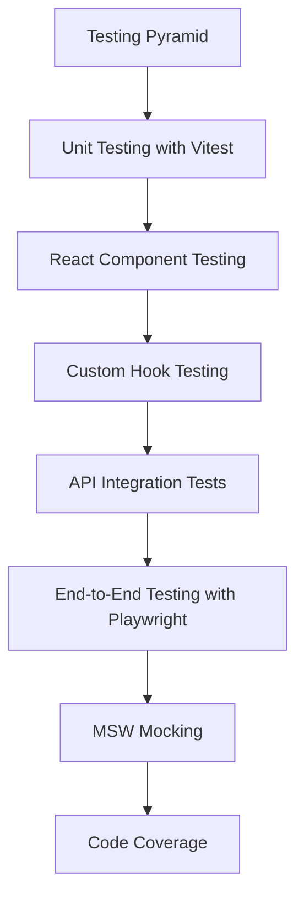
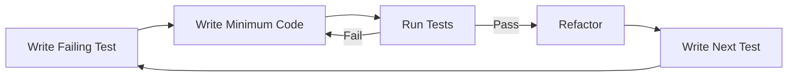

# Chapter 16: Testing

> **Previous:** [15-nextjs](./15-nextjs.md) | **Next:** [17-performance](./17-performance.md)

## Learning Objectives

> **One-Sentence Takeaway:** The testing pyramid recommends many fast unit tests, fewer integration tests, and minimal E2E tests.

By the end of this chapter, you will be able to:

## Chapter at a Glance

> **One-Sentence Takeaway:** Vitest provides fast, parallel test execution with a Jest-compatible API and native Vite integration.

| Topic | Key Insight | Practical Takeaway |
|-------|-------------|-------------------|
|Testing Pyramid|Many unit tests, some integration tests, few E2E tests|Unit tests should be fast and isolated; E2E tests should cover critical user journeys only|
|Vitest|Fast, Vite-native test runner with Jest-compatible API|Use `describe`/`it`/`expect` for structure — Vitest runs tests in parallel by default|
|React Testing|Testing Library tests components from the user's perspective|Query by accessible roles and text, not implementation details like class names or state|
|Integration Tests|Test API endpoints end-to-end with a real or test database|Spin up the server in beforeAll, clean data between tests, use test-specific environment variables|
|Playwright E2E|Browser automation testing real user flows|Use data-testid attributes for selectors, test user registration through task completion|
|MSW Mocking|Mock Service Worker intercepts HTTP requests at the network level|Define handlers for each endpoint, set up in beforeAll, reset between tests|

## Chapter Roadmap

> **One-Sentence Takeaway:** Testing Library encourages testing components by user-visible behavior, not implementation details.




- Write unit tests with Vitest for functions and components
- Test React components with Testing Library
- Implement API integration tests
- Write end-to-end tests with Playwright
- Mock network requests with MSW
- Measure and enforce code coverage

## 16.1 Testing Pyramid

> **One-Sentence Takeaway:** Integration tests verify API endpoints against a real database with setup and teardown in lifecycle hooks.


```
       /\
      /E2E\         Few: Critical user flows
     /------\
    /Integr. \      Some: API and component integration
   /----------\
  /  Unit      \    Many: Isolated functions and logic
 /--------------\
```

## 16.2 Unit Testing with Vitest

> **One-Sentence Takeaway:** Playwright automates real browsers for end-to-end user flow testing.

```typescript
// utils/format.test.ts
import { describe, it, expect } from "vitest";
import { formatDate, capitalize, truncate } from "./format";

describe("formatDate", () => {
  it("formats a date correctly", () => {
    const date = new Date("2024-01-15");
    expect(formatDate(date, "short")).toBe("Jan 15, 2024");
  });

  it("handles invalid dates", () => {
    expect(() => formatDate(new Date("invalid"))).toThrow("Invalid date");
  });
});

describe("capitalize", () => {
  it("capitalizes the first letter", () => {
    expect(capitalize("hello")).toBe("Hello");
  });

  it("handles empty strings", () => {
    expect(capitalize("")).toBe("");
  });

  it("handles already capitalized strings", () => {
    expect(capitalize("Hello")).toBe("Hello");
  });
});

describe("truncate", () => {
  it("truncates strings longer than max length", () => {
    expect(truncate("Hello world", 5)).toBe("Hello...");
  });

  it("returns the full string if under max length", () => {
    expect(truncate("Hi", 5)).toBe("Hi");
  });
});
```

## 16.3 React Component Testing

> **One-Sentence Takeaway:** MSW mocks HTTP requests at the network level, enabling reliable, fast tests without a running backend.

```typescript
// components/TaskCard.test.tsx
import { describe, it, expect, vi } from "vitest";
import { render, screen, fireEvent } from "@testing-library/react";
import { TaskCard } from "./TaskCard";

const mockTask = {
  id: "1",
  title: "Write tests",
  priority: "HIGH",
  dueDate: "2024-02-01T00:00:00Z",
  assignee: { name: "Alice", email: "alice@test.com" },
};

describe("TaskCard", () => {
  it("renders task title", () => {
    render(<TaskCard task={mockTask} />);
    expect(screen.getByText("Write tests")).toBeInTheDocument();
  });

  it("renders priority badge", () => {
    render(<TaskCard task={mockTask} />);
    expect(screen.getByText("HIGH")).toBeInTheDocument();
  });

  it("renders assignee name", () => {
    render(<TaskCard task={mockTask} />);
    expect(screen.getByText("Alice")).toBeInTheDocument();
  });

  it("calls onClick when clicked", () => {
    const onClick = vi.fn();
    render(<TaskCard task={mockTask} onClick={onClick} />);
    fireEvent.click(screen.getByText("Write tests"));
    expect(onClick).toHaveBeenCalledTimes(1);
  });
});
```

### Custom Hook Testing

```typescript
// hooks/useLocalStorage.test.ts
import { renderHook, act } from "@testing-library/react";
import { useLocalStorage } from "./useLocalStorage";

describe("useLocalStorage", () => {
  beforeEach(() => {
    localStorage.clear();
  });

  it("returns initial value when empty", () => {
    const { result } = renderHook(() => useLocalStorage("key", "default"));
    expect(result.current[0]).toBe("default");
  });

  it("stores and retrieves values", () => {
    const { result } = renderHook(() => useLocalStorage("key", ""));
    act(() => {
      result.current[1]("stored value");
    });
    expect(result.current[0]).toBe("stored value");
    expect(localStorage.getItem("key")).toBe('"stored value"');
  });

  it("reads existing localStorage values", () => {
    localStorage.setItem("key", '"existing"');
    const { result } = renderHook(() => useLocalStorage("key", "default"));
    expect(result.current[0]).toBe("existing");
  });
});
```

## 16.4 API Integration Tests

```typescript
// apps/api/src/__tests__/tasks.test.ts
import { describe, it, expect, beforeAll, afterAll } from "vitest";
import { PrismaClient } from "@prisma/client";
import { app } from "../index";

const prisma = new PrismaClient();
let server: any;
let token: string;
let projectId: string;

beforeAll(async () => {
  server = app.listen(4001);

  // Register and get token
  const res = await fetch("http://localhost:4001/api/auth/register", {
    method: "POST",
    headers: { "Content-Type": "application/json" },
    body: JSON.stringify({
      email: "test@test.com",
      password: "password123",
      name: "Test",
    }),
  });
  const { tokens } = await res.json();
  token = tokens.accessToken;
});

afterAll(async () => {
  await prisma.task.deleteMany();
  await prisma.project.deleteMany();
  await prisma.user.deleteMany();
  await prisma.$disconnect();
  server.close();
});

describe("Task API", () => {
  it("creates a task", async () => {
    const res = await fetch("http://localhost:4001/api/tasks", {
      method: "POST",
      headers: {
        "Content-Type": "application/json",
        Authorization: `Bearer ${token}`,
      },
      body: JSON.stringify({
        title: "Integration test",
        priority: "HIGH",
      }),
    });
    expect(res.status).toBe(201);
    const { data } = await res.json();
    expect(data.title).toBe("Integration test");
  });
});
```

## 16.5 End-to-End Testing with Playwright

```typescript
// tests/e2e/auth.spec.ts
import { test, expect } from "@playwright/test";

test.describe("Authentication", () => {
  test("user can register and login", async ({ page }) => {
    const email = `user-${Date.now()}@test.com`;

    await page.goto("/register");
    await page.fill("[name=name]", "Test User");
    await page.fill("[name=email]", email);
    await page.fill("[name=password]", "SecurePass123!");
    await page.click("button[type=submit]");

    await expect(page).toHaveURL(/\/dashboard/);
    await expect(page.locator("h1")).toContainText("Task Board");
  });

  test("shows error on invalid login", async ({ page }) => {
    await page.goto("/login");
    await page.fill("[name=email]", "wrong@test.com");
    await page.fill("[name=password]", "wrong");
    await page.click("button[type=submit]");
    await expect(page.locator(".error-message")).toBeVisible();
  });
});

test.describe("Task Management", () => {
  test.beforeEach(async ({ page }) => {
    // Login before each test
    await page.goto("/login");
    await page.fill("[name=email]", "test@test.com");
    await page.fill("[name=password]", "SecurePass123!");
    await page.click("button[type=submit]");
    await expect(page).toHaveURL(/\/dashboard/);
  });

  test("create and complete a task", async ({ page }) => {
    await page.click("text=Add Task");
    await page.fill("[name=title]", "E2E test task");
    await page.click("text=Create Task");
    await expect(page.locator("text=E2E test task")).toBeVisible();

    // Drag task to Done column
    const taskCard = page.locator("text=E2E test task").first();
    const doneColumn = page.locator("text=Done").last();
    await taskCard.dragTo(doneColumn);
    await expect(page.locator("text=E2E test task")).toBeVisible();
  });
});
```

## 16.6 Snapshot Testing

Snapshot tests capture the rendered output of a component and flag unexpected changes.

```typescript
import { describe, it, expect } from "vitest";
import { render } from "@testing-library/react";
import { TaskCard } from "./TaskCard";

describe("TaskCard snapshot", () => {
  it("matches snapshot for a high-priority task", () => {
    const { container } = render(
      <TaskCard
        task={{
          id: "1",
          title: "Write tests",
          priority: "HIGH",
          dueDate: "2024-02-01T00:00:00Z",
        }}
      />
    );
    expect(container).toMatchSnapshot();
  });

  it("matches snapshot for a completed task", () => {
    const { container } = render(
      <TaskCard
        task={{
          id: "2",
          title: "Completed task",
          priority: "LOW",
          dueDate: null,
          completedAt: "2024-01-15T00:00:00Z",
        }}
      />
    );
    expect(container).toMatchSnapshot();
  });
});
```

## 16.7 Mocking with MSW

```typescript
// mocks/handlers.ts
import { http, HttpResponse } from "msw";

export const handlers = [
  http.get("/api/tasks", () => {
    return HttpResponse.json({
      data: [
        { id: "1", title: "Mock task", status: "TODO", priority: "HIGH" },
      ],
      total: 1,
    });
  }),

  http.post("/api/tasks", async ({ request }) => {
    const body = await request.json();
    return HttpResponse.json(
      { data: { id: "2", ...(body as object), status: "TODO" } },
      { status: 201 }
    );
  }),

  http.delete("/api/tasks/:id", () => {
    return new HttpResponse(null, { status: 204 });
  }),
];

// setup.ts
import { setupServer } from "msw/node";
import { handlers } from "./handlers";

export const server = setupServer(...handlers);

beforeAll(() => server.listen());
afterEach(() => server.resetHandlers());
afterAll(() => server.close());
```


> [!TIP]
> Use `screen.getByRole()` as the primary Testing Library query — it best reflects how assistive technologies and real users find elements.

> [!WARNING]
> Testing implementation details (component state, internal methods, class names) creates brittle tests that break on refactoring. Test behavior, not implementation.

> [!REMEMBER]
> MSW intercepts at the network level, not the module level. This means your code runs exactly as it would in production, with no mocking framework leaks in your application code — unlike mocking fetch or axios directly.


## 16.9 Code Coverage Configuration

```typescript
// vitest.config.ts
import { defineConfig } from "vitest/config";

export default defineConfig({
  test: {
    coverage: {
      provider: "v8",
      reporter: ["text", "json", "html"],
      thresholds: {
        branches: 80,
        functions: 80,
        lines: 80,
        statements: 80,
      },
      exclude: ["**/*.config.ts", "**/*.d.ts", "**/types/**"],
    },
  },
});
```

### Accessibility Testing with axe-core

Automated accessibility testing catches common WCAG violations.

```typescript
// vitest-setup.ts
import { toHaveNoViolations } from "jest-axe";
expect.extend(toHaveNoViolations);

// Component test with axe
import { render } from "@testing-library/react";
import axe from "axe-core";

it("has no accessibility violations", async () => {
  const { container } = render(<Navigation />);
  const results = await axe.run(container);
  expect(results.violations).toHaveLength(0);
});

// Playwright a11y check
import { injectAxe, checkA11y } from "axe-playwright";

test("dashboard page is accessible", async ({ page }) => {
  await page.goto("/dashboard");
  await injectAxe(page);
  await checkA11y(page, null, {
    includedImpacts: ["critical", "serious"],
  });
});
```

### Test-Driven Development (TDD) Workflow



### Debugging Flaky Tests

```typescript
import { describe, it, expect, retry } from "vitest";

// Retry flaky tests
describe("flaky integration", () => {
  it("retries on failure", { retry: 3 }, async () => {
    const response = await fetch("http://localhost:4001/api/status");
    expect(response.ok).toBe(true);
  });
});

// Isolate test with .only
it.only("only this test runs", () => {
  expect(true).toBe(true);
});

// Skip slow tests
it.skip("slow e2e test", async () => {
  // ...
});
```

## Concept Comparison Table

| Concept | Description | Use Case |
|---------|-------------|---------|
|Unit vs Integration Test|Tests isolated functions, no dependencies|Tests API endpoints with real database|
|Vitest vs Jest|Faster, native Vite, ESM-native, better TypeScript|Slower, requires config for ESM|
|Testing Library vs Enzyme|Behavior-focused, no implementation access|Implementation-focused, state/shallow access|
|Playwright vs Cypress|Multi-browser, native ESM, network control|In-process, limited to Chromium|
|MSW vs nock|Network-level, works in browser and Node|Module-level, Node only|

## Quick Reference

| Topic | Key Points |
|-------|-----------|
|Vitest API|`describe()`, `it()`, `expect()`, `vi.fn()`, `vi.mock()`, `beforeAll()`, `afterEach()`|
|Testing Library|`render()`, `screen.getByRole()`, `.getByText()`, `.getByTestId()`, `fireEvent()`, `waitFor()`|
|Playwright API|`page.goto()`, `.fill()`, `.click()`, `.locator()`, `expect().toBeVisible()`, `.toHaveURL()`|
|MSW API|`http.get()`, `http.post()`, `HttpResponse.json()`, `setupServer()`, `server.listen()`|
|Coverage|`--coverage` flag, `istanbul` reporter, coverage thresholds in vitest.config|

## Cross-Application Matrix

| Domain | Application | Benefit |
|--------|------------|--------|
|Todo App|Unit test utility functions, E2E test CRUD flow|Confidence in logic and user experience|
|E-commerce|Integration test checkout API, E2E test purchase flow|Payment correctness and cart reliability|
|Dashboard|Component tests for chart rendering, MSW for data|Visual and data correctness assurance|
|Auth System|Unit test token logic, E2E test login/register flow|Critical auth flows fully validated|
|API Service|Integration test all CRUD endpoints|API contract verified against real database|

## Chapter Quiz

Test your understanding with these quick questions.

**Q1. What is the main advantage of MSW over mocking the fetch function directly?**

- A) MSW is faster
- B) MSW intercepts at the network level, so application code remains unmodified and tests run as in production
- C) MSW requires less setup
- D) MSW supports GraphQL

<details><summary>Answer</summary>

**B) MSW intercepts HTTP requests at the network level using Service Worker API (browser) or protocol-level interception (Node). Application code uses real fetch — no mocks leak into production code.**

</details>

**Q2. Why should tests use `getByRole` instead of `getByTestId`?**

- A) `getByRole` is faster
- B) `getByRole` queries elements by their accessible role, promoting inclusive design and testing real user interactions
- C) `getByRole` does not require the element to be in the DOM
- D) `getByTestId` is deprecated

<details><summary>Answer</summary>

**B) `getByRole` queries elements by their accessibility role, testing how assistive technologies and keyboard users experience the component. It also encourages adding proper ARIA roles.**

</details>

**Q3. What is the correct way to test a custom React hook?**

- A) Render a component that uses the hook
- B) Use `renderHook` from Testing Library, which creates a test component wrapper
- C) Call the hook directly in the test
- D) Mock the hook entirely

<details><summary>Answer</summary>

**B) `renderHook` from `@testing-library/react` creates a minimal wrapper component to test hooks in isolation, providing `result` and `act` for assertions and updates.**

</details>

**Q4. What is the purpose of the `describe` block in Vitest?**

- A) To enable parallel execution
- B) To group related tests for better organization and shared setup via `beforeEach`
- C) To skip tests
- D) To mark tests as slow

<details><summary>Answer</summary>

**B) `describe` blocks organize tests into logical groups, allowing shared `beforeAll`/`beforeEach` setup and producing cleaner test output with hierarchical naming.**

</details>

## Summary

Testing follows the pyramid model: many unit tests for isolated logic, some integration tests for API behavior, and few E2E tests for critical user flows. Vitest provides fast unit testing, Testing Library tests React components by user interaction, Playwright automates browser testing, and MSW mocks HTTP requests for reliable test environments.

## Exercises

### Review Questions

1. Why is the testing pyramid structured the way it is?
2. What is the difference between unit and integration tests?
3. How does MSW improve test reliability over real API calls?

### Application Projects

1. Add snapshot testing for a React component
2. Write integration tests for all CRUD endpoints of an API
3. Set up visual regression tests with Playwright

4. Set up code coverage thresholds that fail the build if coverage drops below 80%.
5. Write a Playwright test that verifies form validation messages appear when required fields are empty.

6. Add axe-core accessibility testing to an existing component test suite, asserting zero critical or serious violations across all component states.
7. Implement a TDD cycle for a form validation function: write tests first for email format, password strength, and required field validation before implementing the logic.

### Challenge Project

Achieve 90%+ code coverage on a web application with unit tests for utility functions, component tests with all states (loading, empty, error, populated), integration tests for all API routes, and E2E tests covering the complete user journey from registration to task completion.

### Practical Takeaways

1. **Test behavior, not implementation** — use `getByRole` and `getByText` over `getByTestId` to test what users actually experience.
2. **Use MSW for network mocking** — it intercepts at the network level so application code runs unchanged, unlike mocking `fetch` directly.
3. **Structure tests with the AAA pattern** — Arrange (set up), Act (perform action), Assert (check result) makes tests readable and maintainable.
4. **Run E2E tests sparingly** — E2E tests are slow and brittle. Cover critical user journeys only. Use unit and integration tests for everything else.
5. **Enforce coverage thresholds** — set minimum coverage percentages in CI to prevent regressions from being merged.
