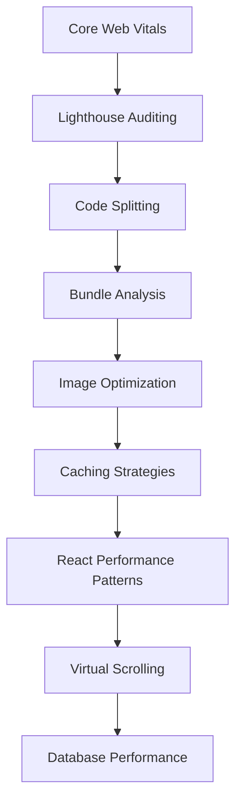

# Chapter 17: Performance Optimization

> **Previous:** [16-testing-web](./16-testing-web.md) | **Next:** [18-fullstack-project](./18-fullstack-project.md)

## Learning Objectives

> **One-Sentence Takeaway:** Core Web Vitals (LCP, FID, CLS) measure real user experience and are Google ranking factors.

By the end of this chapter, you will be able to:

## Chapter at a Glance

> **One-Sentence Takeaway:** Lighthouse provides automated performance, accessibility, and SEO scoring for continuous improvement.

| Topic | Key Insight | Practical Takeaway |
|-------|-------------|-------------------|
|Core Web Vitals|LCP (<2.5s), FID (<100ms), CLS (<0.1) measure real user experience|Track Web Vitals in production with RUM (Real User Monitoring) — lab tests alone are insufficient|
|Lighthouse|Automated auditing tool scoring performance, accessibility, SEO|Run Lighthouse CI in the pipeline to catch regressions before deployment|
|Code Splitting|Split bundles by route and component to reduce initial payload|Use `React.lazy` + `Suspense` or `next/dynamic` with `ssr: false` for client-only components|
|Image Optimization|Responsive images with WebP/AVIF, lazy loading, blur placeholders|Use next/image or the `<picture>` element with multiple source formats for broad compatibility|
|Caching|Service workers cache assets; CDNs cache at edge; HTTP caching headers|Layer caches — CDN for static assets, SW for offline, memory cache for API data|
|React Patterns|`memo`, `useMemo`, `useCallback`, and virtual scrolling prevent wasted renders|Profile with React DevTools before optimizing — don't add memoization prematurely|
|Database Perf|Query optimization, selective columns, batch operations, connection pooling|Use `select` to fetch only needed columns, `createMany` for batch inserts|

## Chapter Roadmap

> **One-Sentence Takeaway:** Code splitting reduces initial bundle size by loading code only when needed.




- Measure and optimize Core Web Vitals
- Implement lazy loading and code splitting
- Optimize images, fonts, and bundle sizes
- Configure caching strategies with CDNs and service workers
- Use performance monitoring and profiling tools
- Apply React-specific performance patterns

## 17.1 Core Web Vitals

> **One-Sentence Takeaway:** Image optimization with WebP/AVIF, responsive sizes, and lazy loading saves significant bandwidth.


```typescript
// Web Vitals measurement
// app/reportWebVitals.ts
"use client";

import { useReportWebVitals } from "next/web-vitals";

export function WebVitals() {
  useReportWebVitals((metric) => {
    console.log(metric); // LCP, FID, CLS, FCP, TTFB

    // Send to analytics
    const body = JSON.stringify({
      name: metric.name,
      value: metric.value,
      rating: metric.rating,
      delta: metric.delta,
      id: metric.id,
    });
    navigator.sendBeacon("/api/vitals", body);
  });
  return null;
}

// LCP (Largest Contentful Paint) - < 2.5s
// FID (First Input Delay) - < 100ms
// CLS (Cumulative Layout Shift) - < 0.1
// FCP (First Contentful Paint) - < 1.8s
// TTFB (Time to First Byte) - < 800ms
```

## 17.2 Lighthouse Auditing

> **One-Sentence Takeaway:** Layered caching (CDN, service worker, memory) reduces latency at every level.

```bash
# CLI audit with Lighthouse
npx lighthouse https://example.com --view

# Programmatic audit
import lighthouse from "lighthouse";
import * as chromeLauncher from "chrome-launcher";

const chrome = await chromeLauncher.launch();
const options = { logLevel: "info", output: "json", port: chrome.port };
const runnerResult = await lighthouse("https://example.com", options);

const { performance, accessibility, "best-practices": bp, seo } = runnerResult.lhr.categories;
console.log(`Performance: ${performance.score * 100}`);
console.log(`Accessibility: ${accessibility.score * 100}`);
await chrome.kill();
```

## 17.3 Code Splitting

> **One-Sentence Takeaway:** React patterns like `memo`, `useMemo`, and virtual scrolling prevent unnecessary re-renders on complex UIs.

```typescript
// Dynamic imports with React.lazy
import { lazy, Suspense } from "react";

const HeavyComponent = lazy(() => import("./HeavyComponent"));
const ChartDashboard = lazy(() => import("./ChartDashboard"));

function Dashboard() {
  return (
    <Suspense fallback={<LoadingSpinner />}>
      <HeavyComponent />
      <ChartDashboard />
    </Suspense>
  );
}

// Named exports with dynamic import
const { formatDistance } = await import("date-fns");

// Route-level code splitting in Next.js
// Next.js automatically splits by route - no config needed
// pages/blog/[slug].js -> separate chunk

// Component-level with next/dynamic
import dynamic from "next/dynamic";

const DynamicEditor = dynamic(() => import("../components/Editor"), {
  loading: () => <p>Loading editor...</p>,
  ssr: false, // Disable SSR for client-only components
});
```

## 17.4 Bundle Analysis

```bash
# Analyze bundle with Vite
npm run build && npx vite-bundle-analyzer

# Analyze Next.js bundle
ANALYZE=true npm run build

# Check individual package sizes
npx cost-of-modules

# Tree-shaking verification
# Check that imports only pull what's needed
import { format } from "date-fns"; // Good - tree-shakeable
import * as dateFns from "date-fns"; // Bad - imports everything
```

## 17.5 Image Optimization

```typescript
// Responsive images with srcSet
import Image from "next/image";

function HeroImage() {
  return (
    <Image
      src="/hero.webp"
      alt="Hero"
      width={1200}
      height={600}
      sizes="(max-width: 768px) 100vw, (max-width: 1200px) 50vw, 33vw"
      loading="lazy" // Lazy load below-the-fold images
      decoding="async"
      quality={80}
      placeholder="blur"
      blurDataURL="data:image/webp;base64,..."
    />
  );
}

// CSS background image optimization
.hero {
  background-image: image-set(
    url("/hero-small.webp") 1x,
    url("/hero-large.webp") 2x
  );
}

// Image format selection
// Prefer WebP/AVIF over JPEG/PNG
// Use <picture> for format fallbacks
<picture>
  <source srcSet="/hero.avif" type="image/avif" />
  <source srcSet="/hero.webp" type="image/webp" />
  
</picture>
```

## 17.6 Caching Strategies

```typescript
// Service worker with Workbox
// sw.ts
import { precacheAndRoute } from "workbox-precaching";
import { registerRoute } from "workbox-routing";
import { CacheFirst, NetworkFirst, StaleWhileRevalidate } from "workbox-strategies";

// Precache static assets
precacheAndRoute(self.__WB_MANIFEST);

// Cache images with Cache First
registerRoute(
  /\.(?:png|jpg|jpeg|svg|gif|webp)$/,
  new CacheFirst({
    cacheName: "images",
    plugins: [
      { expiration: { maxEntries: 50, maxAgeSeconds: 30 * 24 * 60 * 60 } },
    ],
  })
);

// Cache API responses with Network First
registerRoute(
  /\/api\/.*\.json/,
  new NetworkFirst({
    cacheName: "api-responses",
    plugins: [{ expiration: { maxEntries: 100, maxAgeSeconds: 300 } }],
  })
);

// Cache static assets with Stale-While-Revalidate
registerRoute(
  /\.(?:css|js)$/,
  new StaleWhileRevalidate({
    cacheName: "static-assets",
  })
);

// CDN Cache headers (server-side)
app.use(
  "/api/posts",
  (req, res, next) => {
    res.set("Cache-Control", "public, max-age=60, stale-while-revalidate=300");
    res.set("CDN-Cache-Control", "public, max-age=300");
    next();
  },
  postsHandler
);
```

## 17.7 React Performance Patterns

```typescript
import { memo, useMemo, useCallback } from "react";

// React.memo - prevent re-renders when props haven't changed
const ExpensiveList = memo(function ExpensiveList({ items }: { items: Item[] }) {
  return items.map((item) => <ExpensiveItem key={item.id} item={item} />);
});

// useMemo - memoize expensive computations
function Dashboard({ tasks }: { tasks: Task[] }) {
  const stats = useMemo(
    () => ({
      total: tasks.length,
      completed: tasks.filter((t) => t.status === "DONE").length,
      overdue: tasks.filter(
        (t) => t.dueDate && new Date(t.dueDate) < new Date()
      ).length,
      byPriority: {
        high: tasks.filter((t) => t.priority === "HIGH").length,
        medium: tasks.filter((t) => t.priority === "MEDIUM").length,
        low: tasks.filter((t) => t.priority === "LOW").length,
      },
    }),
    [tasks]
  );

  return <StatsPanel stats={stats} />;
}

// useCallback - memoize callbacks
function TaskList({ tasks, onStatusChange }: TaskListProps) {
  const handleStatusChange = useCallback(
    (taskId: string, status: string) => {
      onStatusChange(taskId, status);
    },
    [onStatusChange]
  );

  return tasks.map((task) => (
    <TaskItem key={task.id} task={task} onStatusChange={handleStatusChange} />
  ));
}

// Virtual scrolling for large lists
import { FixedSizeList } from "react-window";

function VirtualTaskList({ tasks }: { tasks: Task[] }) {
  return (
    <FixedSizeList
      height={600}
      itemCount={tasks.length}
      itemSize={72}
      width="100%"
    >
      {({ index, style }) => (
        <div style={style}>
          <TaskItem task={tasks[index]} />
        </div>
      )}
    </FixedSizeList>
  );
}
```

## 17.8 Font Optimization

Custom fonts can significantly impact performance if not loaded correctly.

```typescript
// Preload critical fonts
// In <head>:
<link
  rel="preload"
  href="/fonts/Inter-Variable.woff2"
  as="font"
  type="font/woff2"
  crossorigin="anonymous"
/>

// CSS with font-display: swap
@font-face {
  font-family: 'Inter';
  src: url('/fonts/Inter-Variable.woff2') format('woff2');
  font-weight: 100 900;
  font-display: swap; /* Show fallback text immediately */
  unicode-range: U+0000-00FF; /* Limit character set */
}

// In Next.js, use next/font for automatic optimization
import { Inter } from "next/font/google";

const inter = Inter({
  subsets: ["latin"],
  display: "swap",
  preload: true,
});
```

### Performance Budgets

A performance budget sets thresholds your app must not exceed.

```typescript
// performance-budget.ts
interface Budget {
  maxBundleSizeKB: number;
  maxImageSizeKB: number;
  maxRequests: number;
  maxLCP: number; // ms
  maxTBT: number; // ms (Total Blocking Time)
}

const BUDGET: Budget = {
  maxBundleSizeKB: 300,
  maxImageSizeKB: 200,
  maxRequests: 25,
  maxLCP: 2500,
  maxTBT: 200,
};

// CI check
async function checkBundleSize(): Promise<boolean> {
  const fs = await import("fs/promises");
  const stats = await fs.stat(".next/static/chunks/pages");
  const totalKB = stats.size / 1024;
  if (totalKB > BUDGET.maxBundleSizeKB) {
    console.error(`Bundle size ${totalKB}KB exceeds budget ${BUDGET.maxBundleSizeKB}KB`);
    process.exit(1);
  }
  return true;
}

```

### Lighthouse CI Budget

```json
{
  "ci": {
    "assert": {
      "categories:performance": ["error", { "minScore": 0.9 }],
      "categories:accessibility": ["error", { "minScore": 0.9 }]
    }
  }
}
```

### requestAnimationFrame and Frame Rate Optimization

Smooth animations run at 60fps (16.6ms per frame). Avoid long tasks that push frame budget.

```typescript
// Defer non-critical work
function scheduleIdleTask(task: () => void, timeout = 1000) {
  if (typeof requestIdleCallback !== "undefined") {
    requestIdleCallback(() => task(), { timeout });
  } else {
    setTimeout(task, 1);
  }
}

// Batch DOM reads/writes to avoid layout thrashing
const scheduledUpdates = new Map<string, () => void>();
let rafScheduled = false;

function batchUpdate(key: string, update: () => void) {
  scheduledUpdates.set(key, update);
  if (!rafScheduled) {
    rafScheduled = true;
    requestAnimationFrame(() => {
      // Read phase first (all gets)
      // Then write phase (all sets)
      for (const [, fn] of scheduledUpdates) fn();
      scheduledUpdates.clear();
      rafScheduled = false;
    });
  }
}
```

### Resource Hints for Faster Navigation

```html
<!-- DNS prefetch for cross-origin resources -->
<link rel="dns-prefetch" href="//api.example.com" />

<!-- Preconnect for critical third-party origins -->
<link rel="preconnect" href="https://fonts.googleapis.com" />
<link rel="preconnect" href="https://api.example.com" crossorigin />

<!-- Prefetch for likely-next pages -->
<link rel="prefetch" href="/dashboard" as="document" />

<!-- Preload for critical above-the-fold resources -->
<link rel="preload" href="/styles/critical.css" as="style" />
<link rel="preload" href="/hero.webp" as="image" />
```

## 17.9 Database Performance

```typescript
// Efficient queries
// BAD: Selecting all columns
const users = await prisma.user.findMany({});

// GOOD: Select only needed columns
const users = await prisma.user.findMany({
  select: { id: true, name: true, email: true },
});

// Batch operations
// BAD: N+1 individual creates
for (const item of items) {
  await prisma.item.create({ data: item });
}

// GOOD: Bulk create
await prisma.item.createMany({ data: items });

// Connection pooling for production
const pool = new Pool({
  connectionString: process.env.DATABASE_URL,
  max: 20, // Max connections
  idleTimeoutMillis: 30000,
  connectionTimeoutMillis: 2000,
});
```


> [!TIP]
> Use `npx web-vitals` in your app to track real Core Web Vitals from actual users — Lighthouse gives lab data but real-user metrics reveal the true experience.

> [!WARNING]
> Premature optimization adds complexity without measurable benefit. Always profile first with React DevTools or Chrome Performance tab, then optimize the actual bottleneck.

> [!REMEMBER]
> The single biggest performance win for most web apps is reducing JavaScript bundle size. Analyze your bundles regularly — a 100KB savings in JS often beats any memoization optimization.


## Concept Comparison Table

| Concept | Description | Use Case |
|---------|-------------|---------|
|LCP vs FID vs CLS|Loading performance (largest element)|Interactivity (first input delay)|
|`React.memo` vs `useMemo`|Prevents component re-render|Caches computation result|
|`CacheFirst` vs `NetworkFirst`|Serves from cache, falls back to network|Tries network first, falls back to cache|
|JPEG vs WebP vs AVIF|Widest support, larger files|Good support, ~30% smaller than JPEG|
|`react-window` vs native scroll|Virtual rendering, constant DOM nodes|All items in DOM, memory-heavy|

## Quick Reference

| Topic | Key Points |
|-------|-----------|
|Web Vital Thresholds|LCP < 2.5s, FID < 100ms, CLS < 0.1, FCP < 1.8s, TTFB < 800ms|
|Lazy Loading|`React.lazy(() => import('./Comp'))`, `next/dynamic`, `loading='lazy'` on images|
|Cache Strategies|`CacheFirst`, `NetworkFirst`, `StaleWhileRevalidate`, `NetworkOnly`|
|Image Formats|AVIF (best), WebP (good fallback), JPEG/PNG (universal fallback)|
|React Profiling|React DevTools Profiler, Chrome Performance tab, `why-did-you-render`|

## Cross-Application Matrix

| Domain | Application | Benefit |
|--------|------------|--------|
|E-commerce|Image optimization, CDN caching for product images|Fast product browsing and checkout|
|News Site|ISR for articles, service worker for offline|Instant article loads, offline reading|
|Dashboard|Virtual scrolling, memo for chart components|Smooth performance with thousands of rows|
|Social Media|Code splitting by route, lazy image loading|Fast initial load, infinite scroll performance|
|SaaS App|Bundle analysis, selective imports, tree shaking|Fast page loads even with many dependencies|

## Chapter Quiz

Test your understanding with these quick questions.

**Q1. What is the recommended LCP (Largest Contentful Paint) threshold?**

- A) < 1.0s
- B) < 2.5s
- C) < 4.0s
- D) < 5.0s

<details><summary>Answer</summary>

**B) Google recommends LCP under 2.5 seconds. LCP measures when the largest content element (image, video, text block) becomes visible.**

</details>

**Q2. What is the difference between `CacheFirst` and `NetworkFirst` strategies?**

- A) CacheFirst returns cached content first; NetworkFirst tries the network first
- B) CacheFirst always fetches from network
- C) NetworkFirst only caches images
- D) There is no difference

<details><summary>Answer</summary>

**A) `CacheFirst` serves cached content immediately (falling back to network), ideal for static assets. `NetworkFirst` tries the network first (falling back to cache), ideal for API responses where freshness matters.**

</details>

**Q3. When should you use `useMemo` in React?**

- A) For every computed value
- B) Only after profiling shows an expensive computation causing performance issues
- C) For all function definitions
- D) Never — it is deprecated

<details><summary>Answer</summary>

**B) `useMemo` adds memory and complexity overhead. Only use it when profiling identifies a computation that is expensive enough to impact frame rate or render time.**

</details>

**Q4. What is the primary benefit of image format AVIF over JPEG?**

- A) AVIF is supported in all browsers
- B) AVIF provides ~50% better compression than JPEG at similar quality
- C) AVIF is easier to encode
- D) AVIF supports animation

<details><summary>Answer</summary>

**B) AVIF (AV1 Image Format) offers significantly better compression than JPEG — typically 50% smaller file sizes at equivalent quality, reducing bandwidth and improving load times.**

</details>

### TypeScript: Lighthouse Score Analyzer & PWA Manifest Builder

```typescript
interface LighthouseScores { performance: number; accessibility: number; seo: number; bestPractices: number; }
class LighthouseAnalyzer {
  static grade(scores: LighthouseScores): Record<string, string> {
    const grade = (n: number) => n >= 90 ? "Good" : n >= 50 ? "Needs work" : "Poor";
    return Object.fromEntries(Object.entries(scores).map(([k, v]) => [k, grade(v)]));
  }
  static recommendations(scores: LighthouseScores): string[] {
    const recs: string[] = [];
    if (scores.performance < 90) recs.push("Optimize images, minify JS, enable compression");
    if (scores.accessibility < 90) recs.push("Add aria labels, improve color contrast, fix heading hierarchy");
    if (scores.seo < 90) recs.push("Add meta description, improve heading structure, add alt text");
    if (scores.bestPractices < 90) recs.push("Use HTTPS, avoid deprecated APIs, add doctype");
    return recs;
  }
}

class PWAManifestGenerator {
  static create(config: { name: string; shortName: string; startUrl: string; themeColor: string; bgColor: string; icons: { src: string; sizes: string; type: string }[] }): Record<string, any> {
    return {
      name: config.name, short_name: config.shortName,
      start_url: config.startUrl, display: "standalone",
      theme_color: config.themeColor, background_color: config.bgColor,
      icons: config.icons,
    };
  }
}

class BundleAnalyzer {
  static estimateSize(imports: string[]): { total: number; large: string[] } {
    const sizeMap: Record<string, number> = { "react-dom": 130, "react": 7, "lodash": 71, "axios": 14, "chart.js": 60, "d3": 250 };
    let total = 0;
    const large: string[] = [];
    imports.forEach(pkg => {
      const size = sizeMap[pkg] ?? 10;
      total += size;
      if (size > 50) large.push(pkg);
    });
    return { total, large };
  }
}

console.log("Grade:", LighthouseAnalyzer.grade({ performance: 65, accessibility: 85, seo: 92, bestPractices: 78 }));
console.log("PWA:", JSON.stringify(PWAManifestGenerator.create({ name: "MyApp", shortName: "App", startUrl: "/", themeColor: "#000", bgColor: "#fff", icons: [{ src: "/icon.png", sizes: "192x192", type: "image/png" }] })));
```

## Summary

Web performance optimization spans the entire stack. Core Web Vitals (LCP, FID, CLS) measure user experience. Code splitting reduces initial bundle size. Image optimization saves bandwidth. Caching strategies at CDN, browser, and service worker levels reduce latency. React.memo, useMemo, and useCallback prevent unnecessary re-renders. Database query optimization with proper indexing and batch operations handles data at scale.

## Exercises

### Review Questions

1. What are Core Web Vitals and why do they matter?
2. How does code splitting improve initial page load?
3. When should you use useMemo versus useCallback?

### Application Projects

1. Add lazy loading to images in a photo gallery
2. Implement virtual scrolling for a data table with 10,000+ rows
3. Set up a service worker for offline-first caching

4. Add resource hints (preconnect, prefetch, preload) to improve page load time for a multi-page application.
5. Optimize web font loading using `font-display: swap` and subsetting to reduce the critical render path.

6. Implement a performance budget CI check that fails the build if bundle size exceeds 300KB or Lighthouse performance score drops below 90.
7. Write a requestAnimationFrame-based batching system that groups DOM reads and writes into separate frames to eliminate layout thrashing.

### Challenge Project

Optimize a web application achieving 95+ Lighthouse performance score by implementing: code splitting at route and component level, responsive images with WebP/AVIF, CDN caching with stale-while-revalidate, service worker for offline support, virtual scrolling for large lists, database query optimization with proper indexes, and real user monitoring (RUM) to track Core Web Vitals in production.

### Practical Takeaways

1. **Measure before optimizing** — always profile with Lighthouse, React DevTools, or the Chrome Performance tab before adding complexity. Premature optimization is the root of all evil.
2. **Reduce JavaScript bundle size first** — the single biggest performance win is shipping less JS. Analyze bundles regularly, use dynamic imports, and tree-shake unused exports.
3. **Optimize images aggressively** — use AVIF/WebP with responsive `srcSet` and lazy loading. Images are typically the largest assets on a page.
4. **Layer your caches** — CDN for static assets, service worker for offline, browser cache for API responses, and in-memory cache for computed data.
5. **Use resource hints** — `preload` critical resources, `preconnect` to third-party origins, and `prefetch` likely-next pages to eliminate network wait times.
