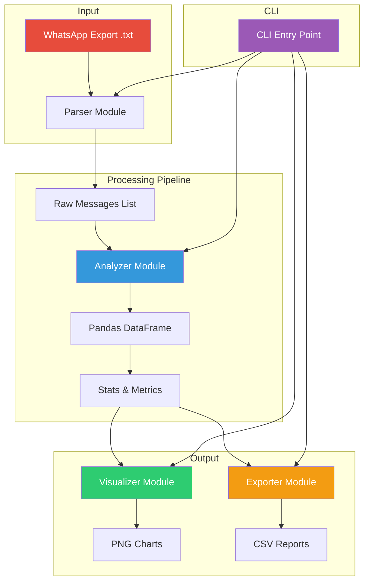
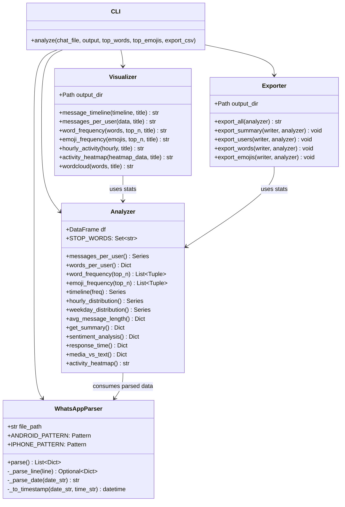
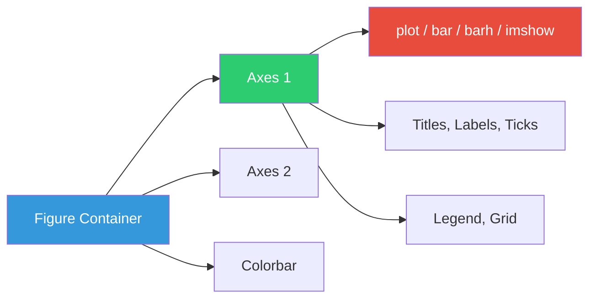
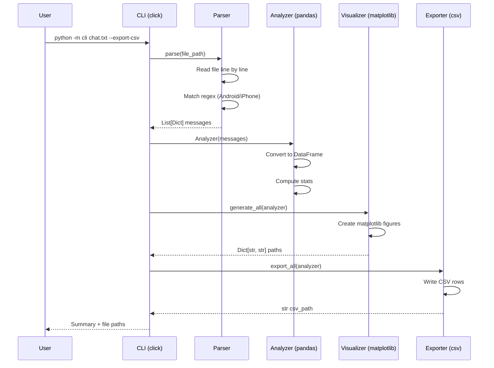
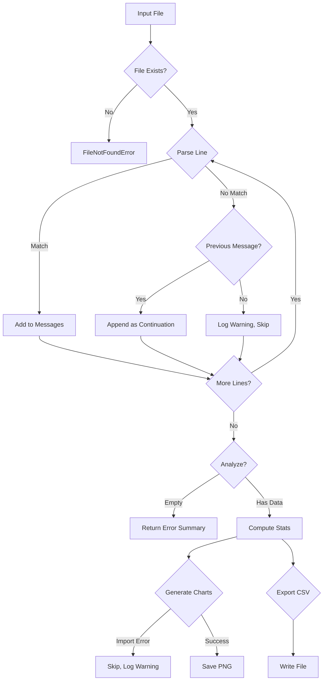

# Project: WhatsApp Chat Analyzer

**Duration:** 5–7 days
**Difficulty:** Intermediate
**Goal:** Real-world Python project — file I/O, regex, pandas, matplotlib
**Prerequisites:** Week 1 (Python Basics), Week 2 (OOP & Modules)

---

## Kya Hai Ye?

WhatsApp chat export (`.txt` file) lo aur usse analyze karo:

- Kaun kitna chat karta hai?
- Sabse zyada use hone wale words kaun se?
- Kaun se emoji sabse zyada use hote hain?
- Kis time sabse zyada chat hoti hai?
- Weekly/monthly activity trends kya hain?

Laravel mein aisa project: Export process karo, queue mein daalo, charts banao, report generate karo. Lekin Python mein seedha script se kaam ho jayega.

---

## Architecture





---

## WhatsApp Export Kaise Nikale

```
1. WhatsApp mein group ya chat kholo
2. Three dots (⋮) → More → Export chat
3. "Without media" select karo (media nahi chahiye)
4. File save karo: whatsapp_chat.txt
```

### Export Format

Android export format:
```
6/15/26, 10:30 AM - Raushan: Hello everyone!
6/15/26, 10:31 AM - Priya: Hi Raushan! Kaise ho?
6/15/26, 10:32 AM - Raushan: Main theek hoon, tum batao
6/16/26, 9:00 AM - Raj: Good morning guys!
```

iPhone format thoda different hota hai:
```
[6/15/26, 10:30:00 AM] Raushan: Hello everyone!
[6/15/26, 10:31:00 AM] Priya: Hi Raushan! Kaise ho?
```

Dono formats handle karne honge.

---

## Project Structure

```
whatsapp-analyzer/
├── pyproject.toml
├── README.md
├── config.yaml                 # Configuration file
├── data/
│   ├── my_chat.txt             # Input file (gitignore mein)
│   └── sample_chat.txt         # Sample chat for testing
├── output/
│   ├── stats.csv
│   ├── message_timeline.png
│   ├── word_frequency.png
│   ├── emoji_frequency.png
│   ├── activity_heatmap.png
│   └── wordcloud.png
├── src/
│   └── whatsapp_analyzer/
│       ├── __init__.py
│       ├── cli.py              # CLI entry point
│       ├── parser.py           # Chat parser
│       ├── analyzer.py         # Stats & analysis
│       ├── visualizer.py       # Charts & plots
│       ├── exporter.py         # CSV export
│       └── config.py           # Configuration loader
├── tests/
│   ├── __init__.py
│   ├── test_parser.py
│   ├── test_analyzer.py
│   ├── conftest.py             # Shared fixtures
│   └── sample_chat.txt         # Test data
├── Dockerfile
├── docker-compose.yml
└── requirements.txt
```

---

## Day 1 — Project Setup & Chat Parsing

### Python se Shuruat

First step: WhatsApp exported `.txt` file ko parse karke structured data mein convert karna.

PHP mein aisa karte:
```php
// Laravel way — regex on collection
$pattern = '/(\d{1,2}\/\d{1,2}\/\d{2,4}),\s(\d{1,2}:\d{2}(?::\d{2})?\s?[APap][Mm]?)\s-\s([^:]+):\s(.+)/';
preg_match($pattern, $line, $matches);
```

Python mein regex same hai but `re` module ke saath:
```python
import re
pattern = r"(\d{1,2}/\d{1,2}/\d{2,4}),\s(\d{1,2}:\d{2}(?::\d{2})?\s?[APap][Mm]?)\s-\s([^:]+):\s(.+)"
match = re.match(pattern, line)
```

### Regex Breakdown

Yeh regex kaise kaam karta hai:

```
(\d{1,2}/\d{1,2}/\d{2,4})    → Date: 6/15/26 ya 06/15/2026
,                            → Comma + space separator
(\d{1,2}:\d{2}(?::\d{2})?   → Time: 10:30 ya 10:30:00
\s?[APap][Mm]?)              → AM/PM (optional space before)
\s-\s                        → " - " separator
([^:]+)                      → Sender name (colon tak)
:\s                          → ": " separator
(.+)                         → Message content (baaki sab)
```

### Parser Implementation — Error Handling Version

Week 2 ke OOP concepts use karte hain. Clean error handling ke saath:

```python
# src/whatsapp_analyzer/parser.py
import re
from datetime import datetime
from typing import List, Dict, Optional, Tuple
from pathlib import Path


class ParseError(Exception):
    """Custom exception for parsing errors"""
    pass


class WhatsAppParser:
    """WhatsApp exported chat parser with multi-format support"""

    ANDROID_PATTERN = re.compile(
        r"(\d{1,2}/\d{1,2}/\d{2,4}),\s(\d{1,2}:\d{2}(?::\d{2})?\s?[APap][Mm]?)\s-\s([^:]+):\s(.+)"
    )

    IPHONE_PATTERN = re.compile(
        r"\[(\d{1,2}/\d{1,2}/\d{2,4}),\s(\d{1,2}:\d{2}:\d{2}\s?[APap][Mm]?)\]\s([^:]+):\s(.+)"
    )

    DATE_FORMATS = [
        "%m/%d/%y %I:%M %p",
        "%m/%d/%Y %I:%M %p",
        "%m/%d/%y %I:%M:%S %p",
        "%m/%d/%Y %I:%M:%S %p",
    ]

    def __init__(self, file_path: str):
        self.file_path = Path(file_path)
        if not self.file_path.exists():
            raise FileNotFoundError(f"Chat file not found: {file_path}")
        self.stats = {"total_lines": 0, "parsed": 0, "skipped": 0}

    def parse(self) -> List[Dict]:
        """Parse entire chat file into structured message list"""
        messages = []
        raw_text = self.file_path.read_text(encoding="utf-8")
        lines = raw_text.strip().split("\n")

        self.stats["total_lines"] = len(lines)

        for i, line in enumerate(lines, 1):
            line = line.strip()
            if not line:
                self.stats["skipped"] += 1
                continue

            try:
                msg = self._parse_line(line)
                if msg:
                    messages.append(msg)
                    self.stats["parsed"] += 1
                else:
                    # Multi-line message continuation
                    if messages:
                        messages[-1]["message"] += "\n" + line
                    self.stats["skipped"] += 1
            except Exception as e:
                print(f"⚠️ Warning: Line {i} parse failed: {e}")
                self.stats["skipped"] += 1

        print(f"📊 Parse stats: {self.stats}")
        return messages

    def _parse_line(self, line: str) -> Optional[Dict]:
        """Parse single line using Android or iPhone pattern"""
        for pattern in [self.ANDROID_PATTERN, self.IPHONE_PATTERN]:
            match = pattern.match(line)
            if match:
                date_str, time_str, sender, message = match.groups()
                timestamp = self._to_timestamp(date_str, time_str.strip())
                return {
                    "date": timestamp.strftime("%Y-%m-%d"),
                    "time": timestamp.strftime("%H:%M:%S"),
                    "sender": sender.strip(),
                    "message": message.strip(),
                    "timestamp": timestamp,
                    "hour": timestamp.hour,
                    "day_of_week": timestamp.strftime("%A"),
                    "month": timestamp.strftime("%B"),
                    "year": timestamp.year,
                }
        return None

    def _parse_date(self, date_str: str) -> str:
        """Normalize date to YYYY-MM-DD"""
        parts = date_str.split("/")
        if len(parts) == 3:
            month, day, year = parts
            if len(year) == 2:
                year = "20" + year
            return f"{year}-{month.zfill(2)}-{day.zfill(2)}"
        return date_str

    def _to_timestamp(self, date_str: str, time_str: str) -> datetime:
        """Convert date+time strings to datetime object"""
        date_clean = date_str.replace(",", "").strip()
        time_clean = time_str.replace("\u202f", " ").strip()
        datetime_str = f"{date_clean} {time_clean}"

        for fmt in self.DATE_FORMATS:
            try:
                return datetime.strptime(datetime_str, fmt)
            except ValueError:
                continue

        raise ParseError(f"Cannot parse datetime: {datetime_str}")
```

### PHP → Python Mapping: File I/O

| PHP | Python | Notes |
|-----|--------|-------|
| `file_get_contents()` | `Path.read_text()` | Pathlib ka method, encoding handle karta hai |
| `file()` | `text.split("\n")` | PHP directly array deta hai |
| `fopen()` / `fgets()` | `open()` / `for line in f` | Iterable file object |
| `preg_match()` | `re.match()` / `re.search()` | Same regex, similar API |
| `DateTime::createFromFormat()` | `datetime.strptime()` | Almost identical |
| `Exception` | `Exception` | Python mein custom exception class |

### Multi-line Messages

WhatsApp export mein long messages multiple lines mein split ho sakti hain. Isliye jab koi line pattern se match nahi karti, to hum usse previous message mein append kar dete hain:

```python
# Multi-line message handling in parser
if not msg:
    if messages:  # Append to last message
        messages[-1]["message"] += "\n" + line
```

---

## Day 2 — Analysis Engine (pandas Deep Dive)

### DataFrame Basics

Laravel mein Eloquent collections use karte the. Python mein pandas DataFrame wohi kaam karta hai — lekin 10x powerful.

```python
import pandas as pd

# PHP: collect($array)->groupBy('sender')->map->count()
# Python:
df = pd.DataFrame(messages)
df["sender"].value_counts()
```

### Analyzer Class — Full Implementation

```python
# src/whatsapp_analyzer/analyzer.py
import pandas as pd
from collections import Counter
from typing import List, Dict, Tuple, Optional, Set
from pathlib import Path
import emoji


class Analyzer:
    """Analyze parsed WhatsApp messages with pandas"""

    DEFAULT_STOP_WORDS: Set[str] = {
        "the", "a", "an", "is", "are", "was", "were", "be", "been",
        "i", "you", "he", "she", "it", "we", "they", "me", "him",
        "her", "us", "them", "my", "your", "his", "its", "our",
        "their", "this", "that", "these", "those", "and", "but",
        "or", "in", "on", "at", "to", "for", "of", "with", "by",
        "from", "as", "into", "through", "during", "before", "after",
        "above", "below", "between", "out", "off", "over", "under",
        "again", "further", "then", "once", "here", "there", "when",
        "where", "why", "how", "all", "each", "every", "both",
        "few", "more", "most", "other", "some", "such", "no", "nor",
        "not", "only", "own", "same", "so", "than", "too", "very",
        "just", "because", "do", "does", "did", "doing", "done",
        "have", "has", "had", "having",
        "hai", "hain", "ho", "ka", "ki", "ke", "ko", "se", "mein",
        "me", "par", "pe", "aur", "to", "bhi", "tha", "the",
        "thi", "tho", "ye", "wo", "vo", "kya", "jo", "nahi",
        "na", "kiya", "karo", "kar", "raha", "rahe", "rahi",
        "aap", "tum", "main", "tere", "mera", "teri", "meri",
        "apna", "apni", "apne", "is", "us", "in", "un",
    }

    MEDIA_PATTERNS = [
        "<Media omitted>", "image omitted", "video omitted",
        "document omitted", "audio omitted", "sticker omitted",
    ]

    def __init__(self, messages: List[Dict], stop_words: Optional[Set[str]] = None):
        self.df = pd.DataFrame(messages)
        self.stop_words = stop_words or self.DEFAULT_STOP_WORDS

        if not self.df.empty:
            self.df["timestamp"] = pd.to_datetime(self.df["timestamp"])
            self.df = self.df.sort_values("timestamp").reset_index(drop=True)

    def messages_per_user(self) -> pd.Series:
        """Count messages per user, sorted descending"""
        return self.df["sender"].value_counts()

    def words_per_user(self) -> Dict[str, int]:
        """Total words written per user"""
        result = {}
        for sender, group in self.df.groupby("sender"):
            words = sum(len(str(msg).split()) for msg in group["message"])
            result[sender] = words
        return dict(sorted(result.items(), key=lambda x: x[1], reverse=True))

    def word_frequency(self, top_n: int = 20,
                       exclude_stop_words: bool = True) -> List[Tuple[str, int]]:
        """Most common words with optional stop word filtering"""
        all_words = []
        for msg in self.df["message"]:
            words = str(msg).lower().split()
            cleaned = []
            for w in words:
                w_clean = w.strip(".,!?;:\"'()[]{}#$%&*+-/=@<>")
                if w_clean and (not exclude_stop_words or w_clean not in self.stop_words):
                    cleaned.append(w_clean)
            all_words.extend(cleaned)
        return Counter(all_words).most_common(top_n)

    def emoji_frequency(self, top_n: int = 10) -> List[Tuple[str, int]]:
        """Most common emojis using the emoji library"""
        all_emojis = []
        for msg in self.df["message"]:
            all_emojis.extend(c for c in str(msg) if emoji.is_emoji(c))
        return Counter(all_emojis).most_common(top_n)

    def timeline(self, freq: str = "D") -> pd.Series:
        """Messages over time. freq: D=daily, W=weekly, M=monthly, Q=quarterly, Y=yearly"""
        return self.df.set_index("timestamp").resample(freq).size()

    def hourly_distribution(self) -> pd.Series:
        """Messages per hour of day (0-23)"""
        return self.df["timestamp"].dt.hour.value_counts().sort_index()

    def weekday_distribution(self) -> pd.Series:
        """Messages per day of week"""
        return self.df["timestamp"].dt.day_name().value_counts()

    def monthly_distribution(self) -> pd.Series:
        """Messages per month"""
        return self.df["timestamp"].dt.month_name().value_counts()

    def avg_message_length(self) -> Dict[str, float]:
        """Average message length (characters) per user"""
        self.df["msg_length"] = self.df["message"].astype(str).str.len()
        return self.df.groupby("sender")["msg_length"].mean().to_dict()

    def user_activity_by_hour(self, user: str) -> pd.Series:
        """Hourly activity for a specific user"""
        user_df = self.df[self.df["sender"] == user]
        return user_df["timestamp"].dt.hour.value_counts().sort_index()

    def first_seen(self) -> Dict[str, str]:
        """When each user first appeared"""
        return self.df.groupby("sender")["timestamp"].min().apply(
            lambda x: x.strftime("%Y-%m-%d %H:%M")
        ).to_dict()

    def last_seen(self) -> Dict[str, str]:
        """When each user last appeared"""
        return self.df.groupby("sender")["timestamp"].max().apply(
            lambda x: x.strftime("%Y-%m-%d %H:%M")
        ).to_dict()

    def get_summary(self) -> Dict:
        """Full summary statistics"""
        if self.df.empty:
            return {"error": "No messages found"}

        total_messages = len(self.df)
        total_users = self.df["sender"].nunique()
        date_range = (
            f"{self.df['date'].min()} to {self.df['date'].max()}"
        )
        total_days = self.df["date"].nunique()

        return {
            "total_messages": total_messages,
            "total_users": total_users,
            "date_range": date_range,
            "total_days": total_days,
            "messages_per_day": round(total_messages / max(total_days, 1), 1),
            "top_user": str(self.messages_per_user().index[0]) if total_users > 0 else "N/A",
            "top_emoji": (self.emoji_frequency(1)[0][0]
                          if self.emoji_frequency(1) else "N/A"),
            "avg_message_length": round(self.df["message"].astype(str).str.len().mean(), 1),
            "total_words": self.df["message"].astype(str).str.split().str.len().sum(),
        }

    def sentiment_analysis(self) -> Dict[str, float]:
        """Average sentiment per user (-1 to +1) using TextBlob"""
        from textblob import TextBlob
        sentiments = {}
        for sender, group in self.df.groupby("sender"):
            scores = []
            for msg in group["message"]:
                msg_str = str(msg).strip()
                if msg_str:
                    blob = TextBlob(msg_str)
                    scores.append(blob.sentiment.polarity)
            sentiments[sender] = (
                sum(scores) / len(scores) if scores else 0.0
            )
        return sentiments

    def response_time(self) -> Dict[str, float]:
        """Average response time in minutes per user"""
        sorted_df = self.df.sort_values("timestamp")
        results = {}
        for sender, group in sorted_df.groupby("sender"):
            response_times = []
            for i in range(1, len(group)):
                diff = (
                    group.iloc[i]["timestamp"]
                    - group.iloc[i - 1]["timestamp"]
                ).total_seconds()
                if 0 < diff < 3600:  # Only if within 1 hour
                    response_times.append(diff / 60)
            results[sender] = (
                sum(response_times) / len(response_times)
                if response_times else 0.0
            )
        return results

    def media_vs_text(self) -> Dict[str, Dict]:
        """Count media vs text messages per user"""
        result = {}
        for sender, group in self.df.groupby("sender"):
            media_count = sum(
                1 for msg in group["message"]
                if any(p.lower() in str(msg).lower()
                       for p in self.MEDIA_PATTERNS)
            )
            text_count = len(group) - media_count
            result[sender] = {
                "total": len(group),
                "text": text_count,
                "media": media_count,
                "media_percent": round(
                    media_count / len(group) * 100, 1
                ) if len(group) > 0 else 0,
            }
        return result
```

### pandas Operations — PHP Developer's Guide

| Operation | PHP (Laravel) | Python (pandas) |
|-----------|--------------|-----------------|
| Group & count | `$coll->groupBy('sender')->map->count()` | `df['sender'].value_counts()` |
| Filter | `$coll->where('sender', 'Raushan')` | `df[df['sender'] == 'Raushan']` |
| Aggregate | `$coll->avg('length')` | `df['length'].mean()` |
| Date grouping | `$coll->groupBy(fn($i) => $i->created_at->format('Y-m-d'))` | `df.resample('D', on='timestamp').size()` |
| Sort | `$coll->sortBy('timestamp')` | `df.sort_values('timestamp')` |
| First/Last | `$coll->first()`, `$coll->last()` | `df.iloc[0]`, `df.iloc[-1]` |
| Unique values | `$coll->unique('sender')` | `df['sender'].unique()` |

---

## Day 3 — Visualization Engine

### matplotlib Deep Dive

PHP mein charts ke liye usually JavaScript library use karte ho (Chart.js, D3.js). Python mein matplotlib sab kuch server-side generate kar sakta hai.

```python
# src/whatsapp_analyzer/visualizer.py
import matplotlib.pyplot as plt
import matplotlib
import pandas as pd
import numpy as np
from pathlib import Path
from typing import Optional, List, Tuple, Dict

matplotlib.use("Agg")
matplotlib.rcParams["figure.figsize"] = (12, 6)
matplotlib.rcParams["font.size"] = 12
matplotlib.rcParams["axes.grid"] = True
matplotlib.rcParams["grid.alpha"] = 0.3


class Visualizer:
    """Generate charts and visualizations from analysis data"""

    # Color palettes
    PALETTES = {
        "default": ["#4ecdc4", "#ff6b6b", "#ffe66d", "#292f36", "#1a535c"],
        "sunset": ["#ff6b6b", "#feca57", "#ff9ff3", "#54a0ff", "#5f27cd"],
        "ocean": ["#00d2d3", "#54a0ff", "#5f27cd", "#01a3a4", "#341f97"],
        "forest": ["#2ecc71", "#27ae60", "#1abc9c", "#16a085", "#2c3e50"],
    }

    def __init__(self, output_dir: str = "output", palette: str = "default"):
        self.output_dir = Path(output_dir)
        self.output_dir.mkdir(parents=True, exist_ok=True)
        self.colors = self.PALETTES.get(palette, self.PALETTES["default"])

    def message_timeline(
        self, timeline: pd.Series,
        title: str = "Message Timeline"
    ) -> str:
        """Line chart of messages over time"""
        fig, ax = plt.subplots(figsize=(14, 6))

        ax.fill_between(
            timeline.index, timeline.values,
            alpha=0.3, color=self.colors[0]
        )
        ax.plot(
            timeline.index, timeline.values,
            marker="o", linestyle="-",
            linewidth=2, markersize=4,
            color=self.colors[0],
            markerfacecolor=self.colors[1],
        )
        ax.set_title(title, fontsize=18, fontweight="bold", pad=15)
        ax.set_xlabel("Date", fontsize=13)
        ax.set_ylabel("Number of Messages", fontsize=13)
        plt.xticks(rotation=45, ha="right")
        plt.tight_layout()

        path = self.output_dir / "message_timeline.png"
        fig.savefig(path, dpi=150, bbox_inches="tight", facecolor="white")
        plt.close(fig)
        return str(path)

    def messages_per_user(
        self, data: pd.Series,
        title: str = "Messages Per User"
    ) -> str:
        """Horizontal bar chart of messages per user"""
        fig, ax = plt.subplots(figsize=(10, max(5, len(data) * 0.5)))

        data_sorted = data.sort_values()
        y_pos = range(len(data_sorted))
        bar_colors = [self.colors[i % len(self.colors)]
                      for i in range(len(data_sorted))]

        bars = ax.barh(y_pos, data_sorted.values, color=bar_colors, edgecolor="white")
        ax.set_yticks(y_pos)
        ax.set_yticklabels(data_sorted.index)
        ax.set_title(title, fontsize=18, fontweight="bold", pad=15)
        ax.set_xlabel("Number of Messages", fontsize=13)

        for bar, val in zip(bars, data_sorted.values):
            ax.text(
                bar.get_width() + max(data_sorted.values) * 0.01,
                bar.get_y() + bar.get_height() / 2,
                str(val), va="center", fontsize=11
            )

        plt.tight_layout()
        path = self.output_dir / "messages_per_user.png"
        fig.savefig(path, dpi=150, bbox_inches="tight", facecolor="white")
        plt.close(fig)
        return str(path)

    def word_frequency(
        self, words: List[Tuple[str, int]],
        top_n: int = 20, title: str = "Top Words"
    ) -> str:
        """Horizontal bar chart of most common words"""
        top_words = words[:top_n][::-1]
        labels = [w[0] for w in top_words]
        values = [w[1] for w in top_words]

        fig, ax = plt.subplots(figsize=(10, max(6, top_n * 0.35)))

        colors = plt.cm.RdYlGn_r(np.linspace(0.3, 0.9, len(labels)))
        bars = ax.barh(labels, values, color=colors, edgecolor="gray", linewidth=0.5)
        ax.set_title(title, fontsize=18, fontweight="bold", pad=15)
        ax.set_xlabel("Frequency", fontsize=13)

        for bar, val in zip(bars, values):
            ax.text(
                bar.get_width() + max(values) * 0.01,
                bar.get_y() + bar.get_height() / 2,
                str(val), va="center", fontsize=10
            )

        plt.tight_layout()
        path = self.output_dir / "word_frequency.png"
        fig.savefig(path, dpi=150, bbox_inches="tight", facecolor="white")
        plt.close(fig)
        return str(path)

    def emoji_frequency(
        self, emojis: List[Tuple[str, int]],
        top_n: int = 10, title: str = "Top Emojis"
    ) -> str:
        """Bar chart of most common emojis"""
        top_emojis = emojis[:top_n][::-1]
        labels = [f"{e[0]}  ({e[1]})" for e in top_emojis]
        values = [e[1] for e in top_emojis]

        fig, ax = plt.subplots(figsize=(10, max(5, top_n * 0.4)))
        bars = ax.barh(
            labels, values,
            color=self.colors[2], edgecolor=self.colors[4],
            linewidth=1.5
        )
        ax.set_title(title, fontsize=18, fontweight="bold", pad=15)
        ax.set_xlabel("Frequency", fontsize=13)

        plt.tight_layout()
        path = self.output_dir / "emoji_frequency.png"
        fig.savefig(path, dpi=150, bbox_inches="tight", facecolor="white")
        plt.close(fig)
        return str(path)

    def hourly_activity(
        self, hourly: pd.Series,
        title: str = "Activity by Hour of Day"
    ) -> str:
        """Bar chart of messages per hour with peak highlighting"""
        fig, ax = plt.subplots(figsize=(12, 6))
        hours = list(range(24))
        values = [hourly.get(h, 0) for h in hours]
        max_val = max(values) if values else 0

        colors = [
            self.colors[1] if v == max_val else self.colors[0]
            for v in values
        ]
        bars = ax.bar(hours, values, color=colors, edgecolor="white", linewidth=0.5)
        ax.set_title(title, fontsize=18, fontweight="bold", pad=15)
        ax.set_xlabel("Hour of Day", fontsize=13)
        ax.set_ylabel("Messages", fontsize=13)
        ax.set_xticks(hours)
        ax.set_xticklabels([f"{h}:00" for h in hours], rotation=45)

        # Peak annotation
        if max_val > 0:
            peak_hour = values.index(max_val)
            ax.annotate(
                f"Peak: {peak_hour}:00 ({max_val} msgs)",
                xy=(peak_hour, max_val),
                xytext=(peak_hour + 2, max_val * 0.8),
                arrowprops=dict(arrowstyle="->", color="black", lw=1.5),
                fontsize=11, fontweight="bold",
            )

        plt.tight_layout()
        path = self.output_dir / "hourly_activity.png"
        fig.savefig(path, dpi=150, bbox_inches="tight", facecolor="white")
        plt.close(fig)
        return str(path)

    def activity_heatmap(
        self, heatmap_data: pd.DataFrame,
        title: str = "Activity Heatmap (Day × Hour)"
    ) -> str:
        """Heatmap of day of week vs hour of day"""
        fig, ax = plt.subplots(figsize=(14, 6))
        im = ax.imshow(
            heatmap_data.values,
            cmap="YlOrRd", aspect="auto",
            interpolation="nearest"
        )

        ax.set_xticks(range(24))
        ax.set_yticks(range(7))
        ax.set_xticklabels([f"{h}:00" for h in range(24)], rotation=45)
        ax.set_yticklabels(["Mon", "Tue", "Wed", "Thu", "Fri", "Sat", "Sun"])
        ax.set_title(title, fontsize=18, fontweight="bold", pad=15)

        cbar = fig.colorbar(im, ax=ax, label="Messages", shrink=0.8)
        plt.tight_layout()

        path = self.output_dir / "activity_heatmap.png"
        fig.savefig(path, dpi=150, bbox_inches="tight", facecolor="white")
        plt.close(fig)
        return str(path)

    def wordcloud(
        self, words: List[Tuple[str, int]],
        title: str = "Most Used Words"
    ) -> str:
        """Word cloud visualization"""
        from wordcloud import WordCloud
        word_freq = dict(words)

        wc = WordCloud(
            width=1200, height=800,
            background_color="white",
            colormap="viridis",
            max_words=100,
            contour_width=1,
            contour_color="steelblue",
        ).generate_from_frequencies(word_freq)

        fig, ax = plt.subplots(figsize=(12, 8))
        ax.imshow(wc, interpolation="bilinear")
        ax.axis("off")
        ax.set_title(title, fontsize=18, fontweight="bold", pad=15)
        plt.tight_layout()

        path = self.output_dir / "wordcloud.png"
        fig.savefig(path, dpi=150, bbox_inches="tight", facecolor="white")
        plt.close(fig)
        return str(path)

    def generate_all(
        self, analyzer, top_words: int = 20,
        top_emojis: int = 10
    ) -> Dict[str, str]:
        """Generate all standard charts, return paths dict"""
        paths = {}
        paths["timeline"] = self.message_timeline(analyzer.timeline("D"))
        paths["users"] = self.messages_per_user(analyzer.messages_per_user())
        paths["words"] = self.word_frequency(
            analyzer.word_frequency(top_words), top_words
        )
        paths["emojis"] = self.emoji_frequency(
            analyzer.emoji_frequency(top_emojis), top_emojis
        )
        paths["hourly"] = self.hourly_activity(analyzer.hourly_distribution())

        # Extension: heatmap
        try:
            analyzer.df["day_of_week_num"] = analyzer.df["timestamp"].dt.dayofweek
            analyzer.df["hour_num"] = analyzer.df["timestamp"].dt.hour
            heatmap_data = analyzer.df.pivot_table(
                index="day_of_week_num", columns="hour_num",
                aggfunc="size", fill_value=0
            )
            paths["heatmap"] = self.activity_heatmap(heatmap_data)
        except Exception:
            pass

        return paths
```

### matplotlib Concepts for Laravel Developers



| Concept | matplotlib | Laravel Analogy |
|---------|-----------|-----------------|
| Container | `fig, ax = plt.subplots()` | Like a `<canvas>` element |
| Line chart | `ax.plot(x, y)` | Chart.js `type: 'line'` |
| Bar chart | `ax.bar(x, y)` | Chart.js `type: 'bar'` |
| Horizontal bar | `ax.barh(y, x)` | Just rotated bars |
| Heatmap | `ax.imshow(data)` | Table with colors |
| Save | `fig.savefig(path)` | `Storage::put()` for image |
| Style | `plt.rcParams` | Like CSS variables |
| Layout | `plt.tight_layout()` | Auto-spacing |

---

## Day 4 — CLI & CSV Export

### Click CLI Framework

CLI banane ke 3 tarike hain Python mein:

1. **argparse** — Built-in, standard library, verbose setup
2. **click** — Third-party, decorator-based, clean
3. **typer** — Newer, type-hint based, Click ke upar

Hum click use karenge:

```python
# src/whatsapp_analyzer/cli.py
import click
import sys
from pathlib import Path
from .parser import WhatsAppParser
from .analyzer import Analyzer
from .visualizer import Visualizer
from .exporter import Exporter


@click.command()
@click.argument("chat_file", type=click.Path(exists=True))
@click.option("--output", "-o", default="output",
              help="Output directory for charts and CSV")
@click.option("--top-words", default=20,
              help="Number of top words to show", type=int)
@click.option("--top-emojis", default=10,
              help="Number of top emojis to show", type=int)
@click.option("--export-csv", is_flag=True,
              help="Export stats to CSV file")
@click.option("--palette", default="default",
              type=click.Choice(["default", "sunset", "ocean", "forest"]),
              help="Color palette for charts")
@click.option("--quiet", "-q", is_flag=True,
              help="Suppress verbose output")
@click.option("--format", "-f", default="auto",
              type=click.Choice(["auto", "android", "iphone"]),
              help="Chat format (auto-detect by default)")
@click.version_option(version="1.0.0", prog_name="whatsapp-analyzer")
def analyze(chat_file: str, output: str, top_words: int,
            top_emojis: int, export_csv: bool, palette: str,
            quiet: bool, format: str):
    """
    Analyze WhatsApp chat export file.

    Parses exported WhatsApp chat .txt files and generates
    statistics, charts, and CSV reports.
    """
    # Parse
    if not quiet:
        click.echo("🔍 Parsing WhatsApp chat...")

    try:
        parser = WhatsAppParser(chat_file)
        messages = parser.parse()
    except FileNotFoundError as e:
        click.echo(f"❌ {e}", err=True)
        sys.exit(1)
    except Exception as e:
        click.echo(f"❌ Parse error: {e}", err=True)
        sys.exit(1)

    if not messages:
        click.echo("❌ No messages found in chat file.", err=True)
        sys.exit(1)

    if not quiet:
        click.echo(f"✅ Found {len(messages)} messages "
                   f"(from {parser.stats['total_lines']} lines)")

    # Analyze
    if not quiet:
        click.echo("📊 Analyzing messages...")

    analyzer = Analyzer(messages)

    # Print summary
    summary = analyzer.get_summary()
    if not quiet:
        click.echo("\n" + "=" * 40)
        click.echo("📋 SUMMARY")
        click.echo("=" * 40)
        click.echo(f"  Total messages:  {summary['total_messages']:,}")
        click.echo(f"  Total users:     {summary['total_users']}")
        click.echo(f"  Date range:      {summary['date_range']}")
        click.echo(f"  Total days:      {summary['total_days']}")
        click.echo(f"  Messages/day:    {summary['messages_per_day']}")
        click.echo(f"  Avg msg length:  {summary['avg_message_length']} chars")
        click.echo(f"  Total words:     {summary['total_words']:,}")
        click.echo(f"  Top emoji:       {summary['top_emoji']}")

        # Top users
        click.echo(f"\n{'=' * 40}")
        click.echo("👤 MESSAGES PER USER")
        click.echo("=" * 40)
        for user, count in analyzer.messages_per_user().items():
            pct = count / summary["total_messages"] * 100
            bar = "█" * int(pct / 2)
            click.echo(f"  {user:20s} {count:6d} ({pct:5.1f}%) {bar}")

        # Top words
        if not quiet:
            click.echo(f"\n{'=' * 40}")
            click.echo(f"📝 TOP {top_words} WORDS")
            click.echo("=" * 40)
        for word, count in analyzer.word_frequency(top_words):
            click.echo(f"  {word:20s} {count}")

        # Top emojis
        click.echo(f"\n{'=' * 40}")
        click.echo(f"😊 TOP {top_emojis} EMOJIS")
        click.echo("=" * 40)
        for emoji_char, count in analyzer.emoji_frequency(top_emojis):
            click.echo(f"  {emoji_char:5s} {count}")

    # Generate charts
    if not quiet:
        click.echo(f"\n{'=' * 40}")
        click.echo("📈 GENERATING CHARTS")
        click.echo("=" * 40)

    vis = Visualizer(output, palette=palette)

    try:
        chart_paths = vis.generate_all(analyzer, top_words, top_emojis)
        if not quiet:
            for name, path in chart_paths.items():
                click.echo(f"  ✅ {name:12s} → {path}")
    except ImportError as e:
        click.echo(f"⚠️ Chart generation skipped: {e}")
    except Exception as e:
        click.echo(f"⚠️ Chart error: {e}")

    # CSV export
    if export_csv:
        if not quiet:
            click.echo(f"\n{'=' * 40}")
            click.echo("📄 EXPORTING CSV")
            click.echo("=" * 40)
        try:
            exporter = Exporter(output)
            csv_path = exporter.export_all(analyzer)
            if not quiet:
                click.echo(f"  ✅ CSV → {csv_path}")
        except Exception as e:
            click.echo(f"❌ Export failed: {e}", err=True)

    if not quiet:
        click.echo(f"\n{'=' * 40}")
        click.echo("✅ Done! Sab output folder mein hai.")
        click.echo(f"   📂 {Path(output).absolute()}")
        click.echo("=" * 40)


if __name__ == "__main__":
    analyze()
```

### Exporter Implementation

```python
# src/whatsapp_analyzer/exporter.py
import csv
from pathlib import Path
from .analyzer import Analyzer


class Exporter:
    """Export analysis results to CSV"""

    def __init__(self, output_dir: str = "output"):
        self.output_dir = Path(output_dir)
        self.output_dir.mkdir(parents=True, exist_ok=True)

    def export_all(self, analyzer: Analyzer) -> str:
        """Export all stats to a structured CSV file"""
        path = self.output_dir / "whatsapp_stats.csv"

        with open(path, "w", newline="", encoding="utf-8-sig") as f:
            writer = csv.writer(f)

            self.export_summary(writer, analyzer)
            self.export_users(writer, analyzer)
            self.export_words(writer, analyzer)
            self.export_emojis(writer, analyzer)

        return str(path)

    def export_summary(self, writer: csv.writer, analyzer: Analyzer):
        """Write summary section"""
        writer.writerow(["=== SUMMARY ==="])
        summary = analyzer.get_summary()
        for key, value in summary.items():
            writer.writerow([key, value])
        writer.writerow([])

    def export_users(self, writer: csv.writer, analyzer: Analyzer):
        """Write per-user stats"""
        writer.writerow(["=== MESSAGES PER USER ==="])
        writer.writerow(["User", "Messages", "Words", "Avg Length",
                         "First Seen", "Last Seen"])
        for user in analyzer.messages_per_user().index:
            count = analyzer.messages_per_user()[user]
            words = analyzer.words_per_user().get(user, 0)
            avg_len = analyzer.avg_message_length().get(user, 0)
            first = analyzer.first_seen().get(user, "")[:10]
            last = analyzer.last_seen().get(user, "")[:10]
            writer.writerow([user, count, words, round(avg_len, 1),
                            first, last])
        writer.writerow([])

    def export_words(self, writer: csv.writer, analyzer: Analyzer):
        """Write word frequency"""
        writer.writerow(["=== TOP WORDS ==="])
        writer.writerow(["Rank", "Word", "Frequency"])
        for rank, (word, count) in enumerate(analyzer.word_frequency(100), 1):
            writer.writerow([rank, word, count])
        writer.writerow([])

    def export_emojis(self, writer: csv.writer, analyzer: Analyzer):
        """Write emoji frequency"""
        writer.writerow(["=== TOP EMOJIS ==="])
        writer.writerow(["Rank", "Emoji", "Frequency"])
        for rank, (emoji_char, count) in enumerate(
            analyzer.emoji_frequency(50), 1
        ):
            writer.writerow([rank, emoji_char, count])
```

---

## Day 5 — Testing

### pytest Setup

```python
# tests/conftest.py
import pytest
from pathlib import Path


@pytest.fixture
def sample_chat_path():
    """Path to sample chat file"""
    return Path(__file__).parent / "sample_chat.txt"


@pytest.fixture
def sample_messages():
    """Parsed sample messages for testing"""
    return [
        {
            "date": "2026-06-15",
            "time": "10:30:00",
            "sender": "Raushan",
            "message": "Hello everyone!",
            "timestamp": "2026-06-15 10:30:00",
            "hour": 10,
            "day_of_week": "Monday",
            "month": "June",
            "year": 2026,
        },
        {
            "date": "2026-06-15",
            "time": "10:31:00",
            "sender": "Priya",
            "message": "Hi Raushan! Kaise ho?",
            "timestamp": "2026-06-15 10:31:00",
            "hour": 10,
            "day_of_week": "Monday",
            "month": "June",
            "year": 2026,
        },
        {
            "date": "2026-06-15",
            "time": "10:32:00",
            "sender": "Raushan",
            "message": "Main theek hoon",
            "timestamp": "2026-06-15 10:32:00",
            "hour": 10,
            "day_of_week": "Monday",
            "month": "June",
            "year": 2026,
        },
    ]


@pytest.fixture
def temp_output_dir(tmp_path):
    """Temporary output directory"""
    return tmp_path / "output"
```

```python
# tests/sample_chat.txt
6/15/26, 10:30 AM - Raushan: Hello everyone!
6/15/26, 10:31 AM - Priya: Hi Raushan! Kaise ho?
6/15/26, 10:32 AM - Raushan: Main theek hoon
6/16/26, 9:00 AM - Raj: Good morning guys!
6/16/26, 9:05 AM - Raushan: Morning! Ready for Python?
6/16/26, 9:10 AM - Priya: Haan bilkul! Let's start
6/16/26, 9:15 AM - Raj: Me too 😊
6/17/26, 8:00 PM - Priya: Aaj ka session khatam?
6/17/26, 8:05 PM - Raushan: Haan, good work everyone!
6/17/26, 8:10 PM - Raj: 🎉🎉🎉
```

### Parser Tests

```python
# tests/test_parser.py
import pytest
from src.whatsapp_analyzer.parser import WhatsAppParser, ParseError


class TestWhatsAppParser:
    def test_android_format_parsing(self, sample_chat_path):
        """Should parse Android format correctly"""
        parser = WhatsAppParser(sample_chat_path)
        messages = parser.parse()

        assert len(messages) > 0
        assert messages[0]["sender"] == "Raushan"
        assert "Hello" in messages[0]["message"]

    def test_date_normalization(self):
        """Should normalize dates to YYYY-MM-DD"""
        parser = WhatsAppParser("nonexistent.txt")
        # Override for testing
        assert parser._parse_date("6/15/26") == "2026-06-15"
        assert parser._parse_date("12/1/2026") == "2026-12-01"

    def test_both_formats(self, tmp_path):
        """Should parse both Android and iPhone formats"""
        android_chat = "6/15/26, 10:30 AM - Raushan: Hello"
        iphone_chat = "[6/15/26, 10:30:00 AM] Raushan: Hello"

        chat_file = tmp_path / "chat.txt"
        chat_file.write_text(f"{android_chat}\n{iphone_chat}", encoding="utf-8")

        parser = WhatsAppParser(str(chat_file))
        messages = parser.parse()

        assert len(messages) == 2
        assert messages[0]["sender"] == messages[1]["sender"]

    def test_empty_file(self, tmp_path):
        """Should handle empty files gracefully"""
        chat_file = tmp_path / "empty.txt"
        chat_file.write_text("", encoding="utf-8")

        parser = WhatsAppParser(str(chat_file))
        messages = parser.parse()

        assert len(messages) == 0

    def test_file_not_found(self):
        """Should raise FileNotFoundError for missing file"""
        with pytest.raises(FileNotFoundError):
            WhatsAppParser("/nonexistent/path.txt")

    def test_multi_line_messages(self, tmp_path):
        """Should handle multi-line messages"""
        chat_text = (
            '6/15/26, 10:30 AM - Raushan: Hello everyone!\n'
            'This is a continuation\n'
            'And another line\n'
            '6/15/26, 10:31 AM - Priya: Short message'
        )
        chat_file = tmp_path / "multiline.txt"
        chat_file.write_text(chat_text, encoding="utf-8")

        parser = WhatsAppParser(str(chat_file))
        messages = parser.parse()

        assert len(messages) == 2
        assert "continuation" in messages[0]["message"]
        assert "another line" in messages[0]["message"]

    def test_invalid_lines_skipped(self, tmp_path):
        """Should skip invalid lines without crashing"""
        chat_text = (
            '6/15/26, 10:30 AM - Raushan: Hello\n'
            'This is not a valid chat line\n'
            'Neither is this\n'
            '6/15/26, 10:31 AM - Priya: Hi'
        )
        chat_file = tmp_path / "invalid.txt"
        chat_file.write_text(chat_text, encoding="utf-8")

        parser = WhatsAppParser(str(chat_file))
        messages = parser.parse()

        assert len(messages) == 2
        assert parser.stats["total_lines"] == 4
        assert parser.stats["parsed"] == 2
        assert parser.stats["skipped"] == 2
```

### Analyzer Tests

```python
# tests/test_analyzer.py
import pytest
import pandas as pd
from src.whatsapp_analyzer.analyzer import Analyzer


class TestAnalyzer:
    def test_messages_per_user(self, sample_messages):
        """Should count messages per user correctly"""
        analyzer = Analyzer(sample_messages)
        counts = analyzer.messages_per_user()
        assert counts["Raushan"] == 2
        assert counts["Priya"] == 1

    def test_empty_messages(self):
        """Should handle empty message list"""
        analyzer = Analyzer([])
        summary = analyzer.get_summary()
        assert "error" in summary

    def test_word_frequency(self, sample_messages):
        """Should find most common words"""
        analyzer = Analyzer(sample_messages)
        top_words = analyzer.word_frequency(5)
        assert len(top_words) <= 5
        assert all(isinstance(w, tuple) for w in top_words)

    def test_word_frequency_excludes_stop_words(self, sample_messages):
        """Should exclude stop words from frequency"""
        analyzer = Analyzer(sample_messages)
        all_words = analyzer.word_frequency(100, exclude_stop_words=False)
        clean_words = analyzer.word_frequency(100, exclude_stop_words=True)

        # "Hello" should appear in both, "the" only without filtering
        all_word_set = {w for w, _ in all_words}
        clean_word_set = {w for w, _ in clean_words}

        assert len(clean_word_set) <= len(all_word_set)

    def test_emoji_frequency(self, sample_messages):
        """Should detect emojis in messages"""
        analyzer = Analyzer(sample_messages)
        emojis = analyzer.emoji_frequency()
        # No emojis in basic sample
        assert isinstance(emojis, list)

    def test_timeline(self, sample_messages):
        """Should create daily timeline"""
        analyzer = Analyzer(sample_messages)
        timeline = analyzer.timeline("D")
        assert isinstance(timeline, pd.Series)

    def test_hourly_distribution(self, sample_messages):
        """Should calculate hourly distribution"""
        analyzer = Analyzer(sample_messages)
        hourly = analyzer.hourly_distribution()
        assert hourly.get(10, 0) == 3  # All messages at 10 AM

    def test_get_summary(self, sample_messages):
        """Should return complete summary"""
        analyzer = Analyzer(sample_messages)
        summary = analyzer.get_summary()
        assert summary["total_messages"] == 3
        assert summary["total_users"] == 2
        assert summary["top_user"] == "Raushan"
```

### Running Tests

```bash
# Install test dependencies
pip install pytest pytest-cov

# Run all tests
pytest tests/ -v

# With coverage
pytest tests/ --cov=src/whatsapp_analyzer --cov-report=term-missing

# Specific test file
pytest tests/test_parser.py -v

# Specific test function
pytest tests/test_analyzer.py::TestAnalyzer::test_word_frequency -v
```

---

## Day 6 — Configuration & Docker

### Configuration Management

```python
# src/whatsapp_analyzer/config.py
import yaml
from pathlib import Path
from typing import Dict, Any, Optional


class Config:
    """Load and manage project configuration"""

    DEFAULTS = {
        "output": {
            "directory": "output",
            "palette": "default",
            "dpi": 150,
            "figure_width": 12,
            "figure_height": 6,
        },
        "analysis": {
            "top_words": 20,
            "top_emojis": 10,
            "exclude_stop_words": True,
        },
        "stop_words": {
            "custom": [],
            "language": "both",  # english, hindi, both
        },
    }

    def __init__(self, config_path: Optional[str] = None):
        self.config = self.DEFAULTS.copy()
        if config_path:
            self._load(config_path)

    def _load(self, config_path: str):
        """Load config from YAML file, merging with defaults"""
        path = Path(config_path)
        if not path.exists():
            print(f"⚠️ Config not found: {config_path}, using defaults")
            return

        with open(path, "r", encoding="utf-8") as f:
            user_config = yaml.safe_load(f) or {}

        self._merge(self.config, user_config)

    def _merge(self, base: Dict, override: Dict):
        """Deep merge override into base"""
        for key, value in override.items():
            if key in base and isinstance(base[key], dict) and isinstance(value, dict):
                self._merge(base[key], value)
            else:
                base[key] = value

    def get(self, *keys: str, default: Any = None) -> Any:
        """Safely get nested config value: config.get('output', 'dpi')"""
        current = self.config
        for key in keys:
            if isinstance(current, dict):
                current = current.get(key)
                if current is None:
                    return default
            else:
                return default
        return current

    @property
    def custom_stop_words(self) -> list:
        return self.config.get("stop_words", {}).get("custom", [])
```

```yaml
# config.yaml
output:
  directory: output
  palette: sunset
  dpi: 200
  figure_width: 14
  figure_height: 7

analysis:
  top_words: 30
  top_emojis: 15
  exclude_stop_words: true

stop_words:
  language: both
  custom:
    - "lol"
    - "ok"
    - "hmm"
    - "acha"
    - "haha"
```

### Docker Setup

```dockerfile
# Dockerfile
FROM python:3.11-slim

WORKDIR /app

# Install system dependencies for matplotlib
RUN apt-get update && apt-get install -y \
    fonts-liberation \
    && rm -rf /var/lib/apt/lists/*

# Install Python dependencies
COPY requirements.txt .
RUN pip install --no-cache-dir -r requirements.txt

# Copy source code
COPY src/ ./src/
COPY config.yaml .
COPY data/ ./data/

# Run as non-root user
RUN useradd -m analyzer
USER analyzer

ENTRYPOINT ["python", "-m", "src.whatsapp_analyzer.cli"]
CMD ["--help"]
```

```yaml
# docker-compose.yml
version: "3.9"

services:
  whatsapp-analyzer:
    build: .
    volumes:
      - ./data:/app/data:ro
      - ./output:/app/output
      - ./config.yaml:/app/config.yaml:ro
    command: data/my_chat.txt --output /app/output --export-csv
```

```txt
# requirements.txt
pandas>=2.0.0
matplotlib>=3.7.0
emoji>=2.0.0
click>=8.0
pyyaml>=6.0

# Extensions
wordcloud>=1.9.0
textblob>=0.17.0

# Testing
pytest>=7.0
pytest-cov>=4.0

# Optional: sentiment
textblob>=0.17.0
```

### Docker Run

```bash
# Build image
docker build -t whatsapp-analyzer .

# Run with your chat file
docker run --rm -v "%CD%\data:/app/data:ro" -v "%CD%\output:/app/output" whatsapp-analyzer data/my_chat.txt --export-csv

# Using docker-compose
docker-compose up

# Or with custom options
docker-compose run --rm whatsapp-analyzer data/my_chat.txt --palette ocean --top-words 30
```

---

## Day 7 — Advanced Extensions & Production Readiness

### Sentiment Trend Over Time

```python
def sentiment_timeline(self, freq: str = "W") -> pd.Series:
    """Average sentiment over time (weekly by default)"""
    from textblob import TextBlob

    self.df["sentiment"] = self.df["message"].apply(
        lambda x: TextBlob(str(x)).sentiment.polarity
    )
    return self.df.set_index("timestamp").resample(freq)["sentiment"].mean()
```

### Most Common Bigrams (2-word phrases)

```python
def bigrams(self, top_n: int = 20) -> List[Tuple[str, int]]:
    """Most common word pairs"""
    from collections import Counter

    all_bigrams = []
    for msg in self.df["message"]:
        words = str(msg).lower().split()
        for i in range(len(words) - 1):
            w1 = words[i].strip(".,!?;:\"'()[]{}")
            w2 = words[i + 1].strip(".,!?;:\"'()[]{}")
            if w1 and w2 and w1 not in self.STOP_WORDS:
                all_bigrams.append(f"{w1} {w2}")
    return Counter(all_bigrams).most_common(top_n)
```

### Message Length Distribution

```python
def message_length_distribution(self) -> Dict:
    """Distribution of message lengths"""
    lengths = self.df["message"].astype(str).str.len()
    return {
        "min": int(lengths.min()),
        "max": int(lengths.max()),
        "mean": round(lengths.mean(), 1),
        "median": int(lengths.median()),
        "short_1_10": int((lengths <= 10).sum()),
        "medium_11_50": int(((lengths > 10) & (lengths <= 50)).sum()),
        "long_51_200": int(((lengths > 50) & (lengths <= 200)).sum()),
        "very_long_200plus": int((lengths > 200).sum()),
    }
```

### ML-Based Sentiment (Optional)

TextBlob ke saath sentiment analysis basic hai. Agar chaho to VADER use kar sakte ho — specifically social media ke liye optimized:

```python
# More accurate sentiment for chat data
from vaderSentiment.vaderSentiment import SentimentIntensityAnalyzer

analyzer = SentimentIntensityAnalyzer()

def vader_sentiment(text: str) -> Dict:
    """Get VADER sentiment scores"""
    scores = analyzer.polarity_scores(text)
    return {
        "positive": scores["pos"],
        "negative": scores["neg"],
        "neutral": scores["neu"],
        "compound": scores["compound"],
    }
```

---

## Data Flow Diagram



---

## Error Handling Pipeline



---

## Performance Considerations

### Large Chat Files (10,000+ messages)

WhatsApp chats bade ho sakte hain (years of group chat). In cases mein:

1. **Streaming parser**: File ko line-by-line read karo, memory mein mat lao
2. **pandas chunking**: DataFrame ko batch mein process karo
3. **Lazy visualization**: Sirf requested charts generate karo

```python
# Memory-efficient parser for large files
def parse_large_file(file_path: str, batch_size: int = 10000) -> List[Dict]:
    """Parse large files in batches to control memory"""
    parser = WhatsAppParser(file_path)
    all_messages = []

    with open(file_path, "r", encoding="utf-8") as f:
        batch = []
        for line in f:
            line = line.strip()
            if not line:
                continue
            msg = parser._parse_line(line)
            if msg:
                batch.append(msg)
                if len(batch) >= batch_size:
                    all_messages.extend(batch)
                    batch = []

        if batch:
            all_messages.extend(batch)

    return all_messages
```

### Caching

Agar same file baar baar analyze karte ho to parsed messages cache kar sakte ho:

```python
import json
import hashlib

def parse_with_cache(file_path: str, cache_dir: str = ".cache") -> List[Dict]:
    """Parse with file hash caching"""
    cache_dir = Path(cache_dir)
    cache_dir.mkdir(exist_ok=True)

    # Create cache key from file content hash
    file_hash = hashlib.md5(
        Path(file_path).read_bytes()
    ).hexdigest()
    cache_file = cache_dir / f"{file_hash}.json"

    if cache_file.exists():
        print("📦 Loading from cache...")
        return json.loads(cache_file.read_text(encoding="utf-8"))

    parser = WhatsAppParser(file_path)
    messages = parser.parse()

    # Save to cache
    cache_file.write_text(
        json.dumps(messages, default=str, ensure_ascii=False),
        encoding="utf-8"
    )
    print(f"💾 Cached to {cache_file}")
    return messages
```

---

## Tumne Seekha (Day 1-7 Recap)

### Python Skills
| Skill | Project Usage |
|-------|--------------|
| **File I/O** | Chat files read karna, UTF-8 encoding handle karna |
| **Regex** | Android + iPhone format dono parse karna |
| **OOP** | Parser, Analyzer, Visualizer classes — single responsibility |
| **pandas** | DataFrame, groupby, resample, value_counts, pivot_table |
| **matplotlib** | Line, bar, horizontal bar, heatmap, wordcloud |
| **CLI apps** | Click framework — arguments, options, flags |
| **CSV export** | Standard library csv module |
| **Error handling** | Custom exceptions, graceful degradation |
| **Testing** | pytest fixtures, parameterized tests, coverage |
| **Packaging** | pyproject.toml, requirements.txt, Docker |

### Engineer Skills
- **Data pipeline architecture**: Input → Parse → Analyze → Visualize → Export
- **Defensive programming**: Always handle edge cases (empty files, bad lines, missing dates)
- **Separation of concerns**: Parser + Analyzer + Visualizer + Exporter = clean modules
- **Configuration management**: YAML config with defaults + overrides
- **Caching strategy**: File hash-based caching for repeated analysis
- **Docker**: Reproducible environment, volume mounts for data

### AI Engineering Relevance
Yeh project tumhara first **data engineering** pipeline hai:

| Step | ML Pipeline Equivalent |
|------|----------------------|
| Raw data | WhatsApp export = Raw logs/CSV |
| Parse | Data cleaning & normalization |
| Analyze | Feature extraction |
| Visualize | EDA (Exploratory Data Analysis) |
| Export | Model-ready dataset |

Yahi pattern baad mein LLM data preprocessing, feature engineering, aur MLOps pipelines mein use hoga.

---

## Deliverables Checklist

- [ ] WhatsApp chat parser kaam kar raha hai (Android + iPhone format)
- [ ] Multi-line messages handle ho rahe hain
- [ ] Invalid lines skip ho rahi hain bina crash kiye
- [ ] Message count per user nikal raha hai
- [ ] Word frequency sahi aa rahi hai (stop words hatake)
- [ ] Emoji detection working hai
- [ ] Timeline chart generate ho raha hai
- [ ] Hourly activity chart with peak highlighting
- [ ] CSV export sahi data de raha hai
- [ ] CLI se sab run ho raha hai (click framework)
- [ ] Tests likhe hain (parser + analyzer)
- [ ] Test coverage report generate ho rahi hai
- [ ] Docker image build ho rahi hai
- [ ] Docker-compose se run ho raha hai
- [ ] config.yaml se settings override ho rahi hain
- [ ] GitHub pe push kiya hai
- [ ] README mein usage example hai

---

## Extension Ideas — Code

### 1. Web Dashboard (Flask/FastAPI)

```python
# web_app.py — Minimal FastAPI dashboard
from fastapi import FastAPI, UploadFile, File
from fastapi.responses import HTMLResponse, FileResponse
import shutil
from pathlib import Path

app = FastAPI(title="WhatsApp Analyzer API")

@app.post("/analyze")
async def analyze_chat(file: UploadFile = File(...)):
    """Upload and analyze a WhatsApp chat file"""
    upload_path = Path("uploads") / file.filename
    upload_path.parent.mkdir(exist_ok=True)

    with open(upload_path, "wb") as f:
        shutil.copyfileobj(file.file, f)

    from src.whatsapp_analyzer.cli import run_analysis
    result = run_analysis(str(upload_path), "output")
    return result

@app.get("/charts/{chart_name}")
async def get_chart(chart_name: str):
    """Retrieve generated chart images"""
    chart_path = Path("output") / chart_name
    if chart_path.exists():
        return FileResponse(chart_path)
    return {"error": "Chart not found"}
```

### 2. Generate HTML Report

```python
def generate_html_report(summary: Dict, chart_paths: Dict) -> str:
    """Generate a self-contained HTML report"""
    html = f"""<!DOCTYPE html>
<html>
<head><title>WhatsApp Analysis Report</title>
<style>
  body {{ font-family: sans-serif; max-width: 900px; margin: auto; padding: 20px; }}
  h1 {{ color: #2c3e50; border-bottom: 3px solid #3498db; }}
  .stat {{ display: inline-block; margin: 10px; padding: 20px;
           background: #f8f9fa; border-radius: 8px; min-width: 150px; }}
  .stat-value {{ font-size: 28px; font-weight: bold; color: #3498db; }}
  img {{ max-width: 100%; margin: 20px 0; border: 1px solid #ddd;
         border-radius: 4px; }}
</style></head>
<body>
<h1>📊 WhatsApp Chat Analysis</h1>
<div class="stat"><div class="stat-value">{summary['total_messages']}</div>Messages</div>
<div class="stat"><div class="stat-value">{summary['total_users']}</div>Users</div>
<div class="stat"><div class="stat-value">{summary['messages_per_day']}</div>Msgs/Day</div>"""
    for name, path in chart_paths.items():
        import base64
        with open(path, "rb") as f:
            img_data = base64.b64encode(f.read()).decode()
        html += f'<h2>{name.title()}</h2>'
    html += "</body></html>"
    return html
```

### 3. Cron Job for Scheduled Analysis

```python
# scripts/scheduled_analysis.py
"""
Run daily analysis and email report.
Setup: Add to cron (Linux/Mac) or Task Scheduler (Windows)
"""
import subprocess
import datetime
from pathlib import Path

CHAT_FILE = "data/my_chat.txt"
OUTPUT_DIR = f"reports/{datetime.date.today():%Y-%m-%d}"

def run_analysis():
    Path(OUTPUT_DIR).mkdir(parents=True, exist_ok=True)
    result = subprocess.run([
        "python", "-m", "src.whatsapp_analyzer.cli",
        CHAT_FILE, "--output", OUTPUT_DIR, "--export-csv",
    ], capture_output=True, text=True)
    print(result.stdout)
    if result.returncode != 0:
        print(f"❌ Error: {result.stderr}")

if __name__ == "__main__":
    run_analysis()
```

---

## Practice Exercises

### Exercise 1: Add Top URLs Detection
Messages mein se URLs extract karo aur domain-wise count banao.

```python
def top_urls(self, top_n: int = 10) -> List[Tuple[str, int]]:
    """Most shared URLs (domains)"""
    import re
    url_pattern = r"https?://(?:www\.)?([^/\s]+)"
    all_domains = []
    for msg in self.df["message"]:
        domains = re.findall(url_pattern, str(msg).lower())
        all_domains.extend(domains)
    return Counter(all_domains).most_common(top_n)
```

### Exercise 2: Conversation Thread Detection
Gap analysis karo — consecutive messages ke beech time gap nikal kar "conversation sessions" detect karo.

**Hint:** 30-minute gap se zyada ho to naya session start hota hai.

```python
def detect_sessions(self, gap_minutes: int = 30) -> int:
    """Count conversation sessions based on time gaps"""
    if self.df.empty:
        return 0
    gaps = self.df["timestamp"].diff().dt.total_seconds() / 60
    sessions = (gaps > gap_minutes).sum() + 1
    return sessions
```

### Exercise 3: Custom Stop Words File
Extra stop words add karna seekho — ek `stop_words.txt` file banao aur parser mein load karo.

```python
def load_stop_words(path: str) -> Set[str]:
    with open(path, "r", encoding="utf-8") as f:
        return {line.strip().lower() for line in f if line.strip()}
```

### Exercise 4: Comparison Mode
Do different chat files compare karo — kaunsa group zyada active hai, emoji usage comparison, etc.

```python
def compare_chats(file1: str, file2: str, name1: str = "Chat 1", name2: str = "Chat 2"):
    p1, p2 = WhatsAppParser(file1), WhatsAppParser(file2)
    a1, a2 = Analyzer(p1.parse()), Analyzer(p2.parse())
    s1, s2 = a1.get_summary(), a2.get_summary()

    print(f"{'Metric':20s} {name1:15s} {name2:15s}")
    print("-" * 50)
    print(f"{'Messages':20s} {s1['total_messages']:<15} {s2['total_messages']:<15}")
    print(f"{'Users':20s} {s1['total_users']:<15} {s2['total_users']:<15}")
    print(f"{'Msgs/Day':20s} {s1['messages_per_day']:<15} {s2['messages_per_day']:<15}")
```

---

## Production Checklist

Before deploying or sharing your analyzer:

- [ ] Parser handles both date formats (with/without seconds)
- [ ] Multi-line messages accumulate correctly
- [ ] System messages ("Raushan joined", "Messages are end-to-end encrypted") skipped
- [ ] Empty chat file doesn't crash
- [ ] Unicode/emojis display correctly in CSV (utf-8-sig encoding)
- [ ] Chinese/Arabic/Hindi text renders in matplotlib (font configuration)
- [ ] Large files (>50MB) don't exhaust memory
- [ ] CI/CD pipeline tests pass
- [ ] Docker image builds without warnings
- [ ] Help output (`--help`) complete and readable
- [ ] Config file loads with sensible defaults

---

## Final Boss Challenge

Apne WhatsApp group ka analysis karo aur ek production-quality report banao:

```
WhatsApp Group Analysis: "AI Engineers Group"
━━━━━━━━━━━━━━━━━━━━━━━━━━━━━━━━━━━━
📊 Total Messages: 12,450
👥 Active Members: 15
📅 Date Range: Jan 2026 – June 2026
📨 Messages/Day: 68.2

🏆 Top Chatty Members:
  1. Raushan — 3,420 msgs (27.5%)
  2. Priya — 2,150 msgs (17.3%)
  3. Raj — 1,890 msgs (15.2%)

😊 Top Emojis: 😂 (450), 🔥 (320), ❤️ (280)

⏰ Most Active Time: 9:00 PM – 11:00 PM
📈 Busiest Day: Sunday
🔗 Most Shared Domain: youtube.com (45 links)

📝 Most Used Words: python, api, learning, docker, fastapi
```

Yeh report generate karna seekh gaye to Phase 1 ka data analysis portion clear ✅

---

## What's Next?

Phase 1 complete! Ab agla step:

| Phase | Topic | Duration |
|-------|-------|----------|
| Phase 2 | **Database & ML Basics** (SQLAlchemy, NumPy, scikit-learn) | 4 weeks |
| Phase 3 | **LLM Engineering** (LangChain, RAG, Fine-tuning) | 4 weeks |
| Phase 4 | **Agent Architecture** (AutoGen, CrewAI, MCP) | 3 weeks |
| Phase 5 | **Production AI** (Deployment, Monitoring, MLOps) | 3 weeks |

Phase 2 mein hum WhatsApp Analyzer ko upgrade karenge — database mein store karna, ML models se sentiment analysis, aur web interface dena. 🚀
