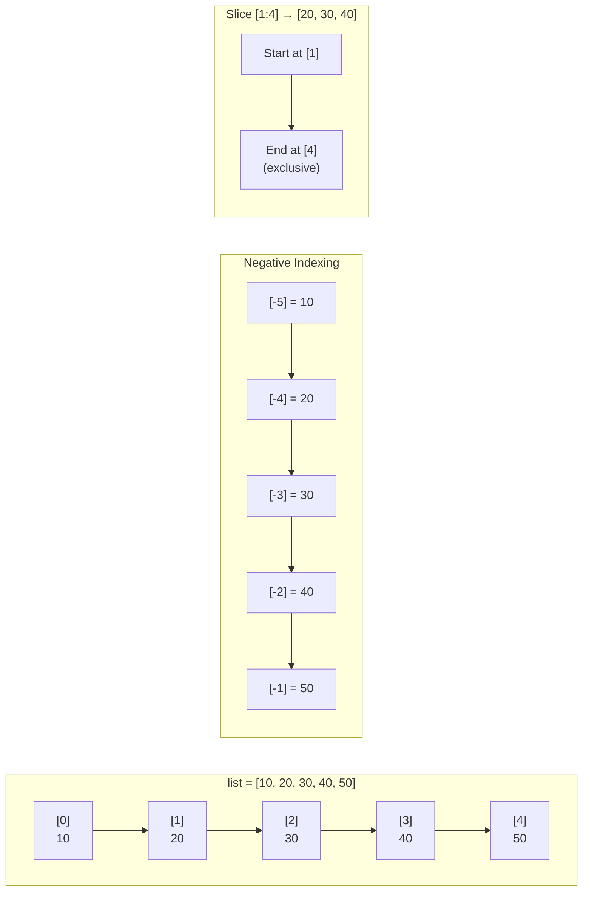
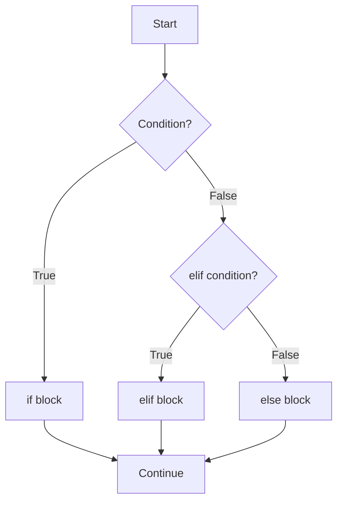
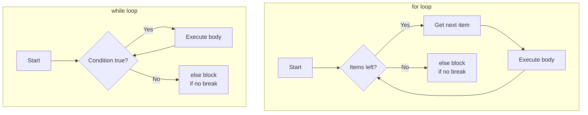
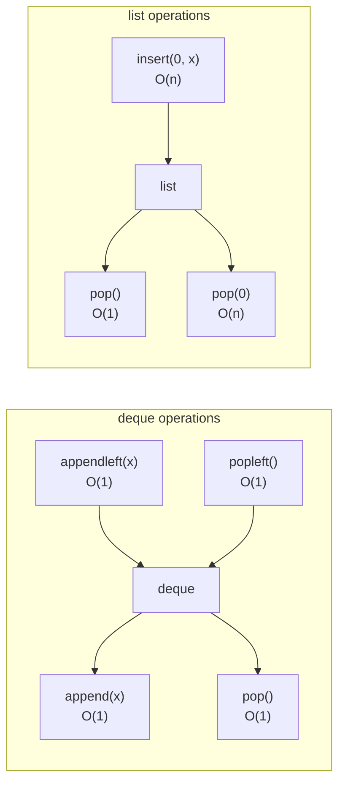
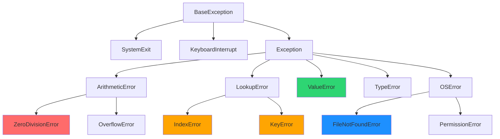
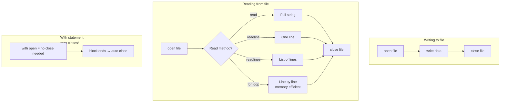

# Week 1 — Python Syntax & Basics

**Goal:** PHP developer → Python comfortable
**Audience:** Laravel/PHP devs jo Python seekhna chahte hain

---

## Day 1 — Setup + Variables + Functions

### Setup — Environment Taiyar Karna

```bash
# 1. Python install check karo
python --version
# Agar nahi hai → python.org se download karo
# Windows: "Add Python to PATH" checkbox tick karna
# Verify:
python -c "print('Python kaam kar raha hai!')"
```

```bash
# 2. Virtual environment — PHP composer ki tarah isolated env
# PHP mein tha: composer install (global)
# Python mein: venv (project-level isolated)
python -m venv venv

# Activate (Windows):
venv\Scripts\activate

# Activate (Mac/Linux):
# source venv/bin/activate

# Dekho prompt badal gaya → (venv) dikhne laga
# Ab jo bhi pip install karo, sirf is project mein lagega
```

```bash
# 3. VS Code setup
# Extensions install karo:
#   - Python (Microsoft)
#   - Pylance
#   - Python Debugger
```

```python
# 4. First file: hello.py
print("Hello, Raushan!")         # PHP: echo "Hello, Raushan!";
print("Python", "seekh", "rahe ho")  # Multiple args
# Output: Python seekh rahe ho
```

```bash
# Run karo:
python hello.py
```

### Variables — PHP se Compare Karo

**PHP mein:**
- Har variable `$` se shuru hota hai
- Dynamic typing — type declare nahi karte
- `$name = "Raushan";`

**Python mein:**
- No `$` — direct name
- Dynamic typing — type runtime decide hota hai
- `name = "Raushan"`

```python
# ---------- BASIC VARIABLES ----------
# PHP: $name = "Raushan"; $age = 24;
name = "Raushan"           # str
age = 24                   # int
height = 5.9               # float
is_developer = True        # bool — Capital T/F! PHP: true/false
salary = None              # None — PHP ka null
languages = ["PHP", "Python"]  # list — PHP ka array

# Type check karo:
print(type(name))           # <class 'str'>
print(type(age))            # <class 'int'>
print(type(height))         # <class 'float'>
print(type(is_developer))   # <class 'bool'>
print(type(salary))         # <class 'NoneType'>

# ---------- DYNAMIC TYPING IN ACTION ----------
# Python mein variable ka type badal sakta hai
x = 42                      # int
print(type(x))              # <class 'int'>
x = "ab ye string hai"      # ab ye string ban gaya!
print(type(x))              # <class 'str'>
# PHP mein bhi aisa hota hai — same flexibility
```

```python
# ---------- NAMING CONVENTIONS ----------
# PHP mein: $camelCase, $snake_case dono chalta hai
# Python mein: snake_case recommended (PEP 8)

# ✅ Pythonic (snake_case):
user_name = "Raushan"
total_amount = 50000
is_active = True

# ❌ Avoid (CamelCase — classes ke liye reserved):
# userName = "Raushan"  ← frowned upon

# ✅ Class ke liye PascalCase:
class UserProfile:
    pass

# Constants — ALL_CAPS:
MAX_RETRIES = 3
PI = 3.14159
```

```python
# ---------- MULTIPLE ASSIGNMENT ----------
# Ek line mein multiple variables
x, y, z = 10, 20, 30
print(x, y, z)                # 10 20 30

# Swap two variables — PHP mein temporary variable chahiye
# PHP: $temp = $a; $a = $b; $b = $temp;
a, b = 10, 20
a, b = b, a                   # Swap! Ek line mein!
print(a, b)                   # 20 10

# Same value multiple variables
p = q = r = 0
print(p, q, r)                # 0 0 0
```

```python
# ---------- f-STRINGS (BEST FEATURE!) ----------
# PHP: echo "Hello, {$name}!";
# PHP: sprintf("Hello, %s!", $name);
# Python f-strings — ekdum clean!

name = "Raushan"
city = "Patna"
age = 24

# Basic f-string:
print(f"Main {name} hoon, {city} se")
# Output: Main Raushan hoon, Patna se

# Expressions inside:
print(f"Agle saal meri age {age + 1} hogi")
# Output: Agle saal meri age 25 hogi

# Format specifiers:
price = 499.5678
print(f"Price: {price:.2f}")          # Price: 499.57 (2 decimal)
print(f"Price: {price:>10.2f}")       # Right-align in 10 chars
print(f"Price: {price:<10.2f}")       # Left-align
print(f"Price: {price:^10.2f}")       # Center-align

# Percentage:
completion = 0.856
print(f"Progress: {completion:.1%}")  # Progress: 85.6%

# Debugging (Python 3.8+):
print(f"{name=}, {age=}")             # name='Raushan', age=24
```

```python
# ---------- OLD STYLE (samajh lo, use mat karo) ----------
# % formatting (PHP sprintf style):
print("Hello, %s! Age: %d" % (name, age))   # Old style

# .format() (middle ground):
print("Hello, {}! Age: {}".format(name, age))
print("Hello, {n}! City: {c}".format(n=name, c=city))

# f-strings >> .format() > % formatting
```

```mermaid
mindmap
  root((Python Variables))
    Dynamic Typing
      type() runtime check
      Variable rebinding
    Naming
      snake_case
      ALL_CAPS constants
      PascalCase classes
    Assignment
      Single: x = 5
      Multiple: a, b = 1, 2
      Swap: a, b = b, a
      Chain: x = y = z = 0
    f-Strings
      f"Hello {name}"
      Expressions
      Format specifiers
```

### Functions — PHP se Compare Karo

```python
# ---------- BASIC FUNCTION ----------
# PHP: function greet($name) { return "Hello, $name!"; }
def greet(name):
    return f"Hello, {name}!"

print(greet("Raushan"))          # Hello, Raushan!
```

```python
# ---------- DEFAULT PARAMETERS ----------
# PHP: function greet($name, $greeting = "Hello")
def greet(name, greeting="Hello"):
    return f"{greeting}, {name}!"

print(greet("Raushan"))               # Hello, Raushan!
print(greet("Raushan", "Namaste"))    # Namaste, Raushan!
print(greet(name="Raushan"))          # Keyword argument bhi chalega
```

```python
# ---------- TYPE HINTS (HIGHLY RECOMMENDED!) ----------
# PHP 7+ mein: function add(int $a, int $b): int
# Python mein:

def add(a: int, b: int) -> int:
    return a + b

# Type hints optional hain, lekin use karo — readability++

def process_user(name: str, age: int, is_active: bool = True) -> dict:
    return {
        "name": name,
        "age": age,
        "active": is_active
    }

# Hint ke saath default value:
def calculate_total(items: list, tax: float = 0.18) -> float:
    return sum(items) * (1 + tax)
```

```python
# ---------- *args — Variable Positional Arguments ----------
# PHP: function sum_all(...$numbers)  // splat operator
def sum_all(*numbers):
    print(f"Type of numbers: {type(numbers)}")  # <class 'tuple'>
    return sum(numbers)

print(sum_all(1, 2, 3))            # 6
print(sum_all(1, 2, 3, 4, 5))      # 15
print(sum_all())                    # 0 (empty tuple)

# *args ko koi bhi name de sakte ho
def log_messages(*messages):
    for i, msg in enumerate(messages, 1):
        print(f"[{i}] {msg}")

log_messages("Start", "Processing", "Done")
# Output:
# [1] Start
# [2] Processing
# [3] Done
```

```python
# ---------- **kwargs — Keyword Arguments ----------
# PHP: function user_info(...$details)  // named variadic
def user_info(**details):
    print(f"Type: {type(details)}")  # <class 'dict'>
    for key, value in details.items():
        print(f"{key}: {value}")

user_info(name="Raushan", city="Patna", role="Developer")
# Output:
# name: Raushan
# city: Patna
# role: Developer

# Mix karo positional + *args + **kwargs:
def complex_func(a, b, *args, option=True, **kwargs):
    print(f"a={a}, b={b}")
    print(f"args={args}")
    print(f"option={option}")
    print(f"kwargs={kwargs}")

complex_func(1, 2, 3, 4, 5, option=False, color="red", size=10)
# a=1, b=2
# args=(3, 4, 5)
# option=False
# kwargs={'color': 'red', 'size': 10}
```

```python
# ---------- UNPACKING — * and ** ----------
# List/tuple unpack in function call:
def multiply(a, b, c):
    return a * b * c

nums = [2, 3, 4]
print(multiply(*nums))             # 24

# Dict unpack:
def create_user(name, age, city):
    return f"{name}, {age}, {city}"

data = {"name": "Raushan", "age": 24, "city": "Patna"}
print(create_user(**data))         # Raushan, 24, Patna

# PHP mein: ...$nums spread operator — same concept
```

```python
# ---------- LAMBDA (Anonymous Functions) ----------
# PHP: $square = fn($n) => $n * $n;
# PHP: $square = function($n) { return $n * $n; };
square = lambda n: n * n
print(square(5))                   # 25

# Multiple parameters:
add = lambda a, b: a + b
print(add(3, 7))                   # 10

# Lambdas mostly higher-order functions ke saath
numbers = [1, 2, 3, 4, 5]
doubled = list(map(lambda x: x * 2, numbers))
print(doubled)                     # [2, 4, 6, 8, 10]

evens = list(filter(lambda x: x % 2 == 0, numbers))
print(evens)                       # [2, 4]
```

```python
# ---------- SCOPE — LEGB Rule ----------
# Python mein variable scope 4 levels:
# L = Local (function ke andar)
# E = Enclosing (nested function)
# G = Global (module level)
# B = Built-in (Python ke built-in functions)

x = "global x"                     # Global scope

def outer():
    x = "outer x"                  # Enclosing scope
    def inner():
        x = "inner x"              # Local scope
        print(f"Inner: {x}")
    inner()
    print(f"Outer: {x}")

outer()
print(f"Global: {x}")
# Output:
# Inner: inner x
# Outer: outer x
# Global: global x

# Global keyword:
count = 0
def increment():
    global count                   # "main global wala use kar raha hoon"
    count += 1

increment()
increment()
print(count)                       # 2
```

```python
# ---------- FUNCTIONS ARE FIRST-CLASS ----------
# Python mein functions ko variable mein store kar sakte ho
def greet(name):
    return f"Hello, {name}!"

my_func = greet                    # No parentheses!
print(my_func("Raushan"))          # Hello, Raushan!

# Function as argument:
def apply(func, value):
    return func(value)

print(apply(greet, "Raushan"))     # Hello, Raushan!
print(apply(lambda x: x ** 2, 5))  # 25

# Function returning function:
def make_multiplier(factor):
    def multiply(n):
        return n * factor
    return multiply

double = make_multiplier(2)
triple = make_multiplier(3)
print(double(5))                   # 10
print(triple(5))                   # 15
```

```python
# ---------- RECURSION ----------
# PHP: function factorial($n) { return $n <= 1 ? 1 : $n * factorial($n-1); }

def factorial(n: int) -> int:
    if n <= 1:
        return 1
    return n * factorial(n - 1)

print(factorial(5))                # 120 (5*4*3*2*1)

# Recursion deep jaane par problem — Python has recursion limit
# Default: 1000
import sys
print(sys.getrecursionlimit())     # 1000

# Badha bhi sakte ho:
sys.setrecursionlimit(2000)
```

### Day 1 — Exercises

```python
# Exercise 1: Fibonacci series
# 0, 1, 1, 2, 3, 5, 8, 13... — first 20 numbers
def fibonacci(n: int) -> list:
    fib = [0, 1]
    for i in range(2, n):
        fib.append(fib[i-1] + fib[i-2])
    return fib

print(fibonacci(10))   # [0, 1, 1, 2, 3, 5, 8, 13, 21, 34]

# Exercise 2: Is Palindrome?
def is_palindrome(text: str) -> bool:
    clean = text.lower().replace(" ", "")
    return clean == clean[::-1]

print(is_palindrome("racecar"))     # True
print(is_palindrome("A man a plan a canal Panama"))  # True

# Exercise 3: Calculator using *args
def calculator(operation: str, *numbers) -> float:
    if operation == "sum":
        return sum(numbers)
    elif operation == "avg":
        return sum(numbers) / len(numbers) if numbers else 0
    elif operation == "max":
        return max(numbers)
    elif operation == "min":
        return min(numbers)
    else:
        return None

print(calculator("sum", 10, 20, 30))     # 60
print(calculator("avg", 10, 20, 30))     # 20.0
print(calculator("max", 10, 20, 30))     # 30
```

### 🎯 Tumne Seekha — Day 1

- Python setup + virtual environment banana
- Variables — no `$`, `None` instead of `null`, `True`/`False` capital letters
- Dynamic typing — variable type runtime change ho sakta hai
- f-strings — PHP `{$var}` se zyada clean
- Functions — `def` keyword, type hints, default parameters
- `*args` / `**kwargs` — PHP `...$args` ki tarah
- Lambdas — anonymous functions ek line mein
- LEGB scope rule — Local → Enclosing → Global → Built-in
- Functions are first-class — pass karo, return karo, store karo

---

## Day 2 — Data Types: Lists, Tuples, Dicts, Sets + Comprehensions + enumerate/zip

### Lists — PHP ka Indexed Array

PHP mein `$skills = ["PHP", "Laravel", "Vue"];` → Python mein `skills = ["PHP", "Laravel", "Vue"]`

```python
# ---------- CREATION ----------
empty_list = []                    # PHP: $empty = [];
numbers = [1, 2, 3, 4, 5]
mixed = [1, "hello", 3.14, True, None]  # Mixed types allowed!
nested = [[1, 2], [3, 4], [5, 6]]       # Nested lists

# list() constructor:
chars = list("Python")
print(chars)                       # ['P', 'y', 't', 'h', 'o', 'n']

range_list = list(range(1, 6))
print(range_list)                  # [1, 2, 3, 4, 5]
```

```python
# ---------- INDEXING ----------
# PHP: $skills[0], $skills[count($skills)-1]
skills = ["PHP", "Laravel", "Vue", "Python", "FastAPI"]

print(skills[0])                   # PHP — first element
print(skills[-1])                  # FastAPI — last element!
print(skills[-2])                  # Python — second-last

# Negative indexing — PHP mein nahi hai!
# -1 = last, -2 = second-last...
```

```python
# ---------- SLICING [start:end:step] ----------
# PHP mein: array_slice($skills, 1, 2)
nums = [0, 1, 2, 3, 4, 5, 6, 7, 8, 9]

print(nums[2:5])        # [2, 3, 4]      — index 2 se 4 tak (5 excluded)
print(nums[:4])         # [0, 1, 2, 3]   — start se index 3 tak
print(nums[6:])         # [6, 7, 8, 9]   — index 6 se end tak
print(nums[:])          # [0..9]          — poori copy
print(nums[::2])        # [0, 2, 4, 6, 8] — har doosra
print(nums[::-1])       # [9, 8, 7..0]   — reverse! (PHP: array_reverse)
print(nums[1:8:3])      # [1, 4, 7]      — index 1 se 7 tak, har teesra
```



```python
# ---------- LIST METHODS ----------
fruits = ["apple", "banana", "cherry"]

# append — end mein add (PHP: $fruits[] = "date";)
fruits.append("date")
print(fruits)                      # ['apple', 'banana', 'cherry', 'date']

# insert — kisi bhi index pe (PHP: array_splice)
fruits.insert(0, "apricot")
print(fruits)                      # ['apricot', 'apple', 'banana', 'cherry', 'date']

# extend — multiple elements add (PHP: array_merge)
more_fruits = ["elderberry", "fig"]
fruits.extend(more_fruits)
print(fruits)                      # ['apricot', 'apple', 'banana', 'cherry', 'date', 'elderberry', 'fig']

# remove — value se delete (first occurrence)
fruits.remove("banana")
print(fruits)                      # ['apricot', 'apple', 'cherry', 'date', 'elderberry', 'fig']

# pop — index se delete + return karo
popped = fruits.pop(0)             # PHP: array_shift
print(popped)                      # apricot
print(fruits)                      # ['apple', 'cherry', 'date', 'elderberry', 'fig']

# pop() — last element (PHP: array_pop)
last = fruits.pop()
print(last)                        # fig

# index — find position (PHP: array_search)
print(fruits.index("cherry"))      # 1

# count — occurrences
items = [1, 2, 2, 3, 2, 4]
print(items.count(2))              # 3

# sort — ascending (PHP: sort)
nums = [3, 1, 4, 1, 5, 9]
nums.sort()
print(nums)                        # [1, 1, 3, 4, 5, 9]

# sort descending:
nums.sort(reverse=True)
print(nums)                        # [9, 5, 4, 3, 1, 1]

# sorted() — original list preserve karta hai
nums = [3, 1, 4]
sorted_nums = sorted(nums)
print(nums, sorted_nums)           # [3, 1, 4] [1, 3, 4]

# reverse — list ko ulta karo (PHP: array_reverse)
nums.reverse()
print(nums)                        # [4, 1, 3]

# clear — saaf karo
nums.clear()
print(nums)                        # []

# copy — shallow copy (PHP: $copy = $original)
original = [1, 2, 3]
shallow = original.copy()          # original[:] bhi same
shallow[0] = 99
print(original)                    # [1, 2, 3] — safe!
```

```python
# ---------- LIST OPERATIONS ----------
# Concatenation (PHP: array_merge)
a = [1, 2, 3]
b = [4, 5, 6]
print(a + b)                       # [1, 2, 3, 4, 5, 6]

# Repetition
print(["ha"] * 3)                  # ['ha', 'ha', 'ha']

# Membership (PHP: in_array)
print(3 in [1, 2, 3])              # True
print(5 not in [1, 2, 3])          # True

# Length (PHP: count)
print(len([1, 2, 3, 4]))          # 4

# Min, Max, Sum
numbers = [45, 12, 78, 34, 90]
print(min(numbers))                 # 12
print(max(numbers))                 # 90
print(sum(numbers))                 # 259

# Any / All
print(any([False, True, False]))   # True (koi ek bhi True?)
print(all([True, True, True]))     # True (sab True?)
```

### Tuples — Immutable List (Change Nahi Kar Sakte)

```python
# ---------- CREATION ----------
# PHP mein tuples nahi hain — indexed array se kaam chalana padta hai
# Python mein — immutable ordered collection

empty = ()                         # Empty tuple
single = (42,)                     # Single element — comma zaroori hai!
coordinates = (28.6139, 77.2090)   # Delhi lat/lng
person = ("Raushan", 24, "Patna")

# Tuple without parentheses — tuple packing:
colors = "red", "green", "blue"    # Ye bhi tuple hai!
print(type(colors))                # <class 'tuple'>
```

```python
# ---------- WHY TUPLE? ----------
# 1. Immutable — data safe rahta hai
config = ("localhost", 3306, "root")
# config[0] = "127.0.0.1"  ❌ Error! Tuple change nahi kar sakte

# 2. Dictionary keys — list nahi, tuple ho sakta hai
locations = {
    (28.6139, 77.2090): "Delhi",
    (19.0760, 72.8777): "Mumbai"
}

# 3. Multiple return values — function se tuple return
def get_min_max(numbers):
    return min(numbers), max(numbers)

result = get_min_max([3, 7, 2, 9, 1])
print(result)                      # (1, 9) — tuple
print(type(result))                # <class 'tuple'>
```

```python
# ---------- TUPLE UNPACKING ----------
# PHP: list($name, $age, $city) = ["Raushan", 24, "Patna"];
person = ("Raushan", 24, "Patna")
name, age, city = person           # Unpacking
print(f"{name}, {age}, {city}")    # Raushan, 24, Patna

# Star unpacking — * remaining elements capture karta hai
first, *middle, last = [1, 2, 3, 4, 5]
print(first)                       # 1
print(middle)                      # [2, 3, 4]
print(last)                        # 5

# Ignore values with _
data = ("Raushan", 24, "Patna", "Developer")
name, _, city, _ = data            # _ means "mujhe nahi chahiye"
print(name, city)                  # Raushan Patna
```

### Dictionaries — PHP ka Associative Array

PHP: `$user = ['name' => 'Raushan', 'age' => 24];`
Python: `user = {"name": "Raushan", "age": 24}`

```python
# ---------- CREATION ----------
empty = {}

user = {
    "name": "Raushan",
    "age": 24,
    "city": "Patna",
    "skills": ["Laravel", "Python", "FastAPI"],
    "is_active": True
}

# dict() constructor:
alt = dict(name="Raushan", age=24, city="Patna")
print(alt)                         # {'name': 'Raushan', 'age': 24, 'city': 'Patna'}
```

```python
# ---------- ACCESS ----------
print(user["name"])                # Raushan
# print(user["email"])             ❌ KeyError — key exist nahi karti

# Safe access with .get():
print(user.get("email"))           # None — error nahi, None return
print(user.get("email", "N/A"))    # N/A — default value

# .setdefault() — agar key nahi hai to set karo
user.setdefault("country", "India")
print(user["country"])             # India
user.setdefault("country", "USA")  # Already exists, ignore
print(user["country"])             # India
```

```python
# ---------- MODIFY ----------
# Add / Update:
user["email"] = "raushan@example.com"
user["age"] = 25                   # Update existing

# Multiple at once:
user.update({"city": "Bangalore", "role": "Senior Dev"})
print(user["city"])                # Bangalore

# Delete:
del user["country"]                # PHP: unset($user['country'])
# removed = user.pop("role")       # Delete + return value

# Remove all:
# user.clear()
```

```python
# ---------- ITERATION ----------
user = {"name": "Raushan", "age": 24, "city": "Patna"}

# Keys:
for key in user:
    print(key)                     # name, age, city

# Keys explicitly:
for key in user.keys():
    print(key)

# Values:
for value in user.values():
    print(value)

# Key-Value pairs:
for key, value in user.items():    # PHP: foreach($user as $key => $value)
    print(f"{key}: {value}")

# Check existence:
print("name" in user)              # True — PHP: array_key_exists
print("email" not in user)         # True
```

```python
# ---------- DICT COMPREHENSION ----------
# PHP mein nahi hai — foreach se karna padta hai
# Ek line mein dict banao!

# Squares:
squares = {n: n**2 for n in range(1, 6)}
# {1: 1, 2: 4, 3: 9, 4: 16, 5: 25}

# Filter:
even_squares = {n: n**2 for n in range(1, 11) if n % 2 == 0}
# {2: 4, 4: 16, 6: 36, 8: 64, 10: 100}

# Reverse keys and values:
original = {"a": 1, "b": 2, "c": 3}
reversed_dict = {v: k for k, v in original.items()}
# {1: 'a', 2: 'b', 3: 'c'}

# From two lists:
names = ["Raushan", "Priya", "Raj"]
ages = [24, 25, 23]
people = {name: age for name, age in zip(names, ages)}
# {'Raushan': 24, 'Priya': 25, 'Raj': 23}
```

```python
# ---------- DICT METHODS ----------
inventory = {"apple": 5, "banana": 3}

# Keys and values as lists:
print(list(inventory.keys()))      # ['apple', 'banana']
print(list(inventory.values()))    # [5, 3]
print(list(inventory.items()))     # [('apple', 5), ('banana', 3)]

# Merge (Python 3.9+):
stock = {"cherry": 10, "dates": 7}
inventory |= stock                 # PHP: $inventory += $stock  (sort of)
print(inventory)                   # {'apple': 5, 'banana': 3, 'cherry': 10, 'dates': 7}

# Merge with | operator (Python 3.9+)
merged = {"a": 1} | {"b": 2}
print(merged)                      # {'a': 1, 'b': 2}
```

### Sets — Unique Values Ka Collection

PHP mein `array_unique()` use karte the — Python mein set built-in hai!

```python
# ---------- CREATION ----------
empty = set()                      # {} empty dict banayega, set() use karo
tags = {"python", "ai", "python", "ml", "ai"}
print(tags)                        # {'python', 'ai', 'ml'} — duplicates auto-remove

# From list:
numbers = [1, 2, 2, 3, 3, 3, 4]
unique = set(numbers)
print(unique)                      # {1, 2, 3, 4}
```

```python
# ---------- SET OPERATIONS ----------
a = {1, 2, 3, 4, 5}
b = {4, 5, 6, 7, 8}

# Union (PHP: array_unique(array_merge(...)))
print(a | b)                       # {1, 2, 3, 4, 5, 6, 7, 8}
print(a.union(b))                  # Same

# Intersection
print(a & b)                       # {4, 5}
print(a.intersection(b))

# Difference (jo a mein hai, b mein nahi)
print(a - b)                       # {1, 2, 3}
print(a.difference(b))

# Symmetric Difference (dono mein common nahi hai)
print(a ^ b)                       # {1, 2, 3, 6, 7, 8}
print(a.symmetric_difference(b))
```

```python
# ---------- SET METHODS ----------
s = {1, 2, 3}

# Add
s.add(4)                           # {1, 2, 3, 4}
s.add(1)                           # Already hai — kuch nahi hota

# Remove
s.remove(2)                        # {1, 3, 4} — error agar nahi hai
s.discard(10)                      # No error — safe!

# Pop (remove random element)
popped = s.pop()                   # Koi bhi element

# Clear
s.clear()                          # set()

# Subset/Superset:
x = {1, 2}
y = {1, 2, 3, 4}
print(x.issubset(y))               # True — x, y ka subset hai
print(y.issuperset(x))             # True — y, x ka superset hai

# Disjoint:
a = {1, 2}
b = {3, 4}
print(a.isdisjoint(b))             # True — koi common nahi
```

### List Comprehensions — PHP Developers Ke Liye Magic!

PHP mein: `array_map`, `array_filter`, `foreach` loop se karte the
Python mein: Ek line mein sab!

```python
# ---------- BASIC ----------
# PHP: $squares = array_map(fn($n) => $n * $n, range(1, 5));
squares = [n**2 for n in range(1, 6)]
print(squares)                     # [1, 4, 9, 16, 25]

# With condition:
# PHP: array_filter($nums, fn($n) => $n % 2 == 0)
evens = [n for n in range(1, 11) if n % 2 == 0]
print(evens)                       # [2, 4, 6, 8, 10]

# With if-else (ternary inside):
labels = ["even" if n % 2 == 0 else "odd" for n in range(1, 6)]
print(labels)                      # ['odd', 'even', 'odd', 'even', 'odd']

# Multiple for loops (nested):
pairs = [(x, y) for x in [1, 2] for y in ["a", "b"]]
print(pairs)                       # [(1, 'a'), (1, 'b'), (2, 'a'), (2, 'b')]
```

```python
# ---------- PRACTICAL EXAMPLES ----------
# Strings transform:
words = ["hello", "world", "python"]
uppered = [w.upper() for w in words]
print(uppered)                     # ['HELLO', 'WORLD', 'PYTHON']

# Filter with condition:
skills = ["PHP", "Laravel", "Python", "Vue", "FastAPI"]
has_a = [s for s in skills if "a" in s.lower()]
print(has_a)                       # ['Laravel', 'FastAPI']

# Flatten a list of lists:
matrix = [[1, 2], [3, 4], [5, 6]]
flat = [num for row in matrix for num in row]
print(flat)                        # [1, 2, 3, 4, 5, 6]

# Extract dict values:
users = [
    {"name": "Raushan", "age": 24},
    {"name": "Priya", "age": 25},
    {"name": "Raj", "age": 23}
]
names = [u["name"] for u in users]
print(names)                       # ['Raushan', 'Priya', 'Raj']
```

### enumerate() and zip() — Powerful Iteration Tools

```python
# ---------- enumerate() — Index Bhi Chahiye ----------
# PHP: foreach($skills as $i => $skill) { ... }
skills = ["PHP", "Laravel", "Vue", "Python"]

# Default start = 0:
for i, skill in enumerate(skills):
    print(f"{i}: {skill}")
# Output:
# 0: PHP
# 1: Laravel
# 2: Vue
# 3: Python

# Custom start:
for i, skill in enumerate(skills, start=1):
    print(f"{i}. {skill}")
# Output:
# 1. PHP
# 2. Laravel
# 3. Vue
# 4. Python
```

```python
# ---------- zip() — Do Lists Ko Sath Mein Loop Karo ----------
# PHP: array_map(null, $names, $ages)
names = ["Raushan", "Priya", "Raj"]
ages = [24, 25, 23]
cities = ["Patna", "Delhi", "Mumbai"]

for name, age in zip(names, ages):
    print(f"{name} is {age} years old")

# Three lists:
for name, age, city in zip(names, ages, cities):
    print(f"{name}, {age}, {city}")

# zip to dict:
user_dict = dict(zip(names, ages))
print(user_dict)                   # {'Raushan': 24, 'Priya': 25, 'Raj': 23}

# Unzip:
pairs = [("a", 1), ("b", 2), ("c", 3)]
letters, numbers = zip(*pairs)     # *pairs unpacks the list
print(letters)                     # ('a', 'b', 'c')
print(numbers)                     # (1, 2, 3)
```

### Data Type Conversion

```python
# JavaScript/PHP mein type coercion hota hai
# Python mein explicit conversion chahiye

# str to int:
age = "24"
print(int(age) + 1)                # 25

# int to str:
print("Age: " + str(24))           # Age: 24
# print("Age: " + 24)              ❌ TypeError!

# To list:
print(list("hello"))               # ['h', 'e', 'l', 'l', 'o']

# To tuple:
print(tuple([1, 2, 3]))           # (1, 2, 3)

# To set:
print(set([1, 2, 2, 3]))          # {1, 2, 3}

# To dict:
print(dict([("a", 1), ("b", 2)]))  # {'a': 1, 'b': 2}
```

### Day 2 — Exercises

```python
# Exercise 1: Merge two sorted lists
def merge_sorted(a: list, b: list) -> list:
    """Do sorted list ko merge karo sorted order mein"""
    result = []
    i = j = 0
    while i < len(a) and j < len(b):
        if a[i] < b[j]:
            result.append(a[i])
            i += 1
        else:
            result.append(b[j])
            j += 1
    result.extend(a[i:])
    result.extend(b[j:])
    return result

print(merge_sorted([1, 3, 5], [2, 4, 6]))  # [1, 2, 3, 4, 5, 6]

# Exercise 2: Word frequency counter
def word_freq(text: str) -> dict:
    words = text.lower().split()
    return {word: words.count(word) for word in set(words)}

sentence = "python is great and python is fun"
print(word_freq(sentence))
# {'python': 2, 'is': 2, 'great': 1, 'and': 1, 'fun': 1}

# Exercise 3: Find common elements in three lists
def common_in_three(a: list, b: list, c: list) -> list:
    return list(set(a) & set(b) & set(c))

print(common_in_three([1,2,3,4], [2,4,6,8], [2,3,4,5]))  # [2, 4]

# Exercise 4: Transpose a matrix using zip
matrix = [
    [1, 2, 3],
    [4, 5, 6],
    [7, 8, 9]
]
transposed = list(zip(*matrix))
print(transposed)                  # [(1, 4, 7), (2, 5, 8), (3, 6, 9)]
```

### 🎯 Tumne Seekha — Day 2

- **Lists:** PHP indexed array jaisa, lekin negative indexing + slicing alag feature
- **Tuples:** Immutable ordered collection — PHP mein nahi hai, data integrity ke liye
- **Dicts:** PHP associative array jaisa, lekin `.get()` safe access, dict comprehension
- **Sets:** Unique values, union/intersection/difference — PHP `array_unique` se powerful
- **List comprehensions:** `[x for x in list if cond]` — PHP `array_filter`/`array_map` ka replacement
- **enumerate:** Index ke saath loop — PHP `foreach($a as $i => $v)`
- **zip:** Multiple lists ek saath loop — PHP `array_map(null, $a, $b)`
- **Slicing:** `list[start:end:step]` — negative indexes, reverse

---

## Day 3 — Control Flow: if/else, Loops, range, Ternary

### if/elif/else — PHP se Compare

```python
# ---------- BASIC if/elif/else ----------
# PHP: if ($age >= 18) { ... } else if ($age >= 13) { ... } else { ... }
# Python mein: elif (else if nahi!)

age = 24

if age >= 18:
    print("You are an adult")
elif age >= 13:
    print("You are a teenager")
else:
    print("You are a child")

# Output: You are an adult
```

```python
# ---------- TRUTHY/FALSY ----------
# PHP: "", 0, "0", null, false, [] → falsy
# Python: "", 0, 0.0, None, [], {}, (), set() → falsy

# Python mein direct check karo:
name = ""
if name:                           # Empty string → False
    print("Name hai")
else:
    print("Name nahi hai")         # Ye chalega

# PHP mein: if ($name) { ... }
# Python mein same pattern — cleaner!

numbers = []
if not numbers:                    # Empty list → False
    print("List khali hai")
```

```python
# ---------- COMPARISON OPERATORS ----------
# PHP: == (value), === (value + type)
# Python: == (value), is (identity/memory location)

a = 5
b = "5"

print(a == b)                      # False! (int != str — no type coercion)
# Python type coercion nahi karta — PHP karta hai ($a == $b true hota)

# Python chaining:
x = 10
print(5 < x < 15)                  # True — PHP mein aisa nahi likh sakte
print(5 < x and x < 15)            # Same — but chaining cleaner hai

print(x == 10)                     # True — value check
print(x is 10)                     # True — identity check (small ints cached)

# 'is' use karo None ke saath:
value = None
if value is None:                  # ✅ Pythonic
    print("Value is None")
if value == None:                  # ❌ Works but not idiomatic
    print("Same")
```

```python
# ---------- TERNARY OPERATOR ----------
# PHP: $status = $age >= 18 ? "adult" : "minor";
# Python:

age = 20
status = "adult" if age >= 18 else "minor"
print(status)                      # adult

# Nested ternary:
score = 85
grade = "A" if score >= 90 else "B" if score >= 75 else "C" if score >= 60 else "F"
print(grade)                       # B

# Python mein ternary expression hai, statement nahi
# Python mein: value_if_true if condition else value_if_false
```

```python
# ---------- LOGICAL OPERATORS ----------
# PHP: && (and), || (or), ! (not)
# Python: and, or, not (words!)

age = 25
has_license = True

if age >= 18 and has_license:
    print("Gadi chala sakte ho")

# Short-circuit evaluation:
def get_user():
    print("get_user called!")
    return {"name": "Raushan"}

user = None
result = user or get_user()        # user falsy → get_user call hoga
print(result)                      # {'name': 'Raushan'}

# 'and' / 'or' return actual value, not True/False:
print(0 or 42)                     # 42
print("" or "default")             # default
print("hello" and "world")         # world
```



### for Loops

```python
# ---------- range() VARIATIONS ----------
# PHP: for ($i = 0; $i < 5; $i++) { ... }
# Python: for i in range(5): ...

# range(stop):
for i in range(5):
    print(i)                       # 0, 1, 2, 3, 4

# range(start, stop):
for i in range(1, 6):
    print(i)                       # 1, 2, 3, 4, 5

# range(start, stop, step):
for i in range(0, 10, 2):
    print(i)                       # 0, 2, 4, 6, 8

# Reverse:
for i in range(10, 0, -1):
    print(i)                       # 10, 9, 8...1

# range returns a range object (lazy — memory efficient):
r = range(5)
print(r)                           # range(0, 5)
print(list(r))                     # [0, 1, 2, 3, 4]
print(len(r))                      # 5
print(3 in r)                      # True
```

```python
# ---------- ITERATING OVER COLLECTIONS ----------
# List:
skills = ["PHP", "Laravel", "Vue"]
for skill in skills:
    print(skill)

# String:
for char in "Python":
    print(char)                    # P, y, t, h, o, n

# Tuple:
for coord in (28.61, 77.21):
    print(coord)

# Dict keys:
user = {"name": "Raushan", "age": 24}
for key in user:
    print(key)                     # name, age

# Dict values:
for val in user.values():
    print(val)

# Dict items:
for key, val in user.items():
    print(f"{key}: {val}")
```

```python
# ---------- enumerate + zip in Loops ----------
# enumerate — index + value ek saath:
fruits = ["apple", "banana", "cherry"]
for i, fruit in enumerate(fruits):
    print(f"{i}: {fruit}")

# enumerate with start:
for i, fruit in enumerate(fruits, start=1):
    print(f"{i}. {fruit}")

# zip — multiple lists ek saath:
names = ["Raushan", "Priya", "Raj"]
scores = [85, 92, 78]
grades = ["A", "A+", "B"]

for name, score, grade in zip(names, scores, grades):
    print(f"{name}: {score} → {grade}")

# zip stops at shortest:
a = [1, 2, 3, 4]
b = ["x", "y", "z"]              # One shorter
for pair in zip(a, b):
    print(pair)                    # (1, 'x'), (2, 'y'), (3, 'z')
```

```python
# ---------- for-else — Unique Python Feature ----------
# PHP mein nahi hai!
# else tab chalega jab loop normally complete hua (break nahi hua)

# Example 1: Find a number
numbers = [1, 3, 5, 7, 9]
target = 4

for n in numbers:
    if n == target:
        print(f"Mil gaya: {n}")
        break
else:
    print(f"{target} nahi mila")   # Ye chalega kyunki break nahi hua

# Example 2: Prime number check
num = 17
for i in range(2, num):
    if num % i == 0:
        print(f"{num} prime nahi hai")
        break
else:
    print(f"{num} prime hai")      # Chalega kyunki koi divisor nahi mila
```

### while Loops

```python
# ---------- BASIC ----------
# PHP: while ($count < 5) { ... $count++; }
count = 0
while count < 5:
    print(count)
    count += 1                     # Python mein ++ nahi hai!
# Output: 0, 1, 2, 3, 4

# Input loop:
while True:
    response = input("quit likho to band karein: ")
    if response.lower() == "quit":
        break
    print(f"Tumne likha: {response}")
```

```python
# ---------- while-else ----------
# else tab chalega jab condition False hui (break se nahi ruka)

attempts = 0
while attempts < 3:
    password = input("Password: ")
    if password == "secret":
        print("Welcome!")
        break
    attempts += 1
else:
    print("Locked out!")           # 3 attempts ke baad
```

### break, continue, pass

```python
# break — loop tod do:
for i in range(10):
    if i == 5:
        break
    print(i)                       # 0, 1, 2, 3, 4

# continue — iteration skip karo:
for i in range(5):
    if i == 2:
        continue
    print(i)                       # 0, 1, 3, 4

# pass — kuch mat karo (placeholder):
for i in range(5):
    if i == 3:
        pass                       # Kuch nahi karna, lekin syntax error nahi chahiye
    print(i)

# pass vs continue:
# pass = "kuch nahi karo, agey bado"
# continue = "baaki loop skip karo, next iteration pe jao"
```

```python
# ---------- NESTED LOOPS ----------
# Multiplication table:
for i in range(1, 4):
    for j in range(1, 4):
        print(f"{i} x {j} = {i*j}", end="\t")
    print()                        # New line
# Output:
# 1 x 1 = 1   1 x 2 = 2   1 x 3 = 3
# 2 x 1 = 2   2 x 2 = 4   2 x 3 = 6
# 3 x 1 = 3   3 x 2 = 6   3 x 3 = 9

# Break outer loop:
for i in range(5):
    for j in range(5):
        if i == 2 and j == 2:
            break
        print(f"({i},{j})", end=" ")
    print()
```



### Match-Case (Python 3.10+) — PHP match jaisa

```python
# PHP 8+: match($status) { 'active' => ... }
# Python 3.10+: match-case

def handle_status(status: str) -> str:
    match status:
        case "active":
            return "User active hai"
        case "inactive":
            return "User inactive hai"
        case "banned":
            return "User banned hai"
        case _:                     # default — PHP match ka default
            return "Unknown status"

print(handle_status("active"))     # User active hai

# Match with patterns:
def process_command(command: str) -> None:
    match command.split():
        case ["quit"]:
            print("Goodbye!")
        case ["hello", name]:
            print(f"Hello, {name}!")
        case ["add", *items]:
            print(f"Adding: {items}")
        case _:
            print("Unknown command")

process_command("hello Raushan")   # Hello, Raushan!
process_command("add 1 2 3")       # Adding: ('1', '2', '3')
```

### Day 3 — Exercises

```python
# Exercise 1: Number guessing game
import random

secret = random.randint(1, 100)
attempts = 0

print("1 se 100 ke beech number guess karo!")
while True:
    try:
        guess = int(input("Your guess: "))
        attempts += 1
        if guess < secret:
            print("Chhota hai")
        elif guess > secret:
            print("Bada hai")
        else:
            print(f"Correct! {attempts} attempts mein guess kiya!")
            break
    except ValueError:
        print("Number daalo bhai!")

# Exercise 2: Diamond pattern
def print_diamond(n: int) -> None:
    # Upper half
    for i in range(n):
        print(" " * (n - i - 1) + "*" * (2 * i + 1))
    # Lower half
    for i in range(n - 2, -1, -1):
        print(" " * (n - i - 1) + "*" * (2 * i + 1))

print_diamond(4)
#    *
#   ***
#  *****
# *******
#  *****
#   ***
#    *

# Exercise 3: Prime number checker
def is_prime(n: int) -> bool:
    if n < 2:
        return False
    for i in range(2, int(n ** 0.5) + 1):
        if n % i == 0:
            return False
    return True

# Exercise 4: FizzBuzz with enumerate
# 1 se 50 tak, lekin index bhi print karo
for i, num in enumerate(range(1, 51), start=1):
    output = ""
    if num % 3 == 0:
        output += "Fizz"
    if num % 5 == 0:
        output += "Buzz"
    print(f"{i:2d}. {output or num}")
```

### 🎯 Tumne Seekha — Day 3

- **if/elif/else:** PHP ka `elseif` — Python mein `elif` likhte hain
- **Truthy/Falsy:** Empty strings, lists, 0, None → False — direct check karo
- **Ternary:** `x if cond else y` — PHP `cond ? x : y` jaisa
- **range():** `range(start, stop, step)` — PHP for loop ka elegant replacement
- **for-else:** Unique Python feature — else tab chalega jab loop break na ho
- **enumerate/zip:** Index ke saath loop, multiple lists ek saath
- **break/continue/pass:** break = loop tod do, continue = iteration skip, pass = placeholder
- **match-case:** Python 3.10+ pattern matching — PHP 8+ match jaisa

---

## Day 4 — Collections: deque, Counter, defaultdict, namedtuple

PHP mein arrays sab kuch hain — indexed, associative, stack, queue, counter, sab!
Python mein specialized collections hain — har use-case ke liye alag tool.

```python
# Import:
from collections import deque, Counter, defaultdict, namedtuple
```

### deque — Double-Ended Queue

PHP mein array se stack/queue banane ke liye `array_push`, `array_pop`, `array_shift`, `array_unshift`.
Python deque dono ends se fast operations deta hai — O(1)!

```python
# ---------- CREATION ----------
# PHP: $queue = []; $queue[] = "a"; array_shift($queue);
queue = deque()                    # Empty deque
queue = deque(["a", "b", "c"])    # From list
print(queue)                       # deque(['a', 'b', 'c'])

# Max length — auto remove oldest:
buffer = deque(maxlen=3)           # Sirf 3 elements store karega
```

```python
# ---------- OPERATIONS ----------
tasks = deque(["task1", "task2", "task3"])

# Add to right end (PHP: array_push):
tasks.append("task4")
print(tasks)                       # deque(['task1', 'task2', 'task3', 'task4'])

# Add to left end (PHP: array_unshift):
tasks.appendleft("task0")
print(tasks)                       # deque(['task0', 'task1', 'task2', 'task3', 'task4'])

# Remove from right (PHP: array_pop):
last = tasks.pop()
print(last)                        # task4

# Remove from left (PHP: array_shift):
first = tasks.popleft()
print(first)                       # task0

print(tasks)                       # deque(['task1', 'task2', 'task3'])
```

```python
# ---------- ROTATE ----------
# deque ko ghuma do — unique feature!
items = deque([1, 2, 3, 4, 5])

items.rotate(2)                    # Right rotate by 2
print(items)                       # deque([4, 5, 1, 2, 3])

items.rotate(-1)                   # Left rotate by 1
print(items)                       # deque([5, 1, 2, 3, 4])

# Use case: circular buffer, recent items
recent = deque(maxlen=5)

for i in range(20):
    recent.append(f"action_{i}")

print(recent)
# deque(['action_15', 'action_16', 'action_17', 'action_18', 'action_19'])
```

```python
# ---------- DEQUE AS STACK (LIFO) ----------
# Stack — last in, first out. PHP: array_push + array_pop
stack = deque()
stack.append("page1")              # Push
stack.append("page2")
stack.append("page3")
print(stack.pop())                 # page3 — last jo gaya, wo nikla
print(stack.pop())                 # page2
print(stack.pop())                 # page1

# deque as Queue (FIFO):
queue = deque()
queue.append("customer1")          # Enqueue
queue.append("customer2")
queue.append("customer3")
print(queue.popleft())             # customer1 — pehle wala nikla
print(queue.popleft())             # customer2
```



### Counter — Frequency Count Ka Boss

PHP mein `array_count_values()` hota hai — ek baar use karo, bhool jao.
Python Counter — frequency counting ka dedicated tool!

```python
# ---------- BASIC ----------
# PHP: $counts = array_count_values($items);
items = ["apple", "banana", "apple", "orange", "banana", "apple"]
counter = Counter(items)
print(counter)                     # Counter({'apple': 3, 'banana': 2, 'orange': 1})
```

```python
# ---------- METHODS ----------
# Most common:
print(counter.most_common())       # [('apple', 3), ('banana', 2), ('orange', 1)]
print(counter.most_common(2))      # [('apple', 3), ('banana', 2)] — top 2

# Access count:
print(counter["apple"])            # 3
print(counter["mango"])            # 0 (error nahi, 0 return — dict se different!)

# Elements (iterator):
print(list(counter.elements()))    # ['apple', 'apple', 'apple', 'banana', 'banana', 'orange']

# Arithmetic:
a = Counter(["a", "b", "c", "a"])
b = Counter(["a", "b", "b", "d"])
print(a + b)                       # Counter({'a': 3, 'b': 3, 'c': 1, 'd': 1})
print(a - b)                       # Counter({'a': 1, 'c': 1}) (positive counts only)
print(a & b)                       # Counter({'a': 1, 'b': 1}) (intersection — min)
print(a | b)                       # Counter({'a': 2, 'b': 2, 'c': 1, 'd': 1}) (union — max)
```

```python
# ---------- PRACTICAL ----------
# Character frequency:
text = "mississippi"
char_count = Counter(text)
print(char_count)                  # Counter({'i': 4, 's': 4, 'p': 2, 'm': 1})
print(char_count.most_common(3))   # [('i', 4), ('s', 4), ('p', 2)]

# Word frequency in a sentence:
sentence = "python is great and python is powerful python is fun"
words = sentence.lower().split()
word_count = Counter(words)
for word, count in word_count.most_common(3):
    print(f"{word}: {count}")
# Output:
# python: 3
# is: 3
# great: 1

# Counter from dict:
freq = Counter({"a": 5, "b": 3})
print(freq)                        # Counter({'a': 5, 'b': 3})
```

### defaultdict — Default Value Wala Dict

PHP mein: `$counts[$key] = ($counts[$key] ?? 0) + 1;` — har baar check karna padta hai.
Python defaultdict — missing key pe auto default value!

```python
# ---------- BASIC ----------
# PHP: $grouped = []; foreach($items as $item) { $grouped[$item['type']][] = $item; }
# Python defaultdict:

from collections import defaultdict

# Normal dict se compare karo:
items = ["apple", "ball", "apple", "cat", "ball", "apple"]

# Dict approach — har baar check karna:
counts = {}
for item in items:
    if item in counts:             # PHP: isset check
        counts[item] += 1
    else:
        counts[item] = 1

# defaultdict approach — ek line:
counts = defaultdict(int)          # int() → 0
for item in items:
    counts[item] += 1              # Automatically 0 se start!

print(dict(counts))                # {'apple': 3, 'ball': 2, 'cat': 1}
```

```python
# ---------- DEFAULT FACTORY TYPES ----------
# defaultdict(int) — default 0:
counter = defaultdict(int)
counter["visits"] += 1             # No KeyError!

# defaultdict(list) — default []:
groups = defaultdict(list)
groups["fruits"].append("apple")   # Auto-create list!
groups["fruits"].append("banana")
groups["veggies"].append("carrot")
print(dict(groups))                # {'fruits': ['apple', 'banana'], 'veggies': ['carrot']}

# defaultdict(set) — default set():
unique_tags = defaultdict(set)
unique_tags["python"].add("dynamic")
unique_tags["python"].add("versatile")
unique_tags["php"].add("web")
print(dict(unique_tags))

# Custom default:
from collections import defaultdict
def default_value():
    return {"count": 0, "items": []}

data = defaultdict(default_value)
data["users"]["count"] += 1
data["users"]["items"].append("Raushan")
```

```python
# ---------- PRACTICAL ----------
# Grouping students by grade:
students = [
    ("A", "Raushan"),
    ("B", "Priya"),
    ("A", "Raj"),
    ("C", "Ankit"),
    ("B", "Neha"),
]

by_grade = defaultdict(list)
for grade, name in students:
    by_grade[grade].append(name)

print(dict(by_grade))
# {'A': ['Raushan', 'Raj'], 'B': ['Priya', 'Neha'], 'C': ['Ankit']}

# Tree structure:
tree = lambda: defaultdict(tree)
categories = tree()
categories["electronics"]["phones"]["apple"] = 10
categories["electronics"]["phones"]["samsung"] = 15
categories["electronics"]["laptops"] = 5

import json
print(json.dumps(categories, indent=2))
# {
#   "electronics": {
#     "phones": {"apple": 10, "samsung": 15},
#     "laptops": 5
#   }
# }
```

### namedtuple — Lightweight Class

PHP mein data ke liye arrays ya class banate hain.
Python namedtuple — class jaisa, tuple jaisa, dono ka best!

```python
# ---------- BASIC ----------
# PHP: class User { public function __construct($name, $age) { ... } }
# Python:

from collections import namedtuple

User = namedtuple("User", ["name", "age", "city"])
raushan = User("Raushan", 24, "Patna")

# Access by name:
print(raushan.name)                # Raushan
print(raushan.age)                 # 24

# Access by index (tuple bhi hai):
print(raushan[0])                  # Raushan
print(raushan[1])                  # 24

# Immutable:
# raushan.age = 25                 ❌ AttributeError! tuple hai

# Unpack:
name, age, city = raushan
print(name, age, city)             # Raushan 24 Patna
```

```python
# ---------- METHODS ----------
Point = namedtuple("Point", ["x", "y"])
p = Point(10, 20)

# _asdict() — dict mein convert:
print(p._asdict())                 # {'x': 10, 'y': 20}

# _replace() — naya tuple with modified values:
p2 = p._replace(x=30)
print(p2)                          # Point(x=30, y=20)
print(p)                           # Point(x=10, y=20) — original unchanged!

# _make() — from iterable:
data = [3, 4]
p3 = Point._make(data)
print(p3)                          # Point(x=3, y=4)

# Fields:
print(Point._fields)               # ('x', 'y')
```

```python
# ---------- PRACTICAL ----------
# API response ke liye perfect:
Response = namedtuple("Response", ["status", "data", "message"])

def fetch_user(user_id: int) -> Response:
    # Assume API call...
    return Response(200, {"id": user_id, "name": "Raushan"}, "Success")

resp = fetch_user(1)
if resp.status == 200:
    print(f"User: {resp.data['name']}")   # User: Raushan

# Database row:
Row = namedtuple("Row", ["id", "title", "completed"])
rows = [
    Row(1, "Learn Python", False),
    Row(2, "Build project", True),
    Row(3, "Deploy app", False),
]

for row in rows:
    status = "✅" if row.completed else "⏳"
    print(f"{status} {row.id}. {row.title}")
```

### Day 4 — Exercises

```python
# Exercise 1: Palindrome checker using deque
def is_palindrome_deque(text: str) -> bool:
    chars = deque(text.lower().replace(" ", ""))
    while len(chars) > 1:
        if chars.popleft() != chars.pop():
            return False
    return True

print(is_palindrome_deque("racecar"))                 # True
print(is_palindrome_deque("A man a plan a canal Panama"))  # True
print(is_palindrome_deque("hello"))                   # False

# Exercise 2: Top N words using Counter
from collections import Counter

def top_words(text: str, n: int = 5) -> list:
    words = text.lower().split()
    return Counter(words).most_common(n)

sample = "python java python php python javascript php java python ruby php"
print(top_words(sample, 3))
# [('python', 4), ('php', 3), ('java', 2)]

# Exercise 3: Group by file extension using defaultdict
files = ["main.py", "style.css", "app.py", "index.html", "utils.py", "style.css"]
by_ext = defaultdict(list)
for f in files:
    ext = f.split(".")[-1]
    by_ext[ext].append(f)

print(dict(by_ext))
# {'py': ['main.py', 'app.py', 'utils.py'], 'css': ['style.css', 'style.css'], 'html': ['index.html']}

# Exercise 4: Employee records with namedtuple
Employee = namedtuple("Employee", ["name", "dept", "salary"])

employees = [
    Employee("Raushan", "Engineering", 80000),
    Employee("Priya", "Marketing", 65000),
    Employee("Raj", "Engineering", 90000),
    Employee("Neha", "Marketing", 70000),
]

# Total salary by department:
dept_total = defaultdict(int)
for emp in employees:
    dept_total[emp.dept] += emp.salary

print(dict(dept_total))            # {'Engineering': 170000, 'Marketing': 135000}
```

### 🎯 Tumne Seekha — Day 4

- **deque:** Dono ends se O(1) operations — PHP array se faster! Stack (LIFO) ya Queue (FIFO) dono
- **Counter:** `array_count_values()` ka upgraded version — `most_common()`, arithmetic operations
- **defaultdict:** Missing key pe auto default — PHP `??` operator se bhi clean! Grouping ke liye best
- **namedtuple:** Lightweight immutable class — PHP class aur array ke beech ka bridge
- PHP arrays sab kuch hain; Python mein specialized collections use karo — har kaam ka alag tool

---

## Day 5 — Error Handling: try/except/finally/else

### Try-Except — PHP try/catch se Compare

**PHP:**
```php
try {
    $result = 10 / 0;
} catch (DivisionByZeroError $e) {
    echo "Error: " . $e->getMessage();
} catch (Throwable $e) {
    echo "Unknown: " . $e->getMessage();
} finally {
    echo "Always runs";
}
```

**Python:**
```python
try:
    result = 10 / 0
except ZeroDivisionError as e:
    print(f"Error: {e}")
except Exception as e:
    print(f"Unknown: {e}")
finally:
    print("Har baar chalega")
```

```python
# ---------- BASIC ----------
def divide(a: float, b: float) -> float:
    try:
        result = a / b
        return result
    except ZeroDivisionError:
        print("Maths error: Zero se divide nahi kar sakte!")
        return 0.0

print(divide(10, 2))               # 5.0
print(divide(10, 0))               # Maths error: Zero se divide nahi kar sakte! → 0.0
```

```python
# ---------- MULTIPLE EXCEPT BLOCKS ----------
# PHP: catch (TypeError | ValueError $e)
def process_value(value):
    try:
        num = int(value)           # ValueError if invalid
        result = 100 / num         # ZeroDivisionError
        data = [1, 2, 3]
        print(data[result])        # IndexError
    except ValueError:
        print("Value number nahi hai!")
    except ZeroDivisionError:
        print("Zero se divide mat karo!")
    except IndexError:
        print("Index out of range!")
    except Exception as e:
        print(f"Kuch aur error: {type(e).__name__}: {e}")
    else:
        print(f"Sab safe! Result: {result}")
    finally:
        print("Ye to chalega hi chalega")

process_value("10")                # Sab safe! → then finally
process_value("abc")               # Value number nahi hai! → finally
process_value("0")                 # Zero se divide mat karo! → finally
```

```python
# ---------- EXCEPTION HIERARCHY ----------
# BaseException
#   ├── SystemExit
#   ├── KeyboardInterrupt
#   └── Exception
#       ├── ArithmeticError
#       │   ├── ZeroDivisionError
#       │   └── OverflowError
#       ├── LookupError
#       │   ├── IndexError
#       │   └── KeyError
#       ├── ValueError
#       ├── TypeError
#       └── OSError
#           └── FileNotFoundError

# Specific exception always catch karo:
try:
    x = [1, 2, 3]
    print(x[10])
except IndexError:
    print("List ka index bahar hai!")

# Catch multiple in one line:
try:
    result = int("abc") + []
except (ValueError, TypeError) as e:
    print(f"Type ya Value error: {e}")
```



### Raising Exceptions — PHP throw

```python
# ---------- raise ----------
# PHP: throw new \InvalidArgumentException("Message");
# Python: raise ValueError("Message")

def withdraw(balance: float, amount: float) -> float:
    if amount <= 0:
        raise ValueError("Amount positive hona chahiye!")
    if amount > balance:
        raise ValueError("Balance insufficient hai!")
    return balance - amount

# try:
#     withdraw(100, 200)
# except ValueError as e:
#     print(f"Error: {e}")       # Error: Balance insufficient hai!

# Re-raise:
def process_data(data):
    try:
        return int(data) * 2
    except ValueError:
        print("Conversion failed")
        raise                      # Same exception dobara throw

# Raise with cause (Python 3.11+):
# try:
#     external_api_call()
# except ConnectionError as e:
#     raise RuntimeError("API call failed") from e
```

### Custom Exceptions

```python
# PHP: class ValidationException extends \Exception { ... }
# Python mein custom exception class:

class ValidationError(Exception):
    """Jab validation fail ho."""
    pass

class AuthenticationError(Exception):
    """Jab user authenticate na ho paye."""
    def __init__(self, user_id: int, message: str = "Authentication failed"):
        self.user_id = user_id
        self.message = message
        super().__init__(f"User {user_id}: {message}")

class InsufficientFundsError(Exception):
    def __init__(self, balance: float, amount: float):
        self.balance = balance
        self.amount = amount
        shortage = amount - balance
        super().__init__(f"₹{shortage:.2f} aur chahiye. Balance: ₹{balance:.2f}")

# Use karo:
def transfer(sender_balance: float, amount: float):
    if amount <= 0:
        raise ValidationError("Amount zero ya negative nahi ho sakta!")
    if amount > sender_balance:
        raise InsufficientFundsError(sender_balance, amount)
    print(f"₹{amount} transfer successful!")
    return sender_balance - amount

# try:
#     transfer(500, 1000)
# except ValidationError as e:
#     print(f"Validation: {e}")
# except InsufficientFundsError as e:
#     print(f"Funds: {e}")        # Funds: ₹500.00 aur chahiye. Balance: ₹500.00
```

### assert — Debugging Ke Liye

```python
# PHP: assert($condition, "Message");
# Python:

def calculate_discount(price: float, percent: float) -> float:
    assert price > 0, "Price positive hona chahiye!"
    assert 0 <= percent <= 100, "Percent 0-100 ke beech!"
    return price * (1 - percent / 100)

# Normal run mein assert kaam karta hai
# Production mein -O flag se disable kar sakte ho:
# python -O script.py

# Assert vs raise:
# raise = expected error (user input validation)
# assert = programming error (internal invariants)
```

### Context Managers (with statement)

```python
# PHP: resource cleanup manually karna padta hai
# Python: 'with' statement auto cleanup karta hai

# Without with — manually close karna padega:
f = open("test.txt", "w")
f.write("Hello")
f.close()                          # Bhool gaye close karna? Problem!

# With with — auto close:
with open("test.txt", "w") as f:
    f.write("Hello")               # Block ke baad auto close!
# f yahan band ho chuka hai

# Multiple resources:
with open("source.txt", "r") as src, open("dest.txt", "w") as dest:
    dest.write(src.read())         # Dono auto close!

# Custom context manager:
class ManagedResource:
    def __enter__(self):
        print("Resource acquire kar rahe hain...")
        return self

    def __exit__(self, exc_type, exc_val, exc_tb):
        print("Resource release kar rahe hain...")
        return False               # False = exception propagate karo

with ManagedResource() as res:
    print("Kaam kar rahe hain")
    # raise ValueError("Oops!")    # __exit__ ke baad bhi exception chalega
```

### Day 5 — Exercises

```python
# Exercise 1: Safe calculator
def safe_calculate(a: str, b: str, op: str) -> float:
    """Strings se numbers le kar operation perform karo, errors handle karo."""
    try:
        x, y = float(a), float(b)
        match op:
            case "+": return x + y
            case "-": return x - y
            case "*": return x * y
            case "/": return x / y
            case _: raise ValueError(f"Unknown operator: {op}")
    except ValueError:
        print("Invalid input ya operator!")
        return float("nan")
    except ZeroDivisionError:
        print("Cannot divide by zero!")
        return float("inf")

# Exercise 2: Custom exception hierarchy for e-commerce
class OrderError(Exception):
    """Base exception for order system."""
    pass

class InvalidOrderError(OrderError):
    """Order validation fail hone par."""
    pass

class PaymentError(OrderError):
    pass

class OutOfStockError(OrderError):
    def __init__(self, item: str, available: int):
        self.item = item
        self.available = available
        super().__init__(f"{item} out of stock! Only {available} left.")

def place_order(cart: dict, inventory: dict) -> str:
    for item, qty in cart.items():
        if item not in inventory:
            raise InvalidOrderError(f"{item} does not exist!")
        if inventory[item] < qty:
            raise OutOfStockError(item, inventory[item])
    return "Order placed!"

# Exercise 3: Read file with graceful error handling
def read_config(filepath: str) -> dict:
    try:
        with open(filepath, "r") as f:
            import json
            return json.load(f)
    except FileNotFoundError:
        print(f"File nahi mili: {filepath}")
        return {}
    except json.JSONDecodeError:
        print(f"Invalid JSON in file: {filepath}")
        return {}
    except PermissionError:
        print(f"File read karne ki permission nahi: {filepath}")
        return {}
```

### 🎯 Tumne Seekha — Day 5

- **try/except:** PHP `try/catch` jaisa — `except` likho, `catch` nahi
- **Multiple except:** Ek ke baad ek — specific → generic order
- **else/finally:** `else` = jab error na ho; `finally` = hamesha chalega
- **raise:** PHP `throw` jaisa — `raise ValueError("msg")`
- **Custom exceptions:** Class banao jo `Exception` inherit kare
- **assert:** Development mein debug ke liye — `-O` flag se band
- **with statement:** Resource auto-management — PHP manual cleanup ka replacement
- **Exception hierarchy:** Specific exception hamesha pehle, generic baad mein

---

## Day 6 — File I/O: Open, Read, Write, CSV, JSON

### File Opening Modes

| Mode | PHP Equivalent | Meaning |
|------|---------------|---------|
| `"r"` | `fopen($file, "r")` | Read only (must exist) |
| `"w"` | `fopen($file, "w")` | Write (create/truncate) |
| `"a"` | `fopen($file, "a")` | Append (end mein jodega) |
| `"x"` | `fopen($file, "x")` | Create-only (fail if exists) |
| `"r+"` | `fopen($file, "r+")` | Read + Write |
| `"w+"` | `fopen($file, "w+")` | Read + Write (truncate) |
| `"a+"` | `fopen($file, "a+")` | Read + Append |
| `"rb"` | `fopen($file, "rb")` | Binary read |
| `"wb"` | `fopen($file, "wb")` | Binary write |

```python
# ---------- WRITING FILES ----------
# PHP: $f = fopen("file.txt", "w"); fwrite($f, "Hello"); fclose($f);
# Python:

# Method 1: with statement (recommended!)
with open("hello.txt", "w") as f:
    f.write("Hello, Raushan!\n")
    f.write("Python seekh rahe hain!\n")
# Auto closed!

# Method 2: Manual (rarely needed):
f = open("hello.txt", "w")
f.write("Manual write\n")
f.close()                          # Close bhool gaye → resource leak!

# writelines — list of strings:
lines = ["Line 1\n", "Line 2\n", "Line 3\n"]
with open("lines.txt", "w") as f:
    f.writelines(lines)

# Append mode:
with open("hello.txt", "a") as f:
    f.write("Aur ek line!\n")      # End mein jodega
```

```python
# ---------- READING FILES ----------
# PHP: $content = file_get_contents("file.txt");
# PHP: $lines = file("file.txt");
# Python:

# read() — full file ek saath:
with open("hello.txt", "r") as f:
    content = f.read()
    print(content)
    print(f"Total chars: {len(content)}")

# readline() — ek line:
with open("hello.txt", "r") as f:
    line1 = f.readline()           # First line
    line2 = f.readline()           # Second line
    print(f"Line 1: {line1.strip()}")
    print(f"Line 2: {line2.strip()}")

# readlines() — list of lines:
with open("hello.txt", "r") as f:
    lines = f.readlines()
    print(lines)                   # ['Hello, Raushan!\n', 'Python...\n']
    for i, line in enumerate(lines, 1):
        print(f"{i}: {line.strip()}")

# Loop directly — best for large files:
with open("hello.txt", "r") as f:
    for line in f:                 # Memory efficient! Ek line at a time
        print(line.strip())
```

```python
# ---------- FILE POINTER ----------
# PHP: ftell(), fseek()
with open("hello.txt", "r") as f:
    print(f.tell())                # 0 — file pointer position

    content = f.read(5)            # Sirf 5 chars
    print(content)                 # "Hello"
    print(f.tell())                # 5

    f.seek(0)                      # Wapas start pe jao
    print(f.read())                # Poora content phir se

    f.seek(7)                      # 7th byte pe jao
    print(f.read())                # "Raushan!" se aage
```

```python
# ---------- FILE EXISTS CHECK ----------
import os

# PHP: file_exists("data.txt")
if os.path.exists("hello.txt"):
    print("File hai!")
    print(f"Size: {os.path.getsize('hello.txt')} bytes")
    print(f"Modified: {os.path.getmtime('hello.txt')}")
else:
    print("File nahi hai")

# os.path more utilities:
print(os.path.isfile("hello.txt"))     # True — file hai?
print(os.path.isdir("docs"))           # True — directory hai?
print(os.path.basename("path/to/file.txt"))   # file.txt
print(os.path.dirname("path/to/file.txt"))    # path/to
print(os.path.splitext("file.txt"))           # ('file', '.txt')
```



### Working with CSV

```python
# CSV — PHP: fgetcsv(), fputcsv()
import csv

# ---------- WRITING CSV ----------
data = [
    ["Name", "Age", "City", "Skill"],
    ["Raushan", "24", "Patna", "Python"],
    ["Priya", "25", "Delhi", "Laravel"],
    ["Raj", "23", "Mumbai", "Vue"],
]

with open("users.csv", "w", newline="") as f:
    writer = csv.writer(f)
    writer.writerows(data)         # All rows ek saath
    # writer.writerow(["a", "b"])  # Single row

# Tab-separated:
with open("users.tsv", "w", newline="") as f:
    writer = csv.writer(f, delimiter="\t")
    writer.writerows(data)
```

```python
# ---------- READING CSV ----------
with open("users.csv", "r") as f:
    reader = csv.reader(f)
    for row in reader:
        print(row)                 # ['Name', 'Age', 'City', 'Skill']
    # Output:
    # ['Name', 'Age', 'City', 'Skill']
    # ['Raushan', '24', 'Patna', 'Python']
    # ...
```

```python
# ---------- DictReader / DictWriter ----------
# PHP mein: array_combine($headers, $row) manually karna padta hai

# Write with DictWriter:
with open("users_dict.csv", "w", newline="") as f:
    fieldnames = ["Name", "Age", "City", "Skill"]
    writer = csv.DictWriter(f, fieldnames=fieldnames)
    writer.writeheader()           # Header row
    writer.writerow({"Name": "Raushan", "Age": "24", "City": "Patna", "Skill": "Python"})
    writer.writerow({"Name": "Priya", "Age": "25", "City": "Delhi", "Skill": "Laravel"})

# Read with DictReader:
with open("users_dict.csv", "r") as f:
    reader = csv.DictReader(f)
    for row in reader:
        print(f"{row['Name']} is {row['Age']} from {row['City']}")
    # Raushan is 24 from Patna
    # Priya is 25 from Delhi
```

### Working with JSON

```python
import json

# PHP: json_encode($data), json_decode($data)
# Python: json.dumps(), json.loads()

# ---------- PYTHON → JSON CONVERSION ----------
data = {
    "name": "Raushan",
    "age": 24,
    "skills": ["PHP", "Laravel", "Python", "FastAPI"],
    "is_active": True,
    "address": {
        "city": "Patna",
        "state": "Bihar"
    },
    "projects": None
}

# Python dict → JSON string:
json_string = json.dumps(data, indent=2)
print(json_string)
# {
#   "name": "Raushan",
#   "age": 24,
#   "skills": ["PHP", "Laravel", ...],
#   "is_active": true,          # Note: True → true (JSON format)
#   "address": { ... },
#   "projects": null            # None → null
# }

# Without indent (minified):
compact = json.dumps(data)
print(compact)                   # {"name": "Raushan", "age": 24, ...}

# Sort keys alphabetically:
sorted_json = json.dumps(data, sort_keys=True, indent=2)
```

```python
# ---------- JSON → PYTHON CONVERSION ----------
json_str = '{"name": "Raushan", "age": 24, "active": true, "salary": null}'

parsed = json.loads(json_str)
print(parsed)                     # {'name': 'Raushan', 'age': 24, 'active': True, 'salary': None}
print(parsed["name"])             # Raushan
print(type(parsed["active"]))     # <class 'bool'>  (true → True)
```

```python
# ---------- FILE <-> JSON ----------
# Write to file:
data = {"name": "Raushan", "skills": ["Python", "Laravel"]}

with open("data.json", "w") as f:
    json.dump(data, f, indent=2)

# Read from file:
with open("data.json", "r") as f:
    loaded = json.load(f)
    print(loaded)                  # {'name': 'Raushan', 'skills': ['Python', 'Laravel']}
```

```python
# ---------- JSON TYPE MAPPING ----------
# Python → JSON:
# dict       → object
# list, tuple → array
# str        → string
# int, float → number
# True/False → true/false
# None       → null

# JSON → Python:
# object → dict
# array  → list
# string → str
# number → int/float
# true   → True
# false  → False
# null   → None

# Custom serialization:
from datetime import datetime

def custom_serializer(obj):
    if isinstance(obj, datetime):
        return obj.isoformat()
    raise TypeError(f"Type {type(obj)} not serializable")

now = datetime.now()
data = {"event": "meeting", "time": now}
json_str = json.dumps(data, default=custom_serializer)
print(json_str)                   # {"event": "meeting", "time": "2026-06-09T10:30:00"}
```

### Working with Binary Files

```python
# Binary mode — images, PDFs, etc.
# PHP: fopen("image.jpg", "rb")

# Copy image:
with open("source.jpg", "rb") as src:
    with open("copy.jpg", "wb") as dest:
        dest.write(src.read())

# Read in chunks (memory efficient for large files):
with open("large_file.bin", "rb") as f:
    while chunk := f.read(8192):   # Walrus operator :=
        process(chunk)             # 8KB chunks mein process karo
```

### Pathlib — Modern File Paths

```python
# PHP: pathinfo(), basename(), dirname()
# Python pathlib — modern, OOP style

from pathlib import Path

# Create path:
p = Path("docs/phase-01/week-01/index.md")
print(p.name)                      # index.md
print(p.stem)                      # index
print(p.suffix)                    # .md
print(p.parent)                    # docs/phase-01/week-01
print(p.parents)                   # All parents

# Check:
print(p.exists())                  # True/False
print(p.is_file())                 # True
print(p.is_dir())                  # False

# Read/Write:
# Path("hello.txt").write_text("Hello!")
# content = Path("hello.txt").read_text()

# Directory listing:
for f in Path(".").glob("*.py"):
    print(f.name)

# Recursive:
for f in Path(".").rglob("*.md"):
    print(f)

# Create directories:
Path("new_dir/sub_dir").mkdir(parents=True, exist_ok=True)
```

### Day 6 — Exercises

```python
# Exercise 1: CSV to JSON converter
import csv, json

def csv_to_json(csv_path: str, json_path: str) -> None:
    with open(csv_path, "r") as cf:
        reader = csv.DictReader(cf)
        data = list(reader)

    with open(json_path, "w") as jf:
        json.dump(data, jf, indent=2)

    print(f"Converted {csv_path} → {json_path} ({len(data)} records)")

# Exercise 2: Log file analyzer
def analyze_log(log_path: str) -> dict:
    """Count log levels from a log file (INFO, WARNING, ERROR)"""
    counts = {"INFO": 0, "WARNING": 0, "ERROR": 0}
    try:
        with open(log_path, "r") as f:
            for line in f:
                for level in counts:
                    if level in line:
                        counts[level] += 1
    except FileNotFoundError:
        print("Log file nahi mili!")
    return counts

# Exercise 3: Contact book with JSON
import json, os

CONTACTS_FILE = "contacts.json"

def load_contacts() -> list:
    if not os.path.exists(CONTACTS_FILE):
        return []
    with open(CONTACTS_FILE, "r") as f:
        return json.load(f)

def save_contacts(contacts: list) -> None:
    with open(CONTACTS_FILE, "w") as f:
        json.dump(contacts, f, indent=2)

def add_contact(name: str, phone: str, email: str = "") -> dict:
    contacts = load_contacts()
    contact = {
        "id": len(contacts) + 1,
        "name": name,
        "phone": phone,
        "email": email
    }
    contacts.append(contact)
    save_contacts(contacts)
    print(f"✅ Contact added: {name}")
    return contact

def search_contacts(query: str) -> list:
    contacts = load_contacts()
    query = query.lower()
    return [c for c in contacts if query in c["name"].lower() or query in c["phone"]]

# add_contact("Raushan", "1234567890", "raushan@example.com")
# results = search_contacts("raushan")
```

### 🎯 Tumne Seekha — Day 6

- **File modes:** `"r"` read, `"w"` write, `"a"` append, `"rb"/"wb"` binary — PHP jaise
- **with statement:** Auto close — PHP manual `fclose()` bhoolne ka dar nahi
- **read() vs readline() vs readlines():** Ek saath, ek line, ya list — need ke hisaab se
- **CSV:** `csv.reader/writer` aur `DictReader/DictWriter` — PHP `fgetcsv/fputcsv` se easy!
- **JSON:** `json.dump/dumps` aur `json.load/loads` — PHP `json_encode/json_decode` jaisa
- **Python ↔ JSON types:** `True`↔`true`, `None`↔`null` — auto conversion!
- **Pathlib:** Modern file path handling — OOP style, `glob()`, `rglob()`

---

## Day 7 — Mini Project + Practice + Review

### Week 1 Project: CLI Contact Book (Enhanced)

Previous CLI Task Manager tha — ab CLI Contact Book banate hain, jo week 1 ke saare concepts use kare:

```python
#!/usr/bin/env python3
"""
CLI Contact Book — Week 1 Project
Concepts used: functions, dicts, lists, file I/O (JSON),
error handling, argparse, comprehensions, collections
"""

import json
import os
import sys
from collections import defaultdict
from datetime import datetime

CONTACTS_FILE = "contacts.json"

# ─── DATA LAYER ────────────────────────────────────────

def load_contacts() -> list:
    """JSON file se contacts load karo."""
    try:
        with open(CONTACTS_FILE, "r") as f:
            return json.load(f)
    except FileNotFoundError:
        return []
    except json.JSONDecodeError:
        print("⚠️  Contacts file corrupt hai! New file banayenge.")
        return []

def save_contacts(contacts: list) -> None:
    """Contacts ko JSON file mein save karo."""
    with open(CONTACTS_FILE, "w") as f:
        json.dump(contacts, f, indent=2)

# ─── CORE OPERATIONS ──────────────────────────────────

def add_contact(name: str, phone: str, email: str = "", group: str = "General") -> dict:
    """Naya contact add karo."""
    if not name or not phone:
        print("❌ Name aur phone compulsory hain!")
        return {}

    contacts = load_contacts()

    # Duplicate check:
    for c in contacts:
        if c["phone"] == phone:
            print(f"❌ {phone} already exists!")
            return {}

    contact = {
        "id": max([c["id"] for c in contacts], default=0) + 1,
        "name": name.strip(),
        "phone": phone.strip(),
        "email": email.strip(),
        "group": group,
        "created_at": datetime.now().isoformat()
    }
    contacts.append(contact)
    save_contacts(contacts)
    print(f"✅ Contact added: {contact['name']} (ID: {contact['id']})")
    return contact

def list_contacts(group: str = None) -> None:
    """Saare contacts dikhao, optionally filter by group."""
    contacts = load_contacts()
    if not contacts:
        print("📭 Koi contact nahi hai!")
        return

    if group:
        contacts = [c for c in contacts if c["group"].lower() == group.lower()]
        if not contacts:
            print(f"📭 '{group}' group mein koi contact nahi!")
            return

    print(f"\n{'='*50}")
    print(f"{'ID':<4} {'Name':<20} {'Phone':<15} {'Group':<12}")
    print(f"{'='*50}")
    for c in contacts:
        print(f"{c['id']:<4} {c['name']:<20} {c['phone']:<15} {c['group']:<12}")
    print(f"{'='*50}")
    print(f"Total: {len(contacts)} contacts")

def search_contacts(query: str) -> None:
    """Name, phone, ya email se search karo."""
    contacts = load_contacts()
    query = query.lower()
    results = [
        c for c in contacts
        if query in c["name"].lower()
        or query in c["phone"]
        or query in c["email"].lower()
    ]
    if not results:
        print(f"🔍 '{query}' se koi match nahi mila")
        return

    print(f"\n🔍 Found {len(results)} match(es):")
    for c in results:
        print(f"  [{c['id']}] {c['name']} — {c['phone']} ({c['group']})")

def delete_contact(contact_id: int) -> None:
    """ID se contact delete karo."""
    contacts = load_contacts()
    for i, c in enumerate(contacts):
        if c["id"] == contact_id:
            removed = contacts.pop(i)
            save_contacts(contacts)
            print(f"🗑️  Deleted: {removed['name']}")
            return
    print(f"❌ Contact ID {contact_id} nahi mila")

def stats() -> None:
    """Contacts ka statistics dikhao."""
    contacts = load_contacts()
    if not contacts:
        print("📭 Koi data nahi!")
        return

    # Group-wise count:
    groups = defaultdict(int)
    for c in contacts:
        groups[c["group"]] += 1

    # Name length analysis:
    name_lengths = [len(c["name"]) for c in contacts]

    print(f"\n📊 STATISTICS")
    print(f"{'='*30}")
    print(f"Total contacts: {len(contacts)}")
    print(f"Groups: {len(groups)}")
    for group, count in sorted(groups.items()):
        print(f"  • {group}: {count}")
    print(f"Avg name length: {sum(name_lengths)/len(name_lengths):.1f}")
    print(f"Longest name: {max(contacts, key=lambda c: len(c['name']))['name']}")

# ─── CLI INTERFACE ─────────────────────────────────────

def main():
    import argparse
    parser = argparse.ArgumentParser(description="📞 CLI Contact Book")
    parser.add_argument("command", choices=["add", "list", "search", "delete", "stats"],
                       help="Command: add/list/search/delete/stats")
    parser.add_argument("args", nargs="*", help="Arguments for command")
    parser.add_argument("--group", "-g", default=None, help="Filter by group")

    args = parser.parse_args()

    if args.command == "add":
        if len(args.args) < 2:
            print("Usage: python contacts.py add 'Name' 'Phone' [email] [--group Group]")
            sys.exit(1)
        name = args.args[0]
        phone = args.args[1]
        email = args.args[2] if len(args.args) > 2 else ""
        add_contact(name, phone, email, args.group or "General")

    elif args.command == "list":
        list_contacts(args.group)

    elif args.command == "search":
        if not args.args:
            print("Usage: python contacts.py search 'query'")
            sys.exit(1)
        search_contacts(" ".join(args.args))

    elif args.command == "delete":
        if not args.args:
            print("Usage: python contacts.py delete <id>")
            sys.exit(1)
        try:
            delete_contact(int(args.args[0]))
        except ValueError:
            print("❌ Valid ID number daalo!")

    elif args.command == "stats":
        stats()

if __name__ == "__main__":
    main()
```

```bash
# Usage examples:
python contacts.py add "Raushan" "9876543210" "raushan@example.com" --group Family
python contacts.py add "Priya" "8765432109" "priya@email.com" --group Friends
python contacts.py list
python contacts.py list --group Family
python contacts.py search Raushan
python contacts.py stats
python contacts.py delete 1
```

### Quick Practice Problems

Day 1–7 ka revision — har concept ke 2 problems:

```python
# ─── DAY 1: Functions & Variables ───
# Q1: Factorial using recursion
def factorial(n: int) -> int:
    return 1 if n <= 1 else n * factorial(n - 1)

# Q2: Calculator with *args
def calculate(operation: str, *nums: float) -> float:
    match operation:
        case "sum": return sum(nums)
        case "avg": return sum(nums) / len(nums)
        case "max": return max(nums)

# ─── DAY 2: Data Types ───
# Q3: Merge two dicts
dict1 = {"a": 1, "b": 2}
dict2 = {"c": 3, "d": 4}
merged = dict1 | dict2             # Python 3.9+
# Or: merged = {**dict1, **dict2}

# Q4: Find unique items and their count
def unique_with_count(items: list) -> dict:
    return {item: items.count(item) for item in set(items)}

# Q5: List comprehension — even numbers square
even_squares = [x**2 for x in range(1, 21) if x % 2 == 0]
# [4, 16, 36, 64, 100, 144, 196, 256, 324, 400]

# ─── DAY 3: Control Flow ───
# Q6: Sum of all even numbers in a range
total = sum(i for i in range(1, 101) if i % 2 == 0)
# 2550

# Q7: Pattern printing
# 1
# 12
# 123
# 1234
for i in range(1, 6):
    for j in range(1, i + 1):
        print(j, end="")
    print()

# ─── DAY 4: Collections ───
# Q8: Most frequent character
from collections import Counter
def most_frequent_char(text: str) -> str:
    return Counter(text.replace(" ", "")).most_common(1)[0][0]

# Q9: Group words by first letter
from collections import defaultdict
words = ["apple", "banana", "avocado", "blueberry", "cherry"]
by_letter = defaultdict(list)
for word in words:
    by_letter[word[0]].append(word)
# {'a': ['apple', 'avocado'], 'b': ['banana', 'blueberry'], 'c': ['cherry']}

# ─── DAY 5: Error Handling ───
# Q10: Safe integer input
def safe_int_input(prompt: str) -> int:
    while True:
        try:
            return int(input(prompt))
        except ValueError:
            print("Invalid! Number daalo:")

# Q11: Division with custom exception
class MathError(Exception):
    pass

def safe_divide(a: float, b: float) -> float:
    if b == 0:
        raise MathError("Division by zero!")
    return a / b

# ─── DAY 6: File I/O ───
# Q12: Count lines in a file
def count_lines(filepath: str) -> int:
    try:
        with open(filepath, "r") as f:
            return sum(1 for _ in f)
    except FileNotFoundError:
        return 0

# Q13: Read JSON config with defaults
def load_config(filepath: str) -> dict:
    try:
        with open(filepath, "r") as f:
            return json.load(f)
    except (FileNotFoundError, json.JSONDecodeError):
        return {"theme": "light", "language": "en"}
```

### PHP → Python Quick Reference Table

| PHP | Python | Notes |
|-----|--------|-------|
| `$var` | `var` | No `$` prefix |
| `echo` | `print()` / `print(f"...")` | f-strings best |
| `.` (concat) | `+` | String concat |
| `"{$var}"` | `f"{var}"` | String interpolation |
| `null` | `None` | Null value |
| `true`/`false` | `True`/`False` | Capital letters! |
| `count($arr)` | `len(list)` | Length |
| `array_push` | `list.append()` | Add to end |
| `array_pop` | `list.pop()` | Remove from end |
| `array_shift` | `list.pop(0)` / `deque.popleft()` | |
| `array_unshift` | `list.insert(0, x)` / `deque.appendleft()` | |
| `array_merge` | `list1 + list2` / `list1.extend(list2)` | |
| `array_map` | list comprehension `[f(x) for x in list]` | |
| `array_filter` | list comprehension `[x for x in list if cond]` | |
| `array_unique` | `set(list)` | Remove duplicates |
| `array_values` | `list()` | Reset keys |
| `array_key_exists` | `key in dict` | Check key |
| `foreach($a as $k=>$v)` | `for k, v in dict.items()` | Loop |
| `function` | `def` | Define function |
| `...` (splat) | `*args` / `**kwargs` | Variable args |
| `throw` | `raise` | Throw exception |
| `try/catch` | `try/except` | Error handling |
| `finally` | `finally` | Always runs |
| `class` | `class` | Classes |
| `->` | `.` | Method/property access |
| `::` | `.` | Static methods |
| `new` | `ClassName()` | Instantiation |
| `fopen/fclose` | `with open() as f:` | File I/O |
| `fgets` | `f.readline()` / `for line in f:` | |
| `fwrite` | `f.write()` | |
| `json_encode` | `json.dumps()` | Python → JSON |
| `json_decode` | `json.loads()` | JSON → Python |
| `array_count_values` | `Counter(list)` | Frequency |
| `match (PHP 8+)` | `match/case (3.10+)` | Pattern matching |

### 🎯 Tumne Seekha — Day 7

- Poora CLI app banaya — input/output, error handling, file persistence
- `argparse` — professional CLI argument parsing
- Collections ka practical use — `defaultdict` for grouping, `Counter`
- File I/O + JSON — data store/load ka cycle
- PHP → Python translation table — jab bhi doubt ho, yahan dekh lo
- **Koi concept nahi bachega** — Day 1–6 ka sab kuch project mein reuse hua

---

## Week 1 Checklist — 25+ Items

### Setup & Basics
- [ ] Python installed (`python --version`)
- [ ] Virtual environment banaya aur activate kiya
- [ ] VS Code Python extension installed
- [ ] `print()`, `type()`, `len()` use kiya
- [ ] f-strings ka use aata hai — `f"{var:.2f}"`, `f"{var=}"`
- [ ] Variables — dynamic typing, multiple assignment, swap

### Functions
- [ ] `def` function with type hints
- [ ] Default parameters use kiye
- [ ] `*args` — variable positional arguments
- [ ] `**kwargs` — variable keyword arguments
- [ ] Lambda functions — `lambda x: x * 2`
- [ ] Scope — LEGB rule samajh mein aaya
- [ ] Recursion — factorial ya fibonacci likha

### Data Types
- [ ] Lists — indexing, slicing (`[start:end:step]`), methods (`append`, `pop`, `sort`, etc.)
- [ ] List comprehensions — `[x for x in list if cond]`
- [ ] Tuples — immutability, unpacking, `*star` unpacking
- [ ] Dicts — `.get()`, `.update()`, `.items()`, dict comprehensions
- [ ] Sets — union `|`, intersection `&`, difference `-`
- [ ] `enumerate()` — index ke saath loop
- [ ] `zip()` — multiple lists ek saath loop

### Control Flow
- [ ] `if/elif/else` — truthy/falsy concepts
- [ ] Ternary — `x if cond else y`
- [ ] `for` loop — `range()`, iterating collections
- [ ] `while` loop — with `break`/`continue`
- [ ] `for-else` / `while-else` — unique Python feature
- [ ] `match-case` (Python 3.10+)

### Collections
- [ ] `deque` — stack (LIFO) aur queue (FIFO) dono
- [ ] `Counter` — `most_common()`, arithmetic
- [ ] `defaultdict` — auto-default values, grouping
- [ ] `namedtuple` — lightweight class

### Error Handling
- [ ] `try/except/else/finally` — full structure
- [ ] Multiple `except` blocks (specific → generic)
- [ ] `raise` — custom error messages
- [ ] Custom exception classes
- [ ] `assert` — debugging ke liye
- [ ] `with` statement — resource management

### File I/O
- [ ] File read/write — `"r"`, `"w"`, `"a"` modes
- [ ] `with open()` — auto-close
- [ ] CSV — `csv.reader`, `csv.writer`, `DictReader`, `DictWriter`
- [ ] JSON — `json.dump/load`, `json.dumps/loads`
- [ ] Pathlib basics — `Path()`, `.name`, `.parent`
- [ ] `os.path` — `exists()`, `isfile()`, `getsize()`

### Project & Practice
- [ ] **CLI Contact Book working hai** — add, list, search, delete, stats
- [ ] argparse use kiya
- [ ] Error handling in file operations
- [ ] JSON persistence
- [ ] Collections (`defaultdict`) use kiya
- [ ] Week 1 ke saare concepts ek project mein integrated

### Confidence Check
- [ ] PHP developer friend ko Python ka concept samjha sakta hoon
- [ ] PHP code ko Python mein translate kar sakta hoon
- [ ] Bina documentation dekhe basic program likh sakta hoon
- [ ] Error aane par usko debug kar sakta hoon
- [ ] Community — Python discord ya subreddit join kiya

---

**Week 1 complete!** 🎉 Ab aap PHP developer se Python developer banne ki raah pe ho. Week 2 mein OOP + Modules + Packages padhenge.

**Remember:** Har PHP concept ka Python mein equivalent hota hai. Jab atko, socho — "PHP mein yeh kaise karte the?" phir Python version dhoondo.
