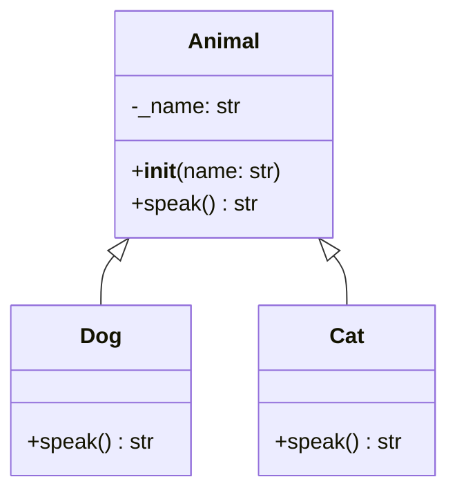
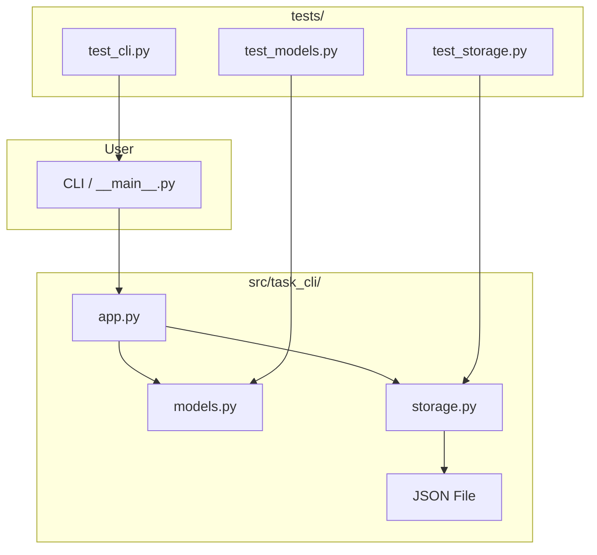

# Week 2 — OOP & Modules

**Goal:** Python class ka king bano + testing aajaye

---

## OOP Core Concepts Recap (PHP → Python Mapping)

Python ka OOP PHP se similar hai but syntax different. Yeh section PHP developers ko Python OOP mein smooth transition dene ke liye hai.

### Inheritance — Virasat

PHP: `class Child extends Parent {}`
Python: `class Child(Parent):`

```python
# PHP: class Animal { protected $name; }
# Python:
class Animal:
    def __init__(self, name: str):
        self._name = name  # Protected convention (single underscore)

    def speak(self) -> str:
        return "Some sound"

# PHP: class Dog extends Animal {}
# Python:
class Dog(Animal):
    def speak(self) -> str:
        return "Woof!"

class Cat(Animal):
    def speak(self) -> str:
        return "Meow!"

# Polymorphism — same method, different behavior
animals: list[Animal] = [Dog("Sheru"), Cat("Mani")]
for a in animals:
    print(f"{a._name} says {a.speak()}")
# Output:
# Sheru says Woof!
# Mani says Meow!
```



### Encapsulation — Data Hiding

PHP mein `private`, `protected`, `public`. Python mein naming convention se kaam karta hai:

| PHP | Python | Meaning |
|-----|--------|---------|
| `public $name` | `self.name` | Public |
| `protected $name` | `self._name` | Protected (convention, actually accessible) |
| `private $name` | `self.__name` | Name mangling (weak private) |

```python
class BankAccount:
    def __init__(self, owner: str, balance: float = 0):
        self.owner = owner                    # Public
        self._branch = "Patna"                # Protected (internal use)
        self.__balance = balance              # Name mangling → _BankAccount__balance

    def deposit(self, amount: float) -> None:
        if amount > 0:
            self.__balance += amount

    def get_balance(self) -> float:
        return self.__balance

acc = BankAccount("Raushan", 1000)
print(acc.owner)           # ✅ Public
print(acc._branch)         # ⚠️ "Protected" but accessible
# print(acc.__balance)     # ❌ AttributeError
print(acc.get_balance())   # ✅ 1000
print(acc._BankAccount__balance)  # 🙈 Name mangling bypass (possible but not recommended)
```

### PHP vs Python OOP — Full Comparison

| Feature | PHP | Python |
|---------|-----|--------|
| Constructor | `function __construct()` | `def __init__(self)` |
| Destructor | `function __destruct()` | `def __del__(self)` |
| Parent call | `parent::__construct()` | `super().__init__()` |
| $this / self | `$this->prop`, `self::$prop` | `self.prop`, `ClassName.prop` |
| Static | `static::$prop` | `@staticmethod`, `@classmethod` |
| Abstract | `abstract class / abstract function` | `ABC, @abstractmethod` |
| Interface | `interface / implements` | `ABC` / `Protocol` |
| Final class | `final class` | No built-in (metaclass se possible) |
| Visibility | `public/protected/private` | Convention: none/_/__ |
| Type hints | `function foo(): string` | `def foo() -> str:` |
| Nullable | `?string` | `Optional[str]` |
| Traits | `trait / use` | Multiple inheritance |
| Magic methods | `__toString()`, `__get()` | `__str__`, `__getattr__` |
| Property | `#[Attribute]` | `@property` decorator |

### `super()` — Parent Class Access

```python
class Person:
    def __init__(self, name: str, age: int):
        self.name = name
        self.age = age

class Employee(Person):
    def __init__(self, name: str, age: int, emp_id: str):
        super().__init__(name, age)  # PHP ka parent::__construct()
        self.emp_id = emp_id

    def __repr__(self) -> str:
        return f"Employee({self.name}, {self.age}, {self.emp_id})"

e = Employee("Raushan", 24, "EMP001")
print(e)  # Employee(Raushan, 24, EMP001)
```

### Multiple Inheritance

PHP mein nahi hai (traits hain). Python mein ek class multiple parents se inherit kar sakti hai.

```python
class Flyer:
    def fly(self) -> str:
        return "Udd raha hoon ✈️"

class Swimmer:
    def swim(self) -> str:
        return "Tair raha hoon 🏊"

class Duck(Flyer, Swimmer):
    def __init__(self, name: str):
        self.name = name

d = Duck("Donald")
print(d.fly())   # ✈️
print(d.swim())  # 🏊
# Duck inherits from both Flyer and Swimmer
```

### Method Resolution Order (MRO)

Python decides which method to call when multiple parents have same method:

```python
class A:
    def whoami(self): return "A"

class B(A):
    def whoami(self): return "B"

class C(A):
    def whoami(self): return "C"

class D(B, C):
    pass

d = D()
print(d.whoami())  # "B" — MRO: D → B → C → A
print(D.__mro__)   # (D, B, C, A, object)
# MRO follows C3 Linearization algorithm
```

### Tumne Seekha — OOP Recap

- Python inheritance: `class Child(Parent)` — simple syntax
- `super().__init__()` PHP ke `parent::__construct()` jaisa
- Encapsulation convention-based hai, compiler-enforced nahi
- Multiple inheritance possible hai, MRO decide karta hai kaun si method chalegi
- `@property`, `@staticmethod`, `@classmethod` — PHP ke modifiers ka alternative

**Practice Questions:**
1. `class Vehicle` banao with `make`, `model`. Phir `class Car(Vehicle)` with `doors` attribute
2. `__mro__` check karo apne class hierarchy ka
3. PHP ke `final` keyword ka Python mein substitute banao using metaclass (research karo)
4. `super().__init__()` likhna bhool gaye to kya hoga?

---

## Day 1 — Advanced OOP: Magic Methods

### Magic Methods (Dunder Methods)

PHP mein `__toString()`, `__get()`, `__set()` ka use karte the. Python mein inhe *magic methods* ya *dunder methods* bolte hain (double underscore). Ye Python objects ko special behavior dete hain.

```python
class Book:
    def __init__(self, title: str, author: str, pages: int):
        self.title = title
        self.author = author
        self.pages = pages

    # PHP ka __toString()
    def __repr__(self) -> str:
        return f"Book('{self.title}', '{self.author}')"

    # Human-readable string
    def __str__(self) -> str:
        return f"'{self.title}' by {self.author}"

    # Equality — == ka behavior
    def __eq__(self, other) -> bool:
        if not isinstance(other, Book):
            return False
        return self.title == other.title and self.author == other.author

    # Less than — sorting ke liye
    def __lt__(self, other) -> bool:
        return self.pages < other.pages

    # Length — len() support
    def __len__(self) -> int:
        return self.pages

    # Boolean — bool() support
    def __bool__(self) -> bool:
        return self.pages > 0

b1 = Book("Python 101", "Raushan", 300)
b2 = Book("Python 101", "Raushan", 300)
b3 = Book("AI Engineering", "Raushan", 500)

print(repr(b1))           # Book('Python 101', 'Raushan')
print(str(b1))            # 'Python 101' by Raushan
print(b1 == b2)           # True (__eq__)
print(b1 == b3)           # False
print(b1 < b3)            # True (__lt__ — 300 < 500)
print(len(b1))            # 300 (__len__)

# Sorting
books = [b3, b1, b2]
sorted_books = sorted(books)  # __lt__ use karta hai
print(sorted_books)
```

### Common Magic Methods

| Method | PHP Equivalent | Use |
|--------|---------------|-----|
| `__init__` | `__construct` | Constructor |
| `__repr__` | `__toString` | Developer representation |
| `__str__` | `__toString` | User representation |
| `__eq__` | `==` operator overload | Equality check |
| `__lt__` | `<` operator overload | Sorting |
| `__len__` | `count()` | Length |
| `__getitem__` | Array access `[]` | Indexing |
| `__setitem__` | `[]` assignment | Index assignment |
| `__call__` | `__invoke` | Callable object |
| `__enter__/__exit__` | — | Context manager |
| `__new__` | — | Before __init__ (object creation) |
| `__del__` | `__destruct` | Destructor |
| `__getattr__` | `__get` | Attribute access fallback |
| `__setattr__` | `__set` | Attribute assignment |
| `__contains__` | — | `in` operator support |
| `__iter__` | `Iterator` interface | Iteration support |
| `__hash__` | `hash()` | Hashable object |

### `__new__` vs `__init__`

```python
class DatabaseConnection:
    # __new__ object create karta hai (rarely override)
    def __new__(cls, *args, **kwargs):
        print(f"🔨 Creating new {cls.__name__} instance")
        instance = super().__new__(cls)
        return instance

    # __init__ object initialize karta hai
    def __init__(self, host: str, port: int):
        print(f"⚙️ Initializing connection to {host}:{port}")
        self.host = host
        self.port = port

# Real-world use case: Singleton pattern
class Singleton:
    _instance = None

    def __new__(cls, *args, **kwargs):
        if cls._instance is None:
            cls._instance = super().__new__(cls)
        return cls._instance

s1 = Singleton()
s2 = Singleton()
print(s1 is s2)  # True — same instance!

# __new__ ka use: immutable types subclass karte waqt
class PositiveList(list):
    def __init__(self, iterable):
        super().__init__()
        self.extend(item for item in iterable if item > 0)

# Works, but for tuple/str (immutable), __new__ is mandatory
class UpperCaseStr(str):
    def __new__(cls, value):
        return super().__new__(cls, value.upper())

print(UpperCaseStr("hello"))  # HELLO
```

### `__del__` — Destructor

```python
import weakref

class Resource:
    def __init__(self, name: str):
        self.name = name
        print(f"📦 {self.name}: Resource acquired")

    def __del__(self):
        print(f"🗑️ {self.name}: Resource released")

    def use(self):
        print(f"Using {self.name}")

# When object is deleted or goes out of scope
r = Resource("Database")
r.use()
del r  # Explicit delete
print("After deletion")

# PHP mein __destruct() jaisa hi
```

### `__getattr__` vs `__getattribute__`

```python
class DynamicConfig:
    def __init__(self):
        self._config = {
            "app_name": "AI Journey",
            "version": "1.0",
            "debug": True,
        }

    # Called only when attribute doesn't exist
    def __getattr__(self, name: str):
        if name in self._config:
            return self._config[name]
        raise AttributeError(f"'{type(self).__name__}' has no attribute '{name}'")

    # Called for EVERY attribute access (careful!)
    def __getattribute__(self, name: str):
        print(f"Accessing: {name}")
        return super().__getattribute__(name)

    # Called when setting any attribute
    def __setattr__(self, name: str, value):
        print(f"Setting: {name} = {value}")
        super().__setattr__(name, value)

config = DynamicConfig()
print(config.app_name)    # AI Journey (from _config)
# print(config.nonexistent)  # AttributeError

# PHP equivalent:
# class Config {
#     private $config = ['app_name' => 'AI Journey'];
#     public function __get($name) {
#         return $this->config[$name] ?? null;
#     }
# }
```

### `@property` Decorator

PHP 8+ mein `#[Attribute]` ya getter/setter methods. Python ka `@property` elegant syntax deta hai.

```python
class Temperature:
    def __init__(self, celsius: float = 0):
        self._celsius = celsius

    @property
    def celsius(self) -> float:
        """Get temperature in Celsius"""
        return self._celsius

    @celsius.setter
    def celsius(self, value: float) -> None:
        """Set temperature in Celsius (with validation)"""
        if value < -273.15:
            raise ValueError("Absolute zero se neeche nahi ja sakta!")
        self._celsius = value

    @celsius.deleter
    def celsius(self) -> None:
        """Delete temperature"""
        print("Temperature reset to 0")
        self._celsius = 0

    # Computed property
    @property
    def fahrenheit(self) -> float:
        return (self._celsius * 9/5) + 32

    @property
    def kelvin(self) -> float:
        return self._celsius + 273.15

t = Temperature(25)
print(t.celsius)      # 25 (getter)
print(t.fahrenheit)   # 77.0 (computed)
print(t.kelvin)       # 298.15 (computed)

t.celsius = 30        # setter
# t.celsius = -300    # ValueError!

del t.celsius         # deleter
print(t.celsius)      # 0 (reset)

# PHP mein aisa karte:
# class Temperature {
#     private $celsius;
#     public function getCelsius() { return $this->celsius; }
#     public function setCelsius($v) {
#         if ($v < -273.15) throw new Exception("...");
#         $this->celsius = $v;
#     }
# }
```

### Property Pattern: Cached/Computed

```python
import time

class DataProcessor:
    def __init__(self, data: list):
        self._data = data
        self._processed = None  # Cache

    @property
    def raw_data(self) -> list:
        return self._data

    @property
    def processed(self) -> dict:
        """Expensive computation with caching"""
        if self._processed is None:
            print("⏳ Processing data... (expensive)")
            time.sleep(1)  # Imagine heavy computation
            self._processed = {
                "count": len(self._data),
                "sum": sum(self._data),
                "mean": sum(self._data) / len(self._data) if self._data else 0,
                "max": max(self._data),
                "min": min(self._data),
            }
        return self._processed

    @property
    def summary(self) -> str:
        p = self.processed
        return f"Count={p['count']}, Sum={p['sum']:.2f}, Mean={p['mean']:.2f}"

dp = DataProcessor([1, 2, 3, 4, 5, 6, 7, 8, 9, 10])
print(dp.processed)  # Slow (first time)
print(dp.processed)  # Instant (cached)
print(dp.summary)    # Uses cache
```

### Abstract Base Classes (ABC)

Interface banane ka tareeka. PHP mein `abstract class` / `interface` ke jaise.

```python
from abc import ABC, abstractmethod

class DataSource(ABC):
    @abstractmethod
    def fetch(self) -> list:
        ...

    @abstractmethod
    def save(self, data: list) -> None:
        ...

    def health_check(self) -> bool:
        # Concrete method — abstract class mein bhi likh sakte
        return True

class DatabaseSource(DataSource):
    def fetch(self) -> list:
        print("Database se data le raha hoon...")
        return [{"name": "Raushan"}, {"name": "Priya"}]

    def save(self, data: list) -> None:
        print(f"Data save kiya: {len(data)} records")

# Error: Can't instantiate abstract class
# source = DataSource()

source = DatabaseSource()
data = source.fetch()
source.save(data)
print(source.health_check())
```

### ABC vs Protocol — Interface Comparison

```python
from abc import ABC, abstractmethod
from typing import Protocol

# ABC approach (PHP interface jaisa)
class Shape(ABC):
    @abstractmethod
    def area(self) -> float: ...

    @abstractmethod
    def perimeter(self) -> float: ...

# Protocol approach (duck typing — "if it walks like a duck")
class Drawable(Protocol):
    def draw(self) -> str: ...

class Circle(Shape):
    def __init__(self, radius: float):
        self.radius = radius

    def area(self) -> float:
        return 3.14159 * self.radius ** 2

    def perimeter(self) -> float:
        return 2 * 3.14159 * self.radius

    def draw(self) -> str:
        return "⚪ Circle"

# Protocol user doesn't need to inherit
def render(shape: Drawable) -> None:
    print(shape.draw())

# Works because Circle has draw() method
render(Circle(5))
```

### SOLID Principles in Python

PHP OOP developers ke liye SOLID familiar hoga. Python mein kaise implement karte hain:

#### S — Single Responsibility

```python
# ❌ Bad: Ek class sab kuch kar rahi hai
class Report:
    def __init__(self, data: list):
        self.data = data

    def generate(self) -> str:
        return "\n".join(str(d) for d in self.data)

    def save_to_file(self, path: str) -> None:
        with open(path, "w") as f:
            f.write(self.generate())

    def send_email(self, to: str) -> None:
        print(f"Sending to {to}...")

# ✅ Good: Har class ka ek kaam
class ReportGenerator:
    def __init__(self, data: list):
        self.data = data

    def generate(self) -> str:
        return "\n".join(str(d) for d in self.data)

class FileSaver:
    @staticmethod
    def save(content: str, path: str) -> None:
        with open(path, "w") as f:
            f.write(content)

class EmailSender:
    @staticmethod
    def send(to: str, content: str) -> None:
        print(f"Sending to {to}...")
```

#### O — Open/Closed

```python
# ❌ Bad: Har naye type ke liye modify karna padega
def calculate_area(shape):
    if isinstance(shape, Circle):
        return 3.14 * shape.radius ** 2
    elif isinstance(shape, Rectangle):
        return shape.width * shape.height
    # New shape → modify function!

# ✅ Good: Extension ke liye open, modification ke liye closed
from abc import ABC, abstractmethod

class Shape(ABC):
    @abstractmethod
    def area(self) -> float: ...

class Circle(Shape):
    def __init__(self, radius: float):
        self.radius = radius

    def area(self) -> float:
        return 3.14 * self.radius ** 2

class Rectangle(Shape):
    def __init__(self, w: float, h: float):
        self.w = w
        self.h = h

    def area(self) -> float:
        return self.w * self.h

# Naya shape add karo — existing code change nahi karna
class Triangle(Shape):
    def __init__(self, base: float, height: float):
        self.base = base
        self.height = height

    def area(self) -> float:
        return 0.5 * self.base * self.height

def total_area(shapes: list[Shape]) -> float:
    return sum(s.area() for s in shapes)  # Koi modification nahi!
```

#### L — Liskov Substitution

```python
# ❌ Bad: Subclass parent ki jagah nahi le sakti
class Bird:
    def fly(self) -> str:
        return "Flying"

class Penguin(Bird):
    def fly(self) -> str:
        raise NotImplementedError("Penguin nahi ud sakta!")

# ✅ Good: Proper abstraction
class Bird:
    def move(self) -> str:
        return "Moving"

class FlyingBird(Bird):
    def move(self) -> str:
        return "Flying ✈️"

class SwimmingBird(Bird):
    def move(self) -> str:
        return "Swimming 🏊"

penguin = SwimmingBird()
print(penguin.move())  # Swimming — no surprise!
```

#### I — Interface Segregation

```python
# ❌ Bad: Ek bada interface sabko force karna
class Worker(ABC):
    @abstractmethod
    def work(self): ...
    @abstractmethod
    def eat(self): ...
    @abstractmethod
    def sleep(self): ...

# ✅ Good: Chhote specialized interfaces
class Workable(ABC):
    @abstractmethod
    def work(self): ...

class Eatable(ABC):
    @abstractmethod
    def eat(self): ...

class Sleepable(ABC):
    @abstractmethod
    def sleep(self): ...

class Human(Workable, Eatable, Sleepable):
    def work(self): print("Working 💼")
    def eat(self): print("Eating 🍽️")
    def sleep(self): print("Sleeping 😴")

class Robot(Workable):
    def work(self): print("Working 24/7 🤖")
    # No eat, no sleep needed!
```

#### D — Dependency Inversion

```python
# ❌ Bad: High-level module low-level module par depend
class MySQLDatabase:
    def save(self, data: dict) -> None:
        print(f"MySQL mein save: {data}")

class UserService:
    def __init__(self):
        self.db = MySQLDatabase()  # Tight coupling!

    def create_user(self, name: str):
        self.db.save({"name": name})

# ✅ Good: Both depend on abstraction
from abc import ABC, abstractmethod

class Database(ABC):
    @abstractmethod
    def save(self, data: dict) -> None: ...

class MySQLDatabase(Database):
    def save(self, data: dict) -> None:
        print(f"MySQL mein save: {data}")

class PostgreSQLDatabase(Database):
    def save(self, data: dict) -> None:
        print(f"PostgreSQL mein save: {data}")

class UserService:
    def __init__(self, db: Database):  # Dependency Injection!
        self.db = db

    def create_user(self, name: str):
        self.db.save({"name": name})

# Easily switch databases
service = UserService(MySQLDatabase())
# service = UserService(PostgreSQLDatabase())
```

### Dataclasses

PHP 8+ ka `#[Attribute]` ya constructor auto-setup. Python ka `@dataclass` automatically `__init__`, `__repr__`, `__eq__` generate kar deta hai.

```python
from dataclasses import dataclass, field
from typing import List
from datetime import datetime

@dataclass
class User:
    name: str
    age: int
    city: str = "Patna"                          # Default value
    skills: List[str] = field(default_factory=list)  # Empty list safely
    created_at: datetime = field(default_factory=datetime.now)

    def greet(self) -> str:
        return f"Namaste! Main {self.name} hoon, {self.age} saal ka"

u1 = User("Raushan", 24, "Delhi", ["Laravel", "FastAPI"])
u2 = User("Priya", 22)  # Default city = Patna, skills = []

print(u1)         # Auto __repr__ → User(name='Raushan', age=24, ...)
print(u1 == u2)   # False — auto __eq__ compares all fields
```

### Dataclass Features

```python
from dataclasses import dataclass, field, asdict, astuple

@dataclass(order=True)  # __lt__, __le__, __gt__, __ge__ auto
class Task:
    priority: int = field(compare=True)
    title: str = field(compare=False)
    done: bool = False

    def __post_init__(self):
        # Init ke baad chalega — validation ke liye
        if self.priority < 1 or self.priority > 5:
            raise ValueError("Priority 1–5 hona chahiye")

    def mark_done(self):
        self.done = True

t1 = Task(1, "Important kaam")
t2 = Task(3, "Normal kaam")
print(t1 < t2)         # True — priority compare hui

# Dict mein convert
print(asdict(t1))
# {'priority': 1, 'title': 'Important kaam', 'done': False}
```

### `__slots__` — Memory Optimization

Python objects normally ek dynamic dictionary (`__dict__`) use karte hain attributes store karne ke liye. Ye flexible hai lekin memory zyada leta hai. `__slots__` se attribute list fix ho jati hai.

```python
# Without __slots__ — har object ka apna __dict__
class UserRegular:
    def __init__(self, user_id: int, name: str):
        self.user_id = user_id
        self.name = name

# With __slots__ — no __dict__, fixed attributes
class UserSlotted:
    __slots__ = ("user_id", "name")

    def __init__(self, user_id: int, name: str):
        self.user_id = user_id
        self.name = name

# Memory comparison
import sys
regular = UserRegular(1, "Raushan")
slotted = UserSlotted(1, "Raushan")

print(f"Regular: {sys.getsizeof(regular)} bytes")  # ~56 bytes
print(f"Slotted: {sys.getsizeof(slotted)} bytes")  # ~40 bytes
# __dict__ extra memory leta hai

# Benefit: faster attribute access + less memory
# Drawback: can't add new attributes dynamically
# slotted.new_attr = "test"  # AttributeError!

# __slots__ with inheritance
class AdminUser(UserSlotted):
    __slots__ = ("role",)  # Parent ke slots + additional

    def __init__(self, user_id: int, name: str, role: str):
        super().__init__(user_id, name)
        self.role = role

# Use __slots__ when creating thousands of objects (data processing)
```

### Day 1 Exercise

```python
# @dataclass banao: Student
# Fields: name, roll_number, marks: List[float]
# Property: percentage (avg of marks)
# Method: grade() → "A" (>90), "B" (>75), "C" (>=60), "F"
# __lt__ compare kare percentage se
# 3 students banao, sort karo descending

@dataclass
class Student:
    name: str
    roll_number: int
    marks: List[float]

    @property
    def percentage(self) -> float:
        return sum(self.marks) / len(self.marks)

    def grade(self) -> str:
        p = self.percentage
        if p >= 90: return "A"
        if p >= 75: return "B"
        if p >= 60: return "C"
        return "F"

    def __lt__(self, other) -> bool:
        return self.percentage < other.percentage

# Extra practice:
# 1. BankAccount class banao with @property for balance
# 2. __slots__ use karke Point class (x, y) banao
# 3. Cache decorator pattern use karke Fibonacci optimized karo
# 4. Custom __getattr__ for a Config class that reads from file
```

### Tumne Seekha — Day 1

- Magic methods Python objects ko special behavior dete hain (`__init__`, `__repr__`, `__eq__`, etc.)
- `@property` getter/setter/deleter ke liye — PHP ke getX()/setX() se better
- `__new__` object creation handle karta hai, `__init__` initialization
- `__slots__` memory optimize karta hai (data-heavy apps mein useful)
- SOLID principles PHP aur Python dono mein same hain
- `@dataclass` boilerplate reduce karta hai

---

## Day 2 — Modules & Packages + `if __name__`

### Modules (Ek file = ek module)

```python
# helpers.py — rakh lo
def greet(name: str) -> str:
    return f"Hello, {name}!"

PI = 3.14159

class Calculator:
    @staticmethod
    def add(a, b):
        return a + b

# main.py — import kar lo
import helpers

print(helpers.greet("Raushan"))         # Hello, Raushan!
print(helpers.PI)                       # 3.14159
calc = helpers.Calculator()
print(calc.add(2, 3))                   # 5
```

### Import Variations

```python
# Specific import
from helpers import greet, PI
print(greet("Raushan"))

# Alias
import helpers as hp
print(hp.PI)

# Sab kuch (careful — namespace pollute hota hai)
from helpers import *
```

### How Python Finds Modules (sys.path)

PHP mein `include_path` jaisa concept. Python modules search karta hai in order:

```python
import sys

# Python modules kahan search karta hai:
for path in sys.path:
    print(path)
# 1. Current directory (where script runs)
# 2. PYTHONPATH environment variable
# 3. Python installation's site-packages
# 4. Standard library locations

# Agar tumhara module nahi mil raha:
# Option 1: sys.path.append("/path/to/module")
sys.path.append("/my/custom/modules")

# Option 2: PYTHONPATH env variable set karo
# export PYTHONPATH="/my/custom/modules:$PYTHONPATH"

# Option 3: Install as package (recommended)
# pip install -e .
```

### Packages (Folder with `__init__.py`)

```
project/
├── main.py
└── utils/
    ├── __init__.py        # Empty or code
    ├── file_ops.py
    └── string_ops.py
```

```python
# utils/file_ops.py
def read_file(path: str) -> str:
    with open(path, "r") as f:
        return f.read()

# utils/string_ops.py
def reverse(text: str) -> str:
    return text[::-1]

# utils/__init__.py
from .file_ops import read_file
from .string_ops import reverse

# main.py
from utils import read_file, reverse
```

### `__all__` — Controlling `from module import *`

```python
# utils/string_ops.py
__all__ = ["reverse", "capitalize"]  # Sirf ye dono * se import honge

def reverse(text: str) -> str:
    return text[::-1]

def capitalize(text: str) -> str:
    return text.capitalize()

def secret_helper(text: str) -> str:  # import * se nahi aayega
    return text.upper()

# Usage
# from utils.string_ops import *  # Sirf reverse, capitalize milega
# from utils.string_ops import secret_helper  # Tab bhi access hai
```

### `if __name__ == "__main__"`

Python ka guard pattern. Jab file directly run ho tab code chale, import karein to nahi.

```python
# calculator.py
def add(a, b): return a + b
def sub(a, b): return a - b

# Yeh sir tab chalega jab yeh file direct run ho
if __name__ == "__main__":
    print("Testing calculator...")
    print(add(5, 3))
    print(sub(10, 4))

# Koi aur file import karega to yeh block nahi chalega
# from calculator import add
```

PHP analogy: `if (realpath($0) === __FILE__)` wali pattern.

```php
// PHP equivalent
if (realpath($argv[0]) === __FILE__) {
    echo "Direct run\n";
}
```

### Relative Imports

```python
# Inside package
from . import module           # Same package se
from .subpackage import thing  # Subpackage se
from .. import parent_module   # Parent package se

# Absolute import (recommended for clarity)
from project.utils.helpers import format_date
```

### Common Module Patterns

```python
# Pattern 1: Lazy loading (expensive imports)
class DatabaseService:
    def __init__(self):
        # SQLAlchemy ko abhi import nahi kiya
        self._engine = None

    def connect(self):
        from sqlalchemy import create_engine  # Lazy import!
        self._engine = create_engine("sqlite:///db.sqlite")
        return self._engine

# Pattern 2: Module-level singleton (most common)
# config.py
_settings = None

def get_settings():
    global _settings
    if _settings is None:
        from pydantic_settings import BaseSettings
        class Settings(BaseSettings):
            app_name: str = "MyApp"
        _settings = Settings()
    return _settings

# Pattern 3: Re-export (facade)
# services/__init__.py
from .user_service import UserService
from .task_service import TaskService
from .auth_service import AuthService

__all__ = ["UserService", "TaskService", "AuthService"]
```

### Day 2 Exercise

```
Banao package structure:
task_cli/
├── __init__.py
├── cli.py       # argparse based CLI
├── storage.py   # JSON file operations
└── models.py    # Task dataclass
main.py          # Entry point

Extra:
1. sys.path print karo aur samjho kaunsa path pehle aata hai
2. __all__ use karke API surface control karo
3. Lazy import pattern use karke expensive module ko defer karo
4. `python -c "import task_cli"` se test karo
```

### Tumne Seekha — Day 2

- Module = ek `.py` file, Package = folder with `__init__.py`
- `sys.path` decide karta hai Python modules kahan search kare
- `if __name__ == "__main__"` — PHP ke `realpath($0) === __FILE__` jaisa
- `__all__` control karta hai `from module import *` kya dega
- Lazy imports performance improve karte hain (expensive modules defer karo)
- Absolute imports recommended hain relative se zyada

**Practice Questions:**
1. `sys.path` mein current directory kahan aati hai?
2. `__init__.py` empty bhi ho sakta hai? Agar haan to kyun?
3. Relative import `..` kya karta hai?
4. `from utils import *` aur `import utils` mein kya difference hai?

---

## Day 3 — Standard Library Deep Dive

### `datetime`

```python
from datetime import datetime, date, timedelta

now = datetime.now()
print(now.year, now.month, now.day, now.hour)

# Formatting (PHP ka date())
print(now.strftime("%Y-%m-%d %H:%M:%S"))     # 2026-06-15 14:30:00
print(now.strftime("%A, %d %B %Y"))           # Monday, 15 June 2026

# Parsing (PHP ka strtotime)
date_str = "2026-06-15 14:30:00"
parsed = datetime.strptime(date_str, "%Y-%m-%d %H:%M:%S")

# Date arithmetic
tomorrow = date.today() + timedelta(days=1)
last_week = datetime.now() - timedelta(weeks=1)

# Difference
diff = datetime(2026, 7, 7) - datetime.now()
print(f"Phase 1 khatam hone mein {diff.days} din bache")

# ISO format (JSON-friendly)
print(now.isoformat())  # 2026-06-15T14:30:00.000000

# Timezone handling
from datetime import timezone, timedelta as td
ist = timezone(td(hours=5, minutes=30))  # Indian Standard Time
now_ist = datetime.now(ist)
print(f"India time: {now_ist}")
```

### `collections`

```python
from collections import Counter, defaultdict, deque

# Counter — items count karo
skills = ["Python", "Laravel", "Python", "FastAPI", "Python", "React"]
count = Counter(skills)
print(count)                     # Counter({'Python': 3, 'Laravel': 1, ...})
print(count.most_common(2))      # [('Python', 3), ('Laravel', 1)]

# defaultdict — missing key pe exception nahi, default value milegi
user_skills = defaultdict(list)
user_skills["Raushan"].append("Laravel")
user_skills["Raushan"].append("FastAPI")
user_skills["Priya"].append("React")
print(dict(user_skills))
# {'Raushan': ['Laravel', 'FastAPI'], 'Priya': ['React']}

# PHP mein aisa:
# $user_skills = [];
# $user_skills['Raushan'][] = 'Laravel';  // works
# $user_skills['NewUser'][] = 'Skill';    // Warning!
# defaultdict automatically empty list create karta hai

# deque — fast append/pop dono ends se
from collections import deque
queue = deque(["Raushan", "Priya", "Raj"])
queue.append("Amit")      # right
queue.appendleft("Neha")  # left
print(queue.popleft())    # Neha (fast!)

# namedtuple — lightweight class (no methods needed)
from collections import namedtuple
Point = namedtuple("Point", ["x", "y"])
p = Point(10, 20)
print(p.x, p.y)           # 10 20
print(p[0], p[1])         # 10 20 (tuple bhi hai!)

# namedtuple vs dataclass: namedtuple is immutable, lighter
# Use namedtuple for simple data structures
# Use dataclass when you need methods or default values

# OrderedDict — remembers insertion order (Python 3.7+ dict bhi ordered hai)
from collections import OrderedDict
od = OrderedDict()
od["z"] = 1
od["a"] = 2
od["b"] = 3
print(list(od.keys()))    # ['z', 'a', 'b'] — order preserved
# Difference from dict: OrderedDict has move_to_end(), popitem(last=)
od.move_to_end("a")       # 'a' ko last mein bhejo
print(list(od.keys()))    # ['z', 'b', 'a']

# ChainMap — multiple dicts as one
from collections import ChainMap
defaults = {"theme": "dark", "lang": "en", "debug": False}
user_prefs = {"theme": "light", "lang": "hi"}
runtime_config = {"debug": True}

config = ChainMap(runtime_config, user_prefs, defaults)
print(config["theme"])     # "light" (user_prefs wins over defaults)
print(config["debug"])     # True (runtime wins)
print(config["lang"])      # "hi"
print(config.get("font"))  # None (not in any dict)
```

### `itertools` — Loop ka Power Tool

```python
import itertools

# count — infinite counter
for i in itertools.count(1):
    if i > 5: break
    print(i)  # 1, 2, 3, 4, 5

# cycle — infinite loop over sequence
colors = itertools.cycle(["Red", "Green", "Blue"])
for _ in range(6):
    print(next(colors))  # Red, Green, Blue, Red, Green, Blue

# chain — multiple iterables merge
combined = itertools.chain([1, 2, 3], ["a", "b"])
print(list(combined))  # [1, 2, 3, 'a', 'b']

# product — Cartesian product (nested loops)
for combo in itertools.product([1, 2], ["a", "b"]):
    print(combo)  # (1, 'a'), (1, 'b'), (2, 'a'), (2, 'b')

# combinations — unique pairs
for combo in itertools.combinations(["a", "b", "c"], 2):
    print(combo)  # ('a', 'b'), ('a', 'c'), ('b', 'c')

# groupby — PHP ka array_group_by
data = [{"city": "Patna", "name": "Raushan"},
        {"city": "Delhi", "name": "Priya"},
        {"city": "Patna", "name": "Raj"}]
data.sort(key=lambda x: x["city"])
for city, group in itertools.groupby(data, key=lambda x: x["city"]):
    print(f"{city}: {list(group)}")

# islice — slice an iterator (PHP ka array_slice for iterators)
first_5 = itertools.islice(range(100), 5)
print(list(first_5))  # [0, 1, 2, 3, 4]

# takewhile — condition true rehte tak lo
nums = itertools.takewhile(lambda x: x < 5, itertools.count(1))
print(list(nums))     # [1, 2, 3, 4]

# dropwhile — condition false hote ke baad se lo
nums = itertools.dropwhile(lambda x: x < 3, [1, 2, 3, 4, 5, 1])
print(list(nums))     # [3, 4, 5, 1]

# zip_longest — PHP ka array_map(null, ...) jaisa
from itertools import zip_longest
a = [1, 2, 3]
b = ["a", "b"]
print(list(zip_longest(a, b, fillvalue="-")))
# [(1, 'a'), (2, 'b'), (3, '-')]

# pairwise — consecutive pairs (Python 3.10+)
for pair in itertools.pairwise([1, 2, 3, 4]):
    print(pair)  # (1, 2), (2, 3), (3, 4)

# Real-world: pagination
def paginate(iterable, page_size: int):
    it = iter(iterable)
    while True:
        batch = list(itertools.islice(it, page_size))
        if not batch:
            break
        yield batch

for page in paginate(range(100), 10):
    print(f"Page with {len(page)} items")
```

### `functools` — Function Tools

```python
from functools import lru_cache, partial, reduce, wraps, singledispatch

# lru_cache — memoization (cache results)
@lru_cache(maxsize=128)
def fibonacci(n):
    if n < 2:
        return n
    return fibonacci(n - 1) + fibonacci(n - 2)

# First call slow, subsequent calls instant
print(fibonacci(30))

# partial — PHP ka partial function application
def power(base, exponent):
    return base ** exponent

square = partial(power, exponent=2)
cube = partial(power, exponent=3)
print(square(5))  # 25
print(cube(3))    # 27

# reduce — PHP ka array_reduce
from functools import reduce
numbers = [1, 2, 3, 4, 5]
product = reduce(lambda x, y: x * y, numbers)
print(product)  # 120

# singledispatch — function overloading jaisa
from functools import singledispatch

@singledispatch
def process(arg):
    return f"Unknown type: {type(arg)}"

@process.register
def _(arg: int):
    return f"Integer: {arg * 2}"

@process.register
def _(arg: str):
    return f"String: {arg.upper()}"

@process.register
def _(arg: list):
    return f"List: {len(arg)} items"

print(process(42))      # Integer: 84
print(process("hello")) # String: HELLO
print(process([1,2,3])) # List: 3 items
print(process(3.14))    # Unknown type: <class 'float'>
```

### `statistics` Module

```python
import statistics

data = [2, 4, 4, 4, 5, 5, 7, 9]

print(statistics.mean(data))      # 5.0 (average)
print(statistics.median(data))    # 4.5 (middle value)
print(statistics.mode(data))      # 4 (most common)
print(statistics.stdev(data))     # ~2.14 (standard deviation)
print(statistics.variance(data))  # ~4.57 (variance)

# Real use: analyzing API response times
response_times = [120, 150, 130, 900, 140, 135, 125]
avg = statistics.mean(response_times)
stdev = statistics.stdev(response_times)
print(f"API avg: {avg:.0f}ms ± {stdev:.0f}ms")
# 900ms outlier hai — investigation chahiye
```

### Day 3 Exercise

```python
# Banao: Log Analyzer using collections + datetime
# Example log:
logs = [
    "2026-06-15 10:30:00 | ERROR | Database connection failed",
    "2026-06-15 10:31:00 | INFO | User logged in",
    "2026-06-15 10:32:00 | WARN | High memory usage",
    "2026-06-15 10:33:00 | ERROR | Disk space low",
    "2026-06-15 10:34:00 | ERROR | Database connection failed",
]

# 1. Count log levels (Counter)
# 2. Group by date (defaultdict of list)
# 3. Find top 3 ERROR messages
# 4. Parse timestamps to datetime objects

# Extra:
# 5. deque use karke last 10 ERROR messages ka buffer
# 6. namedtuple for LogEntry(date, level, message)
# 7. islice se sirf first 100 errors analyze karo
# 8. groupby se hour-wise error count
```

### Tumne Seekha — Day 3

- `datetime` — PHP ke `date()`/`strtotime()` ka Python alternative
- `Counter` — automatic frequency counting
- `defaultdict` — missing keys ko gracefully handle karta hai
- `deque` — fast append/pop dono ends se (queue/stack implementation)
- `itertools` — loop patterns ke liye power tools (chain, product, groupby)
- `functools` — `lru_cache` (memoization), `partial` (currying), `singledispatch` (overloading)
- `namedtuple` — lightweight immutable class

**Practice Questions:**
1. `Counter` vs manual `dict` count — performance mein kya difference hai?
2. `defaultdict(list)` aur `dict.setdefault()` mein kya antar hai?
3. `itertools.chain` vs `+` operator for lists — kya fark hai?
4. `lru_cache` kis type ke functions ke liye best hai?

---

## Day 4 — Advanced Type Hints

### Basic Types

```python
from typing import Optional, Union, List, Dict, Tuple, Set, Any

# PHP ka ?string = Optional[str]
def find_user(user_id: int) -> Optional[dict]:
    users = {1: {"name": "Raushan"}}
    return users.get(user_id)  # None bhi return ho sakta hai

# Union — multiple types allowed
def parse_input(value: Union[str, int, float]) -> float:
    if isinstance(value, str):
        return float(value)
    return float(value)

# Collections
def process_users(users: List[dict]) -> Dict[str, int]:
    return {u["name"]: u.get("age", 0) for u in users}

# Nested types
def update_config(config: Dict[str, Union[str, int, bool]]) -> None:
    ...

# Tuple with specific types
def get_location() -> Tuple[float, float, str]:
    return (28.6139, 77.2090, "Delhi")
```

### Literal, Final, and TypedDict

```python
from typing import Literal, Final, TypedDict

# Literal — exact values specify karo
def set_priority(level: Literal["low", "medium", "high"]) -> None:
    print(f"Priority set to {level}")

set_priority("high")       # ✅
# set_priority("urgent")   # ❌ Type error (literal mismatch)
# PHP mein Enum use karte, Python mein Literal

# Final — constant (PHP const jaisa)
MAX_RETRIES: Final[int] = 3
APP_NAME: Final[str] = "AI Journey"
# MAX_RETRIES = 5  # Type checker error (but runtime allows!)

# TypedDict — dict ka structure define karo
class UserDict(TypedDict):
    name: str
    age: int
    email: str
    skills: List[str]

def create_user(user: UserDict) -> None:
    print(f"User: {user['name']}, Age: {user['age']}")

# Correct usage
user: UserDict = {
    "name": "Raushan",
    "age": 24,
    "email": "raushan@example.com",
    "skills": ["Python", "Laravel"],
}
create_user(user)
```

### Self Type (Python 3.11+)

```python
from typing import Self

class Builder:
    def __init__(self):
        self._data: dict = {}

    def set_name(self, name: str) -> Self:
        self._data["name"] = name
        return self  # Method chaining

    def set_age(self, age: int) -> Self:
        self._data["age"] = age
        return self

    def build(self) -> dict:
        return self._data

# Fluent interface (method chaining)
result = Builder().set_name("Raushan").set_age(24).build()
print(result)  # {'name': 'Raushan', 'age': 24}

# Self ensures subclass returns correct type
class AdminBuilder(Builder):
    def set_role(self, role: str) -> Self:
        self._data["role"] = role
        return self

admin = AdminBuilder().set_name("Admin").set_role("superuser").build()
# Self type means AdminBuilder methods return AdminBuilder, not Builder
```

### TypeVar & Generics

```python
from typing import TypeVar, Generic, Protocol

T = TypeVar("T")        # Generic type placeholder

# Generic function
def first(items: list[T]) -> T:
    return items[0]

print(first([1, 2, 3]))           # int
print(first(["a", "b"]))          # str
print(first([{"name": "Raushan"}])) # dict

# Constrained TypeVar
Number = TypeVar("Number", int, float, complex)
def double(value: Number) -> Number:
    return value * 2

print(double(5))       # 10 (int)
print(double(3.14))    # 6.28 (float)
# double("hello")      # Type error!

# Generic class — PHP ka generics
class Stack(Generic[T]):
    def __init__(self):
        self._items: list[T] = []

    def push(self, item: T) -> None:
        self._items.append(item)

    def pop(self) -> T:
        return self._items.pop()

    def is_empty(self) -> bool:
        return len(self._items) == 0

num_stack = Stack[int]()
num_stack.push(1)
num_stack.push(2)
num = num_stack.pop()  # type is int
```

### Protocol — Structural Subtyping (Duck Typing Type Hints)

```python
from typing import Protocol

class Drawable(Protocol):
    def draw(self) -> str: ...

class Circle:
    def draw(self) -> str:
        return "⚪ Drawing circle"

class Square:
    def draw(self) -> str:
        return "⬜ Drawing square"

def render(shape: Drawable) -> None:
    print(shape.draw())

# Ye dono kaam karega bina inheritance ke
render(Circle())  # ⚪ Drawing circle
render(Square())  # ⬜ Drawing square
```

### Type Guards and `assert_type`

```python
from typing import TypeGuard, assert_type

# TypeGuard — narrow type based on condition
def is_string_list(items: list[object]) -> TypeGuard[list[str]]:
    return all(isinstance(item, str) for item in items)

def process_items(items: list[object]) -> None:
    if is_string_list(items):
        # items ab list[str] hai
        print(" ".join(items))  # join works because all are str
    else:
        print(f"Mixed types: {items}")

# assert_type — verify type in tests
assert_type("hello", str)           # ✅
# assert_type(123, str)            # ❌ Type check error
```

### Type Aliases

```python
from typing import List, Dict

UserDict = Dict[str, Union[str, int, List[str]]]
UserList = List[UserDict]

def save_users(users: UserList) -> None:
    ...

users: UserList = [
    {"name": "Raushan", "age": 24, "skills": ["Python", "Laravel"]}
]
```

### Day 4 Exercise

```python
# Banao: Generic Repository pattern
T = TypeVar("T")

class Repository(Generic[T]):
    def get(self, pk: int) -> Optional[T]: ...
    def list(self) -> List[T]: ...
    def create(self, item: T) -> T: ...
    def update(self, pk: int, item: T) -> T: ...
    def delete(self, pk: int) -> bool: ...

# Phir UserRepository(Repository[User]), TaskRepository(Repository[Task])

# Extra practice:
# 1. Literal type for status: "active" | "inactive" | "pending"
# 2. TypedDict for API response structure
# 3. Self type for QueryBuilder pattern
# 4. Protocol for Serializer interface
# 5. TypeVar with bound=BaseModel for Pydantic generics
```

### Tumne Seekha — Day 4

- Type hints runtime enforce nahi karte, lekin mypy/pyright static checking ke liye hain
- `Optional[X]` = `Union[X, None]` = PHP ka `?X`
- `Literal` exact values restrict karta hai (Enum alternatives)
- `TypedDict` dict structure define karta hai (PHP array shape jaisa)
- `TypeVar` generics ke liye — ek function multiple types handle kare
- `Protocol` duck typing ka type-safe version
- `Self` fluent interfaces / builder patterns ke liye
- `TypeGuard` type narrowing mein help karta hai

### Design Patterns in Python — PHP Developers ke Liye

#### Singleton Pattern

```python
# Method 1: Module-level (simplest, most Pythonic)
# config.py (just write at module level)
class AppConfig:
    def __init__(self):
        self.debug = False
        self.db_url = "sqlite:///app.db"

config = AppConfig()  # Module load hote hi ek instance banega

# Usage: from config import config  (same instance, always!)

# Method 2: Metaclass approach
class SingletonMeta(type):
    _instances = {}

    def __call__(cls, *args, **kwargs):
        if cls not in cls._instances:
            cls._instances[cls] = super().__call__(*args, **kwargs)
        return cls._instances[cls]

class Database(metaclass=SingletonMeta):
    def __init__(self):
        self.connected = False

    def connect(self):
        self.connected = True
        print("Connected!")

db1 = Database()
db2 = Database()
print(db1 is db2)  # True
```

#### Factory Pattern

```python
from abc import ABC, abstractmethod

class Notifier(ABC):
    @abstractmethod
    def send(self, message: str) -> None: ...

class EmailNotifier(Notifier):
    def send(self, message: str) -> None:
        print(f"📧 Email: {message}")

class SMSNotifier(Notifier):
    def send(self, message: str) -> None:
        print(f"📱 SMS: {message}")

class SlackNotifier(Notifier):
    def send(self, message: str) -> None:
        print(f"💬 Slack: {message}")

# Factory function
def create_notifier(notifier_type: str) -> Notifier:
    notifiers = {
        "email": EmailNotifier,
        "sms": SMSNotifier,
        "slack": SlackNotifier,
    }
    cls = notifiers.get(notifier_type)
    if not cls:
        raise ValueError(f"Unknown notifier: {notifier_type}")
    return cls()

# Usage — Laravel mein Notification::via() jaisa
notifier = create_notifier("slack")
notifier.send("Hello from AI Engineering Journey!")

# PHP equivalent:
# $notifier = match($type) {
#     'email' => new EmailNotifier(),
#     'sms' => new SMSNotifier(),
#     default => throw new Exception(),
# };
```

#### Observer Pattern

```python
from abc import ABC, abstractmethod
from dataclasses import dataclass, field
from typing import List

class Observer(ABC):
    @abstractmethod
    def update(self, event: str, data: dict) -> None: ...

class Subject:
    def __init__(self):
        self._observers: List[Observer] = []

    def attach(self, observer: Observer) -> None:
        self._observers.append(observer)

    def detach(self, observer: Observer) -> None:
        self._observers.remove(observer)

    def notify(self, event: str, data: dict) -> None:
        for observer in self._observers:
            observer.update(event, data)

# Concrete observers
class Logger(Observer):
    def update(self, event: str, data: dict) -> None:
        print(f"📝 Log: {event} — {data}")

class EmailSender(Observer):
    def update(self, event: str, data: dict) -> None:
        if event == "user_registered":
            print(f"📧 Welcome email to {data['email']}")

class AnalyticsTracker(Observer):
    def update(self, event: str, data: dict) -> None:
        print(f"📊 Analytics: {event} tracked")

# Usage — Laravel Events/Listeners jaisa
user_service = Subject()
user_service.attach(Logger())
user_service.attach(EmailSender())
user_service.attach(AnalyticsTracker())

user_service.notify("user_registered", {
    "email": "raushan@example.com",
    "name": "Raushan"
})
```

#### Repository Pattern

```python
from typing import Optional, List, Generic, TypeVar
from abc import ABC, abstractmethod

T = TypeVar("T")

class Repository(ABC, Generic[T]):
    @abstractmethod
    def find(self, id: int) -> Optional[T]: ...

    @abstractmethod
    def find_all(self) -> List[T]: ...

    @abstractmethod
    def save(self, entity: T) -> T: ...

    @abstractmethod
    def delete(self, id: int) -> bool: ...

# In-memory implementation
class InMemoryUserRepository(Repository["User"]):
    def __init__(self):
        self._users: dict[int, User] = {}
        self._next_id = 1

    def find(self, id: int) -> Optional["User"]:
        return self._users.get(id)

    def find_all(self) -> List["User"]:
        return list(self._users.values())

    def save(self, user: "User") -> "User":
        if user.id is None:
            user.id = self._next_id
            self._next_id += 1
        self._users[user.id] = user
        return user

    def delete(self, id: int) -> bool:
        if id in self._users:
            del self._users[id]
            return True
        return False
```

---

## Day 5 — Testing with pytest

### Setup

```bash
pip install pytest pytest-cov
```

### Basic Tests

```python
# test_calc.py
from calc import add, divide

def test_add():
    assert add(2, 3) == 5
    assert add(-1, 1) == 0
    assert add(0, 0) == 0

def test_divide():
    assert divide(10, 2) == 5.0
    assert divide(0, 5) == 0

def test_divide_by_zero():
    assert divide(5, 0) == float("inf")
```

```bash
# Chalane ka tarika
pytest                           # All tests
pytest test_calc.py              # Specific file
pytest -v                        # Verbose
pytest -k "divide"               # Filter by name
pytest --cov=.                   # Coverage report
```

### Fixtures

PHP/Laravel mein `setUp()` method tests ke liye common setup karte the. Pytest ka fixture wahi kaam karta hai, lekin zyada flexible.

```python
import pytest

@pytest.fixture
def sample_user():
    """Har test ke liye ek fresh user banao"""
    return {"name": "Raushan", "age": 24, "city": "Patna"}

@pytest.fixture
def user_list(sample_user):
    return [sample_user, {"name": "Priya", "age": 22, "city": "Delhi"}]

def test_user_name(sample_user):
    assert sample_user["name"] == "Raushan"

def test_user_count(user_list):
    assert len(user_list) == 2

# Fixture scope: function (default), class, module, session
@pytest.fixture(scope="module")
def db_connection():
    # Setup — ek baar pure module ke liye
    conn = create_connection()
    yield conn
    # Teardown — module khatam hone pe
    conn.close()
```

### Fixture Scopes

```python
import pytest

# function (default) — har test ke liye naya
@pytest.fixture(scope="function")
def fresh_data():
    return []

# class — ek baar per test class
@pytest.fixture(scope="class")
def db_conn():
    print("\n⚡ Setting up DB connection")
    conn = {"connected": True}
    yield conn
    print("\n🔌 Closing DB connection")

# module — ek baar per file
@pytest.fixture(scope="module")
def config():
    return {"debug": True, "env": "test"}

# session — ek baar pure test run mein
@pytest.fixture(scope="session")
def api_client():
    print("\n🌐 Creating API client")
    client = {"base_url": "http://test.local"}
    yield client
    print("\n✅ Cleaning up API client")

# autouse — har test mein automatically use hoga
@pytest.fixture(autouse=True)
def time_test():
    import time
    start = time.time()
    yield
    elapsed = time.time() - start
    print(f"⏱️ Test took {elapsed:.3f}s")
```

### Built-in Fixtures

```python
# tmp_path — temporary directory (automatically cleaned)
def test_file_operations(tmp_path):
    d = tmp_path / "subdir"
    d.mkdir()
    f = d / "test.txt"
    f.write_text("Hello")
    assert f.read_text() == "Hello"
    # tmp_path automatically cleanup ho jayega

# monkeypatch — temporarily modify objects/environment
def test_env_variable(monkeypatch):
    monkeypatch.setenv("DATABASE_URL", "sqlite:///test.db")
    import os
    assert os.environ["DATABASE_URL"] == "sqlite:///test.db"

def test_method_patch(monkeypatch):
    def mock_fetch():
        return [{"id": 1, "name": "Mock"}]

    monkeypatch.setattr("data_service.fetch_data", mock_fetch)
    from data_service import fetch_data
    assert fetch_data() == [{"id": 1, "name": "Mock"}]

# capsys — capture stdout/stderr
def test_output(capsys):
    print("Hello, World!")
    captured = capsys.readouterr()
    assert captured.out == "Hello, World!\n"
```

### Parametrize — Multiple Test Cases

```python
import pytest

@pytest.mark.parametrize("a, b, expected", [
    (2, 3, 5),
    (-1, 1, 0),
    (0, 0, 0),
    (100, 200, 300),
])
def test_add(a, b, expected):
    from calc import add
    assert add(a, b) == expected

# Multiple parameters — Cartesian product
@pytest.mark.parametrize("a", [1, 2, 3])
@pytest.mark.parametrize("b", [10, 20])
def test_multiply(a, b):
    from calc import multiply
    assert multiply(a, b) == a * b
# Tests: (1,10), (1,20), (2,10), (2,20), (3,10), (3,20)
```

### Testing Exceptions & Edge Cases

```python
import pytest

def test_invalid_age():
    with pytest.raises(ValueError, match="Age cannot be negative"):
        create_user("Raushan", -1)

def test_empty_list():
    assert process_users([]) == []

def test_none_input():
    with pytest.raises(TypeError):
        process_users(None)

# Match exact exception message
def test_custom_exception():
    with pytest.raises(ValueError) as exc_info:
        raise ValueError("Something went wrong")
    assert str(exc_info.value) == "Something went wrong"
    assert exc_info.type is ValueError
```

### Mocking

```python
from unittest.mock import Mock, patch, MagicMock

# Basic mocking
def test_fetch_users():
    with patch("requests.get") as mock_get:
        mock_get.return_value.json.return_value = [
            {"id": 1, "name": "Raushan"}
        ]
        result = get_users()
        assert result[0]["name"] == "Raushan"

# Mock with side effects (return different values each call)
def test_retry_logic():
    mock_api = Mock()
    mock_api.get.side_effect = [
        ConnectionError("Timeout"),
        ConnectionError("Timeout"),
        {"status": 200, "data": "success"},
    ]
    result = call_with_retry(mock_api.get)
    assert result["status"] == 200
    assert mock_api.get.call_count == 3

# Mocking time
def test_expensive_operation():
    with patch("time.sleep", return_value=None):  # Skip sleep!
        result = expensive_operation()
        assert result is not None

# MagicMock vs Mock — MagicMock supports magic methods
mock_obj = MagicMock()
mock_obj.__len__.return_value = 5
assert len(mock_obj) == 5  # Works with MagicMock only
```

### Hypothesis — Property-Based Testing

```python
# pip install hypothesis
from hypothesis import given, strategies as st

@given(st.integers(), st.integers())
def test_add_commutative(a, b):
    from calc import add
    assert add(a, b) == add(b, a)  # Addition should commute

@given(st.lists(st.integers(min_value=1, max_value=1000)))
def test_sorting(numbers):
    from calc import sort_numbers
    result = sort_numbers(numbers)
    assert sorted(result) == result  # Always sorted
    assert len(result) == len(numbers)  # Same length

# Hypothesis 100s of random test cases generate karega
```

### Conftest — Shared Fixtures

```python
# conftest.py (root test directory mein)
# Yeh fixtures automatically sab test files mein available hote hain
import pytest

@pytest.fixture
def api_client():
    return TestClient(app)

@pytest.fixture
def db_session():
    engine = create_engine("sqlite:///:memory:")
    Base.metadata.create_all(engine)
    session = Session(engine)
    yield session
    session.close()
```

### Day 5 Exercise

```python
# Test cases likho for week 1's Task Manager
# 1. test_add_task
# 2. test_list_tasks
# 3. test_complete_task
# 4. test_delete_task
# 5. test_persistence (file save/load)

# Extra:
# 6. @pytest.mark.parametrize se multiple priorities test karo
# 7. tmp_path fixture se file operations test karo
# 8. monkeypatch se user input mock karo
# 9. pytest.raises se error cases test karo
# 10. coverage check karo (pytest --cov)
```

### Tumne Seekha — Day 5

- pytest PHPUnit se zyada minimal aur flexible hai
- Fixtures = Laravel ke `setUp()` ka better version (dependency injection!)
- Fixture scopes: `function`, `class`, `module`, `session` — resource management
- `@pytest.mark.parametrize` — ek test function multiple inputs ke saath
- `tmp_path`, `monkeypatch` — built-in fixtures for common needs
- `MagicMock` — PHPUnit ke `createMock()` ka Python version
- `pytest.raises` — exception assertions (`expectException()` in PHPUnit)

**Practice Questions:**
1. Fixture scope `session` aur `module` mein kya difference hai?
2. `monkeypatch.setattr()` vs `unittest.mock.patch()` — kab kaun sa use karein?
3. `conftest.py` bina import kiye kaise kaam karta hai?
4. Hypothesis random testing se kaunse bugs pakde ja sakte hain?

---

## Day 6 — pytest Project: Task Manager Tests

### Test Structure

```
task_cli/
├── task_manager.py
└── tests/
    ├── conftest.py
    ├── test_tasks.py
    └── test_storage.py
```

### conftest.py

```python
import pytest
import json
import tempfile
import os

@pytest.fixture
def temp_db():
    """Temporary JSON file for testing"""
    with tempfile.NamedTemporaryFile(mode="w", suffix=".json", delete=False) as f:
        f.write("[]")
        path = f.name
    yield path
    os.unlink(path)

@pytest.fixture
def sample_tasks():
    return [
        {"id": 1, "title": "Task 1", "priority": "high", "done": False},
        {"id": 2, "title": "Task 2", "priority": "low", "done": True},
    ]

@pytest.fixture
def manager(temp_db):
    from task_cli.task_manager import TaskManager
    return TaskManager(temp_db)
```

### test_tasks.py

```python
import pytest
from task_cli.task_manager import TaskManager

class TestTaskManager:
    def test_add_task(self, manager):
        task = manager.add("Learn pytest", "high")
        assert task["title"] == "Learn pytest"
        assert task["priority"] == "high"
        assert task["done"] is False
        assert task["id"] == 1

    def test_list_all(self, manager):
        manager.add("Task 1")
        manager.add("Task 2")
        tasks = manager.list()
        assert len(tasks) == 2

    def test_list_pending(self, manager):
        t1 = manager.add("Task 1")
        manager.add("Task 2")
        manager.done(t1["id"])
        pending = manager.list(pending_only=True)
        assert len(pending) == 1
        assert pending[0]["title"] == "Task 2"

    def test_complete_task(self, manager):
        task = manager.add("Complete this")
        result = manager.done(task["id"])
        assert result["done"] is True

    def test_complete_nonexistent(self, manager):
        with pytest.raises(ValueError, match="Task not found"):
            manager.done(999)

    def test_delete_task(self, manager):
        task = manager.add("Delete me")
        assert manager.delete(task["id"]) is True
        assert len(manager.list()) == 0

    @pytest.mark.parametrize("priority", ["high", "medium", "low"])
    def test_task_priority(self, manager, priority):
        task = manager.add(f"Task with {priority}", priority)
        assert task["priority"] == priority

    def test_persistence(self, temp_db):
        """Data JSON file mein save hona chahiye"""
        mgr1 = TaskManager(temp_db)
        mgr1.add("Persistent task")

        mgr2 = TaskManager(temp_db)
        tasks = mgr2.list()
        assert len(tasks) == 1
        assert tasks[0]["title"] == "Persistent task"
```

### Running Tests

```bash
pytest tests/ -v
pytest tests/ --cov=task_cli --cov-report=html

# Output:
# test_tasks.py::TestTaskManager::test_add_task PASSED
# test_tasks.py::TestTaskManager::test_list_all PASSED
# test_tasks.py::TestTaskManager::test_complete_task PASSED
# ...
# coverage report → htmlcov/ folder mein
```

### Advanced Test Patterns

```python
# test_edge_cases.py
import pytest
import json

def test_empty_task_list(manager):
    """Empty list should return empty"""
    assert manager.list() == []

def test_negative_id():
    """Invalid ID should error"""
    with pytest.raises(ValueError):
        manager.done(-1)

def test_duplicate_titles(manager):
    """Same title allowed ya nahi?"""
    manager.add("Task")
    manager.add("Task")
    assert len(manager.list()) == 2  # Duplicate allowed

def test_special_characters(manager):
    """Special characters in title"""
    t = manager.add("Task with <html> & quotes \" '")
    assert t["title"] == "Task with <html> & quotes \" '"

def test_very_long_title(manager):
    """1000 char title handle kare"""
    long_title = "A" * 1000
    t = manager.add(long_title)
    assert t["title"] == long_title

def test_corrupted_json(temp_db):
    """Malformed JSON file ko handle kare"""
    with open(temp_db, "w") as f:
        f.write("{corrupted json!!!")
    # Should return empty list, not crash
    from task_cli.task_manager import TaskManager
    mgr = TaskManager(temp_db)
    assert mgr.list() == []

def test_concurrent_access(temp_db):
    """Multiple instances same file access karein"""
    from concurrent.futures import ThreadPoolExecutor
    mgr = TaskManager(temp_db)

    def add_task(i):
        return mgr.add(f"Task {i}")

    with ThreadPoolExecutor(max_workers=5) as ex:
        results = list(ex.map(add_task, range(10)))

    assert len(results) == 10
    assert len(mgr.list()) == 10
```

### Testing with tmp_path and monkeypatch

```python
def test_storage_with_tmp_path(tmp_path):
    """tmp_path fixture with TaskManager"""
    db_file = tmp_path / "tasks.json"
    db_file.write_text("[]")

    from task_cli.task_manager import TaskManager
    mgr = TaskManager(str(db_file))
    mgr.add("Test task")

    content = json.loads(db_file.read_text())
    assert len(content) == 1

def test_cli_output(monkeypatch, capsys):
    """CLI output capture karo"""
    import sys
    test_args = ["task", "add", "Test via CLI"]
    monkeypatch.setattr(sys, "argv", test_args)

    from task_cli.__main__ import main
    main()

    captured = capsys.readouterr()
    assert "Task added" in captured.out
```

### Day 6 Exercise

```python
# Additional test cases likho:
# 1. test_invalid_priority (jo allowed nahi hai)
# 2. test_empty_title
# 3. test_mark_already_done_task
# 4. test_list_with_filter_combinations
# 5. test_corrupted_json (malformed file handle kare)
# 6. test_concurrent_access (ThreadPoolExecutor se)
# 7. test_cli_output (monkeypatch + capsys)
# 8. test_very_long_title (boundary testing)
```

---

## Day 7 — Week 2 Project: Refactored Task Manager with Tests

### Project Structure

```
task_manager_pro/
├── pyproject.toml
├── README.md
├── src/
│   └── task_cli/
│       ├── __init__.py
│       ├── __main__.py          # python -m task_cli
│       ├── models.py            # Task dataclass
│       ├── storage.py           # JSON storage
│       ├── cli.py               # argparse CLI
│       └── app.py               # Main app logic
└── tests/
    ├── conftest.py
    ├── test_models.py
    ├── test_storage.py
    └── test_cli.py
```



### models.py

```python
from dataclasses import dataclass, field
from datetime import datetime
from typing import List, Optional

@dataclass
class Task:
    title: str
    priority: str = "medium"
    done: bool = False
    created_at: str = field(default_factory=lambda: datetime.now().isoformat())
    id: Optional[int] = None
```

### storage.py

```python
import json
import os
from typing import List
from .models import Task

class Storage:
    def __init__(self, path: str = "tasks.json"):
        self.path = path

    def load(self) -> List[Task]:
        if not os.path.exists(self.path):
            return []
        with open(self.path, "r") as f:
            data = json.load(f)
        return [Task(**t) for t in data]

    def save(self, tasks: List[Task]) -> None:
        data = [{"id": t.id, "title": t.title, "priority": t.priority,
                 "done": t.done, "created_at": t.created_at} for t in tasks]
        with open(self.path, "w") as f:
            json.dump(data, f, indent=2)
```

### app.py

```python
from typing import List, Optional
from .models import Task
from .storage import Storage

class TaskManager:
    def __init__(self, storage: Optional[Storage] = None):
        self.storage = storage or Storage()

    def add(self, title: str, priority: str = "medium") -> Task:
        if priority not in ("high", "medium", "low"):
            raise ValueError("Priority must be high, medium, or low")
        tasks = self.storage.load()
        task = Task(
            id=(tasks[-1].id + 1 if tasks else 1),
            title=title,
            priority=priority,
        )
        tasks.append(task)
        self.storage.save(tasks)
        return task

    def list(self, pending_only: bool = False) -> List[Task]:
        tasks = self.storage.load()
        if pending_only:
            tasks = [t for t in tasks if not t.done]
        return tasks

    def done(self, task_id: int) -> Task:
        tasks = self.storage.load()
        for task in tasks:
            if task.id == task_id:
                task.done = True
                self.storage.save(tasks)
                return task
        raise ValueError(f"Task {task_id} not found")

    def delete(self, task_id: int) -> bool:
        tasks = self.storage.load()
        filtered = [t for t in tasks if t.id != task_id]
        if len(filtered) == len(tasks):
            return False
        self.storage.save(filtered)
        return True
```

### CLI (__main__.py)

```python
import argparse
from .app import TaskManager

def main():
    parser = argparse.ArgumentParser(description="Task Manager CLI")
    sub = parser.add_subparsers(dest="command")

    add = sub.add_parser("add")
    add.add_argument("title")
    add.add_argument("--priority", default="medium", choices=["high", "medium", "low"])

    list_ = sub.add_parser("list")
    list_.add_argument("--pending", action="store_true")

    done = sub.add_parser("done")
    done.add_argument("id", type=int)

    delete = sub.add_parser("delete")
    delete.add_argument("id", type=int)

    args = parser.parse_args()
    mgr = TaskManager()

    if args.command == "add":
        task = mgr.add(args.title, args.priority)
        print(f"✅ Task added: {task.title} [{task.priority}]")
    elif args.command == "list":
        tasks = mgr.list(pending_only=args.pending)
        for t in tasks:
            status = "✅" if t.done else "⏳"
            print(f"{status} [{t.id}] {t.title} ({t.priority})")
    elif args.command == "done":
        mgr.done(args.id)
        print(f"✅ Task {args.id} completed!")
    elif args.command == "delete":
        mgr.delete(args.id)
        print(f"🗑️ Task {args.id} deleted")

if __name__ == "__main__":
    main()
```

### pyproject.toml

```toml
[build-system]
requires = ["setuptools>=64", "wheel"]
build-backend = "setuptools.backends._legacy:_Backend"

[project]
name = "task-cli"
version = "1.0.0"
description = "A CLI task manager for learning Python"
requires-python = ">=3.11"
dependencies = []

[project.scripts]
task = "task_cli.__main__:main"

[tool.pytest.ini_options]
testpaths = ["tests"]
python_files = ["test_*.py"]
```

```bash
# Install locally
pip install -e .

# Use as CLI command
task add "Learn Python OOP"
task list
task done 1

# Run tests
pytest tests/ -v --cov=src
```

---

## Week 2 Checklist

- [ ] Magic methods (`__repr__`, `__eq__`, `__lt__`) samajh aaye
- [ ] ABC and abstract methods use kar liye
- [ ] `@dataclass` se classes bana li
- [ ] Modules and packages ka structure samajh aaya
- [ ] `if __name__ == "__main__"` ka use pata hai
- [ ] `datetime`, `collections`, `itertools`, `functools` use kar liye
- [ ] Advanced type hints likh sakta hoon (Optional, Union, TypeVar, Protocol)
- [ ] pytest fixtures and parametrize use kar liye
- [ ] Mocking ka concept samajh aaya
- [ ] Task Manager tests likh diye
- [ ] `pyproject.toml` banaya, `pip install -e .` kiya
- [ ] GitHub pe push kiya
- [ ] OOP recap (inheritance, polymorphism, encapsulation) clear hai
- [ ] SOLID principles apply kar sakta hoon
- [ ] `@property`, `@staticmethod`, `@classmethod` use kar liye
- [ ] Design patterns (Singleton, Factory, Repository) implement kar liye
- [ ] Hypothesis property-based testing bhi try kiya
- [ ] `__slots__` memory optimization samajh aaya
