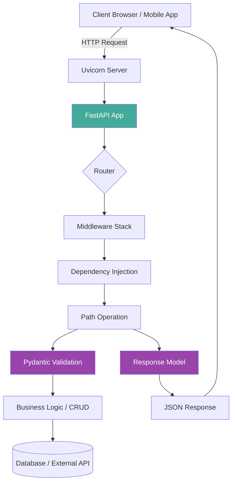
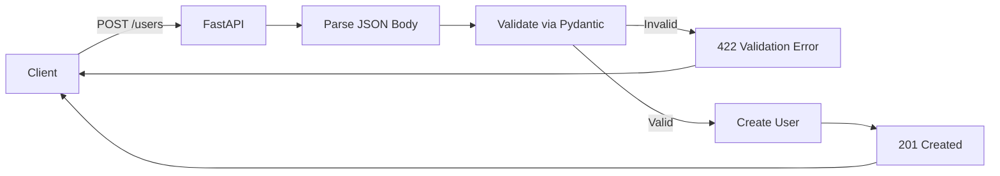
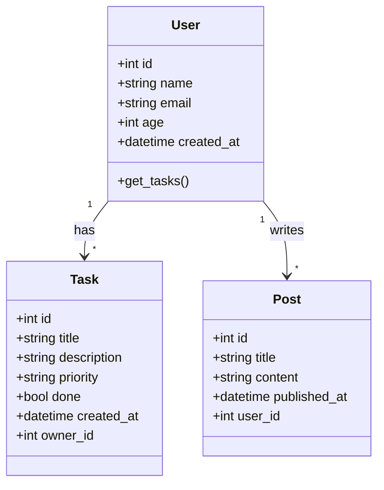
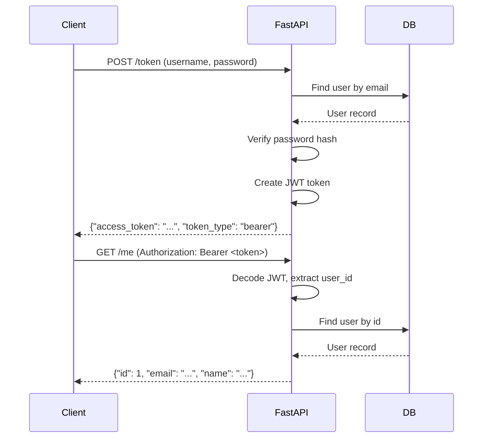
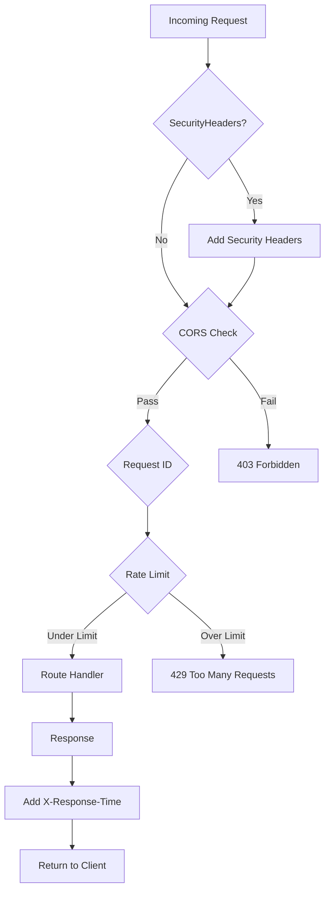
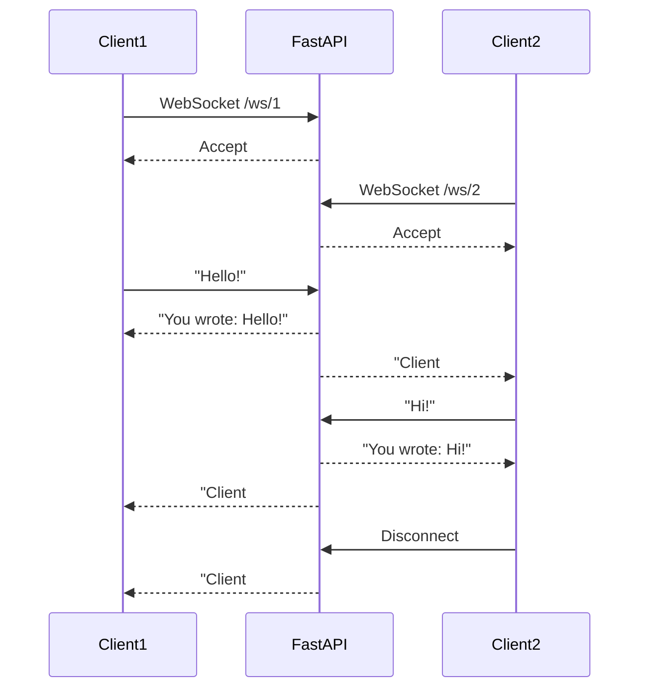

# Week 3 — FastAPI

**Goal:** Production-ready FastAPI API banao  

---



## Day 1 — FastAPI Setup & First Routes

### What is FastAPI?

FastAPI = PHP ka Laravel ya Slim Framework. Modern Python web framework jo:

- Automatic docs generate karta hai (Swagger UI + ReDoc)
- Type hints use karta hai validation aur serialization ke liye — same as Laravel's Form Request but automatic
- Async support built-in — like Laravel's queues but for HTTP itself
- Performance mein Node.js aur Go jaisa fast (Starlette + Pydantic on UVicorn)
- OpenAPI 3.1 compliant by default

**PHP → Python Framework Map:**

| PHP Framework | Python Equivalent | Key Difference |
|---|---|---|
| Laravel | FastAPI | FastAPI is async-first, no built-in ORM opinion |
| Symfony | FastAPI + SQLAlchemy | FastAPI is lighter, no DI container config file |
| Slim | FastAPI | Same lightweight philosophy, but async |
| Lumen | FastAPI | Same micro-framework feel, but FastAPI has better DX |

### Setup

```bash
pip install fastapi uvicorn pydantic
```

```
fastapi     → Web framework
uvicorn     → ASGI server (like PHP-FPM but async)
pydantic    → Data validation (like Laravel validation + Eloquent casting)
```

### First API — Hello World

```python
# main.py
from fastapi import FastAPI

app = FastAPI(
    title="AI Engineering Journey",
    version="1.0.0",
    description="Raushan ka FastAPI learning project"
)

@app.get("/")
def root():
    return {"message": "Hello, Raushan! AI Engineer ban raha hoon 🚀"}

@app.get("/health")
def health():
    return {"status": "ok", "version": "1.0.0"}
```

```bash
# Run karo
uvicorn main:app --reload

# Open browser:
# http://127.0.0.1:8000          → JSON response
# http://127.0.0.1:8000/docs     → Swagger UI (auto-generated!)
# http://127.0.0.1:8000/redoc    → ReDoc UI
```

**`uvicorn main:app --reload` breakdown:**
- `main` = filename (main.py)
- `app` = FastAPI instance variable
- `--reload` = development mode (auto-restart on file changes) — like `php artisan serve` but better

### Path Parameters

```python
@app.get("/users/{user_id}")
def get_user(user_id: int):
    return {"user_id": user_id, "name": f"User {user_id}"}

@app.get("/users/{user_id}/posts/{post_id}")
def get_user_post(user_id: int, post_id: int):
    return {"user_id": user_id, "post_id": post_id}

# Path parameter with type validation
@app.get("/items/{item_id}")
def get_item(item_id: int):
    """
    Agar "abc" bhejoge to automatic 422 error.
    PHP mein aise validation alag se karni padti.
    """
    return {"item_id": item_id}
```

PHP mein `Route::get('/users/{id}', ...)` jaisa hi hai, but type validation automatically ho jata hai.

### Enum Parameters

```python
from enum import Enum

class UserRole(str, Enum):
    admin = "admin"
    user = "user"
    moderator = "moderator"

@app.get("/users/{role}")
def get_users_by_role(role: UserRole):
    # Swagger UI mein dropdown dikhega!
    if role == UserRole.admin:
        return {"role": role, "count": 5}
    return {"role": role, "count": 100}

# Usage: GET /users/admin → {"role": "admin", "count": 5}
#         GET /users/superadmin → 422 Validation Error
```

### Query Parameters

```python
from typing import Optional

@app.get("/search")
def search_items(
    q: str,                           # Required query parameter
    page: int = 1,                    # Optional with default
    limit: int = 10,                  # Optional with default
    sort_by: Optional[str] = None,    # Fully optional
):
    return {
        "query": q,
        "page": page,
        "limit": limit,
        "sort_by": sort_by,
        "results": []
    }

# URL: /search?q=python&page=2&limit=20&sort_by=name
```

**PHP → Python Query Params:**
- Laravel: `$request->query('page', 1)`
- FastAPI: function parameter with default
- Laravel: manual validation with rules array
- FastAPI: type hint = automatic validation

### Request Body with Pydantic

PHP mein `Illuminate\Http\Request` + validation rules. FastAPI mein Pydantic models.

```python
from pydantic import BaseModel
from datetime import datetime

class UserCreate(BaseModel):
    name: str
    email: str
    age: int
    city: str = "Patna"               # Default value

class UserResponse(BaseModel):
    id: int
    name: str
    email: str
    age: int
    city: str
    created_at: datetime

@app.post("/users", response_model=UserResponse)
def create_user(user: UserCreate):
    # Pydantic automatically validates `user`
    # Agar `age` string diya to 422 error dega
    return {
        "id": 1,
        "name": user.name,
        "email": user.email,
        "age": user.age,
        "city": user.city,
        "created_at": datetime.now()
    }
```

### Combining Path, Query, and Body

```python
@app.put("/users/{user_id}")
def update_user(
    user_id: int,                    # Path parameter
    user: UserCreate,                # Request body
    x_trace_id: Optional[str] = None # Header (via Header, see Day 6)
):
    return {
        "user_id": user_id,
        **user.model_dump()
    }
```

### Response Status Codes

```python
from fastapi import status

@app.post("/users", status_code=status.HTTP_201_CREATED)
def create_user(user: UserCreate):
    return {"id": 1, **user.model_dump()}

@app.delete("/users/{user_id}", status_code=status.HTTP_204_NO_CONTENT)
def delete_user(user_id: int):
    # 204 = No Content — return nothing (or None)
    pass
```



### Day 1 Exercise

```python
# Banao: Calculator API
# GET /add?a=5&b=3 → {"result": 8}
# GET /subtract?a=10&b=4 → {"result": 6}
# POST /multiply → body: {"a": 5, "b": 3}
# POST /divide → body: {"a": 10, "b": 2} (zero se divide bhi handle karo)

# Bonus:
# 1. Enum use karo for operation type
# 2. History endpoint: GET /history → list of past calculations
# 3. Response model banao for consistent response shape
```

### Tumne Seekha (Day 1)
- [ ] FastAPI project scaffolding aur uvicorn run karna
- [ ] Path parameters with type validation
- [ ] Query parameters with defaults aur Optional
- [ ] Pydantic request body validation
- [ ] Response model se consistent output shape
- [ ] Auto-generated Swagger docs ka magic

---

## Day 2 — CRUD API with In-Memory List

### Basic CRUD Operations

```python
from fastapi import FastAPI, HTTPException
from pydantic import BaseModel
from typing import List, Optional

app = FastAPI()

# In-memory "database"
tasks_db = []
task_id_counter = 1

class TaskCreate(BaseModel):
    title: str
    description: Optional[str] = None
    priority: str = "medium"

class Task(TaskCreate):
    id: int
    done: bool = False

    model_config = {"from_attributes": True}

@app.get("/tasks", response_model=List[Task])
def list_tasks(done: Optional[bool] = None):
    if done is None:
        return tasks_db
    return [t for t in tasks_db if t["done"] == done]

@app.get("/tasks/{task_id}", response_model=Task)
def get_task(task_id: int):
    for task in tasks_db:
        if task["id"] == task_id:
            return task
    raise HTTPException(status_code=404, detail="Task nahi mila")

@app.post("/tasks", response_model=Task, status_code=201)
def create_task(task: TaskCreate):
    global task_id_counter
    new_task = task.model_dump()
    new_task["id"] = task_id_counter
    new_task["done"] = False
    tasks_db.append(new_task)
    task_id_counter += 1
    return new_task

@app.put("/tasks/{task_id}", response_model=Task)
def update_task(task_id: int, task: TaskCreate):
    for i, t in enumerate(tasks_db):
        if t["id"] == task_id:
            updated = task.model_dump()
            updated["id"] = task_id
            updated["done"] = t["done"]
            tasks_db[i] = updated
            return updated
    raise HTTPException(status_code=404, detail="Task nahi mila")

@app.delete("/tasks/{task_id}", status_code=204)
def delete_task(task_id: int):
    for i, t in enumerate(tasks_db):
        if t["id"] == task_id:
            tasks_db.pop(i)
            return
    raise HTTPException(status_code=404, detail="Task nahi mila")

@app.patch("/tasks/{task_id}/done", response_model=Task)
def mark_done(task_id: int):
    for t in tasks_db:
        if t["id"] == task_id:
            t["done"] = True
            return t
    raise HTTPException(status_code=404, detail="Task nahi mila")
```

### Pagination

Real APIs mein kabhi bina pagination ke list endpoint nahi chhodna.

```python
from typing import Generic, TypeVar

T = TypeVar("T")

class PaginatedResponse(BaseModel, Generic[T]):
    items: List[T]
    total: int
    page: int
    limit: int
    total_pages: int

    model_config = {"from_attributes": True}

@app.get("/tasks/paginated", response_model=PaginatedResponse[Task])
def list_tasks_paginated(
    page: int = 1,
    limit: int = 10
):
    start = (page - 1) * limit
    end = start + limit
    items = tasks_db[start:end]
    total = len(tasks_db)

    return PaginatedResponse(
        items=items,
        total=total,
        page=page,
        limit=limit,
        total_pages=(total + limit - 1) // limit
    )
```

**PHP → Python Pagination:**
- Laravel: `Model::paginate(15)` — returns LengthAwarePaginator
- FastAPI: manual slicing + PaginatedResponse model
- Later with SQLAlchemy: `query.offset(offset).limit(limit).all()`

### Filtering and Sorting

```python
@app.get("/tasks/filtered", response_model=List[Task])
def list_tasks_filtered(
    search: Optional[str] = None,
    priority: Optional[str] = None,
    sort_by: str = "id",
    sort_order: str = "asc"
):
    result = tasks_db

    # Filtering
    if search:
        result = [t for t in result if search.lower() in t["title"].lower()]
    if priority:
        result = [t for t in result if t["priority"] == priority]

    # Sorting
    reverse = sort_order.lower() == "desc"
    if sort_by in ("id", "title", "priority", "done"):
        result.sort(key=lambda t: t.get(sort_by, ""), reverse=reverse)

    return result
```

### Partial Updates with Pydantic

```python
class TaskUpdate(BaseModel):
    title: Optional[str] = None
    description: Optional[str] = None
    priority: Optional[str] = None
    done: Optional[bool] = None

@app.patch("/tasks/{task_id}", response_model=Task)
def patch_task(task_id: int, task: TaskUpdate):
    for t in tasks_db:
        if t["id"] == task_id:
            updates = task.model_dump(exclude_unset=True)
            t.update(updates)
            return t
    raise HTTPException(status_code=404, detail="Task nahi mila")

# Usage: PATCH /tasks/1 → body: {"done": true}
# Only "done" field updates, baaki fields unchanged
```

**Key difference:** `model_dump(exclude_unset=True)` sirf wahi fields deta hai jo client ne actually bheji. PHP mein aap manually check karte `$request->has('done')`.

### Testing with httpx

```bash
pip install httpx pytest
```

```python
# test_main.py
from fastapi.testclient import TestClient
from main import app

client = TestClient(app)

def test_create_task():
    response = client.post("/tasks", json={
        "title": "Learn FastAPI",
        "priority": "high"
    })
    assert response.status_code == 201
    data = response.json()
    assert data["title"] == "Learn FastAPI"
    assert data["id"] == 1
    assert data["done"] is False

def test_list_tasks():
    response = client.get("/tasks")
    assert response.status_code == 200
    assert len(response.json()) >= 1

def test_get_nonexistent():
    response = client.get("/tasks/999")
    assert response.status_code == 404
    assert "nahi mila" in response.json()["detail"]
```

### Day 2 Exercise

```python
# CRUD API banao for Books:
# GET /books → list all (with pagination and search by title)
# GET /books/{id} → single book
# POST /books → create book (title, author, year, isbn)
# PUT /books/{id} → update book
# DELETE /books/{id} → delete book
# PATCH /books/{id} → partial update

# Phir har endpoint ke test likho
# Bonus: sorting by year, filtering by author
```

### Tumne Seekha (Day 2)
- [ ] Full CRUD with in-memory storage
- [ ] Pagination pattern (offset/limit)
- [ ] Filtering aur sorting logic
- [ ] Partial updates with `exclude_unset=True`
- [ ] HTTP status codes (201, 204, 404)
- [ ] Testing APIs with TestClient

---

## Day 3 — Pydantic V2 Deep Dive

### Pydantic V2 Features

Pydantic V2 = PHP ka Laravel Form Request validation ka power, lekin zyada flexible. Rust mein likha hai, isliye super fast.

```python
from pydantic import BaseModel, Field, field_validator, model_validator, EmailStr
from typing import Optional
from datetime import datetime
import re

# Install: pip install pydantic[email]

class UserCreate(BaseModel):
    name: str = Field(min_length=2, max_length=50)
    email: str = Field(pattern=r"^[\w\.-]+@[\w\.-]+\.\w+$")
    age: int = Field(ge=0, le=150, description="User ki age")
    phone: Optional[str] = Field(default=None, pattern=r"^\+?91\d{10}$")

    # Field level validator
    @field_validator("name")
    @classmethod
    def name_must_be_proper(cls, v: str) -> str:
        if not v.strip():
            raise ValueError("Name khali nahi ho sakta")
        return v.strip().title()

    # Model level validator (multiple fields)
    @model_validator(mode="after")
    def check_user(self):
        if self.age < 18 and self.phone is None:
            raise ValueError("Under 18 users ka phone hona chahiye")
        return self

class UserResponse(BaseModel):
    id: int
    name: str
    email: str
    age: int
    created_at: datetime = Field(default_factory=datetime.now)

    model_config = {"from_attributes": True}
```

### Field Configuration

```python
from pydantic import BaseModel, Field
from typing import List, Optional

class Config(BaseModel):
    app_name: str = Field(
        default="AI Journey",
        alias="APP_NAME",           # Environment variable alias
        description="Application name",
    )

    debug: bool = Field(default=False)
    allowed_hosts: List[str] = Field(default_factory=list)
    database_url: Optional[str] = Field(default=None, exclude=True)  # Hide from serialization

    model_config = {
        "env_prefix": "MYAPP_",         # Auto read from env
        "extra": "forbid",              # Extra fields allow nahi
    }
```

### Validation Advanced

```python
from pydantic import BaseModel, field_validator
from typing import List
import json

class TaskCreate(BaseModel):
    title: str = Field(min_length=1, max_length=200)
    tags: List[str] = Field(default_factory=list, max_length=5)

    @field_validator("tags")
    @classmethod
    def tags_must_be_unique(cls, v: List[str]) -> List[str]:
        if len(v) != len(set(v)):
            raise ValueError("Tags duplicate nahi hone chahiye")
        return [tag.lower().strip() for tag in v]

    @field_validator("title")
    @classmethod
    def title_no_html(cls, v: str) -> str:
        if "<" in v or ">" in v:
            raise ValueError("HTML tags not allowed")
        return v
```

### Computed Fields

Pydantic V2 mein computed fields — calculated properties jo serialization mein include hote hain, lekin input mein nahi maange jaate.

```python
from pydantic import BaseModel, computed_field
from datetime import date

class Person(BaseModel):
    first_name: str
    last_name: str
    birth_year: int

    @computed_field
    @property
    def full_name(self) -> str:
        return f"{self.first_name} {self.last_name}"

    @computed_field
    @property
    def age(self) -> int:
        return date.today().year - self.birth_year

user = Person(first_name="Raushan", last_name="Kumar", birth_year=1995)
print(user.model_dump())
# → {"first_name": "Raushan", "last_name": "Kumar", "birth_year": 1995, "full_name": "Raushan Kumar", "age": 31}
```

### SecretStr and Sensitive Data

```python
from pydantic import BaseModel, SecretStr, SecretBytes

class UserCredentials(BaseModel):
    username: str
    password: SecretStr      # Jab print karega to "********" dikhega
    api_key: SecretStr

creds = UserCredentials(username="raushan", password="hunter2", api_key="sk-123")
print(creds.model_dump())
# → {"username": "raushan", "password": "********", "api_key": "********"}
print(creds.password.get_secret_value())
# → "hunter2" — actual value jab chahiye
```

### AnyUrl and Special Types

```python
from pydantic import AnyUrl, HttpUrl, FilePath, DirectoryPath, UUID4
from uuid import uuid4

class Product(BaseModel):
    website: AnyUrl           # Any valid URL
    image_url: HttpUrl        # Must be http/https
    local_path: FilePath      # Must exist on filesystem
    uuid: UUID4 = Field(default_factory=uuid4)  # Auto-generate UUID

# Usage
prod = Product(
    website="ftp://files.example.com",
    image_url="https://example.com/img.jpg",
    local_path="C:\\Users\\hiii\\test.txt"
)
```

### Config Management with Pydantic

```python
# config.py
from pydantic_settings import BaseSettings
from typing import Optional

class Settings(BaseSettings):
    app_name: str = "Task Manager API"
    debug: bool = False
    database_url: str = "sqlite:///./tasks.db"
    secret_key: str = "change-me-in-production"
    cors_origins: list[str] = ["http://localhost:3000"]
    log_level: str = "INFO"

    model_config = {"env_file": ".env", "env_file_encoding": "utf-8"}

settings = Settings()
```

```
# .env file
APP_NAME=Task Manager API
DATABASE_URL=sqlite:///./tasks.db
SECRET_KEY=super-secret-key-123
CORS_ORIGINS=["http://localhost:3000","https://myapp.com"]
```

Pydantic Settings automatically `.env` file se read karta hai — like Laravel's `.env` + `config/` files combined.

### Discriminated Unions

```python
from typing import Union
from pydantic import BaseModel, Field
from typing import Literal

class Cat(BaseModel):
    pet_type: Literal["cat"] = "cat"
    meows: bool

class Dog(BaseModel):
    pet_type: Literal["dog"] = "dog"
    barks: bool
    breed: str

class Animal(BaseModel):
    pet: Union[Cat, Dog] = Field(discriminator="pet_type")

# Agar Cat ka JSON bhejoge to sirf "meows" validate hoga
# Agar Dog ka JSON bhejoge to "barks" aur "breed" validate hoga

cat_data = {"pet": {"pet_type": "cat", "meows": True}}
dog_data = {"pet": {"pet_type": "dog", "barks": True, "breed": "Labrador"}}

Animal(**cat_data).model_dump()
Animal(**dog_data).model_dump()

# Invalid → Error: "pet_type" must be "cat" or "dog"
```

### Day 3 Exercise

```python
# Banao: Product model with validators
# name: 2-100 chars, no special chars except hyphen/space
# price: positive, max 999999.99
# stock: non-negative integer
# sku: pattern like "PROD-001", auto-increment
# category: must be in ["electronics", "books", "clothing", "food"]
# tags: 1-5 tags, each 2-20 chars

# Bonus:
# - Computed field: is_low_stock (True if stock < 10)
# - SecretStr for internal_notes
# - Discriminated union for different product types (physical, digital, service)
```

### Tumne Seekha (Day 3)
- [ ] Pydantic Field validators (field + model level)
- [ ] Field configuration (min_length, pattern, ge/le)
- [ ] Computed fields for derived data
- [ ] SecretStr for sensitive data
- [ ] AnyUrl, EmailStr, UUID4 special types
- [ ] Pydantic Settings with .env support
- [ ] Discriminated unions for polymorphic models

---

## Day 4 — SQLAlchemy + SQLite

### Setup

```bash
pip install sqlalchemy
```

### SQLAlchemy Models

PHP mein Eloquent models banate the. SQLAlchemy ka ORM same kaam karta hai.

```python
# models.py
from sqlalchemy import create_engine, Column, Integer, String, Boolean, DateTime, Float, ForeignKey
from sqlalchemy.orm import DeclarativeBase, relationship, Session
from datetime import datetime, timezone

DATABASE_URL = "sqlite:///./app.db"
engine = create_engine(DATABASE_URL, echo=True)

class Base(DeclarativeBase):
    pass

class Task(Base):
    __tablename__ = "tasks"

    id = Column(Integer, primary_key=True, index=True)
    title = Column(String(200), nullable=False)
    description = Column(String(1000), nullable=True)
    priority = Column(String(10), default="medium")
    done = Column(Boolean, default=False)
    created_at = Column(DateTime, default=lambda: datetime.now(timezone.utc))

class User(Base):
    __tablename__ = "users"

    id = Column(Integer, primary_key=True, index=True)
    name = Column(String(100), nullable=False)
    email = Column(String(200), unique=True, nullable=False)
    age = Column(Integer, nullable=True)
    created_at = Column(DateTime, default=lambda: datetime.now(timezone.utc))

    # One-to-many relationship
    tasks = relationship("Task", back_populates="owner")

# Create tables
Base.metadata.create_all(bind=engine)
```



**PHP → SQLAlchemy Model Comparison:**

| Laravel Eloquent | SQLAlchemy |
|---|---|
| `php artisan make:model Task` | Hand-write class extending `Base` |
| `protected $table = 'tasks'` | `__tablename__ = 'tasks'` |
| `protected $fillable = ['title']` | Manually define all Columns |
| `$table->timestamps()` | `created_at = Column(DateTime, ...)` |
| `belongsTo(User::class)` | `relationship("User", back_populates="tasks")` |
| `Task::find(1)` | `db.query(Task).filter(Task.id == 1).first()` |
| `Task::where('done', true)->get()` | `db.query(Task).filter(Task.done == True).all()` |

### Session Management

```python
# database.py
from sqlalchemy import create_engine
from sqlalchemy.orm import sessionmaker

DATABASE_URL = "sqlite:///./app.db"
engine = create_engine(DATABASE_URL, connect_args={"check_same_thread": False})

SessionLocal = sessionmaker(autocommit=False, autoflush=False, bind=engine)

def get_db():
    db = SessionLocal()
    try:
        yield db
    finally:
        db.close()
```

### FastAPI + SQLAlchemy CRUD

```python
# main.py
from fastapi import FastAPI, Depends, HTTPException
from sqlalchemy.orm import Session
from typing import List, Optional
from datetime import datetime, timezone

from .database import get_db
from .models import Task as TaskModel
from .schemas import TaskCreate, TaskResponse

app = FastAPI()

@app.get("/tasks", response_model=List[TaskResponse])
def list_tasks(done: Optional[bool] = None, db: Session = Depends(get_db)):
    query = db.query(TaskModel)
    if done is not None:
        query = query.filter(TaskModel.done == done)
    return query.all()

@app.get("/tasks/{task_id}", response_model=TaskResponse)
def get_task(task_id: int, db: Session = Depends(get_db)):
    task = db.query(TaskModel).filter(TaskModel.id == task_id).first()
    if not task:
        raise HTTPException(status_code=404, detail="Task nahi mila")
    return task

@app.post("/tasks", response_model=TaskResponse, status_code=201)
def create_task(task: TaskCreate, db: Session = Depends(get_db)):
    db_task = TaskModel(**task.model_dump())
    db.add(db_task)
    db.commit()
    db.refresh(db_task)
    return db_task

@app.put("/tasks/{task_id}", response_model=TaskResponse)
def update_task(task_id: int, task: TaskCreate, db: Session = Depends(get_db)):
    db_task = db.query(TaskModel).filter(TaskModel.id == task_id).first()
    if not db_task:
        raise HTTPException(status_code=404, detail="Task nahi mila")
    for key, value in task.model_dump().items():
        setattr(db_task, key, value)
    db.commit()
    db.refresh(db_task)
    return db_task

@app.delete("/tasks/{task_id}", status_code=204)
def delete_task(task_id: int, db: Session = Depends(get_db)):
    db_task = db.query(TaskModel).filter(TaskModel.id == task_id).first()
    if not db_task:
        raise HTTPException(status_code=404, detail="Task nahi mila")
    db.delete(db_task)
    db.commit()
    return None
```

### Pydantic Schemas (Separate File)

```python
# schemas.py
from pydantic import BaseModel, Field
from typing import Optional
from datetime import datetime

class TaskCreate(BaseModel):
    title: str = Field(min_length=1, max_length=200)
    description: Optional[str] = None
    priority: str = Field(default="medium", pattern="^(high|medium|low)$")

class TaskResponse(TaskCreate):
    id: int
    done: bool
    created_at: datetime

    model_config = {"from_attributes": True}
```

### Alembic Migrations

Jab database schema change karna ho (new column, rename, etc.), to Alembic use karte hain. PHP mein `php artisan make:migration` jaisa.

```bash
# Install
pip install alembic

# Initialize
alembic init alembic
```

```
alembic/
├── env.py              # Alembic config (database URL yahan set karo)
├── script.py.mako      # Migration template
└── versions/           # Migrations yahan bante hain
```

```python
# alembic/env.py — Edit karo:
from app.database import Base
from app.models import Task, User  # Import all models
target_metadata = Base.metadata    # SQLAlchemy metadata
```

```bash
# Create migration (auto-detects model changes!)
alembic revision --autogenerate -m "add tasks table"

# Apply migration
alembic upgrade head

# Rollback
alembic downgrade -1

# Check status
alembic current
alembic history
```

**PHP → Alembic Comparison:**
- Laravel: `php artisan make:migration create_tasks_table`
- Python: `alembic revision --autogenerate -m "create tasks table"`
- Laravel: `php artisan migrate`
- Python: `alembic upgrade head`
- Advantage: Alembic `--autogenerate` compares your models with actual database and generates migration automatically!

### Relationships Deep Dive

```python
# One-to-Many
class User(Base):
    __tablename__ = "users"
    id = Column(Integer, primary_key=True)
    posts = relationship("Post", back_populates="author", cascade="all, delete-orphan")

class Post(Base):
    __tablename__ = "posts"
    id = Column(Integer, primary_key=True)
    user_id = Column(Integer, ForeignKey("users.id"))
    author = relationship("User", back_populates="posts")

# Many-to-Many
from sqlalchemy import Table, Column, Integer, ForeignKey

# Association table
post_tags = Table(
    "post_tags",
    Base.metadata,
    Column("post_id", Integer, ForeignKey("posts.id")),
    Column("tag_id", Integer, ForeignKey("tags.id")),
)

class Tag(Base):
    __tablename__ = "tags"
    id = Column(Integer, primary_key=True)
    name = Column(String(50), unique=True)
    posts = relationship("Post", secondary=post_tags, back_populates="tags")

class Post(Base):
    __tablename__ = "posts"
    id = Column(Integer, primary_key=True)
    tags = relationship("Tag", secondary=post_tags, back_populates="posts")
```

### SQLAlchemy Query Tips

```python
# Instead of N+1 queries (like Laravel's N+1 problem):
# ❌ Bad — har task ke liye alag query
tasks = db.query(Task).all()
for task in tasks:
    print(task.owner.name)  # Extra query har baar!

# ✅ Good — eager loading (like Laravel's ->with())
from sqlalchemy.orm import joinedload
tasks = db.query(Task).options(joinedload(Task.owner)).all()

# ✅ Alternative — selectinload (2 queries, better for many-to-many)
from sqlalchemy.orm import selectinload
tasks = db.query(Task).options(selectinload(Task.owner)).all()

# Aggregation
from sqlalchemy import func
result = db.query(
    Task.priority,
    func.count(Task.id).label("count")
).group_by(Task.priority).all()
# → [("high", 5), ("medium", 12), ("low", 3)]

# Pagination with SQLAlchemy
@app.get("/tasks/paginated")
def list_tasks_paginated(
    page: int = 1,
    limit: int = 10,
    db: Session = Depends(get_db)
):
    offset = (page - 1) * limit
    total = db.query(TaskModel).count()
    items = db.query(TaskModel).offset(offset).limit(limit).all()

    return {
        "items": items,
        "total": total,
        "page": page,
        "limit": limit,
        "total_pages": (total + limit - 1) // limit
    }
```

### Day 4 Exercise

```python
# User CRUD banao with SQLAlchemy:
# GET /users → list (with pagination)
# GET /users/{id} → single user with tasks
# POST /users → create
# PUT /users/{id} → update
# DELETE /users/{id} → delete (cascade tasks)

# Bonus:
# 1. Task-Tag many-to-many relationship add karo
# 2. Alembic migration setup karo
# 3. Filter tasks by tag name
# 4. Eager loading use karo for performance
```

### Tumne Seekha (Day 4)
- [ ] SQLAlchemy models with columns and types
- [ ] Session management with `get_db` dependency
- [ ] One-to-many and many-to-many relationships
- [ ] Alembic migrations with `--autogenerate`
- [ ] Eager loading (N+1 query problem solve)
- [ ] Aggregation and pagination with SQLAlchemy

---

## Day 5 — Error Handling, Auth & Async

### HTTPException & Custom Handlers

```python
from fastapi import FastAPI, HTTPException, Request
from fastapi.responses import JSONResponse
from fastapi.exception_handlers import http_exception_handler as _http_exception_handler

app = FastAPI()

# Route-level exception
@app.get("/items/{item_id}")
def get_item(item_id: int):
    if item_id == 0:
        raise HTTPException(
            status_code=400,
            detail="Item ID 0 nahi ho sakta",
            headers={"X-Error": "Invalid ID"},
        )
    if item_id < 0:
        raise HTTPException(status_code=404, detail="Item nahi mila")
    return {"item_id": item_id}

# Custom validation error handler
@app.exception_handler(ValueError)
async def value_error_handler(request: Request, exc: ValueError):
    return JSONResponse(
        status_code=422,
        content={
            "error": "Validation Error",
            "detail": str(exc),
            "path": request.url.path
        }
    )

# Global exception handler
@app.exception_handler(Exception)
async def global_exception_handler(request: Request, exc: Exception):
    return JSONResponse(
        status_code=500,
        content={
            "error": "Internal Server Error",
            "detail": "Kuch gadbad hui. Team ko batao.",
            "path": request.url.path
        }
    )
```

### Custom Exception Classes

```python
class NotFoundError(HTTPException):
    def __init__(self, entity: str, entity_id: int):
        super().__init__(
            status_code=404,
            detail=f"{entity} with id {entity_id} nahi mila"
        )

class BusinessError(HTTPException):
    def __init__(self, message: str):
        super().__init__(status_code=422, detail=message)

# Usage
@app.get("/tasks/{task_id}")
def get_task(task_id: int, db: Session = Depends(get_db)):
    task = db.query(TaskModel).filter(TaskModel.id == task_id).first()
    if not task:
        raise NotFoundError("Task", task_id)
    return task
```

### Async Routes

```python
import asyncio
import httpx

@app.get("/async-example")
async def async_endpoint():
    # I/O operation async mein handle karo
    await asyncio.sleep(1)
    return {"message": "2 second baad aaya"}

# Multiple external API calls simultaneously
@app.get("/fetch-users")
async def fetch_users():
    async with httpx.AsyncClient() as client:
        # Dono calls parallel mein chalege
        github, jsonplaceholder = await asyncio.gather(
            client.get("https://api.github.com/users/raushan"),
            client.get("https://jsonplaceholder.typicode.com/users/1"),
        )
        return {
            "github": github.json(),
            "jsonplaceholder": jsonplaceholder.json(),
        }

# Background tasks
from fastapi import BackgroundTasks

def send_welcome_email(email: str):
    print(f"Welcome email bhej rahe hain {email} ko...")
    import time
    time.sleep(2)
    print("Email bhej di!")

@app.post("/users", status_code=201)
async def create_user(user: UserCreate, background_tasks: BackgroundTasks):
    # Response turant bhej do, email background mein chale ga
    background_tasks.add_task(send_welcome_email, user.email)
    return {"message": "User created! Email bhijwadiya.", "user": user}

# Background task with exception handling
from fastapi import BackgroundTasks

def log_new_user(user_id: int):
    try:
        print(f"New user registered: {user_id}")
    except Exception as e:
        print(f"Logging failed: {e}")

@app.post("/users")
async def create_user(user: UserCreate, background_tasks: BackgroundTasks):
    db_user = create_user_in_db(user)
    background_tasks.add_task(log_new_user, db_user.id)
    return db_user
```

### JWT Authentication

FastAPI mein OAuth2 with JWT — like Laravel Sanctum or Passport.

```bash
pip install python-jose[cryptography] passlib[bcrypt] python-multipart
```

```python
# auth.py
from datetime import datetime, timedelta, timezone
from typing import Optional
from jose import JWTError, jwt
from passlib.context import CryptContext
from fastapi import Depends, HTTPException, status
from fastapi.security import OAuth2PasswordBearer, OAuth2PasswordRequestForm
from sqlalchemy.orm import Session

# Secret key — .env mein dalo!
SECRET_KEY = "09d25e094faa6ca2556c818166b7a9563b93f7099f6f0f4caa6cf63b88e8d3e7"
ALGORITHM = "HS256"
ACCESS_TOKEN_EXPIRE_MINUTES = 30

pwd_context = CryptContext(schemes=["bcrypt"], deprecated="auto")
oauth2_scheme = OAuth2PasswordBearer(tokenUrl="token")

# Password hashing
def verify_password(plain_password: str, hashed_password: str) -> bool:
    return pwd_context.verify(plain_password, hashed_password)

def get_password_hash(password: str) -> str:
    return pwd_context.hash(password)

# Create access token
def create_access_token(data: dict, expires_delta: Optional[timedelta] = None):
    to_encode = data.copy()
    expire = datetime.now(timezone.utc) + (expires_delta or timedelta(minutes=15))
    to_encode.update({"exp": expire})
    encoded_jwt = jwt.encode(to_encode, SECRET_KEY, algorithm=ALGORITHM)
    return encoded_jwt

# Get current user from token
async def get_current_user(
    token: str = Depends(oauth2_scheme),
    db: Session = Depends(get_db)
):
    credentials_exception = HTTPException(
        status_code=status.HTTP_401_UNAUTHORIZED,
        detail="Invalid authentication credentials",
        headers={"WWW-Authenticate": "Bearer"},
    )
    try:
        payload = jwt.decode(token, SECRET_KEY, algorithms=[ALGORITHM])
        user_id: int = payload.get("sub")
        if user_id is None:
            raise credentials_exception
    except JWTError:
        raise credentials_exception

    user = db.query(UserModel).filter(UserModel.id == user_id).first()
    if user is None:
        raise credentials_exception
    return user
```



### Login Endpoint

```python
# main.py — Add these endpoints

@app.post("/token")
async def login(
    form_data: OAuth2PasswordRequestForm = Depends(),
    db: Session = Depends(get_db)
):
    """OAuth2 compatible token login, get an access token for future requests"""
    user = db.query(UserModel).filter(UserModel.email == form_data.username).first()
    if not user or not verify_password(form_data.password, user.hashed_password):
        raise HTTPException(
            status_code=status.HTTP_401_UNAUTHORIZED,
            detail="Incorrect email or password",
            headers={"WWW-Authenticate": "Bearer"},
        )

    access_token = create_access_token(
        data={"sub": str(user.id)},
        expires_delta=timedelta(minutes=ACCESS_TOKEN_EXPIRE_MINUTES)
    )
    return {"access_token": access_token, "token_type": "bearer"}

# Protected routes
@app.get("/users/me")
async def read_users_me(current_user: UserModel = Depends(get_current_user)):
    return current_user

@app.get("/users/me/tasks")
async def read_my_tasks(
    current_user: UserModel = Depends(get_current_user),
    db: Session = Depends(get_db)
):
    tasks = db.query(TaskModel).filter(TaskModel.owner_id == current_user.id).all()
    return tasks
```

### User Model with Password

```python
# Update User model
class User(Base):
    __tablename__ = "users"

    id = Column(Integer, primary_key=True, index=True)
    name = Column(String(100), nullable=False)
    email = Column(String(200), unique=True, nullable=False)
    hashed_password = Column(String(255), nullable=False)
    age = Column(Integer, nullable=True)
    created_at = Column(DateTime, default=lambda: datetime.now(timezone.utc))

    tasks = relationship("Task", back_populates="owner")

# Registration endpoint
class UserRegister(BaseModel):
    name: str = Field(min_length=2, max_length=50)
    email: str = Field(pattern=r"^[\w\.-]+@[\w\.-]+\.\w+$")
    password: str = Field(min_length=8, max_length=100)
    age: Optional[int] = None

@app.post("/register", status_code=201)
def register(user: UserRegister, db: Session = Depends(get_db)):
    # Check if email exists
    existing = db.query(User).filter(User.email == user.email).first()
    if existing:
        raise HTTPException(status_code=400, detail="Email already registered")

    # Create user
    db_user = User(
        name=user.name,
        email=user.email,
        hashed_password=get_password_hash(user.password),
        age=user.age,
    )
    db.add(db_user)
    db.commit()
    db.refresh(db_user)
    return db_user
```

**PHP → JWT Comparison:**
- Laravel Sanctum: `Auth::login()` + token issuing
- FastAPI: manual JWT creation + password verification
- Laravel: `auth:sanctum` middleware → `$request->user()`
- FastAPI: `Depends(get_current_user)` → returns User model

### Async SQLAlchemy (Optional Deep Dive)

```python
# For high-concurrency apps, use async SQLAlchemy
# pip install sqlalchemy[asyncio] aiosqlite

from sqlalchemy.ext.asyncio import create_async_engine, AsyncSession
from sqlalchemy.orm import sessionmaker

ASYNC_DATABASE_URL = "sqlite+aiosqlite:///./app.db"
async_engine = create_async_engine(ASYNC_DATABASE_URL, echo=True)

AsyncSessionLocal = sessionmaker(
    async_engine, class_=AsyncSession, expire_on_commit=False
)

async def get_async_db():
    async with AsyncSessionLocal() as db:
        yield db

# Use with async endpoints
@app.get("/async-tasks")
async def list_tasks_async(db: AsyncSession = Depends(get_async_db)):
    result = await db.execute(select(TaskModel))
    tasks = result.scalars().all()
    return tasks
```

### Day 5 Exercise

```python
# Banao: User registration API with:
# - Custom exceptions: EmailAlreadyExists, WeakPassword
# - Background task: send welcome email (simulate)
# - Async fetch: new user ko random dog image assign karo (dog.ceo API)
# - Proper error handlers for all cases

# Bonus:
# 1. JWT authentication implement karo
# 2. /users/me endpoint banao
# 3. Password strength validator (min 8 chars, 1 number, 1 special char)
# 4. Rate limiting on login endpoint
```

### Tumne Seekha (Day 5)
- [ ] HTTPException and custom exception handlers
- [ ] Global exception handler for unhandled errors
- [ ] Async routes with await/async
- [ ] BackgroundTasks for fire-and-forget operations
- [ ] JWT token creation and verification
- [ ] Password hashing with bcrypt
- [ ] OAuth2PasswordBearer for protected routes
- [ ] Async SQLAlchemy for high-concurrency scenarios

---

## Day 6 — Middleware, CORS & API Versioning

### CORS Middleware

```python
from fastapi.middleware.cors import CORSMiddleware

app.add_middleware(
    CORSMiddleware,
    allow_origins=[
        "http://localhost:3000",
        "https://your-frontend.com",
    ],
    allow_credentials=True,
    allow_methods=["*"],      # Sab HTTP methods
    allow_headers=["*"],      # Sab headers
)
```

### Custom Middleware

```python
import time
from fastapi import Request
from starlette.middleware.base import BaseHTTPMiddleware

class RequestLogMiddleware(BaseHTTPMiddleware):
    async def dispatch(self, request: Request, call_next):
        start = time.time()

        # Request aane pe
        print(f"→ {request.method} {request.url.path}")

        # Response jane pe
        response = await call_next(request)
        duration = time.time() - start

        print(f"← {request.method} {request.url.path} → {response.status_code} ({duration:.2f}s)")
        response.headers["X-Response-Time"] = str(duration)
        return response

app.add_middleware(RequestLogMiddleware)
```

### Rate Limiting Middleware

```python
import time
from collections import defaultdict
from fastapi import Request, HTTPException

class RateLimitMiddleware(BaseHTTPMiddleware):
    def __init__(self, app, max_requests: int = 10, window: int = 60):
        super().__init__(app)
        self.max_requests = max_requests
        self.window = window
        self.requests: dict = defaultdict(list)

    async def dispatch(self, request: Request, call_next):
        # Skip for docs
        if request.url.path in ["/docs", "/redoc", "/openapi.json"]:
            return await call_next(request)

        client_ip = request.client.host if request.client else "unknown"
        now = time.time()

        # Purane requests hatao
        self.requests[client_ip] = [
            t for t in self.requests[client_ip]
            if now - t < self.window
        ]

        if len(self.requests[client_ip]) >= self.max_requests:
            raise HTTPException(
                status_code=429,
                detail=f"Too many requests. {self.window} second mein ruko."
            )

        self.requests[client_ip].append(now)
        return await call_next(request)

app.add_middleware(RateLimitMiddleware, max_requests=5, window=10)
```

### Security Headers Middleware

```python
class SecurityHeadersMiddleware(BaseHTTPMiddleware):
    async def dispatch(self, request: Request, call_next):
        response = await call_next(request)
        response.headers["X-Content-Type-Options"] = "nosniff"
        response.headers["X-Frame-Options"] = "DENY"
        response.headers["X-XSS-Protection"] = "1; mode=block"
        response.headers["Strict-Transport-Security"] = "max-age=31536000; includeSubDomains"
        response.headers["Cache-Control"] = "no-store"
        return response

app.add_middleware(SecurityHeadersMiddleware)
```

### Request ID Middleware

```python
from uuid import uuid4

class RequestIDMiddleware(BaseHTTPMiddleware):
    async def dispatch(self, request: Request, call_next):
        request_id = request.headers.get("X-Request-ID", str(uuid4()))
        response = await call_next(request)
        response.headers["X-Request-ID"] = request_id
        return response

app.add_middleware(RequestIDMiddleware)
```

### API Versioning

```python
# Option 1: URL prefix versioning
# app/v1/routers/tasks.py
router_v1 = APIRouter(prefix="/v1/tasks", tags=["tasks-v1"])

@router_v1.get("")
def list_tasks_v1():
    return {"version": "v1", "tasks": []}

# app/v2/routers/tasks.py
router_v2 = APIRouter(prefix="/v2/tasks", tags=["tasks-v2"])

@router_v2.get("")
def list_tasks_v2():
    return {"version": "v2", "tasks": [], "pagination": {"page": 1, "limit": 10}}

# main.py
app.include_router(router_v1)
app.include_router(router_v2)

# Option 2: Header versioning
from fastapi import Header

@app.get("/tasks")
def list_tasks(
    x_api_version: str = Header("v1")
):
    if x_api_version == "v2":
        return {"version": "v2", "data": "new format"}
    return {"version": "v1", "data": "old format"}
```

### Dependency Injection as Middleware

```python
from fastapi import Depends, FastAPI, Request, Header
from typing import Optional

# Verify API key
async def verify_api_key(x_api_key: Optional[str] = Header(None)):
    if x_api_key != settings.secret_key:
        raise HTTPException(status_code=401, detail="Invalid API key")
    return x_api_key

@app.get("/protected")
async def protected_route(api_key: str = Depends(verify_api_key)):
    return {"message": "You have access!", "key": api_key}

# Dependency with DB
def get_current_user(
    db: Session = Depends(get_db),
    authorization: Optional[str] = Header(None)
):
    if not authorization:
        raise HTTPException(status_code=401, detail="No token provided")
    # Parse token, find user...
    user = db.query(User).filter(User.email == "raushan@example.com").first()
    if not user:
        raise HTTPException(status_code=404, detail="User nahi mila")
    return user

@app.get("/me")
def get_me(user: User = Depends(get_current_user)):
    return {"user": user}
```



### Middleware Stack Order

```python
# Middleware order matters — last added = first executed!
app.add_middleware(SecurityHeadersMiddleware)  # 4th (last)
app.add_middleware(RequestIDMiddleware)        # 3rd
app.add_middleware(RateLimitMiddleware)        # 2nd
app.add_middleware(RequestLogMiddleware)       # 1st (first to handle request)

# Execution order:
# 1. RequestLogMiddleware
# 2. RateLimitMiddleware
# 3. RequestIDMiddleware
# 4. SecurityHeadersMiddleware
# Then route handler
```

### Day 6 Exercise

```python
# Banao middleware jo:
# 1. Query performance track kare (slow queries > 1s log kare)
# 2. Request ID har request mein add kare
# 3. User-Agent header log kare
# 4. Block certain user agents (curl, python-requests)

# Bonus:
# 1. API versioning implement karo (v1 and v2)
# 2. Security headers middleware banao
# 3. Rate limiting with per-user (not per-IP) tracking
```

### Tumne Seekha (Day 6)
- [ ] CORS middleware configuration
- [ ] Custom middleware with BaseHTTPMiddleware
- [ ] Rate limiting implementation
- [ ] Security headers (XSS, HSTS, CSP)
- [ ] Request ID tracing
- [ ] API versioning strategies (URL prefix, header)
- [ ] Middleware stack ordering
- [ ] Dependency injection for auth checks

---

## Day 7 — File Uploads, WebSockets & Async Testing

### File Uploads

```python
from fastapi import FastAPI, File, UploadFile, Form
from fastapi.responses import HTMLResponse
import shutil
import os

app = FastAPI()
UPLOAD_DIR = "uploads"
os.makedirs(UPLOAD_DIR, exist_ok=True)

# Single file upload
@app.post("/upload")
async def upload_file(file: UploadFile = File(...)):
    # File info
    print(f"Filename: {file.filename}")
    print(f"Content-Type: {file.content_type}")
    print(f"Size: {file.size} bytes")

    # Save file
    file_path = os.path.join(UPLOAD_DIR, file.filename)
    with open(file_path, "wb") as buffer:
        shutil.copyfileobj(file.file, buffer)

    return {
        "filename": file.filename,
        "content_type": file.content_type,
        "size": file.size,
        "saved_path": file_path
    }

# Multiple files
@app.post("/upload-multiple")
async def upload_multiple(files: List[UploadFile] = File(...)):
    results = []
    for file in files:
        file_path = os.path.join(UPLOAD_DIR, file.filename)
        with open(file_path, "wb") as buffer:
            shutil.copyfileobj(file.file, buffer)
        results.append({
            "filename": file.filename,
            "size": file.size
        })
    return {"uploaded": len(results), "files": results}

# File + Form data together
@app.post("/upload-with-metadata")
async def upload_with_metadata(
    file: UploadFile = File(...),
    title: str = Form(...),
    description: str = Form(""),
    tags: str = Form("")
):
    file_path = os.path.join(UPLOAD_DIR, file.filename)
    with open(file_path, "wb") as buffer:
        shutil.copyfileobj(file.file, buffer)

    return {
        "title": title,
        "description": description,
        "tags": tags.split(","),
        "file": file.filename,
        "size": file.size
    }
```

### File Validation

```python
from fastapi import HTTPException

ALLOWED_EXTENSIONS = {".jpg", ".jpeg", ".png", ".gif", ".pdf"}
MAX_FILE_SIZE = 5 * 1024 * 1024  # 5 MB

async def validate_file(file: UploadFile):
    # Check extension
    ext = os.path.splitext(file.filename or "")[1].lower()
    if ext not in ALLOWED_EXTENSIONS:
        raise HTTPException(
            status_code=400,
            detail=f"File type {ext} not allowed. Allowed: {ALLOWED_EXTENSIONS}"
        )

    # Check size
    contents = await file.read()
    if len(contents) > MAX_FILE_SIZE:
        raise HTTPException(
            status_code=400,
            detail=f"File too large. Max: {MAX_FILE_SIZE} bytes"
        )

    # Reset file position after reading
    await file.seek(0)
    return contents

@app.post("/upload-validated")
async def upload_validated(file: UploadFile = File(...)):
    contents = await validate_file(file)

    file_path = os.path.join(UPLOAD_DIR, file.filename)
    with open(file_path, "wb") as buffer:
        buffer.write(contents)

    return {
        "filename": file.filename,
        "size": len(contents),
        "message": "File uploaded successfully"
    }
```

**PHP → File Upload Comparison:**
- Laravel: `$request->file('avatar')->store('avatars')`
- FastAPI: `UploadFile` + manual save
- Laravel: validation with `mimes:jpg,png,pdf` + `max:5120`
- FastAPI: manual check + HTTPException

### WebSocket Basics

Real-time communication — like Laravel Echo + Pusher, but direct.

```bash
pip install websockets
```

```python
from fastapi import FastAPI, WebSocket, WebSocketDisconnect

app = FastAPI()

class ConnectionManager:
    def __init__(self):
        self.active_connections: list[WebSocket] = []

    async def connect(self, websocket: WebSocket):
        await websocket.accept()
        self.active_connections.append(websocket)

    def disconnect(self, websocket: WebSocket):
        self.active_connections.remove(websocket)

    async def send_personal_message(self, message: str, websocket: WebSocket):
        await websocket.send_text(message)

    async def broadcast(self, message: str):
        for connection in self.active_connections:
            await connection.send_text(message)

manager = ConnectionManager()

@app.websocket("/ws/{client_id}")
async def websocket_endpoint(websocket: WebSocket, client_id: str):
    await manager.connect(websocket)
    try:
        while True:
            data = await websocket.receive_text()
            await manager.send_personal_message(f"You wrote: {data}", websocket)
            await manager.broadcast(f"Client #{client_id} says: {data}")
    except WebSocketDisconnect:
        manager.disconnect(websocket)
        await manager.broadcast(f"Client #{client_id} left the chat")
```



### Async Testing

```python
# test_async.py
import pytest
from httpx import AsyncClient, ASGITransport
from main import app

@pytest.mark.anyio
async def test_async_endpoint():
    transport = ASGITransport(app=app)
    async with AsyncClient(transport=transport, base_url="http://test") as client:
        response = await client.get("/async-example")
        assert response.status_code == 200
        assert "message" in response.json()

# Testing file upload
async def test_file_upload(tmp_path):
    transport = ASGITransport(app=app)
    async with AsyncClient(transport=transport, base_url="http://test") as client:
        files = {"file": ("test.txt", b"Hello, World!", "text/plain")}
        response = await client.post("/upload", files=files)
        assert response.status_code == 200
        data = response.json()
        assert data["filename"] == "test.txt"

# Testing WebSocket
async def test_websocket():
    transport = ASGITransport(app=app)
    async with AsyncClient(transport=transport, base_url="http://test") as client:
        async with client.websocket_connect("/ws/test123") as websocket:
            await websocket.send_text("Hello!")
            response = await websocket.receive_text()
            assert response == "You wrote: Hello!"
```

### Testing with Dependency Overrides

```python
# tests/conftest.py — Complete setup
import pytest
from fastapi.testclient import TestClient
from sqlalchemy import create_engine
from sqlalchemy.orm import sessionmaker
from app.main import app
from app.database import Base, get_db
from app.auth import get_current_user

# Test database
TEST_DATABASE_URL = "sqlite:///./test.db"
engine = create_engine(TEST_DATABASE_URL, connect_args={"check_same_thread": False})
TestingSessionLocal = sessionmaker(autocommit=False, autoflush=False, bind=engine)

# Override database
def override_get_db():
    db = TestingSessionLocal()
    try:
        yield db
    finally:
        db.close()

# Override auth
def override_get_current_user():
    from app.models import User
    return User(id=1, name="Test User", email="test@example.com")

app.dependency_overrides[get_db] = override_get_db
app.dependency_overrides[get_current_user] = override_get_current_user

@pytest.fixture(autouse=True)
def setup_db():
    Base.metadata.create_all(bind=engine)
    yield
    Base.metadata.drop_all(bind=engine)

@pytest.fixture
def client():
    return TestClient(app)

@pytest.fixture
def auth_headers():
    from app.auth import create_access_token
    token = create_access_token(data={"sub": "1"})
    return {"Authorization": f"Bearer {token}"}
```

```python
# tests/test_auth.py
def test_protected_endpoint(client, auth_headers):
    response = client.get("/users/me", headers=auth_headers)
    assert response.status_code == 200
    assert response.json()["email"] == "test@example.com"

def test_protected_endpoint_no_auth(client):
    response = client.get("/users/me")
    assert response.status_code == 401

def test_register_user(client):
    response = client.post("/register", json={
        "name": "New User",
        "email": "new@example.com",
        "password": "strongpass123",
    })
    assert response.status_code == 201
    assert response.json()["email"] == "new@example.com"

def test_register_duplicate_email(client):
    # First register
    client.post("/register", json={
        "name": "User 1", "email": "dup@example.com", "password": "pass12345"
    })
    # Duplicate
    response = client.post("/register", json={
        "name": "User 2", "email": "dup@example.com", "password": "pass12345"
    })
    assert response.status_code == 400
    assert "already registered" in response.json()["detail"]
```

### Week 3 Final Project: Task Manager API

Complete project with all features:

```
task_manager_api/
├── app/
│   ├── __init__.py
│   ├── main.py              # FastAPI app
│   ├── config.py            # Settings
│   ├── database.py          # Engine, session
│   ├── models.py            # SQLAlchemy models (User, Task, Tag)
│   ├── schemas.py           # Pydantic schemas
│   ├── crud.py              # Business logic
│   ├── dependencies.py      # Dependency injection
│   ├── middleware.py        # Custom middleware
│   ├── auth.py              # JWT authentication
│   └── routers/
│       ├── __init__.py
│       ├── tasks.py
│       ├── users.py
│       ├── auth.py          # Login, register
│       └── uploads.py       # File upload
├── tests/
│   ├── conftest.py
│   ├── test_tasks.py
│   ├── test_users.py
│   └── test_auth.py
├── alembic/
│   └── versions/
├── alembic.ini
├── requirements.txt
├── .env
└── README.md
```

### config.py

```python
from pydantic_settings import BaseSettings

class Settings(BaseSettings):
    app_name: str = "Task Manager API"
    debug: bool = True
    database_url: str = "sqlite:///./tasks.db"
    secret_key: str = "dev-secret-key-change-in-prod"
    cors_origins: list[str] = ["*"]
    access_token_expire_minutes: int = 30

    model_config = {"env_file": ".env"}

settings = Settings()
```

### database.py

```python
from sqlalchemy import create_engine
from sqlalchemy.orm import sessionmaker, DeclarativeBase

from app.config import settings

engine = create_engine(
    settings.database_url,
    connect_args={"check_same_thread": False}
)
SessionLocal = sessionmaker(autocommit=False, autoflush=False, bind=engine)

class Base(DeclarativeBase):
    pass

def get_db():
    db = SessionLocal()
    try:
        yield db
    finally:
        db.close()
```

### models.py

```python
from datetime import datetime, timezone
from sqlalchemy import Column, Integer, String, Boolean, DateTime, Float, ForeignKey, Table
from sqlalchemy.orm import relationship
from app.database import Base

# Association table for many-to-many
task_tags = Table(
    "task_tags",
    Base.metadata,
    Column("task_id", Integer, ForeignKey("tasks.id")),
    Column("tag_id", Integer, ForeignKey("tags.id")),
)

class User(Base):
    __tablename__ = "users"

    id = Column(Integer, primary_key=True, index=True)
    name = Column(String(100), nullable=False)
    email = Column(String(200), unique=True, nullable=False)
    hashed_password = Column(String(255), nullable=False)
    created_at = Column(DateTime, default=lambda: datetime.now(timezone.utc))

    tasks = relationship("Task", back_populates="owner")

class Task(Base):
    __tablename__ = "tasks"

    id = Column(Integer, primary_key=True, index=True)
    title = Column(String(200), nullable=False)
    description = Column(String(1000), nullable=True)
    priority = Column(String(10), default="medium")
    done = Column(Boolean, default=False)
    created_at = Column(DateTime, default=lambda: datetime.now(timezone.utc))
    owner_id = Column(Integer, ForeignKey("users.id"), nullable=True)

    owner = relationship("User", back_populates="tasks")
    tags = relationship("Tag", secondary=task_tags, back_populates="tasks")

class Tag(Base):
    __tablename__ = "tags"

    id = Column(Integer, primary_key=True, index=True)
    name = Column(String(50), unique=True, nullable=False)

    tasks = relationship("Task", secondary=task_tags, back_populates="tags")
```

### routers/tasks.py

```python
from fastapi import APIRouter, Depends, HTTPException, Query
from sqlalchemy.orm import Session
from typing import List, Optional

from app.database import get_db
from app.models import Task as TaskModel, Tag as TagModel
from app.schemas import TaskCreate, TaskResponse, TaskUpdate

router = APIRouter(prefix="/tasks", tags=["tasks"])

@router.get("", response_model=List[TaskResponse])
def list_tasks(
    done: Optional[bool] = None,
    priority: Optional[str] = None,
    tag: Optional[str] = None,
    page: int = Query(1, ge=1),
    limit: int = Query(10, ge=1, le=100),
    db: Session = Depends(get_db)
):
    query = db.query(TaskModel)
    if done is not None:
        query = query.filter(TaskModel.done == done)
    if priority:
        query = query.filter(TaskModel.priority == priority)
    if tag:
        query = query.join(TaskModel.tags).filter(TagModel.name == tag)

    total = query.count()
    items = query.order_by(TaskModel.created_at.desc())\
                 .offset((page - 1) * limit).limit(limit).all()

    return items

@router.get("/{task_id}", response_model=TaskResponse)
def get_task(task_id: int, db: Session = Depends(get_db)):
    task = db.query(TaskModel).filter(TaskModel.id == task_id).first()
    if not task:
        raise HTTPException(status_code=404, detail="Task nahi mila")
    return task

@router.post("", response_model=TaskResponse, status_code=201)
def create_task(task: TaskCreate, db: Session = Depends(get_db)):
    db_task = TaskModel(**task.model_dump(exclude={"tags"}))
    if task.tags:
        for tag_name in task.tags:
            tag = db.query(TagModel).filter(TagModel.name == tag_name).first()
            if not tag:
                tag = TagModel(name=tag_name)
            db_task.tags.append(tag)
    db.add(db_task)
    db.commit()
    db.refresh(db_task)
    return db_task

@router.put("/{task_id}", response_model=TaskResponse)
def update_task(task_id: int, task: TaskUpdate, db: Session = Depends(get_db)):
    db_task = db.query(TaskModel).filter(TaskModel.id == task_id).first()
    if not db_task:
        raise HTTPException(status_code=404, detail="Task nahi mila")
    update_data = task.model_dump(exclude_unset=True)
    for key, value in update_data.items():
        setattr(db_task, key, value)
    db.commit()
    db.refresh(db_task)
    return db_task

@router.delete("/{task_id}", status_code=204)
def delete_task(task_id: int, db: Session = Depends(get_db)):
    db_task = db.query(TaskModel).filter(TaskModel.id == task_id).first()
    if not db_task:
        raise HTTPException(status_code=404, detail="Task nahi mila")
    db.delete(db_task)
    db.commit()
    return None
```

### main.py

```python
from fastapi import FastAPI
from fastapi.middleware.cors import CORSMiddleware

from app.config import settings
from app.database import engine, Base
from app.routers import tasks, users, auth, uploads
from app.middleware import RequestLogMiddleware, SecurityHeadersMiddleware

# Create all tables
Base.metadata.create_all(bind=engine)

app = FastAPI(title=settings.app_name, version="1.0.0")

# Middleware (order matters!)
app.add_middleware(SecurityHeadersMiddleware)
app.add_middleware(CORSMiddleware, allow_origins=settings.cors_origins,
                   allow_credentials=True, allow_methods=["*"], allow_headers=["*"])
app.add_middleware(RequestLogMiddleware)

# Routers
app.include_router(auth.router)
app.include_router(tasks.router)
app.include_router(users.router)
app.include_router(uploads.router)

@app.get("/")
def root():
    return {"message": "Task Manager API", "version": "1.0.0"}
```

### Run

```bash
# Install
pip install -r requirements.txt

# Run
uvicorn app.main:app --reload

# Test
pytest tests/ -v --cov=app

# API Docs
# http://localhost:8000/docs
```

### Week 3 Project Checklist

- [ ] FastAPI project with proper structure (routers, schemas, models)
- [ ] All CRUD endpoints for Tasks and Users
- [ ] Pydantic validation with custom validators
- [ ] SQLAlchemy ORM with relationships (one-to-many, many-to-many)
- [ ] Alembic migrations setup and working
- [ ] JWT authentication (register, login, protected routes)
- [ ] Error handling with custom exceptions
- [ ] Middleware (logging, CORS, security headers, rate limiting)
- [ ] API versioning strategy
- [ ] File upload with validation
- [ ] WebSocket endpoint for real-time chat
- [ ] Comprehensive tests (unit, integration, async)
- [ ] Async routes with httpx for external API calls
- [ ] Background tasks for email/notifications
- [ ] Pagination, filtering, sorting on list endpoints
- [ ] Deployment config (requirements.txt, .env)
- [ ] Swagger docs configured and working

---

## Week 3 Checklist

- [ ] FastAPI project setup kar liya
- [ ] Path & query parameters samajh aaye
- [ ] Pydantic models se validation kar li
- [ ] CRUD API bana li (in-memory)
- [ ] SQLAlchemy models create kar liye
- [ ] Database se CRUD complete hai
- [ ] Alembic migrations setup ho gayi
- [ ] Pydantic V2 validators use kar liye
- [ ] JWT authentication implement ho gayi
- [ ] Error handling (HTTPException, custom handlers) ho gayi
- [ ] Async routes (async def, httpx) use kar liye
- [ ] WebSocket endpoint bana liya
- [ ] File upload with validation kaam karta hai
- [ ] CORS + custom middleware lag gaya
- [ ] Middleware stack order samajh aaya
- [ ] API versioning (v1, v2) implement hui
- [ ] Background tasks ka use pata hai
- [ ] Pagination, filtering, sorting sab endpoints mein hai
- [ ] Test cases sab endpoints ke likh diye
- [ ] Async testing with httpx.AsyncClient
- [ ] Project structured (routers, schemas, models alag)
- [ ] GitHub pe push kiya
