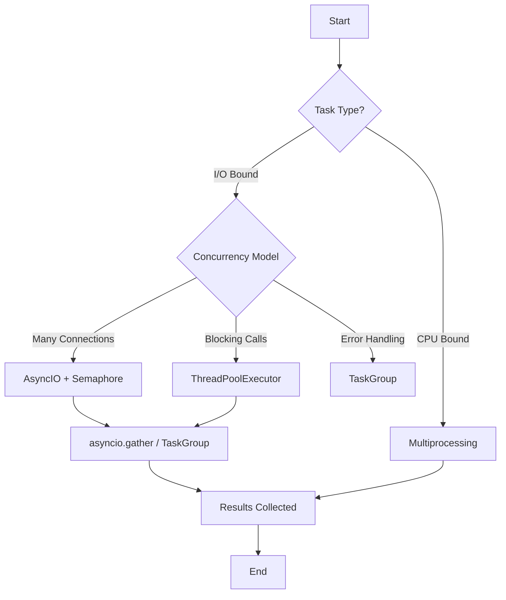
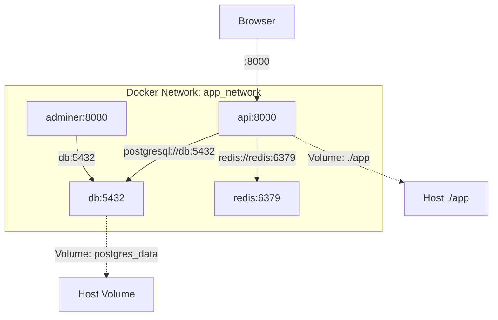
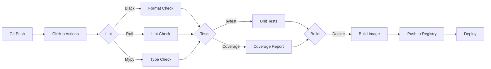

# Week 4 — Advanced Python + Docker

**Goal:** Production-ready Python engineer

---

## Day 1 — Generators & Context Managers

### Generators — `yield`

Generator = PHP ka `yield` keyword jaisa. Function jo values ek ek karke de, memory mein sab ek saath nahi rakhta.

```python
# Normal function — sab values ek saath memory mein
def get_numbers_slow(n: int) -> list:
    result = []
    for i in range(n):
        result.append(i * 2)
    return result

data = get_numbers_slow(10_000_000)  # 80 MB memory!

# Generator — ek value at a time
def get_numbers_fast(n: int):
    for i in range(n):
        yield i * 2

data = get_numbers_fast(10_000_000)   # ~0 bytes memory
for value in data:
    print(value)
    if value > 10:
        break  # Jitna chahiye utna lo, baaki waste nahi
```

### Generator Expressions

```python
# List comprehension (sab ek saath)
squares = [x**2 for x in range(100)]  # List — 100 elements

# Generator expression (lazy)
squares_gen = (x**2 for x in range(100))  # Generator — 0 elements until iterated

for s in squares_gen:
    print(s)

# Practical use — large file process karo
def read_large_file(path: str):
    with open(path, "r") as f:
        for line in f:
            yield line.strip()

for line in read_large_file("big_log.txt"):
    if "ERROR" in line:
        print(line)

# Generator chaining
def remove_stop_words(lines):
    stops = {"the", "a", "an", "is", "are"}
    for line in lines:
        yield " ".join(w for w in line.split() if w.lower() not in stops)

def to_upper(lines):
    for line in lines:
        yield line.upper()

pipeline = to_upper(remove_stop_words(read_large_file("data.txt")))
for line in pipeline:
    print(line)
```

### `yield from` — Generator Delegation

```python
def numbers():
    yield from range(5)  # Same as: for i in range(5): yield i

def chain_generators(*iterables):
    for it in iterables:
        yield from it

combined = chain_generators([1, 2], "ab", range(3, 5))
print(list(combined))  # [1, 2, 'a', 'b', 3, 4]

# Practical: flatten nested lists
def flatten(nested):
    for item in nested:
        if isinstance(item, (list, tuple)):
            yield from flatten(item)
        else:
            yield item

nested = [1, [2, 3], [4, [5, 6]], 7]
print(list(flatten(nested)))  # [1, 2, 3, 4, 5, 6, 7]
```

### Async Generators

Python 3.6+ mein async generators bhi hain — `async for` ke saath use karne ke liye.

```python
import asyncio

# Async generator
async def async_range(n: int):
    for i in range(n):
        await asyncio.sleep(0.1)  # Simulate I/O
        yield i

async def use_async_gen():
    async for num in async_range(5):
        print(f"Got: {num}")

asyncio.run(use_async_gen())

# Practical: async file line reader
async def read_lines_async(path: str):
    import aiofiles  # pip install aiofiles
    async with aiofiles.open(path, "r") as f:
        async for line in f:
            yield line.strip()

async def process_logs():
    async for line in read_lines_async("server.log"):
        if "ERROR" in line:
            print(line)
```

### Context Managers — `with` block

PHP mein try/finally se resources clean karte the. Python ka `with` statement automatically cleanup karta hai.

```python
# Without context manager
f = open("file.txt", "w")
try:
    f.write("Hello")
finally:
    f.close()  # Ye bhoolna easy hai

# With context manager
with open("file.txt", "w") as f:
    f.write("Hello")
# Close automatically ho gaya — bhoolna impossible
```

### Writing Custom Context Managers

```python
# Method 1: Class with __enter__/__exit__
class DatabaseConnection:
    def __init__(self, url: str):
        self.url = url

    def __enter__(self):
        print(f"🔌 Connecting to {self.url}...")
        # Connection kholo
        self.conn = {"connected": True, "url": self.url}
        return self.conn

    def __exit__(self, exc_type, exc_val, exc_tb):
        print("🔌 Closing connection...")
        self.conn["connected"] = False
        if exc_type:
            print(f"Error hua tha: {exc_val}")
        return False  # Exception propagate hone do

with DatabaseConnection("sqlite:///test.db") as conn:
    print(f"Working... connected: {conn['connected']}")

# Method 2: @contextmanager decorator (easier)
from contextlib import contextmanager

@contextmanager
def database_connection(url: str):
    print(f"🔌 Connecting...")
    conn = {"connected": True, "url": url}
    try:
        yield conn  # Yeh __enter__ return hota hai
    finally:
        print("🔌 Closing...")
        conn["connected"] = False

with database_connection("sqlite:///test.db") as conn:
    print(f"Using: {conn}")

# Practical: timing
import time

@contextmanager
def timer(label: str = "Operation"):
    start = time.time()
    try:
        yield
    finally:
        elapsed = time.time() - start
        print(f"{label}: {elapsed:.3f}s")

with timer("Database query"):
    time.sleep(0.5)  # Simulate query

# Practical: temporary directory
import tempfile, shutil

@contextmanager
def temp_dir():
    path = tempfile.mkdtemp()
    try:
        yield path
    finally:
        shutil.rmtree(path)

with temp_dir() as tmp:
    print(f"Working in {tmp}")
    # Files yahan banao, auto cleanup hoga
```

### Async Context Managers

`async with` — database connections, HTTP sessions, file handles async version mein.

```python
import asyncio
import aiohttp

# Class-based async context manager
class AsyncDatabase:
    async def __aenter__(self):
        print("🔌 Async connecting to DB...")
        await asyncio.sleep(0.1)  # Simulate connection
        self.conn = {"connected": True}
        return self.conn

    async def __aexit__(self, exc_type, exc_val, exc_tb):
        print("🔌 Async disconnecting...")
        self.conn["connected"] = False

async def use_async_db():
    async with AsyncDatabase() as db:
        print(f"Connected: {db['connected']}")
        # Work with database

asyncio.run(use_async_db())

# @asynccontextmanager
from contextlib import asynccontextmanager

@asynccontextmanager
async def aiohttp_session():
    async with aiohttp.ClientSession() as session:
        yield session

async def fetch_data():
    async with aiohttp_session() as session:
        async with session.get("https://httpbin.org/json") as resp:
            return await resp.json()

# Practical: FastAPI lifespan events use async context managers
from contextlib import asynccontextmanager
from fastapi import FastAPI

@asynccontextmanager
async def lifespan(app: FastAPI):
    # Startup
    print("🚀 App starting up...")
    await asyncio.sleep(0.1)
    yield
    # Shutdown
    print("🛑 App shutting down...")
    await asyncio.sleep(0.1)

app = FastAPI(lifespan=lifespan)
```

### contextlib Utilities

```python
from contextlib import suppress, redirect_stdout, redirect_stderr, nullcontext
import os

# suppress — specific errors ignore karo
with suppress(FileNotFoundError):
    os.remove("temp.txt")  # Error nahi aayega agar file nahi hai

# redirect_stdout — output capture karo
from io import StringIO
buf = StringIO()
with redirect_stdout(buf):
    print("This goes to buffer")
print(buf.getvalue())  # "This goes to buffer"

# nullcontext — conditional context manager
def process(need_db: bool = False):
    ctx = AsyncDatabase() if need_db else nullcontext()
    with ctx as resource:
        print(f"Resource: {resource}")
```

### Day 1 Exercise

```python
# 1. Generator banao: fibonacci(n) jo first n Fibonacci numbers yield kare
# 2. Context manager banao: change_directory(path) jo
#    - current dir save kare
#    - specified dir mein jaye
#    - exit pe wapas aaye
# 3. Timer context manager se code measure karo
# 4. File reader pipeline using generators
# 5. Async generator banao: ticker(interval) jo har n seconds yield kare
# 6. Async context manager banao for Redis-like connection pool
```

### Tumne Seekha (Day 1)
- [ ] Generators with yield (lazy evaluation)
- [ ] Generator expressions vs list comprehensions
- [ ] Generator chaining (pipelines)
- [ ] yield from for delegation
- [ ] Async generators (async for)
- [ ] Context managers (__enter__/__exit__, @contextmanager)
- [ ] Async context managers (__aenter__/__aexit__, @asynccontextmanager)
- [ ] contextlib utilities (suppress, redirect_stdout, nullcontext)

---

## Day 2 — Decorators

### Decorator Basics

Decorator = function jo dusre function ko modify kare. PHP mein (usually) nahi hai, lekin Python ka powerful feature hai.

```python
# Simple decorator — function call log kare
def log_calls(func):
    def wrapper(*args, **kwargs):
        print(f"→ {func.__name__} called with {args} {kwargs}")
        result = func(*args, **kwargs)
        print(f"← {func.__name__} returned {result}")
        return result
    return wrapper

@log_calls
def add(a: int, b: int) -> int:
    return a + b

add(3, 5)
# → add called with (3, 5) {}
# ← add returned 8
```

### `@functools.wraps` — Preserve Function Identity

```python
import functools

def log_calls(func):
    @functools.wraps(func)  # Yeh func ka name, docstring preserve karega
    def wrapper(*args, **kwargs):
        print(f"→ {func.__name__}")
        return func(*args, **kwargs)
    return wrapper

@log_calls
def greet(name: str) -> str:
    """Say hello to someone"""
    return f"Hello, {name}!"

print(greet.__name__)   # greet (wrapper nahi)
print(greet.__doc__)    # Say hello to someone
print(greet("Raushan"))
```

### Decorator with Arguments

```python
def repeat(times: int = 2):
    def decorator(func):
        @functools.wraps(func)
        def wrapper(*args, **kwargs):
            results = []
            for _ in range(times):
                results.append(func(*args, **kwargs))
            return results
        return wrapper
    return decorator

@repeat(times=3)
def greet(name: str) -> str:
    return f"Hello, {name}!"

print(greet("Raushan"))
# ['Hello, Raushan!', 'Hello, Raushan!', 'Hello, Raushan!']
```

### Chaining Decorators

```python
def bold(func):
    @functools.wraps(func)
    def wrapper(*args, **kwargs):
        return f"**{func(*args, **kwargs)}**"
    return wrapper

def italic(func):
    @functools.wraps(func)
    def wrapper(*args, **kwargs):
        return f"*{func(*args, **kwargs)}*"
    return wrapper

@bold
@italic
def greet(name: str) -> str:
    return f"Hello, {name}!"

print(greet("Raushan"))  # **Hello, Raushan!**
# Order: italic phir bold — bottom-up apply, top-down execute
```

### Practical Decorators

```python
# Timing decorator
def timer(func):
    @functools.wraps(func)
    def wrapper(*args, **kwargs):
        start = time.perf_counter()
        result = func(*args, **kwargs)
        end = time.perf_counter()
        print(f"{func.__name__}: {(end - start)*1000:.2f}ms")
        return result
    return wrapper

# Retry decorator
def retry(max_attempts: int = 3, delay: float = 1.0):
    def decorator(func):
        @functools.wraps(func)
        def wrapper(*args, **kwargs):
            for attempt in range(max_attempts):
                try:
                    return func(*args, **kwargs)
                except Exception as e:
                    if attempt == max_attempts - 1:
                        raise
                    print(f"Attempt {attempt + 1} failed: {e}. Retrying...")
                    time.sleep(delay)
            return None
        return wrapper
    return decorator

# Cache decorator
def cache(func):
    saved = {}
    @functools.wraps(func)
    def wrapper(*args):
        if args in saved:
            print(f"Cache hit for {args}")
            return saved[args]
        result = func(*args)
        saved[args] = result
        return result
    return wrapper

@cache
def expensive_calc(n: int) -> int:
    print(f"Calculating... {n}")
    time.sleep(1)
    return n * 2
```

### Class-Level Decorators

Decorators sirf functions ke liye nahi, classes ke liye bhi hain!

```python
# Class decorator — add methods to existing class
def add_repr(cls):
    def __repr__(self):
        items = ", ".join(f"{k}={v!r}" for k, v in self.__dict__.items())
        return f"{cls.__name__}({items})"
    cls.__repr__ = __repr__
    return cls

def singleton(cls):
    """Ensure only one instance ever exists"""
    instances = {}

    @functools.wraps(cls)
    def get_instance(*args, **kwargs):
        if cls not in instances:
            instances[cls] = cls(*args, **kwargs)
        return instances[cls]
    return get_instance

@singleton
class Database:
    def __init__(self):
        print("Database instance created!")
        self.connected = True

db1 = Database()
db2 = Database()
print(db1 is db2)  # True — same instance!

@add_repr
class Student:
    def __init__(self, name: str, age: int):
        self.name = name
        self.age = age

s = Student("Raushan", 30)
print(s)  # Student(name='Raushan', age=30)
```

### @dataclass and @property Deep Dive

```python
from dataclasses import dataclass, field, asdict, astuple
from typing import List

# PHP mein aap manually __construct likhte ho
# Python mein @dataclass auto-generates __init__, __repr__, __eq__
@dataclass
class Person:
    name: str
    age: int
    email: str = ""                    # Default value
    tags: List[str] = field(default_factory=list)  # Mutable default

p = Person(name="Raushan", age=30)
print(p)                 # Person(name='Raushan', age=30, email='', tags=[])
print(asdict(p))         # {'name': 'Raushan', 'age': 30, ...}

@dataclass(order=True)
class Task:
    priority: int = field(compare=True)   # Sirf priority se compare
    title: str = field(compare=False)     # Title compare mein ignore

# @property — controlled attribute access
class Temperature:
    def __init__(self, celsius: float):
        self._celsius = celsius

    @property
    def celsius(self) -> float:
        return self._celsius

    @celsius.setter
    def celsius(self, value: float):
        if value < -273.15:
            raise ValueError("Temperature -273.15 se kam nahi ho sakta")
        self._celsius = value

    @celsius.deleter
    def celsius(self):
        print("Deleting temperature...")
        del self._celsius

    @property
    def fahrenheit(self) -> float:
        return self._celsius * 9/5 + 32

t = Temperature(25)
print(t.celsius)       # 25 (getter)
print(t.fahrenheit)    # 77.0 (computed property)
t.celsius = 30         # setter
# t.celsius = -300     # ValueError!
del t.celsius          # deleter
```

```mermaid
flowchart TD
    A[Define Class / Function] --> B{Decorator Applied?}
    B -->|@timer| C[Wrap in timer logic]
    B -->|@cache| D[Wrap in memoization]
    B -->|@retry| E[Wrap in retry loop]
    B -->|@dataclass| F[Auto-gen __init__ __repr__]
    C --> G[Enhanced Callable]
    D --> G
    E --> G
    F --> H[Enhanced Class]
```

### Day 2 Exercise

```python
# Decorators banao:
# 1. @validate_args — check karo sab args positive hain
# 2. @memoize — cache results (without functools.lru_cache)
# 3. @rate_limited — max 1 call per 2 seconds
# 4. @deprecated — warning print karo + still run karo
# 5. @singleton class decorator — same instance always
# 6. @dataclass + @property combination for BankAccount
```

### Tumne Seekha (Day 2)
- [ ] Function decorators with @wraps
- [ ] Decorators with parameters
- [ ] Chaining decorators
- [ ] Practical: @timer, @retry, @cache
- [ ] Class decorators (@singleton, @add_repr)
- [ ] @dataclass (auto __init__, __repr__, __eq__)
- [ ] @property (getter, setter, deleter)

---

## Day 3 — Concurrency

### Threading vs Multiprocessing vs Async

| Feature | Threading | Multiprocessing | AsyncIO |
|---------|-----------|-----------------|---------|
| Kaise | Ek process, multiple threads | Multiple processes | Single thread, cooperative |
| I/O tasks | ✅ Best | ❌ Overkill | ✅ Best |
| CPU tasks | ❌ GIL issue | ✅ Best | ❌ Won't help |
| Memory | Shared (careful!) | Separate | Shared |
| Python GIL | Blocked | Bypassed | Not relevant |

### Threading — I/O Bound Tasks

```python
import threading
import time
import requests

def download(url: str, results: list):
    response = requests.get(url)
    results.append(len(response.content))
    print(f"Downloaded {url}: {len(response.content)} bytes")

urls = [
    "https://httpbin.org/delay/2",
    "https://httpbin.org/delay/1",
    "https://httpbin.org/delay/3",
]

# Sequential
start = time.time()
results = []
for url in urls:
    download(url, results)
print(f"Sequential: {time.time() - start:.2f}s")

# Threading
start = time.time()
threads = []
results = []
for url in urls:
    t = threading.Thread(target=download, args=(url, results))
    t.start()
    threads.append(t)

for t in threads:
    t.join()
print(f"Threading: {time.time() - start:.2f}s")
```

### Thread Safety — Lock

```python
import threading

counter = 0
lock = threading.Lock()

def increment():
    global counter
    for _ in range(100_000):
        with lock:  # Without lock: race condition!
            counter += 1

threads = [threading.Thread(target=increment) for _ in range(5)]
for t in threads: t.start()
for t in threads: t.join()
print(counter)  # Exactly 500_000
```

### ThreadPoolExecutor

```python
from concurrent.futures import ThreadPoolExecutor, as_completed

def fetch_url(url: str) -> tuple[str, int]:
    response = requests.get(url)
    return url, len(response.content)

with ThreadPoolExecutor(max_workers=5) as executor:
    futures = {executor.submit(fetch_url, url): url for url in urls}

    for future in as_completed(futures):
        url, size = future.result()
        print(f"{url}: {size} bytes")
```

### Multiprocessing — CPU Bound Tasks

```python
import multiprocessing as mp

def is_prime(n: int) -> bool:
    if n < 2: return False
    for i in range(2, int(n**0.5) + 1):
        if n % i == 0: return False
    return True

numbers = list(range(1, 100_001))

# Sequential
start = time.time()
results = [is_prime(n) for n in numbers]
print(f"Sequential: {time.time() - start:.2f}s")

# Multiprocessing
start = time.time()
with mp.Pool(processes=mp.cpu_count()) as pool:
    results = pool.map(is_prime, numbers)
print(f"Parallel: {time.time() - start:.2f}s")
```

### AsyncIO Advanced

```python
import asyncio
import aiohttp  # pip install aiohttp

async def fetch(session: aiohttp.ClientSession, url: str) -> dict:
    async with session.get(url) as response:
        return {"url": url, "status": response.status}

async def fetch_all(urls: list[str]) -> list[dict]:
    async with aiohttp.ClientSession() as session:
        tasks = [fetch(session, url) for url in urls]
        return await asyncio.gather(*tasks)

# Semaphore — limit concurrent requests
async def fetch_with_limit(urls: list[str], max_concurrent: int = 3) -> list[dict]:
    sem = asyncio.Semaphore(max_concurrent)

    async def bounded_fetch(session, url):
        async with sem:
            return await fetch(session, url)

    async with aiohttp.ClientSession() as session:
        tasks = [bounded_fetch(session, url) for url in urls]
        return await asyncio.gather(*tasks)

urls = [
    "https://httpbin.org/delay/2",
    "https://httpbin.org/delay/1",
    "https://httpbin.org/delay/3",
]

start = time.time()
results = asyncio.run(fetch_all(urls))
print(f"Async: {time.time() - start:.2f}s")

start = time.time()
results = asyncio.run(fetch_with_limit(urls, max_concurrent=2))
print(f"Async (limited): {time.time() - start:.2f}s")
```

### Async Task Groups (Python 3.11+)

```python
# TaskGroup — better than asyncio.gather for error handling
async def fetch_with_task_group(urls: list[str]):
    async with aiohttp.ClientSession() as session:
        async with asyncio.TaskGroup() as tg:
            tasks = [tg.create_task(fetch(session, url)) for url in urls]

        # Agar ek task fail hua, to sab cancel ho jayenge
        results = [t.result() for t in tasks]
        return results

# asyncio.timeout (Python 3.11+)
async def fetch_with_timeout(url: str, timeout_sec: float = 5.0):
    try:
        async with asyncio.timeout(timeout_sec):
            async with aiohttp.ClientSession() as session:
                async with session.get(url) as resp:
                    return await resp.json()
    except asyncio.TimeoutError:
        print(f"Timeout: {url}")
        return None

# asyncio.Queue — producer-consumer pattern
async def producer(queue: asyncio.Queue, n: int):
    for i in range(n):
        await asyncio.sleep(0.1)
        await queue.put(f"item-{i}")
    await queue.put(None)  # Sentinel — signal done

async def consumer(queue: asyncio.Queue, name: str):
    while True:
        item = await queue.get()
        if item is None:
            queue.task_done()
            break
        print(f"{name} processing {item}")
        await asyncio.sleep(0.2)
        queue.task_done()

async def run_pipeline():
    queue = asyncio.Queue(maxsize=5)
    async with asyncio.TaskGroup() as tg:
        tg.create_task(producer(queue, 10))
        tg.create_task(consumer(queue, "Worker-1"))
        tg.create_task(consumer(queue, "Worker-2"))

asyncio.run(run_pipeline())
```



### asyncio.subprocess — Run Shell Commands

```python
async def run_command(cmd: str) -> tuple[int, str]:
    """Run a shell command asynchronously"""
    process = await asyncio.create_subprocess_shell(
        cmd,
        stdout=asyncio.subprocess.PIPE,
        stderr=asyncio.subprocess.PIPE,
    )
    stdout, stderr = await process.communicate()
    return process.returncode, stdout.decode()

async def run_multiple_commands():
    commands = [
        "echo Hello",
        "python --version",
        "pip list | head -5",
    ]
    async with asyncio.TaskGroup() as tg:
        tasks = [tg.create_task(run_command(cmd)) for cmd in commands]

    for cmd, task in zip(commands, tasks):
        code, output = task.result()
        print(f"[{code}] {cmd}: {output[:50]}")
```

### Day 3 Exercise

```python
# Banao: Web scraper with:
# 1. ThreadPoolExecutor — 10 pages concurrently download karo
# 2. Lock — results dictionary thread-safe ho
# 3. asyncio — same kaam async mein bhi karo
# 4. Semaphore — max 5 concurrent requests
# 5. Time both approaches, compare karo

# Bonus:
# 6. TaskGroup use karo for better error isolation
# 7. asyncio.Queue for producer-consumer pipeline
# 8. asyncio.timeout for slow requests
```

### Tumne Seekha (Day 3)
- [ ] Threading vs Multiprocessing vs Async (when to use what)
- [ ] Thread safety with Lock
- [ ] ThreadPoolExecutor for I/O tasks
- [ ] Multiprocessing.Pool for CPU tasks
- [ ] AsyncIO with gather, Semaphore
- [ ] TaskGroup (Python 3.11+) for error handling
- [ ] asyncio.Queue for producer-consumer
- [ ] asyncio.timeout for deadline handling
- [ ] asyncio.subprocess for shell commands

---

## Day 4 — Python Packaging

### Why Packaging?

Python package banao jise `pip install` se install kiya ja sake. PHP mein composer package banane jaisa hai.

### Minimal pyproject.toml

```toml
[build-system]
requires = ["setuptools>=64", "wheel"]
build-backend = "setuptools.backends._legacy:_Backend"

[project]
name = "task-cli"
version = "1.0.0"
description = "CLI Task Manager for learning Python"
readme = "README.md"
requires-python = ">=3.11"
license = {text = "MIT"}

authors = [
    {name = "Raushan", email = "raushan@example.com"}
]

classifiers = [
    "Programming Language :: Python :: 3",
    "License :: OSI Approved :: MIT License",
]

dependencies = [
    "rich>=13.0",  # CLI colors
]

[project.optional-dependencies]
dev = [
    "pytest>=7.0",
    "pytest-cov>=4.0",
    "black",
    "ruff",
]

[project.scripts]
task = "task_cli.cli:main"

[tool.black]
line-length = 100

[tool.ruff]
line-length = 100
select = ["E", "F", "I", "N", "W"]
```

### Project Structure

```
task-cli/
├── pyproject.toml
├── README.md
├── LICENSE
├── src/
│   └── task_cli/
│       ├── __init__.py
│       ├── __main__.py
│       ├── cli.py
│       └── core.py
└── tests/
    ├── __init__.py
    ├── conftest.py
    └── test_cli.py
```

### Installing Locally

```bash
# Editable install — code change karo, immediate effect
pip install -e .

# Regular install
pip install .

# Dev dependencies
pip install -e ".[dev]"

# Ab CLI globally available hai
task --help

# Package as wheel
pip install build
python -m build

# Files banenge:
# dist/task_cli-1.0.0-py3-none-any.whl
# dist/task_cli-1.0.0.tar.gz
```

### Publishing (PyPI)

```bash
# pip install twine
# twine upload dist/*
```

### Entry Points Deep Dive

```python
# src/task_cli/__main__.py — allows "python -m task_cli"
from .cli import main

if __name__ == "__main__":
    main()

# src/task_cli/cli.py — actual CLI logic
import argparse
from .core import add_task, list_tasks

def main():
    parser = argparse.ArgumentParser(description="Task Manager CLI")
    subparsers = parser.add_subparsers(dest="command")

    # add command
    add_parser = subparsers.add_parser("add", help="Add a task")
    add_parser.add_argument("title", help="Task title")
    add_parser.add_argument("--priority", default="medium")

    # list command
    list_parser = subparsers.add_parser("list", help="List tasks")
    list_parser.add_argument("--done", action="store_true")

    args = parser.parse_args()

    if args.command == "add":
        task = add_task(args.title, args.priority)
        print(f"✅ Task added: {task['title']}")
    elif args.command == "list":
        tasks = list_tasks(args.done)
        for t in tasks:
            print(f"  [{t['id']}] {t['title']} — {t['priority']}")
```

### Dynamic Version with importlib.metadata

```python
# Instead of hardcoding version in multiple places:
from importlib.metadata import version, PackageNotFoundError

try:
    __version__ = version("task-cli")
except PackageNotFoundError:
    __version__ = "0.0.0"  # Development mode

# pyproject.toml mein version dynamic bhi ho sakta hai:
# [tool.setuptools.dynamic]
# version = {attr = "task_cli.__version__"}
```

### Which Build Backend to Use?

```toml
# Option 1: setuptools (most common, mature)
[build-system]
requires = ["setuptools"]
build-backend = "setuptools.build_meta"

# Option 2: flit (simpler, good for pure Python)
[build-system]
requires = ["flit_core"]
build-backend = "flit_core.buildapi"

# Option 3: hatchling (modern, fast)
[build-system]
requires = ["hatchling"]
build-backend = "hatchling.build"

# Option 4: poetry (all-in-one tool)
# Poetry uses its own config: pyproject.toml [tool.poetry]
```

### Version Management

```python
# Single source of truth for version
# Method 1: __init__.py
# task_cli/__init__.py
__version__ = "1.0.0"

# Method 2: _version.py
# task_cli/_version.py
VERSION = (1, 0, 0)
__version__ = ".".join(map(str, VERSION))

# Method 3: Git tag based (setuptools-scm)
# pyproject.toml
# [tool.setuptools_scm]
# [build-system]
# requires = ["setuptools", "setuptools-scm"]
```

### Day 4 Exercise

```python
# 1. Apna CLI tool ko proper package banao
# 2. pyproject.toml mein scripts section add karo
# 3. pip install -e . se install karo
# 4. CLI as command run karo
# 5. Build karo wheel
# 6. __main__.py add karo (python -m support)
# 7. Optional dependencies for dev tools
```

### Tumne Seekha (Day 4)
- [ ] pyproject.toml structure
- [ ] Scripts/entry points configuration
- [ ] pip install -e . (editable install)
- [ ] Building wheels with build
- [ ] Optional dependencies (extras)
- [ ] Build backends: setuptools vs flit vs hatchling
- [ ] Version management strategies
- [ ] __main__.py for python -m support

---

## Day 5 — Docker for Python Developers

### What is Docker?

PHP developer perspective: Docker = Laravel Sail + Valet. Python apps ko container mein daalna.

### Dockerfile Basics

```dockerfile
# Dockerfile
FROM python:3.11-slim

WORKDIR /app

# System dependencies (if any)
RUN apt-get update && apt-get install -y --no-install-recommends \
    gcc \
    && rm -rf /var/lib/apt/lists/*

# Python dependencies
COPY requirements.txt .
RUN pip install --no-cache-dir -r requirements.txt

# App code
COPY . .

# Run
CMD ["uvicorn", "app.main:app", "--host", "0.0.0.0", "--port", "8000"]
```

### Build and Run

```bash
docker build -t task-manager:latest .
docker run -d -p 8000:8000 task-manager:latest

# Volumes — local dev ke liye
docker run -d -p 8000:8000 \
  -v $(pwd):/app \
  task-manager:latest

# Environment variables
docker run -d -p 8000:8000 \
  -e DATABASE_URL="sqlite:///./tasks.db" \
  -e SECRET_KEY="my-secret-key" \
  task-manager:latest
```

### Multi-Stage Dockerfile

```dockerfile
# Stage 1: Build
FROM python:3.11-slim AS builder

WORKDIR /app
COPY requirements.txt .

RUN pip install --user --no-cache-dir -r requirements.txt

# Stage 2: Runtime (small image)
FROM python:3.11-slim AS runtime

WORKDIR /app

# Copy only installed packages from builder
COPY --from=builder /root/.local /root/.local
ENV PATH=/root/.local/bin:$PATH

# Copy only app code
COPY ./app ./app
COPY ./alembic ./alembic

# Non-root user
RUN useradd -m -u 1000 appuser && chown -R appuser:appuser /app
USER appuser

EXPOSE 8000

HEALTHCHECK --interval=30s --timeout=3s \
  CMD curl -f http://localhost:8000/health || exit 1

CMD ["uvicorn", "app.main:app", "--host", "0.0.0.0", "--port", "8000"]
```

### Docker Compose Networking

```yaml
# docker-compose.yml
version: "3.9"

services:
  api:
    build:
      context: .
      dockerfile: Dockerfile
    ports:
      - "8000:8000"
    environment:
      - DATABASE_URL=postgresql://postgres:postgres@db:5432/tasks
      - SECRET_KEY=${SECRET_KEY:-change-me}
      - DEBUG=false
    volumes:
      - ./app:/app/app
      - ./data:/app/data
    depends_on:
      db:
        condition: service_healthy
    restart: unless-stopped
    networks:
      - app_network

  db:
    image: postgres:16-alpine
    environment:
      POSTGRES_USER: postgres
      POSTGRES_PASSWORD: postgres
      POSTGRES_DB: tasks
    volumes:
      - postgres_data:/var/lib/postgresql/data
    ports:
      - "5432:5432"
    healthcheck:
      test: ["CMD-SHELL", "pg_isready -U postgres"]
      interval: 5s
      timeout: 5s
      retries: 5
    restart: unless-stopped
    networks:
      - app_network

  redis:
    image: redis:7-alpine
    ports:
      - "6379:6379"
    networks:
      - app_network

networks:
  app_network:
    driver: bridge

volumes:
  postgres_data:
```



### Dockerfile Optimization

```dockerfile
# 1. Use slim images (not full)
FROM python:3.11-slim  # ~120MB vs ~900MB for full

# 2. Layer caching — dependencies pehle copy karo
# (har RUN/COPY ek layer hai — cache hoti hai)
COPY requirements.txt .  # Agar sirf requirements change
RUN pip install ...      # Cache hit — seconds lagte hain
COPY . .                 # Last layer — fastest rebuild

# 3. Multi-stage build — final image chhota
# BUILD image: 500MB (includes gcc, build tools)
# RUNTIME image: 150MB (only python + packages)

# 4. .dockerignore — context chhota rakho
# Without .dockerignore: 50MB context
# With .dockerignore: 2MB context

# 5. Pin versions
RUN pip install --no-cache-dir \
    fastapi==0.110.0 \
    uvicorn==0.27.0
```

### Docker Secrets (instead of env vars)

```yaml
# docker-compose.yml (Docker Compose v3.1+)
services:
  api:
    secrets:
      - db_password
      - api_key

secrets:
  db_password:
    file: ./secrets/db_password.txt
  api_key:
    environment: "API_KEY"  # Or from env var
```

```python
# In Python app:
# /run/secrets/db_password
def read_secret(name: str) -> str:
    with open(f"/run/secrets/{name}", "r") as f:
        return f.read().strip()

db_password = read_secret("db_password")
```

### Docker Tips for Python

```bash
# Debugging inside container
docker-compose exec api bash
docker-compose exec api python -c "import app; print(app.__version__)"

# Check logs
docker-compose logs -f api
docker-compose logs -f db

# Resource limits
docker run --memory="512m" --cpus="1.0" task-manager:latest

# Copy files from container
docker cp container_id:/app/logs/app.log ./local.log

# Prune unused
docker system prune -a --volumes
```

### requirements.txt for Docker

```
fastapi>=0.110,<1.0
uvicorn[standard]>=0.27,<1.0
sqlalchemy>=2.0,<3.0
pydantic>=2.0,<3.0
pydantic-settings>=2.0,<3.0
psycopg2-binary>=2.9,<3.0
httpx>=0.27,<1.0
python-dotenv>=1.0,<2.0
```

### .dockerignore

```
__pycache__/
*.pyc
*.pyo
.env
.git/
.gitignore
*.md
tests/
venv/
.vscode/
.idea/
```

### Day 5 Exercise

```bash
# 1. Dockerfile banao for FastAPI app
# 2. docker-compose.yml banao with API + PostgreSQL
# 3. Build karo: docker-compose build
# 4. Run karo: docker-compose up -d
# 5. Check karo: curl http://localhost:8000/health
# 6. docker-compose down karo

# Bonus:
# 7. Multi-stage build implement karo
# 8. Redis add karo to docker-compose
# 9. Docker secrets use karo for passwords
# 10. Resource limits set karo
```

### Tumne Seekha (Day 5)
- [ ] Dockerfile basics (FROM, COPY, RUN, CMD)
- [ ] Multi-stage builds for small images
- [ ] docker-compose with multiple services
- [ ] Docker networking between containers
- [ ] Docker volumes for persistent data
- [ ] Health checks for service readiness
- [ ] Docker secrets vs environment variables
- [ ] Docker layer caching optimization
- [ ] .dockerignore for minimal context

---

## Day 6 — Logging & Code Quality

### Python `logging` Module

```python
import logging

# Basic config
logging.basicConfig(
    level=logging.INFO,
    format="%(asctime)s | %(levelname)s | %(name)s | %(message)s",
    datefmt="%Y-%m-%d %H:%M:%S",
)

logger = logging.getLogger(__name__)

logger.debug("Silly detail — dev mein hi dekhte")
logger.info("User logged in successfully")
logger.warning("Disk space running low: 500MB remaining")
logger.error("Database connection failed")
logger.critical("System out of memory — crashing!")
```

### Logger Hierarchy

```python
# app/__init__.py
import logging

logging.basicConfig(level=logging.INFO)
logger = logging.getLogger("app")

# app/routers/tasks.py
logger = logging.getLogger("app.tasks")

# app/services/email.py
logger = logging.getLogger("app.services.email")

# Each logger inherits from parent, can have separate handlers
```

### Advanced Logging Configuration

```python
import logging
from logging.handlers import RotatingFileHandler, TimedRotatingFileHandler

# Formatters
json_format = logging.Formatter('{"time": "%(asctime)s", "level": "%(levelname)s", "logger": "%(name)s", "message": "%(message)s"}')
simple_format = logging.Formatter("%(asctime)s | %(levelname)-8s | %(message)s")

# Handlers
console_handler = logging.StreamHandler()
console_handler.setLevel(logging.INFO)
console_handler.setFormatter(simple_format)

file_handler = RotatingFileHandler(
    "app.log",
    maxBytes=10_000_000,  # 10MB
    backupCount=5,         # 5 files rotate
)
file_handler.setLevel(logging.DEBUG)
file_handler.setFormatter(json_format)

error_handler = RotatingFileHandler(
    "error.log",
    maxBytes=10_000_000,
    backupCount=3,
)
error_handler.setLevel(logging.ERROR)
error_handler.setFormatter(json_format)

# Root logger setup
logging.basicConfig(level=logging.DEBUG, handlers=[console_handler, file_handler, error_handler])

# Specific logger
logger = logging.getLogger("app")
logger.addHandler(file_handler)
```

### Logging Filters

```python
import logging

class SensitiveFilter(logging.Filter):
    """Filter out sensitive data (passwords, tokens, etc.)"""
    def filter(self, record: logging.LogRecord) -> bool:
        # Check if message contains sensitive keywords
        sensitive_keywords = ["password", "secret", "token", "authorization"]
        msg = getattr(record, "msg", "")
        if isinstance(msg, str):
            for keyword in sensitive_keywords:
                if keyword in msg.lower():
                    return False  # Filter out this record
        return True

class HealthCheckFilter(logging.Filter):
    """Don't log health check requests (noise reduction)"""
    def filter(self, record: logging.LogRecord) -> bool:
        msg = getattr(record, "msg", "")
        if "/health" in str(msg):
            return False
        return True

# Usage
logger = logging.getLogger("app.api")
logger.addFilter(SensitiveFilter())
logger.addFilter(HealthCheckFilter())
```

### Structured Logging with loguru

```python
# pip install loguru
from loguru import logger
import sys

# Remove default handler
logger.remove()

# Add console handler
logger.add(
    sys.stdout,
    format="<green>{time:YYYY-MM-DD HH:mm:ss}</green> | <level>{level: <8}</level> | <cyan>{name}</cyan> | <level>{message}</level>",
    level="DEBUG",
    colorize=True,
)

# Add file handler (rotation + retention)
logger.add(
    "logs/app_{time:YYYY-MM-DD}.log",
    rotation="500 MB",      # File size rotation
    retention="30 days",    # Keep 30 days
    compression="zip",      # Compress old logs
    level="INFO",
    format="{time} | {level} | {name}:{function}:{line} | {message}",
)

# Structured logging
logger.info("User registered", user_id=42, email="raushan@example.com")
logger.info("API request", method="GET", path="/tasks", duration_ms=150)

# Exception tracking
try:
    1 / 0
except ZeroDivisionError:
    logger.exception("Division by zero occurred")  # Includes traceback

# Context binding
logger_with_context = logger.bind(request_id="abc-123")
logger_with_context.info("Processing request")
```

### FastAPI + Logging Integration

```python
# app/logging_config.py
from loguru import logger
import sys
import json
from pathlib import Path

Path("logs").mkdir(exist_ok=True)

logger.remove()

# Console
logger.add(
    sys.stdout,
    format="<green>{time:HH:mm:ss}</green> | <level>{level}</level> | {message}",
    level="DEBUG",
    colorize=True,
)

# JSON file for log aggregation
logger.add(
    "logs/api_{time:YYYY-MM-DD}.log",
    rotation="100 MB",
    retention="7 days",
    format=lambda record: json.dumps({
        "timestamp": record["time"].isoformat(),
        "level": record["level"].name,
        "module": record["name"],
        "function": record["function"],
        "line": record["line"],
        "message": record["message"],
        **record["extra"],
    }),
    level="INFO",
)

# Error file
logger.add(
    "logs/error.log",
    rotation="50 MB",
    retention="30 days",
    level="ERROR",
    backtrace=True,
    diagnose=True,
)

# app/middleware.py
from loguru import logger
import time

class LoggingMiddleware(BaseHTTPMiddleware):
    async def dispatch(self, request: Request, call_next):
        request_id = str(uuid.uuid4())[:8]
        logger_with_context = logger.bind(request_id=request_id)

        logger_with_context.info(
            "Request started",
            method=request.method,
            path=request.url.path,
        )

        start = time.time()
        response = await call_next(request)
        duration = time.time() - start

        logger_with_context.info(
            "Request completed",
            status_code=response.status_code,
            duration_ms=round(duration * 1000, 2),
        )

        response.headers["X-Request-ID"] = request_id
        return response

# app/main.py — use instead of print()
@app.get("/tasks")
async def list_tasks(db: Session = Depends(get_db)):
    logger.info("Fetching all tasks")
    try:
        tasks = db.query(TaskModel).all()
        logger.info(f"Found {len(tasks)} tasks")
        return tasks
    except Exception as e:
        logger.exception("Failed to fetch tasks")
        raise HTTPException(status_code=500, detail="Internal error")
```

### Logging Configuration from YAML

```yaml
# logging.yaml
version: 1
disable_existing_loggers: false

formatters:
  simple:
    format: "%(asctime)s | %(levelname)-8s | %(message)s"
  json:
    format: '{"time": "%(asctime)s", "level": "%(levelname)s", "name": "%(name)s", "message": "%(message)s"}'

handlers:
  console:
    class: logging.StreamHandler
    level: INFO
    formatter: simple
    stream: ext://sys.stdout

  file:
    class: logging.handlers.RotatingFileHandler
    level: DEBUG
    formatter: json
    filename: logs/app.log
    maxBytes: 10485760
    backupCount: 5

  error_file:
    class: logging.handlers.RotatingFileHandler
    level: ERROR
    formatter: json
    filename: logs/error.log
    maxBytes: 10485760
    backupCount: 3

loggers:
  app:
    level: INFO
    handlers: [console, file]
    propagate: false
  app.api:
    level: DEBUG
    handlers: [console, file]
    propagate: false

root:
  level: WARNING
  handlers: [console]
```

```python
# Load config from YAML
import logging.config
import yaml

with open("logging.yaml", "r") as f:
    config = yaml.safe_load(f)
    logging.config.dictConfig(config)
```

### Code Quality Tools

```bash
# Install
pip install black ruff mypy pytest pytest-cov
```

```python
# black — auto-formatter (opinionated)
# Usage: black src/ tests/
# No config needed — zero arguments mein kaam karta hai

# ruff — linter (fast, written in Rust)
# Usage: ruff check src/
# Auto-fix: ruff check --fix src/

# mypy — static type checker
# Usage: mypy src/ --strict

# pytest — testing with coverage
# Usage: pytest --cov=src/ --cov-report=html
```

```toml
# pyproject.toml — code quality config
[tool.black]
line-length = 100
target-version = ["py311"]
skip-string-normalization = false

[tool.ruff]
line-length = 100
target-version = "py311"
select = ["E", "F", "I", "N", "W", "B", "SIM"]
ignore = ["E501"]  # Don't warn about line length (black handles it)

[tool.mypy]
python_version = "3.11"
strict = true
ignore_missing_imports = true
disallow_untyped_defs = true

[tool.pytest.ini_options]
minversion = "7.0"
addopts = "-v --cov=app --cov-report=term-missing"
testpaths = ["tests"]
```

### Day 6 Exercise

```python
# 1. FastAPI app mein logging laga do
# 2. loguru se structured JSON logging setup karo
# 3. Request middleware mein request_id add karo
# 4. Different log levels use karo appropriately
# 5. Error logs automatically email bhejo (simulate)
# 6. Logging YAML config file banao
# 7. Code quality tools (black, ruff, mypy) setup karo
```

### Tumne Seekha (Day 6)
- [ ] Python logging hierarchy (root → child loggers)
- [ ] Log levels (DEBUG, INFO, WARNING, ERROR, CRITICAL)
- [ ] Handlers: RotatingFileHandler, TimedRotatingFileHandler
- [ ] JSON structured logging
- [ ] Logging filters for sensitive data
- [ ] loguru library (rotation, retention, compression)
- [ ] Logging config from YAML
- [ ] Code quality: black, ruff, mypy, pytest-cov

---

## Day 7 — Week 4 Project: Dockerize FastAPI Task Manager

### Project Structure

```
task_manager_api/
├── app/
│   ├── __init__.py
│   ├── main.py
│   ├── config.py
│   ├── database.py
│   ├── models.py
│   ├── schemas.py
│   ├── crud.py
│   ├── middleware.py
│   ├── logging_config.py
│   └── routers/
│       ├── __init__.py
│       ├── tasks.py
│       └── users.py
├── tests/
│   ├── __init__.py
│   ├── conftest.py
│   └── test_tasks.py
├── Dockerfile
├── docker-compose.yml
├── .dockerignore
├── requirements.txt
├── pyproject.toml
├── pyproject.toml
├── .github/
│   └── workflows/
│       └── ci.yml
├── .env
└── README.md
```

### Dockerfile

```dockerfile
FROM python:3.11-slim AS builder

WORKDIR /app
COPY requirements.txt .
RUN pip install --user --no-cache-dir -r requirements.txt

FROM python:3.11-slim AS runtime

WORKDIR /app
COPY --from=builder /root/.local /root/.local
ENV PATH=/root/.local/bin:$PATH

COPY ./app ./app
COPY ./alembic ./alembic
COPY ./pyproject.toml .

RUN useradd -m -u 1000 appuser \
    && mkdir -p /app/logs /app/data \
    && chown -R appuser:appuser /app

USER appuser
EXPOSE 8000

HEALTHCHECK --interval=30s --timeout=3s --retries=3 \
    CMD curl -f http://localhost:8000/health || exit 1

CMD ["uvicorn", "app.main:app", "--host", "0.0.0.0", "--port", "8000"]
```

### docker-compose.yml

```yaml
version: "3.9"

services:
  api:
    build: .
    ports:
      - "8000:8000"
    environment:
      - DATABASE_URL=${DATABASE_URL}
      - SECRET_KEY=${SECRET_KEY}
      - DEBUG=false
      - LOG_LEVEL=INFO
    volumes:
      - ./logs:/app/logs
      - ./data:/app/data
    depends_on:
      db:
        condition: service_healthy
    env_file:
      - .env
    restart: unless-stopped

  db:
    image: postgres:16-alpine
    environment:
      POSTGRES_USER: postgres
      POSTGRES_PASSWORD: postgres
      POSTGRES_DB: tasks
    volumes:
      - postgres_data:/var/lib/postgresql/data
    healthcheck:
      test: ["CMD-SHELL", "pg_isready -U postgres -d tasks"]
      interval: 5s
      timeout: 5s
      retries: 5
    restart: unless-stopped

  adminer:
    image: adminer:latest
    ports:
      - "8080:8080"
    depends_on:
      - db
    profiles:
      - dev

volumes:
  postgres_data:
```

### .env

```
DATABASE_URL=postgresql://postgres:postgres@db:5432/tasks
SECRET_KEY=super-secret-production-key-change-this
LOG_LEVEL=INFO
```

### config.py (Updated)

```python
from pydantic_settings import BaseSettings

class Settings(BaseSettings):
    app_name: str = "Task Manager API"
    debug: bool = False
    database_url: str = "sqlite:///./data/tasks.db"
    secret_key: str = "dev-secret-key"
    cors_origins: list[str] = ["*"]
    log_level: str = "INFO"

    model_config = {"env_file": ".env"}

settings = Settings()

# Database URL override from environment
import os
if "DATABASE_URL" in os.environ:
    settings.database_url = os.environ["DATABASE_URL"]
```

### CI/CD Pipeline with GitHub Actions

```yaml
# .github/workflows/ci.yml
name: CI

on:
  push:
    branches: [main]
  pull_request:
    branches: [main]

jobs:
  lint:
    runs-on: ubuntu-latest
    steps:
      - uses: actions/checkout@v4
      - uses: actions/setup-python@v5
        with:
          python-version: "3.11"
      - run: pip install black ruff mypy
      - run: black --check app/
      - run: ruff check app/
      - run: mypy app/

  test:
    runs-on: ubuntu-latest
    services:
      postgres:
        image: postgres:16-alpine
        env:
          POSTGRES_USER: postgres
          POSTGRES_PASSWORD: postgres
          POSTGRES_DB: tasks
        ports:
          - 5432:5432
        options: >-
          --health-cmd pg_isready
          --health-interval 10s
          --health-timeout 5s
          --health-retries 5

    steps:
      - uses: actions/checkout@v4
      - uses: actions/setup-python@v5
        with:
          python-version: "3.11"
      - run: pip install -e ".[dev]"
      - run: pytest tests/ -v --cov=app --cov-report=xml
      - uses: codecov/codecov-action@v3

  docker:
    runs-on: ubuntu-latest
    needs: [lint, test]
    steps:
      - uses: actions/checkout@v4
      - run: docker build -t task-manager .
      - run: docker run -d -p 8000:8000 task-manager
      - run: sleep 5 && curl http://localhost:8000/health
      - run: docker compose up -d
      - run: sleep 10 && curl http://localhost:8000/health
      - run: docker compose down -v
```

### Performance Profiling

```python
# cProfile — built-in profiler
# python -m cProfile -o profile.stats app/main.py
import pstats
from pstats import SortKey

# Analyze results
p = pstats.Stats("profile.stats")
p.sort_stats(SortKey.CUMULATIVE).print_stats(20)  # Top 20 by cumulative time

# py-spy — sampling profiler (no code changes needed)
# pip install py-spy
# py-spy record -o profile.svg --pid 12345
# py-spy top --pid 12345

# @profile decorator for targeted profiling
from functools import wraps
import cProfile, pstats, io

def profile(output_file: str = None):
    def decorator(func):
        @wraps(func)
        def wrapper(*args, **kwargs):
            profiler = cProfile.Profile()
            profiler.enable()
            result = func(*args, **kwargs)
            profiler.disable()
            s = io.StringIO()
            ps = pstats.Stats(profiler, stream=s).sort_stats("cumulative")
            ps.print_stats(20)
            print(s.getvalue())
            if output_file:
                profiler.dump_stats(output_file)
            return result
        return wrapper
    return decorator

@profile()
def slow_function():
    total = 0
    for i in range(1_000_000):
        total += i ** 2
    return total
```

### Debugging Techniques

```python
# 1. pdb — built-in debugger
# Insert in code:
import pdb; pdb.set_trace()  # Python 3.6-
breakpoint()                  # Python 3.7+ (same thing, built-in)

# Common pdb commands:
# n — next line
# s — step into
# c — continue
# p variable — print variable
# l — list source
# q — quit

# 2. Better debugging with IPython
# pip install ipdb
# import ipdb; ipdb.set_trace()

# 3. Post-mortem debugging
# python -m pdb script.py  # Run with debugger
# If exception -> automatically enters debugger

# 4. Logging-based debugging
logger.debug(f"Variable state: x={x}, y={y}, result={result}")

# 5. Assertions for invariants
def divide(a: float, b: float) -> float:
    assert b != 0, "Division by zero!"
    assert isinstance(a, (int, float)), "a must be number"
    return a / b

# 6. traceback module
import traceback
try:
    1 / 0
except Exception:
    traceback.print_exc()  # Print full traceback
    error_msg = traceback.format_exc()  # Capture as string
```

### Testing the Docker Setup

```bash
# Build and run
docker-compose up -d

# Check logs
docker-compose logs -f api

# Test API
curl http://localhost:8000/health
curl http://localhost:8000/docs

# Run tests inside container
docker-compose exec api pytest tests/ -v

# Run with profiling
docker-compose exec api python -m cProfile -o /tmp/profile.stats -m pytest tests/

# Run linting in container
docker-compose exec api black --check app/
docker-compose exec api ruff check app/

# Stop everything
docker-compose down

# Stop + remove volumes
docker-compose down -v
```

### Production Considerations

```yaml
# docker-compose.prod.yml
version: "3.9"

services:
  api:
    build:
      context: .
      dockerfile: Dockerfile.prod
    ports:
      - "8000:8000"
    environment:
      - DATABASE_URL=${DATABASE_URL}
      - SECRET_KEY=${SECRET_KEY}
    deploy:
      replicas: 3
      resources:
        limits:
          memory: 512M
          cpus: "1.0"
    healthcheck:
      test: ["CMD", "curl", "-f", "http://localhost:8000/health"]
      interval: 30s
      timeout: 10s
      retries: 3

  nginx:
    image: nginx:alpine
    ports:
      - "80:80"
      - "443:443"
    volumes:
      - ./nginx.conf:/etc/nginx/nginx.conf:ro
      - ./ssl:/etc/nginx/ssl:ro
    depends_on:
      - api
```

```nginx
# nginx.conf — reverse proxy
upstream api_servers {
    server api:8000;
    server api:8001;
    server api:8002;
}

server {
    listen 80;
    server_name api.example.com;

    location / {
        proxy_pass http://api_servers;
        proxy_set_header Host $host;
        proxy_set_header X-Real-IP $remote_addr;
        proxy_set_header X-Forwarded-For $proxy_add_x_forwarded_for;
        proxy_set_header X-Forwarded-Proto $scheme;
    }

    location /ws {
        proxy_pass http://api_servers;
        proxy_http_version 1.1;
        proxy_set_header Upgrade $http_upgrade;
        proxy_set_header Connection "upgrade";
    }

    location /static/ {
        alias /app/static/;
        expires 30d;
    }
}
```

### Week 4 Project Checklist

```bash
# Final deliverable:
# 1. FastAPI app package proper hai (pyproject.toml)
# 2. Docker multi-stage build optimized hai
# 3. docker-compose mein API + DB hai
# 4. Logs structured hain (JSON format)
# 5. Health check working hai
# 6. Tests container mein pass hote hain
# 7. Everything runs with: docker-compose up
# 8. CI/CD pipeline GitHub Actions mein hai
# 9. Code quality tools setup hain
# 10. Profiling/debugging tools pata hain
```



---

## Week 4 Checklist

- [ ] Generators (yield, yield from) samajh aaye
- [ ] Async generators (async for) use kar liye
- [ ] Generator expressions use kar liye
- [ ] Context managers (@contextmanager, __enter__/__exit__)
- [ ] Async context managers (@asynccontextmanager)
- [ ] contextlib utilities (suppress, nullcontext, redirect_stdout)
- [ ] Decorators banaye (with @wraps)
- [ ] Class decorators (@singleton, @add_repr)
- [ ] Chaining + parameterized decorators kiye
- [ ] @dataclass and @property deep dive
- [ ] Threading understand kiya (GIL, Lock, race condition)
- [ ] ThreadPoolExecutor for I/O tasks
- [ ] Multiprocessing use kiya (Pool, cpu_count)
- [ ] AsyncIO (gather, Semaphore, TaskGroup) use kiya
- [ ] asyncio.Queue for producer-consumer pattern
- [ ] asyncio.timeout for deadline handling
- [ ] Python packaging (pyproject.toml, pip install -e .)
- [ ] Entry points and __main__.py
- [ ] Dockerfile (multi-stage) banaya
- [ ] Docker layer caching optimization
- [ ] docker-compose.yml (API + DB + Redis) banaya
- [ ] Docker networking and volumes
- [ ] Docker secrets for sensitive data
- [ ] Logging (loguru, structured JSON) setup kiya
- [ ] Logging filters for sensitive data
- [ ] Code quality: black, ruff, mypy setup
- [ ] Performance profiling (cProfile, py-spy)
- [ ] Debugging (pdb, breakpoint, assertions)
- [ ] CI/CD with GitHub Actions
- [ ] **Final project: docker-compose up → API working**
- [ ] GitHub pe push kiya
