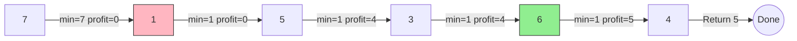
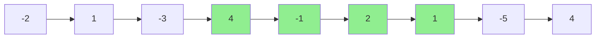

```mermaid
gantt
    title Week 1 — Arrays & Strings Schedule
    dateFormat  X
    axisFormat  %d
    section Day 1
    Two Sum (HashMap)        :a1, 0, 1d
    section Day 2
    Buy/Sell Stock           :a2, 1, 1d
    section Day 3
    Contains Duplicate       :a3, 2, 1d
    Valid Anagram            :a3b, 2, 1d
    section Day 4
    Maximum Subarray (Kadane):a4, 3, 1d
    section Day 5
    Move Zeroes              :a5, 4, 1d
    Two Pointer Patterns     :a5b, 4, 1d
    section Day 6
    Valid Palindrome         :a6, 5, 1d
    3Sum                     :a6b, 5, 1d
    section Day 7
    Product Except Self      :a7, 6, 1d
    Merge Intervals          :a7b, 6, 1d
    Revision + Practice      :a7c, 6, 1d
```

# Week 1 — Arrays & Strings

> **Target Audience:** Laravel/PHP developer transitioning to AI Engineering
> **Style:** Hinglish (Hindi + English) — practical, interview-focused
> **Goal:** 10 problems, 7 days, textbook-depth understanding

---

## Yeh Week Kya Hai?

Arrays aur Strings — data structures ki building blocks. PHP mein `$arr = [1,2,3]` tha, Python mein `arr = [1,2,3]` hai. Same same but different.

Is week mein hum seekhenge:

| Concept | PHP mein | Python mein |
|---------|----------|-------------|
| Array declaration | `$arr = [1,2,3]` | `arr = [1,2,3]` |
| Dynamic array | `array_push($arr, 4)` | `arr.append(4)` |
| Key-value | `$assoc["key"]` | `d["key"]` |
| String length | `strlen($s)` | `len(s)` |
| String to array | `str_split($s)` | `list(s)` |

---

## Daily Breakdown

### Day 1 — Two Sum (The HashMap Introduction)

### Day 2 — Best Time to Buy and Sell Stock

### Day 3 — Contains Duplicate + Valid Anagram

### Day 4 — Maximum Subarray (Kadane's Algorithm)

### Day 5 — Move Zeroes + Two Pointer Pattern

### Day 6 — Valid Palindrome + 3Sum

### Day 7 — Product of Array Except Self + Merge Intervals + Revision

---



---

# Day 1 — Two Sum

## Problem Statement

```
Input:  nums = [2, 7, 11, 15], target = 9
Output: [0, 1]
Explanation: nums[0] + nums[1] = 2 + 7 = 9 ✅
```

> Array mein do numbers dhundho jo target sum de. Unke indices return karo.

---

## Thinking Process (Laravel Developer Lens)

PHP mein tumne aisa kuch likha hoga:

```php
// PHP approach — brute force
function twoSum($nums, $target) {
    for ($i = 0; $i < count($nums); $i++) {
        for ($j = $i + 1; $j < count($nums); $j++) {
            if ($nums[$i] + $nums[$j] == $target) {
                return [$i, $j];
            }
        }
    }
    return [];
}
```

Python mein bhi brute force same hai — nested loops. But Python mein hume `enumerate()` milta hai jo index-value pair deta hai, aur `in` operator jo O(1) lookup deta hai hash-based structures mein.

---

## Approach 1: Brute Force (O(n²))

```python
def two_sum_brute_force(nums: list[int], target: int) -> list[int]:
    """
    Har pair check karo — O(n²) time, O(1) space
    """
    n = len(nums)
    for i in range(n):
        for j in range(i + 1, n):
            if nums[i] + nums[j] == target:
                return [i, j]
    return []

# Complexity:
#   Time:  O(n²) — do nested loops
#   Space: O(1) — koi extra memory nahi
```

### Dry Run (Trace Table)

| i | j | nums[i] | nums[j] | Sum | Match? |
|---|-----|-----------|-----------|-------|--------|
| 0 | 1 | 2 | 7 | 9 | ✅ [0,1] |
| 0 | 2 | 2 | 11 | 13 | ❌ |
| 0 | 3 | 2 | 15 | 17 | ❌ |
| 1 | 2 | 7 | 11 | 18 | ❌ |
| 1 | 3 | 7 | 15 | 22 | ❌ |
| 2 | 3 | 11 | 15 | 26 | ❌ |

Yeh approach kaam karti hai, lekin FAANG mein O(n²) accept nahi hota jab n = 10⁵ ho.

---

## Approach 2: HashMap (Optimal — O(n))

### Pattern Recognition

> **"Array mein do numbers jo target sum de"** ka matlab hai: *Har number ke liye, check karo ki kya target - num already dekha hai?*

HashMap mein store karo `num → index`. Har step mein complement check karo.

```python
def two_sum(nums: list[int], target: int) -> list[int]:
    """
    Optimal O(n) — HashMap use karo
    Ek baar iterate karo, har number ko seen mein store karo
    Complement agar seen mein mil gaya, toh answer mil gaya
    """
    seen = {}  # num -> index mapping

    for i, num in enumerate(nums):
        complement = target - num
        if complement in seen:          # O(1) lookup
            return [seen[complement], i]
        seen[num] = i                   # current number store karo

    return []  # solution exist karega hi — problem guarantee hai
```

### Complexity Analysis

| Measure | Value | Explanation |
|---------|-------|-------------|
| **Time** | O(n) | Ek hi loop — har element ek baar process |
| **Space** | O(n) | HashMap mein n elements tak store ho sakte |
| **Best Case** | O(1) | Target first 2 elements hi mil gaye |
| **Worst Case** | O(n) | Saare elements process karne pade |

### Detailed Dry Run

Input: `nums = [2, 7, 11, 15]`, `target = 9`

| Step | i | num | complement = target - num | seen (before) | complement in seen? | seen (after) |
|------|---|-----|--------------------------|---------------|---------------------|--------------|
| 1 | 0 | 2 | 9 - 2 = 7 | `{}` | ❌ (7 not seen) | `{2:0}` |
| 2 | 1 | 7 | 9 - 7 = 2 | `{2:0}` | ✅ (2 seen at index 0) | **Return [0,1]** |

**Edge Cases:**

| Input | Target | Output | Explanation |
|-------|--------|--------|-------------|
| `[3, 3]` | 6 | `[0, 1]` | Duplicate values — alag indices pe stored |
| `[0, 4, 3, 0]` | 0 | `[0, 3]` | Zero bhi kaam karta hai |
| `[1, 2]` | 4 | `[]` | Agar problem guarantee na de toh |
| `[-1, -2, -3, -4]` | -5 | `[1, 2]` | Negative numbers bhi support |

---

## PHP Developer Observations

```python
# PHP mein:
#   array_key_exists($key, $array) — slow in some cases
#   isset($arr[$key]) — fast but returns false for null values

# Python mein:
if complement in seen:      # O(1) hash lookup — fast
    return [seen[complement], i]

# IMPORTANT: Python ka "in" for dict = O(1)
#            PHP ka "in_array" = O(n) — be careful!
```

---

## Variations

### Variation 1: Two Sum II — Sorted Array (LeetCode 167)

```python
# Input sorted hai, to two pointers use kar sakte ho
def two_sum_sorted(numbers: list[int], target: int) -> list[int]:
    left, right = 0, len(numbers) - 1

    while left < right:
        current_sum = numbers[left] + numbers[right]
        if current_sum == target:
            return [left + 1, right + 1]  # 1-indexed return
        elif current_sum < target:
            left += 1
        else:
            right -= 1

    return []
# Time: O(n) — Space: O(1)
```

### Variation 2: Two Sum IV — BST (LeetCode 653)

```python
# BST mein do elements dhundho jo sum kare target
# Approach: Inorder traversal → sorted array → two pointers
def find_target(root: TreeNode, k: int) -> bool:
    seen = set()
    def dfs(node):
        if not node:
            return False
        if k - node.val in seen:
            return True
        seen.add(node.val)
        return dfs(node.left) or dfs(node.right)
    return dfs(root)
```

### Variation 3: 3Sum (LeetCode 15)

```python
# Array mein 3 numbers jo sum kare zero
# Fixed ek number, then two-sum-ii on the rest
def three_sum(nums: list[int]) -> list[list[int]]:
    nums.sort()
    result = []
    n = len(nums)

    for i in range(n - 2):
        if i > 0 and nums[i] == nums[i - 1]:  # skip duplicates
            continue
        left, right = i + 1, n - 1
        while left < right:
            total = nums[i] + nums[left] + nums[right]
            if total == 0:
                result.append([nums[i], nums[left], nums[right]])
                while left < right and nums[left] == nums[left + 1]:
                    left += 1
                while left < right and nums[right] == nums[right - 1]:
                    right -= 1
                left += 1
                right -= 1
            elif total < 0:
                left += 1
            else:
                right -= 1
    return result
```

### Variation 4: Pair with Maximum Sum

```python
def max_pair_sum(nums: list[int]) -> int:
    """Do largest numbers ka sum"""
    max1 = max2 = float('-inf')
    for num in nums:
        if num > max1:
            max2 = max1
            max1 = num
        elif num > max2:
            max2 = num
    return max1 + max2
```

---

## Pattern Recognition: Two Sum Pattern

### How to Identify This Pattern

```
🔍 Yeh pattern tab use hota jab:
  - Array ya list di ho
  - Do elements ka combination chahiye ho
  - Target value di ho
  - Index ya values return karne ho
  
Agar problem mein "pair", "sum", "complement" dikhe — Two Sum socho!
```

### Pattern Template

```python
# Generic Two Sum Pattern
def two_sum_pattern(arr: list[int], target: int) -> list[int] | None:
    seen = {}
    for i, val in enumerate(arr):
        needed = target - val  # complement calculation
        if needed in seen:
            return [seen[needed], i]
        seen[val] = i
    return None
```

This pattern extends to:
- **3Sum**: Fix one, Two Sum on rest
- **4Sum**: Fix two, Two Sum on rest
- **Pair with target difference**: complement = target + val instead of target - val
- **Anagram check**: complement = sorted version of string

---

## LeetCode Practice

| Problem | Difficulty | Hint |
|---------|------------|------|
| [1. Two Sum](https://leetcode.com/problems/two-sum/) | 🟢 Easy | HashMap use karo, O(n) |
| [167. Two Sum II](https://leetcode.com/problems/two-sum-ii-input-array-is-sorted/) | 🟢 Easy | Array sorted hai — two pointers |
| [15. 3Sum](https://leetcode.com/problems/3sum/) | 🟡 Medium | Sort karo + two pointers |
| [18. 4Sum](https://leetcode.com/problems/4sum/) | 🟡 Medium | 3Sum ka extension |
| [653. Two Sum IV](https://leetcode.com/problems/two-sum-iv-input-is-a-bst/) | 🟢 Easy | BST variant — HashSet + DFS |
| [121. Best Time to Buy and Sell Stock](https://leetcode.com/problems/best-time-to-buy-and-sell-stock/) | 🟢 Easy | *Next problem dekhte hain* |

---

---

# Day 2 — Best Time to Buy and Sell Stock

## Problem Statement

```
Input:  prices = [7, 1, 5, 3, 6, 4]
Output: 5
Explanation: Day 2 (price=1) buy karo, Day 5 (price=6) sell karo → profit = 6 - 1 = 5
```

> Ek array hai stock prices ka har din ke liye. Ek baar buy kar sakte ho, ek baar sell. Maximum profit kya hoga?

---

## Thinking Process

Yeh problem dekhke dimaag mein kya aana chahiye:

> **"Minimum price track karte chalo, har point par maximum profit calculate karo."**

PHP mein aisa likhte:

```php
function maxProfit($prices) {
    $minPrice = PHP_INT_MAX;
    $maxProfit = 0;

    foreach ($prices as $price) {
        if ($price < $minPrice) {
            $minPrice = $price;
        } else if ($price - $minPrice > $maxProfit) {
            $maxProfit = $price - $minPrice;
        }
    }
    return $maxProfit;
}
```

---

## Approach 1: Brute Force (O(n²))

```python
def max_profit_brute_force(prices: list[int]) -> int:
    """
    Har pair (buy day, sell day) check karo
    """
    n = len(prices)
    max_profit = 0

    for buy in range(n):
        for sell in range(buy + 1, n):
            profit = prices[sell] - prices[buy]
            if profit > max_profit:
                max_profit = profit

    return max_profit
```

### Complexity Analysis

| Measure | Value |
|---------|-------|
| **Time** | O(n²) — n² pairs compare |
| **Space** | O(1) — no extra memory |
| **n=10⁵** | 10 billion operations — too slow! |

### Dry Run

Input: `prices = [7, 1, 5, 3, 6, 4]`

| buy | sell | prices[buy] | prices[sell] | profit | max_profit |
|-----|------|-------------|--------------|--------|------------|
| 0 | 1 | 7 | 1 | -6 | 0 |
| 0 | 2 | 7 | 5 | -2 | 0 |
| 0 | 3 | 7 | 3 | -4 | 0 |
| 0 | 4 | 7 | 6 | -1 | 0 |
| 0 | 5 | 7 | 4 | -3 | 0 |
| 1 | 2 | 1 | 5 | 4 | 4 |
| 1 | 3 | 1 | 3 | 2 | 4 |
| 1 | 4 | 1 | 6 | 5 | **5** ✅ |
| 1 | 5 | 1 | 4 | 3 | 5 |
| ... | ... | ... | ... | ... | 5 |

---

## Approach 2: Single Pass (Optimal — O(n))

### Key Insight

> **"Sasti cheez tabhi identify kar sakte ho jab tumne pehle dekhi ho."**

Ek variable `min_price` mein ab tak ka minimum price rakho.
Har din, check karo: *Agar aaj bechu toh kitna profit hota?*

```python
def max_profit(prices: list[int]) -> int:
    """
    Single pass — O(n) time, O(1) space

    min_price: ab tak ka minimum dekha hua price
    max_profit: ab tak ka maximum profit jo mila
    """
    if not prices:
        return 0

    min_price = float('inf')   # PHP: PHP_INT_MAX
    max_profit = 0

    for price in prices:
        # Naya minimum mila?
        if price < min_price:
            min_price = price
        # Aaj bechu toh kitna profit?
        elif price - min_price > max_profit:
            max_profit = price - min_price

    return max_profit
```

### Complexity Analysis

| Measure | Value | Explanation |
|---------|-------|-------------|
| **Time** | O(n) | Single loop — har element ek baar |
| **Space** | O(1) | Sirf do variables |
| **Key** | Greedy | Har step pe optimal decision |

### Detailed Dry Run with Trace Table

Input: `prices = [7, 1, 5, 3, 6, 4]`

| Step | price | min_price (before) | min_price (after) | profit if sell today | max_profit (after) |
|------|-------|--------------------|--------------------|---------------------|--------------------|
| 1 | 7 | ∞ | **7** | 7 - 7 = 0 | 0 |
| 2 | 1 | 7 | **1** | 1 - 1 = 0 | 0 |
| 3 | 5 | 1 | 1 | 5 - 1 = **4** | **4** |
| 4 | 3 | 1 | 1 | 3 - 1 = 2 | 4 |
| 5 | 6 | 1 | 1 | 6 - 1 = **5** | **5** ✅ |
| 6 | 4 | 1 | 1 | 4 - 1 = 3 | 5 |

Final profit: **5** (buy at 1, sell at 6)

### Visualization



---

## Variations

### Variation 1: Best Time to Buy and Sell Stock II (LeetCode 122)

```python
# Multiple transactions allowed
# Har rise mein profit lo
def max_profit_ii(prices: list[int]) -> int:
    profit = 0
    for i in range(1, len(prices)):
        if prices[i] > prices[i - 1]:
            profit += prices[i] - prices[i - 1]
    return profit

# Example: [7,1,5,3,6,4] → (5-1)+(6-3) = 4+3 = 7
```

### Variation 2: Best Time to Buy and Sell Stock III (LeetCode 123)

```python
# At most 2 transactions
# State machine approach
def max_profit_iii(prices: list[int]) -> int:
    buy1 = buy2 = float('inf')
    sell1 = sell2 = 0

    for price in prices:
        buy1 = min(buy1, price)
        sell1 = max(sell1, price - buy1)
        buy2 = min(buy2, price - sell1)  # reinvest profit
        sell2 = max(sell2, price - buy2)

    return sell2
```

### Variation 3: Best Time to Buy and Sell Stock with Cooldown (LeetCode 309)

```python
# Sell karne ke baad ek din cooldown
# State machine: hold, sold, cooldown
def max_profit_cooldown(prices: list[int]) -> int:
    hold = float('-inf')
    sold = 0
    rest = 0

    for price in prices:
        hold, sold, rest = max(hold, rest - price), hold + price, max(rest, sold)

    return max(sold, rest)
```

---

## Pattern Recognition: Min-Max Tracking

```
🔍 Jab bhi problem mein:
  - Sequence di ho
  - Optimal point choose karna ho (buy/sell, rent, etc.)
  - Future information ke bina decision lena ho
  
Tab "minimum ab tak" + "maximum ab tak" — yeh pattern socho!
```

### When to Use This Pattern

| Signal | Example |
|--------|---------|
| "Maximum profit" | Stock buy/sell |
| "Minimum cost to reach" | Path finding |
| "Maximum difference" | Array mein do elements ka max gap |
| "Best day to..." | Resource allocation problems |

---

## LeetCode Practice

| Problem | Difficulty | Hint |
|---------|------------|------|
| [121. Buy/Sell Stock](https://leetcode.com/problems/best-time-to-buy-and-sell-stock/) | 🟢 Easy | Min price track karo |
| [122. Buy/Sell Stock II](https://leetcode.com/problems/best-time-to-buy-and-sell-stock-ii/) | 🟡 Medium | Har rise mein profit lo |
| [123. Buy/Sell Stock III](https://leetcode.com/problems/best-time-to-buy-and-sell-stock-iii/) | 🔴 Hard | At most 2 transactions |
| [309. Cooldown](https://leetcode.com/problems/best-time-to-buy-and-sell-stock-with-cooldown/) | 🟡 Medium | Sell ke baad rest |
| [714. Transaction Fee](https://leetcode.com/problems/best-time-to-buy-and-sell-stock-with-transaction-fee/) | 🟡 Medium | Har transaction par fee |

---

---

# Day 3 — Contains Duplicate & Valid Anagram

---

## Part 1: Contains Duplicate (LeetCode 217)

### Problem Statement

```
Input:  [1, 2, 3, 1]
Output: True  (1 appears twice)

Input:  [1, 2, 3, 4]
Output: False (all unique)
```

> Array mein koi element repeat ho raha hai? True/False batao.

---

### Approach 1: Brute Force (O(n²))

```python
def contains_duplicate_brute(nums: list[int]) -> bool:
    """Har do elements ko compare karo"""
    n = len(nums)
    for i in range(n):
        for j in range(i + 1, n):
            if nums[i] == nums[j]:
                return True
    return False
# Time: O(n²) — n=10⁵ pe 5 seconds+
```

### Approach 2: Sorting (O(n log n))

```python
def contains_duplicate_sort(nums: list[int]) -> bool:
    """Sort karo, phir adjacent check"""
    nums.sort()
    for i in range(1, len(nums)):
        if nums[i] == nums[i - 1]:
            return True
    return False
# Time: O(n log n) — sorting is expensive
# Space: O(1) — but mutates original
```

### Approach 3: HashSet (Optimal — O(n))

```python
def contains_duplicate(nums: list[int]) -> bool:
    """
    HashSet mein store karte jao
    Agar element already exists — duplicate mil gaya!
    """
    seen = set()
    for num in nums:
        if num in seen:
            return True
        seen.add(num)
    return False
```

### Complexity Analysis

| Measure | Brute Force | Sorting | **HashSet** |
|---------|-------------|---------|-------------|
| **Time** | O(n²) | O(n log n) | **O(n)** ✅ |
| **Space** | O(1) | O(1) or O(n) | **O(n)** |
| **n=10⁵** | 10B ops ❌ | 1.7M ops ✅ | **100K ops** ✅ |

### Dry Run

```
nums = [1, 2, 3, 1]

Step 1: num=1, seen={}, add → seen={1}
Step 2: num=2, seen={1}, add → seen={1, 2}
Step 3: num=3, seen={1,2}, add → seen={1, 2, 3}
Step 4: num=1, seen={1,2,3}, 1 IN seen → return True ✅
```

### PHP vs Python

```python
# PHP mein:
#   $seen = []; in_array($num, $seen) — O(n) lookup!
#   $seen[$num] = true; isset($seen[$num]) — O(1) (hash map)

# Python mein:
#   seen = set()          — hash set
#   num in seen           — O(1) average
#   seen.add(num)         — O(1) average
#   Difference: Python ka set() vs dict() — set has no values
```

---

## Part 2: Valid Anagram (LeetCode 242)

### Problem Statement

```
Input:  s = "anagram", t = "nagaram"
Output: True

Input:  s = "rat", t = "car"
Output: False
```

> Do strings hain. Kya same characters same count se hain? Matlab ek doosre ka anagram hai?

> **Anagram definition:** Dono strings mein same characters same frequency mein hone chahiye.

---

### Approach 1: Sorting (O(n log n))

```python
def is_anagram_sort(s: str, t: str) -> bool:
    """Sort karo, compare karo — easy but slow"""
    if len(s) != len(t):
        return False
    return sorted(s) == sorted(t)
    # sorted("anagram") = ["a","a","a","g","m","n","r"]
    # sorted("nagaram") = ["a","a","a","g","m","n","r"]
```

### Complexity

| Measure | Value |
|---------|-------|
| **Time** | O(n log n) — sorting strings |
| **Space** | O(n) — sorted copies |

### Approach 2: HashMap Count (Optimal — O(n))

```python
def is_anagram(s: str, t: str) -> bool:
    """
    Frequency counter approach
    Ek string ka count badhao, doosre ka ghatao
    Finally all counts should be 0
    """
    if len(s) != len(t):
        return False

    counts = {}  # character -> frequency

    # s ke characters — count badhao
    for c in s:
        counts[c] = counts.get(c, 0) + 1

    # t ke characters — count ghatao
    for c in t:
        if c not in counts or counts[c] == 0:
            return False
        counts[c] -= 1

    return True
```

### Approach 3: Counter (Pythonic — O(n))

```python
from collections import Counter

def is_anagram_pythonic(s: str, t: str) -> bool:
    """
    Python's Counter — ek line ka solution
    Counter dictionary returns frequency of each character
    """
    return Counter(s) == Counter(t)

# Counter("anagram") = {'a': 3, 'n': 1, 'g': 1, 'r': 1, 'm': 1}
# Counter("nagaram") = {'n': 1, 'a': 3, 'g': 1, 'r': 1, 'm': 1}
```

### Dry Run

```
s = "anagram", t = "nagaram"

Step 1: len check — dono 7 ✅

Step 2: s count build:
  a→3, n→1, g→1, r→1, m→1

Step 3: t count check:
  n: counts['n']=1 → 0
  a: counts['a']=3 → 2
  g: counts['g']=1 → 0
  a: counts['a']=2 → 1
  r: counts['r']=1 → 0
  a: counts['a']=1 → 0
  m: counts['m']=1 → 0

All zero → return True ✅
```

### Edge Cases

| s | t | Result | Why? |
|---|----|--------|------|
| "" | "" | True | Empty strings are anagrams |
| "a" | "a" | True | Single char |
| "a" | "b" | False | Different chars |
| "abc" | "ab" | False | Different lengths → fast fail |

---

## Variations

### Variation 1: Group Anagrams (LeetCode 49)

```python
# Multiple strings ko group karo by anagram
# Week 2 mein detail mein dekhenge
from collections import defaultdict

def group_anagrams(strs: list[str]) -> list[list[str]]:
    groups = defaultdict(list)
    for s in strs:
        key = "".join(sorted(s))
        groups[key].append(s)
    return list(groups.values())
```

### Variation 2: Find All Anagrams in a String (LeetCode 438)

```python
# Sliding window + frequency counter
def find_anagrams(s: str, p: str) -> list[int]:
    """s mein p ke saare anagram substrings dhundho"""
    from collections import Counter
    result = []
    p_count = Counter(p)
    s_count = Counter()

    for i in range(len(s)):
        s_count[s[i]] += 1

        if i >= len(p):
            if s_count[s[i - len(p)]] == 1:
                del s_count[s[i - len(p)]]
            else:
                s_count[s[i - len(p)]] -= 1

        if s_count == p_count:
            result.append(i - len(p) + 1)

    return result
```

### Variation 3: Valid Palindrome (LeetCode 125)

```python
# Kya string palindrome hai? (ignore non-alphanumeric, case insensitive)
def is_palindrome(s: str) -> bool:
    left, right = 0, len(s) - 1

    while left < right:
        while left < right and not s[left].isalnum():
            left += 1
        while left < right and not s[right].isalnum():
            right -= 1

        if s[left].lower() != s[right].lower():
            return False

        left += 1
        right -= 1

    return True

# Input:  "A man, a plan, a canal: Panama"
# Output: True ✅
```

---

## Pattern Recognition

**Contains Duplicate Pattern:**
```
🔍 Jab bhi "duplicate", "repeated", "frequency" shabd aaye — HashSet ya HashMap socho!
```

**Valid Anagram Pattern:**
```
🔍 Do structures compare karne hain with frequency — Counter ya HashMap socho.
   Strings, arrays, ya koi bhi sequence ho sakta hai.
```

**Anagram ka template:**
```python
# Step 1: Length check
if len(a) != len(b): return False

# Step 2: Count frequency of A
counts = {}
for x in a:
    counts[x] = counts.get(x, 0) + 1

# Step 3: Match with B
for x in b:
    if x not in counts or counts[x] == 0:
        return False
    counts[x] -= 1

return True
```

---

## LeetCode Practice

| Problem | Difficulty | Hint |
|---------|------------|------|
| [217. Contains Duplicate](https://leetcode.com/problems/contains-duplicate/) | 🟢 Easy | HashSet check |
| [219. Contains Duplicate II](https://leetcode.com/problems/contains-duplicate-ii/) | 🟢 Easy | Index difference ≤ k |
| [242. Valid Anagram](https://leetcode.com/problems/valid-anagram/) | 🟢 Easy | Frequency counter |
| [125. Valid Palindrome](https://leetcode.com/problems/valid-palindrome/) | 🟢 Easy | Two pointers |
| [438. Find All Anagrams](https://leetcode.com/problems/find-all-anagrams-in-a-string/) | 🟡 Medium | Sliding window + Counter |
| [49. Group Anagrams](https://leetcode.com/problems/group-anagrams/) | 🟡 Medium | Sorted string as key |

---

---

# Day 4 — Maximum Subarray (Kadane's Algorithm)

## Problem Statement

```
Input:  [-2, 1, -3, 4, -1, 2, 1, -5, 4]
Output: 6
Explanation: Subarray [4, -1, 2, 1] ka sum = 6

(Continuous subarray — beech mein break nahi kar sakte)
```

> Array mein sabse bada sum wala contiguous subarray ka sum dhundho.

---

## Thinking Process

> **"Subarray ko tabhi continue karna chahiye jab woh humein fayda de. Agar negative ho raha hai, toh naya shuru karo."**

Yeh problem DP (Dynamic Programming) ki pehli jhalak hai. Decision: *Is element ko previous sum mein add karein ya naya start karein?*

---

## Approach 1: Brute Force (O(n²))

```python
def max_subarray_brute(nums: list[int]) -> int:
    """Har possible subarray ka sum calculate karo"""
    n = len(nums)
    max_sum = float('-inf')

    for i in range(n):
        current_sum = 0
        for j in range(i, n):
            current_sum += nums[j]
            max_sum = max(max_sum, current_sum)

    return max_sum
# Time:  O(n²) — n=10⁵ pe 10 billion operations
# Space: O(1)
```

### Dry Run

Input: `[-2, 1, -3, 4, -1, 2, 1, -5, 4]`

| i | j | subarray | current_sum | max_sum |
|---|----|----------|-------------|---------|
| 0 | 0 | [-2] | -2 | -2 |
| 0 | 1 | [-2, 1] | -1 | -2 |
| 0 | 2 | [-2, 1, -3] | -4 | -2 |
| ... | ... | ... | ... | ... |
| 3 | 3 | [4] | 4 | 4 |
| 3 | 4 | [4, -1] | 3 | 4 |
| 3 | 5 | [4, -1, 2] | 5 | 5 |
| 3 | 6 | [4, -1, 2, 1] | **6** | **6** ✅ |
| 3 | 7 | [4, -1, 2, 1, -5] | 1 | 6 |
| ... | ... | ... | ... | 6 |

---

## Approach 2: Kadane's Algorithm (Optimal — O(n))

### The Magic Formula

```
current_sum = max(element, current_sum + element)
max_sum     = max(max_sum, current_sum)
```

### Intuition

> PHP developer analogy: Jaise tum ek collection process kar rahe ho, aur har item ko include ya skip karne ka decision le rahe ho. Kadane ka simple rule hai: *Agar current element + previous sum > current element se, toh include karo. Agar nahi, toh naya start karo.*

```python
def max_subarray(nums: list[int]) -> int:
    """
    Kadane's Algorithm — O(n) time, O(1) space

    current_sum: current subarray ka sum (decide karte raho)
    max_sum: ab tak ka maximum subarray sum
    """
    if not nums:
        return 0

    max_sum = nums[0]
    current_sum = nums[0]

    for num in nums[1:]:
        # Decision: extend previous subarray ya start fresh?
        current_sum = max(num, current_sum + num)
        # Update global maximum
        max_sum = max(max_sum, current_sum)

    return max_sum
```

### Complexity Analysis

| Measure | Value | Explanation |
|---------|-------|-------------|
| **Time** | O(n) | Ek hi loop — each element processed once |
| **Space** | O(1) | Sirf do integer variables |
| **Pattern** | DP / Greedy | Har step local + global optimum |

### Detailed Dry Run

Input: `[-2, 1, -3, 4, -1, 2, 1, -5, 4]`

| Step | num | current_sum (before) | current_sum = max(num, current_sum+num) | max_sum (after) |
|------|-----|---------------------|-----------------------------------------|-----------------|
| 1 | -2 | - | -2 (initial) | -2 |
| 2 | 1 | -2 | `max(1, -2+1) = max(1, -1) = 1` | max(-2, 1) = **1** |
| 3 | -3 | 1 | `max(-3, 1-3) = max(-3, -2) = -2` | max(1, -2) = 1 |
| 4 | 4 | -2 | `max(4, -2+4) = max(4, 2) = 4` | max(1, 4) = **4** |
| 5 | -1 | 4 | `max(-1, 4-1) = max(-1, 3) = 3` | max(4, 3) = 4 |
| 6 | 2 | 3 | `max(2, 3+2) = max(2, 5) = 5` | max(4, 5) = **5** |
| 7 | 1 | 5 | `max(1, 5+1) = max(1, 6) = 6` | max(5, 6) = **6** ✅ |
| 8 | -5 | 6 | `max(-5, 6-5) = max(-5, 1) = 1` | max(6, 1) = 6 |
| 9 | 4 | 1 | `max(4, 1+4) = max(4, 5) = 5` | max(6, 5) = 6 |

**Final answer: 6** — Subarray `[4, -1, 2, 1]`

### Visualization



The green subarray `[4, -1, 2, 1]` is the maximum sum subarray.

---

## Edge Cases

| Input | Output | Explanation |
|-------|--------|-------------|
| `[1]` | 1 | Single element |
| `[-1, -2, -3]` | -1 | All negative — smallest negative wins |
| `[5, 4, -1, 7, 8]` | 23 | Mostly positive |
| `[0, 0, 0]` | 0 | All zeros |
| `[-5, -2, -10]` | -2 | Largest negative |

---

## Variations

### Variation 1: Maximum Subarray Sum — Return Subarray (Not Just Sum)

```python
def max_subarray_with_indices(nums: list[int]) -> tuple[list[int], int]:
    """Kadane's + track karo ki subarray kahan se kahan tak hai"""
    if not nums:
        return [], 0

    max_sum = current_sum = nums[0]
    start = end = temp_start = 0

    for i in range(1, len(nums)):
        if nums[i] > current_sum + nums[i]:
            current_sum = nums[i]
            temp_start = i
        else:
            current_sum += nums[i]

        if current_sum > max_sum:
            max_sum = current_sum
            start = temp_start
            end = i

    return nums[start:end + 1], max_sum

# Input: [-2, 1, -3, 4, -1, 2, 1, -5, 4]
# Output: [4, -1, 2, 1], 6
```

### Variation 2: Maximum Product Subarray (LeetCode 152)

```python
# Product ka issue — negative * negative = positive!
def max_product(nums: list[int]) -> int:
    max_prod = min_prod = result = nums[0]

    for num in nums[1:]:
        if num < 0:
            max_prod, min_prod = min_prod, max_prod  # swap (negative flips)

        max_prod = max(num, max_prod * num)
        min_prod = min(num, min_prod * num)

        result = max(result, max_prod)

    return result
# Input: [2, 3, -2, 4]
# Output: 6 (subarray [2, 3])
```

### Variation 3: Maximum Sum Circular Subarray (LeetCode 918)

```python
# Array circular hai — last element ke baad first aata hai
def max_subarray_sum_circular(nums: list[int]) -> int:
    # Two cases:
    # 1. Normal subarray (Kadane's)
    # 2. Circular subarray = total - min_subarray_sum
    total = sum(nums)
    max_sum = curr_max = nums[0]
    min_sum = curr_min = nums[0]

    for num in nums[1:]:
        curr_max = max(num, curr_max + num)
        max_sum = max(max_sum, curr_max)
        curr_min = min(num, curr_min + num)
        min_sum = min(min_sum, curr_min)

    # Agar saare negative hain toh max_sum return karo
    return max(max_sum, total - min_sum) if max_sum > 0 else max_sum
```

### Variation 4: Subarray Sum Equals K (LeetCode 560)

```python
# Subarrays ki total count jinka sum exactly k hai
# HashMap mein prefix sums store karo
def subarray_sum(nums: list[int], k: int) -> int:
    count = 0
    prefix_sum = 0
    prefix_sums = {0: 1}  # sum -> frequency

    for num in nums:
        prefix_sum += num
        # Agar prefix_sum - k already exists, toh subarray mil gaya
        if prefix_sum - k in prefix_sums:
            count += prefix_sums[prefix_sum - k]
        prefix_sums[prefix_sum] = prefix_sums.get(prefix_sum, 0) + 1

    return count
```

---

## Pattern Recognition: Kadane's Algorithm

```
🔍 Jab bhi:
  - Maximum/minimum subarray sum/max poochhe
  - Contiguous subarray ho
  - "Largest sum", "maximum profit" ho

Tab Kadane ya min-max tracking socho!
```

### Key Decision Template

```python
# Kadane ka core decision logic:
for num in array[1:]:
    # Option 1: Previous sum extend karo
    option1 = current_sum + num
    # Option 2: Naya start karo
    option2 = num
    # Jo fayda de woh chuno
    current_sum = max(option1, option2)
    # Global update
    max_sum = max(max_sum, current_sum)
```

### LeetCode Practice

| Problem | Difficulty | Hint |
|---------|------------|------|
| [53. Maximum Subarray](https://leetcode.com/problems/maximum-subarray/) | 🟡 Medium | Kadane's algorithm |
| [152. Max Product Subarray](https://leetcode.com/problems/maximum-product-subarray/) | 🟡 Medium | Negative flip track karo |
| [918. Max Circular Subarray](https://leetcode.com/problems/maximum-sum-circular-subarray/) | 🟡 Medium | Total - min subarray |
| [560. Subarray Sum Equals K](https://leetcode.com/problems/subarray-sum-equals-k/) | 🟡 Medium | Prefix sum + HashMap |
| [1186. Max Subarray Sum with One Deletion](https://leetcode.com/problems/maximum-subarray-sum-with-one-deletion/) | 🟡 Medium | Kadane's with skip option |

---

---

# Day 5 — Move Zeroes & Two Pointer Pattern

## Problem Statement

```
Input:  [0, 1, 0, 3, 12]
Output: [1, 3, 12, 0, 0]

(Order of non-zero elements maintain karo)
```

> Array mein saare zeroes ko end mein shift karo. Non-zero elements ka order change nahi hona chahiye.

---

## Thinking Process

> **"Zero ko ignore karo, non-zero elements ko front mein accumulate karo."** 

Two-pointer pattern ka pehla introduction. Ek pointer `pos` batata hai ki agli non-zero value kahan aayegi.

---

## Approach 1: Extra Array (O(n) space)

```python
def move_zeroes_extra_space(nums: list[int]) -> None:
    """Extra array mein non-zeros daalo, phir zeroes bharo"""
    n = len(nums)
    result = [0] * n
    idx = 0
    for num in nums:
        if num != 0:
            result[idx] = num
            idx += 1

    # Copy back
    for i in range(n):
        nums[i] = result[i]

    # nums = [1, 3, 12, 0, 0]
# Time: O(n), Space: O(n)
```

---

## Approach 2: Two Pointer (Optimal — O(1) space)

```python
def move_zeroes(nums: list[int]) -> None:
    """
    Two-pointer in-place — O(1) extra space

    pos: next non-zero element kahana aayega
    i: array traverse kar raha hai
    """
    pos = 0  # pointer for non-zero placement

    for i in range(len(nums)):
        if nums[i] != 0:
            # Swap current element with position pointer
            nums[pos], nums[i] = nums[i], nums[pos]
            pos += 1

    # All non-zero elements are at front, zeroes at back
```

### Complexity Analysis

| Measure | Value |
|---------|-------|
| **Time** | O(n) — ek hi loop |
| **Space** | O(1) — ek integer pointer |
| **In-place** | ✅ Original array modify |

### Dry Run

```
nums = [0, 1, 0, 3, 12]

Initial: pos = 0

i=0: nums[0]=0 → skip (nothing to swap)
i=1: nums[1]=1 (non-zero)
     swap nums[0] with nums[1]
     nums = [1, 0, 0, 3, 12]
     pos = 1

i=2: nums[2]=0 → skip
i=3: nums[3]=3 (non-zero)
     swap nums[1] with nums[3]
     nums = [1, 3, 0, 0, 12]
     pos = 2

i=4: nums[4]=12 (non-zero)
     swap nums[2] with nums[4]
     nums = [1, 3, 12, 0, 0]
     pos = 3

Result: [1, 3, 12, 0, 0] ✅
```

---

### Approach 3: Write Non-Zeros First (Alternative)

```python
def move_zeroes_alt(nums: list[int]) -> None:
    """Pehle saare non-zero copy karo, phir zeroes bharo"""
    pos = 0

    # Phase 1: non-zero elements copy
    for num in nums:
        if num != 0:
            nums[pos] = num
            pos += 1

    # Phase 2: remaining positions fill with zero
    for i in range(pos, len(nums)):
        nums[i] = 0

# This does fewer writes when zeroes are many
```

---

## Variations of Move Zeroes

### Variation 1: Remove Element (LeetCode 27)

```python
# Array mein se specific element hatao, in-place
def remove_element(nums: list[int], val: int) -> int:
    pos = 0
    for i in range(len(nums)):
        if nums[i] != val:
            nums[pos] = nums[i]
            pos += 1
    return pos  # new length

# Input: [3, 2, 2, 3], val=3
# Output: 2, nums=[2, 2, _, _]
```

### Variation 2: Remove Duplicates from Sorted Array (LeetCode 26)

```python
def remove_duplicates(nums: list[int]) -> int:
    if not nums:
        return 0
    pos = 1
    for i in range(1, len(nums)):
        if nums[i] != nums[i - 1]:
            nums[pos] = nums[i]
            pos += 1
    return pos

# Input: [0, 0, 1, 1, 1, 2, 2, 3, 3, 4]
# Output: 5, nums=[0, 1, 2, 3, 4, ...]
```

### Variation 3: Sort Colors (Dutch National Flag — LeetCode 75)

```python
# Three pointers: 0s left, 1s middle, 2s right
def sort_colors(nums: list[int]) -> None:
    left = 0
    right = len(nums) - 1
    i = 0

    while i <= right:
        if nums[i] == 0:
            nums[left], nums[i] = nums[i], nums[left]
            left += 1
            i += 1
        elif nums[i] == 2:
            nums[right], nums[i] = nums[i], nums[right]
            right -= 1
        else:  # nums[i] == 1
            i += 1

# Input: [2, 0, 2, 1, 1, 0]
# Output: [0, 0, 1, 1, 2, 2]
```

---

## Pattern Recognition: Two Pointer

```
🔍 Jab bhi:
  - In-place array modification
  - Partition karna ho (zeros/non-zeros, evens/odds)
  - Duplicates remove karne hain
  - Sorted array mein pair search

Tab TWO POINTERS socho!
```

### Two Pointer Template

```python
# Generic Two Pointer Pattern (Partition)
def two_pointer_partition(arr: list[int]) -> None:
    """
    Ek pointer traverse karta hai,
    Doosra pointer batata hai eligible element kahan aayega
    """
    eligible_pos = 0  # or "write" pointer

    for read_pos in range(len(arr)):
        if condition(arr[read_pos]):
            # Copy/swap with eligible position
            arr[eligible_pos], arr[read_pos] = arr[read_pos], arr[eligible_pos]
            eligible_pos += 1
```

---

## LeetCode Practice

| Problem | Difficulty | Hint |
|---------|------------|------|
| [283. Move Zeroes](https://leetcode.com/problems/move-zeroes/) | 🟢 Easy | Two pointer partition |
| [27. Remove Element](https://leetcode.com/problems/remove-element/) | 🟢 Easy | Same pattern |
| [26. Remove Duplicates](https://leetcode.com/problems/remove-duplicates-from-sorted-array/) | 🟢 Easy | Adjacent comparison |
| [75. Sort Colors](https://leetcode.com/problems/sort-colors/) | 🟡 Medium | 3-way partition |
| [905. Sort By Parity](https://leetcode.com/problems/sort-array-by-parity/) | 🟢 Easy | Even/odd partition |

---

---

# Day 6 — Valid Palindrome & 3Sum

## Part 1: Valid Palindrome (LeetCode 125)

```python
def is_palindrome(s: str) -> bool:
    """
    Two pointers — left se aur right se chalo
    Sirf alphanumeric characters consider karo
    Case insensitive compare karo
    """
    left, right = 0, len(s) - 1

    while left < right:
        # Skip non-alphanumeric from left
        while left < right and not s[left].isalnum():
            left += 1
        # Skip non-alphanumeric from right
        while left < right and not s[right].isalnum():
            right -= 1

        # Compare (case-insensitive)
        if s[left].lower() != s[right].lower():
            return False

        left += 1
        right -= 1

    return True
```

### Dry Run

```
s = "A man, a plan, a canal: Panama"

Initially: left=0 ('A'), right=29 ('a')

Skip non-alphanumeric...
Compare: 'a' vs 'a' → match
left=1 (' '), right=28 ('m')
Skip → left=2 ('m'), right=28 ('m')
Compare: 'm' vs 'm' → match

... continues ...

All match → return True ✅
```

---

## Part 2: 3Sum (LeetCode 15)

```python
def three_sum(nums: list[int]) -> list[list[int]]:
    """
    Array mein 3 numbers jinka sum 0 ho
    Approach: Sort + Two Sum (Two Pointers)

    Steps:
    1. Sort array
    2. Fix ek number (i)
    3. Two Sum II on remaining (left, right)
    4. Skip duplicates
    """
    nums.sort()
    result = []
    n = len(nums)

    for i in range(n - 2):
        # Skip duplicate i values
        if i > 0 and nums[i] == nums[i - 1]:
            continue

        # Early termination (agar smallest positive ho toh)
        if nums[i] > 0:
            break

        left, right = i + 1, n - 1

        while left < right:
            total = nums[i] + nums[left] + nums[right]

            if total == 0:
                result.append([nums[i], nums[left], nums[right]])

                # Skip duplicates for left and right
                while left < right and nums[left] == nums[left + 1]:
                    left += 1
                while left < right and nums[right] == nums[right - 1]:
                    right -= 1

                left += 1
                right -= 1

            elif total < 0:
                left += 1  # sum badhana hai
            else:
                right -= 1  # sum kam karna hai

    return result
```

### Complexity

| Measure | Value |
|---------|-------|
| **Time** | O(n²) — sort O(n log n) + nested loops |
| **Space** | O(1) or O(n) depending on sort |

### Dry Run

```
Input: [-1, 0, 1, 2, -1, -4]
Sorted: [-4, -1, -1, 0, 1, 2]

i=0: nums[0]=-4
  left=1(-1), right=5(2): sum=-3 <0 → left=2(-1)
  left=2(-1), right=5(2): sum=-3 <0 → left=3(0)
  left=3(0), right=5(2): sum=-2 <0 → left=4(1)
  left=4(1), right=5(2): sum=-1 <0 → left=5(2) break

i=1: nums[1]=-1 (skip duplicate check)
  left=2(-1), right=5(2): sum=0 → [-1,-1,2] ✅
    skip duplicates... left=3, right=4
  left=3(0), right=4(1): sum=0 → [-1,0,1] ✅
  left=4(1), right=3(2): break

i=2: nums[2]=-1 == nums[1] → skip duplicate

Result: [[-1,-1,2], [-1,0,1]]
```

---

## LeetCode Practice

| Problem | Difficulty | Hint |
|---------|------------|------|
| [125. Valid Palindrome](https://leetcode.com/problems/valid-palindrome/) | 🟢 Easy | Two pointers, skip non-alpha |
| [15. 3Sum](https://leetcode.com/problems/3sum/) | 🟡 Medium | Sort + two pointers |
| [16. 3Sum Closest](https://leetcode.com/problems/3sum-closest/) | 🟡 Medium | Track closest difference |
| [680. Valid Palindrome II](https://leetcode.com/problems/valid-palindrome-ii/) | 🟢 Easy | Delete at most one char |
| [647. Palindromic Substrings](https://leetcode.com/problems/palindromic-substrings/) | 🟡 Medium | Expand around center |

---

---

# Day 7 — Product of Array Except Self & Merge Intervals

## Part 1: Product of Array Except Self (LeetCode 238)

### Problem Statement

```
Input:  [1, 2, 3, 4]
Output: [24, 12, 8, 6]

Explanation:
  output[0] = 1 * 2 * 3 * 4 = 24  (without nums[0])
  output[1] = 1 * 3 * 4 = 12      (without nums[1])
  output[2] = 1 * 2 * 4 = 8       (without nums[2])
  output[3] = 1 * 2 * 3 = 6       (without nums[3])
```

> Har index i ke liye, saare elements ka product except nums[i].

**🚫 Constraint: Division use nahi kar sakte!**

---

### Approach 1: With Division (Not Allowed)

```python
def product_except_self_division(nums: list[int]) -> list[int]:
    """Agar division allowed hota — par nahi hai!"""
    total = 1
    for num in nums:
        total *= num
    result = []
    for num in nums:
        result.append(total // num)  # division not allowed
    return result

# Problem: Agar koi element 0 hai toh crash!
```

---

### Approach 2: Prefix-Suffix Product (Optimal)

**Key Insight:** Har element ka product = left side ka product × right side ka product.

```
nums    = [1,     2,     3,     4]
prefix  = [1,   1*1, 1*1*2, 1*1*2*3]
        = [1,     1,     2,     6]
suffix  = [1*2*3*4, 2*3*4, 3*4, 4]
        = [24,   12,     4,     1]

output  = prefix × suffix (element-wise)
        = [1×24, 1×12, 2×4, 6×1]
        = [24,   12,    8,    6]
```

```python
def product_except_self(nums: list[int]) -> list[int]:
    """
    O(n) time, O(1) extra space (output array ko exclude karte)

    Steps:
    1. Left pass: prefix product store karo
    2. Right pass: suffix product se multiply karo
    """
    n = len(nums)
    result = [1] * n

    # Left pass — prefix product
    prefix = 1
    for i in range(n):
        result[i] = prefix
        prefix *= nums[i]
    # result after left pass: [1, 1, 2, 6]

    # Right pass — multiply with suffix product
    suffix = 1
    for i in range(n - 1, -1, -1):
        result[i] *= suffix
        suffix *= nums[i]
    # result after right pass: [24, 12, 8, 6]

    return result
```

### Complexity Analysis

| Measure | Value | Explanation |
|---------|-------|-------------|
| **Time** | O(n) | Two passes — left + right |
| **Space** | O(1) | Except output array (not counted) |
| **Division?** | 🚫 | Nahi use kiya |

### Dry Run

```
nums = [1, 2, 3, 4]
result = [1, 1, 1, 1]

LEFT PASS:
i=0: result[0]=1, prefix=1×1=1
i=1: result[1]=1, prefix=1×2=2
i=2: result[2]=2, prefix=2×3=6
i=3: result[3]=6, prefix=6×4=24
→ result = [1, 1, 2, 6]

RIGHT PASS:
i=3: result[3]=6×1=6, suffix=1×4=4
i=2: result[2]=2×4=8, suffix=4×3=12
i=1: result[1]=1×12=12, suffix=12×2=24
i=0: result[0]=1×24=24, suffix=24×1=24
→ result = [24, 12, 8, 6] ✅
```

---

## Part 2: Merge Intervals (LeetCode 56)

### Problem Statement

```
Input:  [[1,3], [2,6], [8,10], [15,18]]
Output: [[1,6], [8,10], [15,18]]

Explanation: [1,3] aur [2,6] overlap karte hain → merge karo [1,6]
```

> Overlapping intervals ko merge karo. Har interval ek start-end pair hai.

---

### Approach

```python
def merge_intervals(intervals: list[list[int]]) -> list[list[int]]:
    """
    Sort by start time, phir merge overlapping intervals

    Steps:
    1. Start time ke hisaab se sort karo
    2. Current interval ke saath next compare karo
    3. Agar overlap hai → merge karo (max end take)
    4. Agar nahi → new interval start karo
    """
    if not intervals:
        return []

    intervals.sort(key=lambda x: x[0])  # sort by start
    merged = [intervals[0]]  # first interval

    for start, end in intervals[1:]:
        last_end = merged[-1][1]

        if start <= last_end:  # overlapping?
            # Merge — end ko modify karo
            merged[-1][1] = max(last_end, end)
        else:
            merged.append([start, end])  # no overlap, add new

    return merged
```

### Complexity

| Measure | Value |
|---------|-------|
| **Time** | O(n log n) — sorting dominates |
| **Space** | O(n) — output array |

### Dry Run

```
Input: [[1,3], [2,6], [8,10], [15,18]]

Step 0: Sort by start — already sorted
Step 1: merged = [[1,3]]

Step 2: [2,6]
  start=2, last_end=3
  2 ≤ 3 → overlap!
  merged[-1][1] = max(3, 6) = 6
  merged = [[1,6]]

Step 3: [8,10]
  start=8, last_end=6
  8 ≤ 6 → no overlap
  merged = [[1,6], [8,10]]

Step 4: [15,18]
  start=15, last_end=10
  15 ≤ 10 → no overlap
  merged = [[1,6], [8,10], [15,18]]

Result: [[1,6], [8,10], [15,18]] ✅
```

---

### Variation: Insert Interval (LeetCode 57)

```python
def insert_interval(intervals: list[list[int]], new_interval: list[int]) -> list[list[int]]:
    """Already sorted intervals mein naya interval insert karo, merge karte hue"""
    result = []
    i = 0
    n = len(intervals)

    # Add all intervals ending before new_interval starts
    while i < n and intervals[i][1] < new_interval[0]:
        result.append(intervals[i])
        i += 1

    # Merge overlapping intervals
    while i < n and intervals[i][0] <= new_interval[1]:
        new_interval[0] = min(new_interval[0], intervals[i][0])
        new_interval[1] = max(new_interval[1], intervals[i][1])
        i += 1
    result.append(new_interval)

    # Add remaining intervals
    while i < n:
        result.append(intervals[i])
        i += 1

    return result

# Input: [[1,3],[6,9]], [2,5]
# Output: [[1,5],[6,9]]
```

---

## LeetCode Practice

| Problem | Difficulty | Hint |
|---------|------------|------|
| [238. Product Except Self](https://leetcode.com/problems/product-of-array-except-self/) | 🟡 Medium | Prefix × suffix |
| [56. Merge Intervals](https://leetcode.com/problems/merge-intervals/) | 🟡 Medium | Sort + merge |
| [57. Insert Interval](https://leetcode.com/problems/insert-interval/) | 🟡 Medium | Three phase insert |
| [252. Meeting Rooms](https://leetcode.com/problems/meeting-rooms/) | 🟢 Easy | Can attend all? |
| [253. Meeting Rooms II](https://leetcode.com/problems/meeting-rooms-ii/) | 🟡 Medium | Min meeting rooms |

---

---

# Week 1: Complete Reference

## Key Patterns Summary

| Pattern | Problems | Key Idea |
|---------|----------|----------|
| **HashMap** | Two Sum, Contains Duplicate, Anagram | O(1) lookup = fast |
| **Min-Max Track** | Buy/Sell Stock | Ek variable mein ab tak ka min/max rakho |
| **Kadane's** | Maximum Subarray | current_sum = max(num, current_sum + num) |
| **Two Pointer** | Move Zeroes, Palindrome, 3Sum | Ek pointer traverse, doosra position track |
| **Prefix-Suffix** | Product Except Self | Left pass + right pass |
| **Sort + Sweep** | Merge Intervals | Start time se sort karo |


## Week 1 Targets Checklist

- [ ] **Two Sum** — O(n) HashMap approach, complement pattern samjho
- [ ] **Two Sum II (Sorted)** — Two pointer O(1) space variant
- [ ] **Buy/Sell Stock** — Single pass min-price + max-profit
- [ ] **Buy/Sell Stock II** — Multiple transactions, sum all positive gains
- [ ] **Contains Duplicate** — HashSet for O(n) duplicate detection
- [ ] **Valid Anagram** — HashMap Counter for frequency comparison
- [ ] **Maximum Subarray** — Kadane's algorithm with local/global maxima
- [ ] **Maximum Product Subarray** — Kadane's for products (negative flip)
- [ ] **Move Zeroes** — Two pointer in-place partition
- [ ] **Remove Element** — Same two-pointer pattern
- [ ] **Remove Duplicates** — Adjacent comparison two-pointer
- [ ] **Valid Palindrome** — Two pointer from ends
- [ ] **3Sum** — Sort + two pointers, duplicate handling
- [ ] **Product of Array Except Self** — Prefix × suffix O(n) time
- [ ] **Merge Intervals** — Sort by start, merge if overlap
- [ ] **Subarray Sum Equals K** — Prefix sum + HashMap pattern
- [ ] **Sort Colors** — Dutch national flag (3 pointers)
- [ ] **In-place modification comfort** — Python list mutation ka aadat daalo
- [ ] **Complexity analysis habit** — Har problem ka time & space batao
- [ ] **Pattern recognition** — Problem dekhte hi HashMap / Two Pointer / Kadane pehchano

---

## PHP → Python Quick Reference for Arrays

| Operation | PHP | Python |
|-----------|-----|--------|
| Create | `$arr = [1, 2, 3]` | `arr = [1, 2, 3]` |
| Append | `$arr[] = 4` | `arr.append(4)` |
| Length | `count($arr)` | `len(arr)` |
| Access | `$arr[0]` | `arr[0]` |
| Last | `end($arr)` | `arr[-1]` |
| Slice | `array_slice($arr, 1, 2)` | `arr[1:3]` |
| Key exists | `array_key_exists('k', $a)` | `'k' in d` |
| Sort | `sort($arr)` | `arr.sort()` |
| Filter | `array_filter($arr, fn)` | `[x for x in arr if cond]` |
| Map | `array_map(fn, $arr)` | `[fn(x) for x in arr]` |
| Unique | `array_unique($arr)` | `list(set(arr))` |

---

> **Yeh week clear hai toh Phase 2 DSA ka base strong hai. HashMap, Two Pointer, Kadane — yeh teen patterns Week 2 mein bhi kaam aayenge.**
