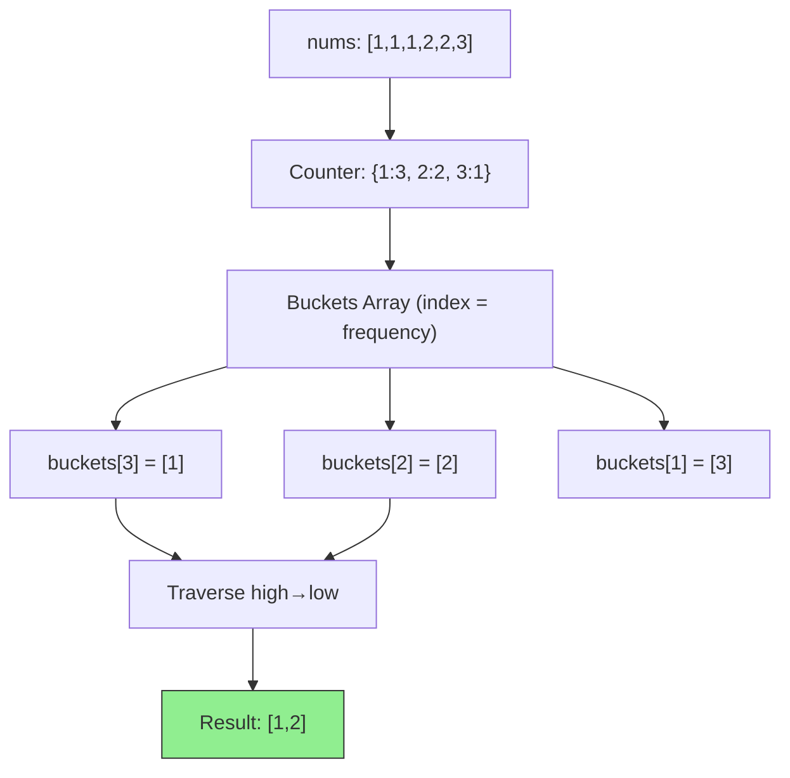
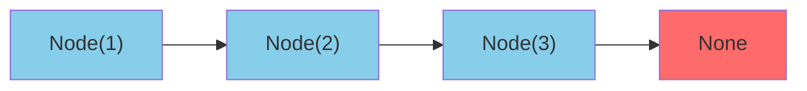
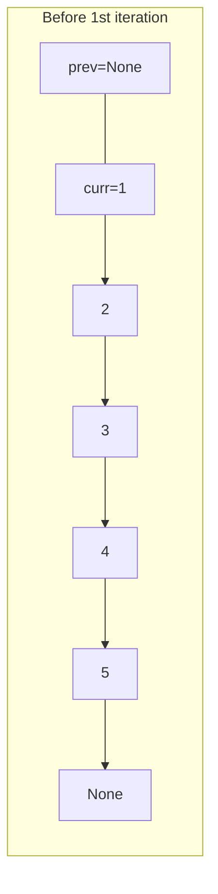
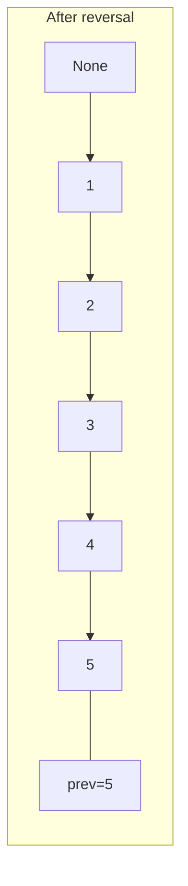
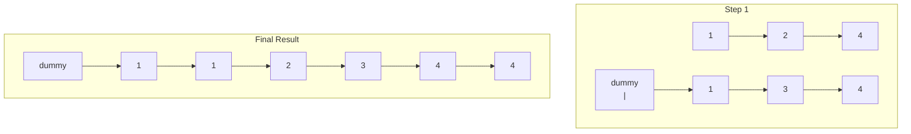
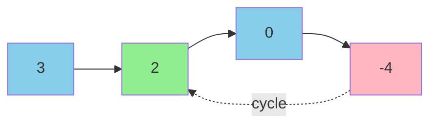
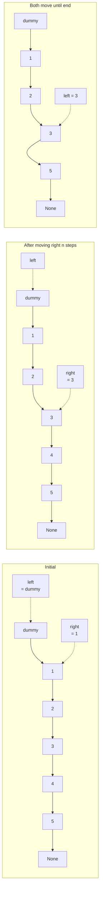
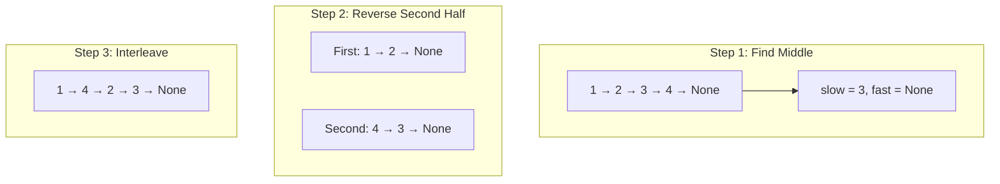
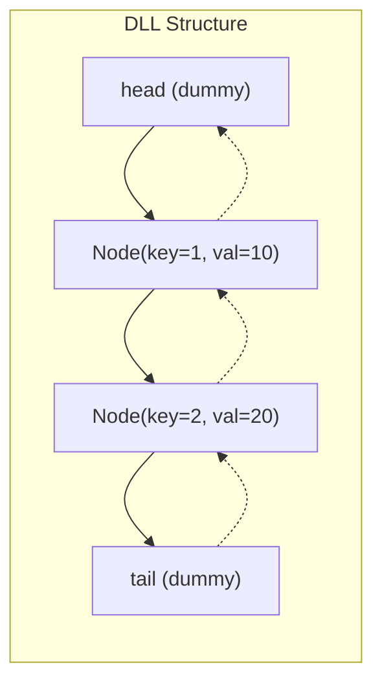

```mermaid
gantt
    title Week 2 — HashMap & Linked List Schedule
    dateFormat  X
    axisFormat  %d
    section Day 1
    Group Anagrams          :a1, 0, 1d
    section Day 2
    Top K Frequent          :a2, 1, 1d
    Bucket Sort Pattern     :a2b, 1, 1d
    section Day 3
    Valid Sudoku            :a3, 2, 1d
    Ransom Note             :a3b, 2, 1d
    section Day 4
    Reverse Linked List     :a4, 3, 1d
    Merge Sorted Lists      :a4b, 3, 1d
    section Day 5
    Linked List Cycle       :a5, 4, 1d
    Remove Nth Node         :a5b, 4, 1d
    section Day 6
    Reorder List            :a6, 5, 1d
    LRU Cache               :a6b, 5, 1d
    section Day 7
    Revision + Mock         :a7, 6, 1d
    LeetCode Practice       :a7b, 6, 1d
```

# Week 2 — HashMap & Linked List

> **Target Audience:** Laravel/PHP developer transitioning to AI Engineering
> **Style:** Hinglish (Hindi + English) — practical, interview-focused
> **Goal:** 10 problems (6 HashMap + 6 Linked List overlapped), 7 days, textbook-depth

---

## Yeh Week Kya Hai?

HashMap aur Linked List — yeh do patterns FAANG interviews mein sabse zyada poochhe jaate hain. HashMap O(1) lookup deta hai, Linked List pointer manipulation ka game hai. Dono milke LRU Cache jaise real-world problems solve karte hain.

| Concept | PHP mein | Python mein |
|---------|----------|-------------|
| Hash table | `$arr["key"]` | `d = {}` or `defaultdict(list)` |
| Set | `array_unique()` | `set()` |
| Counter | `array_count_values()` | `Counter` from collections |
| Linked list | `SplDoublyLinkedList` | Manual class implementation |
| LRU Cache | Manual with arrays | `OrderedDict` or `dict` (Python 3.7+) |

---

## Daily Breakdown

```
Day 1 — Group Anagrams + HashMap Basics
Day 2 — Top K Frequent Elements + Bucket Sort Pattern
Day 3 — Valid Sudoku + Ransom Note (HashSet Deep Dive)
Day 4 — Reverse Linked List + Merge Two Sorted Lists
Day 5 — Linked List Cycle + Remove Nth Node From End
Day 6 — Reorder List + LRU Cache (HashMap + DLL)
Day 7 — Revision + LeetCode Practice
```

---



---

---

# Day 1 — Group Anagrams (HashMap Basics)

## Problem Statement

```
Input:  ["eat","tea","tan","ate","nat","bat"]
Output: [["eat","tea","ate"],["tan","nat"],["bat"]]
```

> String list di gayi hai. Jo strings ek doosre ke anagram hain, unka group banao. Group order matter nahi karta. Order within group bhi matter nahi karta.

---

## Thinking Process

Week 1 mein Valid Anagram kiya tha — do strings compare karna seekha. Ab multiple strings ko group karna hai.

> **"Ek aisi key chahiye jo saare anagrams ke liye same ho."**

Agar do strings anagrams hain, toh unka sorted form same hoga. Sorted string = unique signature!

---

## Approach 1: Brute Force (O(n² × k log k))

```python
def group_anagrams_brute(strs: list[str]) -> list[list[str]]:
    """Har string ko har existing group se compare karo"""
    groups = []  # list of lists
    used = [False] * len(strs)

    for i in range(len(strs)):
        if used[i]:
            continue
        group = [strs[i]]
        used[i] = True
        for j in range(i + 1, len(strs)):
            if not used[j] and sorted(strs[i]) == sorted(strs[j]):
                group.append(strs[j])
                used[j] = True
        groups.append(group)

    return groups

# Complexity:
#   Time:  O(n² × k log k) — n strings, each sorted O(k log k)
#   Space: O(n)
```

---

## Approach 2: HashMap with Sorted String Key (Optimal)

```python
from collections import defaultdict

def group_anagrams(strs: list[str]) -> list[list[str]]:
    """
    Optimal — O(n × k log k) time, O(n × k) space

    Key insight: sorted string = anagram signature
    """
    groups = defaultdict(list)  # missing key pe automatically empty list

    for s in strs:
        # Sorted string = anagram ka unique signature
        key = "".join(sorted(s))
        groups[key].append(s)

    return list(groups.values())
```

### Complexity Analysis

| Measure | Value | Explanation |
|---------|-------|-------------|
| **Time** | O(n × k log k) | n strings, har string ka sort O(k log k), k = max string length |
| **Space** | O(n × k) | HashMap mein saari strings store |
| **Alternative** | O(n × k) with char count key | Count array se bhi key bana sakte hain |

---

### Detailed Dry Run

```
Input: strs = ["eat","tea","tan","ate","nat","bat"]
groups = {} (defaultdict)

Step 1: "eat"
  sorted("eat") = "aet"
  groups["aet"] = ["eat"]

Step 2: "tea"
  sorted("tea") = "aet"
  groups["aet"] = ["eat", "tea"]

Step 3: "tan"
  sorted("tan") = "ant"
  groups["ant"] = ["tan"]

Step 4: "ate"
  sorted("ate") = "aet"
  groups["aet"] = ["eat", "tea", "ate"]

Step 5: "nat"
  sorted("nat") = "ant"
  groups["ant"] = ["tan", "nat"]

Step 6: "bat"
  sorted("bat") = "abt"
  groups["abt"] = ["bat"]

Final: list(groups.values()) = [["eat","tea","ate"],["tan","nat"],["bat"]] ✅
```

### Trace Table

| String | Sorted Key | Groups After |
|--------|-----------|--------------|
| "eat" | "aet" | `{"aet": ["eat"]}` |
| "tea" | "aet" | `{"aet": ["eat","tea"]}` |
| "tan" | "ant" | `{"aet": ["eat","tea"], "ant": ["tan"]}` |
| "ate" | "aet" | `{"aet": ["eat","tea","ate"], "ant": ["tan"]}` |
| "nat" | "ant" | `{"aet": ["eat","tea","ate"], "ant": ["tan","nat"]}` |
| "bat" | "abt" | `{"aet": ["eat","tea","ate"], "ant": ["tan","nat"], "abt": ["bat"]}` |

---

## Approach 3: Character Count Key (Faster — O(n × k))

```python
def group_anagrams_count_key(strs: list[str]) -> list[list[str]]:
    """
    Sort ki jagah character count array use karo
    Key = tuple of 26 character counts
    O(n × k) time — faster jab strings lambi hon
    """
    groups = defaultdict(list)

    for s in strs:
        # 26 zeros ka count array
        count = [0] * 26

        # Har character ka count
        for ch in s:
            count[ord(ch) - ord('a')] += 1

        # Tuple immutable hota hai — hash key ban sakta hai
        key = tuple(count)
        groups[key].append(s)

    return list(groups.values())

# Complexity:
#   Time:  O(n × k) — sorting avoid kiya
#   Space: O(n × k) — HashMap storage
```

### Why Tuple?

```python
# List hash nahi ho sakti — mutable hai
# Tuple hash ho sakti hai — immutable hai
key = tuple(count)  # ✅ valid hash key
# key = count       # ❌ TypeError: unhashable type: 'list'
```

### Performance Comparison

| Approach | Time | Space | When to Use |
|----------|------|-------|-------------|
| Sorted String | O(nk log k) | O(nk) | Simple, readable |
| Count Array | O(nk) | O(nk) | Fast when k is large |
| Brute Force | O(n²k log k) | O(n) | Never in interview |

---

## PHP Developer Notes

```python
# PHP mein:
#   array_count_values() — values count karta hai
#   sort() / array_multisort() — PHP sorting

# Python mein:
from collections import defaultdict

# defaultdict(list) — missing key pe automatically []
# Normal dict se compare karo:
d = {}          # d["x"] → KeyError ❌
dd = defaultdict(list)  # dd["x"] → [] ✅

# Yeh pattern bahut common hai — yaad rakho!
```

---

## Pattern Recognition: Group Anagrams

```
🔍 Jab bhi:
  - Similar items ko group karna ho
  - Har group ka ek "identifier" ho
  - Strings ko normalize karke key banao

Tab HASHMAP WITH CUSTOM KEY pattern socho!
```

### Template

```python
def group_by_key(items: list) -> dict:
    groups = defaultdict(list)
    for item in items:
        key = compute_key(item)  # normalize karo
        groups[key].append(item)
    return dict(groups)  # or list(groups.values())
```

This pattern works for:
- Group anagrams (sorted string key)
- Group by frequency (count array key)
- Group by length (len as key)
- Group by first letter
- Group by parity
- Group by any custom property

---

## Variations

### Variation 1: Group Shifted Strings (LeetCode 249)

```python
# Strings jo ek-shift se related hain
# "abc" → shift 1 → "bcd", shift 2 → "cde", etc.
def group_strings(strings: list[str]) -> list[list[str]]:
    groups = defaultdict(list)

    for s in strings:
        # Key = tuple of differences between consecutive chars
        key = []
        for i in range(1, len(s)):
            diff = (ord(s[i]) - ord(s[i-1])) % 26
            key.append(diff)
        groups[tuple(key)].append(s)

    return list(groups.values())
```

### Variation 2: Find Duplicate File in System (LeetCode 609)

```python
# Content-based file grouping
def find_duplicate(paths: list[str]) -> list[list[str]]:
    content_map = defaultdict(list)

    for path in paths:
        parts = path.split()
        directory = parts[0]
        for file_info in parts[1:]:
            name, content = file_info.split('(')
            content = content[:-1]  # remove ')'
            content_map[content].append(f"{directory}/{name}")

    return [group for group in content_map.values() if len(group) > 1]
```

---

## LeetCode Practice

| Problem | Difficulty | Hint |
|---------|------------|------|
| [49. Group Anagrams](https://leetcode.com/problems/group-anagrams/) | 🟡 Medium | Sorted string key |
| [249. Group Shifted Strings](https://leetcode.com/problems/group-shifted-strings/) | 🟡 Medium | Character diff as key |
| [609. Find Duplicate File](https://leetcode.com/problems/find-duplicate-file-in-system/) | 🟡 Medium | Content hash as key |
| [242. Valid Anagram](https://leetcode.com/problems/valid-anagram/) | 🟢 Easy | Week 1 revision |
| [438. Find All Anagrams](https://leetcode.com/problems/find-all-anagrams-in-a-string/) | 🟡 Medium | Sliding window + Counter |

---

---

# Day 2 — Top K Frequent Elements

## Problem Statement

```
Input:  nums = [1, 1, 1, 2, 2, 3], k = 2
Output: [1, 2]

(Do sabse zyada frequent elements — 1 teen baar, 2 do baar)
```

> Array mein top k most frequent elements return karo. Output order matter nahi karta.

---

## Thinking Process

> **"Frequency count karo, phir frequency ke hisaab se rank karo."**

Do steps:
1. Frequency map banao (HashMap)
2. Frequency ke hisaab se top k elements select karo

---

## Approach 1: HashMap + Sort (O(n log n))

```python
def top_k_frequent_sort(nums: list[int], k: int) -> list[int]:
    """Count karo, sort karo, top k lo"""
    from collections import Counter

    count = Counter(nums)  # {1: 3, 2: 2, 3: 1}

    # Sort by frequency (descending)
    sorted_items = sorted(count.items(), key=lambda x: x[1], reverse=True)

    return [num for num, _ in sorted_items[:k]]
```

### Complexity

| Measure | Value | Pain Point |
|---------|-------|------------|
| **Time** | O(n log n) | Sorting kyun? Sirf top k chahiye |
| **Space** | O(n) | HashMap + sorted array |

Interview mein bolenge: *"O(n log n) aacha hai, par O(n) possible hai?"*

---

## Approach 2: HashMap + Min Heap (O(n log k))

```python
import heapq
from collections import Counter

def top_k_frequent_heap(nums: list[int], k: int) -> list[int]:
    """
    Min-heap use karo — O(n log k) time

    Heap size k tak limit hai, isliye O(n log k) hai sort se better
    """
    count = Counter(nums)

    # Min-heap of size k
    heap = []

    for num, freq in count.items():
        heapq.heappush(heap, (freq, num))
        if len(heap) > k:
            heapq.heappop(heap)  # smallest frequency remove karo

    return [num for _, num in heap]
```

### How Heap Works Here

```python
# Min-heap: smallest element top par
# Hum top k frequent chahte hain — to smallest frequency wale ko pop karte raho

# nums = [1,1,1,2,2,3], k = 2
# count = {1:3, 2:2, 3:1}

# heap (freq, num):
# After 1: heap = [(3, 1)], size=1 ≤ k
# After 2: heap = [(2, 2), (3, 1)], size=2 ≤ k
# After 3: heap = [(1, 3), (3, 1), (2, 2)] → size=3 > k, pop smallest → pop (1, 3)
#           heap = [(2, 2), (3, 1)]
# Result: [2, 1] ✅
```

---

## Approach 3: Bucket Sort (Optimal — O(n))

```python
from collections import Counter

def top_k_frequent(nums: list[int], k: int) -> list[int]:
    """
    Bucket Sort — O(n) time, O(n) space

    Key idea: frequency 0 se n tak ho sakti hai
    Array of buckets banayo: bucket[freq] = list of numbers with that freq
    """
    count = Counter(nums)  # Step 1: frequency map

    # Step 2: Create buckets (index = frequency)
    # Max frequency can be len(nums)
    buckets = [[] for _ in range(len(nums) + 1)]

    for num, freq in count.items():
        buckets[freq].append(num)

    # Step 3: Traverse from highest frequency to lowest
    result = []
    for freq in range(len(buckets) - 1, 0, -1):
        for num in buckets[freq]:
            result.append(num)
            if len(result) == k:
                return result

    return result
```

### Complexity Analysis

| Measure | Value | Explanation |
|---------|-------|-------------|
| **Time** | O(n) | Counting O(n) + Bucketing O(n) + Collection O(n) |
| **Space** | O(n) | HashMap + buckets array |
| **Key** | No sorting! | Bucket index = frequency |

### Detailed Dry Run

```
nums = [1, 1, 1, 2, 2, 3], k = 2

Step 1: Count
  count = {1: 3, 2: 2, 3: 1}

Step 2: Buckets
  buckets[0] = []    (no number appears 0 times)
  buckets[1] = [3]   (3 appears 1 time)
  buckets[2] = [2]   (2 appears 2 times)
  buckets[3] = [1]   (1 appears 3 times)
  buckets[4] = []    (n=6, max freq = 3)
  buckets[5] = []
  buckets[6] = []

Step 3: Traverse from highest freq
  freq=6: [] → skip
  freq=5: [] → skip
  freq=4: [] → skip
  freq=3: [1] → result=[1], len=1 < k
  freq=2: [2] → result=[1,2], len=2 == k → return [1,2] ✅
```

### Visual Representation



---

## PHP Developer Perspective

```php
// PHP mein:
$nums = [1, 1, 1, 2, 2, 3];
$count = array_count_values($nums);  // [1=>3, 2=>2, 3=>1]
arsort($count);  // sort by value descending, preserve keys
$result = array_slice(array_keys($count), 0, 2);  // [1, 2]
```

```python
# Python mein:
from collections import Counter

nums = [1, 1, 1, 2, 2, 3]
count = Counter(nums)
# count.most_common(2) → [(1, 3), (2, 2)]
result = [num for num, _ in count.most_common(2)]
```

`Counter.most_common(k)` internally heap use karta hai!

---

## Variations

### Variation 1: Top K Frequent Words (LeetCode 692)

```python
# Words — same freq pe lexicographic sort
def top_k_frequent_words(words: list[str], k: int) -> list[str]:
    count = Counter(words)
    # Sort by (-freq, word) — negative freq for descending
    return sorted(count.keys(), key=lambda w: (-count[w], w))[:k]
```

### Variation 2: Sort Characters By Frequency (LeetCode 451)

```python
def frequency_sort(s: str) -> str:
    count = Counter(s)
    # Sort characters by frequency descending
    return "".join(char * freq for char, freq in count.most_common())
```

### Variation 3: K Closest Points to Origin (LeetCode 973)

```python
# Same top-k pattern, different metric
def k_closest(points: list[list[int]], k: int) -> list[list[int]]:
    # Calculate distance² (no sqrt needed for comparison)
    points.sort(key=lambda p: p[0]**2 + p[1]**2)
    return points[:k]
```

---

## Pattern Recognition: Top K

```
🔍 Jab bhi:
  - "Top k", "most frequent", "k largest/smallest"
  - Kuch rank karna hai frequency/property ke hisaab se
  
Tab BUCKET SORT (O(n)) ya HEAP (O(n log k)) socho!

Rule of thumb:
  - n chhota hai → sort is fine
  - n bada hai → bucket sort (if frequency range bounded)
  - k << n → heap
  - Frequency range ≤ n → bucket sort
```

### Decision Tree

```
Problem: Top K elements?
  ├─ Frequency range bounded (like n)?
  │     └─ ✅ Bucket Sort (O(n))
  ├─ k is small?
  │     └─ ✅ Min Heap (O(n log k))
  └─ Neither?
        └─ ✅ QuickSelect (O(n) avg, O(n²) worst)
```

---

## LeetCode Practice

| Problem | Difficulty | Hint |
|---------|------------|------|
| [347. Top K Frequent Elements](https://leetcode.com/problems/top-k-frequent-elements/) | 🟡 Medium | Bucket sort or heap |
| [692. Top K Frequent Words](https://leetcode.com/problems/top-k-frequent-words/) | 🟡 Medium | Lexicographic tiebreaker |
| [451. Sort Characters By Frequency](https://leetcode.com/problems/sort-characters-by-frequency/) | 🟡 Medium | Frequency string rebuild |
| [973. K Closest Points](https://leetcode.com/problems/k-closest-points-to-origin/) | 🟡 Medium | Distance² as frequency |
| [215. Kth Largest Element](https://leetcode.com/problems/kth-largest-element-in-an-array/) | 🟡 Medium | QuickSelect or heap |

---

---

# Day 3 — Valid Sudoku & Ransom Note

## Part 1: Valid Sudoku (LeetCode 36)

## Problem Statement

```
Input: 9x9 board with digits "1"-"9" and "."
Output: True/False

Rules:
  - Har row mein digits 1-9 at most ek baar
  - Har column mein digits 1-9 at most ek baar
  - Har 3×3 box mein digits 1-9 at most ek baar
```

> Valid Sudoku board hai ya nahi? Sirf filled cells check karo, solve nahi karna.

---

## Thinking Process

> **"Teen cheezein track karo: rows, columns, aur 3×3 boxes. Har digit har group mein unique hona chahiye."**

Box index ka formula: `(row // 3) * 3 + (col // 3)` — 0 se 8 tak.

---

## Approach 1: Using Sets (Clean — O(1))

```python
def is_valid_sudoku(board: list[list[str]]) -> bool:
    """
    9×9 fixed hai — technically O(1) time and space

    rows[r]: set of digits seen in row r
    cols[c]: set of digits seen in column c
    boxes[b]: set of digits seen in box b
    """
    rows = [set() for _ in range(9)]
    cols = [set() for _ in range(9)]
    boxes = [set() for _ in range(9)]

    for r in range(9):
        for c in range(9):
            val = board[r][c]
            if val == ".":
                continue

            box_idx = (r // 3) * 3 + (c // 3)

            if val in rows[r] or val in cols[c] or val in boxes[box_idx]:
                return False

            rows[r].add(val)
            cols[c].add(val)
            boxes[box_idx].add(val)

    return True
```

### Complexity Analysis

| Measure | Value | Why? |
|---------|-------|------|
| **Time** | O(1) | Board 9×9 fixed — exactly 81 cells |
| **Space** | O(1) | 27 sets × at most 9 elements each |
| **General n×n** | O(n²) time, O(n²) space |

### Dry Run

```
Board (partial):
  [["5","3",".",".","7",".",".",".","."],
   ["6",".",".","1","9","5",".",".","."],
   [".","9","8",".",".",".",".","6","."],
   ["8",".",".",".","6",".",".",".","3"],
   ["4",".",".","8",".","3",".",".","1"],
   ["7",".",".",".","2",".",".",".","6"],
   [".","6",".",".",".",".","2","8","."],
   [".",".",".","4","1","9",".",".","5"],
   [".",".",".",".","8",".",".","7","9"]]

Let's trace cell (0,0) = "5":
  r=0, c=0, val="5", box_idx = (0//3)*3 + 0//3 = 0
  rows[0]={}, cols[0]={}, boxes[0]={} → no conflict
  Add to all three sets ✅

Cell (0,1) = "3":
  r=0, c=1, val="3", box_idx=0
  rows[0]={"5"}, cols[1]={}, boxes[0]={"5"}
  No conflict → add ✅

... continues ...

Agar conflict hota:
  r=0, c=4, val="7"
  r=1, c=4, val="9"
  r=2, c=4, val="6"  (all cols[4] mein, all different)
  
Suppose duplicate:
  r=0, c=0, val="5"
  r=0, c=3, val="5" (same row!)
  Check: "5" in rows[0]? Yes! → return False ❌
```

---

## Approach 2: Tuple Encoding (Compact)

```python
def is_valid_sudoku_compact(board: list[list[str]]) -> bool:
    """
    Single set — encoded strings use karo
    "5 in row 0" as unique identifier
    """
    seen = set()

    for r in range(9):
        for c in range(9):
            val = board[r][c]
            if val == ".":
                continue

            # Encode as strings — human readable
            row_key = f"row:{r}:{val}"
            col_key = f"col:{c}:{val}"
            box_key = f"box:{(r//3)*3 + (c//3)}:{val}"

            if row_key in seen or col_key in seen or box_key in seen:
                return False

            seen.update([row_key, col_key, box_key])

    return True

# seen after full traversal would contain:
# "row:0:5", "col:0:5", "box:0:5",
# "row:0:3", "col:1:3", "box:0:3", etc.
```

---

## Part 2: Ransom Note (LeetCode 383)

## Problem Statement

```
Input:  ransomNote = "aa", magazine = "aab"
Output: True

(Note magazine ke letters se bana sakte hain ya nahi)
```

> Magazine mein diye gaye letters se ransom note banao. Har letter magazine mein at most utni baar lena allowed jitni baar available ho.

---

## Approach 1: Counter Subtraction

```python
from collections import Counter

def can_construct(ransom_note: str, magazine: str) -> bool:
    """
    Magazine ka count map banao
    Note ke har character ke liye count kam karo
    Agar koi character magazine mein nahi hai → False
    """
    available = Counter(magazine)  # "aab" → {'a': 2, 'b': 1}

    for ch in ransom_note:
        if available[ch] == 0:  # not enough letters
            return False
        available[ch] -= 1

    return True
```

### Complexity

| Measure | Value |
|---------|-------|
| **Time** | O(n + m) — n = len(note), m = len(magazine) |
| **Space** | O(1) — at most 26 chars (or 128 ASCII) |

### Dry Run

```
ransomNote = "aa", magazine = "aab"

available = Counter("aab") → {'a': 2, 'b': 1}

ch = 'a':
  available['a'] = 2 → not zero → decrement → available['a'] = 1

ch = 'a':
  available['a'] = 1 → not zero → decrement → available['a'] = 0

All characters done → return True ✅

---

Test: ransomNote = "aab", magazine = "aab"

available = Counter("aab") → {'a': 2, 'b': 1}

ch = 'a': available['a'] = 2 → 1
ch = 'a': available['a'] = 1 → 0
ch = 'b': available['b'] = 1 → 0

All done → True ✅

---

Test: ransomNote = "aa", magazine = "ab"

available = Counter("ab") → {'a': 1, 'b': 1}

ch = 'a': available['a'] = 1 → 0
ch = 'a': available['a'] = 0 → return False ❌
```

---

## Approach 2: One-Liner (Pythonic)

```python
def can_construct_oneliner(ransom_note: str, magazine: str) -> bool:
    """
    Counter subtraction — result mein sirf woh chars rehte hain
    jo magazine mein nahi the ya kam the
    """
    return not Counter(ransom_note) - Counter(magazine)

# Counter("aab") - Counter("aa") = Counter({'b': 1}) → not empty → False
# Counter("aa") - Counter("aab") = Counter() → empty → True

# Logic:
#   Counter difference = characters that are in note but NOT sufficiently in magazine
#   Agar note ke saare chars magazine mein hain → difference empty → True
```

---

## Pattern Recognition: Frequency Validation

### Ransom Note Pattern

```
🔍 Jab bhi:
  - "Bana sakte hain?" (can construct)
  - "Characters se banao" (rearrange)
  - Limited resources diye hon

Tab COUNTER SUBTRACTION socho!
```

### Valid Sudoku Pattern

```
🔍 Jab bhi:
  - Multiple constraints ek saath check karni ho
  - Grid/Matrix mein uniqueness check
  - Rows, columns, boxes teeno track

Tab MULTIPLE SETS or ENCODED STRINGS socho!
```

---

## LeetCode Practice

| Problem | Difficulty | Hint |
|---------|------------|------|
| [36. Valid Sudoku](https://leetcode.com/problems/valid-sudoku/) | 🟡 Medium | Row/col/box sets |
| [383. Ransom Note](https://leetcode.com/problems/ransom-note/) | 🟢 Easy | Counter subtraction |
| [37. Sudoku Solver](https://leetcode.com/problems/sudoku-solver/) | 🔴 Hard | Backtracking (advanced) |

---

---

# Day 4 — Reverse Linked List & Merge Two Sorted Lists

## What is a Linked List?



```python
# PHP developer, linked list ka concept same hai:
# class ListNode {
#     public $val;
#     public $next;
#     public function __construct($val = 0, $next = null) {
#         $this->val = $val;
#         $this->next = $next;
#     }
# }

class ListNode:
    """Python linked list node"""
    def __init__(self, val: int = 0, next: 'ListNode | None' = None):
        self.val = val
        self.next = next

# Difference: PHP mein public $val, Python mein self.val
# PHP mein $next = null, Python mein next: ListNode | None = None
# PHP mein `new ListNode(1)`, Python mein `ListNode(1)`
```

---

## Part 1: Reverse Linked List (LeetCode 206)

## Problem Statement

```
Input:  1 → 2 → 3 → 4 → 5 → None
Output: 5 → 4 → 3 → 2 → 1 → None
```

> Linked list ko ulta karo. All pointers ko reverse direction mein point karado.

---

## Thinking Process

> **"Har node ka next pointer, previous node ko point karne lagao."**

Teen pointers chahiye: `prev` (pichhla), `curr` (current), `next_temp` (agla save karne ke liye).

---

## Approach 1: Iterative (Optimal — O(n))

```python
def reverse_list(head: ListNode | None) -> ListNode | None:
    """
    Iterative reversal — O(n) time, O(1) space

    prev: reversed part ka head
    curr: current node being processed
    next_temp: curr.next store karo (because we'll lose it after reassignment)
    """
    prev = None
    curr = head

    while curr:
        next_temp = curr.next   # 1. Save next (before losing it)
        curr.next = prev        # 2. Reverse the pointer
        prev = curr              # 3. Move prev forward
        curr = next_temp         # 4. Move curr forward

    return prev  # prev is the new head
```

### Complexity Analysis

| Measure | Value | Explanation |
|---------|-------|-------------|
| **Time** | O(n) | Exactly n iterations |
| **Space** | O(1) | Sirf 3 pointer variables |
| **Key** | Pointer manipulation | List modification, no new nodes |

### Detailed Dry Run

```
Input: 1 → 2 → 3 → 4 → 5 → None

Visual convention: curr (→ means arrow)

Initial:
  prev = None
  curr = 1 → 2 → 3 → 4 → 5 → None

Iteration 1:
  next_temp = 2
  curr.next = None  (1 → None)
  prev = 1
  curr = 2
  State: None ← 1    2 → 3 → 4 → 5 → None

Iteration 2:
  next_temp = 3
  curr.next = 1       (2 → 1)
  prev = 2
  curr = 3
  State: None ← 1 ← 2    3 → 4 → 5 → None

Iteration 3:
  next_temp = 4
  curr.next = 2       (3 → 2)
  prev = 3
  curr = 4
  State: None ← 1 ← 2 ← 3    4 → 5 → None

Iteration 4:
  next_temp = 5
  curr.next = 3       (4 → 3)
  prev = 4
  curr = 5
  State: None ← 1 ← 2 ← 3 ← 4    5 → None

Iteration 5:
  next_temp = None
  curr.next = 4       (5 → 4)
  prev = 5
  curr = None
  State: None ← 1 ← 2 ← 3 ← 4 ← 5

Return prev = 5 ✅
```

### Visual Flow





---

## Approach 2: Recursive (Elegant — O(n))

```python
def reverse_list_recursive(head: ListNode | None) -> ListNode | None:
    """
    Recursive reversal — O(n) time, O(n) space (call stack)

    Base case: empty list or single node
    Recursive case: list[1:] reverse karo, phir 1 ko end mein jodo
    """
    # Base case
    if not head or not head.next:
        return head

    # Reverse the rest of the list
    reversed_rest = reverse_list_recursive(head.next)

    # Put current node at the end
    head.next.next = head
    head.next = None

    return reversed_rest
```

### Recursive Trace

```
reverse(1 → 2 → 3 → 4 → 5 → None)

Call 1: reverse(1)
  head = 1, head.next = 2
  → reverse(2)    [waiting]

Call 2: reverse(2)
  head = 2, head.next = 3
  → reverse(3)    [waiting]

Call 3: reverse(3)
  head = 3, head.next = 4
  → reverse(4)    [waiting]

Call 4: reverse(4)
  head = 4, head.next = 5
  → reverse(5)    [waiting]

Call 5: reverse(5)
  head.next = None → return 5  [BASE CASE]

Back to Call 4:
  head = 4, reversed_rest = 5
  head.next.next = 4  → 5 → 4
  head.next = None    → 4 → None
  return 5 → 4 → None

Back to Call 3:
  head = 3, reversed_rest = 5 → 4 → None
  head.next.next = 3  → 4 → 3
  head.next = None    → 3 → None
  return 5 → 4 → 3 → None

Back to Call 2:
  head = 2, reversed_rest = 5 → 4 → 3 → None
  head.next.next = 2  → 3 → 2
  head.next = None    → 2 → None
  return 5 → 4 → 3 → 2 → None

Back to Call 1:
  head = 1, reversed_rest = 5 → 4 → 3 → 2 → None
  head.next.next = 1  → 2 → 1
  head.next = None    → 1 → None
  return 5 → 4 → 3 → 2 → 1 → None ✅
```

---

## Part 2: Merge Two Sorted Lists (LeetCode 21)

## Problem Statement

```
Input:  list1 = 1 → 2 → 4, list2 = 1 → 3 → 4
Output: 1 → 1 → 2 → 3 → 4 → 4
```

> Do sorted linked lists ko merge karo. Ek sorted list banani hai.

---

## Approach: Iterative with Dummy Node

```python
def merge_two_lists(list1: ListNode | None, list2: ListNode | None) -> ListNode | None:
    """
    Dummy node pattern — O(n + m) time, O(1) space

    dummy: result list ka placeholder (return dummy.next)
    tail: current last node of merged list
    """
    dummy = ListNode(0)  # dummy node — actual value doesn't matter
    tail = dummy

    while list1 and list2:
        if list1.val < list2.val:
            tail.next = list1
            list1 = list1.next
        else:
            tail.next = list2
            list2 = list2.next
        tail = tail.next

    # Attach remaining nodes (one of them might have leftovers)
    tail.next = list1 or list2

    return dummy.next
```

### Complexity

| Measure | Value |
|---------|-------|
| **Time** | O(n + m) — both lists traversed once |
| **Space** | O(1) — no new nodes, just pointers |

### Dry Run

```
list1 = 1 → 2 → 4 → None
list2 = 1 → 3 → 4 → None

dummy = 0 (placeholder)
tail = dummy

Step 1: list1.val(1) == list2.val(1) → pick list2 (else branch)
  tail.next = list2(1)
  list2 = 3
  tail = 1
  dummy → 1

Step 2: list1.val(1) < list2.val(3) → pick list1
  tail.next = list1(1)
  list1 = 2
  tail = 1
  dummy → 1 → 1

Step 3: list1.val(2) < list2.val(3) → pick list1
  tail.next = list1(2)
  list1 = 4
  tail = 2
  dummy → 1 → 1 → 2

Step 4: list1.val(4) > list2.val(3) → pick list2
  tail.next = list2(3)
  list2 = 4
  tail = 3
  dummy → 1 → 1 → 2 → 3

Step 5: list1.val(4) == list2.val(4) → pick list2 (else)
  tail.next = list2(4)
  list2 = None
  tail = 4
  dummy → 1 → 1 → 2 → 3 → 4

Step 6: list1 = 4, list2 = None
  tail.next = list1 (or list2 = 4)
  tail = 4 → next = None
  dummy → 1 → 1 → 2 → 3 → 4 → 4

Return dummy.next = 1 → 1 → 2 → 3 → 4 → 4 ✅
```

### Visual



---

## Pattern Recognition: Linked List

```
🔍 Jab bhi linked list dikhe:
  - Traversal → while curr: pattern
  - Reverse → prev, curr, next_temp pattern
  - Merge/flatten → dummy node pattern
  - Cycle detection → slow/fast pointer

Always remember: dummy node bahut kaam aata hai!
```

### Dummy Node Template

```python
def dummy_node_template(some_input) -> ListNode | None:
    dummy = ListNode(0)  # placeholder head
    current = dummy

    # Build result using current.next
    for item in some_input:
        current.next = ListNode(item)
        current = current.next

    return dummy.next  # skip the dummy
```

Dummy node pattern kab use hota:
- Merge two lists
- Remove nth from end
- Any time new list build karni ho
- When head might change

---

## LeetCode Practice

| Problem | Difficulty | Hint |
|---------|------------|------|
| [206. Reverse Linked List](https://leetcode.com/problems/reverse-linked-list/) | 🟢 Easy | Iterative pointer reversal |
| [92. Reverse Linked List II](https://leetcode.com/problems/reverse-linked-list-ii/) | 🟡 Medium | Reverse from left to right |
| [21. Merge Two Sorted Lists](https://leetcode.com/problems/merge-two-sorted-lists/) | 🟢 Easy | Dummy node pattern |
| [23. Merge K Sorted Lists](https://leetcode.com/problems/merge-k-sorted-lists/) | 🔴 Hard | Min-heap or divide & conquer |
| [24. Swap Nodes in Pairs](https://leetcode.com/problems/swap-nodes-in-pairs/) | 🟡 Medium | Pointer manipulation |

---

---

# Day 5 — Linked List Cycle & Remove Nth Node

## Part 1: Linked List Cycle (LeetCode 141)

## Problem Statement

```
Input:  head = [3, 2, 0, -4], pos = 1 (cycle back to index 1)
Output: True

Explanation: -4 next points to 2 (pos=1), creating cycle
```

> Linked list mein cycle hai ya nahi? Agar cycle hai tail kisi node mein wapas point karta hai.

---

## Thinking Process

> **"Do runners — ek tez (2 steps), ek dheema (1 step). Agar cycle hai toh tez runner dheeme runner ko pakad lega."**

---

## Approach 1: HashSet (O(n) space)

```python
def has_cycle_hashset(head: ListNode | None) -> bool:
    """Visited nodes ko set mein store karo"""
    seen = set()
    curr = head

    while curr:
        if curr in seen:  # already visited? Cycle!
            return True
        seen.add(curr)
        curr = curr.next

    return False

# Time: O(n), Space: O(n)
```

---

## Approach 2: Floyd's Cycle Detection (Optimal — O(1) space)

```python
def has_cycle(head: ListNode | None) -> bool:
    """
    Floyd's Tortoise and Hare
    Slow: 1 step, Fast: 2 steps
    If they meet → cycle exists
    """
    slow = fast = head

    while fast and fast.next:
        slow = slow.next       # 1 step
        fast = fast.next.next  # 2 steps

        if slow == fast:       # meet? Cycle!
            return True

    return False  # fast reached end → no cycle
```

### Complexity

| Measure | HashSet | **Floyd's** |
|---------|---------|-------------|
| **Time** | O(n) | **O(n)** ✅ |
| **Space** | O(n) | **O(1)** ✅ |

### Why Floyd's Works



3 → 2 → 0 → -4 → back to 2 → ...

- **slow** = 3, **fast** = 3 (start)
- Step 1: slow=2, fast=0
- Step 2: slow=0, fast=2 (from -4)
- Step 3: slow=-4, fast=-4 → **MEET!** → Cycle ✅

### Proof (Simple)

```
Imagine a circular track. Two runners:
- Slow: 1 m/s
- Fast: 2 m/s

Relative speed = 1 m/s
Distance between them (in cycle) ≤ cycle_length

Fast catches slow in at most cycle_length steps.
Mathematical guarantee. Always works.
```

---

## Part 2: Remove Nth Node From End (LeetCode 19)

## Problem Statement

```
Input:  head = [1, 2, 3, 4, 5], n = 2
Output: [1, 2, 3, 5]

(End se 2nd node = 4, remove it)
```

> Linked list ke end se nth node remove karo.

---

## Thinking Process

> **"End se nth node dhundhne ka trick: ek pointer ko n steps aage bhejo, phir dono ko saath chalne do. Jab aage wala end par pahuchega, peeche wala nth node par hoga."**

---

## Approach 1: Two Pass (Length calculate karo)

```python
def remove_nth_from_end_two_pass(head: ListNode | None, n: int) -> ListNode | None:
    """Pehle length nikaalo, phir (len-n)th node remove karo"""
    # Pass 1: Find length
    length = 0
    curr = head
    while curr:
        length += 1
        curr = curr.next

    # Pass 2: Remove (length-n)th node
    dummy = ListNode(0, head)
    curr = dummy
    for _ in range(length - n):
        curr = curr.next

    curr.next = curr.next.next
    return dummy.next

# Time: O(L) — two passes = 2L
# Space: O(1)
```

---

## Approach 2: One Pass (Two Pointers — Optimal)

```python
def remove_nth_from_end(head: ListNode | None, n: int) -> ListNode | None:
    """
    One-pass, two pointers. O(L) time, O(1) space

    dummy: head change avoid karne ke liye
    left: dummy pe start karo (target se ek pehle)
    right: n steps aage
    """
    dummy = ListNode(0, head)
    left = dummy
    right = head

    # Step 1: Move right n steps ahead
    for _ in range(n):
        right = right.next

    # Step 2: Move both until right reaches end
    while right:
        left = left.next
        right = right.next

    # Step 3: left.next = node to remove
    left.next = left.next.next

    return dummy.next
```

### Complexity

| Measure | Value |
|---------|-------|
| **Time** | O(L) — ek hi pass |
| **Space** | O(1) — sirf pointers |

### Dry Run

```
Input: 1 → 2 → 3 → 4 → 5 → None, n = 2

Initialize:
  dummy(0) → 1 → 2 → 3 → 4 → 5 → None
  left = dummy(0)
  right = 1

Step 1: Move right n=2 steps
  for _ in range(2):
    right = 1 → 2 → 3
  right = 3

Step 2: Move both until right is None
  Iteration 1:
    left = dummy → 1, right = 3 → 4
  Iteration 2:
    left = 1 → 2, right = 4 → 5
  Iteration 3:
    left = 2 → 3, right = 5 → None

  right = None → stop

Step 3: Remove node at left.next
  left = 3, left.next = 4
  left.next = left.next.next = 5

Result: dummy → 1 → 2 → 3 → 5 → None ✅
```

### Visual



---

## Variations

### Variation 1: Find the Middle of a Linked List (LeetCode 876)

```python
def middle_node(head: ListNode | None) -> ListNode | None:
    """Slow/fast pattern — slow mid par hoga"""
    slow = fast = head
    while fast and fast.next:
        slow = slow.next
        fast = fast.next.next
    return slow

# Input: 1→2→3→4→5 → Output: 3
# Input: 1→2→3→4→5→6 → Output: 4 (second middle)
```

### Variation 2: Linked List Cycle II (LeetCode 142)

```python
# Find the node where cycle begins
def detect_cycle(head: ListNode | None) -> ListNode | None:
    """Floyd's + find cycle start"""
    slow = fast = head

    # Step 1: Detect cycle
    while fast and fast.next:
        slow = slow.next
        fast = fast.next.next
        if slow == fast:
            break
    else:
        return None  # no cycle

    # Step 2: Find cycle start
    # Distance from head = distance from meeting point
    slow = head
    while slow != fast:
        slow = slow.next
        fast = fast.next

    return slow  # cycle start node

# a = distance from head to cycle start
# b = distance from cycle start to meeting point
# c = remaining cycle length
# slow traveled: a + b
# fast traveled: a + b + c + b = a + 2b + c
# fast = 2 × slow → a + 2b + c = 2(a + b) → c = a
# So: from meeting point, a more steps → cycle start
```

---

## Pattern Recognition: Floyd's Algorithm

```
🔍 Jab bhi:
  - Cycle detection in linked list
  - Middle of linked list
  - Find duplicate in array (also works!)
  - Cycle start position

Tab SLOW/FAST POINTER socho!
```

### More Applications

```python
# Find duplicate number (LeetCode 287) — same Floyd's concept!
def find_duplicate(nums: list[int]) -> int:
    """Cycle detection in array (treat as linked list)"""
    slow = fast = nums[0]

    # Detect cycle
    while True:
        slow = nums[slow]
        fast = nums[nums[fast]]
        if slow == fast:
            break

    # Find cycle start (duplicate)
    slow = nums[0]
    while slow != fast:
        slow = nums[slow]
        fast = nums[fast]

    return slow
```

---

## LeetCode Practice

| Problem | Difficulty | Hint |
|---------|------------|------|
| [141. Linked List Cycle](https://leetcode.com/problems/linked-list-cycle/) | 🟢 Easy | Floyd's slow/fast |
| [142. Cycle II](https://leetcode.com/problems/linked-list-cycle-ii/) | 🟡 Medium | Find cycle start |
| [876. Middle of Linked List](https://leetcode.com/problems/middle-of-the-linked-list/) | 🟢 Easy | Slow/fast for middle |
| [19. Remove Nth Node](https://leetcode.com/problems/remove-nth-node-from-end-of-list/) | 🟡 Medium | Two pointers with offset |
| [160. Intersection of Two Linked Lists](https://leetcode.com/problems/intersection-of-two-linked-lists/) | 🟢 Easy | Two pointers, difference |

---

---

# Day 6 — Reorder List & LRU Cache

## Part 1: Reorder List (LeetCode 143)

## Problem Statement

```
Input:  1 → 2 → 3 → 4
Output: 1 → 4 → 2 → 3

Pattern: L₀ → Lₙ → L₁ → Lₙ₋₁ → L₂ → ...
```

> List ko reorder karo: first element, then last element, then second, then second-last, etc.

---

## Thinking Process

> **"Yeh problem 3 steps mein solve hoti hai:**
> 1. Middle find karo
> 2. Second half reverse karo
> 3. Dono halves ko interleave karo"

---

## Approach: Three Step Pattern

```python
def reorder_list(head: ListNode | None) -> None:
    """
    Do not return anything, modify head in-place instead.

    Step 1: Find middle (slow/fast)
    Step 2: Reverse second half
    Step 3: Interleave merge
    """
    if not head or not head.next:
        return

    # Step 1: Find middle of linked list
    slow = fast = head
    while fast and fast.next:
        slow = slow.next
        fast = fast.next.next
    # slow = middle node (2 in 1→2→3→4)

    # Step 2: Reverse second half
    second = reverse_list(slow.next)  # reverse(3→4) = 4→3
    slow.next = None  # break first half

    # Step 3: Interleave merge
    first = head  # 1→2
    while second:
        # Store next pointers
        tmp1 = first.next   # 2
        tmp2 = second.next  # 3 (if second=4)

        # Reorder
        first.next = second   # 1→4
        second.next = tmp1    # 4→2

        # Move forward
        first = tmp1   # first=2
        second = tmp2  # second=3

    # Result: 1→4→2→3
```

### Complexity

| Measure | Value |
|---------|-------|
| **Time** | O(n) — three O(n) steps |
| **Space** | O(1) — in-place pointer manipulation |

### Dry Run

```
Input: 1 → 2 → 3 → 4 → None

STEP 1: Find Middle
  slow = fast = 1
  Iter1: slow=2, fast=3
  Iter2: slow=3, fast=None → stop
  middle = slow = 3

STEP 2: Reverse Second Half
  second = reverse(3 → 4)
  Before reverse: 3 → 4 → None
  After reverse:  4 → 3 → None
  slow.next = None → break: 1 → 2 → None

STEP 3: Interleave
  first = 1 (→ 2 → None)
  second = 4 (→ 3 → None)

  Iter1:
    tmp1 = first.next = 2
    tmp2 = second.next = 3
    first.next = second    → 1 → 4
    second.next = tmp1     → 4 → 2
    first = 2
    second = 3

  Iter2:
    tmp1 = first.next = None
    tmp2 = second.next = None
    first.next = second    → 2 → 3
    second.next = tmp1     → 3 → None
    first = None
    second = None

  Stop (second is None)

Result: 1 → 4 → 2 → 3 → None ✅
```

### Three Step Visual



---

## Part 2: LRU Cache (LeetCode 146)

## Problem Statement

```
Design a data structure that supports:
  get(key): Return value (or -1 if not exists) — O(1)
  put(key, val): Insert/update — O(1)

If cache is full, evict LEAST RECENTLY USED item.
```

> **Yeh FAANG ka all-time favourite hai.** System design + DS implementation dono test hoti hai.

---

## Thinking Process

> **"Kya chahiye?**
> 1. O(1) get → HashMap
> 2. O(1) put → HashMap
> 3. Order tracking (LRU eviction) → Doubly Linked List
>
> Combination: **HashMap + Doubly Linked List**"

---

## Approach 1: Using OrderedDict (Pythonic but Interview Might Ban)

```python
from collections import OrderedDict

class LRUCache:
    """
    Python's OrderedDict maintains insertion order.
    move_to_end(key) → marks as recently used
    popitem(last=False) → removes oldest (LRU)
    """

    def __init__(self, capacity: int):
        self.capacity = capacity
        self.cache = OrderedDict()  # preserves insertion order

    def get(self, key: int) -> int:
        if key not in self.cache:
            return -1
        # Move to end = recently used
        self.cache.move_to_end(key)
        return self.cache[key]

    def put(self, key: int, value: int) -> None:
        if key in self.cache:
            self.cache.move_to_end(key)
        self.cache[key] = value
        if len(self.cache) > self.capacity:
            # Pop the least recently used (first item)
            self.cache.popitem(last=False)
```

### Complexity

| Operation | Time | Space |
|-----------|------|-------|
| **get** | O(1) | O(1) per key |
| **put** | O(1) | O(capacity) |
| **Total** | O(1) avg | O(capacity) |

---

## Approach 2: HashMap + Doubly Linked List (The Real Implementation)

```python
class ListNode:
    """
    Doubly linked list node for LRU Cache

    head side → MRU (Most Recently Used)
    tail side → LRU (Least Recently Used)
    """
    def __init__(self, key: int = 0, val: int = 0):
        self.key = key
        self.val = val
        self.prev = None
        self.next = None

class LRUCache:
    """
    HashMap: key → node (O(1) access)
    DLL: maintains order (head = MRU, tail = LRU)

    Capacity: maximum number of items
    """

    def __init__(self, capacity: int):
        self.capacity = capacity
        self.cache = {}  # key -> ListNode

        # Dummy head and tail (avoid edge cases)
        self.head = ListNode()  # MRU side
        self.tail = ListNode()  # LRU side
        self.head.next = self.tail
        self.tail.prev = self.head

    def _remove(self, node: ListNode) -> None:
        """Remove a node from DLL"""
        node.prev.next = node.next
        node.next.prev = node.prev

    def _add_to_front(self, node: ListNode) -> None:
        """Add node right after head (MRU position)"""
        node.next = self.head.next
        node.prev = self.head
        self.head.next.prev = node
        self.head.next = node

    def get(self, key: int) -> int:
        if key not in self.cache:
            return -1

        node = self.cache[key]
        # Move to front (MRU) — remove + add
        self._remove(node)
        self._add_to_front(node)
        return node.val

    def put(self, key: int, value: int) -> None:
        if key in self.cache:
            # Update existing — remove old node
            self._remove(self.cache[key])

        # Create and add new node
        node = ListNode(key, value)
        self.cache[key] = node
        self._add_to_front(node)

        # Evict if over capacity
        if len(self.cache) > self.capacity:
            # LRU is tail.prev (right before dummy tail)
            lru = self.tail.prev
            self._remove(lru)
            del self.cache[lru.key]  # remove from HashMap too

    def get_mru_to_lru(self) -> list[int]:
        """Debug helper — see cache order"""
        values = []
        curr = self.head.next
        while curr != self.tail:
            values.append(curr.val)
            curr = curr.next
        return values
```

### State Visualization



### Dry Run with State Transitions

```
LRUCache(2) — capacity = 2

INITIAL STATE:
  head ↔ tail (empty)
  cache = {}

OPERATION 1: put(1, 10)
  Node(key=1, val=10) created
  cache = {1: node1}
  head ↔ node1 ↔ tail

OPERATION 2: put(2, 20)
  Node(key=2, val=20) created
  cache = {1: node1, 2: node2}
  head ↔ node2 ↔ node1 ↔ tail
  (node2 is MRU, node1 is LRU)

OPERATION 3: get(1)
  node1 found in cache
  Remove node1 from DLL
  head ↔ node2 ↔ tail
  Add node1 to front
  head ↔ node1 ↔ node2 ↔ tail
  (node1 is MRU now, node2 is LRU)
  Return 10

OPERATION 4: put(3, 30)
  Node(key=3, val=30) created
  cache = {1: node1, 2: node2, 3: node3}
  Add node3 to front
  head ↔ node3 ↔ node1 ↔ node2 ↔ tail
  len(cache) = 3 > capacity(2) → EVICT!
  LRU = tail.prev = node2
  Remove node2 from DLL
  head ↔ node3 ↔ node1 ↔ tail
  Remove node2 from cache
  cache = {1: node1, 3: node3}

FINAL STATE:
  cache = {1: node1, 3: node3}
  Order (MRU to LRU): node3 → node1
```

---

## Approach Comparison

| Feature | OrderedDict | DLL + HashMap |
|---------|-------------|---------------|
| **Lines of code** | 15 | 65 |
| **Readability** | Very readable | Complex but standard |
| **Interview** | "Banned for senior roles" | "Expected" |
| **Control** | Less (black box) | Full control |
| **DLL operations** | Abstracted away | Learn the pattern |

---

## Pattern Recognition: LRU Cache

```
🔍 Jab bhi:
  - O(1) get AND O(1) put chahiye
  - "Least recently used", "cache", "eviction"
  - Order + lookup dono important ho

Tab HASHMAP + DOUBLY LINKED LIST socho!
```

### DLL Helper Functions (Memorize)

```python
# Remove node from doubly linked list
def remove_node(node):
    node.prev.next = node.next
    node.next.prev = node.prev

# Add node to front (after head)
def add_to_front(head, node):
    node.next = head.next
    node.prev = head
    head.next.prev = node
    head.next = node

# Add node to end (before tail)
def add_to_end(tail, node):
    node.prev = tail.prev
    node.next = tail
    tail.prev.next = node
    tail.prev = node
```

---

## Variations of LRU

### Variation 1: LFU Cache (LeetCode 460)

```python
# Evict LEAST FREQUENTLY USED
# Multiple frequency buckets, each frequency has its own DLL
# More complex — HashMap of frequency maps
```

### Variation 2: Design a File System Cache

```python
# Same LRU pattern but with file blocks
# get(block_number) → data
# put(block_number, data) with LRU eviction
```

---

## LeetCode Practice

| Problem | Difficulty | Hint |
|---------|------------|------|
| [146. LRU Cache](https://leetcode.com/problems/lru-cache/) | 🟡 Medium | HashMap + DLL |
| [143. Reorder List](https://leetcode.com/problems/reorder-list/) | 🟡 Medium | Middle + Reverse + Merge |
| [460. LFU Cache](https://leetcode.com/problems/lfu-cache/) | 🔴 Hard | Frequency + LRU |
| [432. All O(1) Data Structure](https://leetcode.com/problems/all-oone-data-structure/) | 🔴 Hard | Multi-level DLL |

---

---

# Day 7 — Revision & Mock Practice

## Quick Reference: HashMap Patterns

```
HashMap Basics:
  - O(1) lookup time
  - Python dict = HashMap
  - Defaultdict for missing keys
  - Counter for frequency

Common Patterns:
  Grouping:     key = compute_key(item) → groups[key].append(item)
  Counting:     count[key] = count.get(key, 0) + 1
  Lookup:       if complement in seen: return [seen[complement], i]
  Frequency:    Counter(iterable).most_common(k)
```

## Quick Reference: Linked List Patterns

```
Traversal:     while curr: process(curr); curr = curr.next
Reverse:       prev, curr, next_temp pattern
Dummy Node:    dummy = ListNode(0); tail = dummy
Slow/Fast:     slow = slow.next; fast = fast.next.next
Two Pointers:  left at dummy, right n steps ahead
```

## Practice Checklist

```
Revision Flow:
  1. Group Anagrams → sorted key / count key
  2. Top K Frequent → bucket sort vs heap
  3. Valid Sudoku → row/col/box sets
  4. Reverse List → iterative pointer
  5. Merge Lists → dummy node
  6. Cycle Detection → Floyd's
  7. Remove Nth → two pointers
  8. Reorder List → 3-step pattern
  9. LRU Cache → HashMap + DLL
  10. Ransom Note → Counter subtraction
```

---

## Week 2 Targets Checklist

- [ ] **Group Anagrams** — Sorted string as hash key pattern
- [ ] **Group Anagrams (Count variant)** — Character count tuple key for O(nk)
- [ ] **Top K Frequent Elements** — Bucket sort O(n) or heap O(n log k)
- [ ] **Valid Sudoku** — Row/col/box sets, box index formula `(r//3)*3 + c//3`
- [ ] **Ransom Note** — Counter subtraction pattern
- [ ] **Reverse Linked List** — Iterative (prev, curr, next_temp) + recursive
- [ ] **Merge Two Sorted Lists** — Dummy node pattern for linked list building
- [ ] **Linked List Cycle** — Floyd's slow/fast pointer detection
- [ ] **Find Cycle Start** — Floyd's extended — head to start = meeting to start
- [ ] **Remove Nth Node From End** — Two pointers with offset for one-pass
- [ ] **Middle of Linked List** — Slow/fast for finding midpoint
- [ ] **Reorder List** — Middle → Reverse Second Half → Interleave merge
- [ ] **LRU Cache** — HashMap + Doubly Linked List (from scratch)
- [ ] **LRU Cache (OrderedDict)** — Pythonic quick solution (interview backup)
- [ ] **Doubly Linked List helpers** — `_remove(node)` and `_add_to_front(node)` pattern
- [ ] **HashMap get/set pattern** — `defaultdict(list)` for grouping
- [ ] **Counter API** — `Counter()`, `.most_common()`, Counter subtraction
- [ ] **Dummy node pattern comfort** — Linked list problems mein head change handle karna
- [ ] **In-place modification** — Linked list mein in-place manipulation ka confidence
- [ ] **Pattern recognition** — HashMap grouping / Linked List pointer manipulation identify karna

---

## PHP → Python Quick Reference: Hash & Linked List

| Feature | PHP | Python |
|---------|-----|--------|
| Hash table | `$d = ["k" => "v"]` | `d = {"k": "v"}` |
| Safe get | `$d["k"] ?? "default"` | `d.get("k", "default")` |
| Default dict | Manual check | `from collections import defaultdict` |
| Frequency | `array_count_values($arr)` | `Counter(arr)` from collections |
| Sort by value | `asort($arr)` | `sorted(d.items(), key=lambda x: x[1])` |
| Linked list | `SplDoublyLinkedList` | Custom class (always in interviews) |
| ListNode class | Manual (same concept) | `class ListNode:` with `__init__` |

---

> **Week 2 complete! HashMap aur Linked List — ab yeh dono patterns haath mein aana chahiye. Week 3 mein Trees aur Stack mein dive karenge, jahan HashMap aur pointer manipulation bhi kaam aayega.**

---

## Additional Resources

- [NeetCode: HashMap Playlist](https://www.youtube.com/playlist?list=PLot-Xpze53ldg4pNv8EDOEIVpntVf5vXM)
- [NeetCode: Linked List Playlist](https://www.youtube.com/playlist?list=PLot-Xpze53leU0Ec0VkBhnf4npMRFiNcB)
- [LeetCode Discuss: HashMap Patterns](https://leetcode.com/discuss/study-guide)
- [Python Documentation: collections](https://docs.python.org/3/library/collections.html)
- [Floyd's Cycle Detection Explained](https://en.wikipedia.org/wiki/Cycle_detection#Floyd's_tortoise_and_hare)
