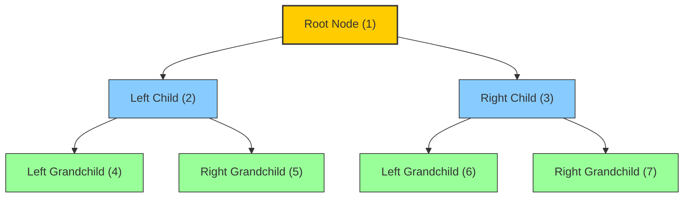
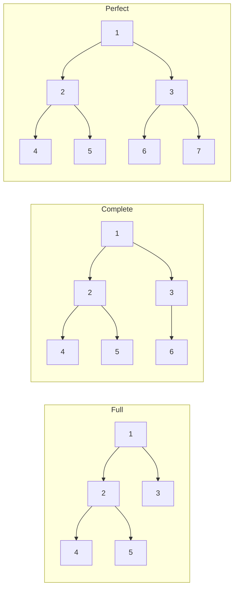
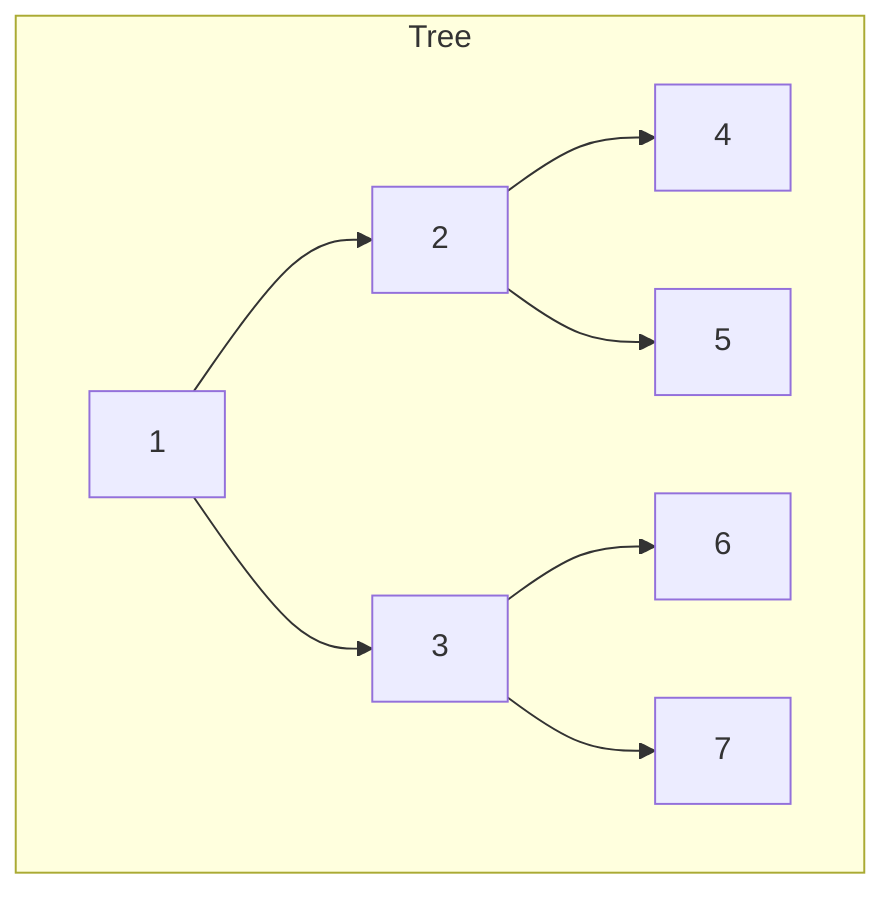
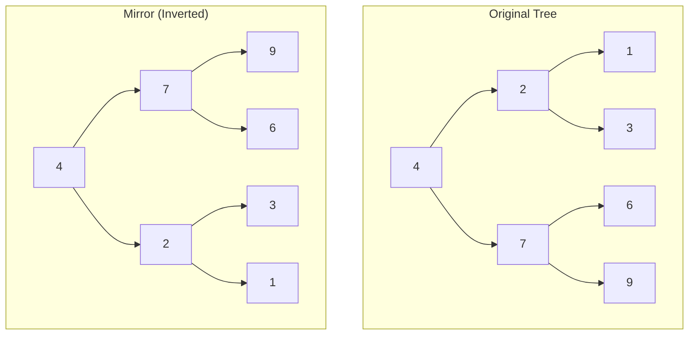
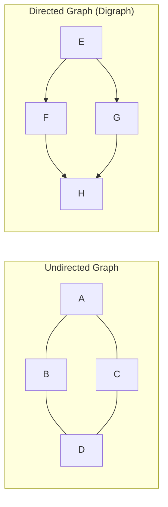
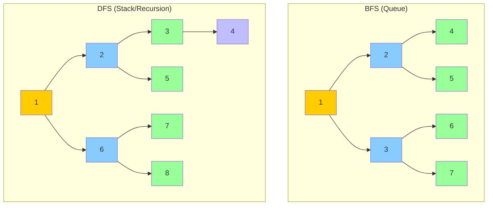
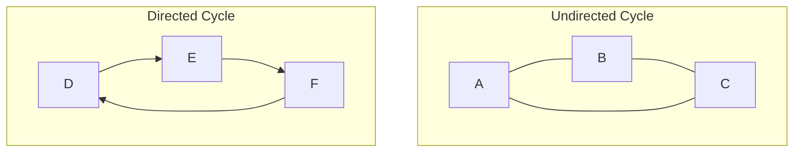
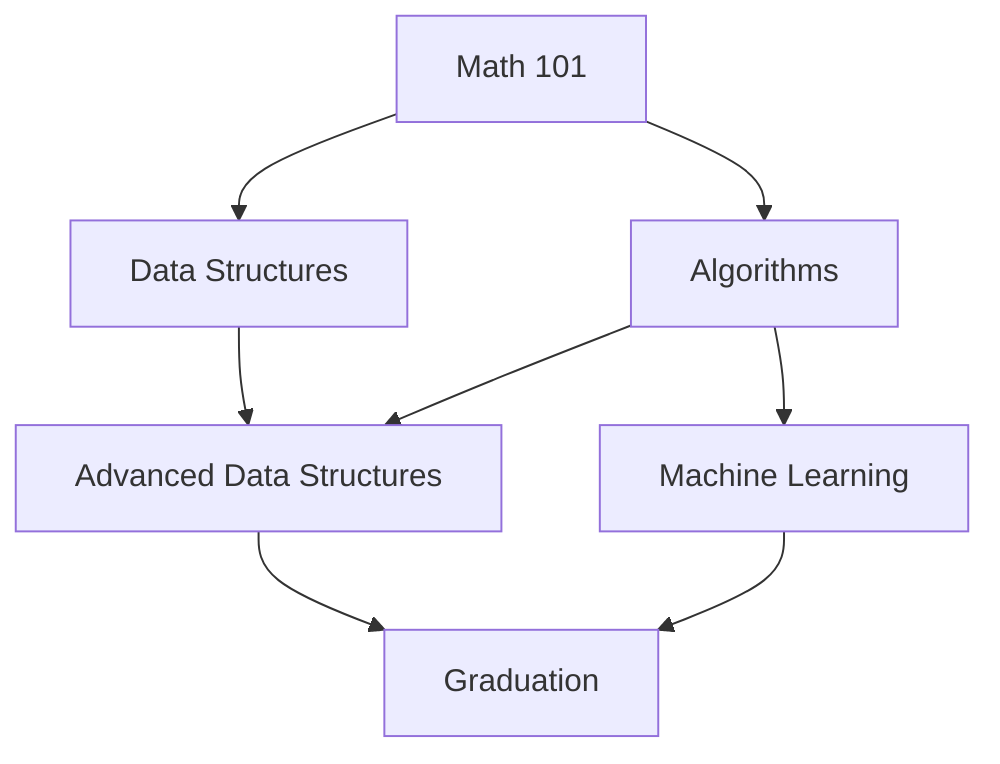

# Week 3 — Trees & Graphs

> **Target:** Tree aur Graph ke concepts master karo — recursion, DFS, BFS ki muscle memory banao.
> **Audience:** Laravel/PHP developer → AI Engineer transition kar raha hai.
> **Voice:** Hinglish — understanding matters, not language.

---

## 📅 5-Day Breakdown

| Day | Topic | Problems | Est. Time |
|-----|-------|----------|-----------|
| **Day 1** | Tree Fundamentals & Traversals | Invert, Max Depth, Same Tree, Level Order | 3-4 hr |
| **Day 2** | BST & Advanced Trees | Validate BST, Kth Smallest, LCA, Right Side View, Construct Tree | 3-4 hr |
| **Day 3** | Graph Fundamentals & BFS/DFS | Clone Graph, Number of Islands | 3-4 hr |
| **Day 4** | Graph Advanced | Cycle Detection, Topological Sort, Course Schedule | 3-4 hr |
| **Day 5** | Graph Applications & Recap | Pacific Atlantic, Word Ladder, Connected Components | 3-4 hr |

---

## 🌳 Day 1: Tree Fundamentals & Traversals

### Binary Tree Terminology

PHP developer ho toh aap associative arrays ke hierarchy se familiar ho. Tree bhi waisa hi hai — but structured.



| Term | Definition | PHP Analogy |
|------|-----------|-------------|
| **Node** | Tree ka basic unit — `{val, left, right}` | Object ya associative array |
| **Root** | Sabse upar wala node (parent = null) | `$tree['root']` |
| **Parent** | Jiske directly children ho | `$array['key']` containing sub-array |
| **Child** | Parent ke directly neeche wala node | Sub-array element |
| **Leaf** | Jiske koi children nahi | Leaf = `null` children |
| **Subtree** | Kisi node se lekar uske saare descendents | Nested array poora |
| **Depth** | Root se node tak ka distance (root = 0) | Kitni nesting levels neeche |
| **Height** | Node se deepest leaf tak ka distance | Max nesting depth neeche |

### Types of Binary Trees — Interview Mein Kaam Aayenge



1. **Full Binary Tree:** Har node ke 0 ya 2 children. Exactly.
2. **Complete Binary Tree:** Last level ko chhodkar saare levels filled. Last level left-to-right filled.
3. **Perfect Binary Tree:** Saare internal nodes ke 2 children, saare leaves same level. Height `h` → `2^(h+1) - 1` nodes.
4. **Skewed Tree:** Saare nodes ek hi side (left ya right). Degenerate — effectively a linked list.
5. **BST (Binary Search Tree):** `left < node <= right` — sorted inorder traversal deta hai.

> **Pattern Recognition Check:** BST problems mein hamesha property check karo — inorder sorted hota hai. Agar sorted nahi, toh BST nahi hai.

### TreeNode Class — Python Representation

```python
class TreeNode:
    """Binary tree ka node. Python mein class-based representation.
    
    PHP mein aap aisa karte:
    $node = ['val' => 1, 'left' => null, 'right' => null];
    Lekin Python mein proper object-oriented approach:
    """
    def __init__(self, val: int = 0, left: 'TreeNode | None' = None, right: 'TreeNode | None' = None):
        self.val = val
        self.left = left
        self.right = right
```

**PHP dev tip:** Python mein `null` ko `None` likhte hain. Type hints mein `|` ka matlab hai "ya" — `TreeNode | None` = "TreeNode object ya None". PHP 8.1 ke union types jaisa: `TreeNode|null`.

### Tree Banane Ka Tareeka

```python
# Level by level tree banana
root = TreeNode(1)
root.left = TreeNode(2)
root.right = TreeNode(3)
root.left.left = TreeNode(4)
root.left.right = TreeNode(5)
root.right.left = TreeNode(6)
root.right.right = TreeNode(7)

# Represent karta hai:
#        1
#      /   \
#     2     3
#    / \   / \
#   4   5 6   7
```

### Tree Traversals — 4 Mukhya Styles



| Traversal | Order | Trace | Use Case |
|-----------|-------|-------|----------|
| **Preorder** | Root → Left → Right | `1, 2, 4, 5, 3, 6, 7` | Tree copy, serialization |
| **Inorder** | Left → Root → Right | `4, 2, 5, 1, 6, 3, 7` | BST sorted order |
| **Postorder** | Left → Right → Root | `4, 5, 2, 6, 7, 3, 1` | Tree delete, bottom-up DP |
| **Level Order** | Level by level (BFS) | `[1], [2,3], [4,5,6,7]` | Shortest path, right side view |

#### Preorder Traversal (Root → Left → Right)

```python
# Preorder ka concept: Pehle parent process karo, phir left, phir right.
# Depth-First Search (DFS) ki ek variant hai.

def preorder_recursive(root: TreeNode | None) -> list[int]:
    """Recursive preorder. Base case: null → empty list."""
    if not root:
        return []
    # Root → Left → Right
    return [root.val] + preorder_recursive(root.left) + preorder_recursive(root.right)

def preorder_iterative(root: TreeNode | None) -> list[int]:
    """Iterative preorder — explicit stack use karta hai.
    
    PHP mein recursion depth limited hoti hai. Python mein bhi recursion ka stack
    overflow ho sakta hai (sys.setrecursionlimit). Iterative approaches zyada safe hain.
    """
    if not root:
        return []
    result = []
    stack = [root]  # Stack LIFO hai — pehle right push karo, phir left
    while stack:
        node = stack.pop()
        result.append(node.val)
        if node.right:
            stack.append(node.right)  # Right pehle push → left later pop hoga
        if node.left:
            stack.append(node.left)
    return result
```

**Trace — Preorder on [1,2,3,4,5,null,null]:**

| Step | Stack (top→bottom) | Result | Action |
|------|--------------------|--------|--------|
| 1 | `[1]` | `[]` | Push root |
| 2 | `[]` | `[1]` | Pop 1, push right(3), push left(2) |
| 3 | `[3, 2]` → pop 2 | `[1, 2]` | Pop 2, push right(5), push left(4) |
| 4 | `[3, 5, 4]` → pop 4 | `[1, 2, 4]` | Pop 4 (leaf), no children |
| 5 | `[3, 5]` → pop 5 | `[1, 2, 4, 5]` | Pop 5 (leaf) |
| 6 | `[3]` → pop 3 | `[1, 2, 4, 5, 3]` | Pop 3, children null |
| Done | Empty | `[1,2,4,5,3]` | ✅ |

#### Inorder Traversal (Left → Root → Right)

```python
def inorder_recursive(root: TreeNode | None) -> list[int]:
    if not root:
        return []
    return inorder_recursive(root.left) + [root.val] + inorder_recursive(root.right)

def inorder_iterative(root: TreeNode | None) -> list[int]:
    """Iterative inorder — BST problems mein most useful.
    
    Yeh pattern Kth Smallest, Validate BST mein kaam aata hai.
    """
    result = []
    stack = []
    curr = root
    while stack or curr:
        # Leftmost tak chale jao, saare intermediate nodes stack mein daalte hue
        while curr:
            stack.append(curr)
            curr = curr.left
        # Ab stack se pop karo — yeh current node hai
        curr = stack.pop()
        result.append(curr.val)
        # Right subtree explore karo
        curr = curr.right
    return result
```

**Dry Run — Inorder on [1,2,3,4,5]:**

```
Tree:
    1
   / \
  2   3
 / \
4   5

Step 1: stack=[], curr=1
  → push 1, curr=2
  → push 2, curr=4
  → push 4, curr=None
Step 2: pop 4, result=[4], curr=None(4.right)
Step 3: pop 2, result=[4,2], curr=5
  → push 5, curr=None
Step 4: pop 5, result=[4,2,5], curr=None
Step 5: pop 1, result=[4,2,5,1], curr=3
  → push 3, curr=None
Step 6: pop 3, result=[4,2,5,1,3], curr=None
Done → [4,2,5,1,3] ✅
```

#### Postorder Traversal (Left → Right → Root)

```python
def postorder_recursive(root: TreeNode | None) -> list[int]:
    if not root:
        return []
    return postorder_recursive(root.left) + postorder_recursive(root.right) + [root.val]
```

---

### Problem 1: Invert Binary Tree (LeetCode 226 — Easy)

> **Problem:** Binary tree ka mirror image banao. Har node ke left-right children swap kar do.

**Theory Behind It:**
Yeh problem recursion ka "Hello World" hai. Har node par jaao, uske left-right swap karo, phir recursively children ko bhi swap karo. Base case: `null` node → return `null`.

Simple hai bhai. Google famously asked this, candidate couldn't solve it, and it became a meme. Ab har koi puchta hai.



**Approach 1 — Recursive (DFS):**
```python
def invert_tree(root: TreeNode | None) -> TreeNode | None:
    if not root:
        return None
    # Swap — Python mein elegant one-liner
    root.left, root.right = root.right, root.left
    # Recursively children ko bhi invert karo
    invert_tree(root.left)
    invert_tree(root.right)
    return root
```

**Approach 2 — Iterative (BFS using Queue):**
```python
from collections import deque

def invert_tree_bfs(root: TreeNode | None) -> TreeNode | None:
    if not root:
        return None
    queue = deque([root])
    while queue:
        node = queue.popleft()
        # Swap karo
        node.left, node.right = node.right, node.left
        if node.left:
            queue.append(node.left)
        if node.right:
            queue.append(node.right)
    return root
```

**Approach 3 — Iterative (DFS using Stack):**
```python
def invert_tree_stack(root: TreeNode | None) -> TreeNode | None:
    if not root:
        return None
    stack = [root]
    while stack:
        node = stack.pop()
        node.left, node.right = node.right, node.left
        if node.left:
            stack.append(node.left)
        if node.right:
            stack.append(node.right)
    return root
```

**Trace Table — Recursive version on [4,2,7,1,3,6,9]:**

| Step | Node | Before Swap (L, R) | After Swap (L, R) | Recursive Calls |
|------|------|---------------------|--------------------|-----------------|
| 1 | 4 | (2, 7) | (7, 2) | invert(7), invert(2) |
| 2 | 7 | (6, 9) | (9, 6) | invert(9), invert(6) |
| 3 | 9 | (null, null) | (null, null) | base case return |
| 4 | 6 | (null, null) | (null, null) | base case return |
| 5 | 2 | (1, 3) | (3, 1) | invert(3), invert(1) |
| 6 | 3 | (null, null) | (null, null) | base case return |
| 7 | 1 | (null, null) | (null, null) | base case return |

**Complexity:**
- **Time:** O(n) — har node exactly ek baar visit hota hai
- **Space:** O(h) — recursion call stack height h (worst O(n) for skewed tree)

**Pattern Recognition:**
> "Tree ka structure modify karna hai, har node par same operation → Recursion."
> Jab bhi tree ke saare nodes ko process karna ho and each node ka independent operation ho, recursion ka socho. Har recursive call ek smaller subproblem solve karta hai.

**LeetCode Practice Chain:**
- **226** Invert Binary Tree ← current
- 101 Symmetric Tree — mirror hain kya?
- 617 Merge Two Binary Trees — dono trees ko merge karo
- 951 Flip Equivalent Binary Trees — flips se same bana sakte hain kya?

---

### Problem 2: Maximum Depth of Binary Tree (LeetCode 104 — Easy)

> **Problem:** Tree ki maximum depth (root → farthest leaf tak ka distance) find karo.

**Multiple Approaches:**

**Approach 1 — Recursive (Divide and Conquer):**
```python
def max_depth(root: TreeNode | None) -> int:
    """Recursive approach. Base case: null → depth 0.
    Recursive case: 1 + max(left depth, right depth).
    
    Yeh sabse simple hai. PHP mein bhi aise hi karte.
    """
    if not root:
        return 0
    return 1 + max(max_depth(root.left), max_depth(root.right))
```

**Approach 2 — Iterative BFS (Level Order Counting):**
```python
from collections import deque

def max_depth_bfs(root: TreeNode | None) -> int:
    """BFS approach. Har level count karo.
    Jab tak queue empty nahi, depth++ karo.
    """
    if not root:
        return 0
    queue = deque([root])
    depth = 0
    while queue:
        depth += 1
        for _ in range(len(queue)):
            node = queue.popleft()
            if node.left:
                queue.append(node.left)
            if node.right:
                queue.append(node.right)
    return depth
```

**Approach 3 — Iterative DFS (Stack with depth tracking):**
```python
def max_depth_dfs(root: TreeNode | None) -> int:
    """Stack par (node, depth) store karo."""
    if not root:
        return 0
    stack = [(root, 1)]
    max_depth = 0
    while stack:
        node, depth = stack.pop()
        max_depth = max(max_depth, depth)
        if node.left:
            stack.append((node.left, depth + 1))
        if node.right:
            stack.append((node.right, depth + 1))
    return max_depth
```

**Trace Table — Recursive on [3,9,20,null,null,15,7]:**

```
Tree:
      3
     / \
    9   20
       /  \
      15   7
```

| Call Stack (depth) | Node | Left Recursion | Right Recursion | Return |
|---------------------|------|----------------|-----------------|--------|
| 1 | 3 | calls max_depth(9) | calls max_depth(20) | ? |
| 2 | 9 | calls max_depth(null) → 0 | calls max_depth(null) → 0 | 1 + max(0,0) = 1 |
| 2 | 20 | calls max_depth(15) | calls max_depth(7) | ? |
| 3 | 15 | 0 | 0 | 1 + 0 = 1 |
| 3 | 7 | 0 | 0 | 1 + 0 = 1 |
| 2 | 20 | 1 | 1 | 1 + max(1,1) = 2 |
| 1 | 3 | 1 | 2 | 1 + max(1,2) = 3 ✅ |

**Complexity:**
| Approach | Time | Space | Notes |
|----------|------|-------|-------|
| Recursive | O(n) | O(h) | Simple, risk of stack overflow for n=10000+ |
| BFS | O(n) | O(w) | Width w = max level size, safe for deep trees |
| DFS Stack | O(n) | O(n) | Explicit stack, better control |

**Pattern Recognition:**
> `1 + max(left, right)` — yeh template tree recursion ka foundation hai.
> Jab bhi koi property calculate karni ho jo child results par depend karti ho (depth, diameter, balance check), yehi pattern use karo.

**Variations:**
- Minimum Depth of Binary Tree (111): `1 + min(left, right)` BUT special case — agar node ka sirf ek child hai toh sirf us child ki depth consider karo
- Diameter of Binary Tree (543): `max(left_height + right_height)` across all nodes
- Balanced Binary Tree (110): Check `abs(left_height - right_height) <= 1` for all nodes

```python
# Minimum Depth — tricky version
def min_depth(root: TreeNode | None) -> int:
    if not root:
        return 0
    left = min_depth(root.left)
    right = min_depth(root.right)
    # Agar ek child null hai toh sirf doosre child ka depth consider karo
    if not root.left or not root.right:
        return 1 + max(left, right)
    return 1 + min(left, right)
```

---

### Problem 3: Same Tree (LeetCode 100 — Easy)

> **Problem:** Kya do trees p and q structurally identical hain (same values, same structure)?

**Theory:**
Yeh comparison problem hai. Agar dono null hain → True. Agar ek null, doosra nahi → False. Agar values match karti hain → recursively left aur right compare karo.

```python
def is_same_tree(p: TreeNode | None, q: TreeNode | None) -> bool:
    """Check if two binary trees are identical.
    
    Base cases:
    1. Dono null → same
    2. Ek null, ek nahi → not same
    3. Values different → not same
    
    Recursive case:
    Values same hai → check left subtrees AND right subtrees
    """
    if not p and not q:
        return True
    if not p or not q:
        return False
    return (p.val == q.val
            and is_same_tree(p.left, q.left)
            and is_same_tree(p.right, q.right))
```

**Trace Table — p = [1,2,3], q = [1,2,3]:**

| Step | p Node | q Node | p.val == q.val | is_same(p.left,q.left) | is_same(p.right,q.right) | Return |
|------|--------|--------|----------------|------------------------|-------------------------|--------|
| 1 | 1 | 1 | True | Call | Call | ? |
| 2 | 2 | 2 | True | null,null=True | null,null=True | True |
| 3 | 3 | 3 | True | null,null=True | null,null=True | True |
| Final | 1 | 1 | True | True | True | **True** ✅ |

**Trace Table — Failure: p = [1,2], q = [1,null,2]:**

```
p:
  1
 /
2

q:
  1
   \
    2
```

| Step | p Node | q Node | Check | Result |
|------|--------|--------|-------|--------|
| 1 | 1 | 1 | val same, check left | |
| 2 | 2 | null | p not null, q null | **False** ❌ |

**Complexity:**
- **Time:** O(min(n, m)) — smaller tree ke nodes visit karte hain
- **Space:** O(h) — recursion stack

**Pattern Recognition:**
> "Jab bhi do trees compare karne ho — same, subtree, symmetric — recursion + careful base cases."
> Yeh pattern tree comparison ka blueprint hai. Har recursive call do trees ke corresponding nodes compare karti hai.

**LeetCode Practice Chain:**
- **100** Same Tree ← current
- 101 Symmetric Tree — mirror comparison
- 572 Subtree of Another Tree — Same Tree ka use karta hai
- 951 Flip Equivalent Binary Trees

---

### Problem 4: Level Order Traversal (LeetCode 102 — Medium)

> **Problem:** Tree ko level by level traverse karo. Har level ka alag list return karo.

**Theory:**
Yeh BFS (Breadth-First Search) ka classic example hai. Queue use karo. Har iteration mein current level ke saare nodes ko process karo aur unke children ko next level ke liye enqueue karo.

```python
from collections import deque

def level_order(root: TreeNode | None) -> list[list[int]]:
    """Binary tree ka level order traversal.
    
    PHP mein array_shift use karte the O(n) mein.
    Python collections.deque popleft() O(1) deta hai.
    
    Template pattern for BFS:
    1. Queue mein root daalo
    2. Loop until queue empty
    3. Har level ke liye, level size nikalo
    4. Utne nodes process karo, children enqueue karo
    """
    if not root:
        return []
    
    result = []
    queue = deque([root])
    
    while queue:
        level_size = len(queue)  # Current level kitne nodes hain
        level = []
        
        for _ in range(level_size):
            node = queue.popleft()
            level.append(node.val)
            if node.left:
                queue.append(node.left)
            if node.right:
                queue.append(node.right)
        
        result.append(level)
    
    return result
```

**Dry Run — [3,9,20,null,null,15,7]:**

```
Tree:
      3
     / \
    9   20
       /  \
      15   7
```

| Iteration | Queue (front→back) | Level Size | Level Accumulator | Result After |
|-----------|--------------------|------------|-------------------|--------------|
| Start | `[3]` | — | — | `[]` |
| 1 | `[3]` | len=1 | pop 3 → [3], enqueue 9,20 | `[[3]]` |
| 2 | `[9,20]` | len=2 | pop 9 → [9], enqueue null,null | `[[3]]` |
| 2 cont | `[20]` | len=2 | pop 20 → [9,20], enqueue 15,7 | `[[3]]` |
| 3 | `[15,7]` | len=2 | pop 15 → [15], enqueue null,null | `[[3],[9,20]]` |
| 3 cont | `[7]` | len=2 | pop 7 → [15,7], enqueue null,null | `[[3],[9,20]]` |
| Done | `[]` | — | — | `[[3],[9,20],[15,7]]` ✅ |

**Complexity:**
- **Time:** O(n) — har node ek baar queue mein jaata hai
- **Space:** O(n) — result array store karta hai saare nodes, queue max width tak

**Pattern Recognition:**
> BFS pattern: `queue + while loop + level_size for loop`. Jab bhi "level by level", "nearest", "shortest" aaye — BFS socho.

**Variations (using same BFS template):**

```python
# 1. Reverse Level Order (107) — result.reverse() kar do

# 2. Zigzag Level Order (103) — level ko alternately reverse karo
def zigzag_level_order(root: TreeNode | None) -> list[list[int]]:
    if not root:
        return []
    result = []
    queue = deque([root])
    left_to_right = True
    while queue:
        level = []
        for _ in range(len(queue)):
            node = queue.popleft()
            level.append(node.val)
            if node.left: queue.append(node.left)
            if node.right: queue.append(node.right)
        if not left_to_right:
            level.reverse()
        result.append(level)
        left_to_right = not left_to_right
    return result

# 3. Average of Levels (637) — avg = sum(level) / len(level)
```

---

## 🌳 Day 2: BST & Advanced Trees

### Binary Search Tree Properties

BST ka matlab: har node ke left subtree mein saari values node se chhoti, right subtree mein saari badi.

```python
# BST Property formally:
# left.val < root.val < right.val (assuming no duplicates)
# Har subtree bhi BST hota hai (recursive definition)
```

```
        5
       / \
      3   8     ← BST: 3<5<8, 2<3<4, 6<8<10
     / \ / \
    2  4 6  10
```

**BST ka superpower:** Inorder traversal sorted order deta hai. Yeh fact bahut saari problems solve karta hai.

---

### Problem 5: Validate BST (LeetCode 98 — Medium)

> **Problem:** Kya yeh binary tree BST hai?

**The Trap:**
Sirf `left.val < root.val < right.val` check karna kaafi nahi. Yeh ghalati bahut log karte hain.

```
    5
   / \
  1   6
     / \
    3   7    ← 3 < 5 hone chahiye but right subtree mein hai!
```

Is tree mein `5` ke right subtree mein `3` hai jo `5` se chhota hai — but `3`, `6` ke left mein sahi hai. Problem? `3 < 5` actually invalid hai BST ke liye.

**Solution — Range Propagation:**

```python
def is_valid_bst(root: TreeNode | None) -> bool:
    """Validate BST using min/max bounds.
    
    Har node ka ek valid range hota hai.
    Root ka range: (-inf, +inf)
    Left child: (-inf, parent.val)
    Right child: (parent.val, +inf)
    
    PHP mein aise checks if-else se karte, Python mein helper function
    ke saath nested function use kar rahe hain.
    """
    def validate(node: TreeNode | None, low: float, high: float) -> bool:
        if not node:
            return True
        if node.val <= low or node.val >= high:
            return False
        return (validate(node.left, low, node.val) and
                validate(node.right, node.val, high))
    
    return validate(root, float('-inf'), float('inf'))
```

**Approach 2 — Inorder Traversal (Elegant):**
```python
def is_valid_bst_inorder(root: TreeNode | None) -> bool:
    """BST ka inorder sorted hota hai.
    Iterative inorder karte hue check karo ki previous < current.
    """
    stack = []
    prev = float('-inf')
    curr = root
    
    while stack or curr:
        while curr:
            stack.append(curr)
            curr = curr.left  # Leftmost tak jao
        curr = stack.pop()
        # Check karo ki inorder sorted hai ya nahi
        if curr.val <= prev:
            return False
        prev = curr.val
        curr = curr.right
    
    return True
```

**Trace — Failure Case: [5,1,4,null,null,3,6]:**

```
Tree:
      5
     / \
    1   4
       / \
      3   6
```

**Range validation trace:**

| Node | Expected Range | Actual Val | Valid? |
|------|---------------|------------|--------|
| 5 | (-inf, +inf) | 5 | ✅ |
| 1 | (-inf, 5) | 1 | ✅ |
| 4 | (5, +inf) | 4 | ❌ 4 ≯ 5 |

**Inorder trace:**
| Step | Node | prev | curr.val | curr > prev? |
|------|------|------|----------|--------------|
| Process leftmost | 1 | -inf | 1 | ✅ |
| Process root | 5 | 1 | 5 | ✅ |
| Process 4's left | 3 | 5 | 3 | ❌ 3 < 5 |

**Complexity:**
- **Time:** O(n) — all nodes
- **Space:** O(h) — recursion/stack

**Pattern Recognition:**
> "BST validation = range propagation. Har node ka acceptable range fix hota hai."
> Ya yaad rakho: "BST inorder sorted hota hai" — agar sorted nahi hai toh BST nahi hai.

**LeetCode Practice:**
- **98** Validate BST
- 501 Find Mode in BST
- 530 Minimum Absolute Difference in BST
- 173 BST Iterator — inorder ka hi use karta hai

---

### Problem 6: Kth Smallest Element in BST (LeetCode 230 — Medium)

> **Problem:** BST mein kth smallest element dhundho. k = 1 means smallest element.

**Theory:** BST ka inorder sorted hota hai. Toh kth inorder element = kth smallest. Simple!

**Approach 1 — Recursive Inorder (Collect all):**
```python
def kth_smallest_recursive(root: TreeNode | None, k: int) -> int:
    def inorder(node: TreeNode | None) -> list[int]:
        if not node:
            return []
        return inorder(node.left) + [node.val] + inorder(node.right)
    return inorder(root)[k - 1]
```
Simple hai, par O(n) space. Itna problem nahi agar n chhota hai lekin large inputs ke liye optimize karna padega.

**Approach 2 — Iterative Inorder (Early Termination):**
```python
def kth_smallest(root: TreeNode | None, k: int) -> int:
    """Iterative inorder with early stop.
    
    Jaise hi k decrement hote hote 0 hota hai, return kar do.
    Code copy mat karo — logic samjho.
    
    Inorder ka pattern: left → node → right
    Iterative version: leftmost jao, stack mein push karte jao
    """
    stack = []
    curr = root
    
    while stack or curr:
        # Leftmost tak jao
        while curr:
            stack.append(curr)
            curr = curr.left
        
        curr = stack.pop()
        k -= 1
        if k == 0:
            return curr.val  # kth element mil gaya
        
        curr = curr.right  # Right subtree check
    
    return -1  # Shouldn't reach here for valid k
```

**Dry Run — [3,1,4,null,2], k=2:**
```
Tree:
    3
   / \
  1   4
   \
    2
```

| Step | Stack | curr | k (after decrement) | Action |
|------|-------|------|---------------------|--------|
| 1 | [] | 3 | — | push 3, curr=1 |
| 2 | [3] | 1 | — | push 1, curr=None |
| 3 | [3,1] | None | — | exit inner while |
| 4 | [3,1] | pop=1 | k=2→1 | curr=2 |
| 5 | [3] | 2 | — | push 2, curr=None |
| 6 | [3,2] | None | — | exit inner while |
| 7 | [3] | pop=2 | k=1→0 | **return 2** ✅ |

**Complexity:**
- **Time:** O(H + k) — H = tree height, k = target rank
- **Space:** O(H) — stack

**Pattern Recognition:**
> "BST mein smallest/largest element = inorder reverse-inorder."
> BST ka sorted order property use karo. Inorder = sorted. Reverse inorder = reverse sorted.

**Variation — Kth Largest:**
```python
def kth_largest(root: TreeNode | None, k: int) -> int:
    """Kth largest = reverse inorder (right → node → left)."""
    stack = []
    curr = root
    while stack or curr:
        while curr:
            stack.append(curr)
            curr = curr.right  # Right pehle!
        curr = stack.pop()
        k -= 1
        if k == 0:
            return curr.val
        curr = curr.left
    return -1
```

---

### Problem 7: Lowest Common Ancestor (LeetCode 235/236 — Medium)

> **Problem:** Do nodes ka lowest common ancestor dhundho. LCA = deepest node jo p aur q dono ka ancestor ho.

**BST Case (235):**
```python
def lowest_common_ancestor_bst(root: TreeNode, p: TreeNode, q: TreeNode) -> TreeNode:
    """BST property use karo.
    
    Agar dono values root se chhoti hain → LCA left mein hai
    Agar dono values root se badi hain → LCA right mein hai
    Agar split ho raha hai (ek left, ek right) → root hi LCA hai
    """
    curr = root
    while curr:
        if p.val < curr.val and q.val < curr.val:
            curr = curr.left  # Dono left mein hain
        elif p.val > curr.val and q.val > curr.val:
            curr = curr.right  # Dono right mein hain
        else:
            return curr  # Split point — yehi LCA hai
    
    return None
```

**General Binary Tree Case (236 — Not BST):**
```python
def lowest_common_ancestor(root: TreeNode | None, p: TreeNode, q: TreeNode) -> TreeNode | None:
    """General binary tree mein LCA find karo.
    
    Approach:
    1. Agar current root p ya q hai → root return karo
    2. Left subtree mein search karo
    3. Right subtree mein search karo
    4. Agar dono sides mein mila → yehi LCA hai
    5. Agar ek side mein mila → wahi LCA hai
    
    Yeh postorder traversal ka variation hai — pehle children, phir parent.
    """
    if not root or root == p or root == q:
        return root
    
    left = lowest_common_ancestor(root.left, p, q)
    right = lowest_common_ancestor(root.right, p, q)
    
    # Agar left mein p mila aur right mein q mila (ya vice versa)
    if left and right:
        return root  # Current node LCA hai
    
    # Dono same subtree mein hain
    return left if left else right
```

**Trace — [3,5,1,6,2,0,8,null,null,7,4], p=5, q=1:**
```
Tree:
      3
     / \
    5   1
   / \ / \
  6  2 0  8
    / \
   7   4

We need LCA of node 5 and node 1.
```

| Call | Root | Left Result | Right Result | Return |
|------|------|-------------|--------------|--------|
| LCA(3) | 3 | LCA(5) | LCA(1) | ? |
| LCA(5) | 5 | LCA(6) | LCA(2) | ? |
| LCA(6) | 6 | None | None | None |
| LCA(2) | 2 | LCA(7)=None | LCA(4)=None | None |
| LCA(5) | 5 | None | None | **5** (root == p) |
| LCA(1) | 1 | LCA(0)=None | LCA(8)=None | **1** (root == q) |
| LCA(3) | 3 | 5 | 1 | **3** (left && right) ✅ |

**Complexity:**
- **Time:** O(n) — worst case saare nodes visit kar sakte hain
- **Space:** O(h) — recursion stack

**Pattern Recognition:**
> "LCA ka pattern: postorder traversal + condition check. Children ko pehle dekho, phir parent decide karo."
> Yeh problem trees mein "bottom-up" approach ka best example hai.

---

### Problem 8: Binary Tree Right Side View (LeetCode 199 — Medium)

> **Problem:** Right se dekhne par tree kaise dikhega? Har level ka rightmost node return karo.

Already covered — BFS variant. But yahan do approaches:

**Approach 1 — BFS (Level Order Variant):**
```python
from collections import deque

def right_side_view_bfs(root: TreeNode | None) -> list[int]:
    if not root:
        return []
    result = []
    queue = deque([root])
    while queue:
        level_len = len(queue)
        for i in range(level_len):
            node = queue.popleft()
            if i == level_len - 1:  # Rightmost node on this level
                result.append(node.val)
            if node.left:
                queue.append(node.left)
            if node.right:
                queue.append(node.right)
    return result
```

**Approach 2 — DFS (Recursive — Preorder with Right priority):**
```python
def right_side_view_dfs(root: TreeNode | None) -> list[int]:
    """DFS approach. Pehle right subtree process karo.
    
    Har level par, pehla node jo hum dekhte hain woh rightmost hoga.
    """
    result = []
    
    def dfs(node: TreeNode | None, level: int) -> None:
        if not node:
            return
        # First time visiting this level → add to result
        if level == len(result):
            result.append(node.val)
        # Right subtree pehle (reverse preorder)
        dfs(node.right, level + 1)
        dfs(node.left, level + 1)
    
    dfs(root, 0)
    return result
```

**Pattern Recognition:**
> "Right side view = BFS ke har level ka last element. Ya DFS with right-first priority."
> BFS approach zyada intuitive hai, DFS approach space-efficient hai.

---

### Problem 9: Construct Binary Tree from Preorder and Inorder (LeetCode 105 — Medium)

> **Problem:** Preorder aur inorder traversal arrays diye hain. Original tree construct karo.

**Theory — The Key Insight:**
```
Preorder:  [3, 9, 20, 15, 7]   → Root = first element = 3
Inorder:   [9, 3, 15, 20, 7]   → Left of 3 = {9}, Right of 3 = {15, 20, 7}

Recursively:
- Preorder left part: [9]
- Inorder left part: [9]
  → Left subtree: root=9

- Preorder right part: [20, 15, 7]
- Inorder right part: [15, 20, 7]
  → Right subtree root = 20
  → Inorder mein 20 ke left = {15}, right = {7}
  → Recurse...
```

```python
def build_tree(preorder: list[int], inorder: list[int]) -> TreeNode | None:
    """Construct tree from preorder + inorder.
    
    Kaam kaise karta hai:
    1. Preorder ka pehla element root hai
    2. Inorder mein root ka index find karo
    3. Inorder mein root ke left = left subtree
    4. Inorder mein root ke right = right subtree
    5. Preorder mein corresponding left and right parts nikalo
    6. Recursively build karo
    
    Optimization: Inorder ka index map bana lo O(1) lookup ke liye.
    """
    if not preorder or not inorder:
        return None
    
    # Map value → index for O(1) lookup (PHP array_flip jaisa)
    idx_map = {val: idx for idx, val in enumerate(inorder)}
    
    def helper(pre_start: int, pre_end: int, in_start: int, in_end: int) -> TreeNode | None:
        if pre_start > pre_end:
            return None
        
        # Preorder ka pehla element = current root
        root_val = preorder[pre_start]
        root = TreeNode(root_val)
        
        # Inorder mein root ka index find karo
        in_idx = idx_map[root_val]
        left_size = in_idx - in_start  # Left subtree kitne nodes ka
        
        # Left subtree banane ke liye preorder aur inorder ke slice
        root.left = helper(
            pre_start + 1, pre_start + left_size,
            in_start, in_idx - 1
        )
        root.right = helper(
            pre_start + left_size + 1, pre_end,
            in_idx + 1, in_end
        )
        
        return root
    
    return helper(0, len(preorder) - 1, 0, len(inorder) - 1)
```

**Dry Run — preorder=[3,9,20,15,7], inorder=[9,3,15,20,7]:**

| Call | pre_start:pre_end | in_start:in_end | root_val | in_idx | left_size | Left Recursion | Right Recursion |
|------|-------------------|-----------------|----------|--------|-----------|----------------|-----------------|
| 1 | 0:4 | 0:4 | 3 | 1 | 1 | helper(1,1,0,0) | helper(2,4,2,4) |
| 2 | 1:1 | 0:0 | 9 | 0 | 0 | helper(2,1,...)=None | helper(2,1,...)=None |
| 3 | 2:4 | 2:4 | 20 | 3 | 1 | helper(3,3,2,2) | helper(4,4,4,4) |
| 4 | 3:3 | 2:2 | 15 | 2 | 0 | None | None |
| 5 | 4:4 | 4:4 | 7 | 4 | 0 | None | None |

**Result tree:**
```
    3
   / \
  9   20
     /  \
    15   7
```

**Complexity:**
- **Time:** O(n) — har node ek baar
- **Space:** O(n) — map + recursion stack

**Pattern Recognition:**
> "Construct tree from traversals = find root in preorder, split inorder by root, recurse."
> Three combinations work: (preorder + inorder), (inorder + postorder), (preorder + postorder for full tree).

**LeetCode Practice:**
- 105 Construct from Preorder + Inorder
- 106 Construct from Inorder + Postorder
- 889 Construct from Preorder + Postorder

---

### Day 2 Mini Exercises

```
1. Given: preorder=[1,2,4,5,3,6,7], inorder=[4,2,5,1,6,3,7]
   → Construct tree and verify by level order

2. Kya [5,1,7,null,null,6,8] valid BST hai?
   → Range check karo

3. BST ka inorder [1,2,3,4,5,6,7] diya hai, k different BSTs possible hain?
   → Hint: Catalan numbers

4. Kth smallest BST ka reverse karo → Kth largest
```

---

## 🌐 Day 3: Graph Fundamentals & BFS/DFS

### Graph Terminology

Graph = Vertices (nodes) + Edges (connections).

PHP developer ho toh Social Media ka friendship model socho (users = vertices, friendships = edges).



| Term | Definition | Example |
|------|-----------|---------|
| **Vertex (Node)** | Graph ka basic unit | User, city, web page |
| **Edge** | Do vertices ke beech connection | Friendship, road, hyperlink |
| **Directed** | Edge ka direction hota hai (→) | Twitter follow |
| **Undirected** | Edge bidirectional hota hai (—) | Facebook friend |
| **Weighted** | Edge ka cost hota hai | Distance, time |
| **Path** | Vertices ka sequence connected by edges | A→B→C |
| **Cycle** | Path jiska start = end | A→B→C→A |
| **Connected** | Har path of vertices ka path exists | One component |
| **Degree** | Ek vertex se kitni edges connected hain | Followers count |

### Graph Representations

**1. Adjacency Matrix:**
```python
# O(1) edge lookup, but O(V²) space
# PHP mein 2D array, Python mein list of lists

graph = [
    [0, 1, 1, 0],  # Node 0 connected to 1, 2
    [1, 0, 0, 1],  # Node 1 connected to 0, 3
    [1, 0, 0, 1],  # Node 2 connected to 0, 3
    [0, 1, 1, 0],  # Node 3 connected to 1, 2
]

# Edge check: graph[u][v] == 1 means edge exists
# Space: O(V²) — 1000 nodes = 1M entries
```
**Use when:** Graph small hai (V < 1000) ya dense hai (edges ≈ V²).

**2. Adjacency List (Most Common — Use This):**
```python
# O(V + E) space. Most efficient for sparse graphs.
# PHP mein: $graph[$node] = [$neighbor1, $neighbor2]
# Python mein:

graph = {
    0: [1, 2],
    1: [0, 3],
    2: [0, 3],
    3: [1, 2],
}

# Edge check: graph[u] list mein v hai kya? O(degree(u))
# Use set for O(1) lookup:
graph = {
    0: {1, 2},
    1: {0, 3},
    2: {0, 3},
    3: {1, 2},
}
```
**Use when:** Graph bada hai (V up to 10⁵) ya sparse hai.

**3. Edge List:**
```python
# PHP mein: [[u, v], [u, w]]
edges = [(0, 1), (0, 2), (1, 3), (2, 3)]
```
**Use when:** Kruskal's algorithm ya sorting edges needed ho.

### Graph Traversal: BFS vs DFS



| Feature | BFS | DFS |
|---------|-----|-----|
| Data Structure | Queue | Stack (or recursion) |
| Order | Level by level | Depth first |
| Use Case | Shortest path (unweighted) | Path existence, connected components |
| Space | O(width) — can be large | O(depth) — usually smaller |
| Detection | Connected components | Cycles, topological sort |

### BFS Template (Graph)

```python
from collections import deque

def bfs_graph(graph: dict, start: int) -> list[int]:
    """Graph BFS — array/level par nahi, poora graph explore karta hai.
    
    Important: Graph mein cycles ho sakte hain, isliye visited set zaroori hai.
    Tree mein visited ki zaroorat nahi kyunki cycles nahi hote.
    """
    visited = {start}
    queue = deque([start])
    result = []
    
    while queue:
        node = queue.popleft()
        result.append(node)
        
        for neighbor in graph[node]:
            if neighbor not in visited:
                visited.add(neighbor)
                queue.append(neighbor)
    
    return result

# Usage:
# graph = {0: [1,2], 1: [0,3], 2: [0,3], 3: [1,2]}
# bfs_graph(graph, 0) → [0, 1, 2, 3]
```

### DFS Template (Graph)

```python
def dfs_graph_recursive(graph: dict, start: int, visited: set | None = None) -> list[int]:
    """Graph DFS — recursive version.
    
    Recursion stack = implicit DFS stack.
    """
    if visited is None:
        visited = set()
    
    visited.add(start)
    result = [start]
    
    for neighbor in graph[start]:
        if neighbor not in visited:
            result.extend(dfs_graph_recursive(graph, neighbor, visited))
    
    return result

def dfs_graph_iterative(graph: dict, start: int) -> list[int]:
    """Graph DFS — iterative with explicit stack."""
    visited = {start}
    stack = [start]
    result = []
    
    while stack:
        node = stack.pop()
        result.append(node)
        for neighbor in graph[node]:
            if neighbor not in visited:
                visited.add(neighbor)
                stack.append(neighbor)
    
    return result
```

> **Critical Difference from Tree:** Graph traversal mein `visited` set mandatory hai. Tree mein cycles nahi hote, graph mein hote hain. Agar visited na lagao toh infinite loop mein phans jaoge.

---

### Problem 10: Number of Islands (LeetCode 200 — Medium)

> **Problem:** 2D grid mein 1s (land) ke connected components count karo. 0 = water, 1 = land.

**Visual:**
```
Input:
1 1 0 0 0
1 1 0 0 0
0 0 1 0 0
0 0 0 1 1

Output: 3 (three islands)
```

**Theory:**
Yeh graph problem hai hidden graph ke saath. Har `1` ek vertex hai, adjacent (up/down/left/right) `1`s edges hain. Count = connected components.

**Approach 1 — DFS (Sink and Count):**
```python
def num_islands(grid: list[list[str]]) -> int:
    """Count number of islands using DFS.
    
    Approach: 'Sink and count' — jahan 1 mile, us island ko DFS se
    pura sink kar do (0 bana do), counter++.
    
    PHP mein array of strings hota, Python mein list of lists.
    """
    if not grid:
        return 0
    
    rows, cols = len(grid), len(grid[0])
    islands = 0
    
    def dfs(r: int, c: int) -> None:
        """DFS se poora island explore karo aur sink karo."""
        if r < 0 or r >= rows or c < 0 or c >= cols or grid[r][c] == '0':
            return
        
        # Current cell ko sink karo (visited mark)
        grid[r][c] = '0'
        
        # 4 directions mein explore karo
        dfs(r - 1, c)  # up
        dfs(r + 1, c)  # down
        dfs(r, c - 1)  # left
        dfs(r, c + 1)  # right
    
    for r in range(rows):
        for c in range(cols):
            if grid[r][c] == '1':
                islands += 1
                dfs(r, c)  # Pura island sink
    
    return islands
```

**Approach 2 — BFS:**
```python
from collections import deque

def num_islands_bfs(grid: list[list[str]]) -> int:
    if not grid:
        return 0
    
    rows, cols = len(grid), len(grid[0])
    islands = 0
    directions = [(-1, 0), (1, 0), (0, -1), (0, 1)]  # up, down, left, right
    
    def bfs(r: int, c: int) -> None:
        queue = deque([(r, c)])
        grid[r][c] = '0'  # Mark visited before enqueuing
        
        while queue:
            cr, cc = queue.popleft()
            for dr, dc in directions:
                nr, nc = cr + dr, cc + dc
                if 0 <= nr < rows and 0 <= nc < cols and grid[nr][nc] == '1':
                    grid[nr][nc] = '0'
                    queue.append((nr, nc))
    
    for r in range(rows):
        for c in range(cols):
            if grid[r][c] == '1':
                islands += 1
                bfs(r, c)
    
    return islands
```

**Dry Run — Grid:**
```
[
  ["1","1","0"],
  ["1","1","0"],
  ["0","0","1"]
]
```

| r,c | grid[r][c] | Action | islands |
|-----|-----------|--------|---------|
| 0,0 | '1' | DFS starts → sink (0,0)→(0,1)→(1,0)→(1,1) | 1 |
| 0,1 | '0' (sunk) | Skip | 1 |
| 0,2 | '0' | Skip | 1 |
| 1,0 | '0' (sunk) | Skip | 1 |
| 1,1 | '0' (sunk) | Skip | 1 |
| 1,2 | '0' | Skip | 1 |
| 2,0 | '0' | Skip | 1 |
| 2,1 | '0' | Skip | 1 |
| 2,2 | '1' | DFS sinks (2,2) | **2** ✅ |

**Complexity:**
- **Time:** O(R × C) — har cell ek baar visit
- **Space:** O(R × C) — worst case recursion stack = all cells (grid of all 1s)

**Pattern Recognition:**
> "Connected components count karne ho grid mein → DFS/BFS with 'sink' pattern."
> 2D grid ko graph treat karo. Har cell ek node hai. Adjacent cells edges hain.

**LeetCode Practice:**
- **200** Number of Islands
- 695 Max Area of Island — same pattern, size bhi count karo
- 463 Island Perimeter — different approach, DP style
- 130 Surrounded Regions — boundary se approach karo
- 994 Rotting Oranges — multi-source BFS

---

### Problem 11: Clone Graph (LeetCode 133 — Medium)

> **Problem:** Graph ka deep copy banao. Har node ko hashmap mein map karo (original → clone).

```python
# Definition for a Node.
class Node:
    def __init__(self, val: int = 0, neighbors: list['Node'] | None = None):
        self.val = val
        self.neighbors = neighbors if neighbors is not None else []

def clone_graph(node: Node | None) -> Node | None:
    """Graph ka deep copy. Hashmap mein mapping rakho.
    
    Important: Agar ek node recursively doosri node ko point kare (cycle),
    toh infinite loop se bachne ke liye clone_map check karte raho.
    """
    if not node:
        return None
    
    clone_map = {}  # Original → Clone mapping
    
    def dfs(original: Node) -> Node:
        """DFS traversal with memoization (visited check via clone_map)."""
        if original in clone_map:
            return clone_map[original]  # Already cloned
        
        # Clone this node (without neighbors first)
        clone = Node(original.val)
        clone_map[original] = clone
        
        # Recursively clone and add neighbors
        for neighbor in original.neighbors:
            clone.neighbors.append(dfs(neighbor))
        
        return clone
    
    return dfs(node)
```

**Pattern Recognition:**
> "Clone/copy with references → HashMap mapping old→new. Cycle handle karna = already mapped check."
> BFS version bhi ho sakta hai: queue mein original daalo, clone_map maintain karo.

---

### Day 3 Mini Exercises

```
1. Given adjacency list, BFS karo from node 0. Sequence likho.
2. 2D grid mein max area island find karo (LeetCode 695).
3. Clone graph ka BFS version likho.
4. Rotting Oranges — why multi-source BFS?
```

---

## 🌐 Day 4: Graph Advanced — Cycle Detection & Topological Sort

### Cycle Detection in Graph



**Why Detect Cycles?**
- Course scheduling: Prerequisites mein cycle hai = impossible to complete
- Deadlock detection: Operating systems mein resource allocation graphs
- Dependency resolution: Package managers check for circular dependencies

### Detect Cycle in Undirected Graph

**Approach — DFS with Parent:**
```python
def has_cycle_undirected(graph: dict[int, list[int]]) -> bool:
    """Undirected graph mein cycle detect karo.
    
    Logic: DFS karte hue agar already visited neighbor mile
    jo parent nahi hai → cycle hai!
    """
    visited = set()
    
    def dfs(node: int, parent: int) -> bool:
        visited.add(node)
        for neighbor in graph[node]:
            if neighbor not in visited:
                if dfs(neighbor, node):
                    return True
            elif neighbor != parent:
                # Visited neighbor jo parent nahi hai = cycle
                return True
        return False
    
    for node in graph:
        if node not in visited:
            if dfs(node, -1):
                return True
    
    return False

# Example:
# 1---2
# |   |
# 4---3
# Graph: {1:[2,4], 2:[1,3], 3:[2,4], 4:[1,3]}
# DFS(1): visit 1, visit 2, visit 3, neighbor 2 visited but 2 is parent → ok
#         neighbor 4 visited but 4 != parent(2) → CYCLE! ✅
```

### Detect Cycle in Directed Graph

**Approach — Three Colors (DFS with visiting/visited states):**
```python
def has_cycle_directed(graph: dict[int, list[int]]) -> bool:
    """Directed graph mein cycle detect karo.
    
    3 states use karte hain:
    0 = WHITE (unvisited)
    1 = GRAY (visiting — current recursion stack mein hai)
    2 = BLACK (fully visited)
    
    Agar GRAY node phir mile → back edge → cycle!
    """
    WHITE, GRAY, BLACK = 0, 1, 2
    color = {node: WHITE for node in graph}
    
    def dfs(node: int) -> bool:
        if color[node] == GRAY:
            return True  # Back edge = cycle
        if color[node] == BLACK:
            return False  # Already processed
        
        color[node] = GRAY  # Mark as being processed
        
        for neighbor in graph.get(node, []):
            if dfs(neighbor):
                return True
        
        color[node] = BLACK  # Done processing
        return False
    
    for node in graph:
        if color[node] == WHITE:
            if dfs(node):
                return True
    
    return False

# Example:
# 1 → 2 → 3
#     ↑    |
#     |____↓   (3 → 2)
# Graph: {1:[2], 2:[3], 3:[2]}
# DFS(1): color[1]=GRAY, visit 2
#   DFS(2): color[2]=GRAY, visit 3
#     DFS(3): color[3]=GRAY, neighbor=2, color[2]=GRAY → CYCLE! ✅
```

### Topological Sort

Topological sort = DAG (Directed Acyclic Graph) ke nodes ko order karna jahan har edge u→v ke liye, u, v se pehle aata hai.



Possible topological order: [Math 101, Data Structures, Algorithms, Advanced DS, ML, Graduation]

**Approach 1 — Kahn's Algorithm (BFS-based):**
```python
from collections import deque

def topological_sort_kahn(graph: dict[int, list[int]]) -> list[int]:
    """Topological sort using Kahn's Algorithm (BFS).
    
    Logic:
    1. Har node ka indegree count karo
    2. Indegree 0 wale nodes queue mein daalo
    3. Queue se nikaalte jao, neighbors ka indegree ghatate jao
    4. Agar indegree 0 ho → queue mein daalo
    5. Result length = total nodes → DAG hai
    
    Real-world analogy: Course prerequisites fulfill karna.
    """
    # Indegree calculate karo
    indegree = {node: 0 for node in graph}
    for node in graph:
        for neighbor in graph[node]:
            indegree[neighbor] = indegree.get(neighbor, 0) + 1
    
    # Queue mein indegree 0 wale nodes
    queue = deque([node for node, deg in indegree.items() if deg == 0])
    result = []
    
    while queue:
        node = queue.popleft()
        result.append(node)
        
        for neighbor in graph.get(node, []):
            indegree[neighbor] -= 1
            if indegree[neighbor] == 0:
                queue.append(neighbor)
    
    # Cycle check: agar graph mein cycle hai toh saare nodes process nahi honge
    if len(result) != len(graph):
        return []  # Cycle exists
    
    return result
```

**Approach 2 — DFS-based:**
```python
def topological_sort_dfs(graph: dict[int, list[int]]) -> list[int]:
    """DFS-based topological sort.
    
    Logic: Postorder traversal — children process karo, phir parent add karo.
    Reverse karo final result.
    """
    visited = set()
    result = []
    
    def dfs(node: int) -> None:
        visited.add(node)
        for neighbor in graph.get(node, []):
            if neighbor not in visited:
                dfs(neighbor)
        result.append(node)  # Postorder: children ke baad parent
    
    for node in graph:
        if node not in visited:
            dfs(node)
    
    return result[::-1]  # Reverse for topological order

# Actual use-case: Course Schedule II problem
```

**Kahn's vs DFS Topological Sort:**

| Aspect | Kahn's (BFS) | DFS |
|--------|-------------|-----|
| Detection | Easy — result length check | Need 3-color for cycle detection |
| Order | Builds naturally | Need reverse at end |
| Space | O(V) for queue + indegree | O(V) for recursion |
| Intuition | "Remove nodes with no dependencies" | "Process children before parent" |

---

### Problem 12: Course Schedule (LeetCode 207 — Medium)

> **Problem:** Total n courses hain. Prerequisites diye hain [[1,0] means course 1 requires course 0]. Kya saare courses complete kar sakte hain? (Cycle check)

```python
def can_finish(num_courses: int, prerequisites: list[list[int]]) -> bool:
    """Can we finish all courses? = DAG hai ya nahi.
    
    Yeh Number of Islands ke baad graph ka doosra most important problem hai.
    Prerequisites ko adjacency list mein convert karo, phir cycle check karo.
    """
    # Build adjacency list — PHP mein foreach se karte
    graph = {i: [] for i in range(num_courses)}
    for dst, src in prerequisites:
        graph[src].append(dst)
    
    # Kahn's Algorithm (BFS)
    indegree = [0] * num_courses
    for dst, _ in prerequisites:
        indegree[dst] += 1
    
    queue = deque([i for i in range(num_courses) if indegree[i] == 0])
    count = 0
    
    while queue:
        node = queue.popleft()
        count += 1
        for neighbor in graph[node]:
            indegree[neighbor] -= 1
            if indegree[neighbor] == 0:
                queue.append(neighbor)
    
    return count == num_courses  # True = no cycle
```

### Problem 13: Course Schedule II (LeetCode 210 — Medium)

> **Problem:** Course Schedule I jaisa, lekin order bhi return karo. Topological sort ka actual order.

```python
def find_order(num_courses: int, prerequisites: list[list[int]]) -> list[int]:
    """Return order of courses to take.
    
    Kahn's se hi karo — queue se jis order mein nikalte hain wohi order hai.
    """
    graph = {i: [] for i in range(num_courses)}
    indegree = [0] * num_courses
    
    for dst, src in prerequisites:
        graph[src].append(dst)
        indegree[dst] += 1
    
    queue = deque([i for i in range(num_courses) if indegree[i] == 0])
    order = []
    
    while queue:
        node = queue.popleft()
        order.append(node)
        for neighbor in graph[node]:
            indegree[neighbor] -= 1
            if indegree[neighbor] == 0:
                queue.append(neighbor)
    
    return order if len(order) == num_courses else []
```

**Dry Run — n=4, prerequisites=[[1,0],[2,0],[3,1],[3,2]]:**
```
Graph: 0 → {1, 2}, 1 → {3}, 2 → {3}, 3 → {}
```

| Step | Queue | Processed Node | Indegree (after processing) | Order |
|------|-------|---------------|-----------------------------|-------|
| Init | [0] | — | indeg[1]=1, indeg[2]=1, indeg[3]=2 | [] |
| 1 | [1, 2] | 0 | indeg[1]=0, indeg[2]=0 | [0] |
| 2 | [2, 1] | 1 (either order) | indeg[3]=1 | [0, 1] |
| 3 | [2, 3] | 2 | indeg[3]=0 | [0, 1, 2] |
| 4 | [3] | 3 | — | [0, 1, 2, 3] |

Valid order: [0, 1, 2, 3] or [0, 2, 1, 3] ✅

**Pattern Recognition:**
> "Prerequisites / dependencies → Graph + Topological Sort / Cycle Detection."
> Kahn's algorithm ko yaad rakhne ka shortcut: indegree array, queue of zeros, decrement neighbors.

**LeetCode Practice:**
- **207** Course Schedule
- **210** Course Schedule II  
- 269 Alien Dictionary (harder topological sort)
- 802 Find Eventual Safe States (reverse topological sort)

---

### Day 4 Mini Exercises

```
1. Given directed edges: [(0,1),(1,2),(2,0)], cycle detect karo using 3-color
2. n=5, prereqs=[[1,0],[2,1],[3,2],[4,3]] → topological order nikalo
3. Alien Dictionary problem: words = ["wrt","wrf","er","ett","rftt"]
   → Character order kya hai?
4. When does Kahn's algorithm fail? → cycle ke case mein
```

---

## 🌐 Day 5: Graph Applications & Recap

### Problem 14: Pacific Atlantic Water Flow (LeetCode 417 — Medium)

> **Problem:** Grid ka har cell elevation represent karta hai. Pani Pacific (top+left borders) aur Atlantic (bottom+right borders) mein flow kar sakta hai. Dono oceans mein reach karne wale cells find karo.

```python
def pacific_atlantic(heights: list[list[int]]) -> list[list[int]]:
    """Water flow problem — reverse thinking.
    
    Instead of finding cells that reach both oceans,
    start from each ocean and find cells reachable from it.
    Common cells = answer.
    
    Pani low → high nahi, high → low flow karta hai.
    Reverse BFS: ocean se start karo aur uphill jao.
    
    Border se flood fill — jahan tak ja sakta hai, mark karo.
    """
    if not heights:
        return []
    
    rows, cols = len(heights), len(heights[0])
    pacific_reach = [[False] * cols for _ in range(rows)]
    atlantic_reach = [[False] * cols for _ in range(rows)]
    directions = [(-1, 0), (1, 0), (0, -1), (0, 1)]
    
    def bfs(ocean_reach: list[list[bool]], starts: list[tuple[int, int]]) -> None:
        queue = deque(starts)
        for r, c in starts:
            ocean_reach[r][c] = True
        
        while queue:
            r, c = queue.popleft()
            for dr, dc in directions:
                nr, nc = r + dr, c + dc
                if (0 <= nr < rows and 0 <= nc < cols 
                    and not ocean_reach[nr][nc]
                    and heights[nr][nc] >= heights[r][c]):  # Uphill!
                    ocean_reach[nr][nc] = True
                    queue.append((nr, nc))
    
    # Pacific = top edge (row=0) + left edge (col=0)
    pacific_starts = [(0, c) for c in range(cols)] + [(r, 0) for r in range(rows)]
    # Atlantic = bottom edge + right edge
    atlantic_starts = [(rows-1, c) for c in range(cols)] + [(r, cols-1) for r in range(rows)]
    
    bfs(pacific_reach, pacific_starts)
    bfs(atlantic_reach, atlantic_starts)
    
    result = []
    for r in range(rows):
        for c in range(cols):
            if pacific_reach[r][c] and atlantic_reach[r][c]:
                result.append([r, c])
    
    return result
```

**Pattern Recognition:**
> "Boundary se reachable cells → Multi-source BFS / Reverse thinking."
> Jab "reach karta hai" type problem ho toh source se target nahi socho. Target se reverse mein socho.

### Problem 15: Word Ladder (LeetCode 127 — Hard)

> **Problem:** beginWord se endWord tak shortest transformation sequence find karo. Har step mein ek letter change kar sakte hain, aur har intermediate word wordList mein hona chahiye.

Shortest path in unweighted graph → BFS!

```python
from collections import deque

def ladder_length(begin_word: str, end_word: str, word_list: list[str]) -> int:
    """Word ladder — shortest transformation sequence.
    
    Graph: Har word ek node hai. Edge exists if words differ by 1 letter.
    Shortest path from beginWord to endWord → BFS.
    
    Optimization: Agar har word pair check karo toh O(N² * L) ho jayega.
    Better approach: Har word ke liye, har letter ko '*' se replace karo.
    Pattern matching se neighbors efficiently find karo.
    """
    if end_word not in word_list:
        return 0
    
    # Build pattern dictionary: wordList ke saare words ka "*ord" pattern
    # Pattern: "h*t" → ["hot"], "dog" → ["dog"]
    L = len(begin_word)
    all_combo = {}
    for word in word_list:
        for i in range(L):
            pattern = word[:i] + '*' + word[i+1:]
            if pattern not in all_combo:
                all_combo[pattern] = []
            all_combo[pattern].append(word)
    
    queue = deque([(begin_word, 1)])
    visited = {begin_word}
    
    while queue:
        current, level = queue.popleft()
        
        for i in range(L):
            pattern = current[:i] + '*' + current[i+1:]
            for neighbor in all_combo.get(pattern, []):
                if neighbor == end_word:
                    return level + 1
                if neighbor not in visited:
                    visited.add(neighbor)
                    queue.append((neighbor, level + 1))
    
    return 0
```

### Problem 16: Graph Valid Tree (LeetCode 261 — Medium)

> **Problem:** N nodes (0 to n-1) aur edges diye hain. Kya yeh graph ek valid tree hai? (Connected + no cycles)

```python
def valid_tree(n: int, edges: list[list[int]]) -> bool:
    """A valid tree has:
    1. Exactly n-1 edges
    2. All nodes connected (1 connected component)
    3. No cycles
    
    Condition 1 ke baad just check connectivity.
    """
    if len(edges) != n - 1:
        return False
    
    # Build adjacency list
    graph = {i: [] for i in range(n)}
    for u, v in edges:
        graph[u].append(v)
        graph[v].append(u)
    
    # DFS to count connected nodes
    visited = set()
    
    def dfs(node: int) -> None:
        visited.add(node)
        for neighbor in graph[node]:
            if neighbor not in visited:
                dfs(neighbor)
    
    dfs(0)
    
    return len(visited) == n
```

### Problem 17: Number of Connected Components in Graph (LeetCode 323 — Medium)

> **Problem:** Graph mein kitne connected components hain?

```python
def count_components(n: int, edges: list[list[int]]) -> int:
    """Count connected components using DFS.
    
    Number of Islands jaisa hi hai, par 2D grid ke bajaye
    adjacency list use karte hain.
    """
    graph = {i: [] for i in range(n)}
    for u, v in edges:
        graph[u].append(v)
        graph[v].append(u)
    
    visited = set()
    components = 0
    
    def dfs(node: int) -> None:
        visited.add(node)
        for neighbor in graph[node]:
            if neighbor not in visited:
                dfs(neighbor)
    
    for node in range(n):
        if node not in visited:
            components += 1
            dfs(node)
    
    return components
```

---

## 📊 Pattern Recognition — Week 3 Summary

### Tree Pattern Cheat Sheet

| Pattern | When to Use | Template | Example Problems |
|---------|------------|----------|------------------|
| **1 + max(left, right)** | Depth, height, diameter | `return 1 + max(f(left), f(right))` | Max Depth, Diameter, Balance Check |
| **Root+Left+Right Preorder** | Copy, serialize, export | `[root] + f(left) + f(right)` | Invert Tree, Clone Tree |
| **Left+Root+Right Inorder** | BST problems | `f(left) + [root] + f(right)` | Validate BST, Kth Smallest |
| **Range Propagation** | BST validation | `validate(node, low, high)` | Validate BST |
| **BFS Level Order** | Level, proximity | Queue + level_size for loop | Right Side View, Zigzag, Level Order |
| **Postorder LCA** | Bottom-up, parent depends on children | `left = f(node.left); right = f(node.right)` | LCA, Diameter |

### Graph Pattern Cheat Sheet

| Pattern | When to Use | Data Structure | Example |
|---------|------------|---------------|---------|
| **BFS** | Shortest path (unweighted) | Queue + visited | Word Ladder, Min distance |
| **DFS** | Path existence, enumeration | Stack/Recursion + visited | Number of Islands, Clone Graph |
| **Multi-source BFS** | All from boundary | Multiple starts in queue | Pacific Atlantic, Rotten Oranges |
| **Sink & Count** | Count connected components in grid | DFS/BFS, mark visited by modifying | Number of Islands |
| **Kahn's Algorithm** | Topological sort | Indegree array + queue | Course Schedule, Alien Dict |
| **Three-Color DFS** | Cycle detection in directed graph | WHITE/GRAY/BLACK | Course Schedule (alt approach) |
| **Reverse Thinking** | Flow/Reach problems | Start from target, reverse conditions | Pacific Atlantic |
| **Parent Check** | Cycle detection in undirected | DFS with parent param | Graph Valid Tree |

---

## 💪 LeetCode Practice — Week 3 Recommendations

### Must-Do (Foundation)

| # | Problem | Difficulty | Pattern | Est. Time |
|---|---------|------------|---------|-----------|
| 226 | Invert Binary Tree | Easy | Recursive swap | 10 min |
| 104 | Maximum Depth | Easy | 1+max(left, right) | 5 min |
| 100 | Same Tree | Easy | Recursive compare | 10 min |
| 102 | Level Order Traversal | Medium | BFS queue | 15 min |
| 98 | Validate BST | Medium | Range propagation | 20 min |
| 230 | Kth Smallest in BST | Medium | Inorder iteration | 15 min |
| 235 | LCA of BST | Medium | BST property | 10 min |
| 236 | LCA of Binary Tree | Medium | Postorder DFS | 20 min |
| 199 | Right Side View | Medium | BFS level | 15 min |

### Should-Do (Intermediate)

| # | Problem | Difficulty | Pattern | Est. Time |
|---|---------|------------|---------|-----------|
| 200 | Number of Islands | Medium | Grid DFS/BFS | 20 min |
| 133 | Clone Graph | Medium | HashMap + DFS | 20 min |
| 207 | Course Schedule | Medium | Topological sort | 25 min |
| 210 | Course Schedule II | Medium | Topological order | 25 min |
| 105 | Construct Tree from Pre+In | Medium | Divide & Conquer | 25 min |
| 417 | Pacific Atlantic Water | Medium | Reverse BFS | 30 min |

### Nice-to-Do (Advanced)

| # | Problem | Difficulty | Pattern | Est. Time |
|---|---------|------------|---------|-----------|
| 127 | Word Ladder | Hard | BFS + patterns | 40 min |
| 261 | Graph Valid Tree | Medium | Cycle + connectivity | 20 min |
| 323 | Connected Components | Medium | DFS count | 15 min |
| 269 | Alien Dictionary | Hard | Topological sort | 45 min |
| 297 | Serialize/Deserialize | Hard | Preorder + queue | 40 min |

---

## 🎯 Week 3 Targets

- [ ] Tree recursion pattern — `1 + max(left, right)` samajh aa gaya
- [ ] Inorder traversal iterative — Kth Smallest ka pattern
- [ ] BST validation — range propagation approach
- [ ] LCA — postorder pattern (left and right dono non-None → root)
- [ ] BFS template — queue + level_size for loop
- [ ] Graph adjacency list representation
- [ ] DFS with visited set (graph mein mandatory!)
- [ ] Cycle detection — parent check (undirected), 3-color (directed)
- [ ] Kahn's algorithm — indegree array + queue
- [ ] Reverse thinking — Pacific Atlantic water flow pattern

**Week 3 Mastery:** Tree recursion → Graph traversal → Topological sorting — yeh pattern AI Engineering mein graph-based RAG, dependency graphs, aur knowledge representation mein kaam aayenge. 🚀
