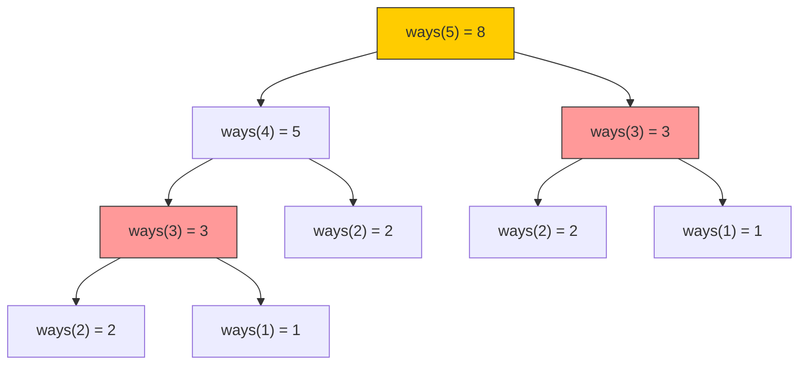
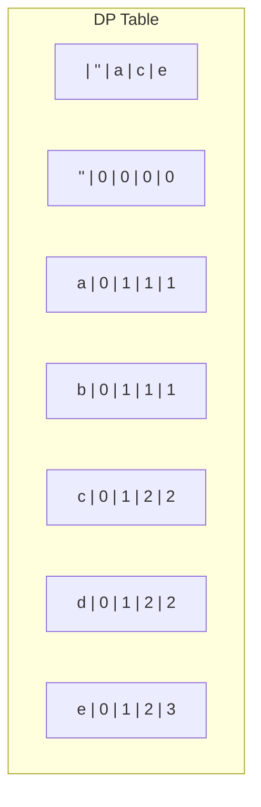
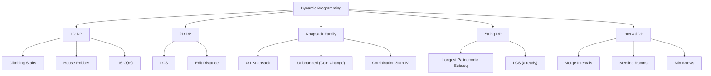

# Week 4 — Dynamic Programming & Interval Problems

> **Target:** DP (Dynamic Programming) ki solid foundation banao — overlapping subproblems, optimal substructure, memoization vs tabulation. Phir interval problems mein sorting-based greedy patterns master karo.
> **Audience:** Laravel/PHP developer → AI Engineer transition.
> **Voice:** Hinglish — concepts pe focus, language secondary.

---

## 📅 5-Day Breakdown

| Day | Topic | Problems | Est. Time |
|-----|-------|----------|-----------|
| **Day 1** | DP Fundamentals & 1D DP | Climbing Stairs, Min Cost, House Robber | 3-4 hr |
| **Day 2** | Classic DP — 2D & Knapsack | Coin Change, LIS, 0/1 Knapsack, Edit Distance | 3-4 hr |
| **Day 3** | Interval Problems I | Merge Intervals, Non-overlapping, Meeting Rooms | 3-4 hr |
| **Day 4** | Interval Problems II & String DP | Insert Interval, Longest Common Subsequence, Palindromes | 3-4 hr |
| **Day 5** | DP Pattern Recognition & Revision | Categories, Patterns, Mock problems | 3-4 hr |

---

## 🧠 Day 1: DP Fundamentals & 1D DP

### What is Dynamic Programming?

**Definition:** DP = Recursion + Memoization (ya Tabulation). Mathematically: Optimal substructure + Overlapping subproblems.

**Bade aadmi ka definition:** "A problem that can be broken into overlapping subproblems, and the optimal solution of the original problem can be constructed from optimal solutions of its subproblems."

**PHP Developer ke liye:** Yaad rakho jab aap Laravel mein caching use karte ho — expensive computation ka result store karte ho, baar baar compute nahi karte. DP bhi yahi hai. Computation cache karo.

### When to Use DP? — The Checklist

```
□ Optimal problem hai? (minimum, maximum, longest, shortest)
□ Decision problem hai? (true/false with constraints)
□ Counting problem hai? (kitne ways mein possible hai)
□ Subproblems repeat ho rahe hain? (overlapping)
□ Subproblem ka solution final answer build karta hai? (optimal substructure)
```

Agar 3+ boxes check hain, DP lagao.

### DP Approaches: Top-Down vs Bottom-Up

**Top-Down (Memoization):**
- Recursion + cache
- PHP mein aap associative array as cache use karte
- Python mein `@lru_cache` ya dict
- Intuitive — directly recurrence relation follow karta hai
- Risk: recursion stack overflow

```python
# Top-Down template
from functools import lru_cache

@lru_cache(maxsize=None)
def dp(state_params):
    if base_case:
        return base_value
    # compute using dp(subproblems)
    return answer
```

**Bottom-Up (Tabulation):**
- Iterative loop + table
- PHP developer ke liye: for loop ke saath array
- Safe — no recursion
- Usually more efficient
- Tricky — order of iteration chahiye

```python
# Bottom-Up template
dp = [base_value] * (n + 1)
for i in range(1, n + 1):
    dp[i] = compute_from(dp[i-1], dp[i-2])
return dp[n]
```

### Problem 1: Climbing Stairs (LeetCode 70 — Easy)

> **Problem:** n steps hain. Har baar 1 ya 2 steps climb kar sakte ho. Kitne distinct ways hain top tak pahunchne ke?

**Brute Force — Pure Recursion:**
```python
def climb_stairs_brute_force(n: int) -> int:
    """Recursive approach — Fibonacci jaisa.
    
    n=5 ke liye call tree:
    
    climb(5)
    ├── climb(4)
    │   ├── climb(3)
    │   │   ├── climb(2)
    │   │   └── climb(1)
    │   └── climb(2)
    └── climb(3)
        ├── climb(2)
        └── climb(1)
    """
    if n <= 2:
        return n  # n=1 → 1 way, n=2 → 2 ways
    return climb_stairs_brute_force(n - 1) + climb_stairs_brute_force(n - 2)

# Time: O(2ⁿ) — exponential! n=45 tak bhi nahi chalega
```

**Step Back — Recurrence Relation Samjho:**
```
nth step tak pahunchne ke do tareeke hain:
1. (n-1)th step se 1 step le kar
2. (n-2)th step se 2 steps le kar

Isliye: ways(n) = ways(n-1) + ways(n-2)

Base cases:
ways(1) = 1
ways(2) = 2
```



Deer wholein: `ways(3)` do baar compute ho raha hai! Yeh overlapping subproblems hain. DP yahi solve karti hai.

**Approach 1 — Top-Down (Memoization):**
```python
def climb_stairs_memo(n: int) -> int:
    """Top-down DP: Recursion + memoization.
    
    Pehle brute force wale recursive calls mein hi cache add kar do.
    Agar subproblem already solved hai toh cache se utha lo.
    
    PHP mein: $memo = []; if (isset($memo[$n])) return $memo[$n];
    """
    memo = {}
    
    def dp(k: int) -> int:
        if k <= 2:
            return k
        if k not in memo:
            memo[k] = dp(k - 1) + dp(k - 2)
        return memo[k]
    
    return dp(n)

# Time: O(n) — har n ek baar compute hota hai
# Space: O(n) — memo cache + recursion stack
```

**Approach 2 — Bottom-Up (Tabulation):**
```python
def climb_stairs_tab(n: int) -> int:
    """Bottom-up DP: Table fill karo from base case to n.
    
    Yeh iterative approach hai — loop chalega n tak.
    dp[i] = i steps ke liye distinct ways
    
    PHP developer analogy: foreach loop se array build karna.
    """
    if n <= 2:
        return n
    
    dp = [0] * (n + 1)
    dp[1] = 1
    dp[2] = 2
    
    for i in range(3, n + 1):
        dp[i] = dp[i - 1] + dp[i - 2]
    
    return dp[n]

# Time: O(n)
# Space: O(n)
```

**Approach 3 — Space-Optimized (Fibonacci Style):**
```python
def climb_stairs_optimized(n: int) -> int:
    """Space optimized — sirf do variables ka track rakhna hai.
    
    dp[i] = dp[i-1] + dp[i-2]
    Sirf pichle do values chahiye.
    
    PHP mein aisa: $prev2 = 1; $prev1 = 2;
    """
    if n <= 2:
        return n
    
    prev2, prev1 = 1, 2  # dp[1], dp[2]
    
    for _ in range(3, n + 1):
        current = prev1 + prev2
        prev2 = prev1
        prev1 = current
    
    return prev1

# Time: O(n)
# Space: O(1) — sirf do variables!
```

**Trace Table — n=5 (Space-Optimized):**

| i | prev2 (dp[i-2]) | prev1 (dp[i-1]) | current (dp[i]) |
|---|-----------------|-----------------|-----------------|
| 3 | 1 | 2 | 1+2=3 |
| 4 | 2 | 3 | 2+3=5 |
| 5 | 3 | 5 | 3+5=8 ✅ |

**Complexity Summary:**

| Approach | Time | Space | Notes |
|----------|------|-------|-------|
| Brute Recursion | O(2ⁿ) | O(n) | Exponential — useless for n>35 |
| Top-Down Memo | O(n) | O(n) | Intuitive, risk of recursion limit |
| Bottom-Up Tab | O(n) | O(n) | Safe, uses array |
| Space-Optimized | O(n) | O(1) | Best — interview mein yeh dikhao! |

**Pattern Recognition:**
> "nth thing count karna hai, har step fixed options hain → DP with Fibonacci pattern."
> Climbing Stairs ka pattern recognize karo: `dp[i] = sum(dp[i - options])`. Yahan options = [1, 2].
> Agar options [1, 3, 5] hote toh `dp[i] = dp[i-1] + dp[i-3] + dp[i-5]`.

**LeetCode Practice:**
- **70** Climbing Stairs ← current
- 746 Min Cost Climbing Stairs — cost array add karo
- 509 Fibonacci Number — exactly same pattern
- 1137 Tribonacci — three terms instead of two

---

### Problem 2: Min Cost Climbing Stairs (LeetCode 746 — Easy)

> **Problem:** Array `cost` diya hai. Har step par ek cost hai. Tum step 0 ya 1 se start kar sakte ho. Har baar 1 ya 2 steps climb kar sakte ho. Top tak pahunchne ka minimum cost kya hai?

```python
def min_cost_climbing_stairs(cost: list[int]) -> int:
    """Minimum cost to reach top of stairs.
    
    Recurrence: minCost[i] = cost[i] + min(minCost[i-1], minCost[i-2])
    Answer: min(minCost[n-1], minCost[n-2]) — top se ek step upar pahunchne ke liye
    
    Think: Har step par cost pay karte ho, phir 1 ya 2 steps badte ho.
    """
    n = len(cost)
    
    if n <= 1:
        return 0
    
    prev2, prev1 = cost[0], cost[1]
    
    for i in range(2, n):
        current = cost[i] + min(prev1, prev2)
        prev2 = prev1
        prev1 = current
    
    return min(prev1, prev2)

# Trace: cost = [10, 15, 20]
# i=2: current = 20 + min(15, 10) = 30
# return min(30, 20) = 20 ✅
# Path: Start at index 1 (pay 15) → climb 2 steps to top (no more cost)
```

---

### Problem 3: House Robber (LeetCode 198 — Medium)

> **Problem:** Houses array, har house mein paisa hai. Adjacent houses nahi rob kar sakte. Maximum amount rob karo.

**Theory:** Classic DP — decision problem. Har house par do choices hain:
1. Is house ko rob karo → paisa + (i-2) ka max
2. Skip karo → (i-1) ka max

```
dp[i] = max(dp[i-1], nums[i] + dp[i-2])
```

```python
def rob(nums: list[int]) -> int:
    """Maximum money without robbing adjacent houses.
    
    Yeh pattern recognize karo: har decision do pichle states par depend karta hai.
    House Robber → Climbing Stairs ka cousin hai.
    
    DP variant: dp[i] = max state after considering house i.
    """
    if not nums:
        return 0
    if len(nums) == 1:
        return nums[0]
    
    prev2 = nums[0]           # dp[0]
    prev1 = max(nums[0], nums[1])  # dp[1]
    
    for i in range(2, len(nums)):
        current = max(prev1, nums[i] + prev2)
        prev2 = prev1
        prev1 = current
    
    return prev1

# Trace: nums = [2, 7, 9, 3, 1]
# i=2: current = max(7, 9+2=11) = 11, prev2=7, prev1=11
# i=3: current = max(11, 3+7=10) = 11, prev2=11, prev1=11
# i=4: current = max(11, 1+11=12) = 12, prev2=11, prev1=12
# Return 12 ✅ (Rob 2 + 9 + 1 = 12)

# Path explanation: House 0(2) + House 2(9) + House 4(1) = 12
```

**Detailed Decision Table — nums = [2, 7, 9, 3, 1]:**

| House | Value | Rob? | If Rob = value + prev2 | If Skip = prev1 | dp[i] |
|-------|-------|------|------------------------|-----------------|-------|
| 0 | 2 | Yes | — | — | 2 |
| 1 | 7 | Yes | — | — | max(2,7)=7 |
| 2 | 9 | Yes | 9+2=11 | 7 | 11 |
| 3 | 3 | No | 3+7=10 | 11 | 11 |
| 4 | 1 | Yes | 1+11=12 | 11 | 12 |

**Pattern Recognition:**
> "Array mein se elements select karne hain, adjacent allowed nahi → DP with decision at each index."
> House Robber pattern ka template: `dp[i] = max(dp[i-1], nums[i] + dp[i-2])`.
> Yeh palindrome, subsequence, aur bahut saari problems ka base hai.

**Variations:**
- House Robber II (213) — houses circular hain → do baar rob karo (0 se n-2, 1 se n-1)
- House Robber III (337) — binary tree mein rob karo → tree DP!

```python
# House Robber II — Circular
def rob_circular(nums: list[int]) -> int:
    if len(nums) == 1:
        return nums[0]
    # Either rob houses 0 to n-2 OR 1 to n-1
    return max(rob(nums[:-1]), rob(nums[1:]))
```

---

### Day 1 Mini Exercises

```
1. n=6 steps, 1 ya 2 steps → kitne ways? → Ways(6)
   Compute without code: ways(1)=1, w(2)=2, w(3)=3, w(4)=5, w(5)=8, w(6)=13
   Answer: 13

2. cost = [1,100,1,1,1,100,1,1,100,1] → min cost?
   Step through the DP array manually.

3. nums = [2,1,1,2] → Maximum rob value?
   Choices: (2+2)=4, (2+1)=3, (1+2)=3 → Answer: 4

4. Agar steps 1,2,3 ho sakte hain toh ways(n) = ?
   → dp[i] = dp[i-1] + dp[i-2] + dp[i-3]
```

---

## 🧠 Day 2: Classic DP — 2D & Knapsack

### Problem 4: Coin Change (LeetCode 322 — Medium)

> **Problem:** Coins ka array diya hai (infinite supply). Amount banao using minimum number of coins. Agar nahi bana sakte toh -1 return karo.

**Theory:** Unbounded Knapsack variant — har coin infinite baar use kar sakte hain.

```
coins = [1, 2, 5], amount = 11
Minimum coins: 5+5+1 = 3 coins
```

**Recurrence:**
```python
# dp[a] = minimum coins needed for amount a
dp[a] = min(dp[a - coin] + 1 for coin in coins if coin <= a)
# Base case: dp[0] = 0 (0 amount = 0 coins)
```

**Approach 1 — Top-Down (Memoization):**
```python
def coin_change(coins: list[int], amount: int) -> int:
    """Minimum coins to make amount.
    
    Recursive thinking: amount A ke liye, ek coin C choose karo.
    Baaki amount A-C ke liye recursively solve karo.
    Saare coins try karo, minimum le lo.
    """
    memo = {}
    
    def dp(remaining: int) -> int:
        if remaining == 0:
            return 0
        if remaining < 0:
            return float('inf')
        if remaining in memo:
            return memo[remaining]
        
        min_coins = float('inf')
        for coin in coins:
            result = dp(remaining - coin)
            if result != float('inf'):
                min_coins = min(min_coins, result + 1)
        
        memo[remaining] = min_coins
        return min_coins
    
    result = dp(amount)
    return -1 if result == float('inf') else result
```

**Approach 2 — Bottom-Up (Tabulation — Interview Favourite):**
```python
def coin_change_tab(coins: list[int], amount: int) -> int:
    """Coin change bottom-up. dp[i] = min coins for amount i.
    
    PHP mein array_fill se initialize karte, Python mein list comprehension.
    float('inf') ka use karte hain "unreachable" mark karne ke liye.
    
    Template: Unbounded Knapsack — inner loop coins pe iterate karo.
    """
    dp = [float('inf')] * (amount + 1)
    dp[0] = 0
    
    for a in range(1, amount + 1):
        for coin in coins:
            if coin <= a:
                dp[a] = min(dp[a], dp[a - coin] + 1)
    
    return -1 if dp[amount] == float('inf') else dp[amount]
```

**Trace Table — coins=[1,2,5], amount=11:**

| Amount | dp[a] (initial) | After coin=1 | After coin=2 | After coin=5 | dp[a] (final) |
|--------|-----------------|--------------|--------------|--------------|---------------|
| 0 | 0 | — | — | — | 0 |
| 1 | inf | dp[0]+1=1 | — | — | 1 |
| 2 | inf | dp[1]+1=2 | dp[0]+1=1 | — | 1 |
| 3 | inf | dp[2]+1=2 | dp[1]+1=2 | — | 2 |
| 4 | inf | dp[3]+1=3 | dp[2]+1=2 | — | 2 |
| 5 | inf | dp[4]+1=3 | dp[3]+1=3 | dp[0]+1=1 | 1 |
| 6 | inf | dp[5]+1=2 | dp[4]+1=3 | dp[1]+1=2 | 2 |
| 7 | inf | dp[6]+1=3 | dp[5]+1=2 | dp[2]+1=2 | 2 |
| 8 | inf | dp[7]+1=3 | dp[6]+1=3 | dp[3]+1=3 | 3 |
| 9 | inf | dp[8]+1=4 | dp[7]+1=3 | dp[4]+1=3 | 3 |
| 10 | inf | dp[9]+1=4 | dp[8]+1=4 | dp[5]+1=2 | 2 |
| **11** | inf | dp[10]+1=3 | dp[9]+1=4 | dp[6]+1=3 | **3** ✅ |

**Complexity:**
- **Time:** O(amount × len(coins)) — amount states, each trying all coins
- **Space:** O(amount) — DP array

**Pattern Recognition:**
> "Minimum number of items to make target → DP. Items unbounded → inner loop items."
> Coin change ka do versions hai: minimum coins (yeh) aur number of ways (Coin Change II).
> Distinguish: "minimum" → min operation, "ways" → sum operation.

**LeetCode Practice:**
- **322** Coin Change — minimum coins
- 518 Coin Change II — number of ways
- 279 Perfect Squares — Coin Change with squares as coins

---

### Problem 5: Longest Increasing Subsequence (LeetCode 300 — Medium)

> **Problem:** Array mein longest strictly increasing subsequence (not contiguous) find karo.

```
Input: [10, 9, 2, 5, 3, 7, 101, 18]
Output: 4 → [2, 3, 7, 101] or [2, 5, 7, 101]
```

**Theory:**
LIS ek classic DP hai jahan `dp[i]` = LIS length ending at index i.

```
dp[i] = 1 + max(dp[j]) for all j < i where nums[j] < nums[i]
Base: dp[i] = 1 (khud hi subsequence)
```

**Approach 1 — Classic DP (O(n²)):**
```python
def length_of_lis(nums: list[int]) -> int:
    """Longest Increasing Subsequence — O(n²) DP.
    
    dp[i] = LIS length ending at index i.
    Har i ke liye, peeche ke saare j check karo jahan nums[j] < nums[i].
    
    PHP mein double foreach jaisa hai.
    """
    n = len(nums)
    if n == 0:
        return 0
    
    dp = [1] * n
    max_len = 1
    
    for i in range(1, n):
        for j in range(i):
            if nums[j] < nums[i]:
                dp[i] = max(dp[i], dp[j] + 1)
        max_len = max(max_len, dp[i])
    
    return max_len
```

**Trace — [10, 9, 2, 5, 3, 7, 101, 18]:**

| i | nums[i] | j values where nums[j] < nums[i] | dp[i] after | max_len |
|---|---------|----------------------------------|-------------|---------|
| 0 | 10 | — | 1 | 1 |
| 1 | 9 | — | 1 | 1 |
| 2 | 2 | — | 1 | 1 |
| 3 | 5 | j=2 (2<5) | max(1, 1+1)=2 | 2 |
| 4 | 3 | j=2 (2<3) | max(1, 1+1)=2 | 2 |
| 5 | 7 | j=2 (2<7), j=3 (5<7), j=4 (3<7) | max(1, 1+1=2, 2+1=3, 2+1=3)=3 | 3 |
| 6 | 101 | j=5 (7<101) | max(1, 3+1=4)=4 | 4 |
| 7 | 18 | j=5 (7<18) | max(1, 3+1=4)=4 | 4 |

**Approach 2 — Patience Sorting (O(n log n) — Advanced):**
```python
import bisect

def length_of_lis_fast(nums: list[int]) -> int:
    """LIS using patience sorting — O(n log n).
    
    Concept: piles banke rakhlo (like solitaire).
    Har element apni pile mein jaata hai (smallest element > nums[i]).
    Piles ka length = LIS length.
    
    dp array maintain karo where dp[i] = smallest possible tail of LIS of length i+1.
    """
    dp = []  # dp[i] = smallest tail of LIS of length i+1
    
    for num in nums:
        # Find position to insert num (first element >= num)
        idx = bisect.bisect_left(dp, num)
        
        if idx == len(dp):
            dp.append(num)
        else:
            dp[idx] = num
    
    return len(dp)

# Trace: [10, 9, 2, 5, 3, 7, 101, 18]
# num=10: dp=[10]
# num=9:  bisect_left([10],9)=0, dp[0]=9 → dp=[9]
# num=2:  bisect_left([9],2)=0, dp[0]=2 → dp=[2]
# num=5:  bisect_left([2],5)=1, dp=[2,5]
# num=3:  bisect_left([2,5],3)=1, dp[1]=3 → dp=[2,3]
# num=7:  bisect_left([2,3],7)=2, dp=[2,3,7]
# num=101: bisect_left([2,3,7],101)=3, dp=[2,3,7,101]
# num=18: bisect_left([2,3,7,101],18)=3, dp[3]=18 → dp=[2,3,7,18]
# return 4 ✅
```

**Pattern Recognition:**
> "Subsequence (not subarray) ka longest → DP with O(n²). Sorted variation → binary search + piles."
> Subarray vs Subsequence: Subarray = contiguous (Kadane's). Subsequence = skip allowed (LIS).

---

### Problem 6: 0/1 Knapsack (Classic — Conceptual)

> **Problem:** Items diye hain, har item ka weight aur value hai. Knapsack ka capacity W hai. Maximum value uthao. Har item ek baar hi le sakte ho (0/1).

**Theory:**
```
dp[i][w] = max value using first i items with capacity w
dp[i][w] = max(dp[i-1][w], dp[i-1][w-wi] + vi) if wi <= w
          = dp[i-1][w] otherwise
```

```python
def knapsack_01(weights: list[int], values: list[int], capacity: int) -> int:
    """0/1 Knapsack — 2D DP.
    
    PHP developer note: double foreach jaisa hai.
    Har item ke liye, har weight ke liye check karo.
    """
    n = len(weights)
    dp = [[0] * (capacity + 1) for _ in range(n + 1)]
    
    for i in range(1, n + 1):
        w_i, v_i = weights[i - 1], values[i - 1]
        for w in range(1, capacity + 1):
            if w_i <= w:
                dp[i][w] = max(dp[i-1][w], dp[i-1][w - w_i] + v_i)
            else:
                dp[i][w] = dp[i-1][w]
    
    return dp[n][capacity]

# Example:
# weights = [2, 3, 4, 5]
# values =  [3, 4, 5, 6]
# capacity = 5
# Items: (2,3), (3,4), (4,5), (5,6)
# Max value with capacity 5 = 7 (take items 0 and 1: 3+4=7, weight 2+3=5)
```

**Trace Table — DP matrix for items (w,v): (2,3), (3,4), (4,5), (5,6), W=5:**

```
     Capacity → 0   1   2   3   4   5
Item (2,3)  0   0   0   3   3   3   3
Item (3,4)  0   0   0   3   4   4   7  ← max(3, 0+4=4)=4 at cap 3, max(3, 3+4=7)=7 at cap 5
Item (4,5)  0   0   0   3   4   5   7
Item (5,6)  0   0   0   3   4   5   7  ← at cap 5: max(7, dp[3][0]+6=6)=7
```

**Pattern Recognition:**
> "Items choose karne hain with weight constraint, maximize value → 0/1 Knapsack."
> Yeh DP ka king pattern hai. Coin Change (unbounded) ka opposite — yahan item ek baar.
> 0/1 Knapsack ka template saare "pick or skip" DP problems ka base hai.

---

### Problem 7: Edit Distance (LeetCode 72 — Medium)

> **Problem:** Word1 ko word2 mein convert karne ke liye minimum operations (insert, delete, replace).

```python
def min_distance(word1: str, word2: str) -> int:
    """Edit Distance — Levenshtein distance.
    
    dp[i][j] = min edits to convert word1[0:i] to word2[0:j]
    
    3 operations:
    - Insert: dp[i][j-1] + 1
    - Delete: dp[i-1][j] + 1
    - Replace: dp[i-1][j-1] + 1 (if chars different)
    - Same: dp[i-1][j-1] (if chars same)
    """
    m, n = len(word1), len(word2)
    dp = [[0] * (n + 1) for _ in range(m + 1)]
    
    # Base cases: empty string conversions
    for i in range(m + 1):
        dp[i][0] = i  # Delete all chars from word1
    for j in range(n + 1):
        dp[0][j] = j  # Insert all chars into word1
    
    for i in range(1, m + 1):
        for j in range(1, n + 1):
            if word1[i-1] == word2[j-1]:
                dp[i][j] = dp[i-1][j-1]  # Same char, no operation
            else:
                dp[i][j] = 1 + min(
                    dp[i-1][j],     # Delete
                    dp[i][j-1],     # Insert
                    dp[i-1][j-1]    # Replace
                )
    
    return dp[m][n]

# Trace: word1="horse", word2="ros"
# DP Table (simplified):
#     ""   r   o   s
# ""   0   1   2   3
# h    1   1   2   3
# o    2   2   1   2
# r    3   2   2   2
# s    4   3   3   2  ← min(2,2,3)+1=3... 
# e    5   4   4   3
# Answer: 3 ✅
```

---

### Day 2 Mini Exercises

```
1. coins=[1,3,4], amount=6 → min coins?
   Steps: dp[0]=0, dp[1]=1, dp[2]=2, dp[3]=1, dp[4]=1, dp[5]=2, dp[6]=2 ✅

2. nums=[0,1,0,3,2,3] → LIS length?
   Process: dp[0]=1, dp[1]=max(1,1+1)=2, dp[2]=1, dp[3]=max(1,2+1=3,1+1=2)=3...
   Answer: 4 (0,1,2,3)

3. weights=[1,2,3], values=[6,10,12], W=5 → max value?
   Answer: 22 (items 1+2+3 = weight 1+2+3=6? No, weight sum=6>5)
   Try: item0(1,6)+item1(2,10)=3,16; item1(2,10)+item2(3,12)=5,22 → 22 ✅
```

---

## 📅 Day 3: Interval Problems I

### What are Interval Problems?

Intervals = [start, end] representing ranges. Common problems involve scheduling, merging, overlapping.

```
Time:  |---interval 1---|
          |---interval 2---|
|---interval 3---|
                 |---interval 4---|
```

**Key Operations:**
1. **Sort** by start time (ya end time)
2. **Merge** overlapping intervals
3. **Count** overlaps
4. **Remove** to make non-overlapping

### Interval Sorting — Why?

```python
# Interval problems ka pehla step: SORT!
intervals.sort(key=lambda x: x[0])  # Sort by start time
# Ya
intervals.sort(key=lambda x: x[1])  # Sort by end time (for some problems)
```

> **Golden Rule:** 80% interval problems mein pehle sort karte hain. Phir single pass mein solve karte hain.

### Problem 8: Merge Intervals (LeetCode 56 — Medium)

> **Problem:** Overlapping intervals merge karo.

```
Input: [[1,3],[2,6],[8,10],[15,18]]
Output: [[1,6],[8,10],[15,18]]
```

**Theory:**
Pehle start time se sort karo. Phir iterate karte jaao:
- Agar current interval previous interval se overlap karta hai (curr_start <= prev_end) → merge
- Warna → previous interval result mein daalo, current ko naya previous banao

```python
def merge(intervals: list[list[int]]) -> list[list[int]]:
    """Merge overlapping intervals.
    
    Critical insight: Sort by start time, then merge in one pass.
    PHP mein usort karte, Python mein sort key lambda se.
    """
    if not intervals:
        return []
    
    intervals.sort(key=lambda x: x[0])
    merged = [intervals[0]]
    
    for start, end in intervals[1:]:
        last_end = merged[-1][1]
        
        if start <= last_end:
            # Overlap → merge karo (extend end time)
            merged[-1][1] = max(last_end, end)
        else:
            # No overlap → naya interval add karo
            merged.append([start, end])
    
    return merged
```

**Trace — [[1,3],[2,6],[8,10],[15,18]]:**

| Step | Current Interval | merged[-1] | Condition | Action |
|------|-----------------|------------|-----------|--------|
| Init | — | [[1,3]] | — | Sorted, init with first |
| 1 | [2,6] | [1,3] | 2 ≤ 3 → overlap | merged[-1]=[1, max(3,6)=6] |
| 2 | [8,10] | [1,6] | 8 ≤ 6 → no overlap | Append [8,10] |
| 3 | [15,18] | [8,10] | 15 ≤ 10 → no overlap | Append [15,18] |
| Done | — | — | — | [[1,6],[8,10],[15,18]] ✅ |

**Complexity:**
- **Time:** O(n log n) — sorting + O(n) traversal
- **Space:** O(n) — result (or O(1) if sorting in-place)

**Pattern Recognition:**
> "Intervals merge karne hain → sort by start → single pass merge."
> Yeh pattern Non-overlapping Intervals, Insert Interval ka foundation hai.

**LeetCode Practice:**
- **56** Merge Intervals ← current
- 57 Insert Interval — sorted mein insert karo, phir merge

---

### Problem 9: Non-overlapping Intervals (LeetCode 435 — Medium)

> **Problem:** Minimum intervals remove karo jisse baaki saare non-overlapping ho jayein.

```
Input: [[1,2],[2,3],[3,4],[1,3]]
Output: 1 (Remove [1,3])
```

**Theory:**
Yeh "maximum non-overlapping intervals" dhundhne ke equal hai. Total - max_non_overlapping = remove.

Maximum non-overlapping ka greedy approach: Sort by end time, jitne end se chhota start ho, utna interval lete jao.

```python
def erase_overlap_intervals(intervals: list[list[int]]) -> int:
    """Minimum intervals to remove to make non-overlapping.
    
    Approach: Maximum non-overlapping intervals find karo.
    Sort by END time, phir greedy choose karo.
    
    Why sort by end? Chhoti end time wala interval zyada jagah chhodta hai
    baaki intervals ke liye. Yeh activity selection ka classic greedy hai.
    """
    if not intervals:
        return 0
    
    # CRITICAL: Sort by END time (not start!)
    intervals.sort(key=lambda x: x[1])
    
    count = 1  # At least 1 interval (the first one)
    last_end = intervals[0][1]
    
    for start, end in intervals[1:]:
        if start >= last_end:
            # No overlap — interval le sakte hain
            count += 1
            last_end = end
        # Overlap → skip this interval (will be removed)
    
    return len(intervals) - count
```

**Trace — [[1,2],[2,3],[3,4],[1,3]]:**

Sorted by end: [[1,2],[2,3],[1,3],[3,4]]

| Step | Interval | last_end | Overlap? | count |
|------|----------|----------|----------|-------|
| Init | (1,2) | 2 | — | 1 |
| 1 | (2,3) | 2 | 2 ≥ 2 → no | 2 |
| 2 | (1,3) | 3 | 1 < 3 → overlap | 2 (skip) |
| 3 | (3,4) | 3 | 3 ≥ 3 → no | 3 |

Max non-overlapping = 3. Total = 4. Remove = 4-3 = 1 ✅

**Complexity:**
- **Time:** O(n log n) — sorting
- **Space:** O(1)

**Pattern Recognition:**
> "Minimum remove to make non-overlapping = total - maximum non-overlapping (activity selection)."
> Activity selection ka rule: "Sort by end time. Agar next interval current end ke baad start ho, toh le lo."

---

### Problem 10: Meeting Rooms (LeetCode 252 — Easy)

> **Problem:** Kya ek person saare meetings attend kar sakta hai? (No overlap)

```python
def can_attend_meetings(intervals: list[list[int]]) -> bool:
    """Can attend all meetings = no overlapping intervals.
    
    Simple check: sort by start, then check if any interval overlaps with next.
    """
    if len(intervals) <= 1:
        return True
    
    intervals.sort(key=lambda x: x[0])
    
    for i in range(1, len(intervals)):
        if intervals[i][0] < intervals[i-1][1]:
            return False  # Overlap → can't attend
    
    return True
```

**Time:** O(n log n). **Space:** O(1).

---

### Problem 11: Meeting Rooms II (LeetCode 253 — Medium)

> **Problem:** Minimum rooms required for all meetings.

**Theory:** Maximum number of concurrent meetings. Two-pointer approach:
1. Start times aur end times alag karo
2. Dono sort karo
3. Pointer se track karo — jab start aaye, rooms++ ; jab end aaye, rooms--

```python
def min_meeting_rooms(intervals: list[list[int]]) -> int:
    """Minimum meeting rooms needed.
    
    Visualize: Number line par timeline banao. Start par +1, End par -1.
    Maximum prefix sum = minimum rooms.
    """
    starts = sorted([i[0] for i in intervals])
    ends = sorted([i[1] for i in intervals])
    
    rooms = 0
    max_rooms = 0
    s = e = 0
    
    while s < len(starts):
        if starts[s] < ends[e]:
            rooms += 1  # Meeting start → room chahiye
            s += 1
        else:
            rooms -= 1  # Meeting end → room khali
            e += 1
        max_rooms = max(max_rooms, rooms)
    
    return max_rooms
```

**Trace — [[0,30],[5,10],[15,20]]:**

```
starts = [0, 5, 15]
ends = [10, 20, 30]
```

| s | e | starts[s] < ends[e]? | rooms | max_rooms | Action |
|---|---|----------------------|-------|-----------|--------|
| 0 | 0 | 0 < 10 → True | 0→1 | 1 | Start [0,30] |
| 1 | 0 | 5 < 10 → True | 1→2 | 2 | Start [5,10] |
| 2 | 0 | 15 < 10 → False | 2→1 | 2 | End [5,10] |
| 2 | 1 | 15 < 20 → True | 1→2 | 2 | Start [15,20] |
| 3 | 1 | exit (s=3, len=3) | — | **2** | ✅ |

**Complexity:**
- **Time:** O(n log n) — sorting
- **Space:** O(n) — sorted arrays

**Pattern Recognition:**
> "Minimum resources needed for overlapping intervals → two-pointer + timeline."
> Yeh pattern "minimum platforms" (railway), "minimum classrooms" mein bhi kaam aata hai.

**LeetCode Practice:**
- 252 Meeting Rooms
- **253** Meeting Rooms II
- 729 My Calendar I — insert without overlap
- 731 My Calendar II — allow double booking, no triple

---

### Day 3 Mini Exercises

```
1. intervals = [[1,4],[0,2],[3,5]] → merge karo
   → sorted: [0,2],[1,4],[3,5]
   → merge: [0,4],[3,5] → no overlap between 4 and 3? → [0,5] ✅

2. Can [[7,10],[2,4]] be attended? → 2<4, 7<10, no overlap → True

3. [[0,30],[5,10],[15,20],[10,15]] → min rooms?
   starts=[0,5,10,15], ends=[10,15,20,30]
   Answer: 2 (at time 5-10, 2 meetings running)

4. intervals=[[1,2],[2,3]] → overlapping?
   2 ≤ 2? Depends on definition. For meeting rooms, [2,3] starts 
   exactly at previous end → NOT overlapping → can attend both
```

---

## 📅 Day 4: Interval Problems II & String DP

### Problem 12: Insert Interval (LeetCode 57 — Medium)

> **Problem:** Non-overlapping intervals ke sorted array mein naya interval insert karo. Merge karo agar zaroorat ho.

```python
def insert(intervals: list[list[int]], new_interval: list[int]) -> list[list[int]]:
    """Insert interval into sorted non-overlapping intervals.
    
    Three phases:
    1. Saare intervals jo new se pehle khatam ho rahe hain → directly add
    2. Jo intervals new ke saath overlap karte hain → merge
    3. Saare intervals jo new ke baad start ho rahe hain → directly add
    
    Yeh approach merge intervals ka variation hai.
    """
    result = []
    i = 0
    n = len(intervals)
    new_start, new_end = new_interval
    
    # Phase 1: Intervals before new_interval (end < new_start)
    while i < n and intervals[i][1] < new_start:
        result.append(intervals[i])
        i += 1
    
    # Phase 2: Merge overlapping intervals
    while i < n and intervals[i][0] <= new_end:
        new_start = min(new_start, intervals[i][0])
        new_end = max(new_end, intervals[i][1])
        i += 1
    result.append([new_start, new_end])
    
    # Phase 3: Intervals after new_interval
    while i < n:
        result.append(intervals[i])
        i += 1
    
    return result
```

**Trace — intervals=[[1,2],[3,5],[6,7],[8,10],[12,16]], newInterval=[4,8]:**

| Phase | i | Current Interval | Condition | Action |
|-------|---|-----------------|-----------|--------|
| 1 | 0 | [1,2] | 2 < 4 → before | Add [1,2], i=1 |
| 1 | 1 | [3,5] | 5 < 4? No | End phase 1 |
| 2 | 1 | [3,5] | 3 ≤ 8 → overlap | Merge: new=[3,8], i=2 |
| 2 | 2 | [6,7] | 6 ≤ 8 → overlap | Merge: new=[3,8], i=3 |
| 2 | 3 | [8,10] | 8 ≤ 8 → overlap | Merge: new=[3,10], i=4 |
| 2 | 4 | [12,16] | 12 ≤ 10? No | End phase 2 |
| 2 | — | — | — | Add merged [3,10] |
| 3 | 4 | [12,16] | After | Add [12,16] |
| Done | — | — | — | [[1,2],[3,10],[12,16]] ✅ |

---

### Problem 13: Minimum Number of Arrows to Burst Balloons (LeetCode 452 — Medium)

> **Problem:** Balloons intervals hain. Arrow kisi x-coordinate par fire kar sakte ho, saare balloons ko burst karega jo us point par overlap karte hain. Minimum arrows count karo.

**Theory:** Non-overlapping Intervals ka twin. Yahan maximum non-overlapping intervals count karo — utne hi arrows chahiye.

```python
def find_min_arrow_shots(points: list[list[int]]) -> int:
    """Minimum arrows to burst all balloons.
    
    Sort by end coordinate. Jab tak intervals overlap karte hain,
    ek hi arrow kaam karega. Jab overlap break ho, naya arrow.
    
    This is exactly "maximum non-overlapping intervals" count.
    """
    if not points:
        return 0
    
    points.sort(key=lambda x: x[1])
    arrows = 1
    last_end = points[0][1]
    
    for start, end in points[1:]:
        if start > last_end:
            # Overlap break → naya arrow chahiye
            arrows += 1
            last_end = end
        # else → current arrow covers this balloon too
    
    return arrows
```

**Pattern Recognition:**
> "Non-overlapping intervals count → Minimum arrows = that count."
> Yeh Non-overlapping Intervals ka literal reverse hai — wahan remove karna tha, yahan count karna hai.

---

### Problem 14: Longest Common Subsequence (LeetCode 1143 — Medium)

> **Problem:** Do strings ka longest common subsequence (LCS) find karo. Har string mein characters skip kar sakte hain.

```
Input: text1 = "abcde", text2 = "ace" 
Output: 3 ("ace")
```

**Theory — The Classic 2D DP:**
```
dp[i][j] = LCS of text1[0:i] and text2[0:j]

If text1[i-1] == text2[j-1]:
    dp[i][j] = dp[i-1][j-1] + 1
Else:
    dp[i][j] = max(dp[i-1][j], dp[i][j-1])
```

```python
def longest_common_subsequence(text1: str, text2: str) -> int:
    """Classic LCS — 2D DP.
    
    Yeh Edit Distance ka simpler cousin hai.
    Sirf match/mismatch handle karo, no insert/delete cost.
    """
    m, n = len(text1), len(text2)
    dp = [[0] * (n + 1) for _ in range(m + 1)]
    
    for i in range(1, m + 1):
        for j in range(1, n + 1):
            if text1[i-1] == text2[j-1]:
                dp[i][j] = dp[i-1][j-1] + 1
            else:
                dp[i][j] = max(dp[i-1][j], dp[i][j-1])
    
    return dp[m][n]
```

**Trace — text1="abcde", text2="ace":**



```
dp table:
    ''  a   c   e
''  0   0   0   0
a   0   1   1   1   ← (a==a) dp[0][0]+1=1, then max stays 1
b   0   1   1   1   ← (b≠c) max(dp[0][1]=0, dp[1][0]=1)=1
c   0   1   2   2   ← (c==c) dp[1][1]+1=2
d   0   1   2   2   ← (d≠e) max(dp[2][2]=1, dp[3][1]=2)=2
e   0   1   2   3   ← (e==e) dp[4][2]+1=3 ← Answer!
```

**Complexity:**
- **Time:** O(m × n) — 2D loop
- **Space:** O(m × n) — can be O(min(m,n)) with space optimization

**Pattern Recognition:**
> "Do sequences compare karni hain, common subsequence dhundhna hai → 2D DP table."
> LCS pattern kaafi problems mein reuse hota hai: longest palindromic subsequence (LPS = LCS of string and its reverse), minimum deletions to make palindrome, etc.

**LeetCode Practice:**
- **1143** LCS
- 583 Delete Operation for Two Strings — (m + n - 2*LCS)
- 712 Minimum ASCII Delete Sum for Two Strings — DP with ASCII values
- 516 Longest Palindromic Subsequence — LCS of string and reverse(string)

---

### Problem 15: Longest Palindromic Substring (LeetCode 5 — Medium)

> **Problem:** String mein longest palindrome substring dhundho.

**Approach 1 — Expand Around Center:**
```python
def longest_palindrome(s: str) -> str:
    """Expand around center — O(n²) time, O(1) space.
    
    Har character (aur har do adjacent characters) ko center maan kar
    expand karte jao jab tak palindrome milta hai.
    
    PHP mein aap for loop chalate, Python mein bhi same.
    """
    if not s:
        return ""
    
    start, max_len = 0, 1
    
    def expand_around_center(left: int, right: int) -> int:
        """Expand while palindrome condition holds. Return length."""
        while left >= 0 and right < len(s) and s[left] == s[right]:
            left -= 1
            right += 1
        # (right-1) - (left+1) + 1 = right - left - 1
        return right - left - 1
    
    for i in range(len(s)):
        # Odd length palindrome (single center)
        len1 = expand_around_center(i, i)
        # Even length palindrome (pair center)
        len2 = expand_around_center(i, i + 1)
        
        curr_len = max(len1, len2)
        if curr_len > max_len:
            max_len = curr_len
            start = i - (curr_len - 1) // 2
    
    return s[start:start + max_len]

# Trace: "babad"
# i=0 ('b'): len1=1(len=1), len2=0  → max=1, start=0
# i=1 ('a'): len1=3("aba"), len2=0  → max=3, start=0
# i=2 ('b'): len1=3("bab"), len2=2("ab")? no, len2=0? → max=3, start=0
# i=3 ('a'): len1=1, len2=0         → max stays
# i=4 ('d'): len1=1, len2=0         → max stays
# Return "aba" or "bab" ✅
```

**Complexity:** O(n²) time, O(1) space.

**Pattern Recognition:**
> "Palindrome substring → expand around center or DP."
> Expand center approach interview mein best hai — simple, optimal space.

---

### Day 4 Mini Exercises

```
1. intervals=[[1,3],[6,9]], newInterval=[2,5] → insert result?
   → [[1,5],[6,9]] (merge [1,3] with [2,5])

2. points=[[1,2],[3,4],[5,6],[7,8]] → min arrows?
   → 4 (none overlap)

3. text1="ABC", text2="ABC" → LCS length?
   → 3 (whole string is common)

4. text1="ABC", text2="DEF" → LCS?
   → 0 (nothing common)
```

---

## 📅 Day 5: DP Pattern Recognition & Revision

### DP Pattern Cheat Sheet



### Pattern Recognition — DP Problem Identification

```
□ Is it a counting problem? ("Kitne ways?")

  → dp[i] = sum(dp[i-options])
  → Example: Climbing Stairs, Coin Change II

□ Is it a min/max problem? ("Sabse kam zyada?")

  → dp[i] = min/max(dp[i-1], dp[i-opt] + cost)
  → Example: Coin Change, Min Cost Climbing, Edit Distance
  
□ Is it a decision problem? ("Le sakte hain ya nahi?")

  → dp[i] = max(dp[i-1], include_current)
  → Example: House Robber, 0/1 Knapsack
  
□ Do two strings/arrays need to be compared?

  → 2D DP table
  → Example: LCS, Edit Distance, LIS on pairs

□ Can I sort it first?

  → Interval problem
  → Example: Merge Intervals, Meeting Rooms
```

### The 5-Step DP Problem Solving Framework

**Step 1: Identify the States**
- Sukon: DP array ke indices kya represent karein?
- For 1D DP: i = index in array / amount / steps
- For 2D DP: i = first string index, j = second string index

**Step 2: Define DP[i/j]**
- Sukon: dp[i] ka matlab kya hai?
- For Climbing Stairs: dp[i] = ways to reach step i
- For LCS: dp[i][j] = LCS of first i chars of str1 and first j chars of str2

**Step 3: Find Recurrence Relation**
- dp[i] kiske saath related hai?
- dp[i] = f(dp[i-1], dp[i-2], ...)
- LCS: if chars match → dp[i-1][j-1] + 1 else → max(dp[i-1][j], dp[i][j-1])

**Step 4: Base Cases**
- dp[0], dp[1], or entire first row/column
- dp[0] = 0 for amounts, dp[0][j] = j for edit distance

**Step 5: Iteration Order**
- Bottom-up: 0 → n, left → right
- Sometimes: for amount in range(...): for coin in coins:

### Interval Problems Comparison

| Problem | Sort By | Key Condition | Result |
|---------|---------|---------------|--------|
| Merge Intervals | Start | `curr_start <= last_end` | Merged intervals |
| Non-overlapping Intervals | End | `start >= last_end` | Count non-overlapping |
| Meeting Rooms | Start | `next_start < prev_end` | Boolean |
| Meeting Rooms II | Chrono | Two-pointer timeline | Max concurrent |
| Insert Interval | Already sorted | Three phases | New merged array |
| Min Arrows | End | `start > last_end` | Arrow count |

### PHP Developer to Python — Key DP Differences

| Concept | PHP | Python |
|---------|-----|--------|
| Cache/Memo | `$memo = []; isset($memo[$key])` | `memo = {}; if key in memo` |
| Infinite | `PHP_INT_MAX` | `float('inf')` |
| Array init | `array_fill(0, n, 0)` | `[0] * n` |
| 2D array init | Double array_fill | `[[0]*cols for _ in range(rows)]` |
| Min/Max | `min($a, $b)` | `min(a, b)` |
| Sort by key | `usort` | `.sort(key=lambda x: x[1])` |
| Looping | `for ($i=0; $i<$n; $i++)` | `for i in range(n):` |

### Revision — Common Pitfalls

```
❌ DP array initialize karna bhoolna → IndexError
❌ Base case galat set karna → Wrong answer for n=0, n=1
❌ Iteration order ulta karna → Wrong DP transitions
❌ float('inf') ke saath +1 karna → overflow (inf+1 = inf)
❌ Intervals mein sort karna bhoolna → Wrong overlaps
❌ Sort by start instead of end (non-overlapping problem) → Wrong count
```

### LeetCode Practice — Week 4 Recommendations

**Must-Do (Foundation):**

| # | Problem | Difficulty | Pattern | Time |
|---|---------|------------|---------|------|
| 70 | Climbing Stairs | Easy | 1D DP, Fibonacci | 10 min |
| 746 | Min Cost Climbing | Easy | 1D DP with cost | 15 min |
| 198 | House Robber | Medium | Decision DP | 15 min |
| 322 | Coin Change | Medium | Unbounded Knapsack | 20 min |
| 300 | LIS | Medium | 1D DP O(n²) | 20 min |
| 56 | Merge Intervals | Medium | Sort + merge | 15 min |
| 435 | Non-overlapping Intervals | Medium | Sort by end | 20 min |

**Should-Do (Intermediate):**

| # | Problem | Difficulty | Pattern | Time |
|---|---------|------------|---------|------|
| 252 | Meeting Rooms | Easy | Interval sort check | 10 min |
| 253 | Meeting Rooms II | Medium | Two-pointer timeline | 25 min |
| 57 | Insert Interval | Medium | Three-phase merge | 20 min |
| 1143 | LCS | Medium | 2D DP string | 25 min |
| 72 | Edit Distance | Medium | 2D DP operations | 25 min |
| 5 | Longest Palindromic Substring | Medium | Expand center | 20 min |
| 452 | Min Arrows | Medium | Sort by end | 15 min |

**Nice-to-Do (Advanced):**

| # | Problem | Difficulty | Pattern | Time |
|---|---------|------------|---------|------|
| 518 | Coin Change II | Medium | Counting DP | 25 min |
| 516 | Longest Palindromic Subseq | Medium | LCS variation | 20 min |
| 647 | Palindromic Substrings | Medium | Expand center count | 20 min |
| 583 | Delete Operation | Medium | LCS derived | 20 min |
| 213 | House Robber II | Medium | Circular DP | 20 min |
| 1235 | Maximum Profit Job Scheduling | Hard | DP + binary search | 35 min |

---

## 🎯 Week 4 Targets

| Area | Target | ✅ |
|------|--------|----|
| **DP Fundamentals** | Top-down vs bottom-up samajh aa gaya | ☐ |
| **Climbing Stairs** | Fibonacci pattern recognize hota hai | ☐ |
| **House Robber** | Decision DP ka template yaad hai | ☐ |
| **Coin Change** | Unbounded Knapsack pattern pata hai | ☐ |
| **LIS** | O(n²) DP + O(n log n) optimization | ☐ |
| **Knapsack** | 0/1 vs Unbounded difference clear hai | ☐ |
| **Merge Intervals** | Sort by start → merge pattern | ☐ |
| **Non-overlapping** | Sort by end → activity selection | ☐ |
| **Meeting Rooms II** | Two-pointer timeline approach | ☐ |
| **LCS** | 2D DP table filling ka method | ☐ |
| **Edit Distance** | Insert/Delete/Replace operations | ☐ |
| **Pattern Recognition** | Problem dekhke pattern identify hota hai | ☐ |

### Mini Mock — 4 Problems in 60 Minutes

| # | Problem | Pattern | Time Limit | Your Time |
|---|---------|---------|------------|-----------|
| 1 | Maximum Depth of BST (104) | Tree recursion | 5 min | ☐ |
| 2 | Coin Change (322) | Unbounded Knapsack | 20 min | ☐ |
| 3 | Merge Intervals (56) | Sort + merge | 15 min | ☐ |
| 4 | Climbing Stairs (70) | 1D DP | 10 min | ☐ |

---

## 📊 Phase 2 Complete Checklist

```
Week 1: Arrays & Strings     [  ] 15 problems
Week 2: HashMap & LinkedList  [  ] 15 problems
Week 3: Trees & Graphs        [  ] 17 problems
Week 4: DP & Intervals        [  ] 15 problems
-------------------------------------------
Total: 62 problems            [  ]
```

---

## 🚀 Final Words — Phase 2 se Takeaways

**DSA ke 60+ problems kar liye.** Zyada nahi, par solid practice hai.

AI Engineering ke liye yeh concepts directly kaise kaam aayenge:

| DSA Concept | AI Engineering Use |
|------------|-------------------|
| Trees & Recursion | Decision trees, AST parsing, hierarchical data |
| Graphs & Topological Sort | Knowledge graphs, RAG pipeline dependency ordering |
| BFS/DFS | Graph-based retrieval, nearest neighbor search |
| DP | Sequence models, Viterbi algorithm, alignment |
| Intervals | Token windows, time-series data, document chunks |
| Stack/Monotonic | Attention mechanisms, context management |

**Aage ka rasta:** Phase 3 mein LangChain, embeddings, RAG, aur agents seekhenge. DSA ka muscle memory debugging aur optimization mein kaam aayega.

**Coding Agent ka Suggestion:** Har hafte 2-3 DSA problems practice karte raho. Interview ke time par phir se revise karna. 🎯
