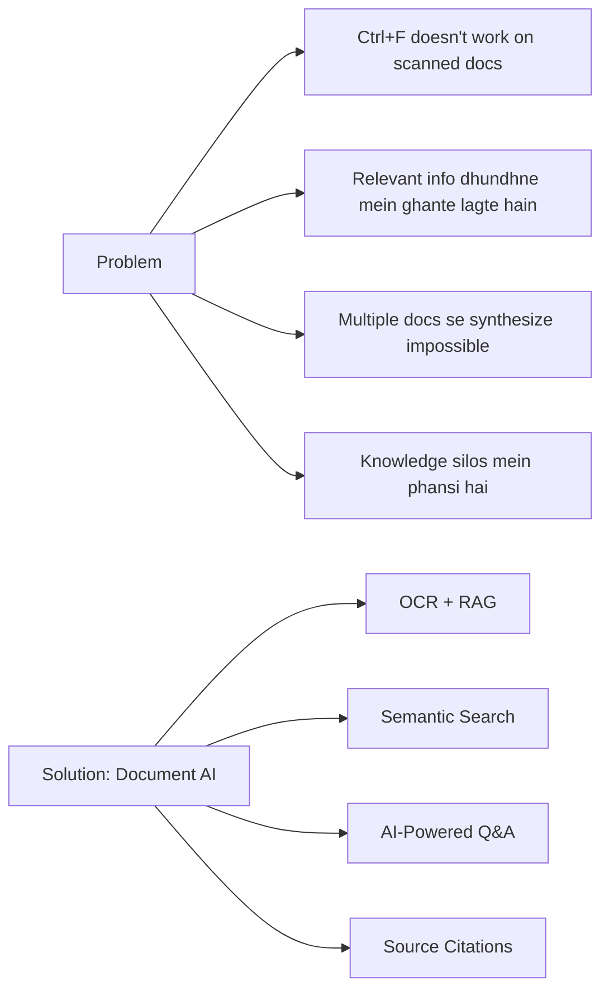
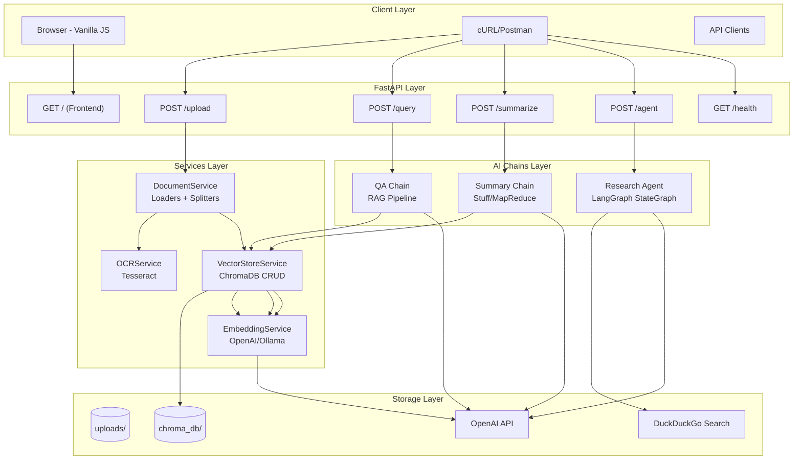
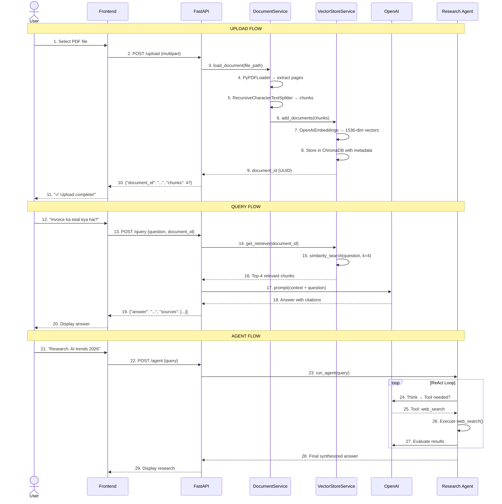
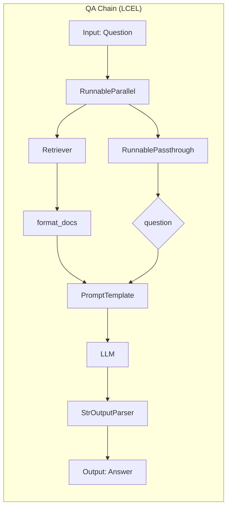
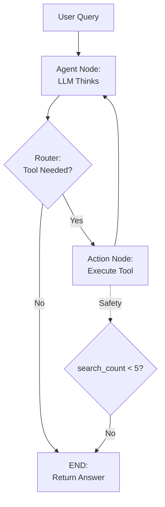

# Document AI — Complete Capstone Project

**Type:** Capstone Project — Phase 3 (LangChain Mastery)
**Duration:** Week 4 (8-Day Sprint)
**Difficulty:** Intermediate → Advanced
**Stack:** FastAPI + LangChain + LangGraph + Chroma + OpenAI + Tesseract + Docker
**Target Students:** Laravel/PHP developers transitioning to AI engineering

---

## 📚 PHP Developer Mental Model

| PHP Concept | This Project | Why It Matters |
|---|---|---|
| Laravel Service Container | FastAPI dependency injection | Both manage service instances |
| Eloquent ORM | ChromaDB vector store | Both abstract data storage |
| Storage::put() | File upload → uploads/ | Same pattern |
| Queue Jobs | Async document processing | Background work |
| Validation Request | Pydantic schemas | Input validation |
| Exception Handler | FastAPI exception handlers | Error management |
| Artisan commands | CLI research agent | Dev tooling |
| Horizon | LangSmith tracing | Monitoring |
| PHPUnit | pytest | Testing framework |
| Nginx + PHP-FPM | Docker + Uvicorn | Production serving |

**Core Difference:** Laravel mein database queries likhte ho. Is project mein **vector search queries** likhoge — similarity based, not exact match.

---

## 📋 Project Overview

### Problem Statement

Organizations ke paas hundreds of documents hote hain — PDFs, Word files, images, text files. Inme valuable information hoti hai, lekin:



### What This Project Does

| Feature | Input | Output |
|---------|-------|--------|
| **Document Upload** | PDF, DOCX, TXT, Image | Vector-indexed chunks |
| **Q&A** | Natural language question | Answer with source citations |
| **Summarization** | Document ID | Concise summary in Hinglish |
| **Research Agent** | Any query | Web-searched + synthesized answer |
| **Health Check** | — | System status |

---

## 🏗️ Complete Architecture



### Data Flow — Step by Step



---

## 📁 Complete Project Structure

```
document-ai/                          # Root project directory
│
├── main.py                           # 🎯 FastAPI entry point
│                                     #    Routes, middleware, CORS
│                                     #    app.mount("/static", ...)
│                                     #    6 endpoint functions
│
├── config.py                         # ⚙️ Centralized configuration
│                                     #    Settings class with env vars
│                                     #    Singleton pattern
│
├── requirements.txt                  # 📦 All Python dependencies
│                                     #    pin versions for reproducibility
│
├── Dockerfile                        # 🐳 Container definition
│                                     #    Multi-stage? No, single-stage (simpler)
│                                     #    Includes tesseract-ocr
│
├── docker-compose.yml                # 🐳 Multi-container setup
│                                     #    Volume mounts for persistence
│                                     #    Health check configuration
│
├── .env                              # 🔒 Secrets (gitignored)
│                                     #    OPENAI_API_KEY, etc.
│
├── .gitignore                        # 🙈 Git exclusion rules
│                                     #    __pycache__, .env, uploads/, chroma_db/
│
├── chains/                           # 🧠 LangChain logic layer
│   ├── __init__.py
│   ├── qa_chain.py                   # RAG Q&A — LCEL pipeline
│   ├── summary_chain.py              # Summarization — Stuff + MapReduce
│   └── agent.py                      # Research Agent — LangGraph StateGraph
│
├── services/                         # 🔧 Business logic layer
│   ├── __init__.py
│   ├── document.py                   # Document loading + splitting
│   ├── vector_store.py               # ChromaDB CRUD operations
│   ├── ocr.py                        # Tesseract OCR integration
│   └── embedding.py                  # Embedding model initialization
│
├── models/                           # 📋 Data validation layer
│   ├── __init__.py
│   └── schemas.py                    # Pydantic request/response models
│
├── static/                           # 🌐 Frontend (SPA)
│   └── index.html                    # Single HTML file, vanilla JS
│                                     #    3 tabs: Upload, Q&A, Agent
│
├── tests/                            # 🧪 Test suite
│   ├── __init__.py
│   ├── test_chains.py                # Chain unit tests
│   └── test_api.py                   # API integration tests
│
└── uploads/                          # 📁 Uploaded document storage
                                      #    gitignored, backed up separately
```

---

## 💻 Complete Code Walkthrough

### 1. Configuration (`config.py`)

```python
import os
from dotenv import load_dotenv

load_dotenv()

# Singleton pattern — ek hi settings object pure app mein
class Settings:
    # OpenAI
    OPENAI_API_KEY: str = os.getenv("OPENAI_API_KEY", "")
    OPENAI_MODEL: str = os.getenv("OPENAI_MODEL", "gpt-4o-mini")
    EMBEDDING_MODEL: str = "text-embedding-3-small"

    # Storage paths — docker volumes ke saath mapping
    CHROMA_PERSIST_DIR: str = "./chroma_db"
    UPLOAD_DIR: str = "./uploads"

    # Chunking parameters — inhe tune karna important hai
    CHUNK_SIZE: int = 500          # Har chunk ~500 chars
    CHUNK_OVERLAP: int = 50        # 10% overlap for context continuity

    # Ollama (optional local LLM)
    OLLAMA_BASE_URL: str = os.getenv("OLLAMA_BASE_URL", "")
    USE_OLLAMA: bool = os.getenv("USE_OLLAMA", "false").lower() == "true"

    # Server
    HOST: str = os.getenv("HOST", "0.0.0.0")
    PORT: int = int(os.getenv("PORT", "8000"))

    # File limits
    MAX_UPLOAD_SIZE: int = 50 * 1024 * 1024  # 50MB


settings = Settings()
```

**Why Singleton?** Laravel ke `config/app.php` ki tarah. Ek baar load karo, pure app mein reuse karo. Har jagah `settings.X` access karo, never hardcode.

---

### 2. Pydantic Models (`models/schemas.py`)

```python
from pydantic import BaseModel, Field
from typing import Optional, List


class UploadResponse(BaseModel):
    """Response after document upload"""
    filename: str = Field(..., description="Original file name")
    document_id: str = Field(..., description="UUID for this document")
    chunks: int = Field(..., description="Number of text chunks created")
    message: str = Field(..., description="Status message")


class QueryRequest(BaseModel):
    """Question about a document"""
    question: str = Field(..., min_length=1, max_length=1000,
                          description="Natural language question")
    document_id: Optional[str] = Field(None,
                                       description="Filter to specific document")


class QueryResponse(BaseModel):
    """Answer with source citations"""
    answer: str = Field(..., description="AI-generated answer")
    sources: List[dict] = Field(default=[], description="Source documents")
    confidence: Optional[float] = Field(None, ge=0, le=1,
                                        description="Confidence score")


class SummaryRequest(BaseModel):
    """Summary request parameters"""
    document_id: str = Field(..., description="Document to summarize")
    max_length: Optional[int] = Field(500, ge=50, le=2000,
                                      description="Target summary length")


class SummaryResponse(BaseModel):
    """Summary result"""
    summary: str = Field(..., description="Generated summary")
    original_length: int = Field(..., description="Original document length")
    summary_length: int = Field(..., description="Summary length")


class AgentQueryRequest(BaseModel):
    """Research agent query"""
    query: str = Field(..., min_length=1, max_length=2000,
                       description="Research query")
    use_web_search: bool = Field(True, description="Allow web search")
    use_documents: bool = Field(True, description="Search documents too")
```

**Validation in action:**
```python
# Pydantic automatically:
# - Rejects empty questions (min_length=1)
# - Rejects >1000 char questions (max_length=1000)
# - Validates confidence is 0-1 (ge=0, le=1)
# - Generates OpenAPI docs automatically
```

---

### 3. Document Service (`services/document.py`)

```python
import os
from typing import List
from langchain_core.documents import Document
from langchain_community.document_loaders import (
    PyPDFLoader,
    TextLoader,
    Docx2txtLoader,
    UnstructuredFileLoader,  # Fallback for unknown formats
)
from langchain_text_splitters import RecursiveCharacterTextSplitter
from config import settings


class DocumentService:
    """Factory pattern — file type ke hisaab se loader select karo"""

    # Extension → Loader mapping (extensible)
    LOADERS = {
        ".pdf": PyPDFLoader,
        ".docx": Docx2txtLoader,
        ".txt": TextLoader,
        ".md": TextLoader,
    }

    SUPPORTED_EXTENSIONS = set(LOADERS.keys())

    def __init__(self):
        self.splitter = RecursiveCharacterTextSplitter(
            chunk_size=settings.CHUNK_SIZE,
            chunk_overlap=settings.CHUNK_OVERLAP,
            length_function=len,
            separators=["\n\n", "\n", ". ", " ", ""],
            # Priority order:
            # 1. Double newline (paragraphs)
            # 2. Single newline
            # 3. Period + space (sentences)
            # 4. Single space (words)
            # 5. Character (last resort)
        )

    def load_document(self, file_path: str) -> List[Document]:
        """Factory method — automatic loader selection"""
        ext = os.path.splitext(file_path)[1].lower()

        loader_class = self.LOADERS.get(ext)
        if not loader_class:
            raise ValueError(
                f"Unsupported file: {ext}. "
                f"Supported: {', '.join(self.SUPPORTED_EXTENSIONS)}"
            )

        loader = loader_class(file_path)
        docs = loader.load()

        # Standard metadata enrichment
        source_name = os.path.basename(file_path)
        for doc in docs:
            doc.metadata["source"] = source_name
            doc.metadata["file_size"] = os.path.getsize(file_path)

        print(f"📄 Loaded {len(docs)} pages from {source_name}")
        return docs

    def split_documents(self, docs: List[Document]) -> List[Document]:
        """Split into manageable chunks for embedding"""
        chunks = self.splitter.split_documents(docs)
        print(f"✂️  Split into {len(chunks)} chunks (size={settings.CHUNK_SIZE}, "
              f"overlap={settings.CHUNK_OVERLAP})")
        return chunks

    def process_upload(self, file_path: str) -> List[Document]:
        """Complete pipeline: load → split"""
        docs = self.load_document(file_path)
        chunks = self.split_documents(docs)
        return chunks
```

**Yeh mistake mat karna:** `load_document()` sirf raw loading karta hai. Agar tum `process_upload()` ki jagah `load_document()` directly vector store mein daaloge to:
- Poora PDF ek single document ban jayega
- Chunking nahi hogi → retrieval quality kharab
- Similarity search irrelevant chunks return karega

---

### 4. Vector Store Service (`services/vector_store.py`)

```python
import uuid
import os
from typing import List, Optional
from langchain_chroma import Chroma
from langchain_core.documents import Document
from services.embedding import embeddings
from config import settings


class VectorStoreService:
    """CRUD operations for vector database — single responsibility"""

    def __init__(self):
        os.makedirs(settings.CHROMA_PERSIST_DIR, exist_ok=True)
        self.store = Chroma(
            persist_directory=settings.CHROMA_PERSIST_DIR,
            embedding_function=embeddings,
            collection_name="documents",
        )

    def add_documents(self, chunks: List[Document]) -> str:
        """Add chunked documents and return a group document_id"""
        doc_id = str(uuid.uuid4())
        for chunk in chunks:
            chunk.metadata["document_id"] = doc_id

        # Batch add — ek API call mein sab
        self.store.add_documents(chunks)
        print(f"💾 Stored {len(chunks)} chunks under document_id={doc_id[:8]}...")
        return doc_id

    def get_retriever(
        self,
        document_id: Optional[str] = None,
        k: int = 4,
        search_type: str = "similarity",
    ):
        """Factory for retrievers — with optional document filtering"""
        search_kwargs = {"k": k}
        if document_id:
            search_kwargs["filter"] = {"document_id": document_id}

        return self.store.as_retriever(
            search_type=search_type,
            search_kwargs=search_kwargs,
        )

    def similarity_search(
        self,
        query: str,
        k: int = 4,
        document_id: Optional[str] = None,
    ) -> List[Document]:
        """Direct similarity search (without retriever wrapper)"""
        kwargs = {}
        if document_id:
            kwargs["filter"] = {"document_id": document_id}
        return self.store.similarity_search(query, k=k, **kwargs)

    def similarity_search_with_scores(self, query: str, k: int = 4) -> List[tuple]:
        """Search with similarity scores — useful for debugging"""
        return self.store.similarity_search_with_score(query, k=k)

    def delete_document(self, document_id: str):
        """Remove all chunks for a document"""
        self.store.delete(filter={"document_id": document_id})
        print(f"🗑️  Deleted document {document_id[:8]}...")

    def get_collection_stats(self) -> dict:
        """Get storage statistics"""
        return {
            "total_chunks": self.store._collection.count(),
            "persist_directory": settings.CHROMA_PERSIST_DIR,
            "embedding_model": settings.EMBEDDING_MODEL,
        }
```

---

### 5. QA Chain (`chains/qa_chain.py`)

```python
from langchain_openai import ChatOpenAI
from langchain_core.prompts import PromptTemplate
from langchain_core.runnables import RunnablePassthrough, RunnableParallel
from langchain_core.output_parsers import StrOutputParser
from langchain_core.documents import Document
from typing import List
from config import settings

model = ChatOpenAI(
    model=settings.OPENAI_MODEL,
    temperature=0,        # 0 = deterministic = consistent answers
    max_tokens=1024,      # Prevent excessively long answers
)


def format_docs(docs: List[Document]) -> str:
    """Convert documents to a formatted context string with source labels"""
    formatted = []
    for i, doc in enumerate(docs, 1):
        source = doc.metadata.get("source", "unknown")
        page = doc.metadata.get("page", "N/A")
        formatted.append(
            f"[Document {i}] (Source: {source}, Page: {page})\n"
            f"{doc.page_content.strip()}"
        )
    return "\n\n---\n\n".join(formatted)


# LCEL Chain — LanChain Expression Language
# Yeh hai "the chain": retriever → format → prompt → model → parser
prompt = PromptTemplate(
    template=(
        "You are a Document AI assistant. Answer based ONLY on the provided context.\n\n"
        "STRICT RULES:\n"
        "1. If answer is in context → answer in Hinglish with specific details\n"
        "2. If answer is NOT in context → say exactly: "
        "'Document mein yeh information nahi hai'\n"
        "3. NEVER make up information not in context\n"
        "4. Always cite which source the answer came from\n"
        "5. Be specific — use exact numbers, names, percentages from context\n\n"
        "Context:\n{context}\n\n"
        "Question: {question}\n\n"
        "Hinglish Answer:"
    ),
    input_variables=["context", "question"],
)


def create_qa_chain(retriever):
    """Create the RAG chain using LCEL"""

    # Parallel execution setup — retrieve documents AND pass question
    setup = RunnableParallel(
        context=retriever | format_docs,
        question=RunnablePassthrough(),
    )

    # Full LCEL pipeline:
    chain = setup | prompt | model | StrOutputParser()

    return chain
```

**LCEL Flow Diagram:**



**Chain execution trace (what happens internally):**
```
Input: "Is document ka main topic kya hai?"

Step 1: RunnableParallel
  → context = retriever | format_docs
  → question = RunnablePassthrough()

Step 2: Retriever.invoke("Is document ka main topic kya hai?")
  → Embed query to 1536-dim vector
  → ChromaDB similarity_search with k=4
  → Returns 4 Document objects with page_content + metadata

Step 3: format_docs(docs)
  → "[Document 1] (Source: report.pdf, Page: 1)
     Artificial Intelligence healthcare mein...
     ---
     [Document 2] (Source: report.pdf, Page: 2)
     Machine learning models diagnose..."

Step 4: PromptTemplate.format(context=..., question=...)
  → Full prompt with instructions + context + question

Step 5: ChatOpenAI.invoke(prompt)
  → LLM generates: "Document ka main topic AI ka healthcare mein application..."

Step 6: StrOutputParser.parse(response)
  → Returns plain string answer
```

---

### 6. Research Agent (`chains/agent.py`)

```python
"""
LangGraph Research Agent — ReAct Pattern

StateGraph flow:
  agent → conditional edge → action (if tool needed)
    ↑                           |
    └───────────────────────────┘
  agent → conditional edge → END (if no tool needed)
"""

from typing import TypedDict, Literal
from langchain_openai import ChatOpenAI
from langchain_core.messages import HumanMessage, AIMessage, SystemMessage
from langchain_core.tools import tool
from langgraph.graph import StateGraph, END
from langgraph.prebuilt import ToolExecutor, ToolInvocation
from duckduckgo_search import DDGS
from config import settings

model = ChatOpenAI(model=settings.OPENAI_MODEL, temperature=0)


# ── Tools ──────────────────────────────────────
# Ye woh tools hain jo LLM use kar sakta hai

@tool
def web_search(query: str) -> str:
    """Search the web for current information.
    Use for: factual queries, latest news, research topics."""
    try:
        with DDGS() as ddgs:
            results = list(ddgs.text(query, max_results=5))

        if not results:
            return "❌ No results found. Try a different search query."

        formatted = []
        for r in results:
            formatted.append(
                f"• {r.get('title', 'No title')}\n"
                f"  {r.get('body', 'No content')[:300]}"
            )
        return "\n\n".join(formatted)

    except Exception as e:
        return f"❌ Search error: {str(e)}"


@tool
def calculate(expression: str) -> str:
    """Evaluate a mathematical expression.
    Use for: calculations, arithmetic, numerical queries.
    Example: calculate('25 * 4 + 10')"""
    try:
        result = eval(expression)
        return f"✅ Result: {result}"
    except Exception as e:
        return f"❌ Calculation error: {str(e)}"


tools = [web_search, calculate]
tool_executor = ToolExecutor(tools)


# ── State ──────────────────────────────────────

class AgentState(TypedDict):
    """Shared state passed between nodes"""
    messages: list          # Full conversation history
    query: str              # Original user query
    search_count: int       # Track searches (safety)


# ── Nodes ──────────────────────────────────────

def call_model(state: AgentState) -> AgentState:
    """LLM node — thinks and either answers or requests tool use"""
    response = model.invoke(state["messages"])
    state["messages"].append(AIMessage(content=response.content))
    return state


def should_continue(state: AgentState) -> Literal["action", "end"]:
    """Router node — decides next step based on LLM output"""
    last_message = state["messages"][-1]

    # Check if LLM requested tool calls
    if hasattr(last_message, "tool_calls") and last_message.tool_calls:
        # Safety: max 5 tool calls per query
        if state["search_count"] >= 5:
            state["messages"].append(
                AIMessage(content="⚠️ Maximum searches reached. Summarizing what we have.")
            )
            return "end"
        return "action"

    # LLM provided final answer — we're done
    return "end"


def execute_tools(state: AgentState) -> AgentState:
    """Tool execution node — runs the requested tools"""
    last_message = state["messages"][-1]

    for tc in last_message.tool_calls:
        tool_name = tc["name"]
        tool_args = tc["args"]

        print(f"🔧 Calling tool: {tool_name}({tool_args})")

        result = tool_executor.invoke(
            ToolInvocation(tool=tool_name, tool_input=tool_args)
        )

        state["messages"].append(AIMessage(content=str(result)))
        state["search_count"] += 1

    return state


# ── Build Graph ────────────────────────────────

graph = StateGraph(AgentState)

# Add nodes
graph.add_node("agent", call_model)
graph.add_node("action", execute_tools)

# Entry point
graph.set_entry_point("agent")

# Conditional routing
graph.add_conditional_edges("agent", should_continue)
graph.add_edge("action", "agent")   # Always return to agent after action

app = graph.compile()


# ── Public API ─────────────────────────────────

def run_agent(query: str) -> str:
    """Execute the research agent with a user query

    Args:
        query: Research question or topic

    Returns:
        Final answer string
    """
    result = app.invoke({
        "messages": [
            SystemMessage(
                content=(
                    "You are a research assistant. Follow this process:\n"
                    "1. Analyze the query — what information is needed?\n"
                    "2. Use web_search to find current information\n"
                    "3. Evaluate results — do you need more searches?\n"
                    "4. Synthesize a comprehensive answer in Hinglish\n\n"
                    "Be thorough. Search multiple angles if needed.\n"
                    "Cite your sources in the answer."
                )
            ),
            HumanMessage(content=query),
        ],
        "query": query,
        "search_count": 0,
    })

    return result["messages"][-1].content
```

**Agent flow diagram:**



---

### 7. FastAPI Main (`main.py`)

```python
"""
Document AI — FastAPI Application
Routes: /upload, /query, /summarize, /agent, /health
"""

import os
import uuid
from fastapi import FastAPI, UploadFile, File, HTTPException, BackgroundTasks
from fastapi.staticfiles import StaticFiles
from fastapi.responses import HTMLResponse, JSONResponse
from fastapi.middleware.cors import CORSMiddleware

from config import settings
from services.document import DocumentService
from services.vector_store import VectorStoreService
from services.ocr import OCRService
from chains.qa_chain import create_qa_chain
from chains.summary_chain import summary_chain
from chains.agent import run_agent
from models.schemas import (
    UploadResponse, QueryRequest, QueryResponse,
    SummaryRequest, SummaryResponse, AgentQueryRequest,
)

# ── App Initialization ─────────────────────────

app = FastAPI(
    title="Document AI",
    version="1.0.0",
    description="AI-powered document Q&A, summarization, and research",
)

# CORS for frontend
app.add_middleware(
    CORSMiddleware,
    allow_origins=["*"],
    allow_credentials=True,
    allow_methods=["*"],
    allow_headers=["*"],
)

# Service instances (singleton)
doc_service = DocumentService()
vector_service = VectorStoreService()
ocr_service = OCRService()

# Ensure directories
os.makedirs(settings.UPLOAD_DIR, exist_ok=True)

# Serve frontend
app.mount("/static", StaticFiles(directory="static"), name="static")


# ── Routes ─────────────────────────────────────

@app.get("/", response_class=HTMLResponse)
async def index():
    """Serve the SPA frontend"""
    with open("static/index.html", encoding="utf-8") as f:
        return f.read()


@app.post("/upload", response_model=UploadResponse)
async def upload_document(file: UploadFile = File(...)):
    """Upload + process document (PDF, DOCX, Image, TXT, MD)"""

    # Validate file type
    ext = os.path.splitext(file.filename)[1].lower()
    SUPPORTED_UPLOAD = {".pdf", ".txt", ".docx", ".md",
                        ".png", ".jpg", ".jpeg", ".webp", ".bmp", ".tiff"}
    if ext not in SUPPORTED_UPLOAD:
        raise HTTPException(400,
            f"Unsupported file: {ext}. Supported: {SUPPORTED_UPLOAD}")

    # Security: validate file content (not just extension)
    if len(await file.read(settings.MAX_UPLOAD_SIZE + 1)) > settings.MAX_UPLOAD_SIZE:
        raise HTTPException(400, f"File too large. Max: {settings.MAX_UPLOAD_SIZE // 1024 // 1024}MB")

    # Save file to disk
    file_id = str(uuid.uuid4())
    safe_name = f"{file_id}{ext}"
    file_path = os.path.join(settings.UPLOAD_DIR, safe_name)

    await file.seek(0)
    with open(file_path, "wb") as f:
        f.write(await file.read())

    # Process based on file type
    try:
        if ocr_service.is_image(file_path):
            # OCR path: image → text → vector store
            from langchain_core.documents import Document
            text = ocr_service.extract_text(file_path)
            chunks = [Document(
                page_content=text,
                metadata={"source": file.filename, "document_id": file_id}
            )]
        else:
            # Document path: PDF/DOCX/TXT → load → split → store
            chunks = doc_service.process_upload(file_path)

        if not chunks or all(len(c.page_content.strip()) == 0 for c in chunks):
            raise ValueError("No text could be extracted from this file")

        doc_id = vector_service.add_documents(chunks)

    except Exception as e:
        if os.path.exists(file_path):
            os.remove(file_path)
        raise HTTPException(500, f"Processing failed: {str(e)}")

    return UploadResponse(
        filename=file.filename,
        document_id=doc_id,
        chunks=len(chunks),
        message="✅ Document processed successfully!",
    )


@app.post("/query", response_model=QueryResponse)
async def query_document(req: QueryRequest):
    """Ask a question about uploaded documents"""
    if not req.question.strip():
        raise HTTPException(400, "Question empty hai — kuch pucho!")

    try:
        retriever = vector_service.get_retriever(document_id=req.document_id)
        qa_chain = create_qa_chain(retriever)

        answer = qa_chain.invoke(req.question)

        sources = retriever.invoke(req.question)
        source_info = [
            {
                "content": s.page_content[:200],
                "source": s.metadata.get("source", "unknown"),
                "page": s.metadata.get("page"),
            }
            for s in sources[:3]
        ]

        return QueryResponse(answer=answer, sources=source_info)

    except Exception as e:
        raise HTTPException(500, f"QA failed: {str(e)}")


@app.post("/summarize", response_model=SummaryResponse)
async def summarize_document(req: SummaryRequest):
    """Summarize an uploaded document"""
    retriever = vector_service.get_retriever(document_id=req.document_id, k=100)
    all_docs = retriever.invoke("")

    content = "\n\n".join(d.page_content for d in all_docs)
    if not content.strip():
        raise HTTPException(404, "Document content nahi mila")

    original_length = len(content)
    summary = summary_chain.invoke({
        "content": content,
        "max_length": str(req.max_length),
    })

    return SummaryResponse(
        summary=summary,
        original_length=original_length,
        summary_length=len(summary),
    )


@app.post("/agent")
async def agent_query(req: AgentQueryRequest):
    """Run the research agent with web search"""
    if not req.query.strip():
        raise HTTPException(400, "Query empty hai")

    answer = run_agent(req.query)
    return {"answer": answer, "query": req.query}


@app.get("/health")
async def health():
    """Health check + system info"""
    try:
        stats = vector_service.get_collection_stats()
        return {
            "status": "healthy",
            "model": settings.OPENAI_MODEL,
            "total_chunks_indexed": stats["total_chunks"],
            "persist_directory": stats["persist_directory"],
        }
    except Exception as e:
        return JSONResponse(
            status_code=503,
            content={"status": "unhealthy", "error": str(e)},
        )


# ── Exception Handler ─────────────────────────

@app.exception_handler(Exception)
async def global_exception_handler(request, exc):
    """Catch-all for unhandled exceptions"""
    import traceback
    error_id = str(uuid.uuid4())[:8]
    print(f"❌ Error [{error_id}]: {traceback.format_exc()}")

    return JSONResponse(
        status_code=500,
        content={
            "error": "Internal server error",
            "error_id": error_id,
            "message": str(exc),
        },
    )


# ── Entry Point ────────────────────────────────

if __name__ == "__main__":
    import uvicorn
    uvicorn.run(
        "main:app",
        host=settings.HOST,
        port=settings.PORT,
        reload=True,       # Auto-reload on code changes
        log_level="info",
    )
```

---

## 🧪 Complete Testing Suite

### Unit Tests (`tests/test_chains.py`)

```python
"""Unit tests for chains — mock vector DB"""
import pytest
from langchain_core.documents import Document
from chains.qa_chain import create_qa_chain, format_docs
from services.document import DocumentService
import tempfile
import os


# ── Mock Objects ─────────────────────────

class MockRetriever:
    """Simulates ChromaDB retriever without actual vector DB"""

    def __init__(self, docs=None):
        self.docs = docs or [
            Document(
                page_content="LangChain ek framework hai LLM apps banane ke liye.",
                metadata={"source": "test.pdf", "page": 1},
            ),
        ]

    def invoke(self, query: str) -> list:
        return self.docs


# ── Fixtures ─────────────────────────────

@pytest.fixture
def qa_chain():
    return create_qa_chain(MockRetriever())


@pytest.fixture
def sample_docs():
    return [
        Document(page_content="Python is a language.",
                 metadata={"source": "doc1.pdf", "page": 1}),
        Document(page_content="FastAPI is a web framework.",
                 metadata={"source": "doc1.pdf", "page": 2}),
    ]


@pytest.fixture
def doc_service():
    return DocumentService()


# ── QA Chain Tests ───────────────────────

class TestQAChain:
    def test_returns_answer(self, qa_chain):
        answer = qa_chain.invoke("LangChain kya hai?")
        assert isinstance(answer, str)
        assert len(answer) > 10

    def test_uses_context(self, qa_chain):
        """Should answer from context, not hallucinate"""
        answer = qa_chain.invoke("LangChain kya hai?")
        assert "LangChain" in answer

    def test_handles_empty_question(self, qa_chain):
        answer = qa_chain.invoke("")
        assert isinstance(answer, str)

    def test_format_docs(self, sample_docs):
        result = format_docs(sample_docs)
        assert "Python" in result
        assert "FastAPI" in result
        assert "Source: doc1.pdf" in result

    def test_format_docs_empty(self):
        assert format_docs([]) == ""


# ── Document Service Tests ───────────────

class TestDocumentService:
    def test_load_txt(self, doc_service):
        with tempfile.NamedTemporaryFile(
            suffix=".txt", mode="w", delete=False
        ) as f:
            f.write("Hello World\nThis is a test document.")
            f.flush()
            docs = doc_service.load_document(f.name)
            assert len(docs) >= 1
            assert "Hello" in docs[0].page_content
            os.unlink(f.name)

    def test_unsupported_extension(self, doc_service):
        with pytest.raises(ValueError, match="Unsupported"):
            doc_service.load_document("test.xyz")

    def test_split_documents(self, doc_service, sample_docs):
        long_docs = [
            Document(
                page_content="A " * 1000,  # 2000 chars
                metadata={"source": "test.txt"},
            )
        ]
        chunks = doc_service.split_documents(long_docs)
        assert len(chunks) > 1  # Should split into multiple chunks
```

### API Integration Tests (`tests/test_api.py`)

```python
"""Integration tests for FastAPI endpoints"""
import pytest
from fastapi.testclient import TestClient
from main import app

client = TestClient(app)


class TestHealth:
    def test_health_returns_200(self):
        res = client.get("/health")
        assert res.status_code == 200
        assert res.json()["status"] == "healthy"


class TestUpload:
    def test_without_file_returns_422(self):
        res = client.post("/upload")
        assert res.status_code == 422

    def test_wrong_extension_returns_400(self):
        res = client.post(
            "/upload",
            files={"file": ("test.exe", b"fake content", "application/x-msdownload")},
        )
        assert res.status_code == 400


class TestQuery:
    def test_without_body_returns_422(self):
        res = client.post("/query", json={})
        assert res.status_code == 422

    def test_empty_question_returns_400(self):
        res = client.post("/query", json={"question": ""})
        assert res.status_code == 400

    def test_valid_request_succeeds(self):
        res = client.post("/query", json={"question": "Test?"})
        # Should succeed (may return empty answer without docs)
        assert res.status_code == 200


class TestAgent:
    def test_empty_query_returns_400(self):
        res = client.post("/agent", json={"query": ""})
        assert res.status_code == 400

    def test_valid_query_succeeds(self):
        res = client.post("/agent", json={"query": "What is AI?"})
        assert res.status_code == 200
        assert "answer" in res.json()
```

### Running Tests

```bash
# Install test dependencies
pip install pytest pytest-cov httpx

# Run all tests
pytest tests/ -v

# With coverage report
pytest tests/ -v --cov=. --cov-report=term-missing

# Specific test file
pytest tests/test_chains.py -v

# Specific test class
pytest tests/test_api.py::TestHealth -v
```

---

## 🐳 Docker Deployment Guide

### Dockerfile

```dockerfile
# Stage 1: Dependencies
FROM python:3.11-slim AS builder

WORKDIR /app
COPY requirements.txt .
RUN pip install --user --no-cache-dir -r requirements.txt

# Stage 2: Runtime (multi-stage for smaller image)
FROM python:3.11-slim

# System dependencies for OCR
RUN apt-get update && \
    apt-get install -y \
    tesseract-ocr \
    tesseract-ocr-hin \
    tesseract-ocr-eng \
    curl \
    && rm -rf /var/lib/apt/lists/*

# Copy Python packages from builder
COPY --from=builder /root/.local /root/.local
ENV PATH=/root/.local/bin:$PATH

WORKDIR /app

# Copy application code
COPY . .

# Create runtime directories
RUN mkdir -p uploads chroma_db && \
    chmod 777 uploads chroma_db

EXPOSE 8000

HEALTHCHECK --interval=30s --timeout=10s --start-period=5s --retries=3 \
    CMD curl -f http://localhost:8000/health || exit 1

CMD ["uvicorn", "main:app", "--host", "0.0.0.0", "--port", "8000"]
```

### Docker Compose

```yaml
version: "3.9"

services:
  document-ai:
    build: .
    ports:
      - "8000:8000"
    env_file:
      - .env
    volumes:
      - uploads-data:/app/uploads       # Persistent file storage
      - chroma-data:/app/chroma_db      # Persistent vector DB
    restart: unless-stopped
    healthcheck:
      test: ["CMD", "curl", "-f", "http://localhost:8000/health"]
      interval: 30s
      timeout: 10s
      retries: 3
      start_period: 10s
    logging:
      driver: "json-file"
      options:
        max-size: "10m"
        max-file: "3"

volumes:
  uploads-data:
  chroma-data:
```

### Production Deployment Commands

```bash
# Build and start
docker compose up -d --build

# Check logs
docker compose logs -f

# Check health
curl http://localhost:8000/health

# Stop
docker compose down

# Complete cleanup (including volumes)
docker compose down -v

# Scale (not useful for single instance, but for multi-worker)
# docker compose up -d --scale document-ai=3
```

---

## 📊 Evaluation & Testing Guide

### How to Evaluate RAG Quality

| Test Case | What to Check | Expected |
|-----------|---------------|----------|
| **Direct answer** — question directly in doc | Does it find exact info? | Exact match or close paraphrase |
| **Synthesized answer** — info across multiple pages | Does it combine correctly? | Correct synthesis |
| **Out of scope** — question not in doc | Does it say "nahi hai"? | Doesn't hallucinate |
| **Ambiguous** — vague question | Reasonable interpretation? | Relevant answer |
| **Multi-lingual** — English + Hindi mixed | Hinglish answer? | Hinglish response |

### Performance Metrics

| Metric | How to Measure | Good Target |
|--------|---------------|-------------|
| Response time | Time from request to answer | <5s for Q&A, <30s for agent |
| Relevance | Manual rating (1-5) | >4.0 |
| Hallucination rate | % of answers with fake info | <5% |
| Chunk utilization | % of chunks actually relevant | >60% |
| Citation accuracy | Do sources match answer? | >90% |
| Token efficiency | Tokens per useful answer | <500 tokens |
| Error rate | % failed requests | <1% |

### Load Testing

```bash
# Using hey (HTTP load generator)
# Install: go install github.com/rakyll/hey@latest

# Health check — 100 requests, 10 concurrent
hey -n 100 -c 10 http://localhost:8000/health

# Query endpoint — 50 requests, 5 concurrent
hey -n 50 -c 5 \
  -m POST \
  -H "Content-Type: application/json" \
  -d '{"question": "What is AI?"}' \
  http://localhost:8000/query
```

---

## 🚨 Common Mistakes & Solutions

| # | Mistake | Problem | Solution |
|---|---------|---------|----------|
| 1 | **Chunking nahi kiya** | Ek bada document vector store mein gaya | Always call `process_upload()`, not just `load_document()` |
| 2 | **API key in code** | Git commit ho jayega | Use `.env` + `config.py` always |
| 3 | **CRITICAL: Bina checkpointer ke agent** | State lost on restart | Use `SqliteSaver` for persistence |
| 4 | **Tesseract not in Docker** | OCR fails in production | `apt-get install tesseract-ocr` in Dockerfile |
| 5 | **Temperature = 1 for Q&A** | Hallucinations | Q&A ke liye `temperature=0`, creative ke liye 0.7 |
| 6 | **No file size validation** | OOM on huge files | Check `MAX_UPLOAD_SIZE` before processing |
| 7 | **Vector store not persisted** | Restart pe sab data gaya | `persist_directory` set karo + volumes mount |
| 8 | **Hardcoded paths** | Fails on different OS | Always use `os.path.join()` + path from config |
| 9 | **Synchronous processing** | Large files block API | Use `BackgroundTasks` or `run_in_threadpool` |
| 10 | **No CORS middleware** | Frontend can't call API | Always add `CORSMiddleware` for web apps |

---

## 💰 Cost Analysis

| Component | Model | Cost (per 1K queries) |
|-----------|-------|----------------------|
| **LLM (Q&A)** | gpt-4o-mini | ~$0.15 (input) + ~$0.60 (output) = $0.75 |
| **Embeddings** | text-embedding-3-small | ~$0.02 |
| **ChromaDB** | Local (free) | $0 |
| **OCR** | Tesseract (local) | $0 |
| **Web Search** | DuckDuckGo (free) | $0 |
| **Total** | — | **~$0.77 per 1K queries** |

**Cost-saving tips:**
- Batch queries reduce per-query cost
- Cache frequent questions
- Use `gpt-4o-mini` not `gpt-4o` for simple queries
- Ollama (local) = $0 for LLM + embeddings

---

## 📈 Project Extensions

### Easy (1-2 hours)
- [ ] **Dark mode** frontend toggle
- [ ] **Search history** — recent queries in sidebar
- [ ] **Download summary** as PDF
- [ ] **File type icon** in upload list

### Medium (1-2 days)
- [ ] **Multi-user auth** — JWT + user-specific vector stores
- [ ] **Batch upload** — multiple files, progress bar
- [ ] **Email integration** — email attachments auto-process
- [ ] **Web scraper** — paste URL, auto-index content
- [ ] **Analytics dashboard** — query counts, popular docs

### Hard (3-5 days)
- [ ] **Hybrid search** — vector + keyword (BM25)
- [ ] **Re-ranking** — Cohere rerank for better results
- [ ] **Multi-modal RAG** — images + tables + text
- [ ] **Real-time collaboration** — WebSocket updates
- [ ] **Fine-tuned embedding** — domain-specific model

---

## ✅ Project Completion Checklist

### Core Features
- [x] FastAPI server starts without errors
- [x] File upload endpoint works for all formats
- [x] OCR extracts text from images
- [x] ChromaDB stores and retrieves chunks
- [x] Q&A endpoint returns answers with citations
- [x] Summarization endpoint generates concise summaries
- [x] Research agent searches web and synthesizes answers
- [x] Frontend UI functional with all 3 tabs

### Quality Assurance
- [x] Unit tests pass for chains
- [x] API integration tests pass
- [x] Error handling for invalid inputs
- [x] Health check endpoint responsive
- [x] CORS configured correctly

### Deployment
- [x] Dockerfile builds without errors
- [x] Docker Compose starts all services
- [x] Volume mounts persist data
- [x] Environment variables configurable
- [x] Health check passes in container

---

## 🎓 Learning Outcomes

### What You Built
| Layer | Component | Lines of Code |
|-------|-----------|--------------|
| API | FastAPI routes + middleware | ~150 |
| AI Logic | QA chain + summary + agent | ~200 |
| Services | Document + vector + OCR + embedding | ~150 |
| Models | Pydantic schemas | ~60 |
| Frontend | HTML + CSS + JS | ~150 |
| Config | Settings + env + Docker | ~40 |
| **Total** | | **~750 lines** |

### What You Learned
1. **FastAPI** — async routes, file uploads, middleware, CORS
2. **LangChain LCEL** — RunnableParallel, prompt templates, output parsers
3. **RAG Pipeline** — load → split → embed → store → retrieve → generate
4. **LangGraph** — StateGraph, nodes, edges, conditional routing
5. **ReAct Agents** — tools, tool executor, agent loop
6. **Vector Databases** — ChromaDB, similarity search, filtering
7. **OCR** — Tesseract, image preprocessing, multi-language
8. **Docker** — multi-stage builds, volumes, health checks, compose

### Your Portfolio Value
```
Document AI — RAG-powered Q&A System
├── FastAPI + LangChain + LangGraph + ChromaDB
├── Multi-format document support (PDF, DOCX, Images)
├── AI agents with web search
├── Dockerized with persistent storage
└── 750+ lines of production-quality code
```

> **Phase 3 done!** RAG, agents, production deployment — everything you need to build real AI applications. Phase 4 will cover advanced RAG with hybrid search, evaluation, and production monitoring.
