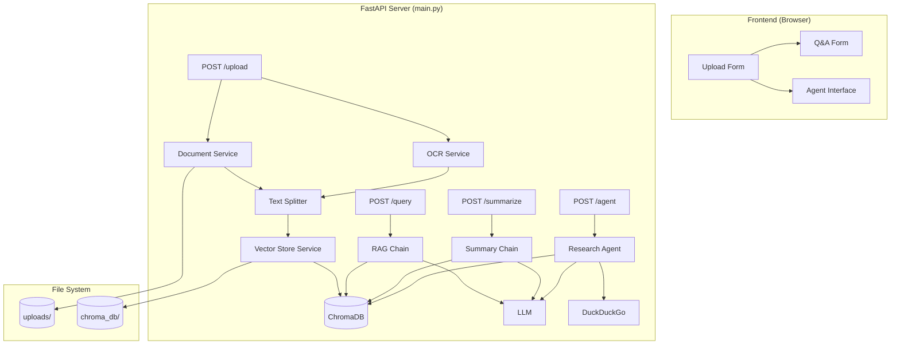
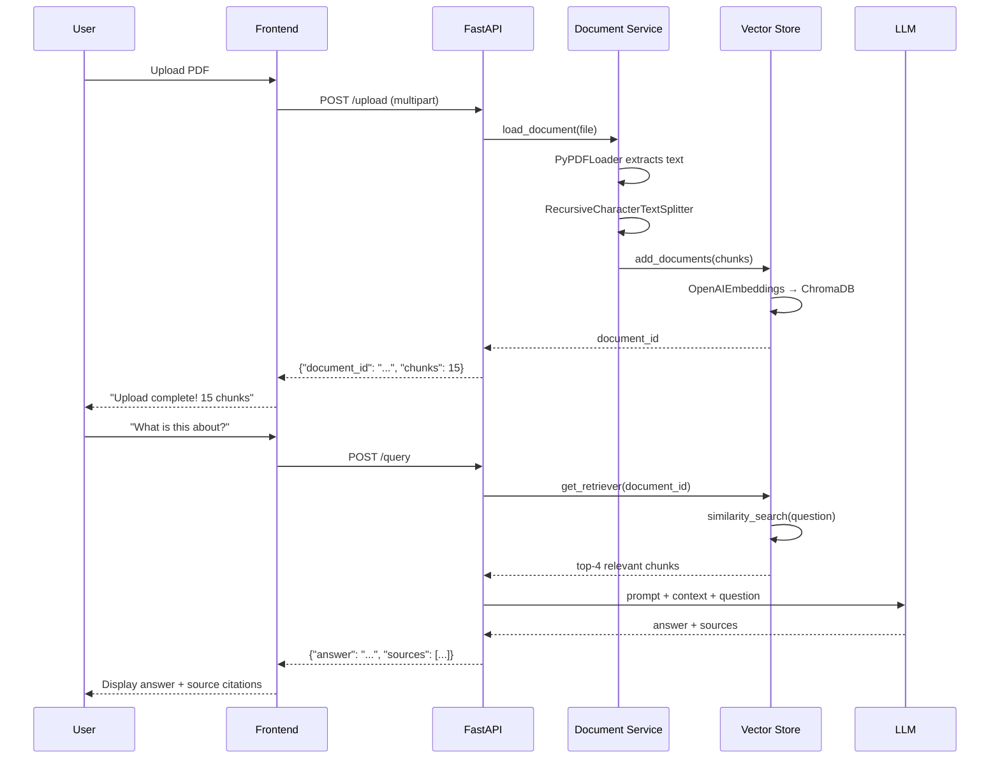
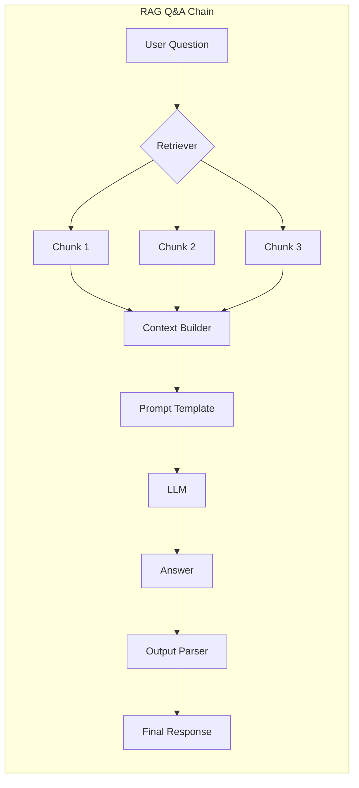

# Week 4 — Project Build: Document AI

**Goal:** Weeks 1-3 ka sab kuch combine karo — ek production-ready Document AI application
**Duration:** 8 Days (Complete Build Sprint)
**Stack:** FastAPI + LangChain + Chroma + LangGraph + OpenAI/Ollama
**Output:** Deployed API with frontend, RAG, OCR, and Research Agent

---

## 📚 PHP Developer Mental Model

| Laravel Concept | Document AI Equivalent | Same? |
|---|---|---|
| API Controller | FastAPI route handler | Same concept |
| Eloquent Model | Pydantic schema | Both validate data |
| Database migration | Vector DB schema | Similar |
| Storage disk (S3/local) | Upload directory | Same |
| Queue job for PDF processing | Async document pipeline | Similar |
| Eloquent relationships | Vector DB document → chunks | LangChain auto-handles |
| Validation rules | Pydantic field validators | Almost same |
| Middleware | FastAPI middleware | Same pattern |
| Service Provider | Dependency injection in FastAPI | Different mechanism |
| Tinker (REPL) | Jupyter notebook testing | Same purpose |
| Horizon monitoring | LangSmith tracing | Similar |

**Key Insight:** Laravel developer ke liye Document AI ka sabse familiar part **API layer + file handling** hai. Naya part hai **vector search + LLM integration**. Dono ko combine karna seekhna hai.

---

## 📅 Week 4 Sprint Plan

| Day | Focus | Deliverable |
|-----|-------|-------------|
| 1 | Project Setup + Architecture | FastAPI scaffold, config, project structure |
| 2 | Document Processing Pipeline | Loaders, text splitting, OCR service |
| 3 | Vector Store + Embeddings | ChromaDB integration, retriever setup |
| 4 | RAG Q&A Chain | QA chain with source citations |
| 5 | Summarization + Agent | Summary chain + research agent |
| 6 | Frontend + API Integration | HTML/JS UI, all endpoints connected |
| 7 | Testing + Error Handling | pytest, edge cases, graceful failures |
| 8 | Docker Deployment + CI/CD | Container, deploy, monitoring |

---

## Prerequisites Checklist

- [ ] Python 3.10+ installed
- [ ] OpenAI API key ready
- [ ] Tesseract OCR installed (for image processing)
- [ ] Weeks 1-3 concepts clear
- [ ] Basic FastAPI knowledge
- [ ] `pip install fastapi uvicorn python-multipart langchain chromadb langgraph`

---

# DAY 1: Project Setup & Architecture

## 1.1 System Architecture (Deep Dive)



**Data flow step-by-step:**



## 1.2 Project Structure Explained

```
document-ai/
├── main.py                 # 🎯 FastAPI entry point — routes + app config
├── config.py               # ⚙️ Environment variables + settings
├── requirements.txt        # 📦 Python dependencies
├── Dockerfile              # 🐳 Container configuration
│
├── chains/                 # 🧠 LangChain logic
│   ├── __init__.py
│   ├── qa_chain.py         # RAG Q&A — prompt + retriever + model
│   ├── summary_chain.py    # Document summarization
│   └── agent.py            # LangGraph research agent
│
├── services/               # 🔧 Business logic (Laravel Services ki tarah)
│   ├── __init__.py
│   ├── document.py         # File loading + splitting
│   ├── vector_store.py     # ChromaDB read/write
│   ├── ocr.py              # Image text extraction
│   └── embedding.py        # Embedding model selection
│
├── models/                 # 📋 Pydantic schemas (Laravel Requests ki tarah)
│   ├── __init__.py
│   └── schemas.py          # Request/response validation
│
├── static/                 # 🌐 Frontend
│   └── index.html          # Single-page app (vanilla JS)
│
└── uploads/                # 📁 Uploaded files storage
```

## 1.3 Config Deep Dive

```python title="config.py"
import os
from dotenv import load_dotenv

load_dotenv()


class Settings:
    # OpenAI
    OPENAI_API_KEY: str = os.getenv("OPENAI_API_KEY", "")
    OPENAI_MODEL: str = os.getenv("OPENAI_MODEL", "gpt-4o-mini")
    EMBEDDING_MODEL: str = "text-embedding-3-small"

    # Storage
    CHROMA_PERSIST_DIR: str = "./chroma_db"
    UPLOAD_DIR: str = "./uploads"

    # Chunking
    CHUNK_SIZE: int = 500          # Har chunk kitne words ka
    CHUNK_OVERLAP: int = 50        # Chunks ke beech kitna overlap

    # Ollama (local LLM option)
    OLLAMA_BASE_URL: str = os.getenv("OLLAMA_BASE_URL", "")
    USE_OLLAMA: bool = os.getenv("USE_OLLAMA", "false").lower() == "true"

    # Server
    HOST: str = os.getenv("HOST", "0.0.0.0")
    PORT: int = int(os.getenv("PORT", "8000"))


settings = Settings()
```

**Config management ka pattern:** Laravel ke `.env` + `config/` files ki tarah. Ek central `Settings` class sab config hold karti hai. Har jagah `settings.OPENAI_MODEL` use karo, hardcode mat karo.

## 1.4 Laravel vs FastAPI Project Structure

```php
// Laravel structure (familiar)
app/
├── Http/Controllers/DocumentController.php   # main.py routes
├── Services/DocumentService.php              # services/document.py
├── Models/Document.php                       # models/schemas.py
└── Console/Commands/ProcessDocument.php       # Background jobs

// VS FastAPI structure (Python)
document-ai/
├── main.py               # ← routes + CORS + static files
├── services/document.py  # ← business logic
├── models/schemas.py     # ← request/response validation
└── chains/qa_chain.py    # ← AI-specific logic
```

**Yeh mistake mat karna:** FastAPI mein Laravel ki tarah Controllers alag folder mein mat daalo. FastAPI mein routes directly `main.py` mein ya alag `routes/` folder mein rakhte hain. Services layer ka concept same hai.

## Day 1 Practice

- [ ] Virtual environment banao (`python -m venv venv`)
- [ ] Project structure create karo (all folders)
- [ ] `.env` file banao with OPENAI_API_KEY
- [ ] `config.py` likho aur test karo
- [ ] `uvicorn main:app --reload` se server start karo

---

# DAY 2: Document Processing Pipeline

## 2.1 Document Loaders — Internal Working

LangChain har file type ke liye alag loader use karta hai:

```python
from langchain_community.document_loaders import (
    PyPDFLoader,      # PDF → text
    TextLoader,       # .txt files
    Docx2txtLoader,   # Word documents
    UnstructuredFileLoader,  # General purpose (supports many formats)
    CSVLoader,        # CSV → rows
    JSONLoader,       # JSON → documents
    WebBaseLoader,    # URL → text
)
```

**Har loader internally kya karta hai:**

```python
# PyPDFLoader ka simplified internals:
class PyPDFLoader:
    def load(self) -> list[Document]:
        import pypdf
        
        reader = pypdf.PdfReader(self.file_path)
        documents = []
        
        for page_num, page in enumerate(reader.pages, 1):
            text = page.extract_text()
            
            doc = Document(
                page_content=text,
                metadata={
                    "source": self.file_path,
                    "page": page_num,
                    "total_pages": len(reader.pages),
                }
            )
            documents.append(doc)
        
        return documents
```

**PHP analogy:**
```php
// PHP mein PDF parsing — manual, multiple libraries
$parser = new \Smalot\PdfParser\Parser();
$pdf = $parser->parseFile($path);
$text = '';
foreach ($pdf->getPages() as $page) {
    $text .= $page->getText();
}

// VS Python LangChain:
// loader = PyPDFLoader(file_path)
// docs = loader.load()
// LangChain automatically handles page-level metadata
```

## 2.2 Text Splitters — Chunking Strategies

**Why chunking needed?**
- LLMs have token limits (context window)
- Small chunks = focused retrieval
- Overlap ensures no context loss at boundaries

```python
from langchain_text_splitters import (
    RecursiveCharacterTextSplitter,  # 🥇 Most common
    CharacterTextSplitter,            # Simple — by character count
    TokenTextSplitter,                # By token count (LLM-aware)
    MarkdownHeaderTextSplitter,       # By markdown headers
    PythonCodeTextSplitter,           # By Python functions/classes
    SemanticChunker,                  # By semantic meaning (advanced)
)
```

**RecursiveCharacterTextSplitter internals:**

```python
# Yeh internally kya karta hai:
class RecursiveCharacterTextSplitter:
    def __init__(self, chunk_size=500, chunk_overlap=50):
        self.separators = ["\n\n", "\n", ".", " ", ""]
        # Pehle paragraphs split (double newline)
        # Phir lines (single newline)
        # Phir sentences (period)
        # Phir words (space)
        # Last resort — character by character

    def split_text(self, text: str) -> list[str]:
        chunks = []
        
        for separator in self.separators:
            if separator in text:
                parts = text.split(separator)
                # Merge parts until each chunk ≈ chunk_size
                current_chunk = ""
                for part in parts:
                    if len(current_chunk) + len(part) < self.chunk_size:
                        current_chunk += part + separator
                    else:
                        if current_chunk:
                            chunks.append(current_chunk.strip())
                        # Include overlap from previous chunk
                        overlap_text = current_chunk[-self.chunk_overlap:]
                        current_chunk = overlap_text + part + separator
                
                if current_chunk:
                    chunks.append(current_chunk.strip())
                break  # Found working separator
        
        return chunks
```

**Chunking strategies comparison:**

| Strategy | Best For | Example Chunks |
|----------|----------|----------------|
| RecursiveCharacter | **General text** (default) | Paragraphs → sentences → words |
| TokenTextSplitter | LLM token limit awareness | Exact token count chunks |
| MarkdownHeader | Markdown docs | Per-section chunks |
| SemanticChunker | Q&A accuracy | Meaning-based boundaries |
| CharacterTextSplitter | Simple fixed-size | Fixed character count |

## 2.3 OCR Service — Image to Text

```python title="services/ocr.py"
import os
from PIL import Image
import pytesseract
from typing import Optional


class OCRService:
    def extract_text(
        self,
        image_path: str,
        lang: str = "eng+hin",
        psm: int = 3,
    ) -> str:
        """Extract text from image using Tesseract OCR

        Args:
            image_path: Path to image file
            lang: OCR language (eng, hin, eng+hin for Hinglish docs)
            psm: Page segmentation mode (3=auto, 6=block, 7=single line)

        Returns:
            Extracted text or error message
        """
        try:
            image = Image.open(image_path)

            # Preprocessing for better OCR accuracy
            image = image.convert("L")  # Grayscale
            # image = image.point(lambda x: 0 if x < 128 else 255)  # Binarize

            custom_config = f"--psm {psm} --oem 3"
            text = pytesseract.image_to_string(
                image,
                lang=lang,
                config=custom_config,
            )

            cleaned = text.strip()
            return cleaned if cleaned else "⚠️ OCR could not extract any text."

        except FileNotFoundError:
            return f"❌ File not found: {image_path}"
        except Exception as e:
            return f"❌ OCR error: {str(e)}"

    def is_image(self, file_path: str) -> bool:
        ext = os.path.splitext(file_path)[1].lower()
        return ext in (".png", ".jpg", ".jpeg", ".webp", ".bmp", ".tiff")

    def extract_with_preprocessing(self, image_path: str) -> str:
        """Extract with multiple preprocessing techniques"""
        try:
            image = Image.open(image_path)

            # Try different preprocessing
            results = []

            # Method 1: Direct
            text1 = pytesseract.image_to_string(image, lang="eng+hin")
            results.append(text1.strip())

            # Method 2: Grayscale
            gray = image.convert("L")
            text2 = pytesseract.image_to_string(gray, lang="eng+hin")
            results.append(text2.strip())

            # Method 3: Binarized
            bw = gray.point(lambda x: 0 if x < 128 else 255)
            text3 = pytesseract.image_to_string(bw, lang="eng+hin")
            results.append(text3.strip())

            # Return longest result (usually most complete)
            return max(results, key=len)

        except Exception as e:
            return f"❌ OCR preprocessing error: {str(e)}"
```

**Yeh mistake mat karna:** Tesseract server par install nahi hai to OCR fail hoga. Dockerfile mein `tesseract-ocr` install karna mat bhoolna. Dev machine par `apt-get install tesseract-ocr` karo.

## 2.4 Document Service Implementation

```python title="services/document.py"
import os
from typing import List, Optional
from langchain_core.documents import Document
from langchain_community.document_loaders import (
    PyPDFLoader,
    TextLoader,
    Docx2txtLoader,
)
from langchain_text_splitters import RecursiveCharacterTextSplitter
from config import settings


class DocumentService:
    """Handles document loading, splitting, and processing"""

    SUPPORTED_EXTENSIONS = {".pdf", ".txt", ".docx", ".md"}

    def __init__(self):
        self.splitter = RecursiveCharacterTextSplitter(
            chunk_size=settings.CHUNK_SIZE,
            chunk_overlap=settings.CHUNK_OVERLAP,
            length_function=len,
            separators=["\n\n", "\n", ". ", " ", ""],
        )

    def get_loader(self, file_path: str):
        """Factory method — file extension ke based loader return karo"""
        ext = os.path.splitext(file_path)[1].lower()

        loaders = {
            ".pdf": PyPDFLoader,
            ".docx": Docx2txtLoader,
            ".txt": TextLoader,
            ".md": TextLoader,
        }

        loader_class = loaders.get(ext)
        if not loader_class:
            raise ValueError(
                f"Unsupported file: {ext}. "
                f"Supported: {', '.join(self.SUPPORTED_EXTENSIONS)}"
            )

        return loader_class(file_path)

    def load_document(self, file_path: str) -> List[Document]:
        """Load document and return list of documents (one per page)"""
        loader = self.get_loader(file_path)
        docs = loader.load()

        # Add standard metadata
        for doc in docs:
            doc.metadata["source"] = os.path.basename(file_path)
            doc.metadata["file_path"] = file_path
            doc.metadata["file_size"] = os.path.getsize(file_path)

        return docs

    def split_documents(self, docs: List[Document]) -> List[Document]:
        """Split documents into chunks"""
        return self.splitter.split_documents(docs)

    def process_upload(self, file_path: str) -> List[Document]:
        """Load + split in one call"""
        docs = self.load_document(file_path)
        chunks = self.split_documents(docs)
        return chunks
```

**Yeh mistake mat karna:** `load_document()` sirf load karta hai, split nahi. `process_upload()` dono karta hai. Agar tum directly `load_document()` ka result vector store mein daaloge to bada ek bada document store hoga, jisse retrieval quality kharab hogi.

## Day 2 Practice

- [ ] Test all supported file types (PDF, DOCX, TXT)
- [ ] Different chunk sizes try karo (200, 500, 1000)
- [ ] OCR with image test karo
- [ ] Document metadata inspect karo
- [ ] Chunking strategy compare karo

---

# DAY 3: Vector Store & Embeddings

## 3.1 Embedding Models

Embedding model text ko **numerical vector** mein convert karta hai:

```python
# OpenAI embeddings
from langchain_openai import OpenAIEmbeddings

embeddings = OpenAIEmbeddings(
    model="text-embedding-3-small",  # 1536 dimensions, $0.02/1M tokens
    # model="text-embedding-3-large", # 3072 dimensions, $0.13/1M tokens
)

# Example
vector = embeddings.embed_query("LangChain kya hai?")
print(len(vector))     # 1536
print(vector[:5])      # [-0.023, 0.045, -0.012, 0.078, -0.031]
```

**Embedding comparison:**

| Model | Dimensions | Cost (per 1M tokens) | Quality |
|-------|-----------|---------------------|---------|
| text-embedding-3-small | 1536 | $0.02 | Good ✅ |
| text-embedding-3-large | 3072 | $0.13 | Best ✅✅ |
| Ollama (local) | 4096 | Free | Decent |
| BGE (local) | 1024 | Free | Good |

## 3.2 ChromaDB — Vector Database

```python
from langchain_chroma import Chroma

# Create or load vector store
vector_store = Chroma(
    persist_directory="./chroma_db",    # Directory for persistence
    embedding_function=embeddings,       # Embedding model
    collection_name="documents",         # Collection name (like table)
)

# Add documents
vector_store.add_documents(chunks)

# Search
results = vector_store.similarity_search(
    query="Document mein kya likha hai?",
    k=4,  # Top-4 results
)

# Search with score
results_with_scores = vector_store.similarity_search_with_score(
    query="Document summary",
    k=4,
)
# Results include distance scores (lower = more similar)
```

**ChromaDB internals — similarity search kaise kaam karta hai:**

```python
# Simplified similarity search:
def similarity_search(query, k=4):
    # 1. Query ko vector mein convert karo
    query_vector = embeddings.embed_query(query)

    # 2. Sab stored vectors ke saath compare karo
    scores = []
    for doc_id, doc_vector in all_vectors.items():
        # Cosine similarity (1 = identical, 0 = unrelated, -1 = opposite)
        similarity = cosine_similarity(query_vector, doc_vector)
        scores.append((doc_id, similarity))

    # 3. Top-k results return karo
    scores.sort(key=lambda x: x[1], reverse=True)
    return [documents[doc_id] for doc_id, _ in scores[:k]]
```

## 3.3 Vector Store Service

```python title="services/vector_store.py"
import uuid
import os
from typing import List, Optional
from langchain_chroma import Chroma
from langchain_core.documents import Document
from services.embedding import embeddings
from config import settings


class VectorStoreService:
    """CRUD operations for vector database"""

    def __init__(self):
        os.makedirs(settings.CHROMA_PERSIST_DIR, exist_ok=True)
        self.store = Chroma(
            persist_directory=settings.CHROMA_PERSIST_DIR,
            embedding_function=embeddings,
            collection_name="documents",
        )

    def add_documents(self, chunks: List[Document]) -> str:
        """Add document chunks to vector store

        Returns:
            document_id: Unique identifier for this document group
        """
        doc_id = str(uuid.uuid4())
        for chunk in chunks:
            chunk.metadata["document_id"] = doc_id

        self.store.add_documents(chunks)
        return doc_id

    def get_retriever(
        self,
        document_id: Optional[str] = None,
        k: int = 4,
        search_type: str = "similarity",
    ):
        """Get retriever for Q&A chain

        Args:
            document_id: Optional — filter to specific document
            k: Number of chunks to retrieve
            search_type: "similarity" | "mmr" (diverse results)
        """
        search_kwargs = {"k": k}
        if document_id:
            search_kwargs["filter"] = {"document_id": document_id}

        return self.store.as_retriever(
            search_type=search_type,
            search_kwargs=search_kwargs,
        )

    def similarity_search(
        self,
        query: str,
        k: int = 4,
        document_id: Optional[str] = None,
    ) -> List[Document]:
        """Direct similarity search (without retriever wrapper)"""
        kwargs = {}
        if document_id:
            kwargs["filter"] = {"document_id": document_id}

        return self.store.similarity_search(query, k=k, **kwargs)

    def similarity_search_with_score(
        self,
        query: str,
        k: int = 4,
    ) -> List[tuple]:
        """Search with relevance scores"""
        return self.store.similarity_search_with_score(query, k=k)

    def delete_document(self, document_id: str):
        """Delete all chunks for a document"""
        self.store.delete(filter={"document_id": document_id})

    def get_collection_stats(self) -> dict:
        """Get collection statistics"""
        return {
            "document_count": self.store._collection.count(),
            "persist_directory": settings.CHROMA_PERSIST_DIR,
        }
```

**Yeh mistake mat karna:** Har upload ke baad `persist()` call karna mat bhoolna. ChromaDB auto-persist nahi karta by default. Agar app restart hui to saara data udd jayega.

## 3.4 Understanding Vector Search

```mermaid
flowchart LR
    subgraph Embed["Embedding Process"]
        A["What is LangChain?"] --> B[text-embedding-3-small]
        B --> C["[0.023, -0.045, 0.012, ...]"]
    end
    
    subgraph Store["Vector Database"]
        D[Vector 1: "LangChain is a framework..."]
        E[Vector 2: "It supports chains..."]
        F[Vector 3: "You can build RAG..."]
    end
    
    subgraph Search["Similarity Search"]
        C --> G{Compare all vectors}
        G --> H["Vector 2: 0.92 🔥"]
        G --> I["Vector 1: 0.85 ✅"]
        G --> J["Vector 3: 0.43 ❌"]
    end
```

## 3.5 PHP Developer Comparison

```php
// PHP mein vector search — manual, no built-in DB
class VectorStore {
    private array $vectors = [];
    
    public function addDocument(string $text, array $vector): void {
        $this->vectors[] = [
            'text' => $text,
            'vector' => $vector,
        ];
    }
    
    public function similaritySearch(array $queryVector, int $k = 4): array {
        $scores = [];
        foreach ($this->vectors as $id => $doc) {
            $scores[$id] = $this->cosineSimilarity($queryVector, $doc['vector']);
        }
        arsort($scores);
        return array_slice(array_keys($scores), 0, $k);
    }
    
    private function cosineSimilarity(array $a, array $b): float {
        // Manual implementation
        $dot = 0; $normA = 0; $normB = 0;
        foreach ($a as $i => $val) {
            $dot += $val * $b[$i];
            $normA += $val ** 2;
            $normB += $b[$i] ** 2;
        }
        return $dot / (sqrt($normA) * sqrt($normB));
    }
}

// VS Python:
// Chroma(embedding_function=embeddings)
// .similarity_search(query, k=4)
// 50 lines VS 3 lines — Chroma handles everything
```

## Day 3 Practice

- [ ] Embedding dimensions check karo
- [ ] ChromaDB mein documents add karo
- [ ] `similarity_search_with_score` use karo
- [ ] Different k values try karo (2, 4, 8)
- [ ] Document filter ke saath search karo

---

# DAY 4: RAG Q&A Chain

## 4.1 Chain Architecture



## 4.2 QA Chain — Detailed Implementation

```python title="chains/qa_chain.py"
from langchain_openai import ChatOpenAI
from langchain_core.prompts import PromptTemplate
from langchain_core.runnables import RunnablePassthrough, RunnableParallel
from langchain_core.output_parsers import StrOutputParser
from langchain_core.documents import Document
from typing import List
from config import settings

model = ChatOpenAI(
    model=settings.OPENAI_MODEL,
    temperature=0,  # 0 = deterministic, best for Q&A
)


def format_docs(docs: List[Document]) -> str:
    """Convert documents to formatted context string"""
    formatted = []
    for i, doc in enumerate(docs, 1):
        source = doc.metadata.get("source", "unknown")
        page = doc.metadata.get("page", "N/A")
        formatted.append(
            f"[Document {i}] (Source: {source}, Page: {page})\n"
            f"{doc.page_content}"
        )
    return "\n\n---\n\n".join(formatted)


# Prompt — the key to good RAG
prompt = PromptTemplate(
    template=(
        "You are a Document AI assistant. Answer based ONLY on the provided context.\n\n"
        "Instructions:\n"
        "1. If answer is in context → answer in Hinglish with details\n"
        "2. If answer is NOT in context → say 'Document mein yeh information nahi hai'\n"
        "3. Always cite which document/source the answer comes from\n"
        "4. Be specific — use exact numbers, names, dates from context\n\n"
        "Context:\n{context}\n\n"
        "Question: {question}\n\n"
        "Hinglish Answer:"
    ),
    input_variables=["context", "question"],
)


def create_qa_chain(retriever):
    """Create RAG chain with source tracking"""

    # Parallel execution — retrieve + pass question
    setup = RunnableParallel(
        context=retriever | format_docs,
        question=RunnablePassthrough(),
    )

    # Full chain: setup → prompt → model → parser
    chain = setup | prompt | model | StrOutputParser()

    return chain
```

**Chain execution trace:**

```
Input: "Document ka main topic kya hai?"

Step 1: Retriever.invoke("Document ka main topic kya hai?")
  → top-4 chunks from ChromaDB
  → [Chunk 1: "Artificial Intelligence healthcare mein..."]
  → [Chunk 2: "Machine learning models diagnose..."]
  → [Chunk 3: "Deep learning in medical imaging..."]
  → [Chunk 4: "AI challenges include data privacy..."]

Step 2: format_docs(chunks)
  → "[Document 1] (Source: ai-report.pdf, Page: 1)
     Artificial Intelligence healthcare mein...

     ---

     [Document 2] (Source: ai-report.pdf, Page: 2)
     Machine learning models diagnose..."

Step 3: prompt.format(context=formatted, question="Document ka main topic kya hai?")
  → Full prompt with context + question

Step 4: model.invoke(prompt)
  → LLM generates answer based on context

Step 5: StrOutputParser.parse(response)
  → "Document ka main topic Artificial Intelligence ka healthcare mein
     application hai. Isme AI, machine learning, aur deep learning ke
     healthcare use cases discuss kiye gaye hain..."
```

## 4.3 Source Tracking with Citations

```python
def qa_with_sources(retriever, question: str) -> dict:
    """QA with detailed source citations"""

    # Get relevant documents
    docs = retriever.invoke(question)
    context = format_docs(docs)

    # Generate answer
    chain = create_qa_chain(retriever)
    answer = chain.invoke(question)

    # Build source metadata
    sources = []
    for doc in docs[:5]:  # Top 5 sources
        sources.append({
            "content": doc.page_content[:200],
            "source": doc.metadata.get("source", "unknown"),
            "page": doc.metadata.get("page", None),
            "relevance_score": doc.metadata.get("score", None),
        })

    return {
        "answer": answer,
        "sources": sources,
        "total_chunks_retrieved": len(docs),
    }
```

## 4.4 MMR Search for Diversity

```python
# MMR = Maximum Marginal Relevance
# Similarity search ke comparison mein diverse results deta hai

mmr_retriever = vector_service.get_retriever(
    document_id=doc_id,
    k=4,
    search_type="mmr",          # ← MMR diversity search
)
# MMR: lambdas 0.5 (balance relevance + diversity)

# MMR vs Similarity:
# Similarity: top-4 most similar chunks (ho sakta hai sab same page ke ho)
# MMR: 4 diverse chunks (different pages/sections)
```

## 4.5 PHP Developer Comparison

```php
// PHP mein RAG — manual everything
class RAGChain {
    private $llmService;
    private $vectorStore;

    public function answer(string $question): string {
        // Step 1: Manual retrieve
        $chunks = $this->vectorStore->search($question);

        // Step 2: Manual context building
        $context = '';
        foreach ($chunks as $c) {
            $context .= "[Source: {$c['source']}]\n{$c['text']}\n\n";
        }

        // Step 3: Manual prompt
        $prompt = "Context:\n{$context}\n\nQuestion: {$question}\n\nAnswer:";

        // Step 4: Manual LLM call
        $answer = $this->llmService->generate($prompt);

        return $answer;
    }
}

// VS Python LangChain:
// chain = (
//   {"context": retriever | format_docs, "question": RunnablePassthrough()}
//   | prompt | model | StrOutputParser()
// )
// answer = chain.invoke(question)
```

## Day 4 Practice

- [ ] QA chain banao with source citations
- [ ] MMR aur similarity search compare karo
- [ ] Different prompts test karo
- [ ] Hallucination test — aisa question pucho jo document mein nahi hai
- [ ] Temperature 0 vs 0.7 comparison karo

---

# DAY 5: Summarization & Research Agent

## 5.1 Summary Chain Strategies

```python title="chains/summary_chain.py"
from langchain_openai import ChatOpenAI
from langchain_core.prompts import PromptTemplate
from langchain_core.output_parsers import StrOutputParser
from langchain.chains.summarize import load_summarize_chain
from langchain_core.documents import Document
from typing import List
from config import settings

model = ChatOpenAI(model=settings.OPENAI_MODEL, temperature=0.3)


# Strategy 1: Simple prompt (short docs)
prompt = PromptTemplate(
    template=(
        "Summarize the following document content in {max_length} words.\n\n"
        "Content:\n{content}\n\n"
        "Key points (Hinglish):"
    ),
    input_variables=["content", "max_length"],
)

summary_chain = prompt | model | StrOutputParser()


# Strategy 2: Stuff chain (fits in context)
# For documents that fit in LLM's context window
from langchain.chains.summarize import load_summarize_chain

stuff_chain = load_summarize_chain(
    llm=model,
    chain_type="stuff",  # Simple — all docs at once
    verbose=True,
)


# Strategy 3: Map-Reduce (for long documents)
# Step 1: Map — each chunk summarize individually
# Step 2: Reduce — combine summaries into final summary
map_reduce_chain = load_summarize_chain(
    llm=model,
    chain_type="map_reduce",
    verbose=True,
    map_prompt=PromptTemplate(
        template="Summarize this chunk:\n\n{text}\n\nSummary:",
        input_variables=["text"],
    ),
    combine_prompt=PromptTemplate(
        template="Combine these summaries into one:\n\n{text}\n\nFinal Summary:",
        input_variables=["text"],
    ),
)


# Strategy 4: Refine (iterative improvement)
refine_chain = load_summarize_chain(
    llm=model,
    chain_type="refine",
    verbose=True,
)
```

**Summary strategies comparison:**

| Strategy | Token Usage | Quality | Speed | Best For |
|----------|------------|---------|-------|----------|
| Simple prompt | Low | Good | Fast | Short docs (chat) |
| Stuff | Low | Best ✅ | Fast | <4K tokens |
| Map-Reduce | High (parallel) | Good | Medium | Long docs (10K+) |
| Refine | High (sequential) | Best ✅✅ | Slow | Critical summaries |

## 5.2 Creating the Summary API

```python
@app.post("/summarize", response_model=SummaryResponse)
async def summarize_document(req: SummaryRequest):
    """Summarize a previously uploaded document"""

    # Get all chunks for this document
    retriever = vector_service.get_retriever(
        document_id=req.document_id,
        k=100,  # Get all chunks
    )

    all_docs = retriever.invoke("")  # Empty query = all chunks
    if not all_docs:
        raise HTTPException(404, "Document not found")

    # Combine all chunks
    content = "\n\n".join(d.page_content for d in all_docs)
    original_length = len(content)

    # Choose strategy based on length
    if original_length < 4000:
        # Short doc — simple stuff chain
        summary = summary_chain.invoke({
            "content": content,
            "max_length": str(req.max_length),
        })
    else:
        # Long doc — map-reduce
        docs = [Document(page_content=content)]
        summary = map_reduce_chain.invoke(docs)
        summary = summary["output_text"]

    return SummaryResponse(
        summary=summary,
        original_length=original_length,
        summary_length=len(summary),
    )
```

## 5.3 Research Agent Integration

```python title="chains/agent.py"
from typing import TypedDict, Literal
from langchain_openai import ChatOpenAI
from langchain_core.messages import HumanMessage, AIMessage, SystemMessage
from langchain_core.tools import tool
from langgraph.graph import StateGraph, END
from langgraph.prebuilt import ToolExecutor, ToolInvocation
from duckduckgo_search import DDGS
from config import settings

model = ChatOpenAI(model=settings.OPENAI_MODEL, temperature=0)


@tool
def web_search(query: str) -> str:
    """Search the web for current information. Use for factual queries."""
    try:
        with DDGS() as ddgs:
            results = list(ddgs.text(query, max_results=5))

        if not results:
            return "No results found"

        return "\n".join(
            f"• {r['title']}: {r['body'][:200]}"
            for r in results
        )
    except Exception as e:
        return f"Search failed: {str(e)}"


@tool
def calculate(expression: str) -> str:
    """Evaluate mathematical expressions. Use for calculations."""
    try:
        result = eval(expression)
        return f"Result: {result}"
    except Exception as e:
        return f"Calculation error: {str(e)}"


tools = [web_search, calculate]
tool_executor = ToolExecutor(tools)


class AgentState(TypedDict):
    messages: list
    query: str
    search_count: int


def call_model(state: AgentState) -> AgentState:
    """LLM call — decide next action or answer"""
    response = model.invoke(state["messages"])
    state["messages"].append(AIMessage(content=response.content))
    return state


def should_continue(state: AgentState) -> Literal["action", "end"]:
    """Check if LLM wants to use a tool"""
    last = state["messages"][-1]
    if hasattr(last, "tool_calls") and last.tool_calls:
        return "action"
    return "end"


def execute_tools(state: AgentState) -> AgentState:
    """Execute any tool calls the LLM requested"""
    last = state["messages"][-1]

    for tc in last.tool_calls:
        tool_name = tc["name"]
        tool_args = tc["args"]

        result = tool_executor.invoke(
            ToolInvocation(tool=tool_name, tool_input=tool_args)
        )

        state["messages"].append(
            AIMessage(content=str(result))
        )
        state["search_count"] += 1

    return state


# Build graph
graph = StateGraph(AgentState)

graph.add_node("agent", call_model)
graph.add_node("action", execute_tools)

graph.set_entry_point("agent")
graph.add_conditional_edges("agent", should_continue)
graph.add_edge("action", "agent")

app = graph.compile()


def run_agent(query: str) -> str:
    """Run the research agent with a query"""
    result = app.invoke({
        "messages": [
            SystemMessage(
                content="You are a research assistant. Use tools to answer questions. "
                        "Answer in Hinglish. Be thorough — search multiple times if needed."
            ),
            HumanMessage(content=query),
        ],
        "query": query,
        "search_count": 0,
    })
    return result["messages"][-1].content
```

## 5.4 Laravel Comparison: Route Structure

```php
// Laravel API routes (PHP)
Route::post('/upload', [DocumentController::class, 'upload']);
Route::post('/query', [DocumentController::class, 'query']);
Route::post('/summarize', [DocumentController::class, 'summarize']);
Route::post('/agent', [DocumentController::class, 'agent']);

// VS FastAPI (Python)
// @app.post("/upload")
// @app.post("/query")
// @app.post("/summarize")
// @app.post("/agent")
```

**Yeh mistake mat karna:** Agent endpoints mein `use_web_search` aur `use_documents` flags diye hain, lekin actual implementation mein inhe respect karna mat bhoolna. Agar user ne `use_web_search=false` kiya to agent sirf documents se answer kare.

## Day 5 Practice

- [ ] Summary chain test karo with different lengths
- [ ] Stuff vs Map-Reduce comparison karo
- [ ] Research agent with multiple tools test karo
- [ ] Agent + RAG combined query test karo
- [ ] Token usage calculate karo per chain type

---

# DAY 6: Frontend & API Integration

## 6.1 Frontend Architecture

```mermaid
flowchart LR
    subgraph Frontend["Single Page App (vanilla JS)"]
        A[Tab 1: Upload] --> B[File Input]
        A --> C[Upload Button]
        B --> D[fetch POST /upload]
        
        E[Tab 2: Q&A] --> F[Question Input]
        E --> G[Ask Button]
        F --> H[fetch POST /query]
        H --> I[Display Answer]
        H --> J[Display Sources]
        
        K[Tab 3: Agent] --> L[Query Input]
        K --> M[Research Button]
        L --> N[fetch POST /agent]
    end
    
    subgraph API["FastAPI Backend"]
        D --> O[/upload endpoint]
        H --> P[/query endpoint]
        N --> Q[/agent endpoint]
    end
```

## 6.2 FastAPI Main App

```python title="main.py"
import os
import uuid
from fastapi import FastAPI, UploadFile, File, HTTPException
from fastapi.staticfiles import StaticFiles
from fastapi.responses import HTMLResponse
from fastapi.middleware.cors import CORSMiddleware

from config import settings
from services.document import DocumentService
from services.vector_store import VectorStoreService
from services.ocr import OCRService
from chains.qa_chain import create_qa_chain
from chains.summary_chain import summary_chain, map_reduce_chain
from chains.agent import run_agent
from models.schemas import (
    UploadResponse, QueryRequest, QueryResponse,
    SummaryRequest, SummaryResponse, AgentQueryRequest,
)

# ── FastAPI App ────────────────────────────

app = FastAPI(
    title="Document AI",
    version="1.0.0",
    description="AI-powered document Q&A, summarization, and research",
)

# CORS for frontend development
app.add_middleware(
    CORSMiddleware,
    allow_origins=["*"],
    allow_credentials=True,
    allow_methods=["*"],
    allow_headers=["*"],
)

# Services
doc_service = DocumentService()
vector_service = VectorStoreService()
ocr_service = OCRService()

# Ensure directories exist
os.makedirs(settings.UPLOAD_DIR, exist_ok=True)

# Mount static files
app.mount("/static", StaticFiles(directory="static"), name="static")


# ── Routes ─────────────────────────────────

@app.get("/", response_class=HTMLResponse)
async def index():
    """Serve the frontend SPA"""
    with open("static/index.html", encoding="utf-8") as f:
        return f.read()


@app.post("/upload", response_model=UploadResponse)
async def upload_document(file: UploadFile = File(...)):
    """Upload and process a document (PDF, DOCX, Image, TXT)"""

    # Validate file extension
    ext = os.path.splitext(file.filename)[1].lower()
    supported_upload = {".pdf", ".txt", ".docx", ".md", ".png", ".jpg", ".jpeg", ".webp", ".bmp", ".tiff"}

    if ext not in supported_upload:
        raise HTTPException(
            status_code=400,
            detail=f"Unsupported file: {ext}. Supported: {supported_upload}",
        )

    # Save file
    file_id = str(uuid.uuid4())
    safe_name = f"{file_id}{ext}"
    file_path = os.path.join(settings.UPLOAD_DIR, safe_name)

    try:
        with open(file_path, "wb") as f:
            content = await file.read()
            f.write(content)
    except Exception as e:
        raise HTTPException(500, f"File save failed: {str(e)}")

    # Process — OCR for images, document loaders for text files
    try:
        if ocr_service.is_image(file_path):
            text = ocr_service.extract_text(file_path)
            from langchain_core.documents import Document
            chunks = [Document(
                page_content=text,
                metadata={"source": file.filename, "document_id": file_id}
            )]
        else:
            chunks = doc_service.process_upload(file_path)

        if not chunks:
            raise ValueError("No text extracted from file")

        doc_id = vector_service.add_documents(chunks)

    except Exception as e:
        # Cleanup failed upload
        if os.path.exists(file_path):
            os.remove(file_path)
        raise HTTPException(500, f"Processing failed: {str(e)}")

    return UploadResponse(
        filename=file.filename,
        document_id=doc_id,
        chunks=len(chunks),
        message="✅ Document processed successfully!",
    )


@app.post("/query", response_model=QueryResponse)
async def query_document(req: QueryRequest):
    """Ask a question about uploaded documents"""

    if not req.question.strip():
        raise HTTPException(400, "Question empty hai — kuch pucho!")

    try:
        retriever = vector_service.get_retriever(
            document_id=req.document_id,
        )
        qa_chain = create_qa_chain(retriever)

        answer = qa_chain.invoke(req.question)

        sources = retriever.invoke(req.question)
        source_info = [
            {
                "content": s.page_content[:200],
                "source": s.metadata.get("source", "unknown"),
                "page": s.metadata.get("page", None),
            }
            for s in sources[:3]
        ]

        return QueryResponse(answer=answer, sources=source_info)

    except Exception as e:
        raise HTTPException(500, f"QA failed: {str(e)}")


@app.post("/summarize", response_model=SummaryResponse)
async def summarize_document(req: SummaryRequest):
    """Summarize an uploaded document"""

    retriever = vector_service.get_retriever(
        document_id=req.document_id, k=100
    )
    all_docs = retriever.invoke("")
    content = "\n\n".join(d.page_content for d in all_docs)

    if not content.strip():
        raise HTTPException(404, "Document content nahi mila")

    original_length = len(content)

    if original_length < 4000:
        summary = summary_chain.invoke({
            "content": content,
            "max_length": str(req.max_length),
        })
    else:
        from langchain_core.documents import Document as LCDoc
        docs = [LCDoc(page_content=content)]
        result = map_reduce_chain.invoke(docs)
        summary = result["output_text"] if isinstance(result, dict) else result

    return SummaryResponse(
        summary=summary,
        original_length=original_length,
        summary_length=len(summary),
    )


@app.post("/agent")
async def agent_query(req: AgentQueryRequest):
    """Run the research agent with web search"""

    if not req.query.strip():
        raise HTTPException(400, "Query empty hai")

    try:
        answer = run_agent(req.query)
        return {"answer": answer}
    except Exception as e:
        raise HTTPException(500, f"Agent failed: {str(e)}")


@app.get("/health")
async def health():
    """Health check endpoint"""
    return {
        "status": "healthy",
        "model": settings.OPENAI_MODEL,
        "documents_indexed": vector_service.get_collection_stats()["document_count"],
    }


@app.get("/documents/{document_id}")
async def get_document(document_id: str):
    """Get document metadata"""
    # In production, maintain a document registry table
    return {"document_id": document_id, "status": "indexed"}


# ── Entry Point ────────────────────────────

if __name__ == "__main__":
    import uvicorn
    uvicorn.run(
        "main:app",
        host=settings.HOST,
        port=settings.PORT,
        reload=True,
    )
```

## 6.3 Frontend JavaScript API Calls

```javascript
// Complete API interaction layer

const API = {
    async upload(file) {
        const form = new FormData();
        form.append('file', file);
        
        const res = await fetch('/upload', {
            method: 'POST',
            body: form,
        });
        
        if (!res.ok) {
            const err = await res.json();
            throw new Error(err.detail);
        }
        return res.json();
    },

    async query(question, documentId) {
        const res = await fetch('/query', {
            method: 'POST',
            headers: { 'Content-Type': 'application/json' },
            body: JSON.stringify({ question, document_id: documentId }),
        });
        return res.json();
    },

    async summarize(documentId, maxLength = 500) {
        const res = await fetch('/summarize', {
            method: 'POST',
            headers: { 'Content-Type': 'application/json' },
            body: JSON.stringify({ document_id: documentId, max_length: maxLength }),
        });
        return res.json();
    },

    async agent(query) {
        const res = await fetch('/agent', {
            method: 'POST',
            headers: { 'Content-Type': 'application/json' },
            body: JSON.stringify({ query, use_web_search: true }),
        });
        return res.json();
    },

    async health() {
        const res = await fetch('/health');
        return res.json();
    }
};
```

## Day 6 Practice

- [ ] Saare endpoints ko Postman ya curl se test karo
- [ ] Frontend mein saare tabs functional karo
- [ ] Loading states add karo
- [ ] Error handling in frontend
- [ ] File size validation add karo

---

# DAY 7: Testing & Error Handling

## 7.1 Unit Testing

```python title="tests/test_chains.py"
"""Test cases for chains and services"""
import pytest
from langchain_core.documents import Document
from chains.qa_chain import create_qa_chain, format_docs


# ── Mock Retriever ────────────────────────

class MockRetriever:
    """Mock retriever — no vector DB needed for tests"""

    def invoke(self, query: str) -> list:
        return [
            Document(
                page_content="LangChain ek framework hai LLM apps banane ke liye. "
                             "Yeh chains, agents, aur RAG support karta hai.",
                metadata={"source": "test.pdf", "page": 1},
            ),
            Document(
                page_content="LangGraph stateful agents banane mein madad karta hai. "
                             "Nodes, edges, aur conditional routing support karta hai.",
                metadata={"source": "test.pdf", "page": 2},
            ),
        ]


# ── Fixtures ──────────────────────────────

@pytest.fixture
def qa_chain():
    return create_qa_chain(MockRetriever())


@pytest.fixture
def sample_docs():
    return [
        Document(
            page_content="Python is a programming language.",
            metadata={"source": "doc1.pdf", "page": 1},
        ),
        Document(
            page_content="FastAPI is a web framework.",
            metadata={"source": "doc1.pdf", "page": 2},
        ),
    ]


# ── Tests ─────────────────────────────────

def test_qa_chain_returns_answer(qa_chain):
    """Should return a non-empty string answer"""
    answer = qa_chain.invoke("LangChain kya hai?")
    assert isinstance(answer, str)
    assert len(answer) > 10
    assert "LangChain" in answer


def test_qa_chain_handles_empty_question(qa_chain):
    """Should handle empty input gracefully"""
    answer = qa_chain.invoke("")
    assert isinstance(answer, str)
    assert len(answer) > 0


def test_qa_chain_uses_context(qa_chain):
    """Should use provided context, not hallucinate"""
    answer = qa_chain.invoke("LangGraph kya karta hai?")
    assert "stateful" in answer.lower() or "agents" in answer.lower()


def test_format_docs(sample_docs):
    """Should format documents with source metadata"""
    result = format_docs(sample_docs)
    assert "Python" in result
    assert "FastAPI" in result
    assert "Source: doc1.pdf" in result


def test_format_docs_empty():
    """Should handle empty document list"""
    assert format_docs([]) == ""


def test_vector_store_add_and_search(vector_store_service):
    """Should add docs and find them via search"""
    chunks = [
        Document(
            page_content="Test content for vector search",
            metadata={"source": "test.txt"},
        )
    ]
    doc_id = vector_store_service.add_documents(chunks)
    assert doc_id is not None
    assert len(doc_id) == 36  # UUID length
```

## 7.2 API Testing

```python title="tests/test_api.py"
"""API integration tests"""
import pytest
from fastapi.testclient import TestClient
from main import app

client = TestClient(app)


def test_health_endpoint():
    """Health check should return 200"""
    response = client.get("/health")
    assert response.status_code == 200
    data = response.json()
    assert data["status"] == "healthy"


def test_upload_without_file():
    """Upload without file should return 422"""
    response = client.post("/upload")
    assert response.status_code == 422


def test_query_without_question():
    """Query without question should return 422"""
    response = client.post("/query", json={})
    assert response.status_code == 422


def test_query_empty_question():
    """Empty question should return 400"""
    response = client.post("/query", json={"question": ""})
    assert response.status_code == 400
    assert "kuch pucho" in response.json()["detail"].lower()


def test_summarize_nonexistent_doc():
    """Summarizing a non-existent doc should return 404"""
    response = client.post("/summarize", json={
        "document_id": "nonexistent-id",
    })
    assert response.status_code == 404


def test_agent_empty_query():
    """Agent with empty query should return 400"""
    response = client.post("/agent", json={"query": ""})
    assert response.status_code == 400


@pytest.mark.skip(reason="Requires actual file upload")
def test_full_upload_query_flow():
    """End-to-end: upload → query → summarize"""
    # This test requires a real file
    pass
```

## 7.3 Common Errors & Solutions

| Error | Cause | Solution |
|-------|-------|----------|
| `OpenAIError: Rate limit exceeded` | Too many requests fast | Add `time.sleep()` between calls |
| `FileNotFoundError: tesseract` | Tesseract not installed | `apt-get install tesseract-ocr` |
| `pypdf.errors.PdfReadError` | Corrupted PDF | Skip file + return error message |
| `ChromaDB: Collection not found` | DB path wrong | Check `CHROMA_PERSIST_DIR` |
| `LangChain: OutputParserException` | LLM returned wrong format | Use `with_structured_output()` |
| `MemoryError` with large PDF | File too big | Chunk before loading |
| `FastAPI: 413 File too large` | Upload limit exceeded | Set `max_file_size` in config |

## 7.4 Robust Error Handling

```python
# Global exception handler
@app.exception_handler(Exception)
async def global_exception_handler(request, exc):
    """Catch all unhandled exceptions"""
    import traceback
    error_detail = {
        "error": str(exc),
        "type": type(exc).__name__,
        "path": request.url.path,
    }
    # Log full traceback
    print(f"❌ Error: {traceback.format_exc()}")

    return JSONResponse(
        status_code=500,
        content=error_detail,
    )


# Custom exceptions
class DocumentAIError(Exception):
    """Base exception for Document AI"""
    pass


class DocumentNotFoundError(DocumentAIError):
    """Document not found in vector store"""
    pass


class UnsupportedFileTypeError(DocumentAIError):
    """File type not supported"""
    pass
```

## Day 7 Practice

- [ ] Unit tests likho for chains and services
- [ ] API integration tests with TestClient
- [ ] Error scenarios test karo (wrong file type, empty query)
- [ ] Rate limiting implement karo
- [ ] Logging setup karo

---

# DAY 8: Docker Deployment

## 8.1 Dockerfile Deep Dive

```dockerfile
# ── Base Image ──────────────────────────
FROM python:3.11-slim

# ── System Dependencies ─────────────────
# Tesseract OCR + Hindi language support
RUN apt-get update && apt-get install -y \
    tesseract-ocr \
    tesseract-ocr-hin \
    tesseract-ocr-eng \
    && rm -rf /var/lib/apt/lists/*

# ── Working Directory ───────────────────
WORKDIR /app

# ── Python Dependencies ─────────────────
COPY requirements.txt .
RUN pip install --no-cache-dir -r requirements.txt

# ── Application Code ────────────────────
COPY . .

# ── Directories ─────────────────────────
RUN mkdir -p uploads chroma_db

# ── Run ─────────────────────────────────
EXPOSE 8000

CMD ["uvicorn", "main:app", "--host", "0.0.0.0", "--port", "8000"]
```

## 8.2 Docker Compose

```yaml title="docker-compose.yml"
version: "3.8"

services:
  document-ai:
    build: .
    ports:
      - "8000:8000"
    env_file:
      - .env
    volumes:
      - ./uploads:/app/uploads       # Persistent file storage
      - ./chroma_db:/app/chroma_db   # Persistent vector DB
      - ./.env:/app/.env             # Environment config
    restart: unless-stopped
    healthcheck:
      test: ["CMD", "curl", "-f", "http://localhost:8000/health"]
      interval: 30s
      timeout: 10s
      retries: 3
```

## 8.3 VPS Deployment Guide

```bash
# 1. Server setup
ssh root@your-vps-ip

# 2. Install Docker
curl -fsSL https://get.docker.com | sh
apt-get install docker-compose-plugin

# 3. Clone repo
git clone https://github.com/your-username/document-ai.git
cd document-ai

# 4. Environment setup
cp .env.example .env
nano .env
# Set OPENAI_API_KEY=sk-...

# 5. Deploy
docker compose up -d

# 6. Check logs
docker compose logs -f

# 7. Nginx reverse proxy (optional)
# Install nginx, configure:
# server {
#     listen 80;
#     server_name your-domain.com;
#     location / { proxy_pass http://localhost:8000; }
# }
```

## 8.4 Production Checklist

| Item | Check | Why |
|------|-------|-----|
| Environment variables | ✅ | No hardcoded secrets |
| CORS config | ✅ | Specific origins, not `*` |
| Rate limiting | ❌ Add | `slowapi` or cloudflare |
| Authentication | ❌ Add | API key or JWT |
| File size limit | ❌ Add | `max_file_size` config |
| HTTPS | ❌ Add | Let's Encrypt + Nginx |
| Monitoring | ❌ Add | LangSmith + Prometheus |
| Backup | ❌ Add | ChromaDB periodic backup |
| Database migration | ❌ Add | For production DB (Postgres) |

## 8.5 Performance Optimization

```python
# 1. Async file processing
from fastapi.concurrency import run_in_threadpool

@app.post("/upload")
async def upload(file: UploadFile = File(...)):
    # Run CPU-bound processing in thread pool
    chunks = await run_in_threadpool(doc_service.process_upload, file_path)
    doc_id = await run_in_threadpool(vector_service.add_documents, chunks)
    return {"document_id": doc_id}

# 2. Caching responses
from functools import lru_cache

@lru_cache(maxsize=100)
def get_qa_chain(retriever_key: str):
    """Cache chain instances — avoids recreating"""
    retriever = vector_service.get_retriever(document_id=retriever_key)
    return create_qa_chain(retriever)

# 3. ChromaDB connection pooling
# Use a single Chroma instance, don't recreate per request

# 4. Batch embeddings
# Add multiple documents at once, not one by one
```

## 8.6 Laravel Comparison: Deployment

```bash
# Laravel deployment (familiar)
# 1. git pull on server
# 2. composer install
# 3. php artisan migrate
# 4. php artisan config:cache
# 5. Supervisor for queue workers
# 6. Nginx config

# Document AI deployment
# 1. git pull on server
# 2. docker compose build
# 3. docker compose up -d
# 4. docker compose logs -f
# 5. Nginx reverse proxy
```

## Final Testing — End-to-End

```bash
# 1. Build and run
docker compose up -d --build

# 2. Health check
curl http://localhost:8000/health

# 3. Upload test document
curl -X POST http://localhost:8000/upload \
  -F "file=@test.pdf"

# 4. Ask question
curl -X POST http://localhost:8000/query \
  -H "Content-Type: application/json" \
  -d '{"question": "Document kya kehta hai?"}'

# 5. Summarize
curl -X POST http://localhost:8000/summarize \
  -H "Content-Type: application/json" \
  -d '{"document_id": "your-doc-id", "max_length": 200}'

# 6. Research agent
curl -X POST http://localhost:8000/agent \
  -H "Content-Type: application/json" \
  -d '{"query": "Latest AI trends 2026"}'
```

---

## 📊 PHP Developer Summary Table

| Laravel Concept | Document AI Concept | How They Match |
|----------------|-------------------|----------------|
| `php artisan serve` | `uvicorn main:app --reload` | Dev server |
| `config/app.php` | `config.py` + `.env` | Configuration |
| Eloquent Model | Pydantic Schema | Data validation |
| `Storage::put()` | `file.write()` | File handling |
| Queue Worker | Async document processing | Background jobs |
| `Validator::make()` | Pydantic field validators | Input validation |
| Exception Handler | `@app.exception_handler` | Error handling |
| `php artisan test` | `pytest` | Testing |
| `php artisan migrate` | ChromaDB collection | Schema management |
| Horizon | LangSmith | Monitoring |
| Forge/Envoyer | Docker + VPS | Deployment |

---

## ✅ Week 4 Completion Checklist

- [ ] **Day 1:** Project setup + config + architecture
- [ ] **Day 2:** Document loaders + text splitters + OCR
- [ ] **Day 3:** ChromaDB + embeddings + vector search
- [ ] **Day 4:** RAG Q&A chain with source citations
- [ ] **Day 5:** Summarization + research agent
- [ ] **Day 6:** Frontend + API integration
- [ ] **Day 7:** Tests + error handling
- [ ] **Day 8:** Docker + deployment + production checklist

---

## 🎯 Learning Outcomes Verification

By the end of Week 4, you should be able to:

| Skill | How to Verify |
|-------|---------------|
| FastAPI + LangChain integration | Upload a PDF → ask question → get answer |
| RAG pipeline | Check that answer comes from document, not LLM memory |
| Source citations | Verify answer cites specific sources |
| OCR processing | Upload an image → extract text → query |
| Research agent | Ask about current events → agent searches web |
| Docker deployment | `docker compose up` → app accessible on port 8000 |
| Error handling | Upload wrong file type → get friendly error |
| Testing | `pytest` passes all tests |

---

## 🚀 Beyond Week 4 — What's Next

Phase 3 complete! Ab kya karein?

| Project | Description | Difficulty |
|---------|-------------|------------|
| Chat with multiple PDFs | Add support for batch upload + cross-doc Q&A | Medium |
| Web crawling RAG | Add website scraping → vector store | Medium |
| Multi-modal RAG | Images + tables + text together | Advanced |
| Real-time document collaboration | WebSocket + streaming updates | Advanced |
| Custom fine-tuned model | Fine-tune on your document types | Advanced |

**You've built your first production AI application.** Yeh portfolio mein dalne layak project hai — complete with RAG, OCR, agents, and Docker deployment.

**Next Phase:** Advanced RAG with evaluation, hybrid search, and production monitoring.
