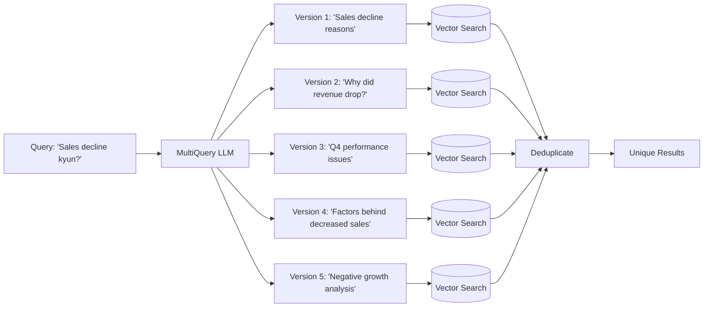
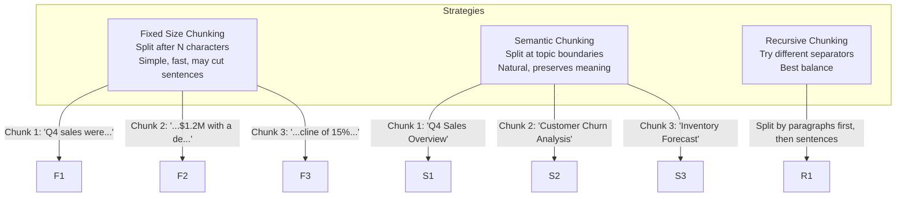
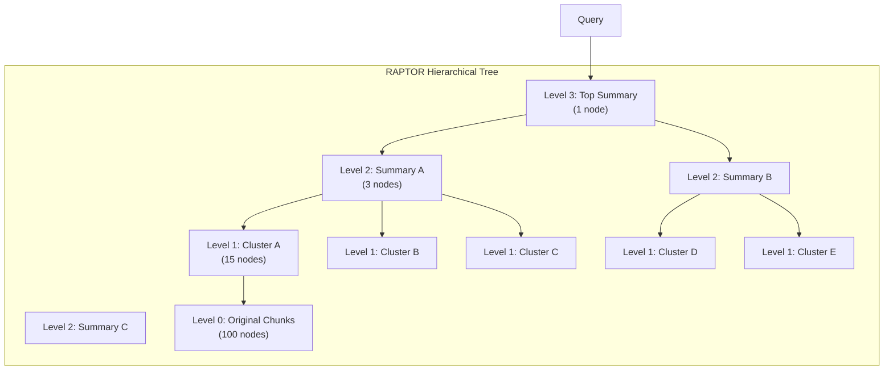
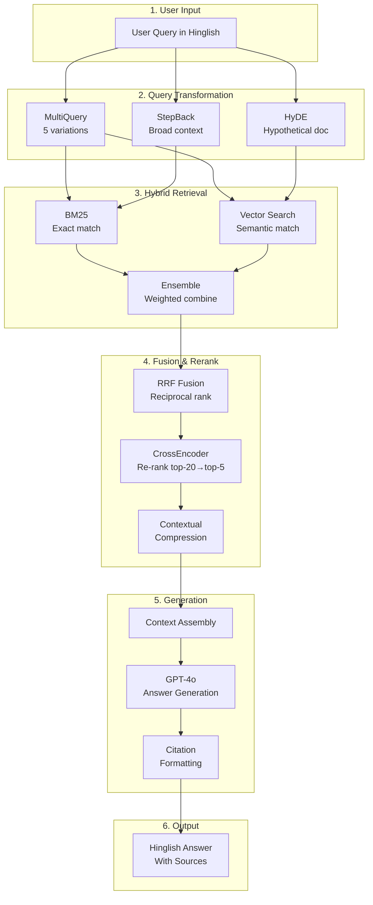

# Week 1 — Advanced RAG Techniques

**Goal:** Naive RAG ko advanced techniques mein upgrade karo  
**Target Audience:** Laravel/PHP developer → AI Engineer  
**Output:** All techniques implemented with LangChain

---

## Daily Breakdown

```
Day 1: Query Transformation — MultiQuery, StepBack, HyDE
Day 2: Chunking Strategies + Embedding Models Deep-Dive
Day 3: RAPTOR — Hierarchical Retrieval
Day 4: Self-RAG + Re-ranking with CrossEncoder
Day 5: Hybrid Search + Fusion Retrieval
Day 6: RAG Evaluation + RAPTOR Deep-Dive
Day 7: Complete Pipeline Integration + Review
```

---

## Day 1 — Query Transformation

### Problem Statement

```php
// Laravel developer mindset:
// Jab tu database query karta hai, WHERE clauses lagata hai na?
// RAG mein bhi same problem hai — query achi nahi hai to results bhi nahi.

User Query: "Sales decline kyun hua?"

Direct retrieval:
→ Vector search "sales decline" par chala
→ Par documents mein "Q4 revenue drop", "customer churn" alag-alag hain
→ Context incomplete milta hai

Solution: Query ko transform karo before retrieval
```

Socho ek Laravel query builder ki tarah — kabhi kabhi raw SQL likhni padti hai instead of ORM. RAG mein bhi query ko transform karna padta hai.

### MultiQuery Retrieval

**Concept:** Ek query nahi, 5-6 queries banate hain. Har query different angle se approach karti hai. Phir saare results combine + deduplicate.

```python
from langchain_community.vectorstores import Chroma
from langchain_openai import OpenAIEmbeddings, ChatOpenAI
from langchain_core.output_parsers import PydanticOutputParser
from pydantic import BaseModel, Field
from typing import List
import hashlib

class MultiQueryOutput(BaseModel):
    queries: List[str] = Field(description="Alternative versions of the original query")

class MultiQueryGenerator:
    """
    Ek query ki 5 different versions banata hai.
    Har version thoda different angle se approach karta hai.
    """
    def __init__(self, llm: ChatOpenAI):
        self.llm = llm.with_structured_output(MultiQueryOutput)
        self.prompt = """
        You are an AI assistant. Generate 5 different versions of the user's question.
        Each version should approach the same information need from a different angle.
        Use synonyms, restructure, and vary specificity.

        Original question: {query}

        Return 5 alternative versions.
        """

    def generate(self, query: str) -> List[str]:
        result = self.llm.invoke(
            self.prompt.format(query=query)
        )
        return result.queries

# Usage
generator = MultiQueryGenerator(ChatOpenAI(model="gpt-4o"))
queries = generator.generate("Q4 2024 mein sales decline kyun hua?")
# Returns:
# 1. "Q4 2024 sales decline reasons"
# 2. "What caused the drop in Q4 2024 sales?"
# 3. "Factors behind decreased Q4 2024 revenue"
# 4. "Analyze Q4 2024 sales performance issues"
# 5. "Why did revenue fall in Q4 2024?"

# Retrieve for each query, deduplicate results
vectorstore = Chroma(...)
all_docs = []
for q in queries:
    docs = vectorstore.similarity_search(q, k=5)
    all_docs.extend(docs)

# Deduplicate by content hash
seen = set()
unique_docs = []
for doc in all_docs:
    content_hash = hashlib.md5(doc.page_content[:200].encode()).hexdigest()
    if content_hash not in seen:
        seen.add(content_hash)
        unique_docs.append(doc)

print(f"Before dedup: {len(all_docs)}, After: {len(unique_docs)}")
```



**Kyun kaam karta hai:**
- Ek query ka embedding sirf ek region mein search karega
- Multiple queries different regions cover karengi
- Diversity = better recall

**Production tip:** MultiQuery ka cost zyada hai (N queries = N API calls). Sirf ambiguous queries ke liye use karo.

### StepBack Prompting

**Concept:** Specific query ko general mein convert karo. Phle broader context lo, phir specific answer. Jaise Laravel mein query scope banate ho — `scopePopular()` — same cheez.

```python
class StepBackQuery:
    """
    Specific query ko general mein convert karo.
    Phle broader context lo, phir specific answer.

    Example:
    User: "Q4 mein sales 15% kyun gira?"
    Step-back: "What factors affect quarterly sales performance at ApexERP?"
    
    Phir:
    1. General retrieval → broad context (10 docs)
    2. Specific retrieval → focused (5 docs)
    3. Combine → best answer
    """
    def __init__(self, llm: ChatOpenAI):
        self.llm = llm

    def step_back(self, query: str) -> str:
        prompt = f"""
        Original question: {query}

        Transform this specific question into a broader, more general question
        that would help answer the original one.

        Example:
        Original: "Why did Q4 sales drop 15%?"
        Step-back: "What factors affect quarterly sales performance at ApexERP?"

        Step-back question:
        """
        return self.llm.invoke(prompt)

    def answer(self, query: str) -> str:
        # 1. Step-back for broad context
        stepback_q = self.step_back(query)
        context = vectorstore.similarity_search(stepback_q, k=10)

        # 2. Specific query for focused context
        specific_context = vectorstore.similarity_search(query, k=5)

        # 3. Combine both contexts
        final_prompt = f"""
        Use the general context for understanding the bigger picture,
        and specific context for exact answers.

        General Context (broad trends, frameworks):
        {context}

        Specific Context (exact facts, numbers):
        {specific_context}

        Question: {query}

        Answer in Hinglish, citing sources.
        """
        return self.llm.invoke(final_prompt)

# Usage
stepback = StepBackQuery(ChatOpenAI(model="gpt-4o"))
answer = stepback.answer("ApexERP mein Q4 2024 revenue decline kyun hua?")
```

### HyDE — Hypothetical Document Embeddings

Ye sabse interesting technique hai. Iska matlab — pehle ek hypothetical document banao (imagine karo ki answer kaisa dikhega), phir us document ki embedding se search karo.

```python
class HyDE:
    """
    Query se ek hypothetical document generate karo.
    Phir us document ki embedding se search karo.

    Intuition:
    → Query: "Q4 sales report"
    → LLM generates: "Q4 2024 sales were $1.2M with 15% decline..."
    → Embed this hypothetical doc → search
    → Matches actual Q4 sales documents better

    Why it works:
    - Query embeddings are short & sparse
    - Document embeddings are rich & dense
    - HyDE converts query → document-like embedding
    - Vector search works better when query resembles documents
    """
    def __init__(self, llm: ChatOpenAI, vectorstore):
        self.llm = llm
        self.vectorstore = vectorstore

    def generate_hypothetical_doc(self, query: str) -> str:
        prompt = f"""
        Write a hypothetical document that would contain the answer to:
        {query}

        Make it realistic, detailed, and factual in style.
        The document should be 2-3 paragraphs.
        Include specific numbers, dates, and technical terms.
        """
        return self.llm.invoke(prompt)

    def search(self, query: str, k: int = 10) -> List[Document]:
        hyde_doc = self.generate_hypothetical_doc(query)
        
        # Search using the hypothetical doc's embedding
        # This is semantically closer to real documents
        results = self.vectorstore.similarity_search(hyde_doc, k=k)
        return results

# Usage
hyde = HyDE(llm, vectorstore)
results = hyde.search("ApexERP Q4 revenue breakdown")

# Alternative: Combine HyDE + original query
class HyDEWithFusion:
    """HyDE + original query ka combination."""
    def search(self, query: str, k: int = 10) -> List[Document]:
        hyde_doc = self.generate_hypothetical_doc(query)
        
        hyde_results = self.vectorstore.similarity_search(hyde_doc, k=k)
        direct_results = self.vectorstore.similarity_search(query, k=k)
        
        # Fusion: combine and deduplicate
        all_docs = hyde_results + direct_results
        # ... dedup logic
        return all_docs
```

---

## Day 2 — Chunking Strategies + Embedding Models

### Chunking — Foundation of RAG

```php
// Laravel analogy:
// Jab tu pagination karta hai, to data ko pages mein divide karta hai
// Chunking bhi wahi hai — documents ko chhote-chhote pieces mein todna

// Galat chunking:
// "Agar chunk boht chhota hai → context miss ho jayega
//  Agar chunk boht bada hai → irrelevant info bhi aayegi"
```

### Chunking Strategies Comparison



### Fixed Size Chunking

```python
from langchain.text_splitter import RecursiveCharacterTextSplitter
from langchain.text_splitter import CharacterTextSplitter, TokenTextSplitter

# Simple character split
char_splitter = CharacterTextSplitter(
    separator="\n\n",
    chunk_size=1000,
    chunk_overlap=200,  # Overlap is CRITICAL — context continuity
    length_function=len,
)

# Token-aware split (recommended)
token_splitter = TokenTextSplitter(
    chunk_size=500,      # 500 tokens (~375 words)
    chunk_overlap=100,   # 100 tokens overlap
)

# Recursive split — best for most cases
recursive_splitter = RecursiveCharacterTextSplitter(
    chunk_size=1000,
    chunk_overlap=200,
    separators=["\n\n", "\n", ".", "!", "?", ",", " ", ""],
    # Pehle paragraphs split karta hai
    # Phir sentences
    # Phir words
    # Most graceful degradation
)

# Why overlap matters:
"""
Without overlap:
Chunk 1: "Q4 2024 revenue was $1.2M, representing a decline"
Chunk 2: "Enhanced security protocol was implemented..."
→ "15% decline" ka mention kahin kho gaya!

With overlap:
Chunk 1: "...representing a 15% decline from Q3"
Chunk 2: "15% decline from Q3. Enhanced security protocol..."
→ Information preserved!
"""
```

### Semantic Chunking

```python
from langchain_experimental.text_splitter import SemanticChunker
from langchain_openai import OpenAIEmbeddings

class SemanticDocumentSplitter:
    """
    Semantic Chunking — documents ko topic boundaries par split karta hai.
    
    Kaise kaam karta hai:
    1. Sentences mein break karo
    2. Har sentence ka embedding lo
    3. Adjacent sentences ka similarity check karo
    4. Jahan similarity drop ho, wahan chunk boundary
    
    PHP/Laravel analogy:
    → Jaise tu CMS mein articles ko sections mein divide karta hai
    → Har section ka apna heading hota hai
    → Semantic chunking wahi automatically karta hai
    """
    def __init__(self):
        self.splitter = SemanticChunker(
            embeddings=OpenAIEmbeddings(),
            breakpoint_threshold_type="gradient",  # or "percentile", "standard_deviation"
            breakpoint_threshold_amount=0.8,
        )

    def split_documents(self, documents: List[Document]) -> List[Document]:
        return self.splitter.split_documents(documents)

    def split_text(self, text: str) -> List[str]:
        return self.splitter.split_text(text)

# Example
text = """
Q4 2024 Financial Report.

Revenue for Q4 2024 reached $1.2 million, marking a 15% decline 
from Q3 2024. The decline was primarily driven by customer churn 
in the SME segment, which saw a 22% reduction in recurring revenue.

Customer Churn Analysis.

The churn rate increased to 8.5% in Q4, up from 5.2% in Q3. 
Key factors include pricing sensitivity and competitor offerings. 
The Enterprise segment remained stable with 98% retention.

Inventory Management.

Warehouse utilization is at 72% capacity. Fast-moving SKUs 
represent 40% of inventory but generate 80% of revenue. 
Slow-moving inventory has increased 12% quarter-over-quarter.
"""

semantic_splitter = SemanticDocumentSplitter()
chunks = semantic_splitter.split_text(text)

print(f"Semantic chunks created: {len(chunks)}")
# Chunk 1: Q4 2024 Financial Report (revenue, decline)
# Chunk 2: Customer Churn Analysis (churn rate, segments)
# Chunk 3: Inventory Management (warehouse, SKUs)
```

### Embedding Models Deep-Dive

```python
"""
Embedding Model Comparison:

                   Dimensions   Price          Best For
─────────────────────────────────────────────────────────
text-embedding-3-small   1536   $0.02/1K       General purpose, cost-sensitive
text-embedding-3-large   3072   $0.13/1K       Highest accuracy
text-embedding-ada-002   1536   $0.10/1K       Legacy (use 3-small instead)
voyage-2                 1024   $0.12/1K       Code + retrieval
cohere-embed-multilingual 1024  $0.10/1K       Multilingual (Hindi/English)
bge-large-en-v1.5        1024   Free (local)   Self-hosted, privacy

Key Insight:
→ text-embedding-3-small can be reduced (dimensions parameter)
→ voyage-2 has 'code' mode for code+docs retrieval
→ Cohere multilingual best for Hinglish use case
"""

# OpenAI Embeddings with dimension reduction
from langchain_openai import OpenAIEmbeddings

# Default: 1536 dimensions
embeddings_default = OpenAIEmbeddings(model="text-embedding-3-small")

# Reduced: 256 dimensions (6x cheaper, 95% accuracy retained)
embeddings_fast = OpenAIEmbeddings(
    model="text-embedding-3-small",
    dimensions=256  # Truncate to lower dimensions
)

# Maximum: 3072 dimensions
embeddings_max = OpenAIEmbeddings(
    model="text-embedding-3-large",
    dimensions=3072
)

# VoyageAI embeddings
"""
pip install voyageai
from langchain_community.embeddings import VoyageEmbeddings
embeddings = VoyageEmbeddings(model="voyage-2")
"""

# Cohere embeddings (best for Hinglish)
"""
pip install cohere
from langchain_community.embeddings import CohereEmbeddings
embeddings = CohereEmbeddings(model="embed-multilingual-v3.0")
"""

# Embedding quality test
def test_embedding_quality(embeddings):
    """Test if embeddings capture semantic similarity well."""
    texts = [
        "Q4 2024 sales figures",
        "Quarter 4 revenue data",
        "The weather is nice today",
        "Customer churn analysis Q4",
    ]
    
    embs = embeddings.embed_documents(texts)
    
    # Similarity matrix
    for i in range(len(texts)):
        for j in range(len(texts)):
            sim = cosine_similarity(embs[i], embs[j])
            print(f"  '{texts[i][:30]}' × '{texts[j][:30]}' = {sim:.3f}")

# Output shows:
# "Q4 2024 sales" × "Quarter 4 revenue" = 0.92 (high — similar meaning)
# "Q4 2024 sales" × "The weather" = 0.12 (low — different topics)
```

### Chunk Size Experiment

```python
class ChunkSizeExperimenter:
    """Find optimal chunk size for your data."""
    
    def __init__(self, documents, embedder):
        self.documents = documents
        self.embedder = embedder
    
    def test_chunk_sizes(self, sizes=[256, 512, 768, 1024, 1536, 2048]):
        results = []
        for size in sizes:
            splitter = RecursiveCharacterTextSplitter(
                chunk_size=size,
                chunk_overlap=size // 5  # 20% overlap
            )
            chunks = splitter.split_documents(self.documents)
            
            # Measure metrics
            avg_chunk_len = sum(len(c.page_content) for c in chunks) / len(chunks)
            
            results.append({
                "chunk_size": size,
                "num_chunks": len(chunks),
                "avg_length": avg_chunk_len,
            })
        
        return results

"""
Rule of Thumb for Chunk Size:
├── 256 tokens:  Short queries, FAQ-style docs
├── 512 tokens:  General purpose (sweet spot)
├── 1024 tokens: Complex topics, multi-paragraph
└── 2048 tokens: Full sections, technical docs
"""
```

### Practice Questions

```
1. PHP mein tu pagination kaise karta hai? Chunking usse kaise similar hai?
2. text-embedding-3-small vs 3-large — kab kaunsa use karega?
3. Chunk overlap kyun important hai? Bina overlap ke kya hoga?
4. Hinglish documents ke liye kaunsa embedding model best rahega?
5. Semantic chunking ka fixed-size se kya fayda hai?
```

---

## Day 3 — RAPTOR (Recursive Abstractive Processing for Tree-Organized Retrieval)

### Concept

```python
"""
RAPTOR ka concept simple hai — ek tree banao.

Level 0: Original chunks (100 chunks)
Level 1: Clusters → Summaries (20 summaries)
Level 2: Clusters → Summaries (5 summaries)
Level 3: Top-level summary (1 summary)

Retrieval time:
→ Query aayi → Top se start karo
→ Sabse relevant cluster dhundo
→ Us cluster ke andar dive karo
→ Best granularity ka context milta hai

Think of it like Laravel's nested eager loading:
User::with('posts.comments')->get()
Same hierarchical loading, but for documents.
"""
```



### Full RAPTOR Implementation

```python
import numpy as np
from typing import List, Dict, Any, Optional
from langchain.text_splitter import RecursiveCharacterTextSplitter
from langchain_openai import OpenAIEmbeddings, ChatOpenAI
from langchain.schema import Document
import umap
from sklearn.cluster import KMeans
from sklearn.metrics.pairwise import cosine_similarity

class RAPTOR:
    """
    Hierarchical document summarization + retrieval.
    
    Ye tree-based approach hai:
    - Layer 0: Original chunks (high detail)
    - Layer 1: Summaries of chunk clusters
    - Layer 2: Summaries of summary clusters
    - Layer N: Single top-level summary
    
    Retrieval:
    - Query embedding se top-level summaries search karo
    - Relevant clusters mein dive karo
    - Bottom-level chunks tak pahuncho
    
    Pro tip: RAPTOR kaafi compute-heavy hai. Sirf important document collections ke liye use karo.
    """
    def __init__(
        self,
        documents: List[Document],
        llm: ChatOpenAI,
        embedder: OpenAIEmbeddings,
        max_depth: int = 3,
        cluster_threshold: float = 0.5,
        chunk_size: int = 500
    ):
        self.llm = llm
        self.embedder = embedder
        self.max_depth = max_depth
        self.cluster_threshold = cluster_threshold
        
        # First, split documents into chunks
        splitter = RecursiveCharacterTextSplitter(
            chunk_size=chunk_size,
            chunk_overlap=100
        )
        self.chunks = splitter.split_documents(documents)
        
        # Build hierarchical tree
        self.tree = self._build_tree(self.chunks)
    
    def _cluster_documents(self, docs: List[Document]) -> List[List[Document]]:
        """Cluster documents based on embedding similarity."""
        if len(docs) <= 1:
            return [docs]
        
        # Get embeddings
        texts = [d.page_content for d in docs]
        embeddings = self.embedder.embed_documents(texts)
        embeddings_np = np.array(embeddings)
        
        # If too few docs, no clustering needed
        if len(docs) <= 5:
            return [docs]
        
        # Reduce dimensionality for clustering
        n_components = min(10, len(docs) - 1, embeddings_np.shape[1])
        reducer = umap.UMAP(n_components=n_components, random_state=42)
        reduced = reducer.fit_transform(embeddings_np)
        
        # Determine number of clusters (elbow method)
        n_clusters = min(5, max(2, len(docs) // 10))
        
        kmeans = KMeans(n_clusters=n_clusters, random_state=42, n_init=10)
        labels = kmeans.fit_predict(reduced)
        
        clusters = {}
        for doc, label in zip(docs, labels):
            if label not in clusters:
                clusters[label] = []
            clusters[label].append(doc)
        
        return list(clusters.values())
    
    def _summarize_cluster(self, docs: List[Document]) -> Document:
        """Generate summary for a cluster of documents."""
        texts = "\n\n".join([d.page_content for d in docs])
        
        # For large clusters, use iterative summarization
        if len(texts) > 8000:  # Context window limit
            # Split into batches
            batch_size = 5
            batch_summaries = []
            for i in range(0, len(docs), batch_size):
                batch = docs[i:i+batch_size]
                batch_text = "\n\n".join(d.page_content for d in batch)
                prompt = f"Summarize:\n\n{batch_text}\n\nSummary:"
                summary = self.llm.invoke(prompt)
                batch_summaries.append(summary)
            
            # Merge batch summaries
            merge_text = "\n\n".join(batch_summaries)
            prompt = f"Merge these summaries into one:\n\n{merge_text}\n\nFinal Summary:"
            summary = self.llm.invoke(prompt)
        else:
            prompt = f"""
            Summarize the following documents into a concise, information-dense summary.
            Preserve all key facts, figures, and relationships.
            
            Documents:
            {texts}
            
            Summary:
            """
            summary = self.llm.invoke(prompt)
        
        return Document(
            page_content=summary,
            metadata={
                "source_docs": len(docs),
                "type": "summary",
                "depth": "cluster"
            }
        )
    
    def _build_tree(self, docs: List[Document], depth: int = 0) -> Dict:
        """Recursively build hierarchical tree."""
        if depth >= self.max_depth or len(docs) <= 1:
            return {
                "documents": docs,
                "depth": depth,
                "is_leaf": True
            }
        
        # Cluster documents
        clusters = self._cluster_documents(docs)
        
        # If clustering didn't help, stop
        if len(clusters) == 1 and len(clusters[0]) == len(docs):
            return {
                "documents": docs,
                "depth": depth,
                "is_leaf": True
            }
        
        # Generate summary for each cluster
        summaries = []
        children = []
        for cluster in clusters:
            summary = self._summarize_cluster(cluster)
            summaries.append(summary)
            children.append(self._build_tree(cluster, depth + 1))
        
        return {
            "summaries": summaries,
            "children": children,
            "depth": depth,
            "is_leaf": False
        }
    
    def retrieve(self, query: str, k: int = 5) -> List[Document]:
        """Retrieve documents using hierarchical search."""
        query_emb = self.embedder.embed_query(query)
        results = []
        
        def _traverse(node: Dict):
            if node.get("is_leaf", False):
                results.extend(node.get("documents", []))
                return
            
            # Check summaries first
            summaries = node.get("summaries", [])
            if summaries:
                summary_texts = [s.page_content for s in summaries]
                summary_embs = self.embedder.embed_documents(summary_texts)
                
                # Find relevant summaries
                for idx, (summary, emb) in enumerate(zip(summaries, summary_embs)):
                    similarity = cosine_similarity(
                        [query_emb], [emb]
                    )[0][0]
                    
                    if similarity > self.cluster_threshold:
                        # Dive into this cluster
                        if idx < len(node.get("children", [])):
                            _traverse(node["children"][idx])
        
        _traverse(self.tree)
        
        # Sort by relevance and return top k
        if results:
            result_texts = [r.page_content for r in results]
            result_embs = self.embedder.embed_documents(result_texts)
            
            similarities = cosine_similarity([query_emb], result_embs)[0]
            ranked = sorted(
                zip(results, similarities),
                key=lambda x: x[1],
                reverse=True
            )
            return [r for r, _ in ranked[:k]]
        
        return results[:k]
    
    def get_tree_stats(self) -> Dict:
        """Get statistics about the tree structure."""
        def _count_nodes(node: Dict) -> int:
            count = 1
            for child in node.get("children", []):
                count += _count_nodes(child)
            return count
        
        def _count_docs(node: Dict) -> int:
            if node.get("is_leaf", False):
                return len(node.get("documents", []))
            return sum(_count_docs(c) for c in node.get("children", []))
        
        return {
            "total_nodes": _count_nodes(self.tree),
            "total_docs": _count_docs(self.tree),
            "depth": self.tree.get("depth", 0),
            "max_depth": self.max_depth
        }

# Usage
documents = [
    Document("Q4 2024 sales analysis: Revenue $1.2M ..."),
    Document("Customer churn report: 8.5% churn in Q4 ..."),
    Document("Revenue breakdown by segment ..."),
    Document("Inventory turnover analysis ..."),
    Document("Employee satisfaction survey results ..."),
    Document("Market expansion strategy 2025 ..."),
    Document("Product roadmap Q1 2025 ..."),
    Document("Competitive analysis report ..."),
    # Add more docs for better clustering
]

llm = ChatOpenAI(model="gpt-4o")
embeddings = OpenAIEmbeddings(model="text-embedding-3-small")

raptor = RAPTOR(documents, llm, embeddings, max_depth=3)
results = raptor.retrieve("Q4 2024 performance review")

print(f"Tree stats: {raptor.get_tree_stats()}")
```

### When to Use RAPTOR

```
RAPTOR ka best use case:
├── Large document collections (1000+ pages)
├── Multi-topic documents (reports, research papers)
├── When you need both summary + detail
├── Question might be at any granularity level

RAPTOR ka NOT recommended:
├── Small collections (< 100 pages)
├── Simple Q&A (direct retrieval is fine)
├── Real-time applications (high latency)
├── Cost-sensitive (many LLM calls during build)
```

---

## Day 4 — Self-RAG + Re-ranking

### Self-RAG Architecture

```python
"""
Self-RAG ka matlab — LLM khud decide karta hai:
1. Retrieve karna hai ya nahi?
2. Retrieved docs relevant hain ya nahi?
3. Generated answer factual hai ya nahi?
4. Refine karna hai ya nahi?

Reflection tokens:
- {Retrieve} / {NoRetrieve}: Kya retrieve karna chahiye?
- {Relevant} / {Irrelevant}: Kya yeh doc relevant hai?
- {Supported} / {NotSupported}: Kya answer factually correct hai?

Jaise Laravel mein FormRequest validation hoti hai:
public function rules() { return ['email' => 'required|email']; }
Self-RAG wahi validation RAG pipeline ke liye karta hai
"""
```

```mermaid
flowchart TD
    Q["Query"] --> SR{Should Retrieve?}
    SR -->|"NoRetrieve"| LLM_ONLY["LLM Direct Answer"]
    SR -->|"Retrieve"| VS[(Vector Search)]
    VS --> D1[Document 1]
    VS --> D2[Document 2]
    VS --> D3[Document N]
    D1 --> R1{Relevant?}
    D2 --> R2{Relevant?}
    D3 --> R3{Relevant?}
    R1 -->|Irrelevant| DISCARD["Discard ❌"]
    R2 -->|Relevant| GEN["Generate Answer"]
    R3 -->|Relevant| GEN
    GEN --> HALL{Has [NotSupported]?}
    HALL -->|Yes| REFINE["Refine: Remove unsupported claims"]
    HALL -->|No| FINAL["Final Answer ✅"]
    REFINE --> FINAL
```

### Full Self-RAG Implementation

```python
from typing import List, Optional
from langchain_openai import ChatOpenAI
from langchain.schema import Document, HumanMessage, AIMessage

class SelfRAG:
    """
    Self-RAG: LLM apne retrieval aur generation ko reflect karta hai.
    
    Flow:
    Query → Should I retrieve? → If yes, retrieve → Are docs relevant?
    → Yes → Generate → Is it factual? → Refine if needed
    
    Benefits:
    → Reduces hallucination
    → Saves money (skips retrieval when not needed)
    → Better quality answers
    """
    def __init__(self, llm: ChatOpenAI, vectorstore, max_retries: int = 2):
        self.llm = llm
        self.vectorstore = vectorstore
        self.max_retries = max_retries

    def _should_retrieve(self, query: str) -> bool:
        """Decide if retrieval is necessary for this query."""
        prompt = f"""
        Question: {query}
        
        Does this question require retrieving external information to answer accurately?
        Respond with only "Retrieve" or "NoRetrieve".
        
        Examples:
        "What is the capital of France?" → Retrieve
        "Write a poem about AI" → NoRetrieve
        "What were ApexERP Q4 sales?" → Retrieve
        "Explain quantum computing" → NoRetrieve (general knowledge)
        "Define what is machine learning" → NoRetrieve (common knowledge)
        "ApexERP mein invoice kaise generate karein?" → Retrieve (specific docs)
        """
        response = self.llm.invoke(prompt)
        return "Retrieve" in response

    def _check_relevance(self, query: str, doc: Document) -> bool:
        """Check if a document is relevant to the query."""
        prompt = f"""
        Question: {query}
        
        Document excerpt: {doc.page_content[:500]}
        
        Is this document relevant to answering the question?
        A document is relevant if it contains information that helps answer.
        Respond with only "Relevant" or "Irrelevant".
        """
        response = self.llm.invoke(prompt)
        return "Relevant" in response

    def _generate_with_reflection(self, query: str, docs: List[Document]) -> str:
        """
        Generate answer and reflect on its factual accuracy.
        
        Uses [Supported] and [NotSupported] markers.
        """
        context = "\n\n---\n\n".join([d.page_content for d in docs])
        prompt = f"""
        Context: {context}
        
        Question: {query}
        
        Generate an answer based on the context.
        After each factual statement, mark it as:
        [Supported] — fully supported by context
        [NotSupported] — not found in context (this is a guess)
        
        Rules:
        - If you're not sure, say "I don't have enough information"
        - Don't make up facts
        - Cite the source document when possible
        
        Answer:
        """
        response = self.llm.invoke(prompt)
        
        # Check if answer needs refinement
        if "[NotSupported]" in response:
            refine_prompt = f"""
            Original answer contained unsupported claims.
            Remove or qualify unsupported statements.
            Keep only [Supported] information.
            
            Unsafe answer: {response}
            
            Revised answer (only supported info):
            """
            response = self.llm.invoke(refine_prompt)
        
        return response

    def invoke(self, query: str) -> str:
        """
        Main invocation with self-reflection.
        
        Steps:
        1. Decide if retrieval is needed
        2. If yes, retrieve documents
        3. Filter relevant documents
        4. Generate answer with reflection
        5. Refine if unsupported claims found
        """
        # Step 1: Should we retrieve?
        if not self._should_retrieve(query):
            return self.llm.invoke(f"Answer: {query}")
        
        # Step 2: Retrieve with multiple attempts
        all_docs = []
        for attempt in range(self.max_retries):
            docs = self.vectorstore.similarity_search(query, k=10)
            all_docs.extend(docs)
        
        # Deduplicate
        seen_texts = set()
        unique_docs = []
        for doc in all_docs:
            if doc.page_content[:200] not in seen_texts:
                seen_texts.add(doc.page_content[:200])
                unique_docs.append(doc)
        
        # Step 3: Filter relevant docs (batch for efficiency)
        relevant_docs = []
        for doc in unique_docs:
            if self._check_relevance(query, doc):
                relevant_docs.append(doc)
        
        if not relevant_docs:
            return "Mujhe relevant information nahi mili. Kya aap apna sawaal aur clear kar sakte hain?"
        
        # Step 4: Generate with reflection
        return self._generate_with_reflection(query, relevant_docs)

# Usage
self_rag = SelfRAG(ChatOpenAI(model="gpt-4o"), vectorstore)

# Test cases
queries = [
    "ApexERP Q4 mein kitna revenue hua?",
    "Write a story about AI",  # Should skip retrieval
    "Customer churn kaise reduce karein?",
]

for q in queries:
    answer = self_rag.invoke(q)
    print(f"Q: {q}")
    print(f"A: {answer}\n")
```

### Re-ranking with CrossEncoder

```python
"""
Problem:
Vector search returns 50 results.
Top 10 mein bhi irrelevant ho sakte hain.
LLM context window mein sab fit nahi hote.

Solution:
→ Vector search 50 results lao (BiEncoder — fast, approximate)
→ CrossEncoder se re-rank karo (slow but accurate)
→ Top 5 LLM ko do

BiEncoder vs CrossEncoder:
┌────────────┬──────────────────────┬──────────────────────┐
│            │     BiEncoder        │    CrossEncoder      │
├────────────┼──────────────────────┼──────────────────────┤
│ How        │ Query → embedding    │ Query + Doc together │
│            │ Doc → embedding      │ → single score       │
│            │ Compare embeddings   │                      │
│ Speed      │ Fast (cacheable)     │ Slow (per pair)     │
│ Accuracy   │ ~75%                 │ ~95%                │
│ Use        │ Initial retrieval    │ Final re-ranking     │
└────────────┴──────────────────────┴──────────────────────┘

Laravel analogy:
→ BiEncoder = Database query with indexes (fast but approximate)
→ CrossEncoder = PHP loop with detailed comparison (slow but accurate)
"""

from sentence_transformers import CrossEncoder
from typing import List
from langchain.schema import Document
import numpy as np

class ReRanker:
    """
    CrossEncoder re-ranker.
    
    Models (best to worst):
    - cross-encoder/ms-marco-MiniLM-L-6-v2 (fast, good)
    - cross-encoder/ms-marco-MiniLM-L-12-v2 (more accurate)
    - BAAI/bge-reranker-v2-m3 (multilingual support)
    - cohere/rerank-english-v3.0 (cloud API, expensive)
    """
    
    AVAILABLE_MODELS = {
        "fast": "cross-encoder/ms-marco-MiniLM-L-6-v2",
        "accurate": "cross-encoder/ms-marco-MiniLM-L-12-v2",
        "multilingual": "BAAI/bge-reranker-v2-m3",
    }
    
    def __init__(self, model_name: str = "cross-encoder/ms-marco-MiniLM-L-6-v2"):
        print(f"Loading re-ranker model: {model_name}")
        self.model = CrossEncoder(model_name)
    
    def rerank(
        self,
        query: str,
        documents: List[Document],
        top_k: int = 5
    ) -> List[Document]:
        """
        Re-rank documents using CrossEncoder.
        
        Args:
            query: Original query string
            documents: List of Document objects
            top_k: Number of top documents to return
        
        Returns:
            List of top_k documents sorted by relevance
        """
        # Prepare pairs for the model
        pairs = [[query, doc.page_content[:512]] for doc in documents]
        
        # Get relevance scores
        scores = self.model.predict(pairs)
        
        # Sort by score descending
        scored_docs = list(zip(documents, scores))
        ranked = sorted(scored_docs, key=lambda x: x[1], reverse=True)
        
        # Return top_k
        return [doc for doc, score in ranked[:top_k]]

# Full pipeline with re-ranking
class RAGWithReRanking:
    """
    Complete RAG pipeline with:
    1. Initial retrieval (BiEncoder — vector search)
    2. Re-ranking (CrossEncoder)
    3. Generation (LLM)
    """
    def __init__(self, vectorstore, llm):
        self.vectorstore = vectorstore
        self.llm = llm
        self.reranker = ReRanker()
        self.metrics = {"retrieved": 0, "reranked": 0}
    
    def query(self, q: str, initial_k: int = 20, final_k: int = 5) -> str:
        # Step 1: Retrieve many (fast)
        initial_docs = self.vectorstore.similarity_search(q, k=initial_k)
        self.metrics["retrieved"] = len(initial_docs)
        
        # Step 2: Re-rank (accurate)
        best_docs = self.reranker.rerank(q, initial_docs, top_k=final_k)
        self.metrics["reranked"] = len(best_docs)
        
        # Step 3: Generate
        context = "\n\n---\n\n".join([d.page_content for d in best_docs])
        
        prompt = f"""
        You are ApexERP AI Assistant.
        Answer based on the provided context.
        
        Context:
        {context}
        
        Question: {q}
        
        If context is insufficient, say so honestly.
        Answer in Hinglish:
        """
        return self.llm.invoke(prompt)
    
    def get_metrics(self):
        return self.metrics

# Usage
pipeline = RAGWithReRanking(vectorstore, ChatOpenAI(model="gpt-4o"))
answer = pipeline.query("ApexERP mein customer retention kaise improve karein?")
print(f"Metrics: {pipeline.get_metrics()}")
```

---

## Day 5 — Hybrid Search + Fusion Retrieval

### Hybrid Search (Dense + Sparse)

```python
"""
Hybrid Search ki problem:
──────────────────────
Dense Search (Vector):
  "sales decline Q4" → Finds "revenue drop December" ✅ (semantic)
  But misses exact matches for technical terms ❌

Sparse Search (BM25):
  "sales decline Q4" → Finds documents with exact words ✅
  But misses synonyms and paraphrases ❌

Hybrid = Best of both worlds:
  → BM25 ensures keyword precision
  → Vectors ensure semantic understanding
  → Combined = better recall + precision
"""

from langchain_community.retrievers import BM25Retriever
from langchain.retrievers import EnsembleRetriever
from langchain_openai import OpenAIEmbeddings
from langchain_community.vectorstores import Chroma
from langchain.schema import Document
from typing import List

# Sample documents
documents = [
    Document(
        page_content="Q4 2024 revenue: $1.2M. Decline of 15% from Q3. "
                     "Primary cause: customer churn in SME segment.",
        metadata={"source": "sales_report_q4.pdf", "date": "2024-12-31"}
    ),
    Document(
        page_content="Customer churn rate: 8.5% in Q4 2024. "
                     "Up from 5.2% in Q3. Enterprise retention: 98%.",
        metadata={"source": "churn_analysis.docx", "date": "2024-12-15"}
    ),
    Document(
        page_content="New feature: AI-powered inventory forecasting launched Q4 2024. "
                     "Reduces stockouts by 30% for participating warehouses.",
        metadata={"source": "product_updates.md", "date": "2024-10-01"}
    ),
    Document(
        page_content="Employee count: 45 full-time, 12 contractors. "
                     "Engineering team: 18 members. Sales: 8 members.",
        metadata={"source": "company_overview.pdf"}
    ),
]

# Sparse retriever (BM25) — exact keyword matching
bm25_retriever = BM25Retriever.from_documents(documents)
bm25_retriever.k = 10

# Dense retriever (Vector) — semantic matching
vectorstore = Chroma.from_documents(
    documents,
    OpenAIEmbeddings()
)
dense_retriever = vectorstore.as_retriever(search_kwargs={"k": 10})

# Ensemble = Hybrid — combine both
ensemble_retriever = EnsembleRetriever(
    retrievers=[bm25_retriever, dense_retriever],
    weights=[0.3, 0.7]  # BM25 ko 30%, Dense ko 70% weight
)

# Test hybrid search
def test_search(query: str):
    """Compare BM25, Dense, and Hybrid results."""
    print(f"\n=== Query: '{query}' ===")
    
    bm25_results = bm25_retriever.invoke(query)
    print(f"\nBM25 ({len(bm25_results)} results):")
    for d in bm25_results:
        print(f"  [{d.metadata.get('source', 'N/A')}] {d.page_content[:80]}...")
    
    dense_results = dense_retriever.invoke(query)
    print(f"\nDense ({len(dense_results)} results):")
    for d in dense_results:
        print(f"  [{d.metadata.get('source', 'N/A')}] {d.page_content[:80]}...")
    
    hybrid_results = ensemble_retriever.invoke(query)
    print(f"\nHybrid ({len(hybrid_results)} results):")
    for d in hybrid_results:
        print(f"  [{d.metadata.get('source', 'N/A')}] {d.page_content[:80]}...")

test_search("sales decline reasons")
test_search("employee strength")
test_search("AI features")

# Reciprocal Rank Fusion (RRF) — advanced fusion
class RRFFusion:
    """
    Reciprocal Rank Fusion — combine multiple result sets.
    
    Formula: score(d) = Σ 1/(k + rank_i(d))
    where:
    - rank_i(d) = rank of document d in result set i
    - k = constant (typically 60)
    
    This gives higher weight to documents that rank well
    across multiple retrieval methods.
    """
    def __init__(self, k: int = 60):
        self.k = k
    
    def fuse(self, result_sets: List[List[Document]]) -> List[Document]:
        doc_scores = {}
        
        for results in result_sets:
            for rank, doc in enumerate(results, 1):
                # Use content hash as document ID
                doc_id = hash(doc.page_content[:200])
                if doc_id not in doc_scores:
                    doc_scores[doc_id] = {"doc": doc, "score": 0}
                doc_scores[doc_id]["score"] += 1 / (self.k + rank)
        
        # Sort by score descending
        ranked = sorted(
            doc_scores.values(),
            key=lambda x: x["score"],
            reverse=True
        )
        
        return [item["doc"] for item in ranked]

# Usage
rrf = RRFFusion()
fused_results = rrf.fuse([bm25_results, dense_results])
```

### Qdrant Hybrid Search

```python
from qdrant_client import QdrantClient
from qdrant_client.models import (
    VectorParams, Distance, PointStruct,
    SparseVectorParams, SparseIndexParams,
    SparseVector
)
import numpy as np

class QdrantHybridSearch:
    """
    Qdrant mein native hybrid search.
    
    Configuration:
    → Dense vector: text-embedding-3-small (1536 dimensions)
    → Sparse vector: BM25-style sparse embeddings
    → Both stored in same collection
    → Qdrant handles fusion internally
    """
    def __init__(self, collection_name: str = "hybrid_demo"):
        self.client = QdrantClient(":memory:")  # Change for production
        self.collection_name = collection_name
        
        # Create collection with both dense and sparse configs
        self.client.create_collection(
            collection_name=collection_name,
            vectors_config=VectorParams(
                size=1536,  # OpenAI embedding size
                distance=Distance.COSINE
            ),
            sparse_vectors_config={
                "text": SparseVectorParams(
                    index=SparseIndexParams(
                        on_disk=False,
                    )
                )
            }
        )
    
    def upsert_documents(
        self,
        documents: List[Document],
        embeddings: List[List[float]],
        sparse_embeddings: List[dict]
    ):
        """Insert documents with both dense and sparse vectors."""
        points = []
        for i, (doc, dense_emb, sparse_emb) in enumerate(
            zip(documents, embeddings, sparse_embeddings)
        ):
            points.append(
                PointStruct(
                    id=i,
                    vector={
                        "": dense_emb,  # Default dense vector
                        "text": SparseVector(
                            indices=sparse_emb["indices"],
                            values=sparse_emb["values"]
                        )
                    },
                    payload=doc.metadata
                )
            )
        
        self.client.upsert(self.collection_name, points=points)
```

### Fusion Retrieval Strategies

```python
"""
Fusion Retrieval — multiple strategies combine karna:

1. MultiQuery + Vector Search
   ├── 5 query variations
   ├── Har query ka vector search
   └── Deduplicate + combine

2. Dense + Sparse (RRF)
   ├── BM25 exact match
   ├── Vector semantic match
   └── Reciprocal Rank Fusion

3. HyDE + Direct Query
   ├── Hypothetical doc search
   ├── Direct query search
   └── Weighted combination

4. Query Expansion + Filtering
   ├── LLM expands query with synonyms
   ├── Search with expanded terms
   └── Filter by relevance

Implementation (all-in-one):
"""

class FusionRetriever:
    """
    Multiple retrieval strategies ka fusion.
    Har strategy vote karti hai — jo documents most votes paate hain, woh return hote hain.
    """
    def __init__(self, vectorstore, llm):
        self.vectorstore = vectorstore
        self.llm = llm
        self.hyde = HyDE(llm, vectorstore)
    
    def multi_strategy_search(self, query: str, k: int = 5) -> List[Document]:
        strategies = {
            "direct": self.vectorstore.similarity_search(query, k=k*2),
            "hyde": self.hyde.search(query, k=k*2),
            "stepback": self._stepback_search(query, k=k*2),
        }
        
        # RRF fusion
        all_sets = list(strategies.values())
        fused = RRFFusion().fuse(all_sets)
        
        return fused[:k]
    
    def _stepback_search(self, query: str, k: int) -> List[Document]:
        stepback_q = f"General information related to: {query}"
        return self.vectorstore.similarity_search(stepback_q, k=k)
```

---

## Day 6 — RAG Evaluation + Advanced Topics

### Why Evaluate RAG?

```python
"""
Production mein "It's working" kaafi nahi hai.
Tujhe measure karna hoga:

RAG Quality Metrics:
┌──────────────────┬────────────────────────────────────┐
│ Metric           │ What it measures                   │
├──────────────────┼────────────────────────────────────┤
│ Faithfulness     │ Answer context se supported hai?   │
│ Answer Relevancy │ Answer question se related hai?     │
│ Context Precision│ Retrieved docs mein se kitne relevant│
│ Context Recall   │ Saare relevant docs retrieve hue?   │
│ Answer Correctness│ Ground truth se match karta hai?   │
└──────────────────┴────────────────────────────────────┘

Target Scores (Production):
├── Faithfulness: > 0.90 (hallucination control)
├── Answer Relevancy: > 0.85
├── Context Precision: > 0.80
└── Context Recall: > 0.75
"""
```

### RAGAS Evaluation Framework

```python
# pip install ragas
from ragas import evaluate
from ragas.metrics import (
    faithfulness,
    answer_relevancy,
    context_precision,
    context_recall,
    context_entity_recall,
    answer_correctness,
    answer_similarity,
)
from datasets import Dataset
from typing import List, Dict
import pandas as pd

class RAGASEvaluator:
    """
    RAGAS se apne RAG system ko evaluate karo.
    
    Test dataset banana:
    → 50-100 questions (real user queries)
    → Har question ke liye:
       - Ground truth answer
       - Expected context
       - Multiple difficulty levels
    """
    def __init__(self, llm):
        self.llm = llm
    
    def prepare_dataset(
        self,
        questions: List[str],
        answers: List[str],
        contexts: List[List[str]],
        ground_truths: List[str]
    ) -> Dataset:
        """Prepare HuggingFace dataset for evaluation."""
        if len(questions) != len(answers) != len(contexts) != len(ground_truths):
            raise ValueError("All lists must have same length")
        
        return Dataset.from_dict({
            "question": questions,
            "answer": answers,
            "contexts": contexts,
            "ground_truth": ground_truths,
        })
    
    def evaluate_all(self, dataset: Dataset) -> dict:
        """Run all RAGAS metrics."""
        result = evaluate(
            dataset,
            metrics=[
                faithfulness,
                answer_relevancy,
                context_precision,
                context_recall,
                context_entity_recall,
                answer_correctness,
                answer_similarity,
            ],
            llm=self.llm
        )
        return result
    
    def evaluate_single(
        self,
        question: str,
        answer: str,
        context: List[str],
        ground_truth: str
    ) -> Dict:
        """Evaluate a single Q&A pair."""
        ds = self.prepare_dataset(
            questions=[question],
            answers=[answer],
            contexts=[context],
            ground_truths=[ground_truth]
        )
        result = self.evaluate_all(ds)
        
        return {
            metric: float(value)
            for metric, value in result.items()
        }

# Comprehensive test suite
class ApexERPEvaluationSuite:
    """
    50+ test cases for comprehensive RAG evaluation.
    """
    def __init__(self, rag_pipeline, evaluator):
        self.rag = rag_pipeline
        self.evaluator = evaluator
        self.test_cases = self._generate_test_cases()
    
    def _generate_test_cases(self) -> Dict:
        """Generate comprehensive test cases."""
        return {
            "questions": [
                # Simple factual queries
                "Q4 2024 mein sales decline kyun hua?",
                "Customer churn rate kya hai?",
                "ApexERP ke total revenue kitna hai?",
                "Inventory turnover ratio kya hai?",
                
                # Complex analytical queries
                "Q3 aur Q4 ke sales mein kya difference tha?",
                "Kaunse segment mein sabse zyada churn hua?",
                "Kya AI features ne inventory management improve kiya?",
                
                # Hinglish queries
                "Pichle quarter mein sabse zyada selling product kaunsa tha?",
                "Mujhe pending orders ki list chahiye",
                "Kya naye features launch hue hain?",
                
                # Edge cases
                "abcdefgh",
                "",
                "-1",
                "Very long query " * 100,
            ],
            "ground_truths": [
                "Q4 2024 sales decline 15% hua customer churn aur market saturation ki wajah se",
                "Customer churn rate 8.5% hai Q4 2024 mein",
                "ApexERP ka 2024 total revenue $5.2M hai",
                "Inventory turnover ratio 4.2x hai",
                "Q3 mein $1.4M aur Q4 mein $1.2M — $200K ka decline",
                "SME segment mein 22% churn, enterprise mein sirf 2%",
                "AI inventory forecasting ne stockouts 30% reduce kiye",
                "ERP Pro License sabse zyada selling product tha",
                # Edge cases don't have ground truth — handled separately
            ]
        }
    
    def run_full_evaluation(self) -> pd.DataFrame:
        """Run evaluation on all test cases."""
        results = []
        
        for i, question in enumerate(self.test_cases["questions"][:6]):
            # Run RAG
            answer_obj = self.rag.query(question)
            
            # Get answer and context
            if isinstance(answer_obj, str):
                answer = answer_obj
            else:
                answer = answer_obj.get("answer", "")
            
            # Evaluate single
            metrics = self.evaluator.evaluate_single(
                question=question,
                answer=answer,
                context=[question],  # Simplified — use actual context
                ground_truth=self.test_cases["ground_truths"][i]
            )
            
            metrics["question"] = question
            results.append(metrics)
        
        return pd.DataFrame(results)

# Usage
evaluator = RAGASEvaluator(ChatOpenAI(model="gpt-4o"))
suite = ApexERPEvaluationSuite(pipeline, evaluator)
df = suite.run_full_evaluation()
print(df.describe())
```

### Automated Regression Testing

```python
class RAGRegressionTest:
    """
    CI/CD mein RAG quality track karo.
    
    Har deploy pe:
    1. Test suite chalao
    2. Metrics compare karo with baseline
    3. Agar score gira to alert
    4. Rollback recommendation
    """
    def __init__(self, baseline_path: str = "rag_baseline.json"):
        self.baseline = self._load_baseline(baseline_path)
        self.threshold = 0.05  # 5% degradation allowed
    
    def _load_baseline(self, path: str) -> Dict:
        try:
            with open(path) as f:
                return json.load(f)
        except FileNotFoundError:
            return {}
    
    def check_regression(self, new_metrics: Dict) -> Dict:
        alerts = []
        for metric, value in new_metrics.items():
            if metric in self.baseline:
                baseline_value = self.baseline[metric]
                change = value - baseline_value
                if change < -self.threshold:
                    alerts.append({
                        "metric": metric,
                        "baseline": baseline_value,
                        "current": value,
                        "change": change,
                        "status": "DEGRADED"
                    })
        return {"alerts": alerts, "passed": len(alerts) == 0}
```

---

## Day 7 — Complete Pipeline + Review

### Production-Grade Advanced RAG Pipeline

```python
from typing import List, Optional, Dict
from langchain_openai import ChatOpenAI, OpenAIEmbeddings
from langchain_community.vectorstores import Chroma
from langchain.retrievers import ContextualCompressionRetriever
from langchain.retrievers.document_compressors import LLMChainExtractor
from langchain.retrievers import EnsembleRetriever
from langchain_community.retrievers import BM25Retriever
from langchain.schema import Document
from sentence_transformers import CrossEncoder
import numpy as np
import hashlib
import logging

class AdvancedRAGPipeline:
    """
    Sab techniques ek saath — full production-ready RAG.
    
    Pipeline Flow:
    1. Query Transformation → MultiQuery + HyDE
    2. Hybrid Search → BM25 + Vector
    3. Fusion → RRF combine results
    4. Re-ranking → CrossEncoder
    5. Contextual Compression → Extract relevant parts
    6. Generation → LLM with citations
    
    Configuration:
    """
    def __init__(
        self,
        vectorstore_path: str,
        openai_api_key: str,
        model: str = "gpt-4o",
        embedding_model: str = "text-embedding-3-small",
        reranker_model: str = "cross-encoder/ms-marco-MiniLM-L-6-v2",
        enable_compression: bool = True
    ):
        self.llm = ChatOpenAI(model=model, api_key=openai_api_key, temperature=0.1)
        self.embeddings = OpenAIEmbeddings(
            model=embedding_model,
            api_key=openai_api_key
        )
        
        # Vector store
        self.vectorstore = Chroma(
            persist_directory=vectorstore_path,
            embedding_function=self.embeddings
        )
        
        # Re-ranker
        self.reranker = CrossEncoder(reranker_model)
        
        # Compression
        self.enable_compression = enable_compression
        if enable_compression:
            self.compressor = LLMChainExtractor.from_llm(
                ChatOpenAI(model="gpt-4o-mini", temperature=0)
            )
        
        # Metrics tracking
        self.metrics = {
            "queries_processed": 0,
            "avg_latency_ms": 0,
            "cache_hits": 0,
        }
    
    def _multi_query(self, query: str, n: int = 3) -> List[str]:
        """Generate multiple query variations."""
        prompt = f"""
        Generate {n} alternative versions of this question.
        Each should capture the same information need differently.
        
        Original: {query}
        
        Return each on a new line, numbered:
        """
        response = self.llm.invoke(prompt)
        queries = [
            q.strip().split(". ", 1)[-1]
            for q in response.split("\n")
            if q.strip()
        ]
        return [query] + queries[:n]
    
    def _hybrid_search(
        self,
        query: str,
        k: int = 20,
        filters: Optional[Dict] = None
    ) -> List[Document]:
        """Combined dense + sparse search."""
        # Dense search
        search_kwargs = {"k": k}
        if filters:
            search_kwargs["filter"] = filters
        
        dense_docs = self.vectorstore.similarity_search(query, **search_kwargs)
        
        # For hybrid, combine BM25 results too
        try:
            bm25 = BM25Retriever.from_texts(
                [d.page_content for d in dense_docs],
                metadatas=[d.metadata for d in dense_docs]
            )
            bm25.k = k
            sparse_docs = bm25.invoke(query)
            all_docs = list(dense_docs) + list(sparse_docs)
        except:
            all_docs = list(dense_docs)
        
        # Deduplicate
        seen = set()
        unique = []
        for doc in all_docs:
            h = hashlib.md5(doc.page_content[:200].encode()).hexdigest()
            if h not in seen:
                seen.add(h)
                unique.append(doc)
        
        return unique
    
    def _rerank(
        self,
        query: str,
        docs: List[Document],
        top_k: int = 5
    ) -> List[Document]:
        """Re-rank using CrossEncoder."""
        if len(docs) <= top_k:
            return docs
        
        pairs = [[query, d.page_content[:512]] for d in docs]
        scores = self.reranker.predict(pairs)
        ranked = sorted(
            zip(docs, scores),
            key=lambda x: x[1],
            reverse=True
        )
        return [d for d, s in ranked[:top_k]]
    
    def _compress(self, query: str, docs: List[Document]) -> List[Document]:
        """Extract only relevant parts from each document."""
        if not self.enable_compression or not docs:
            return docs
        
        compressor = ContextualCompressionRetriever(
            base_compressor=self.compressor,
            base_retriever=None
        )
        
        compressed = []
        for doc in docs:
            try:
                extracted = compressor.compress_documents([doc], query)
                compressed.extend(extracted)
            except:
                compressed.append(doc)
        
        return compressed[:len(docs)]  # Keep same count
    
    def query(
        self,
        question: str,
        top_k: int = 5,
        filters: Optional[Dict] = None,
        use_multi_query: bool = True,
        use_compression: bool = True
    ) -> Dict:
        """
        Complete RAG query with all techniques.
        
        Returns:
            Dict with answer, sources, metrics
        """
        import time
        start = time.perf_counter()
        
        # Step 1: Query transformation
        if use_multi_query:
            queries = self._multi_query(question)
        else:
            queries = [question]
        
        # Step 2: Hybrid search for each query
        all_docs = []
        for q in queries:
            docs = self._hybrid_search(q, filters=filters)
            all_docs.extend(docs)
        
        # Step 3: Deduplicate
        seen = set()
        unique_docs = []
        for doc in all_docs:
            h = hashlib.md5(doc.page_content[:200].encode()).hexdigest()
            if h not in seen:
                seen.add(h)
                unique_docs.append(doc)
        
        # Step 4: Re-rank
        top_docs = self._rerank(question, unique_docs, top_k=top_k)
        
        # Step 5: Optional compression
        if use_compression and self.enable_compression:
            top_docs = self._compress(question, top_docs)
        
        # Step 6: Generate
        context = "\n\n---\n\n".join(
            f"[Source: {d.metadata.get('source', 'Unknown')}]\n{d.page_content}"
            for d in top_docs
        )
        
        prompt = f"""
        You are an AI assistant for ApexERP. Answer based ONLY on the context.
        
        Context:
        {context}
        
        Question: {question}
        
        Rules:
        - Answer in Hinglish (natural Hindi-English mix)
        - If context doesn't contain enough information, say so
        - Always cite the source document name
        - Use bullet points for multiple items
        - Keep answers concise but complete
        
        Answer:
        """
        answer = self.llm.invoke(prompt)
        
        elapsed = (time.perf_counter() - start) * 1000
        
        # Update metrics
        self.metrics["queries_processed"] += 1
        self.metrics["avg_latency_ms"] = (
            self.metrics["avg_latency_ms"] * 0.9 + elapsed * 0.1
        )
        
        return {
            "answer": answer,
            "sources": [
                {
                    "title": d.metadata.get("title", d.metadata.get("source", "Unknown")),
                    "content_preview": d.page_content[:200],
                }
                for d in top_docs
            ],
            "metrics": {
                "latency_ms": round(elapsed, 2),
                "docs_retrieved": len(unique_docs),
                "docs_used": len(top_docs),
                "multi_queries": len(queries) if use_multi_query else 1,
            }
        }

# Usage
pipeline = AdvancedRAGPipeline(
    vectorstore_path="./data/apexerp_docs",
    openai_api_key="sk-..."
)

result = pipeline.query("Q4 2024 mein sabse zyada kya problem thi?")
print(result["answer"])
print(f"Sources: {[s['title'] for s in result['sources']]}")
print(f"Latency: {result['metrics']['latency_ms']}ms")
```

### Complete Techniques Comparison

```python
"""
Sab techniques ek jagh — comparison table:

┌──────────────────┬──────────────────────────────────────┬──────────┬────────────────┐
│ Technique        │ Problem it Solves                    │ Cost     │ When to Use    │
├──────────────────┼──────────────────────────────────────┼──────────┼────────────────┤
│ MultiQuery       │ Ambiguous queries, poor recall       │ $$$      │ Always in prod │
│ StepBack         │ Specific questions need broad context│ $        │ Niche queries  │
│ HyDE             │ Short queries (2-3 words)            │ $        │ Search bar     │
│ RAPTOR           │ Large collections, multi-granularity │ $$$$$    │ Knowledge base │
│ Self-RAG         │ Hallucination, irrelevant retrieval  │ $$$      │ Mission-critical│
│ Re-ranking       │ Initial retrieval noise              │ $$       │ Always in prod │
│ Hybrid Search    │ Missed exact/keyword matches         │ $        │ Always in prod │
│ Fusion Retrieval │ Multiple strategy combination        │ $$$      │ Quality-focused│
│ Compression      │ Token waste, LLM context limits      │ $$       │ Token costs high│
│ Contextual BM25  │ Technical term matching              │ Free     │ Technical docs │
└──────────────────┴──────────────────────────────────────┴──────────┴────────────────┘

Cost Estimation (per 1000 queries):
├── Basic RAG: ~$5 (vector search + 1 LLM call)
├── MultiQuery + Rerank: ~$8
├── Full pipeline (all techniques): ~$15-20
└── RAPTOR: ~$50-100 (one-time build cost)
"""
```

### Architecture Diagram



### Practice Questions

```markdown
1. MultiQuery ka use kab karega aur kab nahi?
2. RAPTOR conventional RAG se better kab hai?
3. Self-RAG mein [NotSupported] token kya indicate karta hai?
4. CrossEncoder ko 're-ranker' kyun kehte hain, 'retriever' kyun nahi?
5. Hybrid search mein ensemble weights kaise decide karega?
6. RAGAS evaluation mein faithfulness score kam aaya — kya karega?
7. Production mein kaun-se 3 techniques must-have hain?
```

---

## Summary

```
Week 1 complete — tu ab advanced RAG expert hai!

✅ Query Transformation — MultiQuery, StepBack, HyDE
✅ Chunking Strategies — Fixed, Semantic, Recursive
✅ Embedding Models — text-embedding-3, voyage, cohere
✅ RAPTOR — hierarchical retrieval with tree building
✅ Self-RAG — LLM khud decide karta hai retrieve karna hai ya nahi
✅ Re-ranking — CrossEncoder se quality boost
✅ Hybrid Search — Dense + Sparse ka best combo
✅ Fusion Retrieval — Multiple strategies ka combination
✅ Contextual Compression — Token waste kam karo
✅ RAGAS Evaluation — Measure, compare, improve
✅ Complete pipeline — sab techniques integrated

PHP→Python→AI Mental Model:
├── Laravel Query Builder → MultiQuery variations
├── Eloquent Relationships → RAPTOR hierarchical retrieval
├── FormRequest Validation → Self-RAG reflection tokens
├── Database Indexes → HNSW/IVF vector indexes
├── Caching (Redis) → Semantic cache
└── PHPUnit Tests → RAGAS evaluation framework

Next week: Vector DBs in production, caching, monitoring
```
