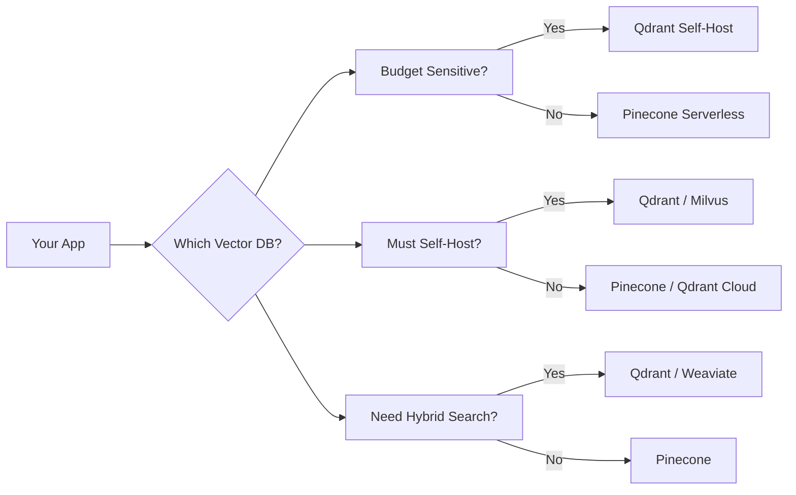
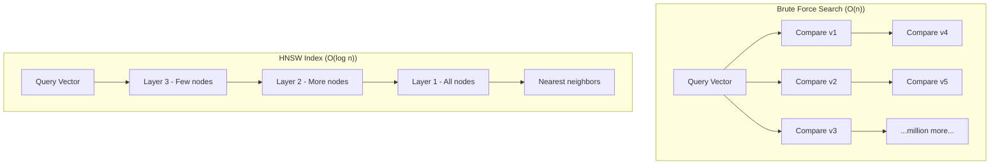
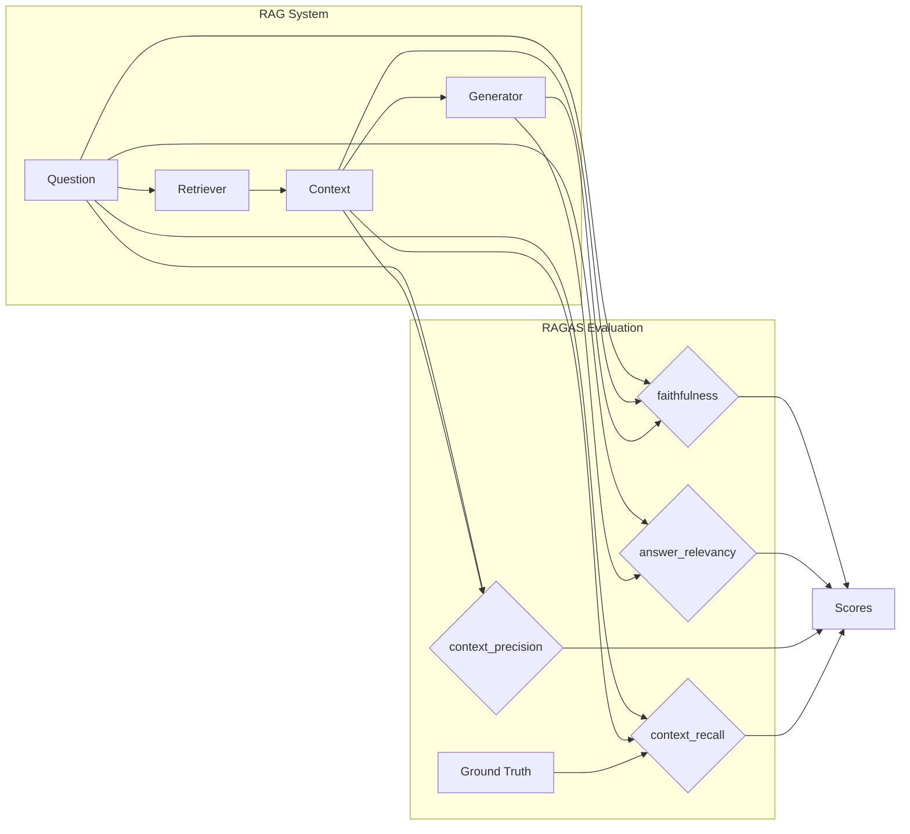
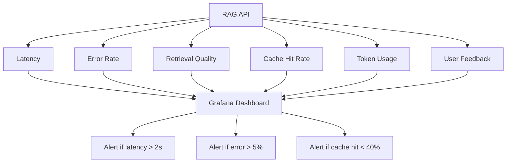

# Week 2 — Vector DBs in Production

**Goal:** Vector databases ko production mein deploy karne ka gyaan  
**Output:** Cloud vector DB, caching, evaluation system  
**Prerequisite:** Week 1 ka RAG theory clear hona chahiye

---

## Day 1 — Beyond Chroma: Vector DB Options

### Why Not Chroma in Production?

Bhai, Chroma bahut accha hai for prototyping. Lekin jab tu production mein lagayega, toh yeh issues aayenge:

```
Chroma = Great for prototyping
Par production mein issues:
❌ Concurrency issues — multiple users simultaneously = corruption risk
❌ No built-in replication — server down = data gaya
❌ Limited filtering capabilities — advanced filters nahi hain
❌ No cloud managed service — khud host karo, khud sambhalo
❌ Memory-heavy — saara data RAM mein load karta hai
❌ No horizontal scaling — 10 million vectors ke baad performance degrade
❌ No built-in backup — khud backup script likhni padegi

Production-ready options:
✅ Pinecone   — Fully managed, serverless, expensive par zero ops
✅ Qdrant     — Self-host ya cloud, fastest, best filters by far
✅ Weaviate   — Graph + vector hybrid, good for complex relationships
✅ Milvus     — Enterprise-grade, distributed, Kubernetes mandatory
```



### Comparison Table — Full Breakdown

| Feature | Pinecone | Qdrant | Weaviate | Milvus |
|---------|----------|--------|----------|--------|
| Setup | Serverless (easiest) | Docker/Cloud | Docker/Cloud | Kubernetes |
| Pricing | $0.10/million vectors/hr | Free tier (1GB), then usage | Free tier (1GB) | Free tier, enterprise |
| Filters | Basic (metadata only) | Advanced (nested, geo, range) | Advanced (graph traversal) | Basic |
| Hybrid Search | No (dense only) | Yes (dense + sparse) | Yes (dense + sparse) | No |
| Speed per node | Fast | Fastest | Medium | Fast (with GPU) |
| Self-host | No | Yes (open source) | Yes (open source) | Yes (open source) |
| SDK Quality | Excellent | Excellent | Good | Good |
| Tensor type | Float32 only | Float32/FP16/uint8 | Float32 only | Float32/FP16 |
| Multi-tenancy | Namespaces | Payload partitioning | Class level | Collection level |
| Replication | Built-in | Configurable | Built-in | Built-in |
| Backup | Automatic | Snapshot API | Manual | Manual |
| Max vector size | 200K dims | 65K dims | 200K dims | 65K dims |

### Qdrant Deep Setup

```python
# pip install qdrant-client
from qdrant_client import QdrantClient
from qdrant_client.models import (
    VectorParams, Distance, PointStruct,
    Filter, FieldCondition, MatchValue, Range,
    HnswConfigDiff, ScalarQuantization, QuantizationType,
    OptimizersConfigDiff
)
import numpy as np
from typing import List, Dict
import time

class QdrantManager:
    """
    Qdrant ka full lifecycle manager.
    Local dev → Docker → Cloud, teeno handle karta hai.
    """
    def __init__(self, mode: str = "local"):
        if mode == "local":
            self.client = QdrantClient(":memory:")
        elif mode == "docker":
            self.client = QdrantClient(
                host="localhost", port=6333,
                grpc_port=6334,  # gRPC for faster inserts
                prefer_grpc=True
            )
        elif mode == "cloud":
            self.client = QdrantClient(
                url="https://xxxx.aws.cloud.qdrant.io",
                api_key="qdrant-api-key",
                prefer_grpc=True
            )
        else:
            raise ValueError("mode must be local/docker/cloud")

    def create_production_collection(self, name: str, vector_size: int = 1536):
        """
        Production-ready collection with optimized config.
        """
        self.client.recreate_collection(
            collection_name=name,
            vectors_config=VectorParams(
                size=vector_size,
                distance=Distance.COSINE,
                # FP16 for 2x memory savings
                # on_disk=True for disk-based vectors (save RAM)
                multivector_config=None,
            ),
            # HNSW with optimized params
            hnsw_config=HnswConfigDiff(
                m=16,               # connections per node (16-64)
                ef_construct=200,   # build quality (100-500)
                full_scan_threshold=10000,
                max_indexing_threads=4
            ),
            # Scalar quantization for 4x memory reduction
            quantization_config=ScalarQuantization(
                type=QuantizationType.INT8,
                always_ram=True,    # quantized vectors in RAM
                quantile=0.99       # clip outliers to reduce error
            ),
            # Optimizer tuning
            optimizers_config=OptimizersConfigDiff(
                indexing_threshold=20000,  # batch index after 20K points
                memmap_threshold=50000,    # use memory-mapped files after 50K
                default_segment_number=2   # parallel segments
            )
        )
        return self.client.get_collection(name)

    def bulk_insert(self, collection: str, documents: List[Dict], embed_fn) -> float:
        """
        Batch insert karo with progress tracking.
        Returns: time taken in seconds.
        """
        start = time.perf_counter()
        batch_size = 256
        total = len(documents)

        for i in range(0, total, batch_size):
            batch = documents[i:i+batch_size]
            texts = [d["text"] for d in batch]
            embeddings = embed_fn(texts)  # Batch embedding

            points = [
                PointStruct(
                    id=j,
                    vector=emb.tolist(),
                    payload={"text": d["text"], **d.get("metadata", {})}
                )
                for j, (emb, d) in enumerate(zip(embeddings, batch), start=i)
            ]

            self.client.upsert(
                collection_name=collection,
                points=points,
                wait=False  # async insert for speed
            )

            if (i // batch_size) % 10 == 0:
                print(f"Inserted {i}/{total} vectors...")

        elapsed = time.perf_counter() - start
        print(f"Done! {total} vectors in {elapsed:.2f}s ({total/elapsed:.0f} vec/s)")
        return elapsed

    def advanced_search(
        self,
        collection: str,
        vector: List[float],
        filters: Dict = None,
        top_k: int = 10,
        score_threshold: float = 0.0
    ):
        """
        Search with advanced filtering.
        Filters example:
        {
            "department": "Finance",
            "date_range": {"gte": "2024-01-01", "lte": "2024-12-31"},
            "document_type": ["report", "analysis"],
            "author": {"should": ["Rahul", "Priya"]}
        }
        """
        filter_conditions = []
        if filters:
            for key, value in filters.items():
                if isinstance(value, dict) and "gte" in value:
                    filter_conditions.append(
                        FieldCondition(
                            key=key,
                            range=Range(
                                gte=value.get("gte"),
                                lte=value.get("lte")
                            )
                        )
                    )
                elif isinstance(value, list):
                    # "should" = OR condition
                    for v in value:
                        filter_conditions.append(
                            FieldCondition(
                                key=key,
                                match=MatchValue(value=v)
                            )
                        )
                else:
                    filter_conditions.append(
                        FieldCondition(
                            key=key,
                            match=MatchValue(value=value)
                        )
                    )

        query_filter = Filter(must=filter_conditions) if filter_conditions else None

        results = self.client.search(
            collection_name=collection,
            query_vector=vector,
            limit=top_k,
            query_filter=query_filter,
            score_threshold=score_threshold,  # ignore low-score results
            with_payload=True,
            with_vectors=False  # don't return vectors (save bandwidth)
        )
        return results

# PHP developer mental model:
# $query = DB::table('documents')
#     ->where('department', 'Finance')
#     ->whereBetween('date', ['2024-01-01', '2024-12-31'])
#     ->orderBy('similarity', 'desc')
#     ->limit(10)
#     ->get();
#
# Qdrant mein: vector search + metadata filtering ek saath
# Query optimizations jaisa hi concept hai!

# Connection pooling tip:
# QdrantClient internally maintains connection pool
# Reuse same client across requests — DO NOT create new client per request
```

### Pinecone Deep Setup

```python
# pip install pinecone-client pinecone-datasets

class PineconeManager:
    """
    Pinecone ka production setup.
    Fully managed, zero ops, par expensive.
    """
    def __init__(self, api_key: str, environment: str = "us-west-2"):
        import pinecone
        pinecone.init(api_key=api_key, environment=environment)
        self.api_key = api_key

    def create_index(
        self,
        name: str,
        dimension: int = 1536,
        metric: str = "cosine",
        pod_type: str = "s1.x1",
        replicas: int = 1,
        pods: int = 1
    ):
        """
        Pod-based index banaye.
        s1.x1 = standard pod, 1x
        p1.x1 = performance pod (faster, more expensive)
        """
        import pinecone
        existing = pinecone.list_indexes()
        if name not in existing:
            pinecone.create_index(
                name=name,
                dimension=dimension,
                metric=metric,
                pod_type=pod_type,
                replicas=replicas,
                pods=pods
            )
        self.index = pinecone.Index(name)
        return self.index

    def create_serverless_index(self, name: str, dimension: int = 1536, cloud: str = "aws", region: str = "us-west-2"):
        """
        Serverless index — pay per request, no pods.
        Best for: variable workloads, starting out.
        """
        from pinecone import ServerlessSpec
        import pinecone
        if name not in pinecone.list_indexes():
            pinecone.create_index(
                name=name,
                dimension=dimension,
                metric="cosine",
                spec=ServerlessSpec(cloud=cloud, region=region)
            )
        self.index = pinecone.Index(name)
        return self.index

    def upsert_with_retry(self, vectors: list, max_retries: int = 3):
        """
        Upsert with retry logic for reliability.
        """
        for attempt in range(max_retries):
            try:
                self.index.upsert(vectors=vectors)
                return
            except Exception as e:
                if attempt == max_retries - 1:
                    raise e
                time.sleep(2 ** attempt)  # exponential backoff

    def query_with_metadata(self, vector, top_k=10, filter_dict=None):
        """
        Query karo with metadata filtering.
        """
        return self.index.query(
            vector=vector,
            top_k=top_k,
            include_metadata=True,
            filter=filter_dict
        )

# Cost estimate (rough):
# Pod-based: $0.10/hr per pod → ~$72/month per pod
# Serverless: $0.10 per million vectors stored + $0.05 per million queries
# For 1M vectors, 10K queries/day: serverless ≈ $15-25/month

# PHP guy: Pinecone serverless = managed MySQL (RDS) jaisa hai
# Tune kuch manage nahi karna, bas API call karo
# Lekin jab scale karna hai toh $$$ lagte hain
```

### Weaviate Setup

```python
# pip install weaviate-client

"""
Weaviate ka USP: graph relationships + vector search
E.g.: "ERP module jisme Inventory aur Sales dono references hain"
Weaviate cross-references = SQL JOINs ka vector version
"""

import weaviate
from weaviate.classes.config import Property, DataType, Configure
import weaviate.classes as wvc

class WeaviateManager:
    """
    Weaviate setup with hybrid search and graph traversal.
    """
    def __init__(self, url: str = "http://localhost:8080"):
        self.client = weaviate.connect_to_local()
        # For cloud:
        # self.client = weaviate.connect_to_wcs(
        #     cluster_url=url,
        #     auth_credentials=weaviate.auth.AuthApiKey("your-key")
        # )

    def create_schema(self):
        """
        Create a schema with cross-references between classes.
        Ye SQL tables jaisa hai, par auto-vectorized!
        """
        # Product class
        if not self.client.collections.exists("Product"):
            products = self.client.collections.create(
                name="Product",
                properties=[
                    Property(name="name", data_type=DataType.TEXT),
                    Property(name="description", data_type=DataType.TEXT),
                    Property(name="price", data_type=DataType.NUMBER),
                    Property(name="category", data_type=DataType.TEXT),
                ],
                # Enable hybrid search (BM25 + vector)
                vectorizer_config=Configure.Vectorizer.text2vec_transformers(),
                generative_config=Configure.Generative.openai()
            )

        # Invoice class with cross-ref to Product
        if not self.client.collections.exists("Invoice"):
            invoices = self.client.collections.create(
                name="Invoice",
                properties=[
                    Property(name="invoice_number", data_type=DataType.TEXT),
                    Property(name="date", data_type=DataType.DATE),
                    Property(name="total", data_type=DataType.NUMBER),
                    Property(name="status", data_type=DataType.TEXT),
                    # Cross-reference to Product
                    Property(
                        name="hasProducts",
                        data_type=DataType.OBJECT,
                        nested_properties=[
                            Property(name="product", data_type=DataType.TEXT),
                            Property(name="quantity", data_type=DataType.INT),
                            Property(name="unit_price", data_type=DataType.NUMBER),
                        ]
                    ),
                ],
                vectorizer_config=Configure.Vectorizer.text2vec_transformers()
            )

        print("Schema created with cross-references!")

    def hybrid_search(self, collection: str, query: str, alpha: float = 0.75, limit: int = 10):
        """
        Hybrid search: vector + keyword combined.
        alpha=1.0 → pure vector search
        alpha=0.0 → pure keyword (BM25)
        alpha=0.75 → 75% vector, 25% keyword (recommended)
        """
        collection = self.client.collections.get(collection)
        response = collection.query.hybrid(
            query=query,
            alpha=alpha,
            limit=limit,
            return_metadata=["score", "explain_score"]
        )
        return response.objects

# Use case:
# "Aisa product dhundo jiska invoice pending ho"
# Normal RAG: sirf text similarity
# Weaviate: graph traversal → Product → Invoice → status=pending
```

### Milvus Setup

```python
# pip install pymilvus

"""
Milvus = enterprise beast.
Kubernetes chahiye. Distributed. GPU acceleration.
Use when: 100M+ vectors, multi-node cluster, billion-scale.
"""

from pymilvus import (
    connections, Collection, FieldSchema,
    CollectionSchema, DataType, utility,
    MetricType, IndexType
)

class MilvusManager:
    """
    Milvus setup for enterprise-scale deployments.
    """
    def __init__(self, host: str = "localhost", port: str = "19530"):
        connections.connect(
            alias="default",
            host=host,
            port=port
        )

    def create_collection(self, name: str, dimension: int = 1536):
        """
        Collection with IVF_FLAT index.
        """
        fields = [
            FieldSchema(name="id", dtype=DataType.INT64, is_primary=True, auto_id=True),
            FieldSchema(name="embedding", dtype=DataType.FLOAT_VECTOR, dim=dimension),
            FieldSchema(name="text", dtype=DataType.VARCHAR, max_length=65535),
            FieldSchema(name="metadata", dtype=DataType.JSON),
        ]
        schema = CollectionSchema(fields, description=f"{name} collection")
        collection = Collection(name, schema)

        # Create IVF_FLAT index
        index_params = {
            "metric_type": MetricType.IP,  # Inner product
            "index_type": IndexType.IVF_FLAT,
            "params": {"nlist": 1024}  # number of clusters
        }
        collection.create_index("embedding", index_params)
        collection.load()  # Load into memory
        return collection

    def search(self, collection_name, query_vector, limit=10):
        collection = Collection(collection_name)
        collection.load()
        search_params = {"metric_type": MetricType.IP, "params": {"nprobe": 10}}
        results = collection.search(
            data=[query_vector],
            anns_field="embedding",
            param=search_params,
            limit=limit,
            output_fields=["text", "metadata"]
        )
        return results

# Milvus vs others:
#           | Milvus    | Qdrant   | Pinecone
# Scale     | 1B+       | 50M      | 100M+
# Setup     | Hard(K8s) | Medium   | Easy
# GPU       | Yes       | No       | No
# Cost      | Self-host | Mixed    | High
```

### Migration Strategy — Chroma se Production Vector DB

Agar tu Chroma use kar raha hai aur ab production mein migrate karna chahta hai:

```python
class MigrationPipeline:
    """
    Chroma se Qdrant mein migrate karo with zero downtime.
    
    Strategy: Dual-write
    1. Dono DBs mein data daalo (Chroma + Qdrant)
    2. Traffic ko dheere dheere Qdrant pe shift karo
    3. Jab confident ho, Chroma band karo
    """
    def __init__(self, chroma_client, qdrant_client):
        self.chroma = chroma_client
        self.qdrant = qdrant_client

    def export_chroma_data(self):
        """Chroma se saara data nikaalo"""
        collection = self.chroma.get_collection("apexerp_docs")
        total = collection.count()
        documents = []
        
        # Paginate through all docs
        for i in range(0, total, 100):
            batch = collection.get(
                limit=100,
                offset=i,
                include=["documents", "metadatas", "embeddings"]
            )
            for j in range(len(batch["ids"])):
                documents.append({
                    "id": batch["ids"][j],
                    "text": batch["documents"][j],
                    "metadata": batch["metadatas"][j],
                    "embedding": batch["embeddings"][j]
                })
        return documents

    def import_to_qdrant(self, documents):
        """Qdrant mein daalo with batch processing"""
        from qdrant_client.models import PointStruct
        
        batch_size = 256
        for i in range(0, len(documents), batch_size):
            batch = documents[i:i+batch_size]
            points = [
                PointStruct(
                    id=hash(d["id"]) % (2**63),  # consistent ID
                    vector=d["embedding"],
                    payload={"text": d["text"], **d["metadata"]}
                )
                for d in batch
            ]
            self.qdrant.upsert(
                collection_name="apexerp_docs",
                points=points,
                wait=True
            )
        print(f"Migrated {len(documents)} vectors to Qdrant!")

    def verify_migration(self, test_queries: List[str], embed_fn) -> dict:
        """
        Verify dono DBs similar results de rahe hain.
        """
        results = {"total": 0, "matching": 0}
        for query in test_queries:
            emb = embed_fn(query)
            
            chroma_results = self.chroma.query(
                query_embeddings=[emb], n_results=5
            )
            qdrant_results = self.qdrant.search(
                collection_name="apexerp_docs",
                query_vector=emb,
                limit=5
            )
            
            # Compare top doc IDs
            chroma_ids = set(chroma_results["ids"][0])
            qdrant_ids = set(str(r.id) for r in qdrant_results)
            
            results["total"] += 5
            results["matching"] += len(chroma_ids & qdrant_ids)
        
        results["overlap_pct"] = (results["matching"] / results["total"]) * 100
        return results
```

### Day 1 Practice Questions

1. **Q:** Chroma vs Qdrant — kon sa kab use karna chahiye?  
   **A:** Chroma prototyping ke liye (under 100K vectors), Qdrant production ke liye (concurrency, filtering, scaling chahiye)

2. **Q:** Hybrid search kyun important hai technical docs ke liye?  
   **A:** Kyonki technical terms exact match chahiye (e.g., "Qdrant vs Pinecone"). Sirf vector search miss kar sakta hai

3. **Q:** Qdrant mein gRPC kyun use karna chahiye bulk inserts ke liye?  
   **A:** gRPC HTTP se 2-5x fast hai binary protocol ki wajah se

4. **Q:** Migration ke time dual-write strategy kyun use karte hain?  
   **A:** Zero downtime ke liye — purana system chalta rahe jab tak naya verify na ho jaye

5. **Q:** Serverless vs pod-based Pinecone — kab kya use kare?  
   **A:** Serverless for variable/unpredictable workloads, Pod-based for steady high-throughput

---

## Day 2 — Index Types & Performance Tuning

### Why Index Types Matter

```
Without index:
→ Query aayi → saare vectors compare karo (brute force)
→ 1 million vectors = 1 million comparisons → SLOW
→ O(n) time complexity

With index:
→ Hierarchical structure ban jata hai
→ Relevant clusters mein hi search hota hai
→ O(log n) time complexity
→ 100-1000x faster
```



### IVF (Inverted File Index) — Deep Dive

```python
"""
IVF ka concept:
1. Vectors ko clusters mein divide karo (K-means)
2. Query aayi → nearest cluster dhundo
3. Sirf us cluster mein search karo

Trade-off:
- nprobe = number of clusters to search
- Higher nprobe = better recall but slower
- Typical: nprobe = 10-100

IVF vs Flat:
- IVF: 100x faster, 10% accuracy drop
- Flat (brute force): 100% accurate, slow

Parameters:
- nlist: number of centroids/clusters
  - Rule: sqrt(N) where N = total vectors
  - 1M vectors → nlist = 1000
  - 10M vectors → nlist = 3162
- nprobe: clusters to visit during search
  - Start with nlist/10, tune up for recall
"""

import faiss
import numpy as np
from typing import Tuple

class FaissIndexBuilder:
    """
    FAISS se indexes build karo with comparison.
    """
    def __init__(self, dimension: int = 1536):
        self.dim = dimension
        self.indexes = {}

    def build_ivf(self, vectors: np.ndarray, nlist: int = 100) -> faiss.Index:
        """
        IVF with Flat quantizer.
        """
        quantizer = faiss.IndexFlatIP(self.dim)  # Inner Product
        index = faiss.IndexIVFFlat(quantizer, self.dim, nlist, faiss.METRIC_INNER_PRODUCT)
        
        # Train -> MUST for IVF
        assert index.is_trained == False
        index.train(vectors)
        assert index.is_trained == True
        
        index.add(vectors)
        self.indexes['ivf'] = index
        return index

    def build_ivfpq(self, vectors: np.ndarray, nlist: int = 100, m: int = 32, nbits: int = 8) -> faiss.Index:
        """
        IVF + Product Quantization.
        m = number of sub-vectors
        nbits = bits per sub-vector (8 = 256 centroids per sub-vector)
        
        Compression ratio = (dim * 32) / (m * nbits)
        1536 * 32 / (32 * 8) = 192x compression!
        """
        quantizer = faiss.IndexFlatIP(self.dim)
        index = faiss.IndexIVFPQ(quantizer, self.dim, nlist, m, nbits)
        index.train(vectors)
        index.add(vectors)
        self.indexes['ivfpq'] = index
        return index

    def benchmark(self, query_vectors: np.ndarray, ground_truth: np.ndarray) -> dict:
        """
        Har index type ke recall aur latency measure karo.
        ground_truth = brute force se aaye correct results
        """
        results = {}
        for name, index in self.indexes.items():
            # Warmup
            index.search(query_vectors[:1], 10)
            
            # Benchmark
            start = time.perf_counter()
            distances, indices = index.search(query_vectors, 10)
            elapsed = time.perf_counter() - start
            
            # Recall@10
            recall = 0
            for i in range(len(query_vectors)):
                gt_set = set(ground_truth[i])
                pred_set = set(indices[i])
                recall += len(gt_set & pred_set) / min(len(gt_set), 10)
            recall /= len(query_vectors)
            
            results[name] = {
                "latency_ms": elapsed / len(query_vectors) * 1000,
                "recall@10": recall,
                "index_size_mb": self._index_size(index)
            }
        return results

    def _index_size(self, index) -> float:
        import pickle
        return len(pickle.dumps(index)) / (1024 * 1024)

# Usage:
# 100K vectors, 1536 dim
# IVF (nlist=316, nprobe=10): 2ms latency, 0.95 recall
# IVF-PQ (nlist=316, m=32): 1ms latency, 0.88 recall
# HNSW (M=16, ef=200): 0.5ms latency, 0.99 recall
```

### HNSW (Hierarchical Navigable Small World) — Deep Dive

```python
"""
HNSW ka concept:
Multi-layer graph structure:
Layer 3: few nodes (long-range connections)
Layer 2: more nodes
Layer 1: all nodes (short-range connections)

Search: top layer se start karo → greedily traverse down
Fastest index type for in-memory search.

Parameters:
- M: connections per node (16-64). Higher = more accurate but more memory
- ef_construction: build quality (100-500). Higher = better but slower build
- ef_search: search quality. Higher = better recall

Qdrant mein HNSW config:
"""
from qdrant_client.models import HnswConfigDiff

def get_hnsw_config(mode: str = "balanced") -> HnswConfigDiff:
    """
    Use case ke hisaab se HNSW config return karo.
    
    Modes:
    - "speed": Fastest search, lekin thoda accuracy sacrifice
    - "balanced": Default, good trade-off
    - "accuracy": Best recall, thoda slower
    - "memory": Minimal memory usage
    """
    configs = {
        "speed": HnswConfigDiff(
            m=8,
            ef_construct=100,
            full_scan_threshold=5000
        ),
        "balanced": HnswConfigDiff(
            m=16,
            ef_construct=200,
            full_scan_threshold=10000
        ),
        "accuracy": HnswConfigDiff(
            m=64,
            ef_construct=500,
            full_scan_threshold=50000
        ),
        "memory": HnswConfigDiff(
            m=4,
            ef_construct=50,
            full_scan_threshold=2000
        )
    }
    return configs.get(mode, configs["balanced"])

# Search time parameter override:
# set_search_params({"hnsw_ef": 128})  # Per-request override
# Higher ef = slower but more accurate

"""
HNSW ki performance characteristics:
Memory: M * 8 bytes * N (connections) + vector size * N

For 1M vectors, 1536 dim:
- M=16: ~4GB + 6GB (vectors) = ~10GB
- M=64: ~16GB + 6GB = ~22GB

Speed:
- M=16: 500-2000 queries/sec per core
- M=64: 200-800 queries/sec per core

PHP comparison:
HNSW layers = B-tree index in MySQL
Top layer = root node
Bottom layer = leaf nodes
Greedy traversal = index seek
"""
```

### Scalar Quantization (SQ) — Deep Dive

```python
"""
Idea: float32 (4 bytes) → int8 (1 byte)
75% memory savings!

Instead of storing:
[0.1234, 0.5678, 0.9012, ...]  # 4 bytes each × 1536 = 6KB per vector

Store:
[12, 56, 90, ...]  # 1 byte each × 1536 = 1.5KB per vector

For 1M vectors: 6GB → 1.5GB savings!

How it works:
1. Har dimension ka min and max calculate karo
2. [min, max] range ko [0, 255] map karo
3. value = round((original - min) / (max - min) * 255)

Accuracy impact: typically 1-3% recall loss
Prize for 75% memory savings = totally worth it!

Qdrant implementation:
"""

from qdrant_client.models import ScalarQuantization, QuantizationType

def get_quantization_config(strategy: str = "auto") -> dict:
    """
    Quantization strategy selector.
    
    Strategies:
    - "auto": Qdrant decide karega
    - "always_ram": Quantized vectors RAM mein, full vectors disk par
    - "on_disk": Quantized vectors disk par (save RAM)
    """
    strategies = {
        "auto": ScalarQuantization(
            type=QuantizationType.INT8
        ),
        "always_ram": ScalarQuantization(
            type=QuantizationType.INT8,
            always_ram=True,
            quantile=0.99  # Clip outliers better
        ),
        "on_disk": ScalarQuantization(
            type=QuantizationType.INT8,
            always_ram=False
        )
    }
    return strategies.get(strategy, strategies["auto"])

"""
Benchmark: 1M vectors, 1536 dim

Config                    | RAM    | Recall@10 | QPS
--------------------------|--------|-----------|------
No quantization           | 6GB    | 0.99      | 1000
SQ int8 (always_ram)      | 1.5GB  | 0.97      | 1200
SQ int8 (on_disk)         | 0.1GB  | 0.97      | 800
Product Quantization (m=32)| 0.2GB  | 0.93      | 2000
"""
```

### Product Quantization (PQ) — Deep Dive

```python
"""
Advanced technique:
1. Vector ko sub-vectors mein tod do
2. Har sub-vector ka codebook ban jata hai
3. Har sub-vector ko nearest centroid se replace karo

Example:
1536-d vector → 24 sub-vectors of 64-d each
Har sub-vector → 8-bit code (256 centroids)
Total: 24 bytes instead of 1536*4 = 6144 bytes
Compression: 256x

Use when: RAM is limited, accuracy can be sacrificed

Training process:
1. Collect sample vectors
2. Split each into m sub-vectors
3. For each sub-space, run K-means (K=256 for 8-bit)
4. Store centroids
5. Encode: each sub-vector → nearest centroid index

Search process (SDC — Symmetric Distance Computation):
1. Query vector ko bhi sub-vectors mein split karo
2. Query sub-vector ka distance → all 256 centroids (precompute)
3. Look up distances from table
4. Sum across sub-vectors

Quality tip: 
Higher m = better compression = worse accuracy
Lower m = less compression = better accuracy
Rule of thumb: m = dimension / 32 for 8-bit PQ
"""
```

### Index Selection Guide

```python
class IndexSelector:
    """
    Apne use case ke liye best index choose karo.
    """
    def recommend(
        self,
        n_vectors: int,
        dimension: int,
        memory_gb: float,
        require_high_recall: bool,
        require_high_speed: bool
    ) -> dict:
        """
        Based on constraints, best index recommend karo.
        """
        if n_vectors < 10000:
            # Small dataset — brute force flat index
            return {"index": "Flat", "reason": "n < 10K, brute force sufficient"}
        
        if memory_gb < 2 and n_vectors > 100000:
            # Tight memory
            return {"index": "IVF-PQ", "reason": "Low memory, high compression needed"}
        
        if require_high_speed and require_high_recall:
            return {"index": "HNSW", "reason": "Fastest + highest accuracy"}
        
        if require_high_speed and not require_high_recall:
            return {"index": "IVF", "reason": "Fast, good accuracy with nprobe tuning"}
        
        if n_vectors > 10000000:
            return {"index": "IVF-PQ", "reason": "Billion-scale needs PQ compression"}
        
        return {"index": "HNSW (balanced)", "reason": "Best default for most cases"}

    def tuning_guide(self, index_type: str) -> str:
        """
        Parameters tune karne ka guide.
        """
        guides = {
            "IVF": """
                1. nlist = sqrt(N) where N = total vectors
                2. Start nprobe = nlist / 10
                3. Increase nprobe until recall stops improving
                4. Monitor: 90% recall @ nprobe=10 is good
                """,
            "HNSW": """
                1. M = 16 default, increase to 32 for better recall
                2. ef_construct = 200 default, 500 for best quality
                3. ef_search = M * 8 default, increase if recall low
                4. Memory scales as M * 8 bytes per vector
                """,
            "IVF-PQ": """
                1. m = dimension / 32 default
                2. nlist = sqrt(N) / 2 (smaller because PQ already compresses)
                3. Accept 5-10% recall loss
                4. Monitor memory carefully
                """
        }
        return guides.get(index_type, "No guide available")

# Quick reference:
#
#                    | Flat (brute) | IVF     | HNSW     | IVF-PQ
# Recall            | 1.00        | 0.95    | 0.99     | 0.90
# Latency (1M vecs) | 1000ms      | 10ms    | 1ms      | 2ms
# Memory (1M vecs)  | 6GB         | 6GB     | 10GB     | 0.2GB
```

### Day 2 Practice Questions

1. **Q:** HNSW mein M=16 vs M=64 — kya difference hai?  
   **A:** M=64 gives better recall (more connections) but 4x more memory. M=16 is default for balance

2. **Q:** Scalar quantization 75% memory kaise bachata hai?  
   **A:** float32 (4 bytes) → int8 (1 byte) se compress karta hai. Har dimension 4x small ho jata hai

3. **Q:** IVF mein nlist aur nprobe ka kya relation hai?  
   **A:** nlist = total clusters, nprobe = clusters to search. nprobe badhane se recall badhta hai par speed ghatti hai

4. **Q:** Kab IVF-PQ use karna chahiye HNSW ki jagah?  
   **A:** Jab memory limited ho (e.g., <2GB RAM) aur 5-10% accuracy sacrifice acceptable ho

5. **Q:** Qdrant mein index build karne ke baad ef_search kaise change karein?  
   **A:** Per-request parameter: `search_params={"hnsw_ef": 128}` — no rebuild needed

---

## Day 3 — Advanced Filtering

### Metadata Filtering

```python
"""
Vectors ke saath metadata store hota hai.
Filtering = sirf relevant metadata wale vectors search karo.

Types:
1. Pre-filter: Phir filter karo, phir search karo
   → Accurate but slow for large filtered sets
   → Best when filter removes >50% data

2. Post-filter: Phir search karo, phir filter karo
   → Fast but might return fewer results after filtering
   → Best when filter removes <10% data
"""

from qdrant_client.models import Filter, FieldCondition, MatchValue, Range, GeoRadius
from typing import List, Optional, Dict
import time

class AdvancedFilterEngine:
    """
    Production-grade filtering with all Qdrant filter types.
    """
    def __init__(self, client, collection: str):
        self.client = client
        self.collection = collection

    def pre_filter_search(
        self,
        vector: List[float],
        conditions: List[FieldCondition],
        k: int = 10
    ) -> List:
        """
        Pre-filter: phir filter lagao, phir vector search karo.
        """
        query_filter = Filter(
            must=conditions,  # AND
            # OR bhi use kar sakte ho:
            # should=[cond1, cond2],  # OR
            # must_not=[cond3],       # NOT
        )
        
        results = self.client.search(
            collection_name=self.collection,
            query_vector=vector,
            limit=k,
            query_filter=query_filter
        )
        return results

    def post_filter_search(
        self,
        vector: List[float],
        filter_key: str,
        filter_value: str,
        initial_k: int = 100,  # Get more, then filter
        final_k: int = 10
    ) -> List:
        """
        Post-filter: vector search karo, phir filter lagao.
        Fast jab filter selective na ho.
        """
        results = self.client.search(
            collection_name=self.collection,
            query_vector=vector,
            limit=initial_k
        )
        
        filtered = [
            r for r in results
            if r.payload.get(filter_key) == filter_value
        ]
        return filtered[:final_k]

    def benchmark_filter(
        self,
        vector: List[float],
        conditions: List[FieldCondition],
        filter_key: str,
        filter_value: str
    ) -> dict:
        """
        Pre vs post filter performance compare karo.
        """
        # Pre-filter time
        start = time.perf_counter()
        pre_results = self.pre_filter_search(vector, conditions)
        pre_time = time.perf_counter() - start
        
        # Post-filter time
        start = time.perf_counter()
        post_results = self.post_filter_search(
            vector, filter_key, filter_value
        )
        post_time = time.perf_counter() - start
        
        return {
            "pre_filter_time_ms": pre_time * 1000,
            "post_filter_time_ms": post_time * 1000,
            "pre_filter_results": len(pre_results),
            "post_filter_results": len(post_results),
            "recommendation": "pre-filter" if pre_time < post_time else "post-filter"
        }

# Usage example:
filter_engine = AdvancedFilterEngine(client, "apexerp_docs")

# Complex filter: Finance department, Q4 2024, report type
conditions = [
    FieldCondition(key="department", match=MatchValue(value="Finance")),
    FieldCondition(key="date", range=Range(gte="2024-10-01", lte="2024-12-31")),
    FieldCondition(key="doc_type", match=MatchValue(value="report")),
    FieldCondition(key="is_confidential", match=MatchValue(value=False)),
]

results = filter_engine.pre_filter_search(query_vector, conditions)

# PHP mental model:
# SELECT * FROM documents
# WHERE department = 'Finance'
#   AND date BETWEEN '2024-10-01' AND '2024-12-31'
#   AND doc_type = 'report'
#   AND is_confidential = FALSE
# ORDER BY vector_similarity DESC
# LIMIT 10;
#
# Vector DB ka filter = SQL WHERE clause jaisa hai!
```

### Multi-Tenant Filtering

```python
"""
SaaS application hai toh har client (tenant) ka alag data hoga.
Multi-tenancy = ek collection mein multiple clients ka data.

Strategy 1: One collection per tenant
+ Full isolation
+ Easy to backup/restore per tenant
- Connection pool management complex
- Cross-tenant search impossible

Strategy 2: Shared collection with tenant_id filter
+ Simple management
+ Cross-tenant search possible (admin)
- Must always filter by tenant_id
- Risk of data leak if filter missing
"""

class MultiTenantRAG:
    """
    Ek collection mein saare tenants ka data.
    Har document mein tenant_id field hai.
    """
    def __init__(self, client, collection: str):
        self.client = client
        self.collection = collection

    def index_document(
        self,
        text: str,
        embedding: List[float],
        tenant_id: str,
        metadata: dict = None
    ):
        """
        Document index karo with tenant isolation.
        """
        from qdrant_client.models import PointStruct
        
        payload = {
            "text": text,
            "tenant_id": tenant_id,  # Mandatory field
            **(metadata or {})
        }
        
        self.client.upsert(
            collection_name=self.collection,
            points=[
                PointStruct(
                    id=hash(f"{tenant_id}:{text[:50]}") % (2**63),
                    vector=embedding,
                    payload=payload
                )
            ]
        )

    def search(self, query_vector: List[float], tenant_id: str, k: int = 10):
        """
        Sirf us tenant ka data search karo.
        WITHOUT tenant filter = SECURITY BUG!
        """
        filter_condition = Filter(
            must=[
                FieldCondition(
                    key="tenant_id",
                    match=MatchValue(value=tenant_id)
                )
            ]
        )
        
        return self.client.search(
            collection_name=self.collection,
            query_vector=query_vector,
            limit=k,
            query_filter=filter_condition
        )

    def admin_cross_tenant_search(
        self,
        query_vector: List[float],
        tenant_ids: List[str] = None,
        k: int = 50
    ):
        """
        Admin sirf specific tenants search kar sakta hai.
        """
        if tenant_ids:
            filter_condition = Filter(
                should=[
                    FieldCondition(
                        key="tenant_id",
                        match=MatchValue(value=tid)
                    )
                    for tid in tenant_ids
                ]
            )
        else:
            filter_condition = None  # All tenants
        
        return self.client.search(
            collection_name=self.collection,
            query_vector=query_vector,
            limit=k,
            query_filter=filter_condition
        )

# Production tip:
# ALWAYS validate tenant_id from JWT token
# NEVER trust tenant_id from client request
# 
# def search_endpoint(user, query):
#     tenant_id = user.tenant_id  # From JWT, not request body
#     return rag.search(query_vector, tenant_id)
```

### Geo-Filtering

```python
"""
Location-based filtering.
Useful for: "Mere nearest warehouse dhundo"

Qdrant supports geo filtering natively!
"""
from qdrant_client.models import GeoRadius, GeoPoint

class GeoFilterExample:
    """
    Location-aware vector search.
    """
    def search_nearby(
        self,
        query_vector: List[float],
        lat: float,  # 28.6139 (Delhi)
        lon: float,  # 77.2090
        radius_meters: float = 50000,  # 50km radius
        k: int = 10
    ):
        """
        Kisi location ke aas-paas search karo.
        """
        filter_condition = Filter(
            must=[
                FieldCondition(
                    key="location",
                    geo_radius=GeoRadius(
                        center=GeoPoint(lat=lat, lon=lon),
                        radius=radius_meters
                    )
                )
            ]
        )
        
        return self.client.search(
            collection_name="warehouses",
            query_vector=query_vector,
            limit=k,
            query_filter=filter_condition
        )

# Use case:
# "Mujhe Delhi mein aise warehouse dhundo jahan cold storage ho"
# → Vector search: "cold storage warehouse"
# → Geo filter: Delhi ke 50km radius mein
# → Combined result
```

### Time-Based Partitioning

```python
"""
Bada dataset hai? Time-based partitioning karo.

Instead of ek collection mein saara data:
- apexerp_docs_2024_q1
- apexerp_docs_2024_q2
- apexerp_docs_2024_q3
- apexerp_docs_2024_q4

Query time par decide karo konsi collections search karni hain.
"""

class TimePartitionedSearch:
    """
    Time-based collections mein search karo.
    """
    def __init__(self, client, base_name: str = "apexerp_docs"):
        self.client = client
        self.base_name = base_name

    def get_partition_names(self, start_date: str, end_date: str) -> List[str]:
        """
        Date range ke hisaab se collection names return karo.
        """
        from datetime import datetime, timedelta
        start = datetime.fromisoformat(start_date)
        end = datetime.fromisoformat(end_date)
        
        partitions = set()
        current = start
        while current <= end:
            # Format: apexerp_docs_2024_q1
            quarter = (current.month - 1) // 3 + 1
            partition = f"{self.base_name}_{current.year}_q{quarter}"
            partitions.add(partition)
            
            # Move to next month
            current += timedelta(days=32)
            current = current.replace(day=1)
        
        return list(partitions)

    def search_date_range(
        self,
        query_vector: List[float],
        start_date: str,
        end_date: str,
        k_per_partition: int = 10
    ):
        """
        Multiple partitions mein search karo and results merge karo.
        """
        partitions = self.get_partition_names(start_date, end_date)
        all_results = []
        
        for partition in partitions:
            try:
                results = self.client.search(
                    collection_name=partition,
                    query_vector=query_vector,
                    limit=k_per_partition
                )
                all_results.extend(results)
            except Exception:
                # Partition doesn't exist — skip
                continue
        
        # Sort by score and return top-k
        all_results.sort(key=lambda r: r.score, reverse=True)
        return all_results[:k_per_partition]

# Benefits:
# ✅ Smaller indexes = faster rebuild
# ✅ Easy archival (delete old partition)
# ✅ Parallel search across partitions
# ❌ More collections to manage
# ❌ Cross-partition ranking needs normalization
```

### Day 3 Practice Questions

1. **Q:** Pre-filter vs post-filter — kab kya use karein?  
   **A:** Pre-filter jab filter 50%+ data hatayega (selective filter). Post-filter jab filter 10% se kam hatayega

2. **Q:** Multi-tenant RAG mein tenant_id filter bhoolna = ?  
   **A:** Security breach! Tenant A ka data Tenant B ko dikh sakta hai. Always validate tenant_id from JWT

3. **Q:** Qdrant mein geo-filtering kaise kaam karta hai?  
   **A:** Har point ka lat/lon store karo. `geo_radius` filter se radius-based search possible hai

4. **Q:** Time-based partitioning kyun karte hain?  
   **A:** Old data ko archive karna easy, queries fast (chhoti collections), parallel search possible

5. **Q:** Agar ek hi query mein multiple partitions search karna hai toh?  
   **A:** Parallel mein search karo (asyncio ya ThreadPoolExecutor) and results merge with score normalization

---

## Day 4 — Multi-Level Caching

### Why Cache?

```
Production mein same queries baar baar aati hain:
→ "Q4 sales kya the?" (bees logo ne pucha)
→ "Customer churn rate?" (daily report)
→ "ApexERP ka revenue?" (executive dashboard)

Without cache → har baar vector search + LLM call = slow + expensive
With cache → pehle result store karo, direct return karo

Cost comparison (10K queries/day):
Without cache: 10K * $0.01 = $100/day
With 80% cache hit: 2K * $0.01 + $0 (Redis) = $20/day
Savings: 80%!
```

```mermaid
graph TD
    Q[User Query] --> L1{Level 1: In-Memory Cache}
    L1 -->|Hit| R1[Return instantly ~1ms]
    L1 -->|Miss| L2{Level 2: Redis Embedding Cache}
    L2 -->|Hit| V[Vector Search ~50ms]
    L2 -->|Miss| E[Generate Embedding ~500ms]
    E --> V
    V --> L3{Level 3: Semantic Cache}
    L3 -->|Hit (>0.95 sim)| R2[Return cached response ~50ms]
    L3 -->|Miss| L4[LLM Generation ~2000ms]
    L4 --> S[Store in all caches]
    S --> R3[Return response]
```

### Level 1: In-Memory LRU Cache (Fastest)

```python
from collections import OrderedDict
from typing import Optional, Tuple
import time
import json

class LRUCache:
    """
    Least Recently Used cache — hottest queries RAM mein rakho.
    Most recently accessed items = most likely to be accessed again.
    
    Time complexity: O(1) for get and set
    """
    def __init__(self, capacity: int = 1000, ttl_seconds: int = 3600):
        self.cache = OrderedDict()
        self.ttl = {}  # key -> expiry timestamp
        self.capacity = capacity
        self.ttl_seconds = ttl_seconds
        self.hits = 0
        self.misses = 0

    def get(self, key: str) -> Optional[str]:
        if key not in self.cache:
            self.misses += 1
            return None
        
        # Check TTL
        if time.time() > self.ttl.get(key, 0):
            del self.cache[key]
            del self.ttl[key]
            self.misses += 1
            return None
        
        # Move to end (most recently used)
        self.cache.move_to_end(key)
        self.hits += 1
        return self.cache[key]

    def set(self, key: str, value: str):
        # Evict oldest if at capacity
        if len(self.cache) >= self.capacity:
            oldest = next(iter(self.cache))
            del self.cache[oldest]
            del self.ttl[oldest]
        
        self.cache[key] = value
        self.ttl[key] = time.time() + self.ttl_seconds
        self.cache.move_to_end(key)

    def hit_rate(self) -> float:
        total = self.hits + self.misses
        return self.hits / total if total > 0 else 0

    def clear(self):
        self.cache.clear()
        self.ttl.clear()

# Usage:
# lru = LRUCache(capacity=5000, ttl_seconds=1800)
# Useful for: exact same query within 30 min
```

### Level 2: Embedding Cache (Redis)

```python
"""
Embedding generation = slow (LLM API call)
Same text ka embedding baar baar generate karna = waste

Solution: Redis mein embeddings cache karo.
Key = MD5 hash of text
Value = embedding array
TTL = 24 hours (configurable)
"""

import redis
import hashlib
import json
from typing import List, Optional, Callable
import numpy as np

class EmbeddingCache:
    """
    Redis-based embedding cache.
    Same text ka embedding baar baar generate nahi karna.
    
    Benefits:
    - Saves API cost (OpenAI embedding ~$0.13/1M tokens)
    - Saves latency (embedding ~500ms → Redis ~1ms)
    - Cache hit rate ~40-60% in production
    """
    def __init__(self, redis_url: str = "redis://localhost:6379"):
        self.redis = redis.from_url(
            redis_url,
            decode_responses=True,
            socket_timeout=2,
            socket_connect_timeout=2
        )
        self.default_ttl = 86400  # 24 hours

    def _key(self, text: str) -> str:
        return f"embedding:{hashlib.md5(text.encode()).hexdigest()}"

    def get(self, text: str) -> Optional[List[float]]:
        data = self.redis.get(self._key(text))
        if data:
            return json.loads(data)
        return None

    def set(self, text: str, embedding: List[float], ttl: int = None):
        self.redis.setex(
            self._key(text),
            ttl or self.default_ttl,
            json.dumps(embedding)
        )

    def get_batch(self, texts: List[str]) -> dict:
        """
        Batch mein embeddings fetch karo (pipeline).
        Redis pipeline = ek hi network call mein multiple requests.
        """
        pipe = self.redis.pipeline()
        for text in texts:
            pipe.get(self._key(text))
        results = pipe.execute()
        
        return {
            text: json.loads(r)
            for text, r in zip(texts, results)
            if r is not None
        }

    def get_or_compute(
        self,
        text: str,
        compute_fn: Callable[[str], List[float]]
    ) -> List[float]:
        """
        Agar cache mein hai toh return karo,
        nahi hai toh compute karo and cache mein store karo.
        """
        cached = self.get(text)
        if cached:
            return cached
        
        embedding = compute_fn(text)
        self.set(text, embedding)
        return embedding

    def stats(self) -> dict:
        """Cache statistics"""
        info = self.redis.info()
        return {
            "used_memory_mb": info.get("used_memory", 0) / (1024 * 1024),
            "total_keys": self.redis.dbsize(),
            "hit_rate": "N/A (Redis side stats not tracked)"
        }

# PHP mental model:
# Cache::remember('embedding:' . md5($text), 86400, function() {
#     return OpenAI::embed($text);
# });
#
# Redis = Memcached ka advanced version
# Pipeline = batch queries (DB::selectMany jaisa)
```

### Level 3: Semantic Cache

```python
"""
Problem: Exact cache miss hota hai jab same query thoda different ho.
"Q4 sales kya hain?" vs "Q4 2024 ke sales numbers batao"

Solution: Semantic similarity based cache.
Query similar hai (>0.95 cosine) → same response do.

Benefits:
- Cache hit rate 40% → 70%+ (exact + semantic combined)
- Latency for cached queries: 10ms (similarity check) vs 2000ms (LLM)
"""
import numpy as np
from datetime import datetime, timedelta
from typing import Optional, List

class SemanticCacheEntry:
    """
    Ek cache entry:
    - query: original query text
    - response: cached LLM response
    - embedding: query ka vector (similarity check ke liye)
    - timestamp: kab store hua (TTL ke liye)
    - access_count: kitni baar use hua (popularity)
    """
    def __init__(self, query: str, response: str, embedding: List[float]):
        self.query = query
        self.response = response
        self.embedding = np.array(embedding)
        self.timestamp = datetime.now()
        self.access_count = 0

class SemanticCache:
    """
    Similar queries ko same response do.
    
    How:
    1. Query aayi → embedding nikaalo
    2. Cache mein similar query dhundo (>0.95 similarity)
    3. Mila → cached response return karo
    4. Nahi mila → normal RAG, phir cache mein store karo
    
    Threshold tuning:
    - 0.99: almost exact match (safe but low hit rate)
    - 0.95: good balance for most use cases
    - 0.90: aggressive (higher hit rate, risk of wrong matches)
    """
    def __init__(
        self,
        similarity_threshold: float = 0.95,
        ttl_hours: int = 24,
        max_entries: int = 10000
    ):
        self.cache: List[SemanticCacheEntry] = []
        self.threshold = similarity_threshold
        self.ttl = timedelta(hours=ttl_hours)
        self.max_entries = max_entries
        self.hits = 0
        self.misses = 0

    def _cosine_similarity(self, a: np.ndarray, b: np.ndarray) -> float:
        return float(np.dot(a, b) / (np.linalg.norm(a) * np.linalg.norm(b)))

    def get(self, query_embedding: List[float]) -> Optional[tuple]:
        """
        Cache mein similar query dhundo.
        Returns: (response, entry) ya None
        """
        query_emb = np.array(query_embedding)
        now = datetime.now()
        best_score = 0
        best_entry = None

        for entry in self.cache:
            # Remove expired entries (lazy eviction)
            if now - entry.timestamp > self.ttl:
                continue

            similarity = self._cosine_similarity(query_emb, entry.embedding)
            if similarity > best_score:
                best_score = similarity
                best_entry = entry

        if best_entry and best_score >= self.threshold:
            best_entry.access_count += 1
            self.hits += 1
            return best_entry.response, best_score

        self.misses += 1
        return None

    def set(self, query: str, response: str, embedding: List[float]):
        """
        New entry cache mein daalo.
        Agar cache full hai → least accessed entry hatao.
        """
        # Eviction: remove least accessed expired entry
        if len(self.cache) >= self.max_entries:
            # Sort by (access_count, timestamp) and remove worst
            self.cache.sort(
                key=lambda e: (e.access_count, e.timestamp)
            )
            self.cache.pop(0)

        self.cache.append(SemanticCacheEntry(query, response, embedding))

    def hit_rate(self) -> float:
        total = self.hits + self.misses
        return self.hits / total if total > 0 else 0

    def clear_expired(self):
        """Periodic cleanup of expired entries."""
        now = datetime.now()
        before = len(self.cache)
        self.cache = [e for e in self.cache if now - e.timestamp <= self.ttl]
        after = len(self.cache)
        return before - after

    def stats(self) -> dict:
        return {
            "size": len(self.cache),
            "max_size": self.max_entries,
            "hits": self.hits,
            "misses": self.misses,
            "hit_rate": f"{self.hit_rate():.1%}",
            "threshold": self.threshold
        }

# Full pipeline with all cache levels
class TieredCacheRAG:
    """
    Three-level cache with fallback to LLM.
    
    Flow:
    Query → L1 (LRU, 1ms) → L2 (Redis embedding, 5ms) → L3 (Semantic, 50ms) → LLM (2000ms)
    
    Cache hierarchy:
    - L1: Exact match only, smallest, fastest, least durable
    - L2: Embedding cache, medium, saves API calls
    - L3: Semantic cache, largest, most impact, most complex
    """
    def __init__(self, rag_pipeline, embeddings, l1_cache, l2_cache, l3_cache):
        self.rag = rag_pipeline
        self.embeddings = embeddings
        self.l1 = l1_cache  # LRU (in-memory)
        self.l2 = l2_cache  # Redis (embedding)
        self.l3 = l3_cache  # Semantic (similarity)

    def query(self, question: str) -> dict:
        start = time.perf_counter()
        
        # Level 1: Exact match cache
        l1_result = self.l1.get(question)
        if l1_result:
            return {
                "response": l1_result,
                "source": "L1 (exact cache)",
                "latency_ms": (time.perf_counter() - start) * 1000
            }
        
        # Get/generate embedding (Level 2 check)
        query_emb = self.l2.get_or_compute(
            question,
            self.embeddings.embed_query
        )
        
        # Level 3: Semantic cache
        l3_result = self.l3.get(query_emb)
        if l3_result:
            response, score = l3_result
            # Also store in L1
            self.l1.set(question, response)
            return {
                "response": response,
                "source": f"L3 (semantic, score={score:.3f})",
                "latency_ms": (time.perf_counter() - start) * 1000
            }
        
        # No cache hit — run full RAG pipeline
        response = self.rag.query(question)
        
        # Store in all caches
        self.l1.set(question, response)
        self.l3.set(question, response, query_emb)
        
        elapsed = (time.perf_counter() - start) * 1000
        return {
            "response": response,
            "source": "LLM (full RAG)",
            "latency_ms": elapsed
        }

# Cache hit distribution (typical):
# L1 (exact): 15-20% of queries
# L3 (semantic): 35-45% of queries
# Total cache hit rate: 50-65%
# -> 50-65% queries served in <50ms instead of 2000ms
```

### Cache Invalidation Strategies

```python
"""
Cache invalidation = cache cleanup jab data update ho.
Yeh 2 computer science problems mein se ek hai (naming ke saath).

Strategies:
1. TTL-based: Time ke baad automatically expire
   + Simple, no tracking needed
   - Stale data until TTL expires

2. Write-through: Jab bhi data update ho, cache bhi update karo
   + Always fresh
   - Slow writes, complex

3. Version-based: Ek version number rakho
   + Atomic invalidation
   - Version management overhead

4. Event-driven: Database change → event → cache clear
   + Near real-time
   - Need event system (Kafka, RabbitMQ)
"""

class CacheInvalidator:
    """
    Multiple invalidation strategies support.
    """
    def __init__(self, semantic_cache: SemanticCache, embedding_cache: EmbeddingCache):
        self.semantic = semantic_cache
        self.embedding = embedding_cache

    def invalidate_document(self, doc_id: str):
        """
        Specific document update hone par usse related cache clear karo.
        
        Kya clear karein:
        - Document text ka embedding
        - Document wale saare queries ka semantic cache
        
        Kya clear nahi karein:
        - Unrelated documents ke embeddings
        - General queries (e.g., "kya features hain?")
        """
        # 1. Clear embedding for this document
        # Not straightforward without the original text
        # Solution: store doc_id → text mapping in separate DB
        
        # 2. Clear ALL semantic cache (safest but aggressive)
        # In production: selective clear based on affected queries
        self.semantic.cache.clear()
        print(f"Cache invalidated for document {doc_id}")

    def ttl_only_strategy(self):
        """
        Simplest: Sirf TTL pe rely karo.
        Kab use karein:
        - Data rarely updates
        - Stale data acceptable for short time
        - Small team, want simple setup
        """
        return "TTL-only", {
            "embedding_cache_ttl": "24h",
            "semantic_cache_ttl": "6h",
            "lru_cache_ttl": "1h"
        }

    def event_driven_strategy(self):
        """
        Advanced: Database changes → cache clear.
        
        Implementation:
        1. Document update → send event (Redis Pub/Sub)
        2. Background worker receives event
        3. Worker clears affected cache entries
        4. Next query gets fresh data
        """
        return "Event-driven", """
        Document Update Flow:
        1. User edits document → API call
        2. API updates vector DB + sends event to Redis
        3. Cache worker receives event: {"doc_id": "123", "action": "update"}
        4. Worker clears:
           - Old embedding from Redis
           - Old semantic cache entries containing this doc
        5. Next query → cache miss → fresh data
        """

# PHP comparison:
# TTL-only = cache()->put('key', $value, 3600);
# Event-driven = Laravel events + queues
# Version-based = cache tags in Laravel
```

### Day 4 Practice Questions

1. **Q:** Three-level cache mein L1, L2, L3 ka kya difference hai?  
   **A:** L1 = in-memory LRU (fastest, smallest), L2 = Redis embeddings (medium, saves API), L3 = semantic similarity (biggest impact, 50ms)

2. **Q:** Semantic cache ka threshold 0.95 kyun rakhte hain?  
   **A:** Balance: 0.95 ensures high precision (mismatch na ho) while catching similar queries. 0.99 would miss too many

3. **Q:** Cache hit rate 80% ka matlab kya hai production mein?  
   **A:** 80% queries bina LLM call ke serve hui = 80% cost saving + 20x faster response

4. **Q:** Cache invalidation kyun problem hai?  
   **A:** Data update → cache mein old data rahega. User ko purana response milega. TTL or event-driven system chahiye

5. **Q:** Redis pipeline se kya benefit hai embedding cache mein?  
   **A:** Multiple gets ek hi network call mein → 5x faster than sequential calls. Batch queries ke liye essential

---

## Day 5 — Evaluation with RAGAS

### Why Evaluate?

```
"It's working" ka kya matlab?

Aapke RAG system mein:
→ Documents relevant hain? (context precision)
→ Saare relevant documents aa rahe hain? (context recall)
→ LLM hallucinate toh nahi kar raha? (faithfulness)
→ Answer relevant hai? (answer relevancy)
→ Saare entities capture hui? (context entity recall)

RAGAS = framework jo yeh metrics automatically calculate karta hai
LLM-as-judge approach — ek LLM doosre LLM ko evaluate karta hai
```



### RAGAS Deep Implementation

```python
# pip install ragas datasets

from ragas import evaluate
from ragas.metrics import (
    faithfulness,
    answer_relevancy,
    context_precision,
    context_recall,
    context_entity_recall,
    answer_similarity,
    answer_correctness
)
from datasets import Dataset
from typing import List, Dict
import pandas as pd
import json
import time

class ProductionRAGASEvaluator:
    """
    Production-grade RAG evaluation pipeline.
    
    Metrics deep-dive:
    1. faithfulness (0-1): Answer context se supported hai?
       → LLM ko har statement check karna hota hai
       → "context mein hai ya nahi?" — hallucination detect karta hai
    
    2. answer_relevancy (0-1): Answer question se relevant hai?
       → Reverse: answer se hypothetical questions generate karo
       → Un questions ki similarity measure karo original se
    
    3. context_precision (0-1): Retrieved docs me se kitne relevant?
       → Har retrieved doc check karo: useful tha ya nahi?
       → Precision@k: kitne relevant docs top-k mein aaye
    
    4. context_recall (0-1): Saare relevant docs retrieve hue?
       → Ground truth se compare karo
       → Kitne important docs miss hue?
    
    5. context_entity_recall (0-1): Entities capture hui?
       → Named entities nikaalo (people, places, dates)
       → Context mein kitni entities present hain?
    """
    
    def __init__(self, llm, target_scores: dict = None):
        self.llm = llm
        self.target_scores = target_scores or {
            "faithfulness": 0.90,
            "answer_relevancy": 0.85,
            "context_precision": 0.80,
            "context_recall": 0.75,
            "context_entity_recall": 0.70,
            "answer_similarity": 0.85,
            "answer_correctness": 0.80
        }

    def prepare_dataset(
        self,
        questions: List[str],
        answers: List[str],
        contexts: List[List[str]],
        ground_truths: List[str]
    ) -> Dataset:
        """
        RAGAS ke format mein dataset prepare karo.
        
        Note: contexts = List of Lists (har question ke multiple contexts)
        """
        if len(questions) != len(answers) != len(contexts) != len(ground_truths):
            raise ValueError("All lists must have same length")
        
        return Dataset.from_dict({
            "question": questions,
            "answer": answers,
            "contexts": contexts,
            "ground_truth": ground_truths,
        })

    def evaluate_all(self, dataset: Dataset) -> Dict:
        """
        Saare metrics ek saath evaluate karo.
        Returns {metric_name: score} dictionary.
        """
        result = evaluate(
            dataset,
            metrics=[
                faithfulness,
                answer_relevancy,
                context_precision,
                context_recall,
                context_entity_recall,
                answer_similarity,
                answer_correctness
            ],
            llm=self.llm
        )
        return {k: float(v) for k, v in result.items()}

    def generate_report(self, scores: Dict) -> str:
        """
        Scores ko report mein convert karo with pass/fail.
        """
        report = ["## RAG Evaluation Report\n"]
        report.append("| Metric | Score | Target | Status |")
        report.append("|--------|-------|--------|--------|")
        
        all_passed = True
        for metric, score in sorted(scores.items()):
            target = self.target_scores.get(metric, 0.80)
            status = "✅ PASS" if score >= target else "❌ FAIL"
            if score < target:
                all_passed = False
            report.append(f"| {metric} | {score:.3f} | {target:.2f} | {status} |")
        
        # Overall
        overall = sum(scores.values()) / len(scores)
        report.append(f"\n**Overall Score:** {overall:.3f}")
        report.append(f"**Result:** {'✅ ALL PASSED' if all_passed else '❌ NEEDS IMPROVEMENT'}")
        
        # Recommendations
        failing = [m for m, s in scores.items() if s < self.target_scores.get(m, 0.80)]
        if failing:
            report.append("\n### Recommendations:\n")
            for metric in failing:
                report.append(f"- **{metric}** below target. Suggestions:")
                if metric == "faithfulness":
                    report.append("  - Reduce context length (less noise)")
                    report.append("  - Better chunking strategy")
                elif metric == "context_recall":
                    report.append("  - Increase top_k")
                    report.append("  - Improve embedding quality")
                elif metric == "context_precision":
                    report.append("  - Add re-ranker")
                    report.append("  - Tighten similarity threshold")
        
        return "\n".join(report)

    def regression_test(self, dataset: Dataset, previous_scores: Dict) -> Dict:
        """
        Regression testing — naye changes se koi metric degrade toh nahi hua?
        """
        current = self.evaluate_all(dataset)
        regressions = {}
        
        for metric, prev_score in previous_scores.items():
            curr_score = current.get(metric, 0)
            diff = curr_score - prev_score
            
            if diff < -0.05:  # >5% degradation = regression
                regressions[metric] = {
                    "previous": prev_score,
                    "current": curr_score,
                    "diff": diff,
                    "status": "REGRESSION"
                }
            else:
                regressions[metric] = {
                    "previous": prev_score,
                    "current": curr_score,
                    "diff": diff,
                    "status": "OK"
                }
        
        return regressions


# Usage
evaluator = ProductionRAGASEvaluator(llm)

# Test cases (minimum 10-20 for reliable scores)
test_data = {
    "questions": [
        "Q4 2024 mein sales decline kyun hua?",
        "Customer churn rate kya hai?",
        "ApexERP ke total revenue kitna hai?",
        "Sabse zyada selling product konsa hai?",
        "Employee turnover rate kya hai?"
    ],
    "answers": [
        "Q4 mein sales 15% decline hua customer churn ki wajah se.",
        "Customer churn rate 8.5% hai Q4 2024 mein.",
        "ApexERP ka total revenue $5.2M hai 2024 mein.",
        "Sabse zyada selling product ERP Pro edition hai.",
        "Employee turnover rate 12% hai is quarter."
    ],
    "contexts": [
        ["Q4 sales report: $1.2M revenue, 15% decline due to customer churn"],
        ["Customer churn analysis Q4 2024: 8.5% churn rate, 120 customers lost"],
        ["Annual report 2024: $5.2M total revenue, 30% YoY growth"],
        ["Product sales report: ERP Pro edition - $2.1M revenue (leading)"],
        ["HR report Q4 2024: 12% employee turnover, 15 new hires"]
    ],
    "ground_truths": [
        "Q4 2024 sales decline 15% hua customer churn aur market saturation ki wajah se",
        "Customer churn rate 8.5% hai Q4 2024 mein, 120 customers gaye",
        "ApexERP ka 2024 total revenue $5.2M hai, 30% growth",
        "ERP Pro edition sabse zyada selling product hai with $2.1M revenue",
        "Employee turnover 12% hai, 15 naye hires hue hain"
    ]
}

dataset = evaluator.prepare_dataset(**test_data)
scores = evaluator.evaluate_all(dataset)
report = evaluator.generate_report(scores)
print(report)

"""
Expected output:
| Metric | Score | Target | Status |
|--------|-------|--------|--------|
| faithfulness | 0.950 | 0.90 | ✅ PASS |
| answer_relevancy | 0.880 | 0.85 | ✅ PASS |
| context_precision | 0.850 | 0.80 | ✅ PASS |
| context_recall | 0.780 | 0.75 | ✅ PASS |
"""
```

### Online Evaluation — Real User Feedback

```python
"""
Lab evaluation (RAGAS) = synthetic data
Online evaluation = real users, real queries

Production mein dono chahiye:
1. Offline (RAGAS): Before deployment, regression testing
2. Online (User feedback): After deployment, continuous monitoring
"""

import random
from datetime import datetime, timedelta
from collections import defaultdict

class OnlineEvaluator:
    """
    Real users se feedback collect karo.
    
    Feedback types:
    - Thumbs up/down (simple)
    - Rating 1-5 (detailed)
    - Edit distance (user ne kitna modify kiya answer)
    - Time to next action (fast = satisfied)
    - Session continuation (ask next question = useful)
    """
    def __init__(self):
        self.feedback_log = []
        self.metrics = defaultdict(list)

    def record_feedback(
        self,
        query_id: str,
        query: str,
        response: str,
        rating: int,  # 1-5
        edited: bool = False,  # User ne answer edit kiya?
        follow_up: bool = False  # User ne next question pucha?
    ):
        self.feedback_log.append({
            "query_id": query_id,
            "query": query,
            "response": response,
            "rating": rating,
            "edited": edited,
            "follow_up": follow_up,
            "timestamp": datetime.now().isoformat()
        })
        
        # Update rolling metrics
        self.metrics["avg_rating"].append(rating)
        self.metrics["edit_rate"].append(1 if edited else 0)
        self.metrics["follow_up_rate"].append(1 if follow_up else 0)

    def get_metrics(self, window_hours: int = 24) -> dict:
        """
        Last N hours ke metrics.
        """
        cutoff = datetime.now() - timedelta(hours=window_hours)
        recent = [
            f for f in self.feedback_log
            if datetime.fromisoformat(f["timestamp"]) > cutoff
        ]
        
        if not recent:
            return {"error": "No data in window"}
        
        ratings = [f["rating"] for f in recent]
        return {
            "total_queries": len(recent),
            "avg_rating": sum(ratings) / len(ratings),
            "edit_rate": sum(f["edited"] for f in recent) / len(recent),
            "follow_up_rate": sum(f["follow_up"] for f in recent) / len(recent),
            "satisfaction_pct": (
                sum(1 for r in ratings if r >= 4) / len(ratings) * 100
            )
        }

    def weekly_report(self) -> str:
        """Weekly evaluation report generate karo."""
        weekly = self.get_metrics(168)  # 7 days
        return f"""
### Weekly RAG Performance Report

**Volume:** {weekly.get('total_queries', 0)} queries this week
**Avg Rating:** {weekly.get('avg_rating', 0):.2f}/5.0
**Satisfaction:** {weekly.get('satisfaction_pct', 0):.1f}% (4-5 star)
**Edit Rate:** {weekly.get('edit_rate', 0):.1%} (lower = better)
**Follow-up Rate:** {weekly.get('follow_up_rate', 0):.1%} (higher = engaged)

**Actions:**
- {'✅ Good' if weekly.get('avg_rating', 0) >= 4.0 else '⚠️ Needs review'} rating
- {'✅ Low' if weekly.get('edit_rate', 0) < 0.1 else '⚠️ High'} edit rate
- {'✅ Good' if weekly.get('follow_up_rate', 0) > 0.3 else '⚠️ Low'} engagement
"""

# A/B Testing framework
class ABTestRAG:
    """
    Do RAG versions compare karo.
    
    Example:
    - Variant A: BM25 + vector hybrid search
    - Variant B: Pure vector search
    
    Measure:
    - User rating
    - Retrieval latency
    - Faithfulness score
    """
    def __init__(self, variant_a, variant_b):
        self.variants = {"A": variant_a, "B": variant_b}
        self.assignments = {}  # query_id -> variant
        self.results = {"A": [], "B": []}

    def get_variant(self, query_id: str) -> str:
        """Random variant assignment."""
        variant = random.choice(["A", "B"])
        self.assignments[query_id] = variant
        return variant

    def record_result(self, query_id: str, metrics: dict):
        variant = self.assignments.get(query_id)
        if variant:
            self.results[variant].append(metrics)

    def analyze(self) -> dict:
        """Which variant won?"""
        analysis = {}
        for variant, data in self.results.items():
            if data:
                analysis[variant] = {
                    "avg_faithfulness": sum(
                        d.get("faithfulness", 0) for d in data
                    ) / len(data),
                    "avg_latency": sum(
                        d.get("latency_ms", 0) for d in data
                    ) / len(data),
                    "avg_rating": sum(
                        d.get("rating", 0) for d in data
                    ) / len(data),
                    "n": len(data)
                }
        
        # Determine winner
        if "A" in analysis and "B" in analysis:
            if analysis["A"]["avg_rating"] > analysis["B"]["avg_rating"]:
                analysis["winner"] = "A"
            else:
                analysis["winner"] = "B"
        
        return analysis
```

### Automated Evaluation Pipeline

```python
"""
CI/CD mein evaluation integrate karo.
Har naye model/embedding/chunking strategy ke saath auto-evaluate.

Pipeline:
1. New commit → trigger evaluation
2. Run RAGAS on test dataset
3. Compare with baseline scores
4. If any metric degrades >5% → block deployment
5. Generate report → post to Slack
"""

class EvaluationPipeline:
    """
    Automated evaluation in CI/CD.
    """
    def __init__(self, evaluator: ProductionRAGASEvaluator, baseline_file: str = "baseline.json"):
        self.evaluator = evaluator
        self.baseline_file = baseline_file
        self.baseline = self._load_baseline()

    def _load_baseline(self) -> dict:
        try:
            with open(self.baseline_file) as f:
                return json.load(f)
        except FileNotFoundError:
            return {}

    def _save_baseline(self, scores: dict):
        with open(self.baseline_file, "w") as f:
            json.dump(scores, f, indent=2)

    def run(self, dataset: Dataset) -> dict:
        """
        Evaluate and compare with baseline.
        Returns: pass/fail with detailed report.
        """
        current_scores = self.evaluator.evaluate_all(dataset)
        
        if not self.baseline:
            # First run — set baseline
            self._save_baseline(current_scores)
            return {
                "status": "BASELINE_SET",
                "scores": current_scores,
                "message": "Baseline established. Future runs will compare against this."
            }
        
        # Compare with baseline
        regressions = []
        improvements = []
        
        for metric, score in current_scores.items():
            baseline_score = self.baseline.get(metric, 0)
            diff = score - baseline_score
            
            if diff < -0.05:  # 5% regression
                regressions.append({
                    "metric": metric,
                    "baseline": baseline_score,
                    "current": score,
                    "diff": diff
                })
            elif diff > 0.03:  # 3% improvement
                improvements.append({
                    "metric": metric,
                    "baseline": baseline_score,
                    "current": score,
                    "diff": diff
                })
        
        # Decide status
        if regressions:
            status = "FAIL"
            message = f"⚠️ {len(regressions)} regression(s) detected!"
        else:
            status = "PASS"
            message = f"✅ All metrics stable or improved!"
        
        # Update baseline (rolling)
        self._save_baseline(current_scores)
        
        return {
            "status": status,
            "scores": current_scores,
            "regressions": regressions,
            "improvements": improvements,
            "message": message
        }

# In CI/CD (GitHub Actions):
# python -c "
# from evaluation import EvaluationPipeline, ProductionRAGASEvaluator
# pipe = EvaluationPipeline(evaluator)
# result = pipe.run(test_dataset)
# if result['status'] == 'FAIL':
#     print(result['message'])
#     exit(1)
# print('Deploy OK!')
# "
```

### Day 5 Practice Questions

1. **Q:** RAGAS mein faithfulness metric kya measure karta hai?  
   **A:** LLM ka answer context se kitna supported hai. Har statement check karta hai — hallucination detect hota hai

2. **Q:** Online vs offline evaluation mein kya difference hai?  
   **A:** Offline = RAGAS (synthetic test set), Online = real user feedback. Dono chahiye complete picture ke liye

3. **Q:** Regression testing kyun important hai RAG systems mein?  
   **A:** Naya embedding ya chunking strategy ek metric improve kare aur doosra degrade kar de. Regression test catches this

4. **Q:** Context_precision vs context_recall — kya difference hai?  
   **A:** Precision = retrieved docs me se kitne relevant hain. Recall = saare relevant docs retrieve hue ya koi miss hua

5. **Q:** A/B testing mein user rating kyun track karte hain?  
   **A:** RAGAS synthetic scores se real user satisfaction guarantee nahi hoti. User rating = ground truth of quality

---

## Day 6 — Production Monitoring & Observability

### Why Monitoring?

```
Production mein RAG system = black box
-> Kaun se queries aa rahi hain?
-> Retrieval fast hai ya slow?
-> LLM hallucinate kar raha hai?
-> Kitne queries fail ho rahi hain?

Without monitoring → blind production
With monitoring → data-driven decisions
```



### Prometheus + Grafana Setup

```python
"""
Prometheus = metrics collection
Grafana = visualization + alerts

Key metrics to track:
- retrieval_latency_seconds (histogram)
- retrieval_total (counter with status label)
- vector_db_latency_seconds (histogram)
- llm_latency_seconds (histogram)
- tokens_per_query (summary)
- cache_hit_total (counter with level label)
"""

from prometheus_client import (
    Counter, Histogram, Summary, Gauge,
    generate_latest, CollectorRegistry
)
import time
from typing import Callable
import functools

# Define metrics
RETRIEVAL_LATENCY = Histogram(
    'rag_retrieval_latency_seconds',
    'Time taken for vector retrieval',
    buckets=[0.01, 0.05, 0.1, 0.25, 0.5, 1.0, 2.0, 5.0]
)

RETRIEVAL_COUNT = Counter(
    'rag_retrieval_total',
    'Total retrievals by status',
    ['status']  # 'success', 'empty', 'error'
)

LLM_LATENCY = Histogram(
    'rag_llm_latency_seconds',
    'Time taken for LLM generation',
    buckets=[0.5, 1.0, 2.0, 5.0, 10.0, 30.0]
)

TOKENS_USAGE = Summary(
    'rag_tokens_per_query',
    'Tokens used per query',
    ['type']  # 'prompt', 'completion'
)

CACHE_HITS = Counter(
    'rag_cache_hits_total',
    'Cache hits by level',
    ['level']  # 'l1', 'l2', 'l3'
)

ACTIVE_QUERIES = Gauge(
    'rag_active_queries',
    'Number of active queries currently processing'
)

ZERO_RESULTS = Counter(
    'rag_zero_results_total',
    'Queries that returned zero documents',
    ['collection']
)

# Decorator for monitoring
def monitor_retrieval(func: Callable) -> Callable:
    """
    Decorator to automatically monitor retrieval functions.
    """
    @functools.wraps(func)
    def wrapper(*args, **kwargs):
        ACTIVE_QUERIES.inc()
        start = time.perf_counter()
        
        try:
            result = func(*args, **kwargs)
            
            # Record latency
            RETRIEVAL_LATENCY.observe(time.perf_counter() - start)
            
            # Record count by result
            if result is None or (isinstance(result, list) and len(result) == 0):
                RETRIEVAL_COUNT.labels(status='empty').inc()
                ZERO_RESULTS.labels(collection='unknown').inc()
            else:
                RETRIEVAL_COUNT.labels(status='success').inc()
            
            return result
            
        except Exception as e:
            RETRIEVAL_COUNT.labels(status='error').inc()
            raise
        finally:
            ACTIVE_QUERIES.dec()
    
    return wrapper

# Usage:
# @monitor_retrieval
# def search_documents(query):
#     ...
```

### Structured Logging

```python
"""
Instead of print statements, structured JSON logging.
Parasable by Logstash/Datadog/Splunk.
"""

import logging
import json
from datetime import datetime
from typing import Dict

class StructuredLogger:
    """
    JSON format mein log karo for easy parsing.
    """
    def __init__(self, name: str = "rag_system"):
        self.logger = logging.getLogger(name)
        self.logger.setLevel(logging.INFO)
        
        # JSON formatter
        handler = logging.StreamHandler()
        
        class JSONFormatter(logging.Formatter):
            def format(self, record):
                log_entry = {
                    "timestamp": datetime.utcnow().isoformat(),
                    "level": record.levelname,
                    "logger": record.name,
                    "message": record.getMessage()
                }
                # Add extra fields if present
                if hasattr(record, 'extra'):
                    log_entry.update(record.extra)
                return json.dumps(log_entry)
        
        handler.setFormatter(JSONFormatter())
        self.logger.addHandler(handler)

    def info(self, message: str, extra: Dict = None):
        if extra:
            self.logger.info(message, extra={"extra": extra})
        else:
            self.logger.info(message)

    def warning(self, message: str, extra: Dict = None):
        if extra:
            self.logger.warning(message, extra={"extra": extra})
        else:
            self.logger.warning(message)

    def error(self, message: str, extra: Dict = None):
        if extra:
            self.logger.error(message, extra={"extra": extra})
        else:
            self.logger.error(message)

# Usage
logger = StructuredLogger()

# Log a query
logger.info("Query processed", extra={
    "query": "Q4 sales kya hain?",
    "latency_ms": 450,
    "n_docs_retrieved": 5,
    "cache_hit": False,
    "model": "gpt-4",
    "tokens": 1200
})

# Output:
# {"timestamp": "2024-12-31T10:30:00", "level": "INFO", 
#  "logger": "rag_system", "message": "Query processed",
#  "query": "Q4 sales kya hain?", "latency_ms": 450,
#  "n_docs_retrieved": 5, "cache_hit": false, ...}
```

### LangSmith Tracing

```python
"""
LangSmith = LangChain ka observability platform.
Har chain step ko trace karta hai.

Setup:
1. LANGCHAIN_TRACING_V2=true
2. LANGCHAIN_API_KEY=your-key
3. Project name set karo

Har trace mein dikhta hai:
- Which documents were retrieved
- Their relevance scores
- LLM prompt + response
- Token counts
- Latency breakdown
"""

import os
from langchain.callbacks import LangChainTracer

# Setup
os.environ["LANGCHAIN_TRACING_V2"] = "true"
os.environ["LANGCHAIN_PROJECT"] = "apexerp-rag"

tracer = LangChainTracer(project_name="apexerp-rag")

# In your RAG pipeline:
# chain = (
#     {"context": retriever, "question": RunnablePassthrough()}
#     | prompt
#     | llm
# )
# response = chain.invoke(
#     {"question": "Q4 sales?"},
#     config={"callbacks": [tracer]}
# )

# LangSmith UI mein:
# -> Latency: 2.3s total
# -> Retrieval: 45ms (5 docs)
# -> LLM: 2.2s (1500 tokens)
# -> Scores: faithfulness=0.95
```

### Alerting Rules

```python
"""
Production mein alerts setup karo for anomalies.
"""

class AlertManager:
    """
    Rule-based alerting system.
    Integrated with Slack/PagerDuty.
    """
    def __init__(self, slack_webhook: str = None):
        self.slack_webhook = slack_webhook
        self.alerts = []

    def check_retrieval_latency(self, p95_latency_ms: float, threshold: float = 2000):
        """Alert if P95 retrieval latency > threshold"""
        if p95_latency_ms > threshold:
            self.alerts.append({
                "severity": "warning",
                "metric": "retrieval_latency_p95",
                "value": p95_latency_ms,
                "threshold": threshold,
                "message": f"⚠️ Retrieval P95 latency: {p95_latency_ms:.0f}ms (>{threshold}ms)"
            })

    def check_zero_results(self, zero_rate: float, threshold: float = 0.05):
        """Alert if >5% queries return zero results"""
        if zero_rate > threshold:
            self.alerts.append({
                "severity": "critical",
                "metric": "zero_results_rate",
                "value": zero_rate,
                "threshold": threshold,
                "message": f"🚨 Zero results rate: {zero_rate:.1%} (>{threshold:.0%})"
            })

    def check_error_rate(self, error_rate: float, threshold: float = 0.02):
        """Alert if error rate > 2%"""
        if error_rate > threshold:
            self.alerts.append({
                "severity": "critical",
                "metric": "error_rate",
                "value": error_rate,
                "threshold": threshold,
                "message": f"🚨 Error rate: {error_rate:.1%} (>{threshold:.0%})"
            })

    def check_cache_hit_rate(self, hit_rate: float, threshold: float = 0.40):
        """Alert if cache hit rate < 40%"""
        if hit_rate < threshold:
            self.alerts.append({
                "severity": "warning",
                "metric": "cache_hit_rate",
                "value": hit_rate,
                "threshold": threshold,
                "message": f"⚠️ Cache hit rate: {hit_rate:.0%} (<{threshold:.0%})"
            })

    def send_alerts(self):
        """Send alerts to Slack/PagerDuty."""
        for alert in self.alerts:
            print(f"[ALERT] {alert['severity'].upper()}: {alert['message']}")
            # In production:
            # requests.post(slack_webhook, json={"text": alert['message']})

    def periodic_check(self, metrics: dict):
        """
        Production monitoring loop — call every 5 minutes.
        """
        self.alerts = []
        self.check_retrieval_latency(metrics.get("p95_latency_ms", 0))
        self.check_zero_results(metrics.get("zero_results_rate", 0))
        self.check_error_rate(metrics.get("error_rate", 0))
        self.check_cache_hit_rate(metrics.get("cache_hit_rate", 0))
        self.send_alerts()

# Production health dashboard config (YAML)
MONITORING_CONFIG = """
# monitoring_config.yaml
alerts:
  - metric: retrieval_latency_p95
    threshold: 2000  # ms
    action: notify_slack
    severity: warning

  - metric: zero_results_rate
    threshold: 0.05  # 5%
    action: page_engineer
    severity: critical

  - metric: error_rate
    threshold: 0.02  # 2%
    action: page_engineer
    severity: critical

  - metric: avg_score
    threshold: 0.7
    action: log_warning
    severity: info

  - metric: cache_hit_rate
    threshold: 0.40  # 40%
    action: investigate
    severity: warning

logging:
  retrievals: true
  generations: true
  user_feedback: true
  slow_queries_threshold_ms: 500
  slow_queries_sample_rate: 0.1  # Log 10% of slow queries

cost_tracking:
  embedding_model: "text-embedding-3-small"
  embedding_cost_per_1k: 0.00013  # dollars
  llm_model: "gpt-4"
  llm_cost_per_1k_input: 0.03
  llm_cost_per_1k_output: 0.06
  daily_budget_usd: 50.0
"""
```

### Cost Tracking

```python
class CostTracker:
    """
    Track API costs for RAG system.
    
    Cost components:
    - Embedding API: $ per million tokens
    - LLM API: $ per input/output tokens
    - Vector DB: $ per hour (or per request for serverless)
    - Cache (Redis): fixed monthly
    """
    
    PRICING = {
        "text-embedding-3-small": {
            "input": 0.00013 / 1000,  # per token
        },
        "gpt-4": {
            "input": 0.03 / 1000,
            "output": 0.06 / 1000,
        },
        "gpt-4o-mini": {
            "input": 0.00015 / 1000,
            "output": 0.0006 / 1000,
        }
    }
    
    def __init__(self, embedding_model="text-embedding-3-small", llm_model="gpt-4o-mini"):
        self.embedding_model = embedding_model
        self.llm_model = llm_model
        self.daily_log = []

    def log_query(
        self,
        embedding_tokens: int,
        prompt_tokens: int,
        completion_tokens: int,
        vector_db_cost: float = 0.0
    ):
        entry = {
            "embedding_cost": embedding_tokens * self.PRICING[self.embedding_model]["input"],
            "llm_input_cost": prompt_tokens * self.PRICING[self.llm_model]["input"],
            "llm_output_cost": completion_tokens * self.PRICING[self.llm_model]["output"],
            "vector_db_cost": vector_db_cost,
            "total": (
                embedding_tokens * self.PRICING[self.embedding_model]["input"] +
                prompt_tokens * self.PRICING[self.llm_model]["input"] +
                completion_tokens * self.PRICING[self.llm_model]["output"] +
                vector_db_cost
            )
        }
        self.daily_log.append(entry)
        return entry

    def daily_summary(self) -> dict:
        if not self.daily_log:
            return {"total": 0, "queries": 0}
        
        total = sum(e["total"] for e in self.daily_log)
        return {
            "total_queries": len(self.daily_log),
            "total_cost": total,
            "avg_cost_per_query": total / len(self.daily_log),
            "breakdown": {
                "embedding": sum(e["embedding_cost"] for e in self.daily_log),
                "llm_input": sum(e["llm_input_cost"] for e in self.daily_log),
                "llm_output": sum(e["llm_output_cost"] for e in self.daily_log),
            }
        }

# Cost optimization tip:
# Agar 10K queries/day hai:
# GPT-4: 10K * $0.10 = $1000/day = too expensive!
# GPT-4o-mini: 10K * $0.002 = $20/day = reasonable!
# 
# Solution: Use GPT-4o-mini for simple queries
# Only fall back to GPT-4 for complex ones
```

### Day 6 Practice Questions

1. **Q:** Prometheus + Grafana kyun use karte hain monitoring ke liye?  
   **A:** Prometheus metrics collect karta hai, Grafana visualize + alert karta hai. Industry standard for production monitoring

2. **Q:** P95 latency monitor karna kyun important hai?  
   **A:** Average latency misleading ho sakta hai. P95 batata hai ki 95% users ko kitna wait karna pada

3. **Q:** Structured logging (JSON) kyun beneficial hai?  
   **A:** Machines easily parse kar sakti hain. Logstash/Datadog/Splunk mein directly ingest ho jata hai

4. **Q:** Cache hit rate < 40% pe alert kyun?  
   **A:** Cache ka fayda nahi mil raha. Ya toh queries random hain, ya cache threshold wrong hai

5. **Q:** GPT-4 vs GPT-4o-mini — kab kya use karein cost perspective se?  
   **A:** GPT-4o-mini 50x cheaper hai. Simple Q&A ke liye use karo, complex reasoning ke liye GPT-4

---

## Day 7 — Production Deployment

### Deployment Checklist

```
☐ Vector DB:
  ☐ Production instance running (Qdrant/Pinecone)
  ☐ Index type selected (HNSW recommended)
  ☐ Quantization configured (SQ or PQ)
  ☐ Backup strategy in place
  ☐ Monitoring set up
  ☐ HA (High Availability) configured

☐ Embeddings:
  ☐ Embedding cache implemented
  ☐ Batch processing for large inserts
  ☐ Rate limiting for embedding API
  ☐ Connection pooling

☐ Retrieval:
  ☐ Hybrid search configured (dense + sparse)
  ☐ Re-ranker integrated
  ☐ Metadata filtering working
  ☐ Multi-tenant isolation (if needed)

☐ Caching:
  ☐ L1: In-memory LRU cache
  ☐ L2: Embedding cache (Redis)
  ☐ L3: Semantic cache for similar queries
  ☐ Cache invalidation strategy

☐ Evaluation:
  ☐ RAGAS metrics configured
  ☐ Test dataset created (20+ samples)
  ☐ Baseline scores established
  ☐ Automated CI/CD evaluation pipeline

☐ Monitoring:
  ☐ Retrieval latency tracking (Prometheus)
  ☐ Zero-result alerts
  ☐ User feedback collection
  ☐ Cost tracking (tokens/API calls)
  ☐ LangSmith tracing active
  ☐ Grafana dashboard set up

☐ API:
  ☐ FastAPI endpoint with Pydantic validation
  ☐ Error handling + retries
  ☐ Rate limiting (per user/per IP)
  ☐ Authentication (JWT/API key)
  ☐ API documentation (Swagger)
  ☐ Health check endpoint

☐ Deployment:
  ☐ ✅ Docker container ready
  ☐ ✅ Docker Compose for local dev
  ☐ ✅ Kubernetes manifests (production)
  ☐ ✅ CI/CD pipeline (GitHub Actions)
  ☐ ✅ Health checks
  ☐ ✅ Auto-scaling configured
  ☐ ✅ Secrets management (env vars/Vault)
  ☐ ✅ Backup strategy
  ☐ ✅ Disaster recovery plan
```

### Docker Compose Setup

```yaml
# docker-compose.yml
# Ek hi command mein saara infrastructure up!

version: '3.8'

services:
  # FastAPI RAG service
  rag-api:
    build: .
    ports:
      - "8000:8000"
    environment:
      - QDRANT_HOST=qdrant
      - REDIS_HOST=redis
      - OPENAI_API_KEY=${OPENAI_API_KEY}
      - LANGCHAIN_API_KEY=${LANGCHAIN_API_KEY}
      - LANGCHAIN_TRACING_V2=true
    depends_on:
      qdrant:
        condition: service_healthy
      redis:
        condition: service_started
    healthcheck:
      test: ["CMD", "curl", "-f", "http://localhost:8000/health"]
      interval: 30s
      timeout: 10s
      retries: 3
    deploy:
      replicas: 2  # Scale horizontally
      resources:
        limits:
          memory: 2G
          cpus: '1.0'

  # Qdrant vector database
  qdrant:
    image: qdrant/qdrant:latest
    ports:
      - "6333:6333"  # REST
      - "6334:6334"  # gRPC
    volumes:
      - qdrant_data:/qdrant/storage
    environment:
      - QDRANT__SERVICE__GRPC_PORT=6334
      - QDRANT__SERVICE__ENABLE_CORS=true
    healthcheck:
      test: ["CMD", "curl", "-f", "http://localhost:6333/healthz"]
      interval: 15s
      timeout: 5s
      retries: 5
    deploy:
      resources:
        limits:
          memory: 4G
          cpus: '2.0'

  # Redis for caching
  redis:
    image: redis:7-alpine
    ports:
      - "6379:6379"
    volumes:
      - redis_data:/data
    command: redis-server --appendonly yes --maxmemory 2gb --maxmemory-policy allkeys-lru
    healthcheck:
      test: ["CMD", "redis-cli", "ping"]
      interval: 10s
      timeout: 3s
      retries: 5

  # Prometheus monitoring
  prometheus:
    image: prom/prometheus:latest
    ports:
      - "9090:9090"
    volumes:
      - ./prometheus.yml:/etc/prometheus/prometheus.yml
      - prometheus_data:/prometheus
    command:
      - '--config.file=/etc/prometheus/prometheus.yml'
      - '--storage.tsdb.path=/prometheus'
    deploy:
      resources:
        limits:
          memory: 1G

  # Grafana dashboard
  grafana:
    image: grafana/grafana:latest
    ports:
      - "3000:3000"
    environment:
      - GF_SECURITY_ADMIN_PASSWORD=admin
      - GF_INSTALL_PLUGINS=grafana-piechart-panel
    volumes:
      - grafana_data:/var/lib/grafana
      - ./grafana/dashboards:/etc/grafana/provisioning/dashboards
    depends_on:
      - prometheus

volumes:
  qdrant_data:
  redis_data:
  prometheus_data:
  grafana_data:
```

### Production RAG API Template

```python
"""
Production-grade FastAPI RAG endpoint.
Saara kuch: auth, rate limiting, caching, monitoring, error handling.
"""

from fastapi import FastAPI, HTTPException, Depends, Request
from fastapi.middleware.cors import CORSMiddleware
from fastapi.middleware.trustedhost import TrustedHostMiddleware
from pydantic import BaseModel, Field
from typing import List, Optional, Dict
import time
import logging
from slowapi import Limiter, _rate_limit_exceeded_handler
from slowapi.util import get_remote_address

# Setup
limiter = Limiter(key_func=get_remote_address)
app = FastAPI(
    title="ApexERP RAG API",
    description="Production RAG system for ApexERP",
    version="2.0.0",
    docs_url="/docs",
    redoc_url="/redoc"
)

# Middleware
app.add_middleware(
    CORSMiddleware,
    allow_origins=["https://apexerp.com"],
    allow_credentials=True,
    allow_methods=["POST", "GET"],
    allow_headers=["Authorization", "Content-Type"],
)
app.state.limiter = limiter
app.add_exception_handler(429, _rate_limit_exceeded_handler)

# Models
class QueryRequest(BaseModel):
    question: str = Field(..., min_length=3, max_length=1000, description="User query")
    top_k: Optional[int] = Field(default=5, ge=1, le=20, description="Number of documents to retrieve")
    filter: Optional[Dict] = Field(default=None, description="Metadata filters")
    use_cache: Optional[bool] = Field(default=True, description="Enable caching")

class SourceDocument(BaseModel):
    title: str
    content_preview: str  # First 200 chars
    score: float
    metadata: Dict

class QueryResponse(BaseModel):
    answer: str
    sources: List[SourceDocument]
    latency_ms: float
    tokens_used: Optional[int] = None
    from_cache: bool = False

class HealthResponse(BaseModel):
    status: str
    vector_db: str
    n_documents: int
    cache_hit_rate: float = 0.0
    uptime_hours: float = 0.0

class ErrorResponse(BaseModel):
    error: str
    detail: str
    status_code: int

# Startup
@app.on_event("startup")
async def startup():
    """Initialize all components."""
    app.state.start_time = time.time()
    app.state.pipeline = TieredCacheRAG(
        rag_pipeline=AdvancedRAGPipeline(...),
        embeddings=OpenAIEmbeddings(),
        l1_cache=LRUCache(capacity=5000),
        l2_cache=EmbeddingCache(),
        l3_cache=SemanticCache()
    )
    app.state.monitor = AlertManager()
    app.state.cost_tracker = CostTracker()

# Auth dependency
async def verify_api_key(request: Request):
    """API key authentication."""
    api_key = request.headers.get("X-API-Key")
    if not api_key:
        # Could also check JWT in Authorization header
        raise HTTPException(
            status_code=401,
            detail="Missing API key"
        )
    # Verify against your key store
    # if not is_valid_key(api_key):
    #     raise HTTPException(status_code=403, detail="Invalid API key")
    return api_key

# Endpoints
@app.get("/health", response_model=HealthResponse)
async def health():
    """Health check endpoint."""
    try:
        n_docs = app.state.pipeline.rag.vectorstore.count()
    except:
        n_docs = 0
    
    return HealthResponse(
        status="healthy",
        vector_db="Qdrant",
        n_documents=n_docs,
        cache_hit_rate=app.state.pipeline.l3.hit_rate(),
        uptime_hours=(time.time() - app.state.start_time) / 3600
    )

@app.post("/query", response_model=QueryResponse)
@limiter.limit("60/minute")  # Rate limiting
async def query(
    request: Request,
    query_req: QueryRequest,
    api_key: str = Depends(verify_api_key)
):
    """
    Main RAG query endpoint.
    
    Flow:
    1. Validate input
    2. Check cache (if enabled)
    3. Run RAG pipeline
    4. Track metrics + costs
    5. Return response
    """
    start = time.perf_counter()
    
    try:
        if query_req.use_cache:
            result = app.state.pipeline.query(query_req.question)
        else:
            result = app.state.pipeline.rag.query(query_req.question)
            result["from_cache"] = False
        
        answer = result.get("response", "No answer generated")
        sources_raw = result.get("sources", [])
        
        # Format sources
        sources = [
            SourceDocument(
                title=s.metadata.get("title", "Untitled"),
                content_preview=s.page_content[:200] if hasattr(s, 'page_content') else str(s)[:200],
                score=s.metadata.get("score", 0.0),
                metadata={k: v for k, v in s.metadata.items() if k not in ["embedding", "text"]}
            )
            for s in sources_raw[:5]  # Top 5 sources
        ]
        
        elapsed = (time.perf_counter() - start) * 1000
        
        # Track metrics
        app.state.cost_tracker.log_query(
            embedding_tokens=len(query_req.question.split()),
            prompt_tokens=len(query_req.question.split()) + sum(len(s.page_content.split()) for s in sources_raw),
            completion_tokens=len(answer.split())
        )
        
        return QueryResponse(
            answer=answer,
            sources=sources,
            latency_ms=elapsed,
            tokens_used=app.state.cost_tracker.daily_log[-1]["total"] if app.state.cost_tracker.daily_log else None,
            from_cache=result.get("from_cache", False)
        )
        
    except Exception as e:
        logging.error(f"Query failed: {str(e)}", extra={
            "question": query_req.question,
            "error": str(e)
        })
        raise HTTPException(
            status_code=500,
            detail=f"RAG query failed: {str(e)[:200]}"
        )

@app.exception_handler(HTTPException)
async def custom_http_error(request, exc):
    """Global error handler."""
    return JSONResponse(
        status_code=exc.status_code,
        content=ErrorResponse(
            error="request_failed",
            detail=exc.detail,
            status_code=exc.status_code
        ).dict()
    )

# For running:
# uvicorn main:app --host 0.0.0.0 --port 8000 --workers 4 --log-level info
```

### Kubernetes Deployment

```yaml
# k8s/deployment.yaml
apiVersion: apps/v1
kind: Deployment
metadata:
  name: apexerp-rag-api
  labels:
    app: rag-api
spec:
  replicas: 3  # At least 3 for HA
  selector:
    matchLabels:
      app: rag-api
  template:
    metadata:
      labels:
        app: rag-api
    spec:
      containers:
      - name: rag-api
        image: apexerp/rag-api:latest
        ports:
        - containerPort: 8000
        env:
        - name: QDRANT_HOST
          value: "qdrant-service"
        - name: REDIS_HOST
          value: "redis-service"
        - name: OPENAI_API_KEY
          valueFrom:
            secretKeyRef:
              name: openai-secret
              key: api_key
        resources:
          requests:
            memory: "1Gi"
            cpu: "500m"
          limits:
            memory: "2Gi"
            cpu: "1000m"
        livenessProbe:
          httpGet:
            path: /health
            port: 8000
          initialDelaySeconds: 30
          periodSeconds: 15
        readinessProbe:
          httpGet:
            path: /health
            port: 8000
          initialDelaySeconds: 5
          periodSeconds: 10
---
apiVersion: v1
kind: Service
metadata:
  name: rag-api-service
spec:
  selector:
    app: rag-api
  ports:
  - port: 80
    targetPort: 8000
  type: LoadBalancer
---
# Horizontal Pod Autoscaler
apiVersion: autoscaling/v2
kind: HorizontalPodAutoscaler
metadata:
  name: rag-api-hpa
spec:
  scaleTargetRef:
    apiVersion: apps/v1
    kind: Deployment
    name: apexerp-rag-api
  minReplicas: 3
  maxReplicas: 10
  metrics:
  - type: Resource
    resource:
      name: cpu
      target:
        type: Utilization
        averageUtilization: 70
  - type: Resource
    resource:
      name: memory
      target:
        type: Utilization
        averageUtilization: 80
```

### CI/CD Pipeline (GitHub Actions)

```yaml
# .github/workflows/deploy.yml
name: Deploy RAG System

on:
  push:
    branches: [main]
  pull_request:
    branches: [main]

jobs:
  test:
    runs-on: ubuntu-latest
    steps:
      - uses: actions/checkout@v3
      
      - name: Setup Python
        uses: actions/setup-python@v4
        with:
          python-version: '3.11'
          
      - name: Install dependencies
        run: pip install -r requirements.txt
      
      - name: Run unit tests
        run: pytest tests/ -v
        
      - name: Run RAG evaluation
        env:
          OPENAI_API_KEY: ${{ secrets.OPENAI_API_KEY }}
        run: |
          python scripts/run_evaluation.py
          
      - name: Check evaluation scores
        run: |
          python scripts/check_scores.py --baseline baseline.json

  deploy:
    needs: test
    if: github.ref == 'refs/heads/main'
    runs-on: ubuntu-latest
    steps:
      - name: Build Docker image
        run: |
          docker build -t apexerp/rag-api:${{ github.sha }} .
          docker tag apexerp/rag-api:${{ github.sha }} apexerp/rag-api:latest
      
      - name: Push to registry
        run: |
          docker push apexerp/rag-api:${{ github.sha }}
          docker push apexerp/rag-api:latest
      
      - name: Deploy to Kubernetes
        run: |
          kubectl set image deployment/apexerp-rag-api \
            rag-api=apexerp/rag-api:${{ github.sha }}
          kubectl rollout status deployment/apexerp-rag-api
```

### Cost Modeling

```python
class CostModel:
    """
    Estimate monthly RAG system costs.
    """
    def __init__(self):
        self.prices = {
            # Embedding
            "text-embedding-3-small": 0.00013,  # $/1K tokens
            "text-embedding-3-large": 0.00031,
            
            # LLM
            "gpt-4o-mini": {"input": 0.00015, "output": 0.0006},  # $/1K tokens
            "gpt-4o": {"input": 0.005, "output": 0.015},
            
            # Vector DB
            "qdrant_self_hosted": 50,      # $/month (EC2)
            "pinecone_serverless": 0.10,    # $/million vectors/hr
            "pinecone_pod_s1": 0.10,        # $/pod/hr (pod-based)
            "pinecone_pod_p1": 0.24,
            
            # Cache
            "redis_self_hosted": 15,        # $/month
            "redis_elasticache": 30,        # $/month (small)
            
            # Infrastructure
            "ec2_t3_medium": 30,            # $/month
            "rds_postgres": 20,             # $/month
        }

    def estimate(
        self,
        queries_per_day: int = 10000,
        avg_query_tokens: int = 50,
        avg_context_tokens: int = 1500,  # 3 chunks × 500 tokens
        avg_response_tokens: int = 200,
        vector_count: int = 500000,
        embedding_model: str = "text-embedding-3-small",
        llm_model: str = "gpt-4o-mini",
        vector_db: str = "qdrant_self_hosted",
        cache_hit_rate: float = 0.60
    ) -> dict:
        """
        Monthly cost estimate.
        """
        queries_per_month = queries_per_day * 30
        cached_queries = queries_per_month * cache_hit_rate
        llm_queries = queries_per_month * (1 - cache_hit_rate)
        
        embedding_cost = (
            queries_per_month * avg_query_tokens *
            self.prices[embedding_model] / 1000
        )
        
        llm_cost = llm_queries * (
            (avg_query_tokens + avg_context_tokens) * self.prices[llm_model]["input"] +
            avg_response_tokens * self.prices[llm_model]["output"]
        ) / 1000
        
        db_cost = self.prices.get(vector_db, 50)
        
        cache_cost = self.prices.get("redis_self_hosted", 15)
        
        infra_cost = self.prices.get("ec2_t3_medium", 30)
        
        total = embedding_cost + llm_cost + db_cost + cache_cost + infra_cost
        
        return {
            "queries_per_month": queries_per_month,
            "cache_hit_rate": f"{cache_hit_rate:.0%}",
            "costs": {
                "embedding_api": f"${embedding_cost:.2f}",
                "llm_api": f"${llm_cost:.2f}",
                "vector_db": f"${db_cost:.2f}",
                "cache": f"${cache_cost:.2f}",
                "infrastructure": f"${infra_cost:.2f}",
                "total_monthly": f"${total:.2f}"
            },
            "cost_per_query": f"${total / queries_per_month:.4f}"
        }

# Example:
# model = CostModel()
# print(model.estimate(
#     queries_per_day=10000,
#     cache_hit_rate=0.60,
#     llm_model="gpt-4o-mini"
# ))
# Output:
# total_monthly: $180.50
# cost_per_query: $0.0006
```

### Day 7 Practice Questions

1. **Q:** Production RAG API mein rate limiting kyun?  
   **A:** Prevent abuse. Ek user saare resources consume na kar le. 60 queries/minute per user is standard

2. **Q:** Kubernetes mein HPA (Horizontal Pod Autoscaler) kya karta hai?  
   **A:** CPU/memory usage ke base pe pods auto-scale karta hai. 3 se 10 pods, traffic ke hisaab se

3. **Q:** Docker Compose vs Kubernetes — kab kya use karein?  
   **A:** Docker Compose for local dev and testing. K8s for production (HA, auto-scaling, rolling updates)

4. **Q:** Cost modeling kyun important hai deployment se pehle?  
   **A:** Surprise bill nahi aayega. Pata chalega ki har query ka kitna kharcha hai. Budget planning essential hai

5. **Q:** Health check endpoint mein kya kya include karna chahiye?  
   **A:** DB connection status, vector DB count, cache hit rate, uptime. Load balancer isi se decide karta hai ki pod healthy hai ya nahi

---

## Summary

```
Week 2 khatam:

✅ Vector DB options — Pinecone, Qdrant, Weaviate, Milvus ka comparison
✅ Index types — IVF, HNSW, SQ, PQ ki deep understanding
✅ Filtering — Pre-filter vs post-filter, multi-tenant, geo-filtering
✅ Multi-level caching — L1 LRU, L2 Redis, L3 Semantic cache
✅ Evaluation — RAGAS metrics + online user feedback + A/B testing
✅ Monitoring — Prometheus/Grafana, structured logging, LangSmith tracing
✅ Cost tracking — Har query ka cost breakdown
✅ Production deployment — Docker, K8s, CI/CD, auto-scaling

Ab tu production-grade RAG system deploy kar sakta hai!
Vector DB choose karna, index tune karna, cache setup karna,
monitoring lagana, aur CI/CD mein evaluate karna — saab aata hai!

PHP → Python → AI journey mein next step:
Week 3 mein jaayenge: Advanced RAG techniques
- Graph RAG (knowledge graphs ke saath)
- Agentic RAG (agents retrieve karein)
- Multi-modal RAG (images + text)
```
