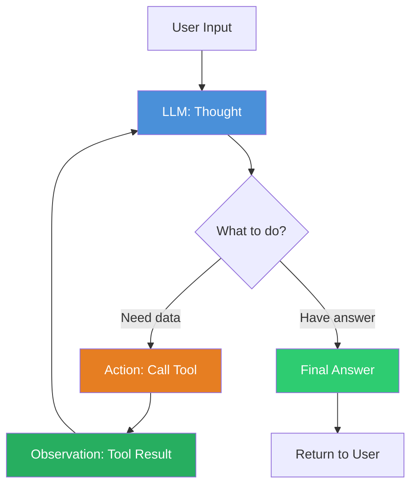

# Week 1 — Agent Memory & Tools

**Goal:** Agent architecture ka deep gyaan — ReAct pattern, tools, function calling, memory systems
**Output:** Fully working agent with custom tools + 4 memory types ka implementation

---

## Day 1 — ReAct Pattern: Agents Ka Core Engine

### Agent Kya Hai?

```python
"""
Laravel developer ke nazar se:

| Concept    | PHP/Laravel     | AI Agent                |
|------------|-----------------|-------------------------|
| Controller | Controller      | LLM                     |
| Service    | Service Class   | Tool                    |
| Session    | Session/Cache   | Memory                  |
| Middleware | Middleware      | Guardrails              |
| Queue Job  | Queue Worker    | Multi-step Agent Loop   |
"""
```

**Agent = LLM + Tools + Memory** — teeno combine hote hain ek powerful system mein.

Without agent framework, LLM sirf text generate karta hai. Agent banane ke baad, LLM:
- Decide karta hai **kya action lena hai** (Reasoning)
- Execute karta hai **actual action** (Acting)
- Observe karta hai **result** (Observation)
- Repeat karta hai jab tak goal achieve na ho

### ReAct Pattern — The Heart of AI Agents

ReAct = **Rea**soning + **Act**ing. Yeh paper "ReAct: Synergizing Reasoning and Acting in Language Models" (2022) se aaya hai.



### ReAct Cycle Step-by-Step

```python
"""
Step 1: THOUGHT
"User Q4 sales puch raha hai. Mujhe database query karni padegi."

Step 2: ACTION
Tool: query_database
Input: "Q4 2024 sales revenue"

Step 3: OBSERVATION
"Total Revenue: $1,200,000. Growth: -15% YoY"

Step 4: THOUGHT (again)
"Data mil gaya. Ab user ko answer dunga."

Step 5: FINAL ANSWER
"Q4 2024 mein total revenue $1.2M tha, jo pichle saal se 15% kam hai."
"""
```

### ReAct vs Simple LLM Call

```python
"""
Simple LLM Call (without ReAct):
User: "Q4 sales kya hain?"
LLM: "Sorry, mujhe real-time data nahi pata" ❌

ReAct Agent:
User: "Q4 sales kya hain?"
Agent thinks: "Mujhe DB query karni hai"
Agent calls: query_database("Q4 sales")
Agent gets: {revenue: 1.2M, growth: -15%}
Agent: "Q4 mein $1.2M revenue tha, -15% growth" ✅
"""
```

### LangChain Mein ReAct Agent

```python
from langchain.agents import create_react_agent, AgentExecutor
from langchain_openai import ChatOpenAI
from langchain.tools import Tool
from langchain import hub

"""
create_react_agent internally kya karta hai:

1. Prompt template banata hai (ReAct format)
2. LLM + tools combine karta hai
3. Output parser lagata hai (Action/Thought/Final nikalta hai)
4. AgentExecutor loop chalata hai
"""

def get_time(query: str) -> str:
    from datetime import datetime
    return f"Current time: {datetime.now().strftime('%H:%M:%S')}"

def calculator(query: str) -> str:
    """Simple calculator. Query should be a math expression."""
    try:
        return str(eval(query, {"__builtins__": {}}, {}))
    except Exception as e:
        return f"Calculation error: {e}"

tools = [
    Tool(name="current_time", func=get_time,
         description="Get current date and time. Use for time-related queries."),
    Tool(name="calculator", func=calculator,
         description="Perform mathematical calculations. Input: math expression."),
]

llm = ChatOpenAI(model="gpt-4o", temperature=0)
prompt = hub.pull("hwchase17/react")

agent = create_react_agent(llm, tools, prompt)

agent_executor = AgentExecutor(
    agent=agent,
    tools=tools,
    verbose=True,
    max_iterations=5,
    handle_parsing_errors=True,
)

# Run
result = agent_executor.invoke({"input": "Aaj ka date kya hai aur 45*67 kya hota hai?"})
print(result["output"])
# Thought: User date aur calculation dono puch raha hai.
# Action: current_time
# Observation: Current time: ...
# Thought: Ab calculation karte hain.
# Action: calculator(45*67)
# Observation: 3015
# Final: "Aaj ka date [date] hai aur 45*67 = 3015"
```

### ReAct Prompt Ka Internal Structure

```python
"""
Yeh hai actual prompt jo agent ko milta hai (simplified):

You are an AI assistant with access to these tools:
- current_time: Get current date and time
- calculator: Perform mathematical calculations

Follow this format:
Question: user ka input
Thought: abhi kya karna chahiye
Action: tool ka naam (jo bhi tool available hai)
Action Input: tool ka input
Observation: tool ka result
... (Thought/Action/Observation repeat ho sakta hai)
Thought: mujhe final answer pata hai
Final Answer: user ko jawab

Production mein prompt kaafi detailed hota hai. LangChain hub pull karke dekh sakte ho.
"""
```

### PHP Developer Analogy

```
Laravel mein job queue:

Queue Worker = Agent Loop
Jobs = Actions/Tools
Job Result = Observation
Queue retry = max_iterations

PHP: dispatch(new ProcessReport()) → handle() → next job
AI: Action(query_database) → Observation(data) → Final Answer
```

### Practical Tip

```
Real-world mein kab ReAct kaam nahi karta:

1. LLM ko tool ka naam galat yaad ho jaye → handle_parsing_errors=True rakho
2. Too many iterations → max_iterations=5-8 set karo
3. Tool returns huge data → size limit rakho
4. Agent same action repeat kare → early_stopping_method="generate"

Production mein yeh mistakes mat karna:
❌ max_iterations ka unlimited chhod diya → infinite loop
❌ handle_parsing_errors=False rakha → ek parse error pe sab crash
❌ Tool ko vague description di → LLM confuse ho jayega
```

---

## Day 2 — Tool Definition & Function Calling API

### Tool Kya Hai?

```python
"""
Tool = Agent ka weapon. Koi bhi Python function jo agent use kar sakta hai.

Three types of tools in LangChain:

1. @tool decorator     → Simple, ek line mein
2. Tool class          → Quick definition
3. BaseTool subclass   → Full control (Pydantic schema, custom logic)

Laravel analogy:
@tool decorator = Route::get() — simple
Tool class = Controller@method — structured
BaseTool = Custom Service + Interface — full flexibility
"""
```

### Method 1: @tool Decorator

```python
from langchain_core.tools import tool

@tool
def get_user_info(user_id: str) -> str:
    """
    Get user information from ApexERP system.
    
    Args:
        user_id: The ID or name of the user to look up.
    
    Returns:
        User details as string.
    """
    # Simulate DB lookup
    users = {
        "raushan": {"name": "Raushan", "role": "Laravel Developer", "email": "raushan@apexpillar.com"},
        "anjali": {"name": "Anjali", "role": "Project Manager", "email": "anjali@apexpillar.com"},
    }
    
    result = users.get(user_id.lower(), {"error": "User not found"})
    return str(result)

@tool
def list_users(department: str = "") -> str:
    """
    List all users in a department.
    
    Args:
        department: Department name (optional). If empty, lists all.
    
    Returns:
        List of users.
    """
    all_users = [
        {"name": "Raushan", "dept": "Engineering"},
        {"name": "Anjali", "dept": "Management"},
        {"name": "Vikram", "dept": "Sales"},
    ]
    
    if department:
        filtered = [u for u in all_users if u["dept"].lower() == department.lower()]
        return str(filtered)
    
    return str(all_users)

# Auto-detect: tool name = function name, docstring = description
tools = [get_user_info, list_users]
```

### Method 2: Tool Class

```python
from langchain.tools import Tool

def query_inventory(product_name: str = "") -> str:
    """Check inventory levels."""
    inventory = {
        "laptop": 45,
        "mouse": 230,
        "keyboard": 120,
        "monitor": 67,
    }
    
    if product_name:
        product_name = product_name.lower()
        if product_name in inventory:
            return f"{product_name}: {inventory[product_name]} units available"
        return f"Product '{product_name}' not found in inventory"
    
    return str(inventory)

inventory_tool = Tool(
    name="check_inventory",
    func=query_inventory,
    description="Check inventory levels. Input: product name (optional). Returns stock count."
)

# Tool with return_direct (tool ka result directly user ko bhej dega)
def get_weather(city: str) -> str:
    """Get weather for a city."""
    return f"Weather in {city}: 28°C, Partly Cloudy"

weather_tool = Tool(
    name="get_weather",
    func=get_weather,
    description="Get current weather for a city. Input: city name.",
    return_direct=True  # Tool ka result agent ke bina process kiye user ko jayega
)
```

### Method 3: BaseTool Subclass (Full Control)

```python
from langchain.tools import BaseTool
from pydantic import BaseModel, Field
from typing import Optional, Type
import json, time, hashlib

class SalesQueryInput(BaseModel):
    period: str = Field(description="Time period for sales data, e.g., 'Q4 2024', 'January'")
    region: Optional[str] = Field(None, description="Region filter, e.g., 'North India'")

class SalesDataTool(BaseTool):
    """
    Enterprise-grade tool example.
    
    Features:
    - Pydantic input validation
    - Caching
    - Rate limiting
    - Error handling
    - Detailed logging
    """
    name: str = "get_sales_data"
    description: str = """
    Get sales data from ApexERP system.
    Use this when users ask about revenue, orders, or sales performance.
    Supports filtering by period and region.
    """
    args_schema: Type[BaseModel] = SalesQueryInput
    return_direct: bool = False
    
    # Custom attributes
    cache_ttl: int = 300  # 5 minutes cache
    _cache: dict = {}
    
    def _run(self, period: str, region: Optional[str] = None) -> str:
        """Synchronous execution."""
        # Check cache
        cache_key = f"{period}_{region}"
        if cache_key in self._cache:
            cache_time, cache_data = self._cache[cache_key]
            if time.time() - cache_time < self.cache_ttl:
                return f"[CACHED] {cache_data}"
        
        try:
            # Simulate DB query
            time.sleep(0.5)  # Simulate latency
            
            result = {
                "period": period,
                "region": region or "All",
                "revenue": 1200000,
                "orders": 4500,
                "avg_order_value": 267,
                "growth_pct": -15,
            }
            
            formatted = json.dumps(result, indent=2)
            
            # Update cache
            self._cache[cache_key] = (time.time(), formatted)
            
            return formatted
            
        except Exception as e:
            return f"Error fetching sales data: {str(e)}"
    
    async def _arun(self, period: str, region: Optional[str] = None) -> str:
        """Asynchronous execution."""
        # For I/O operations, use async
        return self._run(period, region)
    
    def clear_cache(self):
        self._cache.clear()

# Usage
sales_tool = SalesDataTool()
result = sales_tool.invoke({"period": "Q4 2024", "region": "North"})
print(result)
```

### Method 4: StructuredTool (Alternative to BaseTool)

```python
from langchain.tools import StructuredTool

def fetch_customer_data(customer_id: str, include_orders: bool = False) -> str:
    """
    Fetch customer data from ApexERP.
    
    Args:
        customer_id: Customer ID or email
        include_orders: Whether to include order history
    """
    customer = {"id": customer_id, "name": "Acme Corp", "since": "2020", "tier": "Premium"}
    
    if include_orders:
        customer["orders"] = [
            {"id": "ORD-001", "amount": 50000, "date": "2024-10-15"},
            {"id": "ORD-002", "amount": 75000, "date": "2024-11-20"},
        ]
    
    return str(customer)

customer_tool = StructuredTool.from_function(
    func=fetch_customer_data,
    name="get_customer",
    description="Fetch customer information. Include orders with include_orders=True.",
    # Pydantic schema auto-generated from type hints
)
```

### Function/Tool Calling API (OpenAI Native)

```python
"""
OpenAI ka Function Calling — ReAct se zyada efficient.

Difference:
- ReAct: LLM text generate karta hai "Action: tool_name" phir parse karte ho
- Function Calling: LLM directly structured JSON return karta hai tool call ke liye

LLM ka response aisa hota hai:
{
  "tool_calls": [{
    "id": "call_abc123",
    "type": "function",
    "function": {
      "name": "get_sales_data",
      "arguments": "{\"period\": \"Q4 2024\"}"
    }
  }]
}

No parsing needed! Direct execution.
"""

from langchain.agents import create_tool_calling_agent, AgentExecutor
from langchain_openai import ChatOpenAI
from langchain.tools import tool

@tool
def get_employee(name: str) -> str:
    """Get employee details by name."""
    employees = {
        "raushan": "Laravel Developer, ApexPillar, Patna",
        "anjali": "Project Manager, ApexPillar, Delhi",
    }
    return employees.get(name.lower(), "Employee not found")

@tool
def calculate_bonus(employee: str, amount: float) -> str:
    """Calculate and approve bonus for an employee."""
    if amount <= 0:
        return "Amount must be positive"
    if amount > 100000:
        return "Amount exceeds limit. Needs manager approval."
    return f"Bonus of Rs.{amount} approved for {employee}"

tools = [get_employee, calculate_bonus]

# Tool calling agent — OpenAI ke native function calling use karta hai
llm = ChatOpenAI(model="gpt-4o", temperature=0)
agent = create_tool_calling_agent(llm, tools)

agent_executor = AgentExecutor(
    agent=agent,
    tools=tools,
    verbose=True,
    max_iterations=3,
)

result = agent_executor.invoke({"input": "Raushan ko Rs.50000 bonus do"})
# Internally LLM ne directly tool call bheja — JSON format mein
# "function": {"name": "get_employee", "arguments": "{\"name\": \"raushan\"}"}
```

### ReAct vs Function Calling — Kab Kya Use Karein?

```python
"""
ReAct (create_react_agent):
✅ Non-OpenAI models ke saath kaam karta hai (Claude, Gemini)
✅ Custom output formats support karta hai
✅ Fully customizable prompt
❌ Thoda slow (text generate → parse → execute)
❌ Parsing errors ho sakti hain

Function Calling (create_tool_calling_agent):
✅ Fast hai — directly structured output
✅ Parsing errors nahi hote
✅ Reliable tool execution
❌ Sirf OpenAI/Functions-supporting models ke saath
❌ Limited customization

Recommendation:
- Open-source model use kar rahe ho → ReAct
- OpenAI GPT-4/GPT-4o use kar rahe ho → Tool Calling
- Claude use kar rahe ho → ReAct (ya custom)
"""
```

### Tool Error Handling Patterns

```python
from langchain_core.tools import tool
import logging

logger = logging.getLogger(__name__)

@tool
def fragile_operation(query: str) -> str:
    """
    Example of robust tool with error handling.
    """
    try:
        # Main operation
        result = process_data(query)
        return result
        
    except ConnectionError as e:
        logger.error(f"DB connection failed: {e}")
        return f"Database connection error. Try again later. (Error: {str(e)[:50]})"
        
    except TimeoutError as e:
        logger.error(f"Query timed out: {e}")
        return "Query took too long. Please simplify your request."
        
    except ValueError as e:
        logger.warning(f"Invalid input: {e}")
        return f"Invalid input: {str(e)}"
        
    except Exception as e:
        logger.critical(f"Unknown error: {e}", exc_info=True)
        return f"An unexpected error occurred. Support has been notified."


def process_data(query: str) -> str:
    """Simulated processing function."""
    if "error" in query.lower():
        raise ConnectionError("Simulated DB failure")
    if len(query) > 100:
        raise ValueError("Query too long")
    return f"Processed: {query}"
```

### Practical Tip

```
Tool creation best practices:

1. ✅ Descriptive name: "query_database" not "qd" or "db_func"
2. ✅ Clear description: "Fetch sales data from ApexERP. Input: period (e.g., Q4 2024)"
3. ✅ Input validation: Pydantic schemas use karo
4. ✅ Error handling: Har error case handle karo
5. ✅ Rate limiting: Production mein tools ko rate limit karo
6. ✅ Return strings: Tools hamesha string return karein (LLM text expect karta hai)

Production mein yeh mistakes mat karna:
❌ Tool description vague — LLM samjhega nahi kab use karna hai
❌ Tool me console.log/info — Agent ke output me mix ho jayega
❌ No error handling — Ek DB crash poora agent tod dega
❌ Returning non-string — LLM ko parse karna padega
```
---

## Day 3 — ConversationBufferMemory

```python
from langchain.memory import ConversationBufferMemory
from langchain.schema import HumanMessage, AIMessage, SystemMessage

class SimpleChatMemory:
    """
    Sabse basic memory — saare messages store karta hai.
    
    Internal working:
    -> messages list: [HumanMessage, AIMessage, HumanMessage, AIMessage, ...]
    -> load_memory_variables(): returns formatted string
    -> Agent ke prompt mein "chat_history" ke roop mein inject hota hai
    
    Pros: Kuch miss nahi hota, full context available
    Cons: Token usage zyada hai, limit nahi hai
    """
    def __init__(self):
        self.memory = ConversationBufferMemory(
            return_messages=True,
            memory_key="chat_history",
            output_key="output",        # Agent output extract karne ke liye
            input_key="input",           # Agent input identify karne ke liye
        )

    def add_user_message(self, message: str):
        self.memory.chat_memory.add_message(HumanMessage(content=message))

    def add_ai_message(self, message: str):
        self.memory.chat_memory.add_message(AIMessage(content=message))

    def add_system_message(self, message: str):
        self.memory.chat_memory.add_message(SystemMessage(content=message))

    def get_history(self) -> str:
        return self.memory.load_memory_variables({})["chat_history"]

    def clear(self):
        self.memory.clear()

# Usage
chat = SimpleChatMemory()
chat.add_user_message("Mera naam Raushan hai")
chat.add_ai_message("Namaste Raushan! Kaise help karun?")
chat.add_user_message("Mujhe Q4 sales chahiye")
chat.add_ai_message("Let me check the database...")

history = chat.get_history()
# Returns list: [HumanMessage("Mera naam Raushan hai"), 
#                 AIMessage("Namaste Raushan!"), 
#                 HumanMessage("Mujhe Q4 sales chahiye"), 
#                 AIMessage("Let me check the database...")]
```

### Memory Ke Saath Agent

```python
from langchain.agents import AgentExecutor, create_react_agent
from langchain.tools import Tool
from langchain.memory import ConversationBufferMemory
from langchain_openai import ChatOpenAI
from langchain import hub

tools = [
    Tool(name="current_time", func=lambda x: __import__('datetime').datetime.now().strftime('%H:%M:%S'),
         description="Get current time"),
    Tool(name="get_stock", func=lambda x: f"{x}: ₹450",
         description="Get stock price. Input: company name"),
]

llm = ChatOpenAI(model="gpt-4o", temperature=0)
prompt = hub.pull("hwchase17/react")

"""
Memory ka magic: Agent user ke pichle messages ko yaad rakhta hai.
Har invoke ke saath, memory expand hoti hai.
"""

memory = ConversationBufferMemory(
    memory_key="chat_history",
    return_messages=True,
)

agent = create_react_agent(llm, tools, prompt)
agent_executor = AgentExecutor(
    agent=agent,
    tools=tools,
    memory=memory,         # <-- THIS IS KEY
    verbose=True,
    max_iterations=3,
)

# Round 1
resp1 = agent_executor.invoke({"input": "Mera naam Raushan hai"})
# Memory me save: "Mera naam Raushan hai" / "Namaste Raushan!"

# Round 2
resp2 = agent_executor.invoke({"input": "Mera naam kya hai?"})
# Memory se retrieve: "Mera naam Raushan hai" → "Aapka naam Raushan hai" ✅

# Round 3
resp3 = agent_executor.invoke({"input": "Reliance ka stock price kya hai?"})
# Memory se pata chala user ka naam Raushan hai
# + Stock price fetch karega

print(resp3["output"])
# "Raushan, Reliance ka stock price ₹450 hai."
```

### Memory Ke Internals — Kaise Kaam Karta Hai

```python
"""
Agent + Memory = Yeh flow follow hota hai:

1. User: "Mera naam Raushan hai"
2. AgentExecutor.invoke() call
3. Memory.load_memory_variables() → "{chat_history: ''}" (empty, first call)
4. LLM call with: SystemPrompt + ChatHistory + UserInput
5. Agent processes, returns output
6. Memory.save_context({"input": "..."}, {"output": "..."}) 
7. ChatHistory now: [Human, AI]

8. User: "Mera naam kya hai?"
9. Memory.load_memory_variables() → "{chat_history: [Human, AI]}"
10. LLM call with: SystemPrompt + ChatHistory(["Mera naam Raushan hai", "Namaste!"]) + UserInput
11. LLM sees user's previous message → remembers name

Internal prompt structure:
System: You are a helpful assistant...
ChatHistory:
  Human: Mera naam Raushan hai
  AI: Namaste Raushan!
Human: Mera naam kya hai?
Assistant: (LLM generates answer based on context)
"""
```

### Memory Key — Important Configuration

```python
"""
AgentExecutor + Memory configuration understand karna zaroori hai.
Confusion hota hai memory_key aur input/output key mein.

Agent prompt mein teen placeholders hote hain:
1. {input} — current user query
2. {chat_history} — previous conversation
3. {agent_scratchpad} — current ReAct loop ka scratchpad

Memory ko inhi keys ke saath align karna padta hai.
"""

# Correct configuration
memory = ConversationBufferMemory(
    memory_key="chat_history",   # Prompt template se match hona chahiye
    return_messages=True,        # Messages list return kare, nahi to string
    input_key="input",           # Agent ka input field
    output_key="output",         # Agent ka output field  
)

# Wrong configuration — yeh kaam nahi karega
wrong_memory = ConversationBufferMemory(
    memory_key="history",        # Prompt me "chat_history" hai, "history" nahi
    return_messages=False,       # String format → parsing issues
)
```

### Practical Tip

```
ConversationBufferMemory limitations:

❌ Token budget quickly khatam — 10-15 messages mein hi 4000 tokens
❌ No summarization — sab kuch store karta hai
❌ No entity extraction — "Raushan" ka naam har baar context mein store karega
❌ Session persistence nahi hai — server restart = memory loss

Solution: Day 4, 5, 6 mein dekhenge advanced memory types
```
---

## Day 4 — ConversationSummaryBufferMemory

```python
from langchain.memory import ConversationSummaryBufferMemory
from langchain_openai import ChatOpenAI

class SummaryMemory:
    """
    Jab conversation boht lambi ho jaye (>max_token_limit),
    toh purani messages ka summary bana do.
    Fresh messages as they are store karo.

    Best of both worlds:
    → Recent messages: full detail (like ConversationBuffer)
    → Old messages: summarized but key info preserved
    
    Analogy: Ek book padh rahe ho.
    Last 2 chapters: full detail mein padhe
    Previous chapters: summary yaad hai 
    """
    def __init__(self, max_token_limit: int = 2000):
        self.memory = ConversationSummaryBufferMemory(
            llm=ChatOpenAI(model="gpt-4o", temperature=0),
            max_token_limit=max_token_limit,
            return_messages=True,
            memory_key="chat_history",
        )

    def add(self, human: str, ai: str):
        self.memory.chat_memory.add_user_message(human)
        self.memory.chat_memory.add_ai_message(ai)

    def load(self) -> str:
        return self.memory.load_memory_variables({})["chat_history"]

# Demo: Token limit cross hone par summary kaise banta hai
memory = SummaryMemory(max_token_limit=500)

for i in range(20):
    memory.add(
        f"Q{i}: ApexERP ke baare mein kya features hain?",
        f"A{i}: ApexERP ek ERP system hai jisme inventory, sales, purchase, finance, HR, "
        f"payroll, CRM, project management, manufacturing, quality control, "
        f"warehouse management aur analytics modules hain..."
    )

history = memory.load()
# Output dekho — purani messages ka summary bana diya
```

### SummaryBufferMemory Internal Mechanism

```python
"""
Jab max_token_limit cross hota hai, yeh hota hai internally:

def _get_summary_if_needed(self, messages):
    # Check total tokens
    total_tokens = count_tokens(messages)
    
    if total_tokens <= self.max_token_limit:
        return messages  # Sab as it is
    
    # Exceeded! Time to summarize.
    old_messages = messages[:-2]  # Last 2 messages ko chhod do
    recent_messages = messages[-2:]  # Recent messages preserve karo
    
    # LLM se summary banao
    summary_prompt = f"""
    Current summary: {existing_summary or 'None'}
    New lines to summarize: {old_messages}
    New summary (concise):
    """
    new_summary = llm.invoke(summary_prompt)
    
    # Final result = summary + recent messages
    return [SystemMessage(f"Summary: {new_summary}")] + recent_messages

Yeh har baar hota hai jab bhi token limit cross ho. 
Summary bhi evolve hoti hai — purani summary + naye info merge hoti hai.
"""
```

### Practical SummaryMemory Example

```python
memory = ConversationSummaryBufferMemory(
    llm=ChatOpenAI(model="gpt-4o", temperature=0),
    max_token_limit=1000,
    memory_key="chat_history",
    return_messages=True,
)

# Phase 1: Budget ke andar
memory.save_context({"input": "Mera naam Raushan hai"}, {"output": "Namaste Raushan!"})
memory.save_context({"input": "Mein ApexPillar mein kaam karta hoon"}, {"output": "Achha! Kya role hai?"})
memory.save_context({"input": "Laravel developer"}, {"output": "AI seekh rahe hain?"})

# Phase 2: Token limit cross (simulate with small limit)
# Ab purani batein summary mein compress ho jayengi
print(memory.load_memory_variables({})["chat_history"])
# System: Summary of earlier conversation...

# Phase 3: Summary ke baad bhi naye details preserve
memory.save_context({"input": "Haan, Phase 5 Agents seekh raha hoon"}, {"output": "Bohat achha!"})

# Summary update ho jayegi — nayi info merge
```

### When to Use SummaryMemory

```
Use SummaryBufferMemory when:
✅ User 10+ messages ka conversation karta hai
✅ Tokens limited hain (GPT-4 mini ke saath bhi)
✅ Recent context more important hai purane se
✅ Running cost optimize karna hai

Don't use when:
❌ Har message critical hai (legal/financial)
❌ Short conversations (2-5 messages)
❌ User ko exact recall chahiye
```
---

## Day 5 — VectorStoreMemory

```python
from langchain.memory import VectorStoreRetrieverMemory
from langchain_community.vectorstores import Chroma
from langchain_openai import OpenAIEmbeddings

class LongTermMemory:
    """
    Vector DB mein memories store karo.
    Har memory ka embedding banega (vector representation).
    Similar memories retrieve ho sakti hain (semantic search).
    
    Yehi difference hai:
    BufferMemory: "Raushan ne kya kaha tha?" → exact match
    VectorMemory: "User ke baare mein kuch tha" → semantic search
    
    Laravel developer analogy:
    BufferMemory = MySQL exact query
    VectorMemory = Elasticsearch full-text search
    """
    def __init__(self):
        # Persistent Chroma DB — directory mein save hoga
        vectorstore = Chroma(
            collection_name="agent_memories",
            embedding_function=OpenAIEmbeddings(),
            persist_directory="./chroma_memories",  # Disk pe save
        )
        
        self.memory = VectorStoreRetrieverMemory(
            retriever=vectorstore.as_retriever(
                search_kwargs={"k": 3}  # Top 3 relevant memories
            ),
            memory_key="relevant_memories",
            return_messages=True,
        )

    def save_context(self, user_input: str, ai_output: str):
        """Save conversation context — embedding automatically banega."""
        self.memory.save_context(
            {"input": user_input},
            {"output": ai_output}
        )

    def load_context(self, query: str) -> str:
        """Load relevant memories for a query — semantic search."""
        return self.memory.load_memory_variables({"input": query})

# Demo: Cross-session memory
memory = LongTermMemory()

# Session 1: User kuch important bata raha hai
memory.save_context(
    "Mujhe Q4 sales report chahiye jinme region-wise breakdown ho",
    "Main region-wise Q4 report generate kar raha hoon..."
)

# Session 2: User related puch raha hai
results = memory.load_context("Sales report region wise")
# Vector search similar embeddings dhunde ga
# Returns: "Mujhe Q4 sales report chahiye..."

# Session 3: Different words but same meaning
results2 = memory.load_context("Revenue by area for last quarter")
# Same memory retrieve karega! Because semantically similar
```

### Vector Memory vs Buffer Memory

```python
"""
Buffer Memory (Day 3):
┌──────────────────────┐
│ User: "Mera naam..." │
│ AI: "Namaste..."     │
│ User: "Q4 sales..."  │
│ AI: "Let me..."      │
│ User: "Email bhejo"  │
│ AI: "Sent!"         │
└──────────────────────┘
→ All messages, sequential
→ Access: last N messages
→ Search: by position

Vector Memory (Day 5):
┌──────────────────────┐
│ "Raushan, ApexPillar"│ ← embedding: [0.1, 0.3, ...]
│ "Q4 sales 1.2M"     │ ← embedding: [0.4, 0.2, ...]
│ "email config done"  │ ← embedding: [0.7, 0.1, ...]
└──────────────────────┘
→ Key facts, semantic
→ Access: by similarity
→ Search: by meaning
"""
```

### Custom SQLite Vector Memory

```python
import sqlite3
import json
import numpy as np
from typing import List, Dict, Optional
from datetime import datetime
from openai import OpenAI

class SQLiteVectorMemory:
    """
    SQLite mein memory + embeddings store karo.
    Vector search for similar memories.
    
    Features:
    - All data in one SQLite file
    - Portable, no external DB needed
    - Embeddings locally stored
    - Cosine similarity search
    - Session isolation
    - Metadata support
    """
    def __init__(self, db_path: str = "agent_memory.db"):
        self.client = OpenAI()  # For embeddings
        self.conn = sqlite3.connect(db_path)
        self._create_tables()

    def _create_tables(self):
        self.conn.executescript("""
            CREATE TABLE IF NOT EXISTS memories (
                id INTEGER PRIMARY KEY AUTOINCREMENT,
                key TEXT NOT NULL,
                value TEXT NOT NULL,
                embedding TEXT NOT NULL,
                timestamp TEXT NOT NULL,
                session_id TEXT NOT NULL,
                metadata TEXT DEFAULT '{}'
            );
            
            CREATE INDEX IF NOT EXISTS idx_memories_key ON memories(key);
            CREATE INDEX IF NOT EXISTS idx_memories_session ON memories(session_id);
            
            CREATE TABLE IF NOT EXISTS memory_stats (
                total_memories INTEGER DEFAULT 0,
                last_updated TEXT
            );
        """)
        self.conn.commit()

    def save(self, key: str, value: str, session_id: str = "default", 
             metadata: dict = None) -> int:
        """
        Save a memory with its embedding.
        
        Args:
            key: Memory identifier
            value: Memory content
            session_id: Session identifier
            metadata: Additional info (importance, category, etc.)
        
        Returns:
            memory_id: Newly created memory ID
        """
        # Generate embedding
        text_for_embedding = f"{key}: {value}"
        emb_response = self.client.embeddings.create(
            model="text-embedding-3-small",
            input=text_for_embedding
        )
        embedding = emb_response.data[0].embedding
        
        cursor = self.conn.execute(
            """INSERT INTO memories 
               (key, value, embedding, timestamp, session_id, metadata) 
               VALUES (?, ?, ?, ?, ?, ?)""",
            (
                key, value, 
                json.dumps(embedding),
                datetime.now().isoformat(),
                session_id,
                json.dumps(metadata or {})
            )
        )
        self.conn.commit()
        return cursor.lastrowid

    def search(self, query: str, k: int = 5, session_id: str = None,
               min_score: float = 0.0) -> List[Dict]:
        """
        Search memories by semantic similarity.
        
        Args:
            query: Search text
            k: Number of results
            session_id: Filter by session (optional)
            min_score: Minimum similarity score (0-1)
        """
        query_emb = self.client.embeddings.create(
            model="text-embedding-3-small",
            input=query
        ).data[0].embedding
        
        # Fetch relevant memories
        if session_id:
            rows = self.conn.execute(
                "SELECT * FROM memories WHERE session_id = ? ORDER BY id DESC",
                (session_id,)
            ).fetchall()
        else:
            rows = self.conn.execute(
                "SELECT * FROM memories ORDER BY id DESC LIMIT 100"
            ).fetchall()
        
        # Score by cosine similarity
        scored = []
        for row in rows:
            stored_emb = json.loads(row[3])
            similarity = self._cosine_similarity(query_emb, stored_emb)
            if similarity >= min_score:
                scored.append({
                    "id": row[0],
                    "key": row[1],
                    "value": row[2],
                    "score": similarity,
                    "session": row[4],
                    "metadata": json.loads(row[5]),
                    "timestamp": row[5],
                })
        
        # Sort by similarity
        scored.sort(key=lambda x: x["score"], reverse=True)
        return scored[:k]

    def delete_session(self, session_id: str):
        """Delete all memories for a session."""
        self.conn.execute("DELETE FROM memories WHERE session_id = ?", (session_id,))
        self.conn.commit()

    def _cosine_similarity(self, a: List[float], b: List[float]) -> float:
        a_np, b_np = np.array(a), np.array(b)
        norm_product = np.linalg.norm(a_np) * np.linalg.norm(b_np)
        if norm_product == 0:
            return 0
        return float(np.dot(a_np, b_np) / norm_product)

    def get_stats(self) -> dict:
        """Get memory statistics."""
        row = self.conn.execute("SELECT COUNT(*) FROM memories").fetchone()
        return {
            "total_memories": row[0],
            "db_path": self.conn.database,
        }

# Full usage
memory = SQLiteVectorMemory("apexerp_memory.db")

# Save various memories
memory.save("user_name", "Raushan", session_id="session_1",
            metadata={"category": "identity", "importance": "high"})
memory.save("company", "ApexPillar Tech", session_id="session_1",
            metadata={"category": "identity"})
memory.save("recent_query", "Q4 sales decline analysis", session_id="session_2",
            metadata={"category": "task"})

# Search with semantic similarity
results = memory.search("user ke baare mein batao", k=3, min_score=0.3)
for r in results:
    print(f"{r['key']}: {r['value']} (score: {r['score']:.3f})")
```

### Vector DB Comparison

```python
"""
Kab kaunsa vector DB use karein:

Chroma:
✅ Simple, SQLite-based, local
✅ Best for prototyping
❌ Limited scaling

Pinecone:
✅ Managed, scalable
✅ High availability  
❌ Costly

Weaviate:
✅ Self-hosted
✅ Hybrid search (vector + keyword)
✅ Good for production

FAISS:
✅ Fastest similarity search
✅ In-memory
❌ No persistence by default

Recommendation:
- Learning phase → Chroma
- Production small scale → Chroma persistent
- Production large scale → Pinecone/Weaviate
"""
```

### Practical Tip

```
VectorMemory best practices:

1. ✅ memory_key="relevant_memories" rakho (default "chat_history" se different)
2. ✅ k=3 to k=5 memories retrieve karo
3. ✅ Session ID always pass karo
4. ✅ Important memories ko extra weight do
5. ✅ Periodic cleanup — purani unimportant memories delete karo

Production mein yeh mistake mat karna:
❌ Har cheez vector memory mein store karna — cost badhegi
❌ min_score nahi lagana — irrelevant memories aa jayengi
❌ Session isolation nahi rakhna — ek user doosre ki memories dekh lega
```
---

## Day 6 — EntityMemory

```python
from langchain.memory import ConversationEntityMemory
from langchain_openai import ChatOpenAI

class EntityAwareMemory:
    """
    Entities (people, places, things, concepts) ko automatically detect 
    aur track karta hai.
    
    Har entity ke baare mein jo bhi pata chale, store karo.
    Automatically update entities as conversation progresses.
    
    Kaise kaam karta hai:
    1. LLM user ke message mein se entities extract karta hai
    2. Har entity ke baare mein information store karta hai
    3. Jab user dobara entity mention kare, LLM uska info retrieve kare
    4. Naye information milne par entity store update hota hai
    
    Laravel analogy:
    EntityMemory = Eager loading of related models
    "Raushan" entity load karo, uska company, role, location sab aa jaye
    """
    def __init__(self):
        self.memory = ConversationEntityMemory(
            llm=ChatOpenAI(model="gpt-4o", temperature=0),
            memory_key="entities",
            return_messages=True,
        )

    def add(self, user: str, ai: str):
        self.memory.save_context(
            {"input": user},
            {"output": ai}
        )

    def get_entities(self) -> dict:
        return self.memory.load_memory_variables({})

    def get_entity_store(self) -> dict:
        """Internal entity store access."""
        return self.memory.entity_store.store

# Usage: Entity extraction in action
entity_memory = EntityAwareMemory()

entity_memory.add(
    "Mera naam Raushan hai aur mein ApexPillar Technology mein kaam karta hoon. "
    "Patna mein rehta hoon.",
    "Namaste Raushan! ApexPillar mein kya role hai aapka?"
)

entity_memory.add(
    "Mein Laravel developer hoon. Pichle 5 saal se.",
    "Achha! AI engineering seekh rahe hain?"
)

entity_memory.add(
    "Haan, mujhe AI agents bohat interesting lagte hain. "
    "Aur haan, meri company ApexPillar ERP solutions banati hai.",
    "Bohat achha! ApexPillar ERP system ke liye AI agent bana rahe hain?"
)

# Check what entities were extracted
entities = entity_memory.get_entity_store()
print(json.dumps(entities, indent=2))
# {
#   "Raushan": {
#     "mentions": 3,
#     "role": "Laravel developer",
#     "company": "ApexPillar Technology",
#     "location": "Patna",
#     "experience": "5 saal",
#     "interest": "AI agents"
#   },
#   "ApexPillar Technology": {
#     "mentions": 2,
#     "type": "company",
#     "product": "ERP solutions"
#   },
#   "Patna": {
#     "mentions": 1,
#     "type": "city",
#     "context": "residence"
#   }
# }
```

### Custom Entity Store (Persistence)

```python
import json
from typing import Dict, Optional, List
from langchain.memory.entity import BaseEntityStore

class FileEntityStore(BaseEntityStore):
    """
    Entities ko file mein persist karo.
    Baar baar naye conversation mein bhi entities available.
    
    Features:
    - JSON file mein store
    - Thread-safe file operations
    - Auto-backup
    - Metadata support
    - Search by entity type
    """
    def __init__(self, file_path: str = "entities.json"):
        self.file_path = file_path
        self._store: Dict = {}
        self.load()

    @property
    def store(self) -> Dict:
        return self._store

    def load(self):
        try:
            with open(self.file_path, "r") as f:
                self._store = json.load(f)
        except FileNotFoundError:
            self._store = {}

    def save(self):
        import tempfile, os, shutil
        # Atomic write — data corruption nahi hogi
        temp = tempfile.NamedTemporaryFile(
            mode='w', delete=False, dir=os.path.dirname(self.file_path)
        )
        try:
            json.dump(self._store, temp, indent=2)
            temp.close()
            shutil.move(temp.name, self.file_path)
        except:
            os.unlink(temp.name)
            raise

    def get(self, key: str) -> Optional[str]:
        return self._store.get(key)

    def set(self, key: str, value: Optional[str]):
        if value is None:
            self._store.pop(key, None)
        else:
            self._store[key] = value
        self.save()

    def delete(self, key: str):
        self._store.pop(key, None)
        self.save()

    def exists(self, key: str) -> bool:
        return key in self._store

    def clear(self):
        self._store.clear()
        self.save()

    def search_by_type(self, entity_type: str) -> List[tuple]:
        """Search entities by type (person, company, location)."""
        results = []
        for key, value in self._store.items():
            if isinstance(value, str) and entity_type.lower() in value.lower():
                results.append((key, value))
            elif isinstance(value, dict) and value.get("type") == entity_type:
                results.append((key, value))
        return results

# Usage with persistence
entity_store = FileEntityStore("apexerp_entities.json")

# Session 1
entity_store.set("Raushan_role", "Laravel Developer")
entity_store.set("Raushan_company", "ApexPillar Tech")
entity_store.set("Raushan_location", "Patna")

# Session 2 — Even after restart
print(entity_store.get("Raushan_role"))  # "Laravel Developer"
print(entity_store.get("Raushan_company"))  # "ApexPillar Tech"

# Search
results = entity_store.search_by_type("company")
print(results)  # [("Raushan_company", "ApexPillar Tech")]
```

### Entity Extraction Internals

```python
"""
EntityMemory ka LLM call aisa hota hai internally:

Extract all named entities from the conversation.
For each entity, extract information.

Conversation:
Human: Mera naam Raushan hai
AI: Namaste Raushan!
Human: Mein Laravel developer hoon 5 saal se

Entities (JSON format):
{
    "Raushan": "User, name. Laravel developer with 5 years experience."
}

Agar naya information milta hai:
Previous entities: {"Raushan": "User name"}
New lines: "Mein ApexPillar mein kaam karta hoon"
Updated: {"Raushan": "User name. Works at ApexPillar."}
"""
```

### Practical Tip

```
EntityMemory best practices:

1. ✅ Session ke across bhi entities persist karo (use custom store)
2. ✅ LLM ka temperature=0 rakho — consistent extraction ke liye
3. ✅ Entity names ko normalize karo (Raushan → raushan, Raushan Kumar → raushan)
4. ✅ Entity value update hoti hai automatically — no manual work needed

Limitations:
❌ Token cost: Har entity extraction ke liye LLM call hota hai
❌ Accuracy: Complex conversations mein entities miss ho sakti hain
❌ No relation mapping: "Raushan works at ApexPillar" → relation detect nahi hota
```
---

## Day 7 — SQLite-backed Memory Persistence

```python
import sqlite3
from typing import List, Dict, Optional
from datetime import datetime, timedelta
from langchain.schema import HumanMessage, AIMessage

class SQLiteChatMemory:
    """
    Saari conversations SQLite mein store karo.
    Session-based: har session ki apni memory.
    
    Benefits:
    → Session restart pe bhi memory available
    → Query kar sakte ho "pichle session mein kya hua tha?"
    → Analytics: kitne conversations, avg length, etc.
    → Multi-user support
    → Backup and restore
    """
    def __init__(self, db_path: str = "chat_history.db", 
                 session_id: str = None,
                 user_id: str = "default"):
        self.conn = sqlite3.connect(db_path, check_same_thread=False)
        self.conn.row_factory = sqlite3.Row
        self.session_id = session_id or datetime.now().strftime("%Y%m%d_%H%M%S")
        self.user_id = user_id
        self._create_tables()

    def _create_tables(self):
        self.conn.executescript("""
            CREATE TABLE IF NOT EXISTS sessions (
                session_id TEXT PRIMARY KEY,
                user_id TEXT NOT NULL DEFAULT 'default',
                created_at TEXT NOT NULL,
                updated_at TEXT NOT NULL,
                status TEXT DEFAULT 'active',
                metadata TEXT DEFAULT '{}'
            );
            
            CREATE TABLE IF NOT EXISTS messages (
                id INTEGER PRIMARY KEY AUTOINCREMENT,
                session_id TEXT NOT NULL,
                user_id TEXT NOT NULL DEFAULT 'default',
                role TEXT NOT NULL,
                content TEXT NOT NULL,
                timestamp TEXT NOT NULL,
                token_count INTEGER DEFAULT 0,
                metadata TEXT DEFAULT '{}',
                FOREIGN KEY (session_id) REFERENCES sessions(session_id)
            );
            
            CREATE TABLE IF NOT EXISTS session_summaries (
                session_id TEXT PRIMARY KEY,
                summary TEXT NOT NULL,
                created_at TEXT NOT NULL,
                updated_at TEXT NOT NULL,
                token_count INTEGER DEFAULT 0,
                key_points TEXT DEFAULT '[]',
                FOREIGN KEY (session_id) REFERENCES sessions(session_id)
            );
            
            CREATE INDEX IF NOT EXISTS idx_messages_session 
                ON messages(session_id, id);
            CREATE INDEX IF NOT EXISTS idx_messages_user 
                ON messages(user_id, timestamp);
            CREATE INDEX IF NOT EXISTS idx_sessions_user 
                ON sessions(user_id, updated_at);
        """)
        self.conn.commit()
        
        # Create or update session
        self.conn.execute(
            """INSERT OR IGNORE INTO sessions 
               (session_id, user_id, created_at, updated_at, status) 
               VALUES (?, ?, ?, ?, ?)""",
            (self.session_id, self.user_id, 
             datetime.now().isoformat(), datetime.now().isoformat(), 'active')
        )
        self.conn.commit()

    def add_message(self, role: str, content: str, metadata: dict = None):
        """Add a message to current session with optional metadata."""
        self.conn.execute(
            """INSERT INTO messages 
               (session_id, user_id, role, content, timestamp, metadata) 
               VALUES (?, ?, ?, ?, ?, ?)""",
            (self.session_id, self.user_id, role, content, 
             datetime.now().isoformat(), 
             json.dumps(metadata or {}))
        )
        self.conn.execute(
            "UPDATE sessions SET updated_at = ? WHERE session_id = ?",
            (datetime.now().isoformat(), self.session_id)
        )
        self.conn.commit()

    def add_human(self, content: str, metadata: dict = None):
        self.add_message("human", content, metadata)

    def add_ai(self, content: str, metadata: dict = None):
        self.add_message("ai", content, metadata)

    def get_history(self, limit: int = 50, offset: int = 0) -> List[Dict]:
        """Get paginated message history."""
        cursor = self.conn.execute(
            """SELECT role, content, timestamp, metadata 
               FROM messages 
               WHERE session_id = ? 
               ORDER BY id ASC 
               LIMIT ? OFFSET ?""",
            (self.session_id, limit, offset)
        )
        return [dict(row) for row in cursor.fetchall()]

    def search_messages(self, query: str) -> List[Dict]:
        """Search messages by content (basic text search)."""
        cursor = self.conn.execute(
            """SELECT session_id, role, content, timestamp 
               FROM messages 
               WHERE content LIKE ? 
               ORDER BY timestamp DESC 
               LIMIT 20""",
            (f"%{query}%",)
        )
        return [dict(row) for row in cursor.fetchall()]

    def get_session_summary(self) -> Optional[str]:
        """Get existing summary."""
        cursor = self.conn.execute(
            "SELECT summary FROM session_summaries WHERE session_id = ?",
            (self.session_id,)
        )
        row = cursor.fetchone()
        return row["summary"] if row else None

    def generate_summary(self, llm) -> dict:
        """Generate summary of current session using LLM."""
        history = self.get_history()
        text = "\n".join(f"{m['role']}: {m['content']}" for m in history)
        
        response = llm.invoke(f"""
        Summarize this conversation in 2-3 sentences.
        Also extract 3-5 key points.
        
        Format: JSON
        {{
            "summary": "...",
            "key_points": [...],
            "action_items": [...]
        }}
        
        Conversation:
        {text}
        """)
        
        import json
        try:
            data = json.loads(response.content)
        except:
            data = {"summary": str(response.content), "key_points": [], "action_items": []}
        
        self.conn.execute(
            """INSERT OR REPLACE INTO session_summaries 
               (session_id, summary, created_at, updated_at, key_points) 
               VALUES (?, ?, ?, ?, ?)""",
            (self.session_id, data["summary"], datetime.now().isoformat(),
             datetime.now().isoformat(), json.dumps(data.get("key_points", [])))
        )
        self.conn.commit()
        return data

    def list_sessions(self, user_id: str = None, limit: int = 10) -> List[Dict]:
        """List recent sessions."""
        if user_id:
            cursor = self.conn.execute(
                """SELECT session_id, user_id, created_at, updated_at 
                   FROM sessions 
                   WHERE user_id = ? 
                   ORDER BY updated_at DESC LIMIT ?""",
                (user_id, limit)
            )
        else:
            cursor = self.conn.execute(
                """SELECT session_id, user_id, created_at, updated_at 
                   FROM sessions ORDER BY updated_at DESC LIMIT ?""",
                (limit,)
            )
        return [dict(row) for row in cursor.fetchall()]

    def delete_old_sessions(self, days: int = 30):
        """Delete sessions older than N days."""
        cutoff = (datetime.now() - timedelta(days=days)).isoformat()
        self.conn.execute("DELETE FROM messages WHERE session_id IN "
                         "(SELECT session_id FROM sessions WHERE updated_at < ?)",
                         (cutoff,))
        self.conn.execute("DELETE FROM session_summaries WHERE session_id IN "
                         "(SELECT session_id FROM sessions WHERE updated_at < ?)",
                         (cutoff,))
        self.conn.execute("DELETE FROM sessions WHERE updated_at < ?", (cutoff,))
        self.conn.commit()

    def get_analytics(self) -> Dict:
        """Aggregate analytics for all sessions."""
        total_msgs = self.conn.execute(
            "SELECT COUNT(*) FROM messages"
        ).fetchone()[0]
        total_sessions = self.conn.execute(
            "SELECT COUNT(*) FROM sessions"
        ).fetchone()[0]
        avg_msgs = self.conn.execute(
            "SELECT AVG(cnt) FROM (SELECT COUNT(*) as cnt FROM messages GROUP BY session_id)"
        ).fetchone()[0]
        
        return {
            "total_sessions": total_sessions,
            "total_messages": total_msgs,
            "avg_messages_per_session": round(avg_msgs, 1) if avg_msgs else 0,
        }

# Complete usage example
memory = SQLiteChatMemory("apexerp_chats.db", user_id="raushan@apexpillar.com")

# Simulate multi-turn conversation
memory.add_human("Mera naam Raushan hai")
memory.add_ai("Namaste Raushan! Kaise help karun?")
memory.add_human("Mujhe Q4 sales report chahiye")
memory.add_ai("Main generate kar raha hoon...")

# Search across sessions
results = memory.search_messages("sales")
print(f"Found {len(results)} messages about sales")

# Analytics
stats = memory.get_analytics()
print(f"Total sessions: {stats['total_sessions']}")
print(f"Avg messages per session: {stats['avg_messages_per_session']}")

# New session — but old data available
memory2 = SQLiteChatMemory("apexerp_chats.db", 
                           session_id="new_session",
                           user_id="raushan@apexpillar.com")
memory2.add_human("Pichli baar kya baat hui thi?")
# Old session search karke AI ko context do
old_histories = memory2.search_messages("")
```

---

## Day 8 — AgentExecutor Deep Configuration

```python
from langchain.agents import AgentExecutor, create_tool_calling_agent
from langchain_openai import ChatOpenAI
from langchain.tools import tool
import logging
import time

logger = logging.getLogger(__name__)

@tool
def query_database(query: str) -> str:
    """Query ApexERP database."""
    time.sleep(1)  # Simulate DB latency
    return f"Query result for: {query[:50]}..."

@tool
def send_email(to: str, subject: str, body: str) -> str:
    """Send email."""
    return f"Email sent to {to}"

@tool
def risky_operation(data: str) -> str:
    """A risky operation that might fail."""
    import random
    if random.random() < 0.3:
        raise ValueError("Random failure!")
    return f"Operation completed: {data}"

tools = [query_database, send_email, risky_operation]

llm = ChatOpenAI(model="gpt-4o", temperature=0)
agent = create_tool_calling_agent(llm, tools)

# === Full AgentExecutor Configuration ===

agent_executor = AgentExecutor(
    agent=agent,
    tools=tools,
    
    # 1. LOOP CONTROL — Prevent infinite loops
    max_iterations=5,              # Max thought-action cycles
    max_execution_time=30,         # Max total seconds
    
    # 2. ERROR HANDLING
    handle_parsing_errors=True,    # Auto-fix JSON parse errors
    early_stopping_method="generate",  # "generate" or "force"
    
    # 3. DEBUGGING
    verbose=True,                  # Print intermediate steps
    return_intermediate_steps=True, # Return all steps in result
    
    # 4. CALLBACKS
    # callbacks=[monitor],       # Custom monitoring
    
    # 5. MEMORY
    # memory=ConversationBufferMemory(...),
    
    # 6. INPUT/OUTPUT KEYS
    # input_key="input",
    # output_key="output",
    
    # 7. ITERATION TOOLS
    max_function_calls=10,         # Max tool calls (different from iterations)
)

"""
max_iterations vs max_execution_time:
- max_iterations=5: Agent 5 se zyada baar soch-action nahi karega
- max_execution_time=30: 30 seconds bad force stop

Agar dono set hain, jo pehle hit karega woh apply hoga.

early_stopping_method options:
- "generate": Last observation ke basis pe answer generate karega
- "force": Agent ko answer banane ka force karega (riskier)
"""
```

### AgentExecutor Flow — Step by Step

```python
"""
Jab agent_executor.invoke() call karte ho, yeh hota hai:

1. input_process()
   → User input validate karo
   → Memory load karo (chat_history)
   → Agent scratchpad initialize karo

2. main_loop():
   while iteration < max_iterations:
       a. LLM call → Thought + Action generate karo
       b. Parse output → Action/Input extract karo
       c. Execute tool → get Observation
       d. Observation ko scratchpad mein append karo
       e. Check: kya agent ne Final Answer diya?
          → Agar haan, loop se bahar
          → Agar nahi, continue
       f. iteration += 1

3. If loop ends without final answer:
   → early_stopping_method use karo
   → "generate": LLM se final answer banao
   → "force": last observation return karo

4. output_process()
   → Memory save karo
   → Intermediate steps format karo
   → Final response return karo
"""
```

### Debugging Agent Failure

```python
"""
Agent fail kab hota hai?

1. PARSING ERROR:
   LLM ne action format galat likha
   ❌ "Action: query_database Input: sales" (wrong format)
   ✅ "Action: query_database\nAction Input: sales"

   Solution: handle_parsing_errors=True

2. INVALID TOOL:
   LLM ne aisa tool call kiya jo exist nahi karta
   ❌ Action: delete_database  (tool exist nahi)
   
   Solution: LLM ko tool list proper do, handle_parsing_errors=True

3. INFINITE LOOP:
   Agent same action baar baar repeat karta hai
   Action: query_db → Observation → Action: query_db → Observation (infinite)
   
   Solution: max_iterations=5, diverse tools

4. HALLUCINATED RESULT:
   LLM tool ke bina hi answer bana leta hai
   
   Solution: return_intermediate_steps=True check karo
"""

# Agent output analyze karna
result = agent_executor.invoke({"input": "Q4 sales nikaalo aur email bhejo"})

print("=== FINAL ANSWER ===")
print(result["output"])

print("\n=== INTERMEDIATE STEPS ===")
for i, (action, observation) in enumerate(result["intermediate_steps"]):
    print(f"\nStep {i + 1}:")
    print(f"  Tool: {action.tool}")
    print(f"  Input: {action.tool_input}")
    print(f"  Result: {str(observation)[:100]}")

print("\n=== METRICS ===")
if "metrics" in result:
    print(f"  Total LLM calls: {result['metrics'].get('llm_calls', 'N/A')}")
    print(f"  Total tokens: {result['metrics'].get('total_tokens', 'N/A')}")
```

### Agent Monitoring with Callbacks

```python
from langchain.callbacks.base import BaseCallbackHandler
from typing import Dict, Any, List
import time

class DetailedAgentMonitor(BaseCallbackHandler):
    """
    Production-grade agent monitoring.
    
    Tracks:
    - Each LLM call (latency, tokens, model)
    - Each tool call (latency, success/failure)
    - Full agent chain timing
    - Errors with stack traces
    """
    def __init__(self):
        self.runs: List[Dict] = []
        self.errors: List[Dict] = []
        self._current = None

    def on_llm_start(self, serialized: Dict, prompts: List[str], **kwargs):
        self._current = {
            "type": "llm",
            "start_time": time.time(),
            "model": serialized.get("kwargs", {}).get("model_name", "unknown"),
            "prompt": prompts[0][:200] if prompts else "",
        }

    def on_llm_end(self, response, **kwargs):
        if self._current:
            self._current["latency"] = time.time() - self._current["start_time"]
            usage = getattr(response, "llm_output", {}) or {}
            self._current["tokens"] = usage.get("token_usage", {})
            self._current["status"] = "success"
            self.runs.append(self._current)

    def on_llm_error(self, error, **kwargs):
        if self._current:
            self._current["status"] = "error"
            self._current["error"] = str(error)
            self.runs.append(self._current)
            self.errors.append(self._current)

    def on_tool_start(self, serialized: Dict, input_str: str, **kwargs):
        self._current = {
            "type": "tool",
            "start_time": time.time(),
            "tool_name": serialized.get("name", "unknown"),
            "input": input_str[:200],
        }

    def on_tool_end(self, output: str, **kwargs):
        if self._current:
            self._current["latency"] = time.time() - self._current["start_time"]
            self._current["output_length"] = len(str(output))
            self._current["status"] = "success"
            
            # Alert on slow tools
            if self._current["latency"] > 5.0:
                logger.warning(f"SLOW TOOL: {self._current['tool_name']} "
                              f"took {self._current['latency']:.2f}s")
            
            self.runs.append(self._current)

    def on_tool_error(self, error, **kwargs):
        if self._current:
            self._current["status"] = "error"
            self._current["error"] = str(error)
            self.runs.append(self._current)
            self.errors.append(self._current)

    def get_stats(self) -> Dict[str, Any]:
        llm_calls = [r for r in self.runs if r["type"] == "llm"]
        tool_calls = [r for r in self.runs if r["type"] == "tool"]
        
        return {
            "total_llm_calls": len(llm_calls),
            "total_tool_calls": len(tool_calls),
            "total_errors": len(self.errors),
            "avg_llm_latency": round(
                sum(r.get("latency", 0) for r in llm_calls) / max(len(llm_calls), 1), 2
            ),
            "avg_tool_latency": round(
                sum(r.get("latency", 0) for r in tool_calls) / max(len(tool_calls), 1), 2
            ),
            "total_tokens": sum(
                r.get("tokens", {}).get("total_tokens", 0) for r in llm_calls
            ),
            "slow_tools": [
                r for r in tool_calls if r.get("latency", 0) > 5.0
            ],
        }

# Use it
monitor = DetailedAgentMonitor()

executor = AgentExecutor(
    agent=agent,
    tools=tools,
    callbacks=[monitor],
    verbose=True,
    max_iterations=5,
    return_intermediate_steps=True,
)

result = executor.invoke({"input": "Database query karo aur result do"})
stats = monitor.get_stats()
print(json.dumps(stats, indent=2))
```

---

## Day 9 — Custom Memory + Memory Compression

### Custom Memory Class

```python
from langchain.memory import BaseMemory
from typing import List, Dict, Any
from pydantic import BaseModel, Field
import json
from datetime import datetime

class CustomAgentMemory(BaseMemory):
    """
    Apna khud ka memory system.
    
    Features:
    → Recent messages (last N, configurable)
    → Important facts (extracted by LLM)
    → Task progress (current state of work)
    → User preferences
    → Session metadata
    → Auto-compression
    """
    memory_key: str = "custom_memory"
    
    # Memory stores
    recent_messages: List[Dict] = []
    important_facts: Dict[str, str] = {}
    task_state: Dict[str, Any] = {}
    user_preferences: Dict[str, Any] = {}
    session_metadata: Dict[str, Any] = {}
    
    max_recent: int = 10

    @property
    def memory_variables(self) -> List[str]:
        return [self.memory_key]

    def load_memory_variables(self, inputs: Dict) -> Dict:
        """Return formatted memory for LLM context."""
        memory_str = f"""
<CUSTOM_MEMORY>
Recent Conversation (last {len(self.recent_messages)} messages):
{self._format_messages()}

Important Facts About User:
{json.dumps(self.important_facts, indent=2)}

Current Task State:
{json.dumps(self.task_state, indent=2)}

User Preferences:
{json.dumps(self.user_preferences, indent=2)}

Session Info:
{json.dumps(self.session_metadata, indent=2)}
</CUSTOM_MEMORY>
"""
        return {self.memory_key: memory_str}

    def save_context(self, inputs: Dict, outputs: Dict) -> None:
        """Save new context."""
        user_input = inputs.get("input", "")
        ai_output = outputs.get("output", "")
        
        self.recent_messages.append({
            "human": user_input,
            "ai": ai_output,
            "timestamp": datetime.now().isoformat(),
        })
        
        if len(self.recent_messages) > self.max_recent:
            self.recent_messages.pop(0)

    def clear(self) -> None:
        self.recent_messages = []
        self.important_facts = {}
        self.task_state = {}
        self.user_preferences = {}
        self.session_metadata = {}

    def add_fact(self, key: str, value: str):
        self.important_facts[key] = value

    def get_fact(self, key: str) -> Optional[str]:
        return self.important_facts.get(key)

    def add_preference(self, key: str, value: Any):
        self.user_preferences[key] = value

    def set_task(self, task_id: str, state: Dict):
        self.task_state[task_id] = state

    def update_task(self, task_id: str, updates: Dict):
        if task_id in self.task_state:
            self.task_state[task_id].update(updates)

    def get_task(self, task_id: str) -> Optional[Dict]:
        return self.task_state.get(task_id)

    def set_metadata(self, key: str, value: Any):
        self.session_metadata[key] = value

    def _format_messages(self) -> str:
        lines = []
        for msg in self.recent_messages[-5:]:
            lines.append(f"User: {msg['human'][:200]}")
            lines.append(f"AI: {msg['ai'][:200]}")
        return "\n".join(lines)

# Usage
memory = CustomAgentMemory()

# Memory populate karo
memory.add_fact("name", "Raushan")
memory.add_fact("company", "ApexPillar Tech")
memory.add_preference("language", "Hinglish")
memory.add_preference("response_style", "detailed with examples")
memory.set_task("report_gen", {"step": "query_sales", "status": "in_progress"})
memory.set_metadata("user_id", "raushan_123")
memory.set_metadata("current_project", "Phase 5 Agents")

memory.save_context({"input": "Q4 sales report do"}, {"output": "Let me fetch..."})
context = memory.load_memory_variables({})
print(context["custom_memory"])
```

### Memory Compression System

```python
from typing import List, Optional
from langchain_openai import ChatOpenAI
from dataclasses import dataclass, field
import json

@dataclass
class MemorySegment:
    """A compressed memory segment."""
    summary: str
    message_count: int
    importance: float = 1.0  # 0.0 to 1.0
    topics: List[str] = field(default_factory=list)
    entities: List[str] = field(default_factory=list)

class MemoryCompressor:
    """
    Jab memory boht badi ho jaye, compress karo.
    
    Strategy:
    1. Messages ko segments mein tod do
    2. Har segment ka summary banao
    3. Important facts extract karo
    4. Importance score assign karo
    5. Low-importance segments discard karo
    6. Old summaries merge karo
    
    Analogy:
    Bufffer memory = Raw video footage (sab kuch)
    Compressed memory = Edited highlights reel (important parts)
    """
    def __init__(self, llm=None, max_segments: int = 5, 
                 importance_threshold: float = 0.3):
        self.llm = llm or ChatOpenAI(model="gpt-4o-mini", temperature=0)
        self.max_segments = max_segments
        self.importance_threshold = importance_threshold
        self.segments: List[MemorySegment] = []

    def add_segment(self, messages: List[Dict]) -> MemorySegment:
        """Add a message segment and get its summary with importance."""
        text = "\n".join(f"{m['role']}: {m['content']}" for m in messages)
        
        response = self.llm.invoke(f"""
        Analyze this conversation segment. Extract:
        1. Summary (2-3 sentences)
        2. Importance score (0.0 to 1.0):
           - 1.0: Critical business decision
           - 0.7: User preference/personal info
           - 0.5: General discussion
           - 0.3: Small talk
           - 0.1: Greetings/farewell
        3. Topics covered (comma-separated)
        4. Key entities mentioned
        
        Format: JSON
        {{
            "summary": "...",
            "importance": 0.8,
            "topics": ["topic1", "topic2"],
            "entities": ["entity1", "entity2"]
        }}
        
        Conversation:
        {text}
        """)
        
        try:
            data = json.loads(response.content)
        except:
            data = {"summary": str(response.content), "importance": 0.5, 
                    "topics": [], "entities": []}
        
        segment = MemorySegment(
            summary=data["summary"],
            message_count=len(messages),
            importance=data.get("importance", 0.5),
            topics=data.get("topics", []),
            entities=data.get("entities", []),
        )
        
        self.segments.append(segment)
        
        # Auto-compress if too many segments
        if len(self.segments) > self.max_segments:
            self._compress()
        
        return segment

    def _compress(self):
        """Compress by removing low-importance and merging oldest."""
        # Remove low-importance segments
        self.segments = [
            s for s in self.segments 
            if s.importance >= self.importance_threshold
        ]
        
        # Still too many? Merge oldest two
        while len(self.segments) > self.max_segments:
            oldest = self.segments[:2]
            remaining = self.segments[2:]
            
            merge_text = f"Summary 1: {oldest[0].summary}\nSummary 2: {oldest[1].summary}"
            merged = self.llm.invoke(
                f"Merge these summaries into one coherent summary:\n\n{merge_text}"
            )
            
            merged_segment = MemorySegment(
                summary=merged.content,
                message_count=oldest[0].message_count + oldest[1].message_count,
                importance=max(s.importance for s in oldest),
                topics=list(set(oldest[0].topics + oldest[1].topics)),
                entities=list(set(oldest[0].entities + oldest[1].entities)),
            )
            
            self.segments = [merged_segment] + remaining

    def get_compressed_context(self, top_k: int = 3) -> str:
        """Get top-k most important segments for context."""
        sorted_segments = sorted(
            self.segments, 
            key=lambda s: s.importance, 
            reverse=True
        )
        
        context_parts = []
        for s in sorted_segments[:top_k]:
            context_parts.append(
                f"[Importance: {s.importance:.1f}] {s.summary}"
            )
        
        return "\n\n".join(context_parts)

    def extract_facts(self, text: str) -> Dict[str, str]:
        """Extract factual statements from text."""
        import json
        response = self.llm.invoke(f"""
        Extract all factual statements as JSON:
        Input: {text}
        Output format: {{"key": "value", ...}}
        Example: {{"name": "Raushan", "company": "ApexPillar"}}
        """)
        try:
            return json.loads(response.content)
        except:
            return {"error": "Could not parse facts"}

    def get_all_topics(self) -> List[str]:
        """Get all unique topics across segments."""
        topics = set()
        for s in self.segments:
            topics.update(s.topics)
        return list(topics)

# Usage
compressor = MemoryCompressor(max_segments=4)

# Session 1: Important — user introduction
seg1 = compressor.add_segment([
    {"role": "user", "content": "Mera naam Raushan hai. Mein ApexPillar mein AI agent bana raha hoon."},
    {"role": "assistant", "content": "Namaste Raushan! Kya help chahiye?"}
])
print(f"Importance: {seg1.importance}, Topics: {seg1.topics}")

# Session 2: Greetings (low importance)
seg2 = compressor.add_segment([
    {"role": "user", "content": "Good morning"},
    {"role": "assistant", "content": "Good morning! Kaise hain aap?"}
])

# Session 3: Business requirement
seg3 = compressor.add_segment([
    {"role": "user", "content": "Mujhe ek agent chahiye jo Q4 sales report automatically bhej de"},
    {"role": "assistant", "content": "Main aisa agent bana sakta hoon..."}
])

# Get compressed context
context = compressor.get_compressed_context(top_k=2)
print(context)
# High-importance segments preserve, low-importance auto-discard
```

### Full Integration: Memory + Agent

```python
"""
Custom memory ke saath agent integrate karna:

Step 1: Custom memory banai
Step 2: Tools banaye
Step 3: Agent create kiya
Step 4: AgentExecutor mein memory inject ki
"""

from langchain.agents import create_tool_calling_agent, AgentExecutor
from langchain_openai import ChatOpenAI
from langchain.tools import tool

# Tools
@tool
def query_sales(period: str) -> str:
    """Query sales data for a period."""
    return json.dumps({"period": period, "revenue": 1200000})

@tool
def get_user_info(name: str) -> str:
    """Get user information."""
    return json.dumps({"name": name, "role": "developer"})

tools = [query_sales, get_user_info]

# LLM
llm = ChatOpenAI(model="gpt-4o", temperature=0)

# Custom memory
custom_memory = CustomAgentMemory()
custom_memory.add_fact("project", "ApexERP AI Agent")
custom_memory.add_preference("language", "Hinglish")

# Agent
agent = create_tool_calling_agent(llm, tools)

executor = AgentExecutor(
    agent=agent,
    tools=tools,
    memory=custom_memory,  # Custom memory inject
    verbose=True,
    max_iterations=5,
    return_intermediate_steps=True,
    handle_parsing_errors=True,
)

# Conversation
resp1 = executor.invoke({"input": "Mera naam Raushan hai"})
# Memory automatically save hogi

resp2 = executor.invoke({"input": "Mera naam kya hai?"})
# {Aapka naam Raushan hai} ✅ memory se

print("\n=== Memory State ===")
print(f"Facts: {custom_memory.important_facts}")
print(f"Preferences: {custom_memory.user_preferences}")
print(f"Messages: {len(custom_memory.recent_messages)}")
```

---

## Summary

```
Week 1 khatam — Agent Architecture & Memory Systems:

✅ DAY 1: ReAct Pattern — Agent ka core engine
   → Thought → Action → Observation → Final Answer loop
   → create_react_agent vs create_tool_calling_agent

✅ DAY 2: Tool Definition & Function Calling API
   → @tool decorator, Tool class, BaseTool subclass
   → Input validation, error handling, rate limiting
   → OpenAI function calling vs ReAct

✅ DAY 3: ConversationBufferMemory
   → Simple full history store
   → Agent ke saath integration

✅ DAY 4: ConversationSummaryBufferMemory
   → Auto-summarize when token limit hits
   → Token budget management

✅ DAY 5: VectorStoreMemory
   → Semantic search in memories
   → Custom SQLite implementation
   → Cross-session memory persistence

✅ DAY 6: EntityMemory
   → Track people, places, things
   → Custom entity store with persistence

✅ DAY 7: SQLite Persistence
   → Session management
   → Message search, analytics
   → Multi-user support

✅ DAY 8: AgentExecutor Deep Configuration
   → max_iterations, max_execution_time
   → early_stopping_method, handle_parsing_errors
   → Monitoring with callbacks

✅ DAY 9: Custom Memory + Compression
   → Apna khud ka memory system
   → Importance-based compression
   → Full agent + memory integration

Next week: LangGraph, production agents, HITL, streaming
```
