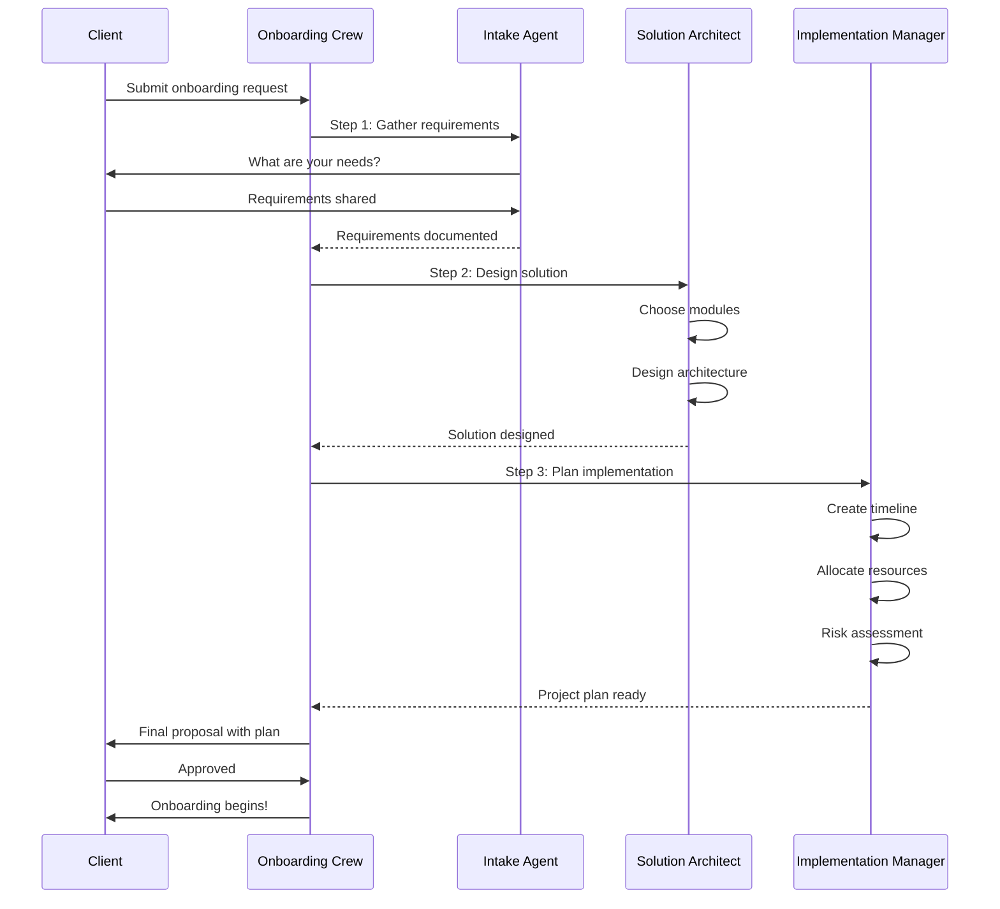

# Week 1 — CrewAI Multi-Agent Systems

**Goal:** Multi-agent systems with CrewAI — ek team of AI agents jo milke complex problems solve karein
**Output:** Content creation crew, support crew, research team, multi-agent ERP workflow
**Target Audience:** Laravel/PHP developers moving to AI Engineering
**Mental Model:** Agents = microservices, Crew = Laravel queue workers, Process = pipeline

---

## Day 1 — CrewAI Basics

### PHP → Python → AI Mental Map

```
Laravel/PHP world            →    CrewAI Multi-Agent world
──────────────────────────────────────────────────────
Artisan command              →    Agent (ek specific worker)
Job/Queue worker             →    Agent (dedicated task handler)
Pipeline (Laravel Pipeline)  →    Process (sequential/hierarchical)
Service container            →    Crew (agent orchestration)
Event/Listener               →    Task dependencies
Service Provider             →    Tool sharing
Database session             →    Agent memory
Queue worker with retry      →    Agent max_iter
```

CrewAI ek Python framework hai jo multiple AI agents ko coordinate karta hai. Har agent ko ek specific role, goal, aur tools milte hain. Jaise Laravel mein ek job queue mein multiple workers hote hain — same concept, but here workers are AI agents with LLM brains.

### Installation & Setup

```bash
## Virtual environment banao
python -m venv crewai-env
.\crewai-env\Scripts\activate  # Windows

## CrewAI install karo
pip install crewai
pip install 'crewai[tools]'     # Extra tools ke liye
pip install crewai[tools]    # Alternative syntax

## Dependencies
pip install langchain-openai
pip install python-dotenv

## Environment variables (.env file mein)
## OPENAI_API_KEY=sk-your-key-here
## SERPER_API_KEY=your-serper-key  # For web search tool
```

```python
# app.py — Basic CrewAI setup
from crewai import Agent, Task, Crew, Process
from crewai_tools import SerperDevTool, ScrapeWebsiteTool
from langchain_openai import ChatOpenAI
import os
from dotenv import load_dotenv

load_dotenv()

llm = ChatOpenAI(model="gpt-4o", temperature=0.7)

"""
CrewAI ke 4 building blocks — Laravel se map karo:

Agent     → Ek worker (jaise artisan command)
Task      → Ek job (jaise queued job)
Crew      → Pipeline (jaise Laravel Pipeline class)
Process   → Order of execution (sequential ya hierarchical)

PHP devs ke liye:
- Agent = Artisan command with a specific purpose
- Task = Job dispatched to a specific queue
- Crew = Queue worker managing multiple jobs
- Process = Queue pipeline (sync/async)

Real flow:
1. User request aayi
2. Crew agent ko assign karta hai
3. Agent apna LLM + tools use karta hai
4. Output next agent ko jaata hai
5. Final output user tak
"""
```

### How CrewAI Works Internally

```
Execution Flow (deep dive):

┌─────────────────────────────────────────────────────────┐
│                      User Request                        │
│              "Write me an article about AI"              │
└────────────────────────┬────────────────────────────────┘
                         │
┌────────────────────────▼────────────────────────────────┐
│                    Crew.kickoff()                        │
│                                                          │
│  1. Crew reads agent definitions (roles, goals, tools)  │
│  2. Creates execution plan based on Process type         │
│  3. Assigns tasks to agents in order                     │
│  4. Monitors agent execution (max_iter, timeout)         │
│  5. Handles agent failures & retries                     │
│  6. Returns final output                                 │
└────────────────────────┬────────────────────────────────┘
                         │
                         ├──── Sequential ────┐
                         │                     │
                         ▼                     ▼
               ┌──────────────┐      ┌──────────────────┐
               │ Agent 1      │      │  Manager Agent    │
               │ (Researcher) │      │  (Assigns tasks)  │
               └──────┬───────┘      └────────┬─────────┘
                      │                       │
                      ▼              ┌────────┴────────┐
               ┌──────────────┐      │    ┌──────┐     │
               │ Agent 2      │      │    │Agent1│ ... │
               │ (Writer)     │      │    └──────┘     │
               └──────┬───────┘      └─────────────────┘
                      │
               ┌──────────────┐
               │ Agent 3      │
               │ (Editor)     │
               └──────┬───────┘
                      │
                      ▼
               ┌────────────────┐
               │  Final Output  │
               └────────────────┘
```

### Agent Configuration Deep-Dive

```python
"""
Agent configuration — har field ka matlab:
"""

researcher = Agent(
    # ROLE: Agent ki identity. Jaise Laravel mein Job class ka naam.
    role="Senior Research Analyst",
    
    # GOAL: Agent kya achieve karega. Clear, measurable.
    goal="Find accurate, up-to-date information on given topics",
    
    # BACKSTORY: Agent ki personality. LLM ko context deta hai.
    # Jaise Laravel job ka comment/documentation.
    backstory="""You are an expert research analyst at ApexPillar.
    You have 10 years of experience in market research and data analysis.
    You find information that others miss.
    Your reports are detailed and well-structured.""",
    
    # LLM: Kaunsa model use karega
    llm=llm,
    
    # VERBOSE: Console mein details dekho
    verbose=True,
    
    # ALLOW_DELEGATION: Kya ye agent dusre agent ko task de sakta hai?
    # Jaise Laravel job chain mein dispatches new job
    allow_delegation=False,
    
    # MAX_ITER: Kitni baar LLM ko call karega max
    max_iter=15,
    
    # MEMORY: Kya agent previous conversation yaad rakhega?
    memory=True,
    
    # MAX_RPM: Rate limit — kitni requests per minute
    max_rpm=10,
    
    # ALLOW_CODE_EXECUTION: Kya agent code run kar sakta hai?
    allow_code_execution=False,
    
    # MAX_EXECUTION_TIME: Kitne seconds max ek task mein lagega
    max_execution_time=300,
)

"""
IMPORTANT CONCEPTS (Laravel dev ke liye):

1. allow_delegation=True
   = Jaise Laravel mein job dispatch kar sakta hai dusri job ko
   = Agent bol sakta hai "mujhe nahi pata, ye dusra agent karega"

2. memory=True
   = Jaise Laravel session ya database store
   = Agent yaad rakhta hai ki kya hua previous mein

3. max_iter=15
   = Jaise retry count
   = Agar agent galat output de raha hai, to kitni baar try karega

4. temperature
   = Jaise LLM ka "creativity slider"
   = Low (0.1): Precise, factual, deterministic
   = High (0.9): Creative, diverse, unpredictable
"""
```

### Task Configuration Deep-Dive

```python
"""
Task configuration — har field ka purpose:
"""

research_task = Task(
    # DESCRIPTION: Task kya karna hai — detailed prompt
    description="""
    Research the latest trends in AI for ERP systems in 2024-2025.
    
    Specifically look for:
    1. How AI is being used in inventory management
    2. AI-powered customer support in ERP
    3. Predictive analytics in ERP
    4. Cost savings with AI-ERP integration
    
    Use web search tools to find real data and statistics.
    """,
    
    # EXPECTED_OUTPUT: Task complete hone par kaisa output chahiye
    expected_output="""
    A detailed research document with:
    - Key findings (5-7 bullet points)
    - Statistics with sources
    - Expert opinions
    - Market trends
    """,
    
    # AGENT: Kaunsa agent ye task karega
    agent=researcher,
    
    # OUTPUT_FILE: Output automatically file mein save karega
    output_file="research_output.md",
)

writing_task = Task(
    description="Write a 1000-word blog post about AI in ERP systems based on research",
    expected_output="A well-structured blog post with introduction, body, and conclusion",
    agent=writer,
    context=[research_task],  # ← KEY: is task ke output par depend karta hai
    output_file="blog_draft.md",
)

editing_task = Task(
    description="Edit and polish the blog post for grammar, style, and flow",
    expected_output="Final polished blog post ready for publication",
    agent=editor,
    context=[writing_task],  # ← writing complete hone ke baad hi chalega
    output_file="final_blog.md",
)

"""
TASK DEPENDENCIES CONCEPT:

Jaise Laravel mein:
- Job A dispatch hota hai
- Job A success → Job B dispatch hota hai (chain)
- Job B success → Job C dispatch hota hai

CrewAI mein:
- research_task → context list mein kuch nahi (first task)
- writing_task → context=[research_task] (research complete hone ka wait)
- editing_task → context=[writing_task] (writing complete hone ka wait)

context parameter ensures task tabhi chale jab dependency resolve ho.
"""
```

### Crew Execution Flow

```python
# Simple crew — 3 agents sequential
crew = Crew(
    agents=[researcher, writer, editor],
    tasks=[research_task, writing_task, editing_task],
    process=Process.sequential,  # One after another
    verbose=True,
    
    # FULL CONFIG:
    memory=True,           # Crew-level memory
    cache=True,            # Cache LLM calls (save money)
    max_rpm=20,            # Rate limit for crew
    share_crew=True,       # Agents share context
    output_log_file="crew_execution.log",  # Log file
)

# Execute — jaise Laravel mein Artisan::call()
result = crew.kickoff()

print("=== FINAL OUTPUT ===")
print(result)

# Access individual task outputs
for task_output in crew.tasks:
    print(f"Task: {task_output.description}")
    print(f"Agent: {task_output.agent.role}")
    print(f"Output: {task_output.output[:200]}...")
    print("---")

"""
kickoff() ke andar kya hota hai:

1. Validation: Saare agents aur tasks valid hain?
2. Planning: Kaun sa task pehle? Kaun baad mein?
3. Execution:
   a. Agent 1 (Researcher) → Task 1 research karega
   b. LLM call → Tools call → Output generate
   c. Output store hota hai memory mein
   d. Agent 2 (Writer) → Task 2 start karega
   e. Use karega Agent 1 ka output context mein
   f. Agent 3 (Editor) → Task 3 polish karega
4. Return: Final output return karega
"""
```

### Practical Tip: PHP/Dev First Run

```python
"""
Agar tu Laravel dev hai to CrewAI kaise feel hoga:

PHP/Laravel                     Python/CrewAI
────────────────────────────────────────────────
composer install               pip install crewai
php artisan make:job           Agent(role="X", ...)
$job->handle()                 Task(description="...", agent=x)
$job::dispatch()->chain()      Crew(tasks=[...], process=sequential)
Bus::chain([$j1, $j2])->dispatch()  crew.kickoff()
php artisan queue:work         Agent verbosity logs
try/catch                      max_iter + error handling

Mistake #1: Agent ko overload mat karo
❌ Agent mein 10 roles daal diye
✅ Har agent ka ek specific role hona chahiye

Mistake #2: Tasks mein vague description
❌ "Research AI"
✅ "Research AI for ERP systems in India 2024-2025 with statistics"
"""
```

---

## Day 2 — Agent Roles & Goals

### Role Design Principles — Detailed

```
Har agent ka ek clear ROLE aur GOAL hona chahiye.
Jaise Laravel mein har service class ka ek specific responsibility.

THE 5 PILLARS OF AGENT DESIGN:

1. ROLE → Kya hai?
   → Agent ka naam aur identity
   → "Senior Research Analyst" ≠ "Researcher"
   → Specific title = specific behavior
   → Example: "Data Analyst" vs "Creative Director"

2. GOAL → Kya achieve karna hai?
   → Measurable outcome
   → "Find accurate information" (vague)
   → "Find 5 statistics with sources from 2024" (specific)

3. BACKSTORY → Personality, experience
   → LLM ko context deta hai
   → Jaise Laravel model mein $casts define karna
   → "Expert researcher with 10 years experience" → detailed output
   
4. TOOLS → Kya use kar sakta hai?
   → Web search, calculator, API calls
   → Jaise Laravel Service Provider
   → Agent ko sirf relevant tools do
   
5. CONSTRAINTS → Kya nahi kar sakta?
   → max_iter, max_rpm, allow_delegation
   → Jaise validation rules
   → Boundaries define karo
```

### Temperature Strategy

```python
"""
Temperature ka Laravel analogy:

LOW TEMPERATURE (0.0 - 0.3)
= Jaise Laravel mein strict type checking
= Consistent, predictable, factual
= Use: Data extraction, classification, analysis

MEDIUM TEMPERATURE (0.4 - 0.7)
= Jaise Laravel pipeline with middleware
= Balanced creativity and accuracy
= Use: Content writing, summaries, responses

HIGH TEMPERATURE (0.8 - 1.0)
= Jaise dynamic method calling in PHP
= Creative, diverse, unpredictable
= Use: Brainstorming, ideation, creative writing
"""

# Low temp — Data Analyst
analyst = Agent(
    role="Data Analyst",
    goal="Extract actionable insights from raw data",
    backstory="""You specialize in finding patterns in data.
    You have worked with Fortune 500 companies on data strategy.
    You prefer numbers over opinions.
    Every insight must be backed by data.""",
    llm=ChatOpenAI(model="gpt-4o", temperature=0.1),  # Precise
    verbose=True,
    max_iter=10,
)

# High temp — Creative Director
creative = Agent(
    role="Creative Director",
    goal="Generate innovative ideas and creative solutions",
    backstory="""You are a creative genius who thinks outside the box.
    Your campaigns have won multiple awards.
    You believe there are no bad ideas, only unexplored ones.
    You challenge conventional thinking.""",
    llm=ChatOpenAI(model="gpt-4o", temperature=0.9),  # Creative
    verbose=True,
    allow_delegation=True,
)

# Zero temp — Reviewer (must be precise)
reviewer = Agent(
    role="Quality Assurance Lead",
    goal="Ensure output meets quality standards and is error-free",
    backstory="""You are meticulous and detail-oriented.
    You never let a mistake slip through.
    Your reviews are thorough yet constructive.
    You check facts, grammar, and consistency.""",
    llm=ChatOpenAI(model="gpt-4o", temperature=0),  # Deterministic
    verbose=True,
    max_iter=20,
)
```

### Complete Role Design Workshop

```python
"""
PRO TIP: Real project mein agents design karne ka method:

STEP 1: Workflow ko identify karo
→ "Content creation pipeline" 
→ Steps: Research → Write → Edit → Publish

STEP 2: Har step ke liye agent define karo
→ Researcher ← finds information
→ Writer ← creates content
→ Editor ← polishes
→ Publisher ← formats and delivers

STEP 3: Har agent ke liye:
→ Role: Specific designation
→ Goal: What success looks like
→ Backstory: Why they're good at this
→ Tools: What they can use
→ Temperature: Based on task type

STEP 4: Dependencies define karo
→ Writer depends on Researcher
→ Editor depends on Writer
→ Publisher depends on Editor

EXAMPLE — Real Estate Agent System:

class RealEstateCrew:
    def __init__(self):
        self.property_finder = Agent(
            role="Property Scout",
            goal="Find best properties matching client requirements",
            backstory="Expert in real estate market with deep knowledge of localities",
            llm=ChatOpenAI(model="gpt-4o", temperature=0.4),
            tools=[SerperDevTool()],
        )
        
        self.price_analyst = Agent(
            role="Price Analyst",
            goal="Analyze property prices and negotiate best deals",
            backstory="10 years experience in property valuation",
            llm=ChatOpenAI(model="gpt-4o", temperature=0.1),
        )
        
        self.doc_preparer = Agent(
            role="Document Specialist",
            goal="Prepare all legal documents for property deal",
            backstory="Expert in property law and documentation",
            llm=ChatOpenAI(model="gpt-4o", temperature=0.2),
        )
        
    def find_home(self, requirements: str):
        tasks = [
            Task(
                description=f"Find properties matching: {requirements}",
                agent=self.property_finder,
                expected_output="3-5 property options with details",
            ),
            Task(
                description="Analyze prices and recommend best value",
                agent=self.price_analyst,
                context=[tasks[0]],
                expected_output="Price analysis with recommendation",
            ),
            Task(
                description="Prepare documentation checklist",
                agent=self.doc_preparer,
                context=[tasks[0], tasks[1]],
                expected_output="Document checklist",
            ),
        ]
        
        crew = Crew(
            agents=[self.property_finder, self.price_analyst, self.doc_preparer],
            tasks=tasks,
            process=Process.sequential,
        )
        return crew.kickoff()
"""
```

### Common Mistakes in Role Design

```
Mistake #1: Overly Generic Roles
❌ Agent(role="Assistant")
✅ Agent(role="Senior Financial Analyst at ApexERP")

Mistake #2: Missing Constraints
❌ Agent(max_iter=100)  → Bahut expensive ho sakta hai
✅ Agent(max_iter=15)   → Controlled execution

Mistake #3: Wrong Temperature
❌ Data extraction with temperature=0.9  → Random results
✅ Data extraction with temperature=0.1 → Consistent results

Mistake #4: Too Many Tools
❌ Agent(tools=[search, calculator, email, sms, db, api])
✅ Agent(tools=[search, calculator])  → Focused

Mistake #5: No Backstory
❌ Agent(backstory="I am an agent")
✅ Agent(backstory="I am a senior analyst with 10 years experience...")
```

---

## Day 3 — Sequential Process

### Deep Dive: Sequential Process

```
SEQUENTIAL PROCESS = Step-by-step execution
= Jaise Laravel Pipeline through multiple pipes

┌──────────┐   ┌──────────┐   ┌──────────┐   ┌──────────┐
│   Task 1 │──▶│   Task 2 │──▶│   Task 3 │──▶│   Task 4 │
│Researcher│   │  Writer  │   │  Editor  │   │Publisher │
└──────────┘   └──────────┘   └──────────┘   └──────────┘
     │               │              │              │
     ▼               ▼              ▼              ▼
 Research      Blog Draft     Edited Draft    Final Post
 Document

When to use Sequential:
→ Content creation pipeline
→ Data processing (extract → transform → load)
→ Report generation (research → write → review)
→ Simple data flows

When NOT to use Sequential:
→ Agents can work in parallel (Day 6)
→ Complex routing needed (Week 2)
→ Need supervisor oversight (Day 4)
```

### Complete Content Creation Crew — Production Ready

```python
"""
Production-ready content creation system.
Har step sequentially execute hota hai.
Output ek step se agle step tak jaata hai.
"""

class ContentCreationCrew:
    """
    End-to-end content creation pipeline.
    Pipeline: Researcher → Writer → Editor → Publisher
    
    Jaise Laravel mein pipeline:
    $pipeline->pipe('research')
             ->pipe('write')
             ->pipe('edit')
             ->pipe('publish')
             ->then(fn($content) => $content);
    """
    
    def __init__(self):
        self.llm = ChatOpenAI(model="gpt-4o", temperature=0.7)
        
        # Agent 1: Research Specialist
        self.researcher = Agent(
            role="Research Specialist",
            goal="Gather comprehensive information on assigned topics",
            backstory="""Expert researcher with access to latest sources.
            You have a PhD in Information Science.
            You find information that no one else can.""",
            llm=self.llm,
            tools=[SerperDevTool(), ScrapeWebsiteTool()],
            verbose=True,
            max_iter=10,
            memory=True,
        )
        
        # Agent 2: Content Writer
        self.writer = Agent(
            role="Content Writer",
            goal="Create engaging, well-structured content",
            backstory="""Professional writer specializing in tech.
            You have written for leading tech publications.
            Your articles are both informative and engaging.""",
            llm=self.llm,
            verbose=True,
            memory=True,
        )
        
        # Agent 3: Editor
        self.editor = Agent(
            role="Editor",
            goal="Polish content to publication standard",
            backstory="""Senior editor with perfectionist standards.
            You catch every grammar mistake.
            You ensure consistent tone and style.""",
            llm=ChatOpenAI(model="gpt-4o", temperature=0.2),
            verbose=True,
            memory=True,
        )
        
        # Agent 4: Publisher
        self.publisher = Agent(
            role="Publisher",
            goal="Format and prepare content for final delivery",
            backstory="""Expert in content formatting and distribution.
            You know SEO, meta tags, and formatting best practices.
            Your content always looks professional.""",
            llm=self.llm,
            verbose=True,
        )
    
    def create_content(self, topic: str) -> str:
        """
        Create end-to-end content.
        
        Args:
            topic: Content topic (e.g., "AI in ERP Systems for 2025")
            
        Returns:
            Final polished content ready for publication
        """
        # Task 1: Research
        research_task = Task(
            description=f"""
            Research: {topic}
            
            Find:
            - 5+ key statistics with sources
            - Expert opinions from industry leaders
            - Current trends and future predictions
            - Implementation challenges
            - Success stories and case studies
            
            Use web search to find latest information.
            """,
            expected_output="""Comprehensive research document with:
            - Key findings (numbered)
            - Statistics with citations
            - Expert quotes
            - Source URLs""",
            agent=self.researcher,
            output_file="research_output.md",
        )
        
        # Task 2: Writing
        writing_task = Task(
            description=f"""
            Write a 1000-word blog post on: {topic}
            
            Based on the research provided:
            - Engaging introduction that hooks the reader
            - 3-4 body sections with headings
            - Include statistics and examples
            - Strong conclusion with call-to-action
            - SEO-optimized without keyword stuffing
            """,
            expected_output="""Well-written blog post with:
            - Title and meta description
            - Introduction (150 words)
            - Body sections (600 words)
            - Conclusion (100 words)
            - Author bio""",
            agent=self.writer,
            context=[research_task],  # Depends on research
            output_file="blog_draft.md",
        )
        
        # Task 3: Editing
        editing_task = Task(
            description="""
            Edit and polish the blog post:
            
            Check:
            - Grammar and spelling
            - Sentence structure and flow
            - Consistent tone and style
            - Factual accuracy
            - Transition between sections
            - Readability score
            
            Make minimal changes — preserve the author's voice.
            """,
            expected_output="""Edited blog post with:
            - Tracked changes
            - Editor notes (if any)
            - Final clean version""",
            agent=self.editor,
            context=[writing_task],
            output_file="edited_draft.md",
        )
        
        # Task 4: Publishing
        publishing_task = Task(
            description="""
            Prepare content for publication:
            
            1. Add proper heading structure (H1, H2, H3)
            2. Add SEO meta title (60 chars max)
            3. Add meta description (160 chars max)
            4. Add tags/categories
            5. Add featured image description
            6. Format for web (short paragraphs, bullet points)
            7. Add call-to-action section
            """,
            expected_output="""Ready-to-publish content with:
            - Final formatted post
            - SEO metadata
            - Tags and categories
            - Publication checklist""",
            agent=self.publisher,
            context=[editing_task],
            output_file="final_post.md",
        )
        
        # Create crew
        crew = Crew(
            agents=[
                self.researcher, 
                self.writer, 
                self.editor, 
                self.publisher
            ],
            tasks=[
                research_task, 
                writing_task, 
                editing_task, 
                publishing_task
            ],
            process=Process.sequential,
            verbose=True,
            memory=True,
            cache=True,
        )
        
        # Execute
        result = crew.kickoff()
        
        # Log execution details
        print(f"\n{'='*50}")
        print(f"Content Creation Complete!")
        print(f"Topic: {topic}")
        print(f"Tasks executed: {len(crew.tasks)}")
        print(f"Agents used: {len(crew.agents)}")
        print(f"{'='*50}\n")
        
        return result

# Usage
crew = ContentCreationCrew()
result = crew.create_content("AI in ERP Systems for 2025")
print(result)
```

### Performance Tips for Sequential Crews

```yaml
Performance Optimization:

1. Cache Enable karo
   cache=True → Same LLM call repeat nahi hoga
   ≈ Laravel cache::remember()

2. max_iter Limit karo
   max_iter=15 → Zyada expensive nahi hoga
   ≈ Laravel job retry limit

3. Appropriate Models
   Research → gpt-4o-mini (cheaper, faster)
   Writing → gpt-4o (better quality)
   Editing → gpt-4o-mini (good enough)

4. Manage Token Usage
   - Short backstories
   - Focused task descriptions
   - Output length constraints

5. Memory Usage
   memory=True → Agents ko context chahiye
   memory=False → Standalone agents (saves tokens)
```

---

## Day 4 — Hierarchical Process

### Deep Dive: Hierarchical Process

```
HIERARCHICAL PROCESS = Manager delegates to workers
= Jaise Laravel mein manager controller, workers services

┌─────────────────────────────────────────────────┐
│              MANAGER AGENT                       │
│         (Research Manager)                      │
│         - Assigns tasks                         │
│         - Reviews output                        │
│         - Makes decisions                       │
└────┬────────────┬────────────┬──────────────────┘
     │            │            │
     ▼            ▼            ▼
┌─────────┐ ┌─────────┐ ┌─────────┐
│Worker 1 │ │Worker 2 │ │Worker 3 │
│Market   │ │Technical│ │Customer │
└─────────┘ └─────────┘ └─────────┘
     │            │            │
     └────────────┴────────────┘
                    │
                    ▼
          ┌─────────────────┐
          │  Final Report   │
          │  (Manager sync) │
          └─────────────────┘

When to use Hierarchical:
→ Multiple domains need research
→ Manager needs to review/approve
→ Complex decision trees
→ Quality control is important
→ Different expertise levels needed

When NOT to use Hierarchical:
→ Simple linear workflow
→ Only one agent needed
→ Budget constraints (more LLM calls)
```

### Complete Research Team — Production Version

```python
class ResearchTeamCrew:
    """
    Hierarchical process — Manager + Workers.
    
    Flow:
    1. Manager gets the research topic
    2. Manager assigns to 3 specialized analysts
    3. Analysts research in parallel
    4. Manager reviews and synthesizes
    5. Final report delivered
    
    ≈ Laravel: Manager controller → multiple service classes
    """
    
    def __init__(self):
        self.manager_llm = ChatOpenAI(model="gpt-4o", temperature=0.3)
        self.worker_llm = ChatOpenAI(model="gpt-4o-mini", temperature=0.2)
        
        # Manager Agent — The boss
        self.manager = Agent(
            role="Research Manager",
            goal="Coordinate research efforts and ensure quality output",
            backstory="""You manage a team of research analysts.
            You have 15 years experience in research management.
            You assign tasks based on expertise.
            You review all output before delivery.
            You ensure deadlines are met without compromising quality.""",
            llm=self.manager_llm,
            allow_delegation=True,  # Can delegate tasks
            verbose=True,
            memory=True,
            max_iter=20,
        )
        
        # Worker 1: Market Research
        self.analyst_1 = Agent(
            role="Market Research Analyst",
            goal="Analyze market trends and competitor data",
            backstory="""MBA graduate with 5 years in market research.
            Specializes in Indian market analysis.
            Expert in competitor analysis and market sizing.""",
            llm=self.worker_llm,
            tools=[SerperDevTool()],
            verbose=True,
        )
        
        # Worker 2: Technical Research
        self.analyst_2 = Agent(
            role="Technical Research Analyst",
            goal="Research technical specifications and architecture",
            backstory="""Computer science background with 8 years in tech.
            Expert in software architecture and system design.
            Can explain complex technical concepts simply.""",
            llm=self.worker_llm,
            verbose=True,
        )
        
        # Worker 3: Customer Research
        self.analyst_3 = Agent(
            role="Customer Research Analyst",
            goal="Gather customer insights and feedback data",
            backstory="""Expert in user research and customer behavior.
            Has conducted 100+ customer interviews.
            Specializes in understanding user pain points.""",
            llm=self.worker_llm,
            verbose=True,
        )
    
    def research(self, topic: str) -> str:
        """
        Execute hierarchical research workflow.
        
        Flow:
        1. Manager break down topic into sub-topics
        2. Workers research their domain
        3. Manager synthesizes into final report
        """
        
        # Tasks for workers (assigned by manager logic)
        tasks = [
            Task(
                description=f"""
                Analyze market trends for: {topic}
                
                Research:
                - Market size and growth rate
                - Key competitors and their strategies
                - Pricing trends
                - Market opportunities
                - Target customer segments
                
                Provide data-backed insights.
                """,
                expected_output="""Market analysis report:
                - Market overview with numbers
                - Competitor analysis (3-5 competitors)
                - Market opportunities
                - Recommendations""",
                agent=self.analyst_1,
            ),
            Task(
                description=f"""
                Research technical aspects of: {topic}
                
                Research:
                - Technical architecture and stack
                - Key technologies used
                - Integration requirements
                - Scalability considerations
                - Security aspects
                
                Explain in simple terms.
                """,
                expected_output="""Technical research document:
                - Architecture overview
                - Technology stack details
                - Technical requirements
                - Implementation considerations""",
                agent=self.analyst_2,
            ),
            Task(
                description=f"""
                Research customer perspective on: {topic}
                
                Research:
                - What customers are saying
                - Common pain points
                - Desired features
                - Price sensitivity
                - Adoption barriers
                
                Focus on Indian market.
                """,
                expected_output="""Customer insights report:
                - Customer needs and wants
                - Pain points (top 5)
                - Feature priorities
                - Pricing expectations""",
                agent=self.analyst_3,
            ),
        ]
        
        # Manager synthesizes all research
        synthesis_task = Task(
            description=f"""
            Synthesize all research into a comprehensive report on: {topic}
            
            Create a final report that includes:
            1. Executive Summary (1 paragraph)
            2. Market Analysis (from Market Analyst)
            3. Technical Assessment (from Technical Analyst)
            4. Customer Insights (from Customer Analyst)
            5. Strategic Recommendations (your analysis)
            6. Risk Assessment
            7. Next Steps
            
            Ensure the report is cohesive and well-structured.
            """,
            expected_output="""Comprehensive final report with:
            - Executive summary
            - All research domains integrated
            - Strategic recommendations
            - Action items""",
            agent=self.manager,
            context=tasks,  # Synthesize ALL worker outputs
        )
        
        # Create crew with hierarchical process
        crew = Crew(
            agents=[
                self.manager, 
                self.analyst_1, 
                self.analyst_2, 
                self.analyst_3
            ],
            tasks=[*tasks, synthesis_task],
            process=Process.hierarchical,
            manager_agent=self.manager,
            verbose=True,
            memory=True,
        )
        
        return crew.kickoff()

# Usage
team = ResearchTeamCrew()
report = team.research("ERP market in India 2025")
```

### When to Use Each Process

```yaml
Process Decision Matrix:

SEQUENTIAL Process:
  Use when: Linear, step-by-step workflow
  Example: Research → Write → Edit → Publish
  Cost: Moderate (N LLM calls for N steps)
  Speed: Slower (sequential)
  Quality: Good for clear dependencies

HIERARCHICAL Process:
  Use when: Multiple experts, manager oversight
  Example: Manager delegates to 3 analysts
  Cost: Higher (Manager + Worker LLM calls)
  Speed: Workers can run in parallel internally
  Quality: Best for complex, multi-domain tasks

Hybrid Approach (CrewAI limitation):
  CrewAI mein do process hain: sequential, hierarchical
  Agar complex routing chahiye → LangGraph (Week 2)
  Agar simple → CrewAI sequential/hierarchical kafi hai
```

---

## Day 5 — Task Dependencies & Delegation

### Deep Dive: Task Dependencies

```
Jab ek task ka output doosre task ke kaam aata hai,
to usse TASK DEPENDENCY kehte hain.

Jaise Laravel mein:
- Job1 complete hua
- Job2 dispatch hua with Job1 ka result
- Job3 dispatch hua with Job2 ka result

CrewAI mein:
- Task1 → context=None (first task)
- Task2 → context=[Task1] (needs Task1 output)
- Task3 → context=[Task1, Task2] (needs both)

Laravel Analogy:

class ProcessOrderJob implements ShouldQueue {
    public function handle(Order $order) {
        $invoice = InvoiceService::generate($order);
        // Dependent job dispatch
        SendInvoiceJob::dispatch($invoice)
            ->onQueue('email');
    }
}

CrewAI equivalent:

order_task = Task(
    description="Process this order",
    agent=order_agent,
)
invoice_task = Task(
    description="Generate invoice",
    agent=finance_agent,
    context=[order_task],  // Depends on order
)
```

### Customer Support Crew — Advanced Dependencies

```python
class CustomerSupportCrew:
    """
    Customer support system with complex task dependencies.
    
    Architecture:
    ┌──────────────┐
    │  User Query  │
    └──────┬───────┘
           │
    ┌──────▼───────┐
    │ Triage Agent │──▶ Categorizes
    └──────┬───────┘
           │
    ┌──────┴──────────────────┐
    │                         │
    ▼                         ▼
┌──────────┐           ┌──────────┐
│Technical │           │ Billing  │
│ Support  │           │ Support  │
└────┬─────┘           └────┬─────┘
     │                      │
     └──────────┬───────────┘
                │
          ┌─────▼─────┐
          │ Escalation│
          │ (if needed)│
          └───────────┘
    
    Jaise Laravel mein:
    - Request → Middleware → Controller → Service → Response
    """
    
    def __init__(self):
        self.llm = ChatOpenAI(model="gpt-4o", temperature=0.3)
        
        # Agent 1: Triage — Pehla point of contact
        self.triage_agent = Agent(
            role="Triage Specialist",
            goal="Categorize and prioritize customer inquiries quickly",
            backstory="""Expert at understanding customer needs quickly.
            You can categorize any query in seconds.
            You ensure right priority for right issues.
            You never miss important details.""",
            llm=self.llm,
            verbose=True,
        )
        
        # Agent 2: Technical Support
        self.support_agent = Agent(
            role="Technical Support Engineer",
            goal="Resolve technical issues and provide solutions",
            backstory="""Senior support engineer with deep product knowledge.
            You have solved 1000+ technical issues.
            You explain complex solutions in simple terms.""",
            llm=ChatOpenAI(model="gpt-4o", temperature=0.2),
            verbose=True,
            allow_delegation=True,  # Can escalate
        )
        
        # Agent 3: Billing Specialist
        self.billing_agent = Agent(
            role="Billing Specialist",
            goal="Handle payment, invoice, and subscription queries",
            backstory="""Expert in billing systems and financial processes.
            You handle payments, refunds, and invoices daily.
            You ensure accuracy in all financial matters.""",
            llm=self.llm,
            verbose=True,
        )
        
        # Agent 4: Escalation Manager
        self.escalation_agent = Agent(
            role="Escalation Manager",
            goal="Handle complex issues that need senior attention",
            backstory="""15 years experience, handles toughest cases.
            You have seen every type of customer issue.
            You know when to involve product/engineering teams.""",
            llm=ChatOpenAI(model="gpt-4o", temperature=0.2),
            verbose=True,
            allow_delegation=True,
        )
    
    def handle_query(self, query: str) -> str:
        """
        Handle customer query with smart routing.
        
        Flow:
        1. Triage → categorize (technical/billing/general/escalation)
        2. Based on category → specific agent handles
        3. If complex → escalation agent takes over
        4. Final response compiled and returned
        """
        
        # Step 1: Triage — always runs first
        triage_task = Task(
            description=f"""
            Categorize this customer query:
            
            Query: "{query}"
            
            Categories:
            - TECHNICAL: Bug, error, feature request, setup help
            - BILLING: Payment, invoice, refund, subscription
            - GENERAL: How-to, information, feedback
            - ESCALATION: Angry customer, complex issue, complaint
            
            Determine:
            1. Category
            2. Priority (high/medium/low)
            3. Estimated resolution time
            
            Format your response clearly.
            """,
            expected_output="""Category: [category]
            Priority: [priority]
            Resolution Time: [estimated time]
            Key Details: [what you noticed]""",
            agent=self.triage_agent,
        )
        
        # Step 2a: Technical Resolution
        tech_resolve_task = Task(
            description=f"""
            Resolve this technical customer query:
            
            Query: "{query}"
            
            Steps:
            1. Understand the technical issue
            2. Provide step-by-step solution
            3. Include troubleshooting steps
            4. Suggest workaround if full solution not possible
            5. Ask for clarifications if needed
            
            Be helpful and patient in your response.
            """,
            expected_output="""Technical resolution with:
            - Issue diagnosis
            - Step-by-step solution
            - Troubleshooting tips
            - When to contact support""",
            agent=self.support_agent,
            context=[triage_task],  # Needs triage result
        )
        
        # Step 2b: Billing Resolution
        billing_resolve_task = Task(
            description=f"""
            Handle this billing query:
            
            Query: "{query}"
            
            Steps:
            1. Identify billing issue (payment/invoice/refund)
            2. Check policy for this scenario
            3. Provide resolution options
            4. Include timeline for resolution
            5. Confirm customer satisfaction
            
            Be transparent about charges and timelines.
            """,
            expected_output="""Billing resolution with:
            - Issue identified
            - Policy reference
            - Resolution steps
            - Timeline
            - Confirmation request""",
            agent=self.billing_agent,
            context=[triage_task],
        )
        
        # Step 3: Escalation (if needed)
        escalation_task = Task(
            description=f"""
            Handle this escalated complex issue:
            
            Original Query: "{query}"
            
            Reasons for escalation:
            - Previous resolution didn't work
            - Customer is dissatisfied
            - Issue requires product change
            - Multiple systems involved
            
            Provide:
            1. Complete issue analysis
            2. Root cause investigation
            3. Multi-department coordination plan
            4. Timeline for resolution
            5. Customer communication strategy
            """,
            expected_output="""Complete escalation resolution:
            - Root cause analysis
            - Action plan
            - Timeline
            - Communication strategy""",
            agent=self.escalation_agent,
            context=[triage_task, tech_resolve_task],
        )
        
        # Build crew with all tasks
        crew = Crew(
            agents=[
                self.triage_agent, 
                self.support_agent, 
                self.billing_agent, 
                self.escalation_agent
            ],
            tasks=[
                triage_task, 
                tech_resolve_task, 
                billing_resolve_task, 
                escalation_task
            ],
            process=Process.sequential,
            verbose=True,
            memory=True,
        )
        
        return crew.kickoff()

    """
    PRODUCTION NOTES:
    
    1. Real system mein, routing logic (if technical go to tech, 
       if billing go to billing) actual code mein handle karna hoga
       
    2. CrewAI sequential mein saare tasks chalenge regardless
       → Week 2 mein LangGraph conditional routing seekhenge
       
    3. context parameter ensures agent ke paas previous data hai
       → Lekin agent decide karta hai use karna ya nahi
    """
```

### Delegation Explained

```python
"""
DELEGATION — Agent apna kaam kisi aur agent ko de sakta hai.

KAB USE KAREIN:
→ Jab agent ko apne expertise se bahar ka kaam mile
→ Jab agent ne bahut try kiya but fail hua
→ Jab complex task ho jisme multiple experts chahiye

KAAM KESE KARTA HAI:
1. Agent apni LLM call karta hai
2. LLM output mein agent bolta hai "mujhe help chahiye"
3. CrewAI automatically dusre agent ko route karta hai
4. Dusra agent output provide karta hai
5. Pehla agent continue karta hai

EXAMPLE — Delegation in action:

Manager Agent: "Client onboarding complete karo"
  → Needs: Client documents (delegates to document agent)
  → Needs: System setup (delegates to tech agent)
  → Needs: Training plan (delegates to training agent)
  → Manager synthesizes all → Final output

CONTROL DELEGATION:
allow_delegation=True  → Agent delegate kar sakta hai
allow_delegation=False → Agent sirf apna kaam karega

Real project tip:
- Manager agents: allow_delegation=True
- Worker agents: allow_delegation=False
- Specialist agents: allow_delegation=True (can ask for help)
"""
```

---

## Day 6 — Tool Sharing & Memory

### Deep Dive: Tools in CrewAI

```python
"""
TOOLS = External capabilities jo agent use kar sakta hai.

Jaise Laravel mein Service Providers:
- MailService → Email bhejne ke liye
- CacheService → Data store karne ke liye
- HttpService → API calls ke liye

CrewAI tools:
- SerperDevTool → Google search
- ScrapeWebsiteTool → Website se data nikaalo
- FileReadTool → Files padho
- FileWriteTool → Files likho
- DirectoryReadTool → Directory dekho
- CodeInterpreterTool → Code run karo
- CalculatorTool → Calculations karo

PRO TIP: Har agent ko sirf relevant tools do.
Inventory agent ko stock tools → Search tool ki zaroorat nahi
"""

from crewai_tools import (
    SerperDevTool, 
    ScrapeWebsiteTool,
    FileReadTool, 
    FileWriteTool,
    DirectoryReadTool,
    CodeInterpreterTool,
    CalculatorTool,
)
from crewai import Agent, Task, Crew, Process

class ResearchWithTools:
    """
    Agents with shared tools and memory.
    
    ≈ Laravel: Service container with shared services
    """
    
    def __init__(self):
        # Create tools once — shared across agents
        self.search_tool = SerperDevTool()
        self.scrape_tool = ScrapeWebsiteTool()
        self.file_tool = FileReadTool()
        self.calc_tool = CalculatorTool()
        
        # Agent 1: Web Researcher — needs search + scrape
        self.researcher = Agent(
            role="Web Researcher",
            goal="Find latest information from web sources",
            backstory="Expert web researcher with 5 years experience",
            tools=[self.search_tool, self.scrape_tool],
            memory=True,  # Agent-level memory
            verbose=True,
            llm=ChatOpenAI(model="gpt-4o", temperature=0.3),
            max_iter=15,
        )
        
        # Agent 2: Data Analyst — needs file read + calc
        self.analyst = Agent(
            role="Data Analyst",
            goal="Analyze and synthesize research findings",
            backstory="Expert data analyst specializing in research synthesis",
            tools=[self.file_tool, self.calc_tool],
            memory=True,
            verbose=True,
            llm=ChatOpenAI(model="gpt-4o", temperature=0.2),
        )
        
        # Agent 3: Report Writer — needs file read only
        self.writer = Agent(
            role="Report Writer",
            goal="Create comprehensive reports from analysis",
            backstory="Senior report writer with 10 years experience",
            tools=[self.file_tool],
            memory=True,
            verbose=True,
            llm=ChatOpenAI(model="gpt-4o", temperature=0.7),
        )
    
    def research_topic(self, topic: str) -> str:
        """
        Complete research workflow with tools.
        
        Flow:
        1. Search web for topic
        2. Scrape top 3 results
        3. Analyze findings
        4. Format report
        """
        
        # Task 1: Web Search
        search_task = Task(
            description=f"""
            Search the web for latest information about: {topic}
            
            Use the search tool to find:
            - 5+ relevant sources
            - Latest statistics (2024-2025)
            - Expert opinions
            - Industry trends
            
            Save the search results for next steps.
            """,
            expected_output="""Search results with:
            - 5+ URLs with titles
            - Brief description of each source
            - Key statistics found""",
            agent=self.researcher,
        )
        
        # Task 2: Deep Scrape
        scrape_task = Task(
            description=f"""
            Visit the top 3 search results and extract detailed information.
            
            For each source:
            - Extract key points
            - Note statistics with context
            - Save quotes from experts
            - Record publication dates
            
            Use the scrape tool for each URL.
            """,
            expected_output="""Detailed information from 3 sources:
            - Source 1: Key findings
            - Source 2: Key findings  
            - Source 3: Key findings""",
            agent=self.researcher,
            context=[search_task],
        )
        
        # Task 3: Analysis
        analysis_task = Task(
            description=f"""
            Analyze the research findings and create insights.
            
            Use calculator tool for:
            - Growth rate calculations
            - Market size comparisons
            - Statistical analysis
            
            Synthesize findings into actionable insights.
            """,
            expected_output="""Analysis report:
            - Key findings (5-7 points)
            - Statistical insights
            - Trends identified
            - Recommendations""",
            agent=self.analyst,
            context=[scrape_task],
        )
        
        # Task 4: Final Report
        report_task = Task(
            description=f"""
            Create a comprehensive report about: {topic}
            
            Use the file tool to read analysis data.
            Structure the report as:
            1. Executive Summary
            2. Research Methodology
            3. Key Findings
            4. Statistical Analysis
            5. Recommendations
            6. Sources
            
            Make it professional and ready for client delivery.
            """,
            expected_output="""Final comprehensive report ready for client:
            - Professional formatting
            - All sections complete
            - Sources cited
            - Actionable recommendations""",
            agent=self.writer,
            context=[analysis_task],
        )
        
        # Create crew with memory
        crew = Crew(
            agents=[self.researcher, self.analyst, self.writer],
            tasks=[search_task, scrape_task, analysis_task, report_task],
            process=Process.sequential,
            memory=True,  # Crew-level memory
            verbose=True,
            cache=True,  # Cache LLM responses
        )
        
        return crew.kickoff()
```

### Memory Types in CrewAI

```python
"""
MEMORY — Agents ko context yaad rakhne ke liye.

CrewAI mein 2 types of memory:

1. SHORT-TERM MEMORY (Agent-level)
   → Agent ko current execution context yaad rehta hai
   → Jaise Laravel request lifecycle
   → Ek execution ke baad reset ho jaata hai

2. LONG-TERM MEMORY (Crew-level)
   → Crew level pe saari executions ka data store hota hai
   → Jaise Laravel database
   → Multiple executions mein data persist karta hai

MEMORY CONFIGURATION:

# Agent-level (short term)
Agent(
    memory=True,
    # Agent ko execution ke dauran context yaad rahega
)

# Crew-level (long term)
Crew(
    memory=True,
    # Crew ko multiple tasks ka data yaad rahega
)

# Memory Storage (customizable):
# Default: In-memory (ephemeral)
# With CrewAI Enterprise: Persistent storage

WHEN MEMORY IS CRITICAL:
→ Multi-turn conversations
→ Complex workflows with many steps
→ Agents need previous context
→ Sequential tasks sharing data

WHEN MEMORY IS OPTIONAL:
→ Single task agents
→ Independent operations
→ Stateless processing
"""

# Advanced Memory Configuration
from crewai.memory import MemoryConfig

memory_config = MemoryConfig(
    short_term=ShortTermMemory(
        storage=InMemoryStorage(),
        max_tokens=1000,  # Limit short-term memory
    ),
    long_term=LongTermMemory(
        storage=FileStorage(
            path="./crew_memory/"  # Persist to file
        ),
    ),
)

crew_with_memory = Crew(
    agents=[agent1, agent2],
    tasks=[task1, task2],
    memory_config=memory_config,
    verbose=True,
)
```

### Tool Creation — Custom Tools

```python
"""
CUSTOM TOOLS BANANA — Jab built-in tools kaafi na ho.

Jaise Laravel mein custom Service Provider:
php artisan make:provider CustomServiceProvider

CrewAI mein custom tool:

≈ Laravel: Custom Artisan Command
            ↓
        CrewAI: @tool decorator
"""

from crewai_tools import tool

# Method 1: @tool Decorator
@tool("ERP Database Query")
def query_erp_database(query: str) -> str:
    """
    Query ApexERP database for information.
    
    Args:
        query: SQL query or natural language query
        
    Returns:
        Query results as formatted string
    """
    # In production, connect to actual database
    # result = db.execute(query)
    return f"Query result for: {query}"

@tool("Send WhatsApp Message")
def send_whatsapp(phone: str, message: str) -> str:
    """
    Send WhatsApp message to customer.
    
    Args:
        phone: Phone number with country code
        message: Message to send
        
    Returns:
        Confirmation of sent message
    """
    # In production, use WhatsApp Business API
    return f"WhatsApp sent to {phone}: {message}"

# Method 2: Class-based Tool
from crewai_tools import BaseTool

class ApexERPAPITool(BaseTool):
    name: str = "ApexERP API"
    description: str = "Call ApexERP API endpoints"
    
    def _run(self, endpoint: str, method: str = "GET", data: dict = None) -> str:
        """Execute API call to ApexERP."""
        import requests
        
        response = requests.request(
            method=method,
            url=f"https://api.apexerp.com/{endpoint}",
            json=data,
            headers={"Authorization": "Bearer your-token"}
        )
        
        return response.json()

# Usage in agent
agent_with_custom_tools = Agent(
    role="ERP Specialist",
    goal="Handle ERP-related queries",
    backstory="Expert in ApexERP system",
    tools=[
        query_erp_database,
        send_whatsapp,
        ApexERPAPITool(),
        SerperDevTool(),  # Can mix with built-in
    ],
    llm=ChatOpenAI(model="gpt-4o"),
    verbose=True,
)
```

---

## Day 7 — Practical: Complete Business Workflow

### Multi-Step Business Process: ApexERP Client Onboarding



### Complete Onboarding Crew — Production Code

```python
class ApexERPOnboardingCrew:
    """
    Complete client onboarding workflow with CrewAI.
    
    Pipeline:
    1. Intake → Understand client requirements
    2. Solution Architect → Design the system
    3. Implementation Manager → Plan execution
    4. Quality Check → Verify everything
    5. Handover → Deliver to client
    
    ≈ Laravel: Multi-step form wizard
               Step 1: Personal info
               Step 2: Choose plan
               Step 3: Payment
               Step 4: Confirmation
    """
    
    def onboard_client(
        self, 
        company_name: str, 
        industry: str, 
        requirements: str,
        budget: str = "Not specified",
        timeline: str = "Not specified"
    ):
        llm = ChatOpenAI(model="gpt-4o", temperature=0.5)
        
        # ─── Agent Definitions ───
        
        # Agent 1: Client Intake Specialist
        intake_agent = Agent(
            role="Client Intake Specialist",
            goal="Understand client requirements completely and document everything",
            backstory="""Expert at gathering and documenting requirements.
            You have onboarded 200+ ERP clients.
            You never miss important details.
            You ask the right questions to uncover hidden needs.""",
            llm=llm,
            memory=True,
            verbose=True,
        )
        
        # Agent 2: Solution Architect
        solution_agent = Agent(
            role="Solution Architect",
            goal="Design optimal ERP solution for client needs",
            backstory="""10 years experience designing ERP solutions.
            You have worked with 50+ Indian SMEs.
            You know which modules fit which industry.
            You balance cost with functionality.""",
            llm=ChatOpenAI(model="gpt-4o", temperature=0.2),
            memory=True,
            allow_delegation=True,
            verbose=True,
        )
        
        # Agent 3: Implementation Manager
        implementation_agent = Agent(
            role="Implementation Manager",
            goal="Create implementation plan and manage timeline",
            backstory="""Managed 50+ ERP implementations at Indian companies.
            You know common pitfalls in ERP adoption.
            You create realistic timelines.
            You ensure smooth rollout.""",
            llm=ChatOpenAI(model="gpt-4o", temperature=0.3),
            memory=True,
            verbose=True,
        )
        
        # Agent 4: Quality Assurance
        qa_agent = Agent(
            role="Quality Assurance Manager",
            goal="Ensure solution meets all quality standards",
            backstory="""15 years in QA with focus on ERP implementations.
            You catch issues before they become problems.
            You ensure the solution is complete and correct.""",
            llm=ChatOpenAI(model="gpt-4o", temperature=0.1),
            memory=True,
            verbose=True,
        )
        
        # ─── Task Definitions ───
        
        # Task 1: Requirements Gathering
        intake_task = Task(
            description=f"""
            Gather comprehensive requirements from {company_name} ({industry}).
            
            Client Requirements stated: {requirements}
            Budget: {budget}
            Timeline: {timeline}
            
            Document thoroughly:
            1. Company Background
               - Size (employees, locations)
               - Current systems in use
               - Technical capability
               
            2. Pain Points
               - What's not working now?
               - Manual processes?
               - Data silos?
               
            3. Requirements
               - Must-have features
               - Nice-to-have features
               - Integration needs
               - Compliance requirements
               
            4. Constraints
               - Budget range
               - Timeline expectations
               - Training needs
               - Support expectations
               
            5. Success Criteria
               - How will they measure success?
               - Expected ROI timeline
               - Key metrics
            """,
            expected_output="""Complete requirements document:
            - Company profile
            - Current systems inventory
            - Pain points (top 5)
            - Requirements (must-have vs nice-to-have)
            - Constraints and success criteria""",
            agent=intake_agent,
            output_file="onboarding_requirements.md",
        )
        
        # Task 2: Solution Design
        solution_task = Task(
            description=f"""
            Design optimal ERP solution for {company_name} in {industry} industry.
            
            Based on the requirements gathered:
            
            1. Module Selection
               - Which ApexERP modules fit?
               - Why each module?
               - Implementation priority
               
            2. Customizations Needed
               - Industry-specific features
               - Integrations required
               - Custom reports
               - User roles and permissions
               
            3. Architecture Design
               - System architecture
               - Data flow
               - Integration points
               - Security considerations
               
            4. Migration Strategy
               - Data migration plan
               - Cut-over approach
               - Rollback plan
               
            5. Cost Estimate
               - Licensing costs
               - Implementation costs
               - Training costs
               - Support costs (1st year)
            """,
            expected_output="""Solution architecture document:
            - Module recommendations with rationale
            - Customization list
            - Architecture diagram
            - Migration plan
            - Cost breakdown""",
            agent=solution_agent,
            context=[intake_task],
            output_file="solution_architecture.md",
        )
        
        # Task 3: Implementation Planning
        implementation_task = Task(
            description=f"""
            Create detailed implementation plan for {company_name}.
            
            Based on the solution design:
            
            1. Phase-wise Breakdown
               - Phase 1: Foundation (Week 1-2)
               - Phase 2: Core Modules (Week 3-4)
               - Phase 3: Customizations (Week 5-6)
               - Phase 4: Testing (Week 7)
               - Phase 5: Training (Week 8)
               - Phase 6: Go-live (Week 9)
               
            2. Resource Allocation
               - Team members needed
               - Roles and responsibilities
               - Client-side resources needed
               
            3. Timeline (Gantt chart style)
               - Milestones
               - Dependencies
               - Critical path
               
            4. Risk Assessment
               - Top 5 risks
               - Mitigation strategies
               - Contingency plans
               
            5. Success Metrics
               - KPI definitions
               - Measurement approach
               - Review schedule
            """,
            expected_output="""Complete project plan:
            - Phase-wise timeline
            - Resource allocation
            - Risk assessment
            - Success metrics
            - Communication plan""",
            agent=implementation_agent,
            context=[intake_task, solution_task],
            output_file="implementation_plan.md",
        )
        
        # Task 4: Quality Check
        qa_task = Task(
            description=f"""
            Perform quality check on the entire onboarding package for {company_name}.
            
            Review all three documents:
            1. Requirements Document
            2. Solution Architecture
            3. Implementation Plan
            
            Check for:
            - Completeness: Are all sections filled?
            - Consistency: Do documents agree with each other?
            - Feasibility: Is the plan realistic?
            - Risk: Are risks properly addressed?
            - Quality: Is it professional and clear?
            
            Provide:
            - Quality score (0-100)
            - Issues found (if any)
            - Improvement suggestions
            - Final verdict (Approve/Needs revision)
            """,
            expected_output="""Quality assessment report:
            - Quality score for each document
            - Issues found and severity
            - Improvement suggestions
            - Final approval status""",
            agent=qa_agent,
            context=[intake_task, solution_task, implementation_task],
            output_file="quality_report.md",
        )
        
        # ─── Crew Assembly ───
        crew = Crew(
            agents=[
                intake_agent, 
                solution_agent, 
                implementation_agent,
                qa_agent,
            ],
            tasks=[
                intake_task, 
                solution_task, 
                implementation_task,
                qa_task,
            ],
            process=Process.sequential,
            verbose=True,
            memory=True,
            cache=True,
        )
        
        # Execute
        result = crew.kickoff()
        
        # Print summary
        print(f"\n{'='*60}")
        print(f"✅ ONBOARDING COMPLETE: {company_name}")
        print(f"{'='*60}")
        print(f"Industry: {industry}")
        print(f"Documents Generated:")
        print(f"  1. Requirements Document ✓")
        print(f"  2. Solution Architecture ✓")
        print(f"  3. Implementation Plan ✓")
        print(f"  4. Quality Report ✓")
        print(f"{'='*60}\n")
        
        return result

# ─── REAL USAGE ───
crew = ApexERPOnboardingCrew()
result = crew.onboard_client(
    company_name="PatnaTech Solutions",
    industry="IT Services",
    requirements="Need inventory, billing, and HR modules. Budget under 5 lakhs. 20 employees.",
    budget="₹3-5 Lakhs",
    timeline="3 months"
)
```

### Common Pitfalls & Solutions

```yaml
Real-world mistakes jo maine dekhe hain:

MISTAKE 1: Agent Over-specialization
  Problem: Agent ko itna specific bana diya ki kuch aur nahi kar sakta
  Solution: Balanced role with some flexibility
  Example: 
    ❌ Agent(role="Only Inventory Checker")
    ✅ Agent(role="Inventory Management Specialist")

MISTAKE 2: Task Dependency Cycles
  Problem: Task A depends on B, B depends on A → cycle
  Solution: Always linear dependencies
  Example:
    ❌ context=[task_b], task_b context=[task_a]
    ✅ Linear chain: A → B → C

MISTAKE 3: Forgetting Output Files
  Problem: Output lost if crew fails mid-way
  Solution: Use output_file parameter
  Example:
    ✅ Task(output_file="backup_step1.md")

MISTAKE 4: Wrong Process Type
  Problem: Sequential used where hierarchical needed
  Solution: Match process to workflow complexity
  Example:
    Simple 3-step → Sequential
    Multi-expert → Hierarchical

MISTAKE 5: No Error Handling
  Problem: Agent fail → Whole crew fail
  Solution: max_iter, try/catch in tools
  Example:
    ✅ max_iter=15, tool error handling
```

### Performance Optimization Tips

```yaml
Production CrewAI Optimization:

1. TOKEN MANAGEMENT
   - Short backstories (2-3 lines max)
   - Focused task descriptions
   - Lower max_tokens in tasks
   = Save 40-60% on API costs

2. CACHE STRATEGY
   - cache=True for repeat queries
   - Clear cache periodically
   - Monitor cache hit ratio
   = 30-50% faster execution

3. MODEL SELECTION
   - Planning → gpt-4o (better decisions)
   - Execution → gpt-4o-mini (faster, cheaper)
   - Review → gpt-4o (quality check)
   = Balance cost vs quality

4. PARALLELISM
   - CrewAI sequential by default
   - For parallel → Use LangGraph (Week 2)
   - Or split into multiple crews
   = 2-3x faster through parallel

5. MEMORY MANAGEMENT
   - memory=True ke sath tokens zyada lagte hain
   - Bas zaroorat par memory enable karo
   - Large workflows mein memory off kar do
   = Controlled token usage
```

---

## Summary

```
Week 1 khatam! Yeh sab seekha:

╔══════════════════════════════════════════════════════╗
║           CREWAI MASTERY — WEEK 1 SUMMARY            ║
╠══════════════════════════════════════════════════════╣
║                                                      ║
║  ✅ Agent Design — Role, goal, backstory, tools     ║
║     → Jaise Laravel service class                    ║
║                                                      ║
║  ✅ Sequential Process — Step-by-step execution      ║
║     → Jaise Laravel Pipeline                         ║
║                                                      ║
║  ✅ Hierarchical Process — Manager delegates         ║
║     → Jaise controller → service classes             ║
║                                                      ║
║  ✅ Task Dependencies — context parameter            ║
║     → Jaise job chain in Laravel queues              ║
║                                                      ║
║  ✅ Tool Sharing — Common tools across agents        ║
║     → Jaise Laravel service container                ║
║                                                      ║
║  ✅ Memory — Agent and crew level memory             ║
║     → Jaise Laravel session and cache                ║
║                                                      ║
║  ✅ Production Workflow — Complete onboarding        ║
║     → Ready for real clients                         ║
║                                                      ║
╚══════════════════════════════════════════════════════╝

AGLE HAFTE (Week 2): LangGraph Advanced
→ Multi-agent with supervisor routing
→ Conditional logic (if-else for agents)
→ Parallel execution (sab agents ek saath)
→ Error handling (retry, escalate, fallback)
→ Complete customer support system

PHP to AI Engineer ka safar jari hai!
Ab tu basic multi-agent systems bana sakta hai!
```
