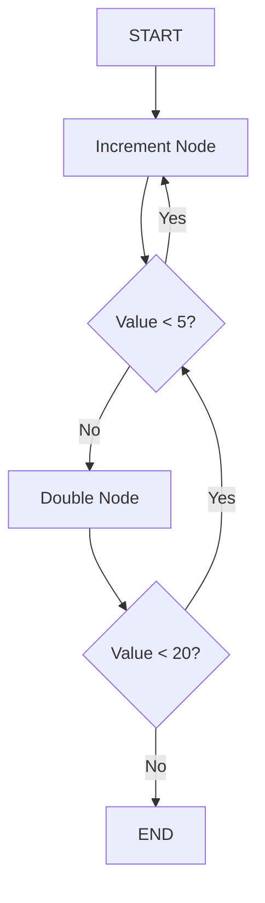
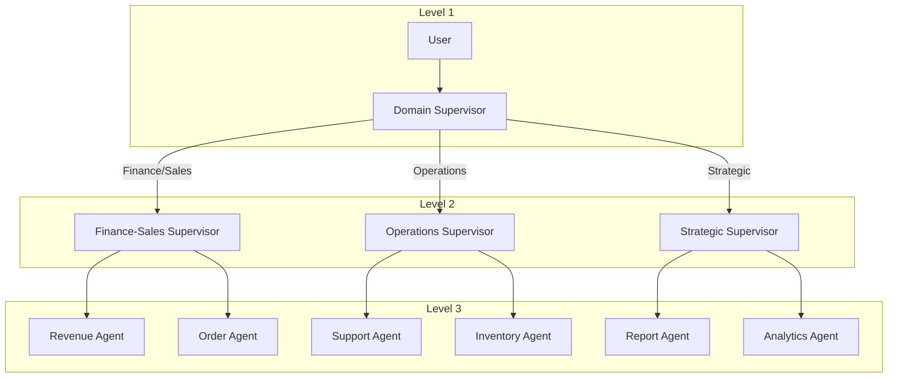
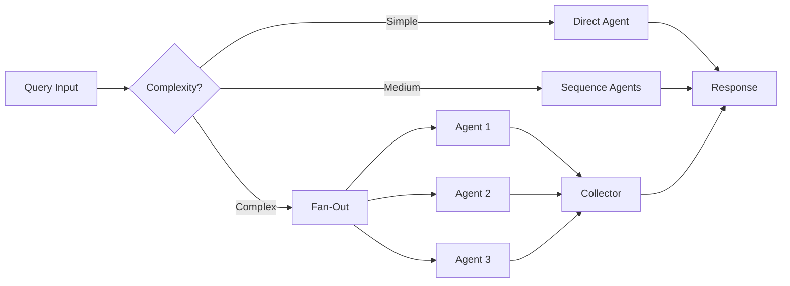
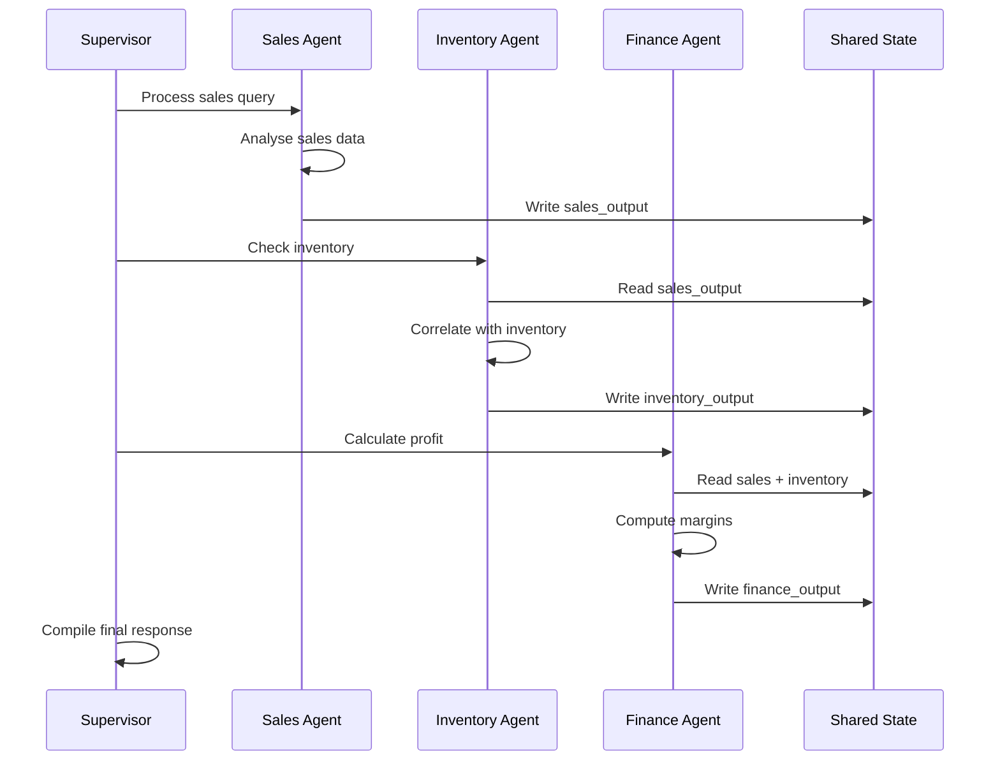
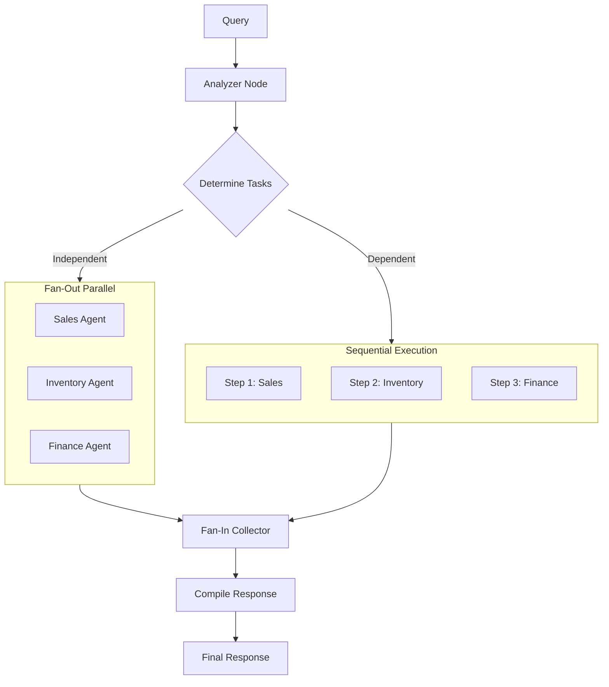
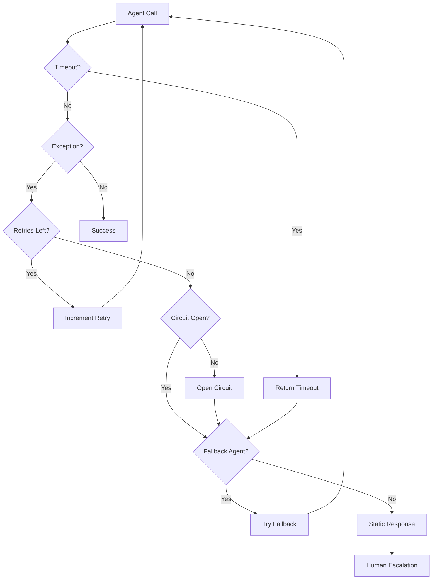
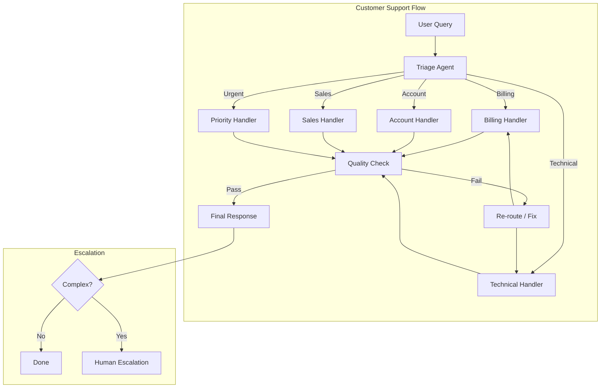

# Week 2 — LangGraph Advanced

**Goal:** Multi-agent systems with LangGraph
**Output:** Supervisor agent, multi-agent workflow, parallel execution

---

## Day 1 — Multi-Agent with LangGraph

### LangGraph kyun?

CrewAI mein agents predefined teams mein kaam karte hain — ek task doosre ke baad. Lekin jab tuze flexible, dynamic control chahiye ki "kaun sa agent kab kaam karega", tab LangGraph aata hai.

**PHP Mental Map:** Laravel pipelines ya middleware chains yad karo. Har step ek class hai, aur aap decide karte ho ki request kis step se guzregi. LangGraph bhi waisa hi hai — har node ek agent hai, aur edges decide karte hain flow.

### Core Concepts

```python
from typing import TypedDict, List, Literal, Annotated, Optional, Any
from langgraph.graph import StateGraph, END, START, add_messages
from langgraph.checkpoint import MemorySaver
from langgraph.checkpoint.sqlite import SqliteSaver
from langchain_openai import ChatOpenAI
from langchain.schema import HumanMessage, AIMessage, SystemMessage
from langchain.tools import tool
import operator
import json

"""
LangGraph ke 3 pillars:

1. StateGraph → Graph-based workflow
   → Nodes = agents/tasks
   → Edges = routing logic
   → State = shared data across nodes

2. Persistence → Checkpointing
   → MemorySaver (in-memory)
   → SqliteSaver (persistent)
   → PostgresSaver (production)

3. Routing → Conditional edges
   → Static: fixed path
   → Dynamic: LLM decides
   → Conditional: logic-based
"""

# Define shared state with more fields
class MultiAgentState(TypedDict):
    messages: Annotated[list, add_messages]
    current_agent: str
    agent_outputs: dict
    route_history: list
    error_count: int
    user_intent: str
    confidence_score: float
    processing_time: float

llm = ChatOpenAI(model="gpt-4o", temperature=0)
```

### PHP → LangGraph Mental Model

| Laravel Concept | LangGraph Equivalent |
|---|---|
| Middleware Pipeline | StateGraph with nodes |
| Service Container | Shared State |
| Queue Jobs | Parallel agent execution |
| Event/Listener | Agent communication via state |
| Pipeline Pattern | Sequential agent chain |
| Bus (Command Bus) | Supervisor routing |
| Cache | State persistence/checkpoint |

### StateGraph Deep-Dive

```python
"""
StateGraph = cyclic directed graph.
Matlab agent apne kaam ke baad vapas supervisor ke paas aa sakta hai.

Three phases:
1. Build Phase → Nodes + edges define karo
2. Compile Phase → Check logic, optimize
3. Execution Phase → Input → graph run → output
"""

# Minimal StateGraph example
from langgraph.graph import StateGraph

class SimpleState(TypedDict):
    value: int
    history: list

def increment(state: SimpleState) -> SimpleState:
    value = state["value"] + 1
    return {"value": value, "history": state["history"] + [f"inc: {value}"]}

def double(state: SimpleState) -> SimpleState:
    value = state["value"] * 2
    return {"value": value, "history": state["history"] + [f"dbl: {value}"]}

def should_continue(state: SimpleState) -> Literal["increment", "double", "end"]:
    if state["value"] < 5:
        return "increment"
    elif state["value"] < 20:
        return "double"
    else:
        return "end"

# Build
graph = StateGraph(SimpleState)
graph.add_node("increment", increment)
graph.add_node("double", double)
graph.set_entry_point("increment")
graph.add_conditional_edges("increment", should_continue)
graph.add_conditional_edges("double", should_continue)
graph.add_edge("double", END)  # won't be reached in this simple flow

app = graph.compile()

# Run
result = app.invoke({"value": 1, "history": []})
print(result)
# → {"value": ..., "history": [...]}
```



### Checkpointing aur Persistence

```python
"""
Checkpointing = har step ke baad state save karna.
Isse:
- Graph pause/continue ho sakta hai
- Human-in-the-loop possible hai
- Error recovery milta hai
"""

from langgraph.checkpoint import MemorySaver

# In-memory checkpointing
memory = MemorySaver()

app_with_memory = graph.compile(
    checkpointer=memory
)

# Har invocation ke liye unique thread_id
config = {"configurable": {"thread_id": "session_001"}}
result = app_with_memory.invoke(
    {"value": 1, "history": []},
    config=config
)

# State inspect kar sakte hain
state = app_with_memory.get_state(config)
print("Current state:", state.values)

# Ya previous states bhi dekh sakte hain
states = [s for s in app_with_memory.get_state_history(config)]
```

---

## Day 2 — Supervisor Node

### Supervisor Pattern Explained

**Supervisor** = ek special node jo decide karta hai "ab kaun sa agent chalega". Think of it as a Laravel router — aati hui request ko controller assign kar raha hai.

```python
"""
Supervisor ka kaam:
1. Input analyze karo
2. Decide karo kaun sa agent最适合 (most suitable)
3. Route karo us agent ko
4. Agent ke baad, decide karo finish ya next agent
"""

def supervisor_node(state: MultiAgentState) -> dict:
    """Decide which agent should handle the next step."""
    
    last_message = state["messages"][-1].content if state["messages"] else ""
    previous_routes = state.get("route_history", [])
    
    prompt = f"""
    You are a supervisor managing AI agents in an ERP system.
    Available agents:
    
    1. SALES_AGENT: Handles sales data, revenue, orders, customer info
    2. INVENTORY_AGENT: Handles stock levels, products, warehouses
    3. FINANCE_AGENT: Handles billing, invoices, payments, expenses
    4. SUPPORT_AGENT: Handles customer issues, tickets, FAQs
    5. FINAL: If the user request is fully resolved
    
    User message: {last_message}
    
    Already routed to: {previous_routes}
    
    Which agent should handle this? Choose one: SALES_AGENT, INVENTORY_AGENT, FINANCE_AGENT, SUPPORT_AGENT, or FINAL
    
    Also provide a brief reason for this decision.
    
    Format: AGENT: [name]
    Reason: [brief explanation]
    """
    
    response = llm.invoke(prompt)
    content = response.content
    
    for agent in ["SALES_AGENT", "INVENTORY_AGENT", "FINANCE_AGENT", "SUPPORT_AGENT", "FINAL"]:
        if agent in content:
            return {
                "current_agent": agent,
                "route_history": state["route_history"] + [agent]
            }
    
    return {"current_agent": "SUPPORT_AGENT"}
```

### Agent Nodes

```python
"""
Har agent ek function hai jo state leta hai aur state return karta hai.
Same pattern — input state, process, output state.
"""

def sales_agent(state: MultiAgentState) -> MultiAgentState:
    """Handle sales-related queries."""
    query = state["messages"][-1].content
    
    response = llm.invoke(f"""
    You are a SALES AGENT for ApexERP.
    Handle this query: {query}
    
    You have access to sales data, customer info, order history.
    Respond with actual data when possible, otherwise provide guidance.
    Use Hinglish.
    """)
    
    return {
        "messages": [AIMessage(content=response.content, name="sales_agent")],
        "agent_outputs": {**state["agent_outputs"], "sales": response.content}
    }

def inventory_agent(state: MultiAgentState) -> MultiAgentState:
    """Handle inventory-related queries."""
    query = state["messages"][-1].content
    
    response = llm.invoke(f"""
    You are an INVENTORY AGENT for ApexERP.
    Handle this query: {query}
    
    You track stock levels, warehouse data, product info.
    Use Hinglish.
    """)
    
    return {
        "messages": [AIMessage(content=response.content, name="inventory_agent")],
        "agent_outputs": {**state["agent_outputs"], "inventory": response.content}
    }

def finance_agent(state: MultiAgentState) -> MultiAgentState:
    """Handle finance-related queries."""
    query = state["messages"][-1].content
    
    response = llm.invoke(f"""
    You are a FINANCE AGENT for ApexERP.
    Handle this query: {query}
    
    You handle billing, invoices, payments, expenses, budgets.
    Use Hinglish.
    """)
    
    return {
        "messages": [AIMessage(content=response.content, name="finance_agent")],
        "agent_outputs": {**state["agent_outputs"], "finance": response.content}
    }

def support_agent(state: MultiAgentState) -> MultiAgentState:
    """Handle support-related queries."""
    query = state["messages"][-1].content
    
    response = llm.invoke(f"""
    You are a SUPPORT AGENT for ApexERP.
    Handle this query: {query}
    
    You help with product issues, troubleshooting, FAQs.
    Use Hinglish.
    """)
    
    return {
        "messages": [AIMessage(content=response.content, name="support_agent")],
        "agent_outputs": {**state["agent_outputs"], "support": response.content}
    }
```

### Multi-Level Supervision

Complex systems mein ek nahi, multiple supervisors hote hain:

```python
"""
Enterprise pattern: Supervisors ki hierarchy

Level 1: Domain Supervisor → Decide kis domain mein jaana hai
Level 2: Task Supervisor → Decide kaun sa specific task karna hai
Level 3: Agent → Actual kaam karo
"""

class HierarchicalSupervisor:
    """
    Three-tier supervision.
    """
    
    def __init__(self):
        self.llm = ChatOpenAI(model="gpt-4o", temperature=0.1)
    
    def domain_supervisor(self, state: MultiAgentState) -> dict:
        """Level 1: Decide main domain."""
        query = state["messages"][-1].content
        
        decision = self.llm.invoke(f"""
        Classify this query into one domain:
        "{query}"
        
        - FINANCE_AND_SALES: Numbers, money, revenue, expenses
        - OPERATIONS_AND_SUPPORT: Day-to-day, issues, processes
        - STRATEGIC: Planning, decisions, reports
        
        Domain: 
        """)
        
        return {"current_agent": f"domain_{decision.content.strip().lower()}"}
    
    def task_supervisor_sales(self, state: MultiAgentState) -> dict:
        """Level 2: Specific task within sales domain."""
        query = state["messages"][-1].content
        
        task = self.llm.invoke(f"""
        Determine specific task:
        "{query}"
        
        Options: revenue_analysis, order_status, customer_info, forecasting
        """)
        
        return {"current_agent": task.content.strip()}

# PHP Mental Map:
# Supervisor → Controller (decides route)
# Agent → Service Class (does actual work)
# State → Request/Response objects
# Router → Routes file
```



---

## Day 3 — Conditional Routing

### Routing Strategies

Conditional routing = Supervisor ka decision implement karna. LangGraph mein `add_conditional_edges` se hota hai.

```python
"""
Three routing patterns:

1. CONTENT-BASED: Query ke content se route karo
2. LLM-BASED: LLM decide kare kaun sa route
3. HYBRID: Pahle rules, phir LLM fallback
"""

def router_condition(state: MultiAgentState) -> Literal[
    "sales_agent", "inventory_agent", "finance_agent", 
    "support_agent", "final"
]:
    """Route to appropriate agent based on supervisor decision."""
    current = state.get("current_agent", "")
    route_count = len(state["route_history"])
    
    # Prevent infinite loops (max 5 routes)
    if route_count > 4:
        return "final"
    
    agent_map = {
        "SALES_AGENT": "sales_agent",
        "INVENTORY_AGENT": "inventory_agent",
        "FINANCE_AGENT": "finance_agent",
        "SUPPORT_AGENT": "support_agent",
        "FINAL": "final"
    }
    
    return agent_map.get(current, "final")
```

### Content-Based Routing

```python
"""
Without LLM — pure rules se route karo.
Fast, predictable, cheap.
"""

def content_router(state: MultiAgentState) -> str:
    """Route based on keyword matching."""
    query = state["messages"][-1].content.lower()
    
    # Rules-based routing
    if any(word in query for word in ["sale", "revenue", "order", "customer", "buy"]):
        return "sales_agent"
    elif any(word in query for word in ["stock", "inventory", "product", "warehouse"]):
        return "inventory_agent"
    elif any(word in query for word in ["bill", "invoice", "payment", "expense", "profit"]):
        return "finance_agent"
    elif any(word in query for word in ["help", "issue", "problem", "error", "bug", "support"]):
        return "support_agent"
    else:
        return "supervisor"  # Fallback to LLM supervisor

"""
Content-based routing tab use karo jab:
- Query patterns predictable hain
- Speed important hai
- Cost optimize karna hai
- Simple categorization enough hai
"""
```

### Routing Decision Matrix

| Condition | Route To | Fallback |
|---|---|---|
| "sale", "order", "customer" | Sales Agent | Supervisor |
| "stock", "warehouse", "product" | Inventory Agent | Supervisor |
| "invoice", "payment", "bill" | Finance Agent | Supervisor |
| "help", "bug", "error" | Support Agent | Supervisor |
| Multiple keywords present | Supervisor decides | ALL agents |
| No match | Supervisor | Human escalation |

### Dynamic Routing with Confidence

```python
"""
Advanced: Confidence-based routing.
Jo agent highest confidence de, usko route karo.
"""

class ConfidenceRouter:
    """
    Har agent se confidence score lo.
    Jo agent highest score de, usko route karo.
    """
    
    def __init__(self):
        self.llm = ChatOpenAI(model="gpt-4o", temperature=0)
    
    def route_with_confidence(self, state: MultiAgentState) -> str:
        query = state["messages"][-1].content
        
        # Ask each agent type for confidence
        agents = ["sales", "inventory", "finance", "support"]
        scores = {}
        
        for agent in agents:
            response = self.llm.invoke(f"""
            Rate your confidence (0-100) for handling this query as a {agent.upper()} agent:
            "{query}"
            
            Only return a number between 0-100.
            """)
            
            try:
                score = int(response.content.strip())
            except:
                score = 0
            
            scores[agent] = score
        
        best_agent = max(scores, key=scores.get)
        
        if scores[best_agent] > 50:
            return f"{best_agent}_agent"
        else:
            return "supervisor"  # Low confidence = ask supervisor

# Mistake to avoid:
# Agar confidence score 100 bhi hai to bhi agent fail ho sakta hai.
# Hamesha fallback rakho.
```

### Complex Conditional Routing

```python
"""
Complex routing with multiple conditions:
1. Check if query needs multiple agents
2. If yes → fan-out to multiple
3. If no → single agent
4. Track dependencies between agents
"""

class ComplexRouter:
    """
    Routes based on:
    - Query complexity
    - Agent dependency
    - Priority
    - Error state
    """
    
    def analyze_complexity(self, state: MultiAgentState) -> dict:
        query = state["messages"][-1].content
        
        analysis = self.llm.invoke(f"""
        Analyze this query:
        "{query}"
        
        Return JSON:
        {{
            "complexity": "simple" | "medium" | "complex",
            "agents_needed": ["agent1", "agent2"],
            "order_matters": true | false,
            "primary_agent": "agent_name"
        }}
        """)
        
        return json.loads(analysis.content)
    
    def route_complex(self, state: MultiAgentState) -> str:
        analysis = self.analyze_complexity(state)
        
        if analysis["complexity"] == "simple":
            # Direct route
            return analysis["primary_agent"]
        elif analysis["complexity"] == "medium":
            # Sequence agents
            state["agent_outputs"]["agent_sequence"] = analysis["agents_needed"]
            return analysis["agents_needed"][0]  # First in sequence
        else:
            # Complex → fan-out to parallel
            state["agent_outputs"]["parallel_agents"] = analysis["agents_needed"]
            return "parallel_executor"
```



### Final Node — Response Compilation

```python
def final_node(state: MultiAgentState) -> dict:
    """Compile final response from all agent outputs."""
    all_outputs = state.get("agent_outputs", {})
    
    if not all_outputs:
        return {
            "messages": [AIMessage(content="Mujhe samajh nahi aaya. Kripya dobara batao.")]
        }
    
    # Combine outputs
    combined = "\n\n".join([
        f"**{agent.upper()}**: {output}"
        for agent, output in all_outputs.items()
    ])
    
    final = llm.invoke(f"""
    Combine these agent responses into a single coherent answer in Hinglish:
    
    {combined}
    """)
    
    return {
        "messages": [AIMessage(content=final.content)],
        "current_agent": "done"
    }

# Build graph
def build_multi_agent_graph():
    workflow = StateGraph(MultiAgentState)
    
    # Add nodes
    workflow.add_node("supervisor", supervisor_node)
    workflow.add_node("sales_agent", sales_agent)
    workflow.add_node("inventory_agent", inventory_agent)
    workflow.add_node("finance_agent", finance_agent)
    workflow.add_node("support_agent", support_agent)
    workflow.add_node("final", final_node)
    
    # Start with supervisor
    workflow.set_entry_point("supervisor")
    
    # Supervisor routes to agents
    workflow.add_conditional_edges(
        "supervisor",
        router_condition,
        {
            "sales_agent": "sales_agent",
            "inventory_agent": "inventory_agent",
            "finance_agent": "finance_agent",
            "support_agent": "support_agent",
            "final": "final"
        }
    )
    
    # After any agent, go back to supervisor (or handle errors)
    for agent in ["sales_agent", "inventory_agent", "finance_agent", "support_agent"]:
        workflow.add_conditional_edges(
            agent,
            lambda s: "final" if s.get("error_count", 0) > 3 else "supervisor",
            {
                "supervisor": "supervisor",
                "final": "final"
            }
        )
    
    workflow.add_edge("final", END)
    
    return workflow.compile()

# Usage
app = build_multi_agent_graph()

result = app.invoke({
    "messages": [HumanMessage(content="Q4 sales kya the aur inventory status kya hai?")],
    "current_agent": "",
    "agent_outputs": {},
    "route_history": [],
    "error_count": 0
})

print(result["messages"][-1].content)
```

---

## Day 4 — Agent Communication via Shared State

### Shared State Pattern

```python
"""
Agents ek dusre se kaise communicate karte hain:

1. Shared State: Sab agents ek common state access kar sakte hain
2. Messages List: Har agent apna output messages mein add karta hai
3. Agent Outputs: Structured output dictionary
4. Tool Results: Agar ek agent ne tool call kiya, result shared
"""

from pydantic import BaseModel, Field

class TaskOutput(BaseModel):
    agent_name: str
    task_type: str
    result: str
    confidence: float = Field(default=0.0, ge=0.0, le=1.0)
    needs_human: bool = False
    dependencies: list[str] = Field(default_factory=list)
    errors: list[str] = Field(default_factory=list)
```

### Structured Agent Communication

```python
def structured_agent_node(state: MultiAgentState, agent_name: str) -> MultiAgentState:
    """
    Agent with structured communication.
    
    PHP Mental Map: Laravel Job ke baad dispatch karna aur 
    Event listener mein result handle karna.
    """
    query = state["messages"][-1].content
    previous_outputs = state.get("agent_outputs", {})
    
    # Give agent context of what other agents did
    context = "\n".join([
        f"{k}: {v[:200]}" 
        for k, v in previous_outputs.items()
    ]) if previous_outputs else "No previous context"
    
    response = llm.invoke(f"""
    You are {agent_name} in ApexERP multi-agent system.
    
    Previous work by other agents:
    {context}
    
    Current query: {query}
    
    Respond in structured format:
    1. What information you're providing
    2. Any dependencies on other agents
    3. Any issues or errors
    
    Use Hinglish:
    """)
    
    # Structured output
    task_output = TaskOutput(
        agent_name=agent_name,
        task_type="query_processing",
        result=response.content,
        confidence=0.85 if "error" not in response.content.lower() else 0.4,
        needs_human="approve" in response.content.lower()
    )
    
    return {
        "messages": [AIMessage(content=task_output.result, name=agent_name)],
        "agent_outputs": {
            **previous_outputs,
            agent_name: task_output.model_dump()
        }
    }

# Different agents use the same function
def sales_agent_structured(state):
    return structured_agent_node(state, "sales_agent")

def inventory_agent_structured(state):
    return structured_agent_node(state, "inventory_agent")
```

### Message Passing Protocol

```python
"""
Agent communication patterns:

Pattern 1: BROADCAST
- Agent output → sab agents ko available
- Best for: Independent tasks

Pattern 2: DIRECT
- Agent A specifically Agent B ko message bhejta hai
- Best for: Dependent tasks

Pattern 3: BLACKBOARD
- Central board jahan sab likhte/padhte hain
- Best for: Complex collaboration
"""

class AgentCommunicator:
    """
    Standardized communication between agents.
    """
    
    def __init__(self):
        self.message_queue = []
    
    def send_message(self, from_agent: str, to_agent: str, message: dict):
        """Send directed message to another agent."""
        self.message_queue.append({
            "from": from_agent,
            "to": to_agent,
            "message": message,
            "timestamp": "2024-01-01T00:00:00Z"  # In real: datetime.now()
        })
    
    def get_messages_for(self, agent_name: str, state: MultiAgentState) -> list:
        """Get all messages for a specific agent."""
        all_messages = state.get("agent_outputs", {}).get("_communications", [])
        return [m for m in all_messages if m["to"] == agent_name or m["to"] == "all"]
    
    def broadcast(self, from_agent: str, message: dict, state: MultiAgentState):
        """Broadcast to all agents."""
        comms = state.get("agent_outputs", {}).get("_communications", [])
        comms.append({
            "from": from_agent,
            "to": "all",
            "message": message
        })
        state["agent_outputs"]["_communications"] = comms
        return state

# Usage
communicator = AgentCommunicator()

def agent_with_communication(state: MultiAgentState, agent_name: str) -> MultiAgentState:
    """Agent that uses communication protocol."""
    
    # Check if any broadcast messages
    new_msgs = communicator.get_messages_for(agent_name, state)
    
    # Get relevant context
    context = ""
    for msg in new_msgs:
        context += f"\nFrom {msg['from']}: {msg['message']['content']}"
    
    # Process with context
    query = state["messages"][-1].content
    response = llm.invoke(f"""
    You are {agent_name} in ApexERP.
    
    Messages received from other agents:
    {context}
    
    Current task: {query}
    
    Respond in Hinglish.
    """)
    
    # Broadcast your result
    state = communicator.broadcast(
        agent_name,
        {"content": response.content, "type": "result"},
        state
    )
    
    return {
        "messages": [AIMessage(content=response.content, name=agent_name)],
        "agent_outputs": {**state["agent_outputs"], agent_name: response.content}
    }
```

### Context Sharing — Deep Dive

```python
"""
Context sharing ka matlab: Agent A ne jo kiya, Agent B use dekh sake.

Three levels:
1. FULL: Sab kuch share
2. FILTERED: Sirf relevant part
3. SUMMARIZED: Summary share
"""

def share_full_context(state: MultiAgentState) -> str:
    """Full context — sab kuch."""
    return str(state.get("agent_outputs", {}))

def share_filtered_context(state: MultiAgentState, agent_name: str) -> str:
    """Filtered — sirf relevant agents ka output."""
    relevant = []
    for k, v in state.get("agent_outputs", {}).items():
        if agent_name in k or k in agent_name:
            relevant.append(f"{k}: {v}")
    return "\n".join(relevant)

def share_summarized_context(state: MultiAgentState) -> str:
    """Summarized — LLM se summary banao."""
    outputs = state.get("agent_outputs", {})
    
    if not outputs:
        return "No previous context"
    
    summary = llm.invoke(f"""
    Summarize these agent outputs for the next agent:
    
    {outputs}
    
    Keep only key findings, decisions, and action items.
    """)
    
    return summary.content

# Production mein kaunsa use karna?
# FULL → Context window zyada consume karta hai
# FILTERED → Sabse balanced approach
# SUMMARIZED → Best for token optimization but loses detail
```



---

## Day 5 — Parallel Agent Execution

### Why Parallel?

```python
"""
Parallel execution = multiple agents ek saath kaam karein.

Use case: "Q4 ka data chahiye"
→ Sales agent: sales nikaal raha hai
→ Inventory agent: stock check kar raha hai
→ Finance agent: profit calculate kar raha hai
→ Sab parallel mein chal rahe hain
→ Phir combine karo

Without parallel: 3s + 2s + 4s = 9s total
With parallel: max(3s, 2s, 4s) = 4s total
Benefit: 55% faster!
"""

from langgraph.graph import StateGraph, END
import asyncio
import time
```

### Async Parallel Executor

```python
class ParallelAgentExecutor:
    """
    Multiple agents ko parallel mein execute karo.
    Har agent independent kaam karta hai.
    Phir supervisor combine karta hai.
    
    PHP Mental Map: Laravel Queue mein multiple jobs 
    dispatch karna aur phir results collect karna.
    """
    
    def __init__(self):
        self.llm = ChatOpenAI(model="gpt-4o-mini", temperature=0.3)
    
    async def run_agent(self, agent_name: str, task: str) -> dict:
        """Run a single agent with timing."""
        start = time.time()
        
        result = self.llm.invoke(f"""
        You are {agent_name} in ApexERP.
        Task: {task}
        Provide your analysis in 2-3 sentences.
        """)
        
        elapsed = time.time() - start
        
        return {
            "agent": agent_name,
            "result": result.content,
            "elapsed_seconds": round(elapsed, 2)
        }
    
    async def run_parallel(self, tasks: dict) -> list:
        """Run multiple agents in parallel."""
        coroutines = [
            self.run_agent(name, task)
            for name, task in tasks.items()
        ]
        
        results = await asyncio.gather(*coroutines)
        return results

# Usage
async def parallel_demo():
    executor = ParallelAgentExecutor()
    
    tasks = {
        "sales_agent": "What were Q4 2024 sales figures?",
        "inventory_agent": "What is current inventory level of top 5 products?",
        "finance_agent": "What was net profit in Q4 2024?"
    }
    
    results = await executor.run_parallel(tasks)
    
    for r in results:
        print(f"\n=== {r['agent']} ({r['elapsed_seconds']}s) ===")
        print(r['result'])

# Run
# asyncio.run(parallel_demo())
```

### Fan-Out / Fan-In Pattern

```python
"""
Fan-Out: Ek input → Multiple parallel tasks
Fan-In: Multiple results → Ek combined output
"""

from langgraph.graph import StateGraph
import concurrent.futures
from typing import Callable

def fan_out_node(state: MultiAgentState) -> MultiAgentState:
    """
    Fan-out: ek input se multiple parallel tasks create karo.
    
    Laravel analogy: ek request aayi, aapne 3 queue jobs dispatch kar diye.
    """
    query = state["messages"][-1].content
    
    # Determine which agents to run in parallel
    parallel_tasks = []
    
    if any(word in query.lower() for word in ["sale", "revenue", "order"]):
        parallel_tasks.append("sales")
    if any(word in query.lower() for word in ["inventory", "stock", "product", "warehouse"]):
        parallel_tasks.append("inventory")
    if any(word in query.lower() for word in ["finance", "profit", "bill", "invoice", "expense"]):
        parallel_tasks.append("finance")
    if any(word in query.lower() for word in ["support", "help", "issue", "ticket"]):
        parallel_tasks.append("support")
    
    # If no specific keywords, run all
    if not parallel_tasks:
        parallel_tasks = ["sales", "inventory", "finance"]
    
    # Store which parallel agents to run
    return {"agent_outputs": {"parallel_tasks": parallel_tasks}}

# Parallel execution using ThreadPoolExecutor
def execute_parallel_tasks(state: MultiAgentState, task_funcs: dict[str, Callable]) -> dict:
    """Execute multiple agent functions in parallel threads."""
    tasks = state.get("agent_outputs", {}).get("parallel_tasks", [])
    results = {}
    
    with concurrent.futures.ThreadPoolExecutor(max_workers=len(tasks)) as executor:
        future_to_task = {
            executor.submit(task_funcs[task], state): task 
            for task in tasks 
            if task in task_funcs
        }
        
        for future in concurrent.futures.as_completed(future_to_task):
            task = future_to_task[future]
            try:
                result = future.result()
                results[task] = result
            except Exception as e:
                results[task] = {"error": str(e)}
    
    return results

def collect_results(state: MultiAgentState) -> MultiAgentState:
    """
    Fan-in: saare parallel results ko collect karo.
    """
    parallel_results = state.get("agent_outputs", {})
    
    collected = {
        k: v for k, v in parallel_results.items() 
        if k != "parallel_tasks" and not k.startswith("_")
    }
    
    if not collected:
        return {"messages": [AIMessage(content="No results from any agent.")]}
    
    # Create summary
    summary = llm.invoke(f"""
    Summarize these parallel agent results into one answer:
    
    {collected}
    
    Use Hinglish. Highlight key numbers.
    """)
    
    return {"messages": [AIMessage(content=summary.content)]}
```

### Batch Parallel Processing

```python
"""
Bulk operations: Same operations on multiple items.
E.g., "Check stock for products [A, B, C, D, E, F]"
→ 6 parallel agents, har product ke liye 1
"""

class BatchProcessor:
    """
    Process multiple items in parallel batches.
    """
    
    def __init__(self, batch_size: int = 3):
        self.batch_size = batch_size
    
    def split_into_batches(self, items: list) -> list[list]:
        """Split items into batches of batch_size."""
        return [
            items[i:i + self.batch_size]
            for i in range(0, len(items), self.batch_size)
        ]
    
    async def process_batch(self, items: list, agent_name: str) -> list:
        """Process a batch of items in parallel."""
        tasks = {
            f"{agent_name}_{i}": f"Process item: {item}"
            for i, item in enumerate(items)
        }
        
        executor = ParallelAgentExecutor()
        return await executor.run_parallel(tasks)
    
    async def process_all(self, items: list, agent_name: str) -> list:
        """Process all items in batches."""
        batches = self.split_into_batches(items)
        all_results = []
        
        for batch in batches:
            results = await self.process_batch(batch, agent_name)
            all_results.extend(results)
        
        return all_results

"""
Mistake to avoid:
Parallel processing se speed up hota hai, lekin:
1. Rate limits hit ho sakte hain (API calls)
2. Cost increase hota hai (sab ek saath LLM call)
3. Error handling complex ho jata hai

Solution: Batching + Retry + Throttling
"""
```



---

## Day 6 — Error Handling in Multi-Agent

### Error Handling Strategy

```python
"""
Multi-agent mein errors handle karna critical hai:

1. Agent fail → Try again
2. Agent fail again → Route to different agent
3. All fail → Human escalation
4. Timeout → Move to next agent
5. Invalid output → Request clarification
"""

class RobustMultiAgent:
    """
    Multi-agent system with comprehensive error handling.
    
    PHP Mental Map: Laravel try-catch blocks + retry-until pattern
    jaise queue jobs mein hota hai.
    """
    
    def __init__(self):
        self.llm = ChatOpenAI(model="gpt-4o", temperature=0.2)
        self.max_retries = 2
        self.timeout_seconds = 30
    
    def run_with_retry(self, agent_func, state: MultiAgentState, agent_name: str) -> MultiAgentState:
        """Run agent with retry logic."""
        
        for attempt in range(self.max_retries + 1):
            try:
                result = agent_func(state)
                # Check if result is valid
                if result and result.get("messages"):
                    return result
                else:
                    raise ValueError("Empty result")
                    
            except Exception as e:
                print(f"[ERROR] {agent_name} attempt {attempt + 1} failed: {e}")
                
                if attempt < self.max_retries:
                    # Add error to state and retry
                    state["error_count"] += 1
                    state["messages"].append(
                        AIMessage(content=f"Error in {agent_name}. Retrying...")
                    )
                else:
                    # Final failure
                    return {
                        "messages": [AIMessage(
                            content=f"{agent_name} failed after {self.max_retries} retries. Escalating to human."
                        )],
                        "agent_outputs": {
                            **state.get("agent_outputs", {}),
                            f"{agent_name}_error": f"Failed after {self.max_retries} attempts"
                        }
                    }
        
        return state
    
    def handle_timeout(self, state: MultiAgentState, agent_name: str) -> MultiAgentState:
        """Handle agent timeout."""
        return {
            "messages": [AIMessage(
                content=f"{agent_name} took too long. Moving to next step."
            )],
            "agent_outputs": {
                **state.get("agent_outputs", {}),
                f"{agent_name}_timeout": True
            }
        }
```

### Circuit Breaker Pattern

```python
"""
Circuit breaker = Agar agent repeatedly fail kar raha hai,
to use temporarily disable karo.

States:
CLOSED → Normal operation
OPEN → Failure threshold crossed, disabled
HALF_OPEN → Testing if agent recovered
"""

import time
from enum import Enum

class CircuitState(Enum):
    CLOSED = "closed"
    OPEN = "open"
    HALF_OPEN = "half_open"

class CircuitBreaker:
    """
    Circuit breaker for agent calls.
    """
    
    def __init__(self, failure_threshold: int = 3, recovery_timeout: float = 60.0):
        self.failure_threshold = failure_threshold
        self.recovery_timeout = recovery_timeout
        self.failure_count = 0
        self.state = CircuitState.CLOSED
        self.last_failure_time = None
    
    def call(self, agent_func, state: MultiAgentState, agent_name: str) -> MultiAgentState:
        """Call agent with circuit breaker protection."""
        
        if self.state == CircuitState.OPEN:
            # Check if recovery time passed
            if self.last_failure_time and (time.time() - self.last_failure_time) > self.recovery_timeout:
                self.state = CircuitState.HALF_OPEN
                print(f"[CIRCUIT] {agent_name} is HALF_OPEN, testing...")
            else:
                print(f"[CIRCUIT] {agent_name} is OPEN, skipping...")
                return {
                    "messages": [AIMessage(content=f"{agent_name} temporarily unavailable.")],
                    "agent_outputs": {f"{agent_name}_circuit_open": True}
                }
        
        try:
            result = agent_func(state)
            
            if self.state == CircuitState.HALF_OPEN:
                # Success! Close circuit
                self.state = CircuitState.CLOSED
                self.failure_count = 0
                print(f"[CIRCUIT] {agent_name} recovered, CLOSED again")
            
            return result
            
        except Exception as e:
            self.failure_count += 1
            self.last_failure_time = time.time()
            
            if self.failure_count >= self.failure_threshold:
                self.state = CircuitState.OPEN
                print(f"[CIRCUIT] {agent_name} failed {self.failure_count} times, OPENED circuit")
            
            raise e
```

### Graceful Degradation

```python
"""
Graceful degradation = agar koi agent fail ho jaye,
to bhi system kaam karta rahe.

Strategy:
1. Primary agent fail → Fallback agent
2. Fallback fail → Rule-based response
3. Rule fail → Static response
4. All fail → User ko batao
"""

class DegradationManager:
    """
    Manages graceful degradation of multi-agent system.
    """
    
    def __init__(self):
        self.fallback_chain = {
            "sales_agent": ["inventory_agent", "finance_agent"],
            "finance_agent": ["sales_agent", "support_agent"],
            "inventory_agent": ["sales_agent", "support_agent"],
            "support_agent": ["general_agent", None]  # None = static response
        }
        
        self.static_responses = {
            "sales_agent": "Sales data currently unavailable. Please try again later.",
            "finance_agent": "Finance module is down. Contact administrator.",
            "inventory_agent": "Inventory system under maintenance.",
            "support_agent": "Support system temporarily unavailable."
        }
    
    def execute_with_degradation(self, primary_agent: str, state: MultiAgentState) -> MultiAgentState:
        """Try agent, fallback through chain if fails."""
        
        fallbacks = self.fallback_chain.get(primary_agent, [])
        
        # Try primary first
        try:
            return self.try_agent(primary_agent, state)
        except Exception as e:
            print(f"[DEGRADE] {primary_agent} failed: {e}")
        
        # Try fallbacks
        for fallback in fallbacks:
            if fallback is None:
                break  # Static response
            
            try:
                print(f"[DEGRADE] Falling back to {fallback}")
                return self.try_agent(fallback, state)
            except Exception as e:
                print(f"[DEGRADE] {fallback} also failed: {e}")
                continue
        
        # Last resort: static response
        state["messages"].append(
            AIMessage(content=self.static_responses.get(
                primary_agent,
                "System unavailable. Please try again."
            ))
        )
        return state
    
    def try_agent(self, agent_name: str, state: MultiAgentState) -> MultiAgentState:
        """Try executing an agent."""
        agent_map = {
            "sales_agent": sales_agent,
            "inventory_agent": inventory_agent,
            "finance_agent": finance_agent,
            "support_agent": support_agent,
        }
        
        if agent_name in agent_map:
            return agent_map[agent_name](state)
        else:
            raise ValueError(f"Unknown agent: {agent_name}")
```

### Human Escalation Protocol

```python
"""
Jab saare agents fail ho jayein, to human ko escalate karo.
"""

def escalate_to_human(state: MultiAgentState) -> dict:
    """When all agents fail, escalate to human."""
    error_summary = "\n".join([
        f"{k}: {v}" 
        for k, v in state.get("agent_outputs", {}).items()
        if "error" in k or "timeout" in k
    ])
    
    return {
        "messages": [AIMessage(content=f"""
⚠️ Human intervention needed!

All agents failed to process this request.

Errors:
{error_summary}

Please handle manually or ask the user for more details.
        """)],
        "current_agent": "escalated"
    }

# Error router
def error_router(state: MultiAgentState) -> str:
    """Route based on error count."""
    error_count = state.get("error_count", 0)
    
    if error_count >= 3:
        return "escalate"
    elif error_count >= 1:
        return "retry"
    else:
        return "continue"
```

### Complete Error Flow



### Mistake to Avoid

```
❌ Sirf try-except lagao aur ignore karo
   → Agents silently fail ho jayenge, user pata nahi chalega

❌ Har error par human escalate
   → Users frustrate ho jayenge

❌ Infinite retry
   → Cost burn hoga, system hang ho jayega

✅ Correct approach:
   • 2-3 retries with exponential backoff
   • Circuit breaker for repeated failures
   • Graceful degradation with fallback
   • Smart escalation (only when truly needed)
```

---

## Day 7 — Practical: Customer Support Triage System

### Complete System

```python
"""
Production-ready customer support triage system.

Flow:
1. User query aayi
2. Triage agent categorizes
3. Specific agent handles it
4. If complex → multiple agents collaborate
5. Quality check → Final response

PHP Mental Map: Laravel Support Ticket System
- Ticket → Query
- Category → Triage
- Agent → Support Staff
- Escalation → Multiple levels
"""
```

### Triage System Implementation

```python
class CustomerSupportTriage:
    """
    Complete multi-agent customer support system.
    """
    
    def __init__(self):
        self.llm = ChatOpenAI(model="gpt-4o", temperature=0.3)
        self.build_graph()
    
    def triage(self, state: MultiAgentState) -> MultiAgentState:
        """Categorize the incoming query."""
        query = state["messages"][-1].content
        
        category = self.llm.invoke(f"""
        Categorize this customer query:
        "{query}"
        
        Categories:
        - BILLING: Payment, invoice, subscription, refund
        - TECHNICAL: Bug, error, feature request, setup
        - ACCOUNT: Login, password, profile, settings
        - SALES: Pricing, demo, purchase, upgrade
        - GENERAL: Anything else
        
        Respond with just the category name.
        """)
        
        return {"current_agent": category.content.strip()}
    
    def billing_handler(self, state: MultiAgentState) -> MultiAgentState:
        query = state["messages"][-1].content
        result = self.llm.invoke(f"""
        You are a BILLING support agent for ApexERP.
        
        Customer: {query}
        
        Steps:
        1. Check if it's about payment, invoice, or refund
        2. Provide clear solution
        3. If amount involved, ask for confirmation
        
        Use Hinglish:
        """)
        return {
            "messages": [AIMessage(content=result.content, name="billing")],
            "agent_outputs": {"billing": result.content}
        }
    
    def technical_handler(self, state: MultiAgentState) -> MultiAgentState:
        query = state["messages"][-1].content
        result = self.llm.invoke(f"""
        You are a TECHNICAL support agent for ApexERP.
        
        Customer: {query}
        
        Steps:
        1. Identify the technical issue
        2. Provide step-by-step solution
        3. Ask clarifying questions if needed
        
        Use Hinglish:
        """)
        return {
            "messages": [AIMessage(content=result.content, name="technical")],
            "agent_outputs": {"technical": result.content}
        }
    
    def account_handler(self, state: MultiAgentState) -> MultiAgentState:
        query = state["messages"][-1].content
        result = self.llm.invoke(f"""
        You are an ACCOUNT support agent for ApexERP.
        
        Customer: {query}
        
        Handle account-related issues:
        - Login/password reset
        - Profile updates
        - Permission issues
        - Account settings
        
        Use Hinglish:
        """)
        return {
            "messages": [AIMessage(content=result.content, name="account")],
            "agent_outputs": {"account": result.content}
        }
```

### Sentiment Analysis Integration

```python
"""
Production system mein sentiment analysis bhi add karo.
Agar customer angry hai → Priority high + empathetic tone.
"""

def analyze_sentiment(query: str) -> str:
    """Analyze customer sentiment for routing priority."""
    analysis = llm.invoke(f"""
    Analyze sentiment of this customer query:
    "{query}"
    
    Return one word: POSITIVE, NEUTRAL, NEGATIVE, or URGENT
    """)
    return analysis.content.strip()

def route_with_sentiment(state: MultiAgentState) -> str:
    """Route based on content + sentiment."""
    query = state["messages"][-1].content
    sentiment = analyze_sentiment(query)
    
    # Store sentiment
    state["agent_outputs"]["_sentiment"] = sentiment
    
    # URGENT queries always go to priority queue
    if sentiment == "URGENT":
        return "priority_handler"
    
    # Normal routing
    return state.get("current_agent", "general").lower()

class EscalationManager:
    """
    Automatic escalation based on complexity.
    """
    
    def should_escalate(self, state: MultiAgentState) -> bool:
        """Check if issue needs escalation."""
        error_count = state.get("error_count", 0)
        route_count = len(state.get("route_history", []))
        sentiment = state.get("agent_outputs", {}).get("_sentiment", "")
        
        # Escalate if:
        # 1. Too many errors
        # 2. Too many route hops
        # 3. Very negative sentiment
        # 4. Already retried 2+ times
        
        return any([
            error_count >= 3,
            route_count >= 5,
            sentiment == "URGENT",
            state.get("retry_count", 0) >= 2
        ])
```

### Quality Check System

```python
    def quality_check(self, state: MultiAgentState) -> MultiAgentState:
        """Final quality check before response."""
        response = state["messages"][-1].content
        
        check = self.llm.invoke(f"""
        Quality check this support response:
        
        {response}
        
        Check:
        1. Is it helpful? (yes/no)
        2. Is it accurate? (yes/no)
        3. Does it ask for needed info? (yes/no)
        4. Is tone appropriate? (yes/no)
        
        If all yes, say "APPROVED". Otherwise, say what to improve.
        """)
        
        if "APPROVED" in check.content:
            return state
        else:
            # Re-route to fix
            state["messages"].append(AIMessage(content=f"Quality issue: {check.content}"))
            return state
```

### Sentiment-Aware Routing

```python
    def build_graph(self):
        workflow = StateGraph(MultiAgentState)
        
        workflow.add_node("triage", self.triage)
        workflow.add_node("billing", self.billing_handler)
        workflow.add_node("technical", self.technical_handler)
        workflow.add_node("account", self.account_handler)
        workflow.add_node("sales", self.sales_handler)
        workflow.add_node("general", self.general_handler)
        workflow.add_node("priority_handler", self.priority_handler)
        workflow.add_node("quality", self.quality_check)
        workflow.add_node("human_escalation", self.human_escalation)
        
        workflow.set_entry_point("triage")
        
        # Conditional routing with sentiment
        workflow.add_conditional_edges(
            "triage",
            route_with_sentiment,
            {
                "billing": "billing",
                "technical": "technical",
                "account": "account",
                "sales": "sales",
                "general": "general",
                "priority_handler": "priority_handler"
            }
        )
        
        # All agents go to quality check
        for agent in ["billing", "technical", "account", "sales", "general", "priority_handler"]:
            workflow.add_conditional_edges(
                agent,
                lambda s: "human_escalation" if self.should_escalate(s) else "quality",
                {
                    "quality": "quality",
                    "human_escalation": "human_escalation"
                }
            )
        
        workflow.add_edge("quality", END)
        workflow.add_edge("human_escalation", END)
        
        self.app = workflow.compile()
    
    def sales_handler(self, state: MultiAgentState) -> MultiAgentState:
        query = state["messages"][-1].content
        result = self.llm.invoke(f"""
        You are a SALES support agent for ApexERP.
        
        Customer: {query}
        
        Handle sales-related queries:
        - Pricing and plans
        - Demo requests
        - Upgrades/downgrades
        - Purchase questions
        
        Use Hinglish:
        """)
        return {
            "messages": [AIMessage(content=result.content, name="sales")],
            "agent_outputs": {"sales": result.content}
        }
    
    def general_handler(self, state: MultiAgentState) -> MultiAgentState:
        query = state["messages"][-1].content
        result = self.llm.invoke(f"""
        You are a GENERAL support agent for ApexERP.
        
        Customer: {query}
        
        Handle general inquiries, feedback, or other requests.
        If you can't handle, ask for more details.
        
        Use Hinglish:
        """)
        return {
            "messages": [AIMessage(content=result.content, name="general")],
            "agent_outputs": {"general": result.content}
        }
    
    def priority_handler(self, state: MultiAgentState) -> MultiAgentState:
        query = state["messages"][-1].content
        result = self.llm.invoke(f"""
        ⚠️ URGENT SUPPORT — PRIORITY HANDLING ⚠️
        
        Customer: {query}
        
        Handle with extra care:
        1. Acknowledge urgency immediately
        2. Be extra empathetic
        3. Provide fastest possible solution
        4. If can't solve, escalate to senior team
        
        Use Hinglish, but be professional and caring.
        """)
        return {
            "messages": [AIMessage(content=result.content, name="priority")],
            "agent_outputs": {"priority": result.content}
        }
    
    def human_escalation(self, state: MultiAgentState) -> MultiAgentState:
        """Escalate to human support team."""
        error_summary = state.get("agent_outputs", {})
        return {
            "messages": [AIMessage(content=f"""
⚠️ Case Escalated to Human Support

Query: {state['messages'][0].content}

Previous attempts: {error_summary}

A human support agent will contact you shortly.
Ticket ID: TKT-{hash(str(state)) % 100000:05d}
            """)]
        }
    
    def handle_query(self, query: str) -> str:
        result = self.app.invoke({
            "messages": [HumanMessage(content=query)],
            "current_agent": "",
            "agent_outputs": {},
            "route_history": [],
            "error_count": 0
        })
        
        return result["messages"][-1].content
```

### Complete Usage Flow

```python
# Usage
support = CustomerSupportTriage()

# Test queries
test_queries = [
    "Mera invoice nahi aa raha hai, kya karun?",
    "Login nahi ho raha, error aa raha hai",
    "Product ka price kitna hai? Kya koi discount hai?",
    "Bahut urgent hai! Server down ho gaya!"
]

for query in test_queries:
    print(f"\n{'='*50}")
    print(f"QUERY: {query}")
    print(f"{'='*50}")
    
    response = support.handle_query(query)
    print(f"RESPONSE: {response}")
```

### Production Deployment Checklist

```
Production mein deploy karne se pehle:

✅ Monitoring — Har agent ke latency/error rate ka dashboard
✅ Logging — Decisions, routes, failures sab log karo
✅ Rate Limiting — LLM API calls limit karo
✅ Caching — Similar queries ka response cache karo
✅ Fallbacks — Har agent ke liye fallback plan
✅ Testing — Unit tests + Integration tests
✅ Human Handoff — Clear escalation path

Cost Optimization:
• gpt-4o-mini for simple tasks
• gpt-4o for complex reasoning
• Cache frequent queries (reduce API calls by 40%)
• Batch parallel requests when possible
```



### PHP Developer's Takeaway

```
Laravel se LangGraph transition:

PHP Laravel                     → LangGraph
──────────────────────────────────────────────
Artisan Command                → Node function
Middleware Pipeline             → StateGraph
Event Listener                  → Agent node
Job Queue                      → Parallel execution
try-catch                      → Error handling
Cache                          → State checkpointing
Service Container              → Shared state
Route -> Controller -> Service → Supervisor -> Agent -> Tool

Key Insight:
Jis tarah Laravel mein Controller request ko 
Service classes mein route karta hai, waise hi
LangGraph mein Supervisor agent decide karta hai
kaun sa node handle karega.

Difference:
Laravel: Static routes
LangGraph: Dynamic, LLM-decided routes
```

---

## Summary

```
Week 2 khatam:

✅ Multi-Agent Graph — Supervisor + specialized agents
✅ Conditional Routing — Router decides kaun sa agent
✅ Shared State — Agents communicate via state
✅ Parallel Execution — Agents ek saath kaam karte hain
✅ Error Handling — Retry, timeout, human escalation
✅ Support Triage — Complete production system
✅ Circuit Breaker — Repeated failures handle karo
✅ Graceful Degradation — Agent fail to bhi system chale
✅ Quality Check — Responses verify karo

Ab tu multi-agent systems bana sakta hai!

Next: Phase 7 — Automation mein n8n aur AI workflows!
```

### Quick Reference

```python
"""
Har file mein hona chahiye:

# 1. State Definition
class State(TypedDict):
    ...

# 2. Agent Nodes
def agent_1(state: State) -> State:
    ...

# 3. Supervisor/Router
def supervisor(state: State) -> dict:
    ...

# 4. Conditional Edge Function
def router(state: State) -> str:
    ...

# 5. Graph Build
graph = StateGraph(State)
graph.add_node("node1", agent_1)
...
graph.add_conditional_edges(...)
app = graph.compile()

# 6. Execution
result = app.invoke(initial_state)
```
