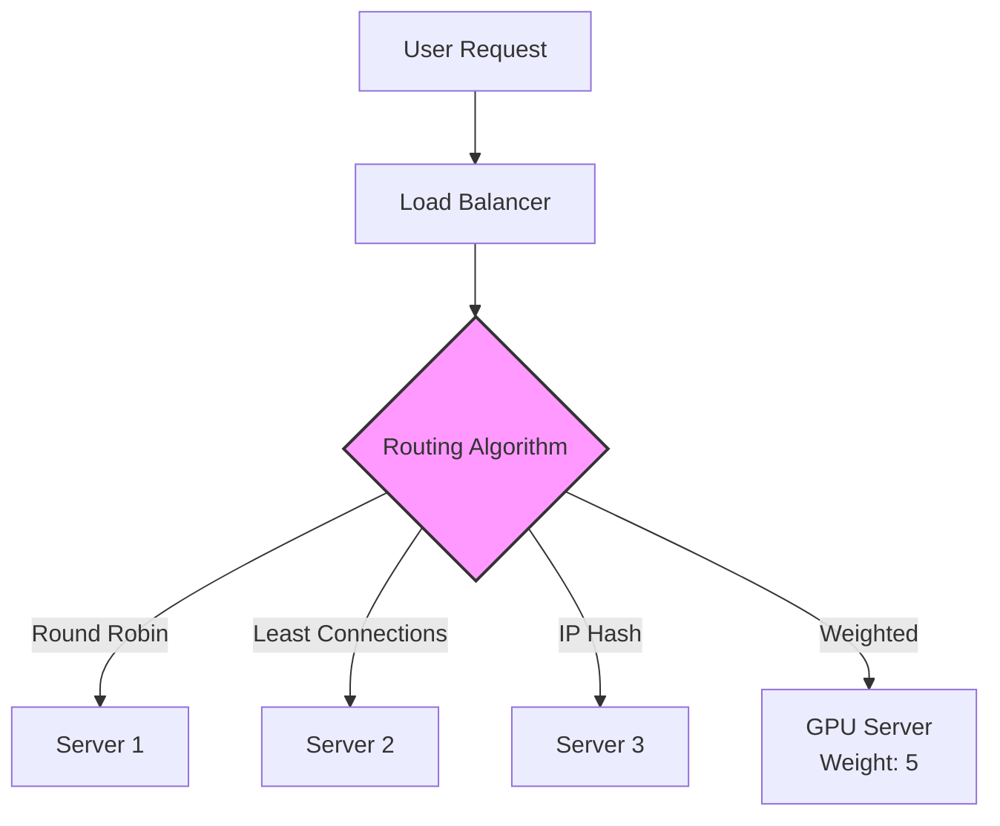
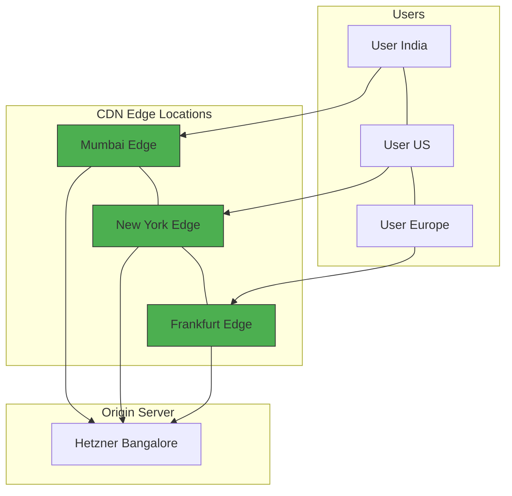
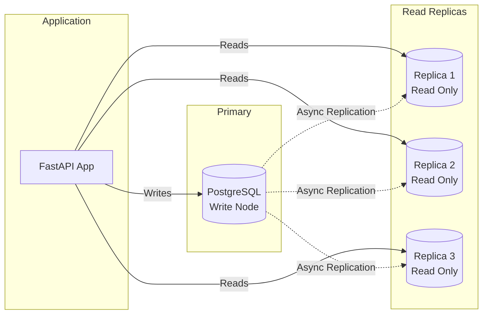
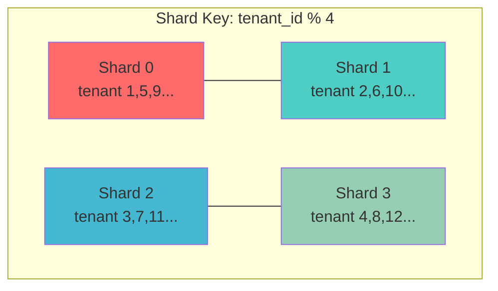
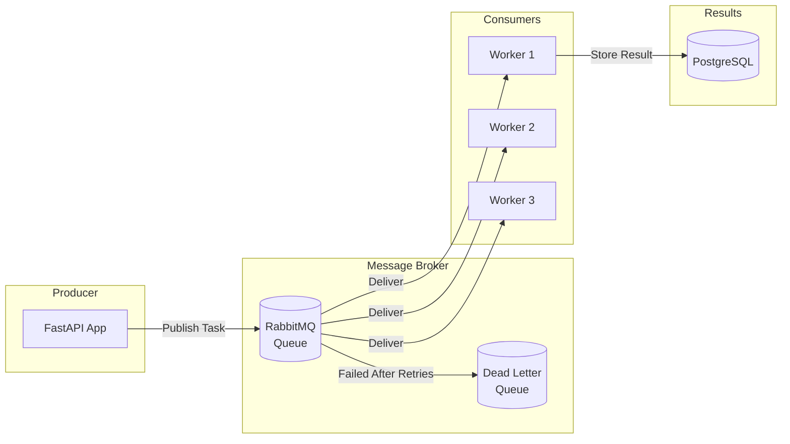
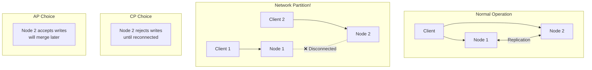
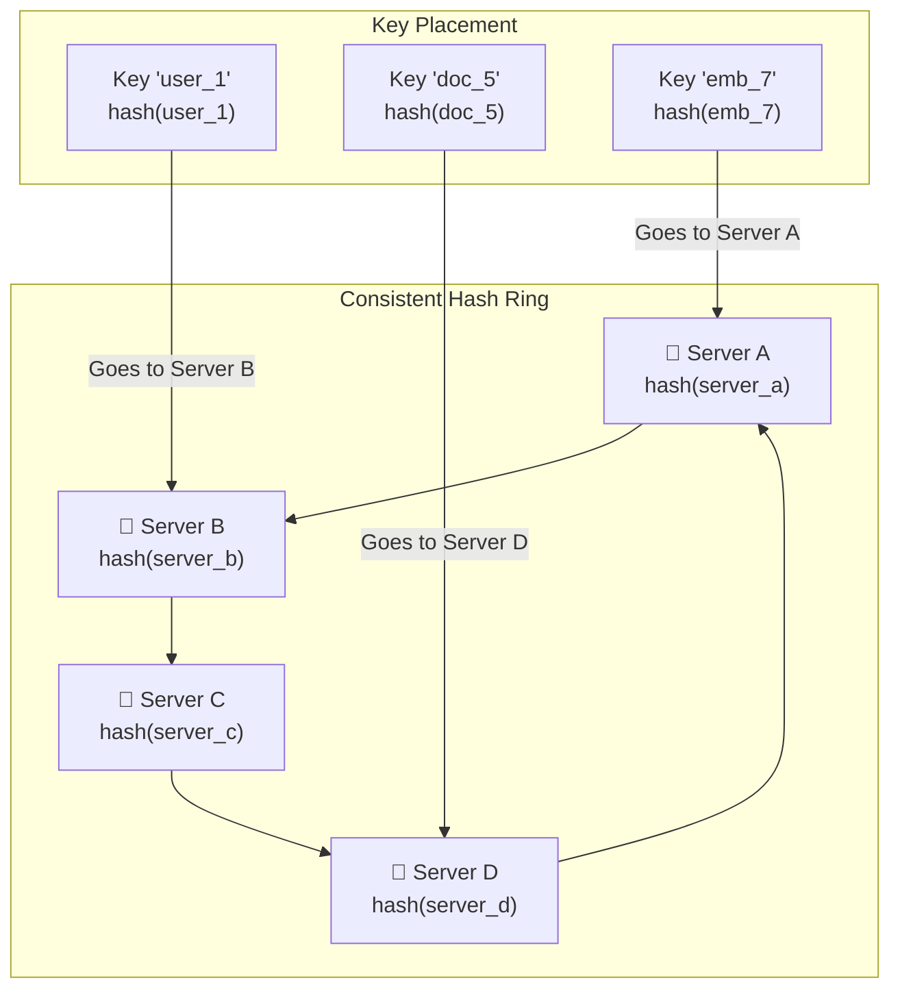

# Week 1 — System Design Basics

**Goal:** Core system design concepts samajh lo — jo AI systems mein lagenge

---

## Day 1 — Load Balancers, Caching, CDN

### Load Balancers — Deep Dive

Load balancer ka kaam hai: incoming requests ko multiple servers mein distribute karna. Laravel mein tum Nginx reverse proxy istemal karte the; AI engineering mein bhi yahi concept, lekin scale aur complexity zyada hai.

```
Without Load Balancer:
     User ──→ Server
               ❌ Single point of failure
               ❌ Can't scale horizontally
               ❌ Overloaded easily

With Load Balancer:
               ┌──────────────┐
               │   Load       │
     User ──→  │   Balancer   │
               │              │
               └──────┬───────┘
               ┌──────┼───────┐
               │      │       │
            ┌──▼──┐ ┌─▼───┐ ┌─▼───┐
            │Svr 1│ │Svr 2│ │Svr 3│
            └─────┘ └─────┘ └─────┘
```

**Layer 4 (Transport) vs Layer 7 (Application):**

```
L4 Load Balancer:
  ┌──────────────────────┐
  │  Inspects: IP + Port │ ← TCP level, fast
  │  Doesn't read HTTP    │
  │  Example: AWS NLB     │
  └──────────────────────┘
      Fast (no HTTP parsing), but can't do smart routing

L7 Load Balancer:
  ┌──────────────────────────┐
  │  Inspects: HTTP headers, │ ← Application level
  │  URL, cookies, body      │
  │  Can do path-based routing│
  │  Example: AWS ALB, Nginx  │
  └──────────────────────────┘
      Slower but much smarter routing
```

**Load Balancing Algorithms — Detailed:**

```python
# 1. Round Robin — simplest
# Har server ko ek ek request turn-wise
def round_robin(servers, counter):
    server = servers[counter % len(servers)]
    counter += 1
    return server
# Use: servers same capacity hoon to

# 2. Weighted Round Robin
# Kuch servers powerful hain — unhe zyada requests do
# Server A: weight 5 (powerful GPU), Server B: weight 1
def weighted_round_robin(servers, weights, counter):
    total = sum(weights)
    idx = counter % total
    for i, (server, weight) in enumerate(zip(servers, weights)):
        if idx < weight:
            return server, counter + 1
        idx -= weight

# 3. Least Connections
# Jis server pe sabse kam active connections, usko bhejo
def least_connections(servers):
    return min(servers, key=lambda s: s.active_connections)

# 4. Least Response Time
# Fastest responding server ko priority
def least_response_time(servers):
    return min(servers, key=lambda s: s.avg_response_time)

# 5. IP Hash / Sticky Sessions
# Same user → same server (session persistence)
def ip_hash(client_ip, servers):
    hash_val = hash(client_ip)
    return servers[hash_val % len(servers)]
```



**Health Checks — Kyun Zaroori Hain?**

Load balancer ko pata hona chahiye kaunsa server alive hai. Agar server down hai to usko routing se hata do.

```
Health Check Types:
  🔵 TCP Health Check — bas port reachable hai?
     → curl -f tcp://server:8000
     → Fast, but surface-level

  🟢 HTTP Health Check — application respond kar rahi?
     → curl -f http://server:8000/health
     → Better, checks actual app

  🟡 Custom Health Check — DB connection bhi check karo?
     → GET /health → returns {"status":"ok","db":"connected","queue":"ok"}
     → Most thorough
```

**AI-specific Load Balancing Patterns:**

```
Pattern 1: LLM Provider Load Balancing
     ┌────────────┐
     │  LLM       │
     │  Router    │────→ OpenAI (GPT-4o)
     │            │────→ Anthropic (Claude)
     └────────────┘────→ Local (Ollama)
     Strategy: Least Connections (slowest provider gets fewer requests)

Pattern 2: GPU Server Balancing
     ┌────────────┐
     │  GPU       │
     │  Scheduler │────→ GPU Server 1 (A100, 2 requests)
     │            │────→ GPU Server 2 (A100, 5 requests)
     └────────────┘────→ GPU Server 3 (A10G, 1 request)
     Strategy: Least Load (GPU memory utilization dekho)

Pattern 3: Embedding Model Balancing
     ┌────────────┐
     │  Embed     │
     │  Router    │────→ Server 1 (small model, fast)
     │            │────→ Server 2 (large model, accurate)
     └────────────┘────→ Server 3 (batch processing)
     Strategy: Path-based (simple queries → small model)
```

**Production Tip:** AI systems mein, consistent hashing use karo target server selection ke liye (yeh Day 7 mein detail mein padhenge). Load balancer pe sticky sessions enable karo agar agent state maintain karna hai.

---

### Caching — Multi-Level Deep Dive

Caching ka matlab: frequently accessed data ko fast storage mein rakhna taaki baar baar slow source se na laani pade.

Laravel mein tum config cache, route cache, view cache use karte the. AI mein caching aur bhi critical hai — LLM calls expensive hain, embeddings compute-heavy hain.

**Cache Hierarchy (Latency Comparison):**

```
Storage Tier        Latency         Capacity        Cost/GB
─────────────────────────────────────────────────────────────
L1 Cache            0.5 ns          4-64 KB        $$$$$
L2 Cache            7 ns            256-512 KB     $$$$
RAM (DDR5)          20-50 ns        16-128 GB      $$$
SSD (NVMe)          10-100 μs       1-8 TB         $$
Network Storage     1-30 ms         100+ TB        $
Database (Postgres) 10-100 ms       Unlimited      $

Key Insight: RAM se SSD 1000x slow, SSD se DB 100x slow
```

**Caching Patterns — Detailed Code + Explanation:**

```python
# ============================================================
# Pattern 1: Cache-Aside (Lazy Loading)
# ============================================================
# Most common pattern. App pehle cache check karti hai.
# Miss hota hai to DB se fetch karke cache mein daal deti hai.
# Laravel mein: Cache::remember('key', $ttl, fn() => ...)

def get_document_cached(doc_id: str) -> dict:
    cache_key = f"doc:{doc_id}"

    # Step 1: Cache check
    cached = redis.get(cache_key)
    if cached:
        stats.record_cache_hit("documents")
        return json.loads(cached)

    # Step 2: Cache miss → DB se lao
    stats.record_cache_miss("documents")
    doc = db.query("SELECT * FROM documents WHERE id = ?", doc_id)

    # Step 3: Cache mein daalo
    redis.setex(cache_key, 3600, json.dumps(doc))  # 1 hour TTL
    return doc

# Pros: Simple, mem efficient (sirf requested data cache hota)
# Cons: Cache miss pe latency spike, stale data risk


# ============================================================
# Pattern 2: Write-Through
# ============================================================
# Write hamesha cache aur DB dono mein hota hai.
# Read hamesha cache se hota hai (fast).
# Laravel mein aisa pattern nahi hai by default.

def write_document(doc_id: str, data: dict):
    cache_key = f"doc:{doc_id}"

    # Step 1: Pehle cache update karo
    redis.setex(cache_key, 3600, json.dumps(data))

    # Step 2: Phir DB update karo
    db.execute(
        "UPDATE documents SET data = ? WHERE id = ?",
        json.dumps(data), doc_id
    )

# Pros: Cache hamesha consistent, reads always fast
# Cons: Writes slow (2 operations), unnecessary cache writes


# ============================================================
# Pattern 3: Write-Behind (Write-Back)
# ============================================================
# Pehle cache mein likho, phir async tareeke se DB mein.
# High-write scenarios ke liye best.

async def write_document_async(doc_id: str, data: dict):
    cache_key = f"doc:{doc_id}"

    # Step 1: Cache mein likho (fast)
    redis.setex(cache_key, 3600, json.dumps(data))

    # Step 2: Queue mein daalo (DB write baad mein)
    await write_queue.put({
        "type": "document_update",
        "doc_id": doc_id,
        "data": data,
        "timestamp": time.time()
    })
    return {"status": "accepted"}

# Worker process:
async def db_writer():
    while True:
        task = await write_queue.get()
        # Batch writes karo (performance)
        batch.append(task)
        if len(batch) >= 100:
            db.batch_execute(
                "UPDATE documents SET data = ? WHERE id = ?",
                [(t["data"], t["doc_id"]) for t in batch]
            )
            batch = []

# Pros: Super fast writes, batch optimized
# Cons: Cache crash → data loss risk, eventual consistency


# ============================================================
# Pattern 4: Write-Around
# ============================================================
# Sirf DB mein likho, cache tab update karo jab koi read kare.
# Good for write-once-read-occasionally data.

# Pros: Cache pollution nahi hoti
# Cons: Read miss hamesha slow
```

**Cache Invalidation — The Hardest Problem:**

```
Cache invalidation is one of the two hard things in CS
(other two: naming things, off-by-one errors)

Scenario: User updates profile
  ┌──────────┐     ┌──────────┐     ┌──────────┐
  │ User     │     │ Cache    │     │ Database │
  │ Requests │     │          │     │          │
  │ Update   │     │          │     │          │
  └────┬─────┘     └────┬─────┘     └────┬─────┘
       │                │                │
       │ Update Profile │                │
       │───────────────>│                │
       │                │   Update DB    │
       │                │───────────────>│
       │                │                │
       │   Complete     │                │
       │<───────────────│                │
       │                │                │
       │ But cache mein │                │
       │   OLD data hai!│                │
```

**Invalidation Strategies:**

| Strategy | How | Best For | Risk |
|----------|-----|----------|------|
| **TTL (Time-To-Live)** | Auto-expire after N seconds | Embeddings, API responses | Stale data within TTL |
| **Explicit Delete** | Write operation pe cache delete karo | User profiles | Extra DB query for next read |
| **Write-Through** | Write operation pe cache update | Sessions, configs | Slower writes |
| **Version-based** | Cache key mein version number daalo | Large datasets | Version management overhead |
| **Event-driven** | Webhook/pub-sub pe cache invalidate | Distributed systems | Event loss risk |

```python
# Production cache invalidation strategy for AI app

class AICacheManager:
    """
    Multi-level cache management for AI systems
    """

    def __init__(self, redis_client):
        self.redis = redis_client
        self.local_cache = {}  # In-memory (fastest)

    async def get_embedding(self, text: str) -> list:
        """Embedding ke liye 3-level cache"""

        # Level 1: In-memory (instant, process-local)
        text_hash = hashlib.md5(text.encode()).hexdigest()
        if text_hash in self.local_cache:
            stats.cache_hit("memory_embedding")
            return self.local_cache[text_hash]

        # Level 2: Redis (shared across processes)
        cache_key = f"emb:{text_hash}"
        cached = await self.redis.get(cache_key)
        if cached:
            stats.cache_hit("redis_embedding")
            result = json.loads(cached)
            self.local_cache[text_hash] = result  # L1 warm karo
            return result

        # Level 3: Compute (expensive)
        stats.cache_miss("embedding")
        embedding = await self.embedding_model.embed(text)

        # Cache with TTL
        await self.redis.setex(cache_key, 86400, json.dumps(embedding))  # 24h
        self.local_cache[text_hash] = embedding  # L1 warm
        return embedding

    async def invalidate_embedding(self, text: str):
        """Cache invalidate karo jab document re-index ho"""
        text_hash = hashlib.md5(text.encode()).hexdigest()
        await self.redis.delete(f"emb:{text_hash}")
        self.local_cache.pop(text_hash, None)
```

**AI-Specific Caching Strategies:**

```
Strategy 1: Semantic Caching (Day 2 detail)
  → Similar queries ka same response return karo
  → Vector similarity based (not exact match)
  → Cache hit: queries within cosine distance 0.95

Strategy 2: Embedding Cache
  → Same text → same embedding (deterministic)
  → LRU cache with 100K entries
  → Massive savings: embedding computation expensive hai

Strategy 3: LLM Response Cache
  → Exact match: same prompt → same response (idempotent requests)
  → Fuzzy match: similar prompts → cached response
  → Cache key: prompt + model + temperature

Strategy 4: Context Cache
  → RAG results cache (chunks + scores)
  → Same document, different questions — chunks same rahenge
  → Invalidate jab document re-index ho

Strategy 5: Token-level Cache (KV Cache)
  → LLM inference mein reuse key-value pairs
  → vLLM, TensorRT-LLM handle internally
  → Massive speedup for long conversations
```

**Production Cache Sizing Guidelines:**

```
Embedding Cache:
  → 1 embedding = 768 dims × 4 bytes = ~3 KB
  → 100K unique texts = 300 MB RAM
  → Redis cost: ~$5/month on Hetzner

LLM Response Cache:
  → Average response: 500 tokens ≈ 1 KB
  → 50K cached responses = 50 MB
  → Hit rate: 20-30% typical

Total Redis memory budget:
  → Document AI: 512 MB
  → ApexERP: 1 GB
  → Flow Studio: 256 MB
```

---

### CDN (Content Delivery Network)

CDN ka kaam: static content ko edge locations mein cache karna, user ke closest server se serve karna.

```
Without CDN:
  User in Patna ──→ Server in Bangalore
  Latency: 50ms (far away)

With CDN:
  User in Patna ──→ Edge Server in Kolkata (closest)
  ──→ Cache hit: 5ms
  ──→ Cache miss: fetch from origin, then cache
  Latency: 5-10ms
```



**AI mein CDN use cases:**

| Asset Type | Example | CDN Benefit | Cache Duration |
|------------|---------|-------------|----------------|
| **Model files** | GGUF, ONNX, tokenizers | First load fast | Long (weeks) |
| **Static documents** | PDFs for RAG | Quick document access | Medium (hours) |
| **Generated images** | Thumbnails, diagrams | Fast image delivery | Long (days) |
| **Web assets** | JS, CSS, HTML | Quick UI loading | Long (months) |
| **Audio files** | Generated music, TTS | Low-latency streaming | Medium (hours) |

**CDN Providers Comparison:**

| Provider | Global Edge | Free Tier | AI-friendly Features |
|----------|-------------|-----------|---------------------|
| **Cloudflare** | 330 cities | Free ($0) | Workers, R2, AI Gateway |
| **AWS CloudFront** | 450+ PoPs | 1TB free | Lambda@Edge, S3 origin |
| **Fastly** | 75 PoPs | Paid | Compute@Edge, VCL |
| **Bunny CDN** | 115 PoPs | $1/1TB | Simple, affordable |

**Production Tip:** Cloudflare free tier AI projects ke liye kaafi hai. Lingua franca use karo: DNS, CDN, SSL teeno ek jagah mil jaate hain.

---

## Day 2 — SQL vs NoSQL, Read Replicas, Sharding, Indexing

### SQL vs NoSQL — The Real Story

Laravel developer ke liye: tumne hamesha MySQL ya PostgreSQL use kiya hai. Relational databases tumhari comfort zone hain. AI systems mein bhi SQL kaafi kaam aata hai — bas kuch specialized databases add hote hain.

```
SQL Databases (PostgreSQL, MySQL):
  ┌─────────────────────────────────────┐
  │  Tables, Rows, Columns              │
  │  Strict Schema                      │
  │  ACID Transactions                  │
  │  Powerful Joins & Aggregations      │
  │  B-tree Indexes                     │
  │  Mature, stable, well-understood    │
  └─────────────────────────────────────┘

NoSQL Databases:
  ┌─────────────────────────────────────┐
  │  Document Stores (MongoDB)          │
  │    → JSON-like documents            │
  │    → Flexible schema                │
  │                                      │
  │  Key-Value Stores (Redis, DynamoDB) │
  │    → Simple key → value             │
  │    → Blazing fast                   │
  │                                      │
  │  Column Stores (Cassandra)          │
  │    → Wide columns for analytics     │
  │    → High write throughput          │
  │                                      │
  │  Graph Databases (Neo4j)            │
  │    → Nodes, edges, relationships    │
  │    → Friend-of-friend queries       │
  └─────────────────────────────────────┘

NewSQL (CockroachDB, Yugabyte):
  ┌─────────────────────────────────────┐
  │  SQL interface + NoSQL scalability  │
  │  ACID across regions                │
  │  Auto-sharding                      │
  └─────────────────────────────────────┘
```

**ACID Deep Dive (Laravel developers already know this but revise):**

```
A — Atomicity: Transaction ya to pura ho ya pura na ho
    Laravel: DB::transaction(function() { ... })
    AI: Agent actions — either all tools execute or none

C — Consistency: Data hamesha valid state mein rahe
    Laravel: validation, foreign keys, constraints
    AI: Document chunks referential integrity

I — Isolation: Concurrent transactions ek doosre ko affect na karein
    Levels:
      READ UNCOMMITTED    — Dirty reads (avoid)
      READ COMMITTED      — No dirty reads (Postgres default)
      REPEATABLE READ     — No non-repeatable reads (MySQL default)
      SERIALIZABLE        — Complete isolation (slow)
    AI: Two agents reading same data simultaneously

D — Durability: Commit hone ke baad data safe
    Laravel: WAL (Write-Ahead Log)
    AI: Agent execution logs permanently stored
```

**AI mein Database Selection Matrix:**

| Data Type | Storage | Why | Example Table |
|-----------|---------|-----|---------------|
| **User accounts** | PostgreSQL | ACID, relationships | users, teams, roles |
| **Chat messages** | PostgreSQL or MongoDB | Flexible, paginated | messages(id, role, content, ts) |
| **Document metadata** | PostgreSQL | Structured, searchable | documents(id, title, tags, status) |
| **Document chunks** | PostgreSQL + pgvector | ACID + vector search | chunks(id, doc_id, content, embedding) |
| **Vector embeddings** | pgvector / Qdrant / Pinecone | Specialized, ANN search | — |
| **LLM call logs** | ClickHouse or Elasticsearch | Time-series, analytics | llm_calls(timestamp, model, tokens, latency) |
| **Agent execution traces** | PostgreSQL / SQLite | Structured with JSONB | agent_runs(id, steps[], status, duration) |
| **Session data** | Redis | Fast, TTL-based expiry | session:{id} → user data |
| **Event stream** | Kafka / Redpanda | High throughput, replay | agent_events, llm_calls, errors |
| **File storage** | S3 / MinIO | Large binary objects | documents/2026/08/file.pdf |
| **Cache** | Redis | Fast KV with TTL | emb:{hash}, rag:{hash} |

### Read Replicas — Production Pattern

Read replicas ka concept simple hai: writes `primary` par, reads `replica` par.



**Replication Lag — The Problem:**

```
Problem: Write to primary, immediately read from replica
  → Replica hasn't received the update yet (milliseconds delay)
  → User sees stale data!

Solutions:
  1. Read-after-write consistency: Same user ki recent writes, primary se padho
  2. Wait for replication: SELECT ... WAIT FOR REPLICATION (Postgres 14+)
  3. Session-level tracking: Track last write timestamp, compare with replica lag

Code Example:
```

```python
# Read-after-write consistency
class DatabaseRouter:
    """Smart routing for read replicas"""

    def __init__(self, primary: str, replicas: list[str]):
        self.primary = primary
        self.replicas = replicas
        self.user_recent_writes = {}  # user_id → last_write_timestamp

    def get_read_connection(self, user_id: str = None) -> str:
        if user_id and user_id in self.user_recent_writes:
            last_write = self.user_recent_writes[user_id]
            # Agar 5 seconds ke andar likha hai to primary se padho
            if time.time() - last_write < 5:
                return self.primary
        # Otherwise random replica
        return random.choice(self.replicas)

    def record_write(self, user_id: str):
        self.user_recent_writes[user_id] = time.time()

    # AI-specific: RAG queries mostly read-heavy (80:20 ratio)
    # Agent execution logs: write-heavy (50:50)
```

### Indexing — The Unsung Hero

Laravel mein tumne `->index()` migrations mein use kiya hai. AI systems mein indexing aur bhi critical hai — millions of rows pe queries chalti hain.

```
PostgreSQL Index Types:
  ├── B-tree (default) — general purpose, equality + range queries
  ├── Hash — exact equality only (faster than B-tree)
  ├── GiST — full-text search, geometry, ranges
  ├── GIN — array columns, full-text search (inverted index)
  ├── BRIN — ordered data (log data, time-series)
  └── IVFFLAT — vector similarity (pgvector)

Example Schema for AI App:
```

```sql
-- Documents table
CREATE TABLE documents (
    id UUID PRIMARY KEY DEFAULT gen_random_uuid(),
    tenant_id UUID NOT NULL,
    title TEXT NOT NULL,
    content TEXT,
    file_type VARCHAR(20),
    file_size BIGINT,
    chunk_count INTEGER DEFAULT 0,
    status VARCHAR(20) DEFAULT 'processing',
    created_at TIMESTAMPTZ DEFAULT NOW(),
    updated_at TIMESTAMPTZ DEFAULT NOW()
);

-- Critical indexes for AI app
CREATE INDEX idx_documents_tenant_status
    ON documents(tenant_id, status);
    -- Filter by tenant + status (common query)

CREATE INDEX idx_documents_created_at
    ON documents(created_at DESC);
    -- Recent documents listing

CREATE INDEX idx_documents_fts
    ON documents USING GIN(to_tsvector('english', title || ' ' || COALESCE(content, '')));
    -- Full-text search on documents

-- Chunks table (RAG system)
CREATE TABLE chunks (
    id UUID PRIMARY KEY DEFAULT gen_random_uuid(),
    document_id UUID REFERENCES documents(id) ON DELETE CASCADE,
    chunk_index INTEGER NOT NULL,
    content TEXT NOT NULL,
    token_count INTEGER,
    embedding vector(384),  -- pgvector
    created_at TIMESTAMPTZ DEFAULT NOW()
);

CREATE INDEX idx_chunks_document
    ON chunks(document_id, chunk_index);
    -- Get all chunks for a document, in order

CREATE INDEX idx_chunks_embedding
    ON chunks USING ivfflat (embedding vector_cosine_ops) WITH (lists = 100);
    -- Vector similarity search (ANN)
```

### Sharding — Horizontal Scaling

Sharding ka matlab: data ko multiple databases mein baantna. Har shard data ka ek hissa rakhta hai.

```
Vertical Scaling (scale up):
  Single DB → Bigger server (32GB → 128GB RAM)
  ✅ Simple, no code changes
  ❌ Expensive, has limits

Horizontal Scaling (scale out):
  Single DB → Multiple DBs (shards)
  ✅ Cheap (many small servers)
  ❌ Complex queries, joins across shards
```

**Sharding Strategies:**



```python
class ShardRouter:
    """
    Route queries to correct shard
    ApexERP: 100 tenants → 4 shards (25 tenants each)
    """

    def __init__(self):
        self.shards = {
            0: "postgresql://shard0.example.com:5432/apexerp",
            1: "postgresql://shard1.example.com:5432/apexerp",
            2: "postgresql://shard2.example.com:5432/apexerp",
            3: "postgresql://shard3.example.com:5432/apexerp",
        }

    def get_shard(self, tenant_id: int) -> str:
        """Deterministic shard selection"""
        shard_id = tenant_id % len(self.shards)
        return self.shards[shard_id]

    def query_by_tenant(self, tenant_id: int, query: str):
        shard = self.get_shard(tenant_id)
        return execute_on_shard(shard, query)

    # Cross-shard queries are hard:
    # "Total orders across all tenants" → query ALL shards, combine results
    def query_all_shards(self, query: str):
        results = []
        for shard_url in self.shards.values():
            results.extend(execute_on_shard(shard_url, query))
        return results  # Merge + sort in application layer
```

**Sharding Challenges:**

```
Challenge 1: Rebalancing
  → Shard 3 full (20 tenants), Shard 1 half-empty (10 tenants)
  → Data move karna padega
  → Consistent hashing solution (Day 7)

Challenge 2: Cross-shard Queries
  → JOIN across shards impossible
  → Solution: application-level join, denormalization

Challenge 3: Transactions Across Shards
  → Distributed transaction (2PC — slow)
  → Better: avoid cross-shard transactions
  → Saga pattern (eventually consistent)

Challenge 4: Shard Key Selection
  → Bad key: hot spots (timestamp — all writes today to one shard)
  → Good key: even distribution (user_id hash, tenant_id)
```

**AI-specific Sharding:**

```
For Vector DB Sharding:
  → Shard by tenant (data isolation)
  → Shard by document collection
  → Shard by date range (time-based vectors)

For LLM Log Sharding:
  → Shard by date (weekly/monthly partitions)
  → Hot data: last 7 days on fast storage
  → Cold data: older than 30 days on cheap storage
```

---

## Day 3 — Message Queues & Event-Driven Architecture

### Why Message Queues?

Laravel developer perspective: tumne Laravel queues use ki hain — Horizon + Redis. Concept same hai, lekin AI mein queues ka role aur bhi critical hai.

```
Synchronous (direct) — Laravel mein aise rarely karte:
  User → Controller → LLM API (5 second wait) → Response
  → User 5 second tak loading screen dekhta rahega ❌

Asynchronous (queue) — Laravel mein aise karte ho:
  User → Controller → Queue job → Worker processes job
  → User ko turant response: "Processing your request..." ✅
  → Worker background mein LLM API call karega ✅
  → Fail hota hai to retry karega ✅
```

**Message Queue Architecture:**



### RabbitMQ Deep Dive

```python
# RabbitMQ — feature-rich message broker
# Laravel Horizon ki tarah, lekin zyada powerful

import pika
import json
from typing import Callable

class AITaskQueue:
    """
    AI task queue using RabbitMQ
    Features: routing, priorities, dead letter, retry
    """

    def __init__(self):
        self.connection = pika.BlockingConnection(
            pika.ConnectionParameters(
                host='localhost',
                heartbeat=600,
                blocked_connection_timeout=300
            )
        )
        self.channel = self.connection.channel()

        # Declare exchanges
        self.channel.exchange_declare(
            exchange='ai_tasks',
            exchange_type='topic',  # Routing key based
            durable=True            # Survive broker restart
        )

        # Declare queues with dead letter
        args = {
            'x-dead-letter-exchange': 'ai_tasks_dlq',
            'x-dead-letter-routing-key': 'failed',
            'x-max-retries': 3
        }

        self.channel.queue_declare(
            queue='rag_indexing',
            durable=True,
            arguments=args
        )

        self.channel.queue_declare(
            queue='llm_calls',
            durable=True,
            arguments=args
        )

        self.channel.queue_declare(
            queue='agent_tasks',
            durable=True,
            arguments=args
        )

    def publish_task(self, queue: str, task: dict, priority: int = 0):
        """Publish a task with priority"""
        self.channel.basic_publish(
            exchange='ai_tasks',
            routing_key=queue,
            body=json.dumps(task),
            properties=pika.BasicProperties(
                priority=priority,
                delivery_mode=2,  # Persistent
                timestamp=int(time.time())
            )
        )

    def start_worker(self, queue: str, handler: Callable):
        """Start consuming tasks from a queue"""

        def callback(ch, method, properties, body):
            task = json.loads(body)
            try:
                result = handler(task)
                # Acknowledge success
                ch.basic_ack(delivery_tag=method.delivery_tag)
                return result
            except Exception as e:
                # Check retry count
                retries = properties.headers.get('x-retry-count', 0)
                if retries < 3:
                    # Reject and requeue
                    ch.basic_nack(
                        delivery_tag=method.delivery_tag,
                        requeue=True
                    )
                else:
                    # Send to dead letter queue
                    ch.basic_nack(
                        delivery_tag=method.delivery_tag,
                        requeue=False
                    )

        # QOS: Worker ko ek baar mein 5 tasks se zyada mat do
        self.channel.basic_qos(prefetch_count=5)
        self.channel.basic_consume(
            queue=queue,
            on_message_callback=callback
        )
        self.channel.start_consuming()


# AI Use Case: Document Processing Pipeline
queue = AITaskQueue()

def process_lyrics(task):
    """Flow Studio: Lyrics processing pipeline"""
    task_id = task['task_id']
    lyrics = task['lyrics']

    # Step 1: Music generation (ACE-Step)
    music_result = call_ace_step(lyrics)

    # Step 2: Queue vocal generation
    queue.publish_task('agent_tasks', {
        'type': 'vocal_generation',
        'lyrics': lyrics,
        'music': music_result['audio'],
        'previous_task_id': task_id
    })

    # Step 3: Queue thumbnail generation (parallel)
    queue.publish_task('agent_tasks', {
        'type': 'thumbnail',
        'title': task.get('title', ''),
        'previous_task_id': task_id
    })

    return {"status": "processing", "task_id": task_id}
```

### Kafka — Event Streaming

RabbitMQ tasks ke liye hai, Kafka events ke liye. Difference:

```
               RabbitMQ                          Kafka
        ┌──────────────────┐          ┌──────────────────┐
Concept  │ Queue (message)   │          │ Log (event stream)│
Storage  │ Delete after ack  │          │ Persistent (retain)│
Ordering │ Best-effort       │          │ Guaranteed (partition)│
Replay   │ ❌                │          │ ✅ Any point      │
Speed    │ ~10K msg/sec     │          │ ~1M msg/sec       │
Use Case │ Task distribution │          │ Event streaming   │
```

```python
# Kafka for LLM event streaming
from kafka import KafkaProducer, KafkaConsumer
import json
import time

class LLMEventStream:
    """
    Stream all LLM events to Kafka for:
    - Analytics (cost tracking)
    - Monitoring (latency, errors)
    - Debugging (replay events)
    - Training data collection
    """

    def __init__(self):
        self.producer = KafkaProducer(
            bootstrap_servers=['localhost:9092'],
            value_serializer=lambda v: json.dumps(v).encode(),
            compression_type='gzip',  # Save bandwidth
            batch_size=16384,  # Batch for efficiency
            linger_ms=100  # Wait 100ms for batch
        )

    async def log_llm_call(self, model: str, prompt: str,
                           response: str, tokens: int,
                           latency_ms: float, cost: float):
        """Log every LLM call for analysis"""
        event = {
            'timestamp': time.time(),
            'model': model,
            'input_tokens': tokens,
            'output_tokens': len(response.split()),
            'latency_ms': latency_ms,
            'cost': cost,
            'prompt_hash': hash(prompt),
            'status': 'success'
        }
        self.producer.send('llm_calls', event)

    async def log_agent_action(self, agent_id: str,
                                tool: str, duration_ms: float,
                                success: bool):
        """Log agent execution events"""
        event = {
            'timestamp': time.time(),
            'agent_id': agent_id,
            'tool': tool,
            'duration_ms': duration_ms,
            'success': success
        }
        self.producer.send('agent_actions', event)

    async def log_error(self, service: str, error: str,
                         context: dict):
        """Log errors for alerting"""
        event = {
            'timestamp': time.time(),
            'service': service,
            'error': error,
            'context': context
        }
        self.producer.send('errors', event)
```

**Queue Selection Guide for AI:**

| Requirement | Choose | Why |
|-------------|--------|-----|
| Simple task queue | **Redis** | Fast, simple, already in stack |
| Complex routing | **RabbitMQ** | Topic exchanges, dead letter, priorities |
| High throughput, replay | **Kafka** | Event sourcing, log aggregation |
| Exactly-once processing | **Kafka** | Idempotent producer + transactions |
| Low latency (<5ms) | **Redis** | In-memory, no disk I/O |
| Long-running tasks | **RabbitMQ** | Consumer acknowledgments |
| Scheduled tasks | **Redis** | Delayed queue (zset) |

---

## Day 4 — CAP Theorem & PACELC

### CAP Theorem — The Full Story

CAP theorem: Ek distributed system mein, teen guarantees mein se do hi possible hain simultaneously.

```
        Consistency (C)
        Sabhi nodes same data dikhayen
              │
              │
              │
    ──────────┼────────── Availability (A)
              │          Har request ko response mile
              │
              │
              │
        Partition Tolerance (P)
        Network failure pe bhi system chale
```

**Laravel Developer Analogy:**

```
Imagine tumhari Laravel app ke 3 servers hain, ek shared database ke saath:

Scenario 1: Network Partition (Server 2 disconnected)
  Server 1: Can write to DB ✅
  Server 2: Can't reach DB ❌
  Server 3: Can reach DB ✅

CAP Decision:
  CP: Block writes on Server 2 (no inconsistency) → Some users can't use app
  AP: Allow Server 2 to serve stale data → Inconsistent but available

Tum kaunsa choose karoge? Depends on use case.
```

**CAP Combinations Explained:**

```
CA (Consistency + Availability — no Partition Tolerance):
  ┌─────────────────────────┐
  │  Traditional SQL DB     │
  │  Single-node setup      │
  │  Network partition =    │
  │  system goes down       │
  │  Real world: rare       │
  └─────────────────────────┘

CP (Consistency + Partition Tolerance):
  ┌─────────────────────────┐
  │  Banking systems        │
  │  During partition:      │
  │  → Some nodes reject    │
  │    writes to stay       │
  │    consistent            │
  │  → Availability suffers  │
  │  Examples: etcd, ZK     │
  └─────────────────────────┘

AP (Availability + Partition Tolerance):
  ┌─────────────────────────┐
  │  Social media           │
  │  During partition:      │
  │  → All nodes accept     │
  │    writes                │
  │  → Data might diverge   │
  │  → Eventually consistent │
  │  Examples: Cassandra,    │
  │  DynamoDB                │
  └─────────────────────────┘
```



### PACELC Extension

CAP sirf partition ke time ki baat karta hai. PACELC normal time ki bhi baat karta hai:

```
PACELC:
  If Partition (P):
    → Choose Availability (A) or Consistency (C)
  Else (E) — normal operation:
    → Choose Latency (L) or Consistency (C)

This is more practical! Normal operation mein bhi trade-offs hain.

Example:
  Cassandra: PA + EL
    → Partition: choose Availability
    → Normal: choose Low Latency (eventual consistency)
  
  MongoDB: PC + EC
    → Partition: choose Consistency
    → Normal: choose Consistency (primary reads)

  Redis: PA + EL
    → Partition: choose Availability  
    → Normal: choose Latency (in-memory, fast)
```

### AI Systems CAP Analysis

```python
"""
RAG System CAP Analysis:

Query Path:
  User → LB → API → Cache (Redis) → Vector DB → LLM → Response

Each component has different CAP properties:
"""

components_cap = {
    "Vector DB (Qdrant)": {
        "type": "AP",
        "partition_behavior": "Eventually consistent index updates",
        "normal_behavior": "Low latency reads (EL)",
        "implication": "Naya document index hua → 5 second baad searchable"
    },
    "Redis Cache": {
        "type": "AP/CP configurable",
        "partition_behavior": "Depends on cluster config",
        "normal_behavior": "Extremely low latency (EL)",
        "implication": "Cache miss → fall through to DB"
    },
    "PostgreSQL": {
        "type": "CP (default)",
        "partition_behavior": "Primary fails → read-only mode",
        "normal_behavior": "Consistent reads (EC)",
        "implication": "Chat history hamesha consistent"
    },
    "LLM API": {
        "type": "AP",
        "partition_behavior": "Rate limit / timeout → fail fast",
        "normal_behavior": "High latency (several seconds)",
        "implication": "Non-deterministic responses anyway"
    },
    "Agent System": {
        "type": "CP preferred",
        "partition_behavior": "Rollback partial execution",
        "normal_behavior": "Consistent state machine (EC)",
        "implication": "Agent state never corrupted"
    }
}

def recommend_cap_for_feature(feature: str) -> str:
    """CAP recommendation for AI features"""
    recommendations = {
        "chat_messages": "CP — message order matters",
        "document_search": "AP — eventual consistency fine, speed matters",
        "agent_execution": "CP — agent state must be consistent",
        "user_sessions": "CP — session data must be consistent",
        "analytics": "AP — dropping some events ok for speed",
        "cost_tracking": "CP — every cent must be accounted",
        "notifications": "AP — better to send duplicate than miss",
        "model_registry": "CP — model versions must match",
    }
    return recommendations.get(feature, "AP")

# Usage
for feature, rec in recommend_cap.items():
    print(f"{feature}: {rec}")

# Production Decision Table for ApexERP:
# ┌──────────────────┬──────────┬──────────────────────────┐
# │ Module           │ CAP Type │ Rationale                │
# ├──────────────────┼──────────┼──────────────────────────┤
# │ Order Processing │ CP       │ Transaction accuracy >   │
# │                  │          │ availability             │
# ├──────────────────┼──────────┼──────────────────────────┤
# │ Chat System      │ AP       │ Speed > perfect order    │
# ├──────────────────┼──────────┼──────────────────────────┤
# │ Inventory        │ CP       │ Stock count must be      │
# │                  │          │ accurate                 │
# ├──────────────────┼──────────┼──────────────────────────┤
# │ Agent Logs       │ AP       │ Logging shouldn't block  │
# ├──────────────────┼──────────┼──────────────────────────┤
# │ User Sessions    │ CP       │ Session consistent       │
# ├──────────────────┼──────────┼──────────────────────────┤
# │ Search Index     │ AP       │ Eventual consistency ok  │
# └──────────────────┴──────────┴──────────────────────────┘
```

### Consistency Models Deep Dive

```
Strong Consistency:
  "Write karte hi, har read latest version dekhega"
  Example: PostgreSQL — after INSERT, SELECT returns new row
  Cost: Slower (need consensus), less available
  Use: Payments, inventory, user profiles

Eventual Consistency:
  "Write ke baad, thodi der tak purana data dikh sakta hai"
  Example: DNS — record update ke baad 48 hours lag sakte hain
  Cost: Very fast, highly available
  Use: Social feeds, search indexes, CDN

Causal Consistency:
  "Agar A ne B ko bataya, to B ka update A ka update follow karega"
  Example: Comment replies — reply hamesha original comment ke baad dikhe
  Cost: More complex than eventual, less than strong
  Use: Collaborative editing, social media

Read-Your-Writes:
  "Jo tumne likha, wahi tumhe dikhe — doosron ko nahi"
  Example: Twitter — tumhari tweet tumhe turant dikhegi
  Cost: Session-level tracking needed
  Use: User profile updates, settings

Monotonic Reads:
  "Ek baar jo data dekha, uska purana version nahi dikhna chahiye"
  Example: News feed — agar Article A dikh gaya, to wapas Article A nahi dikhna chahiye
  Cost: Need to track read timestamps
  Use: Feeds, timelines, paginated results
```

**AI Engineering mein consistency models:**

```
1. RAG Results:
   → Eventual consistency is fine
   → Document index hone mein 5 second lagte hain? No problem
   → User ko thodi der purane results dikh sakte hain

2. Agent State:
   → Causal consistency needed
   → Agent Step 2, Step 1 ke baad hi execute hona chahiye
   → Agar Step 1 fail hai to Step 2 nahi chalna chahiye

3. Chat History:
   → Read-your-writes for active user
   → Eventual for others
   → Same user: apna message turant dikhe
   → Different user: thodi der lag sakti hai

4. LLM API:
   → Non-deterministic anyway
   → Consistency ka sawaal hi nahi uthta
   → Availability matters most (AP)
```

---

## Day 5 — API Design, Rate Limiting, Microservices

### API Design for AI Systems

Laravel REST APIs tum likhte the. AI APIs thoda different hain — streaming, long-running tasks, multi-modal inputs.

```
REST API (Traditional):
  REQUEST:
    POST /api/query
    {"question": "What is this?"}
  
  RESPONSE (sync, wait):
    {"answer": "This document is about...", "confidence": 0.95}
    → User waits N seconds for response
    → Connection held open

Streaming API (AI-friendly):
  REQUEST:
    POST /api/query
    {"question": "What is this?", "stream": true}
  
  RESPONSE (streaming):
    data: {"chunk": "This "}
    data: {"chunk": "document "}
    data: {"chunk": "is about..."}
    data: {"chunk": "[DONE]"}
    → User sees response word by word
    → First token in <500ms
    → Better UX
```

**API Design Patterns for AI:**

```python
# Pattern 1: Standard Query API (synchronous)
@app.post("/api/v1/query")
async def query(request: QueryRequest):
    """
    Simple Q&A — for single-turn questions
    User waits for complete response
    """
    result = await rag_pipeline.query(
        question=request.question,
        document_ids=request.document_ids
    )
    return {
        "answer": result.answer,
        "sources": result.sources,
        "confidence": result.confidence,
        "latency_ms": result.latency_ms
    }


# Pattern 2: Streaming API (SSE — Server-Sent Events)
@app.post("/api/v1/query/stream")
async def query_stream(request: QueryRequest, request_obj: Request):
    """
    Streaming response — token by token
    Better UX, first token in <500ms
    """
    async def generate():
        # Send metadata first
        yield f"data: {json.dumps({'type': 'meta', 'status': 'searching'})}\n\n"

        # Search phase
        chunks = await vector_store.search(request.question)
        yield f"data: {json.dumps({'type': 'meta', 'chunks_found': len(chunks)})}\n\n"

        # Stream LLM response
        full_response = ""
        async for token in llm.stream_with_context(chunks, request.question):
            full_response += token
            yield f"data: {json.dumps({'type': 'token', 'content': token})}\n\n"

        # Send completion
        yield f"data: {json.dumps({'type': 'done', 'full_response': full_response})}\n\n"

    return StreamingResponse(
        generate(),
        media_type="text/event-stream",
        headers={
            "Cache-Control": "no-cache",
            "Connection": "keep-alive",
            "X-Accel-Buffering": "no"  # Nginx buffering disable
        }
    )


# Pattern 3: Async Task API (for long operations)
@app.post("/api/v1/documents/process")
async def process_document(file: UploadFile, background_tasks: BackgroundTasks):
    """
    Long-running task — return immediately, process in background
    User polls for status or gets webhook callback
    """
    doc_id = str(uuid.uuid4())

    # Save file
    file_path = f"/app/data/uploads/{doc_id}_{file.filename}"
    with open(file_path, "wb") as f:
        content = await file.read()
        f.write(content)

    # Queue background processing
    background_tasks.add_task(
        process_document_in_background,
        doc_id=doc_id,
        file_path=file_path,
        webhook_url=None  # Optional: callback URL
    )

    return {
        "status": "accepted",
        "document_id": doc_id,
        "estimated_time_seconds": 30,
        "poll_url": f"/api/v1/documents/{doc_id}/status"
    }


# Pattern 4: gRPC for Internal Services
# High-performance service-to-service communication
# Use for: inter-service agent communication
"""
service RAGService {
    rpc Query (QueryRequest) returns (QueryResponse);
    rpc QueryStream (QueryRequest) returns (stream Token);
    rpc IndexDocument (Document) returns (IndexResponse);
}

service AgentService {
    rpc Execute (AgentTask) returns (AgentResult);
    rpc GetStatus (AgentID) returns (AgentStatus);
}
"""
```

**API Versioning Strategy:**

```
Versioning Methods:
  URL-based:   /api/v1/query, /api/v2/query ✅ Simple
  Header-based: Accept: application/vnd.ai.v1+json
  Query param:  ?version=1

AI API Best Practice: /api/v{major}/resource
  → v1 → v2: Breaking changes (model upgrade, response format)
  → Support current + previous version
  → Deprecation notice 3 months in advance
```

### Rate Limiting — Production Deep Dive

Laravel mein `throttle:60,1` middleware use karte the. AI mein rate limiting zyada critical hai — LLM APIs expensive hain.

**Rate Limiting Algorithms — Detailed:**

```python
# ============================================================
# Algorithm 1: Token Bucket
# ============================================================
# Tokens constant rate pe generate hote hain
# Burst allow karta hai (accumulated tokens)
# Simple casino analogy: bucket mein tokens, har request ek token leta hai

class TokenBucket:
    """
    Token Bucket Rate Limiter
    Parameters:
      - rate: tokens per second (sustained rate)
      - capacity: max tokens in bucket (burst size)
    """

    def __init__(self, rate: float, capacity: int):
        self.rate = rate
        self.capacity = capacity
        self.tokens = capacity  # Start full (allow initial burst)
        self.last_refill = time.monotonic()

    def allow(self) -> bool:
        now = time.monotonic()
        # Calculate elapsed time
        elapsed = now - self.last_refill

        # Add new tokens (capped at capacity)
        self.tokens = min(self.capacity, self.tokens + elapsed * self.rate)
        self.last_refill = now

        if self.tokens >= 1:
            self.tokens -= 1
            return True
        return False

    def get_wait_time(self) -> float:
        """How long until next token is available?"""
        if self.tokens >= 1:
            return 0
        return (1 - self.tokens) / self.rate


# ============================================================
# Algorithm 2: Leaky Bucket
# ============================================================
# Queue ki tarah — requests constant rate pe process hoti hain
# Agar queue full hai to reject karo
# Smooth traffic — no bursts

class LeakyBucket:
    """
    Leaky bucket: constant output rate
    Good for: smoothing out traffic spikes
    """

    def __init__(self, capacity: int, leak_rate: float):
        self.capacity = capacity
        self.leak_rate = leak_rate  # Requests per second
        self.water = 0  # Current queue size
        self.last_leak = time.monotonic()

    def allow(self) -> bool:
        now = time.monotonic()

        # Leak water (process requests)
        elapsed = now - self.last_leak
        self.water = max(0, self.water - elapsed * self.leak_rate)
        self.last_leak = now

        # Check if bucket has space
        if self.water < self.capacity:
            self.water += 1
            return True
        return False


# ============================================================
# Algorithm 3: Sliding Window Log
# ============================================================
# Most accurate — har request ka timestamp store karo
# Memory intensive but precise

class SlidingWindowLog:
    """
    Accurate rate limiting with timestamps
    Good for: strict rate limits (LLM APIs)
    """

    def __init__(self, window_seconds: int, max_requests: int):
        self.window = window_seconds
        self.max_reqs = max_requests
        self.requests = []  # List of timestamps

    def allow(self) -> tuple[bool, dict]:
        now = time.monotonic()

        # Remove expired entries
        cutoff = now - self.window
        self.requests = [t for t in self.requests if t > cutoff]

        # Check limit
        if len(self.requests) < self.max_reqs:
            self.requests.append(now)
            return True, {
                "remaining": self.max_reqs - len(self.requests),
                "reset_at": cutoff + self.window
            }
        return False, {
            "remaining": 0,
            "reset_at": self.requests[0] + self.window if self.requests else now
        }


# ============================================================
# Algorithm 4: Sliding Window Counter (Redis-based)
# ============================================================
# Efficient approximation — Redis sorted sets ya counters use karta hai
# Production mein yehi use hota hai (memory efficient, accurate enough)

class RedisSlidingWindow:
    """
    Distributed rate limiting with Redis
    Production-ready for AI apps
    """

    def __init__(self, redis_client, prefix: str = "ratelimit"):
        self.redis = redis_client
        self.prefix = prefix

    async def check(self, key: str, max_requests: int,
                    window_seconds: int = 60) -> tuple[bool, dict]:
        """
        Check if request is allowed
        Uses Redis sorted set: score = timestamp, member = unique_id
        """
        redis_key = f"{self.prefix}:{key}"
        now = time.time()
        window_start = now - window_seconds

        async with self.redis.pipeline() as pipe:
            # Remove old entries
            await pipe.zremrangebyscore(redis_key, 0, window_start)
            # Count current entries
            await pipe.zcard(redis_key)
            # Add this request
            await pipe.zadd(redis_key, {str(uuid.uuid4()): now})
            # Set TTL
            await pipe.expire(redis_key, window_seconds * 2)
            results = await pipe.execute()

        count = results[1]  # zcard result

        if count < max_requests:
            return True, {
                "remaining": max_requests - count,
                "reset_at": window_start + window_seconds
            }

        # Remove the entry we just added (over limit)
        # (In production, skip adding if over limit)
        return False, {
            "remaining": 0,
            "reset_at": window_start + window_seconds
        }

    async def get_remaining(self, key: str, max_requests: int,
                             window_seconds: int = 60) -> int:
        """Check remaining limit without consuming"""
        redis_key = f"{self.prefix}:{key}"
        now = time.time()
        window_start = now - window_seconds

        await self.redis.zremrangebyscore(redis_key, 0, window_start)
        count = await self.redis.zcard(redis_key)
        return max(0, max_requests - count)
```

**AI-Specific Rate Limiting Strategy:**

```python
class AIRateLimiter:
    """
    Multi-layer rate limiting for AI applications

    Layers:
      1. User-level:   10 req/min per user
      2. Tenant-level: 100 req/min per tenant
      3. Global:       500 req/min total
      4. LLM Provider: OpenAI 500 RPM
      5. Cost budget:  $50/day
    """

    def __init__(self, redis_client):
        self.redis = redis_client
        self.user_limiter = RedisSlidingWindow(redis_client, "user")
        self.tenant_limiter = RedisSlidingWindow(redis_client, "tenant")
        self.global_limiter = RedisSlidingWindow(redis_client, "global")
        self.provider_limiter = RedisSlidingWindow(redis_client, "provider")

    async def check_all_limits(self, user_id: str, tenant_id: str) -> dict:
        """Check ALL rate limits before processing request"""

        checks = await asyncio.gather(
            self.user_limiter.check(f"user:{user_id}", 10, 60),
            self.tenant_limiter.check(f"tenant:{tenant_id}", 100, 60),
            self.global_limiter.check("global", 500, 60),
            self.provider_limiter.check("openai", 500, 60, limit_type="rpm"),
        )

        # Check if any limit exceeded
        for i, (allowed, info) in enumerate(checks):
            if not allowed:
                limit_names = ["user", "tenant", "global", "provider"]
                return {
                    "allowed": False,
                    "limit_exceeded": limit_names[i],
                    "info": info
                }

        return {"allowed": True}

    def get_retry_after(self, response_headers: dict) -> float:
        """Parse LLM provider rate limit headers"""
        # OpenAI: X-RateLimit-Reset-Requests
        # Anthropic: retry-after-ms
        if "retry-after-ms" in response_headers:
            return int(response_headers["retry-after-ms"]) / 1000
        if "X-RateLimit-Reset-Requests" in response_headers:
            return int(response_headers["X-RateLimit-Reset-Requests"])
        return 60  # Default retry
```

### Microservices for AI

```
AI System Evolution:

Phase 1: Monolith (FastAPI + everything)
  ┌─────────────────────────────┐
  │  app/                       │
  │  ├── api/ (routes)          │
  │  ├── rag/ (indexing, query) │
  │  ├── agents/ (orchestration)│
  │  ├── models/ (inference)    │
  │  └── db/ (models, migrate)  │
  └─────────────────────────────┘
  ✅ Fast to build, easy to deploy
  ✅ Simple testing
  ✅ Single Docker image

Phase 2: Modular Monolith (separate concerns)
  ┌──────────────┐ ┌──────────────┐ ┌──────────────┐
  │  FastAPI App  │ │  Celery      │ │  n8n         │
  │  (API layer)  │ │  Workers     │ │  (Workflows) │
  └──────┬───────┘ └──────┬───────┘ └──────┬───────┘
         │                │                │
         └────────────────┼────────────────┘
                          │
                    ┌─────▼──────┐
                    │  Shared DB │
                    └────────────┘

Phase 3: Microservices (scale independently)
  ┌──────────┐ ┌──────────┐ ┌──────────┐ ┌──────────┐
  │  RAG     │ │  Agent   │ │  Auth    │ │  Model   │
  │  Service │ │  Service │ │  Service │ │  Service │
  └────┬─────┘ └────┬─────┘ └────┬─────┘ └────┬─────┘
       │            │            │            │
       └────────────┼────────────┼────────────┘
                    │            │
              ┌─────▼──────┐ ┌──▼────────┐
              │  Message   │ │  API      │
              │  Queue     │ │  Gateway  │
              └────────────┘ └───────────┘
```

**When to Split Services:**

```
Split RAG Service when:
  → Document processing takes >10 seconds
  → Vector DB needs dedicated resources
  → Chunking/embedding CPU-heavy hai

Split Agent Service when:
  → 5+ concurrent agents
  → Each agent different resource requirements
  → Need different scaling policies

Split Model Service when:
  → GPU required for inference
  → Model loading takes >30 seconds
  → Different models for different use cases

Keep together when:
  → <1000 DAU
  → Single team
  → Quick iteration needed
```

---

## Day 6 — Real-World Examples from Laravel/Scaling + Production Patterns

### What You Already Know (Laravel → AI Bridge)

Tumne Laravel mein yeh sab kiya hai:

```
✅ Database read replicas (MySQL master-slave setup)
✅ Redis caching (config, session, cache, full-page)
✅ Queue jobs with Horizon
✅ Nginx load balancing (multiple app servers)
✅ CDN with Cloudflare
✅ Database indexing and query optimization
✅ Rate limiting middleware
✅ Environment configuration (.env)
✅ Artisan commands for background tasks
```

Ab yehi concepts AI engineering mein apply hote hain — bas tools change hote hain.

### Pattern Bridge: Laravel → AI

```python
# ============================================================
# Pattern 1: Service Container → Dependency Injection for AI
# ============================================================
# Laravel: app()->bind('pdfParser', PdfParser::class)
# AI equivalent:

class AIServiceContainer:
    """Dependency injection for AI components"""

    def __init__(self):
        self._services = {}
        self._instances = {}

    def register(self, name: str, factory: Callable):
        self._services[name] = factory

    def resolve(self, name: str):
        if name not in self._instances:
            factory = self._services[name]
            self._instances[name] = factory()
        return self._instances[name]

# Register services
container = AIServiceContainer()
container.register('embedder', lambda: EmbeddingModel('BAAI/bge-small-en-v1.5'))
container.register('vector_store', lambda: QdrantStore())
container.register('llm', lambda: LLMRouter())

# Use
embedder = container.resolve('embedder')


# ============================================================
# Pattern 2: Middleware Pipeline → AI Pipeline
# ============================================================
# Laravel: Request → Middleware → Controller → Response
# AI: Input → Preprocess → LLM → Postprocess → Output

class AIPipeline:
    """
    Chain of responsibility for AI processing
    Each stage can modify, filter, or stop the pipeline
    """

    def __init__(self):
        self.stages = []

    def add_stage(self, name: str, handler: Callable):
        self.stages.append((name, handler))

    async def execute(self, input_data: dict) -> dict:
        context = {"input": input_data}

        for name, handler in self.stages:
            logger.info(f"Pipeline stage: {name}")
            try:
                result = await handler(context)
                if result is None:  # Short-circuit
                    logger.warning(f"Pipeline stopped at {name}")
                    break
                context.update(result)
            except Exception as e:
                logger.error(f"Pipeline stage {name} failed: {e}")
                raise

        return context

# Usage
rag_pipeline = AIPipeline()
rag_pipeline.add_stage("validate_input", validate_query)
rag_pipeline.add_stage("check_cache", check_cache)
rag_pipeline.add_stage("embed_query", embed_query)
rag_pipeline.add_stage("search_vectors", search_vectors)
rag_pipeline.add_stage("rerank_results", rerank_results)
rag_pipeline.add_stage("generate_response", generate_llm_response)
rag_pipeline.add_stage("store_cache", store_cache)
rag_pipeline.add_stage("format_output", format_output)

result = await rag_pipeline.execute({"question": "What is AI Engineering?"})


# ============================================================
# Pattern 3: Events → Event-Driven AI
# ============================================================
# Laravel: Event::dispatch(new DocumentProcessed($doc))
# AI equivalent:

class AIEventBus:
    """Event-driven architecture for AI systems"""

    def __init__(self):
        self.listeners = defaultdict(list)

    def on(self, event: str, handler: Callable):
        self.listeners[event].append(handler)

    async def emit(self, event: str, data: dict):
        tasks = []
        for handler in self.listeners[event]:
            tasks.append(handler(data))
        await asyncio.gather(*tasks)

# Usage
event_bus = AIEventBus()
event_bus.on("document.indexed", send_notification)
event_bus.on("document.indexed", update_search_index)
event_bus.on("document.indexed", log_analytics)
event_bus.on("agent.error", alert_admin)
event_bus.on("agent.error", rollback_transaction)
event_bus.on("agent.error", log_to_kafka)
```

### Production Patterns Specific to AI

```
Pattern: Circuit Breaker for LLM APIs
  ┌─────────────────────────────────────────┐
  │ Normal: Request → LLM → Response ✅     │
  │                                          │
  │ After 5 failures in 2 minutes:          │
  │ Open Circuit: Request ❌ → Fallback      │
  │                                          │
  │ After 30 seconds (half-open):           │
  │ Test: Request → LLM → Success?          │
  │   Yes → Close circuit ✅                │
  │   No → Keep open ❌                     │
  └─────────────────────────────────────────┘

Pattern: Bulkhead for AI Services
  ┌─────────────────────────────────────────┐
  │ Isolate resources per service:          │
  │                                          │
  │ RAG Service:    max 10 concurrent       │
  │ Agent Service:  max 5 concurrent        │
  │ Embedding:      max 20 concurrent       │
  │ LLM Calls:      max 3 concurrent        │
  │                                          │
  │ One service failing → doesn't affect    │
  │ others (unlike monolith)                 │
  └─────────────────────────────────────────┘

Pattern: Retry with Exponential Backoff
  Attempt 1: Wait 1 second
  Attempt 2: Wait 2 seconds
  Attempt 3: Wait 4 seconds
  Attempt 4: Wait 8 seconds
  + Jitter (random 0-1000ms) to avoid thundering herd
```

---

## Day 7 — Consistent Hashing + Full Revision

### Consistent Hashing — The Key to Scalability

Consistent hashing ek distributed system technique hai jo minimum data movement ke saath nodes add/remove allow karti hai.

**Problem with Simple Hashing:**

```
Simple hashing: server = hash(key) % N

When N changes (add/remove server):
  → Most keys map to DIFFERENT servers
  → Cache miss rate: ~90%
  → Massive data movement

Example:
  3 servers: hash("user_1") % 3 = 0  → Server 0
  Add server: hash("user_1") % 4 = 2  → Server 2
  → User_1's cache on Server 0 is now useless!
```

**Consistent Hashing Solution:**

```
Imagine ek ring (circle) — hash space 0 to 2^32-1

                   0
                   │
        Server C───┤───Server A
                   │
        Server D───┘───Server B

Algorithm:
  1. Hash each server to a position on ring
  2. Hash each key to a position on ring
  3. Key goes to nearest server clockwise

When server added:
  → Only keys in its range move
  → Most keys stay where they are
  → Cache hit rate: ~95% preserved

When server removed:
  → Its keys move to next server
  → Rest of servers unaffected
```



```python
class ConsistentHashRing:
    """
    Consistent hashing implementation

    Features:
    - Virtual nodes for even distribution
    - Minimum data movement on add/remove
    - Used by: Cassandra, DynamoDB, Discord
    """

    def __init__(self, nodes: list[str] = None,
                 virtual_nodes: int = 150):
        self.virtual_nodes = virtual_nodes  # Replicas per physical node
        self.ring = {}  # hash → node (sorted)
        self.sorted_keys = []
        self.nodes = set()

        if nodes:
            for node in nodes:
                self.add_node(node)

    def _hash(self, key: str) -> int:
        """MD5 hash → integer (0 to 2^128-1)"""
        return int(hashlib.md5(key.encode()).hexdigest(), 16)

    def add_node(self, node: str):
        """Add a physical node with virtual replicas"""
        self.nodes.add(node)

        for i in range(self.virtual_nodes):
            virtual_key = f"{node}:vnode:{i}"
            hash_val = self._hash(virtual_key)
            self.ring[hash_val] = node

        # Re-sort keys
        self.sorted_keys = sorted(self.ring.keys())

    def remove_node(self, node: str):
        """Remove a node (minimal data movement)"""
        self.nodes.discard(node)

        for i in range(self.virtual_nodes):
            virtual_key = f"{node}:vnode:{i}"
            hash_val = self._hash(virtual_key)
            del self.ring[hash_val]

        self.sorted_keys = sorted(self.ring.keys())

    def get_node(self, key: str) -> str:
        """Get the node responsible for a key"""
        if not self.sorted_keys:
            raise ValueError("No nodes in ring")

        hash_val = self._hash(key)

        # Binary search for nearest clockwise node
        idx = bisect.bisect_right(self.sorted_keys, hash_val)
        if idx == len(self.sorted_keys):
            idx = 0  # Wrap around

        return self.ring[self.sorted_keys[idx]]

    def get_nodes(self, key: str, count: int = 3) -> list[str]:
        """
        Get N nodes for redundancy
        Useful for: replicating cache across nodes
        """
        nodes = []
        hash_val = self._hash(key)
        idx = bisect.bisect_right(self.sorted_keys, hash_val)

        for _ in range(count):
            if idx >= len(self.sorted_keys):
                idx = 0
            node = self.ring[self.sorted_keys[idx]]
            if node not in nodes:
                nodes.append(node)
            idx += 1

        return nodes


# AI Use Case: Distributed LLM Cache
ring = ConsistentHashRing(
    nodes=["cache-1:6379", "cache-2:6379", "cache-3:6379"],
    virtual_nodes=150  # Even distribution
)

def get_llm_cache_node(prompt: str) -> str:
    """Determine which Redis node has the cached LLM response"""
    cache_key = f"llm_cache:{hash(prompt)}"
    return ring.get_node(cache_key)

# When adding a new cache node:
# Before: 3 nodes, 100K cached responses
ring.add_node("cache-4:6379")
# After: 4 nodes, only ~25% of keys move
# Compare with: hash(key) % 4 → 75% move!
```

**Virtual Nodes — Why 150?**

```
Without virtual nodes:
  ┌──────┐  ┌──────┐  ┌──────┐
  │ 45%  │  │ 12%  │  │ 43%  │   ← Uneven!
  └──────┘  └──────┘  └──────┘

With virtual nodes (150 each):
  ┌──────┐  ┌──────┐  ┌──────┐
  │ 33.2%│  │ 33.5%│  │ 33.3%│   ← Nearly perfect!
  └──────┘  └──────┘  └──────┘

Each physical node = 150 virtual points on ring
Statistically, keys distribute almost evenly
```

**AI Applications of Consistent Hashing:**

```
1. Distributed Vector DB Sharding
   → Qdrant cluster: each shard is a consistent hash node
   → Adding shard = minimum vector movement
   → Query routing: which shard has the vector?

2. LLM Cache Distribution
   → Multiple Redis nodes
   → Which node has the cached response?
   → Add cache node without invalidating everything

3. Model Serving Load Distribution
   → Multiple GPU servers
   → Which GPU serves which model?
   → Consistent routing = no model re-loading

4. Tenant Data Isolation
   → Each tenant's data on specific shard
   → Add/remove tenants without reshuffling
   → Consistent hashing = predictable data location
```

### Full Week Revision — Quick Reference

```
Topic                          Key Takeaway
─────────────────────────────────────────────────────────────
Load Balancers                 L4 (fast) vs L7 (smart), Round Robin/Least Conn
Caching                        Cache-Aside/Write-Through/Write-Behind, TTL
CDN                            Edge caching, Cloudflare, model files delivery
SQL vs NoSQL                   ACID vs Flexible, each has use case
Read Replicas                  Writes to primary, reads to replicas
Sharding                       Horizontal split, shard key selection critical
Indexing                       B-tree/GiST/GIN/Brin, pgvector for embeddings
Message Queues                 RabbitMQ (tasks) vs Kafka (events)
CAP Theorem                    CP vs AP, network partition trade-off
PACELC                         Normal operation: Consistency vs Latency
Rate Limiting                  Token Bucket/Sliding Window, Redis-based
API Design                     REST/Streaming/gRPC, versioning strategy
Microservices                  Start monolith, split when needed
Consistent Hashing             Ring-based, virtual nodes, minimal movement
Circuit Breaker                Fail fast, fallback, recover
Bulkhead                       Resource isolation per service
```

### Final Mini-Project

```
Design a system (diagram + explanation) for:

"AI Chat Support for 10,000 concurrent users across 200 businesses"

Include these components:

1. Load Balancing Strategy
   → L7 ALB with path-based routing
   → Least connections for LLM-heavy paths
   → IP hash for session persistence

2. Caching Architecture
   → 3-level: in-memory → Redis → CDN
   → Semantic cache for similar queries
   → Embedding cache with LRU eviction

3. Database Design
   → PostgreSQL for users/chat/orders (CP)
   → Qdrant for vector search (AP)
   → Redis for sessions/cache (AP)

4. Sharding + Consistent Hashing
   → Tenant-based sharding (200 tenants across 4 shards)
   → Consistent hashing for cache distribution
   → Virtual nodes for even load

5. Rate Limiting Strategy
   → 10 req/min per user (token bucket)
   → 200 req/min per tenant (sliding window)
   → 1000 req/min global (Redis-based)
   → Cost budget: $50/day across all tenants

6. Message Queue Architecture
   → RabbitMQ for document processing
   → Kafka for event streaming + analytics
   → Redis Pub/Sub for real-time agent updates

7. CAP Decisions
   → Chat: AP (speed > order)
   → Orders: CP (accuracy critical)
   → Search: AP (eventual consistency fine)

8. Error Recovery
   → Circuit breaker for LLM APIs
   → Dead letter queue with manual retry
   → Automatic rollback for failed agent actions
```

### Resources

- **System Design Primer** — [github.com/donnemartin/system-design-primer](https://github.com/donnemartin/system-design-primer)
- **Designing Data-Intensive Applications (book)** — Martin Kleppmann
- **Consistent Hashing** — [Tom White's Blog](https://tom-e-white.com/2007/11/consistent-hashing.html)
- **ByteByteGo YouTube** — System design visualizations
- **Alex Xu** — System Design Interview (Vol 1 & 2)
- **High Scalability Blog** — Real-world architectures
- **System Design for AI** — [github.com/microsoft/ai-system-design](https://github.com/microsoft/ai-system-design)
