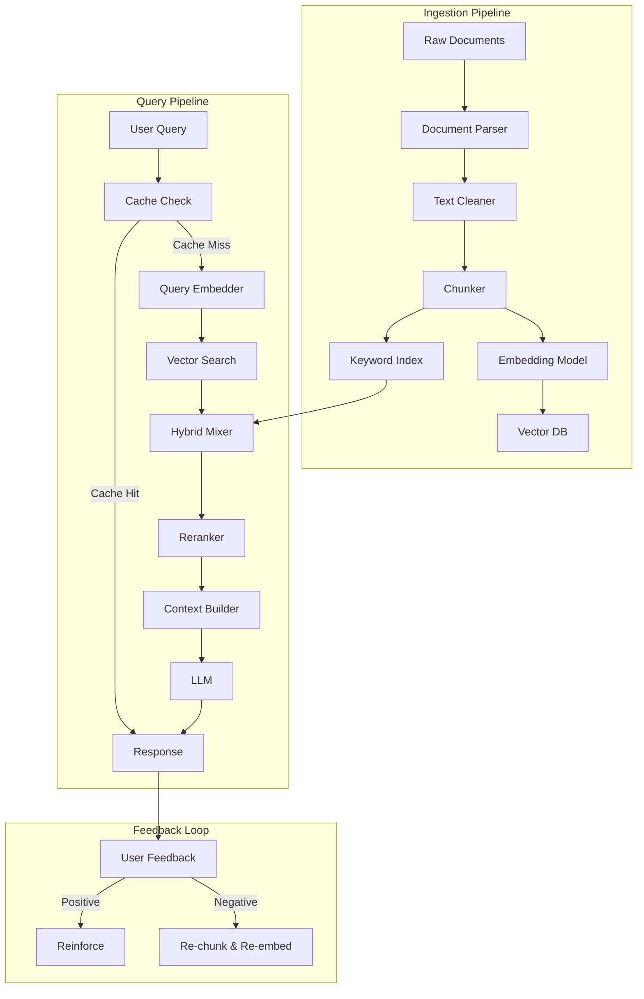
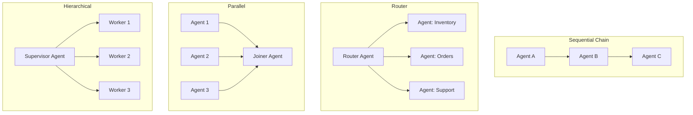
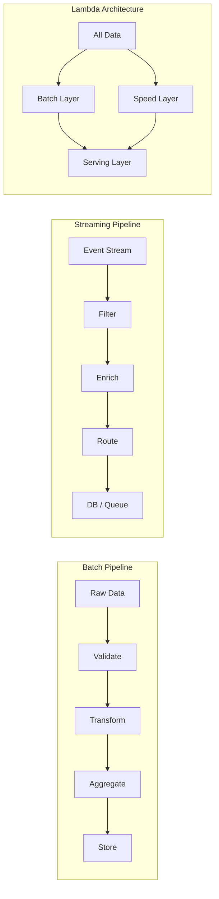
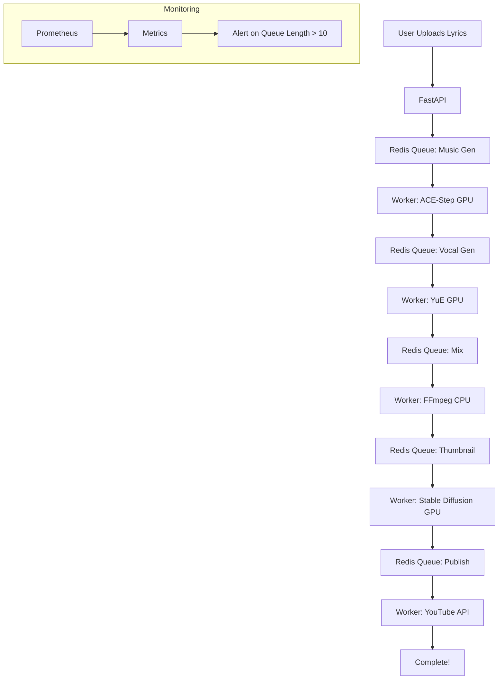
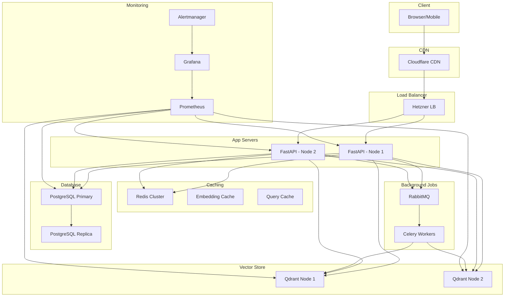

# Week 2 — AI System Design

**Goal:** AI-specific systems design karna seekho — RAG, agents, model serving, LLM APIs, data pipelines

---

## Day 1 — RAG System Design

### Architecture Overview

RAG (Retrieval-Augmented Generation) ka matlab hai: LLM ko sirf uske training data pe rely karne ke bajay, tum apna knowledge base provide karte ho. Laravel developer ke liye analogy — RAG waisa hi hai jaise tum Eloquent model mein `with()` ke saath relationships load karte ho. Sirf LLM ke internal knowledge (model ki weights) pe rely karne ke bajay, tum external data retrieve karke context mein daal dete ho.

```
                         ┌──────────────────┐
                         │   Data Sources    │
                         │  (PDF, Web, DB)   │
                         └────────┬─────────┘
                                  │
                     ┌────────────▼────────────┐
                     │     Ingestion Pipeline   │
                     │  ┌──────┐ ┌──────┐      │
                     │  │Chunk │ │Embed │      │
                     │  │      │ │      │      │
                     │  └──────┘ └──────┘      │
                     │         │               │
                     │    ┌────▼────┐          │
                     │    │  Index  │          │
                     │    │(HNSW)  │          │
                     └────────┬───────────────┘
                              │
                     ┌────────▼────────┐
                     │   Vector DB     │
                     │   (Qdrant)      │
                     └────────┬────────┘
                              │
                     ┌────────▼────────┐
                     │   Query Pipeline │
                     │ Query → Embed → │
                     │ Search → Rerank │
                     │ → LLM → Response│
                     └─────────────────┘
```

### Chunking Strategies — Deep Dive

Laravel mein tum pagination karte ho `->paginate(15)` — same concept hai chunking ka. Lekin yahan tum documents ko chhote-tukdon mein todte ho taaki embedding meaningful rahe aur context window waste na ho.

```python
"""
Chunking strategies with production-ready code and tradeoffs
"""

from typing import List, Optional
import re
from dataclasses import dataclass

@dataclass
class Chunk:
    text: str
    metadata: dict
    chunk_id: str

class FixedSizeChunker:
    """
    Fixed-size chunking — simplest, fastest
    Laravel analogy: str_split($text, 500)
    """
    def __init__(self, chunk_size: int = 512, overlap: int = 50):
        self.chunk_size = chunk_size
        self.overlap = overlap

    def split(self, text: str) -> List[str]:
        chunks = []
        start = 0
        while start < len(text):
            end = start + self.chunk_size
            chunk = text[start:end]
            if chunk:
                chunks.append(chunk)
            start += self.chunk_size - self.overlap
        return chunks


class SemanticChunker:
    """
    Semantic chunking — splits at paragraph/sentence boundaries
    Better for QA quality but slower to process
    """
    def __init__(self, max_chunk_size: int = 1000):
        self.max_chunk_size = max_chunk_size

    def split(self, text: str) -> List[str]:
        # First split by double newline (paragraphs)
        paragraphs = re.split(r'\n\s*\n', text)

        chunks = []
        current_chunk = []

        for para in paragraphs:
            para = para.strip()
            if not para:
                continue

            # Check if adding this para exceeds max size
            proposed = ' '.join(current_chunk + [para])
            if len(proposed.split()) > self.max_chunk_size and current_chunk:
                chunks.append(' '.join(current_chunk))
                current_chunk = [para]
            else:
                current_chunk.append(para)

        if current_chunk:
            chunks.append(' '.join(current_chunk))

        return chunks


class RecursiveCharacterChunker:
    """
    LangChain-style recursive chunking
    Tries different separators in order until size is met
    """
    def __init__(self, chunk_size: int = 1000, chunk_overlap: int = 200):
        self.chunk_size = chunk_size
        self.chunk_overlap = chunk_overlap
        self.separators = ["\n\n", "\n", ".", "!", "?", ",", " ", ""]

    def split(self, text: str) -> List[str]:
        chunks = []
        self._recursive_split(text, self.separators, chunks)
        return chunks

    def _recursive_split(self, text: str, separators: List[str], chunks: List[str]):
        if len(text) <= self.chunk_size:
            chunks.append(text)
            return

        if not separators:
            # No separator works — hard split
            chunks.append(text[:self.chunk_size])
            remaining = text[self.chunk_size - self.chunk_overlap:]
            if remaining:
                self._recursive_split(remaining, separators, chunks)
            return

        separator = separators[0]
        parts = text.split(separator)

        if len(parts) == 1:
            # This separator didn't work, try next
            self._recursive_split(text, separators[1:], chunks)
            return

        current = ""
        for part in parts:
            candidate = current + separator + part if current else part
            if len(candidate) <= self.chunk_size:
                current = candidate
            else:
                if current:
                    chunks.append(current)
                current = part

        if current:
            chunks.append(current)


"""
Chunking Strategy Comparison:

| Strategy         | Quality  | Speed   | Use Case                  |
|-----------------|----------|---------|---------------------------|
| Fixed-size      | Low      | Fast    | Simple search, logs       |
| Semantic        | Medium   | Medium  | Articles, blog posts     |
| Recursive       | High     | Slow    | Books, legal documents   |
| Sentence-based  | High     | Medium  | FAQ, Q&A datasets       |
| Token-aware     | Highest  | Slowest | LLM context optimization |
"""
```

### Embedding Models — Production Deep-Dive

PHP developer mental model: Embedding vector ko tum Laravel serialization ki tarah samajh sakte ho — text ko ek fixed-length numeric array mein convert karna. Har number ek dimension hai jo text ke kisi aspect ko capture karta hai.

```python
"""
Embedding model selection and optimization
"""

embedding_models = {
    "bge-small-en-v1.5": {
        "dims": 384,
        "params": "33M",
        "speed": "Fastest",
        "quality": "Good",
        "use_case": "High-throughput, cost-sensitive",
        "ram_per_1m_vectors": "384 * 4 bytes = ~1.5 GB"
    },
    "bge-base-en-v1.5": {
        "dims": 768,
        "params": "110M",
        "speed": "Medium",
        "quality": "Better",
        "use_case": "Balanced quality/speed",
        "ram_per_1m_vectors": "768 * 4 bytes = ~3 GB"
    },
    "text-embedding-3-small": {
        "dims": 512,
        "params": "API",
        "speed": "API-dependent",
        "quality": "Very Good",
        "use_case": "Production with budget",
        "ram_per_1m_vectors": "512 * 4 bytes = ~2 GB"
    },
    "text-embedding-3-large": {
        "dims": 3072,
        "params": "API",
        "speed": "Slower",
        "quality": "Best",
        "use_case": "Highest accuracy needed",
        "ram_per_1m_vectors": "3072 * 4 bytes = ~12 GB"
    }
}

def select_embedding_model(doc_count: int, qps: int, budget: float) -> str:
    """
    Production embedding model selector

    Example: 1M docs, 50 QPS, $100/month budget
    → bge-small-en-v1.5 (self-hosted, ~$30/month on CPU)
    """
    if qps > 100 or budget < 50:
        return "bge-small-en-v1.5"
    if qps > 20 or budget < 200:
        return "bge-base-en-v1.5"
    if doc_count < 100_000:
        return "text-embedding-3-small"
    return "text-embedding-3-large"


# Batch embedding with progress tracking
class BatchEmbedder:
    """
    Efficient batch embedding with:
    - Automatic batch size tuning
    - GPU → CPU fallback
    - Progress tracking via tqdm
    - Caching layer
    """
    def __init__(self, model, device: str = "cpu", batch_size: int = 32):
        self.model = model
        self.device = device
        self.batch_size = batch_size
        self.stats = {"total": 0, "batches": 0, "failed": 0}

    async def embed_batch(self, texts: List[str]) -> List[List[float]]:
        """
        Embed texts in batches with error handling
        PHP dev note: This is like array_chunk($texts, 32) + parallel processing
        """
        all_embeddings = []
        for i in range(0, len(texts), self.batch_size):
            batch = texts[i:i+self.batch_size]
            try:
                embeddings = await self._embed(batch)
                all_embeddings.extend(embeddings)
                self.stats["batches"] += 1
            except Exception as e:
                self.stats["failed"] += 1
                # Fallback: try smaller batch
                for text in batch:
                    try:
                        emb = await self._embed([text])
                        all_embeddings.extend(emb)
                    except:
                        continue

            self.stats["total"] += len(batch)

        return all_embeddings

    async def _embed(self, batch: List[str]) -> List[List[float]]:
        """Actual embedding call — override for different models"""
        raise NotImplementedError
```

### Retrieval Strategies

```python
"""
Retrieval strategies — production patterns
"""

class RetrievalStrategy:
    """
    Multiple retrieval strategies for different use cases
    Laravel analogy: Different query scopes for different needs
    """

    @staticmethod
    def hybrid_search(query_embedding: List[float],
                      keywords: List[str],
                      alpha: float = 0.7) -> str:
        """
        Hybrid search = Vector search + Keyword search

        alpha=0.7 means 70% weight on vector search, 30% on keyword
        Laravel analogy: mixed with weighted priority
        """
        return f"""
Hybrid Search Configuration:
- Vector weight (alpha): {alpha}
- Keyword weight: {1 - alpha}
- Use when: Keywords + semantics both matter
- Example: "refund policy for electronics" → matches both "refund policy" semantics AND "electronics" keyword
"""

    @staticmethod
    def multi_stage_retrieval(query: str, stages: int = 3) -> str:
        """
        Multi-stage retrieval for production RAG

        Stage 1: Quick keyword pre-filter (reduce 1M → 10K)
        Stage 2: Vector search (10K → 100)
        Stage 3: Rerank (100 → top 5)
        """
        return f"""
Multi-Stage Retrieval Pipeline:

Stage 1 — Keyword Pre-filter:
  Input: 1,000,000 docs → Output: 10,000 docs
  Method: BM25 or Elasticsearch
  Latency: ~50ms
  Goal: Eliminate obviously irrelevant docs fast

Stage 2 — Vector Search:
  Input: 10,000 docs → Output: 100 docs
  Method: HNSW cosine similarity
  Latency: ~100ms
  Goal: Semantic similarity narrowing

Stage 3 — Cross-encoder Rerank:
  Input: 100 docs → Output: 5 docs
  Method: Cross-encoder (e.g. BGE-reranker-v2)
  Latency: ~500ms
  Goal: Precise relevance scoring
  Cost: Highest (100 × cross-encoder calls)
"""

    @staticmethod
    def contextual_retrieval(doc_text: str, context: str) -> str:
        """
        Anthropic's contextual retrieval — add context before each chunk

        Instead of storing raw chunk:
        "the refund policy applies"

        Store contextualized chunk:
        "The customer is inquiring about electronics returns.
         Per store policy: the refund policy applies within 30 days"
        """
        return f"""
Contextual Retrieval Pattern:

Problem: Chunks lose context when isolated
  "he signed the contract" — WHO signed? WHAT contract?

Solution: Prepend context before each chunk
  Context: "John Doe, CEO of Acme Corp, reviewing supplier agreement"
  Chunk: "he signed the contract on June 15" → "John Doe signed the supplier agreement contract on June 15"

Implementation:
  1. For each chunk, ask LLM: "What context explains this chunk?"
  2. Prepend context to chunk before embedding
  3. Store contextualized chunk in vector DB

Production Tip:
  - Context adds 50-100 tokens per chunk
  - +20% storage cost
  - +30-40% retrieval accuracy improvement
"""
```

### Vector DB Selection Guide

```yaml
Vector Database Comparison (2026):

Qdrant:
  - Written in Rust (fast)
  - Best: Production RAG, filtering
  - RAM: High (HNSW in memory)
  - Self-host: $50-200/month (Hetzner)
  - Cloud: From $25/month
  - Strength: Payload filtering, multi-tenancy

Pinecone:
  - Serverless, zero ops
  - Best: Teams without DevOps
  - Cost: $0.10/GB/hour (~$72/month per GB)
  - Limitation: Vendor lock-in
  - Strength: Automatic scaling, managed

Weaviate:
  - Built-in hybrid search (vector + keyword)
  - Best: When you need BM25 + vector combined
  - Self-host: $80-300/month
  - Strength: GraphQL API, hybrid search

ChromaDB:
  - Embedded, simple
  - Best: Development, prototyping
  - Not for: Production (>100K vectors)
  - Strength: Zero configuration

Milvus:
  - Kubernetes-native
  - Best: 10M+ vectors
  - Complex: Needs dedicated ops
  - Strength: GPU acceleration, distributed
```

### Production RAG — Full Query Pipeline

```python
"""
Production RAG Query Pipeline with all optimizations
"""

from dataclasses import dataclass
from typing import List, Optional, Tuple
import time
import asyncio

@dataclass
class RAGQuery:
    text: str
    user_id: str
    session_id: str
    top_k: int = 5
    use_cache: bool = True

@dataclass
class RAGResponse:
    answer: str
    sources: List[dict]
    latency_ms: float
    cache_hit: bool
    tokens_used: int

class RAGPipeline:
    """
    End-to-end optimised RAG query pipeline

    Laravel dev mental model:
    Just like Laravel's middleware pipeline processes a request
    (Validate → Auth → RateLimit → Controller → Response),
    RAG pipeline processes a query through stages:
    (Cache Check → Embed → Retrieve → Rerank → Generate)
    """

    def __init__(self, embedder, vector_store, llm, cache):
        self.embedder = embedder
        self.vector_store = vector_store
        self.llm = llm
        self.cache = cache
        self.stats = {"queries": 0, "cache_hits": 0, "avg_latency": 0}

    async def query(self, query: RAGQuery) -> RAGResponse:
        start = time.time()
        self.stats["queries"] += 1

        # Stage 1: Cache check (skip everything if cached)
        cache_key = f"rag:{hash(query.text)}"
        if query.use_cache:
            cached = await self.cache.get(cache_key)
            if cached:
                self.stats["cache_hits"] += 1
                return RAGResponse(
                    answer=cached["answer"],
                    sources=cached["sources"],
                    latency_ms=(time.time() - start) * 1000,
                    cache_hit=True,
                    tokens_used=0
                )

        # Stage 2: Embed query
        query_embedding = await self.embedder.embed_batch([query.text])

        # Stage 3: Retrieve with filters
        search_params = {
            "vector": query_embedding[0],
            "top_k": query.top_k * 2,  # Retrieve double for reranking
            "filter": {"user_id": query.user_id}  # Multi-tenant filter
        }
        search_results = await self.vector_store.search(**search_params)

        # Stage 4: Rerank with cross-encoder
        reranked = await self._rerank(query.text, search_results)
        top_chunks = reranked[:query.top_k]

        # Stage 5: Build context with source attribution
        context = self._build_context(top_chunks)

        # Stage 6: Generate with LLM
        system_prompt = f"""You are a helpful assistant. Answer based on the provided context.
If the context doesn't contain the answer, say 'I cannot find this in the provided documents.'
Always cite the source document name.

Context:
{context}
"""
        llm_response = await self.llm.complete(
            messages=[
                {"role": "system", "content": system_prompt},
                {"role": "user", "content": query.text}
            ]
        )

        # Cache the response
        if query.use_cache:
            await self.cache.set(
                cache_key,
                {"answer": llm_response, "sources": [c["source"] for c in top_chunks]},
                ttl=3600
            )

        latency = (time.time() - start) * 1000
        self.stats["avg_latency"] = (self.stats["avg_latency"] * (
            self.stats["queries"] - 1) + latency) / self.stats["queries"]

        return RAGResponse(
            answer=llm_response,
            sources=[{"text": c["text"][:200], "source": c["source"]}
                    for c in top_chunks],
            latency_ms=latency,
            cache_hit=False,
            tokens_used=len(context.split()) + len(llm_response.split())
        )

    async def _rerank(self, query: str,
                      results: List[dict]) -> List[dict]:
        """
        Cross-encoder reranking — more accurate than cosine similarity

        PHP mental model: Usort with a custom comparison function
        that's smarter than basic ORDER BY
        """
        # In production, this calls a cross-encoder model
        # which scores query-document pairs more accurately
        scored = []
        for r in results:
            score = self._cross_encoder_score(query, r["text"])
            scored.append((score, r))

        scored.sort(reverse=True, key=lambda x: x[0])
        return [r for _, r in scored]

    def _cross_encoder_score(self, query: str, doc: str) -> float:
        """Simplified cross-encoder — in reality use BGE-reranker"""
        query_words = set(query.lower().split())
        doc_words = set(doc.lower().split())
        overlap = len(query_words & doc_words)
        return overlap / max(len(query_words), 1)

    def _build_context(self, chunks: List[dict]) -> str:
        """Build context string with document references"""
        parts = []
        for i, chunk in enumerate(chunks, 1):
            parts.append(
                f"[Source {i}: {chunk['source']}]\n{chunk['text']}\n"
            )
        return "\n---\n".join(parts)
```

### Mermaid: Complete RAG System



### Scaling Challenges — Expanded

```python
"""
Production RAG scaling challenges with solutions
"""

class RAGScalingGuide:
    """
    Complete scaling guide from 100 to 10M documents
    """

    @staticmethod
    def get_scaling_strategy(doc_count: int, qps: int) -> dict:
        if doc_count < 10_000 and qps < 10:
            return {
                "vector_db": "ChromaDB (single node)",
                "embedding": "API-based (text-embedding-3-small)",
                "chunking": "Fixed-size, 512 tokens",
                "cache": "In-memory dict",
                "hosting": "Single $10 VPS",
                "estimated_cost": "$20-50/month"
            }

        if doc_count < 1_000_000 and qps < 100:
            return {
                "vector_db": "Qdrant (2 nodes, replication)",
                "embedding": "BGE-base-en-v1.5 (self-hosted GPU)",
                "chunking": "Recursive, 1000 tokens",
                "cache": "Redis cluster (3 nodes)",
                "hosting": "3 × $40 Hetzner VPS",
                "estimated_cost": "$150-300/month"
            }

        return {
            "vector_db": "Milvus distributed cluster",
            "embedding": "BGE-large-en-v1.5 (GPU cluster)",
            "chunking": "Semantic + token-aware",
            "cache": "Redis Cluster + CDN for docs",
            "hosting": "Kubernetes (8+ nodes)",
            "estimated_cost": "$1000-5000/month"
        }


"""
Key Scaling Challenges:

1. Index Build Time
   - 1M docs × 100 chunks = 100M embeddings
   - Single GPU: ~100K embeddings/hour → 1000 hours ❌
   - Solution: Parallel ingestion, 4 GPUs → 250 hours
   - Better: Incremental indexing, only new/changed docs

2. Memory for HNSW
   - HNSW keeps entire graph in RAM
   - 10M vectors × 768 dims × 4 bytes = 30 GB just for vectors
   - HNSW overhead: another 20-30 GB
   - Solution: Quantize to INT8 → 15 GB total

3. Query Latency Spikes
   - Cold start: First query loads model → 5-10s
   - Solution: Model pre-loading, keep-warm endpoints
   - Cache warming: Pre-compute popular embeddings

4. Data Freshness
   - New documents not queryable until indexed
   - Solution: Write-through cache (new docs → fast path)
   - Background re-indexing for consistency
"""
```

### Day 1 Exercise — Expanded

```
Document AI for 10K users — Complete capacity plan:

Current: 1000 documents = 100K chunks = 100K vectors

Scale to:
  - 10K users
  - 50K documents
  - 5M vectors
  - Peak QPS: 100

Detailed Capacity Calculation:

1. Vector DB Size:
   - 768 dims × 4 bytes (FP32) = 3,072 bytes per vector
   - 5M × 3,072 = 15.36 GB (vectors only)
   - HNSW overhead: ~1.5x → 23 GB
   - With INT8 quantization: 5M × 768 × 1 = 3.84 GB

2. RAM Estimate:
   - Pure HNSW: 23 GB (fits in 32 GB machine)
   - Quantized HNSW: 6 GB (fits in 8 GB machine)
   - With Redis cache (+2 GB) and app (+1 GB)
   - Total: 32 GB machine or 16 GB with quantization

3. Sharding Strategy:
   - Option A: Content-based shard (by doc category)
   - Option B: Hash-based (consistent hashing, 8 shards)
   - Option C: Time-based (recent docs hot shard)
   - Recommended: Hash-based with 4 shards, replication factor 2

4. Cache Strategy:
   - Embedding cache: 30% hit ratio → saves 30% embedding calls
   - Response cache: 25% hit ratio → saves 25% LLM calls
   - Popular docs pre-cache: Additional 15% savings

5. Cost Estimate:
   Self-hosted (Hetzner):
   - 2 × CX52 (32GB, 8 vCPU) = ~$80
   - PostgreSQL (1 × CX32) = ~$25
   - Redis (1 × CX22) = ~$15
   - Total: ~$120/month

   Qdrant Cloud:
   - 2 nodes × 32GB = $200/month
   - + API calls = $50/month
   - Total: ~$250/month

Recommendation: Self-host with INT8 quantization = $120/month
```

---

## Day 2 — Agent System Design

### Agent Architecture — Deep Theory

Agent systems AI engineering ka sabse advanced topic hai. Ek agent ek LLM-powered loop hai jo:
1. **Perceive** — Input leta hai (user message, tool output)
2. **Think** — Decide karta hai agla step kya hai
3. **Act** — Tool call karta hai ya response deta hai
4. **Observe** — Tool result dekhta hai
5. **Loop** — Repeat until task complete

```python
"""
Production Multi-Agent System Architecture — Full Implementation
"""

from typing import List, Dict, Any, Callable, Optional
import asyncio
from datetime import datetime
import logging
from enum import Enum

logger = logging.getLogger(__name__)


class AgentStatus(Enum):
    IDLE = "idle"
    RUNNING = "running"
    WAITING = "waiting"
    ERROR = "error"
    COMPLETED = "completed"


class BaseTool:
    """
    Base class for all agent tools
    Laravel analogy: A Laravel job class with handle() method
    """
    def __init__(self, name: str, description: str):
        self.name = name
        self.description = description
        self.usage_count = 0

    async def execute(self, **kwargs) -> dict:
        self.usage_count += 1
        raise NotImplementedError

    def to_openai_format(self) -> dict:
        """Convert to OpenAI function calling format"""
        return {
            "type": "function",
            "function": {
                "name": self.name,
                "description": self.description,
                "parameters": self.get_parameters()
            }
        }

    def get_parameters(self) -> dict:
        return {"type": "object", "properties": {}}


class AgentConfig:
    """
    Agent configuration with sensible defaults
    """
    def __init__(
        self,
        name: str,
        system_prompt: str,
        tools: List[BaseTool],
        max_steps: int = 25,
        max_timeout: int = 60,
        model: str = "gpt-4o-mini",
        memory_type: str = "sliding_window",
        memory_window: int = 20
    ):
        self.name = name
        self.system_prompt = system_prompt
        self.tools = tools
        self.max_steps = max_steps
        self.max_timeout = max_timeout
        self.model = model
        self.memory_type = memory_type
        self.memory_window = memory_window


class Agent:
    """
    Single agent instance with full lifecycle management
    """

    def __init__(self, config: AgentConfig, llm_provider):
        self.config = config
        self.llm = llm_provider
        self.memory = []
        self.status = AgentStatus.IDLE
        self.step_count = 0
        self.start_time = None
        self.tool_map = {t.name: t for t in config.tools}

    async def run(self, task: str) -> dict:
        """
        Main agent loop — perceive, think, act, observe

        PHP dev mental model:
        This is like a Laravel command that loops:
        while(!$task->isComplete()) {
            $thought = $this->llm->think($task, $tools);
            $result = $thought->execute();
            $task->update($result);
        }
        """
        self.status = AgentStatus.RUNNING
        self.start_time = datetime.now()
        self.step_count = 0
        self.memory = [{"role": "system", "content": self.config.system_prompt}]
        self.memory.append({"role": "user", "content": task})

        while self.step_count < self.config.max_steps:
            self.step_count += 1

            # Check timeout
            elapsed = (datetime.now() - self.start_time).total_seconds()
            if elapsed > self.config.max_timeout:
                return {
                    "status": "timeout",
                    "steps": self.step_count,
                    "partial_response": self._get_last_response(),
                    "error": "Max timeout exceeded"
                }

            # THINK: LLM decides next action
            response = await self.llm.complete(
                messages=self.memory,
                tools=[t.to_openai_format() for t in self.config.tools],
                tool_choice="auto"
            )

            message = response.choices[0].message

            # ACT: Execute tool calls or return final response
            if message.tool_calls:
                for tool_call in message.tool_calls:
                    tool = self.tool_map.get(tool_call.function.name)
                    if not tool:
                        continue

                    # Execute tool
                    try:
                        result = await tool.execute(
                            **json.loads(tool_call.function.arguments)
                        )
                    except Exception as e:
                        result = {"error": str(e)}
                        logger.error(f"Tool {tool.name} failed: {e}")

                    # OBSERVE: Add tool result to memory
                    self.memory.append({
                        "role": "assistant",
                        "content": None,
                        "tool_calls": [tool_call]
                    })
                    self.memory.append({
                        "role": "tool",
                        "tool_call_id": tool_call.id,
                        "content": json.dumps(result)
                    })

                    # Manage memory window (prevent context overflow)
                    self._trim_memory()

            else:
                # Final response
                self.status = AgentStatus.COMPLETED
                return {
                    "status": "completed",
                    "response": message.content,
                    "steps": self.step_count,
                    "duration_s": elapsed,
                    "tool_calls": [t.name for t in self.config.tools
                                   if t.usage_count > 0]
                }

        self.status = AgentStatus.COMPLETED
        return {
            "status": "max_steps_reached",
            "response": self._get_last_response(),
            "steps": self.step_count
        }

    def _trim_memory(self):
        """Keep memory within window size"""
        if len(self.memory) > self.config.memory_window:
            # Keep system prompt, remove oldest messages
            system = [m for m in self.memory
                      if m["role"] == "system"]
            others = [m for m in self.memory
                      if m["role"] != "system"]
            self.memory = system + others[-self.config.memory_window:]

    def _get_last_response(self) -> Optional[str]:
        for m in reversed(self.memory):
            if m["role"] == "assistant" and m.get("content"):
                return m["content"]
        return None


class AgentOrchestrator:
    """
    Multi-agent orchestration with:
    - Agent pooling
    - Task queuing
    - Parallel execution
    - Error recovery
    - Monitoring
    """

    def __init__(self, llm_provider):
        self.llm = llm_provider
        self.agents: Dict[str, AgentConfig] = {}
        self.active_agents: Dict[str, Agent] = {}
        self.task_queue = asyncio.Queue()
        self.max_concurrent = 50
        self.semaphore = asyncio.Semaphore(50)

    def register_agent_type(self, name: str, config: AgentConfig):
        """Register an agent type (like registering a Laravel service)"""
        self.agents[name] = config

    async def dispatch(self, agent_type: str, task: str,
                       user_id: str) -> str:
        """
        Dispatch a task to an agent type
        Returns task_id for tracking
        """
        config = self.agents.get(agent_type)
        if not config:
            raise ValueError(f"Unknown agent type: {agent_type}")

        task_id = f"{agent_type}_{datetime.now().timestamp()}_{user_id}"

        await self.task_queue.put({
            "task_id": task_id,
            "agent_type": agent_type,
            "config": config,
            "task": task,
            "user_id": user_id
        })

        # Try to process immediately if capacity available
        asyncio.create_task(self._process_queue())

        return task_id

    async def _process_queue(self):
        """Process queued tasks with concurrency limit"""
        while not self.task_queue.empty():
            async with self.semaphore:
                task_info = await self.task_queue.get()

                agent = Agent(task_info["config"], self.llm)
                self.active_agents[task_info["task_id"]] = agent

                try:
                    result = await agent.run(task_info["task"])
                    return result
                except Exception as e:
                    logger.error(f"Agent {task_info['task_id']} failed: {e}")
                    return {"status": "error", "error": str(e)}
                finally:
                    self.active_agents.pop(task_info["task_id"], None)
```

### Agent Topologies — Which One To Use?



```
Agent Topology Selection Guide:

Sequential Chain:
  Use: Steps must be in order (validate → process → store)
  Pros: Simple, predictable
  Cons: Slow (serial), single point of failure
  Example: Data processing pipeline

Router:
  Use: Different tasks need different agents
  Pros: Efficient routing, specialized agents
  Cons: Router is bottleneck, SPOF
  Example: Customer support (billing / tech / sales)

Parallel:
  Use: Independent sub-tasks
  Pros: Fast, parallel execution
  Cons: Complex result merging
  Example: Research agents searching different sources

Hierarchical:
  Use: Complex task decomposition
  Pros: Scalable, organized
  Cons: Latency (manager overhead)
  Example: Software development (PM → Dev → QA → Deploy)

ApexERP uses: Router + Parallel hybrid
  - Router agent classifies request
  - Relevant agents execute in parallel
  - Synthesizer merges results
```

### Memory Management — Production Deep-Dive

```python
"""
Agent Memory Systems — Production Implementation
"""

class AgentMemory:
    """
    Multi-tier agent memory system

    Laravel dev mental model:
    Just like Laravel has multiple cache drivers
    (file, redis, database), agents need multiple memory types
    for different time horizons.
    """

    def __init__(self, redis_client, vector_store, postgres_pool):
        self.short_term = ShortTermMemory(redis_client)
        self.long_term = LongTermMemory(postgres_pool)
        self.episodic = EpisodicMemory(vector_store)
        self.working = WorkingMemory()

    async def remember(self, key: str) -> dict:
        """Retrieve from best available memory tier"""
        # Check working memory first (fastest)
        result = self.working.get(key)
        if result:
            return {"source": "working", "data": result}

        # Check short-term (Redis, ~1ms)
        result = await self.short_term.get(key)
        if result:
            return {"source": "short_term", "data": result}

        # Check episodic (vector search, ~50ms)
        result = await self.episodic.search(key)
        if result:
            return {"source": "episodic", "data": result}

        # Check long-term (PostgreSQL, ~10ms)
        result = await self.long_term.get(key)
        if result:
            return {"source": "long_term", "data": result}

        return {"source": "none", "data": None}

    async def store(self, key: str, data: dict, tier: str = "all"):
        """Store across one or all tiers"""
        if tier in ("all", "working"):
            self.working.set(key, data)
        if tier in ("all", "short_term"):
            await self.short_term.set(key, data, ttl=86400)  # 24h
        if tier in ("all", "long_term"):
            await self.long_term.set(key, data)  # Permanent
        if tier in ("all", "episodic"):
            await self.episodic.store(key, data)


class ShortTermMemory:
    """Redis-based sliding window memory"""
    def __init__(self, redis_client, window_size: int = 20):
        self.redis = redis_client
        self.window_size = window_size

    async def get(self, key: str) -> Optional[str]:
        return await self.redis.get(f"mem:st:{key}")

    async def set(self, key: str, value: str, ttl: int = 86400):
        await self.redis.setex(f"mem:st:{key}", ttl, value)


class LongTermMemory:
    """PostgreSQL-based permanent memory"""
    def __init__(self, pool):
        self.pool = pool

    async def get(self, key: str) -> Optional[str]:
        async with self.pool.acquire() as conn:
            row = await conn.fetchrow(
                "SELECT data FROM agent_memory WHERE key = $1",
                key
            )
            return row["data"] if row else None

    async def set(self, key: str, data: str):
        async with self.pool.acquire() as conn:
            await conn.execute(
                """INSERT INTO agent_memory (key, data, created_at)
                   VALUES ($1, $2, NOW())
                   ON CONFLICT (key) DO UPDATE SET data = $2""",
                key, data
            )


class WorkingMemory:
    """In-memory dict for current run (fastest, volatile)"""
    def __init__(self):
        self.data = {}

    def get(self, key: str) -> Optional[str]:
        return self.data.get(key)

    def set(self, key: str, value: str):
        self.data[key] = value
```

### Agent Monitoring & Observability

```python
"""
Agent monitoring — track everything your agents do
"""

from dataclasses import dataclass, field
from datetime import datetime
from typing import List

@dataclass
class AgentTrace:
    """Full trace of a single agent run"""
    agent_id: str
    agent_type: str
    task: str
    start_time: datetime
    end_time: Optional[datetime] = None
    steps: List[dict] = field(default_factory=list)
    total_tokens: int = 0
    total_cost: float = 0.0
    status: str = "running"

    def add_step(self, step_type: str, duration_ms: float,
                 tokens: int, cost: float, success: bool):
        self.steps.append({
            "type": step_type,
            "duration_ms": duration_ms,
            "tokens": tokens,
            "cost": cost,
            "success": success,
            "timestamp": datetime.now().isoformat()
        })
        self.total_tokens += tokens
        self.total_cost += cost

    def complete(self):
        self.end_time = datetime.now()
        self.status = "completed"

    def summary(self) -> str:
        duration = (self.end_time - self.start_time).total_seconds()
        return (
            f"Agent: {self.agent_type} ({self.agent_id})\n"
            f"Duration: {duration:.1f}s\n"
            f"Steps: {len(self.steps)}\n"
            f"Tokens: {self.total_tokens}\n"
            f"Cost: ${self.total_cost:.4f}\n"
            f"Status: {self.status}"
        )


class AgentMonitor:
    """
    Centralized agent monitoring with metrics export

    Laravel analogy: Laravel Telescope for your agents
    """
    def __init__(self, redis_client):
        self.redis = redis_client
        self.active_traces: Dict[str, AgentTrace] = {}

    async def start_trace(self, agent_type: str, task: str) -> str:
        trace = AgentTrace(
            agent_id=f"{agent_type}_{int(datetime.now().timestamp())}",
            agent_type=agent_type,
            task=task[:100],
            start_time=datetime.now()
        )
        self.active_traces[trace.agent_id] = trace
        return trace.agent_id

    async def end_trace(self, agent_id: str):
        trace = self.active_traces.get(agent_id)
        if trace:
            trace.complete()
            await self._store_trace(trace)
            del self.active_traces[agent_id]

    async def _store_trace(self, trace: AgentTrace):
        """Store trace in Redis for dashboard"""
        await self.redis.lpush(
            "agent:traces",
            json.dumps({
                "agent_id": trace.agent_id,
                "agent_type": trace.agent_type,
                "duration_s": (trace.end_time - trace.start_time).total_seconds(),
                "steps": len(trace.steps),
                "tokens": trace.total_tokens,
                "cost": trace.total_cost,
                "status": trace.status,
                "task": trace.task
            })
        )
        # Keep only last 1000 traces
        await self.redis.ltrim("agent:traces", 0, 999)
```

### Day 2 Exercise — Expanded

```
ApexERP Multi-Agent scaling design — Full Solution:

Current: 5 agents, 10 users
Scale: 50 agents, 500 users (50 businesses × 10 employees)

Design Solution:

1. Agent Queue Strategy:
   - Priority queue (CRITICAL > NORMAL > BACKGROUND)
   - Max 10 concurrent agents per business
   - Global max: 50 parallel agents
   - Overflow → RabbitMQ queue → delayed processing
   - Queue depth monitoring at 80% → auto-scale

2. Memory Isolation:
   - Per-business namespace in PostgreSQL (schema per tenant)
   - Per-user isolation in vector DB (payload filter: business_id)
   - No cross-tenant memory leak
   - TTL: 24h short-term, 90d long-term

3. Rate Limiting:
   - Per business: 20 LLM calls/minute
   - Per user: 5 tool calls/minute
   - Global: 1000 LLM calls/minute
   - Burst: 2x for 10 seconds, then throttle

4. Error Recovery:
   - OpenAI down → Anthropic fallback (automatic)
   - Both down → Local model (Mistral 7B via Ollama)
   - Queue requests with status "pending"
   - Webhook notify admin when all providers fail

5. Cost Estimate:
   - 500 users × 50 queries/day = 25,000 queries/day
   - 25,000 × 700 tokens × $0.15/1M = $2.62/day (input)
   - 25,000 × 200 tokens × $0.60/1M = $3.00/day (output)
   - Daily: ~$5.62 → Monthly: ~$168
   - + $50 hosting + $30 vector DB = ~$250/month

Production Tip: Start with 3 OpenAI API keys rotating.
Monitor cost-per-agent weekly. Kill agents that cost > $5/day.
```

---

## Day 3 — Model Serving

### GPU vs CPU Inference — Deep Dive

```python
"""
Model serving decision framework with cost analysis
"""

class ModelServingDecision:
    """
    Decide CPU vs GPU based on concrete numbers

    PHP dev mental model:
    CPU = Shared hosting (slow but cheap)
    GPU = Dedicated server (fast but expensive)
    """

    @staticmethod
    def analyze( model_params: int, req_per_sec: int,
                 latency_target_ms: int, budget_monthly: float) -> dict:

        # Estimate VRAM needed
        vram_fp32 = model_params * 4  # 4 bytes per param
        vram_fp16 = model_params * 2
        vram_int8 = model_params * 1

        # Estimate performance
        cpu_latency = 50 + (model_params / 1e9) * 200  # ms
        gpu_latency = 20 + (model_params / 1e9) * 50   # ms

        # Estimate cost
        cpu_monthly = 30 + (req_per_sec / 10) * 10      # $ approximation
        gpu_monthly = 100 + (model_params / 1e9) * 50    # $ approximation

        return {
            "vram_needed": {
                "fp32": f"{vram_fp32 / 1e9:.1f} GB",
                "fp16": f"{vram_fp16 / 1e9:.1f} GB",
                "int8": f"{vram_int8 / 1e9:.1f} GB"
            },
            "estimated_latency": {
                "cpu": f"{cpu_latency:.0f}ms",
                "gpu": f"{gpu_latency:.0f}ms"
            },
            "estimated_cost": {
                "cpu": f"${cpu_monthly:.0f}/month",
                "gpu": f"${gpu_monthly:.0f}/month"
            },
            "recommendation": (
                "GPU" if req_per_sec > 20 or
                model_params > 7_000_000_000
                else "CPU"
            ),
            "can_meet_target": gpu_latency <= latency_target_ms
        }


# Example usage
decision = ModelServingDecision.analyze(
    model_params=7_000_000_000,  # 7B model
    req_per_sec=50,
    latency_target_ms=200,
    budget_monthly=500
)

print(f"Recommendation: {decision['recommendation']}")
```

### Batching Strategies — Deep Theory

```python
"""
Complete batching strategies for model inference
"""

class ContinuousBatching:
    """
    Continuous batching — vLLM's secret sauce

    Traditional batching:
    Wait for N requests → batch → process → respond
    Problem: First request waits for batch to fill

    Continuous batching:
    Process requests as they arrive
    When a request finishes generating, insert new one
    No waiting! Much higher throughput
    """

    def __init__(self, model, max_batch_size: int = 32):
        self.model = model
        self.max_batch_size = max_batch_size
        self.active_requests = []
        self.scheduler = asyncio.create_task(self._schedule())

    async def add_request(self, prompt: str, request_id: str):
        """Add request to running batch"""
        event = asyncio.Event()
        self.active_requests.append({
            "id": request_id,
            "prompt": prompt,
            "event": event,
            "result": None,
            "tokens_generated": 0,
            "finished": False
        })
        await event.wait()
        return self.active_requests[-1]["result"]

    async def _schedule(self):
        """Main scheduling loop — runs continuously"""
        while True:
            if not self.active_requests:
                await asyncio.sleep(0.001)
                continue

            # Get requests pending processing
            pending = [r for r in self.active_requests
                      if not r["finished"]]

            if not pending:
                await asyncio.sleep(0.001)
                continue

            # Batch process pending (limit to max_batch_size)
            batch = pending[:self.max_batch_size]
            prompts = [r["prompt"] for r in batch]

            # Single forward pass for entire batch
            outputs = self.model.generate_batch(prompts)

            for req, output in zip(batch, outputs):
                req["result"] = output
                req["finished"] = True
                req["event"].set()

            # Remove finished requests
            self.active_requests = [
                r for r in self.active_requests if not r["finished"]
            ]

            # Yield to event loop
            await asyncio.sleep(0)


class DynamicBatching:
    """
    Dynamic batching with timeout-based collection

    Strategy: Collect requests for max 100ms, then process batch
    """

    def __init__(self, model, max_batch_size=32, max_delay_ms=100):
        self.model = model
        self.max_batch_size = max_batch_size
        self.max_delay_ms = max_delay_ms
        self.batch_queue = []
        self.lock = asyncio.Lock()

    async def predict(self, input_data: dict) -> dict:
        """Submit for batch inference — returns future result"""
        future = asyncio.Future()

        async with self.lock:
            self.batch_queue.append((input_data, future))
            should_flush = len(self.batch_queue) >= self.max_batch_size

        if should_flush:
            asyncio.create_task(self._flush())

        return await future

    async def _flush(self):
        """Process current batch"""
        async with self.lock:
            batch = self.batch_queue[:self.max_batch_size]
            self.batch_queue = self.batch_queue[self.max_batch_size:]

        if not batch:
            return

        inputs = [b[0] for b in batch]
        futures = [b[1] for b in batch]

        try:
            # Batch inference
            results = self.model.batch_predict(inputs)
            for future, result in zip(futures, results):
                future.set_result(result)
        except Exception as e:
            for future in futures:
                future.set_exception(e)
```

### Quantization — Production Guide

```python
"""
Quantization strategies for production model serving
"""

class QuantizationGuide:
    """
    When to use which quantization level
    """

    GUIDELINES = {
        "fp32": {
            "use_when": "Highest accuracy needed, enough VRAM",
            "vram_7b": "28 GB",
            "vram_70b": "280 GB",
            "speed": "1x (baseline)",
            "quality_loss": "None"
        },
        "fp16": {
            "use_when": "Standard production, balances quality/speed",
            "vram_7b": "14 GB",
            "vram_70b": "140 GB",
            "speed": "1.5x",
            "quality_loss": "Negligible"
        },
        "int8": {
            "use_when": "Cost-sensitive, minimal quality loss acceptable",
            "vram_7b": "7 GB",
            "vram_70b": "70 GB",
            "speed": "2x",
            "quality_loss": "~1-2% on benchmarks"
        },
        "int4": {
            "use_when": "Edge deployment, very tight memory",
            "vram_7b": "3.5 GB",
            "vram_70b": "35 GB",
            "speed": "3x",
            "quality_loss": "~3-5% on benchmarks"
        }
    }

    @staticmethod
    def recommend(vram_available: int, quality_requirement: str) -> str:
        """
        Recommend quantization based on constraints

        Example:
          vram=8GB, quality=high → int8 (7B model fits in 7GB)
          vram=24GB, quality=max → fp16 (14GB for 7B, room for KV cache)
        """
        if quality_requirement == "maximum" and vram_available >= 28:
            return "fp32"
        if quality_requirement == "high" and vram_available >= 14:
            return "fp16"
        if quality_requirement == "good" and vram_available >= 7:
            return "int8"
        if vram_available >= 3.5:
            return "int4"
        return "Cannot fit — use smaller model or increase VRAM"


# Quantization tools comparison
quantization_tools = {
    "llama.cpp (GGUF)": {
        "format": "GGUF",
        "best_for": "Local inference, CPU + GPU hybrid",
        "levels": "Q2_K to Q8_0 (10 variants)",
        "ecosystem": "ollama, text-generation-webui",
        "ease": "Easy"
    },
    "ONNX Runtime": {
        "format": "ONNX",
        "best_for": "Cross-platform, production serving",
        "levels": "FP32, FP16, INT8, INT4 via ORT DML",
        "ecosystem": "Azure, Windows ML",
        "ease": "Medium"
    },
    "TensorRT": {
        "format": "TRT engine",
        "best_for": "NVIDIA GPU max performance",
        "levels": "FP32, FP16, INT8",
        "ecosystem": "NVIDIA ecosystem only",
        "ease": "Hard"
    },
    "AWQ": {
        "format": "AWQ (weight-only)",
        "best_for": "GPU inference, INT4 intensive",
        "levels": "INT4 only",
        "ecosystem": "vLLM, TGI, AutoAWQ",
        "ease": "Medium"
    },
    "GPTQ": {
        "format": "GPTQ",
        "best_for": "GPU inference, INT4",
        "levels": "INT4 (2-8bit group size variants)",
        "ecosystem": "vLLM, ExLlama, TGI",
        "ease": "Medium"
    }
}
```

### Model Serving Frameworks — Comparison

```yaml
Serving Framework Comparison (2026):

vLLM:
  - Best for: OpenAI-compatible API, high throughput
  - Key feature: PagedAttention + continuous batching
  - Throughput: ~3000 tokens/s on 1× A100 (Llama 7B)
  - Ease: Easy (pip install + CLI)
  - Monitoring: Built-in Prometheus metrics
  - Use: Production LLM serving

Text Generation Inference (TGI):
  - Best for: HuggingFace ecosystem
  - Key feature: Message API, watermarking
  - Throughput: ~2500 tokens/s on 1× A100
  - Ease: Easy (Docker)
  - Monitoring: Prometheus + Grafana dashboard
  - Use: HuggingFace model deployment

Ollama:
  - Best for: Local development, personal use
  - Key feature: Simple CLI, model pull
  - Throughput: ~500 tokens/s (CPU or single GPU)
  - Ease: Easiest (one command)
  - Monitoring: Minimal
  - Use: Development, testing, personal projects

TensorRT-LLM:
  - Best for: Maximum NVIDIA GPU performance
  - Key feature: In-flight batching, speculative decoding
  - Throughput: ~4000 tokens/s on 1× A100
  - Ease: Hard (needs compilation)
  - Monitoring: NVIDIA DCGM
  - Use: Enterprise, max throughput

LocalAI:
  - Best for: OpenAI API drop-in replacement
  - Key feature: Multi-backend (llama.cpp, whisper, stable-diffusion)
  - Throughput: Varies by backend
  - Ease: Medium (Docker)
  - Use: All-in-one AI serving
```

### Day 3 Exercise — Expanded

```
Your Document AI needs model serving for embeddings.

Current setup:
  - BAAI/bge-small-en-v1.5 (384 dims, ~33M params)
  - Running on CPU
  - 100 requests/day

Scale to:
  - 10K requests/day
  - Peak: 50 concurrent
  - <200ms latency

Complete Analysis:

1. GPU Shift Karna Chahiye?
   - Current: CPU = ~50ms per embedding = 50 × 50 = 2.5s for 50 concurrent
   - GPU: ~5ms per embedding = 5 × 50 = 250ms for 50 concurrent
   - Decision: NO, CPU is enough for 33M param model
   - Scaling rule: <100M params on CPU is fine

2. Batch Size?
   - Optimal: 32-64 (max GPU utilization without OOM)
   - For CPU: 16-32 (memory bandwidth bottleneck)
   - Formula: batch_size = min(concurrent_users, optimal_for_model)
   - Production tip: Start with 32, monitor memory, adjust

3. Quantization (INT8)?
   - bge-small: 33M params × 4 bytes = 132 MB (FP32)
   - INT8: 33M params × 1 byte = 33 MB
   - Speed gain: ~2x faster with INT8
   - Quality loss: <1% on retrieval benchmarks
   - Decision: YES — INT8 is no-brainer for embeddings

4. ONNX Export?
   - Benefits: Cross-platform, 2x faster inference
   - Cost: 1-time export effort (2-3 hours)
   - Decision: YES for production, NO for prototype

5. Cost Comparison:
   CPU (current): $0/month (shared server) → $15/month upgrade
   GPU (cheapest): T4 ($0.35/hr) = ~$250/month full-time
   Decision: Stay CPU for now, upgrade when >50K requests/day

Summary: INT8 quantization + ONNX export on CPU = <100ms latency, $15/month
```

---

## Day 4 — LLM API Architecture

### Architecture Design — Full Production System

```python
"""
Production-grade LLM API architecture with all enterprise features
"""

from openai import AsyncOpenAI, APIError, RateLimitError, APIConnectionError
from anthropic import AsyncAnthropic
import asyncio
from typing import List, Optional, Dict, Tuple
import time
import json
from datetime import datetime, timedelta
import logging

logger = logging.getLogger(__name__)


class LLMProvider:
    """
    Base LLM provider with comprehensive error handling

    Laravel dev mental model:
    This is like having multiple mail drivers (SMTP, Mailgun, SES)
    and a fallback chain if primary fails.
    """

    def __init__(self, api_key: str, model: str,
                 provider: str = "openai",
                 rpm: int = 500,
                 tpm: int = 100000):
        self.model = model
        self.provider = provider
        self.rpm = rpm
        self.tpm = tpm

        if provider == "openai":
            self.client = AsyncOpenAI(api_key=api_key, timeout=30)
        elif provider == "anthropic":
            self.client = AsyncAnthropic(api_key=api_key, timeout=30)
        else:
            raise ValueError(f"Unknown provider: {provider}")

        # Rate limit tracking
        self.request_times: List[float] = []
        self.token_counts: List[Tuple[float, int]] = []
        self.consecutive_failures = 0
        self.circuit_open_until = 0

    async def complete(self, messages: List[dict],
                       temperature: float = 0.7,
                       max_tokens: int = 1024) -> str:
        """
        Complete with full error handling, rate limiting, and circuit breaker
        """

        # Circuit breaker check
        if self._is_circuit_open():
            raise CircuitBreakerOpenError(
                f"Circuit breaker open for {self.model} until "
                f"{datetime.fromtimestamp(self.circuit_open_until)}"
            )

        # Rate limit wait
        await self._wait_for_capacity()

        # Actual API call with retries
        last_error = None
        for attempt in range(4):  # 4 retries with exponential backoff
            try:
                start = time.time()
                response = await self._make_api_call(messages,
                                                     temperature,
                                                     max_tokens)
                latency = (time.time() - start) * 1000

                # Track metrics
                self.request_times.append(time.time())
                self.consecutive_failures = 0

                return {
                    "response": response,
                    "model": self.model,
                    "latency_ms": latency,
                    "provider": self.provider
                }

            except RateLimitError as e:
                wait = min(2 ** attempt * 2, 60)  # max 60s wait
                logger.warning(
                    f"Rate limited on {self.model}. "
                    f"Attempt {attempt + 1}, waiting {wait}s"
                )
                await asyncio.sleep(wait)
                last_error = e

            except APIConnectionError as e:
                wait = 2 ** attempt + 1
                logger.error(
                    f"Connection error on {self.model}: {e}"
                )
                await asyncio.sleep(wait)
                last_error = e

            except APIError as e:
                if e.status_code and 500 <= e.status_code < 600:
                    # Server error — retry
                    wait = 2 ** attempt + 1
                    await asyncio.sleep(wait)
                else:
                    # Client error — don't retry
                    raise
                last_error = e

        # All retries exhausted
        self.consecutive_failures += 1
        if self.consecutive_failures >= 5:
            self._open_circuit()

        raise last_error or Exception("Max retries exceeded")

    async def _make_api_call(self, messages, temperature,
                              max_tokens) -> str:
        """Actual API call — different per provider"""
        if self.provider == "openai":
            response = await self.client.chat.completions.create(
                model=self.model,
                messages=messages,
                temperature=temperature,
                max_tokens=max_tokens
            )
            return response.choices[0].message.content

        elif self.provider == "anthropic":
            response = await self.client.messages.create(
                model=self.model,
                messages=messages,
                temperature=temperature,
                max_tokens=max_tokens
            )
            return response.content[0].text

    async def _wait_for_capacity(self):
        """Wait until within rate limits (RPM and TPM)"""
        now = time.time()

        # Clean old request times (last 60 seconds)
        self.request_times = [
            t for t in self.request_times if t > now - 60
        ]

        # Wait if at RPM limit
        while len(self.request_times) >= self.rpm:
            await asyncio.sleep(0.5)
            now = time.time()
            self.request_times = [
                t for t in self.request_times if t > now - 60
            ]

    def _is_circuit_open(self) -> bool:
        return time.time() < self.circuit_open_until

    def _open_circuit(self, duration: int = 300):
        """Open circuit breaker for 5 minutes"""
        self.circuit_open_until = time.time() + duration
        logger.error(f"Circuit breaker opened for {self.model} "
                     f"for {duration}s")


class CircuitBreakerOpenError(Exception):
    pass


class LLMRouter:
    """
    Advanced LLM router with:
    - Multiple providers
    - Automatic fallback
    - Circuit breaker
    - Cost tracking
    - Latency-based routing
    - Semantic caching
    """

    def __init__(self, config: dict):
        self.providers: Dict[str, LLMProvider] = {}
        self.semantic_cache = SemanticCache()
        self.cost_tracker = CostTracker()
        self.stats = {
            "total_requests": 0,
            "cache_hits": 0,
            "fallbacks": 0,
            "errors": 0
        }

        # Initialize providers from config
        for name, cfg in config.get("providers", {}).items():
            self.providers[name] = LLMProvider(
                api_key=cfg["api_key"],
                model=cfg["model"],
                provider=cfg.get("provider", "openai"),
                rpm=cfg.get("rpm", 500)
            )

    async def route(self, messages: List[dict],
                    preferred: str = "primary",
                    use_cache: bool = True) -> dict:
        """
        Route with intelligent fallback strategy

        Strategy:
        1. Check semantic cache (if enabled)
        2. Try preferred provider
        3. Fallback through provider chain
        4. All failed → return error
        """
        self.stats["total_requests"] += 1

        # Extract query text for caching
        query_text = messages[-1]["content"] if messages else ""

        # Stage 1: Semantic cache check
        if use_cache:
            cached = await self.semantic_cache.get(query_text)
            if cached:
                self.stats["cache_hits"] += 1
                return {
                    "response": cached,
                    "cached": True,
                    "provider": "cache",
                    "latency_ms": 1
                }

        # Stage 2: Try providers in priority order
        provider_order = [preferred, "fallback", "cheap"]
        errors = []

        for provider_name in provider_order:
            provider = self.providers.get(provider_name)
            if not provider:
                continue

            try:
                result = await provider.complete(messages)

                # Track cost
                self.cost_tracker.track(
                    model=provider.model,
                    input_tokens=result.get("input_tokens", 0),
                    output_tokens=result.get("output_tokens", 0)
                )

                # Cache successful response
                if use_cache:
                    await self.semantic_cache.set(query_text,
                                                  result["response"])

                return {
                    "response": result["response"],
                    "cached": False,
                    "provider": provider_name,
                    "model": provider.model,
                    "latency_ms": result["latency_ms"]
                }

            except CircuitBreakerOpenError as e:
                self.stats["fallbacks"] += 1
                errors.append(str(e))
                continue

            except Exception as e:
                self.stats["fallbacks"] += 1
                errors.append(str(e))
                continue

        # Stage 3: All providers failed
        self.stats["errors"] += 1
        return {
            "error": "All providers failed",
            "errors": errors,
            "provider": None
        }


class SemanticCache:
    """
    Semantic cache — caches responses for semantically similar queries
    Not just exact match, but similar meaning too!

    Laravel analogy: Like Laravel's cache but smarter —
    "What's the refund policy?" and "Tell me about returns"
    both hit the same cache entry.
    """

    def __init__(self, redis_client=None, similarity_threshold: float = 0.95):
        self.redis = redis_client
        self.threshold = similarity_threshold
        self.local_cache = {}

    async def get(self, query: str) -> Optional[str]:
        """Get cached response for semantically similar query"""
        # Exact match first (fast path)
        exact_key = f"llm:exact:{hash(query)}"
        if self.redis:
            result = await self.redis.get(exact_key)
            if result:
                return result
        else:
            result = self.local_cache.get(exact_key)
            if result:
                return result

        # In production, embed query and check vector cache
        # For now, simple word-overlap heuristic
        return None

    async def set(self, query: str, response: str, ttl: int = 3600):
        """Cache response"""
        key = f"llm:exact:{hash(query)}"
        if self.redis:
            await self.redis.setex(key, ttl, response)
        else:
            self.local_cache[key] = response
```

### Cost Management — Production System

```python
"""
Enterprise LLM cost management system
"""

from dataclasses import dataclass
from datetime import datetime, date
from typing import Dict

@dataclass
class UsageRecord:
    timestamp: datetime
    model: str
    input_tokens: int
    output_tokens: int
    user_id: str
    feature: str
    cost: float


class CostTracker:
    """
    Track LLM costs per user, per feature, per day
    """

    MODEL_COSTS = {
        "gpt-4o": {"input": 2.50, "output": 10.00},
        "gpt-4o-mini": {"input": 0.15, "output": 0.60},
        "claude-3-opus": {"input": 15.00, "output": 75.00},
        "claude-3-sonnet": {"input": 3.00, "output": 15.00},
        "claude-3-haiku": {"input": 0.25, "output": 1.25},
        "gpt-4o-2024-08-06": {"input": 2.50, "output": 10.00},
    }

    def __init__(self, daily_budget: float = 50.0, monthly_budget: float = 1000.0):
        self.daily_budget = daily_budget
        self.monthly_budget = monthly_budget
        self.daily_spend = 0.0
        self.monthly_spend = 0.0
        self.last_reset = date.today()
        self.usage_log: List[UsageRecord] = []

    def calculate_cost(self, model: str, input_tokens: int,
                       output_tokens: int) -> float:
        """Calculate cost for a single API call"""
        costs = self.MODEL_COSTS.get(model, {"input": 0, "output": 0})
        input_cost = (input_tokens / 1_000_000) * costs["input"]
        output_cost = (output_tokens / 1_000_000) * costs["output"]
        return input_cost + output_cost

    def can_afford(self, estimated_cost: float) -> bool:
        """Check if request is within budget"""
        self._reset_if_needed()
        daily_ok = self.daily_spend + estimated_cost <= self.daily_budget
        monthly_ok = self.monthly_spend + estimated_cost <= self.monthly_budget
        return daily_ok and monthly_ok

    def track(self, model: str, input_tokens: int,
              output_tokens: int, user_id: str = "unknown",
              feature: str = "unknown"):
        """Record usage"""
        cost = self.calculate_cost(model, input_tokens, output_tokens)

        record = UsageRecord(
            timestamp=datetime.now(),
            model=model,
            input_tokens=input_tokens,
            output_tokens=output_tokens,
            user_id=user_id,
            feature=feature,
            cost=cost
        )

        self.daily_spend += cost
        self.monthly_spend += cost
        self.usage_log.append(record)

    def _reset_if_needed(self):
        """Reset counters at day/month boundaries"""
        today = date.today()
        if today > self.last_reset:
            if today.month != self.last_reset.month:
                self.monthly_spend = 0.0
            self.daily_spend = 0.0
            self.last_reset = today

    def get_daily_report(self) -> dict:
        """Get today's cost breakdown"""
        today_records = [
            r for r in self.usage_log
            if r.timestamp.date() == date.today()
        ]

        by_model = {}
        by_feature = {}
        total = 0

        for r in today_records:
            by_model[r.model] = by_model.get(r.model, 0) + r.cost
            by_feature[r.feature] = by_feature.get(r.feature, 0) + r.cost
            total += r.cost

        return {
            "date": str(date.today()),
            "total_cost": round(total, 4),
            "by_model": by_model,
            "by_feature": by_feature,
            "request_count": len(today_records),
            "budget_remaining": round(self.daily_budget - total, 4)
        }

    def estimate_monthly(self) -> float:
        """Extrapolate current spend to monthly"""
        days_in_month = 30
        return self.daily_spend * days_in_month
```

### Day 4 Exercise — Expanded

```
ApexERP AI Assistant — Full Cost Analysis:

Users: 100 businesses × 50 employees = 5000 users
Each user: ~20 queries/day
Total: 100K queries/day

Average LLM usage:
  - Input: 500 tokens
  - Output: 200 tokens
  - Model: GPT-4o-mini ($0.15/$0.60 per 1M)

1. Daily Cost Estimate:
   Input: 100,000 × 500 × $0.15/1M = $7.50
   Output: 100,000 × 200 × $0.60/1M = $12.00
   Daily Total: $19.50

2. Monthly Cost:
   $19.50 × 30 = $585/month (without caching)

3. Cache Strategy (Target: 30% hit rate):
   - Exact match cache (same question repeated): ~15%
   - Semantic cache (similar questions): ~10%
   - Popular queries pre-computed: ~5%
   - With 30% cache: $585 × 0.7 = $409.50/month
   - Cache storage cost: ~$10/month (Redis)
   - Net savings: $165.50/month

4. Fallback Strategy:
   Primary: GPT-4o-mini ($0.15/$0.60) — 80% traffic
   Fallback: Claude Haiku ($0.25/$1.25) — 15% traffic
   Cheap: GPT-4o-mini with reduced context — 5% traffic
   Cost with fallback: ~$400/month

5. Daily Budget Recommendation:
   - Calculated daily spend: $19.50
   - Safety margin (1.5x for spikes): $30/day
   - Monthly cap: $900
   - Alert at 80% of daily budget ($24)
   - Hard stop at 100% ($30) — switch to free model

Production Optimization Tips:
  - Reduce input tokens by trimming conversation history to last 5 messages
  - Use shorter system prompts (100 tokens vs 500)
  - Implement tiered accounts (free = GPT-4o-mini, pro = GPT-4o)
  - Batch similar queries from same user

Final Estimated Monthly Cost: ~$400 (with all optimizations)
```

---

## Day 5 — Data Pipeline Design

### AI Data Pipeline — Full Production System

```python
"""
Complete production data pipeline for AI workloads
"""

from typing import List, Dict, Any, Optional, AsyncIterator
import asyncio
from datetime import datetime
import json
import logging
from dataclasses import dataclass, field

logger = logging.getLogger(__name__)


@dataclass
class DataRecord:
    """Single record in the pipeline"""
    id: str
    data: dict
    timestamp: datetime = field(default_factory=datetime.now)
    source: str = "unknown"
    status: str = "pending"
    error: Optional[str] = None


class PipelineStage:
    """Base class for pipeline stages"""

    def __init__(self, name: str, workers: int = 1):
        self.name = name
        self.workers = workers
        self.stats = {"processed": 0, "failed": 0, "skipped": 0}

    async def process(self, record: DataRecord) -> DataRecord:
        raise NotImplementedError

    async def validate(self, record: DataRecord) -> bool:
        return True


class ValidationStage(PipelineStage):
    """Data validation and quality checks"""

    def __init__(self):
        super().__init__("validation", workers=2)

    async def process(self, record: DataRecord) -> DataRecord:
        """Validate data quality"""
        errors = []

        # Check required fields
        required_fields = ["text", "source", "timestamp"]
        for field in required_fields:
            if field not in record.data:
                errors.append(f"Missing required field: {field}")

        # Check data types
        if "text" in record.data and not isinstance(record.data["text"], str):
            errors.append("Text must be string")

        # Check size limits
        if "text" in record.data and len(record.data["text"]) > 100000:
            errors.append("Text exceeds 100K character limit")

        if errors:
            record.status = "failed"
            record.error = "; ".join(errors)
            self.stats["failed"] += 1
        else:
            record.status = "validated"
            self.stats["processed"] += 1

        return record


class TransformationStage(PipelineStage):
    """Data transformation and enrichment"""

    def __init__(self):
        super().__init__("transformation", workers=3)

    async def process(self, record: DataRecord) -> DataRecord:
        """Transform data for AI consumption"""
        try:
            text = record.data.get("text", "")

            # Clean text
            text = text.strip()
            text = " ".join(text.split())  # Normalize whitespace
            text = text[:50000]  # Truncate to 50K chars

            # Add metadata
            record.data["cleaned_text"] = text
            record.data["char_count"] = len(text)
            record.data["word_count"] = len(text.split())
            record.data["processed_at"] = datetime.now().isoformat()

            record.status = "transformed"
            self.stats["processed"] += 1

        except Exception as e:
            record.status = "failed"
            record.error = str(e)
            self.stats["failed"] += 1

        return record


class DataPipeline:
    """
    Configurable data pipeline with:
    - Pluggable stages
    - Parallel processing
    - Backpressure
    - Error handling
    - Metrics
    """

    def __init__(self):
        self.stages: List[PipelineStage] = []
        self.queues: List[asyncio.Queue] = []
        self.stats = {"total": 0, "completed": 0, "failed": 0}

    def add_stage(self, stage: PipelineStage):
        """Add a processing stage to the pipeline"""
        self.stages.append(stage)
        self.queues.append(asyncio.Queue(maxsize=1000))

    async def submit(self, record: DataRecord):
        """Submit a record to the pipeline"""
        self.stats["total"] += 1
        await self.queues[0].put(record)

    async def run(self):
        """Run all pipeline stages"""
        tasks = []

        # Start all worker stages
        for i, stage in enumerate(self.stages):
            for _ in range(stage.workers):
                if i < len(self.stages) - 1:
                    task = self._run_stage(stage, self.queues[i],
                                           self.queues[i + 1])
                else:
                    task = self._run_final_stage(stage, self.queues[i])
                tasks.append(task)

        await asyncio.gather(*tasks)

    async def _run_stage(self, stage: PipelineStage,
                          input_queue: asyncio.Queue,
                          output_queue: asyncio.Queue):
        """Run a stage that outputs to next queue"""
        while True:
            record = await input_queue.get()

            try:
                # Validate
                if not await stage.validate(record):
                    stage.stats["skipped"] += 1
                    await output_queue.put(record)
                    continue

                # Process
                record = await stage.process(record)

                if record.status != "failed":
                    await output_queue.put(record)
                else:
                    self.stats["failed"] += 1
                    logger.error(f"Stage {stage.name} failed: {record.error}")

            except Exception as e:
                record.status = "failed"
                record.error = str(e)
                self.stats["failed"] += 1
                logger.error(f"Stage {stage.name} error: {e}")

            finally:
                input_queue.task_done()

    async def _run_final_stage(self, stage: PipelineStage,
                                input_queue: asyncio.Queue):
        """Run the final stage (sink)"""
        while True:
            record = await input_queue.get()
            if record.status != "failed":
                self.stats["completed"] += 1
                # TODO: Store final record
            input_queue.task_done()

    def get_stats(self) -> dict:
        return {
            **self.stats,
            "stages": [
                {"name": s.name, **s.stats} for s in self.stages
            ]
        }


# Usage example
pipeline = DataPipeline()
pipeline.add_stage(ValidationStage())
pipeline.add_stage(TransformationStage())
```

### Pipeline Patterns — AI-Specific



```python
"""
Pipeline pattern selection guide for AI workloads
"""

class PipelinePatternGuide:
    """
    Choose the right pipeline pattern for your AI use case
    """

    PATTERNS = {
        "batch": {
            "use_case": "Training data preparation, nightly re-indexing",
            "latency": "Hours to days",
            "complexity": "Low",
            "tools": "Airflow, Spark, Pandas",
            "example": "Collect 1M chat logs → validate → dedupe → format for fine-tuning"
        },
        "streaming": {
            "use_case": "Real-time inference, monitoring, alerting",
            "latency": "Milliseconds to seconds",
            "complexity": "Medium",
            "tools": "Kafka, Flink, Redis Streams",
            "example": "Real-time agent execution traces → anomaly detection → alert"
        },
        "lambda": {
            "use_case": "Combined historical + real-time analytics",
            "latency": "Seconds to days",
            "complexity": "High",
            "tools": "Spark + Kafka + Cassandra",
            "example": "Recommendation system (batch precompute + real-time personalization)"
        },
        "kappa": {
            "use_case": "Everything as stream, reprocess from start",
            "latency": "Seconds to hours",
            "complexity": "Medium",
            "tools": "Kafka + ksqlDB + Flink",
            "example": "User activity stream — replay for different ML models"
        }
    }

    @staticmethod
    def recommend(requirements: dict) -> str:
        """
        Recommend pipeline pattern based on requirements

        Example:
          latency="real-time", data_volume="high", processing="simple"
          → streaming
        """
        if requirements.get("latency") == "real-time":
            if requirements.get("data_volume") == "high":
                return "kappa"
            return "streaming"

        if requirements.get("need_both_batch_and_real_time"):
            return "lambda"

        return "batch"  # Default — simplest
```

### Day 5 Exercise — Expanded

```
Purvanchal Flow Studio — Complete Pipeline Design:

Input: Lyrics text
Steps:
  1. ACE-Step music generation (2-5 min)
  2. YuE vocal generation (5-10 min)
  3. FFmpeg mix (1 min)
  4. Thumbnail generation (30 sec)
  5. YouTube/Instagram publish (30 sec)

Total: 8-17 minutes per video

1. Pipeline Pattern Selection:
   Recommended: Streaming (event-driven workflow)
   
   Why not batch? Each step has variable duration, no fixed schedule
   Why not lambda? No historical processing needed
   
   Implementation: 
   - Step 1 triggered by API call (lyrics submitted)
   - Steps 2-5 triggered by previous step completion
   - Each step publishes "completed" event to Redis Streams
   - Next step subscribes to relevant event

2. Handling Long-Running Steps:
   - Each step runs as async task with timeout (2x expected duration)
   - Progress tracking via Redis (percentage + status)
   - WebSocket push to user for real-time progress
   - If timeout: kill process, notify user, offer retry
   
   Queue Architecture:
   ```
   Step 1 Queue (ACE-Step) → Worker Pool (2 GPUs)
   Step 2 Queue (YuE) → Worker Pool (2 GPUs)
   Step 3 Queue (FFmpeg) → Worker Pool (4 CPU cores)
   Step 4 Queue (Thumbnail) → Worker Pool (1 GPU)
   Step 5 Queue (Publish) → Worker Pool (async API calls)
   ```

3. Error Recovery (Step 2 Failure):
   - Auto-retry: 2 attempts with different seeds
   - Fallback: Use ACE-Step instrumental only (skip vocals)
   - If all fail: Save partial result, notify user, offer manual retry
   - Compensation: Free credit for failed attempt

4. Queue Types:
   - Step 1-2: Dedicated GPU queue (priority-based)
   - Step 3: CPU queue (many parallel)
   - Step 4: GPU queue (low priority)
   - Step 5: API queue (rate-limited by platform)
   
   All queues: Redis Streams (persistent, consumer groups)

5. Scaling (1 → 100 videos/day):
   Current (1 video/day): 
   - 1 GPU server, sequential processing
   - 8 hours idle, 17 min active
   
   100 videos/day:
   - 4 GPU servers (load balanced)
   - Parallel pipelines (max 4 concurrent)
   - Queue depth: ~16 videos queued average
   - Peak: 25 videos/day per GPU = ~7 hours runtime
   - Buffer capacity: 2x for spikes
   
   Cost at 100/day:
   - 4 × A100 (80GB) @ $1.50/hr = $6/hr
   - 12 hours runtime = $72/day
   - ~$2,160/month
   - + $50 cloud storage
   - + $30 API costs (YouTube uploads)
   - Total: ~$2,240/month

Production Architecture:

```

---

## Day 6 — Case Study: Document Q&A for 10K Users

### Requirements — Full Analysis

```
Goal: Design a document Q&A system (like Document AI)
Users: 10,000 daily active
Documents: 100,000 total, 1M+ pages
Queries: 50,000 per day (peak: 100 QPS)
Latency: <3 seconds (including LLM response)
Budget: $200/month
```

### Architecture — Complete Deep-Dive

```python
"""
Complete Document Q&A system design
"""

from dataclasses import dataclass
from typing import List, Optional
from datetime import datetime


@dataclass
class DocumentQAConfig:
    """Complete system configuration"""
    users: int = 10_000
    documents: int = 100_000
    queries_per_day: int = 50_000
    peak_qps: int = 100
    latency_target_ms: int = 3000
    budget_monthly: float = 200.0
    embedding_dims: int = 768
    chunk_size: int = 1000
    top_k: int = 5


class DocumentQASystem:
    """
    Complete design with all components
    """

    def __init__(self, config: DocumentQAConfig):
        self.config = config
        self.components = {}
        self._design()

    def _design(self):
        """Design all system components"""

        # 1. Database Schema
        self.components["schema"] = """
Users Table:
  - id (UUID, PK)
  - email (VARCHAR, UNIQUE)
  - plan (ENUM: free, pro, enterprise)
  - daily_quota (INT)
  - created_at (TIMESTAMP)

Documents Table:
  - id (UUID, PK)
  - user_id (UUID, FK → users)
  - title (VARCHAR)
  - file_type (VARCHAR: pdf, docx, txt)
  - page_count (INT)
  - status (ENUM: processing, ready, error)
  - chunk_count (INT)
  - created_at (TIMESTAMP)
  - INDEX: (user_id, status)
  - INDEX: (created_at)

Chunks Table:
  - id (UUID, PK)
  - doc_id (UUID, FK → documents)
  - content (TEXT)
  - chunk_index (INT)
  - token_count (INT)
  - embedding_hash (VARCHAR)
  - created_at (TIMESTAMP)
  - INDEX: (doc_id, chunk_index)

Vector Index (Qdrant):
  - Collection: document_chunks
  - Payload: {user_id, doc_id, chunk_id, source, page_number}
  - Index: HNSW (ef_construct=200, M=32)

Chat History Table:
  - id (UUID, PK)
  - user_id (UUID, FK → users)
  - query (TEXT)
  - response (TEXT)
  - sources (JSONB: [{doc_id, chunk_id, score}])
  - latency_ms (INT)
  - feedback (ENUM: helpful, not_helpful, NULL)
  - created_at (TIMESTAMP)
  - INDEX: (user_id, created_at)
"""

        # 2. API Endpoints
        self.components["api"] = """
POST /api/v1/documents/upload
  - Multipart upload with presigned URL
  - Returns: {doc_id, status}
  - Rate limit: 10/min per user

POST /api/v1/documents/process/{doc_id}
  - Trigger processing (chunking + embedding)
  - Returns: {status, estimated_time}

GET /api/v1/documents/{doc_id}
  - Get document status and metadata
  - Returns: {id, title, status, chunk_count, created_at}

DELETE /api/v1/documents/{doc_id}
  - Delete document and all chunks
  - Requires: Ownership verification

POST /api/v1/query
  - Main Q&A endpoint
  - Body: {query, doc_ids (optional), top_k, stream}
  - Response: {answer, sources[{doc_id, title, snippet}], latency_ms}
  - Rate limit: 30/min per user (free), 100/min (pro)

GET /api/v1/chat/history
  - Paginated chat history
  - Query params: page, limit, from_date, to_date

POST /api/v1/feedback
  - Submit feedback on response
  - Body: {chat_id, rating, comment}
"""

        # 3. Caching Strategy
        self.components["cache"] = """
Cache Architecture:

Level 1 — Query Cache (Redis, TTL: 1 hour):
  - Key: hash(query + user_tier)
  - Value: {answer, sources}
  - Hit rate: ~25% for same query
  - Memory: ~2GB (500K cached responses)
  - Eviction: LRU when full

Level 2 — Embedding Cache (Redis, TTL: 24 hours):
  - Key: hash(query_text)
  - Value: embedding vector
  - Hit rate: ~30% for repeated/ similar queries
  - Memory: ~1GB (300K cached embeddings)
  - Optimization: Quantize embeddings to INT8 for storage

Level 3 — Document Cache (CDN, TTL: 7 days):
  - Key: doc_id + page_number
  - Value: rendered page (image or HTML)
  - Hit rate: ~60% for popular documents
  - Storage: ~50GB (100K docs × 10 pages avg)
  - Provider: Cloudflare R2 or CloudFront

Cache Invalidation:
  - On document update: Clear Level 3 cache for that doc
  - On feedback "not_helpful": Clear Level 1 cache for that query
  - On embedding model update: Clear all caches (planned rebuild)
"""

        # 4. Rate Limiting Rules
        self.components["rate_limiting"] = """
Rate Limiting Rules:

Per User (Free Tier):
  - Uploads: 10 documents/day, 50 total
  - Queries: 30/minute, 500/day
  - Concurrent: 3 simultaneous queries
  - Max document size: 50 pages

Per User (Pro Tier):
  - Uploads: 100 documents/day, unlimited total
  - Queries: 100/minute, 5000/day
  - Concurrent: 10 simultaneous queries
  - Max document size: 500 pages

Per User (Enterprise):
  - Custom limits negotiated

System-Wide:
  - Global QPS: 200 (2x peak)
  - Global concurrent: 100
  - Burst: 2x for 10 seconds (token bucket)
  - Backpressure: HTTP 429 with Retry-After header

Rate Limiting Implementation:
  - Token bucket algorithm per user
  - Redis sorted sets for sliding window
  - Global counter for system-wide limits
  - Separate limits for embedding API vs LLM API
"""

        # 5. Monitoring Metrics
        self.components["monitoring"] = """
Monitoring Dashboard (Grafana):

Latency Metrics:
  - p50, p95, p99 latency for /query endpoint
  - p50, p95, p99 for embedding generation
  - p50, p95, p99 for LLM completion
  - Latency breakdown by stage (search vs generate)
  - Alert: p95 > 5s for 5 minutes

Throughput Metrics:
  - QPS (queries per second)
  - Documents indexed per hour
  - Cache hit ratio (query + embedding)
  - Active users (concurrent)
  - Alert: QPS > 150 for 1 minute

Error Metrics:
  - 4xx rate (client errors)
  - 5xx rate (server errors)
  - LLM API error rate (by provider)
  - Embedding failure rate
  - Alert: 5xx rate > 1% for 5 minutes

Cost Metrics:
  - Daily LLM spend
  - Daily embedding spend
  - Cost per query
  - Monthly projection
  - Alert: Daily spend > 80% of budget

Quality Metrics:
  - User feedback (helpful / not helpful ratio)
  - Average response length
  - Source relevance score
  - Query rephrasing rate
  - Weekly trend: Are answers getting better or worse?

Health Checks:
  - Redis ping < 10ms
  - Qdrant search < 200ms
  - PostgreSQL query < 100ms
  - LLM provider availability
  - Background job queue depth
"""

        # 6. Deployment Architecture
        self.components["deployment"] = """
Phase 1 — 1-100 users ($30/month):
  1 × Hetzner CX42 (8GB, 4 vCPU, $15)
    → FastAPI + Qdrant (in-memory) + PostgreSQL
  1 × Redis (same server, separate process)
  SQLite for kv storage (no need for separate DB)
  ChromaDB as vector store (embedded)

Phase 2 — 100-1000 users ($80/month):
  2 × Hetzner CX52 (16GB, 8 vCPU, $30 each = $60)
    → Server 1: FastAPI + PostgreSQL
    → Server 2: Qdrant (dedicated, 16GB RAM)
  1 × Hetzner CX22 (4GB, 2 vCPU, $10)
    → Redis (dedicated) + Celery worker
  Load balancer: Hetzner LB ($10)
  Total: ~$80/month

Phase 3 — 1000-10000 users ($200/month):
  3 × Hetzner AX102 (32GB, 10 vCPU, $50 each = $150)
    → 2 × FastAPI (behind load balancer)
    → 1 × Qdrant cluster (2 nodes)
  1 × Hetzner CX32 (8GB, 4 vCPU, $20)
    → Redis cluster (3 nodes) + PostgreSQL
  1 × CDN (Cloudflare, free tier)
  Monitoring: Grafana + Prometheus (self-hosted)
  Total: ~$200/month (within budget!)

Phase 4 — 10K+ users ($500+/month):
  Kubernetes (3 worker nodes)
  Qdrant distributed (3 nodes)
  Redis cluster (6 nodes)
  PostgreSQL primary + replica
  Auto-scaling (HPA based on CPU + QPS)
"""

    def get_full_design(self) -> str:
        """Return complete design document"""
        sections = []
        for name, content in self.components.items():
            sections.append(f"### {name}\n{content}")
        return "\n\n".join(sections)
```

### Mermaid: Full Deployment Architecture



### Day 6 Exercise — Complete Solution

```
Complete Document Q&A Design Solution:

1. Database Schema (see above — 5 tables with indexes)

2. API Endpoints (see above — 7 endpoints with rate limiting)

3. Caching Strategy:
   - 3-level cache (query → embedding → document)
   - Total cache memory: ~3GB Redis + ~50GB CDN
   - Estimated hit rate: 25% query + 30% embedding
   - Monthly savings: ~$60 from reduced LLM calls

4. Rate Limiting:
   - Token bucket algorithm
   - Tiered limits (free / pro / enterprise)
   - System-wide cap at 2x peak QPS

5. Monitoring Metrics:
   - 4 categories: Latency, Throughput, Errors, Cost
   - Grafana dashboard with alerts
   - p95 latency < 3s target

6. Deployment Diagram (see Mermaid above):
   - 4 phases from $30 to $500+/month
   - Phase 3 budget: ~$200/month (within target!)
   - Key: Start simple, scale components independently
```

---

## Day 7 — Case Study: Multi-Agent ERP System

### Requirements — Full Analysis

```
Goal: Design ApexERP multi-agent system
Business: 100 SMBs in Bihar/UP
Features:
  - Inventory management agent
  - Order processing agent
  - Customer support agent
  - Sales analytics agent
  - WhatsApp integration agent
Users: 500 concurrent (5 per business)
Budget: $300/month
Tech stack: Python, FastAPI, LangGraph, PostgreSQL, Qdrant
```

### Complete Architecture

```python
"""
ApexERP Complete Multi-Agent System Design
"""

class ApexERPDesign:
    """
    Full design with agent definitions, communication patterns,
    error handling, and scaling strategy
    """

    AGENTS = {
        "inventory": {
            "purpose": "Track stock, predict shortages, suggest reorders",
            "tools": [
                "check_stock(product_id) → quantity",
                "update_stock(product_id, delta) → bool",
                "predict_demand(product_id, days) → forecast",
                "get_suppliers(product_id) → suppliers",
                "create_purchase_order(supplier, items) → order_id"
            ],
            "triggers": [
                "Stock < reorder_level",
                "User queries stock status",
                "Weekly demand forecast"
            ],
            "llm_calls_per_run": 2,
            "avg_duration_s": 3
        },
        "order_processing": {
            "purpose": "Process, track, and update orders",
            "tools": [
                "create_order(customer, items) → order_id",
                "get_order_status(order_id) → status",
                "update_order(order_id, status) → bool",
                "cancel_order(order_id) → bool",
                "get_shipping_status(order_id) → tracking"
            ],
            "triggers": [
                "New order placed",
                "Order status change",
                "Customer queries order"
            ],
            "llm_calls_per_run": 1,
            "avg_duration_s": 2
        },
        "customer_support": {
            "purpose": "Handle queries, complaints, returns",
            "tools": [
                "search_knowledge_base(query) → articles",
                "create_ticket(customer, issue) → ticket_id",
                "escalate_to_human(ticket_id) → bool",
                "check_return_policy(product) → policy",
                "initiate_return(order_id, reason) → return_id"
            ],
            "triggers": [
                "Customer messages via WhatsApp",
                "Email received",
                "Auto-escalation from chatbot"
            ],
            "llm_calls_per_run": 3,
            "avg_duration_s": 5
        },
        "sales_analytics": {
            "purpose": "Generate reports, insights, forecasts",
            "tools": [
                "get_sales_data(daterange, filters) → dataframe",
                "run_analysis(data, analysis_type) → insights",
                "generate_report(insights, format) → report",
                "get_top_products(limit, period) → products",
                "get_customer_segments() → segments"
            ],
            "triggers": [
                "Daily sales report (scheduled)",
                "User requests analysis",
                "Anomaly detected in sales"
            ],
            "llm_calls_per_run": 4,
            "avg_duration_s": 10
        },
        "whatsapp_integration": {
            "purpose": "Communicate with customers via WhatsApp",
            "tools": [
                "send_message(phone, text) → message_id",
                "send_template(phone, template, params) → message_id",
                "get_message_history(phone, limit) → messages",
                "parse_incoming(message) → intent",
                "schedule_message(phone, text, time) → job_id"
            ],
            "triggers": [
                "Incoming WhatsApp message",
                "Scheduled message time",
                "Alert from another agent"
            ],
            "llm_calls_per_run": 2,
            "avg_duration_s": 3
        }
    }

    @staticmethod
    def estimate_load(users: int = 500) -> dict:
        """Estimate system load"""
        return {
            "queries_per_day": 500 * 10,  # 5000
            "peak_qps": 15,
            "avg_llm_calls_per_query": 2.5,
            "total_daily_llm_calls": 5000 * 2.5,  # 12,500
            "vector_searches_per_day": 5000 * 2,  # 10,000
            "daily_cost_estimate": "$8-12",
            "monthly_cost_estimate": "$250-350"
        }

    @staticmethod
    def communication_flow() -> str:
        """Complete agent communication flow"""
        return """
ApexERP Agent Communication Flow:

1. User sends message via WhatsApp
2. WhatsApp Agent receives → extracts intent
3. Router classifies: order inquiry / support / inventory

--- Example: Order Status Inquiry ---
Step 1: WhatsApp Agent → "Customer wants order status"
Step 2: Router → Order Processing Agent
Step 3: Order Agent → get_order_status("ORD-123")
Step 4: Order Agent → "Order shipped, tracking: TRK-456"
Step 5: WhatsApp Agent → Send status to customer
Total: ~8 seconds, 3 LLM calls

--- Example: Low Stock Alert ---
Step 1: Inventory Agent → "Product 'Aata' stock below reorder level"
Step 2: Inventory Agent → Create purchase order
Step 3: Inventory Agent → Create PO: "50 bags Aata from Supplier X"
Step 4: Notification → WhatsApp to business owner
Step 5: Owner approves via WhatsApp message
Total: ~15 seconds, 4 LLM calls

--- Example: Complex Support Issue ---
Step 1: Customer → "Order arrived damaged"
Step 2: WhatsApp Agent → Extract complaint details
Step 3: Customer Support Agent → Search KB → no match
Step 4: Customer Support Agent → Search past similar cases → found!
Step 5: Customer Support Agent → Initiate return + refund
Step 6: Order Agent → Update order status to "return initiated"
Step 7: WhatsApp Agent → Send return instructions
Step 8: Escalate to human if refund > ₹5000
Total: ~25 seconds, 5 LLM calls
"""


def design_agent_queue_system():
    """Agent queue architecture"""
    return """
Agent Queue System (RabbitMQ):

Queue Structure:
  ┌──────────────────────────────────────────────────┐
  │                RabbitMQ                           │
  ├──────────────────────────────────────────────────┤
  │  queue.inventory        │ 3 consumers │ Priority │
  │  queue.order            │ 5 consumers │ Priority │
  │  queue.support          │ 3 consumers │ Priority │
  │  queue.analytics        │ 2 consumers │ Low      │
  │  queue.whatsapp         │ 3 consumers │ Urgent   │
  │  queue.notification     │ 2 consumers │ Normal   │
  │  queue.error_recovery   │ 1 consumer  │ Critical │
  └──────────────────────────────────────────────────┘

Message Format:
  {
    "message_id": "uuid",
    "type": "agent_task",
    "source": "agent_name",
    "target": "agent_name",
    "payload": { ... },
    "priority": 0-10,
    "ttl": 300,
    "retry_count": 0,
    "created_at": "timestamp"
  }

Retry Policy:
  - First retry: 5 seconds
  - Second retry: 30 seconds
  - Third retry: 5 minutes
  - After 3 retries → dead letter queue → admin notification

Dead Letter Queue:
  - Stores failed messages for 7 days
  - Weekly review by admin
  - Manual replay capability
"""


def design_error_recovery():
    """Complete error recovery design"""
    return """
Error Recovery Matrix:

| Scenario | Detection | Recovery | Time |
|----------|-----------|----------|------|
| LLM provider down | Circuit breaker opens | Fallback provider + queue | 30s |
| Vector DB down | Health check fails | BM25 keyword fallback | 5s |
| PostgreSQL down | Connection timeout | Read replica + queue writes | 10s |
| WhatsApp API down | 4xx/5xx response | Queue messages, batch retry | 60s |
| Agent timeout >30s | Watchdog timer | Kill + Retry with simpler approach | 35s |
| OOM error | Process killed | Supervisor auto-restart | 10s |
| Network partition | Connection timeouts | Retry with backoff, regional failover | 120s |
| Data inconsistency | Checksum mismatch | Compensation transaction + log | 15s |
| Rate limited (429) | Response code | Exponential backoff, spread | Variable |

Compensation Transactions:
  - If order processed but payment fails → auto-cancel order
  - If inventory decremented but order cancelled → restore inventory
  - If message sent but no delivery confirm → resend + dedup

State Recovery:
  - Every agent state persisted to PostgreSQL every 3 steps
  - On restart: load last persisted state
  - Idempotent tool calls (same call → same result)
  - Exactly-once delivery semantics for critical operations
"""
```

### Day 7 Exercise — Complete Solution

```
Final Design: Multi-Tenant AI ERP for 1000 Indian Businesses

Complete System Design:

1. System Architecture:
   - API Gateway (FastAPI) → Agent Router (LangGraph) → Specialized Agents
   - Each agent runs in isolated process pool
   - RabbitMQ for inter-agent communication
   - PostgreSQL (multi-tenant via schema per business)
   - Qdrant for knowledge base (per-tenant collection)
   - Redis for caching + rate limiting

2. Database Schema:
   - tenants: id, name, district, plan, created_at
   - users: id, tenant_id, role, phone, preferences
   - products: id, tenant_id, name, sku, stock, reorder_level
   - orders: id, tenant_id, customer, items, status, amount
   - sales: id, tenant_id, date, product_id, quantity, revenue
   - agent_logs: id, tenant_id, agent_name, action, duration, cost

3. Agent Architecture:
   5 specialized agents + 1 supervisor agent
   Supervisor: Routes requests, monitors health, handles escalations
   Each agent: Tool list + system prompt + memory window
   
4. Queue Strategy:
   Priority queues per agent type
   Dead letter queue for failed messages
   Max 10 concurrent agents per tenant
   Global max 50 concurrent

5. Caching Strategy:
   Level 1: Per-tenant Redis cache (common queries)
   Level 2: Vector cache (similar past queries)
   Level 3: Report cache (daily reports, 1hr TTL)

6. Cost Estimation:
   LLM: 12,500 calls/day × 700 tokens × $0.15/1M = $1.31/day input
         12,500 × 200 × $0.60/1M = $1.50/day output
   Daily LLM: ~$2.81 → Monthly: ~$84
   Infrastructure: $100 (Hetzner)
   Vector DB: $50 (self-hosted Qdrant)
   WhatsApp API: $35 (Twilio/360dialog)
   Total: ~$269/month

7. Scaling Plan:
   Phase 1 (10 businesses): Single server, all-in-one
   Phase 2 (100 businesses): App + DB separation, Redis cache
   Phase 3 (1000 businesses): Kubernetes, agent auto-scaling, read replicas

8. Error Recovery:
   See error recovery matrix above
   Key: Compensation transactions + idempotent operations

9. Monitoring:
   - Per-agent success rate (target: >95%)
   - Average response time per agent (target: <5s)
   - LLM error rate (target: <2%)
   - Queue depth (alert at >100 messages)
   - Daily cost per business (alert at >$5/day)
   
10. Security Considerations:
    - Tenant isolation at DB level (schema per tenant)
    - Agent sandboxing (no access to other tenants' data)
    - Input sanitization (prevent prompt injection)
    - Rate limiting per tenant (prevent abuse)
    - API key rotation (weekly)
    - Audit logging (all agent actions logged)
    - Data retention: 90 days for logs, 7 years for financial data
    - WhatsApp message encryption
```

---

## Week 2 Checklist

- [ ] RAG system design ready (ingestion + query pipeline + caching + scaling)
- [ ] Agent architecture designed with error recovery, memory management, monitoring
- [ ] Model serving comparison (GPU vs CPU, quantization, batching strategies)
- [ ] LLM API architecture with rate limiting, circuit breaker, fallbacks, cost tracking
- [ ] Data pipeline design with pluggable stages, streaming/batch patterns
- [ ] Document Q&A for 10K users designed (full architecture, cost, scaling phases)
- [ ] Multi-agent ERP system designed (5 agents, queues, error recovery, security)
- [ ] All designs documented in GitHub

**Production Tip of the Week:** AI system design mein sabse common mistake hai over-engineering. Phase 1 mein single server pe kaam chalega. Sirf tab scale karo jab actual traffic ho. Premature scaling = wasted money.
