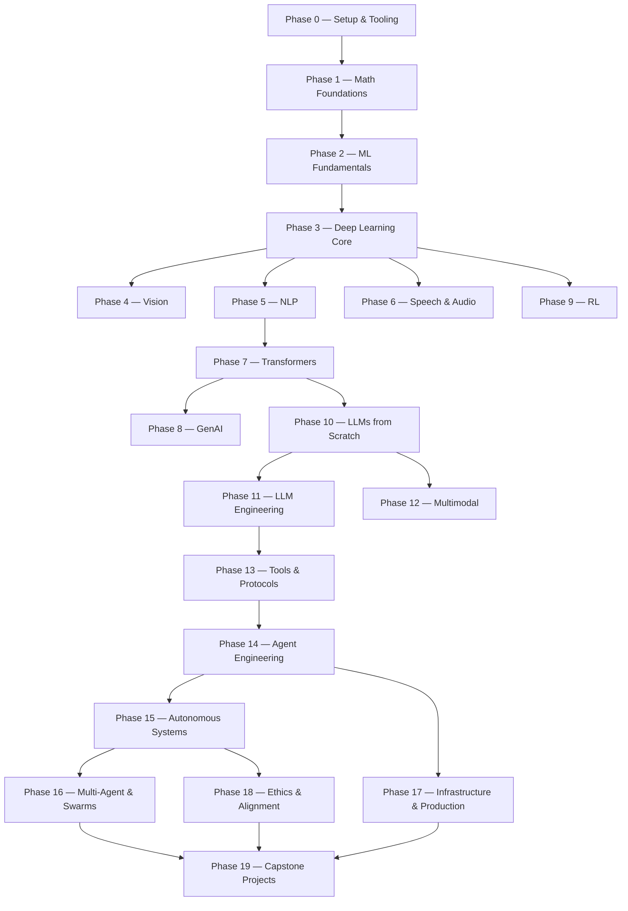

# AI Engineering from Scratch

> **503 lessons · 20 phases · ~320 hours** — Python, TypeScript, Rust, Julia  
> Every algorithm built from raw math before a single framework gets imported.

[About](about.md) · [Lesson Catalog](catalog.md) · [Roadmap](roadmap.md) · [Glossary](glossary.md) · [Contact](contact.md)

---

Maintained by **Rohit Ghumare** and contributors. Free, open source, MIT license.

[GitHub Repository](https://github.com/rohitg00/ai-engineering-from-scratch) · [Website](https://aiengineeringfromscratch.com)

---

## How It Works

Most AI material teaches in scattered pieces. This curriculum is the spine. Every algorithm gets built from raw math first — backprop, tokenizer, attention, agent loop — by the time PyTorch shows up, you already know what it's doing under the hood.

**Each lesson:** read the problem → derive the math → write the code → run the test → keep the artifact.

---

## The 20 Phases

| Phase | Topic | Lessons |
|-------|-------|-------:|
| **0** | Setup & Tooling | 12 |
| **1** | Math Foundations | 22 |
| **2** | ML Fundamentals | 18 |
| **3** | Deep Learning Core | 13 |
| **4** | Computer Vision | 28 |
| **5** | NLP: Foundations to Advanced | 29 |
| **6** | Speech & Audio | 17 |
| **7** | Transformers Deep Dive | 16 |
| **8** | Generative AI | 15 |
| **9** | Reinforcement Learning | 12 |
| **10** | LLMs from Scratch | 24 |
| **11** | LLM Engineering | 17 |
| **12** | Multimodal AI | 25 |
| **13** | Tools & Protocols | 23 |
| **14** | Agent Engineering | 42 |
| **15** | Autonomous Systems | 28 |
| **16** | Multi-Agent & Swarms | 28 |
| **17** | Infrastructure & Production | 30 |
| **18** | Ethics & Alignment | 14 |
| **19** | Capstone Projects | 15 |
| | **Total** | **~427** |

*Some phases have additional bonus lessons beyond the core count. The full curriculum totals 503 lessons.*

---

## Curriculum Flow



---

## Getting Started

Clone the repo and run any lesson:

```bash
git clone https://github.com/rohitg00/ai-engineering-from-scratch.git
cd ai-engineering-from-scratch
python phases/01-math-foundations/01-linear-algebra-intuition/code/vectors.py
```

Find your level with the built-in agent skill:

```bash
/find-your-level
```

---

## Every Lesson Ships Something

| Artifact | Description |
|----------|-------------|
| **Prompt** | Paste into any AI assistant |
| **Skill** | Drop into any agent that reads SKILL.md |
| **Agent** | Deploy as autonomous worker |
| **MCP Server** | Plug into any MCP-compatible client |

---

## Site Sections

| Page | What's there |
|------|-------------|
| [About](about.md) | Why this curriculum exists, how it's made, who builds it |
| [Catalog](catalog.md) | All 503 lessons across 20 phases, searchable |
| [Roadmap](roadmap.md) | Phase dependency graph — what unlocks what |
| [Glossary](glossary.md) | What people say vs what things actually mean |
| [Contact](contact.md) | Report issues, suggest lessons, get involved |

---

---

## Local Mirror

A full mirror of the repository is available at:

```
C:\xampp\htdocs\ai-engineering-from-scratch\
├── phases/         503 lessons across 20 phases
├── glossary/       Glossary terms
├── outputs/        Reusable artifacts (prompts, skills, agents, MCP)
├── projects/       Capstone project scaffolds
├── scripts/        Utility scripts
├── site/           Website source
└── web/            Web assets
```

**2,871 files** — offline, searchable, fully runnable. `git pull` to update.

---

*Full interactive experience at [aiengineeringfromscratch.com](https://aiengineeringfromscratch.com)*
