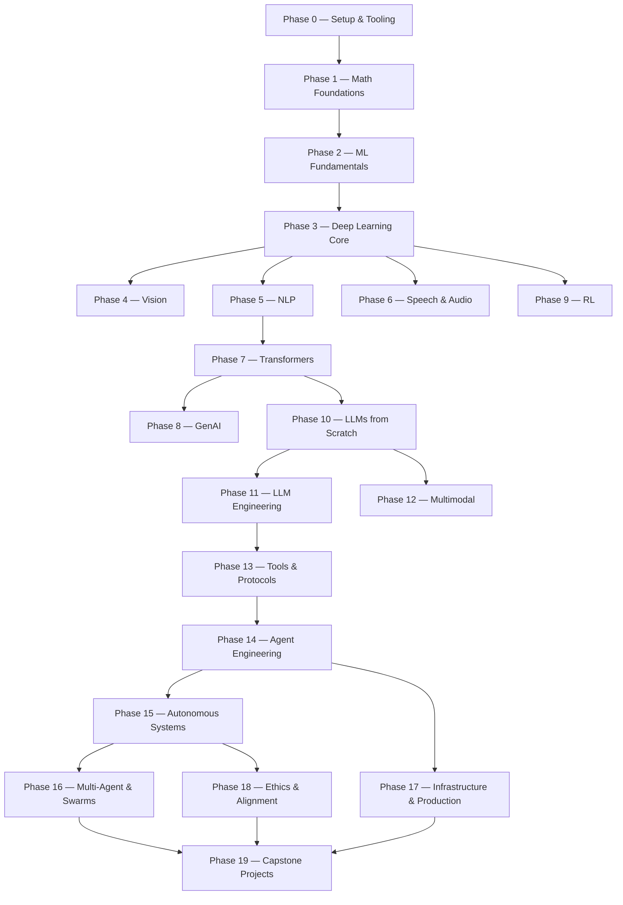

# Roadmap / Prerequisites

[Home](index.md) · [About](about.md) · [Catalog](catalog.md) · [Glossary](glossary.md) · [Contact](contact.md)

---

Twenty phases stack on top of each other. Math is the floor. Agents and production are the roof. Skip ahead if you already know the lower layers, but don't skip and then wonder why something at the top is breaking.

For the interactive clickable graph, visit [aiengineeringfromscratch.com/prereqs.html](https://aiengineeringfromscratch.com/prereqs.html).

---

## Phase Dependency Graph

---

## Prerequisites by Phase

| Phase | Requires | Unlocks |
|-------|----------|---------|
| P0 — Setup | Nothing | Everything |
| P1 — Math | P0 | Everything |
| P2 — ML Fundamentals | P1 | P3+ |
| P3 — Deep Learning | P2 | P4–P9 |
| P4 — Vision | P3 | P12 (Multimodal) |
| P5 — NLP | P3 | P7 (Transformers) |
| P6 — Speech & Audio | P3 | P12 (Multimodal) |
| P7 — Transformers | P5 | P8, P10 |
| P8 — Generative AI | P7 | P12 |
| P9 — Reinforcement Learning | P3 | P10 (RLHF) |
| P10 — LLMs from Scratch | P7 | P11, P12 |
| P11 — LLM Engineering | P10 | P13 |
| P12 — Multimodal AI | P4, P6, P8, P10 | P14+ |
| P13 — Tools & Protocols | P11 | P14 |
| P14 — Agent Engineering | P13 | P15, P17 |
| P15 — Autonomous Systems | P14 | P16, P18 |
| P16 — Multi-Agent & Swarms | P15 | P19 |
| P17 — Infrastructure & Production | P14 | P19 |
| P18 — Ethics & Alignment | P15 | P19 |
| P19 — Capstone Projects | P16, P17, P18 | — |

---

## Built-in Agent Skills

The curriculum ships with two agent skills to help you navigate:

| Skill | What It Does |
|---|---|
| `/find-your-level` | Ten-question placement quiz. Maps your knowledge to a starting phase and produces a personalized path with hour estimates. |
| `/check-understanding <phase>` | Per-phase quiz, eight questions, with feedback and specific lessons to review. |

## Prerequisites for Learners

- You can write code (any language; Python helps).
- You want to understand how AI **actually works**, not just call APIs.
