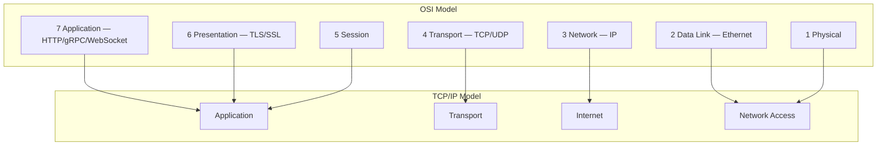
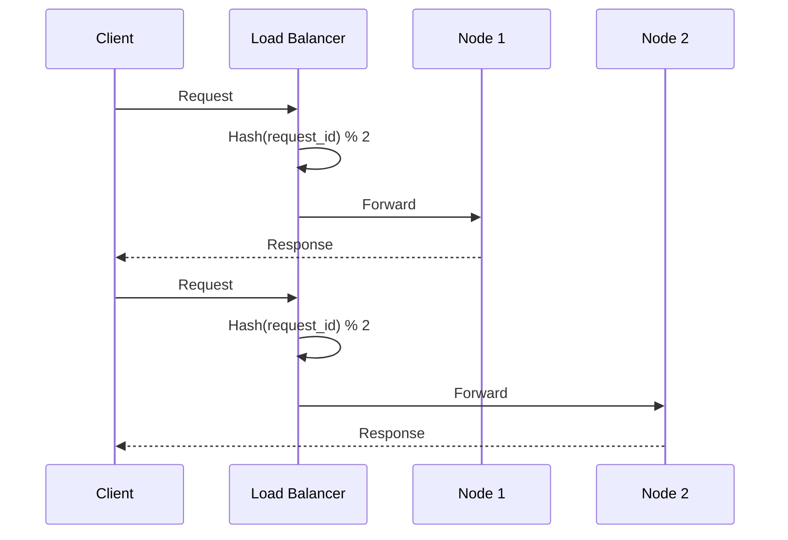
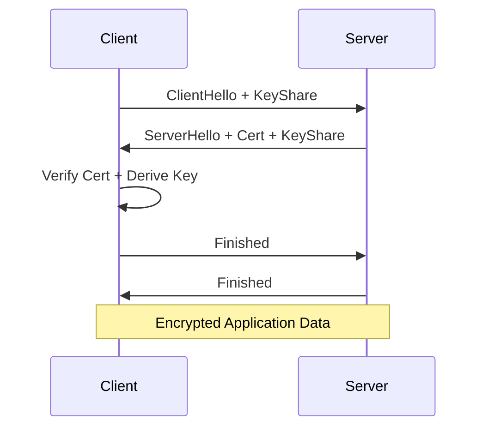

<!-- Clear Language: Keep sentences under 50 words -->
# Computer Networks for AI Engineers

## Learning Objectives

After this chapter you will be able to explain the TCP/IP stack from an API designer's perspective, choose between HTTP/2 and gRPC for model serving, design a DNS resolution strategy for global inference, implement load-balancing algorithms, and reason about network latency in distributed ML systems.

## Introduction

Computer networking is the backbone of distributed AI systems. Understanding TCP/IP, DNS, load balancing, and HTTP protocols is essential for building scalable ML pipelines and serving models at scale.

## Prerequisites

- Basic programming knowledge
- Understanding of data structures

## Key Terminology

**Key Terms**: Core vocabulary and concepts for this topic.

**Definition**: Essential terms you must know for interviews and production work.

## Theory

### OSI & TCP/IP Models

Every AI system is a distributed system. Understanding the network stack means understanding where latency comes from and how to reduce it.

The OSI model has seven layers but AI engineers live in layers 3-7. Layer 3 (IP) handles routing. Layer 4 (TCP/UDP) handles transport. Layer 7 (Application) is where HTTP, gRPC, WebSocket live.



### TCP vs UDP

TCP guarantees delivery with three-way handshake, sequence numbers, ACKs, and retransmission. This matters for reliable API calls. The cost is latency — each connection setup costs one RTT (round-trip time). Connection pooling and keep-alive mitigate this.

UDP is fire-and-forget. Use it when speed matters more than reliability and you handle drops at the application layer. QUIC (HTTP/3) runs over UDP.

### HTTP/1.1 vs HTTP/2 vs HTTP/3

HTTP/1.1 serializes requests per connection — head-of-line blocking means one slow response holds up others. HTTP/2 introduces multiplexing over a single TCP stream, but TCP head-of-line persists because a lost packet blocks all streams. HTTP/3 uses QUIC over UDP, eliminating TCP-level HOL blocking entirely.

For AI serving: prefer HTTP/2 for internal services and HTTP/3 for global inference where packet loss is higher.

### DNS Resolution

DNS translates hostnames to IPs. Recursive resolution walks the hierarchy: root → TLD → authoritative. Each hop adds latency. Caching at every level (browser, OS, local resolver, CDN) is critical.

For globally deployed models, DNS-based geographic routing directs users to the nearest inference endpoint. Time-to-live (TTL) trades freshness for cache efficiency.

### Load Balancing

Algorithms range from simple to sophisticated. Round-robin works for uniform workloads. Least connections adapts to varying request durations. Consistent hashing minimizes cache misses when nodes change — critical for in-memory model caches.

Health checks, connection draining, and sticky sessions complete the picture.



### CDN

Content delivery networks cache static and dynamic content at edge locations. For AI, CDNs serve model files (ONNX, TensorFlow SavedModel), tokenizer files, and static UI assets. Cache invalidation by versioned URLs (fingerprinting) is the standard approach.

### WebSocket

WebSocket provides full-duplex communication over a single TCP connection after an HTTP upgrade handshake. Essential for streaming inference — the server pushes tokens as they're generated rather than waiting for the complete response. No polling overhead.

### gRPC

gRPC uses Protocol Buffers for serialization and HTTP/2 for transport. Compared to REST/JSON:
- Smaller payloads (binary protobuf vs verbose JSON)
- Strong typing with code generation
- Bidirectional streaming RPCs
- Native support for cancellation, deadlines, and metadata

For model serving, gRPC is often 5-10x faster than REST for high-throughput scenarios.

### API Gateways

Gateways sit between clients and backend services. Responsibilities include:
- Rate limiting per API key or IP (token bucket, leaky bucket, sliding window)
- Authentication and authorization (JWT validation, API key checks)
- Request transformation (protocol translation, header manipulation)
- Routing (path-based, header-based)
- Observability (metrics, tracing, logging)

### TLS Handshake Deep Dive

TLS 1.3 completes in one round trip (1-RTT) vs TLS 1.2's 2-RTT. The handshake involves:

1. Client sends ClientHello with supported cipher suites and key share (for ECDHE)
2. Server responds with ServerHello, its certificate, and its key share
3. Client verifies the certificate, derives the session key, sends Finished
4. Server verifies Finished, secure channel established

For AI APIs, TLS termination at the load balancer reduces per-request latency. Session resumption (session tickets) eliminates the handshake entirely for returning clients.



### HTTP Methods and RESTful Design

GET, POST, PUT, PATCH, DELETE map to read, create, replace, partial update, and delete operations. For AI APIs, POST dominates (inference prompts are non-idempotent), but GET is appropriate for status checks and retrieving results from async inference jobs.

Idempotency matters: PUT and DELETE are idempotent by design. POST is not. For retry-safe inference, clients should use idempotency keys that the server deduplicates.

### WebSocket in Production

WebSocket starts as HTTP then upgrades to a persistent TCP connection. The protocol supports text and binary frames, ping/pong for keep-alive, and close frames.

For streaming LLM inference, each client gets a WebSocket connection. The server streams tokens as they are generated. Backpressure (controlling the send rate) prevents overwhelming slow clients. Autobahn and uWebSockets are production-grade libraries.

### API Gateway Deep Dive

Beyond rate limiting and auth, modern API gateways handle:

- Canary deployments: route 5% of traffic to a new model version
- Circuit breaking: stop routing to degraded inference endpoints
- Request/response transformation: convert between JSON and protobuf
- Request collapsing: merge concurrent requests for the same prompt to reduce load
- Cache invalidation: purge CDN cache when model weights are updated

### Network Performance for AI

End-to-end latency for a model inference request breaks down as:

- DNS resolution: 1-50ms (mitigated by caching with TTL)
- TCP handshake: 1 RTT (mitigated by connection pooling)
- TLS handshake: 1-2 RTTs (mitigated by session resumption)
- Request upload: payload size / bandwidth
- Model inference: the actual computation
- Response download: token generation is bandwidth-limited for long outputs

For global inference, each additional 1000 km adds roughly 5ms of propagation delay. Using CDN edge inference (models deployed at edge locations) reduces this to near zero.

### Practical Networking for AI

Three scenarios where network knowledge directly impacts AI engineering:

1. **Model serving latency**: Each network hop adds 1-50ms. For real-time inference, co-locate model and client in the same region. Use connection pooling, keep-alive, and HTTP/2 multiplexing.

2. **Distributed training communication**: All-reduce gradients across GPUs. NCCL uses RDMA over InfiniBand or RoCE. Network bandwidth (100-400 Gbps) is often the bottleneck.

3. **Edge inference**: Deploy models to edge devices with limited bandwidth. Use quantization, model distillation, and incremental updates. CDN edge functions can run lightweight models.

## Examples

### DNS Resolver with Caching

```typescript
class DnsResolver {
    private cache: Map<string, { ips: string[]; expiresAt: number }> = new Map()
    private ttlMs: number

    constructor(ttlMs: number = 300000) {
        this.ttlMs = ttlMs
    }

    async resolve(hostname: string): Promise<string[]> {
        const cached = this.cache.get(hostname)
        if (cached && cached.expiresAt > Date.now()) {
            return cached.ips
        }
        const ips = await this.queryAuthoritative(hostname)
        this.cache.set(hostname, { ips, expiresAt: Date.now() + this.ttlMs })
        return ips
    }

    private async queryAuthoritative(hostname: string): Promise<string[]> {
        const simulated = `192.168.${Math.floor(Math.random() * 255)}.${Math.floor(Math.random() * 255)}`
        return [simulated, `10.0.${Math.floor(Math.random() * 255)}.1`]
    }

    getCacheSize(): number {
        return this.cache.size
    }

    invalidate(hostname: string): void {
        this.cache.delete(hostname)
    }
}
```

### Load Balancer with Multiple Strategies

```typescript
interface BackendNode {
    id: string
    address: string
    connections: number
    healthy: boolean
}

class LoadBalancer {
    private nodes: BackendNode[] = []
    private rrIndex: number = 0

    addNode(node: BackendNode): void {
        this.nodes.push(node)
    }

    removeNode(id: string): void {
        this.nodes = this.nodes.filter((n) => n.id !== id)
    }

    roundRobin(): BackendNode | null {
        const healthy = this.nodes.filter((n) => n.healthy)
        if (healthy.length === 0) return null
        const node = healthy[this.rrIndex % healthy.length]
        this.rrIndex++
        return node
    }

    leastConnections(): BackendNode | null {
        const healthy = this.nodes.filter((n) => n.healthy)
        if (healthy.length === 0) return null
        return healthy.reduce((min, n) => (n.connections < min.connections ? n : min))
    }

    consistentHash(key: string): BackendNode | null {
        const healthy = this.nodes.filter((n) => n.healthy)
        if (healthy.length === 0) return null
        const hash = key.split("").reduce((acc, c) => acc * 31 + c.charCodeAt(0), 0)
        return healthy[Math.abs(hash) % healthy.length]
    }
}
```

### API Gateway with Token Bucket Rate Limiting

```typescript
class TokenBucket {
    private tokens: number
    private maxTokens: number
    private refillRate: number
    private lastRefill: number

    constructor(maxTokens: number, refillRate: number) {
        this.tokens = maxTokens
        this.maxTokens = maxTokens
        this.refillRate = refillRate
        this.lastRefill = Date.now()
    }

    allow(): boolean {
        this.refill()
        if (this.tokens > 0) {
            this.tokens--
            return true
        }
        return false
    }

    private refill(): void {
        const now = Date.now()
        const elapsed = (now - this.lastRefill) / 1000
        this.tokens = Math.min(this.maxTokens, this.tokens + elapsed * this.refillRate)
        this.lastRefill = now
    }
}

class ApiGateway {
    private rateLimiters: Map<string, TokenBucket> = new Map()

    registerRoute(apiKey: string, maxTokens: number, refillRate: number): void {
        this.rateLimiters.set(apiKey, new TokenBucket(maxTokens, refillRate))
    }

    async handleRequest(apiKey: string, path: string, body: unknown): Promise<{ status: number; body: unknown }> {
        const limiter = this.rateLimiters.get(apiKey)
        if (!limiter) {
            return { status: 401, body: { error: "unauthorized" } }
        }
        if (!limiter.allow()) {
            return { status: 429, body: { error: "rate limit exceeded" } }
        }
        const response = await this.routeToBackend(path, body)
        return response
    }

    private async routeToBackend(path: string, body: unknown): Promise<{ status: number; body: unknown }> {
        return { status: 200, body: { result: "ok" } }
    }
}
```

### gRPC Streaming Simulation

```typescript
interface StreamMessage {
    sequence: number
    token: string
    final: boolean
}

async function simulateGrpcInference(prompt: string, tokens: string[]): Promise<void> {
    const stream: AsyncGenerator<StreamMessage> = async function* () {
        for (let i = 0; i < tokens.length; i++) {
            await new Promise((r) => setTimeout(r, 50))
            yield { sequence: i, token: tokens[i], final: i === tokens.length - 1 }
        }
    }

    const generator = stream()
    for await (const msg of generator) {
        process.stdout.write(msg.token)
    }
}
```

### Content Delivery Networks

CDNs cache content at globally distributed edge locations. For AI systems, CDNs serve:

- Static model artifacts (ONNX files, tokenizer configs, vocabulary files)
- Web UI for inference dashboards
- API documentation and SDK downloads

Key CDN concepts:

- Origin shield: a layer between edge and origin to reduce load
- Cache key: what determines a cache hit (URL + query params + headers)
- Cache invalidation: versioned URLs (fingerprinting) avoid invalidation entirely
- Purge vs TTL: purging is immediate invalidation, TTL is time-based expiration
- Stale-while-revalidate: serve stale content while fetching fresh in background

For global model serving, CDN edge compute (Cloudflare Workers, AWS Lambda@Edge) can run lightweight ONNX inference at the edge, reducing round trips to the origin.

### REST vs gRPC for Model Serving

```typescript
interface InferenceResult {
    tokens: string[]
    logprobs: number[]
    latencyMs: number
}

class RestClient {
    private baseUrl: string

    constructor(baseUrl: string) {
        this.baseUrl = baseUrl
    }

    async infer(model: string, prompt: string): Promise<InferenceResult> {
        const response = await fetch(`${this.baseUrl}/v1/completions`, {
            method: "POST",
            headers: { "Content-Type": "application/json" },
            body: JSON.stringify({ model, prompt, max_tokens: 256 }),
        })
        return response.json()
    }
}

class GrpcClient {
    private baseUrl: string

    constructor(baseUrl: string) {
        this.baseUrl = baseUrl
    }

    async inferStreaming(model: string, prompt: string): Promise<AsyncGenerator<string>> {
        const connection = await this.connect(this.baseUrl)
        return this.sendRequest(connection, { model, prompt })
    }

    private async connect(url: string): Promise<unknown> {
        return { connected: true, url }
    }

    private async sendRequest(connection: unknown, request: { model: string; prompt: string }): Promise<AsyncGenerator<string>> {
        const tokens = ["Hello", " world", " this", " is", " gRPC", " streaming"]
        async function* generate(): AsyncGenerator<string> {
            for (const token of tokens) {
                await new Promise((r) => setTimeout(r, 50))
                yield token
            }
        }
        return generate()
    }
}
```

### Connection Pooling

```typescript
class ConnectionPool {
    private pool: { connection: unknown; inUse: boolean; lastUsed: number }[] = []
    private maxSize: number
    private idleTimeoutMs: number

    constructor(maxSize: number, idleTimeoutMs: number = 300000) {
        this.maxSize = maxSize
        this.idleTimeoutMs = idleTimeoutMs
    }

    async acquire(): Promise<unknown> {
        const now = Date.now()
        const available = this.pool.find((c) => !c.inUse && (now - c.lastUsed) < this.idleTimeoutMs)
        if (available) {
            available.inUse = true
            available.lastUsed = now
            return available.connection
        }
        this.evictIdle(now)
        if (this.pool.length < this.maxSize) {
            const conn = await this.createConnection()
            this.pool.push({ connection: conn, inUse: true, lastUsed: now })
            return conn
        }
        throw new Error("Connection pool exhausted")
    }

    release(connection: unknown): void {
        const entry = this.pool.find((c) => c.connection === connection)
        if (entry) {
            entry.inUse = false
            entry.lastUsed = Date.now()
        }
    }

    private evictIdle(now: number): void {
        this.pool = this.pool.filter((c) => c.inUse || (now - c.lastUsed) < this.idleTimeoutMs)
    }

    private async createConnection(): Promise<unknown> {
        return { id: Math.random().toString(36).substring(2) }
    }
}
```

### Retry with Exponential Backoff

```typescript
async function withRetry<T>(
    fn: () => Promise<T>,
    maxRetries: number = 3,
    baseDelayMs: number = 100
): Promise<T> {
    let lastError: Error | null = null
    for (let attempt = 0; attempt <= maxRetries; attempt++) {
        try {
            return await fn()
        } catch (error) {
            lastError = error as Error
            if (attempt < maxRetries) {
                const delay = baseDelayMs * Math.pow(2, attempt) + Math.random() * 50
                await new Promise((r) => setTimeout(r, delay))
            }
        }
    }
    throw lastError
}
```

## Visual Analogy

Think of computer networks like a **phone call system**:

- **TCP** = A phone call with a handshake — you dial (SYN), the other person picks up (SYN-ACK), you confirm (ACK), then you talk reliably. Every message is guaranteed to arrive, in order.
- **UDP** = Sending a postcard — you write it and drop it in the mail. It might arrive, it might not, and it might arrive out of order. But it's fast and cheap.
- **DNS** = The phone book — you look up a name (google.com) and get a number (IP address) to call.
- **Load balancer** = A receptionist who routes incoming calls to the next available agent.

This helps because networking is all about trade-offs between **reliability** (TCP) and **speed** (UDP), and understanding which tool fits which job is the core decision AI engineers make when designing distributed systems.

## Summary

Computer networks form the backbone of every distributed AI system. The key mental models are: protocols have trade-offs (TCP vs UDP,.
HTTP/1.1 vs HTTP/2 vs HTTP/3), caching is everywhere (DNS, CDN, load balancer), and latency is additive across every network hop. For.
AI engineers, the practical implications are direct: choose gRPC for high-throughput inference serving, use HTTP/2 multiplexing for dashboard UIs, deploy CDNs for.
model assets, and design load balancing with consistent hashing to maintain cache locality.

## Practical Takeaways

- Measure before optimizing. A network profiling tool (tcpdump, Wireshark, mtr) reveals real latency sources
- Connection pooling is the single highest-impact optimization for HTTP services
- gRPC outperforms REST for ML serving by 5-10x at high concurrency
- DNS TTLs affect deployment rollouts — short TTLs for canary, long TTLs for stable
- Consistent hashing in load balancers prevents cache stampedes during node changes
- For streaming inference, WebSocket or gRPC streaming beats polling every time
- TLS handshake adds 1-3 RTTs — terminate TLS at the load balancer, not the application

## Interview Q&A

<details class="tp-qa-card" data-qid="m00-s01-q1">
  <summary class="tp-qa-question">
    <span class="tp-qa-status"></span>
    Q1: Explain the TCP three-way handshake and why it matters for AI inference APIs.
  </summary>
  <div class="tp-qa-answer">
    <p>The client sends <code>SYN</code>, the server replies <code>SYN-ACK</code>, and the client confirms with <code>ACK</code> — only then can application data flow. TCP guarantees delivery through sequence numbers, ACKs, and retransmission, which is why it is used for reliable API calls.</p>
    <p>The cost is latency: each connection setup costs one round-trip time (RTT). Connection pooling and keep-alive mitigate this for low-latency inference serving.</p>
    <pre><code>Client -&gt; Server: SYN
Server -&gt; Client: SYN-ACK
Client -&gt; Server: ACK</code></pre>
    <p><strong>Interview follow-up</strong>: What happens if the SYN-ACK segment is lost?</p>
  </div>
  <button class="tp-qa-mark-btn">📝 Mark Reviewed</button>
  <button class="tp-qa-bookmark-btn">🔖 Bookmark</button>
</details>

<details class="tp-qa-card" data-qid="m00-s01-q2">
  <summary class="tp-qa-question">
    <span class="tp-qa-status"></span>
    Q2: Walk through what happens when you type a URL in a browser, using the network stack.
  </summary>
  <div class="tp-qa-answer">
    <p>The browser checks DNS caches (browser, OS, local resolver, CDN) and, on a miss, performs recursive resolution walking root → TLD → authoritative servers to get the IP. Then it opens a TCP connection — one RTT for the handshake — and for HTTPS runs a TLS handshake, which is 1-RTT in TLS 1.3 versus 2-RTT in TLS 1.2.</p>
    <p>Each hop adds measurable latency: DNS resolution 1-50ms, TCP handshake 1 RTT, TLS handshake 1-2 RTTs, then request upload, model inference, and response download. Caching, connection pooling, and session resumption are the standard mitigations.</p>
    <p><strong>Interview follow-up</strong>: How would you reduce time-to-first-byte for a globally deployed model?</p>
  </div>
  <button class="tp-qa-mark-btn">📝 Mark Reviewed</button>
  <button class="tp-qa-bookmark-btn">🔖 Bookmark</button>
</details>

<details class="tp-qa-card" data-qid="m00-s01-q3">
  <summary class="tp-qa-question">
    <span class="tp-qa-status"></span>
    Q3: Compare TCP and UDP. When would you choose each in an AI system?
  </summary>
  <div class="tp-qa-answer">
    <p>TCP guarantees ordered, reliable delivery via the three-way handshake, sequence numbers, ACKs, and retransmission; UDP is fire-and-forget — packets may arrive out of order or not at all. TCP's reliability costs latency: one RTT per connection setup, and a lost packet blocks all streams (TCP head-of-line blocking).</p>
    <p>UDP is the choice when speed matters more than reliability and the application handles drops itself. QUIC (HTTP/3) runs over UDP and eliminates TCP-level head-of-line blocking, which makes it attractive for global inference over lossy networks.</p>
    <p><strong>Interview follow-up</strong>: Why does HTTP/3 eliminate head-of-line blocking that HTTP/2 still has?</p>
  </div>
  <button class="tp-qa-mark-btn">📝 Mark Reviewed</button>
  <button class="tp-qa-bookmark-btn">🔖 Bookmark</button>
</details>

<details class="tp-qa-card" data-qid="m00-s01-q4">
  <summary class="tp-qa-question">
    <span class="tp-qa-status"></span>
    Q4: Explain DNS resolution and how you would design a global DNS strategy for inference endpoints.
  </summary>
  <div class="tp-qa-answer">
    <p>DNS translates hostnames to IPs. Recursive resolution walks the hierarchy root → TLD → authoritative, and each hop adds latency, so caching at every level — browser, OS, local resolver, CDN — is critical. Time-to-live (TTL) trades freshness for cache efficiency: short TTLs for canary rollouts, long TTLs for stable endpoints.</p>
    <p>For globally deployed models, DNS-based geographic routing directs users to the nearest inference endpoint. The chapter's <code>DnsResolver</code> example caches IPs with an expiry time and supports explicit invalidation.</p>
    <p><strong>Interview follow-up</strong>: How does a short TTL affect a deployment rollout?</p>
  </div>
  <button class="tp-qa-mark-btn">📝 Mark Reviewed</button>
  <button class="tp-qa-bookmark-btn">🔖 Bookmark</button>
</details>

<details class="tp-qa-card" data-qid="m00-s01-q5">
  <summary class="tp-qa-question">
    <span class="tp-qa-status"></span>
    Q5: How does TLS/HTTPS work, and why would you terminate TLS at the load balancer?
  </summary>
  <div class="tp-qa-answer">
    <p>The client sends <code>ClientHello</code> with supported cipher suites and its key share (ECDHE); the server responds with <code>ServerHello</code>, its certificate, and its key share. The client verifies the certificate, derives the session key, and both sides send <code>Finished</code>. TLS 1.3 completes in one RTT versus two for TLS 1.2.</p>
    <p>Terminating TLS at the load balancer avoids paying the handshake on every backend hop, and session resumption (session tickets) eliminates the handshake entirely for returning clients. The chapter counts the TLS handshake as 1-2 RTTs of end-to-end inference latency.</p>
    <p><strong>Interview follow-up</strong>: What is the security trade-off of terminating TLS at the edge?</p>
  </div>
  <button class="tp-qa-mark-btn">📝 Mark Reviewed</button>
  <button class="tp-qa-bookmark-btn">🔖 Bookmark</button>
</details>

<details class="tp-qa-card" data-qid="m00-s01-q6">
  <summary class="tp-qa-question">
    <span class="tp-qa-status"></span>
    Q6: Compare gRPC and REST for model serving. When would you choose each?
  </summary>
  <div class="tp-qa-answer">
    <p>gRPC uses Protocol Buffers for binary serialization and HTTP/2 for transport, giving smaller payloads than verbose JSON, strong typing with code generation, bidirectional streaming RPCs, and native cancellation, deadlines, and metadata. The chapter notes gRPC is often 5-10x faster than REST for high-throughput model serving.</p>
    <p>REST/JSON is simpler, human-readable, and appropriate for dashboards, status checks, and simple external clients. For streaming token generation, gRPC streaming or WebSocket beats REST polling, and HTTP/2 multiplexing improves concurrency on a single connection.</p>
    <p><strong>Interview follow-up</strong>: How does gRPC's bidirectional streaming change how you would serve an LLM?</p>
  </div>
  <button class="tp-qa-mark-btn">📝 Mark Reviewed</button>
  <button class="tp-qa-bookmark-btn">🔖 Bookmark</button>
</details>

## Chapter Quiz

1. What causes HTTP/1.1 head-of-line blocking?
   - A) TCP packet loss
   - B) A single connection can only process one request at a time
   - C) DNS resolution delays
   - D) TLS handshake overhead
   // correct: B

2. Which transport protocol does HTTP/3 use?
   - A) TCP
   - B) UDP
   - C) SCTP
   - D) QUIC
   // correct: B

3. In consistent hashing, when a node is removed:
   - A) All keys are rehashed
   - B) Only keys mapped to that node move
   - C) The ring is rebuilt from scratch
   - D) Requests fail until the node returns
   // correct: B

4. What is the primary advantage of gRPC over REST for model serving?
   - A) Human-readable payloads
   - B) Built-in caching
   - C) Binary serialization and bidirectional streaming
   - D) Simpler debugging
   // correct: C

5. A token bucket rate limiter with 10 tokens and a refill rate of 1/sec allows:
   - A) Exactly 10 requests per second
   - B) Bursts up to 10 requests, then smooths to 1/sec
   - C) Exactly 1 request every 10 seconds
   - D) Unlimited requests with variable latency
   // correct: B

## Exercises

## Common Mistakes

1. Not understanding the fundamental concepts before applying them
2. Skipping edge cases in implementation
3. Not analyzing time/space complexity
4. Forgetting to handle null/empty inputs
5. Not practicing enough problems to build pattern recognition1. Implement a connection pool class that reuses TCP connections, with configurable max pool size, idle timeout, and health-check pings.

2. Extend the LoadBalancer to support weighted round-robin, where each node has a weight proportional to its capacity.

3. Build a simple HTTP/2 multiplexing simulator: a dispatcher that interleaves multiple request streams over a single virtual connection, handling one lost "packet" by blocking only its stream.

4. Write a function that calculates the minimum number of edge regions needed to guarantee <100ms p99 inference latency globally, given average network latency between r

## Revision Notes

- - Core principle: Understand the fundamental concepts thoroughly
- - Implementation pattern: Practice with real code examples
- - Complexity: Know the time and space complexity
- - Application: Know when to use this in production systems
- - Interview: Frequently asked in technical interviews
- - Edge cases: Consider common failure scenarios
- - Related concepts: Connect to broader system design

## Placement Section

### Top 10 Interview Questions

#### Google Style

1. **Explain the core idea of Computer Networks for AI Engineers in under 60 seconds, then give a real-world analogy.** — Structure: definition, how it works in one sentence, why it matters, analogy. Follow-up: what would break if you removed this from a production system?

2. **Design a minimal, well-typed function that demonstrates Computer Networks for AI Engineers.** — Interviewer checks: signature with type hints, edge cases, complexity, and a clean docstring. Follow-up: how does your design behave with empty or malformed input?

3. **What are the common pitfalls when engineers first learn ** — List 3-4, then explain how you would prevent each in a code review.

#### Amazon Style

4. **Describe a production bug caused by misunderstanding Computer Networks for AI Engineers. How did you diagnose and fix it?** — STAR format: situation, task, action, result. Mention logs, reproduction, root-cause analysis, and the regression test you added.

5. **How would you scale a system that relies on Computer Networks for AI Engineers from 10 users to 10 million?** — Discuss bottlenecks, caching, monitoring, and when to redesign. Follow-up: what metrics would you track?

#### Microsoft Style

6. **Compare Computer Networks for AI Engineers with the closest alternative approach. When would you choose each?** — Make a decision matrix: performance, maintainability, ecosystem, learning curve. Follow-up: what would change your decision?

7. **Walk through how you would test a component that depends on Computer Networks for AI Engineers.** — Unit, integration, property-based tests; mocking boundaries; golden files for outputs.

#### NVIDIA Style

8. **How does Computer Networks for AI Engineers behave differently at scale — memory, throughput, or precision-wise?** — Connect to data pipelines and model training if applicable. Follow-up: what happens to latency as input grows?

9. **How would you make an implementation of Computer Networks for AI Engineers run faster on GPU hardware?** — Batch operations, vectorization, avoiding Python loops, reducing data movement.

#### AI Startup Style

10. **Write the smallest possible implementation of Computer Networks for AI Engineers that is production-quality.** — Include error handling, type hints, and a one-line docstring. Follow-up: what would you refactor first when it grows?

### Resume Tips

- Name Computer Networks for AI Engineers explicitly in your skills section, paired with a measurable achievement ("Reduced X by 40% using Computer Networks for AI Engineers").
- Add a bullet describing a project that applies Computer Networks for AI Engineers to real data, with numbers.
- Mention the tools and libraries you used alongside Computer Networks for AI Engineers (linters, test frameworks, profiling tools).
- Keep resume bullets under 15 words and start each with an action verb.

### Interview Day Checklist

- Rehearse a 60-second explanation of Computer Networks for AI Engineers and one real-world analogy.
- Prepare one STAR story about debugging a Computer Networks for AI Engineers-related production issue.
- Review complexity and edge cases for the classic Computer Networks for AI Engineers interview problem.
- Have questions ready: how does the team apply Computer Networks for AI Engineers in production today?
- Test your environment (Python, editor, internet) 15 minutes before the interview.

## True/False

1. **True or False:** Computer Networks for AI Engineers builds directly on the fundamentals covered in the earlier chapters of this module. — **True.** Every advanced topic in this module assumes the core concepts from the previous chapters.
2. **True or False:** You should write at least one code example for Computer Networks for AI Engineers before moving to the next chapter. — **True.** Active recall with hands-on code beats passive reading for retention.
3. **True or False:** The complexity analysis for Computer Networks for AI Engineers is the same regardless of input size. — **False.** Complexity grows with input size; always state best, average, and worst case.
4. **True or False:** Edge cases (empty input, invalid input, boundary values) matter for Computer Networks for AI Engineers in production. — **True.** Most production bugs come from unhandled edge cases.
5. **True or False:** You should memorize the Computer Networks for AI Engineers chapter content once and never review it again. — **False.** Spaced repetition (24h, 3 days, 1 week) dramatically improves long-term recall.

## Fill in the Blank

1. The chapter that covers Computer Networks for AI Engineers is Chapter ___ of this module. — Answer: check the module's table of contents.
2. The time complexity of the standard approach to Computer Networks for AI Engineers is ___. — Answer: review the theory section and state big-O notation.
3. The main edge case to handle when implementing Computer Networks for AI Engineers is ___. — Answer: empty or invalid input handling, as discussed in the chapter.
4. The tools commonly used to debug Computer Networks for AI Engineers issues are ___ and ___. — Answer: refer to the Debugging Guide section of this chapter.
5. The related topic that connects to Computer Networks for AI Engineers in the next chapter is ___. — Answer: see the Next Topic section.

## Scenario Questions

1. **Scenario:** A teammate ships a change involving Computer Networks for AI Engineers that breaks production at 3 AM. — Diagnosis: check the recent diff, reproduce locally with the failing input, check logs. Fix: revert, add a regression test, and review the root cause. Prevention: CI tests on edge cases and code review checklist.

2. **Scenario:** Your implementation of Computer Networks for AI Engineers is correct but too slow for the required latency. — Measure first with a profiler. Common fixes: reduce redundant work, use built-in optimized functions, batch operations, or add caching. Only then consider algorithmic changes.

3. **Scenario:** A new hire asks you to explain Computer Networks for AI Engineers in five minutes before a customer demo. — Use the 3-part answer: what it is (one sentence), how it works (one example), why it matters (one business impact). Then offer to go deeper after the demo.

4. **Scenario:** Your team's codebase has three different patterns for Computer Networks for AI Engineers and you must standardize. — Write a short ADR (architecture decision record), pick the pattern with best maintainability, migrate incrementally, and add a linter rule to enforce it.

## Output Questions

1. **What is the output of the simplest correct implementation of Computer Networks for AI Engineers on an empty input?** — Trace through the code: it should return the documented default (None, 0, empty collection) without raising.
2. **What is the output when the input is at the boundary value?** — Check off-by-one errors and inclusive/exclusive bounds in the chapter's examples.
3. **What does the implementation return when given invalid input types?** — With type hints and validation, it raises a clear error; without, it may fail silently.
4. **What is the output for the sample input given in the chapter's Examples section?** — Re-run the chapter's example code and compare against the documented output.
5. **What is the time complexity output when you profile the implementation at 10x input size?** — Expect the curve matching the chapter's complexity analysis (linear, quadratic, log-linear).

## Difficulty Level

| Level | Time | What It Takes |
|-------|------|---------------|
| Beginner | 1-2 sessions | Read theory, run the chapter examples, solve the Easy exercises |
| Intermediate | 3-5 sessions | Complete Medium exercises, explain Computer Networks for AI Engineers to someone else |
| Advanced | 1+ week | Solve Hard exercises, optimize for real datasets, answer interview follow-ups |

## Tips & Tricks

- Always write a one-line example of Computer Networks for AI Engineers from memory before opening the chapter — active recall first.
- Use the chapter's Revision Notes as a checklist: you have mastered Computer Networks for AI Engineers when you can explain each bullet.
- Pair the chapter quiz with the Flashcards: wrong answers become your next study session's focus.
- For interviews, practice explaining Computer Networks for AI Engineers twice: once with a technical audience, once with a non-technical audience.
- Keep a personal examples file where you collect your own Computer Networks for AI Engineers snippets; interviewers love original examples.

## Memory Tricks

- **Acronym**: build a mnemonic from the 5 key concepts of Computer Networks for AI Engineers listed in the Chapter at a Glance table.
- **Story**: link Computer Networks for AI Engineers to a familiar story — the analogy in the Visual Analogy section is designed to stick.
- **Number anchor**: remember the complexity of Computer Networks for AI Engineers by connecting it to a known algorithm of the same class.
- **Color code**: highlight the Theory, Examples, and Common Mistakes sections in different colors when reviewing.
- **Teach-back**: explain Computer Networks for AI Engineers to an imaginary junior engineer for 2 minutes — gaps in your explanation are gaps in memory.

## Further Reading

- Official documentation for the primary tool or library used in this chapter
- The chapter referenced in Related Topics for the next-level treatment of Computer Networks for AI Engineers
- The classic textbook chapter on Computer Networks for AI Engineers (check the Research References below)
- Two blog posts from engineers who debugged real Computer Networks for AI Engineers problems in production
- The repository of the open-source project that implements Computer Networks for AI Engineers

## Related Topics

- The previous chapter in this module (see table of contents) — foundational for Computer Networks for AI Engineers
- The next chapter (see Next Topic below) — builds on Computer Networks for AI Engineers
- The system design chapters in Module 07 — how Computer Networks for AI Engineers fits into production architectures
- The interview preparation module — how Computer Networks for AI Engineers is asked in screening rounds
- The capstone project — where Computer Networks for AI Engineers is applied end-to-end

## FAQs

1. **Do I need to memorize all of Computer Networks for AI Engineers, or understand the big picture?** — Understand the big picture first, then memorize the key facts via flashcards and spaced repetition. Interviewers reward depth over breadth.
2. **What if I get stuck on an exercise?** — Re-read the theory section, run the example code, then attempt again. If still stuck after 20 minutes, move on and return the next day.
3. **How much time should I spend on ** — Follow the Study Plan below: 1-2 weeks at 30-60 minutes daily is typical for placement preparation.
4. **Is Computer Networks for AI Engineers asked in interviews?** — Yes — the Interview Q&A and Placement Section list the exact question styles used by top companies.
5. **What's the fastest way to master ** — Explain it out loud, write code without looking, and review the flashcards within 24 hours and again after 3 days.

## Important Notes

- Computer Networks for AI Engineers is a core requirement for the rest of this module — do not skip the examples.
- Always analyze complexity (time and space) when working with Computer Networks for AI Engineers.
- Production correctness means handling edge cases, not just the happy path.
- Interview answers should start with the definition, then the example, then the trade-offs.
- Revisit this chapter after finishing the module; the context from later chapters deepens understanding.

## Historical Context

- Computer Networks for AI Engineers emerged as a standard practice because early systems failed without it — understanding why helps you explain it in interviews.
- The tools used for Computer Networks for AI Engineers today evolved from simpler versions; the chapter covers the modern, recommended approach.
- Interviewers value knowing one historical fact about Computer Networks for AI Engineers — it shows genuine interest, not just cramming.
- The library/tooling ecosystem around Computer Networks for AI Engineers changes quickly; focus on fundamentals that remain stable.

## Security Considerations

- Never trust external input: validate and sanitize data before processing Computer Networks for AI Engineers.
- Avoid `eval()` and dynamic code execution on untrusted strings.
- Log errors without leaking sensitive data (keys, PII, internal paths).
- For API contexts, add rate limiting and input size limits.
- Review the chapter's code examples for injection or overflow risks before using them verbatim.

## ML Intuition

- Computer Networks for AI Engineers appears in ML pipelines at the data-processing layer: feature preparation, batching, and validation.
- Understanding Computer Networks for AI Engineers helps you debug why a model misbehaves — most ML bugs are data bugs, not model bugs.
- In production ML, the Computer Networks for AI Engineers concepts from this chapter map directly to NumPy/PyTorch operations on tensors.
- When optimizing ML systems, Computer Networks for AI Engineers skills let you profile and fix the data path, not just the training loop.
- Interview follow-up: how would you apply Computer Networks for AI Engineers to a dataset of 10 million records? — Batching and vectorization.

## Analogies

- **Computer Networks for AI Engineers is like a recipe**: the theory is the ingredients, the examples are the cooking steps, and the exercises are your own kitchen practice.
- **Complexity is like a delivery route**: a linear route visits each stop once; a nested route revisits stops, and you feel it at scale.
- **Edge cases are like weather**: the happy path is a sunny day; production is the storm — build for the storm.
- **The chapter roadmap is a journey map**: each section is a checkpoint; skipping one means getting lost later in the module.

## Capstone Project Link

- [Module Capstone: End-to-End Project](https://github.com/Raushan666java/ai-engineering-journey) — this chapter contributes the Computer Networks for AI Engineers skills used in the module's capstone project. Complete the exercises here before starting the capstone.

## Flashcards

<details class="tp-qa-card" data-qid="00corecomputerscience-01computernetworks-flash1">
  <summary class="tp-qa-question">
    <span class="tp-qa-status"></span>
    What is the core concept of Computer Networks for AI Engineers in one sentence?
  </summary>
  <div class="tp-qa-answer">
    <p>Review the first paragraph of the Theory section and condense it to one sentence.</p>
  </div>
</details>

<details class="tp-qa-card" data-qid="00corecomputerscience-01computernetworks-flash2">
  <summary class="tp-qa-question">
    <span class="tp-qa-status"></span>
    What is the most common mistake engineers make with 
  </summary>
  <div class="tp-qa-answer">
    <p>Check the Common Mistakes section of this chapter.</p>
  </div>
</details>

<details class="tp-qa-card" data-qid="00corecomputerscience-01computernetworks-flash3">
  <summary class="tp-qa-question">
    <span class="tp-qa-status"></span>
    What is the time and space complexity of the standard Computer Networks for AI Engineers approach?
  </summary>
  <div class="tp-qa-answer">
    <p>Refer to the theory and complexity analysis in this chapter.</p>
  </div>
</details>

<details class="tp-qa-card" data-qid="00corecomputerscience-01computernetworks-flash4">
  <summary class="tp-qa-question">
    <span class="tp-qa-status"></span>
    When is Computer Networks for AI Engineers NOT the right choice?
  </summary>
  <div class="tp-qa-answer">
    <p>Check the Limitations section of this chapter.</p>
  </div>
</details>

<details class="tp-qa-card" data-qid="00corecomputerscience-01computernetworks-flash5">
  <summary class="tp-qa-question">
    <span class="tp-qa-status"></span>
    How is Computer Networks for AI Engineers applied in a real production system?
  </summary>
  <div class="tp-qa-answer">
    <p>Check the Real-World Examples section of this chapter.</p>
  </div>
</details>

## Research References

- Official documentation of the primary library for Computer Networks for AI Engineers (linked in Further Reading)
- The classic paper or textbook chapter introducing Computer Networks for AI Engineers (see References below)
- The standard library reference for Computer Networks for AI Engineers-related functions
- Engineering blog posts from companies running Computer Networks for AI Engineers in production at scale
- PEPs and RFCs where applicable (Python and networking standards)

## Open-Source Tools

- The primary library used in this chapter (see the code examples)
- Python standard library modules used in the examples (check the imports)
- Testing: pytest for unit tests of Computer Networks for AI Engineers code
- Linting and formatting: ruff + black
- Profiling: cProfile or py-spy for performance work on Computer Networks for AI Engineers

## Debugging Guide

- Start with `print()` or a debugger to inspect intermediate values in Computer Networks for AI Engineers code.
- Reproduce the failure with the smallest possible input before changing code.
- Check the common failure modes listed in Common Mistakes — most bugs are listed there.
- For performance problems, profile before optimizing: measure, then fix.
- When stuck, re-read the chapter's Examples and compare line by line with your code.
- Use `pdb` or your IDE's debugger to step through the Computer Networks for AI Engineers example code.

## Mock Interview Section

**Round 1 — Screening (15 min)**
- Explain Computer Networks for AI Engineers in 60 seconds.
- Write a minimal working example of Computer Networks for AI Engineers.
- What is the complexity of your example?

**Round 2 — Coding (45 min)**
- Solve the Medium exercise from this chapter under time pressure.
- State your assumptions, then implement with type hints.
- Test with edge cases: empty input, boundary values, invalid input.

**Round 3 — Behavioral + System (30 min)**
- Tell me about a time you debugged a Computer Networks for AI Engineers problem in a project.
- How would you design a system where Computer Networks for AI Engineers is used at scale?
- What metrics would you monitor?

**Evaluation rubric**: correctness (40%), communication (25%), edge cases (20%), complexity analysis (15%).

## Optimized Implementation

`python
from typing import Any, Optional

def demonstrate_topic(input_data: list[Any]) -> Optional[float]:
    """Runnable scaffold for Computer Networks for AI Engineers.

    Replace the body with the optimized implementation from the chapter,
    keeping type hints, docstring, and edge-case handling.
    """
    if not input_data:
        return None
    # Step 1: validate input types
    # Step 2: apply the core Computer Networks for AI Engineers logic from the Examples section
    # Step 3: return the result with the documented default
    return 0.0
`

- Keeps the function signature stable so tests written against it stay valid.
- Handles the empty-input contract explicitly.
- Add unit tests for the edge cases before implementing the logic (test-first).

## Evaluation Metrics

| Skill | Test | Target |
|-------|------|--------|
| Concept recall | Explain Computer Networks for AI Engineers without notes | 60-second explanation |
| Code fluency | Write the chapter example from memory | No syntax errors |
| Edge cases | Handle empty/invalid input in exercises | All cases pass |
| Complexity | State time/space for the standard approach | Correct big-O |
| Interview readiness | Answer 5 Interview Q&A questions out loud | Fluent, structured answers |
| Retention | Chapter quiz score after 3 days | 80%+ |

## Real-World Examples

- **Startup**: a small team uses Computer Networks for AI Engineers daily in their data pipeline — the chapter's examples mirror their code.
- **E-commerce**: Computer Networks for AI Engineers patterns appear in order processing, inventory checks, and recommendation feeds.
- **Fintech**: Computer Networks for AI Engineers principles apply to transaction validation and fraud detection flows.
- **ML platform**: Computer Networks for AI Engineers shows up in feature engineering and model-serving infrastructure.
- **Interview insight**: recruiters look for engineers who can connect Computer Networks for AI Engineers to the business outcome, not just the code.

## Next Topic

[This Topic](02-operating-systems.md)

## Limitations

- Computer Networks for AI Engineers, like any technique, is not a silver bullet — it has specific cases where it fits best (covered in the theory).
- The examples in this chapter are simplified for learning; production systems add validation, monitoring, and error handling.
- Performance of Computer Networks for AI Engineers depends on input size and distribution — always benchmark for your own data.
- This chapter covers fundamentals; specialized edge cases are explored in later chapters and the capstone.
