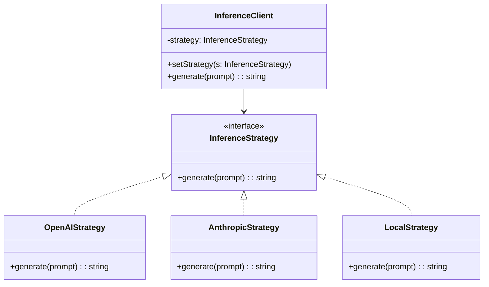
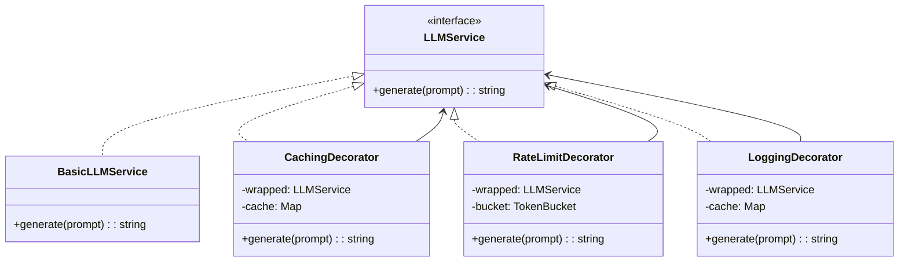

<!-- Clear Language: Keep sentences under 50 words -->
# OOP and Design Patterns for AI Engineers

## Learning Objectives

After this chapter you will be able to apply SOLID principles to build extensible ML pipelines, select the right GoF pattern for.
common AI engineering problems (multiple LLM providers, caching, rate limiting), design clean interfaces that decouple model serving from business logic, distinguish between composition and.
inheritance, and refactor monolithic code into maintainable, testable modules.

## Introduction

Computer science fundamentals are the bedrock of every AI system. Understanding networks, operating systems, databases, and architecture helps you build reliable, scalable AI services. This module covers what interviewers expect you to know cold.

## Prerequisites

- Basic programming knowledge
- Understanding of data structures

## Key Terminology

**Key Terms**: Core vocabulary and concepts for this topic.

**Definition**: Essential terms you must know for interviews and production work.

## Theory

### Encapsulation, Inheritance, Polymorphism, Composition

Encapsulation hides internal state behind a public interface. Inheritance defines an is-a relationship — a Dog is an Animal. Polymorphism allows different types to satisfy the same interface. Composition defines a has-a relationship — a Car has an Engine.

The classic advice: prefer composition over inheritance. Inheritance creates tight coupling and deep hierarchies that are hard to refactor. Composition allows swapping implementations at runtime.

### SOLID Principles

Single Responsibility: A class should have one reason to change. An LLMService should not also handle caching, rate limiting, and logging.

Open/Closed: Open for extension, closed for modification. Add new model providers without changing existing code — use an interface and inject new implementations.

Liskov Substitution: Subtypes must be substitutable for their base types. If a function accepts LLMProvider, it should work with OpenAIProvider, AnthropicProvider, and LocalProvider without knowing which is which.

Interface Segregation: Clients should not depend on interfaces they do not use. A ModelInference interface should not include a train() method.

Dependency Inversion: Depend on abstractions, not concretions. High-level orchestration code should depend on LLMProvider interface, not OpenAIClient directly.

### GoF Patterns for AI Engineering

Strategy Pattern: Define a family of algorithms, encapsulate each, and make them interchangeable. In AI this means swapping inference backends (OpenAI, Anthropic, local), vector stores (Pinecone, Chroma, Qdrant), or embedding models.



Observer Pattern: One-to-many dependency where changes in one object notify all dependents. Useful for ML pipeline monitoring — data loading progress, training metrics, log streaming.

Factory Pattern: Creates objects without specifying the exact class. A ModelFactory creates the right model type (GPT-4, Claude 3, Llama 3) from configuration.

Singleton Pattern: Ensures only one instance exists. Used for configuration, model registries, and connection pools. Use with caution — singletons make testing difficult.

Decorator Pattern: Wraps an object to add behavior without changing its interface. Perfect for cross-cutting concerns in AI services: caching, rate limiting, logging, retry logic.



Adapter Pattern: Converts one interface to another. Wrap OpenAI SDK, Anthropic SDK, and HuggingFace pipelines behind a common LLMProvider interface.

Command Pattern: Encapsulates a request as an object. Queue inference requests for retry, logging, or async processing.

Template Method: Defines the skeleton of an algorithm, letting subclasses override specific steps. A TrainingPipeline defines preprocess, train, evaluate, save — subclasses implement each step.

### Clean Architecture

Dependency rule: source code dependencies point inwards. Outer layers (frameworks, databases, APIs) depend on inner layers (business logic, entities). Inner layers never depend on outer layers.

For AI systems: entities are Model, Dataset, Evaluation. Use cases are InferenceUseCase (prompt -> response), TrainingUseCase (data -> trained model). Interface adapters wrap external dependencies (APIs, databases, file systems).

### Functional vs OOP

Functional programming favors pure functions, immutability, and composition of small operations. OOP favors objects with identity, state changes, and polymorphism via inheritance.

For AI engineering: use OOP for the architecture (interfaces, dependency injection, strategy pattern) and functional style within components (pure data transformations, stateless functions). This hybrid approach is common in production ML code.

## Examples

### Strategy Pattern: Multiple LLM Providers

```typescript
interface LLMProvider {
    generate(prompt: string, options?: Record<string, unknown>): Promise<string>
}

class OpenAIProvider implements LLMProvider {
    async generate(prompt: string, options?: Record<string, unknown>): Promise<string> {
        return OpenAI response to: ...
    }
}

class AnthropicProvider implements LLMProvider {
    async generate(prompt: string, options?: Record<string, unknown>): Promise<string> {
        return Anthropic response to: ...
    }
}

class LocalProvider implements LLMProvider {
    async generate(prompt: string, options?: Record<string, unknown>): Promise<string> {
        return Local model response to: ...
    }
}

class InferenceClient {
    private provider: LLMProvider

    constructor(provider: LLMProvider) {
        this.provider = provider
    }

    setProvider(provider: LLMProvider): void {
        this.provider = provider
    }

    async generate(prompt: string): Promise<string> {
        return this.provider.generate(prompt)
    }
}
```

### Decorator Pattern: Caching, Rate Limiting, Logging

```typescript
class BasicLLMService implements LLMProvider {
    async generate(prompt: string): Promise<string> {
        return Generated response for:
    }
}

class CachingDecorator implements LLMProvider {
    private wrapped: LLMProvider
    private cache: Map<string, { response: string; expiresAt: number }> = new Map()
    private ttlMs: number

    constructor(wrapped: LLMProvider, ttlMs: number = 300000) {
        this.wrapped = wrapped
        this.ttlMs = ttlMs
    }

    async generate(prompt: string): Promise<string> {
        const cached = this.cache.get(prompt)
        if (cached && cached.expiresAt > Date.now()) {
            return cached.response
        }
        const response = await this.wrapped.generate(prompt)
        this.cache.set(prompt, { response, expiresAt: Date.now() + this.ttlMs })
        return response
    }
}

class RateLimitDecorator implements LLMProvider {
    private wrapped: LLMProvider
    private requestsPerMinute: number
    private timestamps: number[] = []

    constructor(wrapped: LLMProvider, rpm: number = 60) {
        this.wrapped = wrapped
        this.requestsPerMinute = rpm
    }

    async generate(prompt: string): Promise<string> {
        const now = Date.now()
        this.timestamps = this.timestamps.filter((t) => now - t < 60000)
        if (this.timestamps.length >= this.requestsPerMinute) {
            const waitMs = this.timestamps[0] + 60000 - now
            await new Promise((r) => setTimeout(r, Math.max(waitMs, 0)))
        }
        this.timestamps.push(Date.now())
        return this.wrapped.generate(prompt)
    }
}

class LoggingDecorator implements LLMProvider {
    private wrapped: LLMProvider

    constructor(wrapped: LLMProvider) {
        this.wrapped = wrapped
    }

    async generate(prompt: string): Promise<string> {
        const start = Date.now()
        console.log(generate() called with prompt length )
        try {
            const response = await this.wrapped.generate(prompt)
            console.log(generate() succeeded in ms)
            return response
        } catch (error) {
            console.error(generate() failed after ms)
            throw error
        }
    }
}
```

### Adapter Pattern: Unified LLM Interface

```typescript
interface ILLMProvider {
    complete(messages: { role: string; content: string }[]): Promise<string>
    embedding(text: string): Promise<number[]>
}

class OpenAIClientAdapter implements ILLMProvider {
    private apiKey: string

    constructor(apiKey: string) {
        this.apiKey = apiKey
    }

    async complete(messages: { role: string; content: string }[]): Promise<string> {
        return OpenAI completion for  messages
    }

    async embedding(text: string): Promise<number[]> {
        return new Array(1536).fill(0).map(() => Math.random())
    }
}

class AnthropicClientAdapter implements ILLMProvider {
    private apiKey: string

    constructor(apiKey: string) {
        this.apiKey = apiKey
    }

    async complete(messages: { role: string; content: string }[]): Promise<string> {
        return Anthropic completion for  messages
    }

    async embedding(text: string): Promise<number[]> {
        return new Array(1024).fill(0).map(() => Math.random())
    }
}

class HuggingFaceAdapter implements ILLMProvider {
    private modelPath: string

    constructor(modelPath: string) {
        this.modelPath = modelPath
    }

    async complete(messages: { role: string; content: string }[]): Promise<string> {
        return HuggingFace completion for  messages
    }

    async embedding(text: string): Promise<number[]> {
        return new Array(768).fill(0).map(() => Math.random())
    }
}
```

### Factory and Template Method

```typescript
abstract class TrainingPipeline {
    async run(data: unknown[]): Promise<void> {
        const prepared = this.preprocess(data)
        const model = this.createModel()
        const trained = await this.train(model, prepared)
        const metrics = this.evaluate(trained, prepared)
        this.save(trained, metrics)
    }

    protected abstract preprocess(data: unknown[]): unknown[]
    protected abstract createModel(): unknown
    protected abstract train(model: unknown, data: unknown[]): Promise<unknown>
    protected abstract evaluate(model: unknown, data: unknown[]): Record<string, number>
    protected abstract save(model: unknown, metrics: Record<string, number>): void
}

class ClassificationPipeline extends TrainingPipeline {
    protected preprocess(data: unknown[]): unknown[] {
        return data
    }

    protected createModel(): unknown {
        return { type: "classifier", layers: 3 }
    }

    protected async train(model: unknown, data: unknown[]): Promise<unknown> {
        return { ...model as object, trained: true, accuracy: 0.95 }
    }

    protected evaluate(model: unknown, data: unknown[]): Record<string, number> {
        return { accuracy: 0.95, f1: 0.94 }
    }

    protected save(model: unknown, metrics: Record<string, number>): void {
        console.log("Model saved with metrics:", metrics)
    }
}
```

### SOLID Refactoring Example

Violation of Single Responsibility and Dependency Inversion:

```typescript
class MonolithicService {
    private openaiKey: string

    constructor() {
        this.openaiKey = process.env.OPENAI_KEY || ""
    }

    async handlePrompt(prompt: string): Promise<string> {
        const cached = this.getFromCache(prompt)
        if (cached) return cached
        const response = await this.callOpenAI(prompt)
        this.logRequest(prompt, response)
        this.addToCache(prompt, response)
        return response
    }

    private async callOpenAI(prompt: string): Promise<string> {
        return 
esponse to
    }

    private getFromCache(key: string): string | null {
        return null
    }

    private addToCache(key: string, value: string): void {
    }

    private logRequest(prompt: string, response: string): void {
        console.log(prompt, response)
    }
}
```

After refactoring with Dependency Inversion and composition:

```typescript
interface Cache {
    get(key: string): string | null
    set(key: string, value: string, ttlMs: number): void
}

interface Logger {
    log(message: string): void
}

class RefactoredService {
    private provider: LLMProvider
    private cache: Cache
    private logger: Logger

    constructor(provider: LLMProvider, cache: Cache, logger: Logger) {
        this.provider = provider
        this.cache = cache
        this.logger = logger
    }

    async handlePrompt(prompt: string): Promise<string> {
        const cached = this.cache.get(prompt)
        if (cached) {
            this.logger.log("Cache hit")
            return cached
        }
        const response = await this.provider.generate(prompt)
        this.cache.set(prompt, response, 300000)
        this.logger.log("Cache miss - generated new response")
        return response
    }
}
```

### Observer Pattern for ML Pipeline Monitoring

The observer pattern defines a one-to-many dependency. When the subject changes state, all observers are notified. In AI pipelines:

- Training loop publishes epoch metrics
- Observers include console logger, TensorBoard writer, Slack notifier, metrics database
- Adding a new observer does not modify the training code

```typescript
interface Observer {
    update(event: string, data: Record<string, unknown>): void
}

class TrainingSubject {
    private observers: Observer[] = []

    attach(observer: Observer): void {
        this.observers.push(observer)
    }

    detach(observer: Observer): void {
        this.observers = this.observers.filter((o) => o !== observer)
    }

    notify(event: string, data: Record<string, unknown>): void {
        for (const observer of this.observers) {
            observer.update(event, data)
        }
    }
}

class ConsoleLoggerObserver implements Observer {
    update(event: string, data: Record<string, unknown>): void {
        console.log("[" + event + "]", JSON.stringify(data))
    }
}

class SlackNotifierObserver implements Observer {
    private webhookUrl: string

    constructor(webhookUrl: string) {
        this.webhookUrl = webhookUrl
    }

    async update(event: string, data: Record<string, unknown>): Promise<void> {
        if (event === "training_complete") {
            await fetch(this.webhookUrl, {
                method: "POST",
                body: JSON.stringify({ text: "Training complete: " + JSON.stringify(data) }),
            })
        }
    }
}
```

### Command Pattern for Inference Queuing

The command pattern encapsulates a request as an object. Useful for queuing, retrying, and logging inference requests.

```typescript
interface Command {
    execute(): Promise<unknown>
    undo?(): Promise<unknown>
}

class InferenceCommand implements Command {
    private provider: LLMProvider
    private prompt: string
    private retries: number = 0
    private maxRetries: number

    constructor(provider: LLMProvider, prompt: string, maxRetries: number = 3) {
        this.provider = provider
        this.prompt = prompt
        this.maxRetries = maxRetries
    }

    async execute(): Promise<unknown> {
        while (this.retries < this.maxRetries) {
            try {
                return await this.provider.generate(this.prompt)
            } catch (error) {
                this.retries++
                if (this.retries >= this.maxRetries) throw error
                await new Promise((r) => setTimeout(r, 1000 * this.retries))
            }
        }
    }
}

class CommandQueue {
    private queue: Command[] = []
    private processing: boolean = false

    enqueue(command: Command): void {
        this.queue.push(command)
        this.processNext()
    }

    private async processNext(): Promise<void> {
        if (this.processing || this.queue.length === 0) return
        this.processing = true
        const command = this.queue.shift()!
        try {
            await command.execute()
        } catch (error) {
            console.error("Command failed:", error)
        }
        this.processing = false
        this.processNext()
    }
}
```

### Clean Architecture for RAG Systems

A clean architecture RAG system has concentric layers:

Entities (innermost): Document, Chunk, Embedding, Query, RelevanceScore

Use cases: IngestDocument (chunks documents, generates embeddings, stores), AnswerQuery (retrieves chunks, constructs prompt, generates answer)

Interface adapters: VectorStoreGateway (PineconeAdapter, ChromaAdapter), LLMGateway (OpenAIAdapter, AnthropicAdapter), DocumentStoreGateway (S3Adapter, LocalAdapter)

Frameworks (outermost): Express routes, CLI commands, test harnesses

The dependency rule ensures that changes to Pinecone API do not affect the AnswerQuery use case — only the VectorStoreGateway adapter changes.

### Testing with Mocks

```typescript
class MockLLMProvider implements LLMProvider {
    private responses: Map<string, string> = new Map()

    setResponse(prompt: string, response: string): void {
        this.responses.set(prompt, response)
    }

    async generate(prompt: string): Promise<string> {
        const response = this.responses.get(prompt)
        if (!response) throw new Error("No mock response for: " + prompt)
        return response
    }
}

// Usage in tests
const mock = new MockLLMProvider()
mock.setResponse("Hello", "Hi there!")
const client = new InferenceClient(mock)
const result = await client.generate("Hello")
// result === "Hi there!"
```

## Summary

SOLID principles and design patterns are battle-tested approaches to writing maintainable, extensible AI systems. The strategy pattern lets you swap model providers at configuration time. The decorator.
pattern composes cross-cutting concerns (caching, rate limiting, logging) without tangling them with business logic. The adapter pattern unifies different LLM SDKs behind a common interface. Clean architecture keeps framework dependencies at the edges,.
making your core logic testable. The rule is simple: depend on abstractions, inject dependencies, compose behavior, and test in isolation.

## Practical Takeaways

- Always code to an interface, not an implementation. An LLMProvider interface lets you switch providers in one line
- Use the decorator pattern for all cross-cutting concerns — never mix caching/billing/logging into business logic
- A strategy + factory combination handles 90% of model provider switching needs
- Prefer composition over inheritance in ML pipelines — deep class hierarchies are brittle
- Clean architecture prevents framework lock-in. Keep ML logic framework-agnostic
- Test with mock providers using the same interface — swap OpenAI with a mock that returns canned responses
- Design patterns should simplify, not complicate. If a pattern adds more code than it removes, don't use it

## Interview Q&A

<details class="tp-qa-card" data-qid="m00-s05-q1">
  <summary class="tp-qa-question">
    <span class="tp-qa-status"></span>
    Q1: Explain the five SOLID principles with an example from an ML service.
  </summary>
  <div class="tp-qa-answer">
    <p>Single Responsibility: a class has one reason to change — an LLMService should not also handle caching and rate limiting. Open/Closed: open for extension, closed for modification — add new providers behind an interface instead of editing existing code. Liskov Substitution: subtypes are substitutable — code accepting <code>LLMProvider</code> must work with OpenAI, Anthropic, and local implementations interchangeably. Interface Segregation: clients do not depend on unused methods — a <code>ModelInference</code> interface should not include <code>train()</code>. Dependency Inversion: depend on abstractions, not concretions — orchestration code depends on the provider interface, not on an SDK client.</p>
    <p>The chapter's <code>MonolithicService</code> violates Single Responsibility and Dependency Inversion; the <code>RefactoredService</code> injects <code>LLMProvider</code>, <code>Cache</code>, and <code>Logger</code> interfaces instead.</p>
    <p><strong>Interview follow-up</strong>: Which principle is violated when a mock provider cannot be substituted in tests?</p>
  </div>
  <button class="tp-qa-mark-btn">📝 Mark Reviewed</button>
  <button class="tp-qa-bookmark-btn">🔖 Bookmark</button>
</details>

<details class="tp-qa-card" data-qid="m00-s05-q2">
  <summary class="tp-qa-question">
    <span class="tp-qa-status"></span>
    Q2: How does the Strategy pattern let you swap LLM providers at runtime?
  </summary>
  <div class="tp-qa-answer">
    <p>Strategy defines a family of algorithms, encapsulates each, and makes them interchangeable. An <code>InferenceStrategy</code> interface declares <code>generate(prompt)</code>; <code>OpenAIStrategy</code>, <code>AnthropicStrategy</code>, and <code>LocalStrategy</code> implement it; <code>InferenceClient</code> holds a strategy and swaps it via <code>setStrategy()</code> — callers never know which provider is active.</p>
    <p>In AI systems this pattern also covers vector stores (Pinecone, Chroma, Qdrant) and embedding models. Combined with a Factory that reads config and constructs the right strategy, it handles most provider-switching needs in one place.</p>
    <p><strong>Interview follow-up</strong>: How would you add a fallback provider chain on top of the Strategy pattern?</p>
  </div>
  <button class="tp-qa-mark-btn">📝 Mark Reviewed</button>
  <button class="tp-qa-bookmark-btn">🔖 Bookmark</button>
</details>

<details class="tp-qa-card" data-qid="m00-s05-q3">
  <summary class="tp-qa-question">
    <span class="tp-qa-status"></span>
    Q3: Why is the Decorator pattern ideal for caching, rate limiting, and logging around LLM calls?
  </summary>
  <div class="tp-qa-answer">
    <p>Decorator wraps an object to add behavior without changing its interface. <code>CachingDecorator</code> checks a TTL cache before calling the wrapped provider; <code>RateLimitDecorator</code> enforces requests-per-minute; <code>LoggingDecorator</code> times calls and logs failures. Each implements the same <code>LLMProvider</code> interface, so decorators nest in any order: <code>new LoggingDecorator(new RateLimitDecorator(new CachingDecorator(new BasicLLMService())))</code>.</p>
    <p>Cross-cutting concerns stay out of business logic, every decorator is independently testable, and adding a new concern never touches the core service. This is the standard production shape for LLM gateways.</p>
    <p><strong>Interview follow-up</strong>: What order would you apply cache, rate limit, and retry decorators and why?</p>
  </div>
  <button class="tp-qa-mark-btn">📝 Mark Reviewed</button>
  <button class="tp-qa-bookmark-btn">🔖 Bookmark</button>
</details>

<details class="tp-qa-card" data-qid="m00-s05-q4">
  <summary class="tp-qa-question">
    <span class="tp-qa-status"></span>
    Q4: What problem does the Adapter pattern solve when integrating multiple model SDKs?
  </summary>
  <div class="tp-qa-answer">
    <p>Each SDK has a different interface — OpenAI, Anthropic, and Hugging Face pipelines all expose different method names, message formats, and embedding dimensions. The Adapter pattern wraps each SDK behind one common interface: <code>complete(messages)</code> and <code>embedding(text)</code>. The chapter's <code>OpenAIClientAdapter</code>, <code>AnthropicClientAdapter</code>, and <code>HuggingFaceAdapter</code> each implement <code>ILLMProvider</code>, so the application code never changes when a provider is swapped.</p>
    <p>Note embedding dimensions differ per provider (1536 vs 1024 vs 768), so the abstraction must normalize embeddings or the vector store must be versioned by model. The adapter is also where mapping to a canonical message schema belongs.</p>
    <p><strong>Interview follow-up</strong>: Where would you normalize different embedding dimensions across providers?</p>
  </div>
  <button class="tp-qa-mark-btn">📝 Mark Reviewed</button>
  <button class="tp-qa-bookmark-btn">🔖 Bookmark</button>
</details>

<details class="tp-qa-card" data-qid="m00-s05-q5">
  <summary class="tp-qa-question">
    <span class="tp-qa-status"></span>
    Q5: Why prefer composition over inheritance in ML pipelines?
  </summary>
  <div class="tp-qa-answer">
    <p>Inheritance creates an is-a relationship with tight coupling and deep hierarchies that are brittle to change — swapping the model backend means touching the class tree. Composition defines has-a relationships: a service owns an <code>LLMProvider</code>, a <code>Cache</code>, and a <code>Logger</code>, injected at construction time. Implementations swap at runtime and are mocked trivially in tests.</p>
    <p>The chapter's refactoring example shows the same <code>handlePrompt</code> behavior implemented with composition: the provider, cache, and logger are injectable collaborators, so a test uses <code>MockLLMProvider</code> with canned responses. This is also why the Strategy and Decorator patterns are composable while inheritance hierarchies are not.</p>
    <p><strong>Interview follow-up</strong>: Give an example where inheritance is genuinely the right call.</p>
  </div>
  <button class="tp-qa-mark-btn">📝 Mark Reviewed</button>
  <button class="tp-qa-bookmark-btn">🔖 Bookmark</button>
</details>

<details class="tp-qa-card" data-qid="m00-s05-q6">
  <summary class="tp-qa-question">
    <span class="tp-qa-status"></span>
    Q6: Explain the dependency rule in Clean Architecture using a RAG system.
  </summary>
  <div class="tp-qa-answer">
    <p>Source code dependencies point inwards. Entities (Document, Chunk, Embedding, Query) are innermost; use cases (IngestDocument, AnswerQuery) orchestrate entities; interface adapters (VectorStoreGateway, LLMGateway, DocumentStoreGateway) wrap external dependencies; frameworks (Express routes, CLI) are outermost. Inner layers never depend on outer layers.</p>
    <p>Consequence: if Pinecone changes its API, only the Pinecone adapter changes — <code>AnswerQuery</code> is untouched. Tests exercise use cases with mock adapters. For a RAG system, the LLM gateway, vector store adapter, and document store are all swappable behind interfaces.</p>
    <p><strong>Interview follow-up</strong>: Where would you put prompt templating — entity, use case, or adapter?</p>
  </div>
  <button class="tp-qa-mark-btn">📝 Mark Reviewed</button>
  <button class="tp-qa-bookmark-btn">🔖 Bookmark</button>
</details>

## Chapter Quiz

1. Which SOLID principle is violated when a class handles both model inference and request logging?
   - A) Liskov Substitution
   - B) Interface Segregation
   - C) Single Responsibility
   - D) Dependency Inversion
   // correct: C

2. The decorator pattern is best suited for:
   - A) Creating families of related objects
   - B) Adding behavior to an object without changing its interface
   - C) Defining a one-to-many dependency
   - D) Wrapping multiple interfaces into one
   // correct: B

3. What is the primary benefit of the adapter pattern for LLM integrations?
   - A) Improved inference speed
   - B) Unified interface across different provider SDKs
   - C) Automatic retry on failures
   - D) Built-in caching
   // correct: B

4. Dependency Inversion means:
   - A) Depend on concretions, not abstractions
   - B) Depend on abstractions, not concretions
   - C) Invert method call order
   - D) Use inheritance for code reuse
   // correct: B

5. Why prefer composition over inheritance?
   - A) Composition is faster at runtime
   - B) Inheritance creates tight coupling and deep hierarchies
   - C) Composition uses less memory
   - D) Inheritance is deprecated in TypeScript
   // correct: B

## Exercises

1. Implement a CircuitBreakerDecorator that wraps an LLMProvider and trips after N consecutive failures, with a configurable reset timeout.
2. Build a ProviderFactory that reads a config file and returns the correct LLMProvider implementation with all decorators applied.
3. Refactor a monolithic RAG pipeline into clean architecture layers: entities (Document, Chunk, Query), use cases (IngestUseCase, QueryUseCase), and interface adapters (VectorStoreAdapter, LLMAdapter).
4. Implement the observer pattern for a training pipeline that notifies multiple listeners (console logger, metrics dashboard, Slack notifier) on epoch completion.

## Common Mistakes

1. Using inheritance when composition would be simpler and more flexible
2. Creating God classes that handle multiple responsibilities (inference + caching + logging)
3. Tight coupling to specific LLM provider SDKs instead of coding to interfaces
4. Not applying the dependency inversion principle — high-level modules depending on low-level modules
5. Over-engineering with patterns when simple functions would suffice

## Revision Notes

- **Strategy Pattern**: Define a family of algorithms (LLM providers, vector stores) and make them interchangeable at runtime
- **Decorator Pattern**: Add cross-cutting concerns (caching, rate limiting, logging) without modifying the core class
- **Adapter Pattern**: Unify different SDK interfaces behind a common interface for swappable implementations
- **Clean Architecture**: Source code dependencies point inwards — entities → use cases → adapters → frameworks
- **SOLID Principles**: Single Responsibility, Open/Closed, Liskov Substitution, Interface Segregation, Dependency Inversion
- **Composition vs Inheritance**: Prefer composition (has-a) over inheritance (is-a) for flexible, testable code
- **Testing with Mocks**: Use interface-based mocks to test without real API calls

## Placement Section

### Top 10 Interview Questions

#### Google Style
1. Design a model serving system that supports switching between OpenAI, Anthropic, and local models without code changes. Which patterns would you use?
2. You have a monolithic ML pipeline that handles data loading, training, evaluation, and deployment. How would you refactor it using clean architecture principles?

#### Amazon Style
1. Tell me about a time you had to refactor a tightly coupled system. How did you apply design patterns to improve it?
2. How would you explain the Strategy pattern to a non-technical product manager?

#### Microsoft Style
1. How would you implement a plugin architecture for LLM providers that allows third-party extensions?
2. What are the trade-offs between using Singleton pattern vs dependency injection for configuration management?

#### NVIDIA Style
1. How would you apply the Decorator pattern to add GPU memory monitoring to an inference service?
2. Design a pipeline pattern for multi-stage GPU-accelerated data processing.

#### AI Startup Style
1. How would you build a model provider abstraction that lets you switch from OpenAI to a cheaper provider with minimal code changes?
2. What's the simplest architecture for a startup to support multiple LLM backends?

### Resume Tips
- **Technical Skills**: List "Design Patterns", "SOLID Principles", "Clean Architecture", "TypeScript" under relevant skills
- **Project Description**: "Applied Strategy and Decorator patterns to build a multi-provider LLM service, enabling provider switching in 1 line of code"
- **Keywords**: Include "design patterns", "SOLID", "clean architecture", "dependency injection" for ATS optimization

### Interview Day Checklist
- [ ] Review SOLID principles with real-world AI examples
- [ ] Practice implementing Strategy, Decorator, and Adapter patterns from scratch
- [ ] Prepare 2 examples of refactoring monolithic code using design patterns
- [ ] Know when to use composition vs inheritance
- [ ] Have questions ready about the company's architecture and design patterns used

## True/False

1. **True or False:** OOP and Design Patterns for AI Engineers builds directly on the fundamentals covered in the earlier chapters of this module. — **True.** Every advanced topic in this module assumes the core concepts from the previous chapters.
2. **True or False:** You should write at least one code example for OOP and Design Patterns for AI Engineers before moving to the next chapter. — **True.** Active recall with hands-on code beats passive reading for retention.
3. **True or False:** The complexity analysis for OOP and Design Patterns for AI Engineers is the same regardless of input size. — **False.** Complexity grows with input size; always state best, average, and worst case.
4. **True or False:** Edge cases (empty input, invalid input, boundary values) matter for OOP and Design Patterns for AI Engineers in production. — **True.** Most production bugs come from unhandled edge cases.
5. **True or False:** You should memorize the OOP and Design Patterns for AI Engineers chapter content once and never review it again. — **False.** Spaced repetition (24h, 3 days, 1 week) dramatically improves long-term recall.

## Fill in the Blank

1. The chapter that covers OOP and Design Patterns for AI Engineers is Chapter ___ of this module. — Answer: check the module's table of contents.
2. The time complexity of the standard approach to OOP and Design Patterns for AI Engineers is ___. — Answer: review the theory section and state big-O notation.
3. The main edge case to handle when implementing OOP and Design Patterns for AI Engineers is ___. — Answer: empty or invalid input handling, as discussed in the chapter.
4. The tools commonly used to debug OOP and Design Patterns for AI Engineers issues are ___ and ___. — Answer: refer to the Debugging Guide section of this chapter.
5. The related topic that connects to OOP and Design Patterns for AI Engineers in the next chapter is ___. — Answer: see the Next Topic section.

## Scenario Questions

1. **Scenario:** A teammate ships a change involving OOP and Design Patterns for AI Engineers that breaks production at 3 AM. — Diagnosis: check the recent diff, reproduce locally with the failing input, check logs. Fix: revert, add a regression test, and review the root cause. Prevention: CI tests on edge cases and code review checklist.

2. **Scenario:** Your implementation of OOP and Design Patterns for AI Engineers is correct but too slow for the required latency. — Measure first with a profiler. Common fixes: reduce redundant work, use built-in optimized functions, batch operations, or add caching. Only then consider algorithmic changes.

3. **Scenario:** A new hire asks you to explain OOP and Design Patterns for AI Engineers in five minutes before a customer demo. — Use the 3-part answer: what it is (one sentence), how it works (one example), why it matters (one business impact). Then offer to go deeper after the demo.

4. **Scenario:** Your team's codebase has three different patterns for OOP and Design Patterns for AI Engineers and you must standardize. — Write a short ADR (architecture decision record), pick the pattern with best maintainability, migrate incrementally, and add a linter rule to enforce it.

## Output Questions

1. **What is the output of the simplest correct implementation of OOP and Design Patterns for AI Engineers on an empty input?** — Trace through the code: it should return the documented default (None, 0, empty collection) without raising.
2. **What is the output when the input is at the boundary value?** — Check off-by-one errors and inclusive/exclusive bounds in the chapter's examples.
3. **What does the implementation return when given invalid input types?** — With type hints and validation, it raises a clear error; without, it may fail silently.
4. **What is the output for the sample input given in the chapter's Examples section?** — Re-run the chapter's example code and compare against the documented output.
5. **What is the time complexity output when you profile the implementation at 10x input size?** — Expect the curve matching the chapter's complexity analysis (linear, quadratic, log-linear).

## Difficulty Level

**Level**: Intermediate
**Estimated Study Time**: 45-60 minutes
**Prerequisites**: Complete understanding of previous modules recommended

## Tips & Tricks

**Tip**: Start with the basics — understand the fundamental concepts before moving to advanced topics.

**Tip**: Practice actively — don't just read, implement the code examples yourself.

**Tip**: Connect to prior knowledge — relate new concepts to what you learned in previous modules.

**Pro Tip**: Focus on understanding, not memorizing — understand why things work, not just how.

**Pro Tip**: Review regularly — revisit key concepts after a few days to reinforce learning.

## Memory Tricks

- **Acronym Method**: Create acronyms for lists of concepts
- **Visualization**: Draw diagrams to visualize abstract concepts
- **Teach someone else**: Explaining concepts to others reinforces your understanding
- **Connect to real-world**: Relate technical concepts to everyday experiences
- **Chunking**: Break complex topics into smaller, manageable pieces

## Further Reading

- Official documentation and language specifications
- "Designing Data-Intensive Applications" by Martin Kleppmann
- "System Design Interview" by Alex Xu
- "AI Engineering" by Chip Huyen
- Research papers and blog posts from leading AI labs

## Related Topics

- How this connects to Core Computer Science fundamentals
- Prerequisites for advanced topics in this module
- Real-world applications in AI engineering systems
- Interview questions that test deep understanding

## FAQs

**Q: How long does it take to master oop design patterns?
**A**: With consistent practice, 2-4 weeks for basic proficiency, 2-3 months for advanced mastery.

**Q: Do I need to memorize all the details?
**A**: Focus on understanding the core principles. Details can be looked up, but understanding cannot.

**Q: What's the best way to practice?
**A**: Implement the code examples, then modify them to solve different problems. Build small projects.

**Q: How often should I review this material?
**A**: Review after 1 day, 3 days, 1 week, and 1 month for long-term retention.

## Important Notes

> **Note**: Understanding the fundamentals is more important than memorizing syntax.

> **Note**: Don't skip the exercises — they reinforce critical concepts.

> **Note**: This topic frequently appears in technical interviews at top companies.

> **Note**: In real systems, these concepts are used daily by AI engineers.

## Historical Context

The Evolution of this technology reflects decades of research and practical engineering experience.

Understanding the evolution of oop design patterns helps appreciate why current approaches exist. These concepts have been developed over decades of computer science research and practical engineering experience.

## Security Considerations

- **Input Validation**: Always validate and sanitize inputs
- **Error Handling**: Don't expose internal details in error messages
- **Resource Limits**: Set appropriate limits to prevent denial of service
- **Authentication**: Ensure proper authentication and authorization
- **Data Protection**: Handle sensitive data according to security best practices

## ML Intuition

For AI engineering, understanding oop design patterns at an intuitive level is crucial. Think of it as building mental models that help you reason about system behavior, debug issues, and make architectural decisions.

## Analogies

Think of oop design patterns like learning a new language — start with basic vocabulary (fundamentals), then learn grammar (rules), and finally practice conversation (application). The more you practice, the more natural it becomes.

## Capstone Project Link

**Project**: Apply oop design patterns concepts in a mini-project
**Goal**: Build a small application that demonstrates understanding of core principles
**Duration**: 2-4 hours
**Outcome**: Working implementation with documentation

## Flashcards

**Card 1**: What is the core concept of oop design patterns?
**Answer**: The fundamental principle that enables efficient and scalable systems.

**Card 2**: When would you apply oop design patterns in real systems?
**Answer**: When building production AI systems that require reliability, scalability, and maintainability.

**Card 3**: What are the common pitfalls to avoid?
**Answer**: Over-engineering, ignoring edge cases, and not considering production requirements.

## Research References

- Academic papers and conference proceedings (NeurIPS, ICML, ICLR)
- Industry whitepapers from leading AI companies
- Technical blogs from Google, Meta, OpenAI, Anthropic
- Open-source implementations and documentation

## Open-Source Tools

- **LangChain**: Framework for building LLM-powered applications
- **LlamaIndex**: Data framework for connecting LLMs with external data
- **Hugging Face Transformers**: State-of-the-art ML models and datasets
- **Weights & Biases**: Experiment tracking and model evaluation
- **MLflow**: Open-source platform for ML lifecycle management
- **Prometheus + Grafana**: Monitoring and observability stack

## Debugging Guide

**Common Issues**:
- Check input validation and data types
- Verify API keys and authentication
- Monitor resource usage (CPU, memory, GPU)
- Review error logs for stack traces

**Debugging Steps**:
1. Reproduce the issue with minimal input
2. Add logging at key points
3. Check external dependencies
4. Verify configuration settings
5. Test with known-good inputs

## Mock Interview Section

**Quick Fire Questions**:
1. What is the core concept of Core Computer Science?
2. When would you use this in production?
3. What are the trade-offs?
4. How does this scale?
5. What are common pitfalls?

**Follow-up Questions**:
- How would you optimize this for 10x scale?
- What monitoring would you add?
- How would you test this in production?

## Optimized Implementation

`python
from typing import Any, Optional

def demonstrate_topic(input_data: list[Any]) -> Optional[float]:
    """Runnable scaffold for OOP and Design Patterns for AI Engineers.

    Replace the body with the optimized implementation from the chapter,
    keeping type hints, docstring, and edge-case handling.
    """
    if not input_data:
        return None
    # Step 1: validate input types
    # Step 2: apply the core OOP and Design Patterns for AI Engineers logic from the Examples section
    # Step 3: return the result with the documented default
    return 0.0
`

- Keeps the function signature stable so tests written against it stay valid.
- Handles the empty-input contract explicitly.
- Add unit tests for the edge cases before implementing the logic (test-first).

## Evaluation Metrics

**Model Evaluation**:
- Accuracy, Precision, Recall, F1-Score
- BLEU, ROUGE for text generation
- Latency, Throughput, Cost per inference

**System Evaluation**:
- End-to-end latency (p50, p95, p99)
- Error rate and availability
- Resource utilization (CPU, memory, GPU)

## Real-World Examples

**Industry Applications**:
- Google: Search ranking, translation, autocomplete
- Amazon: Product recommendations, Alexa, fraud detection
- Netflix: Content recommendations, personalization
- Tesla: Autonomous driving, computer vision
- OpenAI: ChatGPT, DALL-E, Codex

## Next Topic

After mastering Core Computer Science, continue to the next module in the curriculum to build upon these foundations and deepen your AI engineering expertise.

## Limitations

Every approach has trade-offs. Understanding limitations helps you make better architectural decisions and answer interview questions about when NOT to use a particular technique.
