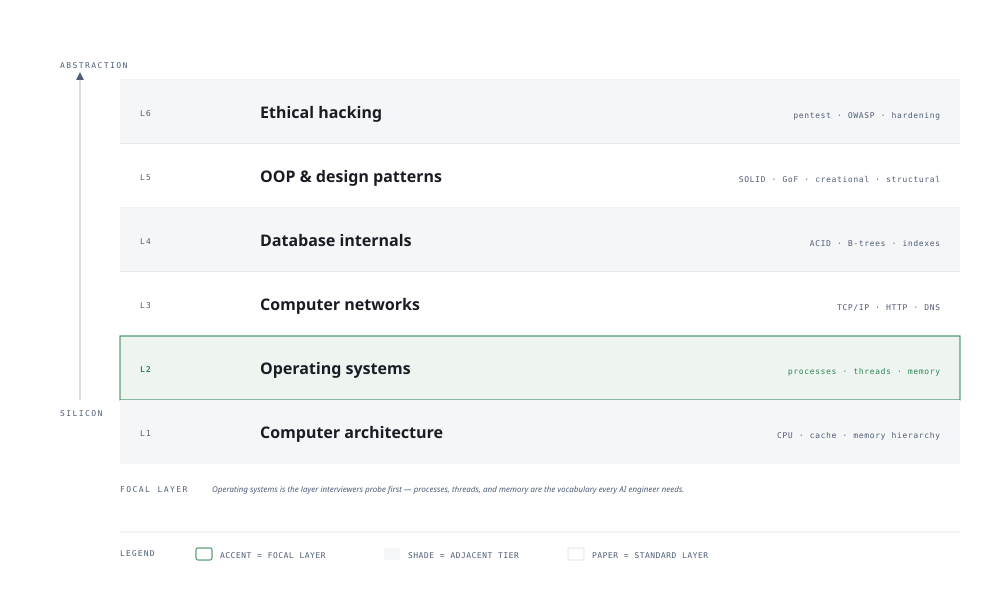

# Visual Notes — Core Computer Science

> One diagram, the full picture. This page is meant to be glanced at before reading the chapters, and again before interviews.

## What the diagram shows

The foundation stack is a sandwich: **data** at the bottom, **compute** in the middle, and **communication** on top.

1. **Data layer** — how information is structured and stored (databases, caches, message queues) and how it is moved.
2. **Compute layer** — where work happens: CPU, GPU, memory hierarchy, and the operating system that schedules it all.
3. **Communication layer** — networks, APIs, and protocols (TCP/IP, HTTP) that tie machines together.
4. **All systems** in an AI engineering job are some combination of these three layers talking to each other.

## Why this matters for placement

- Interviewers rarely ask "what is a B-tree?" — they ask *"why is this query slow?"* or *"how would you serve this model at 1000 QPS?"*
- Every answer traces back to the three layers: where the data lives, where the compute happens, and how they talk.

## Quick revision

- **Big-O** — the cost of an operation as input grows: `O(1)`, `O(log n)`, `O(n)`, `O(n log n)`, `O(n²)`.
- **Memory hierarchy** — registers → L1/L2/L3 cache → RAM → disk. Each level is ~10× slower than the one above.
- **Latency numbers** — L1 cache ~1 ns, RAM ~100 ns, SSD ~100 μs, network round trip ~1–100 ms.
- **Key protocols** — TCP (reliable, ordered), UDP (fast, lossy), HTTP/1.1 vs HTTP/2 vs HTTP/3.
- **Containers** — cgroups for resource limits, namespaces for isolation. Docker = easier to ship, not a VM.

## Related chapters

- [01 — Computer Networks](01-computer-networks.md) — the communication layer in depth
- [02 — Operating Systems](02-operating-systems.md) — the compute layer in depth
- [03 — Database Internals](03-database-internals.md) — the data layer in depth

---

**One-line answer for interviews:** *"Everything I build is about moving data to compute efficiently and reliably."*
