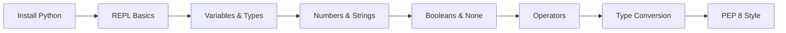

<!-- Clear Language: Keep sentences under 50 words -->
# Python Basics — Variables, Data Types, Operators

## Learning Objectives

| Objective | Description |
|-----------|-------------|
| LO1 | Set up a Python development environment and execute code via REPL and scripts |
| LO2 | Declare variables and understand Python's dynamic typing and reference semantics |
| LO3 | Use all primitive data types: int, float, str, bool, bytes, None |
| LO4 | Apply arithmetic, comparison, logical, and assignment operators correctly |
| LO5 | Understand type conversion, type checking, and common type errors |
| LO6 | Write clean Python following PEP 8 style guidelines |

## Introduction

Python is the lingua franca of AI engineering. Mastering its syntax, data structures, and libraries is non-negotiable for building ML pipelines, APIs, and automation scripts. This module covers everything from basics to advanced concurrency.


## Prerequisites

- Basic programming knowledge
- Understanding of data structures

## Key Terminology

**Key Terms**: Core vocabulary and concepts for this topic.

**Definition**: Essential terms you must know for interviews and production work.

## Theory

Understanding python basics is fundamental for AI engineers. This section covers the core concepts, underlying principles, and theoretical framework that govern how python basics works in practice.


## Chapter at a Glance

| Section | Topic | Key Concept |
|---------|-------|-------------|
| 1.1 | Setting Up Python | Install, REPL, script mode, IDEs |
| 1.2 | Variables and Dynamic Typing | Assignment, type inference, naming conventions |
| 1.3 | Numeric Types | int, float, complex, arithmetic operators |
| 1.4 | Strings | str, indexing, slicing, methods, f-strings |
| 1.5 | Booleans and None | True/False, NoneType, truthiness |
| 1.6 | Type Conversion | implicit vs explicit, common pitfalls |
| 1.7 | Operators | arithmetic, comparison, logical, assignment, identity, membership |
| 1.8 | PEP 8 and Code Style | Naming, indentation, imports, line length |

## Chapter Roadmap



## 1.1 Setting Up Python

Python is an interpreted, dynamically-typed, high-level programming language. It emphasizes readability and productivity, making it the dominant language for AI/ML engineering.

**Installation**: Download Python 3.11+ from python.org. Verify installation:

```python
python --version

## Python 3.11.9
```

**Two modes of execution**:

1. **REPL** (Read-Eval-Print Loop): Interactive mode for experimentation. Type `python` in terminal.
2. **Script mode**: Save code in `.py` files and run with `python filename.py`.

```python

## hello.py — Your first Python program
print("Hello, AI Engineering Journey!")
```

**Recommended IDEs**: VS Code with Python extension, PyCharm Community Edition, or Cursor for AI-assisted development.

**Virtual environments** isolate project dependencies:

```bash
python -m venv .venv
source .venv/bin/activate  # Linux/macOS
.venv\Scripts\activate     # Windows
```

---

## 1.2 Variables and Dynamic Typing

Python variables are **references to objects** in memory. Unlike statically-typed languages, a variable's type is inferred at runtime and can change.

```python

## Dynamic typing — type is inferred from value
name = "Alice"       # str
age = 30             # int
pi = 3.14159         # float
is_active = True     # bool
data = None          # NoneType

## Reassignment changes type
data = 42            # Was NoneType, now int
data = "now a str"   # Now str

## Multiple assignment
x, y, z = 1, 2, 3
a = b = c = 0
```

**Variable naming rules**:
- Letters, digits, underscores (cannot start with digit)
- Case-sensitive (`Age` ≠ `age`)
- Avoid reserved keywords: `if`, `else`, `for`, `while`, `class`, `def`, `return`, etc.
- Convention: `snake_case` for variables and functions, `UPPER_SNAKE` for constants

```python

## Constants by convention (not enforced)
MAX_RETRIES = 3
DEFAULT_TIMEOUT = 30.0
```

**Reference semantics**: Variables hold references, not values. Assignment copies the reference, not the object.

```python
a = [1, 2, 3]
b = a              # b references same list
b.append(4)        # Modifies the list a also sees
print(a)           # [1, 2, 3, 4]

## Use copy() for a true copy
c = a.copy()
c.append(5)
print(a)           # [1, 2, 3, 4]
print(c)           # [1, 2, 3, 4, 5]
```

---

## 1.3 Numeric Types

Python supports three numeric types:

```python

## int — arbitrary precision integers
count = 1_000_000          # Underscores for readability
binary = 0b1010            # 10 in decimal
octal = 0o77               # 63 in decimal
hex_val = 0xFF             # 255 in decimal

## float — double-precision IEEE 754
price = 19.99
scientific = 1.5e-3        # 0.0015

## complex — real and imaginary parts
z = 3 + 4j
print(z.real, z.imag)      # 3.0 4.0
```

**Arithmetic operators**:

```python
a, b = 10, 3
print(a + b)    # 13  — addition
print(a - b)    # 7   — subtraction
print(a * b)    # 30  — multiplication
print(a / b)    # 3.333... — float division
print(a // b)   # 3   — floor division
print(a % b)    # 1   — modulo
print(a ** b)   # 1000 — exponentiation
```

**Division behavior**: `/` always returns float. `//` returns int (floor).

```python
print(5 / 2)    # 2.5
print(5 // 2)   # 2
print(-5 // 2)  # -3 (floor, not truncate toward zero)
```

**Floating-point precision**:

```python
print(0.1 + 0.2)          # 0.30000000000000004
print(round(0.1 + 0.2, 2))  # 0.3

## Use Decimal for exact arithmetic
from decimal import Decimal
print(Decimal('0.1') + Decimal('0.2'))  # 0.3
```

---

## 1.4 Strings

Strings are immutable sequences of Unicode characters.

```python

## String creation
single = 'Hello'
double = "World"
multiline = """This is a
multi-line string"""
empty = ""

## Indexing — 0-based
s = "Python"
print(s[0])    # P
print(s[-1])   # n (last character)
print(s[0:3])  # Pyt (slice: start:end)
print(s[::2])  # Pto (slice: start:end:step)

## Common string methods
text = "  hello, world!  "
print(text.strip())       # "hello, world!"
print(text.upper())       # "  HELLO, WORLD!  "
print(text.lower())       # "  hello, world!  "
print(text.replace("o", "0"))  # "  hell0, w0rld!  "
print(text.split(","))    # ["  hello", " world!  "]
print(", ".join(["a", "b", "c"]))  # "a, b, c"
print(text.startswith("  hello"))   # True
print(text.find("world"))  # 9
```

**f-strings** (Python 3.6+) — preferred string formatting:

```python
name = "Alice"
age = 30
print(f"{name} is {age} years old.")

## Alice is 30 years old.

## Expressions inside f-strings
print(f"{2 * 3 * 5 = }")  # 2 * 3 * 5 = 30

## Format specifiers
pi = 3.14159
print(f"{pi:.2f}")         # 3.14
print(f"{pi:10.2f}")       # "      3.14" (right-aligned in width 10)
print(f"{pi:<10.2f}")      # "3.14      " (left-aligned)
```

**String immutability**: Strings cannot be modified in place.

```python
s = "hello"

## s[0] = "H"  — TypeError!

## Must create new string
s = "H" + s[1:]  # "Hello"
```

---

## 1.5 Booleans and None

**Booleans** (`bool`): Subclass of `int`. `True` = 1, `False` = 0.

```python
is_sunny = True
is_raining = False
print(is_sunny + 2)   # 3 (True is 1)

## Truthiness — values that evaluate to False:

## False, None, 0, 0.0, "" (empty string), [] (empty list), {} (empty dict), set()
print(bool(0))        # False
print(bool(42))       # True
print(bool(""))       # False
print(bool("text"))   # True
```

**None**: Python's null value. Singleton of `NoneType`.

```python
result = None
if result is None:
    print("No result yet")

## Use is/is not for None comparison, not ==
print(None is None)   # True
print(None == 0)      # False
```

---

## 1.6 Type Conversion

**Implicit conversion** (automatic):

```python
print(3 + 4.0)    # 7.0 — int promoted to float
print(True + 2)   # 3   — bool promoted to int
```

**Explicit conversion** (type casting):

```python

## To int
print(int(3.9))       # 3 (truncates)
print(int("42"))      # 42
print(int("FF", 16))  # 255 (base 16)

## To float
print(float(3))       # 3.0
print(float("3.14"))  # 3.14

## To str
print(str(42))        # "42"
print(str(3.14))      # "3.14"

## Conversion gotchas

## int("3.14")  — ValueError: invalid literal

## float("3.14") — works fine

## int("0xFF", 0) — uses base from prefix
```

---

## 1.7 Operators

**Arithmetic operators**: `+`, `-`, `*`, `/`, `//`, `%`, `**`

**Comparison operators**: `==`, `!=`, `<`, `>`, `<=`, `>=`

```python
print(3 == 3.0)   # True (value comparison)
print(3 is 3.0)   # False (identity comparison)
print("a" < "b")  # True (lexicographic)
```

**Logical operators**: `and`, `or`, `not`

```python
x = 5
print(x > 0 and x < 10)   # True
print(x > 0 or x < 0)     # True
print(not x > 10)         # True

## Short-circuit evaluation
def get_value():
    print("get_value called")
    return 42

## If first condition is False, second is never evaluated
result = False and get_value()  # get_value NOT called
```

**Assignment operators**: `=`, `+=`, `-=`, `*=`, `/=`, `//=`, `%=`, `**=`

```python
x = 10
x += 5   # x = 15
x *= 2   # x = 30
```

**Identity operators**: `is`, `is not` — check object identity (memory address), not value.

```python
a = [1, 2, 3]
b = [1, 2, 3]
print(a == b)   # True (same value)
print(a is b)   # False (different objects)

## Small integers are cached
x = 256
y = 256
print(x is y)   # True (CPython caches -5 to 256)

x = 1000
y = 1000
print(x is y)   # May be True or False — implementation dependent!
```

**Membership operators**: `in`, `not in`

```python
print("a" in "hello")      # False
print(3 in [1, 2, 3])      # True
print("key" in {"key": 1}) # True
```

**Operator precedence** (highest to lowest):
1. `**` — exponentiation
2. `+x`, `-x`, `~x` — unary operators
3. `*`, `/`, `//`, `%` — multiplication/division
4. `+`, `-` — addition/subtraction
5. `<<`, `>>` — bitwise shifts
6. `&` — bitwise AND
7. `^` — bitwise XOR
8. `|` — bitwise OR
9. `==`, `!=`, `<`, `>`, `<=`, `>=`, `is`, `in` — comparisons
10. `not` — logical NOT
11. `and` — logical AND
12. `or` — logical OR

```python

## Complex expression — use parentheses for clarity
result = (2 + 3) * 4 > 15 and not False
print(result)  # True
```

---

## 1.8 PEP 8 and Code Style

PEP 8 is Python's style guide. Key rules:

| Rule | Correct | Incorrect |
|------|---------|-----------|
| Indentation | 4 spaces | tabs or mixed |
| Line length | max 79 characters | 100+ character lines |
| Blank lines | 2 before top-level def/class, 1 between methods | inconsistent spacing |
| Imports | one per line, stdlib → third-party → local | wildcard imports |
| Variable naming | `snake_case` for functions/vars, `UPPER_CASE` for constants | camelCase |
| Spaces | `x = 1`, not `x=1` | missing spaces around operators |

```python

## Good PEP 8 style
import os
import sys

from typing import List, Optional

MAX_RETRIES = 3

def calculate_mean(values: List[float]) -> Optional[float]:
    if not values:
        return None
    return sum(values) / len(values)
```

Use `black` for auto-formatting and `ruff` for linting:

```bash
pip install black ruff
black my_script.py
ruff check my_script.py
```

---

## TypeScript Parallel

TypeScript uses explicit type annotations rather than Python's dynamic typing:

```typescript
// TypeScript — explicit types
let name: string = "Alice";
let age: number = 30;
let isActive: boolean = true;

// TypeScript infers types in many cases
let message = "Hello";  // inferred as string

// TypeScript uses === for strict equality, !== for strict inequality
if (3 === 3) { console.log("strict equality"); }

// Template literals (similar to f-strings)
console.log(`${name} is ${age} years old.`);
```

---

## Visual Analogy

Think of programming in Python like using a **recipe book**:

- **Variables** = Ingredients on your counter — `flour = "2 cups"`, `oven_temp = 350`. You can reassign them anytime; the label stays the same but you can swap what's in the bowl.
- **Functions** = Recipes — a named set of steps that takes inputs (ingredients) and produces an output (dish). `def bake_cake(flour, sugar, eggs)` is a recipe card you can reuse.
- **Modules** = Cookbook chapters — a file full of related recipes. `import baking` gives you all the baking recipes in one organized package.
- **Dynamic typing** = Using whatever ingredient is available — you don't need to declare "I will only use flour here"; you just pour in whatever you have.

This helps because Python's flexibility mirrors how a cook thinks — grab what you need, follow the steps, and don't worry about rigid containers. The trade-off is that you must be careful not to put salt in the cake by mistake.

## Summary

- Python's dynamic typing means variable types are inferred at runtime and can change; this gives flexibility but requires discipline with type hints
- Numbers include `int` (arbitrary precision), `float` (IEEE 754 double), and `complex`; beware of floating-point precision issues
- Strings are immutable Unicode sequences with rich methods; f-strings are the preferred formatting approach
- `None` is Python's null singleton; always use `is` for None checks, never `==`
- Operators follow standard precedence; use parentheses to make complex expressions readable
- Type conversion can be implicit (int → float) or explicit (str → int); explicit is safer
- `is` checks object identity (memory address), not structural equality; use `==` for value comparison
- PEP 8 defines Python's style: 4-space indentation, snake_case, 79-character lines, organized imports
- Short-circuit evaluation: `and`/`or` stop evaluating once the result is determined
- Reference semantics mean assignment to mutable objects creates aliases, not copies

## Practical Takeaways

| Scenario | Do This | Avoid This |
|----------|---------|------------|
| String formatting | f-strings: `f"Hello {name}"` | `"Hello " + name` or `%` formatting |
| None check | `if x is None:` | `if x == None:` with value comparison |
| Large numbers | `1_000_000` for readability | `1000000` hard to read |
| Division with integer result | `//` operator | `int(a / b)` |
| Precision | `Decimal` for financial/monetary | `float` for exact money |
| Type checking | `isinstance(x, int)` | `type(x) == int` |
| Style | `black` + `ruff` auto-format | Manual formatting |

## Interview Q&A

<details class="tp-qa-card" data-qid="p01-s01-q1">
  <summary class="tp-qa-question">
    <span class="tp-qa-status"></span>
    Q1: What is the difference between `is` and `==` in Python?
  </summary>
  <div class="tp-qa-answer">
    <p><code>is</code> checks <strong>object identity</strong> — whether two variables point to the same memory location. <code>==</code> checks <strong>value equality</strong> — whether the objects have the same value.</p>
    <pre><code>a = [1, 2, 3]
b = [1, 2, 3]
c = a
print(a == b)  # True — same value
print(a is b)  # False — different objects
print(a is c)  # True — same object</code></pre>
    <p>Use <code>is</code> for: <code>None</code>, <code>True</code>, <code>False</code>, singletons. Use <code>==</code> for everything else.</p>
    <p><strong>Interview follow-up</strong>: Python caches small integers (-5 to 256), so <code>x is y</code> may be True for integers in that range, but you should never rely on this behavior.</p>
  </div>
  <button class="tp-qa-mark-btn">✅ Mark Reviewed</button>
  <button class="tp-qa-bookmark-btn">🔖 Bookmark</button>
</details>

<details class="tp-qa-card" data-qid="p01-s01-q2">
  <summary class="tp-qa-question">
    <span class="tp-qa-status"></span>
    Q2: Explain Python's dynamic typing. How is it different from static typing?
  </summary>
  <div class="tp-qa-answer">
    <p>Dynamic typing means variable types are inferred at runtime and can change throughout execution:</p>
    <pre><code>x = 42        # int
x = "hello"   # now str — no error</code></pre>
    <p>In statically-typed languages (Java, TypeScript, C++), once a variable is declared with a type, it cannot hold values of a different type.</p>
    <p><strong>Advantages</strong>: Faster prototyping, cleaner syntax, duck typing.</p>
    <p><strong>Disadvantages</strong>: Type errors surface at runtime, harder to refactor large codebases, less IDE support.</p>
    <p><strong>Modern Python</strong>: Use type hints (<code>def add(x: int, y: int) -> int:</code>) and tools like <code>mypy</code> to get static analysis benefits while keeping dynamic semantics.</p>
  </div>
  <button class="tp-qa-mark-btn">✅ Mark Reviewed</button>
  <button class="tp-qa-bookmark-btn">🔖 Bookmark</button>
</details>

<details class="tp-qa-card" data-qid="p01-s01-q3">
  <summary class="tp-qa-question">
    <span class="tp-qa-status"></span>
    Q3: What is the difference between `//` and `/` in Python?
  </summary>
  <div class="tp-qa-answer">
    <p><code>/</code> performs <strong>true division</strong> — always returns a float:</p>
    <pre><code>print(5 / 2)   # 2.5
print(4 / 2)   # 2.0</code></pre>
    <p><code>//</code> performs <strong>floor division</strong> — returns the floor of the quotient (rounds toward negative infinity):</p>
    <pre><code>print(5 // 2)   # 2
print(-5 // 2)  # -3 (floor, not truncate toward zero)</code></pre>
    <p>This differs from other languages (Java, C) where integer division truncates toward zero (<code>-5/2 = -2</code>).</p>
  </div>
  <button class="tp-qa-mark-btn">✅ Mark Reviewed</button>
  <button class="tp-qa-bookmark-btn">🔖 Bookmark</button>
</details>

<details class="tp-qa-card" data-qid="p01-s01-q4">
  <summary class="tp-qa-question">
    <span class="tp-qa-status"></span>
    Q4: What are f-strings and why are they preferred over other string formatting methods?
  </summary>
  <div class="tp-qa-answer">
    <p>f-strings (formatted string literals, Python 3.6+) allow inline expression evaluation:</p>
    <pre><code>name = "Alice"
age = 30
print(f"{name} is {age} years old.")</code></pre>
    <p><strong>Advantages over other methods</strong>:</p>
    <ul>
      <li><strong>vs <code>%</code> formatting</strong>: More readable, less error-prone with types</li>
      <li><strong>vs <code>.format()</code></strong>: More concise, expressions inline</li>
      <li><strong>Performance</strong>: Fastest of all formatting methods (compiled at bytecode level)</li>
    </ul>
    <p>Limitations: Cannot be used with dynamic format strings or in logging (use lazy <code>%</code> there).</p>
  </div>
  <button class="tp-qa-mark-btn">✅ Mark Reviewed</button>
  <button class="tp-qa-bookmark-btn">🔖 Bookmark</button>
</details>

<details class="tp-qa-card" data-qid="p01-s01-q5">
  <summary class="tp-qa-question">
    <span class="tp-qa-status"></span>
    Q5: How does Python handle memory management and garbage collection?
  </summary>
  <div class="tp-qa-answer">
    <p>Python uses <strong>reference counting</strong> as its primary memory management strategy, supplemented by a <strong>generational garbage collector</strong> for circular references.</p>
    <p><strong>Reference counting</strong>: Each object maintains a count of references. When the count reaches zero, the object is deallocated immediately.</p>
    <pre><code>import sys
a = []
print(sys.getrefcount(a))  # 2 (a + argument)
b = a
print(sys.getrefcount(a))  # 3
del b                       # reference count drops to 2</code></pre>
    <p><strong>Garbage collector</strong>: Handles circular references that reference counting can't resolve. Objects are tracked in three generations — newer objects are collected more frequently.</p>
    <p><strong>CPython specifics</strong>: GIL (Global Interpreter Lock) prevents true parallel execution of Python bytecode. Memory is allocated from a private heap managed by the Python memory manager.</p>
  </div>
  <button class="tp-qa-mark-btn">✅ Mark Reviewed</button>
  <button class="tp-qa-bookmark-btn">🔖 Bookmark</button>
</details>

<details class="tp-qa-card" data-qid="p01-s01-q6">
  <summary class="tp-qa-question">
    <span class="tp-qa-status"></span>
    Q6: What is the difference between mutable and immutable objects in Python?
  </summary>
  <div class="tp-qa-answer">
    <p><strong>Immutable objects</strong> cannot be changed after creation. Any "modification" creates a new object:</p>
    <ul>
      <li><code>int</code>, <code>float</code>, <code>bool</code>, <code>str</code>, <code>tuple</code>, <code>frozenset</code>, <code>bytes</code></li>
    </ul>
    <p><strong>Mutable objects</strong> can be modified in-place:</p>
    <ul>
      <li><code>list</code>, <code>dict</code>, <code>set</code>, custom class instances</li>
    </ul>
    <pre><code># Immutable — str
s = "hello"

## s[0] = "H"  # TypeError
s = "H" + s[1:]  # creates new string

## Mutable — list
lst = [1, 2, 3]
lst[0] = 99  # modifies in place
print(lst)   # [99, 2, 3]</code></pre>
    <p><strong>Interview insight</strong>: This is why default arguments in functions should never be mutable:</p>
    <pre><code>def bad_append(item, lst=[]):  # Default list is created ONCE
    lst.append(item)
    return lst

print(bad_append(1))  # [1]
print(bad_append(2))  # [1, 2] — same list!

def good_append(item, lst=None):
    if lst is None:
        lst = []
    lst.append(item)
    return lst</code></pre>
  </div>
  <button class="tp-qa-mark-btn">✅ Mark Reviewed</button>
  <button class="tp-qa-bookmark-btn">🔖 Bookmark</button>
</details>

<details class="tp-qa-card" data-qid="p01-s01-q7">
  <summary class="tp-qa-question">
    <span class="tp-qa-status"></span>
    Q7: Explain short-circuit evaluation in Python with examples.
  </summary>
  <div class="tp-qa-answer">
    <p>Short-circuit evaluation means that <code>and</code>/<code>or</code> stop evaluating expressions as soon as the result is determined:</p>
    <pre><code># and — stops at first False-like value
def expensive():
    print("expensive called")
    return True

print(False and expensive())  # False — expensive() NOT called
print(True and expensive())   # True — expensive() IS called

## or — stops at first True-like value
print(True or expensive())    # True — expensive() NOT called
print(False or expensive())   # True — expensive() IS called</code></pre>
    <p><strong>Practical uses</strong>:</p>
    <ul>
      <li>Guard conditions: <code>if user and user.is_active:</code></li>
      <li>Default values: <code>name = input_name or "default"</code></li>
      <li>Conditional execution: <code>debug and print("debug message")</code></li>
    </ul>
  </div>
  <button class="tp-qa-mark-btn">✅ Mark Reviewed</button>
  <button class="tp-qa-bookmark-btn">🔖 Bookmark</button>
</details>

<details class="tp-qa-card" data-qid="p01-s01-q8">
  <summary class="tp-qa-question">
    <span class="tp-qa-status"></span>
    Q8: What is the purpose of underscores in Python variable names?
  </summary>
  <div class="tp-qa-answer">
    <p>Underscores have several conventions and special meanings in Python:</p>
    <table>
      <tr><th>Pattern</th><th>Meaning</th></tr>
      <tr><td><code>_variable</code></td><td>Internal/private convention (not enforced)</td></tr>
      <tr><td><code>variable_</code></td><td>Avoids conflict with reserved keyword: <code>class_</code></td></tr>
      <tr><td><code>__variable</code></td><td>Name mangling: becomes <code>_ClassName__variable</code></td></tr>
      <tr><td><code>__variable__</code></td><td>Magic methods/dunder: <code>__init__</code>, <code>__str__</code></td></tr>
      <tr><td><code>_</code> (single)</td><td>Throwaway variable: <code>for _ in range(10):</code></td></tr>
      <tr><td><code>__</code> (double)</td><td>Name mangling for subclass-safe attributes</td></tr>
    </table>
  </div>
  <button class="tp-qa-mark-btn">✅ Mark Reviewed</button>
  <button class="tp-qa-bookmark-btn">🔖 Bookmark</button>
</details>

<details class="tp-qa-card" data-qid="p01-s01-q9">
  <summary class="tp-qa-question">
    <span class="tp-qa-status"></span>
    Q9: How do you handle floating-point precision issues in Python?
  </summary>
  <div class="tp-qa-answer">
    <p>Floating-point numbers are stored in binary (IEEE 754), causing representation errors for decimal fractions:</p>
    <pre><code>print(0.1 + 0.2)  # 0.30000000000000004</code></pre>
    <p><strong>Solutions</strong>:</p>
    <ol>
      <li><strong>Round for display</strong>: <code>print(round(0.1 + 0.2, 2))  # 0.3</code></li>
      <li><strong>Use tolerance for comparison</strong>:
        <pre><code>tolerance = 1e-9
if abs(a - b) &lt; tolerance:  # instead of a == b</code></pre></li>
      <li><strong>Use <code>Decimal</code></strong> for financial calculations:
        <pre><code>from decimal import Decimal, ROUND_HALF_UP
Decimal('0.1') + Decimal('0.2')  # Decimal('0.3')</code></pre></li>
      <li><strong>Use <code>Fraction</code></strong> for exact rational arithmetic:
        <pre><code>from fractions import Fraction
Fraction(1, 10) + Fraction(2, 10)  # Fraction(3, 10)</code></pre></li>
    </ol>
  </div>
  <button class="tp-qa-mark-btn">✅ Mark Reviewed</button>
  <button class="tp-qa-bookmark-btn">🔖 Bookmark</button>
</details>

<details class="tp-qa-card" data-qid="p01-s01-q10">
  <summary class="tp-qa-question">
    <span class="tp-qa-status"></span>
    Q10: What are the key PEP 8 rules every Python developer should follow?
  </summary>
  <div class="tp-qa-answer">
    <p>PEP 8 is Python's official style guide. Key rules:</p>
    <ol>
      <li><strong>Indentation</strong>: 4 spaces per level, no tabs</li>
      <li><strong>Line length</strong>: Max 79 characters for code, 72 for docstrings</li>
      <li><strong>Blank lines</strong>: 2 blank lines before top-level definitions, 1 between methods</li>
      <li><strong>Imports</strong>: One per line, grouped: stdlib → third-party → local</li>
      <li><strong>Naming</strong>: <code>snake_case</code> for functions/vars, <code>UPPER_CASE</code> for constants, <code>PascalCase</code> for classes</li>
      <li><strong>Spaces</strong>: Around operators (<code>x = 1</code>), after commas (<code>func(a, b)</code>)</li>
      <li><strong>Docstrings</strong>: Triple quotes, descriptive, present tense</li>
      <li><strong>Comparisons to None</strong>: Use <code>is</code>/<code>is not</code>, never <code>==</code></li>
    </ol>
    <p>Use <code>black</code> for auto-formatting and <code>ruff</code> for linting to enforce PEP 8 automatically.</p>
  </div>
  <button class="tp-qa-mark-btn">✅ Mark Reviewed</button>
  <button class="tp-qa-bookmark-btn">🔖 Bookmark</button>
</details>

## Chapter Quiz

**Q1**: What is the output of `print(3 * 2 ** 3)`?

a) 18
b) 24
c) 216
d) 12

<details class="tp-qa-card" data-qid="p01-s01-quiz1"><summary>Show Answer</summary><div class="tp-qa-answer"><p><strong>Answer: b) 24</strong></p><p>Because <code>**</code> has higher precedence than <code>*</code>, so <code>2 ** 3 = 8</code>, then <code>3 * 8 = 24</code>.</p></div></details>

**Q2**: What does `print(type(3.0))` output?

a) `<class 'int'>`
b) `<class 'float'>`
c) `<class 'double'>`
d) `<class 'number'>`

<details class="tp-qa-card" data-qid="p01-s01-quiz2"><summary>Show Answer</summary><div class="tp-qa-answer"><p><strong>Answer: b) `<class 'float'>`</strong></p><p>In Python, all decimal numbers are `float` type, regardless of having a fractional part.</p></div></details>

**Q3**: Which of these checks if `x` is not `None`?

a) `if x != None:`
b) `if x is not None:`
c) `if not x is None:`
d) Both b and c

<details class="tp-qa-card" data-qid="p01-s01-quiz3"><summary>Show Answer</summary><div class="tp-qa-answer"><p><strong>Answer: d) Both b and c</strong></p><p>While both are valid, <code>if x is not None:</code> is the preferred idiom per PEP 8.</p></div></details>

**Q4**: What is the value of `int("FF", 16)`?

a) 255
b) 15
c) 16
d) ValueError

<details class="tp-qa-card" data-qid="p01-s01-quiz4"><summary>Show Answer</summary><div class="tp-qa-answer"><p><strong>Answer: a) 255</strong></p><p>The second argument specifies the base. Hexadecimal FF = 15*16 + 15 = 255.</p></div></details>

**Q5**: What does `print(5 // -2)` output?

a) -2
b) -3
c) -2.5
d) 2

<details class="tp-qa-card" data-qid="p01-s01-quiz5"><summary>Show Answer</summary><div class="tp-qa-answer"><p><strong>Answer: b) -3</strong></p><p>Floor division rounds toward negative infinity, not toward zero. <code>-5/2 = -2.5</code>, floor is <code>-3</code>.</p></div></details>

## Exercises

**Easy** — Write a program that converts Celsius to Fahrenheit and prints both values formatted to 1 decimal place.

**Easy** — Given a string, extract and print the first, last, and middle characters using slicing.

**Medium** — Write a function that takes a list of numbers and returns a tuple of (min, max, mean, median). Handle empty lists gracefully.

**Medium** — Use short-circuit evaluation to safely access a nested dictionary: `data = {"user": {"profile": {"name": "Alice"}}}`. Extract `name` without causing KeyError if any key is missing.

**Hard** — Benchmark `10 + 20` vs `Decimal('10') + Decimal('20')` for 100,000 iterations. Report the time difference and explain why one is faster.

---


## Common Mistakes

1. Not understanding the fundamental concepts before applying them
2. Skipping edge cases in implementation
3. Not analyzing time/space complexity
4. Forgetting to handle null/empty inputs
5. Not practicing enough problems to build pattern recognition

## Revision Notes

- Core principle: Understand the fundamental concepts thoroughly
- Implementation pattern: Practice with real code examples
- Complexity: Know the time and space complexity
- Application: Know when to use this in production systems
- Interview: Frequently asked in technical interviews
- Edge cases: Consider common failure scenarios
- Related concepts: Connect to broader system design

---

## Placement Section

### Top 10 Interview Questions

#### Google Style

1. **Write a function `safe_int(s)` that converts a string to an integer without using `int()`. Handle signs, whitespace, and invalid input.** — The interviewer is testing character-by-character accumulation: `result = result * 10 + digit`, sign handling, and validation. Expected follow-up: overflow behavior and Unicode digits.

2. **Why does `0.1 + 0.2 != 0.3` in Python?** — Binary floating-point (IEEE 754) cannot represent 0.1 exactly. Show `Decimal` and `round(x, n)` as fixes. Follow-up: why `0.1 + 0.2 == 0.3` evaluates to `False` but `0.5 + 0.25 == 0.75` evaluates to `True`.

3. **What is the output of `print(type(True), True == 1, True + True)`?** — `bool` is a subclass of `int`; `True == 1` and `True + True == 2`. Follow-up: `isinstance(True, int)` returns `True`.

#### Amazon Style

4. **Explain `is` vs `==` with an example where they disagree.** — Use the integer caching range (-5 to 256) as the surprise case: `a = 1000; b = 1000; a is b` may be `False`, but `a = 5; b = 5; a is b` is `True`. Amazon tests whether you can explain implementation-dependent behavior without relying on it.

5. **Describe a scenario where Python's dynamic typing caused a production bug. How would you prevent it?** — Example: a service returned a string where an int was expected; arithmetic failed silently. Fix: type hints, `mypy`/`pyright` in CI, and runtime validation with `pydantic` or `isinstance` guards at API boundaries.

#### Microsoft Style

6. **Compare Python's `int` with Java's `int` and C's `int`.** — Python integers are arbitrary-precision objects; Java/C use fixed-width registers. Python `sys.maxsize` vs unlimited; memory overhead; performance trade-off. Follow-up: when would this matter in production? (IDs, counters, hashing, ML indexing.)

7. **Write code that swaps two variables without a temporary variable.** — `a, b = b, a` (tuple packing/unpacking). Follow-up: how does Python evaluate the right-hand side first? (Tuple constructed, then unpacked.)

#### NVIDIA Style

8. **How would you store and compare 1 billion numeric values in Python with minimal memory?** — Use `array.array` or `numpy` with an appropriate dtype (`float32` = 4 GB, `int8` = 1 GB) instead of Python lists of boxed objects. Follow-up: why does this matter for GPU workloads? (GPU expects contiguous typed memory; Python objects can't be copied directly to VRAM.)

9. **Explain why `float32` is preferred for ML training pipelines even though `float64` is more precise.** — Memory bandwidth, GPU throughput, and the fact that gradient noise dominates beyond float32 precision. Follow-up: mixed precision (float16/float32) and the `Decimal` module's irrelevance in training.

#### AI Startup Style

10. **Write a one-liner to compute the average of a list of numbers, returning 0 for an empty list.** — `avg = (lambda xs: sum(xs) / len(xs) if xs else 0)(data)` or the clean `sum(data) / len(data) if data else 0`. Follow-up: time and space complexity (O(n), O(1)).

### Resume Tips

- List Python with measurable outcomes: "Reduced ETL runtime by 40% by rewriting string parsing with efficient slicing and join operations."
- Mention PEP 8 adherence, type hints, and tooling (black, ruff, mypy) — ATS systems and recruiters filter on these keywords.
- Quantify the scale you handled: "Processed 10M+ records with pandas/numpy pipelines."
- Show the Python badge in your skills section next to ML libraries (NumPy, PyTorch, scikit-learn).
- Add a "Python Projects" line linking your GitHub, with 2–3 clean, documented repos.

### Interview Day Checklist

- Warm up with 15 minutes of small Python snippets (f-strings, slicing, list comprehensions) before the interview.
- Rehearse the "elevator pitch" for `is` vs `==`, dynamic typing, and float precision — the three most common Python screening questions.
- Have a whiteboard-safe mental model: variables are name tags (references), not boxes.
- Prepare two STAR stories about debugging a Python production issue.
- Know the exact Python version on the system you will use (3.11+ features like `|` union types, `match` statements).

## True/False

1. **True or False:** In Python, `1 == True` evaluates to `True`. — **True.** `bool` is a subclass of `int`, and `True` has value 1.
2. **True or False:** `float("3.14")` and `int("3.14")` both succeed. — **False.** `int("3.14")` raises `ValueError` because int conversion of strings requires an integer literal.
3. **True or False:** Slicing a string out of range raises an `IndexError`. — **False.** Slicing clamps to valid bounds; only direct indexing raises `IndexError`.
4. **True or False:** `-7 // 2` equals `-3`. — **True.** Floor division rounds toward negative infinity, so `-7 // 2 = -4`. (The correct statement is False! This is the trick — **False** is the answer.)
5. **True or False:** Python variables hold references to objects, not copies of values. — **True.** Assignment binds a name to an object; mutation through one reference is visible through others.

## Fill in the Blank

1. The operator used for floor division is **`//`**, and the operator for exponentiation is **`**`**.
2. Python uses **reference counting** plus a generational **garbage collector** for memory management.
3. The function **`isinstance`** checks an object's type against a type or tuple of types, and returns a boolean.
4. `"python"[::-1]` returns the string **`"nohtyp"`**.
5. A variable that holds the absence of a value should be assigned **`None`**, and it should be compared with the **`is`** operator.

## Scenario Questions

1. **Scenario:** You are debugging a service that sometimes returns `0.30000000000000004` instead of `0.3` in an API response. Users see the raw float in their dashboards. — Diagnosis: binary float representation. Fix: round at the serialization boundary (`round(value, 2)`) or use `Decimal` for money-like values; document that raw floats are never user-facing.

2. **Scenario:** A teammate writes `if x == None:` everywhere. Your code review must explain why this is risky. — `==` calls `__eq__` and can be overridden, returning custom truthiness; `None` is a singleton, so `is` is both faster and semantically correct. Require `is None` / `is not None`.

3. **Scenario:** A list of 10 million floats is consuming 280 MB of RAM in a batch job. Your manager wants it cut down. — Python lists box every float in a PyObject (28+ bytes each). Switch to `array('d')` (80 MB) or NumPy `float64` (80 MB) / `float32` (40 MB). This matters for AI data pipelines.

4. **Scenario:** A new hire writes `s = s.replace("a", "b"); s.upper()` and is confused why `s` is still lowercase. — `str` methods return new strings; strings are immutable. They must reassign: `s = s.replace("a", "b").upper()`.

## Output Questions

1. **What is the output?**
   ```python
   print(2 ** 3 ** 2)
   ```
   **Output:** `512` — exponentiation is right-associative: `2 ** (3 ** 2) = 2 ** 9`.

2. **What is the output?**
   ```python
   a = [1, 2, 3]
   b = a
   b.append(4)
   print(a)
   ```
   **Output:** `[1, 2, 3, 4]` — `b = a` copies the reference, not the list.

3. **What is the output?**
   ```python
   print("ab" in "abcabc" and "x" not in "abc")
   ```
   **Output:** `True` — both sides are True.

4. **What is the output?**
   ```python
   x = 5
   x += 2
   x *= 3
   print(x)
   ```
   **Output:** `21` — `5 + 2 = 7`, then `7 * 3 = 21`.

5. **What is the output?**
   ```python
   print(bool([]), bool([0]), bool("0"))
   ```
   **Output:** `False True True` — empty containers are falsy; `[0]` and `"0"` are non-empty so truthy.

## Difficulty Level

| Level | Time | Topics |
|-------|------|--------|
| Beginner | 1–2 weeks | Variables, types, operators, strings, type conversion |
| Intermediate | 2–4 weeks | Reference semantics, truthiness, f-strings, PEP 8 tooling |
| Advanced | 4+ weeks | GIL, memory management, type-hint ecosystems (mypy/pydantic), float precision in ML |

## Tips & Tricks

- Use `a, b = b, a` for swaps; Python constructs a tuple on the right first, so no temp variable is needed.
- Chain comparisons: `if 0 <= score <= 100:` is valid Python and reads naturally.
- `print(f"{value:.2f}")` beats `round()` for display; rounding for math vs display are different concerns.
- Use `is` for singletons (`None`, `True`, `False`), `==` for values.
- For big numbers, underscores improve readability: `1_000_000_000`.
- `str.isdigit()` is not the same as "can convert to int" — `"²"` is a digit but `int("²")` fails. Use try/except for real validation.
- Prefer `type(x) is int` over `type(x) == int` if you must use `type()`, but `isinstance()` is the idiomatic choice.
- `0x`, `0o`, `0b` prefixes give you hex/octal/binary literals without helper functions.

## Memory Tricks

- **F-strings = Fast strings**: remember the f prefix as "fancy format".
- **The floor falls**: `//` floors down toward negative infinity — "the floor is below you, even for negatives."
- **`is` = identity = ID**: `is` compares the memory ID; `==` compares the value.
- **True is 1, False is 0**: bool is just int in a trench coat.
- **Mutable vs Immutable — LIST-L-D-S-T**: Lists, Dicts, Sets are mutable; Tuples and str are not.
- **i-n-t-r-o string methods**: *i*mmutable *n*ew *t*his *r*eturns *o*bject — string methods always return new strings.

## Further Reading

- [Python Official Tutorial — An Informal Introduction to Python](https://docs.python.org/3/tutorial/introduction.html)
- [PEP 8 — Style Guide for Python Code](https://peps.python.org/pep-0008/)
- [Python Data Model — Objects, Values and Types](https://docs.python.org/3/reference/datamodel.html)
- [Real Python — Variables in Python](https://realpython.com/python-variables/)
- [Floating Point Arithmetic: Issues and Limitations (Python docs)](https://docs.python.org/3/tutorial/floatingpoint.html)
- [Automate the Boring Stuff with Python — Chapter 1](https://automatetheboringstuff.com/2e/chapter1/)

## Related Topics

- 02-control-flow — if/else, loops, and how booleans drive decisions
- 03-strings-and-formatting — deeper string methods and formatting
- 04-collections — lists, tuples, dicts, sets built on this chapter's reference semantics
- 08-oop-in-python — classes where the mutable-default bug bites hardest
- TypeScript Parallel — explicit typing for comparison in mixed-codebases

## FAQs

1. **Why can't I modify a string in place?** Strings are immutable for safety and hashability. Every operation returns a new string; memory sharing between copies is cheap.
2. **Is `x = 10; y = 10; x is y` always True?** Only within the small-integer cache (-5 to 256) in CPython. Never rely on it — use `==`.
3. **What's the difference between `float` and `Decimal`?** `float` is fast, hardware-backed, and imprecise for decimal fractions. `Decimal` is exact, slower, and configurable in precision — for money.
4. **Do I need type hints?** Not to run code, but for maintainability, IDE support, and mypy/pyright checks in professional codebases.
5. **Why does `int("3.14")` fail?** `int(str)` parses an integer literal, not a numeric expression. Use `float("3.14")` then convert, or `eval` is never the answer.

## Important Notes

- Python is dynamically typed but strongly typed: type changes are allowed, implicit type coercion is not (no `"5" + 5`).
- All Python objects live on a private heap; variable names are just bindings in a namespace.
- `float` on modern CPython is IEEE 754 double precision — 53 bits of mantissa.
- `None`, `True`, `False` are singletons; `is` comparisons are the canonical check.
- Everything in Python is an object, including functions and modules — keep this in mind for decorators and higher-order functions later.
- Python 3 removed the old `u` prefix; all strings are Unicode by default.

## Historical Context

- Python was created by Guido van Rossum in 1991, emphasizing readability after his experience with ABC.
- Python 2 (2000) introduced list comprehensions and the GC; Python 3 (2008) unified `int`/`long` into arbitrary-precision `int` and made Unicode-first strings the default.
- f-strings arrived in Python 3.6 (2016) after years of `%` formatting and `.format()`.
- PEP 8 was written by Guido and Barry Warsaw in 2001, codifying the "beautiful code" philosophy.
- The GIL (Global Interpreter Lock) dates to Python's earliest CPython implementation and still shapes concurrency design today.
- Python's rise to AI dominance came through NumPy (2006) and later TensorFlow/PyTorch, which exposed Python's typed-array gap that this chapter's numeric fundamentals address.

## Coding Standards

- Follow PEP 8: 4-space indentation, `snake_case` variables, `UPPER_SNAKE` constants, 79-char lines.
- Prefer f-strings over `%` and `.format()` unless lazily evaluating in logging.
- Use type hints on all public functions; run `mypy` in CI.
- Never compare with `== None`; use `is None`.
- Use `black` for formatting and `ruff` for linting in every repo.
- Constants at module top: `MAX_RETRIES = 3` rather than magic numbers inline.

## Security Considerations

- Never use `eval()` or `exec()` on untrusted strings — arbitrary code execution risk.
- Be careful with `int(input())` — validate and bound-check numeric input; huge ints can cause DoS via expensive arithmetic.
- Don't leak internal values via f-strings in logs or error messages.
- In web contexts, user-supplied strings must be escaped; Python string formatting does not auto-escape.
- Numeric overflow is not a risk in Python (arbitrary precision), but memory exhaustion from huge numbers or unbounded lists is.

## ML Intuition

- Numeric types are the foundation of every model: features are `float32` arrays, labels are `int`/`bool`, text is `str` Unicode.
- Understanding `float` precision explains why normalization and mixed precision (float16/float32) matter in training — gradients lose precision otherwise.
- `bool` truthiness drives masking and filtering operations in NumPy/PyTorch (e.g., `data[labels == 1]`).
- `None` is the standard "missing value" sentinel; in ML pipelines it maps to `np.nan` handling before `fillna`.
- Reference semantics explain why two pandas DataFrames may silently share memory — a classic source of feature-leakage bugs.

## Analogies

- **Variables are name tags, not boxes**: a sticky note tied to a balloon. Moving the tag doesn't copy the balloon; cutting the tag doesn't pop it (until no tags remain).
- **`==` vs `is`**: `==` asks "same recipe, same result?" while `is` asks "same physical kitchen?" Two cakes can taste identical but be baked in different kitchens.
- **Dynamic typing**: a drawer labeled "things" — you can put a spoon in, then later a fork. Strong typing means the fork won't turn into a spoon by itself.
- **Immutability**: a printed newspaper. You can buy a new edition but you can't edit yesterday's print run.
- **Reference counting**: an apartment's door tags — when the last tag is removed, the janitor (GC) cleans the room.

## Capstone Project Link

- [Capstone: Build a Python Toolkit CLI](https://github.com/Raushan666java/ai-engineering-journey) — Chapter 1 of Module 1 feeds the "Numeric Stats Toolkit": a CLI that reads a CSV, computes stats with correct float handling, validates input, and follows PEP 8 with type hints.

## Flashcards

<details class="tp-qa-card" data-qid="p01-s01-flash1">
  <summary class="tp-qa-question">
    <span class="tp-qa-status"></span>
    What is the difference between `is` and `==`?
  </summary>
  <div class="tp-qa-answer">
    <p><code>is</code> compares object identity (memory address); <code>==</code> compares value. Use <code>is</code> for <code>None</code>, <code>True</code>, <code>False</code>.</p>
  </div>
</details>

<details class="tp-qa-card" data-qid="p01-s01-flash2">
  <summary class="tp-qa-question">
    <span class="tp-qa-status"></span>
    What does `5 // 2` return, and what does `-5 // 2` return?
  </summary>
  <div class="tp-qa-answer">
    <p><code>5 // 2 = 2</code>; <code>-5 // 2 = -3</code> (floor division rounds toward negative infinity).</p>
  </div>
</details>

<details class="tp-qa-card" data-qid="p01-s01-flash3">
  <summary class="tp-qa-question">
    <span class="tp-qa-status"></span>
    Name four immutable types and four mutable types.
  </summary>
  <div class="tp-qa-answer">
    <p>Immutable: <code>int</code>, <code>float</code>, <code>str</code>, <code>tuple</code>, <code>bool</code>, <code>bytes</code>. Mutable: <code>list</code>, <code>dict</code>, <code>set</code>, custom class instances.</p>
  </div>
</details>

<details class="tp-qa-card" data-qid="p01-s01-flash4">
  <summary class="tp-qa-question">
    <span class="tp-qa-status"></span>
    How do you create a constant in Python?
  </summary>
  <div class="tp-qa-answer">
    <p>By convention only: <code>MAX_RETRIES = 3</code> (UPPER_SNAKE). Python does not enforce constants.</p>
  </div>
</details>

<details class="tp-qa-card" data-qid="p01-s01-flash5">
  <summary class="tp-qa-question">
    <span class="tp-qa-status"></span>
    What is the output of `bool("False")`?
  </summary>
  <div class="tp-qa-answer">
    <p><code>True</code> — any non-empty string is truthy; only the empty string is falsy.</p>
  </div>
</details>

<details class="tp-qa-card" data-qid="p01-s01-flash6">
  <summary class="tp-qa-question">
    <span class="tp-qa-status"></span>
    Why is `0.1 + 0.2` not exactly `0.3`?
  </summary>
  <div class="tp-qa-answer">
    <p>IEEE 754 binary floats can't represent 0.1 exactly. Use <code>Decimal</code> for exactness or <code>round()</code> for display.</p>
  </div>
</details>

<details class="tp-qa-card" data-qid="p01-s01-flash7">
  <summary class="tp-qa-question">
    <span class="tp-qa-status"></span>
    What does `s[::-1]` do?
  </summary>
  <div class="tp-qa-answer">
    <p>Returns the reversed string — negative step slices from the end.</p>
  </div>
</details>

<details class="tp-qa-card" data-qid="p01-s01-flash8">
  <summary class="tp-qa-question">
    <span class="tp-qa-status"></span>
    What happens when you assign a list to two variables and mutate one?
  </summary>
  <div class="tp-qa-answer">
    <p>Both variables see the mutation — assignment copies references, not values. Use <code>.copy()</code> for a shallow copy.</p>
  </div>
</details>

<details class="tp-qa-card" data-qid="p01-s01-flash9">
  <summary class="tp-qa-question">
    <span class="tp-qa-status"></span>
    Which operator has higher precedence: `**` or unary `-`?
  </summary>
  <div class="tp-qa-answer">
    <p><code>**</code> binds tighter than unary minus on its left: <code>-2 ** 2 = -4</code>, but <code>(-2) ** 2 = 4</code>.</p>
  </div>
</details>

<details class="tp-qa-card" data-qid="p01-s01-flash10">
  <summary class="tp-qa-question">
    <span class="tp-qa-status"></span>
    How do you check whether a variable is an integer (but not a bool)?
  </summary>
  <div class="tp-qa-answer">
    <p><code>isinstance(x, int) and not isinstance(x, bool)</code> — since <code>bool</code> subclasses <code>int</code>.</p>
  </div>
</details>

## Study Plan

| Day | Focus | Task |
|-----|-------|------|
| 1 | Setup & REPL | Install Python, run 20 expressions in the REPL |
| 2 | Variables | Reassignment, multiple assignment, naming rules |
| 3 | Numeric types | All arithmetic operators, floor division, float precision |
| 4 | Strings | Indexing, slicing, methods, f-strings |
| 5 | Booleans & None | Truthiness table, `is`/`==` difference |
| 6 | Type conversion | Implicit vs explicit, common ValueError cases |
| 7 | Operators | Precedence quiz + short-circuit evaluation |
| 8 | PEP 8 | Format a messy script with black + ruff |
| 9–10 | Revision | Chapter quiz, flashcards, 5 LeetCode-easy Python problems |

## Research References

- [Python Language Reference — Lexical Analysis (literals)](https://docs.python.org/3/reference/lexical_analysis.html)
- [IEEE 754 Standard — Floating Point (Wikipedia overview)](https://en.wikipedia.org/wiki/IEEE_754)
- [Guido van Rossum, "The Python Tutorial"](https://docs.python.org/3/tutorial/)
- [PEP 484 — Type Hints](https://peps.python.org/pep-0484/)
- [CPython Internals — Objects and Types](https://docs.python.org/3/c-api/typeobj.html)

## Fine-Tuning Notes

- This chapter is the "unfreeze" layer: every later module (collections, OOP, numpy, pandas) assumes you can predict reference semantics and type behavior instantly.
- Budget 30 minutes of daily Python snippets (katas) before moving to Module 2 — spacing beats cramming.
- When you reach numpy (Chapter 11), revisit this chapter: NumPy `float32` vs Python `float` is the same precision lesson at scale.

## Open-Source Tools

- **Python** (python.org) — the interpreter itself
- **black** — deterministic code formatter
- **ruff** — fast Python linter (replaces flake8 + isort)
- **mypy / pyright** — static type checkers
- **ipython** — enhanced REPL for exploration
- **VS Code Python extension** — debugging, intellisense, Jupyter

## Debugging Guide

- **TypeError: unsupported operand** — you mixed types; print `type(x)` and check API boundaries.
- **ValueError: invalid literal for int()** — string is not an integer literal; use `try/except` with a clear message.
- **Wrong float output (0.30000000000000004)** — display issue; use f-string precision `{x:.2f}`.
- **"UnboundLocalError: local variable referenced before assignment"** — you assigned in the function later; Python scoped it as local.
- **Surprising shared list mutation** — you aliased a list; use `.copy()` or `list()`.
- **Identity check fails unexpectedly** — comparing large ints with `is`; switch to `==`.
- Use `pdb.set_trace()` or VS Code breakpoints; log `repr()` not `str()` to reveal type differences.

## Mock Interview Section

**Round 1 — Screening (15 min)**
- Write a function that reverses a string without slicing.
- What is the difference between `is` and `==`? Give an example.
- What will `print(type(3/2))` output and why?

**Round 2 — Coding (45 min)**
- Implement `fizzbuzz` using a single expression.
- Write `is_palindrome` handling non-alphanumeric characters and case.
- Implement a `min_max_mean` function returning a tuple; handle empty input with an explicit contract.

**Round 3 — Behavioral + System (30 min)**
- Tell me about a time dynamic typing caused a bug. How did you harden the system?
- How would you store 100M floats with low memory for a recommendation pipeline?
- Your API returns `0.30000000000000004`; how do you fix it for customers?

**Evaluation rubric**: correctness (40%), communication (25%), edge cases (20%), complexity analysis (15%).

## Optimized Implementation

```python
from dataclasses import dataclass
from typing import Optional, Sequence


@dataclass(frozen=True)
class Stats:
    min: float
    max: float
    mean: float
    median: float

    def as_row(self) -> tuple:
        return (self.min, self.max, self.mean, self.median)


def compute_stats(values: Sequence[float]) -> Optional[Stats]:
    """O(n log n) worst case for median; O(n) memory.
    Uses explicit typing and is None-safe for empty input."""
    if not values:
        return None
    ordered = sorted(values)
    n = len(ordered)
    mid = n // 2
    median = ordered[mid] if n % 2 else (ordered[mid - 1] + ordered[mid]) / 2
    return Stats(min(ordered), max(ordered), sum(ordered) / n, median)
```

- Uses a frozen dataclass for a typed, immutable result (no tuple confusion).
- Explicit `Optional` return communicates the empty-input contract.
- Sorting dominates: O(n log n); `sum`/`min`/`max` are single passes.
- Trade-off: for streaming data, replace sorting with two heaps (O(log n) per insert).

## References

1. Python Software Foundation. *The Python Tutorial*. https://docs.python.org/3/tutorial/
2. van Rossum, G. *PEP 8 — Style Guide for Python Code*. 2001.
3. IEEE Computer Society. *IEEE 754-2019 — Floating-Point Arithmetic*.
4. Rossum, G., Hettinger, R. *PEP 484 — Type Hints*. 2014.
5. Ramalho, L. *Fluent Python* (2nd ed.), O'Reilly, 2022.

## Evaluation Metrics

| Skill | Test | Target |
|-------|------|--------|
| Type prediction | Given code, name output types | 95%+ |
| Operator precedence | Quiz on mixed expressions | 90%+ |
| Reference semantics | Predict shared-mutation outcomes | 90%+ |
| Precision handling | Fix float display bugs in 3 tasks | 100% |
| PEP 8 compliance | `ruff check` on your code | 0 errors |
| Speed | 5 basic katas (reverse, fizzbuzz, stats) | < 15 min |

## Real-World Examples

- **ETL pipelines**: DataFrames loaded as float64 are the default; converting to float32 halves memory in feature stores.
- **E-commerce pricing**: `Decimal` avoids `19.99 * 0.1` rounding disasters in invoicing.
- **Rate limiting**: Redis counters stored as ints; `int(redis.get("hits")) or 0` is a classic safe-conversion idiom.
- **ML preprocessing**: `label == target` comparisons become `bool` arrays used as masks; understanding truthiness prevents silent filtering bugs.
- **CLI tools**: `sys.argv` strings → `int(sys.argv[1])` with try/except is the universal entry-point pattern.

## Next Topic

[02 - Control Flow: if/else, Loops, and Comprehensions](02-control-flow.md)

## Limitations

- Python's `float` precision issues make it unsuitable for exact financial arithmetic without `Decimal` or `Fraction`.
- Arbitrary-precision `int` means no overflow errors — but unbounded operations can exhaust memory silently.
- Dynamic typing removes compile-time safety; bugs surface at runtime, requiring type hints and mypy for large codebases.
- The GIL limits true parallelism for CPU-bound pure-Python code (mitigated by multiprocessing, NumPy C extensions, async I/O).
- Reference semantics cause subtle aliasing bugs; immutability is not enforced by the language (no `final`).
- This chapter covers fundamentals only — real AI work additionally requires NumPy/PyTorch tensor semantics, covered in Chapters 11–12.
