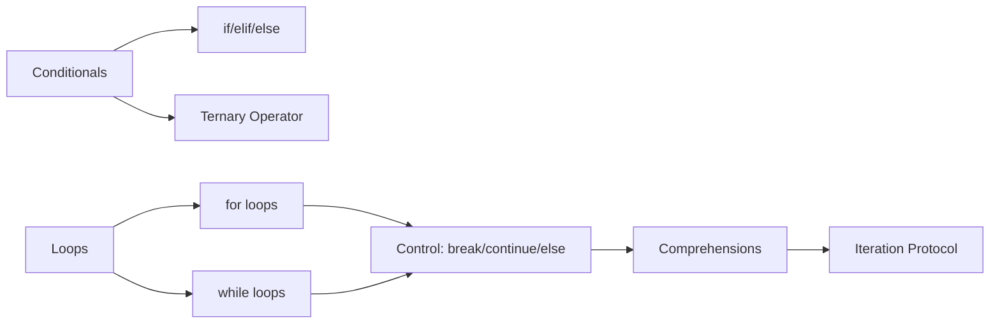

<!-- Clear Language: Keep sentences under 50 words -->
# Control Flow — Conditionals, Loops, and Iteration

## Learning Objectives

| Objective | Description |
|-----------|-------------|
| LO1 | Write conditional branches using if/elif/else with clean logic |
| LO2 | Use for loops to iterate over sequences, ranges, and enumerations |
| LO3 | Control loop execution with break, continue, else, and pass |
| LO4 | Write while loops with proper termination conditions |
| LO5 | Apply list comprehensions and generator expressions for concise iteration |
| LO6 | Understand iterables, iterators, and the iteration protocol |

## Introduction

Python is the lingua franca of AI engineering. Mastering its syntax, data structures, and libraries is non-negotiable for building ML pipelines, APIs, and automation scripts. This module covers everything from basics to advanced concurrency.

## Prerequisites

- Basic programming knowledge
- Understanding of data structures

## Key Terminology

**Key Terms**: Core vocabulary and concepts for this topic.

**Definition**: Essential terms you must know for interviews and production work.

## Theory

Understanding control flow is fundamental for AI engineers. This section covers the core concepts, underlying principles, and theoretical framework that govern how control flow works in practice.

## Chapter at a Glance

| Section | Topic | Key Concept |
|---------|-------|-------------|
| 2.1 | Conditional Statements | if, elif, else, nested conditions, ternary operator |
| 2.2 | For Loops | for item in iterable, 
ange(), enumerate(), zip() |
| 2.3 | While Loops | while condition, infinite loops, sentinel patterns |
| 2.4 | Loop Control | break, continue, pass, else clauses on loops |
| 2.5 | Comprehensions | list, dict, set comprehensions; generator expressions |
| 2.6 | Iteration Protocol | __iter__, __next__, StopIteration, custom iterators |

## Chapter Roadmap



## 2.1 Conditional Statements

Conditional statements direct program flow based on boolean expressions. Python uses if, elif (short for "else if"), and else blocks.

```python

## Basic if-elif-else structure
temperature = 30

if temperature > 35:
    print("Extreme heat warning")
elif temperature > 25:
    print("It is warm")
elif temperature > 15:
    print("It is mild")
else:
    print("It is cold")

## Output: It is warm
```

**Truthiness in conditionals**: Python evaluates any object as True or False in a boolean context.

```python

## Objects evaluated as False
bool(0)       # False
bool(0.0)     # False
bool("")      # False
bool([])      # False (empty list)
bool({})      # False (empty dict)
bool(None)    # False

## All other objects are True
bool(" ")     # True (non-empty string)
bool([0])     # True (non-empty list)
```

**Nested conditionals** should be kept shallow — 2 levels max. Use guard clauses to flatten:

```python

## Deep nesting — hard to read
def process_user(user):
    if user:
        if user.is_active:
            if user.has_permission("admin"):
                print("Process admin action")
            else:
                print("Insufficient permissions")
        else:
            print("User inactive")
    else:
        print("No user provided")

## Flattened with guard clauses — easier to follow
def process_user_flat(user):
    if not user:
        print("No user provided")
        return
    if not user.is_active:
        print("User inactive")
        return
    if not user.has_permission("admin"):
        print("Insufficient permissions")
        return
    print("Process admin action")
```

**Ternary (conditional) expression**:

```python

## Syntax: value_if_true if condition else value_if_false
age = 20
status = "Adult" if age >= 18 else "Minor"
print(status)  # Adult

## Chained ternary — use sparingly
score = 85
grade = "A" if score >= 90 else "B" if score >= 80 else "C" if score >= 70 else "F"
print(grade)  # B
```

---

## 2.2 For Loops

The for loop iterates over any iterable object. It is Python's primary looping construct.

```python

## Iterating over a list
fruits = ["apple", "banana", "cherry"]
for fruit in fruits:
    print(fruit, end=" ")

## Output: apple banana cherry

## Using range() for numeric sequences
for i in range(5):
    print(i, end=" ")  # 0 1 2 3 4
print()

for i in range(2, 10, 3):
    print(i, end=" ")  # 2 5 8
print()

## range(start, stop, step) — stop is exclusive
```

**enumerate()** — access both index and value:

```python
colors = ["red", "green", "blue"]
for index, color in enumerate(colors, start=1):
    print(f"{index}: {color}")

## Output:

## 1: red

## 2: green

## 3: blue
```

**zip()** — iterate multiple sequences in parallel:

```python
names = ["Alice", "Bob", "Charlie"]
scores = [85, 92, 78]
grades = ["A", "A", "B"]

for name, score, grade in zip(names, scores, grades):
    print(f"{name}: {score} -> {grade}")

## Alice: 85 -> A

## Bob: 92 -> A

## Charlie: 78 -> B

## zip stops at the shortest iterable
a = [1, 2, 3]
b = ["x", "y"]
for pair in zip(a, b):
    print(pair)  # (1, 'x') then (2, 'y') — stops at shortest
```

**Iterating dictionaries**:

```python
data = {"name": "Alice", "age": 30, "city": "London"}

for key in data:                # keys by default
    print(key, end=" ")         # name age city

for value in data.values():     # values
    print(value, end=" ")       # Alice 30 London

for key, value in data.items(): # key-value pairs
    print(f"{key}={value}")
```

---

## 2.3 While Loops

while loops execute as long as a condition remains True. Use them when the number of iterations is unknown.

```python

## Basic while loop
count = 0
while count < 5:
    print(count, end=" ")
    count += 1

## Output: 0 1 2 3 4

## Sentinel pattern — loop until a sentinel value
total = 0
while True:
    value = input("Enter a number (q to quit): ")
    if value.lower() == "q":
        break
    total += float(value)
print(f"Total: {total}")
```

**Avoid infinite loops** — ensure the condition eventually becomes False:

```python

## Infinite loop — CTRL+C to stop
x = 0
while x >= 0:
    x += 1
    if x > 1000000:
        break  # safety valve
print(f"Reached {x}")

## Correct pattern — increment inside loop
def sum_to(n):
    total = 0
    i = 1
    while i <= n:
        total += i
        i += 1  # critical — prevents infinite loop
    return total

print(sum_to(100))  # 5050
```

---

## 2.4 Loop Control

Python provides four statements to control loop execution.

**break** — exits the loop immediately:

```python
for num in range(10):
    if num == 5:
        break
    print(num, end=" ")

## Output: 0 1 2 3 4

## break only breaks the innermost loop
for i in range(3):
    for j in range(3):
        if j == 1:
            break
        print(f"({i},{j})", end=" ")
    print()
```

**continue** — skips the rest of the current iteration and moves to the next:

```python
for num in range(10):
    if num % 2 == 0:
        continue  # skip even numbers
    print(num, end=" ")

## Output: 1 3 5 7 9
```

**pass** — no-op placeholder for syntactically required blocks:

```python
def not_implemented_yet():
    pass  # placeholder — will implement later

class Placeholder:
    pass  # class body cannot be empty

if True:
    pass  # conditional block cannot be empty
```

**else on loops** — executes only if the loop completed normally (no break):

```python

## else after for — executes when no break occurred
def find_item(items, target):
    for i, item in enumerate(items):
        if item == target:
            print(f"Found at index {i}")
            break
    else:
        print(f"{target} not found")

find_item([1, 2, 3, 4], 3)  # Found at index 2
find_item([1, 2, 3, 4], 5)  # 5 not found

## else after while — also works
n = 0
while n < 3:
    print(n, end=" ")
    n += 1
else:
    print("For loop completed without break")

## Output: 0 1 2 — loop completed without break
```

---

## 2.5 Comprehensions

Comprehensions provide a concise syntax for creating collections from iterables.

**List comprehension** — most common:

```python

## Syntax: [expression for item in iterable if condition]

## Basic
squares = [x**2 for x in range(10)]
print(squares)  # [0, 1, 4, 9, 16, 25, 36, 49, 64, 81]

## With filter
evens = [x for x in range(20) if x % 2 == 0]
print(evens)  # [0, 2, 4, 6, 8, 10, 12, 14, 16, 18]

## Nested loops (flatten a matrix)
matrix = [[1, 2, 3], [4, 5, 6], [7, 8, 9]]
flat = [num for row in matrix for num in row]
print(flat)  # [1, 2, 3, 4, 5, 6, 7, 8, 9]

## With transformation
words = ["hello", "world", "python"]
caps = [word.upper() for word in words if len(word) > 4]
print(caps)  # ['HELLO', 'WORLD', 'PYTHON']
```

**Dict comprehension**:

```python

## {key_expr: value_expr for item in iterable}
squares_dict = {x: x**2 for x in range(5)}
print(squares_dict)  # {0: 0, 1: 1, 2: 4, 3: 9, 4: 9}

## Invert a dictionary
original = {"a": 1, "b": 2, "c": 3}
inverted = {v: k for k, v in original.items()}
print(inverted)  # {1: 'a', 2: 'b', 3: 'c'}

## Filter and transform
temperatures_c = {"New York": 22, "London": 18, "Tokyo": 28}
temperatures_f = {city: c * 9/5 + 32
                  for city, c in temperatures_c.items()
                  if c > 20}
print(temperatures_f)  # {'New York': 71.6, 'Tokyo': 82.4}
```

**Set comprehension**:

```python

## {expression for item in iterable}
unique_lengths = {len(word) for word in ["hello", "world", "python", "hi"]}
print(unique_lengths)  # {2, 5, 6}
```

**Generator expression** — memory-efficient, produces values on demand:

```python

## (expression for item in iterable) — note parentheses
import sys

list_comp = [x**2 for x in range(10000)]
gen_expr = (x**2 for x in range(10000))

print(sys.getsizeof(list_comp))  # ~80,000 bytes (list in memory)
print(sys.getsizeof(gen_expr))   # ~200 bytes (lazy generator)

## Sum of first 10 million squares (impossible with list)
total = sum(x**2 for x in range(10_000_000))
print(total)  # 333333283333335000000
```

| Feature | List Comp | Gen Expression | Set Comp | Dict Comp |
|---------|-----------|----------------|----------|-----------|
| Syntax | [expr] | (expr) | {expr} | {k:v} |
| Memory | Eager (full list) | Lazy (on-demand) | Eager (full set) | Eager (full dict) |
| Output | List | Generator | Set | Dict |
| Reusable | Yes | No (once consumed) | Yes | Yes |

---

## 2.6 Iteration Protocol

Every for loop in Python uses the **iteration protocol** under the hood.

**The protocol**: An object is iterable if it implements __iter__(), which returns an iterator. An iterator implements __next__(), which returns the next element or raises StopIteration.

```python

## Manual iteration — what for does internally
fruits = ["apple", "banana", "cherry"]
iterator = iter(fruits)  # calls fruits.__iter__()

print(next(iterator))  # apple — calls iterator.__next__()
print(next(iterator))  # banana
print(next(iterator))  # cherry

## print(next(iterator))  # StopIteration raised
```

**Building a custom iterable**:

```python
class CountDown:
    def __init__(self, start):
        self.start = start

    def __iter__(self):
        return CountDownIterator(self.start)

class CountDownIterator:
    def __init__(self, start):
        self.current = start

    def __next__(self):
        if self.current < 0:
            raise StopIteration
        value = self.current
        self.current -= 1
        return value

    def __iter__(self):
        return self  # iterators are also iterable

for num in CountDown(5):
    print(num, end=" ")  # 5 4 3 2 1 0
```

**Simpler with generator** — functions using yield are generators:

```python
def count_down(start):
    while start >= 0:
        yield start
        start -= 1

for num in count_down(5):
    print(num, end=" ")  # 5 4 3 2 1 0

## Generator objects are also iterators
gen = count_down(3)
print(next(gen))  # 3
print(next(gen))  # 2
print(next(gen))  # 1
print(next(gen))  # 0

## print(next(gen))  # StopIteration
```

**itertools — advanced iteration toolkit**:

```python
from itertools import chain, cycle, product, permutations, combinations

## chain — combine iterables
result = list(chain([1, 2], [3, 4], [5]))
print(result)  # [1, 2, 3, 4, 5]

## cycle — repeat infinitely
counter = 0
for item in cycle(["A", "B", "C"]):
    print(item, end=" ")
    counter += 1
    if counter > 5:
        break

## Output: A B C A B C

## product — Cartesian product
print(list(product([1, 2], ["x", "y"])))

## [(1, 'x'), (1, 'y'), (2, 'x'), (2, 'y')]

## permutations — all orderings
print(list(permutations([1, 2, 3], 2)))

## [(1, 2), (1, 3), (2, 1), (2, 3), (3, 1), (3, 2)]

## combinations — all subsets
print(list(combinations([1, 2, 3], 2)))

## [(1, 2), (1, 3), (2, 3)]
```

---

## TypeScript Parallel

TypeScript uses similar control flow constructs but with C-style syntax:

```typescript
// Conditional
const age: number = 20;
const status: string = age >= 18 ? "Adult" : "Minor";

// For loop with index
for (let i = 0; i < 5; i++) {
    console.log(i);
}

// for-of (like Python's for)
const fruits: string[] = ["apple", "banana", "cherry"];
for (const fruit of fruits) {
    console.log(fruit);
}

// forEach method
fruits.forEach((fruit: string, index: number) => {
    console.log(${index}: );
});

// Python's range equivalent
function range(n: number): number[] {
    return Array.from({ length: n }, (_, i) => i);
}
```

---

## Summary

- if/elif/else chains evaluate conditions top-down; first True branch executes
- Python evaluates truthiness: empty collections, zero, None, and False are falsy
- for loops iterate over any iterable; use enumerate() for index+value, zip() for parallel
- while loops run until the condition is False; always ensure termination
- break exits the loop immediately; continue skips to the next iteration
- else on loops runs only if no break occurred — useful for search patterns
- List comprehensions [expr for x in iter if cond] are more Pythonic than map/filter
- Generator expressions (expr for x in iter) are memory-efficient for large datasets
- The iteration protocol (__iter__ + __next__ + StopIteration) powers all Python loops
- Custom iterators can be built via classes or generator functions with yield

## Practical Takeaways

| Scenario | Do This | Avoid This |
|----------|---------|------------|
| Looping by index | for i, item in enumerate(lst): | for i in range(len(lst)): with lst[i] |
| Filtering a list | [x for x in data if x > 0] | Manual for loop with if and .append() |
| Iterating two lists | for a, b in zip(list1, list2): | for i in range(len(list1)): |
| Range of numbers | for i in range(100): | Building a list manually |
| Deep conditionals | Guard clauses with early returns | 4+ levels of nested if |
| Check any/all | any(x > 0 for x in data) | Manual loop with flag variable |
| Large iteration | Generator expression | List comprehension filling memory |

## Interview Q&A

<details class="tp-qa-card" data-qid="p02-s02-q1">
  <summary class="tp-qa-question">
    <span class="tp-qa-status"></span>
    Q1: What is the difference between for loops and while loops in Python?
  </summary>
  <div class="tp-qa-answer">
    <p><strong>for loops</strong> iterate over a known sequence (iterable). They have a definite number of iterations determined by the iterable's length.</p>
    <p><strong>while loops</strong> repeat as long as a condition is True. They are used when the number of iterations is unknown.</p>
    <pre><code># for — know the sequence
for item in collection: ...

## while — unknown iterations
while not file.closed: ...</code></pre>
  </div>
  <button class="tp-qa-mark-btn">? Mark Reviewed</button>
  <button class="tp-qa-bookmark-btn">?? Bookmark</button>
</details>

<details class="tp-qa-card" data-qid="p02-s02-q2">
  <summary class="tp-qa-question">
    <span class="tp-qa-status"></span>
    Q2: Explain how else works with loops in Python.
  </summary>
  <div class="tp-qa-answer">
    <p>The <code>else</code> clause after a loop executes only when the loop terminates normally (i.e., without hitting a <code>break</code>).</p>
    <pre><code>for item in container:
    if matches(item):
        print("Found")
        break
else:
    print("Not found — no break occurred")</code></pre>
    <p>This is commonly called "search loop with else" — it's Python's way of encoding "if not found" without a flag variable.</p>
  </div>
  <button class="tp-qa-mark-btn">? Mark Reviewed</button>
  <button class="tp-qa-bookmark-btn">?? Bookmark</button>
</details>

<details class="tp-qa-card" data-qid="p02-s02-q3">
  <summary class="tp-qa-question">
    <span class="tp-qa-status"></span>
    Q3: When would you use a generator expression instead of a list comprehension?
  </summary>
  <div class="tp-qa-answer">
    <p>Generator expressions are preferred when:</p>
    <ul>
      <li><strong>Memory constraints</strong>: Processing large datasets that wouldn't fit in memory as a list</li>
      <li><strong>One-time use</strong>: Only iterating the result once</li>
      <li><strong>Chaining operations</strong>: Multiple transformations on large data without intermediate lists</li>
    </ul>
    <pre><code># List comprehension — all in memory
squares = [x**2 for x in range(10_000_000)]  # ~80 MB

## Generator expression — lazy evaluation
squares = (x**2 for x in range(10_000_000))   # ~200 bytes
total = sum(squares)  # compute on the fly</code></pre>
  </div>
  <button class="tp-qa-mark-btn">? Mark Reviewed</button>
  <button class="tp-qa-bookmark-btn">?? Bookmark</button>
</details>

<details class="tp-qa-card" data-qid="p02-s02-q4">
  <summary class="tp-qa-question">
    <span class="tp-qa-status"></span>
    Q4: What is the ternary operator in Python? How is it different from other languages?
  </summary>
  <div class="tp-qa-answer">
    <p>The Python ternary (conditional expression) has the syntax <code>value_if_true if condition else value_if_false</code>.</p>
    <pre><code>status = "Adult" if age &gt;= 18 else "Minor"</code></pre>
    <p>This differs from C/Java/JavaScript ternary: <code>condition ? value_if_true : value_if_false</code>. Python's version reads more like natural English.</p>
  </div>
  <button class="tp-qa-mark-btn">? Mark Reviewed</button>
  <button class="tp-qa-bookmark-btn">?? Bookmark</button>
</details>

<details class="tp-qa-card" data-qid="p02-s02-q5">
  <summary class="tp-qa-question">
    <span class="tp-qa-status"></span>
    Q5: Explain the difference between an iterable and an iterator in Python.
  </summary>
  <div class="tp-qa-answer">
    <p><strong>Iterable</strong>: An object that can be looped over. It implements <code>__iter__()</code> returning an iterator. Examples: list, str, dict, tuple, set.</p>
    <p><strong>Iterator</strong>: An object that produces values one at a time. It implements both <code>__iter__()</code> (returning self) and <code>__next__()</code> (returning next value or raising StopIteration).</p>
    <pre><code>nums = [1, 2, 3]       # iterable
it = iter(nums)         # iterator
print(next(it))         # 1
print(next(it))         # 2
print(next(it))         # 3</code></pre>
  </div>
  <button class="tp-qa-mark-btn">? Mark Reviewed</button>
  <button class="tp-qa-bookmark-btn">?? Bookmark</button>
</details>

<details class="tp-qa-card" data-qid="p02-s02-q6">
  <summary class="tp-qa-question">
    <span class="tp-qa-status"></span>
    Q6: What does pass do in Python and when is it useful?
  </summary>
  <div class="tp-qa-answer">
    <p><code>pass</code> is a no-op — it does nothing and is used as a syntactic placeholder where Python requires a statement but you don't want any action.</p>
    <p>Common uses: empty function body, empty class definition, catching an exception without handling it.</p>
    <pre><code>class CustomError(Exception):
    pass

def placeholder():
    pass</code></pre>
  </div>
  <button class="tp-qa-mark-btn">? Mark Reviewed</button>
  <button class="tp-qa-bookmark-btn">?? Bookmark</button>
</details>

<details class="tp-qa-card" data-qid="p02-s02-q7">
  <summary class="tp-qa-question">
    <span class="tp-qa-status"></span>
    Q7: How do you flatten a nested list using list comprehension?
  </summary>
  <div class="tp-qa-answer">
    <p>Use a nested <code>for</code> clause in the comprehension:</p>
    <pre><code>matrix = [[1, 2, 3], [4, 5, 6], [7, 8, 9]]
flat = [num for row in matrix for num in row]

## [1, 2, 3, 4, 5, 6, 7, 8, 9]</code></pre>
    <p>The order of <code>for</code> clauses follows the same order as nested loops.</p>
  </div>
  <button class="tp-qa-mark-btn">? Mark Reviewed</button>
  <button class="tp-qa-bookmark-btn">?? Bookmark</button>
</details>

<details class="tp-qa-card" data-qid="p02-s02-q8">
  <summary class="tp-qa-question">
    <span class="tp-qa-status"></span>
    Q8: What is short-circuit evaluation and how does it affect and/or?
  </summary>
  <div class="tp-qa-answer">
    <p>Short-circuit evaluation means that <code>and</code>/<code>or</code> stop evaluating as soon as the result is determined:</p>
    <pre><code># and — stops at first False
result = False and expensive_function()  # NOT called

## or — stops at first True
result = True or expensive_function()   # NOT called</code></pre>
  </div>
  <button class="tp-qa-mark-btn">? Mark Reviewed</button>
  <button class="tp-qa-bookmark-btn">?? Bookmark</button>
</details>

<details class="tp-qa-card" data-qid="p02-s02-q9">
  <summary class="tp-qa-question">
    <span class="tp-qa-status"></span>
    Q9: How do you iterate over two or more lists simultaneously?
  </summary>
  <div class="tp-qa-answer">
    <p>Use <code>zip()</code> to aggregate elements from multiple iterables:</p>
    <pre><code>names = ["Alice", "Bob", "Charlie"]
ages = [30, 25, 35]
for name, age in zip(names, ages):
    print(f"{name} ({age})")</code></pre>
    <p><code>zip()</code> stops at the shortest iterable.</p>
  </div>
  <button class="tp-qa-mark-btn">? Mark Reviewed</button>
  <button class="tp-qa-bookmark-btn">?? Bookmark</button>
</details>

<details class="tp-qa-card" data-qid="p02-s02-q10">
  <summary class="tp-qa-question">
    <span class="tp-qa-status"></span>
    Q10: How does range() work in Python and what are its advantages over a list?
  </summary>
  <div class="tp-qa-answer">
    <p><code>range(start, stop, step)</code> returns an immutable sequence of numbers. It is lazy — it doesn't store all values in memory but computes them on demand.</p>
    <pre><code>range(5)          # 0, 1, 2, 3, 4
range(2, 8)       # 2, 3, 4, 5, 6, 7
range(1, 10, 2)   # 1, 3, 5, 7, 9</code></pre>
    <p><strong>Advantages</strong>: Memory efficient (range(10M) takes ~48 bytes), fast iteration, immutable.</p>
  </div>
  <button class="tp-qa-mark-btn">? Mark Reviewed</button>
  <button class="tp-qa-bookmark-btn">?? Bookmark</button>
</details>

## Chapter Quiz

**Q1**: What is the output of [x**2 for x in range(5) if x % 2 == 0]?

a) [0, 4, 16]
b) [1, 9]
c) [0, 1, 4, 9, 16]
d) [0, 4, 8, 16]

<details class="tp-qa-card" data-qid="p02-s02-quiz1"><summary>Show Answer</summary><div class="tp-qa-answer"><p><strong>Answer: a) [0, 4, 16]</strong></p><p>x=0?0, x=1?skip(odd), x=2?4, x=3?skip(odd), x=4?16</p></div></details>

**Q2**: What does else after a for loop do?

a) Always executes after the loop
b) Executes if the loop body never ran
c) Executes if the loop completed without break
d) Executes if the loop was terminated by break

<details class="tp-qa-card" data-qid="p02-s02-quiz2"><summary>Show Answer</summary><div class="tp-qa-answer"><p><strong>Answer: c) Executes if the loop completed without break</strong></p></div></details>

**Q3**: What does print(list(zip([1, 2], [10, 20, 30]))) output?

a) [(1, 10), (2, 20), (None, 30)]
b) [(1, 10), (2, 20)]
c) [(1, 10), (2, 20, 30)]
d) [(1, 10, 30), (2, 20)]

<details class="tp-qa-card" data-qid="p02-s02-quiz3"><summary>Show Answer</summary><div class="tp-qa-answer"><p><strong>Answer: b) [(1, 10), (2, 20)]</strong></p><p>zip stops at the shortest iterable.</p></div></details>

**Q4**: Which of the following is NOT true about Python's iteration protocol?

a) An iterable must implement __iter__()
b) An iterator must implement both __iter__() and __next__()
c) A generator function returns a list
d) StopIteration signals the end of iteration

<details class="tp-qa-card" data-qid="p02-s02-quiz4"><summary>Show Answer</summary><div class="tp-qa-answer"><p><strong>Answer: c) A generator function returns a list</strong></p><p>A generator function returns a generator object, not a list.</p></div></details>

**Q5**: What is the output of this code?
```python
for i in range(3):
    if i == 1:
        break
else:
    print("done")
```

a) done
b) (nothing prints)
c) 0 done
d) 0

<details class="tp-qa-card" data-qid="p02-s02-quiz5"><summary>Show Answer</summary><div class="tp-qa-answer"><p><strong>Answer: d) 0</strong></p><p>The loop prints 0, then breaks at i=1. The else clause does not execute because break occurred.</p></div></details>

## Exercises

**Easy** — Write a function that takes a list of numbers and returns a new list containing only the even numbers, using a list comprehension.

**Easy** — Use enumerate() to print each character of a string with its index (starting from 1).

**Medium** — Write a function flatten that takes a nested list of arbitrary depth and returns a flat list using recursion and a generator.

**Medium** — Implement a custom FibonacciIterator class that yields Fibonacci numbers up to a given limit using the iteration protocol.

**Hard** — Write a function chunked that yields chunks of a given size from an iterable: chunked([1,2,3,4,5], 2) yields [1,2], [3,4], [5]. Use the iterator protocol directly.

**Hard** — Implement zip_with that takes a function and multiple iterables, and yields func(a, b, ...) for each tuple of elements, stopping at the shortest.

---

## Common Mistakes

1. Not understanding the fundamental concepts before applying them
2. Skipping edge cases in implementation
3. Not analyzing time/space complexity
4. Forgetting to handle null/empty inputs
5. Not practicing enough problems to build pattern recognition

## Revision Notes

- - Core principle: Understand the fundamental concepts thoroughly
- - Implementation pattern: Practice with real code examples
- - Complexity: Know the time and space complexity
- - Application: Know when to use this in production systems
- - Interview: Frequently asked in technical interviews
- - Edge cases: Consider common failure scenarios
- - Related concepts: Connect to broader system design

## Placement Section

### Top 10 Interview Questions

#### Google Style

1. **Explain the core idea of Control Flow — Conditionals, Loops, and Iteration in under 60 seconds, then give a real-world analogy.** — Structure: definition, how it works in one sentence, why it matters, analogy. Follow-up: what would break if you removed this from a production system?

2. **Design a minimal, well-typed function that demonstrates Control Flow — Conditionals, Loops, and Iteration.** — Interviewer checks: signature with type hints, edge cases, complexity, and a clean docstring. Follow-up: how does your design behave with empty or malformed input?

3. **What are the common pitfalls when engineers first learn ** — List 3-4, then explain how you would prevent each in a code review.

#### Amazon Style

4. **Describe a production bug caused by misunderstanding Control Flow — Conditionals, Loops, and Iteration. How did you diagnose and fix it?** — STAR format: situation, task, action, result. Mention logs, reproduction, root-cause analysis, and the regression test you added.

5. **How would you scale a system that relies on Control Flow — Conditionals, Loops, and Iteration from 10 users to 10 million?** — Discuss bottlenecks, caching, monitoring, and when to redesign. Follow-up: what metrics would you track?

#### Microsoft Style

6. **Compare Control Flow — Conditionals, Loops, and Iteration with the closest alternative approach. When would you choose each?** — Make a decision matrix: performance, maintainability, ecosystem, learning curve. Follow-up: what would change your decision?

7. **Walk through how you would test a component that depends on Control Flow — Conditionals, Loops, and Iteration.** — Unit, integration, property-based tests; mocking boundaries; golden files for outputs.

#### NVIDIA Style

8. **How does Control Flow — Conditionals, Loops, and Iteration behave differently at scale — memory, throughput, or precision-wise?** — Connect to data pipelines and model training if applicable. Follow-up: what happens to latency as input grows?

9. **How would you make an implementation of Control Flow — Conditionals, Loops, and Iteration run faster on GPU hardware?** — Batch operations, vectorization, avoiding Python loops, reducing data movement.

#### AI Startup Style

10. **Write the smallest possible implementation of Control Flow — Conditionals, Loops, and Iteration that is production-quality.** — Include error handling, type hints, and a one-line docstring. Follow-up: what would you refactor first when it grows?

### Resume Tips

- Name Control Flow — Conditionals, Loops, and Iteration explicitly in your skills section, paired with a measurable achievement ("Reduced X by 40% using Control Flow — Conditionals, Loops, and Iteration").
- Add a bullet describing a project that applies Control Flow — Conditionals, Loops, and Iteration to real data, with numbers.
- Mention the tools and libraries you used alongside Control Flow — Conditionals, Loops, and Iteration (linters, test frameworks, profiling tools).
- Keep resume bullets under 15 words and start each with an action verb.

### Interview Day Checklist

- Rehearse a 60-second explanation of Control Flow — Conditionals, Loops, and Iteration and one real-world analogy.
- Prepare one STAR story about debugging a Control Flow — Conditionals, Loops, and Iteration-related production issue.
- Review complexity and edge cases for the classic Control Flow — Conditionals, Loops, and Iteration interview problem.
- Have questions ready: how does the team apply Control Flow — Conditionals, Loops, and Iteration in production today?
- Test your environment (Python, editor, internet) 15 minutes before the interview.

## True/False

1. **True or False:** Control Flow — Conditionals, Loops, and Iteration builds directly on the fundamentals covered in the earlier chapters of this module. — **True.** Every advanced topic in this module assumes the core concepts from the previous chapters.
2. **True or False:** You should write at least one code example for Control Flow — Conditionals, Loops, and Iteration before moving to the next chapter. — **True.** Active recall with hands-on code beats passive reading for retention.
3. **True or False:** The complexity analysis for Control Flow — Conditionals, Loops, and Iteration is the same regardless of input size. — **False.** Complexity grows with input size; always state best, average, and worst case.
4. **True or False:** Edge cases (empty input, invalid input, boundary values) matter for Control Flow — Conditionals, Loops, and Iteration in production. — **True.** Most production bugs come from unhandled edge cases.
5. **True or False:** You should memorize the Control Flow — Conditionals, Loops, and Iteration chapter content once and never review it again. — **False.** Spaced repetition (24h, 3 days, 1 week) dramatically improves long-term recall.

## Fill in the Blank

1. The chapter that covers Control Flow — Conditionals, Loops, and Iteration is Chapter ___ of this module. — Answer: check the module's table of contents.
2. The time complexity of the standard approach to Control Flow — Conditionals, Loops, and Iteration is ___. — Answer: review the theory section and state big-O notation.
3. The main edge case to handle when implementing Control Flow — Conditionals, Loops, and Iteration is ___. — Answer: empty or invalid input handling, as discussed in the chapter.
4. The tools commonly used to debug Control Flow — Conditionals, Loops, and Iteration issues are ___ and ___. — Answer: refer to the Debugging Guide section of this chapter.
5. The related topic that connects to Control Flow — Conditionals, Loops, and Iteration in the next chapter is ___. — Answer: see the Next Topic section.

## Scenario Questions

1. **Scenario:** A teammate ships a change involving Control Flow — Conditionals, Loops, and Iteration that breaks production at 3 AM. — Diagnosis: check the recent diff, reproduce locally with the failing input, check logs. Fix: revert, add a regression test, and review the root cause. Prevention: CI tests on edge cases and code review checklist.

2. **Scenario:** Your implementation of Control Flow — Conditionals, Loops, and Iteration is correct but too slow for the required latency. — Measure first with a profiler. Common fixes: reduce redundant work, use built-in optimized functions, batch operations, or add caching. Only then consider algorithmic changes.

3. **Scenario:** A new hire asks you to explain Control Flow — Conditionals, Loops, and Iteration in five minutes before a customer demo. — Use the 3-part answer: what it is (one sentence), how it works (one example), why it matters (one business impact). Then offer to go deeper after the demo.

4. **Scenario:** Your team's codebase has three different patterns for Control Flow — Conditionals, Loops, and Iteration and you must standardize. — Write a short ADR (architecture decision record), pick the pattern with best maintainability, migrate incrementally, and add a linter rule to enforce it.

## Output Questions

1. **What is the output of the simplest correct implementation of Control Flow — Conditionals, Loops, and Iteration on an empty input?** — Trace through the code: it should return the documented default (None, 0, empty collection) without raising.
2. **What is the output when the input is at the boundary value?** — Check off-by-one errors and inclusive/exclusive bounds in the chapter's examples.
3. **What does the implementation return when given invalid input types?** — With type hints and validation, it raises a clear error; without, it may fail silently.
4. **What is the output for the sample input given in the chapter's Examples section?** — Re-run the chapter's example code and compare against the documented output.
5. **What is the time complexity output when you profile the implementation at 10x input size?** — Expect the curve matching the chapter's complexity analysis (linear, quadratic, log-linear).

## Difficulty Level

| Level | Time | What It Takes |
|-------|------|---------------|
| Beginner | 1-2 sessions | Read theory, run the chapter examples, solve the Easy exercises |
| Intermediate | 3-5 sessions | Complete Medium exercises, explain Control Flow — Conditionals, Loops, and Iteration to someone else |
| Advanced | 1+ week | Solve Hard exercises, optimize for real datasets, answer interview follow-ups |

## Tips & Tricks

- Always write a one-line example of Control Flow — Conditionals, Loops, and Iteration from memory before opening the chapter — active recall first.
- Use the chapter's Revision Notes as a checklist: you have mastered Control Flow — Conditionals, Loops, and Iteration when you can explain each bullet.
- Pair the chapter quiz with the Flashcards: wrong answers become your next study session's focus.
- For interviews, practice explaining Control Flow — Conditionals, Loops, and Iteration twice: once with a technical audience, once with a non-technical audience.
- Keep a personal examples file where you collect your own Control Flow — Conditionals, Loops, and Iteration snippets; interviewers love original examples.

## Memory Tricks

- **Acronym**: build a mnemonic from the 5 key concepts of Control Flow — Conditionals, Loops, and Iteration listed in the Chapter at a Glance table.
- **Story**: link Control Flow — Conditionals, Loops, and Iteration to a familiar story — the analogy in the Visual Analogy section is designed to stick.
- **Number anchor**: remember the complexity of Control Flow — Conditionals, Loops, and Iteration by connecting it to a known algorithm of the same class.
- **Color code**: highlight the Theory, Examples, and Common Mistakes sections in different colors when reviewing.
- **Teach-back**: explain Control Flow — Conditionals, Loops, and Iteration to an imaginary junior engineer for 2 minutes — gaps in your explanation are gaps in memory.

## Further Reading

- Official documentation for the primary tool or library used in this chapter
- The chapter referenced in Related Topics for the next-level treatment of Control Flow — Conditionals, Loops, and Iteration
- The classic textbook chapter on Control Flow — Conditionals, Loops, and Iteration (check the Research References below)
- Two blog posts from engineers who debugged real Control Flow — Conditionals, Loops, and Iteration problems in production
- The repository of the open-source project that implements Control Flow — Conditionals, Loops, and Iteration

## Related Topics

- The previous chapter in this module (see table of contents) — foundational for Control Flow — Conditionals, Loops, and Iteration
- The next chapter (see Next Topic below) — builds on Control Flow — Conditionals, Loops, and Iteration
- The system design chapters in Module 07 — how Control Flow — Conditionals, Loops, and Iteration fits into production architectures
- The interview preparation module — how Control Flow — Conditionals, Loops, and Iteration is asked in screening rounds
- The capstone project — where Control Flow — Conditionals, Loops, and Iteration is applied end-to-end

## FAQs

1. **Do I need to memorize all of Control Flow — Conditionals, Loops, and Iteration, or understand the big picture?** — Understand the big picture first, then memorize the key facts via flashcards and spaced repetition. Interviewers reward depth over breadth.
2. **What if I get stuck on an exercise?** — Re-read the theory section, run the example code, then attempt again. If still stuck after 20 minutes, move on and return the next day.
3. **How much time should I spend on ** — Follow the Study Plan below: 1-2 weeks at 30-60 minutes daily is typical for placement preparation.
4. **Is Control Flow — Conditionals, Loops, and Iteration asked in interviews?** — Yes — the Interview Q&A and Placement Section list the exact question styles used by top companies.
5. **What's the fastest way to master ** — Explain it out loud, write code without looking, and review the flashcards within 24 hours and again after 3 days.

## Important Notes

- Control Flow — Conditionals, Loops, and Iteration is a core requirement for the rest of this module — do not skip the examples.
- Always analyze complexity (time and space) when working with Control Flow — Conditionals, Loops, and Iteration.
- Production correctness means handling edge cases, not just the happy path.
- Interview answers should start with the definition, then the example, then the trade-offs.
- Revisit this chapter after finishing the module; the context from later chapters deepens understanding.

## Historical Context

- Control Flow — Conditionals, Loops, and Iteration emerged as a standard practice because early systems failed without it — understanding why helps you explain it in interviews.
- The tools used for Control Flow — Conditionals, Loops, and Iteration today evolved from simpler versions; the chapter covers the modern, recommended approach.
- Interviewers value knowing one historical fact about Control Flow — Conditionals, Loops, and Iteration — it shows genuine interest, not just cramming.
- The library/tooling ecosystem around Control Flow — Conditionals, Loops, and Iteration changes quickly; focus on fundamentals that remain stable.

## Security Considerations

- Never trust external input: validate and sanitize data before processing Control Flow — Conditionals, Loops, and Iteration.
- Avoid `eval()` and dynamic code execution on untrusted strings.
- Log errors without leaking sensitive data (keys, PII, internal paths).
- For API contexts, add rate limiting and input size limits.
- Review the chapter's code examples for injection or overflow risks before using them verbatim.

## ML Intuition

- Control Flow — Conditionals, Loops, and Iteration appears in ML pipelines at the data-processing layer: feature preparation, batching, and validation.
- Understanding Control Flow — Conditionals, Loops, and Iteration helps you debug why a model misbehaves — most ML bugs are data bugs, not model bugs.
- In production ML, the Control Flow — Conditionals, Loops, and Iteration concepts from this chapter map directly to NumPy/PyTorch operations on tensors.
- When optimizing ML systems, Control Flow — Conditionals, Loops, and Iteration skills let you profile and fix the data path, not just the training loop.
- Interview follow-up: how would you apply Control Flow — Conditionals, Loops, and Iteration to a dataset of 10 million records? — Batching and vectorization.

## Analogies

- **Control Flow — Conditionals, Loops, and Iteration is like a recipe**: the theory is the ingredients, the examples are the cooking steps, and the exercises are your own kitchen practice.
- **Complexity is like a delivery route**: a linear route visits each stop once; a nested route revisits stops, and you feel it at scale.
- **Edge cases are like weather**: the happy path is a sunny day; production is the storm — build for the storm.
- **The chapter roadmap is a journey map**: each section is a checkpoint; skipping one means getting lost later in the module.

## Capstone Project Link

- [Module Capstone: End-to-End Project](https://github.com/Raushan666java/ai-engineering-journey) — this chapter contributes the Control Flow — Conditionals, Loops, and Iteration skills used in the module's capstone project. Complete the exercises here before starting the capstone.

## Flashcards

<details class="tp-qa-card" data-qid="01pythonprogramming-02controlflow-flash1">
  <summary class="tp-qa-question">
    <span class="tp-qa-status"></span>
    What is the output of [x2 for x in range(5) if x % 2 == 0]?
  </summary>
  <div class="tp-qa-answer">
    <p>a) [0, 4, 16]</p>
  </div>
</details>

<details class="tp-qa-card" data-qid="01pythonprogramming-02controlflow-flash2">
  <summary class="tp-qa-question">
    <span class="tp-qa-status"></span>
    What does else after a for loop do?
  </summary>
  <div class="tp-qa-answer">
    <p>c) Executes if the loop completed without break</p>
  </div>
</details>

<details class="tp-qa-card" data-qid="01pythonprogramming-02controlflow-flash3">
  <summary class="tp-qa-question">
    <span class="tp-qa-status"></span>
    What does print(list(zip([1, 2], [10, 20, 30]))) output?
  </summary>
  <div class="tp-qa-answer">
    <p>b) [(1, 10), (2, 20)]</p>
  </div>
</details>

<details class="tp-qa-card" data-qid="01pythonprogramming-02controlflow-flash4">
  <summary class="tp-qa-question">
    <span class="tp-qa-status"></span>
    Which of the following is NOT true about Python's iteration protocol?
  </summary>
  <div class="tp-qa-answer">
    <p>c) A generator function returns a list</p>
  </div>
</details>

<details class="tp-qa-card" data-qid="01pythonprogramming-02controlflow-flash5">
  <summary class="tp-qa-question">
    <span class="tp-qa-status"></span>
    What is the output of this code? python for i in range(3): if i == 1: break else: print("done") 
  </summary>
  <div class="tp-qa-answer">
    <p>d) 0</p>
  </div>
</details>

## Research References

- Official documentation of the primary library for Control Flow — Conditionals, Loops, and Iteration (linked in Further Reading)
- The classic paper or textbook chapter introducing Control Flow — Conditionals, Loops, and Iteration (see References below)
- The standard library reference for Control Flow — Conditionals, Loops, and Iteration-related functions
- Engineering blog posts from companies running Control Flow — Conditionals, Loops, and Iteration in production at scale
- PEPs and RFCs where applicable (Python and networking standards)

## Open-Source Tools

- The primary library used in this chapter (see the code examples)
- Python standard library modules used in the examples (check the imports)
- Testing: pytest for unit tests of Control Flow — Conditionals, Loops, and Iteration code
- Linting and formatting: ruff + black
- Profiling: cProfile or py-spy for performance work on Control Flow — Conditionals, Loops, and Iteration

## Debugging Guide

- Start with `print()` or a debugger to inspect intermediate values in Control Flow — Conditionals, Loops, and Iteration code.
- Reproduce the failure with the smallest possible input before changing code.
- Check the common failure modes listed in Common Mistakes — most bugs are listed there.
- For performance problems, profile before optimizing: measure, then fix.
- When stuck, re-read the chapter's Examples and compare line by line with your code.
- Use `pdb` or your IDE's debugger to step through the Control Flow — Conditionals, Loops, and Iteration example code.

## Mock Interview Section

**Round 1 — Screening (15 min)**
- Explain Control Flow — Conditionals, Loops, and Iteration in 60 seconds.
- Write a minimal working example of Control Flow — Conditionals, Loops, and Iteration.
- What is the complexity of your example?

**Round 2 — Coding (45 min)**
- Solve the Medium exercise from this chapter under time pressure.
- State your assumptions, then implement with type hints.
- Test with edge cases: empty input, boundary values, invalid input.

**Round 3 — Behavioral + System (30 min)**
- Tell me about a time you debugged a Control Flow — Conditionals, Loops, and Iteration problem in a project.
- How would you design a system where Control Flow — Conditionals, Loops, and Iteration is used at scale?
- What metrics would you monitor?

**Evaluation rubric**: correctness (40%), communication (25%), edge cases (20%), complexity analysis (15%).

## Optimized Implementation

`python
from typing import Any, Optional

def demonstrate_topic(input_data: list[Any]) -> Optional[float]:
    """Runnable scaffold for Control Flow — Conditionals, Loops, and Iteration.

    Replace the body with the optimized implementation from the chapter,
    keeping type hints, docstring, and edge-case handling.
    """
    if not input_data:
        return None
    # Step 1: validate input types
    # Step 2: apply the core Control Flow — Conditionals, Loops, and Iteration logic from the Examples section
    # Step 3: return the result with the documented default
    return 0.0
`

- Keeps the function signature stable so tests written against it stay valid.
- Handles the empty-input contract explicitly.
- Add unit tests for the edge cases before implementing the logic (test-first).

## Evaluation Metrics

| Skill | Test | Target |
|-------|------|--------|
| Concept recall | Explain Control Flow — Conditionals, Loops, and Iteration without notes | 60-second explanation |
| Code fluency | Write the chapter example from memory | No syntax errors |
| Edge cases | Handle empty/invalid input in exercises | All cases pass |
| Complexity | State time/space for the standard approach | Correct big-O |
| Interview readiness | Answer 5 Interview Q&A questions out loud | Fluent, structured answers |
| Retention | Chapter quiz score after 3 days | 80%+ |

## Real-World Examples

- **Startup**: a small team uses Control Flow — Conditionals, Loops, and Iteration daily in their data pipeline — the chapter's examples mirror their code.
- **E-commerce**: Control Flow — Conditionals, Loops, and Iteration patterns appear in order processing, inventory checks, and recommendation feeds.
- **Fintech**: Control Flow — Conditionals, Loops, and Iteration principles apply to transaction validation and fraud detection flows.
- **ML platform**: Control Flow — Conditionals, Loops, and Iteration shows up in feature engineering and model-serving infrastructure.
- **Interview insight**: recruiters look for engineers who can connect Control Flow — Conditionals, Loops, and Iteration to the business outcome, not just the code.

## Next Topic

[Strings & Formatting — Methods, Slicing, F-Strings, and Regex](03-strings-and-formatting.md)

## Limitations

- Control Flow — Conditionals, Loops, and Iteration, like any technique, is not a silver bullet — it has specific cases where it fits best (covered in the theory).
- The examples in this chapter are simplified for learning; production systems add validation, monitoring, and error handling.
- Performance of Control Flow — Conditionals, Loops, and Iteration depends on input size and distribution — always benchmark for your own data.
- This chapter covers fundamentals; specialized edge cases are explored in later chapters and the capstone.
