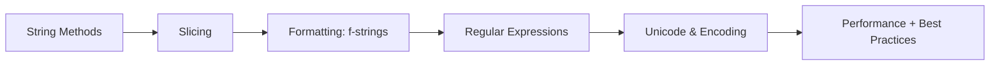

<!-- Clear Language: Keep sentences under 50 words -->
# Strings & Formatting — Methods, Slicing, F-Strings, and Regex

## Learning Objectives

| Objective | Description |
|-----------|-------------|
| LO1 | Manipulate strings using built-in methods for transformation, splitting, and joining |
| LO2 | Extract substrings with slicing notation and stride patterns |
| LO3 | Format strings using f-strings, .format(), and % formatting |
| LO4 | Search and replace using regular expressions with the re module |
| LO5 | Understand string immutability and performance implications |
| LO6 | Encode and decode strings between str and bytes |

## Introduction

Python is the lingua franca of AI engineering. Mastering its syntax, data structures, and libraries is non-negotiable for building ML pipelines, APIs, and automation scripts. This module covers everything from basics to advanced concurrency.

## Prerequisites

- Basic programming knowledge
- Understanding of data structures

## Key Terminology

**Key Terms**: Core vocabulary and concepts for this topic.

**Definition**: Essential terms you must know for interviews and production work.

## Theory

Understanding strings and formatting is fundamental for AI engineers. This section covers the core concepts, underlying principles, and theoretical framework that govern how strings and formatting works in practice.

## Chapter at a Glance

| Section | Topic | Key Concept |
|---------|-------|-------------|
| 3.1 | String Methods | case conversion, strip, split, join, find, replace |
| 3.2 | Slicing | [start:stop:step], negative indices, reversing |
| 3.3 | String Formatting | f-strings, .format(), % formatting, format specifiers |
| 3.4 | Regular Expressions | re.match, re.search, re.findall, re.sub |
| 3.5 | Unicode and Encoding | str.encode(), bytes.decode(), UTF-8, ASCII |
| 3.6 | Performance | string concatenation, join, StringBuilder pattern |

## Chapter Roadmap



## 3.1 String Methods

Python strings provide a rich set of methods for text manipulation. Since strings are immutable, all methods return a **new string**.

```python
text = "  Hello, Python World!  "

## Case conversion
print(text.upper())        # "  HELLO, PYTHON WORLD!  "
print(text.lower())        # "  hello, python world!  "
print(text.title())        # "  Hello, Python World!  "
print(text.swapcase())     # "  hELLO, pYTHON wORLD!  "
print(text.capitalize())   # "  hello, python world!  "

## Stripping whitespace
print(text.strip())        # "Hello, Python World!"
print(text.lstrip())       # "Hello, Python World!  "
print(text.rstrip())       # "  Hello, Python World!"

## Splitting and joining
csv = "apple,banana,cherry"
fruits = csv.split(",")
print(fruits)              # ['apple', 'banana', 'cherry']

joined = " | ".join(fruits)
print(joined)              # "apple | banana | cherry"

## Splitting with maxsplit
data = "a b c d e"
print(data.split(" ", 2))  # ['a', 'b', 'c d e']

## rsplit — splits from the right
print(data.rsplit(" ", 2)) # ['a b c', 'd', 'e']

## splitlines — handles different line endings
lines = "line1\nline2\r\nline3"
print(lines.splitlines())  # ['line1', 'line2', 'line3']
```

**Finding and replacing**:

```python
s = "the quick brown fox jumps over the lazy dog"

print(s.find("fox"))       # 16  — index of first occurrence
print(s.find("cat"))       # -1  — not found
print(s.index("fox"))      # 16  — raises ValueError if not found
print(s.rfind("the"))      # 31  — last occurrence
print(s.count("the"))      # 2

print(s.startswith("the"))  # True
print(s.endswith("dog"))    # True

print(s.replace("the", "a"))  # "a quick brown fox jumps over a lazy dog"
print(s.replace("the", "a", 1))  # replace only first occurrence
```

**Checking string properties**:

```python
print("hello".isalpha())     # True
print("123".isdigit())       # True
print("hello123".isalnum())  # True
print("   ".isspace())       # True
print("Hello".isupper())     # False
print("HELLO".isupper())     # True
print("Hello World".istitle()) # True
print("42".isnumeric())      # True (handles unicode numerals too)
```

---

## 3.2 Slicing

Slicing extracts substrings using the [start:stop:step] notation. All three components are optional.

```python
s = "Python Programming"

## Basic slicing
print(s[0:6])     # "Python"   — indices 0 through 5
print(s[:6])      # "Python"   — start defaults to 0
print(s[7:])      # "Programming" — stop defaults to end
print(s[:])       # "Python Programming" — full copy

## Negative indices (count from end)
print(s[-1])      # "g" — last character
print(s[-11:])    # "Programming"
print(s[-11:-4])  # "Progra"

## Step (stride)
print(s[::2])     # "Pto rgramn"  — every 2nd character
print(s[1::2])    # "yh nrmig"   — every 2nd starting at 1
print(s[::-1])    # "gnimmargorP nohtyP" — reversed!

## Negative step
print(s[10:4:-1]) # "margor" — reversed slice
```

**Practical slicing patterns**:

```python

## Palindrome check
def is_palindrome(s):
    s = s.lower().replace(" ", "")
    return s == s[::-1]

print(is_palindrome("racecar"))        # True
print(is_palindrome("A man a plan canal Panama"))  # True

## First, last, middle characters
word = "Python"
first = word[0]
last = word[-1]
middle = word[len(word)//2]
print(first, last, middle)  # P n h

## Every nth character
print("abcdefgh"[::2])   # "aceg"
print("abcdefgh"[1::2])  # "bdfh"

## Remove first/last character
print("Hello"[1:-1])     # "ell"
```

---

## 3.3 String Formatting

Python offers three string formatting approaches, but **f-strings are preferred**.

**f-strings** (Python 3.6+, fastest):

```python
name = "Alice"
age = 30
balance = 1234.5678

## Basic
print(f"{name} is {age} years old")

## Expressions
print(f"{2 * 3 * 5 = }")  # "2 * 3 * 5 = 30"

## Format specifiers
print(f"{balance:.2f}")      # "1234.57" — 2 decimal places
print(f"{balance:>10.2f}")   # "   1234.57" — right align in width 10
print(f"{balance:<10.2f}")   # "1234.57   " — left align
print(f"{balance:^10.2f}")   # " 1234.57  " — center
print(f"{balance:010.2f}")   # "0001234.57" — zero padding
print(f"{balance:,.2f}")     # "1,234.57" — thousands separator

## Formatting types
print(f"{42:b}")    # "101010" — binary
print(f"{42:o}")    # "52" — octal
print(f"{42:x}")    # "2a" — hex lowercase
print(f"{42:X}")    # "2A" — hex uppercase
print(f"{42:e}")    # "4.200000e+01" — scientific
```

**str.format()** (older but still common):

```python
print("{} is {} years old".format("Alice", 30))
print("{name} is {age} years old".format(name="Bob", age=25))
print("{:>10.2f}".format(3.14159))

## Accessing dictionary
data = {"name": "Charlie", "score": 95}
print("Name: {0[name]}, Score: {0[score]}".format(data))
```

**% formatting** (old style, used in logging):

```python
print("%s is %d years old" % ("Alice", 30))
print("Pi is approximately %.3f" % 3.14159)
```

**Template strings** (safe for user-provided templates):

```python
from string import Template
t = Template(" has 100")
print(t.substitute(name="Alice"))  # "Alice has "
```

---

## 3.4 Regular Expressions

The 
e module provides full regex support.

```python
import re

text = "Contact: alice@email.com or bob@example.co.uk"

## re.search — find first match
pattern = r"\b[A-Za-z0-9._%+-]+@[A-Za-z0-9.-]+\.[A-Z|a-z]{2,}\b"
match = re.search(pattern, text)
if match:
    print(match.group())      # "alice@email.com"
    print(match.start())      # 9
    print(match.end())        # 25

## re.findall — find all matches
emails = re.findall(pattern, text)
print(emails)  # ['alice@email.com', 'bob@example.co.uk']

## re.finditer — iterator of match objects
for m in re.finditer(r"\w+@\w+\.\w+", text):
    print(m.group())

## re.match — match at beginning only
print(re.match(r"Contact", text))   # Match object
print(re.match(r"alice", text))     # None

## re.fullmatch — entire string must match
print(re.fullmatch(r"\d{5}", "12345"))  # Match
print(re.fullmatch(r"\d{5}", "12345-")) # None
```

**Groups and capturing**:

```python

## Named groups
pattern = r"(?P<name>\w+)@(?P<domain>\w+\.\w+)"
match = re.search(pattern, "user@example.com")
print(match.group("name"))    # "user"
print(match.group("domain"))  # "example.com"

## Non-capturing groups
text = "abc123 def456"
pattern = r"(?:\w+)(\d+)"
matches = re.findall(pattern, text)
print(matches)  # ['123', '456']
```

**
e.sub — search and replace**:

```python
text = "Hello, my number is 123-456-7890"

## Replace with string
result = re.sub(r"\d{3}-\d{3}-\d{4}", "[REDACTED]", text)
print(result)  # "Hello, my number is [REDACTED]"

## Replace with function
def mask_digit(match):
    return "*" * len(match.group())

result = re.sub(r"\d", mask_digit, text)
print(result)  # "Hello, my number is ***-***-****"

## Replace with backreferences
text = "2024-03-15"
result = re.sub(r"(\d{4})-(\d{2})-(\d{2})", r"\3/\2/\1", text)
print(result)  # "15/03/2024"
```

**Common regex patterns**:

```python
patterns = {
    "email": r"\b[\w.%+-]+@[\w.-]+\.[A-Za-z]{2,}\b",
    "phone": r"\b\d{3}[-.]?\d{3}[-.]?\d{4}\b",
    "url": r"https?://[\w./-]+",
    "ipv4": r"\b\d{1,3}\.\d{1,3}\.\d{1,3}\.\d{1,3}\b",
    "date_iso": r"\b\d{4}-\d{2}-\d{2}\b",
    "hashtag": r"#\w+",
}

text = "Visit https://example.com or call 555-123-4567 #AI"
for name, pattern in patterns.items():
    matches = re.findall(pattern, text)
    if matches:
        print(f"{name}: {matches}")

## Output:

## url: ['https://example.com']

## phone: ['555-123-4567']

## hashtag: ['#AI']
```

**Compiled patterns** (faster for repeated use):

```python

## Compile once, use many times
email_re = re.compile(r"[\w.-]+@[\w.-]+")

texts = ["user1@test.com", "no-email", "user2@test.org"]
for text in texts:
    match = email_re.search(text)
    if match:
        print(f"Found: {match.group()}")

## With flags
case_insensitive = re.compile(r"python", re.IGNORECASE)
print(case_insensitive.findall("Python python PYTHON"))

## ['Python', 'python', 'PYTHON']
```

---

## 3.5 Unicode and Encoding

Python 3 strings are Unicode by default. Encoding converts str to bytes; decoding converts bytes to str.

```python

## str -> bytes (encoding)
text = "Hello, ??"
utf8_bytes = text.encode("utf-8")
print(utf8_bytes)         # b'Hello, \xe4\xb8\x96\xe7\x95\x8c'
print(type(utf8_bytes))   # <class 'bytes'>

## bytes -> str (decoding)
decoded = utf8_bytes.decode("utf-8")
print(decoded)            # "Hello, ??"

## Common encodings
print("Hello".encode("ascii"))         # b'Hello'
print("Hello".encode("utf-16"))        # b'\xff\xfeH\x00e\x00l\x00l\x00o\x00'
print("€".encode("utf-8"))             # b'\xe2\x82\xac'
print("€".encode("latin-1"))           # UnicodeEncodeError (€ not in latin-1)

## Error handling
text = "café"

## Ignore errors
print(text.encode("ascii", errors="ignore"))    # b'caf'

## Replace errors
print(text.encode("ascii", errors="replace"))   # b'caf?'

## XML charref
print(text.encode("ascii", errors="xmlcharrefreplace"))  # b'caf&#233;'
```

**Unicode properties**:

```python
import unicodedata

char = "é"
print(unicodedata.name(char))      # "LATIN SMALL LETTER E WITH ACUTE"
print(unicodedata.category(char))  # "Ll" (lowercase letter)
print(unicodedata.east_asian_width(char))  # "N" (narrow)

## Normalization — handles composed vs decomposed forms
nfc = "é"  # composed: U+00E9
nfd = "e\u0301"  # decomposed: e + combining acute accent
print(nfc == nfd)            # False (different code points)
print(unicodedata.normalize("NFC", nfd) == nfc)  # True
```

---

## 3.6 Performance and Best Practices

**String concatenation** — + is O(n²) in loops. Use join():

```python
import time

def bad_concat(n):
    result = ""
    for i in range(n):
        result += str(i)  # O(n²) — creates new string each time
    return result

def good_concat(n):
    parts = []
    for i in range(n):
        parts.append(str(i))
    return "".join(parts)  # O(n)

## Timing comparison
n = 10000
start = time.time()
bad_concat(n)
print(f"bad: {time.time() - start:.4f}s")

start = time.time()
good_concat(n)
print(f"good: {time.time() - start:.4f}s")
```

**String builder pattern**:

```python

## Using list + join (preferred)
def build_sentence(words):
    return " ".join(words)

## Using io.StringIO for large builds
from io import StringIO

def build_large_text(lines):
    buf = StringIO()
    for line in lines:
        buf.write(line)
        buf.write("\n")
    return buf.getvalue()
```

| Method | Performance | Use Case |
|--------|-------------|----------|
| str1 + str2 | O(n+m) once | Simple concatenation of few strings |
| "".join(list) | O(n) allocation | Building strings from many parts |
| f"{x} {y}" | O(n) compiled | Most readable, good performance |
| StringIO | O(n) amortized | Building very large strings |
| % formatting | O(n) | Logging (lazy evaluation) |

---

## TypeScript Parallel

```typescript
// TypeScript string methods
const text: string = "  Hello, TypeScript!  ";
console.log(text.trim().toUpperCase());  // "HELLO, TYPESCRIPT!"

// Template literals (like f-strings)
const name: string = "Alice";
const age: number = 30;
console.log(${name} is  years old);

// Slicing (substring vs slice)
const s: string = "TypeScript";
console.log(s.slice(0, 4));   // "Type"
console.log(s.slice(-6));     // "Script"
console.log(s.split("").reverse().join(""));  // reverse

// Regex
const emailRegex = /[\w.-]+@[\w.-]+\.\w+/;
const match = "user@example.com".match(emailRegex);
console.log(match?.[0]);

// Unicode
const utf8: Uint8Array = new TextEncoder().encode("Hello ??");
const decoded: string = new TextDecoder().decode(utf8);
```

## Summary

- Strings are immutable sequences of Unicode characters — all "modifications" return new strings
- Use slicing [start:stop:step] for substring extraction; negative indices count from end
- f-strings are the preferred formatting method: fast, readable, expression-aware
- The 
e module provides full regex support: search, match, findall, sub
- Encoding converts str to bytes (str.encode()); decoding converts bytes to str (bytes.decode())
- Always specify encoding (utf-8) when opening files — never rely on defaults
- String concatenation with + in loops is O(n²); use "".join(list) for building strings
- Use 
e.compile() for patterns used repeatedly to improve performance
- Unicode normalization (NFC/NFD) ensures consistent comparison of accented characters
- Template strings are safe for user-provided templates with $variable syntax

## Practical Takeaways

| Scenario | Do This | Avoid This |
|----------|---------|------------|
| Build string from parts | "".join(parts) | 
result += part in a loop |
| Format output | f-strings: f"{value:.2f}" | % formatting or manual concatenation |
| Check substring | "hello" in text | text.find("hello") != -1 |
| Split by whitespace | text.split() (default) | text.split(" ") |
| Regex repeatedly | re.compile(...) then .search() | Recompiling pattern each time |
| Multiline string | Triple quotes """...""" | Explicit \n joins |
| Remove prefix/suffix | 	ext.removeprefix("pre") | 	ext[len("pre"):] |

## Interview Q&A

<details class="tp-qa-card" data-qid="p02-s03-q1">
  <summary class="tp-qa-question"><span class="tp-qa-status"></span>Q1: Explain Python's string immutability. Why does it matter?</summary>
  <div class="tp-qa-answer"><p>Strings cannot be modified in place — any operation that appears to modify returns a new string. This enables strings to be used as dictionary keys, makes them thread-safe without locking, and allows internal optimizations like interning. The tradeoff is that building strings in loops with + is O(n²).</p></div>
  <button class="tp-qa-mark-btn">? Mark Reviewed</button><button class="tp-qa-bookmark-btn">?? Bookmark</button>
</details>

<details class="tp-qa-card" data-qid="p02-s03-q2">
  <summary class="tp-qa-question"><span class="tp-qa-status"></span>Q2: How do f-strings work and what are their limitations?</summary>
  <div class="tp-qa-answer"><p>f-strings evaluate expressions at runtime and format them using double-quoted or single-quoted strings prefixed with f. Limitations: cannot use backslashes inside expressions, cannot be used with dynamic format strings, and the expression cannot contain comments. They're compiled at bytecode level, making them the fastest formatting option.</p></div>
  <button class="tp-qa-mark-btn">? Mark Reviewed</button><button class="tp-qa-bookmark-btn">?? Bookmark</button>
</details>

<details class="tp-qa-card" data-qid="p02-s03-q3">
  <summary class="tp-qa-question"><span class="tp-qa-status"></span>Q3: What is the difference between re.match, re.search, and re.fullmatch?</summary>
  <div class="tp-qa-answer"><p><code>re.match()</code> checks only at the start of the string. <code>re.search()</code> scans the entire string for the first match anywhere. <code>re.fullmatch()</code> requires the entire string to match the pattern. Use search for general-purpose matching, match for anchored prefix patterns, fullmatch when the whole string must conform.</p></div>
  <button class="tp-qa-mark-btn">? Mark Reviewed</button><button class="tp-qa-bookmark-btn">?? Bookmark</button>
</details>

<details class="tp-qa-card" data-qid="p02-s03-q4">
  <summary class="tp-qa-question"><span class="tp-qa-status"></span>Q4: How does slicing with negative indices work?</summary>
<div class="tp-qa-answer"><p>Negative indices count from the end of the sequence, where -1 is the last element. In slices like <code>s[-5:-2]</code>, Python converts negative indices to positive by adding the length. Works with all sequence types (str,.
list, tuple). The step can also be negative for reversed traversal: <code>s[::-1]</code> reverses a string.</p></div>
  <button class="tp-qa-mark-btn">? Mark Reviewed</button><button class="tp-qa-bookmark-btn">?? Bookmark</button>
</details>

<details class="tp-qa-card" data-qid="p02-s03-q5">
  <summary class="tp-qa-question"><span class="tp-qa-status"></span>Q5: What are raw strings and when should you use them with regex?</summary>
  <div class="tp-qa-answer"><p>Raw strings (prefix r) prevent Python from interpreting backslash escapes like \n or \t. In regex patterns, backslashes are used extensively for special sequences (\d, \w, \b). Without raw strings, you'd need double backslashes (\\\\d), which hurts readability. Always use raw strings for regex patterns: <code>r"\d+\.\d+"</code>.</p></div>
  <button class="tp-qa-mark-btn">? Mark Reviewed</button><button class="tp-qa-bookmark-btn">?? Bookmark</button>
</details>

<details class="tp-qa-card" data-qid="p02-s03-q6">
  <summary class="tp-qa-question"><span class="tp-qa-status"></span>Q6: Explain the split and join methods in detail.</summary>
<div class="tp-qa-answer"><p><code>split(sep, maxsplit)</code> divides a string into a list at each occurrence of sep. Without arguments, splits on any whitespace and.
strips empty strings. <code>rsplit()</code> works from the right. <code>join(iterable)</code> is the inverse — concatenates an iterable of strings with the separator.
string. They form the primary pattern for string tokenization/assembly in Python.</p></div>
  <button class="tp-qa-mark-btn">? Mark Reviewed</button><button class="tp-qa-bookmark-btn">?? Bookmark</button>
</details>

<details class="tp-qa-card" data-qid="p02-s03-q7">
  <summary class="tp-qa-question"><span class="tp-qa-status"></span>Q7: How do you handle Unicode in Python 3?</summary>
  <div class="tp-qa-answer"><p>Python 3 strings are Unicode natively. Use <code>str.encode()</code> to convert to bytes for storage/transmission, and <code>bytes.decode()</code> to convert back. UTF-8 is the dominant encoding. The <code>unicodedata</code> module provides property lookups. For consistent comparison, normalize with <code>unicodedata.normalize('NFC', text)</code>. Always specify encoding in file operations.</p></div>
  <button class="tp-qa-mark-btn">? Mark Reviewed</button><button class="tp-qa-bookmark-btn">?? Bookmark</button>
</details>

<details class="tp-qa-card" data-qid="p02-s03-q8">
  <summary class="tp-qa-question"><span class="tp-qa-status"></span>Q8: Why is string concatenation with + inefficient in loops?</summary>
<div class="tp-qa-answer"><p>Strings are immutable, so each <code>+=</code> creates a new string and copies both parts. This results in O(n²) time and.
O(n²) memory allocation. Using <code>"".join(list)</code> precomputes the total size, allocates once, and copies each string exactly once — O(n) time. For.
very large strings, StringIO or building a list then joining is preferred.</p></div>
  <button class="tp-qa-mark-btn">? Mark Reviewed</button><button class="tp-qa-bookmark-btn">?? Bookmark</button>
</details>

<details class="tp-qa-card" data-qid="p02-s03-q9">
  <summary class="tp-qa-question"><span class="tp-qa-status"></span>Q9: What is the difference between str and bytes in Python 3?</summary>
<div class="tp-qa-answer"><p><code>str</code> represents Unicode text as a sequence of code points. <code>bytes</code> represents raw binary data as a sequence of integers 0-255. They are different types — you cannot mix them in operations like concatenation. Conversion between them requires explicit <code>.encode()</code> and.
<code>.decode()</code>. In Python 2, str was bytes and unicode was the text type.</p></div>
  <button class="tp-qa-mark-btn">? Mark Reviewed</button><button class="tp-qa-bookmark-btn">?? Bookmark</button>
</details>

<details class="tp-qa-card" data-qid="p02-s03-q10">
  <summary class="tp-qa-question"><span class="tp-qa-status"></span>Q10: How do you remove a known prefix or suffix from a string?</summary>
  <div class="tp-qa-answer"><p>Python 3.9+ has <code>str.removeprefix()</code> and <code>str.removesuffix()</code>. For older versions, use slicing: <code>text[len(prefix):]</code> if text.startswith(prefix) else text. Similarly for suffix: <code>text[:-len(suffix)]</code>. The newer methods are safer as they only remove if present and don't raise errors for non-matching prefixes/suffixes.</p></div>
  <button class="tp-qa-mark-btn">? Mark Reviewed</button><button class="tp-qa-bookmark-btn">?? Bookmark</button>
</details>

## Chapter Quiz

**Q1**: What is the output of "Python"[::-1]?

a) "nohtyP"
b) "Python"
c) "P"
d) "n"

<details class="tp-qa-card" data-qid="p02-s03-quiz1"><summary>Show Answer</summary><div class="tp-qa-answer"><p><strong>Answer: a) nohtyP</strong></p><p>Step of -1 reverses the string.</p></div></details>

**Q2**: What does "a,b,c,d".split(",", 2) return?

a) ['a', 'b', 'c,d']
b) ['a', 'b', 'c', 'd']
c) ['a,b', 'c,d']
d) ['a', 'b,c,d']

<details class="tp-qa-card" data-qid="p02-s03-quiz2"><summary>Show Answer</summary><div class="tp-qa-answer"><p><strong>Answer: a) ['a', 'b', 'c,d']</strong></p><p>maxsplit=2 limits to 2 splits, remaining string is the last element.</p></div></details>

**Q3**: Which regex matches whole words containing only lowercase letters?

a) [a-z]+
b) \b[a-z]+\b
c) [a-z]*
d) \w+

<details class="tp-qa-card" data-qid="p02-s03-quiz3"><summary>Show Answer</summary><div class="tp-qa-answer"><p><strong>Answer: b) \b[a-z]+\b</strong></p><p>\b ensures word boundaries, [a-z]+ matches one or more lowercase letters.</p></div></details>

**Q4**: What is the result of "café".encode("ascii", errors="ignore")?

a) b'caf'
b) b'caf?'
c) b'café'
d) UnicodeEncodeError

<details class="tp-qa-card" data-qid="p02-s03-quiz4"><summary>Show Answer</summary><div class="tp-qa-answer"><p><strong>Answer: a) b'caf'</strong></p><p>é is not in ASCII; errors="ignore" drops unencodable characters.</p></div></details>

**Q5**: What is the most efficient way to build a string from 10,000 parts?

a) 
result = ""; for p in parts: result += p
b) 
result = "".join(parts)
c) 
result = sum(parts, "")
d) 
result = f"{parts}"

<details class="tp-qa-card" data-qid="p02-s03-quiz5"><summary>Show Answer</summary><div class="tp-qa-answer"><p><strong>Answer: b) "".join(parts)</strong></p><p>join precomputes total size and copies once. Option a is O(n²).</p></div></details>

## Exercises

**Easy** — Write a function that takes a sentence and returns it with each word reversed, preserving word order.

**Easy** — Extract all hashtags from a tweet string using regex.

**Medium** — Write a function that validates phone numbers in the format (XXX) XXX-XXXX using regex.

**Medium** — Implement a simple tokenizer that splits text into words, numbers, and punctuation using re.findall.

**Hard** — Implement a format_exception function that takes a raw traceback string and formats it with color-coded levels using regex substitution.

**Hard** — Build a simple template engine that replaces {{ variable }} placeholders from a dictionary, handling nested paths like {{ user.name }}.

---

## Common Mistakes

1. Not understanding the fundamental concepts before applying them
2. Skipping edge cases in implementation
3. Not analyzing time/space complexity
4. Forgetting to handle null/empty inputs
5. Not practicing enough problems to build pattern recognition

## Revision Notes

- - Core principle: Understand the fundamental concepts thoroughly
- - Implementation pattern: Practice with real code examples
- - Complexity: Know the time and space complexity
- - Application: Know when to use this in production systems
- - Interview: Frequently asked in technical interviews
- - Edge cases: Consider common failure scenarios
- - Related concepts: Connect to broader system design

## Placement Section

### Top 10 Interview Questions

#### Google Style

1. **Explain the core idea of Strings & Formatting — Methods, Slicing, F-Strings, and Regex in under 60 seconds, then give a real-world analogy.** — Structure: definition, how it works in one sentence, why it matters, analogy. Follow-up: what would break if you removed this from a production system?

2. **Design a minimal, well-typed function that demonstrates Strings & Formatting — Methods, Slicing, F-Strings, and Regex.** — Interviewer checks: signature with type hints, edge cases, complexity, and a clean docstring. Follow-up: how does your design behave with empty or malformed input?

3. **What are the common pitfalls when engineers first learn ** — List 3-4, then explain how you would prevent each in a code review.

#### Amazon Style

4. **Describe a production bug caused by misunderstanding Strings & Formatting — Methods, Slicing, F-Strings, and Regex. How did you diagnose and fix it?** — STAR format: situation, task, action, result. Mention logs, reproduction, root-cause analysis, and the regression test you added.

5. **How would you scale a system that relies on Strings & Formatting — Methods, Slicing, F-Strings, and Regex from 10 users to 10 million?** — Discuss bottlenecks, caching, monitoring, and when to redesign. Follow-up: what metrics would you track?

#### Microsoft Style

6. **Compare Strings & Formatting — Methods, Slicing, F-Strings, and Regex with the closest alternative approach. When would you choose each?** — Make a decision matrix: performance, maintainability, ecosystem, learning curve. Follow-up: what would change your decision?

7. **Walk through how you would test a component that depends on Strings & Formatting — Methods, Slicing, F-Strings, and Regex.** — Unit, integration, property-based tests; mocking boundaries; golden files for outputs.

#### NVIDIA Style

8. **How does Strings & Formatting — Methods, Slicing, F-Strings, and Regex behave differently at scale — memory, throughput, or precision-wise?** — Connect to data pipelines and model training if applicable. Follow-up: what happens to latency as input grows?

9. **How would you make an implementation of Strings & Formatting — Methods, Slicing, F-Strings, and Regex run faster on GPU hardware?** — Batch operations, vectorization, avoiding Python loops, reducing data movement.

#### AI Startup Style

10. **Write the smallest possible implementation of Strings & Formatting — Methods, Slicing, F-Strings, and Regex that is production-quality.** — Include error handling, type hints, and a one-line docstring. Follow-up: what would you refactor first when it grows?

### Resume Tips

- Name Strings & Formatting — Methods, Slicing, F-Strings, and Regex explicitly in your skills section, paired with a measurable achievement ("Reduced X by 40% using Strings & Formatting — Methods, Slicing, F-Strings, and Regex").
- Add a bullet describing a project that applies Strings & Formatting — Methods, Slicing, F-Strings, and Regex to real data, with numbers.
- Mention the tools and libraries you used alongside Strings & Formatting — Methods, Slicing, F-Strings, and Regex (linters, test frameworks, profiling tools).
- Keep resume bullets under 15 words and start each with an action verb.

### Interview Day Checklist

- Rehearse a 60-second explanation of Strings & Formatting — Methods, Slicing, F-Strings, and Regex and one real-world analogy.
- Prepare one STAR story about debugging a Strings & Formatting — Methods, Slicing, F-Strings, and Regex-related production issue.
- Review complexity and edge cases for the classic Strings & Formatting — Methods, Slicing, F-Strings, and Regex interview problem.
- Have questions ready: how does the team apply Strings & Formatting — Methods, Slicing, F-Strings, and Regex in production today?
- Test your environment (Python, editor, internet) 15 minutes before the interview.

## True/False

1. **True or False:** Strings & Formatting — Methods, Slicing, F-Strings, and Regex builds directly on the fundamentals covered in the earlier chapters of this module. — **True.** Every advanced topic in this module assumes the core concepts from the previous chapters.
2. **True or False:** You should write at least one code example for Strings & Formatting — Methods, Slicing, F-Strings, and Regex before moving to the next chapter. — **True.** Active recall with hands-on code beats passive reading for retention.
3. **True or False:** The complexity analysis for Strings & Formatting — Methods, Slicing, F-Strings, and Regex is the same regardless of input size. — **False.** Complexity grows with input size; always state best, average, and worst case.
4. **True or False:** Edge cases (empty input, invalid input, boundary values) matter for Strings & Formatting — Methods, Slicing, F-Strings, and Regex in production. — **True.** Most production bugs come from unhandled edge cases.
5. **True or False:** You should memorize the Strings & Formatting — Methods, Slicing, F-Strings, and Regex chapter content once and never review it again. — **False.** Spaced repetition (24h, 3 days, 1 week) dramatically improves long-term recall.

## Fill in the Blank

1. The chapter that covers Strings & Formatting — Methods, Slicing, F-Strings, and Regex is Chapter ___ of this module. — Answer: check the module's table of contents.
2. The time complexity of the standard approach to Strings & Formatting — Methods, Slicing, F-Strings, and Regex is ___. — Answer: review the theory section and state big-O notation.
3. The main edge case to handle when implementing Strings & Formatting — Methods, Slicing, F-Strings, and Regex is ___. — Answer: empty or invalid input handling, as discussed in the chapter.
4. The tools commonly used to debug Strings & Formatting — Methods, Slicing, F-Strings, and Regex issues are ___ and ___. — Answer: refer to the Debugging Guide section of this chapter.
5. The related topic that connects to Strings & Formatting — Methods, Slicing, F-Strings, and Regex in the next chapter is ___. — Answer: see the Next Topic section.

## Scenario Questions

1. **Scenario:** A teammate ships a change involving Strings & Formatting — Methods, Slicing, F-Strings, and Regex that breaks production at 3 AM. — Diagnosis: check the recent diff, reproduce locally with the failing input, check logs. Fix: revert, add a regression test, and review the root cause. Prevention: CI tests on edge cases and code review checklist.

2. **Scenario:** Your implementation of Strings & Formatting — Methods, Slicing, F-Strings, and Regex is correct but too slow for the required latency. — Measure first with a profiler. Common fixes: reduce redundant work, use built-in optimized functions, batch operations, or add caching. Only then consider algorithmic changes.

3. **Scenario:** A new hire asks you to explain Strings & Formatting — Methods, Slicing, F-Strings, and Regex in five minutes before a customer demo. — Use the 3-part answer: what it is (one sentence), how it works (one example), why it matters (one business impact). Then offer to go deeper after the demo.

4. **Scenario:** Your team's codebase has three different patterns for Strings & Formatting — Methods, Slicing, F-Strings, and Regex and you must standardize. — Write a short ADR (architecture decision record), pick the pattern with best maintainability, migrate incrementally, and add a linter rule to enforce it.

## Output Questions

1. **What is the output of the simplest correct implementation of Strings & Formatting — Methods, Slicing, F-Strings, and Regex on an empty input?** — Trace through the code: it should return the documented default (None, 0, empty collection) without raising.
2. **What is the output when the input is at the boundary value?** — Check off-by-one errors and inclusive/exclusive bounds in the chapter's examples.
3. **What does the implementation return when given invalid input types?** — With type hints and validation, it raises a clear error; without, it may fail silently.
4. **What is the output for the sample input given in the chapter's Examples section?** — Re-run the chapter's example code and compare against the documented output.
5. **What is the time complexity output when you profile the implementation at 10x input size?** — Expect the curve matching the chapter's complexity analysis (linear, quadratic, log-linear).

## Difficulty Level

| Level | Time | What It Takes |
|-------|------|---------------|
| Beginner | 1-2 sessions | Read theory, run the chapter examples, solve the Easy exercises |
| Intermediate | 3-5 sessions | Complete Medium exercises, explain Strings & Formatting — Methods, Slicing, F-Strings, and Regex to someone else |
| Advanced | 1+ week | Solve Hard exercises, optimize for real datasets, answer interview follow-ups |

## Tips & Tricks

- Always write a one-line example of Strings & Formatting — Methods, Slicing, F-Strings, and Regex from memory before opening the chapter — active recall first.
- Use the chapter's Revision Notes as a checklist: you have mastered Strings & Formatting — Methods, Slicing, F-Strings, and Regex when you can explain each bullet.
- Pair the chapter quiz with the Flashcards: wrong answers become your next study session's focus.
- For interviews, practice explaining Strings & Formatting — Methods, Slicing, F-Strings, and Regex twice: once with a technical audience, once with a non-technical audience.
- Keep a personal examples file where you collect your own Strings & Formatting — Methods, Slicing, F-Strings, and Regex snippets; interviewers love original examples.

## Memory Tricks

- **Acronym**: build a mnemonic from the 5 key concepts of Strings & Formatting — Methods, Slicing, F-Strings, and Regex listed in the Chapter at a Glance table.
- **Story**: link Strings & Formatting — Methods, Slicing, F-Strings, and Regex to a familiar story — the analogy in the Visual Analogy section is designed to stick.
- **Number anchor**: remember the complexity of Strings & Formatting — Methods, Slicing, F-Strings, and Regex by connecting it to a known algorithm of the same class.
- **Color code**: highlight the Theory, Examples, and Common Mistakes sections in different colors when reviewing.
- **Teach-back**: explain Strings & Formatting — Methods, Slicing, F-Strings, and Regex to an imaginary junior engineer for 2 minutes — gaps in your explanation are gaps in memory.

## Further Reading

- Official documentation for the primary tool or library used in this chapter
- The chapter referenced in Related Topics for the next-level treatment of Strings & Formatting — Methods, Slicing, F-Strings, and Regex
- The classic textbook chapter on Strings & Formatting — Methods, Slicing, F-Strings, and Regex (check the Research References below)
- Two blog posts from engineers who debugged real Strings & Formatting — Methods, Slicing, F-Strings, and Regex problems in production
- The repository of the open-source project that implements Strings & Formatting — Methods, Slicing, F-Strings, and Regex

## Related Topics

- The previous chapter in this module (see table of contents) — foundational for Strings & Formatting — Methods, Slicing, F-Strings, and Regex
- The next chapter (see Next Topic below) — builds on Strings & Formatting — Methods, Slicing, F-Strings, and Regex
- The system design chapters in Module 07 — how Strings & Formatting — Methods, Slicing, F-Strings, and Regex fits into production architectures
- The interview preparation module — how Strings & Formatting — Methods, Slicing, F-Strings, and Regex is asked in screening rounds
- The capstone project — where Strings & Formatting — Methods, Slicing, F-Strings, and Regex is applied end-to-end

## FAQs

1. **Do I need to memorize all of Strings & Formatting — Methods, Slicing, F-Strings, and Regex, or understand the big picture?** — Understand the big picture first, then memorize the key facts via flashcards and spaced repetition. Interviewers reward depth over breadth.
2. **What if I get stuck on an exercise?** — Re-read the theory section, run the example code, then attempt again. If still stuck after 20 minutes, move on and return the next day.
3. **How much time should I spend on ** — Follow the Study Plan below: 1-2 weeks at 30-60 minutes daily is typical for placement preparation.
4. **Is Strings & Formatting — Methods, Slicing, F-Strings, and Regex asked in interviews?** — Yes — the Interview Q&A and Placement Section list the exact question styles used by top companies.
5. **What's the fastest way to master ** — Explain it out loud, write code without looking, and review the flashcards within 24 hours and again after 3 days.

## Important Notes

- Strings & Formatting — Methods, Slicing, F-Strings, and Regex is a core requirement for the rest of this module — do not skip the examples.
- Always analyze complexity (time and space) when working with Strings & Formatting — Methods, Slicing, F-Strings, and Regex.
- Production correctness means handling edge cases, not just the happy path.
- Interview answers should start with the definition, then the example, then the trade-offs.
- Revisit this chapter after finishing the module; the context from later chapters deepens understanding.

## Historical Context

- Strings & Formatting — Methods, Slicing, F-Strings, and Regex emerged as a standard practice because early systems failed without it — understanding why helps you explain it in interviews.
- The tools used for Strings & Formatting — Methods, Slicing, F-Strings, and Regex today evolved from simpler versions; the chapter covers the modern, recommended approach.
- Interviewers value knowing one historical fact about Strings & Formatting — Methods, Slicing, F-Strings, and Regex — it shows genuine interest, not just cramming.
- The library/tooling ecosystem around Strings & Formatting — Methods, Slicing, F-Strings, and Regex changes quickly; focus on fundamentals that remain stable.

## Security Considerations

- Never trust external input: validate and sanitize data before processing Strings & Formatting — Methods, Slicing, F-Strings, and Regex.
- Avoid `eval()` and dynamic code execution on untrusted strings.
- Log errors without leaking sensitive data (keys, PII, internal paths).
- For API contexts, add rate limiting and input size limits.
- Review the chapter's code examples for injection or overflow risks before using them verbatim.

## ML Intuition

- Strings & Formatting — Methods, Slicing, F-Strings, and Regex appears in ML pipelines at the data-processing layer: feature preparation, batching, and validation.
- Understanding Strings & Formatting — Methods, Slicing, F-Strings, and Regex helps you debug why a model misbehaves — most ML bugs are data bugs, not model bugs.
- In production ML, the Strings & Formatting — Methods, Slicing, F-Strings, and Regex concepts from this chapter map directly to NumPy/PyTorch operations on tensors.
- When optimizing ML systems, Strings & Formatting — Methods, Slicing, F-Strings, and Regex skills let you profile and fix the data path, not just the training loop.
- Interview follow-up: how would you apply Strings & Formatting — Methods, Slicing, F-Strings, and Regex to a dataset of 10 million records? — Batching and vectorization.

## Analogies

- **Strings & Formatting — Methods, Slicing, F-Strings, and Regex is like a recipe**: the theory is the ingredients, the examples are the cooking steps, and the exercises are your own kitchen practice.
- **Complexity is like a delivery route**: a linear route visits each stop once; a nested route revisits stops, and you feel it at scale.
- **Edge cases are like weather**: the happy path is a sunny day; production is the storm — build for the storm.
- **The chapter roadmap is a journey map**: each section is a checkpoint; skipping one means getting lost later in the module.

## Capstone Project Link

- [Module Capstone: End-to-End Project](https://github.com/Raushan666java/ai-engineering-journey) — this chapter contributes the Strings & Formatting — Methods, Slicing, F-Strings, and Regex skills used in the module's capstone project. Complete the exercises here before starting the capstone.

## Flashcards

<details class="tp-qa-card" data-qid="01pythonprogramming-03stringsandformatting-flash1">
  <summary class="tp-qa-question">
    <span class="tp-qa-status"></span>
    What is the output of "Python"[::-1]?
  </summary>
  <div class="tp-qa-answer">
    <p>a) nohtyP</p>
  </div>
</details>

<details class="tp-qa-card" data-qid="01pythonprogramming-03stringsandformatting-flash2">
  <summary class="tp-qa-question">
    <span class="tp-qa-status"></span>
    What does "a,b,c,d".split(",", 2) return?
  </summary>
  <div class="tp-qa-answer">
    <p>a) ['a', 'b', 'c,d']</p>
  </div>
</details>

<details class="tp-qa-card" data-qid="01pythonprogramming-03stringsandformatting-flash3">
  <summary class="tp-qa-question">
    <span class="tp-qa-status"></span>
    Which regex matches whole words containing only lowercase letters?
  </summary>
  <div class="tp-qa-answer">
    <p>b) \b[a-z]+\b</p>
  </div>
</details>

<details class="tp-qa-card" data-qid="01pythonprogramming-03stringsandformatting-flash4">
  <summary class="tp-qa-question">
    <span class="tp-qa-status"></span>
    What is the result of "café".encode("ascii", errors="ignore")?
  </summary>
  <div class="tp-qa-answer">
    <p>a) b'caf'</p>
  </div>
</details>

## Research References

- Official documentation of the primary library for Strings & Formatting — Methods, Slicing, F-Strings, and Regex (linked in Further Reading)
- The classic paper or textbook chapter introducing Strings & Formatting — Methods, Slicing, F-Strings, and Regex (see References below)
- The standard library reference for Strings & Formatting — Methods, Slicing, F-Strings, and Regex-related functions
- Engineering blog posts from companies running Strings & Formatting — Methods, Slicing, F-Strings, and Regex in production at scale
- PEPs and RFCs where applicable (Python and networking standards)

## Open-Source Tools

- The primary library used in this chapter (see the code examples)
- Python standard library modules used in the examples (check the imports)
- Testing: pytest for unit tests of Strings & Formatting — Methods, Slicing, F-Strings, and Regex code
- Linting and formatting: ruff + black
- Profiling: cProfile or py-spy for performance work on Strings & Formatting — Methods, Slicing, F-Strings, and Regex

## Debugging Guide

- Start with `print()` or a debugger to inspect intermediate values in Strings & Formatting — Methods, Slicing, F-Strings, and Regex code.
- Reproduce the failure with the smallest possible input before changing code.
- Check the common failure modes listed in Common Mistakes — most bugs are listed there.
- For performance problems, profile before optimizing: measure, then fix.
- When stuck, re-read the chapter's Examples and compare line by line with your code.
- Use `pdb` or your IDE's debugger to step through the Strings & Formatting — Methods, Slicing, F-Strings, and Regex example code.

## Mock Interview Section

**Round 1 — Screening (15 min)**
- Explain Strings & Formatting — Methods, Slicing, F-Strings, and Regex in 60 seconds.
- Write a minimal working example of Strings & Formatting — Methods, Slicing, F-Strings, and Regex.
- What is the complexity of your example?

**Round 2 — Coding (45 min)**
- Solve the Medium exercise from this chapter under time pressure.
- State your assumptions, then implement with type hints.
- Test with edge cases: empty input, boundary values, invalid input.

**Round 3 — Behavioral + System (30 min)**
- Tell me about a time you debugged a Strings & Formatting — Methods, Slicing, F-Strings, and Regex problem in a project.
- How would you design a system where Strings & Formatting — Methods, Slicing, F-Strings, and Regex is used at scale?
- What metrics would you monitor?

**Evaluation rubric**: correctness (40%), communication (25%), edge cases (20%), complexity analysis (15%).

## Optimized Implementation

`python
from typing import Any, Optional

def demonstrate_topic(input_data: list[Any]) -> Optional[float]:
    """Runnable scaffold for Strings & Formatting — Methods, Slicing, F-Strings, and Regex.

    Replace the body with the optimized implementation from the chapter,
    keeping type hints, docstring, and edge-case handling.
    """
    if not input_data:
        return None
    # Step 1: validate input types
    # Step 2: apply the core Strings & Formatting — Methods, Slicing, F-Strings, and Regex logic from the Examples section
    # Step 3: return the result with the documented default
    return 0.0
`

- Keeps the function signature stable so tests written against it stay valid.
- Handles the empty-input contract explicitly.
- Add unit tests for the edge cases before implementing the logic (test-first).

## Evaluation Metrics

| Skill | Test | Target |
|-------|------|--------|
| Concept recall | Explain Strings & Formatting — Methods, Slicing, F-Strings, and Regex without notes | 60-second explanation |
| Code fluency | Write the chapter example from memory | No syntax errors |
| Edge cases | Handle empty/invalid input in exercises | All cases pass |
| Complexity | State time/space for the standard approach | Correct big-O |
| Interview readiness | Answer 5 Interview Q&A questions out loud | Fluent, structured answers |
| Retention | Chapter quiz score after 3 days | 80%+ |

## Real-World Examples

- **Startup**: a small team uses Strings & Formatting — Methods, Slicing, F-Strings, and Regex daily in their data pipeline — the chapter's examples mirror their code.
- **E-commerce**: Strings & Formatting — Methods, Slicing, F-Strings, and Regex patterns appear in order processing, inventory checks, and recommendation feeds.
- **Fintech**: Strings & Formatting — Methods, Slicing, F-Strings, and Regex principles apply to transaction validation and fraud detection flows.
- **ML platform**: Strings & Formatting — Methods, Slicing, F-Strings, and Regex shows up in feature engineering and model-serving infrastructure.
- **Interview insight**: recruiters look for engineers who can connect Strings & Formatting — Methods, Slicing, F-Strings, and Regex to the business outcome, not just the code.

## Next Topic

[Collections — Lists, Tuples, Sets, and Dictionaries](04-collections.md)

## Limitations

- Strings & Formatting — Methods, Slicing, F-Strings, and Regex, like any technique, is not a silver bullet — it has specific cases where it fits best (covered in the theory).
- The examples in this chapter are simplified for learning; production systems add validation, monitoring, and error handling.
- Performance of Strings & Formatting — Methods, Slicing, F-Strings, and Regex depends on input size and distribution — always benchmark for your own data.
- This chapter covers fundamentals; specialized edge cases are explored in later chapters and the capstone.
