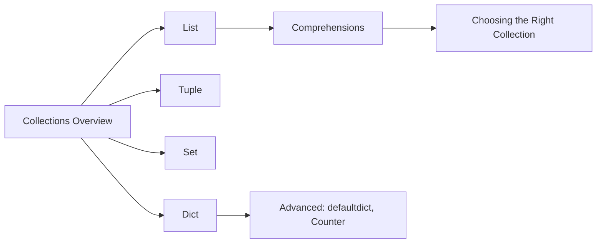

<!-- Clear Language: Keep sentences under 50 words -->
# Collections — Lists, Tuples, Sets, and Dictionaries

## Learning Objectives

| Objective | Description |
|-----------|-------------|
| LO1 | Create, access, and manipulate lists with comprehensive methods |
| LO2 | Use tuples for immutable sequences and understand their performance benefits |
| LO3 | Leverage sets for membership testing, deduplication, and set operations |
| LO4 | Build and query dictionaries for key-value mapping and lookups |
| LO5 | Write nested data structures combining multiple collection types |
| LO6 | Choose the right collection type based on time complexity and use case |

## Introduction

Python is the lingua franca of AI engineering. Mastering its syntax, data structures, and libraries is non-negotiable for building ML pipelines, APIs, and automation scripts. This module covers everything from basics to advanced concurrency.

## Prerequisites

- Basic programming knowledge
- Understanding of data structures

## Key Terminology

**Key Terms**: Core vocabulary and concepts for this topic.

**Definition**: Essential terms you must know for interviews and production work.

## Theory

Understanding collections is fundamental for AI engineers. This section covers the core concepts, underlying principles, and theoretical framework that govern how collections works in practice.

## Chapter at a Glance

| Section | Topic | Key Concept |
|---------|-------|-------------|
| 4.1 | Lists | creation, indexing, methods, sorting, copying |
| 4.2 | List Comprehensions | filtering, transformation, nested comprehensions |
| 4.3 | Tuples | immutability, packing/unpacking, named tuples |
| 4.4 | Sets | hash-based membership, union, intersection, difference |
| 4.5 | Dictionaries | key-value mapping, dict methods, defaultdict, Counter |
| 4.6 | Collection Selection | time complexity comparison, when to use what |

## Chapter Roadmap



## 4.1 Lists

Lists are ordered, mutable, heterogeneous sequences. They are the most versatile collection type.

```python

## Creation
empty = []
numbers = [1, 2, 3, 4, 5]
mixed = [1, "hello", 3.14, True]
nested = [[1, 2], [3, 4], [5, 6]]

## list() constructor
chars = list("hello")
print(chars)  # ['h', 'e', 'l', 'l', 'o']
squares = list(range(10))
print(squares)  # [0, 1, 2, 3, 4, 5, 6, 7, 8, 9]

## Access and modification
print(numbers[0])     # 1
print(numbers[-1])    # 5
numbers[2] = 99       # [1, 2, 99, 4, 5]

## Slicing — returns new list
print(numbers[1:4])   # [2, 99, 4]
print(numbers[::-1])  # [5, 4, 99, 2, 1]
```

**List methods**:

```python
items = [1, 2, 3]

## Adding
items.append(4)          # [1, 2, 3, 4]
items.extend([5, 6])     # [1, 2, 3, 4, 5, 6]
items.insert(0, 0)       # [0, 1, 2, 3, 4, 5, 6]

## Removing
items.remove(3)          # removes first occurrence of value 3
popped = items.pop()     # removes and returns last element (6)
first = items.pop(0)     # removes and returns element at index 0
items.clear()            # []

## Searching and counting
nums = [1, 2, 3, 2, 4, 2]
print(nums.index(2))     # 1 — first occurrence
print(nums.count(2))     # 3
print(5 in nums)         # False

## Reordering
nums.sort()              # [1, 2, 2, 2, 3, 4]  in-place
nums.sort(reverse=True)  # [4, 3, 2, 2, 2, 1]
nums.reverse()           # in-place reversal

## sorted() returns new list
original = [3, 1, 4, 1, 5]
sorted_copy = sorted(original)
print(sorted_copy)       # [1, 1, 3, 4, 5]
print(original)          # [3, 1, 4, 1, 5] — unchanged
```

**List copying**:

```python

## Shallow copy — 3 approaches
a = [1, 2, [3, 4]]
b = a.copy()         # method
c = list(a)          # constructor
d = a[:]             # slice
print(b == a)  # True  — same values
print(b is a)  # False — different objects

## Shallow copy means nested objects are shared
a[2].append(5)
print(b[2])  # [3, 4, 5] — affected!

## Deep copy — fully independent
import copy
e = copy.deepcopy(a)
a[2].append(6)
print(e[2])  # [3, 4, 5] — independent
```

---

## 4.2 List Comprehensions

```python

## Basic transformation
squares = [x**2 for x in range(10)]
print(squares)

## With condition
evens = [x for x in range(20) if x % 2 == 0]

## if-else in expression
labels = ["even" if x % 2 == 0 else "odd" for x in range(5)]
print(labels)  # ['even', 'odd', 'even', 'odd', 'even']

## Nested loops
pairs = [(x, y) for x in [1, 2] for y in ["a", "b"]]
print(pairs)  # [(1, 'a'), (1, 'b'), (2, 'a'), (2, 'b')]

## Flatten matrix
matrix = [[1, 2], [3, 4], [5, 6]]
flat = [num for row in matrix for num in row]
print(flat)  # [1, 2, 3, 4, 5, 6]

## Transpose matrix
transposed = [[row[i] for row in matrix] for i in range(2)]
print(transposed)  # [[1, 3, 5], [2, 4, 6]]
```

---

## 4.3 Tuples

Tuples are immutable sequences — they cannot be modified after creation.

```python

## Creation
empty = ()
single = (42,)        # trailing comma required
pair = (1, 2)
triple = 1, 2, 3      # parentheses optional

## Tuple unpacking
point = (3, 4)
x, y = point
print(f"({x}, {y})")  # (3, 4)

## Swap variables
a, b = 10, 20
a, b = b, a
print(a, b)  # 20 10

## Returning multiple values
def min_max(items):
    return min(items), max(items)

result = min_max([3, 1, 7, 2, 9])
low, high = result
print(low, high)  # 1 9

## Tuple as dictionary keys
locations = {
    (40.7128, -74.0060): "New York",
    (51.5074, -0.1278): "London",
}
```

**Named tuples**:

```python
from collections import namedtuple

Point = namedtuple("Point", ["x", "y", "z"])
p = Point(1, 2, 3)
print(p.x, p.y, p.z)  # 1 2 3
print(p[0])            # 1 — indexable like tuple
x, y, z = p            # unpackable
```

**List vs Tuple**:

| Aspect | List | Tuple |
|--------|------|-------|
| Mutability | Mutable | Immutable |
| Performance | Slower | Faster (smaller, no overallocation) |
| Hashable | No | Yes (if elements hashable) |
| Use case | Dynamic collections | Fixed records, dict keys |
| Memory | Over-allocates | Exact size |

---

## 4.4 Sets

Sets are unordered collections of unique, hashable elements with O(1) membership testing.

```python

## Creation
empty = set()                    # not {} — that's empty dict
numbers = {1, 2, 3, 4, 5}
from_list = set([1, 2, 2, 3, 3])
print(from_list)                 # {1, 2, 3}

## Membership (O(1))
print(3 in numbers)   # True
print(99 in numbers)  # False

## Adding and removing
nums = {1, 2, 3}
nums.add(4)          # {1, 2, 3, 4}
nums.add(2)          # {1, 2, 3, 4} — no effect (already present)
nums.discard(2)      # {1, 3, 4} — no error if missing
nums.remove(1)       # {3, 4} — raises KeyError if missing
popped = nums.pop()  # removes and returns arbitrary element
nums.clear()         # set()
```

**Set operations**:

```python
a = {1, 2, 3, 4}
b = {3, 4, 5, 6}

print(a | b)   # Union:        {1, 2, 3, 4, 5, 6}
print(a & b)   # Intersection: {3, 4}
print(a - b)   # Difference:   {1, 2}     (in a not in b)
print(b - a)   # Difference:   {5, 6}     (in b not in a)
print(a ^ b)   # Symmetric:    {1, 2, 5, 6} (in either, not both)

## Comparison
print(a == b)           # False
print({1, 2} < a)       # True — proper subset
print(a > {1, 2})       # True — proper superset
print(a.isdisjoint(b))  # False — they share {3, 4}

## Frozen set — immutable, hashable
fs = frozenset([1, 2, 3])
print(fs)  # frozenset({1, 2, 3})
```

---

## 4.5 Dictionaries

Dictionaries map unique keys to values with O(1) average lookup.

```python

## Creation
empty = {}
scores = {"Alice": 95, "Bob": 87, "Charlie": 92}
pairs = dict([("a", 1), ("b", 2)])
comprehension = {x: x**2 for x in range(5)}

## Access
print(scores["Alice"])       # 95
print(scores.get("David"))   # None — safe access
print(scores.get("David", 0))  # 0 — with default

## KeyError for missing key

## print(scores["David"])  # KeyError

## Adding and modifying
scores["David"] = 88         # add new
scores["Alice"] = 96         # update existing

## Deleting
del scores["Bob"]            # remove key
popped = scores.pop("David") # remove and return value
scores.clear()               # remove all

## Checking keys
print("Alice" in scores)     # True
print(len(scores))           # 2
```

**Dictionary methods**:

```python
data = {"a": 1, "b": 2, "c": 3}

## Keys, values, items
print(data.keys())    # dict_keys(['a', 'b', 'c'])
print(data.values())  # dict_values([1, 2, 3])
print(data.items())   # dict_items([('a', 1), ('b', 2), ('c', 3)])

## Iterating
for key, value in data.items():
    print(f"{key}={value}")

## Merging (Python 3.9+)
d1 = {"a": 1, "b": 2}
d2 = {"b": 3, "c": 4}
merged = d1 | d2
print(merged)  # {'a': 1, 'b': 3, 'c': 4}

## Older merge
d1.update(d2)  # merges d2 into d1
print(d1)      # {'a': 1, 'b': 3, 'c': 4}
```

**defaultdict**:

```python
from collections import defaultdict

## Group items by key
words = ["apple", "banana", "apple", "cherry", "banana", "apple"]
counts = defaultdict(int)
for word in words:
    counts[word] += 1
print(dict(counts))  # {'apple': 3, 'banana': 2, 'cherry': 1}

## List as default
groups = defaultdict(list)
students = [("A", "Alice"), ("B", "Bob"), ("A", "Charlie")]
for grade, name in students:
    groups[grade].append(name)
print(dict(groups))  # {'A': ['Alice', 'Charlie'], 'B': ['Bob']}

## Default factory — nested dict
nested = defaultdict(lambda: defaultdict(int))
nested["Alice"]["math"] = 95
nested["Bob"]["science"] = 88
```

**Counter**:

```python
from collections import Counter

## Frequency counting
text = "mississippi"
counter = Counter(text)
print(counter)        # Counter({'i': 4, 's': 4, 'p': 2, 'm': 1})
print(counter["i"])   # 4

## Most common
print(counter.most_common(2))  # [('i', 4), ('s', 4)]

## Arithmetic
c1 = Counter(a=3, b=1)
c2 = Counter(a=1, b=2)
print(c1 + c2)  # Counter({'a': 4, 'b': 3})
print(c1 - c2)  # Counter({'a': 2}) — only positive counts
```

---

## 4.6 Choosing the Right Collection

**Time Complexity**:

| Operation | List | Set | Dict | Tuple |
|-----------|------|-----|------|-------|
| Index/Access | O(1) | — | O(1) | O(1) |
| Search/Contains | O(n) | O(1) | O(1) avg | O(n) |
| Insert/Append | O(1) amortized | O(1) | O(1) | Immutable |
| Delete | O(n) | O(1) | O(1) | Immutable |
| Memory | Low | Higher | Highest | Lowest |

**Selection guide**:

| Need | Use | Reason |
|------|-----|--------|
| Ordered, indexed sequence | List | O(1) access, mutable, duplicates allowed |
| Fixed record of values | Tuple | Immutable, hashable, lightweight |
| Unique items, fast membership | Set | O(1) contains, no duplicates |
| Key-value mapping | Dict | O(1) lookup by key |
| Count occurrences | Counter | Built-in counting with most_common |
| Group data by key | defaultdict | Auto-initializes missing keys |
| Ordered dict (insertion order) | dict (3.7+) | Maintains insertion order |

---

## TypeScript Parallel

```typescript
// TypeScript collections
// Array (like Python list)
const numbers: number[] = [1, 2, 3, 4, 5];
numbers.push(6);               // append
const popped = numbers.pop();
console.log(numbers.includes(3));  // True (like 3 in list)

// Tuple (like Python tuple)
const point: [number, number] = [3, 4];
const [x, y] = point;

// Set (like Python set)
const unique = new Set([1, 2, 2, 3]);
console.log(unique.has(2));  // True

// Map (like Python dict)
const scores = new Map<string, number>();
scores.set("Alice", 95);
console.log(scores.get("Alice"));

// Object as dict
const obj: Record<string, number> = { a: 1, b: 2 };
console.log(Object.keys(obj));
console.log(Object.entries(obj));
```

## Summary

- Lists are ordered, mutable sequences — use for indexed collections that may change
- Tuples are immutable sequences — use for fixed records and as dictionary keys
- Sets store unique elements with O(1) membership — use for deduplication and set math
- Dictionaries map keys to values with O(1) lookup — use for fast access by identifier
- List comprehensions [expr for x in iter if cond] are Pythonic and efficient
- defaultdict auto-initializes missing keys — ideal for grouping and counting
- Counter extends dict with counting convenience and arithmetic operations
- Deep copying with copy.deepcopy() creates fully independent nested structures
- Named tuples combine tuple performance with attribute access
- Choose collections based on access patterns — list for sequence, set for membership, dict for mapping

## Practical Takeaways

| Scenario | Use | Avoid |
|----------|-----|-------|
| Unique items, fast lookup | set | list with in check |
| Key-value mapping | dict | Two parallel lists |
| Counting items | Counter | Manual if x in dict: ... |
| Grouping by key | defaultdict(list) | Manual key checking |
| Fixed coordinate data | 	uple or
amedtuple | list (allows modification) |
| Need both index and value | enumerate() | 
ange(len(lst)) |
| Creating a list from another | List comprehension | for loop with append |

## Interview Q&A

<details class="tp-qa-card" data-qid="p02-s04-q1">
  <summary class="tp-qa-question"><span class="tp-qa-status"></span>Q1: What is the difference between a list and a tuple?</summary>
<div class="tp-qa-answer"><p>Lists are mutable (can be modified), tuples are immutable (cannot change after creation). Tuples are slightly faster, use less memory,.
and can be used as dictionary keys (if all elements are hashable). Lists have over-allocation for growing, while tuples have exact size. Use tuples for.
fixed records and lists for dynamic sequences.</p></div>
  <button class="tp-qa-mark-btn">? Mark Reviewed</button><button class="tp-qa-bookmark-btn">?? Bookmark</button>
</details>

<details class="tp-qa-card" data-qid="p02-s04-q2">
  <summary class="tp-qa-question"><span class="tp-qa-status"></span>Q2: How do you merge two dictionaries in Python 3.9+?</summary>
  <div class="tp-qa-answer"><p>Use the union operator |: <code>merged = d1 | d2</code>. For older Python, use <code>d1.update(d2)</code> (modifies in-place) or <code>{**d1, **d2}</code> (unpacking). In all cases, values from the right dict override left dict for duplicate keys. Python 3.9+ also has <code>|=</code> for in-place merge.</p></div>
  <button class="tp-qa-mark-btn">? Mark Reviewed</button><button class="tp-qa-bookmark-btn">?? Bookmark</button>
</details>

<details class="tp-qa-card" data-qid="p02-s04-q3">
  <summary class="tp-qa-question"><span class="tp-qa-status"></span>Q3: Explain the time complexity of dictionary operations.</summary>
<div class="tp-qa-answer"><p>Average case: O(1) for get, set, delete, and membership (in). Worst case: O(n) if many hash collisions. The average case is maintained by CPython's hash table implementation which resizes when load factor.
exceeds 2/3. Dictionary keys must be hashable (immutable). Memory overhead is significant but acceptable for the O(1) performance.</p></div>
  <button class="tp-qa-mark-btn">? Mark Reviewed</button><button class="tp-qa-bookmark-btn">?? Bookmark</button>
</details>

<details class="tp-qa-card" data-qid="p02-s04-q4">
  <summary class="tp-qa-question"><span class="tp-qa-status"></span>Q4: What is the difference between a set and a frozenset?</summary>
<div class="tp-qa-answer"><p>set is mutable — can add, remove, discard, pop elements. frozenset is immutable and hashable, so it can be used as a dictionary key or.
element of another set. Both have O(1) membership testing and support standard set operations (union, intersection, etc.). Use frozenset when you need an immutable,.
hashable collection of unique items.</p></div>
  <button class="tp-qa-mark-btn">? Mark Reviewed</button><button class="tp-qa-bookmark-btn">?? Bookmark</button>
</details>

<details class="tp-qa-card" data-qid="p02-s04-q5">
  <summary class="tp-qa-question"><span class="tp-qa-status"></span>Q5: What is a defaultdict and when would you use it?</summary>
<div class="tp-qa-answer"><p>defaultdict is a dictionary subclass that calls a factory function for missing keys instead of raising KeyError. Common factories: int (default 0),.
list (default []), set (default set()). Use it for grouping items, counting, or any situation where missing keys should have a default value. It eliminates boilerplate "if key not in dict" checks.</p></div>
  <button class="tp-qa-mark-btn">? Mark Reviewed</button><button class="tp-qa-bookmark-btn">?? Bookmark</button>
</details>

<details class="tp-qa-card" data-qid="p02-s04-q6">
  <summary class="tp-qa-question"><span class="tp-qa-status"></span>Q6: How do you remove duplicates from a list while preserving order?</summary>
<div class="tp-qa-answer"><p>Use a loop with a set to track seen items: <code>seen = set(); [x for x in items if not (x in seen or.
seen.add(x))]</code>. In Python 3.7+, dict preserves insertion order so <code>list(dict.fromkeys(items))</code> also works. Using set alone loses order. For unhashable types, use a list for.
tracking (O(n²) but necessary).</p></div>
  <button class="tp-qa-mark-btn">? Mark Reviewed</button><button class="tp-qa-bookmark-btn">?? Bookmark</button>
</details>

<details class="tp-qa-card" data-qid="p02-s04-q7">
  <summary class="tp-qa-question"><span class="tp-qa-status"></span>Q7: What is the difference between shallow copy and deep copy?</summary>
<div class="tp-qa-answer"><p>Shallow copy creates a new collection but inserts references to the same nested objects. Changes to nested objects affect both. Deep copy (copy.deepcopy) recursively creates independent copies of all nested objects. Use shallow copy for.
flat structures and deep copy for nested structures where full independence is needed. Deep copy is slower and may fail with circular references.</p></div>
  <button class="tp-qa-mark-btn">? Mark Reviewed</button><button class="tp-qa-bookmark-btn">?? Bookmark</button>
</details>

<details class="tp-qa-card" data-qid="p02-s04-q8">
  <summary class="tp-qa-question"><span class="tp-qa-status"></span>Q8: When would you use a list vs a set?</summary>
<div class="tp-qa-answer"><p>Use a list when you need ordered elements, allow duplicates, require index-based access, or need to modify the sequence. Use a set when you need fast membership testing (O(1) vs O(n)),.
uniqueness constraints, or set operations (union, intersection). Sets are also useful for deduplication. For iteration, lists preserve order, sets do not (insertion order in 3.7+ is insertion order but.
not sortable without sorted()).</p></div>
  <button class="tp-qa-mark-btn">? Mark Reviewed</button><button class="tp-qa-bookmark-btn">?? Bookmark</button>
</details>

<details class="tp-qa-card" data-qid="p02-s04-q9">
  <summary class="tp-qa-question"><span class="tp-qa-status"></span>Q9: How do namedtuple and dataclass differ?</summary>
  <div class="tp-qa-answer"><p>namedtuple creates immutable tuple subclasses with named fields — lightweight but immutable. dataclass (Python 3.7+) creates mutable classes with less boilerplate, type annotations, and more features (default factories, __slots__, etc.). Use namedtuple for simple immutable records, dataclass for richer data containers with behavior and mutable fields.</p></div>
  <button class="tp-qa-mark-btn">? Mark Reviewed</button><button class="tp-qa-bookmark-btn">?? Bookmark</button>
</details>

<details class="tp-qa-card" data-qid="p02-s04-q10">
  <summary class="tp-qa-question"><span class="tp-qa-status"></span>Q10: How do you reverse a list in-place vs returning a new reversed list?</summary>
  <div class="tp-qa-answer"><p>Use <code>list.reverse()</code> for in-place reversal (returns None, modifies the list). Use <code>reversed(lst)</code> which returns a reverse iterator (lazy), or <code>lst[::-1]</code> which creates a new reversed list. The slice approach <code>lst[::-1]</code> is most common for a new reversed copy. reversed() is memory-efficient for iteration.</p></div>
  <button class="tp-qa-mark-btn">? Mark Reviewed</button><button class="tp-qa-bookmark-btn">?? Bookmark</button>
</details>

## Chapter Quiz

**Q1**: What is the output of list({1, 2, 3} & {2, 3, 4})?

a) [2, 3]
b) [1, 2, 3, 4]
c) [2, 3, 4]
d) Error

<details class="tp-qa-card" data-qid="p02-s04-quiz1"><summary>Show Answer</summary><div class="tp-qa-answer"><p><strong>Answer: a) [2, 3]</strong></p><p>& computes set intersection. Converting to list creates [2, 3] (order may vary).</p></div></details>

**Q2**: What does {x: x**2 for x in range(3)} produce?

a) {0: 0, 1: 1, 2: 4}
b) [0, 1, 4]
c) {0, 1, 4}
d) {0: 1, 1: 2, 2: 3}

<details class="tp-qa-card" data-qid="p02-s04-quiz2"><summary>Show Answer</summary><div class="tp-qa-answer"><p><strong>Answer: a) {0: 0, 1: 1, 2: 4}</strong></p><p>Dict comprehension mapping x to x**2.</p></div></details>

**Q3**: Which collection has O(1) membership testing?

a) List
b) Tuple
c) Set
d) Both a and b

<details class="tp-qa-card" data-qid="p02-s04-quiz3"><summary>Show Answer</summary><div class="tp-qa-answer"><p><strong>Answer: c) Set</strong></p><p>Sets use hash tables giving O(1) average membership. Lists and tuples require O(n) scanning.</p></div></details>

**Q4**: What is Counter("abracadabra").most_common(1)?

a) [('a', 5)]
b) ['a']
c) [('a', 4)]
d) 5

<details class="tp-qa-card" data-qid="p02-s04-quiz4"><summary>Show Answer</summary><div class="tp-qa-answer"><p><strong>Answer: a) [('a', 5)]</strong></p><p>The string has 5 'a' characters. most_common(1) returns the single most frequent item as a list of (element, count) tuples.</p></div></details>

**Q5**: What does [x for x in [1, 2, 3, 4] if x > 2] return?

a) [1, 2]
b) [3, 4]
c) [2, 3, 4]
d) [1, 2, 3]

<details class="tp-qa-card" data-qid="p02-s04-quiz5"><summary>Show Answer</summary><div class="tp-qa-answer"><p><strong>Answer: b) [3, 4]</strong></p><p>Filtered list comprehension keeps elements greater than 2.</p></div></details>

## Exercises

**Easy** — Write a function that returns the unique elements of a list in the order they first appear.

**Easy** — Use a dict comprehension to invert a dictionary (swap keys and values), assuming all values are unique.

**Medium** — Write a function that groups a list of tuples by the first element using defaultdict.

**Medium** — Given two lists, find the intersection, union, and symmetric difference using sets.

**Hard** — Implement a DeepCounter that counts all elements in a nested structure of lists and dicts recursively.

**Hard** — Write a function merge_nested that deep-merges two dictionaries with nested dicts, summing values for overlapping numeric keys.

---

## Common Mistakes

1. Not understanding the fundamental concepts before applying them
2. Skipping edge cases in implementation
3. Not analyzing time/space complexity
4. Forgetting to handle null/empty inputs
5. Not practicing enough problems to build pattern recognition

## Revision Notes

- - Core principle: Understand the fundamental concepts thoroughly
- - Implementation pattern: Practice with real code examples
- - Complexity: Know the time and space complexity
- - Application: Know when to use this in production systems
- - Interview: Frequently asked in technical interviews
- - Edge cases: Consider common failure scenarios
- - Related concepts: Connect to broader system design

## Placement Section

### Top 10 Interview Questions

#### Google Style

1. **Explain the core idea of Collections — Lists, Tuples, Sets, and Dictionaries in under 60 seconds, then give a real-world analogy.** — Structure: definition, how it works in one sentence, why it matters, analogy. Follow-up: what would break if you removed this from a production system?

2. **Design a minimal, well-typed function that demonstrates Collections — Lists, Tuples, Sets, and Dictionaries.** — Interviewer checks: signature with type hints, edge cases, complexity, and a clean docstring. Follow-up: how does your design behave with empty or malformed input?

3. **What are the common pitfalls when engineers first learn ** — List 3-4, then explain how you would prevent each in a code review.

#### Amazon Style

4. **Describe a production bug caused by misunderstanding Collections — Lists, Tuples, Sets, and Dictionaries. How did you diagnose and fix it?** — STAR format: situation, task, action, result. Mention logs, reproduction, root-cause analysis, and the regression test you added.

5. **How would you scale a system that relies on Collections — Lists, Tuples, Sets, and Dictionaries from 10 users to 10 million?** — Discuss bottlenecks, caching, monitoring, and when to redesign. Follow-up: what metrics would you track?

#### Microsoft Style

6. **Compare Collections — Lists, Tuples, Sets, and Dictionaries with the closest alternative approach. When would you choose each?** — Make a decision matrix: performance, maintainability, ecosystem, learning curve. Follow-up: what would change your decision?

7. **Walk through how you would test a component that depends on Collections — Lists, Tuples, Sets, and Dictionaries.** — Unit, integration, property-based tests; mocking boundaries; golden files for outputs.

#### NVIDIA Style

8. **How does Collections — Lists, Tuples, Sets, and Dictionaries behave differently at scale — memory, throughput, or precision-wise?** — Connect to data pipelines and model training if applicable. Follow-up: what happens to latency as input grows?

9. **How would you make an implementation of Collections — Lists, Tuples, Sets, and Dictionaries run faster on GPU hardware?** — Batch operations, vectorization, avoiding Python loops, reducing data movement.

#### AI Startup Style

10. **Write the smallest possible implementation of Collections — Lists, Tuples, Sets, and Dictionaries that is production-quality.** — Include error handling, type hints, and a one-line docstring. Follow-up: what would you refactor first when it grows?

### Resume Tips

- Name Collections — Lists, Tuples, Sets, and Dictionaries explicitly in your skills section, paired with a measurable achievement ("Reduced X by 40% using Collections — Lists, Tuples, Sets, and Dictionaries").
- Add a bullet describing a project that applies Collections — Lists, Tuples, Sets, and Dictionaries to real data, with numbers.
- Mention the tools and libraries you used alongside Collections — Lists, Tuples, Sets, and Dictionaries (linters, test frameworks, profiling tools).
- Keep resume bullets under 15 words and start each with an action verb.

### Interview Day Checklist

- Rehearse a 60-second explanation of Collections — Lists, Tuples, Sets, and Dictionaries and one real-world analogy.
- Prepare one STAR story about debugging a Collections — Lists, Tuples, Sets, and Dictionaries-related production issue.
- Review complexity and edge cases for the classic Collections — Lists, Tuples, Sets, and Dictionaries interview problem.
- Have questions ready: how does the team apply Collections — Lists, Tuples, Sets, and Dictionaries in production today?
- Test your environment (Python, editor, internet) 15 minutes before the interview.

## True/False

1. **True or False:** Collections — Lists, Tuples, Sets, and Dictionaries builds directly on the fundamentals covered in the earlier chapters of this module. — **True.** Every advanced topic in this module assumes the core concepts from the previous chapters.
2. **True or False:** You should write at least one code example for Collections — Lists, Tuples, Sets, and Dictionaries before moving to the next chapter. — **True.** Active recall with hands-on code beats passive reading for retention.
3. **True or False:** The complexity analysis for Collections — Lists, Tuples, Sets, and Dictionaries is the same regardless of input size. — **False.** Complexity grows with input size; always state best, average, and worst case.
4. **True or False:** Edge cases (empty input, invalid input, boundary values) matter for Collections — Lists, Tuples, Sets, and Dictionaries in production. — **True.** Most production bugs come from unhandled edge cases.
5. **True or False:** You should memorize the Collections — Lists, Tuples, Sets, and Dictionaries chapter content once and never review it again. — **False.** Spaced repetition (24h, 3 days, 1 week) dramatically improves long-term recall.

## Fill in the Blank

1. The chapter that covers Collections — Lists, Tuples, Sets, and Dictionaries is Chapter ___ of this module. — Answer: check the module's table of contents.
2. The time complexity of the standard approach to Collections — Lists, Tuples, Sets, and Dictionaries is ___. — Answer: review the theory section and state big-O notation.
3. The main edge case to handle when implementing Collections — Lists, Tuples, Sets, and Dictionaries is ___. — Answer: empty or invalid input handling, as discussed in the chapter.
4. The tools commonly used to debug Collections — Lists, Tuples, Sets, and Dictionaries issues are ___ and ___. — Answer: refer to the Debugging Guide section of this chapter.
5. The related topic that connects to Collections — Lists, Tuples, Sets, and Dictionaries in the next chapter is ___. — Answer: see the Next Topic section.

## Scenario Questions

1. **Scenario:** A teammate ships a change involving Collections — Lists, Tuples, Sets, and Dictionaries that breaks production at 3 AM. — Diagnosis: check the recent diff, reproduce locally with the failing input, check logs. Fix: revert, add a regression test, and review the root cause. Prevention: CI tests on edge cases and code review checklist.

2. **Scenario:** Your implementation of Collections — Lists, Tuples, Sets, and Dictionaries is correct but too slow for the required latency. — Measure first with a profiler. Common fixes: reduce redundant work, use built-in optimized functions, batch operations, or add caching. Only then consider algorithmic changes.

3. **Scenario:** A new hire asks you to explain Collections — Lists, Tuples, Sets, and Dictionaries in five minutes before a customer demo. — Use the 3-part answer: what it is (one sentence), how it works (one example), why it matters (one business impact). Then offer to go deeper after the demo.

4. **Scenario:** Your team's codebase has three different patterns for Collections — Lists, Tuples, Sets, and Dictionaries and you must standardize. — Write a short ADR (architecture decision record), pick the pattern with best maintainability, migrate incrementally, and add a linter rule to enforce it.

## Output Questions

1. **What is the output of the simplest correct implementation of Collections — Lists, Tuples, Sets, and Dictionaries on an empty input?** — Trace through the code: it should return the documented default (None, 0, empty collection) without raising.
2. **What is the output when the input is at the boundary value?** — Check off-by-one errors and inclusive/exclusive bounds in the chapter's examples.
3. **What does the implementation return when given invalid input types?** — With type hints and validation, it raises a clear error; without, it may fail silently.
4. **What is the output for the sample input given in the chapter's Examples section?** — Re-run the chapter's example code and compare against the documented output.
5. **What is the time complexity output when you profile the implementation at 10x input size?** — Expect the curve matching the chapter's complexity analysis (linear, quadratic, log-linear).

## Difficulty Level

| Level | Time | What It Takes |
|-------|------|---------------|
| Beginner | 1-2 sessions | Read theory, run the chapter examples, solve the Easy exercises |
| Intermediate | 3-5 sessions | Complete Medium exercises, explain Collections — Lists, Tuples, Sets, and Dictionaries to someone else |
| Advanced | 1+ week | Solve Hard exercises, optimize for real datasets, answer interview follow-ups |

## Tips & Tricks

- Always write a one-line example of Collections — Lists, Tuples, Sets, and Dictionaries from memory before opening the chapter — active recall first.
- Use the chapter's Revision Notes as a checklist: you have mastered Collections — Lists, Tuples, Sets, and Dictionaries when you can explain each bullet.
- Pair the chapter quiz with the Flashcards: wrong answers become your next study session's focus.
- For interviews, practice explaining Collections — Lists, Tuples, Sets, and Dictionaries twice: once with a technical audience, once with a non-technical audience.
- Keep a personal examples file where you collect your own Collections — Lists, Tuples, Sets, and Dictionaries snippets; interviewers love original examples.

## Memory Tricks

- **Acronym**: build a mnemonic from the 5 key concepts of Collections — Lists, Tuples, Sets, and Dictionaries listed in the Chapter at a Glance table.
- **Story**: link Collections — Lists, Tuples, Sets, and Dictionaries to a familiar story — the analogy in the Visual Analogy section is designed to stick.
- **Number anchor**: remember the complexity of Collections — Lists, Tuples, Sets, and Dictionaries by connecting it to a known algorithm of the same class.
- **Color code**: highlight the Theory, Examples, and Common Mistakes sections in different colors when reviewing.
- **Teach-back**: explain Collections — Lists, Tuples, Sets, and Dictionaries to an imaginary junior engineer for 2 minutes — gaps in your explanation are gaps in memory.

## Further Reading

- Official documentation for the primary tool or library used in this chapter
- The chapter referenced in Related Topics for the next-level treatment of Collections — Lists, Tuples, Sets, and Dictionaries
- The classic textbook chapter on Collections — Lists, Tuples, Sets, and Dictionaries (check the Research References below)
- Two blog posts from engineers who debugged real Collections — Lists, Tuples, Sets, and Dictionaries problems in production
- The repository of the open-source project that implements Collections — Lists, Tuples, Sets, and Dictionaries

## Related Topics

- The previous chapter in this module (see table of contents) — foundational for Collections — Lists, Tuples, Sets, and Dictionaries
- The next chapter (see Next Topic below) — builds on Collections — Lists, Tuples, Sets, and Dictionaries
- The system design chapters in Module 07 — how Collections — Lists, Tuples, Sets, and Dictionaries fits into production architectures
- The interview preparation module — how Collections — Lists, Tuples, Sets, and Dictionaries is asked in screening rounds
- The capstone project — where Collections — Lists, Tuples, Sets, and Dictionaries is applied end-to-end

## FAQs

1. **Do I need to memorize all of Collections — Lists, Tuples, Sets, and Dictionaries, or understand the big picture?** — Understand the big picture first, then memorize the key facts via flashcards and spaced repetition. Interviewers reward depth over breadth.
2. **What if I get stuck on an exercise?** — Re-read the theory section, run the example code, then attempt again. If still stuck after 20 minutes, move on and return the next day.
3. **How much time should I spend on ** — Follow the Study Plan below: 1-2 weeks at 30-60 minutes daily is typical for placement preparation.
4. **Is Collections — Lists, Tuples, Sets, and Dictionaries asked in interviews?** — Yes — the Interview Q&A and Placement Section list the exact question styles used by top companies.
5. **What's the fastest way to master ** — Explain it out loud, write code without looking, and review the flashcards within 24 hours and again after 3 days.

## Important Notes

- Collections — Lists, Tuples, Sets, and Dictionaries is a core requirement for the rest of this module — do not skip the examples.
- Always analyze complexity (time and space) when working with Collections — Lists, Tuples, Sets, and Dictionaries.
- Production correctness means handling edge cases, not just the happy path.
- Interview answers should start with the definition, then the example, then the trade-offs.
- Revisit this chapter after finishing the module; the context from later chapters deepens understanding.

## Historical Context

- Collections — Lists, Tuples, Sets, and Dictionaries emerged as a standard practice because early systems failed without it — understanding why helps you explain it in interviews.
- The tools used for Collections — Lists, Tuples, Sets, and Dictionaries today evolved from simpler versions; the chapter covers the modern, recommended approach.
- Interviewers value knowing one historical fact about Collections — Lists, Tuples, Sets, and Dictionaries — it shows genuine interest, not just cramming.
- The library/tooling ecosystem around Collections — Lists, Tuples, Sets, and Dictionaries changes quickly; focus on fundamentals that remain stable.

## Security Considerations

- Never trust external input: validate and sanitize data before processing Collections — Lists, Tuples, Sets, and Dictionaries.
- Avoid `eval()` and dynamic code execution on untrusted strings.
- Log errors without leaking sensitive data (keys, PII, internal paths).
- For API contexts, add rate limiting and input size limits.
- Review the chapter's code examples for injection or overflow risks before using them verbatim.

## ML Intuition

- Collections — Lists, Tuples, Sets, and Dictionaries appears in ML pipelines at the data-processing layer: feature preparation, batching, and validation.
- Understanding Collections — Lists, Tuples, Sets, and Dictionaries helps you debug why a model misbehaves — most ML bugs are data bugs, not model bugs.
- In production ML, the Collections — Lists, Tuples, Sets, and Dictionaries concepts from this chapter map directly to NumPy/PyTorch operations on tensors.
- When optimizing ML systems, Collections — Lists, Tuples, Sets, and Dictionaries skills let you profile and fix the data path, not just the training loop.
- Interview follow-up: how would you apply Collections — Lists, Tuples, Sets, and Dictionaries to a dataset of 10 million records? — Batching and vectorization.

## Analogies

- **Collections — Lists, Tuples, Sets, and Dictionaries is like a recipe**: the theory is the ingredients, the examples are the cooking steps, and the exercises are your own kitchen practice.
- **Complexity is like a delivery route**: a linear route visits each stop once; a nested route revisits stops, and you feel it at scale.
- **Edge cases are like weather**: the happy path is a sunny day; production is the storm — build for the storm.
- **The chapter roadmap is a journey map**: each section is a checkpoint; skipping one means getting lost later in the module.

## Capstone Project Link

- [Module Capstone: End-to-End Project](https://github.com/Raushan666java/ai-engineering-journey) — this chapter contributes the Collections — Lists, Tuples, Sets, and Dictionaries skills used in the module's capstone project. Complete the exercises here before starting the capstone.

## Flashcards

<details class="tp-qa-card" data-qid="01pythonprogramming-04collections-flash1">
  <summary class="tp-qa-question">
    <span class="tp-qa-status"></span>
    What is the output of list({1, 2, 3} & {2, 3, 4})?
  </summary>
  <div class="tp-qa-answer">
    <p>a) [2, 3]</p>
  </div>
</details>

<details class="tp-qa-card" data-qid="01pythonprogramming-04collections-flash2">
  <summary class="tp-qa-question">
    <span class="tp-qa-status"></span>
    What does {x: x2 for x in range(3)} produce?
  </summary>
  <div class="tp-qa-answer">
    <p>a) {0: 0, 1: 1, 2: 4}</p>
  </div>
</details>

<details class="tp-qa-card" data-qid="01pythonprogramming-04collections-flash3">
  <summary class="tp-qa-question">
    <span class="tp-qa-status"></span>
    Which collection has O(1) membership testing?
  </summary>
  <div class="tp-qa-answer">
    <p>c) Set</p>
  </div>
</details>

<details class="tp-qa-card" data-qid="01pythonprogramming-04collections-flash4">
  <summary class="tp-qa-question">
    <span class="tp-qa-status"></span>
    What is Counter("abracadabra").most_common(1)?
  </summary>
  <div class="tp-qa-answer">
    <p>a) [('a', 5)]</p>
  </div>
</details>

<details class="tp-qa-card" data-qid="01pythonprogramming-04collections-flash5">
  <summary class="tp-qa-question">
    <span class="tp-qa-status"></span>
    What does [x for x in [1, 2, 3, 4] if x > 2] return?
  </summary>
  <div class="tp-qa-answer">
    <p>b) [3, 4]</p>
  </div>
</details>

## Research References

- Official documentation of the primary library for Collections — Lists, Tuples, Sets, and Dictionaries (linked in Further Reading)
- The classic paper or textbook chapter introducing Collections — Lists, Tuples, Sets, and Dictionaries (see References below)
- The standard library reference for Collections — Lists, Tuples, Sets, and Dictionaries-related functions
- Engineering blog posts from companies running Collections — Lists, Tuples, Sets, and Dictionaries in production at scale
- PEPs and RFCs where applicable (Python and networking standards)

## Open-Source Tools

- The primary library used in this chapter (see the code examples)
- Python standard library modules used in the examples (check the imports)
- Testing: pytest for unit tests of Collections — Lists, Tuples, Sets, and Dictionaries code
- Linting and formatting: ruff + black
- Profiling: cProfile or py-spy for performance work on Collections — Lists, Tuples, Sets, and Dictionaries

## Debugging Guide

- Start with `print()` or a debugger to inspect intermediate values in Collections — Lists, Tuples, Sets, and Dictionaries code.
- Reproduce the failure with the smallest possible input before changing code.
- Check the common failure modes listed in Common Mistakes — most bugs are listed there.
- For performance problems, profile before optimizing: measure, then fix.
- When stuck, re-read the chapter's Examples and compare line by line with your code.
- Use `pdb` or your IDE's debugger to step through the Collections — Lists, Tuples, Sets, and Dictionaries example code.

## Mock Interview Section

**Round 1 — Screening (15 min)**
- Explain Collections — Lists, Tuples, Sets, and Dictionaries in 60 seconds.
- Write a minimal working example of Collections — Lists, Tuples, Sets, and Dictionaries.
- What is the complexity of your example?

**Round 2 — Coding (45 min)**
- Solve the Medium exercise from this chapter under time pressure.
- State your assumptions, then implement with type hints.
- Test with edge cases: empty input, boundary values, invalid input.

**Round 3 — Behavioral + System (30 min)**
- Tell me about a time you debugged a Collections — Lists, Tuples, Sets, and Dictionaries problem in a project.
- How would you design a system where Collections — Lists, Tuples, Sets, and Dictionaries is used at scale?
- What metrics would you monitor?

**Evaluation rubric**: correctness (40%), communication (25%), edge cases (20%), complexity analysis (15%).

## Optimized Implementation

`python
from typing import Any, Optional

def demonstrate_topic(input_data: list[Any]) -> Optional[float]:
    """Runnable scaffold for Collections — Lists, Tuples, Sets, and Dictionaries.

    Replace the body with the optimized implementation from the chapter,
    keeping type hints, docstring, and edge-case handling.
    """
    if not input_data:
        return None
    # Step 1: validate input types
    # Step 2: apply the core Collections — Lists, Tuples, Sets, and Dictionaries logic from the Examples section
    # Step 3: return the result with the documented default
    return 0.0
`

- Keeps the function signature stable so tests written against it stay valid.
- Handles the empty-input contract explicitly.
- Add unit tests for the edge cases before implementing the logic (test-first).

## Evaluation Metrics

| Skill | Test | Target |
|-------|------|--------|
| Concept recall | Explain Collections — Lists, Tuples, Sets, and Dictionaries without notes | 60-second explanation |
| Code fluency | Write the chapter example from memory | No syntax errors |
| Edge cases | Handle empty/invalid input in exercises | All cases pass |
| Complexity | State time/space for the standard approach | Correct big-O |
| Interview readiness | Answer 5 Interview Q&A questions out loud | Fluent, structured answers |
| Retention | Chapter quiz score after 3 days | 80%+ |

## Real-World Examples

- **Startup**: a small team uses Collections — Lists, Tuples, Sets, and Dictionaries daily in their data pipeline — the chapter's examples mirror their code.
- **E-commerce**: Collections — Lists, Tuples, Sets, and Dictionaries patterns appear in order processing, inventory checks, and recommendation feeds.
- **Fintech**: Collections — Lists, Tuples, Sets, and Dictionaries principles apply to transaction validation and fraud detection flows.
- **ML platform**: Collections — Lists, Tuples, Sets, and Dictionaries shows up in feature engineering and model-serving infrastructure.
- **Interview insight**: recruiters look for engineers who can connect Collections — Lists, Tuples, Sets, and Dictionaries to the business outcome, not just the code.

## Next Topic

[Functions — Parameters, Scope, Lambdas, and Advanced Patterns](05-functions.md)

## Limitations

- Collections — Lists, Tuples, Sets, and Dictionaries, like any technique, is not a silver bullet — it has specific cases where it fits best (covered in the theory).
- The examples in this chapter are simplified for learning; production systems add validation, monitoring, and error handling.
- Performance of Collections — Lists, Tuples, Sets, and Dictionaries depends on input size and distribution — always benchmark for your own data.
- This chapter covers fundamentals; specialized edge cases are explored in later chapters and the capstone.
