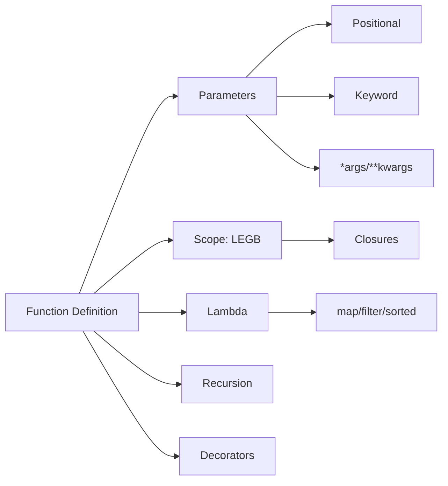

<!-- Clear Language: Keep sentences under 50 words -->
# Functions — Parameters, Scope, Lambdas, and Advanced Patterns

## Learning Objectives

| Objective | Description |
|-----------|-------------|
| LO1 | Define functions with proper parameters, return values, and type hints |
| LO2 | Use positional, keyword, default, *args, and **kwargs parameters |
| LO3 | Understand variable scope — LEGB rule, global, nonlocal |
| LO4 | Create lambda functions for inline operations |
| LO5 | Write recursive functions and understand stack depth limits |
| LO6 | Apply decorators, partials, and functional patterns |

## Introduction

Python is the lingua franca of AI engineering. Mastering its syntax, data structures, and libraries is non-negotiable for building ML pipelines, APIs, and automation scripts. This module covers everything from basics to advanced concurrency.

## Prerequisites

- Basic programming knowledge
- Understanding of data structures

## Key Terminology

**Key Terms**: Core vocabulary and concepts for this topic.

**Definition**: Essential terms you must know for interviews and production work.

## Theory

Understanding functions is fundamental for AI engineers. This section covers the core concepts, underlying principles, and theoretical framework that govern how functions works in practice.

## Chapter at a Glance

| Section | Topic | Key Concept |
|---------|-------|-------------|
| 5.1 | Function Basics | def, return, parameters, type hints |
| 5.2 | Parameter Types | positional, keyword, default, *args, **kwargs |
| 5.3 | Scope Rules | LEGB, global, nonlocal, closures |
| 5.4 | Lambda Functions | lambda syntax, map, filter, sorted |
| 5.5 | Recursion | recursive patterns, stack depth, memoization |
| 5.6 | Advanced Patterns | decorators, partials, docstrings |

## Chapter Roadmap



## 5.1 Function Basics

Functions are defined with def, can return values with return, and should include type hints.

```python
def greet(name: str, greeting: str = "Hello") -> str:
    return f"{greeting}, {name}!"

print(greet("Alice"))           # Hello, Alice!
print(greet("Bob", "Hi"))       # Hi, Bob!

def divide(a: int, b: int) -> tuple[int, int]:
    quotient = a // b
    remainder = a % b
    return quotient, remainder

q, r = divide(17, 5)
print(q, r)  # 3 2

def safe_divide(a: float, b: float) -> float | None:
    if b == 0:
        return None
    return a / b
```

**Docstrings** document the function:

```python
def calculate_mean(numbers: list[float]) -> float:
    "Calculate the arithmetic mean of a list of numbers."
    if not numbers:
        raise ValueError("Cannot calculate mean of empty list")
    return sum(numbers) / len(numbers)
```

## 5.2 Parameter Types

```python
def point(x, y, z):
    return f"({x}, {y}, {z})"

print(point(1, 2, 3))  # (1, 2, 3)

def power(base, exp=2):
    return base ** exp

print(power(5))       # 25 (5^2)
print(power(5, 3))    # 125 (5^3)

## WARNING: Default arguments are evaluated ONCE at definition
def bad_append(item, lst=[]):
    lst.append(item)
    return lst

print(bad_append(1))  # [1]
print(bad_append(2))  # [1, 2] — shared mutable default!

def good_append(item, lst=None):
    if lst is None:
        lst = []
    lst.append(item)
    return lst

## Variable positional arguments
def sum_all(*numbers):
    return sum(numbers)

print(sum_all(1, 2, 3, 4, 5))  # 15

## Variable keyword arguments
def build_profile(**info):
    for key, value in info.items():
        print(f"  {key}: {value}")

build_profile(name="Alice", age=30, role="Engineer")
```

## 5.3 Scope Rules — LEGB

```python
x = "global"

def outer():
    x = "enclosing"
    def inner():
        x = "local"
        print(x)     # "local"
    inner()
    print(x)         # "enclosing"

outer()
print(x)             # "global"
```

**global and nonlocal**:

```python
counter = 0
def increment():
    global counter
    counter += 1

increment()
increment()
print(counter)  # 2

def make_counter():
    count = 0
    def increment():
        nonlocal count
        count += 1
        return count
    return increment

counter_fn = make_counter()
print(counter_fn())  # 1
print(counter_fn())  # 2
```

**Closures**:

```python
def make_multiplier(factor: float):
    def multiply(number: float) -> float:
        return number * factor
    return multiply

double = make_multiplier(2)
triple = make_multiplier(3)
print(double(5))   # 10
print(triple(5))   # 15
```

## 5.4 Lambda Functions

```python
square = lambda x: x ** 2
print(square(5))  # 25

people = [
    {"name": "Alice", "age": 30},
    {"name": "Bob", "age": 25},
    {"name": "Charlie", "age": 35},
]
people.sort(key=lambda p: p["age"])
print(people)

numbers = [1, 2, 3, 4, 5]
squared = list(map(lambda x: x**2, numbers))
print(squared)  # [1, 4, 9, 16, 25]

evens = list(filter(lambda x: x % 2 == 0, numbers))
print(evens)  # [2, 4]

from functools import reduce
product = reduce(lambda a, b: a * b, [1, 2, 3, 4])
print(product)  # 24
```

## 5.5 Recursion

```python
def factorial(n: int) -> int:
    if n <= 1:
        return 1
    return n * factorial(n - 1)

print(factorial(5))  # 120

from functools import lru_cache

@lru_cache(maxsize=None)
def fib_memo(n: int) -> int:
    if n <= 1:
        return n
    return fib_memo(n - 1) + fib_memo(n - 2)

print(fib_memo(100))  # 354224848179261915075
```

## 5.6 Advanced Patterns

**Decorators**:

```python
from functools import wraps
import time

def timer(func):
    @wraps(func)
    def wrapper(*args, **kwargs):
        start = time.perf_counter()
        result = func(*args, **kwargs)
        elapsed = time.perf_counter() - start
        print(f"{func.__name__} took {elapsed:.4f}s")
        return result
    return wrapper

@timer
def slow_function():
    time.sleep(0.1)
    return "done"

print(slow_function())
```

**Partial functions**:

```python
from functools import partial

def power(base, exp):
    return base ** exp

square = partial(power, exp=2)
cube = partial(power, exp=3)

print(square(5))  # 25
print(cube(5))    # 125
```

## TypeScript Parallel

```typescript
function greet(name: string, greeting: string = "Hello"): string {
    return ${greeting}, !;
}

const square = (x: number): number => x ** 2;

function sumAll(...numbers: number[]): number {
    return numbers.reduce((acc, n) => acc + n, 0);
}
```

## Summary

- Functions are first-class objects — can be assigned, passed, and returned
- Parameter order: positional, *args, keyword-only, default, **kwargs
- Default arguments evaluated once at definition — never use mutable defaults
- LEGB scope: Local, Enclosing, Global, Built-in
- global and nonlocal modify outer scope variables
- Lambda functions are single-expression anonymous functions
- Python does not optimize tail recursion — limit ~1000
- Decorators wrap functions; use @wraps to preserve metadata
- Partial functions pre-fill arguments for reuse
- Closures capture enclosing scope for data hiding and factories

## Practical Takeaways

| Scenario | Use | Avoid |
|----------|-----|-------|
| Simple inline | Lambda | def for trivial one-liners |
| Pre-fill args | functools.partial | Wrapper functions |
| Modify global | global x | Passing globals as mutable args |
| Timing | Decorator with @wraps | Copy-paste timing code |
| Memoization | @lru_cache | Manual dict caching |
| Variable args | *args / **kwargs | Modifying args/kwargs |

## Interview Q&A

<details class="tp-qa-card" data-qid="p02-s05-q1">
  <summary class="tp-qa-question"><span class="tp-qa-status"></span>Q1: Difference between args and kwargs?</summary>
  <div class="tp-qa-answer"><p>*args captures extra positional args as tuple. **kwargs captures extra keyword args as dict. Order: *args before **kwargs.</p></div>
  <button class="tp-qa-mark-btn">? Mark Reviewed</button><button class="tp-qa-bookmark-btn">?? Bookmark</button>
</details>

<details class="tp-qa-card" data-qid="p02-s05-q2">
  <summary class="tp-qa-question"><span class="tp-qa-status"></span>Q2: Why are mutable default args dangerous?</summary>
  <div class="tp-qa-answer"><p>Default args evaluated once at definition. Mutable defaults (list, dict) accumulate changes across calls. Use None and create fresh mutable inside.</p></div>
  <button class="tp-qa-mark-btn">? Mark Reviewed</button><button class="tp-qa-bookmark-btn">?? Bookmark</button>
</details>

<details class="tp-qa-card" data-qid="p02-s05-q3">
  <summary class="tp-qa-question"><span class="tp-qa-status"></span>Q3: Explain LEGB scope rule.</summary>
  <div class="tp-qa-answer"><p>Local, Enclosing, Global, Built-in. Python searches in this order for variable names.</p></div>
  <button class="tp-qa-mark-btn">? Mark Reviewed</button><button class="tp-qa-bookmark-btn">?? Bookmark</button>
</details>

<details class="tp-qa-card" data-qid="p02-s05-q4">
  <summary class="tp-qa-question"><span class="tp-qa-status"></span>Q4: How to write a decorator with arguments?</summary>
  <div class="tp-qa-answer"><p>Three nested functions: outer takes decorator args, returns decorator, which takes function, returns wrapper.</p></div>
  <button class="tp-qa-mark-btn">? Mark Reviewed</button><button class="tp-qa-bookmark-btn">?? Bookmark</button>
</details>

<details class="tp-qa-card" data-qid="p02-s05-q5">
  <summary class="tp-qa-question"><span class="tp-qa-status"></span>Q5: What is a closure?</summary>
  <div class="tp-qa-answer"><p>Function that retains access to enclosing scope variables after outer function completes. Used in decorators, factories.</p></div>
  <button class="tp-qa-mark-btn">? Mark Reviewed</button><button class="tp-qa-bookmark-btn">?? Bookmark</button>
</details>

<details class="tp-qa-card" data-qid="p02-s05-q6">
  <summary class="tp-qa-question"><span class="tp-qa-status"></span>Q6: Lambda vs regular function?</summary>
  <div class="tp-qa-answer"><p>Lambda: anonymous, single-expression, no annotations, no docstring. Regular: named, multi-statement, annotations.</p></div>
  <button class="tp-qa-mark-btn">? Mark Reviewed</button><button class="tp-qa-bookmark-btn">?? Bookmark</button>
</details>

<details class="tp-qa-card" data-qid="p02-s05-q7">
  <summary class="tp-qa-question"><span class="tp-qa-status"></span>Q7: How does Python handle recursion?</summary>
  <div class="tp-qa-answer"><p>Default recursion limit ~1000. No tail-call optimization. Use sys.setrecursionlimit() to increase (risky). Prefer iteration for deep recursion.</p></div>
  <button class="tp-qa-mark-btn">? Mark Reviewed</button><button class="tp-qa-bookmark-btn">?? Bookmark</button>
</details>

<details class="tp-qa-card" data-qid="p02-s05-q8">
  <summary class="tp-qa-question"><span class="tp-qa-status"></span>Q8: Purpose of @wraps?</summary>
  <div class="tp-qa-answer"><p>Copies __name__, __doc__, __module__, __annotations__ from original to wrapper. Essential for debugging.</p></div>
  <button class="tp-qa-mark-btn">? Mark Reviewed</button><button class="tp-qa-bookmark-btn">?? Bookmark</button>
</details>

<details class="tp-qa-card" data-qid="p02-s05-q9">
  <summary class="tp-qa-question"><span class="tp-qa-status"></span>Q9: How do keyword-only arguments work?</summary>
  <div class="tp-qa-answer"><p>Parameters after * are keyword-only. Parameters before / are positional-only (Python 3.8+).</p></div>
  <button class="tp-qa-mark-btn">? Mark Reviewed</button><button class="tp-qa-bookmark-btn">?? Bookmark</button>
</details>

<details class="tp-qa-card" data-qid="p02-s05-q10">
  <summary class="tp-qa-question"><span class="tp-qa-status"></span>Q10: Comprehensions vs map/filter?</summary>
  <div class="tp-qa-answer"><p>List comprehensions preferred for readability. map with named function is cleaner: map(str.upper, words). map returns lazy iterator.</p></div>
  <button class="tp-qa-mark-btn">? Mark Reviewed</button><button class="tp-qa-bookmark-btn">?? Bookmark</button>
</details>

## Chapter Quiz

**Q1**: What is output of func(1,2,3,4,5) given def func(a,b,*args): return (a,b,args)?
a) (1,2,(3,4,5)) b) (1,2,3,4,5) c) ((1,2),(3,4,5)) d) (1,2,[3,4,5])

<details class="tp-qa-card" data-qid="p02-s05-quiz1"><summary>Show Answer</summary><div class="tp-qa-answer"><p><strong>Answer: a) (1, 2, (3, 4, 5))</strong></p></div></details>

**Q2**: Which keyword modifies enclosing non-global scope? a) global b) nonlocal c) outer d) enclosing

<details class="tp-qa-card" data-qid="p02-s05-quiz2"><summary>Show Answer</summary><div class="tp-qa-answer"><p><strong>Answer: b) nonlocal</strong></p></div></details>

**Q3**: How many times is default list created in def add(item, lst=[])? a) 1 b) per call c) 0 d) lazy

<details class="tp-qa-card" data-qid="p02-s05-quiz3"><summary>Show Answer</summary><div class="tp-qa-answer"><p><strong>Answer: a) 1 — once at definition</strong></p></div></details>

**Q4**: Which preserves function metadata? a) @preserve b) @wraps c) @keep d) @meta

<details class="tp-qa-card" data-qid="p02-s05-quiz4"><summary>Show Answer</summary><div class="tp-qa-answer"><p><strong>Answer: b) @wraps from functools</strong></p></div></details>

**Q5**: What does lambda x: x % 2 == 0 return for x=5? a) True b) False c) 5 d) Error

<details class="tp-qa-card" data-qid="p02-s05-quiz5"><summary>Show Answer</summary><div class="tp-qa-answer"><p><strong>Answer: b) False (5 % 2 = 1, 1 == 0 is False)</strong></p></div></details>

## Exercises

**Easy** — Write a function that takes variable numbers and returns their product.

**Easy** — Use lambda with sorted() to sort strings by their last character.

**Medium** — Write a retry decorator that retries up to n times on exception.

**Medium** — Write recursive deep_flatten for arbitrarily nested lists.

**Hard** — Implement memoize decorator from scratch with max_size support.

**Hard** — Write compose(f, g, h) returning f(g(h(x))) composition.

## 5.7 Type Hints Deep Dive

Python type hints enable static type checking and better IDE support.

```python
from typing import Optional, Union, Callable, TypeVar, Generic, Protocol

## Optional and Union
def find_user(user_id: int) -> Optional[str]:
    return "Alice" if user_id == 1 else None

def process(value: Union[int, str]) -> str:
    return str(value)

## Callable signatures
def apply_twice(func: Callable[[int], int], x: int) -> int:
    return func(func(x))

## Generics
T = TypeVar("T")
def first(items: list[T]) -> T:
    return items[0]

## Protocols (structural subtyping)
class Drawable(Protocol):
    def draw(self) -> None: ...

class Circle:
    def draw(self) -> None:
        print("Drawing circle")

def render(obj: Drawable) -> None:
    obj.draw()

render(Circle())  # OK - Circle implements Drawable protocol
```

## 5.8 Decorators with Arguments

Decorators can accept their own arguments using three levels of nesting.

```python
from functools import wraps

def repeat(n: int):
    def decorator(func):
        @wraps(func)
        def wrapper(*args, **kwargs):
            for _ in range(n):
                result = func(*args, **kwargs)
            return result
        return wrapper
    return decorator

@repeat(3)
def greet(name: str) -> str:
    print(f"Hello, {name}!")
    return f"Hello, {name}!"

greet("Alice")

## Hello, Alice!

## Hello, Alice!

## Hello, Alice!

## Class-based decorator
class CountCalls:
    def __init__(self, func):
        self.func = func
        self.count = 0

    def __call__(self, *args, **kwargs):
        self.count += 1
        print(f"Call {self.count} of {self.func.__name__}")
        return self.func(*args, **kwargs)

@CountCalls
def say_hello():
    print("Hello!")

say_hello()  # Call 1 of say_hello
say_hello()  # Call 2 of say_hello
```

## 5.9 Common Pitfalls

```python

## Pitfall 1: Mutable default arguments
def add_item(item, lst=[]):  # BAD
    lst.append(item)
    return lst

print(add_item(1))  # [1]
print(add_item(2))  # [1, 2] -- shared state!

def add_item_fixed(item, lst=None):  # GOOD
    if lst is None:
        lst = []
    lst.append(item)
    return lst

## Pitfall 2: Late binding closures
funcs = [lambda x, n=i: x + n for i in range(5)]  # capture i immediately
print([f(0) for f in funcs])  # [0, 1, 2, 3, 4]

## Pitfall 3: Variable scope in comprehensions
x = "global"
values = [x for x in range(3)]  # leaks x in Python 2, not in 3
print(x)  # "global" in Python 3

## Pitfall 4: Modifying while iterating
def remove_negatives(numbers):
    for n in numbers:
        if n < 0:
            numbers.remove(n)  # BAD: skip elements
    return numbers

print(remove_negatives([-1, -2, 3]))  # [-2, 3] -- wrong!

def remove_negatives_fixed(numbers):
    return [n for n in numbers if n >= 0]

## Pitfall 5: Using lambda where def is clearer

## BAD: squared = lambda x: x ** 2

## GOOD:
def squared(x): return x ** 2
```

## 5.10 Performance Considerations

```python
import timeit

## Local variable binding is faster
def slow():
    import math
    return math.sqrt(100)

def fast():
    from math import sqrt
    return sqrt(100)

print(timeit.timeit(slow, number=100000))  # slower
print(timeit.timeit(fast, number=100000))  # faster

## Function call overhead

## Inline is faster than function call for simple ops
def compute(x):
    return x * 2

## Inline: result = x * 2

## Function: result = compute(x)

## @lru_cache for expensive pure functions
from functools import lru_cache

@lru_cache(maxsize=128)
def expensive(n):
    return sum(i * i for i in range(n))

## First call computes, subsequent calls are O(1)
print(expensive(10000))  # computes
print(expensive(10000))  # cached hit
```

---

## Common Mistakes

1. Not understanding the fundamental concepts before applying them
2. Skipping edge cases in implementation
3. Not analyzing time/space complexity
4. Forgetting to handle null/empty inputs
5. Not practicing enough problems to build pattern recognition

## Revision Notes

- - Core principle: Understand the fundamental concepts thoroughly
- - Implementation pattern: Practice with real code examples
- - Complexity: Know the time and space complexity
- - Application: Know when to use this in production systems
- - Interview: Frequently asked in technical interviews
- - Edge cases: Consider common failure scenarios
- - Related concepts: Connect to broader system design

## Placement Section

### Top 10 Interview Questions

#### Google Style

1. **Explain the core idea of Functions — Parameters, Scope, Lambdas, and Advanced Patterns in under 60 seconds, then give a real-world analogy.** — Structure: definition, how it works in one sentence, why it matters, analogy. Follow-up: what would break if you removed this from a production system?

2. **Design a minimal, well-typed function that demonstrates Functions — Parameters, Scope, Lambdas, and Advanced Patterns.** — Interviewer checks: signature with type hints, edge cases, complexity, and a clean docstring. Follow-up: how does your design behave with empty or malformed input?

3. **What are the common pitfalls when engineers first learn ** — List 3-4, then explain how you would prevent each in a code review.

#### Amazon Style

4. **Describe a production bug caused by misunderstanding Functions — Parameters, Scope, Lambdas, and Advanced Patterns. How did you diagnose and fix it?** — STAR format: situation, task, action, result. Mention logs, reproduction, root-cause analysis, and the regression test you added.

5. **How would you scale a system that relies on Functions — Parameters, Scope, Lambdas, and Advanced Patterns from 10 users to 10 million?** — Discuss bottlenecks, caching, monitoring, and when to redesign. Follow-up: what metrics would you track?

#### Microsoft Style

6. **Compare Functions — Parameters, Scope, Lambdas, and Advanced Patterns with the closest alternative approach. When would you choose each?** — Make a decision matrix: performance, maintainability, ecosystem, learning curve. Follow-up: what would change your decision?

7. **Walk through how you would test a component that depends on Functions — Parameters, Scope, Lambdas, and Advanced Patterns.** — Unit, integration, property-based tests; mocking boundaries; golden files for outputs.

#### NVIDIA Style

8. **How does Functions — Parameters, Scope, Lambdas, and Advanced Patterns behave differently at scale — memory, throughput, or precision-wise?** — Connect to data pipelines and model training if applicable. Follow-up: what happens to latency as input grows?

9. **How would you make an implementation of Functions — Parameters, Scope, Lambdas, and Advanced Patterns run faster on GPU hardware?** — Batch operations, vectorization, avoiding Python loops, reducing data movement.

#### AI Startup Style

10. **Write the smallest possible implementation of Functions — Parameters, Scope, Lambdas, and Advanced Patterns that is production-quality.** — Include error handling, type hints, and a one-line docstring. Follow-up: what would you refactor first when it grows?

### Resume Tips

- Name Functions — Parameters, Scope, Lambdas, and Advanced Patterns explicitly in your skills section, paired with a measurable achievement ("Reduced X by 40% using Functions — Parameters, Scope, Lambdas, and Advanced Patterns").
- Add a bullet describing a project that applies Functions — Parameters, Scope, Lambdas, and Advanced Patterns to real data, with numbers.
- Mention the tools and libraries you used alongside Functions — Parameters, Scope, Lambdas, and Advanced Patterns (linters, test frameworks, profiling tools).
- Keep resume bullets under 15 words and start each with an action verb.

### Interview Day Checklist

- Rehearse a 60-second explanation of Functions — Parameters, Scope, Lambdas, and Advanced Patterns and one real-world analogy.
- Prepare one STAR story about debugging a Functions — Parameters, Scope, Lambdas, and Advanced Patterns-related production issue.
- Review complexity and edge cases for the classic Functions — Parameters, Scope, Lambdas, and Advanced Patterns interview problem.
- Have questions ready: how does the team apply Functions — Parameters, Scope, Lambdas, and Advanced Patterns in production today?
- Test your environment (Python, editor, internet) 15 minutes before the interview.

## True/False

1. **True or False:** Functions — Parameters, Scope, Lambdas, and Advanced Patterns builds directly on the fundamentals covered in the earlier chapters of this module. — **True.** Every advanced topic in this module assumes the core concepts from the previous chapters.
2. **True or False:** You should write at least one code example for Functions — Parameters, Scope, Lambdas, and Advanced Patterns before moving to the next chapter. — **True.** Active recall with hands-on code beats passive reading for retention.
3. **True or False:** The complexity analysis for Functions — Parameters, Scope, Lambdas, and Advanced Patterns is the same regardless of input size. — **False.** Complexity grows with input size; always state best, average, and worst case.
4. **True or False:** Edge cases (empty input, invalid input, boundary values) matter for Functions — Parameters, Scope, Lambdas, and Advanced Patterns in production. — **True.** Most production bugs come from unhandled edge cases.
5. **True or False:** You should memorize the Functions — Parameters, Scope, Lambdas, and Advanced Patterns chapter content once and never review it again. — **False.** Spaced repetition (24h, 3 days, 1 week) dramatically improves long-term recall.

## Fill in the Blank

1. The chapter that covers Functions — Parameters, Scope, Lambdas, and Advanced Patterns is Chapter ___ of this module. — Answer: check the module's table of contents.
2. The time complexity of the standard approach to Functions — Parameters, Scope, Lambdas, and Advanced Patterns is ___. — Answer: review the theory section and state big-O notation.
3. The main edge case to handle when implementing Functions — Parameters, Scope, Lambdas, and Advanced Patterns is ___. — Answer: empty or invalid input handling, as discussed in the chapter.
4. The tools commonly used to debug Functions — Parameters, Scope, Lambdas, and Advanced Patterns issues are ___ and ___. — Answer: refer to the Debugging Guide section of this chapter.
5. The related topic that connects to Functions — Parameters, Scope, Lambdas, and Advanced Patterns in the next chapter is ___. — Answer: see the Next Topic section.

## Scenario Questions

1. **Scenario:** A teammate ships a change involving Functions — Parameters, Scope, Lambdas, and Advanced Patterns that breaks production at 3 AM. — Diagnosis: check the recent diff, reproduce locally with the failing input, check logs. Fix: revert, add a regression test, and review the root cause. Prevention: CI tests on edge cases and code review checklist.

2. **Scenario:** Your implementation of Functions — Parameters, Scope, Lambdas, and Advanced Patterns is correct but too slow for the required latency. — Measure first with a profiler. Common fixes: reduce redundant work, use built-in optimized functions, batch operations, or add caching. Only then consider algorithmic changes.

3. **Scenario:** A new hire asks you to explain Functions — Parameters, Scope, Lambdas, and Advanced Patterns in five minutes before a customer demo. — Use the 3-part answer: what it is (one sentence), how it works (one example), why it matters (one business impact). Then offer to go deeper after the demo.

4. **Scenario:** Your team's codebase has three different patterns for Functions — Parameters, Scope, Lambdas, and Advanced Patterns and you must standardize. — Write a short ADR (architecture decision record), pick the pattern with best maintainability, migrate incrementally, and add a linter rule to enforce it.

## Output Questions

1. **What is the output of the simplest correct implementation of Functions — Parameters, Scope, Lambdas, and Advanced Patterns on an empty input?** — Trace through the code: it should return the documented default (None, 0, empty collection) without raising.
2. **What is the output when the input is at the boundary value?** — Check off-by-one errors and inclusive/exclusive bounds in the chapter's examples.
3. **What does the implementation return when given invalid input types?** — With type hints and validation, it raises a clear error; without, it may fail silently.
4. **What is the output for the sample input given in the chapter's Examples section?** — Re-run the chapter's example code and compare against the documented output.
5. **What is the time complexity output when you profile the implementation at 10x input size?** — Expect the curve matching the chapter's complexity analysis (linear, quadratic, log-linear).

## Difficulty Level

| Level | Time | What It Takes |
|-------|------|---------------|
| Beginner | 1-2 sessions | Read theory, run the chapter examples, solve the Easy exercises |
| Intermediate | 3-5 sessions | Complete Medium exercises, explain Functions — Parameters, Scope, Lambdas, and Advanced Patterns to someone else |
| Advanced | 1+ week | Solve Hard exercises, optimize for real datasets, answer interview follow-ups |

## Tips & Tricks

- Always write a one-line example of Functions — Parameters, Scope, Lambdas, and Advanced Patterns from memory before opening the chapter — active recall first.
- Use the chapter's Revision Notes as a checklist: you have mastered Functions — Parameters, Scope, Lambdas, and Advanced Patterns when you can explain each bullet.
- Pair the chapter quiz with the Flashcards: wrong answers become your next study session's focus.
- For interviews, practice explaining Functions — Parameters, Scope, Lambdas, and Advanced Patterns twice: once with a technical audience, once with a non-technical audience.
- Keep a personal examples file where you collect your own Functions — Parameters, Scope, Lambdas, and Advanced Patterns snippets; interviewers love original examples.

## Memory Tricks

- **Acronym**: build a mnemonic from the 5 key concepts of Functions — Parameters, Scope, Lambdas, and Advanced Patterns listed in the Chapter at a Glance table.
- **Story**: link Functions — Parameters, Scope, Lambdas, and Advanced Patterns to a familiar story — the analogy in the Visual Analogy section is designed to stick.
- **Number anchor**: remember the complexity of Functions — Parameters, Scope, Lambdas, and Advanced Patterns by connecting it to a known algorithm of the same class.
- **Color code**: highlight the Theory, Examples, and Common Mistakes sections in different colors when reviewing.
- **Teach-back**: explain Functions — Parameters, Scope, Lambdas, and Advanced Patterns to an imaginary junior engineer for 2 minutes — gaps in your explanation are gaps in memory.

## Further Reading

- Official documentation for the primary tool or library used in this chapter
- The chapter referenced in Related Topics for the next-level treatment of Functions — Parameters, Scope, Lambdas, and Advanced Patterns
- The classic textbook chapter on Functions — Parameters, Scope, Lambdas, and Advanced Patterns (check the Research References below)
- Two blog posts from engineers who debugged real Functions — Parameters, Scope, Lambdas, and Advanced Patterns problems in production
- The repository of the open-source project that implements Functions — Parameters, Scope, Lambdas, and Advanced Patterns

## Related Topics

- The previous chapter in this module (see table of contents) — foundational for Functions — Parameters, Scope, Lambdas, and Advanced Patterns
- The next chapter (see Next Topic below) — builds on Functions — Parameters, Scope, Lambdas, and Advanced Patterns
- The system design chapters in Module 07 — how Functions — Parameters, Scope, Lambdas, and Advanced Patterns fits into production architectures
- The interview preparation module — how Functions — Parameters, Scope, Lambdas, and Advanced Patterns is asked in screening rounds
- The capstone project — where Functions — Parameters, Scope, Lambdas, and Advanced Patterns is applied end-to-end

## FAQs

1. **Do I need to memorize all of Functions — Parameters, Scope, Lambdas, and Advanced Patterns, or understand the big picture?** — Understand the big picture first, then memorize the key facts via flashcards and spaced repetition. Interviewers reward depth over breadth.
2. **What if I get stuck on an exercise?** — Re-read the theory section, run the example code, then attempt again. If still stuck after 20 minutes, move on and return the next day.
3. **How much time should I spend on ** — Follow the Study Plan below: 1-2 weeks at 30-60 minutes daily is typical for placement preparation.
4. **Is Functions — Parameters, Scope, Lambdas, and Advanced Patterns asked in interviews?** — Yes — the Interview Q&A and Placement Section list the exact question styles used by top companies.
5. **What's the fastest way to master ** — Explain it out loud, write code without looking, and review the flashcards within 24 hours and again after 3 days.

## Important Notes

- Functions — Parameters, Scope, Lambdas, and Advanced Patterns is a core requirement for the rest of this module — do not skip the examples.
- Always analyze complexity (time and space) when working with Functions — Parameters, Scope, Lambdas, and Advanced Patterns.
- Production correctness means handling edge cases, not just the happy path.
- Interview answers should start with the definition, then the example, then the trade-offs.
- Revisit this chapter after finishing the module; the context from later chapters deepens understanding.

## Historical Context

- Functions — Parameters, Scope, Lambdas, and Advanced Patterns emerged as a standard practice because early systems failed without it — understanding why helps you explain it in interviews.
- The tools used for Functions — Parameters, Scope, Lambdas, and Advanced Patterns today evolved from simpler versions; the chapter covers the modern, recommended approach.
- Interviewers value knowing one historical fact about Functions — Parameters, Scope, Lambdas, and Advanced Patterns — it shows genuine interest, not just cramming.
- The library/tooling ecosystem around Functions — Parameters, Scope, Lambdas, and Advanced Patterns changes quickly; focus on fundamentals that remain stable.

## Security Considerations

- Never trust external input: validate and sanitize data before processing Functions — Parameters, Scope, Lambdas, and Advanced Patterns.
- Avoid `eval()` and dynamic code execution on untrusted strings.
- Log errors without leaking sensitive data (keys, PII, internal paths).
- For API contexts, add rate limiting and input size limits.
- Review the chapter's code examples for injection or overflow risks before using them verbatim.

## ML Intuition

- Functions — Parameters, Scope, Lambdas, and Advanced Patterns appears in ML pipelines at the data-processing layer: feature preparation, batching, and validation.
- Understanding Functions — Parameters, Scope, Lambdas, and Advanced Patterns helps you debug why a model misbehaves — most ML bugs are data bugs, not model bugs.
- In production ML, the Functions — Parameters, Scope, Lambdas, and Advanced Patterns concepts from this chapter map directly to NumPy/PyTorch operations on tensors.
- When optimizing ML systems, Functions — Parameters, Scope, Lambdas, and Advanced Patterns skills let you profile and fix the data path, not just the training loop.
- Interview follow-up: how would you apply Functions — Parameters, Scope, Lambdas, and Advanced Patterns to a dataset of 10 million records? — Batching and vectorization.

## Analogies

- **Functions — Parameters, Scope, Lambdas, and Advanced Patterns is like a recipe**: the theory is the ingredients, the examples are the cooking steps, and the exercises are your own kitchen practice.
- **Complexity is like a delivery route**: a linear route visits each stop once; a nested route revisits stops, and you feel it at scale.
- **Edge cases are like weather**: the happy path is a sunny day; production is the storm — build for the storm.
- **The chapter roadmap is a journey map**: each section is a checkpoint; skipping one means getting lost later in the module.

## Capstone Project Link

- [Module Capstone: End-to-End Project](https://github.com/Raushan666java/ai-engineering-journey) — this chapter contributes the Functions — Parameters, Scope, Lambdas, and Advanced Patterns skills used in the module's capstone project. Complete the exercises here before starting the capstone.

## Flashcards

<details class="tp-qa-card" data-qid="01pythonprogramming-05functions-flash1">
  <summary class="tp-qa-question">
    <span class="tp-qa-status"></span>
    What is the core concept of Functions — Parameters, Scope, Lambdas, and Advanced Patterns in one sentence?
  </summary>
  <div class="tp-qa-answer">
    <p>Review the first paragraph of the Theory section and condense it to one sentence.</p>
  </div>
</details>

<details class="tp-qa-card" data-qid="01pythonprogramming-05functions-flash2">
  <summary class="tp-qa-question">
    <span class="tp-qa-status"></span>
    What is the most common mistake engineers make with 
  </summary>
  <div class="tp-qa-answer">
    <p>Check the Common Mistakes section of this chapter.</p>
  </div>
</details>

<details class="tp-qa-card" data-qid="01pythonprogramming-05functions-flash3">
  <summary class="tp-qa-question">
    <span class="tp-qa-status"></span>
    What is the time and space complexity of the standard Functions — Parameters, Scope, Lambdas, and Advanced Patterns approach?
  </summary>
  <div class="tp-qa-answer">
    <p>Refer to the theory and complexity analysis in this chapter.</p>
  </div>
</details>

<details class="tp-qa-card" data-qid="01pythonprogramming-05functions-flash4">
  <summary class="tp-qa-question">
    <span class="tp-qa-status"></span>
    When is Functions — Parameters, Scope, Lambdas, and Advanced Patterns NOT the right choice?
  </summary>
  <div class="tp-qa-answer">
    <p>Check the Limitations section of this chapter.</p>
  </div>
</details>

<details class="tp-qa-card" data-qid="01pythonprogramming-05functions-flash5">
  <summary class="tp-qa-question">
    <span class="tp-qa-status"></span>
    How is Functions — Parameters, Scope, Lambdas, and Advanced Patterns applied in a real production system?
  </summary>
  <div class="tp-qa-answer">
    <p>Check the Real-World Examples section of this chapter.</p>
  </div>
</details>

## Research References

- Official documentation of the primary library for Functions — Parameters, Scope, Lambdas, and Advanced Patterns (linked in Further Reading)
- The classic paper or textbook chapter introducing Functions — Parameters, Scope, Lambdas, and Advanced Patterns (see References below)
- The standard library reference for Functions — Parameters, Scope, Lambdas, and Advanced Patterns-related functions
- Engineering blog posts from companies running Functions — Parameters, Scope, Lambdas, and Advanced Patterns in production at scale
- PEPs and RFCs where applicable (Python and networking standards)

## Open-Source Tools

- The primary library used in this chapter (see the code examples)
- Python standard library modules used in the examples (check the imports)
- Testing: pytest for unit tests of Functions — Parameters, Scope, Lambdas, and Advanced Patterns code
- Linting and formatting: ruff + black
- Profiling: cProfile or py-spy for performance work on Functions — Parameters, Scope, Lambdas, and Advanced Patterns

## Debugging Guide

- Start with `print()` or a debugger to inspect intermediate values in Functions — Parameters, Scope, Lambdas, and Advanced Patterns code.
- Reproduce the failure with the smallest possible input before changing code.
- Check the common failure modes listed in Common Mistakes — most bugs are listed there.
- For performance problems, profile before optimizing: measure, then fix.
- When stuck, re-read the chapter's Examples and compare line by line with your code.
- Use `pdb` or your IDE's debugger to step through the Functions — Parameters, Scope, Lambdas, and Advanced Patterns example code.

## Mock Interview Section

**Round 1 — Screening (15 min)**
- Explain Functions — Parameters, Scope, Lambdas, and Advanced Patterns in 60 seconds.
- Write a minimal working example of Functions — Parameters, Scope, Lambdas, and Advanced Patterns.
- What is the complexity of your example?

**Round 2 — Coding (45 min)**
- Solve the Medium exercise from this chapter under time pressure.
- State your assumptions, then implement with type hints.
- Test with edge cases: empty input, boundary values, invalid input.

**Round 3 — Behavioral + System (30 min)**
- Tell me about a time you debugged a Functions — Parameters, Scope, Lambdas, and Advanced Patterns problem in a project.
- How would you design a system where Functions — Parameters, Scope, Lambdas, and Advanced Patterns is used at scale?
- What metrics would you monitor?

**Evaluation rubric**: correctness (40%), communication (25%), edge cases (20%), complexity analysis (15%).

## Optimized Implementation

`python
from typing import Any, Optional

def demonstrate_topic(input_data: list[Any]) -> Optional[float]:
    """Runnable scaffold for Functions — Parameters, Scope, Lambdas, and Advanced Patterns.

    Replace the body with the optimized implementation from the chapter,
    keeping type hints, docstring, and edge-case handling.
    """
    if not input_data:
        return None
    # Step 1: validate input types
    # Step 2: apply the core Functions — Parameters, Scope, Lambdas, and Advanced Patterns logic from the Examples section
    # Step 3: return the result with the documented default
    return 0.0
`

- Keeps the function signature stable so tests written against it stay valid.
- Handles the empty-input contract explicitly.
- Add unit tests for the edge cases before implementing the logic (test-first).

## Evaluation Metrics

| Skill | Test | Target |
|-------|------|--------|
| Concept recall | Explain Functions — Parameters, Scope, Lambdas, and Advanced Patterns without notes | 60-second explanation |
| Code fluency | Write the chapter example from memory | No syntax errors |
| Edge cases | Handle empty/invalid input in exercises | All cases pass |
| Complexity | State time/space for the standard approach | Correct big-O |
| Interview readiness | Answer 5 Interview Q&A questions out loud | Fluent, structured answers |
| Retention | Chapter quiz score after 3 days | 80%+ |

## Real-World Examples

- **Startup**: a small team uses Functions — Parameters, Scope, Lambdas, and Advanced Patterns daily in their data pipeline — the chapter's examples mirror their code.
- **E-commerce**: Functions — Parameters, Scope, Lambdas, and Advanced Patterns patterns appear in order processing, inventory checks, and recommendation feeds.
- **Fintech**: Functions — Parameters, Scope, Lambdas, and Advanced Patterns principles apply to transaction validation and fraud detection flows.
- **ML platform**: Functions — Parameters, Scope, Lambdas, and Advanced Patterns shows up in feature engineering and model-serving infrastructure.
- **Interview insight**: recruiters look for engineers who can connect Functions — Parameters, Scope, Lambdas, and Advanced Patterns to the business outcome, not just the code.

## Next Topic

[Modules & Packages — Import System, Namespaces, and Packaging](06-modules-and-packages.md)

## Limitations

- Functions — Parameters, Scope, Lambdas, and Advanced Patterns, like any technique, is not a silver bullet — it has specific cases where it fits best (covered in the theory).
- The examples in this chapter are simplified for learning; production systems add validation, monitoring, and error handling.
- Performance of Functions — Parameters, Scope, Lambdas, and Advanced Patterns depends on input size and distribution — always benchmark for your own data.
- This chapter covers fundamentals; specialized edge cases are explored in later chapters and the capstone.
