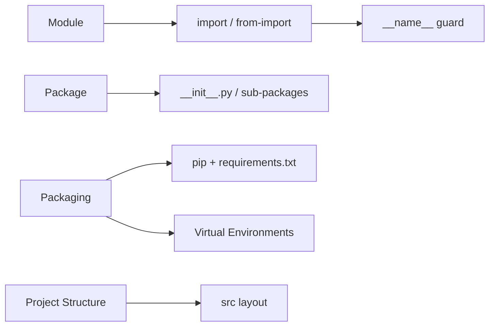

<!-- Clear Language: Keep sentences under 50 words -->
# Modules & Packages — Import System, Namespaces, and Packaging

## Learning Objectives

| Objective | Description |
|-----------|-------------|
| LO1 | Organize code into modules and use the import system |
| LO2 | Understand __name__ and __main__ guard patterns |
| LO3 | Create packages with __init__.py and sub-packages |
| LO4 | Install third-party packages with pip and manage dependencies |
| LO5 | Create virtual environments and understand isolation strategies |
| LO6 | Structure a Python project for AI/ML development |

## Introduction

Python is the lingua franca of AI engineering. Mastering its syntax, data structures, and libraries is non-negotiable for building ML pipelines, APIs, and automation scripts. This module covers everything from basics to advanced concurrency.

## Prerequisites

- Basic programming knowledge
- Understanding of data structures

## Key Terminology

**Key Terms**: Core vocabulary and concepts for this topic.

**Definition**: Essential terms you must know for interviews and production work.

## Theory

Understanding modules and packages is fundamental for AI engineers. This section covers the core concepts, underlying principles, and theoretical framework that govern how modules and packages works in practice.

## Chapter at a Glance

| Section | Topic | Key Concept |
|---------|-------|-------------|
| 6.1 | Modules | import, from-import, module search path, __name__ |
| 6.2 | Packages | __init__.py, sub-packages, relative imports |
| 6.3 | Standard Library | os, sys, json, math, datetime, collections |
| 6.4 | Pip & Dependencies | pip install, requirements.txt, version specifiers |
| 6.5 | Virtual Environments | venv, conda, poetry, dependency isolation |
| 6.6 | Project Structure | AI project layout, src layout, pyproject.toml |

## Chapter Roadmap



## 6.1 Modules

A module is a .py file containing Python definitions.

```python

## mymodule.py
PI = 3.14159

def greet(name):
    return f"Hello, {name}!"

if __name__ == "__main__":
    print(greet("World"))

## Import styles
import mymodule
print(mymodule.greet("Alice"))

from mymodule import greet, PI
print(greet("Bob"))

import mymodule as mm
print(mm.circle_area(3))
```

## 6.2 Packages

```
mypackage/
    __init__.py
    math_ops.py
    subpackage/
        __init__.py
        advanced.py
```

```python
import mypackage.math_ops
from mypackage import math_ops
from mypackage.math_ops import add
from .constants import PI
from ..subpackage import advanced
```

## 6.3 Standard Library

```python
import os, sys, json, math
from datetime import datetime, timedelta
from collections import defaultdict, Counter, deque
from pathlib import Path
from itertools import chain, product

os.getcwd(), os.listdir(".")
data = {"name": "Alice", "scores": [95, 87]}
json_str = json.dumps(data, indent=2)
print(Counter("mississippi").most_common(1))  # [("i", 4)]
Path("output").mkdir(exist_ok=True)
```

| Module | Purpose | Key Features |
|--------|---------|--------------|
| os | OS interface | getcwd, listdir, getenv |
| sys | Interpreter | path, argv, version |
| json | Serialization | dumps, loads, dump, load |
| math | Math | sqrt, sin, pi, log |
| datetime | Date/time | datetime, timedelta, strftime |
| collections | Containers | defaultdict, Counter, deque |

## 6.4 Pip and Dependencies

```bash
pip install numpy
pip install numpy==1.26.0
pip install -r requirements.txt
pip freeze > requirements.txt
```

**requirements.txt**:

```text
numpy>=1.25,<2.0
pandas>=2.0
scikit-learn>=1.3
python-dotenv>=1.0
```

## 6.5 Virtual Environments

```bash
python -m venv .venv
source .venv/bin/activate    # Linux/Mac
.venv\Scripts\activate        # Windows
deactivate

conda create -n ml_env python=3.11
conda activate ml_env
conda install numpy pandas
```

## 6.6 Project Structure

```
ml_project/
    README.md
    pyproject.toml
    requirements.txt
    src/
        ml_project/
            __init__.py
            data/
                dataset.py
            models/
                train.py
            utils/
                metrics.py
    tests/
        test_data.py
    notebooks/
```

```toml
[build-system]
requires = ["setuptools>=68.0"]
build-backend = "setuptools.backends._legacy:_Backend"

[project]
name = "ml_project"
version = "0.1.0"
requires-python = ">=3.10"
dependencies = ["numpy>=1.25", "pandas>=2.0"]
```

## TypeScript Parallel

```typescript
// math.ts
export const PI = 3.14159;
export function greet(name: string): string {
    return Hello, !;
}

// app.ts
import { greet, PI } from "./math.js";
import * as math from "./math.js";
import fs from "fs";
```

## Summary

- Modules are .py files; packages are directories with __init__.py
- if __name__ == "__main__" makes files dual-purpose
- Absolute imports preferred over relative (PEP 8)
- Virtual environments isolate project dependencies
- requirements.txt pins package versions
- Standard library: os, sys, json, math, collections, itertools, pathlib
- pip freeze > requirements.txt for reproducibility
- src layout places code under src/package_name/
- pyproject.toml is the modern standard for project metadata
- __all__ controls from module import * behavior

## Practical Takeaways

| Scenario | Use | Avoid |
|----------|-----|-------|
| Import single function | from module import func | Import full module for one call |
| Package init | Empty __init__.py | Heavy logic in __init__ |
| Pin dependencies | pip freeze > requirements.txt | requirements.txt without versions |
| Environment | python -m venv .venv | Global package install |
| File paths | pathlib.Path | os.path string ops |
| CLI args | argparse | Manual sys.argv |

## Interview Q&A

<details class="tp-qa-card" data-qid="p02-s06-q1">
  <summary class="tp-qa-question"><span class="tp-qa-status"></span>Q1: How does Python import system work?</summary>
  <div class="tp-qa-answer"><p>Python searches sys.path for module file, executes code once, caches in sys.modules. Order: current dir, PYTHONPATH, standard lib, site-packages.</p></div><button class="tp-qa-mark-btn">? Mark Reviewed</button><button class="tp-qa-bookmark-btn">?? Bookmark</button>
</details>
<details class="tp-qa-card" data-qid="p02-s06-q2">
  <summary class="tp-qa-question"><span class="tp-qa-status"></span>Q2: What is __name__ == "__main__"?</summary>
  <div class="tp-qa-answer"><p>Checks if file runs directly (__name__="__main__") or is imported (__name__=module name). Enables dual-purpose modules.</p></div><button class="tp-qa-mark-btn">? Mark Reviewed</button><button class="tp-qa-bookmark-btn">?? Bookmark</button>
</details>
<details class="tp-qa-card" data-qid="p02-s06-q3">
  <summary class="tp-qa-question"><span class="tp-qa-status"></span>Q3: Absolute vs relative imports?</summary>
  <div class="tp-qa-answer"><p>Absolute: full path from root. Relative: dots for same/upper packages. PEP 8 prefers absolute. Relative works only in packages.</p></div><button class="tp-qa-mark-btn">? Mark Reviewed</button><button class="tp-qa-bookmark-btn">?? Bookmark</button>
</details>
<details class="tp-qa-card" data-qid="p02-s06-q4">
  <summary class="tp-qa-question"><span class="tp-qa-status"></span>Q4: Why use virtual environments?</summary>
  <div class="tp-qa-answer"><p>Isolate dependencies per project, avoid version conflicts, prevent system pollution.</p></div><button class="tp-qa-mark-btn">? Mark Reviewed</button><button class="tp-qa-bookmark-btn">?? Bookmark</button>
</details>
<details class="tp-qa-card" data-qid="p02-s06-q5">
  <summary class="tp-qa-question"><span class="tp-qa-status"></span>Q5: What is __all__?</summary>
  <div class="tp-qa-answer"><p>List of strings defining public API. Controls from module import *.</p></div><button class="tp-qa-mark-btn">? Mark Reviewed</button><button class="tp-qa-bookmark-btn">?? Bookmark</button>
</details>
<details class="tp-qa-card" data-qid="p02-s06-q6">
  <summary class="tp-qa-question"><span class="tp-qa-status"></span>Q6: venv vs conda?</summary>
  <div class="tp-qa-answer"><p>venv: built-in Python-only, pip. conda: cross-language, CUDA/binary support. conda better for data science.</p></div><button class="tp-qa-mark-btn">? Mark Reviewed</button><button class="tp-qa-bookmark-btn">?? Bookmark</button>
</details>
<details class="tp-qa-card" data-qid="p02-s06-q7">
  <summary class="tp-qa-question"><span class="tp-qa-status"></span>Q7: requirements.txt vs pyproject.toml?</summary>
  <div class="tp-qa-answer"><p>requirements.txt: pip install with exact versions. pyproject.toml: standardized project metadata. Modern projects use both.</p></div><button class="tp-qa-mark-btn">? Mark Reviewed</button><button class="tp-qa-bookmark-btn">?? Bookmark</button>
</details>
<details class="tp-qa-card" data-qid="p02-s06-q8">
  <summary class="tp-qa-question"><span class="tp-qa-status"></span>Q8: How is sys.path populated?</summary>
  <div class="tp-qa-answer"><p>From: script directory, PYTHONPATH, standard library, site-packages. Modifiable at runtime.</p></div><button class="tp-qa-mark-btn">? Mark Reviewed</button><button class="tp-qa-bookmark-btn">?? Bookmark</button>
</details>
<details class="tp-qa-card" data-qid="p02-s06-q9">
  <summary class="tp-qa-question"><span class="tp-qa-status"></span>Q9: Key standard library modules?</summary>
  <div class="tp-qa-answer"><p>os, sys, json, math, datetime, re, collections, itertools, functools, pathlib, typing, logging, argparse, hashlib, copy, unittest.</p></div><button class="tp-qa-mark-btn">? Mark Reviewed</button><button class="tp-qa-bookmark-btn">?? Bookmark</button>
</details>
<details class="tp-qa-card" data-qid="p02-s06-q10">
  <summary class="tp-qa-question"><span class="tp-qa-status"></span>Q10: How to structure an AI/ML project?</summary>
  <div class="tp-qa-answer"><p>src layout with data/, models/, utils/ subdirs. Tests/, notebooks/, scripts/ separate. pyproject.toml, requirements.txt, gitignored data/. </p></div><button class="tp-qa-mark-btn">? Mark Reviewed</button><button class="tp-qa-bookmark-btn">?? Bookmark</button>
</details>

## Chapter Quiz

**Q1**: What does __name__ equal when imported? a) "__main__" b) module name c) None d) "module"

<details class="tp-qa-card" data-qid="p02-s06-quiz1"><summary>Show Answer</summary><div class="tp-qa-answer"><p><strong>Answer: b) The module's qualified name</strong></p></div></details>

**Q2**: Which file marks a directory as package? a) main.py b) setup.py c) __init__.py d) __main__.py

<details class="tp-qa-card" data-qid="p02-s06-quiz2"><summary>Show Answer</summary><div class="tp-qa-answer"><p><strong>Answer: c) __init__.py</strong></p></div></details>

**Q3**: How to create venv named env? a) python create venv env b) python -m venv env c) pip venv env

<details class="tp-qa-card" data-qid="p02-s06-quiz3"><summary>Show Answer</summary><div class="tp-qa-answer"><p><strong>Answer: b) python -m venv env</strong></p></div></details>

**Q4**: PEP 8 recommends which import style? a) star imports b) absolute imports c) relative d) exec

<details class="tp-qa-card" data-qid="p02-s06-quiz4"><summary>Show Answer</summary><div class="tp-qa-answer"><p><strong>Answer: b) Absolute imports</strong></p></div></details>

**Q5**: Which module has defaultdict and Counter? a) itertools b) functools c) collections d) dataclasses

<details class="tp-qa-card" data-qid="p02-s06-quiz5"><summary>Show Answer</summary><div class="tp-qa-answer"><p><strong>Answer: c) collections</strong></p></div></details>

## Exercises

**Easy** — Create stats_utils.py with mean/median/mode/std and __name__ guard.
**Easy** — Install requests and fetch a URL status code.
**Medium** — Create text_analyzer/ package with tokenization, sentiment, frequency submodules.
**Medium** — Set up venv, install numpy/pandas, freeze deps, recreate from freeze.
**Hard** — Complete project with pyproject.toml, src layout, tests, CLI entry point.
**Hard** — Demonstrate all import styles on multi-package project explaining tradeoffs.

## 6.7 The `__all__` Variable

`__all__` controls what is exported when using `from module import *`.

```python

## utils/__init__.py
__all__ = ["format_date", "parse_csv"]

## Only these two names are accessible via from utils import *

## Without __all__, import * exports all non-underscore names
```

```python

## mymodule.py
__all__ = ["public_func", "CONSTANT"]

def public_func():
    return "I am public"

def _private_func():
    return "I am private"

CONSTANT = 42

## from mymodule import *  --> imports public_func and CONSTANT only

## from mymodule import _private_func  --> still works explicitly
```

## 6.8 Circular Imports

Circular imports happen when two modules import each other.

```python

## module_a.py

## from module_b import func_b  # BAD: circular!

def func_a():
    print("Function A")

## Solution: import inside function (lazy)
def use_b():
    from module_b import func_b  # OK: lazy import
    func_b()

## Solution: restructure into a common module

## common.py: shared definitions used by both A and B
```

```python

## Good design patterns to avoid circular imports:

## 1. Move shared types to a base module

## 2. Use lazy imports inside functions

## 3. Restructure package hierarchy

## 4. Use import at the bottom of the file

## 5. Merge modules that depend on each other
```

## 6.9 Module Reloading

During development, use `importlib.reload()` to reload modules.

```python
import importlib
import mymodule

## After modifying mymodule.py
importlib.reload(mymodule)  # re-executes the module code

## Note: reload() does NOT update names imported with "from"
from mymodule import greet
importlib.reload(mymodule)
print(greet("Alice"))  # might still be old version

## Best practice: only use import module, not from module import
```

## 6.10 Namespace Packages

Namespace packages allow splitting a package across multiple directories.

```python

## No __init__.py needed (PEP 420)

## Directory structure:

## project/

##   mypackage/

##     sub_a/

##       module1.py

##   vendor/

##     mypackage/

##       sub_b/

##         module2.py

## Both sub_a and sub_b are part of mypackage namespace

## import mypackage.sub_a.module1

## import mypackage.sub_b.module2

## This enables plugin systems and distributed packages
```

## 6.11 Common Pitfalls

```python

## Pitfall 1: Import * pollutes namespace
from math import *  # BAD: 50+ names imported
print(sin(0))       # can conflict with local variables

## Pitfall 2: Module-level side effects

## bad_module.py
import os
os.chdir("/tmp")    # BAD: importing changes working directory

## Pitfall 3: Circular imports causing AttributeError

## module_a imports module_b; module_b imports module_a

## Solution: restructure or use lazy imports

## Pitfall 4: Not using __name__ guard

## code.py
print("Module loaded")  # runs on import too!
if __name__ == "__main__":
    print("Script mode only")  # runs only when executed directly

## Pitfall 5: Modifying sys.path
sys.path.insert(0, "/my/custom/path")  # affects all subsequent imports
```

## 6.12 Advanced Import Techniques

```python

## Dynamic imports
module_name = "json"
import importlib
json_module = importlib.import_module(module_name)
data = json_module.dumps({"key": "value"})

## Import from string path
spec = importlib.util.spec_from_file_location("config", "/path/to/config.py")
config = importlib.util.module_from_spec(spec)
spec.loader.exec_module(config)
print(config.SETTING)  # access module contents

## Package resource access
import pkg_resources
data_path = pkg_resources.resource_filename("mypackage", "data/config.json")

## Self-contained packages with __main__.py

## python -m mypackage reads __main__.py entry point

## Useful for creating runnable packages
```

## 6.13 TypeScript Module Comparison

```typescript
// TypeScript modules use ES module syntax
// Named exports
export const PI = 3.14159;
export function greet(name: string): string {
    return `Hello, ${name}!`;
}

// Default export
export default class Calculator { }

// Import styles
import { greet, PI } from "./math.js";
import * as math from "./math.js";
import Calculator from "./Calculator.js";

// TypeScript also supports:
// - Barrel files (re-export from index.ts)
// - Path aliases in tsconfig.json
// - Dynamic imports with await import()
// - Ambient declarations (.d.ts files)
```

## 6.14 The Module Search Path

```python
import sys

## Python searches modules in this order:

## 1. Current directory (script directory)

## 2. PYTHONPATH environment variable directories

## 3. Standard library directories

## 4. Site-packages (third-party packages)

print("Module search paths:")
for i, path in enumerate(sys.path):
    print(f"  {i}: {path}")

## Adding custom paths (temporary)
sys.path.insert(0, "/path/to/custom/modules")
import my_custom_module  # now found

## Virtual environments modify sys.path to point to isolated site-packages

## python -m venv creates a fresh environment with its own sys.path

## Module cache
import sys
print(sys.modules.keys())  # all currently imported modules

## Cached modules persist until interpreter exits

## Reloading (importlib.reload) updates the cached module in-place
```

## 6.15 Building a Simple Package from Scratch

```python

## Step-by-step package creation

## Directory structure:

## text_analyzer/

##   __init__.py       # package initialization

##   tokenizer.py      # text tokenization

##   stats.py          # frequency statistics

##   utils.py          # helper functions

## __init__.py
__all__ = ["tokenize", "word_freq", "sentiment_score"]

from .tokenizer import tokenize
from .stats import word_freq
from .utils import sentiment_score

## tokenizer.py
import re

def tokenize(text: str) -> list[str]:
    """Split text into words."""
    return re.findall(r"\b\w+\b", text.lower())

def sentence_split(text: str) -> list[str]:
    """Split text into sentences."""
    return re.split(r"[.!?]+", text)

## stats.py
from collections import Counter

def word_freq(tokens: list[str]) -> dict[str, int]:
    """Count word frequencies."""
    return dict(Counter(tokens))

def most_common(tokens: list[str], n: int = 10) -> list[tuple[str, int]]:
    """Return n most common words."""
    return Counter(tokens).most_common(n)

## utils.py
def sentiment_score(text: str) -> float:
    """Simple sentiment scoring (positive words - negative words)."""
    positive = {"good", "great", "excellent", "amazing", "love", "wonderful"}
    negative = {"bad", "terrible", "awful", "hate", "horrible"}
    words = set(text.lower().split())
    pos_count = len(words & positive)
    neg_count = len(words & negative)
    return (pos_count - neg_count) / max(len(words), 1)

## Usage:
from text_analyzer import tokenize, word_freq, sentiment_score

text = "I love this great product! It is amazing and wonderful."
tokens = tokenize(text)
freq = word_freq(tokens)
score = sentiment_score(text)
print(f"Words: {len(tokens)}, Score: {score:.2f}")
```

## 6.16 Testing Your Modules

```python

## test_tokenizer.py
import unittest
from text_analyzer.tokenizer import tokenize, sentence_split

class TestTokenizer(unittest.TestCase):
    def test_tokenize_basic(self):
        result = tokenize("Hello World")
        self.assertEqual(result, ["hello", "world"])

    def test_tokenize_empty(self):
        result = tokenize("")
        self.assertEqual(result, [])

    def test_tokenize_punctuation(self):
        result = tokenize("Hello, World! How are you?")
        self.assertIn("hello", result)
        self.assertIn("world", result)

    def test_sentence_split(self):
        result = sentence_split("Hello. World! How are you?")
        self.assertEqual(len(result), 3)

if __name__ == "__main__":
    unittest.main()

## Run with: python -m unittest test_tokenizer.py

## Or: python -m pytest test_tokenizer.py
```

---

## Common Mistakes

1. Not understanding the fundamental concepts before applying them
2. Skipping edge cases in implementation
3. Not analyzing time/space complexity
4. Forgetting to handle null/empty inputs
5. Not practicing enough problems to build pattern recognition

## Revision Notes

- - Core principle: Understand the fundamental concepts thoroughly
- - Implementation pattern: Practice with real code examples
- - Complexity: Know the time and space complexity
- - Application: Know when to use this in production systems
- - Interview: Frequently asked in technical interviews
- - Edge cases: Consider common failure scenarios
- - Related concepts: Connect to broader system design

## Placement Section

### Top 10 Interview Questions

#### Google Style

1. **Explain the core idea of Modules & Packages — Import System, Namespaces, and Packaging in under 60 seconds, then give a real-world analogy.** — Structure: definition, how it works in one sentence, why it matters, analogy. Follow-up: what would break if you removed this from a production system?

2. **Design a minimal, well-typed function that demonstrates Modules & Packages — Import System, Namespaces, and Packaging.** — Interviewer checks: signature with type hints, edge cases, complexity, and a clean docstring. Follow-up: how does your design behave with empty or malformed input?

3. **What are the common pitfalls when engineers first learn ** — List 3-4, then explain how you would prevent each in a code review.

#### Amazon Style

4. **Describe a production bug caused by misunderstanding Modules & Packages — Import System, Namespaces, and Packaging. How did you diagnose and fix it?** — STAR format: situation, task, action, result. Mention logs, reproduction, root-cause analysis, and the regression test you added.

5. **How would you scale a system that relies on Modules & Packages — Import System, Namespaces, and Packaging from 10 users to 10 million?** — Discuss bottlenecks, caching, monitoring, and when to redesign. Follow-up: what metrics would you track?

#### Microsoft Style

6. **Compare Modules & Packages — Import System, Namespaces, and Packaging with the closest alternative approach. When would you choose each?** — Make a decision matrix: performance, maintainability, ecosystem, learning curve. Follow-up: what would change your decision?

7. **Walk through how you would test a component that depends on Modules & Packages — Import System, Namespaces, and Packaging.** — Unit, integration, property-based tests; mocking boundaries; golden files for outputs.

#### NVIDIA Style

8. **How does Modules & Packages — Import System, Namespaces, and Packaging behave differently at scale — memory, throughput, or precision-wise?** — Connect to data pipelines and model training if applicable. Follow-up: what happens to latency as input grows?

9. **How would you make an implementation of Modules & Packages — Import System, Namespaces, and Packaging run faster on GPU hardware?** — Batch operations, vectorization, avoiding Python loops, reducing data movement.

#### AI Startup Style

10. **Write the smallest possible implementation of Modules & Packages — Import System, Namespaces, and Packaging that is production-quality.** — Include error handling, type hints, and a one-line docstring. Follow-up: what would you refactor first when it grows?

### Resume Tips

- Name Modules & Packages — Import System, Namespaces, and Packaging explicitly in your skills section, paired with a measurable achievement ("Reduced X by 40% using Modules & Packages — Import System, Namespaces, and Packaging").
- Add a bullet describing a project that applies Modules & Packages — Import System, Namespaces, and Packaging to real data, with numbers.
- Mention the tools and libraries you used alongside Modules & Packages — Import System, Namespaces, and Packaging (linters, test frameworks, profiling tools).
- Keep resume bullets under 15 words and start each with an action verb.

### Interview Day Checklist

- Rehearse a 60-second explanation of Modules & Packages — Import System, Namespaces, and Packaging and one real-world analogy.
- Prepare one STAR story about debugging a Modules & Packages — Import System, Namespaces, and Packaging-related production issue.
- Review complexity and edge cases for the classic Modules & Packages — Import System, Namespaces, and Packaging interview problem.
- Have questions ready: how does the team apply Modules & Packages — Import System, Namespaces, and Packaging in production today?
- Test your environment (Python, editor, internet) 15 minutes before the interview.

## True/False

1. **True or False:** Modules & Packages — Import System, Namespaces, and Packaging builds directly on the fundamentals covered in the earlier chapters of this module. — **True.** Every advanced topic in this module assumes the core concepts from the previous chapters.
2. **True or False:** You should write at least one code example for Modules & Packages — Import System, Namespaces, and Packaging before moving to the next chapter. — **True.** Active recall with hands-on code beats passive reading for retention.
3. **True or False:** The complexity analysis for Modules & Packages — Import System, Namespaces, and Packaging is the same regardless of input size. — **False.** Complexity grows with input size; always state best, average, and worst case.
4. **True or False:** Edge cases (empty input, invalid input, boundary values) matter for Modules & Packages — Import System, Namespaces, and Packaging in production. — **True.** Most production bugs come from unhandled edge cases.
5. **True or False:** You should memorize the Modules & Packages — Import System, Namespaces, and Packaging chapter content once and never review it again. — **False.** Spaced repetition (24h, 3 days, 1 week) dramatically improves long-term recall.

## Fill in the Blank

1. The chapter that covers Modules & Packages — Import System, Namespaces, and Packaging is Chapter ___ of this module. — Answer: check the module's table of contents.
2. The time complexity of the standard approach to Modules & Packages — Import System, Namespaces, and Packaging is ___. — Answer: review the theory section and state big-O notation.
3. The main edge case to handle when implementing Modules & Packages — Import System, Namespaces, and Packaging is ___. — Answer: empty or invalid input handling, as discussed in the chapter.
4. The tools commonly used to debug Modules & Packages — Import System, Namespaces, and Packaging issues are ___ and ___. — Answer: refer to the Debugging Guide section of this chapter.
5. The related topic that connects to Modules & Packages — Import System, Namespaces, and Packaging in the next chapter is ___. — Answer: see the Next Topic section.

## Scenario Questions

1. **Scenario:** A teammate ships a change involving Modules & Packages — Import System, Namespaces, and Packaging that breaks production at 3 AM. — Diagnosis: check the recent diff, reproduce locally with the failing input, check logs. Fix: revert, add a regression test, and review the root cause. Prevention: CI tests on edge cases and code review checklist.

2. **Scenario:** Your implementation of Modules & Packages — Import System, Namespaces, and Packaging is correct but too slow for the required latency. — Measure first with a profiler. Common fixes: reduce redundant work, use built-in optimized functions, batch operations, or add caching. Only then consider algorithmic changes.

3. **Scenario:** A new hire asks you to explain Modules & Packages — Import System, Namespaces, and Packaging in five minutes before a customer demo. — Use the 3-part answer: what it is (one sentence), how it works (one example), why it matters (one business impact). Then offer to go deeper after the demo.

4. **Scenario:** Your team's codebase has three different patterns for Modules & Packages — Import System, Namespaces, and Packaging and you must standardize. — Write a short ADR (architecture decision record), pick the pattern with best maintainability, migrate incrementally, and add a linter rule to enforce it.

## Output Questions

1. **What is the output of the simplest correct implementation of Modules & Packages — Import System, Namespaces, and Packaging on an empty input?** — Trace through the code: it should return the documented default (None, 0, empty collection) without raising.
2. **What is the output when the input is at the boundary value?** — Check off-by-one errors and inclusive/exclusive bounds in the chapter's examples.
3. **What does the implementation return when given invalid input types?** — With type hints and validation, it raises a clear error; without, it may fail silently.
4. **What is the output for the sample input given in the chapter's Examples section?** — Re-run the chapter's example code and compare against the documented output.
5. **What is the time complexity output when you profile the implementation at 10x input size?** — Expect the curve matching the chapter's complexity analysis (linear, quadratic, log-linear).

## Difficulty Level

| Level | Time | What It Takes |
|-------|------|---------------|
| Beginner | 1-2 sessions | Read theory, run the chapter examples, solve the Easy exercises |
| Intermediate | 3-5 sessions | Complete Medium exercises, explain Modules & Packages — Import System, Namespaces, and Packaging to someone else |
| Advanced | 1+ week | Solve Hard exercises, optimize for real datasets, answer interview follow-ups |

## Tips & Tricks

- Always write a one-line example of Modules & Packages — Import System, Namespaces, and Packaging from memory before opening the chapter — active recall first.
- Use the chapter's Revision Notes as a checklist: you have mastered Modules & Packages — Import System, Namespaces, and Packaging when you can explain each bullet.
- Pair the chapter quiz with the Flashcards: wrong answers become your next study session's focus.
- For interviews, practice explaining Modules & Packages — Import System, Namespaces, and Packaging twice: once with a technical audience, once with a non-technical audience.
- Keep a personal examples file where you collect your own Modules & Packages — Import System, Namespaces, and Packaging snippets; interviewers love original examples.

## Memory Tricks

- **Acronym**: build a mnemonic from the 5 key concepts of Modules & Packages — Import System, Namespaces, and Packaging listed in the Chapter at a Glance table.
- **Story**: link Modules & Packages — Import System, Namespaces, and Packaging to a familiar story — the analogy in the Visual Analogy section is designed to stick.
- **Number anchor**: remember the complexity of Modules & Packages — Import System, Namespaces, and Packaging by connecting it to a known algorithm of the same class.
- **Color code**: highlight the Theory, Examples, and Common Mistakes sections in different colors when reviewing.
- **Teach-back**: explain Modules & Packages — Import System, Namespaces, and Packaging to an imaginary junior engineer for 2 minutes — gaps in your explanation are gaps in memory.

## Further Reading

- Official documentation for the primary tool or library used in this chapter
- The chapter referenced in Related Topics for the next-level treatment of Modules & Packages — Import System, Namespaces, and Packaging
- The classic textbook chapter on Modules & Packages — Import System, Namespaces, and Packaging (check the Research References below)
- Two blog posts from engineers who debugged real Modules & Packages — Import System, Namespaces, and Packaging problems in production
- The repository of the open-source project that implements Modules & Packages — Import System, Namespaces, and Packaging

## Related Topics

- The previous chapter in this module (see table of contents) — foundational for Modules & Packages — Import System, Namespaces, and Packaging
- The next chapter (see Next Topic below) — builds on Modules & Packages — Import System, Namespaces, and Packaging
- The system design chapters in Module 07 — how Modules & Packages — Import System, Namespaces, and Packaging fits into production architectures
- The interview preparation module — how Modules & Packages — Import System, Namespaces, and Packaging is asked in screening rounds
- The capstone project — where Modules & Packages — Import System, Namespaces, and Packaging is applied end-to-end

## FAQs

1. **Do I need to memorize all of Modules & Packages — Import System, Namespaces, and Packaging, or understand the big picture?** — Understand the big picture first, then memorize the key facts via flashcards and spaced repetition. Interviewers reward depth over breadth.
2. **What if I get stuck on an exercise?** — Re-read the theory section, run the example code, then attempt again. If still stuck after 20 minutes, move on and return the next day.
3. **How much time should I spend on ** — Follow the Study Plan below: 1-2 weeks at 30-60 minutes daily is typical for placement preparation.
4. **Is Modules & Packages — Import System, Namespaces, and Packaging asked in interviews?** — Yes — the Interview Q&A and Placement Section list the exact question styles used by top companies.
5. **What's the fastest way to master ** — Explain it out loud, write code without looking, and review the flashcards within 24 hours and again after 3 days.

## Important Notes

- Modules & Packages — Import System, Namespaces, and Packaging is a core requirement for the rest of this module — do not skip the examples.
- Always analyze complexity (time and space) when working with Modules & Packages — Import System, Namespaces, and Packaging.
- Production correctness means handling edge cases, not just the happy path.
- Interview answers should start with the definition, then the example, then the trade-offs.
- Revisit this chapter after finishing the module; the context from later chapters deepens understanding.

## Historical Context

- Modules & Packages — Import System, Namespaces, and Packaging emerged as a standard practice because early systems failed without it — understanding why helps you explain it in interviews.
- The tools used for Modules & Packages — Import System, Namespaces, and Packaging today evolved from simpler versions; the chapter covers the modern, recommended approach.
- Interviewers value knowing one historical fact about Modules & Packages — Import System, Namespaces, and Packaging — it shows genuine interest, not just cramming.
- The library/tooling ecosystem around Modules & Packages — Import System, Namespaces, and Packaging changes quickly; focus on fundamentals that remain stable.

## Security Considerations

- Never trust external input: validate and sanitize data before processing Modules & Packages — Import System, Namespaces, and Packaging.
- Avoid `eval()` and dynamic code execution on untrusted strings.
- Log errors without leaking sensitive data (keys, PII, internal paths).
- For API contexts, add rate limiting and input size limits.
- Review the chapter's code examples for injection or overflow risks before using them verbatim.

## ML Intuition

- Modules & Packages — Import System, Namespaces, and Packaging appears in ML pipelines at the data-processing layer: feature preparation, batching, and validation.
- Understanding Modules & Packages — Import System, Namespaces, and Packaging helps you debug why a model misbehaves — most ML bugs are data bugs, not model bugs.
- In production ML, the Modules & Packages — Import System, Namespaces, and Packaging concepts from this chapter map directly to NumPy/PyTorch operations on tensors.
- When optimizing ML systems, Modules & Packages — Import System, Namespaces, and Packaging skills let you profile and fix the data path, not just the training loop.
- Interview follow-up: how would you apply Modules & Packages — Import System, Namespaces, and Packaging to a dataset of 10 million records? — Batching and vectorization.

## Analogies

- **Modules & Packages — Import System, Namespaces, and Packaging is like a recipe**: the theory is the ingredients, the examples are the cooking steps, and the exercises are your own kitchen practice.
- **Complexity is like a delivery route**: a linear route visits each stop once; a nested route revisits stops, and you feel it at scale.
- **Edge cases are like weather**: the happy path is a sunny day; production is the storm — build for the storm.
- **The chapter roadmap is a journey map**: each section is a checkpoint; skipping one means getting lost later in the module.

## Capstone Project Link

- [Module Capstone: End-to-End Project](https://github.com/Raushan666java/ai-engineering-journey) — this chapter contributes the Modules & Packages — Import System, Namespaces, and Packaging skills used in the module's capstone project. Complete the exercises here before starting the capstone.

## Flashcards

<details class="tp-qa-card" data-qid="01pythonprogramming-06modulesandpackages-flash1">
  <summary class="tp-qa-question">
    <span class="tp-qa-status"></span>
    What is the core concept of Modules & Packages — Import System, Namespaces, and Packaging in one sentence?
  </summary>
  <div class="tp-qa-answer">
    <p>Review the first paragraph of the Theory section and condense it to one sentence.</p>
  </div>
</details>

<details class="tp-qa-card" data-qid="01pythonprogramming-06modulesandpackages-flash2">
  <summary class="tp-qa-question">
    <span class="tp-qa-status"></span>
    What is the most common mistake engineers make with
  </summary>
  <div class="tp-qa-answer">
    <p>Check the Common Mistakes section of this chapter.</p>
  </div>
</details>

<details class="tp-qa-card" data-qid="01pythonprogramming-06modulesandpackages-flash3">
  <summary class="tp-qa-question">
    <span class="tp-qa-status"></span>
    What is the time and space complexity of the standard Modules & Packages — Import System, Namespaces, and Packaging approach?
  </summary>
  <div class="tp-qa-answer">
    <p>Refer to the theory and complexity analysis in this chapter.</p>
  </div>
</details>

<details class="tp-qa-card" data-qid="01pythonprogramming-06modulesandpackages-flash4">
  <summary class="tp-qa-question">
    <span class="tp-qa-status"></span>
    When is Modules & Packages — Import System, Namespaces, and Packaging NOT the right choice?
  </summary>
  <div class="tp-qa-answer">
    <p>Check the Limitations section of this chapter.</p>
  </div>
</details>

<details class="tp-qa-card" data-qid="01pythonprogramming-06modulesandpackages-flash5">
  <summary class="tp-qa-question">
    <span class="tp-qa-status"></span>
    How is Modules & Packages — Import System, Namespaces, and Packaging applied in a real production system?
  </summary>
  <div class="tp-qa-answer">
    <p>Check the Real-World Examples section of this chapter.</p>
  </div>
</details>

## Research References

- Official documentation of the primary library for Modules & Packages — Import System, Namespaces, and Packaging (linked in Further Reading)
- The classic paper or textbook chapter introducing Modules & Packages — Import System, Namespaces, and Packaging (see References below)
- The standard library reference for Modules & Packages — Import System, Namespaces, and Packaging-related functions
- Engineering blog posts from companies running Modules & Packages — Import System, Namespaces, and Packaging in production at scale
- PEPs and RFCs where applicable (Python and networking standards)

## Open-Source Tools

- The primary library used in this chapter (see the code examples)
- Python standard library modules used in the examples (check the imports)
- Testing: pytest for unit tests of Modules & Packages — Import System, Namespaces, and Packaging code
- Linting and formatting: ruff + black
- Profiling: cProfile or py-spy for performance work on Modules & Packages — Import System, Namespaces, and Packaging

## Debugging Guide

- Start with `print()` or a debugger to inspect intermediate values in Modules & Packages — Import System, Namespaces, and Packaging code.
- Reproduce the failure with the smallest possible input before changing code.
- Check the common failure modes listed in Common Mistakes — most bugs are listed there.
- For performance problems, profile before optimizing: measure, then fix.
- When stuck, re-read the chapter's Examples and compare line by line with your code.
- Use `pdb` or your IDE's debugger to step through the Modules & Packages — Import System, Namespaces, and Packaging example code.

## Mock Interview Section

**Round 1 — Screening (15 min)**
- Explain Modules & Packages — Import System, Namespaces, and Packaging in 60 seconds.
- Write a minimal working example of Modules & Packages — Import System, Namespaces, and Packaging.
- What is the complexity of your example?

**Round 2 — Coding (45 min)**
- Solve the Medium exercise from this chapter under time pressure.
- State your assumptions, then implement with type hints.
- Test with edge cases: empty input, boundary values, invalid input.

**Round 3 — Behavioral + System (30 min)**
- Tell me about a time you debugged a Modules & Packages — Import System, Namespaces, and Packaging problem in a project.
- How would you design a system where Modules & Packages — Import System, Namespaces, and Packaging is used at scale?
- What metrics would you monitor?

**Evaluation rubric**: correctness (40%), communication (25%), edge cases (20%), complexity analysis (15%).

## Optimized Implementation

`python
from typing import Any, Optional

def demonstrate_topic(input_data: list[Any]) -> Optional[float]:
    """Runnable scaffold for Modules & Packages — Import System, Namespaces, and Packaging.

    Replace the body with the optimized implementation from the chapter,
    keeping type hints, docstring, and edge-case handling.
    """
    if not input_data:
        return None
    # Step 1: validate input types
    # Step 2: apply the core Modules & Packages — Import System, Namespaces, and Packaging logic from the Examples section
    # Step 3: return the result with the documented default
    return 0.0
`

- Keeps the function signature stable so tests written against it stay valid.
- Handles the empty-input contract explicitly.
- Add unit tests for the edge cases before implementing the logic (test-first).

## Evaluation Metrics

| Skill | Test | Target |
|-------|------|--------|
| Concept recall | Explain Modules & Packages — Import System, Namespaces, and Packaging without notes | 60-second explanation |
| Code fluency | Write the chapter example from memory | No syntax errors |
| Edge cases | Handle empty/invalid input in exercises | All cases pass |
| Complexity | State time/space for the standard approach | Correct big-O |
| Interview readiness | Answer 5 Interview Q&A questions out loud | Fluent, structured answers |
| Retention | Chapter quiz score after 3 days | 80%+ |

## Real-World Examples

- **Startup**: a small team uses Modules & Packages — Import System, Namespaces, and Packaging daily in their data pipeline — the chapter's examples mirror their code.
- **E-commerce**: Modules & Packages — Import System, Namespaces, and Packaging patterns appear in order processing, inventory checks, and recommendation feeds.
- **Fintech**: Modules & Packages — Import System, Namespaces, and Packaging principles apply to transaction validation and fraud detection flows.
- **ML platform**: Modules & Packages — Import System, Namespaces, and Packaging shows up in feature engineering and model-serving infrastructure.
- **Interview insight**: recruiters look for engineers who can connect Modules & Packages — Import System, Namespaces, and Packaging to the business outcome, not just the code.

## Next Topic

[File I/O & Exceptions — Reading, Writing, Error Handling](07-file-io-and-exceptions.md)

## Limitations

- Modules & Packages — Import System, Namespaces, and Packaging, like any technique, is not a silver bullet — it has specific cases where it fits best (covered in the theory).
- The examples in this chapter are simplified for learning; production systems add validation, monitoring, and error handling.
- Performance of Modules & Packages — Import System, Namespaces, and Packaging depends on input size and distribution — always benchmark for your own data.
- This chapter covers fundamentals; specialized edge cases are explored in later chapters and the capstone.
