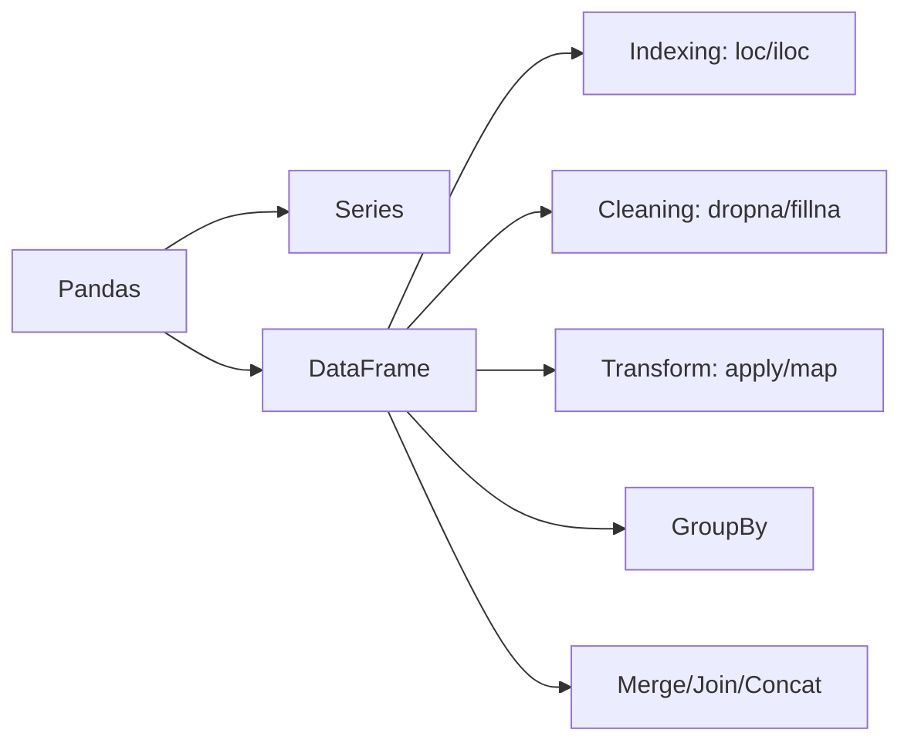

<!-- Clear Language: Keep sentences under 50 words -->
# Pandas Basics — Series, DataFrame, Indexing, GroupBy, Merge

## Learning Objectives

| Objective | Description |
|-----------|-------------|
| LO1 | Create and manipulate Series and DataFrames |
| LO2 | Use index-based and label-based selection (loc, iloc) |
| LO3 | Filter, transform, and clean data with pandas |
| LO4 | Group data with GroupBy and aggregate results |
| LO5 | Merge, join, and concatenate DataFrames |
| LO6 | Handle missing data with dropna, fillna, interpolate |

## Introduction

Python is the lingua franca of AI engineering. Mastering its syntax, data structures, and libraries is non-negotiable for building ML pipelines, APIs, and automation scripts. This module covers everything from basics to advanced concurrency.

## Prerequisites

- Basic programming knowledge
- Understanding of data structures

## Key Terminology

**Key Terms**: Core vocabulary and concepts for this topic.

**Definition**: Essential terms you must know for interviews and production work.

## Theory

Understanding pandas basics is fundamental for AI engineers. This section covers the core concepts, underlying principles, and theoretical framework that govern how pandas basics works in practice.

## Chapter at a Glance

| Section | Topic | Key Concept |
|---------|-------|-------------|
| 12.1 | Series & DataFrame | Creation, dtype, index |
| 12.2 | Indexing | loc, iloc, boolean filtering |
| 12.3 | Data Cleaning | isnull, dropna, fillna, duplicates |
| 12.4 | Transformations | apply, map, assign, pipe |
| 12.5 | GroupBy | split-apply-combine, agg, transform |
| 12.6 | Merge & Concat | join, merge, concat, keys |

## Chapter Roadmap



## 12.1 Series & DataFrame

```python
import pandas as pd
import numpy as np

## Series — 1D labeled array
s = pd.Series([10, 20, 30, 40], index=["a", "b", "c", "d"])
print(s)

## a    10

## b    20

## c    30

## d    40

## dtype: int64

print(s["b"])   # 20
print(s.values)  # [10 20 30 40]
print(s.index)   # Index(['a', 'b', 'c', 'd'], dtype='object')

## DataFrame — 2D table
df = pd.DataFrame({
    "name": ["Alice", "Bob", "Charlie"],
    "age": [25, 30, 35],
    "salary": [70000, 80000, 90000]
})
print(df)
print(df.shape)     # (3, 3)
print(df.columns)   # Index(['name', 'age', 'salary'])
print(df.dtypes)    # column types
print(df.describe())  # summary statistics
```

## 12.2 Indexing

```python

## Column access
print(df["name"])       # Series
print(df[["name", "salary"]])  # DataFrame

## Row access — iloc (integer) vs loc (label)
print(df.iloc[0])       # first row
print(df.iloc[1:3])     # rows 1-2
print(df.iloc[:, 0:2])  # all rows, first 2 cols

print(df.loc[0])        # first row by index label
print(df.loc[0:2, "name"])  # rows 0-2, name column

## Boolean filtering
print(df[df["age"] > 28])
print(df[(df["age"] > 25) & (df["salary"] > 75000)])
print(df.query("age > 28 and salary > 75000"))  # alternative

## Setting index
df_indexed = df.set_index("name")
print(df_indexed.loc["Bob"])

## Reset index
df_reset = df_indexed.reset_index()
```

## 12.3 Data Cleaning

```python
df = pd.DataFrame({
    "A": [1, 2, np.nan, 4],
    "B": [5, np.nan, np.nan, 8],
    "C": ["x", "y", "z", None]
})

## Detecting missing
print(df.isnull())
print(df.isnull().sum())  # count NaN per column

## Drop missing
print(df.dropna())              # drop rows with any NaN
print(df.dropna(axis=1))        # drop columns with any NaN
print(df.dropna(thresh=2))      # keep rows with at least 2 non-NaN

## Fill missing
print(df.fillna(0))                          # fill with 0
print(df.fillna({"A": df["A"].mean(), "B": 0}))  # per column
print(df.ffill())    # forward fill
print(df.bfill())    # backward fill

## Interpolate
s = pd.Series([1, np.nan, np.nan, 4])
print(s.interpolate())  # [1, 2, 3, 4]

## Duplicates
df = pd.DataFrame({"x": [1, 1, 2, 2, 3], "y": [10, 10, 20, 30, 40]})
print(df.duplicated())         # True for duplicate rows
print(df.drop_duplicates())    # remove duplicates
print(df.drop_duplicates(subset=["x"]))  # keep first of each x
```

## 12.4 Transformations

```python
df = pd.DataFrame({
    "name": ["Alice", "Bob", "Charlie"],
    "age": [25, 30, 35],
    "salary": [70000, 80000, 90000]
})

## apply — apply function to axis
df["age_squared"] = df["age"].apply(lambda x: x ** 2)
df["salary_category"] = df["salary"].apply(
    lambda s: "High" if s > 80000 else "Medium" if s > 70000 else "Low"
)

## map — replace values (Series only)
df["name_upper"] = df["name"].map(str.upper)

## assign — add multiple columns
df = df.assign(
    bonus=lambda d: d["salary"] * 0.1,
    total=lambda d: d["salary"] + d["bonus"]
)

## pipe — chain operations
def add_tenure(df, years=1):
    df["tenure"] = years
    return df

result = df.pipe(add_tenure, years=3)
```

## 12.5 GroupBy

```python
df = pd.DataFrame({
    "dept": ["Eng", "Eng", "Sales", "Sales"],
    "name": ["Alice", "Bob", "Charlie", "Diana"],
    "salary": [75000, 68000, 82000, 72000]
})

## Single aggregation
print(df.groupby("dept")["salary"].mean())

## dept

## Eng      71500

## Sales    77000

## Multiple aggregations
print(df.groupby("dept")["salary"].agg(["count", "mean", "std", "min", "max"]))

## Different agg per column
print(df.groupby("dept").agg({
    "salary": ["mean", "std"],
    "name": "count"
}))

## transform — same shape as original
df["salary_rank"] = df.groupby("dept")["salary"].transform(
    lambda x: x.rank()
)

## filter groups
print(df.groupby("dept").filter(lambda g: g["salary"].mean() > 72000))

## Custom aggregation
def salary_range(x):
    return x.max() - x.min()

print(df.groupby("dept")["salary"].agg(salary_range))
```

## 12.6 Merge & Concat

```python
df1 = pd.DataFrame({"id": [1, 2, 3], "name": ["Alice", "Bob", "Charlie"]})
df2 = pd.DataFrame({"id": [1, 2, 4], "score": [95, 87, 92]})

## Merge (like SQL JOIN)
print(pd.merge(df1, df2, on="id", how="inner"))
print(pd.merge(df1, df2, on="id", how="left"))
print(pd.merge(df1, df2, on="id", how="outer"))

## Merge on different column names
pd.merge(df1, df2, left_on="id", right_on="user_id")

## Concatenation
df_a = pd.DataFrame({"x": [1, 2]})
df_b = pd.DataFrame({"x": [3, 4]})
print(pd.concat([df_a, df_b]))  # row-wise
print(pd.concat([df_a, df_b], axis=1))  # column-wise

## With keys
print(pd.concat([df_a, df_b], keys=["A", "B"]))

## Join on index
df1.set_index("id").join(df2.set_index("id"), how="left")
```

## TypeScript Parallel

```typescript
// TypeScript: use Danfo.js or similar
// npm install danfojs-node
import { DataFrame } from "danfojs-node";

const df = new DataFrame({
    name: ["Alice", "Bob"],
    age: [25, 30],
    salary: [70000, 80000]
});

console.log(df.mean());
```

## Summary

- Series = 1D labeled array; DataFrame = 2D table with columns
- Use loc for label-based indexing, iloc for integer position
- Boolean filtering with df[df.col > value] for clean row selection
- GroupBy: split into groups, apply function, combine results
- Merge: combine DataFrames by key (SQL-like joins)
- apply() for row/column-wise operations; map() for Series value mapping
- Missing data: dropna(), fillna(), interpolate()
- Duplicates: duplicated(), drop_duplicates()
- concat: stack DataFrames vertically (axis=0) or horizontally (axis=1)
- pipe for chaining multiple transformations

## Practical Takeaways

| Scenario | Use | Avoid |
|----------|-----|-------|
| Select rows by label | df.loc[row, col] | Chained indexing df[df[]][col] |
| Filter rows | df[df.col > val] | Iterating with for loop |
| Missing values | df.fillna(0) or df.dropna() | Ignoring NaN |
| Group summary | df.groupby(col).agg(...) | Multiple separate queries |
| Combine tables | pd.merge(df1, df2, on=key) | Nested loops |
| Apply function | df.col.apply(func) | List comprehension |
| Chain operations | df.pipe(f).pipe(g) | Multiple intermediate vars |

## Interview Q&A

<details class="tp-qa-card" data-qid="p02-s12-q1">
  <summary class="tp-qa-question"><span class="tp-qa-status"></span>Q1: loc vs iloc?</summary>
  <div class="tp-qa-answer"><p>loc uses label-based indexing (index values, column names). iloc uses integer position (0-based). loc[0] selects row with index label 0; iloc[0] selects first row regardless of label. loc is inclusive of endpoints; iloc is exclusive.</p></div><button class="tp-qa-mark-btn">? Mark Reviewed</button><button class="tp-qa-bookmark-btn">?? Bookmark</button>
</details>
<details class="tp-qa-card" data-qid="p02-s12-q2">
  <summary class="tp-qa-question"><span class="tp-qa-status"></span>Q2: How does pandas handle missing data?</summary>
  <div class="tp-qa-answer"><p>Uses np.nan (float) for missing values. isnull() detects NaN. dropna() removes NaN rows/cols. fillna(value) fills with specified value. ffill() propagates last valid observation. interpolate() fills with interpolated values. Can use pd.NA for nullable integer/string types.</p></div><button class="tp-qa-mark-btn">? Mark Reviewed</button><button class="tp-qa-bookmark-btn">?? Bookmark</button>
</details>
<details class="tp-qa-card" data-qid="p02-s12-q3">
  <summary class="tp-qa-question"><span class="tp-qa-status"></span>Q3: Difference between apply and map?</summary>
  <div class="tp-qa-answer"><p>apply works on DataFrame (axis=0/1) or Series, passing entire row/column or each value. map only works on Series, replacing values based on a dict or function. transform(f) on GroupBy gives same-size result. applymap works element-wise on DataFrame (legacy).</p></div><button class="tp-qa-mark-btn">? Mark Reviewed</button><button class="tp-qa-bookmark-btn">?? Bookmark</button>
</details>
<details class="tp-qa-card" data-qid="p02-s12-q4">
  <summary class="tp-qa-question"><span class="tp-qa-status"></span>Q4: How does GroupBy work?</summary>
  <div class="tp-qa-answer"><p>Split: group rows by key(s). Apply: aggregate, transform, or filter each group. Combine: merge results into output. Standard pattern: df.groupby('col')['val'].agg(...). Supports multiple aggregations, custom functions, and hierarchical indexing.</p></div><button class="tp-qa-mark-btn">? Mark Reviewed</button><button class="tp-qa-bookmark-btn">?? Bookmark</button>
</details>
<details class="tp-qa-card" data-qid="p02-s12-q5">
  <summary class="tp-qa-question"><span class="tp-qa-status"></span>Q5: Merge vs Join vs Concat?</summary>
  <div class="tp-qa-answer"><p>merge: SQL-style joins on columns/indices. join: convenience method for index-based joins. concat: stack DataFrames along axis (0 for rows, 1 for columns). Merge is most flexible; concat is simplest for appending.</p></div><button class="tp-qa-mark-btn">? Mark Reviewed</button><button class="tp-qa-bookmark-btn">?? Bookmark</button>
</details>
<details class="tp-qa-card" data-qid="p02-s12-q6">
  <summary class="tp-qa-question"><span class="tp-qa-status"></span>Q6: What is a MultiIndex?</summary>
  <div class="tp-qa-answer"><p>Hierarchical index with multiple levels. Created by groupby with multiple keys, set_index with multiple columns, or pd.MultiIndex. Access with df.loc[('level1', 'level2')]. Slice with xs() or cross-section. Essential for high-dimensional data.</p></div><button class="tp-qa-mark-btn">? Mark Reviewed</button><button class="tp-qa-bookmark-btn">?? Bookmark</button>
</details>
<details class="tp-qa-card" data-qid="p02-s12-q7">
  <summary class="tp-qa-question"><span class="tp-qa-status"></span>Q7: How do you handle categorical data?</summary>
  <div class="tp-qa-answer"><p>Convert to category dtype: df['col'] = df['col'].astype('category'). Benefits: memory efficiency, ordered categories, faster groupby. Use cat.codes for integer encoding, pd.get_dummies() for one-hot encoding, cat.categories for category list.</p></div><button class="tp-qa-mark-btn">? Mark Reviewed</button><button class="tp-qa-bookmark-btn">?? Bookmark</button>
</details>
<details class="tp-qa-card" data-qid="p02-s12-q8">
  <summary class="tp-qa-question"><span class="tp-qa-status"></span>Q8: What is the difference between inplace=True and reassign?</summary>
  <div class="tp-qa-answer"><p>inplace=True modifies the DataFrame in-place (returns None). Reassignment df = df.drop(...) creates a new DataFrame. Inplace is slightly more memory-efficient but often discouraged because it doesn't allow method chaining. Most pandas methods default to inplace=False.</p></div><button class="tp-qa-mark-btn">? Mark Reviewed</button><button class="tp-qa-bookmark-btn">?? Bookmark</button>
</details>
<details class="tp-qa-card" data-qid="p02-s12-q9">
  <summary class="tp-qa-question"><span class="tp-qa-status"></span>Q9: How do you read/write different file formats?</summary>
  <div class="tp-qa-answer"><p>pd.read_csv('file.csv'), pd.read_excel('file.xlsx'), pd.read_json('file.json'), pd.read_sql('query', conn), pd.read_parquet('file.parquet'). Write: df.to_csv(), df.to_excel(), df.to_json(), df.to_parquet(). Each has format-specific parameters.</p></div><button class="tp-qa-mark-btn">? Mark Reviewed</button><button class="tp-qa-bookmark-btn">?? Bookmark</button>
</details>
<details class="tp-qa-card" data-qid="p02-s12-q10">
  <summary class="tp-qa-question"><span class="tp-qa-status"></span>Q10: How to handle large DataFrames?</summary>
  <div class="tp-qa-answer"><p>Use dtypes efficiently (category for strings, int8/float32). Read in chunks with chunksize. Use pd.read_csv(..., usecols=[...]) to select columns. Use PyArrow or Parquet format. For > RAM, use Dask or Vaex for out-of-core processing.</p></div><button class="tp-qa-mark-btn">? Mark Reviewed</button><button class="tp-qa-bookmark-btn">?? Bookmark</button>
</details>

## Chapter Quiz

**Q1**: Which accessor uses integer positions? a) loc b) iloc c) at d) iat

<details class="tp-qa-card" data-qid="p02-s12-quiz1"><summary>Show Answer</summary><div class="tp-qa-answer"><p><strong>Answer: b) iloc</strong></p></div></details>

**Q2**: What method removes rows with missing values? a) fillna b) dropna c) isnull d) bfill

<details class="tp-qa-card" data-qid="p02-s12-quiz2"><summary>Show Answer</summary><div class="tp-qa-answer"><p><strong>Answer: b) dropna</strong></p></div></details>

**Q3**: What is the correct GroupBy syntax for mean of salary column? a) df.groupby('dept').mean('salary') b) df.groupby('dept')['salary'].mean() c) df.mean('salary').groupby('dept') d) df.groupby('dept').agg(mean='salary')

<details class="tp-qa-card" data-qid="p02-s12-quiz3"><summary>Show Answer</summary><div class="tp-qa-answer"><p><strong>Answer: b) df.groupby('dept')['salary'].mean()</strong></p></div></details>

**Q4**: Which method stacks DataFrames vertically? a) merge b) join c) concat(axis=0) d) concat(axis=1)

<details class="tp-qa-card" data-qid="p02-s12-quiz4"><summary>Show Answer</summary><div class="tp-qa-answer"><p><strong>Answer: c) concat(axis=0)</strong></p></div></details>

**Q5**: What is the first argument of pd.merge? a) on b) left c) how d) right

<details class="tp-qa-card" data-qid="p02-s12-quiz5"><summary>Show Answer</summary><div class="tp-qa-answer"><p><strong>Answer: b) left (first DataFrame), technically we need (left, right, ...)</strong></p></div></details>

## Exercises

**Easy** — Load a CSV file into DataFrame, print first 5 rows and summary statistics.
**Easy** — Filter DataFrame to show rows where a column value is in a specific list.
**Medium** — Group a sales DataFrame by region and month, compute total and average sales.
**Medium** — Merge customer and order DataFrames, find customers with no orders.
**Hard** — Clean a messy DataFrame: handle missing values, remove duplicates, standardize column names, convert date strings to datetime.
**Hard** — Implement a pipeline that reads raw data, cleans it, creates features via groupby transforms, and saves the processed result.

## 12.7 Time Series Basics

```python
import pandas as pd
import numpy as np

## Creating datetime ranges
dates = pd.date_range("2024-01-01", periods=10, freq="D")
print(dates)

## DatetimeIndex(['2024-01-01', '2024-01-02', ..., '2024-01-10'])

## Time series DataFrame
ts_df = pd.DataFrame({
    "value": np.random.randn(10)
}, index=dates)
print(ts_df)

## Resampling
hourly = pd.date_range("2024-01-01", periods=24 * 7, freq="H")
df_hourly = pd.DataFrame({
    "value": np.random.randn(len(hourly))
}, index=hourly)

daily_mean = df_hourly.resample("D").mean()
weekly_max = df_hourly.resample("W").max()

## Shifting and lagging
df_hourly["lag_1"] = df_hourly["value"].shift(1)
df_hourly["diff_1"] = df_hourly["value"].diff()
df_hourly["pct_change"] = df_hourly["value"].pct_change()

## Rolling windows
df_hourly["rolling_mean_3"] = df_hourly["value"].rolling(window=3).mean()
df_hourly["rolling_std_6"] = df_hourly["value"].rolling(window=6).std()
df_hourly["expanding_mean"] = df_hourly["value"].expanding().mean()

## Date-based filtering
january_data = ts_df[ts_df.index.month == 1]
weekday_data = ts_df[ts_df.index.dayofweek < 5]

## Time zone handling
ts_utc = pd.Timestamp("2024-01-01 12:00", tz="UTC")
ts_ny = ts_utc.tz_convert("America/New_York")
print(ts_ny)  # 2024-01-01 07:00:00-05:00
```

## 12.8 File I/O Operations

```python

## CSV
df.to_csv("output.csv", index=False)
df_csv = pd.read_csv("output.csv")

## Excel (requires openpyxl or xlrd)

## df.to_excel("output.xlsx", sheet_name="Sheet1", index=False)

## df_excel = pd.read_excel("output.xlsx", sheet_name="Sheet1")

## JSON
df.to_json("output.json", orient="records", indent=2)
df_json = pd.read_json("output.json", orient="records")

## Parquet (efficient columnar format)

## df.to_parquet("output.parquet")

## df_pq = pd.read_parquet("output.parquet")

## SQL databases
from sqlalchemy import create_engine
engine = create_engine("sqlite:///database.db")
df.to_sql("employees", engine, if_exists="replace", index=False)
df_sql = pd.read_sql("SELECT * FROM employees WHERE age > 30", engine)

## Reading with options
df_large = pd.read_csv("large.csv", chunksize=10000)  # iterator
df_cols = pd.read_csv("data.csv", usecols=["name", "age", "salary"])
df_dtypes = pd.read_csv("data.csv", dtype={"age": "int8", "salary": "float32"})
```

## 12.9 Advanced Indexing Techniques

```python

## MultiIndex (hierarchical index)
arrays = [["A", "A", "B", "B"], [1, 2, 1, 2]]
index = pd.MultiIndex.from_arrays(arrays, names=["group", "sub"])
df_multi = pd.DataFrame({"value": [10, 20, 30, 40]}, index=index)
print(df_multi)

##              value

## group sub

## A     1        10

##       2        20

## B     1        30

##       2        40

## Selection with MultiIndex
print(df_multi.loc["A"])            # all rows for group A
print(df_multi.loc[("A", 1)])       # specific sub-group
print(df_multi.xs(1, level="sub"))  # cross-section

## Stack and unstack
df_wide = df_multi.unstack()  # convert index to columns
df_long = df_wide.stack()     # convert columns back to index

## pivot_table for summary
df_sales = pd.DataFrame({
    "date": ["2024-01", "2024-01", "2024-02", "2024-02"],
    "product": ["A", "B", "A", "B"],
    "revenue": [100, 200, 150, 250]
})
pivot = df_sales.pivot_table(
    values="revenue", index="date", columns="product",
    aggfunc="sum", fill_value=0
)
print(pivot)

## product     A    B

## date

## 2024-01   100  200

## 2024-02   150  250

## Melt (unpivot)
df_melted = pd.melt(
    pivot.reset_index(),
    id_vars=["date"],
    value_vars=["A", "B"],
    var_name="product",
    value_name="revenue"
)
```

## 12.10 String Operations

```python
df = pd.DataFrame({
    "name": [" Alice ", "BOB", "charlie", "DAVID   "],
    "email": ["alice@test.com", "bob@test", "charlie@", None],
    "phone": ["123-456-7890", "098-765-4321", "555-1234", None]
})

## String accessor .str
df["name_clean"] = df["name"].str.strip().str.title()
df["name_upper"] = df["name"].str.strip().str.upper()
df["name_len"] = df["name"].str.strip().str.len()

## String filtering
gmail = df[df["email"].str.contains("gmail", na=False)]
has_at = df[df["email"].str.contains("@", na=False)]

## String extraction
df["area_code"] = df["phone"].str.extract(r"(\d{3})-")
df["domain"] = df["email"].str.extract(r"@(\w+\.\w+)", expand=False)

## Replace and split
df["name_normalized"] = df["name"].str.replace(r"\s+", " ", regex=True)
email_parts = df["email"].str.split("@", expand=True)
df["username"] = email_parts[0]
df["domain"] = email_parts[1]

## Categorical data
df["category"] = pd.Categorical(
    ["low", "medium", "high", "low", "high"],
    categories=["low", "medium", "high"],
    ordered=True
)
print(df["category"].cat.codes)  # integer encoding
```

## 12.11 Common Pitfalls

```python

## Pitfall 1: Chained indexing
df = pd.DataFrame({"A": [1, 2, 3], "B": [4, 5, 6]})

## BAD: df[df["A"] > 1]["B"] = 99  # SettingWithCopyWarning

## GOOD: df.loc[df["A"] > 1, "B"] = 99

## Pitfall 2: Assuming inplace modifies the original
df2 = df.drop("A", axis=1)  # returns new DataFrame

## df.drop("A", axis=1, inplace=True)  # modifies original

## Pitfall 3: NaN comparison
s = pd.Series([1, np.nan, 3])

## BAD: s[s == np.nan]  # returns empty!

## GOOD: s[s.isna()]

## GOOD: s[s.notna()]

## Pitfall 4: Setting with copy warning
df = pd.DataFrame({"A": [1, 2], "B": [3, 4]})
subset = df[df["A"] > 0]  # could be view or copy

## subset["C"] = 99  # SettingWithCopyWarning

## Use .copy() explicitly: subset = df[df["A"] > 0].copy()

## Pitfall 5: Forgetting to specify index in merge
pd.merge(df1, df2)  # merges on common columns by default

## Always specify on= parameter explicitly

## Pitfall 6: Type coercion
s = pd.Series(["1", "2", "three"])

## s.astype(int)  # ValueError: invalid literal for int()

## Use pd.to_numeric(s, errors="coerce") for safe conversion
```

## 12.12 Performance Tips

```python

## 1. Use vectorized operations over apply
df = pd.DataFrame({"x": np.random.randn(10000)})

## Slow: df["y"] = df["x"].apply(lambda v: v ** 2)

## Fast: df["y"] = df["x"] ** 2

## 2. Use category dtype for strings with few unique values
df["city"] = pd.Categorical(df["city"])  # saves memory

## 3. Filter early, transform late

## BAD: df.assign(...).query(...)

## GOOD: df.query(...).assign(...)

## 4. Use .values or .to_numpy() for NumPy operations
arr = df["column"].to_numpy()  # numpy array, faster than Series

## 5. Specify column types on read
df = pd.read_csv("data.csv", dtype={"id": "int32", "value": "float32"})

## 6. Use in-place ops when possible
df.sort_values("col", inplace=True)  # avoids copy

## 7. Index for faster lookups
df.set_index("id", inplace=True)

## df.loc[42] is O(1) vs df[df.id == 42] is O(n)
```

---

## Common Mistakes

1. Not understanding the fundamental concepts before applying them
2. Skipping edge cases in implementation
3. Not analyzing time/space complexity
4. Forgetting to handle null/empty inputs
5. Not practicing enough problems to build pattern recognition

## Revision Notes

- - Core principle: Understand the fundamental concepts thoroughly
- - Implementation pattern: Practice with real code examples
- - Complexity: Know the time and space complexity
- - Application: Know when to use this in production systems
- - Interview: Frequently asked in technical interviews
- - Edge cases: Consider common failure scenarios
- - Related concepts: Connect to broader system design

## Placement Section

### Top 10 Interview Questions

#### Google Style

1. **Explain the core idea of Pandas Basics — Series, DataFrame, Indexing, GroupBy, Merge in under 60 seconds, then give a real-world analogy.** — Structure: definition, how it works in one sentence, why it matters, analogy. Follow-up: what would break if you removed this from a production system?

2. **Design a minimal, well-typed function that demonstrates Pandas Basics — Series, DataFrame, Indexing, GroupBy, Merge.** — Interviewer checks: signature with type hints, edge cases, complexity, and a clean docstring. Follow-up: how does your design behave with empty or malformed input?

3. **What are the common pitfalls when engineers first learn ** — List 3-4, then explain how you would prevent each in a code review.

#### Amazon Style

4. **Describe a production bug caused by misunderstanding Pandas Basics — Series, DataFrame, Indexing, GroupBy, Merge. How did you diagnose and fix it?** — STAR format: situation, task, action, result. Mention logs, reproduction, root-cause analysis, and the regression test you added.

5. **How would you scale a system that relies on Pandas Basics — Series, DataFrame, Indexing, GroupBy, Merge from 10 users to 10 million?** — Discuss bottlenecks, caching, monitoring, and when to redesign. Follow-up: what metrics would you track?

#### Microsoft Style

6. **Compare Pandas Basics — Series, DataFrame, Indexing, GroupBy, Merge with the closest alternative approach. When would you choose each?** — Make a decision matrix: performance, maintainability, ecosystem, learning curve. Follow-up: what would change your decision?

7. **Walk through how you would test a component that depends on Pandas Basics — Series, DataFrame, Indexing, GroupBy, Merge.** — Unit, integration, property-based tests; mocking boundaries; golden files for outputs.

#### NVIDIA Style

8. **How does Pandas Basics — Series, DataFrame, Indexing, GroupBy, Merge behave differently at scale — memory, throughput, or precision-wise?** — Connect to data pipelines and model training if applicable. Follow-up: what happens to latency as input grows?

9. **How would you make an implementation of Pandas Basics — Series, DataFrame, Indexing, GroupBy, Merge run faster on GPU hardware?** — Batch operations, vectorization, avoiding Python loops, reducing data movement.

#### AI Startup Style

10. **Write the smallest possible implementation of Pandas Basics — Series, DataFrame, Indexing, GroupBy, Merge that is production-quality.** — Include error handling, type hints, and a one-line docstring. Follow-up: what would you refactor first when it grows?

### Resume Tips

- Name Pandas Basics — Series, DataFrame, Indexing, GroupBy, Merge explicitly in your skills section, paired with a measurable achievement ("Reduced X by 40% using Pandas Basics — Series, DataFrame, Indexing, GroupBy, Merge").
- Add a bullet describing a project that applies Pandas Basics — Series, DataFrame, Indexing, GroupBy, Merge to real data, with numbers.
- Mention the tools and libraries you used alongside Pandas Basics — Series, DataFrame, Indexing, GroupBy, Merge (linters, test frameworks, profiling tools).
- Keep resume bullets under 15 words and start each with an action verb.

### Interview Day Checklist

- Rehearse a 60-second explanation of Pandas Basics — Series, DataFrame, Indexing, GroupBy, Merge and one real-world analogy.
- Prepare one STAR story about debugging a Pandas Basics — Series, DataFrame, Indexing, GroupBy, Merge-related production issue.
- Review complexity and edge cases for the classic Pandas Basics — Series, DataFrame, Indexing, GroupBy, Merge interview problem.
- Have questions ready: how does the team apply Pandas Basics — Series, DataFrame, Indexing, GroupBy, Merge in production today?
- Test your environment (Python, editor, internet) 15 minutes before the interview.

## True/False

1. **True or False:** Pandas Basics — Series, DataFrame, Indexing, GroupBy, Merge builds directly on the fundamentals covered in the earlier chapters of this module. — **True.** Every advanced topic in this module assumes the core concepts from the previous chapters.
2. **True or False:** You should write at least one code example for Pandas Basics — Series, DataFrame, Indexing, GroupBy, Merge before moving to the next chapter. — **True.** Active recall with hands-on code beats passive reading for retention.
3. **True or False:** The complexity analysis for Pandas Basics — Series, DataFrame, Indexing, GroupBy, Merge is the same regardless of input size. — **False.** Complexity grows with input size; always state best, average, and worst case.
4. **True or False:** Edge cases (empty input, invalid input, boundary values) matter for Pandas Basics — Series, DataFrame, Indexing, GroupBy, Merge in production. — **True.** Most production bugs come from unhandled edge cases.
5. **True or False:** You should memorize the Pandas Basics — Series, DataFrame, Indexing, GroupBy, Merge chapter content once and never review it again. — **False.** Spaced repetition (24h, 3 days, 1 week) dramatically improves long-term recall.

## Fill in the Blank

1. The chapter that covers Pandas Basics — Series, DataFrame, Indexing, GroupBy, Merge is Chapter ___ of this module. — Answer: check the module's table of contents.
2. The time complexity of the standard approach to Pandas Basics — Series, DataFrame, Indexing, GroupBy, Merge is ___. — Answer: review the theory section and state big-O notation.
3. The main edge case to handle when implementing Pandas Basics — Series, DataFrame, Indexing, GroupBy, Merge is ___. — Answer: empty or invalid input handling, as discussed in the chapter.
4. The tools commonly used to debug Pandas Basics — Series, DataFrame, Indexing, GroupBy, Merge issues are ___ and ___. — Answer: refer to the Debugging Guide section of this chapter.
5. The related topic that connects to Pandas Basics — Series, DataFrame, Indexing, GroupBy, Merge in the next chapter is ___. — Answer: see the Next Topic section.

## Scenario Questions

1. **Scenario:** A teammate ships a change involving Pandas Basics — Series, DataFrame, Indexing, GroupBy, Merge that breaks production at 3 AM. — Diagnosis: check the recent diff, reproduce locally with the failing input, check logs. Fix: revert, add a regression test, and review the root cause. Prevention: CI tests on edge cases and code review checklist.

2. **Scenario:** Your implementation of Pandas Basics — Series, DataFrame, Indexing, GroupBy, Merge is correct but too slow for the required latency. — Measure first with a profiler. Common fixes: reduce redundant work, use built-in optimized functions, batch operations, or add caching. Only then consider algorithmic changes.

3. **Scenario:** A new hire asks you to explain Pandas Basics — Series, DataFrame, Indexing, GroupBy, Merge in five minutes before a customer demo. — Use the 3-part answer: what it is (one sentence), how it works (one example), why it matters (one business impact). Then offer to go deeper after the demo.

4. **Scenario:** Your team's codebase has three different patterns for Pandas Basics — Series, DataFrame, Indexing, GroupBy, Merge and you must standardize. — Write a short ADR (architecture decision record), pick the pattern with best maintainability, migrate incrementally, and add a linter rule to enforce it.

## Output Questions

1. **What is the output of the simplest correct implementation of Pandas Basics — Series, DataFrame, Indexing, GroupBy, Merge on an empty input?** — Trace through the code: it should return the documented default (None, 0, empty collection) without raising.
2. **What is the output when the input is at the boundary value?** — Check off-by-one errors and inclusive/exclusive bounds in the chapter's examples.
3. **What does the implementation return when given invalid input types?** — With type hints and validation, it raises a clear error; without, it may fail silently.
4. **What is the output for the sample input given in the chapter's Examples section?** — Re-run the chapter's example code and compare against the documented output.
5. **What is the time complexity output when you profile the implementation at 10x input size?** — Expect the curve matching the chapter's complexity analysis (linear, quadratic, log-linear).

## Difficulty Level

| Level | Time | What It Takes |
|-------|------|---------------|
| Beginner | 1-2 sessions | Read theory, run the chapter examples, solve the Easy exercises |
| Intermediate | 3-5 sessions | Complete Medium exercises, explain Pandas Basics — Series, DataFrame, Indexing, GroupBy, Merge to someone else |
| Advanced | 1+ week | Solve Hard exercises, optimize for real datasets, answer interview follow-ups |

## Tips & Tricks

- Always write a one-line example of Pandas Basics — Series, DataFrame, Indexing, GroupBy, Merge from memory before opening the chapter — active recall first.
- Use the chapter's Revision Notes as a checklist: you have mastered Pandas Basics — Series, DataFrame, Indexing, GroupBy, Merge when you can explain each bullet.
- Pair the chapter quiz with the Flashcards: wrong answers become your next study session's focus.
- For interviews, practice explaining Pandas Basics — Series, DataFrame, Indexing, GroupBy, Merge twice: once with a technical audience, once with a non-technical audience.
- Keep a personal examples file where you collect your own Pandas Basics — Series, DataFrame, Indexing, GroupBy, Merge snippets; interviewers love original examples.

## Memory Tricks

- **Acronym**: build a mnemonic from the 5 key concepts of Pandas Basics — Series, DataFrame, Indexing, GroupBy, Merge listed in the Chapter at a Glance table.
- **Story**: link Pandas Basics — Series, DataFrame, Indexing, GroupBy, Merge to a familiar story — the analogy in the Visual Analogy section is designed to stick.
- **Number anchor**: remember the complexity of Pandas Basics — Series, DataFrame, Indexing, GroupBy, Merge by connecting it to a known algorithm of the same class.
- **Color code**: highlight the Theory, Examples, and Common Mistakes sections in different colors when reviewing.
- **Teach-back**: explain Pandas Basics — Series, DataFrame, Indexing, GroupBy, Merge to an imaginary junior engineer for 2 minutes — gaps in your explanation are gaps in memory.

## Further Reading

- Official documentation for the primary tool or library used in this chapter
- The chapter referenced in Related Topics for the next-level treatment of Pandas Basics — Series, DataFrame, Indexing, GroupBy, Merge
- The classic textbook chapter on Pandas Basics — Series, DataFrame, Indexing, GroupBy, Merge (check the Research References below)
- Two blog posts from engineers who debugged real Pandas Basics — Series, DataFrame, Indexing, GroupBy, Merge problems in production
- The repository of the open-source project that implements Pandas Basics — Series, DataFrame, Indexing, GroupBy, Merge

## Related Topics

- The previous chapter in this module (see table of contents) — foundational for Pandas Basics — Series, DataFrame, Indexing, GroupBy, Merge
- The next chapter (see Next Topic below) — builds on Pandas Basics — Series, DataFrame, Indexing, GroupBy, Merge
- The system design chapters in Module 07 — how Pandas Basics — Series, DataFrame, Indexing, GroupBy, Merge fits into production architectures
- The interview preparation module — how Pandas Basics — Series, DataFrame, Indexing, GroupBy, Merge is asked in screening rounds
- The capstone project — where Pandas Basics — Series, DataFrame, Indexing, GroupBy, Merge is applied end-to-end

## FAQs

1. **Do I need to memorize all of Pandas Basics — Series, DataFrame, Indexing, GroupBy, Merge, or understand the big picture?** — Understand the big picture first, then memorize the key facts via flashcards and spaced repetition. Interviewers reward depth over breadth.
2. **What if I get stuck on an exercise?** — Re-read the theory section, run the example code, then attempt again. If still stuck after 20 minutes, move on and return the next day.
3. **How much time should I spend on ** — Follow the Study Plan below: 1-2 weeks at 30-60 minutes daily is typical for placement preparation.
4. **Is Pandas Basics — Series, DataFrame, Indexing, GroupBy, Merge asked in interviews?** — Yes — the Interview Q&A and Placement Section list the exact question styles used by top companies.
5. **What's the fastest way to master ** — Explain it out loud, write code without looking, and review the flashcards within 24 hours and again after 3 days.

## Important Notes

- Pandas Basics — Series, DataFrame, Indexing, GroupBy, Merge is a core requirement for the rest of this module — do not skip the examples.
- Always analyze complexity (time and space) when working with Pandas Basics — Series, DataFrame, Indexing, GroupBy, Merge.
- Production correctness means handling edge cases, not just the happy path.
- Interview answers should start with the definition, then the example, then the trade-offs.
- Revisit this chapter after finishing the module; the context from later chapters deepens understanding.

## Historical Context

- Pandas Basics — Series, DataFrame, Indexing, GroupBy, Merge emerged as a standard practice because early systems failed without it — understanding why helps you explain it in interviews.
- The tools used for Pandas Basics — Series, DataFrame, Indexing, GroupBy, Merge today evolved from simpler versions; the chapter covers the modern, recommended approach.
- Interviewers value knowing one historical fact about Pandas Basics — Series, DataFrame, Indexing, GroupBy, Merge — it shows genuine interest, not just cramming.
- The library/tooling ecosystem around Pandas Basics — Series, DataFrame, Indexing, GroupBy, Merge changes quickly; focus on fundamentals that remain stable.

## Security Considerations

- Never trust external input: validate and sanitize data before processing Pandas Basics — Series, DataFrame, Indexing, GroupBy, Merge.
- Avoid `eval()` and dynamic code execution on untrusted strings.
- Log errors without leaking sensitive data (keys, PII, internal paths).
- For API contexts, add rate limiting and input size limits.
- Review the chapter's code examples for injection or overflow risks before using them verbatim.

## ML Intuition

- Pandas Basics — Series, DataFrame, Indexing, GroupBy, Merge appears in ML pipelines at the data-processing layer: feature preparation, batching, and validation.
- Understanding Pandas Basics — Series, DataFrame, Indexing, GroupBy, Merge helps you debug why a model misbehaves — most ML bugs are data bugs, not model bugs.
- In production ML, the Pandas Basics — Series, DataFrame, Indexing, GroupBy, Merge concepts from this chapter map directly to NumPy/PyTorch operations on tensors.
- When optimizing ML systems, Pandas Basics — Series, DataFrame, Indexing, GroupBy, Merge skills let you profile and fix the data path, not just the training loop.
- Interview follow-up: how would you apply Pandas Basics — Series, DataFrame, Indexing, GroupBy, Merge to a dataset of 10 million records? — Batching and vectorization.

## Analogies

- **Pandas Basics — Series, DataFrame, Indexing, GroupBy, Merge is like a recipe**: the theory is the ingredients, the examples are the cooking steps, and the exercises are your own kitchen practice.
- **Complexity is like a delivery route**: a linear route visits each stop once; a nested route revisits stops, and you feel it at scale.
- **Edge cases are like weather**: the happy path is a sunny day; production is the storm — build for the storm.
- **The chapter roadmap is a journey map**: each section is a checkpoint; skipping one means getting lost later in the module.

## Capstone Project Link

- [Module Capstone: End-to-End Project](https://github.com/Raushan666java/ai-engineering-journey) — this chapter contributes the Pandas Basics — Series, DataFrame, Indexing, GroupBy, Merge skills used in the module's capstone project. Complete the exercises here before starting the capstone.

## Flashcards

<details class="tp-qa-card" data-qid="01pythonprogramming-12pandasbasics-flash1">
  <summary class="tp-qa-question">
    <span class="tp-qa-status"></span>
    What is the core concept of Pandas Basics — Series, DataFrame, Indexing, GroupBy, Merge in one sentence?
  </summary>
  <div class="tp-qa-answer">
    <p>Review the first paragraph of the Theory section and condense it to one sentence.</p>
  </div>
</details>

<details class="tp-qa-card" data-qid="01pythonprogramming-12pandasbasics-flash2">
  <summary class="tp-qa-question">
    <span class="tp-qa-status"></span>
    What is the most common mistake engineers make with 
  </summary>
  <div class="tp-qa-answer">
    <p>Check the Common Mistakes section of this chapter.</p>
  </div>
</details>

<details class="tp-qa-card" data-qid="01pythonprogramming-12pandasbasics-flash3">
  <summary class="tp-qa-question">
    <span class="tp-qa-status"></span>
    What is the time and space complexity of the standard Pandas Basics — Series, DataFrame, Indexing, GroupBy, Merge approach?
  </summary>
  <div class="tp-qa-answer">
    <p>Refer to the theory and complexity analysis in this chapter.</p>
  </div>
</details>

<details class="tp-qa-card" data-qid="01pythonprogramming-12pandasbasics-flash4">
  <summary class="tp-qa-question">
    <span class="tp-qa-status"></span>
    When is Pandas Basics — Series, DataFrame, Indexing, GroupBy, Merge NOT the right choice?
  </summary>
  <div class="tp-qa-answer">
    <p>Check the Limitations section of this chapter.</p>
  </div>
</details>

<details class="tp-qa-card" data-qid="01pythonprogramming-12pandasbasics-flash5">
  <summary class="tp-qa-question">
    <span class="tp-qa-status"></span>
    How is Pandas Basics — Series, DataFrame, Indexing, GroupBy, Merge applied in a real production system?
  </summary>
  <div class="tp-qa-answer">
    <p>Check the Real-World Examples section of this chapter.</p>
  </div>
</details>

## Research References

- Official documentation of the primary library for Pandas Basics — Series, DataFrame, Indexing, GroupBy, Merge (linked in Further Reading)
- The classic paper or textbook chapter introducing Pandas Basics — Series, DataFrame, Indexing, GroupBy, Merge (see References below)
- The standard library reference for Pandas Basics — Series, DataFrame, Indexing, GroupBy, Merge-related functions
- Engineering blog posts from companies running Pandas Basics — Series, DataFrame, Indexing, GroupBy, Merge in production at scale
- PEPs and RFCs where applicable (Python and networking standards)

## Open-Source Tools

- The primary library used in this chapter (see the code examples)
- Python standard library modules used in the examples (check the imports)
- Testing: pytest for unit tests of Pandas Basics — Series, DataFrame, Indexing, GroupBy, Merge code
- Linting and formatting: ruff + black
- Profiling: cProfile or py-spy for performance work on Pandas Basics — Series, DataFrame, Indexing, GroupBy, Merge

## Debugging Guide

- Start with `print()` or a debugger to inspect intermediate values in Pandas Basics — Series, DataFrame, Indexing, GroupBy, Merge code.
- Reproduce the failure with the smallest possible input before changing code.
- Check the common failure modes listed in Common Mistakes — most bugs are listed there.
- For performance problems, profile before optimizing: measure, then fix.
- When stuck, re-read the chapter's Examples and compare line by line with your code.
- Use `pdb` or your IDE's debugger to step through the Pandas Basics — Series, DataFrame, Indexing, GroupBy, Merge example code.

## Mock Interview Section

**Round 1 — Screening (15 min)**
- Explain Pandas Basics — Series, DataFrame, Indexing, GroupBy, Merge in 60 seconds.
- Write a minimal working example of Pandas Basics — Series, DataFrame, Indexing, GroupBy, Merge.
- What is the complexity of your example?

**Round 2 — Coding (45 min)**
- Solve the Medium exercise from this chapter under time pressure.
- State your assumptions, then implement with type hints.
- Test with edge cases: empty input, boundary values, invalid input.

**Round 3 — Behavioral + System (30 min)**
- Tell me about a time you debugged a Pandas Basics — Series, DataFrame, Indexing, GroupBy, Merge problem in a project.
- How would you design a system where Pandas Basics — Series, DataFrame, Indexing, GroupBy, Merge is used at scale?
- What metrics would you monitor?

**Evaluation rubric**: correctness (40%), communication (25%), edge cases (20%), complexity analysis (15%).

## Optimized Implementation

`python
from typing import Any, Optional

def demonstrate_topic(input_data: list[Any]) -> Optional[float]:
    """Runnable scaffold for Pandas Basics — Series, DataFrame, Indexing, GroupBy, Merge.

    Replace the body with the optimized implementation from the chapter,
    keeping type hints, docstring, and edge-case handling.
    """
    if not input_data:
        return None
    # Step 1: validate input types
    # Step 2: apply the core Pandas Basics — Series, DataFrame, Indexing, GroupBy, Merge logic from the Examples section
    # Step 3: return the result with the documented default
    return 0.0
`

- Keeps the function signature stable so tests written against it stay valid.
- Handles the empty-input contract explicitly.
- Add unit tests for the edge cases before implementing the logic (test-first).

## Evaluation Metrics

| Skill | Test | Target |
|-------|------|--------|
| Concept recall | Explain Pandas Basics — Series, DataFrame, Indexing, GroupBy, Merge without notes | 60-second explanation |
| Code fluency | Write the chapter example from memory | No syntax errors |
| Edge cases | Handle empty/invalid input in exercises | All cases pass |
| Complexity | State time/space for the standard approach | Correct big-O |
| Interview readiness | Answer 5 Interview Q&A questions out loud | Fluent, structured answers |
| Retention | Chapter quiz score after 3 days | 80%+ |

## Real-World Examples

- **Startup**: a small team uses Pandas Basics — Series, DataFrame, Indexing, GroupBy, Merge daily in their data pipeline — the chapter's examples mirror their code.
- **E-commerce**: Pandas Basics — Series, DataFrame, Indexing, GroupBy, Merge patterns appear in order processing, inventory checks, and recommendation feeds.
- **Fintech**: Pandas Basics — Series, DataFrame, Indexing, GroupBy, Merge principles apply to transaction validation and fraud detection flows.
- **ML platform**: Pandas Basics — Series, DataFrame, Indexing, GroupBy, Merge shows up in feature engineering and model-serving infrastructure.
- **Interview insight**: recruiters look for engineers who can connect Pandas Basics — Series, DataFrame, Indexing, GroupBy, Merge to the business outcome, not just the code.

## Next Topic

[Pandas Advanced — Pivot Tables, Multi-Index, Window Functions, Performance](13-pandas-advanced.md)

## Limitations

- Pandas Basics — Series, DataFrame, Indexing, GroupBy, Merge, like any technique, is not a silver bullet — it has specific cases where it fits best (covered in the theory).
- The examples in this chapter are simplified for learning; production systems add validation, monitoring, and error handling.
- Performance of Pandas Basics — Series, DataFrame, Indexing, GroupBy, Merge depends on input size and distribution — always benchmark for your own data.
- This chapter covers fundamentals; specialized edge cases are explored in later chapters and the capstone.
