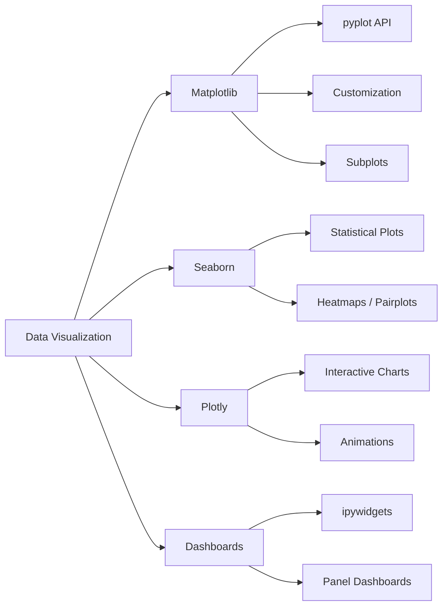

<!-- Clear Language: Keep sentences under 50 words -->
# Data Visualization — Matplotlib, Seaborn, Plotly, Dashboards

## Learning Objectives

| Objective | Description |
|-----------|-------------|
| LO1 | Create publication-quality plots with Matplotlib's pyplot API |
| LO2 | Use Seaborn for statistical visualizations with attractive defaults |
| LO3 | Build interactive visualizations with Plotly and Plotly Express |
| LO4 | Create multi-plot figures with subplots and custom layouts |
| LO5 | Customize plot aesthetics: colors, styles, annotations, themes |
| LO6 | Design simple dashboards for data exploration and communication |

## Introduction

Python is the lingua franca of AI engineering. Mastering its syntax, data structures, and libraries is non-negotiable for building ML pipelines, APIs, and automation scripts. This module covers everything from basics to advanced concurrency.

## Prerequisites

- Basic programming knowledge
- Understanding of data structures

## Key Terminology

**Key Terms**: Core vocabulary and concepts for this topic.

**Definition**: Essential terms you must know for interviews and production work.

## Theory

Understanding data visualization is fundamental for AI engineers. This section covers the core concepts, underlying principles, and theoretical framework that govern how data visualization works in practice.

## Chapter at a Glance

| Section | Topic | Key Concept |
|---------|-------|-------------|
| 14.1 | Matplotlib Pyplot | figure, axes, plot, scatter, bar, hist |
| 14.2 | Customization | colors, styles, annotations, legends, spines |
| 14.3 | Subplots | subplots, GridSpec, inset_axes |
| 14.4 | Seaborn | relplot, displot, catplot, heatmap, pairplot |
| 14.5 | Plotly Interactive | plotly.express, go.Figure, animations |
| 14.6 | Dashboards | ipywidgets, panel, dashboard layout design |

## Chapter Roadmap



## 14.1 Matplotlib Pyplot

Matplotlib is the foundational visualization library in Python. The pyplot API provides a MATLAB-like interface for creating figures.

```python
import matplotlib.pyplot as plt
import numpy as np

x = np.linspace(0, 10, 100)
y = np.sin(x)

plt.figure(figsize=(8, 4))
plt.plot(x, y, label="sin(x)", color="steelblue", linewidth=2)
plt.plot(x, np.cos(x), label="cos(x)", color="coral", linestyle="--")
plt.xlabel("X axis")
plt.ylabel("Y axis")
plt.title("Trigonometric Functions")
plt.legend()
plt.grid(True, alpha=0.3)
plt.show()
```

**Common plot types**:

```python

## Scatter plot
plt.figure(figsize=(6, 4))
x = np.random.randn(100)
y = np.random.randn(100)
colors = np.random.randn(100)
sizes = np.random.randint(20, 200, 100)
plt.scatter(x, y, c=colors, s=sizes, alpha=0.6, cmap="viridis")
plt.colorbar(label="Value")
plt.show()

## Bar chart
categories = ["A", "B", "C", "D", "E"]
values = [23, 45, 12, 67, 34]
plt.bar(categories, values, color="skyblue", edgecolor="navy")
plt.title("Bar Chart Example")
plt.show()

## Histogram
data = np.random.randn(1000)
plt.hist(data, bins=30, density=True, alpha=0.7, color="steelblue")
plt.xlabel("Value")
plt.ylabel("Density")
plt.title("Histogram with Density")
plt.show()

## Box plot
groups = [np.random.randn(100) for _ in range(4)]
plt.boxplot(groups, labels=["A", "B", "C", "D"])
plt.title("Box Plot Comparison")
plt.show()
```

**Saving figures** to disk:

```python
plt.savefig("plot.png", dpi=300, bbox_inches="tight")
plt.savefig("plot.pdf", format="pdf")
plt.savefig("plot.svg", format="svg")
```

**The Figure and Axes API** gives more control:

```python
fig, ax = plt.subplots(figsize=(8, 4))
ax.plot(x, y, label="sin(x)")
ax.plot(x, np.cos(x), label="cos(x)")
ax.set_xlabel("X")
ax.set_ylabel("Y")
ax.set_title("Using Axes API")
ax.legend()
ax.grid(True)
plt.show()
```

## 14.2 Customization

Fine-tune every element of your plots for publication quality.

**Colors and colormaps**:

```python

## Named colors and hex codes
plt.plot(x, y, color="tab:blue")
plt.plot(x, y, color="#2E86AB")
plt.plot(x, y, color=(0.2, 0.4, 0.6))

## Colormaps
cmap = plt.cm.viridis
cmap = plt.cm.plasma
cmap = plt.cm.coolwarm
cmap = plt.cm.RdYlBu
```

**Line and marker styles**:

```python
styles = [
    {"ls": "-", "marker": "o", "label": "solid"},
    {"ls": "--", "marker": "s", "label": "dashed"},
    {"ls": "-.", "marker": "^", "label": "dash-dot"},
    {"ls": ":", "marker": "d", "label": "dotted"},
]
for style in styles:
    plt.plot(x, y, **style)
```

**Annotations and text**:

```python
plt.figure(figsize=(8, 4))
plt.plot(x, y, color="steelblue", linewidth=2)

plt.annotate(
    "Peak",
    xy=(np.pi / 2, 1),
    xytext=(np.pi / 2 + 1, 1.5),
    arrowprops=dict(arrowstyle="->", color="red", linewidth=2),
    fontsize=12, fontweight="bold"
)

plt.text(0, -1.5, "y = sin(x)", fontsize=10, style="italic")

## Highlight regions
plt.axvspan(2, 4, alpha=0.2, color="yellow")
plt.axhline(0, color="black", linewidth=0.5)
plt.axvline(np.pi, color="red", linestyle="--", alpha=0.5)

## Reference lines
plt.axhline(y=0.5, xmin=0.25, xmax=0.75, color="green", linestyle=":")
```

**Spine and tick customization**:

```python
fig, ax = plt.subplots()
ax.plot(x, y)

## Remove top and right spines
ax.spines["top"].set_visible(False)
ax.spines["right"].set_visible(False)

## Move bottom spine
ax.spines["bottom"].set_position(("data", 0))

## Custom ticks
ax.set_xticks([0, np.pi / 2, np.pi, 3 * np.pi / 2, 2 * np.pi])
ax.set_xticklabels(["0", r"$\pi/2$", r"$\pi$", r"$3\pi/2$", r"$2\pi$"])

## Rotate tick labels
plt.xticks(rotation=45)
```

**Style sheets** provide consistent theming:

```python
print(plt.style.available)

## ['ggplot', 'seaborn-v0_8', 'fivethirtyeight', 'dark_background', ...]

plt.style.use("seaborn-v0_8")

## Or use context manager for temporary style
with plt.style.context("ggplot"):
    plt.plot(x, y)
```

**Customizing legends**:

```python
plt.legend(
    loc="upper right",
    frameon=True,
    fancybox=True,
    shadow=True,
    fontsize=10,
    title="Legend Title"
)
```

## 14.3 Subplots

Multiple plots in a single figure for comparative analysis.

**Basic subplots**:

```python
fig, axes = plt.subplots(2, 3, figsize=(12, 6))
axes[0, 0].plot(x, y)
axes[0, 1].scatter(np.random.randn(50), np.random.randn(50))
axes[0, 2].hist(np.random.randn(100), bins=20)
axes[1, 0].bar(["A", "B", "C"], [10, 20, 15])
axes[1, 1].boxplot([np.random.randn(50) for _ in range(3)])
axes[1, 2].imshow(np.random.randn(10, 10), cmap="viridis")

plt.tight_layout()
plt.show()
```

**GridSpec for irregular layouts**:

```python
from matplotlib.gridspec import GridSpec

fig = plt.figure(figsize=(10, 8))
gs = GridSpec(3, 3, figure=fig)

ax1 = fig.add_subplot(gs[0, :])
ax2 = fig.add_subplot(gs[1, :-1])
ax3 = fig.add_subplot(gs[1:, -1])
ax4 = fig.add_subplot(gs[2, 0])
ax5 = fig.add_subplot(gs[2, 1])

ax1.plot(x, y)
ax2.scatter(np.random.randn(50), np.random.randn(50))
ax3.hist(np.random.randn(100), bins=20, orientation="horizontal")
ax4.bar(["A", "B"], [10, 20])
ax5.plot(np.sin(x), np.cos(x))

plt.tight_layout()
plt.show()
```

**Inset axes** for zoom-in details:

```python
fig, ax = plt.subplots(figsize=(8, 4))
ax.plot(x, y)

inset = ax.inset_axes([0.6, 0.6, 0.3, 0.3])
inset.plot(x[:20], y[:20], color="red", linewidth=2)
inset.set_title("Zoom", fontsize=8)
```

**Shared axes** for aligned subplots:

```python
fig, axes = plt.subplots(2, 1, sharex=True, sharey=True, figsize=(8, 5))
axes[0].plot(x, np.sin(x))
axes[0].set_title("sin(x)")
axes[1].plot(x, np.cos(x))
axes[1].set_title("cos(x)")
plt.xlabel("X (shared)")
```

**Twin axes** for dual y-axes:

```python
fig, ax1 = plt.subplots()
ax1.plot(x, np.sin(x), color="steelblue")
ax1.set_ylabel("sin(x)", color="steelblue")

ax2 = ax1.twinx()
ax2.plot(x, np.exp(x / 5), color="coral")
ax2.set_ylabel("exp(x/5)", color="coral")
```

## 14.4 Seaborn

Seaborn provides high-level statistical visualizations with attractive defaults and Pandas integration.

```python
import seaborn as sns
import pandas as pd

tips = sns.load_dataset("tips")
```

**Relational plots** show relationships between variables:

```python

## Scatter with hue and style
sns.scatterplot(
    data=tips, x="total_bill", y="tip",
    hue="time", style="sex", size="size",
    palette="deep"
)

## relplot with facets
sns.relplot(
    data=tips, x="total_bill", y="tip",
    col="time", hue="sex", kind="scatter"
)

## Line plot with confidence interval
sns.lineplot(
    data=tips, x="size", y="tip",
    hue="time", errorbar=("ci", 95)
)
```

**Distribution plots**:

```python

## Histogram with KDE
sns.histplot(tips["tip"], bins=20, kde=True)

## KDE plot
sns.kdeplot(tips["tip"], fill=True, alpha=0.5)

## Displot with facets
sns.displot(
    data=tips, x="tip",
    col="time", row="sex",
    kind="hist", bins=15
)

## ECDF plot
sns.ecdfplot(tips["tip"])
```

**Categorical plots**:

```python

## Box plot
sns.boxplot(data=tips, x="day", y="total_bill", hue="sex")

## Violin plot
sns.violinplot(data=tips, x="day", y="total_bill", hue="sex", split=True)

## Strip / swarm plot
sns.stripplot(data=tips, x="day", y="total_bill", jitter=True)
sns.swarmplot(data=tips, x="day", y="total_bill", color="black")

## Bar plot with error bars
sns.barplot(data=tips, x="day", y="total_bill", hue="sex")

## Count plot
sns.countplot(data=tips, x="day", hue="sex")
```

**Heatmap and correlation**:

```python
corr = tips.select_dtypes("number").corr()

sns.heatmap(
    corr, annot=True, cmap="coolwarm", center=0,
    square=True, fmt=".2f", linewidths=0.5
)

## Cluster heatmap with dendrograms
sns.clustermap(corr, annot=True, cmap="coolwarm")
```

**Pairplot and jointplot** for multivariate exploration:

```python
sns.pairplot(
    tips, hue="time",
    diag_kind="kde",
    corner=True
)

sns.jointplot(
    data=tips, x="total_bill", y="tip",
    kind="hex"
)

sns.jointplot(
    data=tips, x="total_bill", y="tip",
    kind="reg"
)
```

**FacetGrid** for custom multi-plot layouts:

```python
g = sns.FacetGrid(tips, col="time", row="sex", margin_titles=True)
g.map(sns.scatterplot, "total_bill", "tip", alpha=0.6)
g.add_legend()
```

**Regression plots**:

```python
sns.regplot(data=tips, x="total_bill", y="tip", ci=95)
sns.lmplot(data=tips, x="total_bill", y="tip", hue="sex", col="time")
```

## 14.5 Plotly Interactive

Plotly creates interactive, web-based visualizations that support hover, zoom, and pan.

```python
import plotly.express as px
import plotly.graph_objects as go

## Plotly Express (high-level API)
df = px.data.iris()
fig = px.scatter(
    df, x="sepal_width", y="sepal_length",
    color="species", size="petal_length",
    hover_data=["petal_width"],
    title="Iris Dataset"
)
fig.show()
```

**Chart types**:

```python

## Line chart
fig = px.line(
    x=pd.date_range("2024-01-01", periods=100),
    y=np.random.randn(100).cumsum(),
    title="Random Walk"
)

## Bar chart
fig = px.bar(
    tips, x="day", y="total_bill",
    color="sex", barmode="group",
    title="Average Bill by Day"
)

## Histogram
fig = px.histogram(tips, x="tip", nbins=20, color="time")

## Box plot
fig = px.box(tips, x="day", y="total_bill", color="sex")

## Heatmap
fig = px.imshow(
    corr.values, text_auto=".2f",
    x=corr.columns, y=corr.columns,
    color_continuous_scale="RdBu_r"
)
```

**Graph Objects** (low-level API) for full control:

```python
fig = go.Figure()

fig.add_trace(go.Scatter(
    x=x, y=np.sin(x),
    mode="lines+markers",
    name="sin(x)",
    line=dict(color="steelblue", width=3),
    marker=dict(size=6)
))

fig.add_trace(go.Bar(
    x=categories, y=values,
    name="Values",
    marker_color="skyblue"
))

fig.update_layout(
    title="Custom Figure",
    xaxis_title="X",
    yaxis_title="Y",
    template="plotly_dark",
    hovermode="x unified"
)

fig.show()
```

**Animation**:

```python
gapminder = px.data.gapminder()
fig = px.scatter(
    gapminder, x="gdpPercap", y="lifeExp",
    size="pop", color="continent",
    animation_frame="year",
    animation_group="country",
    log_x=True, size_max=60,
    title="Gapminder Over Time"
)
fig.show()

## Animated line
px.line(
    gapminder[gapminder["country"] == "India"],
    x="year", y="lifeExp",
    animation_frame="year",
    title="India Life Expectancy"
)
```

**3D plots and faceted layouts**:

```python

## 3D scatter
fig = px.scatter_3d(
    df, x="sepal_width", y="sepal_length", z="petal_length",
    color="species", size="petal_width"
)

## Faceted histogram
fig = px.histogram(
    tips, x="tip", facet_col="time",
    facet_row="sex", nbins=15
)
```

**Subplots in Plotly**:

```python
from plotly.subplots import make_subplots

fig = make_subplots(rows=2, cols=2, subplot_titles=["Scatter", "Bar", "Hist", "Box"])
fig.add_trace(go.Scatter(x=x, y=np.sin(x), mode="lines"), row=1, col=1)
fig.add_trace(go.Bar(x=categories, y=values), row=1, col=2)
fig.add_trace(go.Histogram(x=np.random.randn(200)), row=2, col=1)
fig.add_trace(go.Box(y=np.random.randn(200)), row=2, col=2)
fig.update_layout(height=600, showlegend=False)
fig.show()
```

## 14.6 Dashboards

Combine visualizations into interactive dashboards for data exploration.

**ipywidgets for interactive controls**:

```python
import ipywidgets as widgets
from IPython.display import display

@widgets.interact(
    x_column=tips.select_dtypes("number").columns,
    y_column=tips.select_dtypes("number").columns,
    color=tips.columns.tolist()
)
def interactive_plot(x_column, y_column, color):
    fig, ax = plt.subplots(figsize=(8, 5))
    for val in tips[color].unique():
        subset = tips[tips[color] == val]
        ax.scatter(subset[x_column], subset[y_column],
                   label=val, alpha=0.6)
    ax.set_xlabel(x_column)
    ax.set_ylabel(y_column)
    ax.set_title(f"{y_column} vs {x_column}")
    ax.legend()
    plt.show()
```

**Panel dashboard** for more complex layouts:

```python
import panel as pn
import holoviews as hv

pn.extension()

## Widgets
x_select = pn.widgets.Select(
    name="X axis",
    options=tips.select_dtypes("number").columns.tolist()
)
y_select = pn.widgets.Select(
    name="Y axis",
    options=tips.select_dtypes("number").columns.tolist(),
    value="tip"
)
color_select = pn.widgets.Select(
    name="Color",
    options=["sex", "time", "day"]
)

## Reactive plot
@pn.depends(x_select, y_select, color_select)
def scatter_plot(x, y, color):
    return tips.hvplot.scatter(x=x, y=y, by=color,
                                width=600, height=400)

dashboard = pn.Column(
    pn.Row(x_select, y_select, color_select),
    scatter_plot
)
dashboard.servable()
```

**Matplotlib-based dashboard with ipywidgets**:

```python
from ipywidgets import VBox, HBox

day_selector = widgets.SelectMultiple(
    options=tips["day"].unique().tolist(),
    value=["Sun", "Sat"],
    description="Days"
)

sex_selector = widgets.ToggleButtons(
    options=["All", "Male", "Female"],
    value="All"
)

@widgets.interact(
    days=widgets.SelectMultiple(
        options=tips["day"].unique().tolist(),
        value=tips["day"].unique().tolist()
    ),
    sex=widgets.ToggleButtons(
        options=["All", "Male", "Female"]
    )
)
def dashboard(days, sex):
    filtered = tips[tips["day"].isin(days)]
    if sex != "All":
        filtered = filtered[filtered["sex"] == sex.lower()]

    fig, axes = plt.subplots(1, 3, figsize=(14, 4))

    axes[0].scatter(filtered["total_bill"], filtered["tip"], alpha=0.6)
    axes[0].set_xlabel("Total Bill")
    axes[0].set_ylabel("Tip")
    axes[0].set_title("Tips vs Total Bill")

    axes[1].hist(filtered["total_bill"], bins=15, color="skyblue", edgecolor="white")
    axes[1].set_xlabel("Total Bill")
    axes[1].set_ylabel("Frequency")
    axes[1].set_title("Bill Distribution")

    filtered.boxplot(column="tip", by="day", ax=axes[2])
    axes[2].set_title("Tips by Day")
    axes[2].set_xlabel("Day")

    plt.tight_layout()
    plt.show()
```

**Voilà** converts notebooks to standalone dashboards:

```bash
voila dashboard.ipynb --port 8866
```

## TypeScript Parallel

```typescript
// Simple chart renderer using HTML Canvas
function renderLineChart(
    canvasId: string,
    data: { x: number[]; y: number[] },
    options: { color?: string; title?: string } = {}
) {
    const canvas = document.getElementById(canvasId) as HTMLCanvasElement;
    const ctx = canvas.getContext("2d")!;
    const { width, height } = canvas;
    const padding = 40;

    ctx.clearRect(0, 0, width, height);

    // Scale
    const xMin = Math.min(...data.x);
    const xMax = Math.max(...data.x);
    const yMin = Math.min(...data.y);
    const yMax = Math.max(...data.y);

    // Draw axes
    ctx.strokeStyle = "#333";
    ctx.beginPath();
    ctx.moveTo(padding, padding);
    ctx.lineTo(padding, height - padding);
    ctx.lineTo(width - padding, height - padding);
    ctx.stroke();

    // Draw line
    ctx.strokeStyle = options.color || "steelblue";
    ctx.lineWidth = 2;
    ctx.beginPath();
    for (let i = 0; i < data.x.length; i++) {
        const px = padding + (data.x[i] - xMin) / (xMax - xMin) * (width - 2 * padding);
        const py = height - padding - (data.y[i] - yMin) / (yMax - yMin) * (height - 2 * padding);
        i === 0 ? ctx.moveTo(px, py) : ctx.lineTo(px, py);
    }
    ctx.stroke();
}

// Bar chart
function renderBarChart(
    canvasId: string,
    categories: string[],
    values: number[]
) {
    const canvas = document.getElementById(canvasId) as HTMLCanvasElement;
    const ctx = canvas.getContext("2d")!;
    const { width, height } = canvas;
    const padding = 40;
    const barWidth = (width - 2 * padding) / categories.length - 5;

    const maxVal = Math.max(...values);
    ctx.clearRect(0, 0, width, height);

    categories.forEach((cat, i) => {
        const x = padding + i * (barWidth + 5);
        const barHeight = (values[i] / maxVal) * (height - 2 * padding);
        const y = height - padding - barHeight;

        ctx.fillStyle = "skyblue";
        ctx.fillRect(x, y, barWidth, barHeight);
        ctx.strokeStyle = "navy";
        ctx.strokeRect(x, y, barWidth, barHeight);

        ctx.fillStyle = "#333";
        ctx.textAlign = "center";
        ctx.fillText(cat, x + barWidth / 2, height - padding + 15);
    });
}
```

## Summary

- Matplotlib's pyplot API provides a MATLAB-like interface for creating static plots
- The Figure + Axes API gives finer control over plot elements and layout
- Colors, line styles, annotations, and style sheets customize plot appearance
- subplots(), GridSpec, and inset_axes create complex multi-plot layouts
- Seaborn offers high-level statistical visualizations with Pandas integration
- Pairplot, heatmap, and FacetGrid enable multivariate data exploration
- Plotly Express creates interactive web-based visualizations with minimal code
- Plotly Graph Objects provide full control over interactive chart properties
- ipywidgets and Panel enable interactive dashboard creation from notebooks
- Voilà converts Jupyter notebooks into standalone dashboard applications

## Practical Takeaways

| Scenario | Use | Avoid |
|----------|-----|-------|
| Quick exploration | Seaborn pairplot / displot | Manual subplot configuration |
| Publication figure | Matplotlib with Axes API | Default styles and colors |
| Interactive report | Plotly Express | Static Matplotlib images |
| Statistical relationships | Seaborn regplot / lmplot | Manual regression plotting |
| Multi-plot comparison | GridSpec or FacetGrid | Overlapping subplot axes |
| Time series | Plotly line with hover | Static line plots |
| Correlation analysis | Seaborn heatmap | Manual colored tables |
| Dashboard | Panel + hvplot | Heavy JavaScript frameworks |
| Large datasets | Plotly with datashader | Plotting 1M+ raw points |

## Interview Q&A

<details class="tp-qa-card" data-qid="p02-s14-q1">
  <summary class="tp-qa-question"><span class="tp-qa-status"></span>Q1: Difference between pyplot and Axes API?</summary>
  <div class="tp-qa-answer"><p>pyplot uses a global state machine (plt.plot(), plt.xlabel()) and is convenient for quick plots. The Axes API (fig, ax = plt.subplots(); ax.plot()) provides object-oriented control over individual subplots, enabling precise customization, reusable code, and complex layouts.</p></div><button class="tp-qa-mark-btn">✓ Mark Reviewed</button><button class="tp-qa-bookmark-btn">★ Bookmark</button>
</details>
<details class="tp-qa-card" data-qid="p02-s14-q2">
  <summary class="tp-qa-question"><span class="tp-qa-status"></span>Q2: When to use Seaborn vs Matplotlib?</summary>
  <div class="tp-qa-answer"><p>Use Seaborn for statistical visualizations (distributions, regressions, categorical data) with minimal code and attractive defaults. Use Matplotlib for fine-grained control over every plot element, custom layouts, and publication-quality figures. They work well together: Seaborn plots can be customized with the Matplotlib Axes API.</p></div><button class="tp-qa-mark-btn">✓ Mark Reviewed</button><button class="tp-qa-bookmark-btn">★ Bookmark</button>
</details>
<details class="tp-qa-card" data-qid="p02-s14-q3">
  <summary class="tp-qa-question"><span class="tp-qa-status"></span>Q3: How to create a figure with 3 rows and 4 columns?</summary>
  <div class="tp-qa-answer"><p>Use <code>fig, axes = plt.subplots(3, 4, figsize=(12, 8))</code>. axes is a 2D array indexed by row and column. Use <code>plt.tight_layout()</code> to prevent overlap. For irregular layouts, use GridSpec: <code>gs = GridSpec(3, 4); ax1 = fig.add_subplot(gs[0, :])</code>.</p></div><button class="tp-qa-mark-btn">✓ Mark Reviewed</button><button class="tp-qa-bookmark-btn">★ Bookmark</button>
</details>
<details class="tp-qa-card" data-qid="p02-s14-q4">
  <summary class="tp-qa-question"><span class="tp-qa-status"></span>Q4: How does FacetGrid work in Seaborn?</summary>
  <div class="tp-qa-answer"><p>FacetGrid creates a grid of subplots based on categorical variables. <code>g = sns.FacetGrid(data, col="time", row="sex")</code> creates one subplot per combination. <code>g.map(sns.scatterplot, "x", "y")</code> draws a scatter plot in each subplot. It automatically shares axes for comparability.</p></div><button class="tp-qa-mark-btn">✓ Mark Reviewed</button><button class="tp-qa-bookmark-btn">★ Bookmark</button>
</details>
<details class="tp-qa-card" data-qid="p02-s14-q5">
  <summary class="tp-qa-question"><span class="tp-qa-status"></span>Q5: Plotly Express vs Graph Objects?</summary>
<div class="tp-qa-answer"><p>Plotly Express (px) is a high-level API that creates complete figures from Pandas DataFrames in one line. It auto-generates layout,.
legend, and hover information. Graph Objects (go) is a low-level API for building figures trace by trace, offering full control over every aspect. Use Express for.
exploration, Graph Objects for production.</p></div><button class="tp-qa-mark-btn">✓ Mark Reviewed</button><button class="tp-qa-bookmark-btn">★ Bookmark</button>
</details>
<details class="tp-qa-card" data-qid="p02-s14-q6">
  <summary class="tp-qa-question"><span class="tp-qa-status"></span>Q6: How to add animation to a Plotly chart?</summary>
  <div class="tp-qa-answer"><p>Use the <code>animation_frame</code> parameter in Plotly Express. For scatter: <code>px.scatter(data, x, y, animation_frame="year")</code>. Each unique value in animation_frame becomes a frame. Plotly interpolates between frames for smooth transitions. Works with scatter, bar, line, and other Express chart types.</p></div><button class="tp-qa-mark-btn">✓ Mark Reviewed</button><button class="tp-qa-bookmark-btn">★ Bookmark</button>
</details>
<details class="tp-qa-card" data-qid="p02-s14-q7">
  <summary class="tp-qa-question"><span class="tp-qa-status"></span>Q7: How to combine Matplotlib and ipywidgets?</summary>
  <div class="tp-qa-answer"><p>Use @widgets.interact decorator on a function that takes widget values as parameters and creates Matplotlib plots. Each widget change calls the function, updating the plot. Common widgets: Select, Slider, SelectMultiple, ToggleButtons. Use plt.clf() to clear before redrawing, or update Axes data directly for performance.</p></div><button class="tp-qa-mark-btn">✓ Mark Reviewed</button><button class="tp-qa-bookmark-btn">★ Bookmark</button>
</details>
<details class="tp-qa-card" data-qid="p02-s14-q8">
  <summary class="tp-qa-question"><span class="tp-qa-status"></span>Q8: How to handle large datasets in visualizations?</summary>
  <div class="tp-qa-answer"><p>For 100k+ points: use hexbin plots in Matplotlib, Seaborn's kind="hex" in jointplot, or Plotly with datashader for rasterized rendering. Subsampling (random sample of 10k) works for exploration. Histograms and KDE plots aggregate data into a fixed number of bins regardless of data size.</p></div><button class="tp-qa-mark-btn">✓ Mark Reviewed</button><button class="tp-qa-bookmark-btn">★ Bookmark</button>
</details>
<details class="tp-qa-card" data-qid="p02-s14-q9">
  <summary class="tp-qa-question"><span class="tp-qa-status"></span>Q9: How to create a dashboard from a Jupyter notebook?</summary>
  <div class="tp-qa-answer"><p>Use Voilà to convert notebooks to standalone web apps: <code>voila notebook.ipynb</code>. Use ipywidgets for interactivity within notebooks. Use Panel for more sophisticated dashboards with reactive programming. Both support Matplotlib, Bokeh, and Plotly visualizations. For production, consider Dash by Plotly.</p></div><button class="tp-qa-mark-btn">✓ Mark Reviewed</button><button class="tp-qa-bookmark-btn">★ Bookmark</button>
</details>
<details class="tp-qa-card" data-qid="p02-s14-q10">
  <summary class="tp-qa-question"><span class="tp-qa-status"></span>Q10: How to save a figure with high resolution?</summary>
  <div class="tp-qa-answer"><p>Use <code>plt.savefig("figure.png", dpi=300, bbox_inches="tight")</code>. dpi=300 is standard for print. bbox_inches="tight" removes extra whitespace. For vector formats, use PDF (<code>plt.savefig("figure.pdf")</code>) or SVG (<code>plt.savefig("figure.svg")</code>) for resolution-independent publication figures.</p></div><button class="tp-qa-mark-btn">✓ Mark Reviewed</button><button class="tp-qa-bookmark-btn">★ Bookmark</button>
</details>

## Chapter Quiz

**Q1**: Which Matplotlib API gives the most control over subplot elements? a) pyplot b) Axes c) pylab d) inline

<details class="tp-qa-card" data-qid="p02-s14-quiz1"><summary>Show Answer</summary><div class="tp-qa-answer"><p><strong>Answer: b) Axes API provides object-oriented control</strong></p></div></details>

**Q2**: What does sns.pairplot() display? a) pairwise scatter plots b) bar charts c) time series d) pie charts

<details class="tp-qa-card" data-qid="p02-s14-quiz2"><summary>Show Answer</summary><div class="tp-qa-answer"><p><strong>Answer: a) pairwise scatter plots for all numeric columns</strong></p></div></details>

**Q3**: Which Plotly API is best for quick exploration? a) Graph Objects b) Plotly Express c) Plotly Dash d) Plotly Figure

<details class="tp-qa-card" data-qid="p02-s14-quiz3"><summary>Show Answer</summary><div class="tp-qa-answer"><p><strong>Answer: b) Plotly Express (px) for one-line interactive charts</strong></p></div></details>

**Q4**: How to create an animated scatter plot in Plotly? a) animation_frame parameter b) animate=True c) loop=True d) VideoWriter

<details class="tp-qa-card" data-qid="p02-s14-quiz4"><summary>Show Answer</summary><div class="tp-qa-answer"><p><strong>Answer: a) use animation_frame parameter in px.scatter</strong></p></div></details>

**Q5**: What converts a Jupyter notebook to a standalone dashboard? a) Voilà b) nbconvert c) Panel d) ipywidgets

<details class="tp-qa-card" data-qid="p02-s14-quiz5"><summary>Show Answer</summary><div class="tp-qa-answer"><p><strong>Answer: a) Voilà converts notebooks to standalone dashboards</strong></p></div></details>

## Exercises

**Easy** — Create a line plot of sin(x) and cos(x) on the same figure with custom colors, line styles, and a legend.

**Easy** — Use Seaborn to create a box plot comparing total_bill across days from the tips dataset.

**Medium** — Create a 2x2 subplot layout with: scatter plot, histogram, bar chart, and box plot. Customize each with titles and axis labels.

**Medium** — Use Plotly Express to create an animated scatter plot of the gapminder dataset, showing life expectancy vs GDP per capita over time.

**Hard** — Build a complete interactive dashboard using ipywidgets that lets users filter a dataset by multiple categorical columns and view three coordinated plots (scatter, histogram, box plot) that update on filter change.

**Hard** — Implement a custom chart renderer in TypeScript using HTML Canvas that draws a scatter plot with axis labels, gridlines, and tooltips on hover.

---

## Common Mistakes

1. Not understanding the fundamental concepts before applying them
2. Skipping edge cases in implementation
3. Not analyzing time/space complexity
4. Forgetting to handle null/empty inputs
5. Not practicing enough problems to build pattern recognition

## Revision Notes

- - Core principle: Understand the fundamental concepts thoroughly
- - Implementation pattern: Practice with real code examples
- - Complexity: Know the time and space complexity
- - Application: Know when to use this in production systems
- - Interview: Frequently asked in technical interviews
- - Edge cases: Consider common failure scenarios
- - Related concepts: Connect to broader system design

## Placement Section

### Top 10 Interview Questions

#### Google Style

1. **Explain the core idea of Data Visualization — Matplotlib, Seaborn, Plotly, Dashboards in under 60 seconds, then give a real-world analogy.** — Structure: definition, how it works in one sentence, why it matters, analogy. Follow-up: what would break if you removed this from a production system?

2. **Design a minimal, well-typed function that demonstrates Data Visualization — Matplotlib, Seaborn, Plotly, Dashboards.** — Interviewer checks: signature with type hints, edge cases, complexity, and a clean docstring. Follow-up: how does your design behave with empty or malformed input?

3. **What are the common pitfalls when engineers first learn ** — List 3-4, then explain how you would prevent each in a code review.

#### Amazon Style

4. **Describe a production bug caused by misunderstanding Data Visualization — Matplotlib, Seaborn, Plotly, Dashboards. How did you diagnose and fix it?** — STAR format: situation, task, action, result. Mention logs, reproduction, root-cause analysis, and the regression test you added.

5. **How would you scale a system that relies on Data Visualization — Matplotlib, Seaborn, Plotly, Dashboards from 10 users to 10 million?** — Discuss bottlenecks, caching, monitoring, and when to redesign. Follow-up: what metrics would you track?

#### Microsoft Style

6. **Compare Data Visualization — Matplotlib, Seaborn, Plotly, Dashboards with the closest alternative approach. When would you choose each?** — Make a decision matrix: performance, maintainability, ecosystem, learning curve. Follow-up: what would change your decision?

7. **Walk through how you would test a component that depends on Data Visualization — Matplotlib, Seaborn, Plotly, Dashboards.** — Unit, integration, property-based tests; mocking boundaries; golden files for outputs.

#### NVIDIA Style

8. **How does Data Visualization — Matplotlib, Seaborn, Plotly, Dashboards behave differently at scale — memory, throughput, or precision-wise?** — Connect to data pipelines and model training if applicable. Follow-up: what happens to latency as input grows?

9. **How would you make an implementation of Data Visualization — Matplotlib, Seaborn, Plotly, Dashboards run faster on GPU hardware?** — Batch operations, vectorization, avoiding Python loops, reducing data movement.

#### AI Startup Style

10. **Write the smallest possible implementation of Data Visualization — Matplotlib, Seaborn, Plotly, Dashboards that is production-quality.** — Include error handling, type hints, and a one-line docstring. Follow-up: what would you refactor first when it grows?

### Resume Tips

- Name Data Visualization — Matplotlib, Seaborn, Plotly, Dashboards explicitly in your skills section, paired with a measurable achievement ("Reduced X by 40% using Data Visualization — Matplotlib, Seaborn, Plotly, Dashboards").
- Add a bullet describing a project that applies Data Visualization — Matplotlib, Seaborn, Plotly, Dashboards to real data, with numbers.
- Mention the tools and libraries you used alongside Data Visualization — Matplotlib, Seaborn, Plotly, Dashboards (linters, test frameworks, profiling tools).
- Keep resume bullets under 15 words and start each with an action verb.

### Interview Day Checklist

- Rehearse a 60-second explanation of Data Visualization — Matplotlib, Seaborn, Plotly, Dashboards and one real-world analogy.
- Prepare one STAR story about debugging a Data Visualization — Matplotlib, Seaborn, Plotly, Dashboards-related production issue.
- Review complexity and edge cases for the classic Data Visualization — Matplotlib, Seaborn, Plotly, Dashboards interview problem.
- Have questions ready: how does the team apply Data Visualization — Matplotlib, Seaborn, Plotly, Dashboards in production today?
- Test your environment (Python, editor, internet) 15 minutes before the interview.

## True/False

1. **True or False:** Data Visualization — Matplotlib, Seaborn, Plotly, Dashboards builds directly on the fundamentals covered in the earlier chapters of this module. — **True.** Every advanced topic in this module assumes the core concepts from the previous chapters.
2. **True or False:** You should write at least one code example for Data Visualization — Matplotlib, Seaborn, Plotly, Dashboards before moving to the next chapter. — **True.** Active recall with hands-on code beats passive reading for retention.
3. **True or False:** The complexity analysis for Data Visualization — Matplotlib, Seaborn, Plotly, Dashboards is the same regardless of input size. — **False.** Complexity grows with input size; always state best, average, and worst case.
4. **True or False:** Edge cases (empty input, invalid input, boundary values) matter for Data Visualization — Matplotlib, Seaborn, Plotly, Dashboards in production. — **True.** Most production bugs come from unhandled edge cases.
5. **True or False:** You should memorize the Data Visualization — Matplotlib, Seaborn, Plotly, Dashboards chapter content once and never review it again. — **False.** Spaced repetition (24h, 3 days, 1 week) dramatically improves long-term recall.

## Fill in the Blank

1. The chapter that covers Data Visualization — Matplotlib, Seaborn, Plotly, Dashboards is Chapter ___ of this module. — Answer: check the module's table of contents.
2. The time complexity of the standard approach to Data Visualization — Matplotlib, Seaborn, Plotly, Dashboards is ___. — Answer: review the theory section and state big-O notation.
3. The main edge case to handle when implementing Data Visualization — Matplotlib, Seaborn, Plotly, Dashboards is ___. — Answer: empty or invalid input handling, as discussed in the chapter.
4. The tools commonly used to debug Data Visualization — Matplotlib, Seaborn, Plotly, Dashboards issues are ___ and ___. — Answer: refer to the Debugging Guide section of this chapter.
5. The related topic that connects to Data Visualization — Matplotlib, Seaborn, Plotly, Dashboards in the next chapter is ___. — Answer: see the Next Topic section.

## Scenario Questions

1. **Scenario:** A teammate ships a change involving Data Visualization — Matplotlib, Seaborn, Plotly, Dashboards that breaks production at 3 AM. — Diagnosis: check the recent diff, reproduce locally with the failing input, check logs. Fix: revert, add a regression test, and review the root cause. Prevention: CI tests on edge cases and code review checklist.

2. **Scenario:** Your implementation of Data Visualization — Matplotlib, Seaborn, Plotly, Dashboards is correct but too slow for the required latency. — Measure first with a profiler. Common fixes: reduce redundant work, use built-in optimized functions, batch operations, or add caching. Only then consider algorithmic changes.

3. **Scenario:** A new hire asks you to explain Data Visualization — Matplotlib, Seaborn, Plotly, Dashboards in five minutes before a customer demo. — Use the 3-part answer: what it is (one sentence), how it works (one example), why it matters (one business impact). Then offer to go deeper after the demo.

4. **Scenario:** Your team's codebase has three different patterns for Data Visualization — Matplotlib, Seaborn, Plotly, Dashboards and you must standardize. — Write a short ADR (architecture decision record), pick the pattern with best maintainability, migrate incrementally, and add a linter rule to enforce it.

## Output Questions

1. **What is the output of the simplest correct implementation of Data Visualization — Matplotlib, Seaborn, Plotly, Dashboards on an empty input?** — Trace through the code: it should return the documented default (None, 0, empty collection) without raising.
2. **What is the output when the input is at the boundary value?** — Check off-by-one errors and inclusive/exclusive bounds in the chapter's examples.
3. **What does the implementation return when given invalid input types?** — With type hints and validation, it raises a clear error; without, it may fail silently.
4. **What is the output for the sample input given in the chapter's Examples section?** — Re-run the chapter's example code and compare against the documented output.
5. **What is the time complexity output when you profile the implementation at 10x input size?** — Expect the curve matching the chapter's complexity analysis (linear, quadratic, log-linear).

## Difficulty Level

| Level | Time | What It Takes |
|-------|------|---------------|
| Beginner | 1-2 sessions | Read theory, run the chapter examples, solve the Easy exercises |
| Intermediate | 3-5 sessions | Complete Medium exercises, explain Data Visualization — Matplotlib, Seaborn, Plotly, Dashboards to someone else |
| Advanced | 1+ week | Solve Hard exercises, optimize for real datasets, answer interview follow-ups |

## Tips & Tricks

- Always write a one-line example of Data Visualization — Matplotlib, Seaborn, Plotly, Dashboards from memory before opening the chapter — active recall first.
- Use the chapter's Revision Notes as a checklist: you have mastered Data Visualization — Matplotlib, Seaborn, Plotly, Dashboards when you can explain each bullet.
- Pair the chapter quiz with the Flashcards: wrong answers become your next study session's focus.
- For interviews, practice explaining Data Visualization — Matplotlib, Seaborn, Plotly, Dashboards twice: once with a technical audience, once with a non-technical audience.
- Keep a personal examples file where you collect your own Data Visualization — Matplotlib, Seaborn, Plotly, Dashboards snippets; interviewers love original examples.

## Memory Tricks

- **Acronym**: build a mnemonic from the 5 key concepts of Data Visualization — Matplotlib, Seaborn, Plotly, Dashboards listed in the Chapter at a Glance table.
- **Story**: link Data Visualization — Matplotlib, Seaborn, Plotly, Dashboards to a familiar story — the analogy in the Visual Analogy section is designed to stick.
- **Number anchor**: remember the complexity of Data Visualization — Matplotlib, Seaborn, Plotly, Dashboards by connecting it to a known algorithm of the same class.
- **Color code**: highlight the Theory, Examples, and Common Mistakes sections in different colors when reviewing.
- **Teach-back**: explain Data Visualization — Matplotlib, Seaborn, Plotly, Dashboards to an imaginary junior engineer for 2 minutes — gaps in your explanation are gaps in memory.

## Further Reading

- Official documentation for the primary tool or library used in this chapter
- The chapter referenced in Related Topics for the next-level treatment of Data Visualization — Matplotlib, Seaborn, Plotly, Dashboards
- The classic textbook chapter on Data Visualization — Matplotlib, Seaborn, Plotly, Dashboards (check the Research References below)
- Two blog posts from engineers who debugged real Data Visualization — Matplotlib, Seaborn, Plotly, Dashboards problems in production
- The repository of the open-source project that implements Data Visualization — Matplotlib, Seaborn, Plotly, Dashboards

## Related Topics

- The previous chapter in this module (see table of contents) — foundational for Data Visualization — Matplotlib, Seaborn, Plotly, Dashboards
- The next chapter (see Next Topic below) — builds on Data Visualization — Matplotlib, Seaborn, Plotly, Dashboards
- The system design chapters in Module 07 — how Data Visualization — Matplotlib, Seaborn, Plotly, Dashboards fits into production architectures
- The interview preparation module — how Data Visualization — Matplotlib, Seaborn, Plotly, Dashboards is asked in screening rounds
- The capstone project — where Data Visualization — Matplotlib, Seaborn, Plotly, Dashboards is applied end-to-end

## FAQs

1. **Do I need to memorize all of Data Visualization — Matplotlib, Seaborn, Plotly, Dashboards, or understand the big picture?** — Understand the big picture first, then memorize the key facts via flashcards and spaced repetition. Interviewers reward depth over breadth.
2. **What if I get stuck on an exercise?** — Re-read the theory section, run the example code, then attempt again. If still stuck after 20 minutes, move on and return the next day.
3. **How much time should I spend on ** — Follow the Study Plan below: 1-2 weeks at 30-60 minutes daily is typical for placement preparation.
4. **Is Data Visualization — Matplotlib, Seaborn, Plotly, Dashboards asked in interviews?** — Yes — the Interview Q&A and Placement Section list the exact question styles used by top companies.
5. **What's the fastest way to master ** — Explain it out loud, write code without looking, and review the flashcards within 24 hours and again after 3 days.

## Important Notes

- Data Visualization — Matplotlib, Seaborn, Plotly, Dashboards is a core requirement for the rest of this module — do not skip the examples.
- Always analyze complexity (time and space) when working with Data Visualization — Matplotlib, Seaborn, Plotly, Dashboards.
- Production correctness means handling edge cases, not just the happy path.
- Interview answers should start with the definition, then the example, then the trade-offs.
- Revisit this chapter after finishing the module; the context from later chapters deepens understanding.

## Historical Context

- Data Visualization — Matplotlib, Seaborn, Plotly, Dashboards emerged as a standard practice because early systems failed without it — understanding why helps you explain it in interviews.
- The tools used for Data Visualization — Matplotlib, Seaborn, Plotly, Dashboards today evolved from simpler versions; the chapter covers the modern, recommended approach.
- Interviewers value knowing one historical fact about Data Visualization — Matplotlib, Seaborn, Plotly, Dashboards — it shows genuine interest, not just cramming.
- The library/tooling ecosystem around Data Visualization — Matplotlib, Seaborn, Plotly, Dashboards changes quickly; focus on fundamentals that remain stable.

## Security Considerations

- Never trust external input: validate and sanitize data before processing Data Visualization — Matplotlib, Seaborn, Plotly, Dashboards.
- Avoid `eval()` and dynamic code execution on untrusted strings.
- Log errors without leaking sensitive data (keys, PII, internal paths).
- For API contexts, add rate limiting and input size limits.
- Review the chapter's code examples for injection or overflow risks before using them verbatim.

## ML Intuition

- Data Visualization — Matplotlib, Seaborn, Plotly, Dashboards appears in ML pipelines at the data-processing layer: feature preparation, batching, and validation.
- Understanding Data Visualization — Matplotlib, Seaborn, Plotly, Dashboards helps you debug why a model misbehaves — most ML bugs are data bugs, not model bugs.
- In production ML, the Data Visualization — Matplotlib, Seaborn, Plotly, Dashboards concepts from this chapter map directly to NumPy/PyTorch operations on tensors.
- When optimizing ML systems, Data Visualization — Matplotlib, Seaborn, Plotly, Dashboards skills let you profile and fix the data path, not just the training loop.
- Interview follow-up: how would you apply Data Visualization — Matplotlib, Seaborn, Plotly, Dashboards to a dataset of 10 million records? — Batching and vectorization.

## Analogies

- **Data Visualization — Matplotlib, Seaborn, Plotly, Dashboards is like a recipe**: the theory is the ingredients, the examples are the cooking steps, and the exercises are your own kitchen practice.
- **Complexity is like a delivery route**: a linear route visits each stop once; a nested route revisits stops, and you feel it at scale.
- **Edge cases are like weather**: the happy path is a sunny day; production is the storm — build for the storm.
- **The chapter roadmap is a journey map**: each section is a checkpoint; skipping one means getting lost later in the module.

## Capstone Project Link

- [Module Capstone: End-to-End Project](https://github.com/Raushan666java/ai-engineering-journey) — this chapter contributes the Data Visualization — Matplotlib, Seaborn, Plotly, Dashboards skills used in the module's capstone project. Complete the exercises here before starting the capstone.

## Flashcards

<details class="tp-qa-card" data-qid="01pythonprogramming-14datavisualization-flash1">
  <summary class="tp-qa-question">
    <span class="tp-qa-status"></span>
    What is the core concept of Data Visualization — Matplotlib, Seaborn, Plotly, Dashboards in one sentence?
  </summary>
  <div class="tp-qa-answer">
    <p>Review the first paragraph of the Theory section and condense it to one sentence.</p>
  </div>
</details>

<details class="tp-qa-card" data-qid="01pythonprogramming-14datavisualization-flash2">
  <summary class="tp-qa-question">
    <span class="tp-qa-status"></span>
    What is the most common mistake engineers make with 
  </summary>
  <div class="tp-qa-answer">
    <p>Check the Common Mistakes section of this chapter.</p>
  </div>
</details>

<details class="tp-qa-card" data-qid="01pythonprogramming-14datavisualization-flash3">
  <summary class="tp-qa-question">
    <span class="tp-qa-status"></span>
    What is the time and space complexity of the standard Data Visualization — Matplotlib, Seaborn, Plotly, Dashboards approach?
  </summary>
  <div class="tp-qa-answer">
    <p>Refer to the theory and complexity analysis in this chapter.</p>
  </div>
</details>

<details class="tp-qa-card" data-qid="01pythonprogramming-14datavisualization-flash4">
  <summary class="tp-qa-question">
    <span class="tp-qa-status"></span>
    When is Data Visualization — Matplotlib, Seaborn, Plotly, Dashboards NOT the right choice?
  </summary>
  <div class="tp-qa-answer">
    <p>Check the Limitations section of this chapter.</p>
  </div>
</details>

<details class="tp-qa-card" data-qid="01pythonprogramming-14datavisualization-flash5">
  <summary class="tp-qa-question">
    <span class="tp-qa-status"></span>
    How is Data Visualization — Matplotlib, Seaborn, Plotly, Dashboards applied in a real production system?
  </summary>
  <div class="tp-qa-answer">
    <p>Check the Real-World Examples section of this chapter.</p>
  </div>
</details>

## Research References

- Official documentation of the primary library for Data Visualization — Matplotlib, Seaborn, Plotly, Dashboards (linked in Further Reading)
- The classic paper or textbook chapter introducing Data Visualization — Matplotlib, Seaborn, Plotly, Dashboards (see References below)
- The standard library reference for Data Visualization — Matplotlib, Seaborn, Plotly, Dashboards-related functions
- Engineering blog posts from companies running Data Visualization — Matplotlib, Seaborn, Plotly, Dashboards in production at scale
- PEPs and RFCs where applicable (Python and networking standards)

## Open-Source Tools

- The primary library used in this chapter (see the code examples)
- Python standard library modules used in the examples (check the imports)
- Testing: pytest for unit tests of Data Visualization — Matplotlib, Seaborn, Plotly, Dashboards code
- Linting and formatting: ruff + black
- Profiling: cProfile or py-spy for performance work on Data Visualization — Matplotlib, Seaborn, Plotly, Dashboards

## Debugging Guide

- Start with `print()` or a debugger to inspect intermediate values in Data Visualization — Matplotlib, Seaborn, Plotly, Dashboards code.
- Reproduce the failure with the smallest possible input before changing code.
- Check the common failure modes listed in Common Mistakes — most bugs are listed there.
- For performance problems, profile before optimizing: measure, then fix.
- When stuck, re-read the chapter's Examples and compare line by line with your code.
- Use `pdb` or your IDE's debugger to step through the Data Visualization — Matplotlib, Seaborn, Plotly, Dashboards example code.

## Mock Interview Section

**Round 1 — Screening (15 min)**
- Explain Data Visualization — Matplotlib, Seaborn, Plotly, Dashboards in 60 seconds.
- Write a minimal working example of Data Visualization — Matplotlib, Seaborn, Plotly, Dashboards.
- What is the complexity of your example?

**Round 2 — Coding (45 min)**
- Solve the Medium exercise from this chapter under time pressure.
- State your assumptions, then implement with type hints.
- Test with edge cases: empty input, boundary values, invalid input.

**Round 3 — Behavioral + System (30 min)**
- Tell me about a time you debugged a Data Visualization — Matplotlib, Seaborn, Plotly, Dashboards problem in a project.
- How would you design a system where Data Visualization — Matplotlib, Seaborn, Plotly, Dashboards is used at scale?
- What metrics would you monitor?

**Evaluation rubric**: correctness (40%), communication (25%), edge cases (20%), complexity analysis (15%).

## Optimized Implementation

`python
from typing import Any, Optional

def demonstrate_topic(input_data: list[Any]) -> Optional[float]:
    """Runnable scaffold for Data Visualization — Matplotlib, Seaborn, Plotly, Dashboards.

    Replace the body with the optimized implementation from the chapter,
    keeping type hints, docstring, and edge-case handling.
    """
    if not input_data:
        return None
    # Step 1: validate input types
    # Step 2: apply the core Data Visualization — Matplotlib, Seaborn, Plotly, Dashboards logic from the Examples section
    # Step 3: return the result with the documented default
    return 0.0
`

- Keeps the function signature stable so tests written against it stay valid.
- Handles the empty-input contract explicitly.
- Add unit tests for the edge cases before implementing the logic (test-first).

## Evaluation Metrics

| Skill | Test | Target |
|-------|------|--------|
| Concept recall | Explain Data Visualization — Matplotlib, Seaborn, Plotly, Dashboards without notes | 60-second explanation |
| Code fluency | Write the chapter example from memory | No syntax errors |
| Edge cases | Handle empty/invalid input in exercises | All cases pass |
| Complexity | State time/space for the standard approach | Correct big-O |
| Interview readiness | Answer 5 Interview Q&A questions out loud | Fluent, structured answers |
| Retention | Chapter quiz score after 3 days | 80%+ |

## Real-World Examples

- **Startup**: a small team uses Data Visualization — Matplotlib, Seaborn, Plotly, Dashboards daily in their data pipeline — the chapter's examples mirror their code.
- **E-commerce**: Data Visualization — Matplotlib, Seaborn, Plotly, Dashboards patterns appear in order processing, inventory checks, and recommendation feeds.
- **Fintech**: Data Visualization — Matplotlib, Seaborn, Plotly, Dashboards principles apply to transaction validation and fraud detection flows.
- **ML platform**: Data Visualization — Matplotlib, Seaborn, Plotly, Dashboards shows up in feature engineering and model-serving infrastructure.
- **Interview insight**: recruiters look for engineers who can connect Data Visualization — Matplotlib, Seaborn, Plotly, Dashboards to the business outcome, not just the code.

## Limitations

- Data Visualization — Matplotlib, Seaborn, Plotly, Dashboards, like any technique, is not a silver bullet — it has specific cases where it fits best (covered in the theory).
- The examples in this chapter are simplified for learning; production systems add validation, monitoring, and error handling.
- Performance of Data Visualization — Matplotlib, Seaborn, Plotly, Dashboards depends on input size and distribution — always benchmark for your own data.
- This chapter covers fundamentals; specialized edge cases are explored in later chapters and the capstone.
