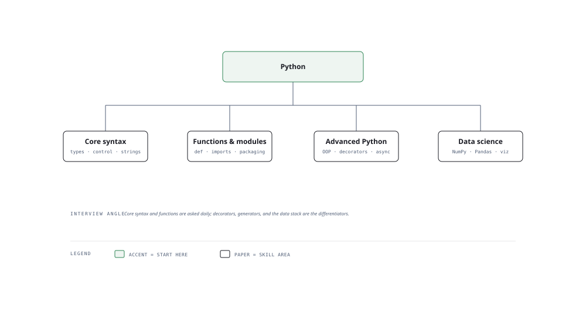

# Visual Notes — Python Programming

> One diagram, the full picture. Glance at this before reading the chapters and again before interviews.

## What the diagram shows

The skill tree branches reality from theory:

1. **Syntax & Data Types** — the letters of the language: lists, dicts, sets, tuples, slicing, comprehensions.
2. **Functions & Classes** — how code is packaged: definitions, `*args`/`**kwargs`, OOP, dunder methods, decorators.
3. **Async & Concurrency** — `async/await`, threads, and processes: when each is the right tool.
4. **Ecosystem & Tools** — pip, venv, typing, testing (pytest), and the libraries you'll use all day (numpy, pandas, requests).
5. **Design & Testing** — code quality: mypy, pytest fixtures, docstrings, and project structure.

## Why this matters for placement

- Python is the language of AI engineering — even when the model runs elsewhere, the glue is Python.
- Interviewers test **three things only**: can you write clean code, can you explain what it does, and can you debug it fast.

## Quick revision

- **Mutable vs immutable** — lists/dicts/sets are mutable; tuples/strings/ints are immutable. Defaults like `def f(x=[])` are a classic bug.
- **What makes Python slow** — the GIL (only one thread runs Python bytecode at a time); use multiprocessing for CPU-bound work.
- **venv** — always. `python -m venv .venv` then `source .venv/bin/activate` (Windows: `.venv\Scripts\activate`).
- **Type hints** — `def add(a: int, b: int) -> int` — cheap to write, catches bugs, and I'm asked for it in code reviews.
- **`__init__.py`** — marks a folder as a package; `if __name__ == "__main__":` guards entry points.

## Related chapters

- [01 — Python Basics](01-python-basics.md)
- [05 — Functions](05-functions.md)
- [08 — OOP in Python](08-oop-in-python.md)
- [10 — Concurrency](10-concurrency.md)
- [11 — NumPy Fundamentals](11-numpy-fundamentals.md)

---

**One-line answer for interviews:** *"Python lets me go from idea to working code fastest; I use type hints and tests to keep it reliable."*
