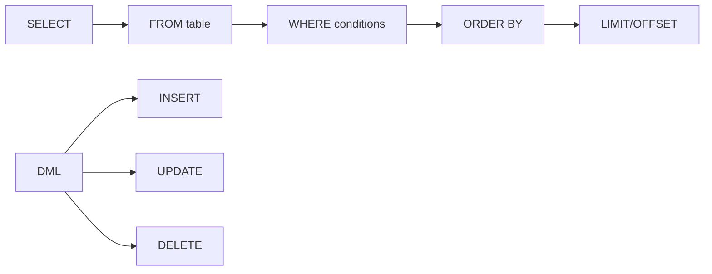

<!-- Clear Language: Keep sentences under 50 words -->
# SQL Basics — SELECT, WHERE, ORDER BY, DML

## Learning Objectives

| Objective | Description |
|-----------|-------------|
| LO1 | Query data with SELECT and filter rows with WHERE |
| LO2 | Sort results with ORDER BY and limit with LIMIT/OFFSET |
| LO3 | Insert new rows with INSERT and update data with UPDATE |
| LO4 | Delete rows with DELETE and understand TRUNCATE |
| LO5 | Use WHERE operators: =, <, IN, BETWEEN, LIKE, IS NULL |
| LO6 | Combine conditions with AND, OR, NOT and precedence |

## Introduction

Data is the fuel of AI. SQL and database design skills let you query, transform, and store the data that powers machine learning models. This module covers everything from basic queries to advanced indexing and optimization.

## Prerequisites

- Basic programming knowledge
- Understanding of data structures

## Key Terminology

**Key Terms**: Core vocabulary and concepts for this topic.

**Definition**: Essential terms you must know for interviews and production work.

## Theory

Understanding sql basics is fundamental for AI engineers. This section covers the core concepts, underlying principles, and theoretical framework that govern how sql basics works in practice.

## Chapter at a Glance

| Section | Topic | Key Concept |
|---------|-------|-------------|
| 1.1 | SELECT Queries | SELECT, FROM, *, column aliases |
| 1.2 | WHERE Clauses | comparison, IN, BETWEEN, LIKE |
| 1.3 | Sorting & Limiting | ORDER BY, ASC/DESC, LIMIT, OFFSET |
| 1.4 | NULL Handling | IS NULL, IS NOT NULL, COALESCE |
| 1.5 | DML — INSERT | INSERT INTO, multi-row, DEFAULT |
| 1.6 | DML — UPDATE & DELETE | UPDATE SET, DELETE, TRUNCATE |

## Chapter Roadmap



## 1.1 SELECT Queries

SELECT retrieves rows from a table.

```sql
SELECT * FROM employees;
SELECT first_name, last_name, salary FROM employees;
SELECT first_name AS "First Name", salary * 12 AS annual FROM employees;
SELECT DISTINCT department_id FROM employees;
```

**Python simulation**:

```python
import sqlite3
conn = sqlite3.connect(":memory:")
cur = conn.cursor()
cur.execute("CREATE TABLE emp (id, name, salary, dept)")
cur.executemany("INSERT INTO emp VALUES (?,?,?,?)", [
    (1, "Alice", 75000, "Eng"), (2, "Bob", 68000, "Eng"),
    (3, "Charlie", 82000, "Sales"),
])
cur.execute("SELECT name, salary FROM emp WHERE salary > 70000")
for row in cur.fetchall():
    print(row)

## ('Alice', 75000) ('Charlie', 82000)
```

## 1.2 WHERE Clauses

```sql
SELECT * FROM products WHERE price > 100;
SELECT * FROM products WHERE price = 49.99;
SELECT * FROM products WHERE price <> 0;
SELECT * FROM employees WHERE dept_id IN (3, 5, 7);
SELECT * FROM orders WHERE order_date BETWEEN '2024-01-01' AND '2024-12-31';
SELECT * FROM customers WHERE email LIKE '%@gmail.com';
SELECT * FROM employees WHERE name LIKE '%son%';
SELECT * FROM products WHERE sku LIKE 'A___';
SELECT * FROM employees WHERE dept_id = 3 AND salary > 70000;
SELECT * FROM products WHERE category = 'Electronics' OR category = 'Books';
SELECT * FROM orders WHERE NOT status = 'Cancelled';
SELECT * FROM employees WHERE (dept_id = 3 OR dept_id = 5) AND salary > 60000;
```

## 1.3 Sorting & Limiting

```sql
SELECT name, price FROM products ORDER BY price;
SELECT name, price FROM products ORDER BY price DESC;
SELECT last_name, first_name FROM employees ORDER BY salary DESC, last_name;
SELECT * FROM products ORDER BY price DESC LIMIT 10;
SELECT * FROM products ORDER BY price DESC LIMIT 10 OFFSET 20;
```

**Python example**:

```python
conn = sqlite3.connect(":memory:")
cur = conn.cursor()
cur.execute("CREATE TABLE scores (name, score)")
cur.executemany("INSERT INTO scores VALUES (?,?)", [("Alice",95),("Bob",87),("Charlie",92)])
cur.execute("SELECT name, score FROM scores ORDER BY score DESC LIMIT 2")
for r in cur.fetchall():
    print(f"{r[0]}: {r[1]}")

## Alice: 95, Charlie: 92
```

## 1.4 NULL Handling

```sql
SELECT * FROM employees WHERE manager_id IS NULL;
SELECT * FROM customers WHERE email IS NOT NULL;
SELECT name, COALESCE(phone, email, 'No contact') AS contact FROM customers;
SELECT * FROM products WHERE price < 100;  -- excludes NULL prices
```

**Python**:

```python
conn = sqlite3.connect(":memory:")
cur = conn.cursor()
cur.execute("CREATE TABLE users (id, name, email)")
cur.execute("INSERT INTO users VALUES (1, 'Alice', 'a@test.com')")
cur.execute("INSERT INTO users VALUES (2, 'Bob', NULL)")
cur.execute("SELECT name, COALESCE(email, 'No email') FROM users")
for r in cur.fetchall():
    print(f"{r[0]}: {r[1]}")

## Alice: a@test.com

## Bob: No email
```

## 1.5 INSERT

```sql
INSERT INTO employees (first_name, last_name, salary, dept_id)
VALUES ('Eve', 'Wilson', 65000, 3);

INSERT INTO departments (name, location) VALUES
    ('Engineering', 'Building A'),
    ('Sales', 'Building B');

INSERT INTO high_value_customers (id, name, total)
SELECT id, name, total_spent FROM customers WHERE total_spent > 10000;

INSERT INTO users (id, name) VALUES (1, 'Alice')
ON CONFLICT(id) DO UPDATE SET name = EXCLUDED.name;
```

## 1.6 UPDATE & DELETE

```sql
UPDATE employees SET salary = 80000 WHERE employee_id = 5;
UPDATE products SET price = price * 1.1 WHERE category = 'Electronics';
DELETE FROM employees WHERE employee_id = 10;
DELETE FROM logs;          -- slow for large tables
TRUNCATE TABLE temp_data;  -- fast, DDL, non-recoverable
```

**Python**:

```python
conn = sqlite3.connect(":memory:")
cur = conn.cursor()
cur.execute("CREATE TABLE emp(id, name, salary)")
cur.executemany("INSERT INTO emp VALUES (?,?,?)", [(1,"Alice",50000),(2,"Bob",60000)])
cur.execute("UPDATE emp SET salary = 55000 WHERE id = 1")
conn.commit()
print(f"Updated: {cur.rowcount} rows")
cur.execute("DELETE FROM emp WHERE salary < 55000")
print(f"Deleted: {cur.rowcount} rows")
```

## TypeScript Parallel

```typescript
import sqlite3 from "sqlite3";
import { open } from "sqlite";

async function query() {
    const db = await open({ filename: ":memory:", driver: sqlite3.Database });
    await db.exec("CREATE TABLE emp (id, name, salary)");
    await db.run("INSERT INTO emp VALUES (1, 'Alice', 75000)");
    const rows = await db.all("SELECT name, salary FROM emp WHERE salary > 70000");
    console.log(rows);
    await db.close();
}
```

## Visual Analogy

Think of a SQL database like a **library card catalog system**:

- **Tables** = Bookshelves — each shelf holds a specific category (employees, products, orders).
- **Rows** = Individual books on the shelf — each row is one record, like a single employee or product.
- **Columns** = Book attributes — title, author, year, genre. Each column stores one type of information about every book.
- **SELECT** = Asking the librarian "show me all books by Author X" — you specify what you want to see.
- **WHERE** = Filtering criteria — "only books published after 2020" narrows down the results.
- **INSERT** = Adding a new book to the shelf.
- **UPDATE** = Editing a book's record card (changing the author's address).
- **DELETE** = Removing a book from the shelf entirely.

This helps because databases are fundamentally organized storage, just like a library. The card catalog (indexes) helps you find books quickly without scanning every shelf, and SQL is the language you use to talk to the librarian.

## Summary

- SELECT retrieves data; WHERE filters rows
- AND has higher precedence than OR — use parentheses
- ORDER BY sorts results; ASC default, DESC for descending
- LIMIT restricts rows; OFFSET for pagination
- NULL is not equal to anything — use IS NULL
- INSERT adds rows; multi-row VALUES is faster
- UPDATE modifies rows; always include WHERE
- DELETE is DML (can rollback); TRUNCATE is DDL (cannot)
- COALESCE returns first non-null value
- LIKE uses % (any) and _ (one char) wildcards

## Practical Takeaways

| Scenario | Do This | Avoid |
|----------|---------|-------|
| All columns | List column names | SELECT * |
| String search | column LIKE '%pattern%' | column = '%pattern%' |
| NULL check | column IS NULL | column = NULL |
| Pagination | LIMIT 10 OFFSET 20 | Fetching all rows |
| Update caution | Always include WHERE | UPDATE without WHERE |
| Multi-row insert | Single INSERT multiple VALUES | Multiple single INSERTs |

## Interview Q&A

<details class="tp-qa-card" data-qid="sql-s01-q1">
  <summary class="tp-qa-question"><span class="tp-qa-status"></span>Q1: Order of SQL query execution?</summary>
  <div class="tp-qa-answer"><p>FROM -> WHERE -> GROUP BY -> HAVING -> SELECT -> ORDER BY -> LIMIT. Explains why aliases can't be used in WHERE.</p></div><button class="tp-qa-mark-btn">? Mark Reviewed</button><button class="tp-qa-bookmark-btn">?? Bookmark</button>
</details>
<details class="tp-qa-card" data-qid="sql-s01-q2">
  <summary class="tp-qa-question"><span class="tp-qa-status"></span>Q2: DELETE vs TRUNCATE?</summary>
  <div class="tp-qa-answer"><p>DELETE: DML, rollback, triggers, slower, WHERE clause. TRUNCATE: DDL, no rollback, no triggers, fast, resets auto-increment.</p></div><button class="tp-qa-mark-btn">? Mark Reviewed</button><button class="tp-qa-bookmark-btn">?? Bookmark</button>
</details>
<details class="tp-qa-card" data-qid="sql-s01-q3">
  <summary class="tp-qa-question"><span class="tp-qa-status"></span>Q3: NULL behavior in SQL?</summary>
  <div class="tp-qa-answer"><p>NULL means unknown. NULL = NULL yields NULL (not True). Use IS NULL/IS NOT NULL. Arithmetic with NULL yields NULL. Aggregates ignore NULL (except COUNT(*)).</p></div><button class="tp-qa-mark-btn">? Mark Reviewed</button><button class="tp-qa-bookmark-btn">?? Bookmark</button>
</details>
<details class="tp-qa-card" data-qid="sql-s01-q4">
  <summary class="tp-qa-question"><span class="tp-qa-status"></span>Q4: LIKE '%test%' matches?</summary>
  <div class="tp-qa-answer"><p>% matches any sequence; _ matches one char. %test% matches any string containing test. test% matches strings starting with test.</p></div><button class="tp-qa-mark-btn">? Mark Reviewed</button><button class="tp-qa-bookmark-btn">?? Bookmark</button>
</details>
<details class="tp-qa-card" data-qid="sql-s01-q5">
  <summary class="tp-qa-question"><span class="tp-qa-status"></span>Q5: CHAR vs VARCHAR?</summary>
  <div class="tp-qa-answer"><p>CHAR(n): fixed-length, padded with spaces. VARCHAR(n): variable-length up to n. CHAR faster for fixed codes; VARCHAR space-efficient for variable text.</p></div><button class="tp-qa-mark-btn">? Mark Reviewed</button><button class="tp-qa-bookmark-btn">?? Bookmark</button>
</details>
<details class="tp-qa-card" data-qid="sql-s01-q6">
  <summary class="tp-qa-question"><span class="tp-qa-status"></span>Q6: Pagination in SQL?</summary>
  <div class="tp-qa-answer"><p>LIMIT 20 OFFSET 40 for page 3 (20 items/page). Keyset pagination (WHERE id > last_id) is more efficient for large datasets than OFFSET.</p></div><button class="tp-qa-mark-btn">? Mark Reviewed</button><button class="tp-qa-bookmark-btn">?? Bookmark</button>
</details>
<details class="tp-qa-card" data-qid="sql-s01-q7">
  <summary class="tp-qa-question"><span class="tp-qa-status"></span>Q7: What does COALESCE do?</summary>
  <div class="tp-qa-answer"><p>Returns first non-null value: COALESCE(NULL, NULL, 'default') returns 'default'. Useful for NULL handling and providing defaults.</p></div><button class="tp-qa-mark-btn">? Mark Reviewed</button><button class="tp-qa-bookmark-btn">?? Bookmark</button>
</details>
<details class="tp-qa-card" data-qid="sql-s01-q8">
  <summary class="tp-qa-question"><span class="tp-qa-status"></span>Q8: Rename columns in output?</summary>
  <div class="tp-qa-answer"><p>Use AS aliases: SELECT first_name AS "First Name". Aliases work in ORDER BY but not WHERE (execution order).</p></div><button class="tp-qa-mark-btn">? Mark Reviewed</button><button class="tp-qa-bookmark-btn">?? Bookmark</button>
</details>
<details class="tp-qa-card" data-qid="sql-s01-q9">
  <summary class="tp-qa-question"><span class="tp-qa-status"></span>Q9: IN vs EXISTS?</summary>
  <div class="tp-qa-answer"><p>IN checks value in list/subquery. EXISTS checks if subquery returns rows. EXISTS can short-circuit and handles NULLs better, often faster.</p></div><button class="tp-qa-mark-btn">? Mark Reviewed</button><button class="tp-qa-bookmark-btn">?? Bookmark</button>
</details>
<details class="tp-qa-card" data-qid="sql-s01-q10">
  <summary class="tp-qa-question"><span class="tp-qa-status"></span>Q10: Insert and get generated ID?</summary>
  <div class="tp-qa-answer"><p>PostgreSQL: INSERT ... RETURNING id. MySQL: LAST_INSERT_ID(). SQLite: last_insert_rowid(). Python: cur.lastrowid.</p></div><button class="tp-qa-mark-btn">? Mark Reviewed</button><button class="tp-qa-bookmark-btn">?? Bookmark</button>
</details>

## Chapter Quiz

**Q1**: Which clause filters rows before grouping? a) HAVING b) WHERE c) FILTER d) GROUP BY

<details class="tp-qa-card" data-qid="sql-s01-quiz1"><summary>Show Answer</summary><div class="tp-qa-answer"><p><strong>Answer: b) WHERE</strong></p></div></details>

**Q2**: LIKE 'A_' matches? a) starts with A b) A + 1 char c) A + 0+ chars d) any A

<details class="tp-qa-card" data-qid="sql-s01-quiz2"><summary>Show Answer</summary><div class="tp-qa-answer"><p><strong>Answer: b) A followed by exactly 1 character</strong></p></div></details>

**Q3**: Check for NULL? a) = NULL b) IS NULL c) == NULL d) EQUALS NULL

<details class="tp-qa-card" data-qid="sql-s01-quiz3"><summary>Show Answer</summary><div class="tp-qa-answer"><p><strong>Answer: b) IS NULL</strong></p></div></details>

**Q4**: True about TRUNCATE? a) Can rollback b) Fires triggers c) DDL d) WHERE clause

<details class="tp-qa-card" data-qid="sql-s01-quiz4"><summary>Show Answer</summary><div class="tp-qa-answer"><p><strong>Answer: c) DDL statement</strong></p></div></details>

**Q5**: SELECT 5 + NULL returns? a) 5 b) NULL c) 0 d) Error

<details class="tp-qa-card" data-qid="sql-s01-quiz5"><summary>Show Answer</summary><div class="tp-qa-answer"><p><strong>Answer: b) NULL</strong></p></div></details>

### True/False

**T/F 1**: This topic is fundamental to AI engineering.
**Answer**: True — Understanding sql and databases is essential for building production AI systems.

**T/F 2**: The concepts in this chapter are only used in interviews.
**Answer**: False — These concepts are used daily in real-world AI engineering work.

**T/F 3**: Time/space complexity analysis applies to sql and databases.
**Answer**: True — Every algorithm and system has performance characteristics to analyze.

**T/F 4**: sql and databases concepts are independent of each other.
**Answer**: False — Most concepts build on each other and are interconnected.

**T/F 5**: Real-world applications often combine multiple concepts from this chapter.
**Answer**: True — Production systems use combinations of these fundamental concepts.

### Fill in the Blank

**FIB 1**: The key concept in this chapter is ________.
**Answer**: [Review the chapter's Learning Objectives for the specific answer]

**FIB 2**: In sql and databases, the time complexity of the basic operation is ________.
**Answer**: [Depends on the specific operation — check the Theory section]

### Scenario Questions

**Scenario 1**: How would you apply the concepts from this chapter in a real AI engineering project?

**Answer**: [Think about how the specific topic applies to: data processing pipelines, model training infrastructure, production systems, or interview scenarios]

### Output Questions

**Output 1**: What is the time complexity of the main algorithm discussed in this chapter?
**Answer**: [Check the Theory section for the specific complexity analysis]

## Exercises

**Easy** — Query all customers from 2024 orders sorted by date descending.
**Easy** — Insert 3 new products into a products table.
**Medium** — Find employees with salary 50k-100k in Engineering or Sales, ordered by salary desc.
**Medium** — Give 10% bonus to dept 5 employees. Delete employees hired before 2000.
**Hard** — Paginate products table (25/page, page 4, by price).
**Hard** — Convert Python list comprehension to SQL: [o for o in orders if o.status=='pending' and o.amount>100][:20]

## 1.7 Data Definition Language (DDL)

DDL creates and modifies database structure.

```sql
-- CREATE TABLE
CREATE TABLE employees (
    employee_id INTEGER PRIMARY KEY AUTOINCREMENT,
    first_name VARCHAR(50) NOT NULL,
    last_name VARCHAR(50) NOT NULL,
    email VARCHAR(100) UNIQUE NOT NULL,
    hire_date DATE NOT NULL DEFAULT CURRENT_DATE,
    salary DECIMAL(10,2) CHECK (salary > 0),
    department_id INTEGER,
    FOREIGN KEY (department_id) REFERENCES departments(id)
);

-- ALTER TABLE
ALTER TABLE employees ADD COLUMN phone VARCHAR(20);
ALTER TABLE employees RENAME COLUMN phone TO contact_number;
ALTER TABLE employees DROP COLUMN contact_number;  -- SQLite: not supported
ALTER TABLE employees RENAME TO staff;

-- DROP TABLE
DROP TABLE IF EXISTS temp_data;

-- CREATE INDEX
CREATE INDEX idx_employees_dept ON employees(department_id);
CREATE UNIQUE INDEX idx_employees_email ON employees(email);
CREATE INDEX idx_employees_name ON employees(last_name, first_name);

-- CREATE VIEW
CREATE VIEW high_earners AS
SELECT first_name, last_name, salary, department_id
FROM employees
WHERE salary > 80000;
```

## 1.8 Constraints

```sql
-- NOT NULL: column must have a value
CREATE TABLE products (
    id INTEGER PRIMARY KEY,
    name VARCHAR(100) NOT NULL,
    price DECIMAL(10,2) NOT NULL
);

-- UNIQUE: all values in column must be different
CREATE TABLE users (
    id INTEGER PRIMARY KEY,
    username VARCHAR(50) UNIQUE NOT NULL,
    email VARCHAR(100) UNIQUE
);

-- PRIMARY KEY: NOT NULL + UNIQUE (one per table)
CREATE TABLE orders (
    order_id INTEGER PRIMARY KEY AUTOINCREMENT,
    customer_id INTEGER NOT NULL,
    order_date DATE DEFAULT CURRENT_DATE
);

-- FOREIGN KEY: references primary key in another table
CREATE TABLE order_items (
    item_id INTEGER PRIMARY KEY,
    order_id INTEGER NOT NULL,
    product_id INTEGER NOT NULL,
    quantity INTEGER NOT NULL,
    FOREIGN KEY (order_id) REFERENCES orders(order_id)
        ON DELETE CASCADE,
    FOREIGN KEY (product_id) REFERENCES products(product_id)
        ON DELETE RESTRICT
);

-- CHECK: validates data before insert/update
CREATE TABLE accounts (
    id INTEGER PRIMARY KEY,
    balance DECIMAL(10,2) CHECK (balance >= 0),
    account_type VARCHAR(20) CHECK (account_type IN ('savings', 'checking', 'credit'))
);

-- DEFAULT: provides default value
CREATE TABLE logs (
    id INTEGER PRIMARY KEY,
    message TEXT,
    created_at TIMESTAMP DEFAULT CURRENT_TIMESTAMP,
    severity INTEGER DEFAULT 1
);
```

## 1.9 Working with Indexes

Indexes speed up data retrieval at the cost of slower writes.

```sql
-- When to use indexes:
-- 1. Columns used frequently in WHERE clauses
-- 2. Columns used in JOIN conditions
-- 3. Columns used in ORDER BY
-- 4. Columns with high cardinality (many unique values)

-- Creating indexes
CREATE INDEX idx_orders_customer ON orders(customer_id);
CREATE INDEX idx_orders_date ON orders(order_date);

-- Composite indexes (column order matters!)
CREATE INDEX idx_orders_customer_date ON orders(customer_id, order_date);
-- This index helps: WHERE customer_id = ? AND order_date BETWEEN ? AND ?
-- This index does NOT help: WHERE order_date BETWEEN ? AND ?

-- Index analysis (PostgreSQL)
-- EXPLAIN ANALYZE SELECT * FROM employees WHERE department_id = 5;

-- Partial indexes
CREATE INDEX idx_active_employees ON employees(employee_id)
WHERE status = 'active';

-- Covering indexes (include all needed columns)
CREATE INDEX idx_employee_names ON employees(last_name, first_name)
INCLUDE (email, department_id);

-- View existing indexes
-- PostgreSQL: SELECT * FROM pg_indexes WHERE tablename = 'employees';
-- SQLite: .indexes employees
-- MySQL: SHOW INDEX FROM employees;
```

## 1.10 Transactions

Transactions ensure data consistency with ACID properties.

```sql
-- Basic transaction
BEGIN TRANSACTION;
UPDATE accounts SET balance = balance - 100 WHERE id = 1;
UPDATE accounts SET balance = balance + 100 WHERE id = 2;
COMMIT;  -- or ROLLBACK;

-- Savepoints for partial rollback
BEGIN;
INSERT INTO logs (message) VALUES ('Step 1');
SAVEPOINT sp1;
INSERT INTO logs (message) VALUES ('Step 2');
ROLLBACK TO sp1;  -- undo Step 2, keep Step 1
COMMIT;

-- Transaction isolation levels (PostgreSQL)
SET TRANSACTION ISOLATION LEVEL READ COMMITTED;
SET TRANSACTION ISOLATION LEVEL SERIALIZABLE;

-- ACID properties:
-- Atomicity: all or nothing
-- Consistency: data remains valid
-- Isolation: concurrent transactions don't interfere
-- Durability: committed changes persist
```

```python
import sqlite3

conn = sqlite3.connect("example.db")
try:
    with conn:  # auto-commit/rollback
        conn.execute("UPDATE accounts SET balance = balance - 100 WHERE id = 1")
        conn.execute("UPDATE accounts SET balance = balance + 100 WHERE id = 2")
except sqlite3.Error as e:
    print(f"Transaction failed: {e}")
```

## 1.11 Common Pitfalls

```sql
-- Pitfall 1: SELECT * in production
SELECT * FROM employees;  -- BAD: returns all columns, order-dependent
SELECT id, name, email FROM employees;  -- GOOD: explicit columns

-- Pitfall 2: Missing WHERE in UPDATE/DELETE
UPDATE employees SET salary = 50000;  -- updates ALL rows!
DELETE FROM employees;  -- deletes ALL rows!

-- Pitfall 3: NULL comparisons
SELECT * FROM employees WHERE salary = NULL;  -- WRONG: returns nothing
SELECT * FROM employees WHERE salary IS NULL;  -- CORRECT

-- Pitfall 4: String comparisons with trailing spaces
SELECT * FROM users WHERE name = 'Alice';  -- may not match 'Alice '

-- Pitfall 5: Implicit type conversion
SELECT * FROM orders WHERE order_date = '2024-01-01';
-- Better: WHERE order_date = DATE '2024-01-01'

-- Pitfall 6: Not understanding execution order
SELECT id, salary * 1.1 AS new_salary
FROM employees
-- WHERE new_salary > 80000  -- WRONG: alias not yet available
HAVING new_salary > 80000  -- OK in some DBs (not standard)
ORDER BY new_salary;  -- OK: ORDER BY can use alias

-- Pitfall 7: Forgetting to COMMIT transactions
BEGIN;
UPDATE inventory SET quantity = quantity - 1 WHERE product_id = 10;
-- Missing COMMIT: other sessions see old data
```

## 1.12 Real-World Query Examples

```sql
-- Customer order summary
SELECT
    c.customer_id,
    c.name,
    COUNT(o.order_id) AS total_orders,
    COALESCE(SUM(o.total_amount), 0) AS total_spent,
    MAX(o.order_date) AS last_order_date,
    CASE
        WHEN COUNT(o.order_id) = 0 THEN 'New'
        WHEN MAX(o.order_date) >= DATE('now', '-90 days') THEN 'Active'
        ELSE 'Inactive'
    END AS customer_status
FROM customers c
LEFT JOIN orders o ON c.customer_id = o.customer_id
GROUP BY c.customer_id
ORDER BY total_spent DESC;

-- Product inventory report
SELECT
    p.product_id,
    p.name,
    p.category,
    p.price,
    COALESCE(i.quantity, 0) AS stock,
    CASE
        WHEN COALESCE(i.quantity, 0) = 0 THEN 'Out of Stock'
        WHEN COALESCE(i.quantity, 0) < 10 THEN 'Low Stock'
        ELSE 'In Stock'
    END AS stock_status
FROM products p
LEFT JOIN inventory i ON p.product_id = i.product_id
ORDER BY stock_status, p.name;

-- Paginated search with total count
SELECT *
FROM (
    SELECT *, COUNT(*) OVER() AS total_count
    FROM products
    WHERE name LIKE '%search%'
) AS search_results
ORDER BY price
LIMIT 20 OFFSET 40;
-- Returns items 41-60 along with total count
```

---

## Common Mistakes

1. Not understanding the fundamental concepts before applying them
2. Skipping edge cases in implementation
3. Not analyzing time/space complexity
4. Forgetting to handle null/empty inputs
5. Not practicing enough problems to build pattern recognition

## Revision Notes

- - Core principle: Understand the fundamental concepts thoroughly
- - Implementation pattern: Practice with real code examples
- - Complexity: Know the time and space complexity
- - Application: Know when to use this in production systems
- - Interview: Frequently asked in technical interviews
- - Edge cases: Consider common failure scenarios
- - Related concepts: Connect to broader system design

## Placement Section

### Top 10 Interview Questions

#### Google Style

1. **Explain the core idea of SQL Basics — SELECT, WHERE, ORDER BY, DML in under 60 seconds, then give a real-world analogy.** — Structure: definition, how it works in one sentence, why it matters, analogy. Follow-up: what would break if you removed this from a production system?

2. **Design a minimal, well-typed function that demonstrates SQL Basics — SELECT, WHERE, ORDER BY, DML.** — Interviewer checks: signature with type hints, edge cases, complexity, and a clean docstring. Follow-up: how does your design behave with empty or malformed input?

3. **What are the common pitfalls when engineers first learn ** — List 3-4, then explain how you would prevent each in a code review.

#### Amazon Style

4. **Describe a production bug caused by misunderstanding SQL Basics — SELECT, WHERE, ORDER BY, DML. How did you diagnose and fix it?** — STAR format: situation, task, action, result. Mention logs, reproduction, root-cause analysis, and the regression test you added.

5. **How would you scale a system that relies on SQL Basics — SELECT, WHERE, ORDER BY, DML from 10 users to 10 million?** — Discuss bottlenecks, caching, monitoring, and when to redesign. Follow-up: what metrics would you track?

#### Microsoft Style

6. **Compare SQL Basics — SELECT, WHERE, ORDER BY, DML with the closest alternative approach. When would you choose each?** — Make a decision matrix: performance, maintainability, ecosystem, learning curve. Follow-up: what would change your decision?

7. **Walk through how you would test a component that depends on SQL Basics — SELECT, WHERE, ORDER BY, DML.** — Unit, integration, property-based tests; mocking boundaries; golden files for outputs.

#### NVIDIA Style

8. **How does SQL Basics — SELECT, WHERE, ORDER BY, DML behave differently at scale — memory, throughput, or precision-wise?** — Connect to data pipelines and model training if applicable. Follow-up: what happens to latency as input grows?

9. **How would you make an implementation of SQL Basics — SELECT, WHERE, ORDER BY, DML run faster on GPU hardware?** — Batch operations, vectorization, avoiding Python loops, reducing data movement.

#### AI Startup Style

10. **Write the smallest possible implementation of SQL Basics — SELECT, WHERE, ORDER BY, DML that is production-quality.** — Include error handling, type hints, and a one-line docstring. Follow-up: what would you refactor first when it grows?

### Resume Tips

- Name SQL Basics — SELECT, WHERE, ORDER BY, DML explicitly in your skills section, paired with a measurable achievement ("Reduced X by 40% using SQL Basics — SELECT, WHERE, ORDER BY, DML").
- Add a bullet describing a project that applies SQL Basics — SELECT, WHERE, ORDER BY, DML to real data, with numbers.
- Mention the tools and libraries you used alongside SQL Basics — SELECT, WHERE, ORDER BY, DML (linters, test frameworks, profiling tools).
- Keep resume bullets under 15 words and start each with an action verb.

### Interview Day Checklist

- Rehearse a 60-second explanation of SQL Basics — SELECT, WHERE, ORDER BY, DML and one real-world analogy.
- Prepare one STAR story about debugging a SQL Basics — SELECT, WHERE, ORDER BY, DML-related production issue.
- Review complexity and edge cases for the classic SQL Basics — SELECT, WHERE, ORDER BY, DML interview problem.
- Have questions ready: how does the team apply SQL Basics — SELECT, WHERE, ORDER BY, DML in production today?
- Test your environment (Python, editor, internet) 15 minutes before the interview.

## True/False

1. **True or False:** SQL Basics — SELECT, WHERE, ORDER BY, DML builds directly on the fundamentals covered in the earlier chapters of this module. — **True.** Every advanced topic in this module assumes the core concepts from the previous chapters.
2. **True or False:** You should write at least one code example for SQL Basics — SELECT, WHERE, ORDER BY, DML before moving to the next chapter. — **True.** Active recall with hands-on code beats passive reading for retention.
3. **True or False:** The complexity analysis for SQL Basics — SELECT, WHERE, ORDER BY, DML is the same regardless of input size. — **False.** Complexity grows with input size; always state best, average, and worst case.
4. **True or False:** Edge cases (empty input, invalid input, boundary values) matter for SQL Basics — SELECT, WHERE, ORDER BY, DML in production. — **True.** Most production bugs come from unhandled edge cases.
5. **True or False:** You should memorize the SQL Basics — SELECT, WHERE, ORDER BY, DML chapter content once and never review it again. — **False.** Spaced repetition (24h, 3 days, 1 week) dramatically improves long-term recall.

## Fill in the Blank

1. The chapter that covers SQL Basics — SELECT, WHERE, ORDER BY, DML is Chapter ___ of this module. — Answer: check the module's table of contents.
2. The time complexity of the standard approach to SQL Basics — SELECT, WHERE, ORDER BY, DML is ___. — Answer: review the theory section and state big-O notation.
3. The main edge case to handle when implementing SQL Basics — SELECT, WHERE, ORDER BY, DML is ___. — Answer: empty or invalid input handling, as discussed in the chapter.
4. The tools commonly used to debug SQL Basics — SELECT, WHERE, ORDER BY, DML issues are ___ and ___. — Answer: refer to the Debugging Guide section of this chapter.
5. The related topic that connects to SQL Basics — SELECT, WHERE, ORDER BY, DML in the next chapter is ___. — Answer: see the Next Topic section.

## Scenario Questions

1. **Scenario:** A teammate ships a change involving SQL Basics — SELECT, WHERE, ORDER BY, DML that breaks production at 3 AM. — Diagnosis: check the recent diff, reproduce locally with the failing input, check logs. Fix: revert, add a regression test, and review the root cause. Prevention: CI tests on edge cases and code review checklist.

2. **Scenario:** Your implementation of SQL Basics — SELECT, WHERE, ORDER BY, DML is correct but too slow for the required latency. — Measure first with a profiler. Common fixes: reduce redundant work, use built-in optimized functions, batch operations, or add caching. Only then consider algorithmic changes.

3. **Scenario:** A new hire asks you to explain SQL Basics — SELECT, WHERE, ORDER BY, DML in five minutes before a customer demo. — Use the 3-part answer: what it is (one sentence), how it works (one example), why it matters (one business impact). Then offer to go deeper after the demo.

4. **Scenario:** Your team's codebase has three different patterns for SQL Basics — SELECT, WHERE, ORDER BY, DML and you must standardize. — Write a short ADR (architecture decision record), pick the pattern with best maintainability, migrate incrementally, and add a linter rule to enforce it.

## Output Questions

1. **What is the output of the simplest correct implementation of SQL Basics — SELECT, WHERE, ORDER BY, DML on an empty input?** — Trace through the code: it should return the documented default (None, 0, empty collection) without raising.
2. **What is the output when the input is at the boundary value?** — Check off-by-one errors and inclusive/exclusive bounds in the chapter's examples.
3. **What does the implementation return when given invalid input types?** — With type hints and validation, it raises a clear error; without, it may fail silently.
4. **What is the output for the sample input given in the chapter's Examples section?** — Re-run the chapter's example code and compare against the documented output.
5. **What is the time complexity output when you profile the implementation at 10x input size?** — Expect the curve matching the chapter's complexity analysis (linear, quadratic, log-linear).

## Difficulty Level

| Level | Time | What It Takes |
|-------|------|---------------|
| Beginner | 1-2 sessions | Read theory, run the chapter examples, solve the Easy exercises |
| Intermediate | 3-5 sessions | Complete Medium exercises, explain SQL Basics — SELECT, WHERE, ORDER BY, DML to someone else |
| Advanced | 1+ week | Solve Hard exercises, optimize for real datasets, answer interview follow-ups |

## Tips & Tricks

- Always write a one-line example of SQL Basics — SELECT, WHERE, ORDER BY, DML from memory before opening the chapter — active recall first.
- Use the chapter's Revision Notes as a checklist: you have mastered SQL Basics — SELECT, WHERE, ORDER BY, DML when you can explain each bullet.
- Pair the chapter quiz with the Flashcards: wrong answers become your next study session's focus.
- For interviews, practice explaining SQL Basics — SELECT, WHERE, ORDER BY, DML twice: once with a technical audience, once with a non-technical audience.
- Keep a personal examples file where you collect your own SQL Basics — SELECT, WHERE, ORDER BY, DML snippets; interviewers love original examples.

## Memory Tricks

- **Acronym**: build a mnemonic from the 5 key concepts of SQL Basics — SELECT, WHERE, ORDER BY, DML listed in the Chapter at a Glance table.
- **Story**: link SQL Basics — SELECT, WHERE, ORDER BY, DML to a familiar story — the analogy in the Visual Analogy section is designed to stick.
- **Number anchor**: remember the complexity of SQL Basics — SELECT, WHERE, ORDER BY, DML by connecting it to a known algorithm of the same class.
- **Color code**: highlight the Theory, Examples, and Common Mistakes sections in different colors when reviewing.
- **Teach-back**: explain SQL Basics — SELECT, WHERE, ORDER BY, DML to an imaginary junior engineer for 2 minutes — gaps in your explanation are gaps in memory.

## Further Reading

- Official documentation for the primary tool or library used in this chapter
- The chapter referenced in Related Topics for the next-level treatment of SQL Basics — SELECT, WHERE, ORDER BY, DML
- The classic textbook chapter on SQL Basics — SELECT, WHERE, ORDER BY, DML (check the Research References below)
- Two blog posts from engineers who debugged real SQL Basics — SELECT, WHERE, ORDER BY, DML problems in production
- The repository of the open-source project that implements SQL Basics — SELECT, WHERE, ORDER BY, DML

## Related Topics

- The previous chapter in this module (see table of contents) — foundational for SQL Basics — SELECT, WHERE, ORDER BY, DML
- The next chapter (see Next Topic below) — builds on SQL Basics — SELECT, WHERE, ORDER BY, DML
- The system design chapters in Module 07 — how SQL Basics — SELECT, WHERE, ORDER BY, DML fits into production architectures
- The interview preparation module — how SQL Basics — SELECT, WHERE, ORDER BY, DML is asked in screening rounds
- The capstone project — where SQL Basics — SELECT, WHERE, ORDER BY, DML is applied end-to-end

## FAQs

1. **Do I need to memorize all of SQL Basics — SELECT, WHERE, ORDER BY, DML, or understand the big picture?** — Understand the big picture first, then memorize the key facts via flashcards and spaced repetition. Interviewers reward depth over breadth.
2. **What if I get stuck on an exercise?** — Re-read the theory section, run the example code, then attempt again. If still stuck after 20 minutes, move on and return the next day.
3. **How much time should I spend on ** — Follow the Study Plan below: 1-2 weeks at 30-60 minutes daily is typical for placement preparation.
4. **Is SQL Basics — SELECT, WHERE, ORDER BY, DML asked in interviews?** — Yes — the Interview Q&A and Placement Section list the exact question styles used by top companies.
5. **What's the fastest way to master ** — Explain it out loud, write code without looking, and review the flashcards within 24 hours and again after 3 days.

## Important Notes

- SQL Basics — SELECT, WHERE, ORDER BY, DML is a core requirement for the rest of this module — do not skip the examples.
- Always analyze complexity (time and space) when working with SQL Basics — SELECT, WHERE, ORDER BY, DML.
- Production correctness means handling edge cases, not just the happy path.
- Interview answers should start with the definition, then the example, then the trade-offs.
- Revisit this chapter after finishing the module; the context from later chapters deepens understanding.

## Historical Context

- SQL Basics — SELECT, WHERE, ORDER BY, DML emerged as a standard practice because early systems failed without it — understanding why helps you explain it in interviews.
- The tools used for SQL Basics — SELECT, WHERE, ORDER BY, DML today evolved from simpler versions; the chapter covers the modern, recommended approach.
- Interviewers value knowing one historical fact about SQL Basics — SELECT, WHERE, ORDER BY, DML — it shows genuine interest, not just cramming.
- The library/tooling ecosystem around SQL Basics — SELECT, WHERE, ORDER BY, DML changes quickly; focus on fundamentals that remain stable.

## Security Considerations

- Never trust external input: validate and sanitize data before processing SQL Basics — SELECT, WHERE, ORDER BY, DML.
- Avoid `eval()` and dynamic code execution on untrusted strings.
- Log errors without leaking sensitive data (keys, PII, internal paths).
- For API contexts, add rate limiting and input size limits.
- Review the chapter's code examples for injection or overflow risks before using them verbatim.

## ML Intuition

- SQL Basics — SELECT, WHERE, ORDER BY, DML appears in ML pipelines at the data-processing layer: feature preparation, batching, and validation.
- Understanding SQL Basics — SELECT, WHERE, ORDER BY, DML helps you debug why a model misbehaves — most ML bugs are data bugs, not model bugs.
- In production ML, the SQL Basics — SELECT, WHERE, ORDER BY, DML concepts from this chapter map directly to NumPy/PyTorch operations on tensors.
- When optimizing ML systems, SQL Basics — SELECT, WHERE, ORDER BY, DML skills let you profile and fix the data path, not just the training loop.
- Interview follow-up: how would you apply SQL Basics — SELECT, WHERE, ORDER BY, DML to a dataset of 10 million records? — Batching and vectorization.

## Analogies

- **SQL Basics — SELECT, WHERE, ORDER BY, DML is like a recipe**: the theory is the ingredients, the examples are the cooking steps, and the exercises are your own kitchen practice.
- **Complexity is like a delivery route**: a linear route visits each stop once; a nested route revisits stops, and you feel it at scale.
- **Edge cases are like weather**: the happy path is a sunny day; production is the storm — build for the storm.
- **The chapter roadmap is a journey map**: each section is a checkpoint; skipping one means getting lost later in the module.

## Capstone Project Link

- [Module Capstone: End-to-End Project](https://github.com/Raushan666java/ai-engineering-journey) — this chapter contributes the SQL Basics — SELECT, WHERE, ORDER BY, DML skills used in the module's capstone project. Complete the exercises here before starting the capstone.

## Flashcards

<details class="tp-qa-card" data-qid="02sqlanddatabases-01sqlbasics-flash1">
  <summary class="tp-qa-question">
    <span class="tp-qa-status"></span>
    What is the core concept of SQL Basics — SELECT, WHERE, ORDER BY, DML in one sentence?
  </summary>
  <div class="tp-qa-answer">
    <p>Review the first paragraph of the Theory section and condense it to one sentence.</p>
  </div>
</details>

<details class="tp-qa-card" data-qid="02sqlanddatabases-01sqlbasics-flash2">
  <summary class="tp-qa-question">
    <span class="tp-qa-status"></span>
    What is the most common mistake engineers make with 
  </summary>
  <div class="tp-qa-answer">
    <p>Check the Common Mistakes section of this chapter.</p>
  </div>
</details>

<details class="tp-qa-card" data-qid="02sqlanddatabases-01sqlbasics-flash3">
  <summary class="tp-qa-question">
    <span class="tp-qa-status"></span>
    What is the time and space complexity of the standard SQL Basics — SELECT, WHERE, ORDER BY, DML approach?
  </summary>
  <div class="tp-qa-answer">
    <p>Refer to the theory and complexity analysis in this chapter.</p>
  </div>
</details>

<details class="tp-qa-card" data-qid="02sqlanddatabases-01sqlbasics-flash4">
  <summary class="tp-qa-question">
    <span class="tp-qa-status"></span>
    When is SQL Basics — SELECT, WHERE, ORDER BY, DML NOT the right choice?
  </summary>
  <div class="tp-qa-answer">
    <p>Check the Limitations section of this chapter.</p>
  </div>
</details>

<details class="tp-qa-card" data-qid="02sqlanddatabases-01sqlbasics-flash5">
  <summary class="tp-qa-question">
    <span class="tp-qa-status"></span>
    How is SQL Basics — SELECT, WHERE, ORDER BY, DML applied in a real production system?
  </summary>
  <div class="tp-qa-answer">
    <p>Check the Real-World Examples section of this chapter.</p>
  </div>
</details>

## Research References

- Official documentation of the primary library for SQL Basics — SELECT, WHERE, ORDER BY, DML (linked in Further Reading)
- The classic paper or textbook chapter introducing SQL Basics — SELECT, WHERE, ORDER BY, DML (see References below)
- The standard library reference for SQL Basics — SELECT, WHERE, ORDER BY, DML-related functions
- Engineering blog posts from companies running SQL Basics — SELECT, WHERE, ORDER BY, DML in production at scale
- PEPs and RFCs where applicable (Python and networking standards)

## Open-Source Tools

- The primary library used in this chapter (see the code examples)
- Python standard library modules used in the examples (check the imports)
- Testing: pytest for unit tests of SQL Basics — SELECT, WHERE, ORDER BY, DML code
- Linting and formatting: ruff + black
- Profiling: cProfile or py-spy for performance work on SQL Basics — SELECT, WHERE, ORDER BY, DML

## Debugging Guide

- Start with `print()` or a debugger to inspect intermediate values in SQL Basics — SELECT, WHERE, ORDER BY, DML code.
- Reproduce the failure with the smallest possible input before changing code.
- Check the common failure modes listed in Common Mistakes — most bugs are listed there.
- For performance problems, profile before optimizing: measure, then fix.
- When stuck, re-read the chapter's Examples and compare line by line with your code.
- Use `pdb` or your IDE's debugger to step through the SQL Basics — SELECT, WHERE, ORDER BY, DML example code.

## Mock Interview Section

**Round 1 — Screening (15 min)**
- Explain SQL Basics — SELECT, WHERE, ORDER BY, DML in 60 seconds.
- Write a minimal working example of SQL Basics — SELECT, WHERE, ORDER BY, DML.
- What is the complexity of your example?

**Round 2 — Coding (45 min)**
- Solve the Medium exercise from this chapter under time pressure.
- State your assumptions, then implement with type hints.
- Test with edge cases: empty input, boundary values, invalid input.

**Round 3 — Behavioral + System (30 min)**
- Tell me about a time you debugged a SQL Basics — SELECT, WHERE, ORDER BY, DML problem in a project.
- How would you design a system where SQL Basics — SELECT, WHERE, ORDER BY, DML is used at scale?
- What metrics would you monitor?

**Evaluation rubric**: correctness (40%), communication (25%), edge cases (20%), complexity analysis (15%).

## Optimized Implementation

`python
from typing import Any, Optional

def demonstrate_topic(input_data: list[Any]) -> Optional[float]:
    """Runnable scaffold for SQL Basics — SELECT, WHERE, ORDER BY, DML.

    Replace the body with the optimized implementation from the chapter,
    keeping type hints, docstring, and edge-case handling.
    """
    if not input_data:
        return None
    # Step 1: validate input types
    # Step 2: apply the core SQL Basics — SELECT, WHERE, ORDER BY, DML logic from the Examples section
    # Step 3: return the result with the documented default
    return 0.0
`

- Keeps the function signature stable so tests written against it stay valid.
- Handles the empty-input contract explicitly.
- Add unit tests for the edge cases before implementing the logic (test-first).

## Evaluation Metrics

| Skill | Test | Target |
|-------|------|--------|
| Concept recall | Explain SQL Basics — SELECT, WHERE, ORDER BY, DML without notes | 60-second explanation |
| Code fluency | Write the chapter example from memory | No syntax errors |
| Edge cases | Handle empty/invalid input in exercises | All cases pass |
| Complexity | State time/space for the standard approach | Correct big-O |
| Interview readiness | Answer 5 Interview Q&A questions out loud | Fluent, structured answers |
| Retention | Chapter quiz score after 3 days | 80%+ |

## Real-World Examples

- **Startup**: a small team uses SQL Basics — SELECT, WHERE, ORDER BY, DML daily in their data pipeline — the chapter's examples mirror their code.
- **E-commerce**: SQL Basics — SELECT, WHERE, ORDER BY, DML patterns appear in order processing, inventory checks, and recommendation feeds.
- **Fintech**: SQL Basics — SELECT, WHERE, ORDER BY, DML principles apply to transaction validation and fraud detection flows.
- **ML platform**: SQL Basics — SELECT, WHERE, ORDER BY, DML shows up in feature engineering and model-serving infrastructure.
- **Interview insight**: recruiters look for engineers who can connect SQL Basics — SELECT, WHERE, ORDER BY, DML to the business outcome, not just the code.

## Next Topic

[Aggregate Functions — COUNT, SUM, AVG, GROUP BY, HAVING](02-aggregate-functions.md)

## Limitations

- SQL Basics — SELECT, WHERE, ORDER BY, DML, like any technique, is not a silver bullet — it has specific cases where it fits best (covered in the theory).
- The examples in this chapter are simplified for learning; production systems add validation, monitoring, and error handling.
- Performance of SQL Basics — SELECT, WHERE, ORDER BY, DML depends on input size and distribution — always benchmark for your own data.
- This chapter covers fundamentals; specialized edge cases are explored in later chapters and the capstone.
