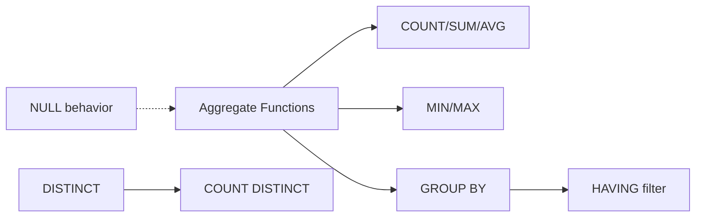

<!-- Clear Language: Keep sentences under 50 words -->
# Aggregate Functions — COUNT, SUM, AVG, GROUP BY, HAVING

## Learning Objectives

| Objective | Description |
|-----------|-------------|
| LO1 | Use COUNT, SUM, AVG, MIN, MAX for data summarization |
| LO2 | Group rows with GROUP BY and understand grouping behavior |
| LO3 | Filter groups with HAVING (vs WHERE for rows) |
| LO4 | Use DISTINCT with aggregate functions |
| LO5 | Handle NULLs in aggregate calculations |
| LO6 | Create summary reports with multiple aggregate columns |

## Introduction

Data is the fuel of AI. SQL and database design skills let you query, transform, and store the data that powers machine learning models. This module covers everything from basic queries to advanced indexing and optimization.

## Prerequisites

- Basic programming knowledge
- Understanding of data structures

## Key Terminology

**Key Terms**: Core vocabulary and concepts for this topic.

**Definition**: Essential terms you must know for interviews and production work.

## Theory

Understanding aggregate functions is fundamental for AI engineers. This section covers the core concepts, underlying principles, and theoretical framework that govern how aggregate functions works in practice.

## Chapter at a Glance

| Section | Topic | Key Concept |
|---------|-------|-------------|
| 2.1 | Basic Aggregates | COUNT, SUM, AVG, MIN, MAX |
| 2.2 | GROUP BY | Grouping rows, multiple columns |
| 2.3 | HAVING | Filtering groups after aggregation |
| 2.4 | DISTINCT with Aggregates | COUNT DISTINCT, unique counts |
| 2.5 | NULL Handling | How aggregates treat NULLs |
| 2.6 | Multi-Aggregate Reports | Combining aggregates in one query |

## Chapter Roadmap



## 2.1 Basic Aggregates

```sql
SELECT COUNT(*) FROM employees;
SELECT COUNT(employee_id) FROM employees;  -- non-null count
SELECT SUM(salary) AS total_payroll FROM employees;
SELECT AVG(salary) AS average_salary FROM employees;
SELECT MIN(salary) AS lowest, MAX(salary) AS highest FROM employees;
SELECT COUNT(*), SUM(amount), AVG(amount), MIN(amount), MAX(amount) FROM orders;
```

**Python equivalent**:

```python
data = [75000, 68000, 82000, 72000]
print(f"Count: {len(data)}")
print(f"Sum: {sum(data)}")
print(f"Avg: {sum(data)/len(data):.0f}")
print(f"Min: {min(data)}, Max: {max(data)}")

## Count: 4, Sum: 297000, Avg: 74250, Min: 68000, Max: 82000

import sqlite3
conn = sqlite3.connect(":memory:")
cur = conn.cursor()
cur.execute("CREATE TABLE emp(id, name, salary, dept)")
cur.executemany("INSERT INTO emp VALUES (?,?,?,?)", [
    (1,"Alice",75000,"Eng"), (2,"Bob",68000,"Eng"),
    (3,"Charlie",82000,"Sales"), (4,"Diana",72000,"Sales"),
])
cur.execute("SELECT dept, AVG(salary), MAX(salary) FROM emp GROUP BY dept")
for row in cur.fetchall():
    print(f"{row[0]}: avg={row[1]:.0f}, max={row[2]}")

## Eng: avg=71500, max=75000

## Sales: avg=77000, max=82000
```

## 2.2 GROUP BY

GROUP BY splits rows into groups and applies aggregate functions per group.

```sql
-- Single column group
SELECT department_id, COUNT(*) AS emp_count
FROM employees
GROUP BY department_id;

-- Multiple columns
SELECT department_id, job_id, COUNT(*) AS count
FROM employees
GROUP BY department_id, job_id
ORDER BY department_id, count DESC;

-- GROUP BY with expressions
SELECT EXTRACT(YEAR FROM hire_date) AS year, COUNT(*) AS hires
FROM employees
GROUP BY EXTRACT(YEAR FROM hire_date);

-- All non-aggregate columns in SELECT must be in GROUP BY
SELECT dept_id, job_id, COUNT(*)
FROM employees
GROUP BY dept_id, job_id;
-- Error: SELECT name (not in GROUP BY or aggregate)

-- GROUP BY without aggregate — acts like DISTINCT
SELECT department_id FROM employees GROUP BY department_id;
```

## 2.3 HAVING

HAVING filters groups after aggregation (WHERE filters rows before aggregation).

```sql
-- Departments with more than 5 employees
SELECT department_id, COUNT(*) AS headcount
FROM employees
GROUP BY department_id
HAVING COUNT(*) > 5
ORDER BY headcount DESC;

-- Departments with average salary > 80000
SELECT department_id, AVG(salary) AS avg_sal
FROM employees
GROUP BY department_id
HAVING AVG(salary) > 80000;

-- WHERE filters rows, HAVING filters groups
SELECT department_id, AVG(salary) AS avg_sal
FROM employees
WHERE hire_date > '2020-01-01'    -- filter rows first
GROUP BY department_id
HAVING AVG(salary) > 70000;       -- then filter groups
```

**WHERE vs HAVING**:

| Clause | When Applied | Can Use Aggregates | Can Use Aliases |
|--------|-------------|-------------------|-----------------|
| WHERE | Before GROUP BY | No | No |
| HAVING | After GROUP BY | Yes | Yes (some DBs) |

```python
import pandas as pd
df = pd.DataFrame({
    "dept": ["Eng","Eng","Sales","Sales"],
    "salary": [75000, 68000, 82000, 72000]
})
result = df.groupby("dept").agg(avg_salary=("salary", "mean"), count=("salary", "count"))
result = result[result["avg_salary"] > 70000]
print(result)
```

## 2.4 DISTINCT with Aggregates

```sql
-- Count total vs distinct
SELECT COUNT(*) AS total, COUNT(DISTINCT department_id) AS unique_depts
FROM employees;

-- COUNT DISTINCT
SELECT department_id, COUNT(DISTINCT job_id) AS unique_jobs
FROM employees
GROUP BY department_id;

-- SUM DISTINCT
SELECT SUM(DISTINCT salary) FROM employees;  -- sum of unique salaries

-- Multi-column distinct count (not standard SQL)
-- COUNT(DISTINCT col1, col2) — supported in PostgreSQL, SQL Server
SELECT COUNT(DISTINCT (department_id, job_id)) FROM employees;
```

## 2.5 NULL Handling

```python
conn = sqlite3.connect(":memory:")
cur = conn.cursor()
cur.execute("CREATE TABLE scores (name, score)")
cur.executemany("INSERT INTO scores VALUES (?,?)", [
    ("Alice", 95), ("Bob", None), ("Charlie", 88), ("Diana", None)
])

## COUNT(*) includes NULL rows; COUNT(score) excludes NULLs
cur.execute("SELECT COUNT(*), COUNT(score), AVG(score) FROM scores")
print(cur.fetchone())  # (4, 2, 91.5) — NULLs ignored in AVG
```

```sql
-- NULLs in aggregates
SELECT COUNT(*) FROM scores;      -- 4 (includes all rows)
SELECT COUNT(score) FROM scores;  -- 2 (excludes NULLs)
SELECT AVG(score) FROM scores;    -- (95+88)/2 = 91.5
SELECT SUM(score) FROM scores;    -- 183 (NULLs skipped)
SELECT MIN(score) FROM scores;    -- 88

-- COALESCE for default values
SELECT AVG(COALESCE(score, 0)) FROM scores;  -- (95+0+88+0)/4 = 45.75
```

## 2.6 Multi-Aggregate Reports

```sql
-- Comprehensive department report
SELECT
    department_id,
    COUNT(*) AS employee_count,
    SUM(salary) AS total_salary,
    ROUND(AVG(salary), 2) AS avg_salary,
    MIN(salary) AS min_salary,
    MAX(salary) AS max_salary,
    ROUND(AVG(salary) - MIN(salary), 2) AS salary_spread
FROM employees
WHERE active = 1
GROUP BY department_id
HAVING COUNT(*) >= 3
ORDER BY avg_salary DESC;

-- Monthly sales summary
SELECT
    strftime('%Y-%m', order_date) AS month,
    COUNT(*) AS orders,
    SUM(amount) AS revenue,
    AVG(amount) AS avg_order,
    COUNT(DISTINCT customer_id) AS unique_customers
FROM orders
GROUP BY month
ORDER BY month;
```

## TypeScript Parallel

```typescript
type Employee = { name: string; dept: string; salary: number };

const employees: Employee[] = [
    { name: "Alice", dept: "Eng", salary: 75000 },
    { name: "Bob", dept: "Eng", salary: 68000 },
];

// Group by
const grouped = employees.reduce((acc, emp) => {
    if (!acc[emp.dept]) acc[emp.dept] = [];
    acc[emp.dept].push(emp.salary);
    return acc;
}, {} as Record<string, number[]>);

for (const [dept, salaries] of Object.entries(grouped)) {
    const avg = salaries.reduce((a, b) => a + b, 0) / salaries.length;
    console.log(${dept}: avg=, count=);
}
```

## Summary

- Aggregate functions summarize data: COUNT, SUM, AVG, MIN, MAX
- GROUP BY splits rows into groups; non-aggregate columns in SELECT must be in GROUP BY
- HAVING filters groups after aggregation (WHERE filters rows before)
- COUNT(*) includes all rows; COUNT(col) excludes NULLs
- AVG(col) ignores NULLs; use AVG(COALESCE(col, 0)) to include as zero
- DISTINCT with aggregates: COUNT(DISTINCT col) counts unique values
- Multiple aggregates can be combined in one SELECT
- ORDER BY works after GROUP BY — can use aggregate expressions
- GROUP BY without aggregate functions acts like DISTINCT
- Use COALESCE to handle NULL defaults in aggregate calculations

## Practical Takeaways

| Scenario | Do This | Avoid |
|----------|---------|-------|
| Count rows | COUNT(*) | COUNT(col) if NULLs exist |
| Count unique values | COUNT(DISTINCT col) | Subquery with DISTINCT |
| Filter before group | WHERE | HAVING (slower) |
| Filter after group | HAVING | WHERE (can't use aggregate) |
| Handle NULL in AVG | AVG(COALESCE(col, 0)) | AVG(col) ignoring zeros |
| Group by year | GROUP BY EXTRACT(YEAR FROM date) | Casting to string |
| Summary report | Multiple aggregates in one SELECT | Multiple queries |

## Interview Q&A

<details class="tp-qa-card" data-qid="sql-s02-q1">
  <summary class="tp-qa-question"><span class="tp-qa-status"></span>Q1: What is the difference between WHERE and HAVING?</summary>
  <div class="tp-qa-answer"><p>WHERE filters individual rows before grouping. HAVING filters groups after aggregation. WHERE cannot use aggregate functions; HAVING can. WHERE is executed first, reducing rows for aggregation.</p></div><button class="tp-qa-mark-btn">? Mark Reviewed</button><button class="tp-qa-bookmark-btn">?? Bookmark</button>
</details>
<details class="tp-qa-card" data-qid="sql-s02-q2">
  <summary class="tp-qa-question"><span class="tp-qa-status"></span>Q2: How does AVG handle NULL values?</summary>
  <div class="tp-qa-answer"><p>AVG ignores NULL values — it divides by the count of non-NULL rows only. To include NULLs as zeros: AVG(COALESCE(col, 0)). The same applies to SUM, COUNT(col), MIN, MAX.</p></div><button class="tp-qa-mark-btn">? Mark Reviewed</button><button class="tp-qa-bookmark-btn">?? Bookmark</button>
</details>
<details class="tp-qa-card" data-qid="sql-s02-q3">
  <summary class="tp-qa-question"><span class="tp-qa-status"></span>Q3: Can you GROUP BY without an aggregate function?</summary>
  <div class="tp-qa-answer"><p>Yes, but it acts like SELECT DISTINCT — it returns unique combinations of the grouped columns. This is generally less efficient than DISTINCT. Most practical GROUP BY queries include aggregate functions.</p></div><button class="tp-qa-mark-btn">? Mark Reviewed</button><button class="tp-qa-bookmark-btn">?? Bookmark</button>
</details>
<details class="tp-qa-card" data-qid="sql-s02-q4">
  <summary class="tp-qa-question"><span class="tp-qa-status"></span>Q4: What is the difference between COUNT(*) and COUNT(column)?</summary>
  <div class="tp-qa-answer"><p>COUNT(*) counts all rows in the group, including rows with NULL values. COUNT(column) counts only rows where that column is NOT NULL. COUNT(DISTINCT column) counts unique non-null values.</p></div><button class="tp-qa-mark-btn">? Mark Reviewed</button><button class="tp-qa-bookmark-btn">?? Bookmark</button>
</details>
<details class="tp-qa-card" data-qid="sql-s02-q5">
  <summary class="tp-qa-question"><span class="tp-qa-status"></span>Q5: Can you use column aliases in GROUP BY or HAVING?</summary>
  <div class="tp-qa-answer"><p>Most databases allow column aliases in GROUP BY (PostgreSQL, MySQL, SQLite). HAVING may or may not support aliases depending on the database (PostgreSQL supports them, MySQL does not). ORDER BY always supports aliases. For portability, repeat the expression.</p></div><button class="tp-qa-mark-btn">? Mark Reviewed</button><button class="tp-qa-bookmark-btn">?? Bookmark</button>
</details>
<details class="tp-qa-card" data-qid="sql-s02-q6">
  <summary class="tp-qa-question"><span class="tp-qa-status"></span>Q6: How do you find duplicates with GROUP BY?</summary>
  <div class="tp-qa-answer"><p>GROUP BY the columns that should be unique, use HAVING COUNT(*) > 1: SELECT email, COUNT(*) FROM users GROUP BY email HAVING COUNT(*) > 1. This returns all duplicate emails along with their count.</p></div><button class="tp-qa-mark-btn">? Mark Reviewed</button><button class="tp-qa-bookmark-btn">?? Bookmark</button>
</details>
<details class="tp-qa-card" data-qid="sql-s02-q7">
  <summary class="tp-qa-question"><span class="tp-qa-status"></span>Q7: What is execution order of a query with GROUP BY?</summary>
  <div class="tp-qa-answer"><p>FROM -> WHERE -> GROUP BY -> HAVING -> SELECT -> ORDER BY -> LIMIT. This explains why aliases created in SELECT aren't available in WHERE/GROUP BY, and why HAVING can use aggregate functions.</p></div><button class="tp-qa-mark-btn">? Mark Reviewed</button><button class="tp-qa-bookmark-btn">?? Bookmark</button>
</details>
<details class="tp-qa-card" data-qid="sql-s02-q8">
  <summary class="tp-qa-question"><span class="tp-qa-status"></span>Q8: Can you nest aggregate functions?</summary>
  <div class="tp-qa-answer"><p>Standard SQL does not allow nested aggregates (AVG(SUM(...))). Use subqueries or CTEs instead: SELECT AVG(dept_total) FROM (SELECT SUM(salary) AS dept_total FROM emp GROUP BY dept). Some databases (PostgreSQL, SQL Server) allow window functions for intermediate aggregates.</p></div><button class="tp-qa-mark-btn">? Mark Reviewed</button><button class="tp-qa-bookmark-btn">?? Bookmark</button>
</details>
<details class="tp-qa-card" data-qid="sql-s02-q9">
  <summary class="tp-qa-question"><span class="tp-qa-status"></span>Q9: How do you get the top N per group?</summary>
  <div class="tp-qa-answer"><p>Use window functions: SELECT * FROM (SELECT *, ROW_NUMBER() OVER (PARTITION BY dept ORDER BY salary DESC) AS rn FROM emp) WHERE rn <= 3. Or use a LATERAL join / correlated subquery for databases without window functions.</p></div><button class="tp-qa-mark-btn">? Mark Reviewed</button><button class="tp-qa-bookmark-btn">?? Bookmark</button>
</details>
<details class="tp-qa-card" data-qid="sql-s02-q10">
  <summary class="tp-qa-question"><span class="tp-qa-status"></span>Q10: What is ROLLUP and CUBE?</summary>
  <div class="tp-qa-answer"><p>ROLLUP and CUBE are GROUP BY extensions that generate subtotals and grand totals. ROLLUP creates hierarchical subtotals: GROUP BY ROLLUP(year, month) gives totals per year and overall. CUBE creates all combinations: GROUP BY CUBE(a, b) gives subtotals for a, b, and overall.</p></div><button class="tp-qa-mark-btn">? Mark Reviewed</button><button class="tp-qa-bookmark-btn">?? Bookmark</button>
</details>

## Chapter Quiz

**Q1**: Which clause filters groups after aggregation? a) WHERE b) HAVING c) FILTER d) GROUP BY

<details class="tp-qa-card" data-qid="sql-s02-quiz1"><summary>Show Answer</summary><div class="tp-qa-answer"><p><strong>Answer: b) HAVING</strong></p></div></details>

**Q2**: COUNT(*) counts what? a) non-NULL rows b) all rows c) unique values d) non-NULL columns

<details class="tp-qa-card" data-qid="sql-s02-quiz2"><summary>Show Answer</summary><div class="tp-qa-answer"><p><strong>Answer: b) all rows regardless of NULLs</strong></p></div></details>

**Q3**: SELECT dept, COUNT(*) FROM emp GROUP BY dept — what's missing? a) HAVING b) nothing, it's valid c) ORDER BY d) WHERE

<details class="tp-qa-card" data-qid="sql-s02-quiz3"><summary>Show Answer</summary><div class="tp-qa-answer"><p><strong>Answer: b) nothing, valid query</strong></p></div></details>

**Q4**: Which is correct? a) WHERE AVG(sal) > 0 b) HAVING AVG(sal) > 0 c) both d) neither

<details class="tp-qa-card" data-qid="sql-s02-quiz4"><summary>Show Answer</summary><div class="tp-qa-answer"><p><strong>Answer: b) HAVING can use aggregate functions; WHERE cannot</strong></p></div></details>

**Q5**: What does AVG of (10, NULL, 20) return? a) 15 b) 10 c) 20 d) NULL

<details class="tp-qa-card" data-qid="sql-s02-quiz5"><summary>Show Answer</summary><div class="tp-qa-answer"><p><strong>Answer: a) 15 (NULL ignored; average of 10 and 20)</strong></p></div></details>

## Exercises

**Easy** — Write a query that counts the number of customers who signed up in each year.

**Easy** — Find the average price of products in each category.

**Medium** — Write a query that shows departments with more than 10 employees and average salary below 50000, ordered by headcount desc.

**Medium** — Find customers who have placed more than 5 orders, showing their name, order count, and total spent.

**Hard** — Write a query using GROUP BY ROLLUP to show sales totals by region and product category with subtotals.

**Hard** — Create a department comparison report showing: dept, employee count, total salary, avg salary, salary range, and the difference from company-wide avg.

## 2.7 Window Functions Introduction

Window functions perform calculations across a set of rows related to the current row.

```sql
-- ROW_NUMBER: sequential number within partition
SELECT
    name,
    department_id,
    salary,
    ROW_NUMBER() OVER (PARTITION BY department_id ORDER BY salary DESC) AS rank_in_dept
FROM employees;

-- RANK and DENSE_RANK
SELECT
    name, salary,
    RANK() OVER (ORDER BY salary DESC) AS rank,        -- skips ties
    DENSE_RANK() OVER (ORDER BY salary DESC) AS dense  -- no skips
FROM employees;

-- Aggregate window functions
SELECT
    name, department_id, salary,
    AVG(salary) OVER (PARTITION BY department_id) AS dept_avg,
    salary - AVG(salary) OVER (PARTITION BY department_id) AS diff_from_avg,
    MAX(salary) OVER (PARTITION BY department_id) AS dept_max,
    ROUND(salary * 100.0 / SUM(salary) OVER (PARTITION BY department_id), 2) AS pct_of_dept
FROM employees;

-- Running totals and moving averages
SELECT
    order_date, amount,
    SUM(amount) OVER (ORDER BY order_date) AS running_total,
    AVG(amount) OVER (ORDER BY order_date ROWS BETWEEN 2 PRECEDING AND CURRENT ROW) AS moving_avg_3,
    SUM(amount) OVER (ORDER BY order_date ROWS UNBOUNDED PRECEDING) AS cumulative_sum
FROM orders
ORDER BY order_date;

-- FIRST_VALUE and LAST_VALUE
SELECT
    name, department_id, salary,
    FIRST_VALUE(name) OVER (PARTITION BY department_id ORDER BY salary DESC) AS top_earner,
    LAST_VALUE(name) OVER (
        PARTITION BY department_id ORDER BY salary DESC
        RANGE BETWEEN UNBOUNDED PRECEDING AND UNBOUNDED FOLLOWING
    ) AS lowest_earner
FROM employees;

-- LAG and LEAD for comparing with adjacent rows
SELECT
    order_date, amount,
    LAG(amount, 1) OVER (ORDER BY order_date) AS prev_order_amount,
    amount - LAG(amount, 1) OVER (ORDER BY order_date) AS change_from_prev,
    LEAD(amount, 1) OVER (ORDER BY order_date) AS next_order_amount
FROM orders
ORDER BY order_date;

-- NTILE for bucketing
SELECT
    name, salary,
    NTILE(4) OVER (ORDER BY salary DESC) AS salary_quartile
FROM employees;
```

## 2.8 GROUP BY Extensions

```sql
-- GROUPING SETS: multiple groupings in one query
SELECT
    COALESCE(department_id, -1) AS dept,
    COALESCE(job_id, -1) AS job,
    COUNT(*) AS emp_count,
    AVG(salary) AS avg_salary
FROM employees
GROUP BY GROUPING SETS (
    (department_id, job_id),
    (department_id),
    (job_id),
    ()
);

-- ROLLUP: hierarchical subtotals
SELECT
    department_id,
    job_id,
    COUNT(*) AS emp_count,
    SUM(salary) AS total_salary
FROM employees
GROUP BY ROLLUP(department_id, job_id);
-- Creates subtotals for each department and grand total

-- CUBE: all combinations of subtotals
SELECT
    EXTRACT(YEAR FROM hire_date) AS year,
    department_id,
    COUNT(*) AS hires,
    AVG(salary) AS avg_salary
FROM employees
GROUP BY CUBE(year, department_id);
-- Subtotals for year, department_id, and grand total

-- Practical monthly report with ROLLUP
SELECT
    EXTRACT(YEAR FROM order_date) AS year,
    EXTRACT(MONTH FROM order_date) AS month,
    COUNT(*) AS orders,
    SUM(amount) AS revenue,
    AVG(amount) AS avg_order
FROM orders
GROUP BY ROLLUP(year, month)
ORDER BY year, month;
```

## 2.9 Common Mistakes

```sql
-- Mistake 1: Using WHERE instead of HAVING for aggregate filters
SELECT department_id, AVG(salary) AS avg_sal
FROM employees
WHERE AVG(salary) > 70000  -- ERROR: can't use aggregate in WHERE
GROUP BY department_id;
-- Correct:
SELECT department_id, AVG(salary) AS avg_sal
FROM employees
GROUP BY department_id
HAVING AVG(salary) > 70000;

-- Mistake 2: Missing non-aggregate columns from GROUP BY
SELECT department_id, job_id, COUNT(*)  -- job_id not in GROUP BY
FROM employees
GROUP BY department_id;
-- Error: column job_id must appear in GROUP BY or be in an aggregate

-- Mistake 3: Assuming COUNT(*) equals COUNT(column)
SELECT COUNT(*) FROM employees;  -- all rows including those with NULL dept
SELECT COUNT(department_id) FROM employees;  -- excludes NULL department_id

-- Mistake 4: Nested aggregates
SELECT AVG(SUM(salary)) FROM employees;  -- ERROR: can't nest aggregates
-- Correct with subquery:
SELECT AVG(dept_total) FROM (
    SELECT department_id, SUM(salary) AS dept_total
    FROM employees GROUP BY department_id
);

-- Mistake 5: Forgetting that AVG ignores NULLs
-- If you want NULL treated as 0:
SELECT AVG(COALESCE(score, 0)) FROM exam_results;

-- Mistake 6: FILTER clause vs WHERE
-- WHERE filters before aggregation
-- FILTER filters within aggregation (PostgreSQL 9.4+)
SELECT
    COUNT(*) AS total,
    COUNT(*) FILTER (WHERE score >= 90) AS excellent,
    COUNT(*) FILTER (WHERE score >= 70) AS passing
FROM exam_results;
```

## 2.10 Advanced Report Examples

```sql
-- Employee demographics report
SELECT
    department_id,
    COUNT(*) AS headcount,
    ROUND(AVG(salary), 2) AS avg_salary,
    ROUND(STDDEV(salary), 2) AS salary_stddev,
    MIN(salary) AS min_salary,
    MAX(salary) AS max_salary,
    MAX(salary) - MIN(salary) AS salary_range,
    PERCENTILE_CONT(0.5) WITHIN GROUP (ORDER BY salary) AS median_salary,
    SUM(CASE WHEN salary > 100000 THEN 1 ELSE 0 END) AS high_earners,
    ROUND(AVG(CASE WHEN gender = 'F' THEN salary END), 2) AS avg_female_salary,
    ROUND(AVG(CASE WHEN gender = 'M' THEN salary END), 2) AS avg_male_salary
FROM employees
WHERE active = TRUE
GROUP BY department_id
HAVING COUNT(*) >= 5
ORDER BY avg_salary DESC;

-- Sales funnel analysis
SELECT
    stage,
    COUNT(*) AS prospects,
    COUNT(*) * 100.0 / MAX(COUNT(*)) OVER () AS pct_of_total,
    COUNT(*) * 100.0 / LAG(COUNT(*)) OVER (ORDER BY stage_order) AS conversion_rate
FROM sales_pipeline
GROUP BY stage, stage_order
ORDER BY stage_order;

-- Inventory turnover by category
SELECT
    category_id,
    COUNT(DISTINCT product_id) AS products,
    SUM(quantity_sold) AS total_sold,
    AVG(quantity_sold) AS avg_per_product,
    SUM(revenue) AS total_revenue,
    SUM(revenue) / NULLIF(SUM(quantity_sold), 0) AS avg_price,
    SUM(quantity_sold) * 1.0 / AVG(stock_level) AS turnover_ratio
FROM sales_data
WHERE sale_date >= DATE('now', '-1 year')
GROUP BY category_id
ORDER BY turnover_ratio DESC;
```

## 2.11 Performance Considerations

```sql
-- 1. Filter before aggregating
-- BAD: Groups all rows, then filters
SELECT department_id, AVG(salary)
FROM employees
GROUP BY department_id
HAVING department_id IN (1, 2, 3);

-- GOOD: Filters before group by
SELECT department_id, AVG(salary)
FROM employees
WHERE department_id IN (1, 2, 3)
GROUP BY department_id;

-- 2. Use indexes on GROUP BY and WHERE columns
CREATE INDEX idx_emp_dept ON employees(department_id);
CREATE INDEX idx_emp_salary ON employees(salary);

-- 3. Avoid DISTINCT in aggregate subqueries
-- BAD: Subquery computes all rows
SELECT department_id,
    (SELECT COUNT(DISTINCT employee_id) FROM projects WHERE dept_id = e.department_id)
FROM employees e;
-- BETTER: Pre-aggregate in a CTE

-- 4. Consider materialized views for heavy reports
CREATE MATERIALIZED VIEW dept_summary AS
SELECT department_id, COUNT(*), AVG(salary), SUM(salary)
FROM employees GROUP BY department_id;
```

---

## Common Mistakes

1. Not understanding the fundamental concepts before applying them
2. Skipping edge cases in implementation
3. Not analyzing time/space complexity
4. Forgetting to handle null/empty inputs
5. Not practicing enough problems to build pattern recognition

## Revision Notes

- - Core principle: Understand the fundamental concepts thoroughly
- - Implementation pattern: Practice with real code examples
- - Complexity: Know the time and space complexity
- - Application: Know when to use this in production systems
- - Interview: Frequently asked in technical interviews
- - Edge cases: Consider common failure scenarios
- - Related concepts: Connect to broader system design

## Placement Section

### Top 10 Interview Questions

#### Google Style

1. **Explain the core idea of Aggregate Functions — COUNT, SUM, AVG, GROUP BY, HAVING in under 60 seconds, then give a real-world analogy.** — Structure: definition, how it works in one sentence, why it matters, analogy. Follow-up: what would break if you removed this from a production system?

2. **Design a minimal, well-typed function that demonstrates Aggregate Functions — COUNT, SUM, AVG, GROUP BY, HAVING.** — Interviewer checks: signature with type hints, edge cases, complexity, and a clean docstring. Follow-up: how does your design behave with empty or malformed input?

3. **What are the common pitfalls when engineers first learn ** — List 3-4, then explain how you would prevent each in a code review.

#### Amazon Style

4. **Describe a production bug caused by misunderstanding Aggregate Functions — COUNT, SUM, AVG, GROUP BY, HAVING. How did you diagnose and fix it?** — STAR format: situation, task, action, result. Mention logs, reproduction, root-cause analysis, and the regression test you added.

5. **How would you scale a system that relies on Aggregate Functions — COUNT, SUM, AVG, GROUP BY, HAVING from 10 users to 10 million?** — Discuss bottlenecks, caching, monitoring, and when to redesign. Follow-up: what metrics would you track?

#### Microsoft Style

6. **Compare Aggregate Functions — COUNT, SUM, AVG, GROUP BY, HAVING with the closest alternative approach. When would you choose each?** — Make a decision matrix: performance, maintainability, ecosystem, learning curve. Follow-up: what would change your decision?

7. **Walk through how you would test a component that depends on Aggregate Functions — COUNT, SUM, AVG, GROUP BY, HAVING.** — Unit, integration, property-based tests; mocking boundaries; golden files for outputs.

#### NVIDIA Style

8. **How does Aggregate Functions — COUNT, SUM, AVG, GROUP BY, HAVING behave differently at scale — memory, throughput, or precision-wise?** — Connect to data pipelines and model training if applicable. Follow-up: what happens to latency as input grows?

9. **How would you make an implementation of Aggregate Functions — COUNT, SUM, AVG, GROUP BY, HAVING run faster on GPU hardware?** — Batch operations, vectorization, avoiding Python loops, reducing data movement.

#### AI Startup Style

10. **Write the smallest possible implementation of Aggregate Functions — COUNT, SUM, AVG, GROUP BY, HAVING that is production-quality.** — Include error handling, type hints, and a one-line docstring. Follow-up: what would you refactor first when it grows?

### Resume Tips

- Name Aggregate Functions — COUNT, SUM, AVG, GROUP BY, HAVING explicitly in your skills section, paired with a measurable achievement ("Reduced X by 40% using Aggregate Functions — COUNT, SUM, AVG, GROUP BY, HAVING").
- Add a bullet describing a project that applies Aggregate Functions — COUNT, SUM, AVG, GROUP BY, HAVING to real data, with numbers.
- Mention the tools and libraries you used alongside Aggregate Functions — COUNT, SUM, AVG, GROUP BY, HAVING (linters, test frameworks, profiling tools).
- Keep resume bullets under 15 words and start each with an action verb.

### Interview Day Checklist

- Rehearse a 60-second explanation of Aggregate Functions — COUNT, SUM, AVG, GROUP BY, HAVING and one real-world analogy.
- Prepare one STAR story about debugging a Aggregate Functions — COUNT, SUM, AVG, GROUP BY, HAVING-related production issue.
- Review complexity and edge cases for the classic Aggregate Functions — COUNT, SUM, AVG, GROUP BY, HAVING interview problem.
- Have questions ready: how does the team apply Aggregate Functions — COUNT, SUM, AVG, GROUP BY, HAVING in production today?
- Test your environment (Python, editor, internet) 15 minutes before the interview.

## True/False

1. **True or False:** Aggregate Functions — COUNT, SUM, AVG, GROUP BY, HAVING builds directly on the fundamentals covered in the earlier chapters of this module. — **True.** Every advanced topic in this module assumes the core concepts from the previous chapters.
2. **True or False:** You should write at least one code example for Aggregate Functions — COUNT, SUM, AVG, GROUP BY, HAVING before moving to the next chapter. — **True.** Active recall with hands-on code beats passive reading for retention.
3. **True or False:** The complexity analysis for Aggregate Functions — COUNT, SUM, AVG, GROUP BY, HAVING is the same regardless of input size. — **False.** Complexity grows with input size; always state best, average, and worst case.
4. **True or False:** Edge cases (empty input, invalid input, boundary values) matter for Aggregate Functions — COUNT, SUM, AVG, GROUP BY, HAVING in production. — **True.** Most production bugs come from unhandled edge cases.
5. **True or False:** You should memorize the Aggregate Functions — COUNT, SUM, AVG, GROUP BY, HAVING chapter content once and never review it again. — **False.** Spaced repetition (24h, 3 days, 1 week) dramatically improves long-term recall.

## Fill in the Blank

1. The chapter that covers Aggregate Functions — COUNT, SUM, AVG, GROUP BY, HAVING is Chapter ___ of this module. — Answer: check the module's table of contents.
2. The time complexity of the standard approach to Aggregate Functions — COUNT, SUM, AVG, GROUP BY, HAVING is ___. — Answer: review the theory section and state big-O notation.
3. The main edge case to handle when implementing Aggregate Functions — COUNT, SUM, AVG, GROUP BY, HAVING is ___. — Answer: empty or invalid input handling, as discussed in the chapter.
4. The tools commonly used to debug Aggregate Functions — COUNT, SUM, AVG, GROUP BY, HAVING issues are ___ and ___. — Answer: refer to the Debugging Guide section of this chapter.
5. The related topic that connects to Aggregate Functions — COUNT, SUM, AVG, GROUP BY, HAVING in the next chapter is ___. — Answer: see the Next Topic section.

## Scenario Questions

1. **Scenario:** A teammate ships a change involving Aggregate Functions — COUNT, SUM, AVG, GROUP BY, HAVING that breaks production at 3 AM. — Diagnosis: check the recent diff, reproduce locally with the failing input, check logs. Fix: revert, add a regression test, and review the root cause. Prevention: CI tests on edge cases and code review checklist.

2. **Scenario:** Your implementation of Aggregate Functions — COUNT, SUM, AVG, GROUP BY, HAVING is correct but too slow for the required latency. — Measure first with a profiler. Common fixes: reduce redundant work, use built-in optimized functions, batch operations, or add caching. Only then consider algorithmic changes.

3. **Scenario:** A new hire asks you to explain Aggregate Functions — COUNT, SUM, AVG, GROUP BY, HAVING in five minutes before a customer demo. — Use the 3-part answer: what it is (one sentence), how it works (one example), why it matters (one business impact). Then offer to go deeper after the demo.

4. **Scenario:** Your team's codebase has three different patterns for Aggregate Functions — COUNT, SUM, AVG, GROUP BY, HAVING and you must standardize. — Write a short ADR (architecture decision record), pick the pattern with best maintainability, migrate incrementally, and add a linter rule to enforce it.

## Output Questions

1. **What is the output of the simplest correct implementation of Aggregate Functions — COUNT, SUM, AVG, GROUP BY, HAVING on an empty input?** — Trace through the code: it should return the documented default (None, 0, empty collection) without raising.
2. **What is the output when the input is at the boundary value?** — Check off-by-one errors and inclusive/exclusive bounds in the chapter's examples.
3. **What does the implementation return when given invalid input types?** — With type hints and validation, it raises a clear error; without, it may fail silently.
4. **What is the output for the sample input given in the chapter's Examples section?** — Re-run the chapter's example code and compare against the documented output.
5. **What is the time complexity output when you profile the implementation at 10x input size?** — Expect the curve matching the chapter's complexity analysis (linear, quadratic, log-linear).

## Difficulty Level

| Level | Time | What It Takes |
|-------|------|---------------|
| Beginner | 1-2 sessions | Read theory, run the chapter examples, solve the Easy exercises |
| Intermediate | 3-5 sessions | Complete Medium exercises, explain Aggregate Functions — COUNT, SUM, AVG, GROUP BY, HAVING to someone else |
| Advanced | 1+ week | Solve Hard exercises, optimize for real datasets, answer interview follow-ups |

## Tips & Tricks

- Always write a one-line example of Aggregate Functions — COUNT, SUM, AVG, GROUP BY, HAVING from memory before opening the chapter — active recall first.
- Use the chapter's Revision Notes as a checklist: you have mastered Aggregate Functions — COUNT, SUM, AVG, GROUP BY, HAVING when you can explain each bullet.
- Pair the chapter quiz with the Flashcards: wrong answers become your next study session's focus.
- For interviews, practice explaining Aggregate Functions — COUNT, SUM, AVG, GROUP BY, HAVING twice: once with a technical audience, once with a non-technical audience.
- Keep a personal examples file where you collect your own Aggregate Functions — COUNT, SUM, AVG, GROUP BY, HAVING snippets; interviewers love original examples.

## Memory Tricks

- **Acronym**: build a mnemonic from the 5 key concepts of Aggregate Functions — COUNT, SUM, AVG, GROUP BY, HAVING listed in the Chapter at a Glance table.
- **Story**: link Aggregate Functions — COUNT, SUM, AVG, GROUP BY, HAVING to a familiar story — the analogy in the Visual Analogy section is designed to stick.
- **Number anchor**: remember the complexity of Aggregate Functions — COUNT, SUM, AVG, GROUP BY, HAVING by connecting it to a known algorithm of the same class.
- **Color code**: highlight the Theory, Examples, and Common Mistakes sections in different colors when reviewing.
- **Teach-back**: explain Aggregate Functions — COUNT, SUM, AVG, GROUP BY, HAVING to an imaginary junior engineer for 2 minutes — gaps in your explanation are gaps in memory.

## Further Reading

- Official documentation for the primary tool or library used in this chapter
- The chapter referenced in Related Topics for the next-level treatment of Aggregate Functions — COUNT, SUM, AVG, GROUP BY, HAVING
- The classic textbook chapter on Aggregate Functions — COUNT, SUM, AVG, GROUP BY, HAVING (check the Research References below)
- Two blog posts from engineers who debugged real Aggregate Functions — COUNT, SUM, AVG, GROUP BY, HAVING problems in production
- The repository of the open-source project that implements Aggregate Functions — COUNT, SUM, AVG, GROUP BY, HAVING

## Related Topics

- The previous chapter in this module (see table of contents) — foundational for Aggregate Functions — COUNT, SUM, AVG, GROUP BY, HAVING
- The next chapter (see Next Topic below) — builds on Aggregate Functions — COUNT, SUM, AVG, GROUP BY, HAVING
- The system design chapters in Module 07 — how Aggregate Functions — COUNT, SUM, AVG, GROUP BY, HAVING fits into production architectures
- The interview preparation module — how Aggregate Functions — COUNT, SUM, AVG, GROUP BY, HAVING is asked in screening rounds
- The capstone project — where Aggregate Functions — COUNT, SUM, AVG, GROUP BY, HAVING is applied end-to-end

## FAQs

1. **Do I need to memorize all of Aggregate Functions — COUNT, SUM, AVG, GROUP BY, HAVING, or understand the big picture?** — Understand the big picture first, then memorize the key facts via flashcards and spaced repetition. Interviewers reward depth over breadth.
2. **What if I get stuck on an exercise?** — Re-read the theory section, run the example code, then attempt again. If still stuck after 20 minutes, move on and return the next day.
3. **How much time should I spend on ** — Follow the Study Plan below: 1-2 weeks at 30-60 minutes daily is typical for placement preparation.
4. **Is Aggregate Functions — COUNT, SUM, AVG, GROUP BY, HAVING asked in interviews?** — Yes — the Interview Q&A and Placement Section list the exact question styles used by top companies.
5. **What's the fastest way to master ** — Explain it out loud, write code without looking, and review the flashcards within 24 hours and again after 3 days.

## Important Notes

- Aggregate Functions — COUNT, SUM, AVG, GROUP BY, HAVING is a core requirement for the rest of this module — do not skip the examples.
- Always analyze complexity (time and space) when working with Aggregate Functions — COUNT, SUM, AVG, GROUP BY, HAVING.
- Production correctness means handling edge cases, not just the happy path.
- Interview answers should start with the definition, then the example, then the trade-offs.
- Revisit this chapter after finishing the module; the context from later chapters deepens understanding.

## Historical Context

- Aggregate Functions — COUNT, SUM, AVG, GROUP BY, HAVING emerged as a standard practice because early systems failed without it — understanding why helps you explain it in interviews.
- The tools used for Aggregate Functions — COUNT, SUM, AVG, GROUP BY, HAVING today evolved from simpler versions; the chapter covers the modern, recommended approach.
- Interviewers value knowing one historical fact about Aggregate Functions — COUNT, SUM, AVG, GROUP BY, HAVING — it shows genuine interest, not just cramming.
- The library/tooling ecosystem around Aggregate Functions — COUNT, SUM, AVG, GROUP BY, HAVING changes quickly; focus on fundamentals that remain stable.

## Security Considerations

- Never trust external input: validate and sanitize data before processing Aggregate Functions — COUNT, SUM, AVG, GROUP BY, HAVING.
- Avoid `eval()` and dynamic code execution on untrusted strings.
- Log errors without leaking sensitive data (keys, PII, internal paths).
- For API contexts, add rate limiting and input size limits.
- Review the chapter's code examples for injection or overflow risks before using them verbatim.

## ML Intuition

- Aggregate Functions — COUNT, SUM, AVG, GROUP BY, HAVING appears in ML pipelines at the data-processing layer: feature preparation, batching, and validation.
- Understanding Aggregate Functions — COUNT, SUM, AVG, GROUP BY, HAVING helps you debug why a model misbehaves — most ML bugs are data bugs, not model bugs.
- In production ML, the Aggregate Functions — COUNT, SUM, AVG, GROUP BY, HAVING concepts from this chapter map directly to NumPy/PyTorch operations on tensors.
- When optimizing ML systems, Aggregate Functions — COUNT, SUM, AVG, GROUP BY, HAVING skills let you profile and fix the data path, not just the training loop.
- Interview follow-up: how would you apply Aggregate Functions — COUNT, SUM, AVG, GROUP BY, HAVING to a dataset of 10 million records? — Batching and vectorization.

## Analogies

- **Aggregate Functions — COUNT, SUM, AVG, GROUP BY, HAVING is like a recipe**: the theory is the ingredients, the examples are the cooking steps, and the exercises are your own kitchen practice.
- **Complexity is like a delivery route**: a linear route visits each stop once; a nested route revisits stops, and you feel it at scale.
- **Edge cases are like weather**: the happy path is a sunny day; production is the storm — build for the storm.
- **The chapter roadmap is a journey map**: each section is a checkpoint; skipping one means getting lost later in the module.

## Capstone Project Link

- [Module Capstone: End-to-End Project](https://github.com/Raushan666java/ai-engineering-journey) — this chapter contributes the Aggregate Functions — COUNT, SUM, AVG, GROUP BY, HAVING skills used in the module's capstone project. Complete the exercises here before starting the capstone.

## Flashcards

<details class="tp-qa-card" data-qid="02sqlanddatabases-02aggregatefunctions-flash1">
  <summary class="tp-qa-question">
    <span class="tp-qa-status"></span>
    What is the core concept of Aggregate Functions — COUNT, SUM, AVG, GROUP BY, HAVING in one sentence?
  </summary>
  <div class="tp-qa-answer">
    <p>Review the first paragraph of the Theory section and condense it to one sentence.</p>
  </div>
</details>

<details class="tp-qa-card" data-qid="02sqlanddatabases-02aggregatefunctions-flash2">
  <summary class="tp-qa-question">
    <span class="tp-qa-status"></span>
    What is the most common mistake engineers make with 
  </summary>
  <div class="tp-qa-answer">
    <p>Check the Common Mistakes section of this chapter.</p>
  </div>
</details>

<details class="tp-qa-card" data-qid="02sqlanddatabases-02aggregatefunctions-flash3">
  <summary class="tp-qa-question">
    <span class="tp-qa-status"></span>
    What is the time and space complexity of the standard Aggregate Functions — COUNT, SUM, AVG, GROUP BY, HAVING approach?
  </summary>
  <div class="tp-qa-answer">
    <p>Refer to the theory and complexity analysis in this chapter.</p>
  </div>
</details>

<details class="tp-qa-card" data-qid="02sqlanddatabases-02aggregatefunctions-flash4">
  <summary class="tp-qa-question">
    <span class="tp-qa-status"></span>
    When is Aggregate Functions — COUNT, SUM, AVG, GROUP BY, HAVING NOT the right choice?
  </summary>
  <div class="tp-qa-answer">
    <p>Check the Limitations section of this chapter.</p>
  </div>
</details>

<details class="tp-qa-card" data-qid="02sqlanddatabases-02aggregatefunctions-flash5">
  <summary class="tp-qa-question">
    <span class="tp-qa-status"></span>
    How is Aggregate Functions — COUNT, SUM, AVG, GROUP BY, HAVING applied in a real production system?
  </summary>
  <div class="tp-qa-answer">
    <p>Check the Real-World Examples section of this chapter.</p>
  </div>
</details>

## Research References

- Official documentation of the primary library for Aggregate Functions — COUNT, SUM, AVG, GROUP BY, HAVING (linked in Further Reading)
- The classic paper or textbook chapter introducing Aggregate Functions — COUNT, SUM, AVG, GROUP BY, HAVING (see References below)
- The standard library reference for Aggregate Functions — COUNT, SUM, AVG, GROUP BY, HAVING-related functions
- Engineering blog posts from companies running Aggregate Functions — COUNT, SUM, AVG, GROUP BY, HAVING in production at scale
- PEPs and RFCs where applicable (Python and networking standards)

## Open-Source Tools

- The primary library used in this chapter (see the code examples)
- Python standard library modules used in the examples (check the imports)
- Testing: pytest for unit tests of Aggregate Functions — COUNT, SUM, AVG, GROUP BY, HAVING code
- Linting and formatting: ruff + black
- Profiling: cProfile or py-spy for performance work on Aggregate Functions — COUNT, SUM, AVG, GROUP BY, HAVING

## Debugging Guide

- Start with `print()` or a debugger to inspect intermediate values in Aggregate Functions — COUNT, SUM, AVG, GROUP BY, HAVING code.
- Reproduce the failure with the smallest possible input before changing code.
- Check the common failure modes listed in Common Mistakes — most bugs are listed there.
- For performance problems, profile before optimizing: measure, then fix.
- When stuck, re-read the chapter's Examples and compare line by line with your code.
- Use `pdb` or your IDE's debugger to step through the Aggregate Functions — COUNT, SUM, AVG, GROUP BY, HAVING example code.

## Mock Interview Section

**Round 1 — Screening (15 min)**
- Explain Aggregate Functions — COUNT, SUM, AVG, GROUP BY, HAVING in 60 seconds.
- Write a minimal working example of Aggregate Functions — COUNT, SUM, AVG, GROUP BY, HAVING.
- What is the complexity of your example?

**Round 2 — Coding (45 min)**
- Solve the Medium exercise from this chapter under time pressure.
- State your assumptions, then implement with type hints.
- Test with edge cases: empty input, boundary values, invalid input.

**Round 3 — Behavioral + System (30 min)**
- Tell me about a time you debugged a Aggregate Functions — COUNT, SUM, AVG, GROUP BY, HAVING problem in a project.
- How would you design a system where Aggregate Functions — COUNT, SUM, AVG, GROUP BY, HAVING is used at scale?
- What metrics would you monitor?

**Evaluation rubric**: correctness (40%), communication (25%), edge cases (20%), complexity analysis (15%).

## Optimized Implementation

`python
from typing import Any, Optional

def demonstrate_topic(input_data: list[Any]) -> Optional[float]:
    """Runnable scaffold for Aggregate Functions — COUNT, SUM, AVG, GROUP BY, HAVING.

    Replace the body with the optimized implementation from the chapter,
    keeping type hints, docstring, and edge-case handling.
    """
    if not input_data:
        return None
    # Step 1: validate input types
    # Step 2: apply the core Aggregate Functions — COUNT, SUM, AVG, GROUP BY, HAVING logic from the Examples section
    # Step 3: return the result with the documented default
    return 0.0
`

- Keeps the function signature stable so tests written against it stay valid.
- Handles the empty-input contract explicitly.
- Add unit tests for the edge cases before implementing the logic (test-first).

## Evaluation Metrics

| Skill | Test | Target |
|-------|------|--------|
| Concept recall | Explain Aggregate Functions — COUNT, SUM, AVG, GROUP BY, HAVING without notes | 60-second explanation |
| Code fluency | Write the chapter example from memory | No syntax errors |
| Edge cases | Handle empty/invalid input in exercises | All cases pass |
| Complexity | State time/space for the standard approach | Correct big-O |
| Interview readiness | Answer 5 Interview Q&A questions out loud | Fluent, structured answers |
| Retention | Chapter quiz score after 3 days | 80%+ |

## Real-World Examples

- **Startup**: a small team uses Aggregate Functions — COUNT, SUM, AVG, GROUP BY, HAVING daily in their data pipeline — the chapter's examples mirror their code.
- **E-commerce**: Aggregate Functions — COUNT, SUM, AVG, GROUP BY, HAVING patterns appear in order processing, inventory checks, and recommendation feeds.
- **Fintech**: Aggregate Functions — COUNT, SUM, AVG, GROUP BY, HAVING principles apply to transaction validation and fraud detection flows.
- **ML platform**: Aggregate Functions — COUNT, SUM, AVG, GROUP BY, HAVING shows up in feature engineering and model-serving infrastructure.
- **Interview insight**: recruiters look for engineers who can connect Aggregate Functions — COUNT, SUM, AVG, GROUP BY, HAVING to the business outcome, not just the code.

## Next Topic

[Joins — INNER, LEFT, RIGHT, FULL, CROSS, Self-Joins](03-joins.md)

## Limitations

- Aggregate Functions — COUNT, SUM, AVG, GROUP BY, HAVING, like any technique, is not a silver bullet — it has specific cases where it fits best (covered in the theory).
- The examples in this chapter are simplified for learning; production systems add validation, monitoring, and error handling.
- Performance of Aggregate Functions — COUNT, SUM, AVG, GROUP BY, HAVING depends on input size and distribution — always benchmark for your own data.
- This chapter covers fundamentals; specialized edge cases are explored in later chapters and the capstone.
