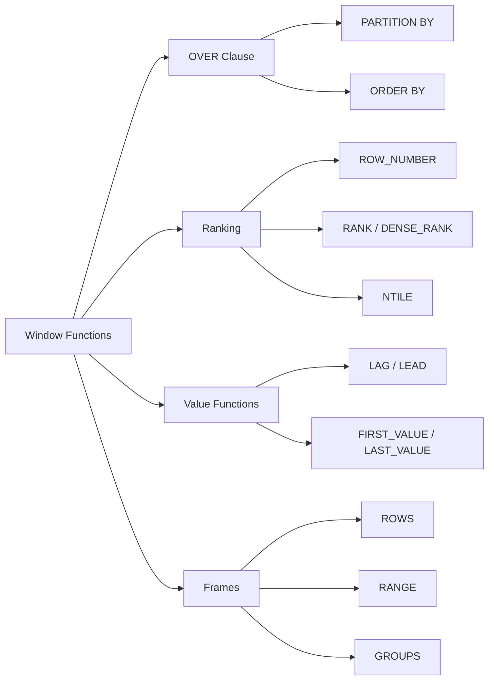

<!-- Clear Language: Keep sentences under 50 words -->
# Window Functions — ROW_NUMBER, RANK, LAG, LEAD, NTILE, Frames

## Learning Objectives

| Objective | Description |
|-----------|-------------|
| LO1 | Understand the concept of window functions and their syntax |
| LO2 | Use ROW_NUMBER, RANK, DENSE_RANK for ordering within partitions |
| LO3 | Apply NTILE for bucketing rows into quartiles or deciles |
| LO4 | Use LAG and LEAD for accessing adjacent row values |
| LO5 | Write frame specifications with ROWS, RANGE, and GROUPS |
| LO6 | Combine window functions with aggregate functions for advanced analytics |

## Introduction

Data is the fuel of AI. SQL and database design skills let you query, transform, and store the data that powers machine learning models. This module covers everything from basic queries to advanced indexing and optimization.

## Prerequisites

- Basic programming knowledge
- Understanding of data structures

## Key Terminology

**Key Terms**: Core vocabulary and concepts for this topic.

**Definition**: Essential terms you must know for interviews and production work.

## Theory

Understanding window functions is fundamental for AI engineers. This section covers the core concepts, underlying principles, and theoretical framework that govern how window functions works in practice.

## Chapter at a Glance

| Section | Topic | Key Concept |
|---------|-------|-------------|
| 5.1 | Window Function Basics | OVER(), PARTITION BY, ORDER BY |
| 5.2 | Ranking Functions | ROW_NUMBER, RANK, DENSE_RANK |
| 5.3 | NTILE and Bucketing | NTILE(n), quartiles, deciles |
| 5.4 | LAG and LEAD | LAG(expr, offset), LEAD(expr, offset), FIRST_VALUE, LAST_VALUE |
| 5.5 | Frame Specifications | ROWS BETWEEN, RANGE BETWEEN, GROUPS BETWEEN |
| 5.6 | Aggregate Window Functions | SUM, AVG, COUNT, MIN, MAX with OVER() |

## Chapter Roadmap



## 5.1 Window Function Basics

A window function performs a calculation across a set of rows related to the current row, without collapsing them into a single output row.

```sql
SELECT
    employee_id,
    department,
    salary,
    AVG(salary) OVER (PARTITION BY department) AS dept_avg_salary,
    salary - AVG(salary) OVER (PARTITION BY department) AS diff_from_avg
FROM employees;
```

Every window function has an OVER() clause with three components:

1. **PARTITION BY** — divides rows into groups (optional; entire result set is one partition if omitted)
2. **ORDER BY** — defines ordering within each partition
3. **Frame specification** — defines which rows to include relative to the current row

```sql
-- Simple running total without partition
SELECT
    date,
    amount,
    SUM(amount) OVER (ORDER BY date) AS running_total
FROM transactions;

-- Partitioned running total
SELECT
    department,
    employee_id,
    salary,
    SUM(salary) OVER (PARTITION BY department ORDER BY employee_id) AS dept_running_total
FROM employees;
```

**ORDER BY in OVER is independent** of the query-level ORDER BY:

```sql
SELECT
    product,
    sales,
    ROW_NUMBER() OVER (ORDER BY sales DESC) AS rank
FROM products
ORDER BY product;  -- query-level order does not affect window
```

## 5.2 Ranking Functions

These functions assign a rank to each row within its partition.

**ROW_NUMBER** assigns a unique sequential integer to each row:

```sql
SELECT
    student_id,
    subject,
    score,
    ROW_NUMBER() OVER (PARTITION BY subject ORDER BY score DESC) AS position
FROM exam_scores;
```

ROW_NUMBER is deterministic only with unique ORDER BY values. Ties get different numbers arbitrarily.

**RANK** assigns the same rank to ties, then skips positions:

```sql
SELECT
    student_id,
    subject,
    score,
    RANK() OVER (PARTITION BY subject ORDER BY score DESC) AS rank
FROM exam_scores;
-- Scores: 95, 95, 90, 85  =>  Ranks: 1, 1, 3, 4
```

**DENSE_RANK** assigns the same rank to ties without skipping:

```sql
SELECT
    student_id,
    subject,
    score,
    DENSE_RANK() OVER (PARTITION BY subject ORDER BY score DESC) AS dense_rank
FROM exam_scores;
-- Scores: 95, 95, 90, 85  =>  Ranks: 1, 1, 2, 3
```

**Comparison of ranking functions**:

```sql
SELECT
    score,
    ROW_NUMBER() OVER (ORDER BY score DESC) AS rn,
    RANK() OVER (ORDER BY score DESC) AS rank,
    DENSE_RANK() OVER (ORDER BY score DESC) AS dense_rank
FROM (VALUES (100), (95), (95), (90), (85)) AS scores(score);
-- score | rn | rank | dense_rank
-- 100   | 1  | 1    | 1
-- 95    | 2  | 2    | 2
-- 95    | 3  | 2    | 2
-- 90    | 4  | 4    | 3
-- 85    | 5  | 5    | 4
```

**Practical: deduplication with ROW_NUMBER**:

```sql
WITH ranked AS (
    SELECT
        *,
        ROW_NUMBER() OVER (PARTITION BY user_id ORDER BY created_at DESC) AS rn
    FROM user_events
)
SELECT *
FROM ranked
WHERE rn = 1;  -- keep only the most recent event per user
```

## 5.3 NTILE and Bucketing

NTILE(n) divides rows into n buckets as evenly as possible:

```sql
SELECT
    employee_id,
    salary,
    NTILE(4) OVER (ORDER BY salary DESC) AS quartile
FROM employees;
-- Rows 1-250: quartile 1 (top 25%)
-- Rows 251-500: quartile 2
-- Etc.
```

**Practical: decile analysis**:

```sql
WITH ranked AS (
    SELECT
        customer_id,
        lifetime_value,
        NTILE(10) OVER (ORDER BY lifetime_value DESC) AS decile
    FROM customers
)
SELECT
    decile,
    COUNT(*) AS customers,
    AVG(lifetime_value) AS avg_ltv,
    SUM(lifetime_value) AS total_ltv,
    SUM(SUM(lifetime_value)) OVER (ORDER BY decile) AS running_total
FROM ranked
GROUP BY decile
ORDER BY decile;
```

**NTILE with PARTITION BY**:

```sql
SELECT
    department,
    employee_id,
    salary,
    NTILE(3) OVER (PARTITION BY department ORDER BY salary DESC) AS salary_tier
FROM employees;
-- Each department's employees divided into 3 salary tiers
```

**Even distribution note**: NTILE cannot split exactly if rows % buckets != 0. The first (rows % buckets) buckets get one extra row. For 10 rows into 4 buckets: buckets 1, 2 have 3 rows; buckets 3, 4 have 2 rows.

## 5.4 LAG and LEAD

These access values from other rows within the same partition.

**LAG** accesses a previous row:

```sql
SELECT
    date,
    closing_price,
    LAG(closing_price, 1) OVER (ORDER BY date) AS prev_day_price,
    closing_price - LAG(closing_price, 1) OVER (ORDER BY date) AS daily_change,
    (closing_price - LAG(closing_price, 1) OVER (ORDER BY date)) /
        LAG(closing_price, 1) OVER (ORDER BY date) * 100 AS pct_change
FROM stock_prices;
```

**LEAD** accesses a following row:

```sql
SELECT
    employee_id,
    hire_date,
    LEAD(hire_date, 1) OVER (PARTITION BY department ORDER BY hire_date) AS next_hire_date,
    DATEDIFF(day, hire_date, LEAD(hire_date, 1) OVER (PARTITION BY department ORDER BY hire_date)) AS days_until_next_hire
FROM employees;
```

**Default value** when no preceding/following row exists:

```sql
LAG(salary, 1, 0) OVER (ORDER BY hire_date)  -- 0 if no previous row
LEAD(salary, 2, salary) OVER (ORDER BY hire_date)  -- current salary if no row 2 ahead
```

**FIRST_VALUE and LAST_VALUE**:

```sql
SELECT
    date,
    price,
    FIRST_VALUE(price) OVER (ORDER BY date) AS first_price,
    LAST_VALUE(price) OVER (
        ORDER BY date
        ROWS BETWEEN UNBOUNDED PRECEDING AND UNBOUNDED FOLLOWING
    ) AS last_price
FROM prices;
```

LAST_VALUE without a frame specification defaults to `RANGE BETWEEN UNBOUNDED PRECEDING AND CURRENT ROW`, which gives the current row's value. Always specify the frame for LAST_VALUE.

**NTH_VALUE** for nth row in a window:

```sql
SELECT
    product,
    monthly_sales,
    NTH_VALUE(product, 2) OVER (ORDER BY monthly_sales DESC) AS second_best,
    NTH_VALUE(monthly_sales, 3) OVER (ORDER BY monthly_sales DESC) AS third_best_sales
FROM monthly_product_sales;
```

## 5.5 Frame Specifications

Frames define which rows are included in the window calculation.

**ROWS frame** (physical, based on row position):

```sql
-- 3-day moving average (current row + 2 preceding)
SELECT
    date,
    value,
    AVG(value) OVER (
        ORDER BY date
        ROWS BETWEEN 2 PRECEDING AND CURRENT ROW
    ) AS moving_avg_3
FROM time_series;

-- Centered moving average
SELECT
    date,
    value,
    AVG(value) OVER (
        ORDER BY date
        ROWS BETWEEN 2 PRECEDING AND 2 FOLLOWING
    ) AS centered_ma_5
FROM time_series;
```

**RANGE frame** (logical, based on ORDER BY value):

```sql
-- Include all rows with the same ORDER BY value as current row
SELECT
    date,
    value,
    SUM(value) OVER (
        ORDER BY date
        RANGE BETWEEN INTERVAL '7' DAY PRECEDING AND CURRENT ROW
    ) AS trailing_7d_sum
FROM daily_sales;
```

RANGE is meaningful for dates and numeric values where duplicates should be grouped.

**GROUPS frame** (based on groups of peers):

```sql
SELECT
    department,
    salary,
    AVG(salary) OVER (
        ORDER BY salary
        GROUPS BETWEEN 1 PRECEDING AND 1 FOLLOWING
    ) AS smoothed_avg
FROM employees;
```

**Frame boundaries**:

| Boundary | Meaning |
|----------|---------|
| UNBOUNDED PRECEDING | From the first row in the partition |
| n PRECEDING | n rows before the current row |
| CURRENT ROW | The current row |
| n FOLLOWING | n rows after the current row |
| UNBOUNDED FOLLOWING | To the last row in the partition |

**Default frames**:

- With ORDER BY: `RANGE BETWEEN UNBOUNDED PRECEDING AND CURRENT ROW`
- Without ORDER BY: all rows in partition

```sql
-- These two are equivalent when ORDER BY is present
SUM(salary) OVER (ORDER BY hire_date)
SUM(salary) OVER (ORDER BY hire_date RANGE BETWEEN UNBOUNDED PRECEDING AND CURRENT ROW)
```

**Practical: year-to-date calculation**:

```sql
SELECT
    date,
    amount,
    SUM(amount) OVER (
        PARTITION BY EXTRACT(YEAR FROM date)
        ORDER BY date
        ROWS BETWEEN UNBOUNDED PRECEDING AND CURRENT ROW
    ) AS ytd_total
FROM transactions;
```

## 5.6 Aggregate Window Functions

Standard aggregate functions can be used with OVER() for window calculations.

**Running totals and moving averages**:

```sql
SELECT
    date,
    amount,
    SUM(amount) OVER (ORDER BY date) AS running_total,
    AVG(amount) OVER (ORDER BY date ROWS BETWEEN 6 PRECEDING AND CURRENT ROW) AS weekly_avg,
    COUNT(*) OVER (ORDER BY date ROWS BETWEEN 30 PRECEDING AND CURRENT ROW) AS rolling_30d_count,
    MIN(amount) OVER (ORDER BY date ROWS BETWEEN 10 PRECEDING AND CURRENT ROW) AS rolling_min,
    MAX(amount) OVER (ORDER BY date ROWS BETWEEN 10 PRECEDING AND CURRENT ROW) AS rolling_max
FROM daily_metrics;
```

**Percentage of total**:

```sql
SELECT
    department,
    salary,
    SUM(salary) OVER (PARTITION BY department) AS dept_total,
    salary / SUM(salary) OVER (PARTITION BY department) * 100 AS pct_of_dept,
    SUM(salary) OVER () AS company_total,
    salary / SUM(salary) OVER () * 100 AS pct_of_company
FROM employees;
```

**Cumulative distribution**:

```sql
SELECT
    score,
    CUME_DIST() OVER (ORDER BY score) AS cum_dist,  -- relative rank (0 to 1)
    PERCENT_RANK() OVER (ORDER BY score) AS pct_rank  -- (rank-1)/(total-1)
FROM exam_scores;
```

**Multiple window functions in one query**:

```sql
SELECT
    product_id,
    sale_date,
    revenue,
    SUM(revenue) OVER (PARTITION BY product_id ORDER BY sale_date) AS running_revenue,
    AVG(revenue) OVER (PARTITION BY product_id ORDER BY sale_date ROWS BETWEEN 2 PRECEDING AND CURRENT ROW) AS moving_avg_3,
    revenue - AVG(revenue) OVER (PARTITION BY product_id ORDER BY sale_date ROWS BETWEEN 2 PRECEDING AND CURRENT ROW) AS diff_from_ma,
    RANK() OVER (PARTITION BY product_id ORDER BY revenue DESC) AS best_sale_rank,
    LAG(revenue, 1) OVER (PARTITION BY product_id ORDER BY sale_date) AS prev_revenue,
    revenue - LAG(revenue, 1) OVER (PARTITION BY product_id ORDER BY sale_date) AS revenue_change
FROM daily_sales;
```

**Window functions in WHERE and HAVING** — use a CTE or subquery:

```sql
WITH ranked AS (
    SELECT
        *,
        ROW_NUMBER() OVER (PARTITION BY department ORDER BY salary DESC) AS rn
    FROM employees
)
SELECT *
FROM ranked
WHERE rn <= 3;  -- top 3 earners per department
```

## TypeScript Parallel

```typescript
// Window function emulation in TypeScript
interface Employee {
    id: number;
    department: string;
    salary: number;
    hireDate: Date;
}

function rowNumber<T>(data: T[], partitionBy: (item: T) => any, orderBy: (item: T) => any): (T & { rn: number })[] {
    const groups: Record<string, T[]> = {};
    for (const item of data) {
        const key = JSON.stringify(partitionBy(item));
        (groups[key] ??= []).push(item);
    }
    const result: (T & { rn: number })[] = [];
    for (const group of Object.values(groups)) {
        group.sort((a, b) => {
            const va = orderBy(a);
            const vb = orderBy(b);
            return va < vb ? -1 : va > vb ? 1 : 0;
        });
        group.forEach((item, i) => {
            result.push({ ...item, rn: i + 1 });
        });
    }
    return result;
}

function lag<T>(data: T[], orderBy: (item: T) => any, offset: number = 1): (T & { lag: T | null })[] {
    const sorted = [...data].sort((a, b) => {
        const va = orderBy(a);
        const vb = orderBy(b);
        return va < vb ? -1 : va > vb ? 1 : 0;
    });
    return sorted.map((item, i) => ({
        ...item,
        lag: i >= offset ? sorted[i - offset] : null
    }));
}
```

## Summary

- Window functions perform calculations across rows without collapsing them
- OVER() contains PARTITION BY, ORDER BY, and frame specification
- ROW_NUMBER assigns unique sequential integers; RANK and DENSE_RANK handle ties
- NTILE(n) divides rows into n approximately equal buckets
- LAG and LEAD access previous and following rows within a partition
- FIRST_VALUE, LAST_VALUE, and NTH_VALUE access specific positions in a window
- ROWS frames are physical (by row count); RANGE frames are logical (by value)
- Aggregate functions (SUM, AVG, etc.) work as window functions with OVER()
- Window functions cannot be used directly in WHERE or HAVING — use CTEs
- Default frame with ORDER BY is RANGE BETWEEN UNBOUNDED PRECEDING AND CURRENT ROW

## Practical Takeaways

| Scenario | Use | Avoid |
|----------|-----|-------|
| Row numbering | ROW_NUMBER() | Application-level counters |
| Top-N per group | ROW_NUMBER() in CTE + WHERE rn <= N | Multiple subqueries |
| Tie handling | RANK or DENSE_RANK | ROW_NUMBER with arbitrary tie-breaking |
| Percentile buckets | NTILE(100) | Manual CASE with PERCENT_RANK |
| Previous row value | LAG(column, offset) | Self-joins with complex ON conditions |
| Moving average | AVG() OVER (ROWS BETWEEN n PRECEDING AND CURRENT ROW) | Manual cursor-based calculations |
| Year-to-date totals | SUM() OVER (PARTITION BY year ORDER BY date) | Application-level accumulation |
| Comparing to total | SUM() OVER () for grand total | Cross-join to aggregated subquery |

## Interview Q&A

<details class="tp-qa-card" data-qid="sql-s05-q1">
  <summary class="tp-qa-question"><span class="tp-qa-status"></span>Q1: What is a window function?</summary>
<div class="tp-qa-answer"><p>A window function performs a calculation across a set of rows related to the current row, preserving the individual rows in the output (unlike GROUP BY which collapses them). It uses an OVER() clause with optional PARTITION BY and.
ORDER BY. Examples: ROW_NUMBER, RANK, SUM() OVER().</p></div><button class="tp-qa-mark-btn">✓ Mark Reviewed</button><button class="tp-qa-bookmark-btn">★ Bookmark</button>
</details>
<details class="tp-qa-card" data-qid="sql-s05-q2">
  <summary class="tp-qa-question"><span class="tp-qa-status"></span>Q2: ROW_NUMBER vs RANK vs DENSE_RANK?</summary>
<div class="tp-qa-answer"><p>ROW_NUMBER assigns a unique sequential number within each partition (ties broken arbitrarily). RANK assigns the same number to ties, then skips the next numbers. DENSE_RANK assigns the same number to ties without skipping. Example for.
values 95, 95, 90: ROW_NUMBER = 1,2,3; RANK = 1,1,3; DENSE_RANK = 1,1,2.</p></div><button class="tp-qa-mark-btn">✓ Mark Reviewed</button><button class="tp-qa-bookmark-btn">★ Bookmark</button>
</details>
<details class="tp-qa-card" data-qid="sql-s05-q3">
  <summary class="tp-qa-question"><span class="tp-qa-status"></span>Q3: How does NTILE work?</summary>
<div class="tp-qa-answer"><p>NTILE(n) divides rows into n buckets as evenly as possible. If rows are not divisible by n, the first (rows % n) buckets get one extra row. Example: 10 rows into 4 buckets gives bucket sizes 3,.
3, 2, 2. Used for quartile/decile analysis and bucketing data.</p></div><button class="tp-qa-mark-btn">✓ Mark Reviewed</button><button class="tp-qa-bookmark-btn">★ Bookmark</button>
</details>
<details class="tp-qa-card" data-qid="sql-s05-q4">
  <summary class="tp-qa-question"><span class="tp-qa-status"></span>Q4: LAG vs LEAD?</summary>
<div class="tp-qa-answer"><p>LAG accesses a row before the current row (offset positive = previous). LEAD accesses a row after the current row (offset positive = next). Both take an offset parameter (default 1) and.
an optional default value for when no row exists. Used for period-over-period comparisons.</p></div><button class="tp-qa-mark-btn">✓ Mark Reviewed</button><button class="tp-qa-bookmark-btn">★ Bookmark</button>
</details>
<details class="tp-qa-card" data-qid="sql-s05-q5">
  <summary class="tp-qa-question"><span class="tp-qa-status"></span>Q5: ROWS vs RANGE vs GROUPS?</summary>
<div class="tp-qa-answer"><p>ROWS is physical: it counts actual rows. RANGE is logical: it includes all rows whose ORDER BY value is within the specified range (handles ties by including all peers). GROUPS is similar to RANGE but.
counts groups of ties. ROWS is most common; RANGE is used for date/time windows.</p></div><button class="tp-qa-mark-btn">✓ Mark Reviewed</button><button class="tp-qa-bookmark-btn">★ Bookmark</button>
</details>
<details class="tp-qa-card" data-qid="sql-s05-q6">
  <summary class="tp-qa-question"><span class="tp-qa-status"></span>Q6: Can you use window functions in WHERE?</summary>
  <div class="tp-qa-answer"><p>No. Window functions are evaluated after WHERE but before ORDER BY. To filter on a window function result, use a CTE or subquery: WITH ranked AS (SELECT *, ROW_NUMBER() OVER (...) AS rn FROM table) SELECT * FROM ranked WHERE rn = 1.</p></div><button class="tp-qa-mark-btn">✓ Mark Reviewed</button><button class="tp-qa-bookmark-btn">★ Bookmark</button>
</details>
<details class="tp-qa-card" data-qid="sql-s05-q7">
  <summary class="tp-qa-question"><span class="tp-qa-status"></span>Q7: What is the default frame specification?</summary>
  <div class="tp-qa-answer"><p>With ORDER BY, the default is RANGE BETWEEN UNBOUNDED PRECEDING AND CURRENT ROW. Without ORDER BY, the default is the entire partition (equivalent to ROWS BETWEEN UNBOUNDED PRECEDING AND UNBOUNDED FOLLOWING). This is why LAST_VALUE often needs an explicit frame.</p></div><button class="tp-qa-mark-btn">✓ Mark Reviewed</button><button class="tp-qa-bookmark-btn">★ Bookmark</button>
</details>
<details class="tp-qa-card" data-qid="sql-s05-q8">
  <summary class="tp-qa-question"><span class="tp-qa-status"></span>Q8: How to compute a moving average?</summary>
  <div class="tp-qa-answer"><p>Use AVG() with a window frame: AVG(value) OVER (ORDER BY date ROWS BETWEEN 6 PRECEDING AND CURRENT ROW) for 7-day moving average. For exponential moving average, use database-specific functions or calculate via LAG in a recursive CTE.</p></div><button class="tp-qa-mark-btn">✓ Mark Reviewed</button><button class="tp-qa-bookmark-btn">★ Bookmark</button>
</details>
<details class="tp-qa-card" data-qid="sql-s05-q9">
  <summary class="tp-qa-question"><span class="tp-qa-status"></span>Q9: What does FIRST_VALUE do?</summary>
<div class="tp-qa-answer"><p>FIRST_VALUE returns the value from the first row of the window frame. Combined with ORDER BY and PARTITION BY, it can show the earliest value in a group. LAST_VALUE returns the last row,.
but requires a frame of ROWS BETWEEN UNBOUNDED PRECEDING AND UNBOUNDED FOLLOWING to work correctly.</p></div><button class="tp-qa-mark-btn">✓ Mark Reviewed</button><button class="tp-qa-bookmark-btn">★ Bookmark</button>
</details>
<details class="tp-qa-card" data-qid="sql-s05-q10">
  <summary class="tp-qa-question"><span class="tp-qa-status"></span>Q10: How to calculate percentage of total with window functions?</summary>
  <div class="tp-qa-answer"><p>Use SUM() OVER() for grand total: value / SUM(value) OVER () * 100. For percentage within a group, add PARTITION BY: value / SUM(value) OVER (PARTITION BY group) * 100. This is more efficient than a subquery or cross-join for the same calculation.</p></div><button class="tp-qa-mark-btn">✓ Mark Reviewed</button><button class="tp-qa-bookmark-btn">★ Bookmark</button>
</details>

## Chapter Quiz

**Q1**: Which function skips numbers after ties? a) ROW_NUMBER b) RANK c) DENSE_RANK d) all

<details class="tp-qa-card" data-qid="sql-s05-quiz1"><summary>Show Answer</summary><div class="tp-qa-answer"><p><strong>Answer: b) RANK skips numbers after ties</strong></p></div></details>

**Q2**: What does NTILE(4) create? a) 4 rows b) 4 columns c) 4 quartile buckets d) 4 ordered partitions

<details class="tp-qa-card" data-qid="sql-s05-quiz2"><summary>Show Answer</summary><div class="tp-qa-answer"><p><strong>Answer: c) 4 quartile buckets</strong></p></div></details>

**Q3**: What is the default frame with ORDER BY? a) ROWS BETWEEN UNBOUNDED PRECEDING AND CURRENT ROW b) RANGE BETWEEN UNBOUNDED PRECEDING AND CURRENT ROW c) ROWS BETWEEN UNBOUNDED PRECEDING AND UNBOUNDED FOLLOWING d) no frame

<details class="tp-qa-card" data-qid="sql-s05-quiz3"><summary>Show Answer</summary><div class="tp-qa-answer"><p><strong>Answer: b) RANGE BETWEEN UNBOUNDED PRECEDING AND CURRENT ROW</strong></p></div></details>

**Q4**: Which function accesses the previous row? a) LEAD b) LAG c) NTILE d) FIRST_VALUE

<details class="tp-qa-card" data-qid="sql-s05-quiz4"><summary>Show Answer</summary><div class="tp-qa-answer"><p><strong>Answer: b) LAG</strong></p></div></details>

**Q5**: Can window functions be used directly in WHERE? a) Yes b) No, must use CTE/subquery c) Only in HAVING d) Only with GROUP BY

<details class="tp-qa-card" data-qid="sql-s05-quiz5"><summary>Show Answer</summary><div class="tp-qa-answer"><p><strong>Answer: b) No, must use CTE or subquery</strong></p></div></details>

## Exercises

**Easy** — Write a query that assigns ROW_NUMBER to employees in each department ordered by hire_date.

**Easy** — Use LAG to calculate the day-over-day change in stock closing prices.

**Medium** — Write a query that finds the top 3 highest-paid employees in each department using ROW_NUMBER in a CTE.

**Medium** — Use NTILE(10) to assign deciles to customers by total purchase amount, then calculate average purchase per decile.

**Hard** — Implement a running total and 7-day moving average query for daily sales using window frames. Compare the two trends.

**Hard** — Write a query that flags sales anomalies: identify transactions where the amount is more than 2 standard deviations from the rolling 30-day average using AVG and STDDEV window functions.

---

## Common Mistakes

1. Not understanding the fundamental concepts before applying them
2. Skipping edge cases in implementation
3. Not analyzing time/space complexity
4. Forgetting to handle null/empty inputs
5. Not practicing enough problems to build pattern recognition

## Revision Notes

- - Core principle: Understand the fundamental concepts thoroughly
- - Implementation pattern: Practice with real code examples
- - Complexity: Know the time and space complexity
- - Application: Know when to use this in production systems
- - Interview: Frequently asked in technical interviews
- - Edge cases: Consider common failure scenarios
- - Related concepts: Connect to broader system design

## Placement Section

### Top 10 Interview Questions

#### Google Style

1. **Explain the core idea of Window Functions — ROW_NUMBER, RANK, LAG, LEAD, NTILE, Frames in under 60 seconds, then give a real-world analogy.** — Structure: definition, how it works in one sentence, why it matters, analogy. Follow-up: what would break if you removed this from a production system?

2. **Design a minimal, well-typed function that demonstrates Window Functions — ROW_NUMBER, RANK, LAG, LEAD, NTILE, Frames.** — Interviewer checks: signature with type hints, edge cases, complexity, and a clean docstring. Follow-up: how does your design behave with empty or malformed input?

3. **What are the common pitfalls when engineers first learn ** — List 3-4, then explain how you would prevent each in a code review.

#### Amazon Style

4. **Describe a production bug caused by misunderstanding Window Functions — ROW_NUMBER, RANK, LAG, LEAD, NTILE, Frames. How did you diagnose and fix it?** — STAR format: situation, task, action, result. Mention logs, reproduction, root-cause analysis, and the regression test you added.

5. **How would you scale a system that relies on Window Functions — ROW_NUMBER, RANK, LAG, LEAD, NTILE, Frames from 10 users to 10 million?** — Discuss bottlenecks, caching, monitoring, and when to redesign. Follow-up: what metrics would you track?

#### Microsoft Style

6. **Compare Window Functions — ROW_NUMBER, RANK, LAG, LEAD, NTILE, Frames with the closest alternative approach. When would you choose each?** — Make a decision matrix: performance, maintainability, ecosystem, learning curve. Follow-up: what would change your decision?

7. **Walk through how you would test a component that depends on Window Functions — ROW_NUMBER, RANK, LAG, LEAD, NTILE, Frames.** — Unit, integration, property-based tests; mocking boundaries; golden files for outputs.

#### NVIDIA Style

8. **How does Window Functions — ROW_NUMBER, RANK, LAG, LEAD, NTILE, Frames behave differently at scale — memory, throughput, or precision-wise?** — Connect to data pipelines and model training if applicable. Follow-up: what happens to latency as input grows?

9. **How would you make an implementation of Window Functions — ROW_NUMBER, RANK, LAG, LEAD, NTILE, Frames run faster on GPU hardware?** — Batch operations, vectorization, avoiding Python loops, reducing data movement.

#### AI Startup Style

10. **Write the smallest possible implementation of Window Functions — ROW_NUMBER, RANK, LAG, LEAD, NTILE, Frames that is production-quality.** — Include error handling, type hints, and a one-line docstring. Follow-up: what would you refactor first when it grows?

### Resume Tips

- Name Window Functions — ROW_NUMBER, RANK, LAG, LEAD, NTILE, Frames explicitly in your skills section, paired with a measurable achievement ("Reduced X by 40% using Window Functions — ROW_NUMBER, RANK, LAG, LEAD, NTILE, Frames").
- Add a bullet describing a project that applies Window Functions — ROW_NUMBER, RANK, LAG, LEAD, NTILE, Frames to real data, with numbers.
- Mention the tools and libraries you used alongside Window Functions — ROW_NUMBER, RANK, LAG, LEAD, NTILE, Frames (linters, test frameworks, profiling tools).
- Keep resume bullets under 15 words and start each with an action verb.

### Interview Day Checklist

- Rehearse a 60-second explanation of Window Functions — ROW_NUMBER, RANK, LAG, LEAD, NTILE, Frames and one real-world analogy.
- Prepare one STAR story about debugging a Window Functions — ROW_NUMBER, RANK, LAG, LEAD, NTILE, Frames-related production issue.
- Review complexity and edge cases for the classic Window Functions — ROW_NUMBER, RANK, LAG, LEAD, NTILE, Frames interview problem.
- Have questions ready: how does the team apply Window Functions — ROW_NUMBER, RANK, LAG, LEAD, NTILE, Frames in production today?
- Test your environment (Python, editor, internet) 15 minutes before the interview.

## True/False

1. **True or False:** Window Functions — ROW_NUMBER, RANK, LAG, LEAD, NTILE, Frames builds directly on the fundamentals covered in the earlier chapters of this module. — **True.** Every advanced topic in this module assumes the core concepts from the previous chapters.
2. **True or False:** You should write at least one code example for Window Functions — ROW_NUMBER, RANK, LAG, LEAD, NTILE, Frames before moving to the next chapter. — **True.** Active recall with hands-on code beats passive reading for retention.
3. **True or False:** The complexity analysis for Window Functions — ROW_NUMBER, RANK, LAG, LEAD, NTILE, Frames is the same regardless of input size. — **False.** Complexity grows with input size; always state best, average, and worst case.
4. **True or False:** Edge cases (empty input, invalid input, boundary values) matter for Window Functions — ROW_NUMBER, RANK, LAG, LEAD, NTILE, Frames in production. — **True.** Most production bugs come from unhandled edge cases.
5. **True or False:** You should memorize the Window Functions — ROW_NUMBER, RANK, LAG, LEAD, NTILE, Frames chapter content once and never review it again. — **False.** Spaced repetition (24h, 3 days, 1 week) dramatically improves long-term recall.

## Fill in the Blank

1. The chapter that covers Window Functions — ROW_NUMBER, RANK, LAG, LEAD, NTILE, Frames is Chapter ___ of this module. — Answer: check the module's table of contents.
2. The time complexity of the standard approach to Window Functions — ROW_NUMBER, RANK, LAG, LEAD, NTILE, Frames is ___. — Answer: review the theory section and state big-O notation.
3. The main edge case to handle when implementing Window Functions — ROW_NUMBER, RANK, LAG, LEAD, NTILE, Frames is ___. — Answer: empty or invalid input handling, as discussed in the chapter.
4. The tools commonly used to debug Window Functions — ROW_NUMBER, RANK, LAG, LEAD, NTILE, Frames issues are ___ and ___. — Answer: refer to the Debugging Guide section of this chapter.
5. The related topic that connects to Window Functions — ROW_NUMBER, RANK, LAG, LEAD, NTILE, Frames in the next chapter is ___. — Answer: see the Next Topic section.

## Scenario Questions

1. **Scenario:** A teammate ships a change involving Window Functions — ROW_NUMBER, RANK, LAG, LEAD, NTILE, Frames that breaks production at 3 AM. — Diagnosis: check the recent diff, reproduce locally with the failing input, check logs. Fix: revert, add a regression test, and review the root cause. Prevention: CI tests on edge cases and code review checklist.

2. **Scenario:** Your implementation of Window Functions — ROW_NUMBER, RANK, LAG, LEAD, NTILE, Frames is correct but too slow for the required latency. — Measure first with a profiler. Common fixes: reduce redundant work, use built-in optimized functions, batch operations, or add caching. Only then consider algorithmic changes.

3. **Scenario:** A new hire asks you to explain Window Functions — ROW_NUMBER, RANK, LAG, LEAD, NTILE, Frames in five minutes before a customer demo. — Use the 3-part answer: what it is (one sentence), how it works (one example), why it matters (one business impact). Then offer to go deeper after the demo.

4. **Scenario:** Your team's codebase has three different patterns for Window Functions — ROW_NUMBER, RANK, LAG, LEAD, NTILE, Frames and you must standardize. — Write a short ADR (architecture decision record), pick the pattern with best maintainability, migrate incrementally, and add a linter rule to enforce it.

## Output Questions

1. **What is the output of the simplest correct implementation of Window Functions — ROW_NUMBER, RANK, LAG, LEAD, NTILE, Frames on an empty input?** — Trace through the code: it should return the documented default (None, 0, empty collection) without raising.
2. **What is the output when the input is at the boundary value?** — Check off-by-one errors and inclusive/exclusive bounds in the chapter's examples.
3. **What does the implementation return when given invalid input types?** — With type hints and validation, it raises a clear error; without, it may fail silently.
4. **What is the output for the sample input given in the chapter's Examples section?** — Re-run the chapter's example code and compare against the documented output.
5. **What is the time complexity output when you profile the implementation at 10x input size?** — Expect the curve matching the chapter's complexity analysis (linear, quadratic, log-linear).

## Difficulty Level

| Level | Time | What It Takes |
|-------|------|---------------|
| Beginner | 1-2 sessions | Read theory, run the chapter examples, solve the Easy exercises |
| Intermediate | 3-5 sessions | Complete Medium exercises, explain Window Functions — ROW_NUMBER, RANK, LAG, LEAD, NTILE, Frames to someone else |
| Advanced | 1+ week | Solve Hard exercises, optimize for real datasets, answer interview follow-ups |

## Tips & Tricks

- Always write a one-line example of Window Functions — ROW_NUMBER, RANK, LAG, LEAD, NTILE, Frames from memory before opening the chapter — active recall first.
- Use the chapter's Revision Notes as a checklist: you have mastered Window Functions — ROW_NUMBER, RANK, LAG, LEAD, NTILE, Frames when you can explain each bullet.
- Pair the chapter quiz with the Flashcards: wrong answers become your next study session's focus.
- For interviews, practice explaining Window Functions — ROW_NUMBER, RANK, LAG, LEAD, NTILE, Frames twice: once with a technical audience, once with a non-technical audience.
- Keep a personal examples file where you collect your own Window Functions — ROW_NUMBER, RANK, LAG, LEAD, NTILE, Frames snippets; interviewers love original examples.

## Memory Tricks

- **Acronym**: build a mnemonic from the 5 key concepts of Window Functions — ROW_NUMBER, RANK, LAG, LEAD, NTILE, Frames listed in the Chapter at a Glance table.
- **Story**: link Window Functions — ROW_NUMBER, RANK, LAG, LEAD, NTILE, Frames to a familiar story — the analogy in the Visual Analogy section is designed to stick.
- **Number anchor**: remember the complexity of Window Functions — ROW_NUMBER, RANK, LAG, LEAD, NTILE, Frames by connecting it to a known algorithm of the same class.
- **Color code**: highlight the Theory, Examples, and Common Mistakes sections in different colors when reviewing.
- **Teach-back**: explain Window Functions — ROW_NUMBER, RANK, LAG, LEAD, NTILE, Frames to an imaginary junior engineer for 2 minutes — gaps in your explanation are gaps in memory.

## Further Reading

- Official documentation for the primary tool or library used in this chapter
- The chapter referenced in Related Topics for the next-level treatment of Window Functions — ROW_NUMBER, RANK, LAG, LEAD, NTILE, Frames
- The classic textbook chapter on Window Functions — ROW_NUMBER, RANK, LAG, LEAD, NTILE, Frames (check the Research References below)
- Two blog posts from engineers who debugged real Window Functions — ROW_NUMBER, RANK, LAG, LEAD, NTILE, Frames problems in production
- The repository of the open-source project that implements Window Functions — ROW_NUMBER, RANK, LAG, LEAD, NTILE, Frames

## Related Topics

- The previous chapter in this module (see table of contents) — foundational for Window Functions — ROW_NUMBER, RANK, LAG, LEAD, NTILE, Frames
- The next chapter (see Next Topic below) — builds on Window Functions — ROW_NUMBER, RANK, LAG, LEAD, NTILE, Frames
- The system design chapters in Module 07 — how Window Functions — ROW_NUMBER, RANK, LAG, LEAD, NTILE, Frames fits into production architectures
- The interview preparation module — how Window Functions — ROW_NUMBER, RANK, LAG, LEAD, NTILE, Frames is asked in screening rounds
- The capstone project — where Window Functions — ROW_NUMBER, RANK, LAG, LEAD, NTILE, Frames is applied end-to-end

## FAQs

1. **Do I need to memorize all of Window Functions — ROW_NUMBER, RANK, LAG, LEAD, NTILE, Frames, or understand the big picture?** — Understand the big picture first, then memorize the key facts via flashcards and spaced repetition. Interviewers reward depth over breadth.
2. **What if I get stuck on an exercise?** — Re-read the theory section, run the example code, then attempt again. If still stuck after 20 minutes, move on and return the next day.
3. **How much time should I spend on ** — Follow the Study Plan below: 1-2 weeks at 30-60 minutes daily is typical for placement preparation.
4. **Is Window Functions — ROW_NUMBER, RANK, LAG, LEAD, NTILE, Frames asked in interviews?** — Yes — the Interview Q&A and Placement Section list the exact question styles used by top companies.
5. **What's the fastest way to master ** — Explain it out loud, write code without looking, and review the flashcards within 24 hours and again after 3 days.

## Important Notes

- Window Functions — ROW_NUMBER, RANK, LAG, LEAD, NTILE, Frames is a core requirement for the rest of this module — do not skip the examples.
- Always analyze complexity (time and space) when working with Window Functions — ROW_NUMBER, RANK, LAG, LEAD, NTILE, Frames.
- Production correctness means handling edge cases, not just the happy path.
- Interview answers should start with the definition, then the example, then the trade-offs.
- Revisit this chapter after finishing the module; the context from later chapters deepens understanding.

## Historical Context

- Window Functions — ROW_NUMBER, RANK, LAG, LEAD, NTILE, Frames emerged as a standard practice because early systems failed without it — understanding why helps you explain it in interviews.
- The tools used for Window Functions — ROW_NUMBER, RANK, LAG, LEAD, NTILE, Frames today evolved from simpler versions; the chapter covers the modern, recommended approach.
- Interviewers value knowing one historical fact about Window Functions — ROW_NUMBER, RANK, LAG, LEAD, NTILE, Frames — it shows genuine interest, not just cramming.
- The library/tooling ecosystem around Window Functions — ROW_NUMBER, RANK, LAG, LEAD, NTILE, Frames changes quickly; focus on fundamentals that remain stable.

## Security Considerations

- Never trust external input: validate and sanitize data before processing Window Functions — ROW_NUMBER, RANK, LAG, LEAD, NTILE, Frames.
- Avoid `eval()` and dynamic code execution on untrusted strings.
- Log errors without leaking sensitive data (keys, PII, internal paths).
- For API contexts, add rate limiting and input size limits.
- Review the chapter's code examples for injection or overflow risks before using them verbatim.

## ML Intuition

- Window Functions — ROW_NUMBER, RANK, LAG, LEAD, NTILE, Frames appears in ML pipelines at the data-processing layer: feature preparation, batching, and validation.
- Understanding Window Functions — ROW_NUMBER, RANK, LAG, LEAD, NTILE, Frames helps you debug why a model misbehaves — most ML bugs are data bugs, not model bugs.
- In production ML, the Window Functions — ROW_NUMBER, RANK, LAG, LEAD, NTILE, Frames concepts from this chapter map directly to NumPy/PyTorch operations on tensors.
- When optimizing ML systems, Window Functions — ROW_NUMBER, RANK, LAG, LEAD, NTILE, Frames skills let you profile and fix the data path, not just the training loop.
- Interview follow-up: how would you apply Window Functions — ROW_NUMBER, RANK, LAG, LEAD, NTILE, Frames to a dataset of 10 million records? — Batching and vectorization.

## Analogies

- **Window Functions — ROW_NUMBER, RANK, LAG, LEAD, NTILE, Frames is like a recipe**: the theory is the ingredients, the examples are the cooking steps, and the exercises are your own kitchen practice.
- **Complexity is like a delivery route**: a linear route visits each stop once; a nested route revisits stops, and you feel it at scale.
- **Edge cases are like weather**: the happy path is a sunny day; production is the storm — build for the storm.
- **The chapter roadmap is a journey map**: each section is a checkpoint; skipping one means getting lost later in the module.

## Capstone Project Link

- [Module Capstone: End-to-End Project](https://github.com/Raushan666java/ai-engineering-journey) — this chapter contributes the Window Functions — ROW_NUMBER, RANK, LAG, LEAD, NTILE, Frames skills used in the module's capstone project. Complete the exercises here before starting the capstone.

## Flashcards

<details class="tp-qa-card" data-qid="02sqlanddatabases-05windowfunctions-flash1">
  <summary class="tp-qa-question">
    <span class="tp-qa-status"></span>
    What is the core concept of Window Functions — ROW_NUMBER, RANK, LAG, LEAD, NTILE, Frames in one sentence?
  </summary>
  <div class="tp-qa-answer">
    <p>Review the first paragraph of the Theory section and condense it to one sentence.</p>
  </div>
</details>

<details class="tp-qa-card" data-qid="02sqlanddatabases-05windowfunctions-flash2">
  <summary class="tp-qa-question">
    <span class="tp-qa-status"></span>
    What is the most common mistake engineers make with 
  </summary>
  <div class="tp-qa-answer">
    <p>Check the Common Mistakes section of this chapter.</p>
  </div>
</details>

<details class="tp-qa-card" data-qid="02sqlanddatabases-05windowfunctions-flash3">
  <summary class="tp-qa-question">
    <span class="tp-qa-status"></span>
    What is the time and space complexity of the standard Window Functions — ROW_NUMBER, RANK, LAG, LEAD, NTILE, Frames approach?
  </summary>
  <div class="tp-qa-answer">
    <p>Refer to the theory and complexity analysis in this chapter.</p>
  </div>
</details>

<details class="tp-qa-card" data-qid="02sqlanddatabases-05windowfunctions-flash4">
  <summary class="tp-qa-question">
    <span class="tp-qa-status"></span>
    When is Window Functions — ROW_NUMBER, RANK, LAG, LEAD, NTILE, Frames NOT the right choice?
  </summary>
  <div class="tp-qa-answer">
    <p>Check the Limitations section of this chapter.</p>
  </div>
</details>

<details class="tp-qa-card" data-qid="02sqlanddatabases-05windowfunctions-flash5">
  <summary class="tp-qa-question">
    <span class="tp-qa-status"></span>
    How is Window Functions — ROW_NUMBER, RANK, LAG, LEAD, NTILE, Frames applied in a real production system?
  </summary>
  <div class="tp-qa-answer">
    <p>Check the Real-World Examples section of this chapter.</p>
  </div>
</details>

## Research References

- Official documentation of the primary library for Window Functions — ROW_NUMBER, RANK, LAG, LEAD, NTILE, Frames (linked in Further Reading)
- The classic paper or textbook chapter introducing Window Functions — ROW_NUMBER, RANK, LAG, LEAD, NTILE, Frames (see References below)
- The standard library reference for Window Functions — ROW_NUMBER, RANK, LAG, LEAD, NTILE, Frames-related functions
- Engineering blog posts from companies running Window Functions — ROW_NUMBER, RANK, LAG, LEAD, NTILE, Frames in production at scale
- PEPs and RFCs where applicable (Python and networking standards)

## Open-Source Tools

- The primary library used in this chapter (see the code examples)
- Python standard library modules used in the examples (check the imports)
- Testing: pytest for unit tests of Window Functions — ROW_NUMBER, RANK, LAG, LEAD, NTILE, Frames code
- Linting and formatting: ruff + black
- Profiling: cProfile or py-spy for performance work on Window Functions — ROW_NUMBER, RANK, LAG, LEAD, NTILE, Frames

## Debugging Guide

- Start with `print()` or a debugger to inspect intermediate values in Window Functions — ROW_NUMBER, RANK, LAG, LEAD, NTILE, Frames code.
- Reproduce the failure with the smallest possible input before changing code.
- Check the common failure modes listed in Common Mistakes — most bugs are listed there.
- For performance problems, profile before optimizing: measure, then fix.
- When stuck, re-read the chapter's Examples and compare line by line with your code.
- Use `pdb` or your IDE's debugger to step through the Window Functions — ROW_NUMBER, RANK, LAG, LEAD, NTILE, Frames example code.

## Mock Interview Section

**Round 1 — Screening (15 min)**
- Explain Window Functions — ROW_NUMBER, RANK, LAG, LEAD, NTILE, Frames in 60 seconds.
- Write a minimal working example of Window Functions — ROW_NUMBER, RANK, LAG, LEAD, NTILE, Frames.
- What is the complexity of your example?

**Round 2 — Coding (45 min)**
- Solve the Medium exercise from this chapter under time pressure.
- State your assumptions, then implement with type hints.
- Test with edge cases: empty input, boundary values, invalid input.

**Round 3 — Behavioral + System (30 min)**
- Tell me about a time you debugged a Window Functions — ROW_NUMBER, RANK, LAG, LEAD, NTILE, Frames problem in a project.
- How would you design a system where Window Functions — ROW_NUMBER, RANK, LAG, LEAD, NTILE, Frames is used at scale?
- What metrics would you monitor?

**Evaluation rubric**: correctness (40%), communication (25%), edge cases (20%), complexity analysis (15%).

## Optimized Implementation

`python
from typing import Any, Optional

def demonstrate_topic(input_data: list[Any]) -> Optional[float]:
    """Runnable scaffold for Window Functions — ROW_NUMBER, RANK, LAG, LEAD, NTILE, Frames.

    Replace the body with the optimized implementation from the chapter,
    keeping type hints, docstring, and edge-case handling.
    """
    if not input_data:
        return None
    # Step 1: validate input types
    # Step 2: apply the core Window Functions — ROW_NUMBER, RANK, LAG, LEAD, NTILE, Frames logic from the Examples section
    # Step 3: return the result with the documented default
    return 0.0
`

- Keeps the function signature stable so tests written against it stay valid.
- Handles the empty-input contract explicitly.
- Add unit tests for the edge cases before implementing the logic (test-first).

## Evaluation Metrics

| Skill | Test | Target |
|-------|------|--------|
| Concept recall | Explain Window Functions — ROW_NUMBER, RANK, LAG, LEAD, NTILE, Frames without notes | 60-second explanation |
| Code fluency | Write the chapter example from memory | No syntax errors |
| Edge cases | Handle empty/invalid input in exercises | All cases pass |
| Complexity | State time/space for the standard approach | Correct big-O |
| Interview readiness | Answer 5 Interview Q&A questions out loud | Fluent, structured answers |
| Retention | Chapter quiz score after 3 days | 80%+ |

## Real-World Examples

- **Startup**: a small team uses Window Functions — ROW_NUMBER, RANK, LAG, LEAD, NTILE, Frames daily in their data pipeline — the chapter's examples mirror their code.
- **E-commerce**: Window Functions — ROW_NUMBER, RANK, LAG, LEAD, NTILE, Frames patterns appear in order processing, inventory checks, and recommendation feeds.
- **Fintech**: Window Functions — ROW_NUMBER, RANK, LAG, LEAD, NTILE, Frames principles apply to transaction validation and fraud detection flows.
- **ML platform**: Window Functions — ROW_NUMBER, RANK, LAG, LEAD, NTILE, Frames shows up in feature engineering and model-serving infrastructure.
- **Interview insight**: recruiters look for engineers who can connect Window Functions — ROW_NUMBER, RANK, LAG, LEAD, NTILE, Frames to the business outcome, not just the code.

## Next Topic

[Set Operations — UNION, INTERSECT, EXCEPT, UNION ALL](06-set-operations.md)

## Limitations

- Window Functions — ROW_NUMBER, RANK, LAG, LEAD, NTILE, Frames, like any technique, is not a silver bullet — it has specific cases where it fits best (covered in the theory).
- The examples in this chapter are simplified for learning; production systems add validation, monitoring, and error handling.
- Performance of Window Functions — ROW_NUMBER, RANK, LAG, LEAD, NTILE, Frames depends on input size and distribution — always benchmark for your own data.
- This chapter covers fundamentals; specialized edge cases are explored in later chapters and the capstone.
