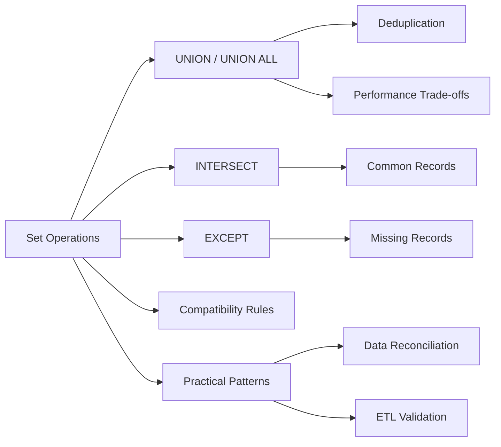

<!-- Clear Language: Keep sentences under 50 words -->
# Set Operations — UNION, INTERSECT, EXCEPT, UNION ALL

## Learning Objectives

| Objective | Description |
|-----------|-------------|
| LO1 | Understand SQL set operations and their relational algebra foundations |
| LO2 | Use UNION and UNION ALL to combine result sets |
| LO3 | Use INTERSECT to find common rows across queries |
| LO4 | Use EXCEPT (MINUS) to find rows missing from another result |
| LO5 | Understand column count and type compatibility requirements |
| LO6 | Combine set operations with ORDER BY, subqueries, and CTEs |

## Introduction

Data is the fuel of AI. SQL and database design skills let you query, transform, and store the data that powers machine learning models. This module covers everything from basic queries to advanced indexing and optimization.

## Prerequisites

- Basic programming knowledge
- Understanding of data structures

## Key Terminology

**Key Terms**: Core vocabulary and concepts for this topic.

**Definition**: Essential terms you must know for interviews and production work.

## Theory

Understanding set operations is fundamental for AI engineers. This section covers the core concepts, underlying principles, and theoretical framework that govern how set operations works in practice.

## Chapter at a Glance

| Section | Topic | Key Concept |
|---------|-------|-------------|
| 6.1 | Set Operation Basics | UNION, INTERSECT, EXCEPT, column compatibility |
| 6.2 | UNION vs UNION ALL | Deduplication behavior and performance |
| 6.3 | INTERSECT | Finding common records across queries |
| 6.4 | EXCEPT (MINUS) | Finding records in one set but not another |
| 6.5 | Combining Set Operations | Parentheses for precedence, mixing types |
| 6.6 | Practical Applications | Data reconciliation, ETL validation, reporting |

## Chapter Roadmap



## 6.1 Set Operation Basics

Set operations combine rows from two or more SELECT statements into a single result set. They are based on relational algebra concepts of union, intersection, and difference.

**Rules for all set operations**:

1. Same number of columns in all SELECT statements
2. Corresponding columns must have compatible data types
3. ORDER BY can only appear at the end of the combined query
4. Column names from the first query determine the output column names

```sql
-- Basic UNION: combine two customer lists
SELECT first_name, last_name, email FROM us_customers
UNION
SELECT first_name, last_name, email FROM eu_customers;

-- Column compatibility: types must match
SELECT product_id, product_name, price FROM current_products
UNION
SELECT product_id, product_name, price FROM archived_products;
```

**Column count mismatch error**:

```sql
-- This will fail: column counts differ
SELECT id, name FROM table_a
UNION
SELECT id, name, description FROM table_b;
-- ERROR: number of columns in SELECT statements do not match
```

**Data type compatibility**:

```sql
-- Compatible: both are numeric
SELECT quantity FROM order_details
UNION
SELECT 0 AS quantity;

-- Incompatible: string vs integer
SELECT name FROM employees
UNION
SELECT id FROM employees;  -- ERROR if id is integer
```

## 6.2 UNION vs UNION ALL

UNION removes duplicate rows; UNION ALL keeps all rows including duplicates.

```sql
-- UNION removes duplicates (slower, requires sorting)
SELECT city FROM customers_us
UNION
SELECT city FROM customers_eu;

-- UNION ALL keeps all rows (faster, no sorting)
SELECT city FROM customers_us
UNION ALL
SELECT city FROM customers_eu;
```

**Performance comparison**:

```sql
-- UNION: must sort or hash all rows to find duplicates
-- 1M rows from A + 1M rows from B => 2M rows to sort
EXPLAIN ANALYZE
SELECT * FROM big_table_2023
UNION
SELECT * FROM big_table_2024;

-- UNION ALL: just appends, no dedup
-- 1M + 1M => immediate result
EXPLAIN ANALYZE
SELECT * FROM big_table_2023
UNION ALL
SELECT * FROM big_table_2024;
```

**When to use each**:

```sql
-- UNION ALL when you know there are no duplicates (partitioned tables)
SELECT * FROM sales_jan
UNION ALL
SELECT * FROM sales_feb;

-- UNION when duplicates are possible and matter
SELECT DISTINCT department FROM employees_2023
UNION
SELECT DISTINCT department FROM employees_2024;
```

**Multiple UNIONs**:

```sql
SELECT name FROM q1_results
UNION ALL
SELECT name FROM q2_results
UNION ALL
SELECT name FROM q3_results
UNION ALL
SELECT name FROM q4_results
ORDER BY name;
```

## 6.3 INTERSECT

INTERSECT returns rows that appear in both result sets. It removes duplicates.

```sql
-- Customers who have ordered both books and electronics
SELECT customer_id FROM orders_books
INTERSECT
SELECT customer_id FROM orders_electronics;

-- Employees who are in both the sales and marketing departments
SELECT employee_id FROM department_assignments WHERE department_id = 'SALES'
INTERSECT
SELECT employee_id FROM department_assignments WHERE department_id = 'MARKETING';
```

**INTERSECT vs INNER JOIN**:

```sql
-- Using INTERSECT (simpler, set-based)
SELECT product_id FROM inventory_warehouse_a
INTERSECT
SELECT product_id FROM inventory_warehouse_b;

-- Using JOIN (more flexible, can include more columns)
SELECT DISTINCT a.product_id
FROM inventory_warehouse_a a
INNER JOIN inventory_warehouse_b b ON a.product_id = b.product_id;
```

INTERSECT is cleaner for simple set membership; JOIN is better when you need additional columns.

**INTERSECT ALL** (supported in PostgreSQL):

```sql
-- INTERSECT ALL preserves duplicates: count matters
-- If product_id 123 appears 3 times in A and 2 times in B, result has 2 copies
SELECT product_id FROM shipments_jan
INTERSECT ALL
SELECT product_id FROM shipments_feb;
```

**Multiple INTERSECTs**:

```sql
-- Products available in all three warehouses
SELECT product_id FROM warehouse_1
INTERSECT
SELECT product_id FROM warehouse_2
INTERSECT
SELECT product_id FROM warehouse_3;
```

## 6.4 EXCEPT (MINUS)

EXCEPT returns rows from the first query that are not present in the second query. Oracle uses MINUS instead of EXCEPT.

```sql
-- Customers who have registered but never ordered
SELECT email FROM registered_users
EXCEPT
SELECT DISTINCT email FROM orders;

-- Products that have never been sold
SELECT product_id FROM products
EXCEPT
SELECT product_id FROM order_items;
```

**EXCEPT vs NOT IN / NOT EXISTS**:

```sql
-- Using EXCEPT (clean, set-based)
SELECT student_id FROM enrolled_students
EXCEPT
SELECT student_id FROM graduated_students;

-- Using NOT EXISTS (more flexible for multi-column)
SELECT s.student_id
FROM enrolled_students s
WHERE NOT EXISTS (
    SELECT 1 FROM graduated_students g WHERE g.student_id = s.student_id
);

-- Using NOT IN (careful with NULLs!)
SELECT student_id FROM enrolled_students
WHERE student_id NOT IN (
    SELECT student_id FROM graduated_students WHERE student_id IS NOT NULL
);
```

**EXCEPT ALL** in PostgreSQL:

```sql
-- If product_id 123 appears 3 times in A and 1 time in B, result has 2 copies
SELECT product_id FROM inventory_system_a
EXCEPT ALL
SELECT product_id FROM inventory_system_b;
```

**Order matters with EXCEPT**:

```sql
-- A EXCEPT B is different from B EXCEPT A
-- Products in A but not in B
SELECT product_id FROM catalog_a
EXCEPT
SELECT product_id FROM catalog_b;

-- Products in B but not in A
SELECT product_id FROM catalog_b
EXCEPT
SELECT product_id FROM catalog_a;
```

**EXCEPT with multiple columns**:

```sql
-- Find days where a specific product had no sales
SELECT DISTINCT sale_date, product_id
FROM expected_schedule
EXCEPT
SELECT sale_date, product_id
FROM actual_sales;
```

## 6.5 Combining Set Operations

Set operations follow precedence rules and can be combined with parentheses.

**Precedence**: INTERSECT binds tighter than UNION and EXCEPT. All three are left-associative.

```sql
-- Without parentheses: INTERSECT runs first
SELECT 1 AS n
UNION ALL
SELECT 2
INTERSECT
SELECT 2;

-- Result depends on INTERSECT running first:
-- INTERSECT: 2 (exists in both), then UNION ALL with 1 => [1, 2]

-- With parentheses: explicit order
(SELECT 1 AS n
 UNION ALL
 SELECT 2)
INTERSECT
SELECT 2;
-- Result: [2] (INTERSECT applied after UNION)
```

**Complex combinations**:

```sql
-- Users who are admins OR have billing role, but not locked
(SELECT user_id FROM roles WHERE role = 'admin'
 UNION
 SELECT user_id FROM roles WHERE role = 'billing')
EXCEPT
SELECT user_id FROM locked_accounts;
```

**Set operations with CTEs**:

```sql
WITH
active_users AS (
    SELECT user_id FROM users WHERE last_login > CURRENT_DATE - INTERVAL '30 days'
),
paid_users AS (
    SELECT user_id FROM subscriptions WHERE status = 'active'
),
churned_paid AS (
    SELECT user_id FROM paid_users
    EXCEPT
    SELECT user_id FROM active_users
)
SELECT u.*, 'Churned paid user' AS reason
FROM users u
JOIN churned_paid cp ON u.user_id = cp.user_id;
```

**Using ORDER BY with set operations**:

```sql
-- ORDER BY applies to the entire combined result
SELECT product_name, price FROM products_2023
UNION ALL
SELECT product_name, price FROM products_2024
ORDER BY price DESC
LIMIT 10;
```

**INSERT with set operations**:

```sql
-- Create a unified customer table from multiple sources
INSERT INTO unified_customers (email, name, source)
SELECT email, name, 'web' FROM web_signups
UNION ALL
SELECT email, name, 'mobile' FROM mobile_signups
UNION ALL
SELECT email, name, 'partner' FROM partner_imports;
```

## 6.6 Practical Applications

**Data reconciliation — find differences between tables**:

```sql
-- Full outer comparison of two tables
(SELECT * FROM source_table
 EXCEPT
 SELECT * FROM target_table)
UNION ALL
(SELECT * FROM target_table
 EXCEPT
 SELECT * FROM source_table);
```

**ETL validation — check data was loaded correctly**:

```sql
-- Records missing from the data warehouse
SELECT order_id, order_date, amount FROM staging_orders
EXCEPT
SELECT order_id, order_date, amount FROM warehouse_orders;

-- Extra records in warehouse not in staging
SELECT order_id, order_date, amount FROM warehouse_orders
EXCEPT
SELECT order_id, order_date, amount FROM staging_orders;
```

**Reporting — combine data from multiple time periods**:

```sql
-- Quarterly sales report with totals
SELECT 'Q1' AS quarter, SUM(amount) AS total_sales FROM sales_q1
UNION ALL
SELECT 'Q2', SUM(amount) FROM sales_q2
UNION ALL
SELECT 'Q3', SUM(amount) FROM sales_q3
UNION ALL
SELECT 'Q4', SUM(amount) FROM sales_q4
UNION ALL
SELECT 'Total', SUM(amount) FROM (
    SELECT amount FROM sales_q1
    UNION ALL
    SELECT amount FROM sales_q2
    UNION ALL
    SELECT amount FROM sales_q3
    UNION ALL
    SELECT amount FROM sales_q4
) AS all_sales;
```

**User cohort analysis**:

```sql
-- Users who signed up in 2024 and are still active
SELECT user_id FROM signups WHERE signup_year = 2024
INTERSECT
SELECT user_id FROM logins WHERE login_date > CURRENT_DATE - INTERVAL '30 days';

-- Users who signed up but never confirmed email
SELECT user_id FROM signups WHERE signup_year = 2024
EXCEPT
SELECT user_id FROM email_confirmations;
```

**Inventory synchronization**:

```sql
-- Products missing from store B that are in store A
SELECT sku, product_name FROM store_a_inventory
EXCEPT
SELECT sku, product_name FROM store_b_inventory;
```

**Permission analysis**:

```sql
-- Users with access to both systems (intersection of permissions)
(SELECT user_id FROM system_a_permissions WHERE access_level >= 3
 INTERSECT
 SELECT user_id FROM system_b_permissions WHERE access_level >= 2)
EXCEPT
SELECT user_id FROM revoked_access;
```

## TypeScript Parallel

```typescript
// Set operations in TypeScript
function union<T>(a: T[], b: T[]): T[] {
    return [...new Set([...a, ...b])];
}

function unionAll<T>(a: T[], b: T[]): T[] {
    return [...a, ...b];
}

function intersect<T>(a: T[], b: T[]): T[] {
    const setB = new Set(b);
    return [...new Set(a.filter(item => setB.has(item)))];
}

function except<T>(a: T[], b: T[]): T[] {
    const setB = new Set(b);
    return [...new Set(a.filter(item => !setB.has(item)))];
}

// Usage
const productsA = [1, 2, 3, 4, 5];
const productsB = [4, 5, 6, 7, 8];

console.log(union(productsA, productsB));       // [1, 2, 3, 4, 5, 6, 7, 8]
console.log(unionAll(productsA, productsB));     // [1, 2, 3, 4, 5, 4, 5, 6, 7, 8]
console.log(intersect(productsA, productsB));    // [4, 5]
console.log(except(productsA, productsB));       // [1, 2, 3]
```

## Summary

- UNION combines result sets and removes duplicates; UNION ALL keeps all rows
- INTERSECT returns rows common to both queries
- EXCEPT returns rows from the first query not in the second
- All SELECT statements must have the same number of columns with compatible types
- ORDER BY can only appear at the end of the combined query
- INTERSECT binds tighter than UNION and EXCEPT; use parentheses for explicit order
- UNION requires sorting/hashing for dedup; UNION ALL is faster but may have duplicates
- EXCEPT vs NOT IN: EXCEPT handles NULLs correctly; NOT IN can give unexpected results
- Set operations are ideal for data reconciliation and ETL validation
- CTEs combined with set operations enable complex analytical queries

## Practical Takeaways

| Scenario | Use | Avoid |
|----------|-----|-------|
| Combine distinct results | UNION | UNION ALL (unnecessary dedup cost) |
| Append guaranteed-distinct data | UNION ALL | UNION (wasted sort and dedup) |
| Find common records | INTERSECT | INNER JOIN with DISTINCT for simple cases |
| Find missing records | EXCEPT | NOT IN with NULL-unsafe subqueries |
| Data reconciliation | A EXCEPT B UNION ALL B EXCEPT A | Manual row-by-row comparison |
| Multi-source ETL load | UNION ALL in INSERT | Multiple separate INSERT statements |
| Permission intersection | INTERSECT over multiple role queries | Complex JOIN chains |

## Interview Q&A

<details class="tp-qa-card" data-qid="sql-s06-q1">
  <summary class="tp-qa-question"><span class="tp-qa-status"></span>Q1: UNION vs UNION ALL?</summary>
<div class="tp-qa-answer"><p>UNION removes duplicate rows by sorting or hashing the combined result. UNION ALL keeps all rows, including duplicates. UNION ALL is faster because it avoids the deduplication step. Use UNION when duplicates matter;.
use UNION ALL when you know there are no duplicates or don't care.</p></div><button class="tp-qa-mark-btn">✓ Mark Reviewed</button><button class="tp-qa-bookmark-btn">★ Bookmark</button>
</details>
<details class="tp-qa-card" data-qid="sql-s06-q2">
  <summary class="tp-qa-question"><span class="tp-qa-status"></span>Q2: What are the rules for set operations?</summary>
  <div class="tp-qa-answer"><p>All SELECT statements must have the same number of columns. Corresponding columns must have compatible data types. ORDER BY can only appear at the end of the combined query, ordering the final result. Column names and aliases come from the first SELECT statement.</p></div><button class="tp-qa-mark-btn">✓ Mark Reviewed</button><button class="tp-qa-bookmark-btn">★ Bookmark</button>
</details>
<details class="tp-qa-card" data-qid="sql-s06-q3">
  <summary class="tp-qa-question"><span class="tp-qa-status"></span>Q3: How does INTERSECT differ from INNER JOIN?</summary>
  <div class="tp-qa-answer"><p>INTERSECT compares entire rows (all selected columns) and returns distinct rows. INNER JOIN can match on specific columns and return columns from both tables. INTERSECT is simpler for set membership checks; JOIN is more flexible for including additional columns and complex conditions.</p></div><button class="tp-qa-mark-btn">✓ Mark Reviewed</button><button class="tp-qa-bookmark-btn">★ Bookmark</button>
</details>
<details class="tp-qa-card" data-qid="sql-s06-q4">
  <summary class="tp-qa-question"><span class="tp-qa-status"></span>Q4: EXCEPT vs NOT IN vs NOT EXISTS?</summary>
  <div class="tp-qa-answer"><p>EXCEPT compares entire rows and removes duplicates. NOT IN can be unsafe with NULLs (returns empty set if subquery has any NULL). NOT EXISTS handles NULLs correctly. EXCEPT is cleanest for simple set subtraction; NOT EXISTS is best for correlated subqueries.</p></div><button class="tp-qa-mark-btn">✓ Mark Reviewed</button><button class="tp-qa-bookmark-btn">★ Bookmark</button>
</details>
<details class="tp-qa-card" data-qid="sql-s06-q5">
  <summary class="tp-qa-question"><span class="tp-qa-status"></span>Q5: What is the operator precedence?</summary>
  <div class="tp-qa-answer"><p>INTERSECT binds tighter than UNION and EXCEPT. All are left-associative. Use parentheses to control evaluation order: (A UNION B) INTERSECT C is different from A UNION (B INTERSECT C). When in doubt, use explicit parentheses.</p></div><button class="tp-qa-mark-btn">✓ Mark Reviewed</button><button class="tp-qa-bookmark-btn">★ Bookmark</button>
</details>
<details class="tp-qa-card" data-qid="sql-s06-q6">
  <summary class="tp-qa-question"><span class="tp-qa-status"></span>Q6: Can you use GROUP BY with a set operation?</summary>
  <div class="tp-qa-answer"><p>GROUP BY must be applied within individual SELECT statements, not to the combined result. To aggregate the combined result, use a subquery or CTE: SELECT column, SUM(value) FROM (SELECT ... UNION ALL SELECT ...) GROUP BY column.</p></div><button class="tp-qa-mark-btn">✓ Mark Reviewed</button><button class="tp-qa-bookmark-btn">★ Bookmark</button>
</details>
<details class="tp-qa-card" data-qid="sql-s06-q7">
  <summary class="tp-qa-question"><span class="tp-qa-status"></span>Q7: How to find rows in A not in B?</summary>
  <div class="tp-qa-answer"><p>Use EXCEPT: SELECT * FROM A EXCEPT SELECT * FROM B. This compares all columns. For specific column comparison, use NOT EXISTS: SELECT * FROM A WHERE NOT EXISTS (SELECT 1 FROM B WHERE B.key = A.key).</p></div><button class="tp-qa-mark-btn">✓ Mark Reviewed</button><button class="tp-qa-bookmark-btn">★ Bookmark</button>
</details>
<details class="tp-qa-card" data-qid="sql-s06-q8">
  <summary class="tp-qa-question"><span class="tp-qa-status"></span>Q8: What databases use MINUS instead of EXCEPT?</summary>
  <div class="tp-qa-answer"><p>Oracle uses MINUS instead of EXCEPT. MySQL 8.0+ supports EXCEPT. PostgreSQL, SQL Server, and SQLite support EXCEPT. The behavior is identical. Check your database documentation for the correct keyword.</p></div><button class="tp-qa-mark-btn">✓ Mark Reviewed</button><button class="tp-qa-bookmark-btn">★ Bookmark</button>
</details>
<details class="tp-qa-card" data-qid="sql-s06-q9">
  <summary class="tp-qa-question"><span class="tp-qa-status"></span>Q9: How does NULL handling differ?</summary>
  <div class="tp-qa-answer"><p>Set operations treat NULLs as equal for deduplication purposes (two NULLs are considered the same). In WHERE conditions, NULL = NULL is unknown (false), but in set operations, NULL matches NULL. INTERSECT and EXCEPT correctly handle NULLs in comparisons.</p></div><button class="tp-qa-mark-btn">✓ Mark Reviewed</button><button class="tp-qa-bookmark-btn">★ Bookmark</button>
</details>
<details class="tp-qa-card" data-qid="sql-s06-q10">
  <summary class="tp-qa-question"><span class="tp-qa-status"></span>Q10: How to combine set operations with JOINs?</summary>
  <div class="tp-qa-answer"><p>JOINs and set operations can be mixed: perform JOINs within individual SELECTs, then combine with UNION/INTERSECT/EXCEPT. Example: (SELECT * FROM A JOIN B ON A.id = B.id) UNION (SELECT * FROM A JOIN C ON A.id = C.id).</p></div><button class="tp-qa-mark-btn">✓ Mark Reviewed</button><button class="tp-qa-bookmark-btn">★ Bookmark</button>
</details>

## Chapter Quiz

**Q1**: Which set operation removes duplicates? a) UNION ALL b) UNION c) both d) neither

<details class="tp-qa-card" data-qid="sql-s06-quiz1"><summary>Show Answer</summary><div class="tp-qa-answer"><p><strong>Answer: b) UNION removes duplicates; UNION ALL keeps all rows</strong></p></div></details>

**Q2**: Which finds rows common to two queries? a) UNION b) INTERSECT c) EXCEPT d) UNION ALL

<details class="tp-qa-card" data-qid="sql-s06-quiz2"><summary>Show Answer</summary><div class="tp-qa-answer"><p><strong>Answer: b) INTERSECT</strong></p></div></details>

**Q3**: Where can ORDER BY appear in a set operation query? a) in each SELECT b) only at the end c) anywhere d) not allowed

<details class="tp-qa-card" data-qid="sql-s06-quiz3"><summary>Show Answer</summary><div class="tp-qa-answer"><p><strong>Answer: b) only at the end of the combined query</strong></p></div></details>

**Q4**: Which has higher precedence? a) UNION b) INTERSECT c) EXCEPT d) all equal

<details class="tp-qa-card" data-qid="sql-s06-quiz4"><summary>Show Answer</summary><div class="tp-qa-answer"><p><strong>Answer: b) INTERSECT binds tighter than UNION and EXCEPT</strong></p></div></details>

**Q5**: What happens with NOT IN if the subquery returns NULL? a) works normally b) returns empty set c) returns NULL d) raises error

<details class="tp-qa-card" data-qid="sql-s06-quiz5"><summary>Show Answer</summary><div class="tp-qa-answer"><p><strong>Answer: b) returns empty set — NOT IN is unsafe with NULLs</strong></p></div></details>

## Exercises

**Easy** — Write a query that combines the names of all managers and all employees into a single list using UNION.

**Easy** — Use UNION ALL to combine sales data from four quarterly tables into a single result set.

**Medium** — Write a query that finds products that are in both the online catalog and the physical store inventory using INTERSECT.

**Medium** — Use EXCEPT to find students who are enrolled in courses but have not paid their tuition.

**Hard** — Write a data reconciliation query that compares two tables schemas and finds differences in both directions (rows in A not in B AND rows in B not in A), combined into a single result set with a status column.

**Hard** — Build a comprehensive access audit query: find users who have access to system A or system B (or both), then exclude those with revoked access or expired credentials. Return the result grouped by department with user counts.

---

## Common Mistakes

1. Not understanding the fundamental concepts before applying them
2. Skipping edge cases in implementation
3. Not analyzing time/space complexity
4. Forgetting to handle null/empty inputs
5. Not practicing enough problems to build pattern recognition

## Revision Notes

- - Core principle: Understand the fundamental concepts thoroughly
- - Implementation pattern: Practice with real code examples
- - Complexity: Know the time and space complexity
- - Application: Know when to use this in production systems
- - Interview: Frequently asked in technical interviews
- - Edge cases: Consider common failure scenarios
- - Related concepts: Connect to broader system design

## Placement Section

### Top 10 Interview Questions

#### Google Style

1. **Explain the core idea of Set Operations — UNION, INTERSECT, EXCEPT, UNION ALL in under 60 seconds, then give a real-world analogy.** — Structure: definition, how it works in one sentence, why it matters, analogy. Follow-up: what would break if you removed this from a production system?

2. **Design a minimal, well-typed function that demonstrates Set Operations — UNION, INTERSECT, EXCEPT, UNION ALL.** — Interviewer checks: signature with type hints, edge cases, complexity, and a clean docstring. Follow-up: how does your design behave with empty or malformed input?

3. **What are the common pitfalls when engineers first learn ** — List 3-4, then explain how you would prevent each in a code review.

#### Amazon Style

4. **Describe a production bug caused by misunderstanding Set Operations — UNION, INTERSECT, EXCEPT, UNION ALL. How did you diagnose and fix it?** — STAR format: situation, task, action, result. Mention logs, reproduction, root-cause analysis, and the regression test you added.

5. **How would you scale a system that relies on Set Operations — UNION, INTERSECT, EXCEPT, UNION ALL from 10 users to 10 million?** — Discuss bottlenecks, caching, monitoring, and when to redesign. Follow-up: what metrics would you track?

#### Microsoft Style

6. **Compare Set Operations — UNION, INTERSECT, EXCEPT, UNION ALL with the closest alternative approach. When would you choose each?** — Make a decision matrix: performance, maintainability, ecosystem, learning curve. Follow-up: what would change your decision?

7. **Walk through how you would test a component that depends on Set Operations — UNION, INTERSECT, EXCEPT, UNION ALL.** — Unit, integration, property-based tests; mocking boundaries; golden files for outputs.

#### NVIDIA Style

8. **How does Set Operations — UNION, INTERSECT, EXCEPT, UNION ALL behave differently at scale — memory, throughput, or precision-wise?** — Connect to data pipelines and model training if applicable. Follow-up: what happens to latency as input grows?

9. **How would you make an implementation of Set Operations — UNION, INTERSECT, EXCEPT, UNION ALL run faster on GPU hardware?** — Batch operations, vectorization, avoiding Python loops, reducing data movement.

#### AI Startup Style

10. **Write the smallest possible implementation of Set Operations — UNION, INTERSECT, EXCEPT, UNION ALL that is production-quality.** — Include error handling, type hints, and a one-line docstring. Follow-up: what would you refactor first when it grows?

### Resume Tips

- Name Set Operations — UNION, INTERSECT, EXCEPT, UNION ALL explicitly in your skills section, paired with a measurable achievement ("Reduced X by 40% using Set Operations — UNION, INTERSECT, EXCEPT, UNION ALL").
- Add a bullet describing a project that applies Set Operations — UNION, INTERSECT, EXCEPT, UNION ALL to real data, with numbers.
- Mention the tools and libraries you used alongside Set Operations — UNION, INTERSECT, EXCEPT, UNION ALL (linters, test frameworks, profiling tools).
- Keep resume bullets under 15 words and start each with an action verb.

### Interview Day Checklist

- Rehearse a 60-second explanation of Set Operations — UNION, INTERSECT, EXCEPT, UNION ALL and one real-world analogy.
- Prepare one STAR story about debugging a Set Operations — UNION, INTERSECT, EXCEPT, UNION ALL-related production issue.
- Review complexity and edge cases for the classic Set Operations — UNION, INTERSECT, EXCEPT, UNION ALL interview problem.
- Have questions ready: how does the team apply Set Operations — UNION, INTERSECT, EXCEPT, UNION ALL in production today?
- Test your environment (Python, editor, internet) 15 minutes before the interview.

## True/False

1. **True or False:** Set Operations — UNION, INTERSECT, EXCEPT, UNION ALL builds directly on the fundamentals covered in the earlier chapters of this module. — **True.** Every advanced topic in this module assumes the core concepts from the previous chapters.
2. **True or False:** You should write at least one code example for Set Operations — UNION, INTERSECT, EXCEPT, UNION ALL before moving to the next chapter. — **True.** Active recall with hands-on code beats passive reading for retention.
3. **True or False:** The complexity analysis for Set Operations — UNION, INTERSECT, EXCEPT, UNION ALL is the same regardless of input size. — **False.** Complexity grows with input size; always state best, average, and worst case.
4. **True or False:** Edge cases (empty input, invalid input, boundary values) matter for Set Operations — UNION, INTERSECT, EXCEPT, UNION ALL in production. — **True.** Most production bugs come from unhandled edge cases.
5. **True or False:** You should memorize the Set Operations — UNION, INTERSECT, EXCEPT, UNION ALL chapter content once and never review it again. — **False.** Spaced repetition (24h, 3 days, 1 week) dramatically improves long-term recall.

## Fill in the Blank

1. The chapter that covers Set Operations — UNION, INTERSECT, EXCEPT, UNION ALL is Chapter ___ of this module. — Answer: check the module's table of contents.
2. The time complexity of the standard approach to Set Operations — UNION, INTERSECT, EXCEPT, UNION ALL is ___. — Answer: review the theory section and state big-O notation.
3. The main edge case to handle when implementing Set Operations — UNION, INTERSECT, EXCEPT, UNION ALL is ___. — Answer: empty or invalid input handling, as discussed in the chapter.
4. The tools commonly used to debug Set Operations — UNION, INTERSECT, EXCEPT, UNION ALL issues are ___ and ___. — Answer: refer to the Debugging Guide section of this chapter.
5. The related topic that connects to Set Operations — UNION, INTERSECT, EXCEPT, UNION ALL in the next chapter is ___. — Answer: see the Next Topic section.

## Scenario Questions

1. **Scenario:** A teammate ships a change involving Set Operations — UNION, INTERSECT, EXCEPT, UNION ALL that breaks production at 3 AM. — Diagnosis: check the recent diff, reproduce locally with the failing input, check logs. Fix: revert, add a regression test, and review the root cause. Prevention: CI tests on edge cases and code review checklist.

2. **Scenario:** Your implementation of Set Operations — UNION, INTERSECT, EXCEPT, UNION ALL is correct but too slow for the required latency. — Measure first with a profiler. Common fixes: reduce redundant work, use built-in optimized functions, batch operations, or add caching. Only then consider algorithmic changes.

3. **Scenario:** A new hire asks you to explain Set Operations — UNION, INTERSECT, EXCEPT, UNION ALL in five minutes before a customer demo. — Use the 3-part answer: what it is (one sentence), how it works (one example), why it matters (one business impact). Then offer to go deeper after the demo.

4. **Scenario:** Your team's codebase has three different patterns for Set Operations — UNION, INTERSECT, EXCEPT, UNION ALL and you must standardize. — Write a short ADR (architecture decision record), pick the pattern with best maintainability, migrate incrementally, and add a linter rule to enforce it.

## Output Questions

1. **What is the output of the simplest correct implementation of Set Operations — UNION, INTERSECT, EXCEPT, UNION ALL on an empty input?** — Trace through the code: it should return the documented default (None, 0, empty collection) without raising.
2. **What is the output when the input is at the boundary value?** — Check off-by-one errors and inclusive/exclusive bounds in the chapter's examples.
3. **What does the implementation return when given invalid input types?** — With type hints and validation, it raises a clear error; without, it may fail silently.
4. **What is the output for the sample input given in the chapter's Examples section?** — Re-run the chapter's example code and compare against the documented output.
5. **What is the time complexity output when you profile the implementation at 10x input size?** — Expect the curve matching the chapter's complexity analysis (linear, quadratic, log-linear).

## Difficulty Level

| Level | Time | What It Takes |
|-------|------|---------------|
| Beginner | 1-2 sessions | Read theory, run the chapter examples, solve the Easy exercises |
| Intermediate | 3-5 sessions | Complete Medium exercises, explain Set Operations — UNION, INTERSECT, EXCEPT, UNION ALL to someone else |
| Advanced | 1+ week | Solve Hard exercises, optimize for real datasets, answer interview follow-ups |

## Tips & Tricks

- Always write a one-line example of Set Operations — UNION, INTERSECT, EXCEPT, UNION ALL from memory before opening the chapter — active recall first.
- Use the chapter's Revision Notes as a checklist: you have mastered Set Operations — UNION, INTERSECT, EXCEPT, UNION ALL when you can explain each bullet.
- Pair the chapter quiz with the Flashcards: wrong answers become your next study session's focus.
- For interviews, practice explaining Set Operations — UNION, INTERSECT, EXCEPT, UNION ALL twice: once with a technical audience, once with a non-technical audience.
- Keep a personal examples file where you collect your own Set Operations — UNION, INTERSECT, EXCEPT, UNION ALL snippets; interviewers love original examples.

## Memory Tricks

- **Acronym**: build a mnemonic from the 5 key concepts of Set Operations — UNION, INTERSECT, EXCEPT, UNION ALL listed in the Chapter at a Glance table.
- **Story**: link Set Operations — UNION, INTERSECT, EXCEPT, UNION ALL to a familiar story — the analogy in the Visual Analogy section is designed to stick.
- **Number anchor**: remember the complexity of Set Operations — UNION, INTERSECT, EXCEPT, UNION ALL by connecting it to a known algorithm of the same class.
- **Color code**: highlight the Theory, Examples, and Common Mistakes sections in different colors when reviewing.
- **Teach-back**: explain Set Operations — UNION, INTERSECT, EXCEPT, UNION ALL to an imaginary junior engineer for 2 minutes — gaps in your explanation are gaps in memory.

## Further Reading

- Official documentation for the primary tool or library used in this chapter
- The chapter referenced in Related Topics for the next-level treatment of Set Operations — UNION, INTERSECT, EXCEPT, UNION ALL
- The classic textbook chapter on Set Operations — UNION, INTERSECT, EXCEPT, UNION ALL (check the Research References below)
- Two blog posts from engineers who debugged real Set Operations — UNION, INTERSECT, EXCEPT, UNION ALL problems in production
- The repository of the open-source project that implements Set Operations — UNION, INTERSECT, EXCEPT, UNION ALL

## Related Topics

- The previous chapter in this module (see table of contents) — foundational for Set Operations — UNION, INTERSECT, EXCEPT, UNION ALL
- The next chapter (see Next Topic below) — builds on Set Operations — UNION, INTERSECT, EXCEPT, UNION ALL
- The system design chapters in Module 07 — how Set Operations — UNION, INTERSECT, EXCEPT, UNION ALL fits into production architectures
- The interview preparation module — how Set Operations — UNION, INTERSECT, EXCEPT, UNION ALL is asked in screening rounds
- The capstone project — where Set Operations — UNION, INTERSECT, EXCEPT, UNION ALL is applied end-to-end

## FAQs

1. **Do I need to memorize all of Set Operations — UNION, INTERSECT, EXCEPT, UNION ALL, or understand the big picture?** — Understand the big picture first, then memorize the key facts via flashcards and spaced repetition. Interviewers reward depth over breadth.
2. **What if I get stuck on an exercise?** — Re-read the theory section, run the example code, then attempt again. If still stuck after 20 minutes, move on and return the next day.
3. **How much time should I spend on ** — Follow the Study Plan below: 1-2 weeks at 30-60 minutes daily is typical for placement preparation.
4. **Is Set Operations — UNION, INTERSECT, EXCEPT, UNION ALL asked in interviews?** — Yes — the Interview Q&A and Placement Section list the exact question styles used by top companies.
5. **What's the fastest way to master ** — Explain it out loud, write code without looking, and review the flashcards within 24 hours and again after 3 days.

## Important Notes

- Set Operations — UNION, INTERSECT, EXCEPT, UNION ALL is a core requirement for the rest of this module — do not skip the examples.
- Always analyze complexity (time and space) when working with Set Operations — UNION, INTERSECT, EXCEPT, UNION ALL.
- Production correctness means handling edge cases, not just the happy path.
- Interview answers should start with the definition, then the example, then the trade-offs.
- Revisit this chapter after finishing the module; the context from later chapters deepens understanding.

## Historical Context

- Set Operations — UNION, INTERSECT, EXCEPT, UNION ALL emerged as a standard practice because early systems failed without it — understanding why helps you explain it in interviews.
- The tools used for Set Operations — UNION, INTERSECT, EXCEPT, UNION ALL today evolved from simpler versions; the chapter covers the modern, recommended approach.
- Interviewers value knowing one historical fact about Set Operations — UNION, INTERSECT, EXCEPT, UNION ALL — it shows genuine interest, not just cramming.
- The library/tooling ecosystem around Set Operations — UNION, INTERSECT, EXCEPT, UNION ALL changes quickly; focus on fundamentals that remain stable.

## Security Considerations

- Never trust external input: validate and sanitize data before processing Set Operations — UNION, INTERSECT, EXCEPT, UNION ALL.
- Avoid `eval()` and dynamic code execution on untrusted strings.
- Log errors without leaking sensitive data (keys, PII, internal paths).
- For API contexts, add rate limiting and input size limits.
- Review the chapter's code examples for injection or overflow risks before using them verbatim.

## ML Intuition

- Set Operations — UNION, INTERSECT, EXCEPT, UNION ALL appears in ML pipelines at the data-processing layer: feature preparation, batching, and validation.
- Understanding Set Operations — UNION, INTERSECT, EXCEPT, UNION ALL helps you debug why a model misbehaves — most ML bugs are data bugs, not model bugs.
- In production ML, the Set Operations — UNION, INTERSECT, EXCEPT, UNION ALL concepts from this chapter map directly to NumPy/PyTorch operations on tensors.
- When optimizing ML systems, Set Operations — UNION, INTERSECT, EXCEPT, UNION ALL skills let you profile and fix the data path, not just the training loop.
- Interview follow-up: how would you apply Set Operations — UNION, INTERSECT, EXCEPT, UNION ALL to a dataset of 10 million records? — Batching and vectorization.

## Analogies

- **Set Operations — UNION, INTERSECT, EXCEPT, UNION ALL is like a recipe**: the theory is the ingredients, the examples are the cooking steps, and the exercises are your own kitchen practice.
- **Complexity is like a delivery route**: a linear route visits each stop once; a nested route revisits stops, and you feel it at scale.
- **Edge cases are like weather**: the happy path is a sunny day; production is the storm — build for the storm.
- **The chapter roadmap is a journey map**: each section is a checkpoint; skipping one means getting lost later in the module.

## Capstone Project Link

- [Module Capstone: End-to-End Project](https://github.com/Raushan666java/ai-engineering-journey) — this chapter contributes the Set Operations — UNION, INTERSECT, EXCEPT, UNION ALL skills used in the module's capstone project. Complete the exercises here before starting the capstone.

## Flashcards

<details class="tp-qa-card" data-qid="02sqlanddatabases-06setoperations-flash1">
  <summary class="tp-qa-question">
    <span class="tp-qa-status"></span>
    What is the core concept of Set Operations — UNION, INTERSECT, EXCEPT, UNION ALL in one sentence?
  </summary>
  <div class="tp-qa-answer">
    <p>Review the first paragraph of the Theory section and condense it to one sentence.</p>
  </div>
</details>

<details class="tp-qa-card" data-qid="02sqlanddatabases-06setoperations-flash2">
  <summary class="tp-qa-question">
    <span class="tp-qa-status"></span>
    What is the most common mistake engineers make with 
  </summary>
  <div class="tp-qa-answer">
    <p>Check the Common Mistakes section of this chapter.</p>
  </div>
</details>

<details class="tp-qa-card" data-qid="02sqlanddatabases-06setoperations-flash3">
  <summary class="tp-qa-question">
    <span class="tp-qa-status"></span>
    What is the time and space complexity of the standard Set Operations — UNION, INTERSECT, EXCEPT, UNION ALL approach?
  </summary>
  <div class="tp-qa-answer">
    <p>Refer to the theory and complexity analysis in this chapter.</p>
  </div>
</details>

<details class="tp-qa-card" data-qid="02sqlanddatabases-06setoperations-flash4">
  <summary class="tp-qa-question">
    <span class="tp-qa-status"></span>
    When is Set Operations — UNION, INTERSECT, EXCEPT, UNION ALL NOT the right choice?
  </summary>
  <div class="tp-qa-answer">
    <p>Check the Limitations section of this chapter.</p>
  </div>
</details>

<details class="tp-qa-card" data-qid="02sqlanddatabases-06setoperations-flash5">
  <summary class="tp-qa-question">
    <span class="tp-qa-status"></span>
    How is Set Operations — UNION, INTERSECT, EXCEPT, UNION ALL applied in a real production system?
  </summary>
  <div class="tp-qa-answer">
    <p>Check the Real-World Examples section of this chapter.</p>
  </div>
</details>

## Research References

- Official documentation of the primary library for Set Operations — UNION, INTERSECT, EXCEPT, UNION ALL (linked in Further Reading)
- The classic paper or textbook chapter introducing Set Operations — UNION, INTERSECT, EXCEPT, UNION ALL (see References below)
- The standard library reference for Set Operations — UNION, INTERSECT, EXCEPT, UNION ALL-related functions
- Engineering blog posts from companies running Set Operations — UNION, INTERSECT, EXCEPT, UNION ALL in production at scale
- PEPs and RFCs where applicable (Python and networking standards)

## Open-Source Tools

- The primary library used in this chapter (see the code examples)
- Python standard library modules used in the examples (check the imports)
- Testing: pytest for unit tests of Set Operations — UNION, INTERSECT, EXCEPT, UNION ALL code
- Linting and formatting: ruff + black
- Profiling: cProfile or py-spy for performance work on Set Operations — UNION, INTERSECT, EXCEPT, UNION ALL

## Debugging Guide

- Start with `print()` or a debugger to inspect intermediate values in Set Operations — UNION, INTERSECT, EXCEPT, UNION ALL code.
- Reproduce the failure with the smallest possible input before changing code.
- Check the common failure modes listed in Common Mistakes — most bugs are listed there.
- For performance problems, profile before optimizing: measure, then fix.
- When stuck, re-read the chapter's Examples and compare line by line with your code.
- Use `pdb` or your IDE's debugger to step through the Set Operations — UNION, INTERSECT, EXCEPT, UNION ALL example code.

## Mock Interview Section

**Round 1 — Screening (15 min)**
- Explain Set Operations — UNION, INTERSECT, EXCEPT, UNION ALL in 60 seconds.
- Write a minimal working example of Set Operations — UNION, INTERSECT, EXCEPT, UNION ALL.
- What is the complexity of your example?

**Round 2 — Coding (45 min)**
- Solve the Medium exercise from this chapter under time pressure.
- State your assumptions, then implement with type hints.
- Test with edge cases: empty input, boundary values, invalid input.

**Round 3 — Behavioral + System (30 min)**
- Tell me about a time you debugged a Set Operations — UNION, INTERSECT, EXCEPT, UNION ALL problem in a project.
- How would you design a system where Set Operations — UNION, INTERSECT, EXCEPT, UNION ALL is used at scale?
- What metrics would you monitor?

**Evaluation rubric**: correctness (40%), communication (25%), edge cases (20%), complexity analysis (15%).

## Optimized Implementation

`python
from typing import Any, Optional

def demonstrate_topic(input_data: list[Any]) -> Optional[float]:
    """Runnable scaffold for Set Operations — UNION, INTERSECT, EXCEPT, UNION ALL.

    Replace the body with the optimized implementation from the chapter,
    keeping type hints, docstring, and edge-case handling.
    """
    if not input_data:
        return None
    # Step 1: validate input types
    # Step 2: apply the core Set Operations — UNION, INTERSECT, EXCEPT, UNION ALL logic from the Examples section
    # Step 3: return the result with the documented default
    return 0.0
`

- Keeps the function signature stable so tests written against it stay valid.
- Handles the empty-input contract explicitly.
- Add unit tests for the edge cases before implementing the logic (test-first).

## Evaluation Metrics

| Skill | Test | Target |
|-------|------|--------|
| Concept recall | Explain Set Operations — UNION, INTERSECT, EXCEPT, UNION ALL without notes | 60-second explanation |
| Code fluency | Write the chapter example from memory | No syntax errors |
| Edge cases | Handle empty/invalid input in exercises | All cases pass |
| Complexity | State time/space for the standard approach | Correct big-O |
| Interview readiness | Answer 5 Interview Q&A questions out loud | Fluent, structured answers |
| Retention | Chapter quiz score after 3 days | 80%+ |

## Real-World Examples

- **Startup**: a small team uses Set Operations — UNION, INTERSECT, EXCEPT, UNION ALL daily in their data pipeline — the chapter's examples mirror their code.
- **E-commerce**: Set Operations — UNION, INTERSECT, EXCEPT, UNION ALL patterns appear in order processing, inventory checks, and recommendation feeds.
- **Fintech**: Set Operations — UNION, INTERSECT, EXCEPT, UNION ALL principles apply to transaction validation and fraud detection flows.
- **ML platform**: Set Operations — UNION, INTERSECT, EXCEPT, UNION ALL shows up in feature engineering and model-serving infrastructure.
- **Interview insight**: recruiters look for engineers who can connect Set Operations — UNION, INTERSECT, EXCEPT, UNION ALL to the business outcome, not just the code.

## Next Topic

[Indexes & Performance — B-Tree, Hash, Composite, EXPLAIN ANALYZE, Query Planning](07-indexes-and-performance.md)

## Limitations

- Set Operations — UNION, INTERSECT, EXCEPT, UNION ALL, like any technique, is not a silver bullet — it has specific cases where it fits best (covered in the theory).
- The examples in this chapter are simplified for learning; production systems add validation, monitoring, and error handling.
- Performance of Set Operations — UNION, INTERSECT, EXCEPT, UNION ALL depends on input size and distribution — always benchmark for your own data.
- This chapter covers fundamentals; specialized edge cases are explored in later chapters and the capstone.
