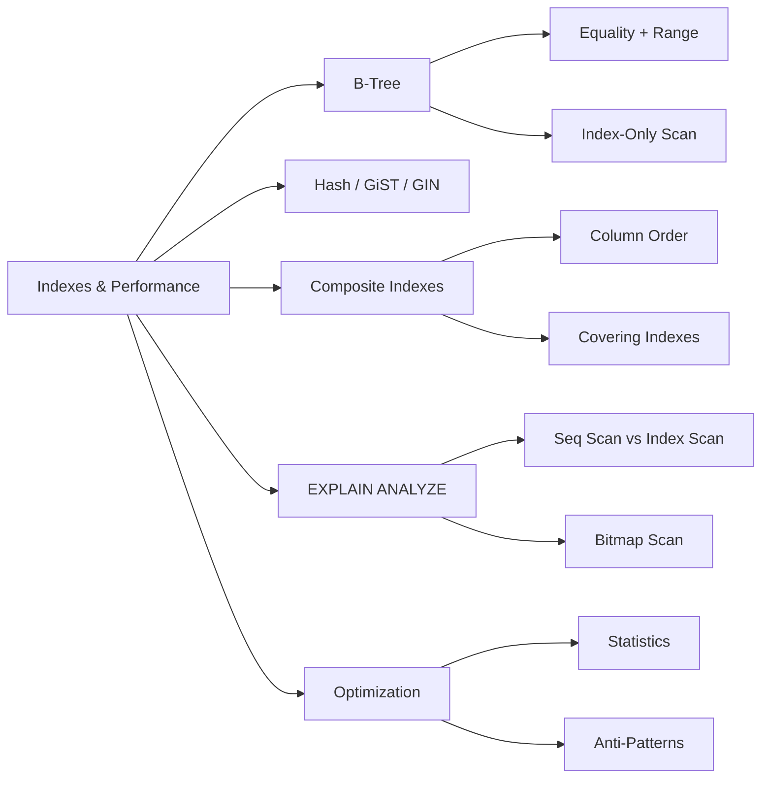

<!-- Clear Language: Keep sentences under 50 words -->
# Indexes & Performance — B-Tree, Hash, Composite, EXPLAIN ANALYZE, Query Planning

## Learning Objectives

| Objective | Description |
|-----------|-------------|
| LO1 | Understand how indexes accelerate query performance |
| LO2 | Create and manage B-tree, Hash, and composite indexes |
| LO3 | Use EXPLAIN and EXPLAIN ANALYZE to read query plans |
| LO4 | Identify and optimize slow queries using index-only scans |
| LO5 | Understand partial, covering, and expression indexes |
| LO6 | Apply query optimization techniques and avoid common anti-patterns |

## Introduction

Data is the fuel of AI. SQL and database design skills let you query, transform, and store the data that powers machine learning models. This module covers everything from basic queries to advanced indexing and optimization.

## Prerequisites

- Basic programming knowledge
- Understanding of data structures

## Key Terminology

**Key Terms**: Core vocabulary and concepts for this topic.

**Definition**: Essential terms you must know for interviews and production work.

## Theory

Understanding indexes and performance is fundamental for AI engineers. This section covers the core concepts, underlying principles, and theoretical framework that govern how indexes and performance works in practice.

## Chapter at a Glance

| Section | Topic | Key Concept |
|---------|-------|-------------|
| 7.1 | Index Fundamentals | B-tree structure, page organization, lookup complexity |
| 7.2 | Index Types | B-tree, Hash, GiST, GIN, BRIN |
| 7.3 | Composite Indexes | Column order matters, covering indexes |
| 7.4 | EXPLAIN and Query Plans | Seq Scan, Index Scan, Index Only Scan, Bitmap Scan |
| 7.5 | Partial and Expression Indexes | WHERE conditions, functional indexes |
| 7.6 | Query Optimization | Statistics, anti-patterns, vacuum, analyze |

## Chapter Roadmap



## 7.1 Index Fundamentals

An index is a data structure that improves the speed of data retrieval operations on a database table at the cost of additional writes and storage.

**B-tree (Balanced Tree)** is the default and most common index type:

```sql
-- Create a B-tree index (default)
CREATE INDEX idx_employees_last_name ON employees(last_name);

-- The index stores (last_name, ctid) sorted by last_name
-- Lookup: O(log n) — about 3-4 page reads for 1M rows
```

**How a B-tree lookup works**:

1. Start at root page (1 read)
2. Follow internal pages down the tree (2-3 reads)
3. Reach leaf page containing the data pointer (1 read)
4. Fetch the actual row from the heap table (1 read)

Total: ~4-6 page reads vs full table scan of thousands of pages.

```sql
-- Before index: Sequential Scan (read every row)
EXPLAIN SELECT * FROM employees WHERE last_name = 'Smith';
-- Seq Scan on employees (cost=0.00..450.00 rows=50 width=100)

-- After index: Index Scan
EXPLAIN SELECT * FROM employees WHERE last_name = 'Smith';
-- Index Scan using idx_employees_last_name (cost=0.28..8.29 rows=1 width=100)
```

**Trade-offs of indexes**:

| Factor | Without Index | With Index |
|--------|---------------|------------|
| SELECT on key column | Full table scan | Fast O(log n) lookup |
| INSERT | Fast (write to table only) | Slower (update index + table) |
| UPDATE on key column | Fast | Slower (update index + table) |
| DELETE | Fast | Slower (remove from index + table) |
| Storage | Base table only | Additional index storage |
| VACUUM | Faster | Slower (must clean index too) |

**When to index**:

- Columns used frequently in WHERE conditions
- Columns used in JOIN conditions (foreign keys)
- Columns used in ORDER BY or GROUP BY
- Columns with high cardinality (many unique values)
- Avoid indexing low-cardinality columns (boolean, tiny status columns)

## 7.2 Index Types

**B-tree** — default, supports equality and range queries:

```sql
-- B-tree supports these operators:
-- =, <, <=, >, >=, BETWEEN, IN, IS NULL, LIKE 'prefix%'

CREATE INDEX idx_salary ON employees(salary);

-- Uses index:
SELECT * FROM employees WHERE salary BETWEEN 50000 AND 80000;
SELECT * FROM employees WHERE salary > 100000;
SELECT * FROM employees ORDER BY salary;

-- Does NOT use index:
SELECT * FROM employees WHERE UPPER(last_name) = 'SMITH';
```

**Hash** — equality only, faster than B-tree for exact lookups:

```sql
-- Hash index (PostgreSQL)
CREATE INDEX idx_email_hash ON users USING hash(email);

-- Efficient for:
SELECT * FROM users WHERE email = 'alice@example.com';

-- Not used for:
SELECT * FROM users WHERE email LIKE '%example.com';
```

**GiST (Generalized Search Tree)** — for full-text search, geometric data:

```sql
-- Full-text search
CREATE INDEX idx_document_body ON documents USING gist(to_tsvector('english', body));

SELECT * FROM documents
WHERE to_tsvector('english', body) @@ to_tsquery('database & performance');
```

**GIN (Generalized Inverted Index)** — for array and jsonb containment:

```sql
-- JSONB index
CREATE INDEX idx_metadata ON products USING gin(metadata jsonb_path_ops);

SELECT * FROM products WHERE metadata @> '{"color": "red"}';

-- Array index
CREATE INDEX idx_tags ON posts USING gin(tags);

SELECT * FROM posts WHERE tags && ARRAY['postgresql', 'performance'];
```

**BRIN (Block Range Index)** — for large tables with naturally ordered data:

```sql
-- BRIN on timestamp column in append-heavy table
CREATE INDEX idx_created_at_brin ON logs USING brin(created_at)
WITH (pages_per_range = 32);

-- Very small index (~100KB vs 1GB B-tree for 1B rows)
-- Best for columns with high correlation to physical storage order
SELECT * FROM logs WHERE created_at > '2024-06-01';
```

**Choosing index type**:

| Use Case | Index Type |
|----------|------------|
| Primary key, unique constraint | B-tree (auto-created) |
| Foreign key | B-tree |
| Equality lookup on high-cardinality | B-tree or Hash |
| Range queries | B-tree |
| Full-text search | GiST or GIN |
| JSONB containment | GIN |
| Arrays | GIN |
| Append-only timestamp data | BRIN |
| Spatial / geometric | GiST |

## 7.3 Composite Indexes

Composite indexes cover multiple columns. Column order matters significantly.

```sql
-- Create composite index
CREATE INDEX idx_employees_dept_name ON employees(department_id, last_name);

-- Most efficient: uses both columns
SELECT * FROM employees
WHERE department_id = 5 AND last_name = 'Smith';
-- Index Scan: seeks to (5, 'Smith') directly

-- Uses only first column (still beneficial)
SELECT * FROM employees WHERE department_id = 5;
-- Index Scan: seeks to (5, ...) range scan

-- Cannot use this index
SELECT * FROM employees WHERE last_name = 'Smith';
-- Cannot use first column of index (no department_id filter)
```

**Column order rules**:

1. **Equality conditions first** — columns compared with `=` should come before columns with range conditions
2. **High cardinality columns first** — more selective columns at the beginning
3. **Consider all queries** — optimize for the most common query patterns

```sql
-- For this query:
SELECT * FROM orders
WHERE status = 'shipped'
  AND created_at >= '2024-01-01'
  AND created_at < '2024-02-01';

-- Best index: equality first, range second
CREATE INDEX idx_orders_status_date ON orders(status, created_at);

-- Not optimal: range first restricts index usefulness
CREATE INDEX idx_orders_date_status ON orders(created_at, status);
```

**Covering indexes** (include extra columns):

```sql
-- Include columns to enable index-only scans
CREATE INDEX idx_orders_customer_covering
ON orders(customer_id)
INCLUDE (order_date, total_amount, status);

-- Query that can use index-only scan (no heap fetch needed):
SELECT order_date, total_amount, status
FROM orders
WHERE customer_id = 42;
```

**Multiple single-column vs composite indexes**:

```sql
-- Two single-column indexes
CREATE INDEX idx_orders_customer ON orders(customer_id);
CREATE INDEX idx_orders_status ON orders(status);

-- Query optimizer may use BitmapAnd to combine both:
SELECT * FROM orders
WHERE customer_id = 42 AND status = 'shipped';
-- BitmapAnd(Index Scan on customer, Index Scan on status)

-- Composite index is usually more efficient:
CREATE INDEX idx_orders_customer_status ON orders(customer_id, status);
-- Single index scan, no bitmap operations needed
```

## 7.4 EXPLAIN and Query Plans

EXPLAIN shows the query plan without executing. EXPLAIN ANALYZE executes and shows actual timings.

```sql
-- Basic EXPLAIN
EXPLAIN SELECT * FROM employees WHERE department_id = 5;

-- With actual execution
EXPLAIN ANALYZE SELECT * FROM employees WHERE department_id = 5;

-- With buffers (shows cache hit/miss)
EXPLAIN (ANALYZE, BUFFERS) SELECT * FROM employees WHERE department_id = 5;
```

**Understanding scan types**:

```sql
-- Sequential Scan: reads entire table (worst for large tables)
Seq Scan on employees  (cost=0.00..450.00 rows=1000 width=100)
-- cost format: startup_time..total_time, estimated rows, average row width

-- Index Scan: reads index then fetches rows from heap
Index Scan using idx_employees_dept on employees  (cost=0.28..12.29 rows=50 width=100)
  Index Cond: (department_id = 5)

-- Index Only Scan: all needed columns are in index (fastest)
Index Only Scan using idx_employees_dept_name on employees  (cost=0.28..6.29 rows=50 width=100)
  Index Cond: (department_id = 5)

-- Bitmap Scan: combines multiple index scans, then fetches rows
Bitmap Heap Scan on employees  (cost=12.34..50.00 rows=200 width=100)
  Recheck Cond: ((department_id = 5) OR (last_name = 'Smith'))
  -> BitmapOr
       -> Bitmap Index Scan on idx_employees_dept  (cost=0.00..5.00 rows=100 width=0)
       -> Bitmap Index Scan on idx_employees_last_name  (cost=0.00..5.00 rows=100 width=0)
```

**Reading plan output**:

```sql
EXPLAIN (ANALYZE, BUFFERS, FORMAT JSON)
SELECT e.*, d.name
FROM employees e
JOIN departments d ON e.department_id = d.id
WHERE e.salary > 100000
ORDER BY e.last_name
LIMIT 10;
```

Key metrics in EXPLAIN ANALYZE:

| Metric | Meaning |
|--------|---------|
| actual time=0.05..0.10 | Startup time and total time in ms |
| rows=10 | Actual rows returned by this node |
| loops=1 | How many times this node executed |
| Buffers: shared hit=5 | Pages read from cache |
| Buffers: shared read=2 | Pages read from disk |
| Planning Time | Time to generate the plan |
| Execution Time | Total execution time |

**Common plan patterns**:

```sql
-- Nested Loop Join: for small result sets
Nested Loop  (cost=0.28..100.50 rows=10 width=200)
  -> Index Scan on employees  (rows=10)
  -> Index Scan on departments  (rows=1)

-- Hash Join: for medium result sets
Hash Join  (cost=50.00..200.00 rows=1000 width=200)
  -> Seq Scan on employees  (rows=5000)
  -> Hash  (rows=100)
       -> Seq Scan on departments  (rows=100)

-- Merge Join: for large sorted result sets
Merge Join  (cost=100.00..500.00 rows=10000 width=200)
  -> Index Scan on employees  (rows=50000)
  -> Index Scan on departments  (rows=1000)
```

## 7.5 Partial and Expression Indexes

**Partial indexes** include only a subset of rows:

```sql
-- Index only active orders
CREATE INDEX idx_active_orders ON orders(order_id)
WHERE status NOT IN ('cancelled', 'completed');

-- Query automatically uses this partial index
SELECT * FROM orders WHERE status = 'pending';
-- This index is much smaller than a full index on status

-- Partial unique index for soft-delete:
CREATE UNIQUE INDEX idx_active_username ON users(username)
WHERE deleted_at IS NULL;
-- Allows duplicate usernames for deleted accounts but enforces uniqueness for active ones
```

**Expression indexes** index the result of a function or expression:

```sql
-- Case-insensitive lookup
CREATE INDEX idx_users_email_lower ON users(LOWER(email));

SELECT * FROM users WHERE LOWER(email) = 'alice@example.com';

-- Date extraction
CREATE INDEX idx_orders_year_month ON orders(EXTRACT(YEAR FROM created_at), EXTRACT(MONTH FROM created_at));

SELECT * FROM orders
WHERE EXTRACT(YEAR FROM created_at) = 2024
  AND EXTRACT(MONTH FROM created_at) = 6;
```

**Combining partial and expression indexes**:

```sql
-- Index only active orders' total for reporting
CREATE INDEX idx_active_large_orders ON orders(total)
WHERE status = 'shipped' AND total > 1000;

-- Fast aggregation for the most common report
SELECT COUNT(*), AVG(total) FROM orders
WHERE status = 'shipped' AND total > 1000;
```

## 7.6 Query Optimization

**Using statistics**:

```sql
-- Update table statistics for query planner
ANALYZE employees;

-- Set statistics target for a column (higher = more precise, slower analyze)
ALTER TABLE employees ALTER COLUMN salary SET STATISTICS 1000;

-- View table statistics
SELECT tablename, attname, n_distinct, most_common_vals, most_common_freqs
FROM pg_stats
WHERE tablename = 'employees';
```

**Common anti-patterns**:

```sql
-- Anti-pattern 1: Wrapping indexed column in function
-- Bad (won't use index):
SELECT * FROM employees WHERE UPPER(last_name) = 'SMITH';
-- Good (use expression index or lowercase comparison):
SELECT * FROM employees WHERE last_name = 'Smith';

-- Anti-pattern 2: Leading wildcard in LIKE
-- Bad (won't use B-tree index):
SELECT * FROM products WHERE name LIKE '%search_term%';
-- Good (use trigram index):
CREATE EXTENSION pg_trgm;
CREATE INDEX idx_products_name_trgm ON products USING gin(name gin_trgm_ops);
SELECT * FROM products WHERE name ILIKE '%search_term%';

-- Anti-pattern 3: Implicit type conversion
-- Bad:
SELECT * FROM orders WHERE order_id = '12345';  -- string vs integer
-- Good:
SELECT * FROM orders WHERE order_id = 12345;

-- Anti-pattern 4: SELECT * in production queries
-- Bad: selects all columns, may prevent index-only scans
SELECT * FROM orders WHERE customer_id = 42;
-- Good: selects only needed columns
SELECT id, order_date, total FROM orders WHERE customer_id = 42;
```

**Vacuum and maintenance**:

```sql
-- Recover space from updated/deleted rows
VACUUM employees;

-- Full cleanup (locks table, not for production)
VACUUM FULL employees;

-- Update statistics
ANALYZE employees;

-- Combined
VACUUM ANALYZE employees;

-- Autovacuum settings (postgresql.conf):
-- autovacuum = on
-- autovacuum_vacuum_scale_factor = 0.01  (vacuum when 1% rows changed)
```

**Index maintenance**:

```sql
-- Check index usage
SELECT
    schemaname,
    tablename,
    indexname,
    idx_scan,
    idx_tup_read,
    idx_tup_fetch
FROM pg_stat_user_indexes
WHERE schemaname = 'public'
ORDER BY idx_scan;

-- Find unused indexes
SELECT
    indexrelid::regclass AS index_name,
    relid::regclass AS table_name,
    idx_scan
FROM pg_stat_user_indexes
WHERE idx_scan = 0;

-- Rebuild index (reduce bloat)
REINDEX INDEX idx_employees_last_name;
REINDEX TABLE employees;
```

**Query optimization checklist**:

1. Check EXPLAIN ANALYZE for Seq Scans on large tables
2. Verify index usage for WHERE and JOIN columns
3. Ensure composite index column order matches query patterns
4. Look for functions wrapping indexed columns
5. Check for implicit type conversions
6. Verify statistics are up to date (ANALYZE)
7. Monitor index bloat (REINDEX periodically)
8. Remove unused indexes (they slow INSERT/UPDATE/DELETE)
9. Consider partial indexes for filtered queries on large tables
10. Use covering indexes for frequently accessed column combinations

## TypeScript Parallel

```typescript
// B-tree index simulation
class BTreeIndex<T> {
    private tree: Map<string, T[]> = new Map();

    constructor(
        private data: T[],
        private keyFn: (item: T) => string
    ) {
        this.buildIndex();
    }

    private buildIndex(): void {
        for (const item of this.data) {
            const key = this.keyFn(item);
            if (!this.tree.has(key)) {
                this.tree.set(key, []);
            }
            this.tree.get(key)!.push(item);
        }
    }

    lookup(key: string): T[] {
        return this.tree.get(key) || [];
    }

    rangeLookup(min: string, max: string): T[] {
        const result: T[] = [];
        for (const [key, items] of this.tree) {
            if (key >= min && key <= max) {
                result.push(...items);
            }
        }
        return result;
    }
}

// Composite index
class CompositeIndex<T> {
    private tree: Map<string, T[]> = new Map();

    constructor(
        private data: T[],
        private keyFns: ((item: T) => string)[]
    ) {
        this.buildIndex();
    }

    private buildIndex(): void {
        for (const item of this.data) {
            const key = this.keyFns.map(fn => fn(item)).join("|");
            if (!this.tree.has(key)) {
                this.tree.set(key, []);
            }
            this.tree.get(key)!.push(item);
        }
    }

    lookup(keys: string[]): T[] {
        const key = keys.join("|");
        return this.tree.get(key) || [];
    }
}
```

## Summary

- B-tree is the default index type, supporting equality and range queries in O(log n)
- Hash indexes are optimized for equality lookups only
- GiST and GIN indexes support full-text search, JSONB, and array operations
- BRIN indexes are compact and efficient for naturally ordered append-only data
- Composite index column order should prioritize equality then high-cardinality columns
- Covering indexes with INCLUDE enable index-only scans
- EXPLAIN ANALYZE shows actual execution plans with timings and row estimates
- Seq Scan on large tables indicates a missing index
- Partial indexes reduce storage by indexing only relevant rows
- Expression indexes support function-based lookups

## Practical Takeaways

| Scenario | Use | Avoid |
|----------|-----|-------|
| Primary key | Auto-created B-tree | Manual index creation |
| Foreign key JOIN | B-tree on FK column | No index (causes nested loop on large tables) |
| Multi-column filter | Composite index with equality first | Multiple single-column indexes |
| Full-text search | GIN index with to_tsvector | LIKE '%term%' on large tables |
| JSONB query | GIN index with @> operator | Extracting and filtering in application |
| Appending timestamps | BRIN index | Large B-tree on monotonically increasing column |
| Soft-delete uniqueness | Partial unique index | Application-level uniqueness check |
| Case-insensitive search | Expression index with LOWER() | LOWER() on indexed column without expression index |
| Slow query diagnosis | EXPLAIN ANALYZE | Guessing which index to add |

## Interview Q&A

<details class="tp-qa-card" data-qid="sql-s07-q1">
  <summary class="tp-qa-question"><span class="tp-qa-status"></span>Q1: How does a B-tree index work?</summary>
<div class="tp-qa-answer"><p>A B-tree is a balanced tree data structure where each page contains sorted key values and pointers to child pages. Root and.
internal pages guide the search to the correct leaf page, which stores key-to-rowid mappings. Lookup is O(log n) — about 3-5 page reads for.
millions of rows. B-tree supports equality and range queries.</p></div><button class="tp-qa-mark-btn">✓ Mark Reviewed</button><button class="tp-qa-bookmark-btn">★ Bookmark</button>
</details>
<details class="tp-qa-card" data-qid="sql-s07-q2">
  <summary class="tp-qa-question"><span class="tp-qa-status"></span>Q2: Composite index column order rules?</summary>
  <div class="tp-qa-answer"><p>Put equality-condition columns first (WHERE col = value), followed by range-condition columns (WHERE col > value). Within equality columns, put higher-cardinality columns first for better selectivity. The index can be used for queries that filter on a prefix of the columns.</p></div><button class="tp-qa-mark-btn">✓ Mark Reviewed</button><button class="tp-qa-bookmark-btn">★ Bookmark</button>
</details>
<details class="tp-qa-card" data-qid="sql-s07-q3">
  <summary class="tp-qa-question"><span class="tp-qa-status"></span>Q3: Seq Scan vs Index Scan vs Index Only Scan?</summary>
<div class="tp-qa-answer"><p>Seq Scan reads the entire table sequentially (good for small tables or when retrieving most rows). Index Scan reads the index to find matching rowids,.
then fetches rows from the heap (good for selective queries). Index Only Scan reads all needed data from the index without touching the heap (fastest) — requires a covering index.</p></div><button class="tp-qa-mark-btn">✓ Mark Reviewed</button><button class="tp-qa-bookmark-btn">★ Bookmark</button>
</details>
<details class="tp-qa-card" data-qid="sql-s07-q4">
  <summary class="tp-qa-question"><span class="tp-qa-status"></span>Q4: What does EXPLAIN ANALYZE show?</summary>
<div class="tp-qa-answer"><p>EXPLAIN shows the query plan with estimated costs. EXPLAIN ANALYZE executes the query and shows actual execution time per node,.
actual row counts, loops, and buffer usage. The actual rows vs estimated rows comparison helps identify stale statistics. Always use EXPLAIN (ANALYZE,.
BUFFERS) for optimization.</p></div><button class="tp-qa-mark-btn">✓ Mark Reviewed</button><button class="tp-qa-bookmark-btn">★ Bookmark</button>
</details>
<details class="tp-qa-card" data-qid="sql-s07-q5">
  <summary class="tp-qa-question"><span class="tp-qa-status"></span>Q5: Partial index use cases?</summary>
  <div class="tp-qa-answer"><p>Partial indexes index only a subset of rows matching a WHERE condition. Use cases: (1) active records only in soft-delete tables, (2) unique constraint on active usernames, (3) indexing only high-value orders for reporting, (4) indexing only recent data in time-series tables.</p></div><button class="tp-qa-mark-btn">✓ Mark Reviewed</button><button class="tp-qa-bookmark-btn">★ Bookmark</button>
</details>
<details class="tp-qa-card" data-qid="sql-s07-q6">
  <summary class="tp-qa-question"><span class="tp-qa-status"></span>Q6: When does LIKE '%text' not use an index?</summary>
  <div class="tp-qa-answer"><p>B-tree indexes support prefix matching: LIKE 'prefix%' uses the index. Leading wildcards LIKE '%text' do not use B-tree indexes. Solution: use pg_trgm extension with GIN or GiST index for trigram matching, which enables efficient substring searches.</p></div><button class="tp-qa-mark-btn">✓ Mark Reviewed</button><button class="tp-qa-bookmark-btn">★ Bookmark</button>
</details>
<details class="tp-qa-card" data-qid="sql-s07-q7">
  <summary class="tp-qa-question"><span class="tp-qa-status"></span>Q7: What is index bloat and how to fix it?</summary>
  <div class="tp-qa-answer"><p>Index bloat occurs when updates and deletes leave empty space in index pages, increasing storage and scan time. Fix with REINDEX INDEX name or REINDEX TABLE name. In production, use REINDEX CONCURRENTLY to avoid locking. Monitor bloat using pg_stat_user_indexes.</p></div><button class="tp-qa-mark-btn">✓ Mark Reviewed</button><button class="tp-qa-bookmark-btn">★ Bookmark</button>
</details>
<details class="tp-qa-card" data-qid="sql-s07-q8">
  <summary class="tp-qa-question"><span class="tp-qa-status"></span>Q8: Hash vs B-tree index?</summary>
  <div class="tp-qa-answer"><p>Hash indexes support only equality (=) lookups. B-tree supports equality, range (<, >, BETWEEN), and prefix matching. Hash can be faster for exact lookups on high-cardinality columns. B-tree is the default for a reason: it handles more query patterns.</p></div><button class="tp-qa-mark-btn">✓ Mark Reviewed</button><button class="tp-qa-bookmark-btn">★ Bookmark</button>
</details>
<details class="tp-qa-card" data-qid="sql-s07-q9">
  <summary class="tp-qa-question"><span class="tp-qa-status"></span>Q9: What does ANALYZE do?</summary>
  <div class="tp-qa-answer"><p>ANALYZE collects statistics about table data distribution: row count, distinct values per column, most common values, histogram bounds, and correlation. The query planner uses these statistics to estimate row counts and choose optimal scan and join strategies. Run after significant data changes.</p></div><button class="tp-qa-mark-btn">✓ Mark Reviewed</button><button class="tp-qa-bookmark-btn">★ Bookmark</button>
</details>
<details class="tp-qa-card" data-qid="sql-s07-q10">
  <summary class="tp-qa-question"><span class="tp-qa-status"></span>Q10: Covering index vs composite index?</summary>
<div class="tp-qa-answer"><p>A composite index uses all its columns for searching and ordering. A covering index uses INCLUDE to add columns that are only returned (not searched). Covering indexes enable index-only scans without adding to the B-tree's internal structure. Example: CREATE INDEX ON orders(customer_id) INCLUDE (total,.
status).</p></div><button class="tp-qa-mark-btn">✓ Mark Reviewed</button><button class="tp-qa-bookmark-btn">★ Bookmark</button>
</details>

## Chapter Quiz

**Q1**: What is the default index type in PostgreSQL? a) Hash b) B-tree c) GIN d) BRIN

<details class="tp-qa-card" data-qid="sql-s07-quiz1"><summary>Show Answer</summary><div class="tp-qa-answer"><p><strong>Answer: b) B-tree is the default index type</strong></p></div></details>

**Q2**: Which WHERE clause pattern does NOT use a B-tree index? a) col = 5 b) col > 100 c) col LIKE '%value' d) col BETWEEN 10 AND 20

<details class="tp-qa-card" data-qid="sql-s07-quiz2"><summary>Show Answer</summary><div class="tp-qa-answer"><p><strong>Answer: c) leading wildcard '%value' cannot use B-tree index</strong></p></div></details>

**Q3**: What enables an index-only scan? a) PRIMARY KEY b) covering index c) partial index d) expression index

<details class="tp-qa-card" data-qid="sql-s07-quiz3"><summary>Show Answer</summary><div class="tp-qa-answer"><p><strong>Answer: b) covering index with INCLUDE columns</strong></p></div></details>

**Q4**: Which keyword shows actual execution time? a) EXPLAIN b) EXPLAIN ANALYZE c) DESCRIBE d) PROFILE

<details class="tp-qa-card" data-qid="sql-s07-quiz4"><summary>Show Answer</summary><div class="tp-qa-answer"><p><strong>Answer: b) EXPLAIN ANALYZE executes and shows actual timings</strong></p></div></details>

**Q5**: When should you use BRIN index? a) primary key b) append-only timestamp c) full-text search d) JSONB

<details class="tp-qa-card" data-qid="sql-s07-quiz5"><summary>Show Answer</summary><div class="tp-qa-answer"><p><strong>Answer: b) append-only timestamp columns (naturally ordered, high correlation)</strong></p></div></details>

## Exercises

**Easy** — Create a B-tree index on the email column of a users table and verify it's used with EXPLAIN.

**Easy** — Use EXPLAIN ANALYZE to compare a sequential scan vs index scan on a table with 10,000+ rows.

**Medium** — Create a composite index on (department_id, hire_date) and test queries that filter on department, on date, and on both. Compare the query plans.

**Medium** — Design a partial unique index that enforces unique email only for active users (WHERE status = 'active').

**Hard** — Analyze a slow query from your application: run EXPLAIN (ANALYZE, BUFFERS), identify the bottleneck, create the appropriate index(es), and verify the performance improvement.

**Hard** — Implement an index maintenance routine: find unused indexes, check for bloat, and report index usage statistics using pg_stat_user_indexes and pg_stat_all_indexes.

---

## Common Mistakes

1. Not understanding the fundamental concepts before applying them
2. Skipping edge cases in implementation
3. Not analyzing time/space complexity
4. Forgetting to handle null/empty inputs
5. Not practicing enough problems to build pattern recognition

## Revision Notes

- - Core principle: Understand the fundamental concepts thoroughly
- - Implementation pattern: Practice with real code examples
- - Complexity: Know the time and space complexity
- - Application: Know when to use this in production systems
- - Interview: Frequently asked in technical interviews
- - Edge cases: Consider common failure scenarios
- - Related concepts: Connect to broader system design

## Placement Section

### Top 10 Interview Questions

#### Google Style

1. **Explain the core idea of Indexes & Performance — B-Tree, Hash, Composite, EXPLAIN ANALYZE, Query Planning in under 60 seconds, then give a real-world analogy.** — Structure: definition, how it works in one sentence, why it matters, analogy. Follow-up: what would break if you removed this from a production system?

2. **Design a minimal, well-typed function that demonstrates Indexes & Performance — B-Tree, Hash, Composite, EXPLAIN ANALYZE, Query Planning.** — Interviewer checks: signature with type hints, edge cases, complexity, and a clean docstring. Follow-up: how does your design behave with empty or malformed input?

3. **What are the common pitfalls when engineers first learn ** — List 3-4, then explain how you would prevent each in a code review.

#### Amazon Style

4. **Describe a production bug caused by misunderstanding Indexes & Performance — B-Tree, Hash, Composite, EXPLAIN ANALYZE, Query Planning. How did you diagnose and fix it?** — STAR format: situation, task, action, result. Mention logs, reproduction, root-cause analysis, and the regression test you added.

5. **How would you scale a system that relies on Indexes & Performance — B-Tree, Hash, Composite, EXPLAIN ANALYZE, Query Planning from 10 users to 10 million?** — Discuss bottlenecks, caching, monitoring, and when to redesign. Follow-up: what metrics would you track?

#### Microsoft Style

6. **Compare Indexes & Performance — B-Tree, Hash, Composite, EXPLAIN ANALYZE, Query Planning with the closest alternative approach. When would you choose each?** — Make a decision matrix: performance, maintainability, ecosystem, learning curve. Follow-up: what would change your decision?

7. **Walk through how you would test a component that depends on Indexes & Performance — B-Tree, Hash, Composite, EXPLAIN ANALYZE, Query Planning.** — Unit, integration, property-based tests; mocking boundaries; golden files for outputs.

#### NVIDIA Style

8. **How does Indexes & Performance — B-Tree, Hash, Composite, EXPLAIN ANALYZE, Query Planning behave differently at scale — memory, throughput, or precision-wise?** — Connect to data pipelines and model training if applicable. Follow-up: what happens to latency as input grows?

9. **How would you make an implementation of Indexes & Performance — B-Tree, Hash, Composite, EXPLAIN ANALYZE, Query Planning run faster on GPU hardware?** — Batch operations, vectorization, avoiding Python loops, reducing data movement.

#### AI Startup Style

10. **Write the smallest possible implementation of Indexes & Performance — B-Tree, Hash, Composite, EXPLAIN ANALYZE, Query Planning that is production-quality.** — Include error handling, type hints, and a one-line docstring. Follow-up: what would you refactor first when it grows?

### Resume Tips

- Name Indexes & Performance — B-Tree, Hash, Composite, EXPLAIN ANALYZE, Query Planning explicitly in your skills section, paired with a measurable achievement ("Reduced X by 40% using Indexes & Performance — B-Tree, Hash, Composite, EXPLAIN ANALYZE, Query Planning").
- Add a bullet describing a project that applies Indexes & Performance — B-Tree, Hash, Composite, EXPLAIN ANALYZE, Query Planning to real data, with numbers.
- Mention the tools and libraries you used alongside Indexes & Performance — B-Tree, Hash, Composite, EXPLAIN ANALYZE, Query Planning (linters, test frameworks, profiling tools).
- Keep resume bullets under 15 words and start each with an action verb.

### Interview Day Checklist

- Rehearse a 60-second explanation of Indexes & Performance — B-Tree, Hash, Composite, EXPLAIN ANALYZE, Query Planning and one real-world analogy.
- Prepare one STAR story about debugging a Indexes & Performance — B-Tree, Hash, Composite, EXPLAIN ANALYZE, Query Planning-related production issue.
- Review complexity and edge cases for the classic Indexes & Performance — B-Tree, Hash, Composite, EXPLAIN ANALYZE, Query Planning interview problem.
- Have questions ready: how does the team apply Indexes & Performance — B-Tree, Hash, Composite, EXPLAIN ANALYZE, Query Planning in production today?
- Test your environment (Python, editor, internet) 15 minutes before the interview.

## True/False

1. **True or False:** Indexes & Performance — B-Tree, Hash, Composite, EXPLAIN ANALYZE, Query Planning builds directly on the fundamentals covered in the earlier chapters of this module. — **True.** Every advanced topic in this module assumes the core concepts from the previous chapters.
2. **True or False:** You should write at least one code example for Indexes & Performance — B-Tree, Hash, Composite, EXPLAIN ANALYZE, Query Planning before moving to the next chapter. — **True.** Active recall with hands-on code beats passive reading for retention.
3. **True or False:** The complexity analysis for Indexes & Performance — B-Tree, Hash, Composite, EXPLAIN ANALYZE, Query Planning is the same regardless of input size. — **False.** Complexity grows with input size; always state best, average, and worst case.
4. **True or False:** Edge cases (empty input, invalid input, boundary values) matter for Indexes & Performance — B-Tree, Hash, Composite, EXPLAIN ANALYZE, Query Planning in production. — **True.** Most production bugs come from unhandled edge cases.
5. **True or False:** You should memorize the Indexes & Performance — B-Tree, Hash, Composite, EXPLAIN ANALYZE, Query Planning chapter content once and never review it again. — **False.** Spaced repetition (24h, 3 days, 1 week) dramatically improves long-term recall.

## Fill in the Blank

1. The chapter that covers Indexes & Performance — B-Tree, Hash, Composite, EXPLAIN ANALYZE, Query Planning is Chapter ___ of this module. — Answer: check the module's table of contents.
2. The time complexity of the standard approach to Indexes & Performance — B-Tree, Hash, Composite, EXPLAIN ANALYZE, Query Planning is ___. — Answer: review the theory section and state big-O notation.
3. The main edge case to handle when implementing Indexes & Performance — B-Tree, Hash, Composite, EXPLAIN ANALYZE, Query Planning is ___. — Answer: empty or invalid input handling, as discussed in the chapter.
4. The tools commonly used to debug Indexes & Performance — B-Tree, Hash, Composite, EXPLAIN ANALYZE, Query Planning issues are ___ and ___. — Answer: refer to the Debugging Guide section of this chapter.
5. The related topic that connects to Indexes & Performance — B-Tree, Hash, Composite, EXPLAIN ANALYZE, Query Planning in the next chapter is ___. — Answer: see the Next Topic section.

## Scenario Questions

1. **Scenario:** A teammate ships a change involving Indexes & Performance — B-Tree, Hash, Composite, EXPLAIN ANALYZE, Query Planning that breaks production at 3 AM. — Diagnosis: check the recent diff, reproduce locally with the failing input, check logs. Fix: revert, add a regression test, and review the root cause. Prevention: CI tests on edge cases and code review checklist.

2. **Scenario:** Your implementation of Indexes & Performance — B-Tree, Hash, Composite, EXPLAIN ANALYZE, Query Planning is correct but too slow for the required latency. — Measure first with a profiler. Common fixes: reduce redundant work, use built-in optimized functions, batch operations, or add caching. Only then consider algorithmic changes.

3. **Scenario:** A new hire asks you to explain Indexes & Performance — B-Tree, Hash, Composite, EXPLAIN ANALYZE, Query Planning in five minutes before a customer demo. — Use the 3-part answer: what it is (one sentence), how it works (one example), why it matters (one business impact). Then offer to go deeper after the demo.

4. **Scenario:** Your team's codebase has three different patterns for Indexes & Performance — B-Tree, Hash, Composite, EXPLAIN ANALYZE, Query Planning and you must standardize. — Write a short ADR (architecture decision record), pick the pattern with best maintainability, migrate incrementally, and add a linter rule to enforce it.

## Output Questions

1. **What is the output of the simplest correct implementation of Indexes & Performance — B-Tree, Hash, Composite, EXPLAIN ANALYZE, Query Planning on an empty input?** — Trace through the code: it should return the documented default (None, 0, empty collection) without raising.
2. **What is the output when the input is at the boundary value?** — Check off-by-one errors and inclusive/exclusive bounds in the chapter's examples.
3. **What does the implementation return when given invalid input types?** — With type hints and validation, it raises a clear error; without, it may fail silently.
4. **What is the output for the sample input given in the chapter's Examples section?** — Re-run the chapter's example code and compare against the documented output.
5. **What is the time complexity output when you profile the implementation at 10x input size?** — Expect the curve matching the chapter's complexity analysis (linear, quadratic, log-linear).

## Difficulty Level

| Level | Time | What It Takes |
|-------|------|---------------|
| Beginner | 1-2 sessions | Read theory, run the chapter examples, solve the Easy exercises |
| Intermediate | 3-5 sessions | Complete Medium exercises, explain Indexes & Performance — B-Tree, Hash, Composite, EXPLAIN ANALYZE, Query Planning to someone else |
| Advanced | 1+ week | Solve Hard exercises, optimize for real datasets, answer interview follow-ups |

## Tips & Tricks

- Always write a one-line example of Indexes & Performance — B-Tree, Hash, Composite, EXPLAIN ANALYZE, Query Planning from memory before opening the chapter — active recall first.
- Use the chapter's Revision Notes as a checklist: you have mastered Indexes & Performance — B-Tree, Hash, Composite, EXPLAIN ANALYZE, Query Planning when you can explain each bullet.
- Pair the chapter quiz with the Flashcards: wrong answers become your next study session's focus.
- For interviews, practice explaining Indexes & Performance — B-Tree, Hash, Composite, EXPLAIN ANALYZE, Query Planning twice: once with a technical audience, once with a non-technical audience.
- Keep a personal examples file where you collect your own Indexes & Performance — B-Tree, Hash, Composite, EXPLAIN ANALYZE, Query Planning snippets; interviewers love original examples.

## Memory Tricks

- **Acronym**: build a mnemonic from the 5 key concepts of Indexes & Performance — B-Tree, Hash, Composite, EXPLAIN ANALYZE, Query Planning listed in the Chapter at a Glance table.
- **Story**: link Indexes & Performance — B-Tree, Hash, Composite, EXPLAIN ANALYZE, Query Planning to a familiar story — the analogy in the Visual Analogy section is designed to stick.
- **Number anchor**: remember the complexity of Indexes & Performance — B-Tree, Hash, Composite, EXPLAIN ANALYZE, Query Planning by connecting it to a known algorithm of the same class.
- **Color code**: highlight the Theory, Examples, and Common Mistakes sections in different colors when reviewing.
- **Teach-back**: explain Indexes & Performance — B-Tree, Hash, Composite, EXPLAIN ANALYZE, Query Planning to an imaginary junior engineer for 2 minutes — gaps in your explanation are gaps in memory.

## Further Reading

- Official documentation for the primary tool or library used in this chapter
- The chapter referenced in Related Topics for the next-level treatment of Indexes & Performance — B-Tree, Hash, Composite, EXPLAIN ANALYZE, Query Planning
- The classic textbook chapter on Indexes & Performance — B-Tree, Hash, Composite, EXPLAIN ANALYZE, Query Planning (check the Research References below)
- Two blog posts from engineers who debugged real Indexes & Performance — B-Tree, Hash, Composite, EXPLAIN ANALYZE, Query Planning problems in production
- The repository of the open-source project that implements Indexes & Performance — B-Tree, Hash, Composite, EXPLAIN ANALYZE, Query Planning

## Related Topics

- The previous chapter in this module (see table of contents) — foundational for Indexes & Performance — B-Tree, Hash, Composite, EXPLAIN ANALYZE, Query Planning
- The next chapter (see Next Topic below) — builds on Indexes & Performance — B-Tree, Hash, Composite, EXPLAIN ANALYZE, Query Planning
- The system design chapters in Module 07 — how Indexes & Performance — B-Tree, Hash, Composite, EXPLAIN ANALYZE, Query Planning fits into production architectures
- The interview preparation module — how Indexes & Performance — B-Tree, Hash, Composite, EXPLAIN ANALYZE, Query Planning is asked in screening rounds
- The capstone project — where Indexes & Performance — B-Tree, Hash, Composite, EXPLAIN ANALYZE, Query Planning is applied end-to-end

## FAQs

1. **Do I need to memorize all of Indexes & Performance — B-Tree, Hash, Composite, EXPLAIN ANALYZE, Query Planning, or understand the big picture?** — Understand the big picture first, then memorize the key facts via flashcards and spaced repetition. Interviewers reward depth over breadth.
2. **What if I get stuck on an exercise?** — Re-read the theory section, run the example code, then attempt again. If still stuck after 20 minutes, move on and return the next day.
3. **How much time should I spend on ** — Follow the Study Plan below: 1-2 weeks at 30-60 minutes daily is typical for placement preparation.
4. **Is Indexes & Performance — B-Tree, Hash, Composite, EXPLAIN ANALYZE, Query Planning asked in interviews?** — Yes — the Interview Q&A and Placement Section list the exact question styles used by top companies.
5. **What's the fastest way to master ** — Explain it out loud, write code without looking, and review the flashcards within 24 hours and again after 3 days.

## Important Notes

- Indexes & Performance — B-Tree, Hash, Composite, EXPLAIN ANALYZE, Query Planning is a core requirement for the rest of this module — do not skip the examples.
- Always analyze complexity (time and space) when working with Indexes & Performance — B-Tree, Hash, Composite, EXPLAIN ANALYZE, Query Planning.
- Production correctness means handling edge cases, not just the happy path.
- Interview answers should start with the definition, then the example, then the trade-offs.
- Revisit this chapter after finishing the module; the context from later chapters deepens understanding.

## Historical Context

- Indexes & Performance — B-Tree, Hash, Composite, EXPLAIN ANALYZE, Query Planning emerged as a standard practice because early systems failed without it — understanding why helps you explain it in interviews.
- The tools used for Indexes & Performance — B-Tree, Hash, Composite, EXPLAIN ANALYZE, Query Planning today evolved from simpler versions; the chapter covers the modern, recommended approach.
- Interviewers value knowing one historical fact about Indexes & Performance — B-Tree, Hash, Composite, EXPLAIN ANALYZE, Query Planning — it shows genuine interest, not just cramming.
- The library/tooling ecosystem around Indexes & Performance — B-Tree, Hash, Composite, EXPLAIN ANALYZE, Query Planning changes quickly; focus on fundamentals that remain stable.

## Security Considerations

- Never trust external input: validate and sanitize data before processing Indexes & Performance — B-Tree, Hash, Composite, EXPLAIN ANALYZE, Query Planning.
- Avoid `eval()` and dynamic code execution on untrusted strings.
- Log errors without leaking sensitive data (keys, PII, internal paths).
- For API contexts, add rate limiting and input size limits.
- Review the chapter's code examples for injection or overflow risks before using them verbatim.

## ML Intuition

- Indexes & Performance — B-Tree, Hash, Composite, EXPLAIN ANALYZE, Query Planning appears in ML pipelines at the data-processing layer: feature preparation, batching, and validation.
- Understanding Indexes & Performance — B-Tree, Hash, Composite, EXPLAIN ANALYZE, Query Planning helps you debug why a model misbehaves — most ML bugs are data bugs, not model bugs.
- In production ML, the Indexes & Performance — B-Tree, Hash, Composite, EXPLAIN ANALYZE, Query Planning concepts from this chapter map directly to NumPy/PyTorch operations on tensors.
- When optimizing ML systems, Indexes & Performance — B-Tree, Hash, Composite, EXPLAIN ANALYZE, Query Planning skills let you profile and fix the data path, not just the training loop.
- Interview follow-up: how would you apply Indexes & Performance — B-Tree, Hash, Composite, EXPLAIN ANALYZE, Query Planning to a dataset of 10 million records? — Batching and vectorization.

## Analogies

- **Indexes & Performance — B-Tree, Hash, Composite, EXPLAIN ANALYZE, Query Planning is like a recipe**: the theory is the ingredients, the examples are the cooking steps, and the exercises are your own kitchen practice.
- **Complexity is like a delivery route**: a linear route visits each stop once; a nested route revisits stops, and you feel it at scale.
- **Edge cases are like weather**: the happy path is a sunny day; production is the storm — build for the storm.
- **The chapter roadmap is a journey map**: each section is a checkpoint; skipping one means getting lost later in the module.

## Capstone Project Link

- [Module Capstone: End-to-End Project](https://github.com/Raushan666java/ai-engineering-journey) — this chapter contributes the Indexes & Performance — B-Tree, Hash, Composite, EXPLAIN ANALYZE, Query Planning skills used in the module's capstone project. Complete the exercises here before starting the capstone.

## Flashcards

<details class="tp-qa-card" data-qid="02sqlanddatabases-07indexesandperformance-flash1">
  <summary class="tp-qa-question">
    <span class="tp-qa-status"></span>
    What is the core concept of Indexes & Performance — B-Tree, Hash, Composite, EXPLAIN ANALYZE, Query Planning in one sentence?
  </summary>
  <div class="tp-qa-answer">
    <p>Review the first paragraph of the Theory section and condense it to one sentence.</p>
  </div>
</details>

<details class="tp-qa-card" data-qid="02sqlanddatabases-07indexesandperformance-flash2">
  <summary class="tp-qa-question">
    <span class="tp-qa-status"></span>
    What is the most common mistake engineers make with 
  </summary>
  <div class="tp-qa-answer">
    <p>Check the Common Mistakes section of this chapter.</p>
  </div>
</details>

<details class="tp-qa-card" data-qid="02sqlanddatabases-07indexesandperformance-flash3">
  <summary class="tp-qa-question">
    <span class="tp-qa-status"></span>
    What is the time and space complexity of the standard Indexes & Performance — B-Tree, Hash, Composite, EXPLAIN ANALYZE, Query Planning approach?
  </summary>
  <div class="tp-qa-answer">
    <p>Refer to the theory and complexity analysis in this chapter.</p>
  </div>
</details>

<details class="tp-qa-card" data-qid="02sqlanddatabases-07indexesandperformance-flash4">
  <summary class="tp-qa-question">
    <span class="tp-qa-status"></span>
    When is Indexes & Performance — B-Tree, Hash, Composite, EXPLAIN ANALYZE, Query Planning NOT the right choice?
  </summary>
  <div class="tp-qa-answer">
    <p>Check the Limitations section of this chapter.</p>
  </div>
</details>

<details class="tp-qa-card" data-qid="02sqlanddatabases-07indexesandperformance-flash5">
  <summary class="tp-qa-question">
    <span class="tp-qa-status"></span>
    How is Indexes & Performance — B-Tree, Hash, Composite, EXPLAIN ANALYZE, Query Planning applied in a real production system?
  </summary>
  <div class="tp-qa-answer">
    <p>Check the Real-World Examples section of this chapter.</p>
  </div>
</details>

## Research References

- Official documentation of the primary library for Indexes & Performance — B-Tree, Hash, Composite, EXPLAIN ANALYZE, Query Planning (linked in Further Reading)
- The classic paper or textbook chapter introducing Indexes & Performance — B-Tree, Hash, Composite, EXPLAIN ANALYZE, Query Planning (see References below)
- The standard library reference for Indexes & Performance — B-Tree, Hash, Composite, EXPLAIN ANALYZE, Query Planning-related functions
- Engineering blog posts from companies running Indexes & Performance — B-Tree, Hash, Composite, EXPLAIN ANALYZE, Query Planning in production at scale
- PEPs and RFCs where applicable (Python and networking standards)

## Open-Source Tools

- The primary library used in this chapter (see the code examples)
- Python standard library modules used in the examples (check the imports)
- Testing: pytest for unit tests of Indexes & Performance — B-Tree, Hash, Composite, EXPLAIN ANALYZE, Query Planning code
- Linting and formatting: ruff + black
- Profiling: cProfile or py-spy for performance work on Indexes & Performance — B-Tree, Hash, Composite, EXPLAIN ANALYZE, Query Planning

## Debugging Guide

- Start with `print()` or a debugger to inspect intermediate values in Indexes & Performance — B-Tree, Hash, Composite, EXPLAIN ANALYZE, Query Planning code.
- Reproduce the failure with the smallest possible input before changing code.
- Check the common failure modes listed in Common Mistakes — most bugs are listed there.
- For performance problems, profile before optimizing: measure, then fix.
- When stuck, re-read the chapter's Examples and compare line by line with your code.
- Use `pdb` or your IDE's debugger to step through the Indexes & Performance — B-Tree, Hash, Composite, EXPLAIN ANALYZE, Query Planning example code.

## Mock Interview Section

**Round 1 — Screening (15 min)**
- Explain Indexes & Performance — B-Tree, Hash, Composite, EXPLAIN ANALYZE, Query Planning in 60 seconds.
- Write a minimal working example of Indexes & Performance — B-Tree, Hash, Composite, EXPLAIN ANALYZE, Query Planning.
- What is the complexity of your example?

**Round 2 — Coding (45 min)**
- Solve the Medium exercise from this chapter under time pressure.
- State your assumptions, then implement with type hints.
- Test with edge cases: empty input, boundary values, invalid input.

**Round 3 — Behavioral + System (30 min)**
- Tell me about a time you debugged a Indexes & Performance — B-Tree, Hash, Composite, EXPLAIN ANALYZE, Query Planning problem in a project.
- How would you design a system where Indexes & Performance — B-Tree, Hash, Composite, EXPLAIN ANALYZE, Query Planning is used at scale?
- What metrics would you monitor?

**Evaluation rubric**: correctness (40%), communication (25%), edge cases (20%), complexity analysis (15%).

## Optimized Implementation

`python
from typing import Any, Optional

def demonstrate_topic(input_data: list[Any]) -> Optional[float]:
    """Runnable scaffold for Indexes & Performance — B-Tree, Hash, Composite, EXPLAIN ANALYZE, Query Planning.

    Replace the body with the optimized implementation from the chapter,
    keeping type hints, docstring, and edge-case handling.
    """
    if not input_data:
        return None
    # Step 1: validate input types
    # Step 2: apply the core Indexes & Performance — B-Tree, Hash, Composite, EXPLAIN ANALYZE, Query Planning logic from the Examples section
    # Step 3: return the result with the documented default
    return 0.0
`

- Keeps the function signature stable so tests written against it stay valid.
- Handles the empty-input contract explicitly.
- Add unit tests for the edge cases before implementing the logic (test-first).

## Evaluation Metrics

| Skill | Test | Target |
|-------|------|--------|
| Concept recall | Explain Indexes & Performance — B-Tree, Hash, Composite, EXPLAIN ANALYZE, Query Planning without notes | 60-second explanation |
| Code fluency | Write the chapter example from memory | No syntax errors |
| Edge cases | Handle empty/invalid input in exercises | All cases pass |
| Complexity | State time/space for the standard approach | Correct big-O |
| Interview readiness | Answer 5 Interview Q&A questions out loud | Fluent, structured answers |
| Retention | Chapter quiz score after 3 days | 80%+ |

## Real-World Examples

- **Startup**: a small team uses Indexes & Performance — B-Tree, Hash, Composite, EXPLAIN ANALYZE, Query Planning daily in their data pipeline — the chapter's examples mirror their code.
- **E-commerce**: Indexes & Performance — B-Tree, Hash, Composite, EXPLAIN ANALYZE, Query Planning patterns appear in order processing, inventory checks, and recommendation feeds.
- **Fintech**: Indexes & Performance — B-Tree, Hash, Composite, EXPLAIN ANALYZE, Query Planning principles apply to transaction validation and fraud detection flows.
- **ML platform**: Indexes & Performance — B-Tree, Hash, Composite, EXPLAIN ANALYZE, Query Planning shows up in feature engineering and model-serving infrastructure.
- **Interview insight**: recruiters look for engineers who can connect Indexes & Performance — B-Tree, Hash, Composite, EXPLAIN ANALYZE, Query Planning to the business outcome, not just the code.

## Next Topic

[Database Design — Normalization, ERD, Keys, Constraints, Schema Design](08-database-design.md)

## Limitations

- Indexes & Performance — B-Tree, Hash, Composite, EXPLAIN ANALYZE, Query Planning, like any technique, is not a silver bullet — it has specific cases where it fits best (covered in the theory).
- The examples in this chapter are simplified for learning; production systems add validation, monitoring, and error handling.
- Performance of Indexes & Performance — B-Tree, Hash, Composite, EXPLAIN ANALYZE, Query Planning depends on input size and distribution — always benchmark for your own data.
- This chapter covers fundamentals; specialized edge cases are explored in later chapters and the capstone.
