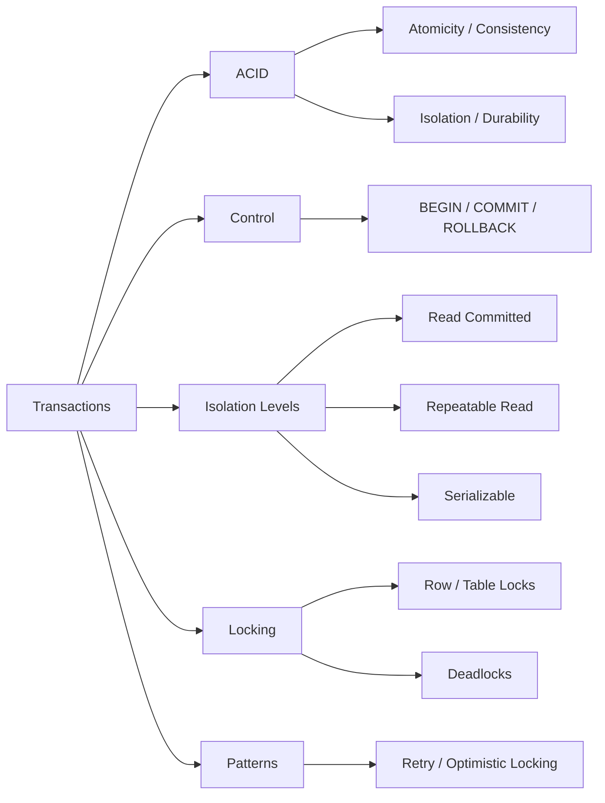

<!-- Clear Language: Keep sentences under 50 words -->
# Transactions & ACID — BEGIN, COMMIT, ROLLBACK, Isolation Levels, Locks

## Learning Objectives

| Objective | Description |
|-----------|-------------|
| LO1 | Understand ACID properties and why they matter |
| LO2 | Use BEGIN, COMMIT, and ROLLBACK to manage transactions |
| LO3 | Implement savepoints for partial rollback |
| LO4 | Understand isolation levels and their trade-offs |
| LO5 | Identify and resolve deadlocks and lock contention |
| LO6 | Use explicit locking and advisory locks when needed |

## Introduction

Data is the fuel of AI. SQL and database design skills let you query, transform, and store the data that powers machine learning models. This module covers everything from basic queries to advanced indexing and optimization.

## Prerequisites

- Basic programming knowledge
- Understanding of data structures

## Key Terminology

**Key Terms**: Core vocabulary and concepts for this topic.

**Definition**: Essential terms you must know for interviews and production work.

## Theory

Understanding transactions and acid is fundamental for AI engineers. This section covers the core concepts, underlying principles, and theoretical framework that govern how transactions and acid works in practice.

## Chapter at a Glance

| Section | Topic | Key Concept |
|---------|-------|-------------|
| 9.1 | ACID Properties | Atomicity, Consistency, Isolation, Durability |
| 9.2 | Transaction Control | BEGIN, COMMIT, ROLLBACK, SAVEPOINT |
| 9.3 | Isolation Levels | Read Uncommitted, Read Committed, Repeatable Read, Serializable |
| 9.4 | Phenomena | Dirty reads, non-repeatable reads, phantom reads, serialization anomalies |
| 9.5 | Locking | Row-level, table-level, deadlock detection, advisory locks |
| 9.6 | Practical Transaction Patterns | Retry logic, optimistic locking, distributed transactions |

## Chapter Roadmap



## 9.1 ACID Properties

ACID guarantees that database transactions are processed reliably.

**Atomicity** — All or nothing. A transaction either completes fully or has no effect.

```sql
-- Atomic transfer: both operations succeed or both fail
BEGIN;
UPDATE accounts SET balance = balance - 100 WHERE id = 1;
UPDATE accounts SET balance = balance + 100 WHERE id = 2;
COMMIT;
-- If power fails after first UPDATE, ROLLBACK occurs automatically
```

**Consistency** — Transactions preserve database invariants (constraints, rules).

```sql
-- CHECK constraint ensures consistency
CREATE TABLE accounts (
    id SERIAL PRIMARY KEY,
    balance DECIMAL(10, 2) CHECK (balance >= 0)
);

BEGIN;
UPDATE accounts SET balance = balance - 200 WHERE id = 1;  -- OK
UPDATE accounts SET balance = balance + 200 WHERE id = 2;  -- OK
COMMIT;

-- If balance would go negative, CHECK constraint violation causes ROLLBACK
```

**Isolation** — Concurrent transactions don't interfere with each other.

```sql
-- Transaction A
BEGIN;
UPDATE products SET stock = stock - 1 WHERE id = 10;
-- Transaction B cannot see the decremented stock until A commits
COMMIT;
```

**Durability** — Committed changes survive system failures.

```sql
-- After COMMIT returns successfully, data is written to WAL (Write-Ahead Log)
-- Even if the server crashes immediately after, data is recovered on restart
BEGIN;
INSERT INTO audit_log (event) VALUES ('payment_processed');
COMMIT;  -- Now durable even if power fails
```

## 9.2 Transaction Control

**Basic transaction flow**:

```sql
BEGIN;                           -- Start transaction
INSERT INTO orders (customer_id, total) VALUES (1, 150.00);
INSERT INTO order_items (order_id, product_id, quantity) VALUES (currval('orders_id_seq'), 42, 3);
COMMIT;                          -- Make changes permanent

-- Or on error:
BEGIN;
INSERT INTO orders (customer_id, total) VALUES (1, 200.00);
-- Something goes wrong
ROLLBACK;                        -- Undo all changes
```

**Savepoints** allow partial rollback:

```sql
BEGIN;
INSERT INTO audit_log (event) VALUES ('batch_start');

SAVEPOINT sp1;
INSERT INTO orders (customer_id, total) VALUES (1, 100.00);
-- Oh no, this order is wrong
ROLLBACK TO SAVEPOINT sp1;       -- Undo just the bad insert

-- Continue with correct data
INSERT INTO orders (customer_id, total) VALUES (2, 150.00);
RELEASE SAVEPOINT sp1;           -- Release the savepoint

COMMIT;                          -- Only the correct order is committed
```

**Auto-commit mode** (default in most clients):

```sql
-- In psql, each statement auto-commits:
INSERT INTO log (message) VALUES ('this commits immediately');

-- Disable auto-commit:
\set AUTOCOMMIT off
-- Or use \begin and \end in psql
```

**Transaction state after error**:

```sql
BEGIN;
INSERT INTO accounts (name, balance) VALUES ('Alice', 100);
INSERT INTO accounts (name, balance) VALUES ('Bob', 'invalid');  -- ERROR
-- Transaction is now ABORTED. Must ROLLBACK or COMMIT (which rolls back).
ROLLBACK;
```

## 9.3 Isolation Levels

PostgreSQL supports four isolation levels defined by SQL standard.

```sql
-- Set isolation level for a transaction
BEGIN TRANSACTION ISOLATION LEVEL SERIALIZABLE;
-- ... queries ...
COMMIT;

-- Set default for session
SET TRANSACTION ISOLATION LEVEL REPEATABLE READ;
```

**Read Uncommitted** — In PostgreSQL, behaves like Read Committed.

```sql
-- PostgreSQL doesn't allow dirty reads even at READ UNCOMMITTED
BEGIN TRANSACTION ISOLATION LEVEL READ UNCOMMITTED;
SELECT * FROM accounts;  -- Still sees only committed data
COMMIT;
```

**Read Committed** (default) — Each query sees only committed data.

```sql
-- Transaction A
BEGIN;
UPDATE accounts SET balance = balance + 100 WHERE id = 1;

-- Transaction B (concurrent)
BEGIN TRANSACTION ISOLATION LEVEL READ COMMITTED;
SELECT balance FROM accounts WHERE id = 1;  -- Sees OLD balance (100 before update)
-- After A commits:
SELECT balance FROM accounts WHERE id = 1;  -- Sees NEW balance (200)
COMMIT;
```

**Repeatable Read** — Transaction sees a consistent snapshot from the first query.

```sql
-- Transaction A
BEGIN TRANSACTION ISOLATION LEVEL REPEATABLE READ;
SELECT balance FROM accounts WHERE id = 1;  -- Returns 100

-- Transaction B (concurrent)
UPDATE accounts SET balance = 200 WHERE id = 1; COMMIT;

-- Transaction A (still running)
SELECT balance FROM accounts WHERE id = 1;  -- Still returns 100 (snapshot)
COMMIT;
-- After commit, A sees new value on next transaction
```

**Serializable** — Highest isolation; transactions execute as if serial.

```sql
-- Transaction A
BEGIN TRANSACTION ISOLATION LEVEL SERIALIZABLE;
SELECT SUM(balance) FROM accounts WHERE id IN (1, 2);  -- 300

-- Transaction B runs concurrently and modifies accounts

-- Transaction A tries to update
UPDATE accounts SET balance = balance - 100 WHERE id = 1;
COMMIT;
-- May get: ERROR: could not serialize access due to read/write dependencies
-- Application must retry
```

**Choosing isolation levels**:

| Level | Dirty Read | Non-Repeatable Read | Phantom Read | Serialization Anomaly |
|-------|-----------|---------------------|--------------|----------------------|
| Read Uncommitted | Possible (not in PG) | Possible | Possible | Possible |
| Read Committed | Not possible | Possible | Possible | Possible |
| Repeatable Read | Not possible | Not possible | Not possible (PG) | Possible |
| Serializable | Not possible | Not possible | Not possible | Not possible |

## 9.4 Phenomena

**Dirty read** — Reading uncommitted data from another transaction. Prevented by all isolation levels in PostgreSQL.

```sql
-- Transaction A
BEGIN;
UPDATE employees SET salary = 100000 WHERE id = 1;

-- Transaction B (even at READ UNCOMMITTED in PG)
SELECT salary FROM employees WHERE id = 1;  -- Sees 50000 (committed value, not 100000)
```

**Non-repeatable read** — Same query returns different values within a transaction because another transaction committed changes.

```sql
-- Transaction A (READ COMMITTED)
BEGIN;
SELECT status FROM orders WHERE id = 10;  -- 'pending'

-- Transaction B
UPDATE orders SET status = 'shipped' WHERE id = 10; COMMIT;

-- Transaction A
SELECT status FROM orders WHERE id = 10;  -- 'shipped' (different from first read!)
```

**Phantom read** — A query returns different sets of rows because another transaction inserted/deleted rows.

```sql
-- Transaction A (REPEATABLE READ in most databases)
BEGIN;
SELECT COUNT(*) FROM orders WHERE total > 100;  -- 5

-- Transaction B
INSERT INTO orders (customer_id, total) VALUES (3, 200); COMMIT;

-- Transaction A
SELECT COUNT(*) FROM orders WHERE total > 100;
-- In REPEATABLE READ: still 5 (prevents phantoms in PostgreSQL)
-- In READ COMMITTED: 6 (phantom row appears)
```

**Serialization anomaly** — Two concurrent serializable transactions produce a result that would be impossible in any serial execution.

```sql
-- Classic example: user 1 says "user 2 has 100 followers"
-- User 2 simultaneously says "user 1 has 50 followers"
-- With SERIALIZABLE, PostgreSQL detects this conflict and aborts one
```

## 9.5 Locking

**Row-level locks**:

```sql
-- FOR UPDATE: prevents other transactions from modifying or locking the row
BEGIN;
SELECT * FROM accounts WHERE id = 1 FOR UPDATE;
-- Now update balance safely
UPDATE accounts SET balance = balance - 100 WHERE id = 1;
COMMIT;

-- FOR NO KEY UPDATE: weaker than FOR UPDATE (allows concurrent key updates)
SELECT * FROM accounts WHERE id = 1 FOR NO KEY UPDATE;

-- FOR SHARE: allows reads but prevents updates (shared lock)
SELECT * FROM orders WHERE id = 10 FOR SHARE;

-- FOR KEY SHARE: prevents key deletion but allows other modifications
SELECT * FROM orders WHERE id = 10 FOR KEY SHARE;
```

**Lock conflicts**:

| Lock Mode | FOR UPDATE | FOR NO KEY UPDATE | FOR SHARE | FOR KEY SHARE |
|-----------|-----------|-------------------|-----------|---------------|
| FOR UPDATE | Conflict | Conflict | Conflict | Conflict |
| FOR NO KEY UPDATE | Conflict | Conflict | Conflict | No conflict |
| FOR SHARE | Conflict | Conflict | No conflict | No conflict |
| FOR KEY SHARE | Conflict | No conflict | No conflict | No conflict |

**Table-level locks**:

```sql
-- Block all other operations
LOCK TABLE accounts IN ACCESS EXCLUSIVE MODE;

-- Block writes but allow reads
LOCK TABLE accounts IN SHARE MODE;

-- Allow concurrent reads but block schema changes
LOCK TABLE accounts IN ACCESS SHARE MODE;
```

**Deadlock detection**:

```sql
-- Session A
BEGIN;
UPDATE accounts SET balance = balance - 100 WHERE id = 1;

-- Session B
BEGIN;
UPDATE accounts SET balance = balance - 100 WHERE id = 2;

-- Session A now tries to update id 2
UPDATE accounts SET balance = balance + 100 WHERE id = 2;
-- WAIT

-- Session B now tries to update id 1
UPDATE accounts SET balance = balance + 100 WHERE id = 1;
-- DEADLOCK! PostgreSQL detects and aborts one transaction
-- ERROR: deadlock detected
-- Rollback and retry
```

**Advisory locks** (application-level locks):

```sql
-- Session-level advisory lock
SELECT pg_advisory_lock(12345);

-- Do work that needs mutual exclusion
UPDATE critical_resource SET status = 'processing';

-- Release
SELECT pg_advisory_unlock(12345);

-- Transaction-level advisory lock (auto-released on commit)
SELECT pg_advisory_xact_lock(12345);
```

## 9.6 Practical Transaction Patterns

**Optimistic locking** (no locks, retry on conflict):

```sql
-- Add version column to table
ALTER TABLE accounts ADD COLUMN version INTEGER DEFAULT 1;

-- Application code:
BEGIN;
SELECT balance, version FROM accounts WHERE id = 1;
-- balance = 100, version = 1
-- Application computes new balance = 150

UPDATE accounts
SET balance = 150, version = version + 1
WHERE id = 1 AND version = 1;
-- If 0 rows updated, another transaction modified it. Retry.
COMMIT;
```

**Retry logic for serialization failures**:

```python
import psycopg2
from psycopg2 import errors

MAX_RETRIES = 3

def transfer_funds(conn, from_id, to_id, amount):
    for attempt in range(MAX_RETRIES):
        try:
            with conn.cursor() as cur:
                cur.execute("BEGIN TRANSACTION ISOLATION LEVEL SERIALIZABLE")
                cur.execute("SELECT balance FROM accounts WHERE id = %s", (from_id,))
                balance = cur.fetchone()[0]
                if balance < amount:
                    raise ValueError("Insufficient funds")
                cur.execute("UPDATE accounts SET balance = balance - %s WHERE id = %s",
                          (amount, from_id))
                cur.execute("UPDATE accounts SET balance = balance + %s WHERE id = %s",
                          (amount, to_id))
                conn.commit()
                return
        except errors.SerializationFailure:
            conn.rollback()
            if attempt == MAX_RETRIES - 1:
                raise
            # Exponential backoff
            import time
            time.sleep(0.1 * (2 ** attempt))
```

**Pessimistic locking** (FOR UPDATE):

```sql
-- Select rows for update, preventing concurrent modifications
BEGIN;
SELECT * FROM inventory
WHERE product_id = 42
FOR UPDATE;  -- Lock the inventory row

-- Check and update
UPDATE inventory SET quantity = quantity - 5 WHERE product_id = 42;
COMMIT;  -- Locks released
```

**Two-phase commit** for distributed transactions:

```sql
-- Phase 1: Prepare
PREPARE TRANSACTION 'txn_123';

-- Phase 2: Commit (or ROLLBACK PREPARED)
COMMIT PREPARED 'txn_123';
```

## TypeScript Parallel

```typescript
interface Transaction {
    id: string;
    queries: string[];
    state: "active" | "committed" | "rolled_back";
    snapshot: Map<string, any>;
}

class SimpleTransactionManager {
    private transactions: Map<string, Transaction> = new Map();

    begin(): string {
        const id = crypto.randomUUID();
        this.transactions.set(id, {
            id,
            queries: [],
            state: "active",
            snapshot: new Map()
        });
        return id;
    }

    commit(txnId: string): void {
        const txn = this.transactions.get(txnId);
        if (!txn || txn.state !== "active") throw new Error("Invalid transaction");
        txn.state = "committed";
        // Apply changes to database
        console.log(`Transaction ${txnId} committed`);
    }

    rollback(txnId: string): void {
        const txn = this.transactions.get(txnId);
        if (!txn || txn.state !== "active") throw new Error("Invalid transaction");
        txn.state = "rolled_back";
        // Discard changes
        console.log(`Transaction ${txnId} rolled back`);
    }

    // Deadlock detection (simplified)
    detectDeadlock(): string[] {
        // Cycle detection in lock-wait graph
        return [];
    }
}
```

## Summary

- ACID: Atomicity (all or nothing), Consistency (invariants preserved), Isolation (concurrent independence), Durability (survives crashes)
- BEGIN starts a transaction; COMMIT makes changes permanent; ROLLBACK undoes them
- SAVEPOINT enables partial rollback within a transaction
- Read Committed (default) sees only committed data; each query sees latest committed version
- Repeatable Read uses snapshot isolation; same query returns same results
- Serializable is strictest; detects and aborts serialization anomalies
- Dirty reads, non-repeatable reads, phantom reads are concurrency phenomena
- FOR UPDATE locks rows exclusively; FOR SHARE allows concurrent reads
- Deadlocks occur when transactions wait for each other's locks
- Optimistic locking uses version columns; pessimistic locking uses row locks

## Practical Takeaways

| Scenario | Use | Avoid |
|----------|-----|-------|
| Financial transfer | Serializable with retry logic | Read Committed (inconsistent reads) |
| Inventory management | SELECT FOR UPDATE then UPDATE | UPDATE without lock (lost updates) |
| Audit logging | Separate transaction or autonomous | Including in main transaction (delay) |
| Batch processing | Savepoints for partial rollback | Single large transaction (lock duration) |
| High-read dashboard | Read Committed or snapshot replication | Serializable (reduced concurrency) |
| Report generation | Repeatable Read (consistent snapshot) | READ COMMITTED (changing data) |
| Optimistic updates | Version column + retry | Long-held row locks |
| Cross-database ops | Two-phase commit or saga pattern | Distributed transactions without preparation |

## Interview Q&A

<details class="tp-qa-card" data-qid="sql-s09-q1">
  <summary class="tp-qa-question"><span class="tp-qa-status"></span>Q1: What does ACID stand for?</summary>
  <div class="tp-qa-answer"><p>Atomicity: transaction completes fully or not at all. Consistency: data remains valid per constraints. Isolation: concurrent transactions don't interfere. Durability: committed data survives failures. These guarantees ensure reliable transaction processing in relational databases.</p></div><button class="tp-qa-mark-btn">✓ Mark Reviewed</button><button class="tp-qa-bookmark-btn">★ Bookmark</button>
</details>
<details class="tp-qa-card" data-qid="sql-s09-q2">
  <summary class="tp-qa-question"><span class="tp-qa-status"></span>Q2: Read Committed vs Repeatable Read?</summary>
  <div class="tp-qa-answer"><p>Read Committed shows the latest committed data for each query (may see changes from other transactions). Repeatable Read shows a consistent snapshot from the first query; subsequent queries see the same data. Repeatable Read prevents non-repeatable reads but uses more storage for snapshots.</p></div><button class="tp-qa-mark-btn">✓ Mark Reviewed</button><button class="tp-qa-bookmark-btn">★ Bookmark</button>
</details>
<details class="tp-qa-card" data-qid="sql-s09-q3">
  <summary class="tp-qa-question"><span class="tp-qa-status"></span>Q3: What is a dirty read?</summary>
  <div class="tp-qa-answer"><p>A dirty read occurs when one transaction reads uncommitted changes from another transaction. If the other transaction rolls back, the first transaction has read invalid data. PostgreSQL prevents dirty reads at all isolation levels, even READ UNCOMMITTED.</p></div><button class="tp-qa-mark-btn">✓ Mark Reviewed</button><button class="tp-qa-bookmark-btn">★ Bookmark</button>
</details>
<details class="tp-qa-card" data-qid="sql-s09-q4">
  <summary class="tp-qa-question"><span class="tp-qa-status"></span>Q4: How does PostgreSQL handle deadlocks?</summary>
  <div class="tp-qa-answer"><p>PostgreSQL automatically detects deadlocks by checking wait-for graphs during lock acquisition. When a deadlock is found, it aborts one of the transactions (usually the one that detected it) with a deadlock detected error. The application should retry the aborted transaction.</p></div><button class="tp-qa-mark-btn">✓ Mark Reviewed</button><button class="tp-qa-bookmark-btn">★ Bookmark</button>
</details>
<details class="tp-qa-card" data-qid="sql-s09-q5">
  <summary class="tp-qa-question"><span class="tp-qa-status"></span>Q5: What does FOR UPDATE do?</summary>
  <div class="tp-qa-answer"><p>FOR UPDATE locks selected rows exclusively, preventing other transactions from modifying or locking them until the current transaction completes. It's used for pessimistic locking: "SELECT ... FOR UPDATE" followed by UPDATE ensures no other transaction changes the rows in between.</p></div><button class="tp-qa-mark-btn">✓ Mark Reviewed</button><button class="tp-qa-bookmark-btn">★ Bookmark</button>
</details>
<details class="tp-qa-card" data-qid="sql-s09-q6">
  <summary class="tp-qa-question"><span class="tp-qa-status"></span>Q6: Savepoint purpose?</summary>
  <div class="tp-qa-answer"><p>SAVEPOINT creates a named point within a transaction. ROLLBACK TO SAVEPOINT undoes changes after that point without aborting the entire transaction. RELEASE SAVEPOINT removes the savepoint. Useful for batch processing where some items may fail without discarding the entire batch.</p></div><button class="tp-qa-mark-btn">✓ Mark Reviewed</button><button class="tp-qa-bookmark-btn">★ Bookmark</button>
</details>
<details class="tp-qa-card" data-qid="sql-s09-q7">
  <summary class="tp-qa-question"><span class="tp-qa-status"></span>Q7: Serializable isolation level benefits?</summary>
  <div class="tp-qa-answer"><p>Serializable guarantees that concurrent transactions produce the same result as if they ran one after another. It prevents all phenomena (dirty reads, non-repeatable reads, phantoms, serialization anomalies). Trade-off: lower concurrency and possible serialization failures requiring retries.</p></div><button class="tp-qa-mark-btn">✓ Mark Reviewed</button><button class="tp-qa-bookmark-btn">★ Bookmark</button>
</details>
<details class="tp-qa-card" data-qid="sql-s09-q8">
  <summary class="tp-qa-question"><span class="tp-qa-status"></span>Q8: Optimistic vs pessimistic locking?</summary>
  <div class="tp-qa-answer"><p>Optimistic locking uses a version column; updates check if the version changed (optimistic). If so, retry. Best for low-contention scenarios. Pessimistic locks rows with FOR UPDATE (pessimistic). Best for high-contention or when conflicts are expensive. Optimistic is more scalable but requires retry logic.</p></div><button class="tp-qa-mark-btn">✓ Mark Reviewed</button><button class="tp-qa-bookmark-btn">★ Bookmark</button>
</details>
<details class="tp-qa-card" data-qid="sql-s09-q9">
  <summary class="tp-qa-question"><span class="tp-qa-status"></span>Q9: What is a phantom read?</summary>
  <div class="tp-qa-answer"><p>A phantom read occurs when a query returns different sets of rows within a transaction because another transaction inserted or deleted rows matching the WHERE condition. PostgreSQL's Repeatable Read prevents phantoms using snapshot isolation. In databases without snapshot isolation, only Serializable prevents phantoms.</p></div><button class="tp-qa-mark-btn">✓ Mark Reviewed</button><button class="tp-qa-bookmark-btn">★ Bookmark</button>
</details>
<details class="tp-qa-card" data-qid="sql-s09-q10">
  <summary class="tp-qa-question"><span class="tp-qa-status"></span>Q10: How does WAL ensure durability?</summary>
<div class="tp-qa-answer"><p>Write-Ahead Log (WAL) records changes before they are applied to data files. On COMMIT, the WAL record is flushed to disk (fsync). If the server crashes,.
on restart PostgreSQL replays WAL to restore committed transactions. This ensures durability without requiring data files to be flushed on every commit.</p></div><button class="tp-qa-mark-btn">✓ Mark Reviewed</button><button class="tp-qa-bookmark-btn">★ Bookmark</button>
</details>

## Chapter Quiz

**Q1**: Which command starts a transaction? a) START b) BEGIN c) INIT d) OPEN

<details class="tp-qa-card" data-qid="sql-s09-quiz1"><summary>Show Answer</summary><div class="tp-qa-answer"><p><strong>Answer: b) BEGIN starts a new transaction</strong></p></div></details>

**Q2**: Which isolation level prevents all anomalies? a) Read Committed b) Repeatable Read c) Serializable d) Read Uncommitted

<details class="tp-qa-card" data-qid="sql-s09-quiz2"><summary>Show Answer</summary><div class="tp-qa-answer"><p><strong>Answer: c) Serializable prevents all anomalies</strong></p></div></details>

**Q3**: What does ROLLBACK TO SAVEPOINT do? a) ends transaction b) partially undoes c) creates checkpoint d) commits changes

<details class="tp-qa-card" data-qid="sql-s09-quiz3"><summary>Show Answer</summary><div class="tp-qa-answer"><p><strong>Answer: b) partially undoes changes to a savepoint without aborting the transaction</strong></p></div></details>

**Q4**: Which lock prevents all concurrent modifications? a) FOR SHARE b) FOR UPDATE c) FOR KEY SHARE d) ACCESS SHARE

<details class="tp-qa-card" data-qid="sql-s09-quiz4"><summary>Show Answer</summary><div class="tp-qa-answer"><p><strong>Answer: b) FOR UPDATE prevents other transactions from modifying the locked rows</strong></p></div></details>

**Q5**: What happens on deadlock detection? a) both continue b) one aborts c) deadlock ignored d) database restarts

<details class="tp-qa-card" data-qid="sql-s09-quiz5"><summary>Show Answer</summary><div class="tp-qa-answer"><p><strong>Answer: b) PostgreSQL aborts one transaction with a deadlock detected error</strong></p></div></details>

## Exercises

**Easy** — Write a transaction that transfers money between two accounts with proper COMMIT and error handling.

**Easy** — Use SAVEPOINT to insert multiple orders in a batch, rolling back only the failed ones.

**Medium** — Demonstrate the difference between READ COMMITTED and REPEATABLE READ isolation levels using two concurrent sessions in psql.

**Medium** — Implement optimistic locking for a product inventory system using a version column.

**Hard** — Write a retry wrapper (in Python or TypeScript) for SERIALIZABLE transactions that handles serialization failures with exponential backoff.

**Hard** — Create a deadlock scenario intentionally and resolve it by fixing lock ordering. Document both the problematic and fixed versions.

---

## Common Mistakes

1. Not understanding the fundamental concepts before applying them
2. Skipping edge cases in implementation
3. Not analyzing time/space complexity
4. Forgetting to handle null/empty inputs
5. Not practicing enough problems to build pattern recognition

## Revision Notes

- - Core principle: Understand the fundamental concepts thoroughly
- - Implementation pattern: Practice with real code examples
- - Complexity: Know the time and space complexity
- - Application: Know when to use this in production systems
- - Interview: Frequently asked in technical interviews
- - Edge cases: Consider common failure scenarios
- - Related concepts: Connect to broader system design

## Placement Section

### Top 10 Interview Questions

#### Google Style

1. **Explain the core idea of Transactions & ACID — BEGIN, COMMIT, ROLLBACK, Isolation Levels, Locks in under 60 seconds, then give a real-world analogy.** — Structure: definition, how it works in one sentence, why it matters, analogy. Follow-up: what would break if you removed this from a production system?

2. **Design a minimal, well-typed function that demonstrates Transactions & ACID — BEGIN, COMMIT, ROLLBACK, Isolation Levels, Locks.** — Interviewer checks: signature with type hints, edge cases, complexity, and a clean docstring. Follow-up: how does your design behave with empty or malformed input?

3. **What are the common pitfalls when engineers first learn ** — List 3-4, then explain how you would prevent each in a code review.

#### Amazon Style

4. **Describe a production bug caused by misunderstanding Transactions & ACID — BEGIN, COMMIT, ROLLBACK, Isolation Levels, Locks. How did you diagnose and fix it?** — STAR format: situation, task, action, result. Mention logs, reproduction, root-cause analysis, and the regression test you added.

5. **How would you scale a system that relies on Transactions & ACID — BEGIN, COMMIT, ROLLBACK, Isolation Levels, Locks from 10 users to 10 million?** — Discuss bottlenecks, caching, monitoring, and when to redesign. Follow-up: what metrics would you track?

#### Microsoft Style

6. **Compare Transactions & ACID — BEGIN, COMMIT, ROLLBACK, Isolation Levels, Locks with the closest alternative approach. When would you choose each?** — Make a decision matrix: performance, maintainability, ecosystem, learning curve. Follow-up: what would change your decision?

7. **Walk through how you would test a component that depends on Transactions & ACID — BEGIN, COMMIT, ROLLBACK, Isolation Levels, Locks.** — Unit, integration, property-based tests; mocking boundaries; golden files for outputs.

#### NVIDIA Style

8. **How does Transactions & ACID — BEGIN, COMMIT, ROLLBACK, Isolation Levels, Locks behave differently at scale — memory, throughput, or precision-wise?** — Connect to data pipelines and model training if applicable. Follow-up: what happens to latency as input grows?

9. **How would you make an implementation of Transactions & ACID — BEGIN, COMMIT, ROLLBACK, Isolation Levels, Locks run faster on GPU hardware?** — Batch operations, vectorization, avoiding Python loops, reducing data movement.

#### AI Startup Style

10. **Write the smallest possible implementation of Transactions & ACID — BEGIN, COMMIT, ROLLBACK, Isolation Levels, Locks that is production-quality.** — Include error handling, type hints, and a one-line docstring. Follow-up: what would you refactor first when it grows?

### Resume Tips

- Name Transactions & ACID — BEGIN, COMMIT, ROLLBACK, Isolation Levels, Locks explicitly in your skills section, paired with a measurable achievement ("Reduced X by 40% using Transactions & ACID — BEGIN, COMMIT, ROLLBACK, Isolation Levels, Locks").
- Add a bullet describing a project that applies Transactions & ACID — BEGIN, COMMIT, ROLLBACK, Isolation Levels, Locks to real data, with numbers.
- Mention the tools and libraries you used alongside Transactions & ACID — BEGIN, COMMIT, ROLLBACK, Isolation Levels, Locks (linters, test frameworks, profiling tools).
- Keep resume bullets under 15 words and start each with an action verb.

### Interview Day Checklist

- Rehearse a 60-second explanation of Transactions & ACID — BEGIN, COMMIT, ROLLBACK, Isolation Levels, Locks and one real-world analogy.
- Prepare one STAR story about debugging a Transactions & ACID — BEGIN, COMMIT, ROLLBACK, Isolation Levels, Locks-related production issue.
- Review complexity and edge cases for the classic Transactions & ACID — BEGIN, COMMIT, ROLLBACK, Isolation Levels, Locks interview problem.
- Have questions ready: how does the team apply Transactions & ACID — BEGIN, COMMIT, ROLLBACK, Isolation Levels, Locks in production today?
- Test your environment (Python, editor, internet) 15 minutes before the interview.

## True/False

1. **True or False:** Transactions & ACID — BEGIN, COMMIT, ROLLBACK, Isolation Levels, Locks builds directly on the fundamentals covered in the earlier chapters of this module. — **True.** Every advanced topic in this module assumes the core concepts from the previous chapters.
2. **True or False:** You should write at least one code example for Transactions & ACID — BEGIN, COMMIT, ROLLBACK, Isolation Levels, Locks before moving to the next chapter. — **True.** Active recall with hands-on code beats passive reading for retention.
3. **True or False:** The complexity analysis for Transactions & ACID — BEGIN, COMMIT, ROLLBACK, Isolation Levels, Locks is the same regardless of input size. — **False.** Complexity grows with input size; always state best, average, and worst case.
4. **True or False:** Edge cases (empty input, invalid input, boundary values) matter for Transactions & ACID — BEGIN, COMMIT, ROLLBACK, Isolation Levels, Locks in production. — **True.** Most production bugs come from unhandled edge cases.
5. **True or False:** You should memorize the Transactions & ACID — BEGIN, COMMIT, ROLLBACK, Isolation Levels, Locks chapter content once and never review it again. — **False.** Spaced repetition (24h, 3 days, 1 week) dramatically improves long-term recall.

## Fill in the Blank

1. The chapter that covers Transactions & ACID — BEGIN, COMMIT, ROLLBACK, Isolation Levels, Locks is Chapter ___ of this module. — Answer: check the module's table of contents.
2. The time complexity of the standard approach to Transactions & ACID — BEGIN, COMMIT, ROLLBACK, Isolation Levels, Locks is ___. — Answer: review the theory section and state big-O notation.
3. The main edge case to handle when implementing Transactions & ACID — BEGIN, COMMIT, ROLLBACK, Isolation Levels, Locks is ___. — Answer: empty or invalid input handling, as discussed in the chapter.
4. The tools commonly used to debug Transactions & ACID — BEGIN, COMMIT, ROLLBACK, Isolation Levels, Locks issues are ___ and ___. — Answer: refer to the Debugging Guide section of this chapter.
5. The related topic that connects to Transactions & ACID — BEGIN, COMMIT, ROLLBACK, Isolation Levels, Locks in the next chapter is ___. — Answer: see the Next Topic section.

## Scenario Questions

1. **Scenario:** A teammate ships a change involving Transactions & ACID — BEGIN, COMMIT, ROLLBACK, Isolation Levels, Locks that breaks production at 3 AM. — Diagnosis: check the recent diff, reproduce locally with the failing input, check logs. Fix: revert, add a regression test, and review the root cause. Prevention: CI tests on edge cases and code review checklist.

2. **Scenario:** Your implementation of Transactions & ACID — BEGIN, COMMIT, ROLLBACK, Isolation Levels, Locks is correct but too slow for the required latency. — Measure first with a profiler. Common fixes: reduce redundant work, use built-in optimized functions, batch operations, or add caching. Only then consider algorithmic changes.

3. **Scenario:** A new hire asks you to explain Transactions & ACID — BEGIN, COMMIT, ROLLBACK, Isolation Levels, Locks in five minutes before a customer demo. — Use the 3-part answer: what it is (one sentence), how it works (one example), why it matters (one business impact). Then offer to go deeper after the demo.

4. **Scenario:** Your team's codebase has three different patterns for Transactions & ACID — BEGIN, COMMIT, ROLLBACK, Isolation Levels, Locks and you must standardize. — Write a short ADR (architecture decision record), pick the pattern with best maintainability, migrate incrementally, and add a linter rule to enforce it.

## Output Questions

1. **What is the output of the simplest correct implementation of Transactions & ACID — BEGIN, COMMIT, ROLLBACK, Isolation Levels, Locks on an empty input?** — Trace through the code: it should return the documented default (None, 0, empty collection) without raising.
2. **What is the output when the input is at the boundary value?** — Check off-by-one errors and inclusive/exclusive bounds in the chapter's examples.
3. **What does the implementation return when given invalid input types?** — With type hints and validation, it raises a clear error; without, it may fail silently.
4. **What is the output for the sample input given in the chapter's Examples section?** — Re-run the chapter's example code and compare against the documented output.
5. **What is the time complexity output when you profile the implementation at 10x input size?** — Expect the curve matching the chapter's complexity analysis (linear, quadratic, log-linear).

## Difficulty Level

| Level | Time | What It Takes |
|-------|------|---------------|
| Beginner | 1-2 sessions | Read theory, run the chapter examples, solve the Easy exercises |
| Intermediate | 3-5 sessions | Complete Medium exercises, explain Transactions & ACID — BEGIN, COMMIT, ROLLBACK, Isolation Levels, Locks to someone else |
| Advanced | 1+ week | Solve Hard exercises, optimize for real datasets, answer interview follow-ups |

## Tips & Tricks

- Always write a one-line example of Transactions & ACID — BEGIN, COMMIT, ROLLBACK, Isolation Levels, Locks from memory before opening the chapter — active recall first.
- Use the chapter's Revision Notes as a checklist: you have mastered Transactions & ACID — BEGIN, COMMIT, ROLLBACK, Isolation Levels, Locks when you can explain each bullet.
- Pair the chapter quiz with the Flashcards: wrong answers become your next study session's focus.
- For interviews, practice explaining Transactions & ACID — BEGIN, COMMIT, ROLLBACK, Isolation Levels, Locks twice: once with a technical audience, once with a non-technical audience.
- Keep a personal examples file where you collect your own Transactions & ACID — BEGIN, COMMIT, ROLLBACK, Isolation Levels, Locks snippets; interviewers love original examples.

## Memory Tricks

- **Acronym**: build a mnemonic from the 5 key concepts of Transactions & ACID — BEGIN, COMMIT, ROLLBACK, Isolation Levels, Locks listed in the Chapter at a Glance table.
- **Story**: link Transactions & ACID — BEGIN, COMMIT, ROLLBACK, Isolation Levels, Locks to a familiar story — the analogy in the Visual Analogy section is designed to stick.
- **Number anchor**: remember the complexity of Transactions & ACID — BEGIN, COMMIT, ROLLBACK, Isolation Levels, Locks by connecting it to a known algorithm of the same class.
- **Color code**: highlight the Theory, Examples, and Common Mistakes sections in different colors when reviewing.
- **Teach-back**: explain Transactions & ACID — BEGIN, COMMIT, ROLLBACK, Isolation Levels, Locks to an imaginary junior engineer for 2 minutes — gaps in your explanation are gaps in memory.

## Further Reading

- Official documentation for the primary tool or library used in this chapter
- The chapter referenced in Related Topics for the next-level treatment of Transactions & ACID — BEGIN, COMMIT, ROLLBACK, Isolation Levels, Locks
- The classic textbook chapter on Transactions & ACID — BEGIN, COMMIT, ROLLBACK, Isolation Levels, Locks (check the Research References below)
- Two blog posts from engineers who debugged real Transactions & ACID — BEGIN, COMMIT, ROLLBACK, Isolation Levels, Locks problems in production
- The repository of the open-source project that implements Transactions & ACID — BEGIN, COMMIT, ROLLBACK, Isolation Levels, Locks

## Related Topics

- The previous chapter in this module (see table of contents) — foundational for Transactions & ACID — BEGIN, COMMIT, ROLLBACK, Isolation Levels, Locks
- The next chapter (see Next Topic below) — builds on Transactions & ACID — BEGIN, COMMIT, ROLLBACK, Isolation Levels, Locks
- The system design chapters in Module 07 — how Transactions & ACID — BEGIN, COMMIT, ROLLBACK, Isolation Levels, Locks fits into production architectures
- The interview preparation module — how Transactions & ACID — BEGIN, COMMIT, ROLLBACK, Isolation Levels, Locks is asked in screening rounds
- The capstone project — where Transactions & ACID — BEGIN, COMMIT, ROLLBACK, Isolation Levels, Locks is applied end-to-end

## FAQs

1. **Do I need to memorize all of Transactions & ACID — BEGIN, COMMIT, ROLLBACK, Isolation Levels, Locks, or understand the big picture?** — Understand the big picture first, then memorize the key facts via flashcards and spaced repetition. Interviewers reward depth over breadth.
2. **What if I get stuck on an exercise?** — Re-read the theory section, run the example code, then attempt again. If still stuck after 20 minutes, move on and return the next day.
3. **How much time should I spend on ** — Follow the Study Plan below: 1-2 weeks at 30-60 minutes daily is typical for placement preparation.
4. **Is Transactions & ACID — BEGIN, COMMIT, ROLLBACK, Isolation Levels, Locks asked in interviews?** — Yes — the Interview Q&A and Placement Section list the exact question styles used by top companies.
5. **What's the fastest way to master ** — Explain it out loud, write code without looking, and review the flashcards within 24 hours and again after 3 days.

## Important Notes

- Transactions & ACID — BEGIN, COMMIT, ROLLBACK, Isolation Levels, Locks is a core requirement for the rest of this module — do not skip the examples.
- Always analyze complexity (time and space) when working with Transactions & ACID — BEGIN, COMMIT, ROLLBACK, Isolation Levels, Locks.
- Production correctness means handling edge cases, not just the happy path.
- Interview answers should start with the definition, then the example, then the trade-offs.
- Revisit this chapter after finishing the module; the context from later chapters deepens understanding.

## Historical Context

- Transactions & ACID — BEGIN, COMMIT, ROLLBACK, Isolation Levels, Locks emerged as a standard practice because early systems failed without it — understanding why helps you explain it in interviews.
- The tools used for Transactions & ACID — BEGIN, COMMIT, ROLLBACK, Isolation Levels, Locks today evolved from simpler versions; the chapter covers the modern, recommended approach.
- Interviewers value knowing one historical fact about Transactions & ACID — BEGIN, COMMIT, ROLLBACK, Isolation Levels, Locks — it shows genuine interest, not just cramming.
- The library/tooling ecosystem around Transactions & ACID — BEGIN, COMMIT, ROLLBACK, Isolation Levels, Locks changes quickly; focus on fundamentals that remain stable.

## Security Considerations

- Never trust external input: validate and sanitize data before processing Transactions & ACID — BEGIN, COMMIT, ROLLBACK, Isolation Levels, Locks.
- Avoid `eval()` and dynamic code execution on untrusted strings.
- Log errors without leaking sensitive data (keys, PII, internal paths).
- For API contexts, add rate limiting and input size limits.
- Review the chapter's code examples for injection or overflow risks before using them verbatim.

## ML Intuition

- Transactions & ACID — BEGIN, COMMIT, ROLLBACK, Isolation Levels, Locks appears in ML pipelines at the data-processing layer: feature preparation, batching, and validation.
- Understanding Transactions & ACID — BEGIN, COMMIT, ROLLBACK, Isolation Levels, Locks helps you debug why a model misbehaves — most ML bugs are data bugs, not model bugs.
- In production ML, the Transactions & ACID — BEGIN, COMMIT, ROLLBACK, Isolation Levels, Locks concepts from this chapter map directly to NumPy/PyTorch operations on tensors.
- When optimizing ML systems, Transactions & ACID — BEGIN, COMMIT, ROLLBACK, Isolation Levels, Locks skills let you profile and fix the data path, not just the training loop.
- Interview follow-up: how would you apply Transactions & ACID — BEGIN, COMMIT, ROLLBACK, Isolation Levels, Locks to a dataset of 10 million records? — Batching and vectorization.

## Analogies

- **Transactions & ACID — BEGIN, COMMIT, ROLLBACK, Isolation Levels, Locks is like a recipe**: the theory is the ingredients, the examples are the cooking steps, and the exercises are your own kitchen practice.
- **Complexity is like a delivery route**: a linear route visits each stop once; a nested route revisits stops, and you feel it at scale.
- **Edge cases are like weather**: the happy path is a sunny day; production is the storm — build for the storm.
- **The chapter roadmap is a journey map**: each section is a checkpoint; skipping one means getting lost later in the module.

## Capstone Project Link

- [Module Capstone: End-to-End Project](https://github.com/Raushan666java/ai-engineering-journey) — this chapter contributes the Transactions & ACID — BEGIN, COMMIT, ROLLBACK, Isolation Levels, Locks skills used in the module's capstone project. Complete the exercises here before starting the capstone.

## Flashcards

<details class="tp-qa-card" data-qid="02sqlanddatabases-09transactionsandacid-flash1">
  <summary class="tp-qa-question">
    <span class="tp-qa-status"></span>
    What is the core concept of Transactions & ACID — BEGIN, COMMIT, ROLLBACK, Isolation Levels, Locks in one sentence?
  </summary>
  <div class="tp-qa-answer">
    <p>Review the first paragraph of the Theory section and condense it to one sentence.</p>
  </div>
</details>

<details class="tp-qa-card" data-qid="02sqlanddatabases-09transactionsandacid-flash2">
  <summary class="tp-qa-question">
    <span class="tp-qa-status"></span>
    What is the most common mistake engineers make with 
  </summary>
  <div class="tp-qa-answer">
    <p>Check the Common Mistakes section of this chapter.</p>
  </div>
</details>

<details class="tp-qa-card" data-qid="02sqlanddatabases-09transactionsandacid-flash3">
  <summary class="tp-qa-question">
    <span class="tp-qa-status"></span>
    What is the time and space complexity of the standard Transactions & ACID — BEGIN, COMMIT, ROLLBACK, Isolation Levels, Locks approach?
  </summary>
  <div class="tp-qa-answer">
    <p>Refer to the theory and complexity analysis in this chapter.</p>
  </div>
</details>

<details class="tp-qa-card" data-qid="02sqlanddatabases-09transactionsandacid-flash4">
  <summary class="tp-qa-question">
    <span class="tp-qa-status"></span>
    When is Transactions & ACID — BEGIN, COMMIT, ROLLBACK, Isolation Levels, Locks NOT the right choice?
  </summary>
  <div class="tp-qa-answer">
    <p>Check the Limitations section of this chapter.</p>
  </div>
</details>

<details class="tp-qa-card" data-qid="02sqlanddatabases-09transactionsandacid-flash5">
  <summary class="tp-qa-question">
    <span class="tp-qa-status"></span>
    How is Transactions & ACID — BEGIN, COMMIT, ROLLBACK, Isolation Levels, Locks applied in a real production system?
  </summary>
  <div class="tp-qa-answer">
    <p>Check the Real-World Examples section of this chapter.</p>
  </div>
</details>

## Research References

- Official documentation of the primary library for Transactions & ACID — BEGIN, COMMIT, ROLLBACK, Isolation Levels, Locks (linked in Further Reading)
- The classic paper or textbook chapter introducing Transactions & ACID — BEGIN, COMMIT, ROLLBACK, Isolation Levels, Locks (see References below)
- The standard library reference for Transactions & ACID — BEGIN, COMMIT, ROLLBACK, Isolation Levels, Locks-related functions
- Engineering blog posts from companies running Transactions & ACID — BEGIN, COMMIT, ROLLBACK, Isolation Levels, Locks in production at scale
- PEPs and RFCs where applicable (Python and networking standards)

## Open-Source Tools

- The primary library used in this chapter (see the code examples)
- Python standard library modules used in the examples (check the imports)
- Testing: pytest for unit tests of Transactions & ACID — BEGIN, COMMIT, ROLLBACK, Isolation Levels, Locks code
- Linting and formatting: ruff + black
- Profiling: cProfile or py-spy for performance work on Transactions & ACID — BEGIN, COMMIT, ROLLBACK, Isolation Levels, Locks

## Debugging Guide

- Start with `print()` or a debugger to inspect intermediate values in Transactions & ACID — BEGIN, COMMIT, ROLLBACK, Isolation Levels, Locks code.
- Reproduce the failure with the smallest possible input before changing code.
- Check the common failure modes listed in Common Mistakes — most bugs are listed there.
- For performance problems, profile before optimizing: measure, then fix.
- When stuck, re-read the chapter's Examples and compare line by line with your code.
- Use `pdb` or your IDE's debugger to step through the Transactions & ACID — BEGIN, COMMIT, ROLLBACK, Isolation Levels, Locks example code.

## Mock Interview Section

**Round 1 — Screening (15 min)**
- Explain Transactions & ACID — BEGIN, COMMIT, ROLLBACK, Isolation Levels, Locks in 60 seconds.
- Write a minimal working example of Transactions & ACID — BEGIN, COMMIT, ROLLBACK, Isolation Levels, Locks.
- What is the complexity of your example?

**Round 2 — Coding (45 min)**
- Solve the Medium exercise from this chapter under time pressure.
- State your assumptions, then implement with type hints.
- Test with edge cases: empty input, boundary values, invalid input.

**Round 3 — Behavioral + System (30 min)**
- Tell me about a time you debugged a Transactions & ACID — BEGIN, COMMIT, ROLLBACK, Isolation Levels, Locks problem in a project.
- How would you design a system where Transactions & ACID — BEGIN, COMMIT, ROLLBACK, Isolation Levels, Locks is used at scale?
- What metrics would you monitor?

**Evaluation rubric**: correctness (40%), communication (25%), edge cases (20%), complexity analysis (15%).

## Optimized Implementation

`python
from typing import Any, Optional

def demonstrate_topic(input_data: list[Any]) -> Optional[float]:
    """Runnable scaffold for Transactions & ACID — BEGIN, COMMIT, ROLLBACK, Isolation Levels, Locks.

    Replace the body with the optimized implementation from the chapter,
    keeping type hints, docstring, and edge-case handling.
    """
    if not input_data:
        return None
    # Step 1: validate input types
    # Step 2: apply the core Transactions & ACID — BEGIN, COMMIT, ROLLBACK, Isolation Levels, Locks logic from the Examples section
    # Step 3: return the result with the documented default
    return 0.0
`

- Keeps the function signature stable so tests written against it stay valid.
- Handles the empty-input contract explicitly.
- Add unit tests for the edge cases before implementing the logic (test-first).

## Evaluation Metrics

| Skill | Test | Target |
|-------|------|--------|
| Concept recall | Explain Transactions & ACID — BEGIN, COMMIT, ROLLBACK, Isolation Levels, Locks without notes | 60-second explanation |
| Code fluency | Write the chapter example from memory | No syntax errors |
| Edge cases | Handle empty/invalid input in exercises | All cases pass |
| Complexity | State time/space for the standard approach | Correct big-O |
| Interview readiness | Answer 5 Interview Q&A questions out loud | Fluent, structured answers |
| Retention | Chapter quiz score after 3 days | 80%+ |

## Real-World Examples

- **Startup**: a small team uses Transactions & ACID — BEGIN, COMMIT, ROLLBACK, Isolation Levels, Locks daily in their data pipeline — the chapter's examples mirror their code.
- **E-commerce**: Transactions & ACID — BEGIN, COMMIT, ROLLBACK, Isolation Levels, Locks patterns appear in order processing, inventory checks, and recommendation feeds.
- **Fintech**: Transactions & ACID — BEGIN, COMMIT, ROLLBACK, Isolation Levels, Locks principles apply to transaction validation and fraud detection flows.
- **ML platform**: Transactions & ACID — BEGIN, COMMIT, ROLLBACK, Isolation Levels, Locks shows up in feature engineering and model-serving infrastructure.
- **Interview insight**: recruiters look for engineers who can connect Transactions & ACID — BEGIN, COMMIT, ROLLBACK, Isolation Levels, Locks to the business outcome, not just the code.

## Next Topic

[PostgreSQL Advanced — JSONB, Full-Text Search, Partitioning, Extensions, PL/pgSQL](10-postgresql-advanced.md)

## Limitations

- Transactions & ACID — BEGIN, COMMIT, ROLLBACK, Isolation Levels, Locks, like any technique, is not a silver bullet — it has specific cases where it fits best (covered in the theory).
- The examples in this chapter are simplified for learning; production systems add validation, monitoring, and error handling.
- Performance of Transactions & ACID — BEGIN, COMMIT, ROLLBACK, Isolation Levels, Locks depends on input size and distribution — always benchmark for your own data.
- This chapter covers fundamentals; specialized edge cases are explored in later chapters and the capstone.
