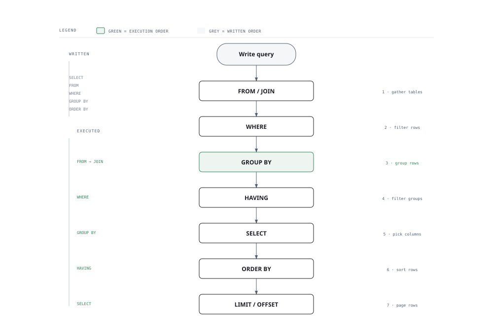

# Visual Notes — SQL & Databases

> One diagram, the full picture. Glance at this before reading the chapters and again before interviews.

## What the diagram shows

A SELECT query does **not** run in the order you write it. The engine:

1. **FROM & JOINs** — build the working set of rows.
2. **WHERE** — filter rows (no aggregates allowed here).
3. **GROUP BY** — collapse rows into groups.
4. **HAVING** — filter the groups (aggregates are allowed here).
5. **SELECT** — compute the final columns and expressions.
6. **ORDER BY** — sort the result.
7. **LIMIT / OFFSET** — return only the requested page.

## Why this matters for placement

- "Why is my query slow?" is the single most-asked SQL interview question — the answer lives in this order plus indexes.
- Knowing that `WHERE` runs before `SELECT` explains why you cannot reference an alias in `WHERE` but can in `HAVING` and `ORDER BY`.

## Quick revision

- **WHERE vs HAVING** — WHERE filters rows before grouping; HAVING filters groups after grouping.
- **JOIN types** — INNER (only matches), LEFT (all left rows, NULLs for missing), FULL (all rows from both), CROSS (cartesian product).
- **Window functions** — `ROW_NUMBER() OVER (PARTITION BY ... ORDER BY ...)` for rankings, running totals, and "top N per group".
- **Indexes** — B-tree by default; use them for WHERE/JOIN/ORDER BY columns; avoid wrapping columns in functions (`WHERE YEAR(d) = 2026` kills the index; use a range instead).
- **ACID** — Atomicity, Consistency, Isolation, Durability; the why behind transactions.
- **Query order cheat** — FROM → WHERE → GROUP BY → HAVING → SELECT → ORDER BY → LIMIT.

## Related chapters

- [01 — SQL Basics](01-sql-basics.md)
- [03 — Joins](03-joins.md)
- [05 — Window Functions](05-window-functions.md)
- [07 — Indexes & Performance](07-indexes-and-performance.md)
- [09 — Transactions & ACID](09-transactions-and-acid.md)

---

**One-line answer for interviews:** *"SQL reads in logical order — not written order — and every performance question starts with the execution plan."*
