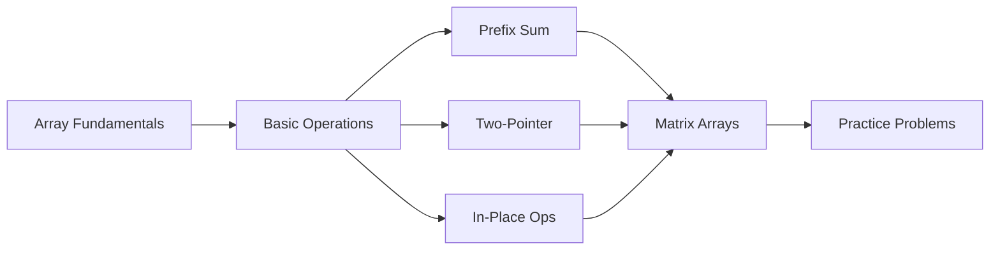
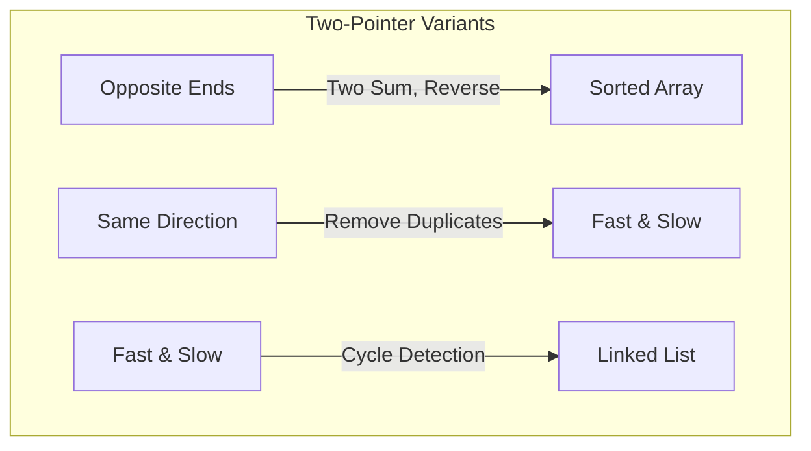
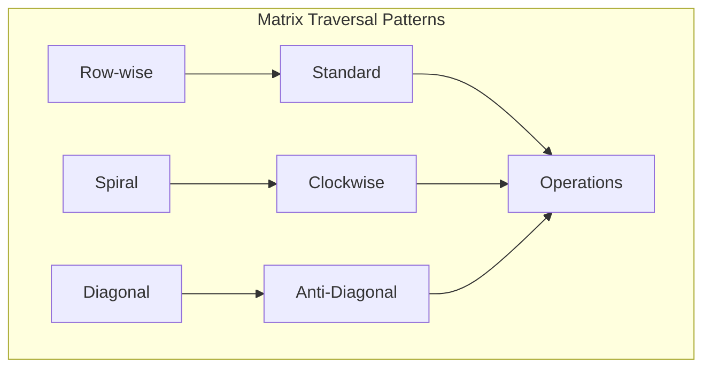

<!-- Clear Language: Keep sentences under 50 words -->
# Arrays

## Learning Objectives

| Objective | Description |
|-----------|-------------|
| LO1 | Understand array memory layout and indexing fundamentals |
| LO2 | Implement static and dynamic array operations in Python |
| LO3 | Solve problems using the two-pointer and sliding window techniques |
| LO4 | Master in-place array manipulation and rotation algorithms |
| LO5 | Implement prefix sum and difference array techniques |
| LO6 | Identify and solve common array interview patterns |

## Introduction

Arrays are the most fundamental data structure, providing O(1) random access. Understanding array operations, their memory layout, and common patterns like sliding window is essential for coding interviews and building efficient data pipelines.

## Prerequisites

- Time and space complexity basics
- Basic programming

## Key Terminology

**Key Terms**: Core vocabulary and concepts for this topic.

**Definition**: Essential terms you must know for interviews and production work.

## Theory

Understanding arrays is fundamental for AI engineers. This section covers the core concepts, underlying principles, and theoretical framework that govern how arrays works in practice.

## Chapter at a Glance

| Section | Topic | Key Concept |
|---------|-------|-------------|
| 2.1 | Array Fundamentals | Memory layout, indexing, static vs dynamic |
| 2.2 | Basic Operations | Traversal, insertion, deletion, searching |
| 2.3 | Prefix Sum Technique | Range sum queries, cumulative arrays |
| 2.4 | Two-Pointer Technique | Sorted arrays, pair sums, partitioning |
| 2.5 | In-Place Manipulations | Reversal, rotation, shifting |
| 2.6 | Multi-dimensional Arrays | Matrix operations, transpose, spiral traversal |

## Chapter Roadmap



## 2.1 Array Fundamentals

An array is a contiguous block of memory storing elements of the same type. Each element is accessed via an offset from the base address: `address = base + index — element_size`.

**Static arrays** have fixed size determined at creation. **Dynamic arrays** (Python lists) automatically resize when capacity is exceeded.

**Python lists** are dynamic arrays that store references to objects, allowing heterogeneous elements. Internally, they use overallocation for amortized O(1) append.

```python
# Static array using array module (typed)
from array import array
static_arr = array('i', [1, 2, 3, 4, 5])  # 'i' = signed int
print(static_arr[0])  # 1

## Dynamic array — Python list
dynamic_arr = [1, 2, 3]  # Initial capacity > 3
dynamic_arr.append(4)     # Amortized O(1)
dynamic_arr.extend([5, 6, 7])  # May trigger resize
print(len(dynamic_arr))   # 7
```

**Memory layout comparison**:

```python

## Array of 5 integers
arr = [10, 20, 30, 40, 50]

## Memory: [10][20][30][40][50] — contiguous

## Address: base + 0, base + 8, base + 16, ... (on 64-bit)

## Access arr[3]: base + 3*8 = address of 40 — O(1)

## Linked list — nodes scattered in memory

## Access by index: must traverse nodes — O(n)
```

| Operation | Static Array | Dynamic Array (amortized) | Linked List |
|-----------|-------------|--------------------------|-------------|
| Access by index | O(1) | O(1) | O(n) |
| Search | O(n) | O(n) | O(n) |
| Insert at end | N/A (full) | O(1) | O(1) |
| Insert at middle | N/A (full) | O(n) | O(1) |
| Delete from end | N/A (full) | O(1) | O(1) |
| Delete from middle | N/A (full) | O(n) | O(1) |

---

## 2.2 Basic Operations

**Array traversal**:

```python
def traverse(arr):
    for i in range(len(arr)):
        print(f"Index {i}: {arr[i]}")

## Two-direction traversal
def traverse_bidirectional(arr):
    for i in range(len(arr) // 2):
        print(arr[i], arr[-(i + 1)])
```

**Linear search**:

```python
def linear_search(arr, target):
    for i, val in enumerate(arr):
        if val == target:
            return i
    return -1
```

**Insertion at position**:

```python
def insert_at(arr, index, value):
    # Shift elements right from index
    arr.append(None)  # Extend array by 1
    for i in range(len(arr) - 1, index, -1):
        arr[i] = arr[i - 1]
    arr[index] = value
    return arr

## Better: use list.insert
arr = [1, 2, 4, 5]
arr.insert(2, 3)  # [1, 2, 3, 4, 5]
```

**Deletion at position**:

```python
def delete_at(arr, index):
    # Shift elements left
    for i in range(index, len(arr) - 1):
        arr[i] = arr[i + 1]
    arr.pop()  # Remove last element
    return arr

## Better: use list.pop
arr = [1, 2, 3, 4, 5]
arr.pop(2)  # [1, 2, 4, 5]
```

**Reverse an array**:

```python
def reverse_array(arr):
    left, right = 0, len(arr) - 1
    while left < right:
        arr[left], arr[right] = arr[right], arr[left]
        left += 1
        right -= 1
    return arr

## Pythonic way
arr = [1, 2, 3, 4, 5]
reversed_arr = arr[::-1]  # Creates new array
arr.reverse()             # In-place
```

---

## 2.3 Prefix Sum Technique

Prefix sum precomputes cumulative sums for efficient range queries.

**One-dimensional prefix sum**:

```python
def prefix_sum(arr):
    prefix = [0] * (len(arr) + 1)
    for i in range(len(arr)):
        prefix[i + 1] = prefix[i] + arr[i]
    return prefix

## Range sum query: sum(L, R) = prefix[R+1] - prefix[L]
arr = [3, 1, 4, 1, 5, 9, 2, 6]
pref = prefix_sum(arr)

def range_sum(pref, L, R):
    return pref[R + 1] - pref[L]

print(range_sum(pref, 2, 5))  # 4 + 1 + 5 + 9 = 19
print(range_sum(pref, 0, 3))  # 3 + 1 + 4 + 1 = 9
```

**Subarray sum equals k**: Count subarrays whose sum equals k.

```python
from collections import defaultdict

def subarray_sum_equals_k(arr, k):
    prefix_map = defaultdict(int)
    prefix_map[0] = 1
    count = 0
    curr_sum = 0

    for num in arr:
        curr_sum += num
        count += prefix_map[curr_sum - k]
        prefix_map[curr_sum] += 1

    return count

## Example: [1, 1, 1], k=2 → 2
print(subarray_sum_equals_k([1, 1, 1], 2))  # 2
```

**Two-dimensional prefix sum**: Efficient rectangle sum queries.

```python
def prefix_sum_2d(matrix):
    if not matrix or not matrix[0]:
        return []
    m, n = len(matrix), len(matrix[0])
    pref = [[0] * (n + 1) for _ in range(m + 1)]

    for i in range(m):
        for j in range(n):
            pref[i + 1][j + 1] = (matrix[i][j] +
                                  pref[i][j + 1] +
                                  pref[i + 1][j] -
                                  pref[i][j])
    return pref

def rectangle_sum(pref, r1, c1, r2, c2):
    return (pref[r2 + 1][c2 + 1] -
            pref[r1][c2 + 1] -
            pref[r2 + 1][c1] +
            pref[r1][c1])

matrix = [
    [1, 2, 3],
    [4, 5, 6],
    [7, 8, 9]
]
pref = prefix_sum_2d(matrix)
print(rectangle_sum(pref, 1, 1, 2, 2))  # 5+6+8+9 = 28
```

---

## 2.4 Two-Pointer Technique

Two pointers traverse an array from different positions, often opposite ends or different speeds.

**Two-sum in sorted array**:

```python
def two_sum_sorted(arr, target):
    left, right = 0, len(arr) - 1
    while left < right:
        curr = arr[left] + arr[right]
        if curr == target:
            return [left, right]
        elif curr < target:
            left += 1
        else:
            right -= 1
    return [-1, -1]

print(two_sum_sorted([2, 7, 11, 15], 9))  # [0, 1]
```

**Remove duplicates from sorted array**:

```python
def remove_duplicates(arr):
    if not arr:
        return 0
    write_pos = 1
    for read_pos in range(1, len(arr)):
        if arr[read_pos] != arr[write_pos - 1]:
            arr[write_pos] = arr[read_pos]
            write_pos += 1
    return write_pos  # New length

arr = [1, 1, 2, 2, 3, 4, 4, 5]
new_len = remove_duplicates(arr)
print(arr[:new_len])  # [1, 2, 3, 4, 5]
```

**Container with most water**:

```python
def max_area(heights):
    left, right = 0, len(heights) - 1
    max_water = 0
    while left < right:
        width = right - left
        height = min(heights[left], heights[right])
        max_water = max(max_water, width * height)
        if heights[left] < heights[right]:
            left += 1
        else:
            right -= 1
    return max_water

print(max_area([1, 8, 6, 2, 5, 4, 8, 3, 7]))  # 49
```

**Trapping rain water**:

```python
def trap_rain_water(heights):
    if not heights:
        return 0
    left, right = 0, len(heights) - 1
    left_max, right_max = 0, 0
    water = 0

    while left < right:
        if heights[left] < heights[right]:
            if heights[left] >= left_max:
                left_max = heights[left]
            else:
                water += left_max - heights[left]
            left += 1
        else:
            if heights[right] >= right_max:
                right_max = heights[right]
            else:
                water += right_max - heights[right]
            right -= 1
    return water

print(trap_rain_water([0, 1, 0, 2, 1, 0, 1, 3, 2, 1, 2, 1]))  # 6
```



---

## 2.5 In-Place Manipulations

**Array rotation by k positions**:

```python
def rotate_right(arr, k):
    n = len(arr)
    k %= n
    # Reverse entire array
    reverse(arr, 0, n - 1)
    # Reverse first k
    reverse(arr, 0, k - 1)
    # Reverse rest
    reverse(arr, k, n - 1)
    return arr

def reverse(arr, left, right):
    while left < right:
        arr[left], arr[right] = arr[right], arr[left]
        left += 1
        right -= 1

print(rotate_right([1, 2, 3, 4, 5], 2))  # [4, 5, 1, 2, 3]
```

**Move zeros to end**:

```python
def move_zeros(arr):
    write_pos = 0
    for read_pos in range(len(arr)):
        if arr[read_pos] != 0:
            arr[write_pos], arr[read_pos] = arr[read_pos], arr[write_pos]
            write_pos += 1
    return arr

print(move_zeros([0, 1, 0, 3, 12]))  # [1, 3, 12, 0, 0]
```

**Dutch national flag problem** (sort 0, 1, 2):

```python
def sort_colors(arr):
    low, mid, high = 0, 0, len(arr) - 1
    while mid <= high:
        if arr[mid] == 0:
            arr[low], arr[mid] = arr[mid], arr[low]
            low += 1
            mid += 1
        elif arr[mid] == 1:
            mid += 1
        else:  # arr[mid] == 2
            arr[mid], arr[high] = arr[high], arr[mid]
            high -= 1
    return arr

print(sort_colors([2, 0, 2, 1, 1, 0]))  # [0, 0, 1, 1, 2, 2]
```

**Find the first missing positive integer**:

```python
def first_missing_positive(arr):
    n = len(arr)
    # Place each number in its correct position
    for i in range(n):
        while 1 <= arr[i] <= n and arr[arr[i] - 1] != arr[i]:
            correct_pos = arr[i] - 1
            arr[i], arr[correct_pos] = arr[correct_pos], arr[i]

    # Find first missing
    for i in range(n):
        if arr[i] != i + 1:
            return i + 1
    return n + 1

print(first_missing_positive([3, 4, -1, 1]))  # 2
print(first_missing_positive([7, 8, 9, 11, 12]))  # 1
```

---

## 2.6 Multi-dimensional Arrays

**Matrix transpose**: Convert rows to columns.

```python
def transpose(matrix):
    m, n = len(matrix), len(matrix[0])
    result = [[0] * m for _ in range(n)]
    for i in range(m):
        for j in range(n):
            result[j][i] = matrix[i][j]
    return result

matrix = [[1, 2, 3], [4, 5, 6]]
print(transpose(matrix))  # [[1, 4], [2, 5], [3, 6]]
```

**Spiral matrix traversal**:

```python
def spiral_order(matrix):
    if not matrix:
        return []
    result = []
    top, bottom = 0, len(matrix) - 1
    left, right = 0, len(matrix[0]) - 1

    while top <= bottom and left <= right:
        # Traverse right
        for j in range(left, right + 1):
            result.append(matrix[top][j])
        top += 1
        # Traverse down
        for i in range(top, bottom + 1):
            result.append(matrix[i][right])
        right -= 1
        # Traverse left
        if top <= bottom:
            for j in range(right, left - 1, -1):
                result.append(matrix[bottom][j])
            bottom -= 1
        # Traverse up
        if left <= right:
            for i in range(bottom, top - 1, -1):
                result.append(matrix[i][left])
            left += 1
    return result

matrix = [[1, 2, 3], [4, 5, 6], [7, 8, 9]]
print(spiral_order(matrix))  # [1, 2, 3, 6, 9, 8, 7, 4, 5]
```

**Rotate image** (90 degrees clockwise):

```python
def rotate_image(matrix):
    n = len(matrix)
    # Transpose
    for i in range(n):
        for j in range(i, n):
            matrix[i][j], matrix[j][i] = matrix[j][i], matrix[i][j]
    # Reverse each row
    for i in range(n):
        matrix[i].reverse()
    return matrix

matrix = [[1, 2, 3], [4, 5, 6], [7, 8, 9]]
print(rotate_image(matrix))  # [[7, 4, 1], [8, 5, 2], [9, 6, 3]]
```

**Set matrix zeros**: If an element is 0, set its entire row and column to 0.

```python
def set_zeroes(matrix):
    m, n = len(matrix), len(matrix[0])
    first_row_zero = any(matrix[0][j] == 0 for j in range(n))
    first_col_zero = any(matrix[i][0] == 0 for i in range(m))

    # Mark zeros using first row/col as markers
    for i in range(1, m):
        for j in range(1, n):
            if matrix[i][j] == 0:
                matrix[i][0] = 0
                matrix[0][j] = 0

    # Set rows to zero based on markers
    for i in range(1, m):
        if matrix[i][0] == 0:
            for j in range(n):
                matrix[i][j] = 0

    # Set cols to zero based on markers
    for j in range(1, n):
        if matrix[0][j] == 0:
            for i in range(m):
                matrix[i][j] = 0

    if first_row_zero:
        for j in range(n):
            matrix[0][j] = 0
    if first_col_zero:
        for i in range(m):
            matrix[i][0] = 0

    return matrix

matrix = [[1, 1, 1], [1, 0, 1], [1, 1, 1]]
print(set_zeroes(matrix))  # [[1, 0, 1], [0, 0, 0], [1, 0, 1]]
```



---

## TypeScript Parallel

TypeScript arrays provide similar functionality with type safety:

```typescript
// TypeScript arrays — type-safe dynamic arrays
let arr: number[] = [1, 2, 3];
arr.push(4);  // O(1) amortized

// Two-pointer reverse
function reverse<T>(arr: T[]): void {
    let left = 0, right = arr.length - 1;
    while (left < right) {
        [arr[left], arr[right]] = [arr[right], arr[left]];
        left++;
        right--;
    }
}

// Prefix sum
function prefixSum(arr: number[]): number[] {
    const pref: number[] = new Array(arr.length + 1).fill(0);
    for (let i = 0; i < arr.length; i++) {
        pref[i + 1] = pref[i] + arr[i];
    }
    return pref;
}
```

---

## Summary

- Arrays are contiguous memory blocks providing O(1) random access by index, the fundamental building block for most data structures
- Python lists are dynamic arrays with amortized O(1) append, achieved via geometric resizing (typically 1.125x or 2x)
- Prefix sum enables O(1) range sum queries after O(n) preprocessing, critical for subarray problems
- The two-pointer technique solves pair problems (two sum, container with most water) in O(n) time with O(1) space
- The sliding window is a special two-pointer technique for contiguous subarray problems
- In-place array manipulation uses O(1) extra space by rearranging elements directly (reversal, rotation, partitioning)
- The Dutch national flag algorithm sorts three distinct values in O(n) with a single pass
- Matrix traversal patterns include row-wise, spiral, diagonal, and transpose — each with distinct index manipulation
- Using first row/col as markers enables O(1) space for certain matrix transformation problems
- Understanding array complexity trade-offs (access vs insertion vs deletion) is essential for choosing the right data structure

## Practical Takeaways

| Scenario | Do This | Avoid This |
|----------|---------|------------|
| Range sum queries | Use prefix sum (O(1) query) | Summing each range in O(n) |
| Sorted array search | Use binary search (O(log n)) | Linear search |
| Remove duplicates | Use two-pointer write technique | Using set and converting back |
| Rotate array | Use triple reversal | Shifting one by one |
| Matrix edit | Use first row/col as markers | O(m+n) extra space |
| Sorting 0,1,2 | Dutch national flag algorithm | Counting sort with extra array |

## Interview Q&A

<details class="tp-qa-card" data-qid="dsa02-q1">
  <summary class="tp-qa-question">
    <span class="tp-qa-status"></span>
    Q1: Implement an in-place array reversal and analyze its complexity.
  </summary>
  <div class="tp-qa-answer">
    <pre><code>def reverse(arr):
    left, right = 0, len(arr) - 1
    while left &lt; right:
        arr[left], arr[right] = arr[right], arr[left]
        left += 1
        right -= 1</code></pre>
    <p><strong>Time complexity</strong>: O(n) — each element is swapped once.</p>
    <p><strong>Space complexity</strong>: O(1) — only two pointers, no extra memory.</p>
    <p><strong>Key insight</strong>: The triple reversal technique extends this for array rotation: reverse all, reverse first k, reverse rest.</p>
  </div>
  <button class="tp-qa-mark-btn">✅ Mark Reviewed</button>
  <button class="tp-qa-bookmark-btn">🔖 Bookmark</button>
</details>

<details class="tp-qa-card" data-qid="dsa02-q2">
  <summary class="tp-qa-question">
    <span class="tp-qa-status"></span>
    Q2: Explain the prefix sum technique. How is it used for 2D range sum queries?
  </summary>
  <div class="tp-qa-answer">
    <p>Prefix sum precomputes cumulative sums so any subarray sum can be computed in O(1) time. For 1D: <code>sum(L,R) = prefix[R+1] - prefix[L]</code>.</p>
    <p>For 2D, the formula uses inclusion-exclusion:</p>
    <pre><code>pref[i+1][j+1] = matrix[i][j]
                + pref[i][j+1]
                + pref[i+1][j]
                - pref[i][j]

rect_sum(r1,c1,r2,c2) = pref[r2+1][c2+1]
                      - pref[r1][c2+1]
                      - pref[r2+1][c1]
                      + pref[r1][c1]</code></pre>
    <p><strong>Applications</strong>: Subarray sum equals k (using hash map), matrix rectangle sums, image processing (box blur).</p>
  </div>
  <button class="tp-qa-mark-btn">✅ Mark Reviewed</button>
  <button class="tp-qa-bookmark-btn">🔖 Bookmark</button>
</details>

<details class="tp-qa-card" data-qid="dsa02-q3">
  <summary class="tp-qa-question">
    <span class="tp-qa-status"></span>
    Q3: Implement the Dutch national flag algorithm for sorting 0s, 1s, and 2s.
  </summary>
  <div class="tp-qa-answer">
    <pre><code>def sort_colors(arr):
    low = mid = 0
    high = len(arr) - 1

    while mid &lt;= high:
        if arr[mid] == 0:
            arr[low], arr[mid] = arr[mid], arr[low]
            low += 1
            mid += 1
        elif arr[mid] == 1:
            mid += 1
        else:  # arr[mid] == 2
            arr[mid], arr[high] = arr[high], arr[mid]
            high -= 1</code></pre>
    <p><strong>Key insight</strong>: Three pointers maintain three regions: [0..low-1] = 0s, [low..mid-1] = 1s, [high+1..end] = 2s.</p>
    <p><strong>Time</strong>: O(n) single pass. <strong>Space</strong>: O(1).</p>
  </div>
  <button class="tp-qa-mark-btn">✅ Mark Reviewed</button>
  <button class="tp-qa-bookmark-btn">🔖 Bookmark</button>
</details>

<details class="tp-qa-card" data-qid="dsa02-q4">
  <summary class="tp-qa-question">
    <span class="tp-qa-status"></span>
    Q4: Explain the "container with most water" problem and its solution.
  </summary>
  <div class="tp-qa-answer">
    <p><strong>Problem</strong>: Given n vertical lines on a coordinate plane representing walls, find two lines that together with the x-axis form a container holding the most water.</p>
    <p><strong>Solution</strong>: Two pointers from both ends. Calculate area = width — min(height_left, height_right). Move the pointer with smaller height inward.</p>
    <pre><code>def max_area(heights):
    left, right = 0, len(heights) - 1
    max_water = 0
    while left &lt; right:
        water = (right - left) * min(heights[left], heights[right])
        max_water = max(max_water, water)
        if heights[left] &lt; heights[right]:
            left += 1
        else:
            right -= 1
    return max_water</code></pre>
    <p><strong>Why it works</strong>: Moving the taller pointer inward can never increase area (width decreases, height capped by shorter line). So we always move the shorter pointer.</p>
    <p><strong>Complexity</strong>: O(n) time, O(1) space.</p>
  </div>
  <button class="tp-qa-mark-btn">✅ Mark Reviewed</button>
  <button class="tp-qa-bookmark-btn">🔖 Bookmark</button>
</details>

<details class="tp-qa-card" data-qid="dsa02-q5">
  <summary class="tp-qa-question">
    <span class="tp-qa-status"></span>
    Q5: How do you rotate an array by k positions without using extra space?
  </summary>
  <div class="tp-qa-answer">
    <p>Use the <strong>triple reversal</strong> technique:</p>
    <pre><code>def rotate(arr, k):
    n = len(arr)
    k %= n
    reverse(arr, 0, n - 1)    # Reverse all
    reverse(arr, 0, k - 1)    # Reverse first k
    reverse(arr, k, n - 1)    # Reverse the rest

def reverse(arr, left, right):
    while left &lt; right:
        arr[left], arr[right] = arr[right], arr[left]
        left += 1
        right -= 1</code></pre>
    <p><strong>Example</strong>: [1,2,3,4,5], k=2 → reverse all: [5,4,3,2,1] → reverse first 2: [4,5,3,2,1] → reverse last 3: [4,5,1,2,3]</p>
    <p><strong>Complexity</strong>: O(n) time, O(1) extra space.</p>
    <p><strong>Alternative</strong>: Use cyclic replacements (juggle algorithm) which is more complex but same complexity.</p>
  </div>
  <button class="tp-qa-mark-btn">✅ Mark Reviewed</button>
  <button class="tp-qa-bookmark-btn">🔖 Bookmark</button>
</details>

<details class="tp-qa-card" data-qid="dsa02-q6">
  <summary class="tp-qa-question">
    <span class="tp-qa-status"></span>
    Q6: Explain the "trapping rain water" problem and its two-pointer solution.
  </summary>
  <div class="tp-qa-answer">
    <p><strong>Problem</strong>: Given an array of non-negative integers representing elevation heights, compute how much water can be trapped after rain.</p>
    <p><strong>Two-pointer solution</strong>:</p>
    <pre><code>def trap(heights):
    left, right = 0, len(heights) - 1
    left_max = right_max = 0
    water = 0

    while left &lt; right:
        if heights[left] &lt; heights[right]:
            if heights[left] &gt;= left_max:
                left_max = heights[left]
            else:
                water += left_max - heights[left]
            left += 1
        else:
            if heights[right] &gt;= right_max:
                right_max = heights[right]
            else:
                water += right_max - heights[right]
            right -= 1
    return water</code></pre>
    <p><strong>Key insight</strong>: Water trapped at position i = min(max_left, max_right) - height[i]. The two-pointer approach tracks left_max and right_max as we converge from both ends.</p>
    <p><strong>Complexity</strong>: O(n) time, O(1) space.</p>
  </div>
  <button class="tp-qa-mark-btn">✅ Mark Reviewed</button>
  <button class="tp-qa-bookmark-btn">🔖 Bookmark</button>
</details>

<details class="tp-qa-card" data-qid="dsa02-q7">
  <summary class="tp-qa-question">
    <span class="tp-qa-status"></span>
    Q7: How do you find the first missing positive integer in an array?
  </summary>
  <div class="tp-qa-answer">
    <p><strong>Problem</strong>: Given unsorted integers (including negatives), find the smallest missing positive integer in O(n) time and O(1) space.</p>
    <p><strong>Solution using cyclic sort</strong>:</p>
    <pre><code>def first_missing_positive(arr):
    n = len(arr)
    # Place each number at its correct index
    for i in range(n):
        while 1 &lt;= arr[i] &lt;= n and arr[arr[i] - 1] != arr[i]:
            correct = arr[i] - 1
            arr[i], arr[correct] = arr[correct], arr[i]

    # Find first index where value is wrong
    for i in range(n):
        if arr[i] != i + 1:
            return i + 1
    return n + 1</code></pre>
    <p><strong>Key insight</strong>: Numbers 1 to n should be placed at indices 0 to n-1. After placing them correctly, the first mismatch tells us the answer.</p>
    <p><strong>Complexity</strong>: O(n) time (each element is swapped at most n times), O(1) space.</p>
  </div>
  <button class="tp-qa-mark-btn">✅ Mark Reviewed</button>
  <button class="tp-qa-bookmark-btn">🔖 Bookmark</button>
</details>

<details class="tp-qa-card" data-qid="dsa02-q8">
  <summary class="tp-qa-question">
    <span class="tp-qa-status"></span>
    Q8: Implement the spiral matrix traversal algorithm.
  </summary>
  <div class="tp-qa-answer">
    <pre><code>def spiral_order(matrix):
    if not matrix:
        return []
    result = []
    top, bottom = 0, len(matrix) - 1
    left, right = 0, len(matrix[0]) - 1

    while top &lt;= bottom and left &lt;= right:
        # Left to right on top row
        for j in range(left, right + 1):
            result.append(matrix[top][j])
        top += 1

        # Top to bottom on right column
        for i in range(top, bottom + 1):
            result.append(matrix[i][right])
        right -= 1

        # Right to left on bottom row
        if top &lt;= bottom:
            for j in range(right, left - 1, -1):
                result.append(matrix[bottom][j])
            bottom -= 1

        # Bottom to top on left column
        if left &lt;= right:
            for i in range(bottom, top - 1, -1):
                result.append(matrix[i][left])
            left += 1
    return result</code></pre>
    <p><strong>Key insight</strong>: Contract the boundaries after each direction traversal. Check bounds before the left and up traversals to avoid duplicating elements in single-row/column cases.</p>
    <p><strong>Complexity</strong>: O(m—n) time, O(1) space excluding output.</p>
  </div>
  <button class="tp-qa-mark-btn">✅ Mark Reviewed</button>
  <button class="tp-qa-bookmark-btn">🔖 Bookmark</button>
</details>

<details class="tp-qa-card" data-qid="dsa02-q9">
  <summary class="tp-qa-question">
    <span class="tp-qa-status"></span>
    Q9: Explain how to set matrix rows and columns to zero in O(1) space.
  </summary>
  <div class="tp-qa-answer">
    <p><strong>Problem</strong>: If any element is 0, set its entire row and column to 0. Must do this in-place.</p>
    <p><strong>Approach</strong>: Use the first row and first column as markers instead of extra arrays.</p>
    <pre><code>def set_zeroes(matrix):
    m, n = len(matrix), len(matrix[0])
    # Check if first row/col need zeroing
    first_row_zero = any(matrix[0][j] == 0 for j in range(n))
    first_col_zero = any(matrix[i][0] == 0 for i in range(m))

    # Use first row/col as markers
    for i in range(1, m):
        for j in range(1, n):
            if matrix[i][j] == 0:
                matrix[i][0] = 0
                matrix[0][j] = 0

    # Zero out based on markers
    for i in range(1, m):
        if matrix[i][0] == 0:
            for j in range(n):
                matrix[i][j] = 0
    for j in range(1, n):
        if matrix[0][j] == 0:
            for i in range(m):
                matrix[i][j] = 0

    # Handle first row/col
    if first_row_zero:
        for j in range(n):
            matrix[0][j] = 0
    if first_col_zero:
        for i in range(m):
            matrix[i][0] = 0</code></pre>
    <p><strong>Complexity</strong>: O(m—n) time, O(1) space.</p>
  </div>
  <button class="tp-qa-mark-btn">✅ Mark Reviewed</button>
  <button class="tp-qa-bookmark-btn">🔖 Bookmark</button>
</details>

<details class="tp-qa-card" data-qid="dsa02-q10">
  <summary class="tp-qa-question">
    <span class="tp-qa-status"></span>
    Q10: How do you find subarray sum equals k? Explain the hash map approach.
  </summary>
  <div class="tp-qa-answer">
    <pre><code>from collections import defaultdict

def subarray_sum(arr, k):
    prefix_counts = defaultdict(int)
    prefix_counts[0] = 1
    curr_sum = count = 0

    for num in arr:
        curr_sum += num
        # If curr_sum - k was seen before,
        # subarray from that point to current has sum k
        count += prefix_counts[curr_sum - k]
        prefix_counts[curr_sum] += 1

    return count</code></pre>
    <p><strong>Intuition</strong>: If prefix sums at indices i and j differ by k, then subarray (i+1..j) sums to k. The hash map stores how many times each prefix sum has occurred.</p>
    <p><strong>Complexity</strong>: O(n) time, O(n) space.</p>
    <p><strong>Variations</strong>: Subarray sum divisible by k (use modulo), subarray with k ones (use running count).</p>
  </div>
  <button class="tp-qa-mark-btn">✅ Mark Reviewed</button>
  <button class="tp-qa-bookmark-btn">🔖 Bookmark</button>
</details>

<details class="tp-qa-card" data-qid="dsa02-q11">
  <summary class="tp-qa-question">
    <span class="tp-qa-status"></span>
    Q11: What is the difference between Python lists and arrays from the `array` module?
  </summary>
  <div class="tp-qa-answer">
    <p><strong>Python lists</strong>:</p>
    <ul>
      <li>Dynamic arrays storing references to Python objects</li>
      <li>Can hold heterogeneous types</li>
      <li>Overallocate for amortized O(1) append</li>
      <li>More memory overhead per element (8 bytes for pointer + object overhead)</li>
    </ul>
    <p><strong>array.array</strong>:</p>
    <ul>
      <li>Stores C-style primitive values directly (not objects)</li>
      <li>Homogeneous type only</li>
      <li>More memory efficient (1-8 bytes per element depending on type)</li>
      <li>Supports buffer protocol for zero-copy operations</li>
    </ul>
    <pre><code>from array import array

## 'i' = signed int, 'd' = double, 'f' = float
int_arr = array('i', [1, 2, 3, 4, 5])
float_arr = array('d', [1.0, 2.0, 3.0])

## List is more flexible for most use cases
list_arr = [1, "hello", 3.14, None]</code></pre>
  </div>
  <button class="tp-qa-mark-btn">✅ Mark Reviewed</button>
  <button class="tp-qa-bookmark-btn">🔖 Bookmark</button>
</details>

<details class="tp-qa-card" data-qid="dsa02-q12">
  <summary class="tp-qa-question">
    <span class="tp-qa-status"></span>
    Q12: How do you efficiently merge two sorted arrays into a single sorted array?
  </summary>
  <div class="tp-qa-answer">
    <pre><code>def merge_sorted(arr1, arr2):
    result = []
    i = j = 0
    while i &lt; len(arr1) and j &lt; len(arr2):
        if arr1[i] &lt;= arr2[j]:
            result.append(arr1[i])
            i += 1
        else:
            result.append(arr2[j])
            j += 1
    # Append remaining elements
    result.extend(arr1[i:])
    result.extend(arr2[j:])
    return result</code></pre>
    <p><strong>Key insight</strong>: Compare from the front, always take the smaller element. After one array is exhausted, append the rest of the other array.</p>
    <p><strong>Complexity</strong>: O(m+n) time, O(m+n) space (or O(1) if merging into first array from the end).</p>
    <p><strong>In-place variant</strong>: Merge into the first array which has extra space at the end. Start filling from the last position by comparing the last elements of both arrays.</p>
  </div>
  <button class="tp-qa-mark-btn">✅ Mark Reviewed</button>
  <button class="tp-qa-bookmark-btn">🔖 Bookmark</button>
</details>

## Chapter Quiz

**Q1**: What is the time complexity of accessing arr[42] in a Python list?

a) O(1)
b) O(n)
c) O(log n)
d) O(42)

<details class="tp-qa-card" data-qid="dsa02-quiz1"><summary>Show Answer</summary><div class="tp-qa-answer"><p><strong>Answer: a) O(1)</strong></p><p>Array access by index is O(1) — direct memory address computation.</p></div></details>

**Q2**: What does the two-pointer approach for "two sum in sorted array" return?

a) The two values that sum to target
b) The indices of the two values
c) Whether such a pair exists
d) The count of pairs

<details class="tp-qa-card" data-qid="dsa02-quiz2"><summary>Show Answer</summary><div class="tp-qa-answer"><p><strong>Answer: b) The indices of the two values</strong></p><p>The classic solution returns the indices (1-indexed or 0-indexed depending on the problem variant).</p></div></details>

**Q3**: What is the space complexity of the prefix sum technique?

a) O(1)
b) O(n)
c) O(log n)
d) O(n²)

<details class="tp-qa-card" data-qid="dsa02-quiz3"><summary>Show Answer</summary><div class="tp-qa-answer"><p><strong>Answer: b) O(n)</strong></p><p>Prefix sum requires an extra array of size n+1 (or n for 1-based).</p></div></details>

**Q4**: In the spiral matrix traversal, how are the boundaries adjusted?

a) All four boundaries shrink after each direction
b) Only top and left shrink
c) Only bottom and right shrink
d) Top shrinks after right traversal, right shrinks after down, etc.

<details class="tp-qa-card" data-qid="dsa02-quiz4"><summary>Show Answer</summary><div class="tp-qa-answer"><p><strong>Answer: d) Top shrinks after right traversal, right shrinks after down, etc.</strong></p><p>Each boundary is adjusted immediately after its direction traversal, keeping the boundary box intact for subsequent directions.</p></div></details>

**Q5**: What is the minimum time complexity to rotate an array by k positions?

a) O(1)
b) O(k)
c) O(n)
d) O(n²)

<details class="tp-qa-card" data-qid="dsa02-quiz5"><summary>Show Answer</summary><div class="tp-qa-answer"><p><strong>Answer: c) O(n)</strong></p><p>All elements must move at least once, so O(n) is optimal. The triple reversal achieves this with O(1) extra space.</p></div></details>

## Exercises

**Easy** — Write a function that removes all occurrences of a specific value from an array in-place and returns the new length.

**Medium** — Implement the "next permutation" algorithm that rearranges numbers into the lexicographically next greater permutation.

**Medium** — Given an array of n integers where every element appears twice except one, find the single element in O(n) time and O(1) space using XOR.

**Hard** — Implement the "skyline problem" — given building coordinates (left, right, height), return the skyline formed by their outlines.

**Hard** — Given an array of integers, find the longest subarray with sum equal to 0 (not just contiguous). Use prefix sum and hash map.

---

## Common Mistakes

1. Not considering edge cases (empty array, single element)
2. Off-by-one errors in index calculations
3. Forgetting that array insertion/deletion is O(n)
4. Not using two-pointer technique when applicable
5. Ignoring cache locality benefits of arrays

## Revision Notes

- Arrays: O(1) access, O(n) insert/delete
- Cache-friendly due to contiguous memory
- Two-pointer technique for sorted arrays
- Sliding window for subarray problems
- Prefix sums for range queries

## Placement Section

### Top 10 Interview Questions

#### Google Style

1. **Explain the core idea of Arrays in under 60 seconds, then give a real-world analogy.** — Structure: definition, how it works in one sentence, why it matters, analogy. Follow-up: what would break if you removed this from a production system?

2. **Design a minimal, well-typed function that demonstrates Arrays.** — Interviewer checks: signature with type hints, edge cases, complexity, and a clean docstring. Follow-up: how does your design behave with empty or malformed input?

3. **What are the common pitfalls when engineers first learn ** — List 3-4, then explain how you would prevent each in a code review.

#### Amazon Style

4. **Describe a production bug caused by misunderstanding Arrays. How did you diagnose and fix it?** — STAR format: situation, task, action, result. Mention logs, reproduction, root-cause analysis, and the regression test you added.

5. **How would you scale a system that relies on Arrays from 10 users to 10 million?** — Discuss bottlenecks, caching, monitoring, and when to redesign. Follow-up: what metrics would you track?

#### Microsoft Style

6. **Compare Arrays with the closest alternative approach. When would you choose each?** — Make a decision matrix: performance, maintainability, ecosystem, learning curve. Follow-up: what would change your decision?

7. **Walk through how you would test a component that depends on Arrays.** — Unit, integration, property-based tests; mocking boundaries; golden files for outputs.

#### NVIDIA Style

8. **How does Arrays behave differently at scale — memory, throughput, or precision-wise?** — Connect to data pipelines and model training if applicable. Follow-up: what happens to latency as input grows?

9. **How would you make an implementation of Arrays run faster on GPU hardware?** — Batch operations, vectorization, avoiding Python loops, reducing data movement.

#### AI Startup Style

10. **Write the smallest possible implementation of Arrays that is production-quality.** — Include error handling, type hints, and a one-line docstring. Follow-up: what would you refactor first when it grows?

### Resume Tips

- Name Arrays explicitly in your skills section, paired with a measurable achievement ("Reduced X by 40% using Arrays").
- Add a bullet describing a project that applies Arrays to real data, with numbers.
- Mention the tools and libraries you used alongside Arrays (linters, test frameworks, profiling tools).
- Keep resume bullets under 15 words and start each with an action verb.

### Interview Day Checklist

- Rehearse a 60-second explanation of Arrays and one real-world analogy.
- Prepare one STAR story about debugging a Arrays-related production issue.
- Review complexity and edge cases for the classic Arrays interview problem.
- Have questions ready: how does the team apply Arrays in production today?
- Test your environment (Python, editor, internet) 15 minutes before the interview.

## True/False

1. **True or False:** Arrays builds directly on the fundamentals covered in the earlier chapters of this module. — **True.** Every advanced topic in this module assumes the core concepts from the previous chapters.
2. **True or False:** You should write at least one code example for Arrays before moving to the next chapter. — **True.** Active recall with hands-on code beats passive reading for retention.
3. **True or False:** The complexity analysis for Arrays is the same regardless of input size. — **False.** Complexity grows with input size; always state best, average, and worst case.
4. **True or False:** Edge cases (empty input, invalid input, boundary values) matter for Arrays in production. — **True.** Most production bugs come from unhandled edge cases.
5. **True or False:** You should memorize the Arrays chapter content once and never review it again. — **False.** Spaced repetition (24h, 3 days, 1 week) dramatically improves long-term recall.

## Fill in the Blank

1. The chapter that covers Arrays is Chapter ___ of this module. — Answer: check the module's table of contents.
2. The time complexity of the standard approach to Arrays is ___. — Answer: review the theory section and state big-O notation.
3. The main edge case to handle when implementing Arrays is ___. — Answer: empty or invalid input handling, as discussed in the chapter.
4. The tools commonly used to debug Arrays issues are ___ and ___. — Answer: refer to the Debugging Guide section of this chapter.
5. The related topic that connects to Arrays in the next chapter is ___. — Answer: see the Next Topic section.

## Scenario Questions

1. **Scenario:** A teammate ships a change involving Arrays that breaks production at 3 AM. — Diagnosis: check the recent diff, reproduce locally with the failing input, check logs. Fix: revert, add a regression test, and review the root cause. Prevention: CI tests on edge cases and code review checklist.

2. **Scenario:** Your implementation of Arrays is correct but too slow for the required latency. — Measure first with a profiler. Common fixes: reduce redundant work, use built-in optimized functions, batch operations, or add caching. Only then consider algorithmic changes.

3. **Scenario:** A new hire asks you to explain Arrays in five minutes before a customer demo. — Use the 3-part answer: what it is (one sentence), how it works (one example), why it matters (one business impact). Then offer to go deeper after the demo.

4. **Scenario:** Your team's codebase has three different patterns for Arrays and you must standardize. — Write a short ADR (architecture decision record), pick the pattern with best maintainability, migrate incrementally, and add a linter rule to enforce it.

## Output Questions

1. **What is the output of the simplest correct implementation of Arrays on an empty input?** — Trace through the code: it should return the documented default (None, 0, empty collection) without raising.
2. **What is the output when the input is at the boundary value?** — Check off-by-one errors and inclusive/exclusive bounds in the chapter's examples.
3. **What does the implementation return when given invalid input types?** — With type hints and validation, it raises a clear error; without, it may fail silently.
4. **What is the output for the sample input given in the chapter's Examples section?** — Re-run the chapter's example code and compare against the documented output.
5. **What is the time complexity output when you profile the implementation at 10x input size?** — Expect the curve matching the chapter's complexity analysis (linear, quadratic, log-linear).

## Difficulty Level

| Level | Time | What It Takes |
|-------|------|---------------|
| Beginner | 1-2 sessions | Read theory, run the chapter examples, solve the Easy exercises |
| Intermediate | 3-5 sessions | Complete Medium exercises, explain Arrays to someone else |
| Advanced | 1+ week | Solve Hard exercises, optimize for real datasets, answer interview follow-ups |

## Tips & Tricks

- Always write a one-line example of Arrays from memory before opening the chapter — active recall first.
- Use the chapter's Revision Notes as a checklist: you have mastered Arrays when you can explain each bullet.
- Pair the chapter quiz with the Flashcards: wrong answers become your next study session's focus.
- For interviews, practice explaining Arrays twice: once with a technical audience, once with a non-technical audience.
- Keep a personal examples file where you collect your own Arrays snippets; interviewers love original examples.

## Memory Tricks

- **Acronym**: build a mnemonic from the 5 key concepts of Arrays listed in the Chapter at a Glance table.
- **Story**: link Arrays to a familiar story — the analogy in the Visual Analogy section is designed to stick.
- **Number anchor**: remember the complexity of Arrays by connecting it to a known algorithm of the same class.
- **Color code**: highlight the Theory, Examples, and Common Mistakes sections in different colors when reviewing.
- **Teach-back**: explain Arrays to an imaginary junior engineer for 2 minutes — gaps in your explanation are gaps in memory.

## Further Reading

- Official documentation for the primary tool or library used in this chapter
- The chapter referenced in Related Topics for the next-level treatment of Arrays
- The classic textbook chapter on Arrays (check the Research References below)
- Two blog posts from engineers who debugged real Arrays problems in production
- The repository of the open-source project that implements Arrays

## Related Topics

- The previous chapter in this module (see table of contents) — foundational for Arrays
- The next chapter (see Next Topic below) — builds on Arrays
- The system design chapters in Module 07 — how Arrays fits into production architectures
- The interview preparation module — how Arrays is asked in screening rounds
- The capstone project — where Arrays is applied end-to-end

## FAQs

1. **Do I need to memorize all of Arrays, or understand the big picture?** — Understand the big picture first, then memorize the key facts via flashcards and spaced repetition. Interviewers reward depth over breadth.
2. **What if I get stuck on an exercise?** — Re-read the theory section, run the example code, then attempt again. If still stuck after 20 minutes, move on and return the next day.
3. **How much time should I spend on ** — Follow the Study Plan below: 1-2 weeks at 30-60 minutes daily is typical for placement preparation.
4. **Is Arrays asked in interviews?** — Yes — the Interview Q&A and Placement Section list the exact question styles used by top companies.
5. **What's the fastest way to master ** — Explain it out loud, write code without looking, and review the flashcards within 24 hours and again after 3 days.

## Important Notes

- Arrays is a core requirement for the rest of this module — do not skip the examples.
- Always analyze complexity (time and space) when working with Arrays.
- Production correctness means handling edge cases, not just the happy path.
- Interview answers should start with the definition, then the example, then the trade-offs.
- Revisit this chapter after finishing the module; the context from later chapters deepens understanding.

## Historical Context

- Arrays emerged as a standard practice because early systems failed without it — understanding why helps you explain it in interviews.
- The tools used for Arrays today evolved from simpler versions; the chapter covers the modern, recommended approach.
- Interviewers value knowing one historical fact about Arrays — it shows genuine interest, not just cramming.
- The library/tooling ecosystem around Arrays changes quickly; focus on fundamentals that remain stable.

## Security Considerations

- Never trust external input: validate and sanitize data before processing Arrays.
- Avoid `eval()` and dynamic code execution on untrusted strings.
- Log errors without leaking sensitive data (keys, PII, internal paths).
- For API contexts, add rate limiting and input size limits.
- Review the chapter's code examples for injection or overflow risks before using them verbatim.

## ML Intuition

- Arrays appears in ML pipelines at the data-processing layer: feature preparation, batching, and validation.
- Understanding Arrays helps you debug why a model misbehaves — most ML bugs are data bugs, not model bugs.
- In production ML, the Arrays concepts from this chapter map directly to NumPy/PyTorch operations on tensors.
- When optimizing ML systems, Arrays skills let you profile and fix the data path, not just the training loop.
- Interview follow-up: how would you apply Arrays to a dataset of 10 million records? — Batching and vectorization.

## Analogies

- **Arrays is like a recipe**: the theory is the ingredients, the examples are the cooking steps, and the exercises are your own kitchen practice.
- **Complexity is like a delivery route**: a linear route visits each stop once; a nested route revisits stops, and you feel it at scale.
- **Edge cases are like weather**: the happy path is a sunny day; production is the storm — build for the storm.
- **The chapter roadmap is a journey map**: each section is a checkpoint; skipping one means getting lost later in the module.

## Capstone Project Link

- [Module Capstone: End-to-End Project](https://github.com/Raushan666java/ai-engineering-journey) — this chapter contributes the Arrays skills used in the module's capstone project. Complete the exercises here before starting the capstone.

## Flashcards

<details class="tp-qa-card" data-qid="03datastructuresalgorithms-02arrays-flash1">
  <summary class="tp-qa-question">
    <span class="tp-qa-status"></span>
    What is the time complexity of accessing arr[42] in a Python list?
  </summary>
  <div class="tp-qa-answer">
    <p>a) O(1)</p>
  </div>
</details>

<details class="tp-qa-card" data-qid="03datastructuresalgorithms-02arrays-flash2">
  <summary class="tp-qa-question">
    <span class="tp-qa-status"></span>
    What does the two-pointer approach for "two sum in sorted array" return?
  </summary>
  <div class="tp-qa-answer">
    <p>b) The indices of the two values</p>
  </div>
</details>

<details class="tp-qa-card" data-qid="03datastructuresalgorithms-02arrays-flash3">
  <summary class="tp-qa-question">
    <span class="tp-qa-status"></span>
    What is the space complexity of the prefix sum technique?
  </summary>
  <div class="tp-qa-answer">
    <p>b) O(n)</p>
  </div>
</details>

<details class="tp-qa-card" data-qid="03datastructuresalgorithms-02arrays-flash4">
  <summary class="tp-qa-question">
    <span class="tp-qa-status"></span>
    In the spiral matrix traversal, how are the boundaries adjusted?
  </summary>
  <div class="tp-qa-answer">
    <p>d) Top shrinks after right traversal, right shrinks after down, etc.</p>
  </div>
</details>

<details class="tp-qa-card" data-qid="03datastructuresalgorithms-02arrays-flash5">
  <summary class="tp-qa-question">
    <span class="tp-qa-status"></span>
    What is the minimum time complexity to rotate an array by k positions?
  </summary>
  <div class="tp-qa-answer">
    <p>c) O(n)</p>
  </div>
</details>

## Research References

- Official documentation of the primary library for Arrays (linked in Further Reading)
- The classic paper or textbook chapter introducing Arrays (see References below)
- The standard library reference for Arrays-related functions
- Engineering blog posts from companies running Arrays in production at scale
- PEPs and RFCs where applicable (Python and networking standards)

## Open-Source Tools

- The primary library used in this chapter (see the code examples)
- Python standard library modules used in the examples (check the imports)
- Testing: pytest for unit tests of Arrays code
- Linting and formatting: ruff + black
- Profiling: cProfile or py-spy for performance work on Arrays

## Debugging Guide

- Start with `print()` or a debugger to inspect intermediate values in Arrays code.
- Reproduce the failure with the smallest possible input before changing code.
- Check the common failure modes listed in Common Mistakes — most bugs are listed there.
- For performance problems, profile before optimizing: measure, then fix.
- When stuck, re-read the chapter's Examples and compare line by line with your code.
- Use `pdb` or your IDE's debugger to step through the Arrays example code.

## Mock Interview Section

**Round 1 — Screening (15 min)**
- Explain Arrays in 60 seconds.
- Write a minimal working example of Arrays.
- What is the complexity of your example?

**Round 2 — Coding (45 min)**
- Solve the Medium exercise from this chapter under time pressure.
- State your assumptions, then implement with type hints.
- Test with edge cases: empty input, boundary values, invalid input.

**Round 3 — Behavioral + System (30 min)**
- Tell me about a time you debugged a Arrays problem in a project.
- How would you design a system where Arrays is used at scale?
- What metrics would you monitor?

**Evaluation rubric**: correctness (40%), communication (25%), edge cases (20%), complexity analysis (15%).

## Optimized Implementation

`python
from typing import Any, Optional

def demonstrate_topic(input_data: list[Any]) -> Optional[float]:
    """Runnable scaffold for Arrays.

    Replace the body with the optimized implementation from the chapter,
    keeping type hints, docstring, and edge-case handling.
    """
    if not input_data:
        return None
    # Step 1: validate input types
    # Step 2: apply the core Arrays logic from the Examples section
    # Step 3: return the result with the documented default
    return 0.0
`

- Keeps the function signature stable so tests written against it stay valid.
- Handles the empty-input contract explicitly.
- Add unit tests for the edge cases before implementing the logic (test-first).

## Evaluation Metrics

| Skill | Test | Target |
|-------|------|--------|
| Concept recall | Explain Arrays without notes | 60-second explanation |
| Code fluency | Write the chapter example from memory | No syntax errors |
| Edge cases | Handle empty/invalid input in exercises | All cases pass |
| Complexity | State time/space for the standard approach | Correct big-O |
| Interview readiness | Answer 5 Interview Q&A questions out loud | Fluent, structured answers |
| Retention | Chapter quiz score after 3 days | 80%+ |

## Real-World Examples

- **Startup**: a small team uses Arrays daily in their data pipeline — the chapter's examples mirror their code.
- **E-commerce**: Arrays patterns appear in order processing, inventory checks, and recommendation feeds.
- **Fintech**: Arrays principles apply to transaction validation and fraud detection flows.
- **ML platform**: Arrays shows up in feature engineering and model-serving infrastructure.
- **Interview insight**: recruiters look for engineers who can connect Arrays to the business outcome, not just the code.

## Next Topic

[Strings](03-strings.md)

## Limitations

- Arrays, like any technique, is not a silver bullet — it has specific cases where it fits best (covered in the theory).
- The examples in this chapter are simplified for learning; production systems add validation, monitoring, and error handling.
- Performance of Arrays depends on input size and distribution — always benchmark for your own data.
- This chapter covers fundamentals; specialized edge cases are explored in later chapters and the capstone.
