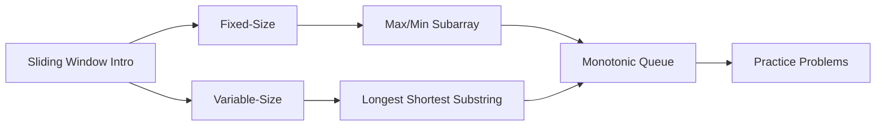
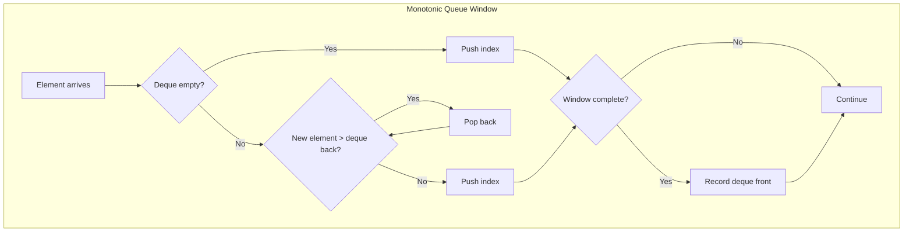

<!-- Clear Language: Keep sentences under 50 words -->
# Sliding Window

## Learning Objectives

| Objective | Description |
|-----------|-------------|
| LO1 | Understand fixed-size and variable-size sliding window patterns |
| LO2 | Implement sliding window for maximum/minimum subarray problems |
| LO3 | Solve substring problems using character frequency windows |
| LO4 | Apply sliding window to find longest/shortest valid subarrays |
| LO5 | Optimize nested loop solutions to O(n) using the sliding window technique |
| LO6 | Identify when sliding window is applicable (contiguous, monotonic condition) |

## Introduction

Linked lists form the backbone of many advanced data structures like stacks, queues, and graphs. Mastering pointer manipulation and linked list algorithms is a classic interview topic that tests your understanding of memory and data organization.

## Prerequisites

- Basic programming
- Understanding of pointers/references

## Key Terminology

**Key Terms**: Core vocabulary and concepts for this topic.

**Definition**: Essential terms you must know for interviews and production work.

## Theory

Understanding sliding window is fundamental for AI engineers. This section covers the core concepts, underlying principles, and theoretical framework that govern how sliding window works in practice.

## Chapter at a Glance

| Section | Topic | Key Concept |
|---------|-------|-------------|
| 4.1 | Fixed-Size Window | Maximum sum subarray of size k |
| 4.2 | Variable-Size Window | Longest substring without repeating chars |
| 4.3 | Condition-Based Window | Minimum window substring |
| 4.4 | Monotonic Queue + Window | Sliding window maximum |
| 4.5 | Two-Pointer Variant | Subarray product less than k |
| 4.6 | Advanced Patterns | Count of subarrays with condition |

## Chapter Roadmap



## 4.1 Fixed-Size Window

Fixed-size sliding window moves a window of constant size k across the array, updating the result at each position.

**Maximum sum subarray of size k**:

```python
def max_sum_fixed_window(arr, k):
    if len(arr) < k:
        return None
    window_sum = sum(arr[:k])
    max_sum = window_sum
    for i in range(k, len(arr)):
        window_sum += arr[i] - arr[i - k]
        max_sum = max(max_sum, window_sum)
    return max_sum

print(max_sum_fixed_window([2, 1, 5, 1, 3, 2], 3))  # 9 (5+1+3)
```

**First negative integer in every window of size k**:

```python
from collections import deque

def first_negative_in_window(arr, k):
    result = []
    negatives = deque()
    for i in range(k):
        if arr[i] < 0:
            negatives.append(i)
    result.append(arr[negatives[0]] if negatives else 0)
    for i in range(k, len(arr)):
        while negatives and negatives[0] <= i - k:
            negatives.popleft()
        if arr[i] < 0:
            negatives.append(i)
        result.append(arr[negatives[0]] if negatives else 0)
    return result

print(first_negative_in_window([12, -1, -7, 8, -15, 30, 16, 28], 3))
```

**Count occurrences of anagram in a string**:

```python
def count_anagram_occurrences(text, pattern):
    m, n = len(pattern), len(text)
    if m > n:
        return 0
    p_count = [0] * 26
    w_count = [0] * 26
    count = 0
    for c in pattern:
        p_count[ord(c) - ord('a')] += 1
    for i in range(m):
        w_count[ord(text[i]) - ord('a')] += 1
    if p_count == w_count:
        count += 1
    for i in range(m, n):
        w_count[ord(text[i - m]) - ord('a')] -= 1
        w_count[ord(text[i]) - ord('a')] += 1
        if p_count == w_count:
            count += 1
    return count

print(count_anagram_occurrences("cbaebabacd", "abc"))  # 2
```

---

## 4.2 Variable-Size Window

Variable-size window expands right pointer and contracts left pointer based on conditions.

**Longest substring without repeating characters**:

```python
def longest_substring_no_repeat(s):
    char_set = set()
    left = max_len = 0
    for right, char in enumerate(s):
        while char in char_set:
            char_set.remove(s[left])
            left += 1
        char_set.add(char)
        max_len = max(max_len, right - left + 1)
    return max_len

print(longest_substring_no_repeat("abcabcbb"))  # 3 ("abc")
print(longest_substring_no_repeat("bbbbb"))     # 1 ("b")
print(longest_substring_no_repeat("pwwkew"))    # 3 ("wke")
```

**Longest substring with at most k distinct characters**:

```python
from collections import defaultdict

def longest_substring_k_distinct(s, k):
    if k == 0:
        return 0
    char_count = defaultdict(int)
    left = max_len = 0
    for right, char in enumerate(s):
        char_count[char] += 1
        while len(char_count) > k:
            left_char = s[left]
            char_count[left_char] -= 1
            if char_count[left_char] == 0:
                del char_count[left_char]
            left += 1
        max_len = max(max_len, right - left + 1)
    return max_len

print(longest_substring_k_distinct("eceba", 2))  # 3 ("ece")
print(longest_substring_k_distinct("aa", 1))     # 2 ("aa")
```

---

## 4.3 Condition-Based Window

**Minimum window substring**: Find minimum window containing all characters of a pattern.

```python
from collections import defaultdict

def min_window_substring(s, t):
    if not s or not t:
        return ""
    target_count = defaultdict(int)
    for c in t:
        target_count[c] += 1
    required = len(target_count)
    formed = 0
    window_count = defaultdict(int)
    left = 0
    min_len = float('inf')
    min_left = 0
    for right, char in enumerate(s):
        window_count[char] += 1
        if char in target_count and window_count[char] == target_count[char]:
            formed += 1
        while left <= right and formed == required:
            if right - left + 1 < min_len:
                min_len = right - left + 1
                min_left = left
            left_char = s[left]
            window_count[left_char] -= 1
            if left_char in target_count and window_count[left_char] < target_count[left_char]:
                formed -= 1
            left += 1
    return "" if min_len == float('inf') else s[min_left:min_left + min_len]

print(min_window_substring("ADOBECODEBANC", "ABC"))  # "BANC"
```

**Subarray with sum at least target**:

```python
def min_subarray_len(target, nums):
    left = curr_sum = 0
    min_len = float('inf')
    for right, num in enumerate(nums):
        curr_sum += num
        while curr_sum >= target:
            min_len = min(min_len, right - left + 1)
            curr_sum -= nums[left]
            left += 1
    return 0 if min_len == float('inf') else min_len

print(min_subarray_len(7, [2, 3, 1, 2, 4, 3]))  # 2 ([4, 3])
```

---

## 4.4 Monotonic Queue + Window

**Sliding window maximum**: Use deque to maintain candidate maximums.

```python
from collections import deque

def max_sliding_window(nums, k):
    if not nums or k == 0:
        return []
    dq = deque()
    result = []
    for i, num in enumerate(nums):
        while dq and dq[0] < i - k + 1:
            dq.popleft()
        while dq and nums[dq[-1]] <= num:
            dq.pop()
        dq.append(i)
        if i >= k - 1:
            result.append(nums[dq[0]])
    return result

print(max_sliding_window([1, 3, -1, -3, 5, 3, 6, 7], 3))
# [3, 3, 5, 5, 6, 7]
```

**Sliding window minimum**:

```python
def min_sliding_window(nums, k):
    if not nums or k == 0:
        return []
    dq = deque()
    result = []
    for i, num in enumerate(nums):
        while dq and dq[0] < i - k + 1:
            dq.popleft()
        while dq and nums[dq[-1]] >= num:
            dq.pop()
        dq.append(i)
        if i >= k - 1:
            result.append(nums[dq[0]])
    return result

print(min_sliding_window([1, 3, -1, -3, 5, 3, 6, 7], 3))

## [-1, -3, -3, -3, 3, 3]
```



---

## 4.5 Two-Pointer Variant

**Number of subarrays with product less than k**:

```python
def num_subarray_product_less_than_k(nums, k):
    if k <= 1:
        return 0
    left = 0
    product = 1
    count = 0
    for right, num in enumerate(nums):
        product *= num
        while product >= k and left <= right:
            product //= nums[left]
            left += 1
        count += right - left + 1
    return count

print(num_subarray_product_less_than_k([10, 5, 2, 6], 100))  # 8
```

**Count number of nice subarrays** (odd numbers count = k):

```python
def number_of_subarrays_with_odd_k(nums, k):
    def at_most_k_odds(k):
        if k < 0:
            return 0
        left = count = odd_count = 0
        for right, num in enumerate(nums):
            if num % 2 == 1:
                odd_count += 1
            while odd_count > k:
                if nums[left] % 2 == 1:
                    odd_count -= 1
                left += 1
            count += right - left + 1
        return count
    return at_most_k_odds(k) - at_most_k_odds(k - 1)

print(number_of_subarrays_with_odd_k([1, 1, 2, 1, 1], 3))  # 2
```

**Fruits into baskets**:

```python
def total_fruit(fruits):
    basket = {}
    left = max_count = 0
    for right, fruit in enumerate(fruits):
        basket[fruit] = basket.get(fruit, 0) + 1
        while len(basket) > 2:
            basket[fruits[left]] -= 1
            if basket[fruits[left]] == 0:
                del basket[fruits[left]]
            left += 1
        max_count = max(max_count, right - left + 1)
    return max_count

print(total_fruit([1, 2, 1, 2, 3]))  # 4
```

**Binary subarrays with sum = goal**:

```python
def num_subarrays_with_sum(nums, goal):
    def at_most_sum(k):
        if k < 0:
            return 0
        left = count = curr_sum = 0
        for right, num in enumerate(nums):
            curr_sum += num
            while curr_sum > k:
                curr_sum -= nums[left]
                left += 1
            count += right - left + 1
        return count
    return at_most_sum(goal) - at_most_sum(goal - 1)

print(num_subarrays_with_sum([1, 0, 1, 0, 1], 2))  # 4
```

---

## 4.6 Advanced Patterns

**Count complete subarrays with all distinct elements**:

```python
def count_complete_subarrays(nums):
    distinct_count = len(set(nums))
    freq = defaultdict(int)
    left = count = 0
    for right, num in enumerate(nums):
        freq[num] += 1
        while len(freq) == distinct_count:
            count += len(nums) - right
            freq[nums[left]] -= 1
            if freq[nums[left]] == 0:
                del freq[nums[left]]
            left += 1
    return count

print(count_complete_subarrays([1, 3, 1, 2, 2]))  # 4
```

**Maximum length of subarray with equal 0s and 1s**:

```python
def find_max_length(nums):
    prefix_sum = 0
    first_occurrence = {0: -1}
    max_len = 0
    for i, num in enumerate(nums):
        prefix_sum += 1 if num == 1 else -1
        if prefix_sum in first_occurrence:
            max_len = max(max_len, i - first_occurrence[prefix_sum])
        else:
            first_occurrence[prefix_sum] = i
    return max_len

print(find_max_length([0, 1, 0, 1]))  # 4
```

**Minimum operations to reduce X to zero**:

```python
def min_operations(nums, x):
    target = sum(nums) - x
    if target == 0:
        return len(nums)
    if target < 0:
        return -1
    left = curr_sum = max_len = 0
    found = False
    for right, num in enumerate(nums):
        curr_sum += num
        while curr_sum > target and left <= right:
            curr_sum -= nums[left]
            left += 1
        if curr_sum == target:
            found = True
            max_len = max(max_len, right - left + 1)
    return len(nums) - max_len if found else -1

print(min_operations([3, 2, 20, 1, 1, 3], 10))  # 5
```

```mermaid
flowchart TD
    subgraph "Sliding Window Patterns"
        A[Fixed Size k] --> B[Sum, Average, Max/Min]
        C[Variable - At Most k] --> D[Distinct, Product, Sum]
        E[Variable - Exactly k] --> F[Using atMost(k) - atMost(k-1)]
        G[Variable - Minimum] --> H[Shrink while condition met]
    end
```

---

## TypeScript Parallel

TypeScript implementation of sliding window patterns:

```typescript
function maxSumFixed(arr: number[], k: number): number {
    let windowSum = arr.slice(0, k).reduce((a, b) => a + b, 0);
    let maxSum = windowSum;
    for (let i = k; i < arr.length; i++) {
        windowSum += arr[i] - arr[i - k];
        maxSum = Math.max(maxSum, windowSum);
    }
    return maxSum;
}

function longestSubstringNoRepeat(s: string): number {
    const set = new Set<string>();
    let left = 0, maxLen = 0;
    for (let right = 0; right < s.length; right++) {
        while (set.has(s[right])) {
            set.delete(s[left]); left++;
        }
        set.add(s[right]);
        maxLen = Math.max(maxLen, right - left + 1);
    }
    return maxLen;
}
```

---

## Summary

- Sliding window transforms O(n²) nested loops into O(n) single pass by maintaining a window that expands and contracts
- Fixed-size windows maintain constant length k; variable-size windows adjust based on conditions
- The sliding window technique applies only to contiguous subarray/substring problems with monotonic conditions
- Deque-based monotonic queue solves sliding window maximum/minimum in O(n) by maintaining candidate indices
- The "at most k" technique converts "exactly k" problems into two sliding window calls: atMost(k) - atMost(k-1)
- For substring problems, maintaining character frequency counts enables O(1) condition checks per step
- The minimum window substring problem requires tracking "formed" conditions vs "required" conditions
- Sliding window product problems require special handling for zeros (product resets)
- The technique is not applicable when the condition is not monotonic (e.g., subarray with sum = k in unsorted arrays with negatives)
- Space complexity is typically O(alphabet size) or O(k) for window storage, rarely O(n)

## Practical Takeaways

| Scenario | Do This | Avoid This |
|----------|---------|------------|
| Maximum sum of subarray size k | Fixed window — add right, subtract left | Computing sum for each subarray from scratch |
| Longest substring without repeats | Variable window with set for chars in window | Checking all substrings O(n²) |
| Minimum window containing pattern | Expand right, shrink left when valid | Brute-force checking all windows |
| Sliding window maximum | Deque monotonic queue | Recomputing max each window O(nk) |
| Count subarrays with sum = k | Convert to atMost(k) - atMost(k-1) | Complex sliding with hash map for negative numbers |
| Product less than k | Variable window, divide left when product >= k | Using sum-based approach for product |

## Interview Q&A

<details class="tp-qa-card" data-qid="dsa04-q1">
  <summary class="tp-qa-question">
    <span class="tp-qa-status"></span>
    Q1: Explain the sliding window technique and when it should be used.
  </summary>
  <div class="tp-qa-answer">
    <p><strong>Sliding window</strong> is a technique for solving subarray/substring problems in O(n) time by maintaining a contiguous window and adjusting its boundaries.</p>
    <p><strong>When to use</strong>:</p>
    <ul>
      <li>The problem involves a <strong>contiguous</strong> subarray/substring</li>
      <li>The condition is <strong>monotonic</strong> — if a window satisfies the condition, any smaller window (or larger) also satisfies it</li>
      <li>You can compute the answer from the window's state efficiently</li>
    </ul>
    <p><strong>Types</strong>: Fixed size (k given), Variable size (expand/contract), Two pointers.</p>
  </div>
  <button class="tp-qa-mark-btn">? Mark Reviewed</button>
  <button class="tp-qa-bookmark-btn">?? Bookmark</button>
</details>

<details class="tp-qa-card" data-qid="dsa04-q2">
  <summary class="tp-qa-question">
    <span class="tp-qa-status"></span>
    Q2: Implement the longest substring without repeating characters using sliding window.
  </summary>
  <div class="tp-qa-answer">
    <pre><code>def longest_substring_no_repeat(s):
    char_set = set()
    left = 0
    max_len = 0
    for right, char in enumerate(s):
        while char in char_set:
            char_set.remove(s[left])
            left += 1
        char_set.add(char)
        max_len = max(max_len, right - left + 1)
    return max_len</code></pre>
    <p><strong>Optimization</strong>: Use a dictionary mapping character to its last index to skip directly:</p>
    <pre><code>def optimized(s):
    last_seen = {}
    left = max_len = 0
    for right, char in enumerate(s):
        if char in last_seen and last_seen[char] &gt;= left:
            left = last_seen[char] + 1
        last_seen[char] = right
        max_len = max(max_len, right - left + 1)
    return max_len</code></pre>
  </div>
  <button class="tp-qa-mark-btn">? Mark Reviewed</button>
  <button class="tp-qa-bookmark-btn">?? Bookmark</button>
</details>

<details class="tp-qa-card" data-qid="dsa04-q3">
  <summary class="tp-qa-question">
    <span class="tp-qa-status"></span>
    Q3: Explain the minimum window substring problem. How does the algorithm track when a window is valid?
  </summary>
  <div class="tp-qa-answer">
    <p><strong>Problem</strong>: Given string s and pattern t, find the minimum window in s containing all characters of t.</p>
    <p><strong>Algorithm</strong>: Count characters in pattern t (target counts). Expand right pointer, updating window counts. Track <code>formed</code> — number of characters meeting their target count. When <code>formed == required</code>, shrink from left to minimize window. Update result when smaller window found.</p>
    <p><strong>Complexity</strong>: O(n) time (each character visited twice), O(k) space for character counts.</p>
  </div>
  <button class="tp-qa-mark-btn">? Mark Reviewed</button>
  <button class="tp-qa-bookmark-btn">?? Bookmark</button>
</details>

<details class="tp-qa-card" data-qid="dsa04-q4">
  <summary class="tp-qa-question">
    <span class="tp-qa-status"></span>
    Q4: How do you find the maximum element in every sliding window of size k in O(n) time?
  </summary>
  <div class="tp-qa-answer">
    <p><strong>Solution</strong>: Use a <strong>deque that stores indices</strong> in decreasing order of values. The deque front always holds the index of the maximum in the current window. When a new element arrives, we remove all smaller elements from the back (they can never be the max while this new element exists).</p>
    <p><strong>Complexity</strong>: O(n) — each element is pushed and popped at most once.</p>
  </div>
  <button class="tp-qa-mark-btn">? Mark Reviewed</button>
  <button class="tp-qa-bookmark-btn">?? Bookmark</button>
</details>

<details class="tp-qa-card" data-qid="dsa04-q5">
  <summary class="tp-qa-question">
    <span class="tp-qa-status"></span>
    Q5: What is the "at most k" technique and how does it help solve "exactly k" problems?
  </summary>
  <div class="tp-qa-answer">
    <p>The <strong>"at most k"</strong> technique converts "exactly k" problems into two sliding window calls:</p>
    <pre><code>def exactly_k(nums, k):
    return at_most_k(nums, k) - at_most_k(nums, k - 1)</code></pre>
    <p><strong>Why this works</strong>: Counting "at most k" is easier with sliding window because the condition is monotonic — if a window is valid for "at most k", any sub-window is also valid. But "exactly k" isn't monotonic.</p>
    <p><strong>Examples</strong>: Subarrays with exactly k odd numbers, subarrays with sum exactly equal to goal (binary array), subarrays with exactly k distinct integers.</p>
  </div>
  <button class="tp-qa-mark-btn">? Mark Reviewed</button>
  <button class="tp-qa-bookmark-btn">?? Bookmark</button>
</details>

<details class="tp-qa-card" data-qid="dsa04-q6">
  <summary class="tp-qa-question">
    <span class="tp-qa-status"></span>
    Q6: How do you count the number of subarrays with product less than k?
  </summary>
  <div class="tp-qa-answer">
    <pre><code>def num_subarray_product_less_than_k(nums, k):
    if k &lt;= 1:
        return 0
    left = 0
    product = 1
    count = 0
    for right, num in enumerate(nums):
        product *= num
        while product &gt;= k and left &lt;= right:
            product //= nums[left]
            left += 1
        count += right - left + 1
    return count</code></pre>
    <p><strong>Key insight</strong>: When product >= k, we divide by leftmost elements until product < k. At that point, every subarray ending at current right starting from left to right is valid.</p>
  </div>
  <button class="tp-qa-mark-btn">? Mark Reviewed</button>
  <button class="tp-qa-bookmark-btn">?? Bookmark</button>
</details>

<details class="tp-qa-card" data-qid="dsa04-q7">
  <summary class="tp-qa-question">
    <span class="tp-qa-status"></span>
    Q7: Find the longest substring with at most k distinct characters.
  </summary>
  <div class="tp-qa-answer">
    <pre><code>from collections import defaultdict

def longest_substring_k_distinct(s, k):
    if k == 0:
        return 0
    char_count = defaultdict(int)
    left = max_len = 0
    for right, char in enumerate(s):
        char_count[char] += 1
        while len(char_count) &gt; k:
            left_char = s[left]
            char_count[left_char] -= 1
            if char_count[left_char] == 0:
                del char_count[left_char]
            left += 1
        max_len = max(max_len, right - left + 1)
    return max_len</code></pre>
    <p><strong>Key insight</strong>: The sliding window expands right until we have more than k distinct characters, then shrinks from left until we're back to at most k distinct characters.</p>
  </div>
  <button class="tp-qa-mark-btn">? Mark Reviewed</button>
  <button class="tp-qa-bookmark-btn">?? Bookmark</button>
</details>

<details class="tp-qa-card" data-qid="dsa04-q8">
  <summary class="tp-qa-question">
    <span class="tp-qa-status"></span>
    Q8: How do you find the longest subarray with equal 0s and 1s?
  </summary>
  <div class="tp-qa-answer">
    <p><strong>Insight</strong>: Treat 0 as -1. The problem becomes finding the longest subarray with sum 0. Use prefix sum and a hash map storing the first occurrence of each prefix sum.</p>
    <pre><code>def find_max_length(nums):
    prefix_sum = 0
    first_occurrence = {0: -1}
    max_len = 0
    for i, num in enumerate(nums):
        prefix_sum += 1 if num == 1 else -1
        if prefix_sum in first_occurrence:
            max_len = max(max_len, i - first_occurrence[prefix_sum])
        else:
            first_occurrence[prefix_sum] = i
    return max_len</code></pre>
    <p><strong>Complexity</strong>: O(n) time, O(n) space.</p>
  </div>
  <button class="tp-qa-mark-btn">? Mark Reviewed</button>
  <button class="tp-qa-bookmark-btn">?? Bookmark</button>
</details>

<details class="tp-qa-card" data-qid="dsa04-q9">
  <summary class="tp-qa-question">
    <span class="tp-qa-status"></span>
    Q9: Explain the "minimum operations to reduce X to zero" problem.
  </summary>
  <div class="tp-qa-answer">
    <p><strong>Problem</strong>: Remove elements from either end of an array so the sum of removed elements equals X. Minimize number of operations.</p>
    <p><strong>Insight</strong>: Instead of finding prefix + suffix sum = X, find the longest contiguous subarray with sum = total - X. The answer is n - len(that subarray).</p>
    <p><strong>Complexity</strong>: O(n) time, O(1) space.</p>
  </div>
  <button class="tp-qa-mark-btn">? Mark Reviewed</button>
  <button class="tp-qa-bookmark-btn">?? Bookmark</button>
</details>

<details class="tp-qa-card" data-qid="dsa04-q10">
  <summary class="tp-qa-question">
    <span class="tp-qa-status"></span>
    Q10: What problems cannot be solved with the sliding window technique?
  </summary>
  <div class="tp-qa-answer">
    <p>Sliding window does NOT work when:</p>
    <ul>
      <li>The condition is <strong>not monotonic</strong> — e.g., subarray sum = k in arrays with negative numbers (once sum exceeds k, we might still need to add more elements)</li>
      <li>The problem involves <strong>non-contiguous</strong> elements — e.g., subsequence problems</li>
      <li>The problem requires <strong>reordering</strong> elements — e.g., sorting-based problems</li>
      <li>The window state cannot be <strong>efficiently updated</strong> when sliding — e.g., median of each window requires O(log k) update using heaps</li>
    </ul>
    <p>For non-monotonic conditions, consider prefix sum + hash map or other techniques.</p>
  </div>
  <button class="tp-qa-mark-btn">? Mark Reviewed</button>
  <button class="tp-qa-bookmark-btn">?? Bookmark</button>
</details>

<details class="tp-qa-card" data-qid="dsa04-q11">
  <summary class="tp-qa-question">
    <span class="tp-qa-status"></span>
    Q11: Compare the fixed-size and variable-size sliding window approaches.
  </summary>
  <div class="tp-qa-answer">
    <table>
      <tr><th>Property</th><th>Fixed-Size</th><th>Variable-Size</th></tr>
      <tr><td>Window length</td><td>Always k</td><td>Changes as needed</td></tr>
      <tr><td>Update pattern</td><td>Add right, subtract left</td><td>Expand right, shrink left</td></tr>
      <tr><td>Condition</td><td>Window size is the constraint</td><td>Window content must satisfy condition</td></tr>
      <tr><td>Result type</td><td>Max/min/average of windows</td><td>Max/min length of valid windows</td></tr>
      <tr><td>Example</td><td>Maximum sum of subarray size k</td><td>Longest substring without repeats</td></tr>
    </table>
  </div>
  <button class="tp-qa-mark-btn">? Mark Reviewed</button>
  <button class="tp-qa-bookmark-btn">?? Bookmark</button>
</details>

<details class="tp-qa-card" data-qid="dsa04-q12">
  <summary class="tp-qa-question">
    <span class="tp-qa-status"></span>
    Q12: How do you count occurrences of an anagram in a string using sliding window?
  </summary>
  <div class="tp-qa-answer">
    <pre><code>def count_anagram_occurrences(text, pattern):
    m, n = len(pattern), len(text)
    if m &gt; n:
        return 0
    p_count = [0] * 26
    w_count = [0] * 26
    count = 0
    for c in pattern:
        p_count[ord(c) - ord('a')] += 1
    for i in range(m):
        w_count[ord(text[i]) - ord('a')] += 1
    if p_count == w_count:
        count += 1
    for i in range(m, n):
        w_count[ord(text[i - m]) - ord('a')] -= 1
        w_count[ord(text[i]) - ord('a')] += 1
        if p_count == w_count:
            count += 1
    return count</code></pre>
    <p><strong>Key insight</strong>: Maintain character counts in the current window. Slide the window by removing leftmost character count and adding new character count. Compare with pattern's character counts.</p>
  </div>
  <button class="tp-qa-mark-btn">? Mark Reviewed</button>
  <button class="tp-qa-bookmark-btn">?? Bookmark</button>
</details>

## Chapter Quiz

**Q1**: What is the time complexity of the sliding window maximum using deque?

a) O(n log k)
b) O(n)
c) O(nk)
d) O(k)

<details class="tp-qa-card" data-qid="dsa04-quiz1"><summary>Show Answer</summary><div class="tp-qa-answer"><p><strong>Answer: b) O(n)</strong></p><p>Each element is pushed and popped at most once, giving O(n) total.</p></div></details>

**Q2**: Which technique is used to convert "exactly k" to "at most k" sliding window problems?

a) atMost(k) - atMost(k-1)
b) atMost(k) + atMost(k-1)
c) atMost(k) * atMost(k-1)
d) atLeast(k) - atMost(k)

<details class="tp-qa-card" data-qid="dsa04-quiz2"><summary>Show Answer</summary><div class="tp-qa-answer"><p><strong>Answer: a) atMost(k) - atMost(k-1)</strong></p><p>Since exactly k = atMost(k) - atMost(k-1), this conversion enables sliding window solutions for "exactly k" problems.</p></div></details>

**Q3**: In the minimum window substring problem, what does the "formed" counter track?

a) Number of characters in the window
b) Number of distinct characters that have met their required count
c) Total characters in the pattern
d) Length of the current window

<details class="tp-qa-card" data-qid="dsa04-quiz3"><summary>Show Answer</summary><div class="tp-qa-answer"><p><strong>Answer: b) Number of distinct characters that have met their required count</strong></p><p>formed tracks how many distinct characters from the pattern have reached or exceeded their required count in the current window.</p></div></details>

**Q4**: What data structure is used for O(n) sliding window maximum?

a) Stack
b) Queue
c) Deque
d) Priority Queue

<details class="tp-qa-card" data-qid="dsa04-quiz4"><summary>Show Answer</summary><div class="tp-qa-answer"><p><strong>Answer: c) Deque</strong></p><p>A deque maintains indices in decreasing order of values, giving O(1) access to the maximum and O(1) amortized for adding/removing elements.</p></div></details>

**Q5**: Which of these problems CANNOT be solved with a standard sliding window?

a) Maximum sum subarray of size k
b) Longest substring without repeating characters
c) Subarray sum equals k (with negative numbers)
d) Minimum window substring

<details class="tp-qa-card" data-qid="dsa04-quiz5"><summary>Show Answer</summary><div class="tp-qa-answer"><p><strong>Answer: c) Subarray sum equals k (with negative numbers)</strong></p><p>With negative numbers, the sum is not monotonic — adding elements can decrease the sum, so sliding window cannot guarantee correctness.</p></div></details>

## Exercises

**Easy** — Given an array of positive integers and a target sum, find the minimum length of a contiguous subarray whose sum is at least the target.

**Medium** — Given a string s and a string p, find all start indices of p's anagrams in s using sliding window.

**Medium** — Implement a function that finds the maximum sum of any subarray of size k in a circular array (where the subarray can wrap around from end to start).

**Hard** — Implement a sliding window median — find the median of each window of size k in an array. Achieve O(n log k) using two heaps.

**Hard** — Given an array of integers and an integer k, find the length of the longest subarray whose sum is at most k. Then generalize to subarray product at most k.

---

## Common Mistakes

1. Losing reference to remaining list during traversal
2. Not handling edge cases (empty list, single node)
3. Forgetting to update head/tail pointers
4. Infinite loops from incorrect cycle detection
5. Not using dummy nodes for simplification

## Revision Notes

- Singly linked: O(1) insert/delete at head
- Doubly linked: O1 insert/delete with reference
- Fast/slow pointer for cycle detection
- Dummy node simplifies edge cases
- Reversing a linked list is O(n) time O(1) space

## Placement Section

### Top 10 Interview Questions

#### Google Style

1. **Explain the core idea of Sliding Window in under 60 seconds, then give a real-world analogy.** — Structure: definition, how it works in one sentence, why it matters, analogy. Follow-up: what would break if you removed this from a production system?

2. **Design a minimal, well-typed function that demonstrates Sliding Window.** — Interviewer checks: signature with type hints, edge cases, complexity, and a clean docstring. Follow-up: how does your design behave with empty or malformed input?

3. **What are the common pitfalls when engineers first learn ** — List 3-4, then explain how you would prevent each in a code review.

#### Amazon Style

4. **Describe a production bug caused by misunderstanding Sliding Window. How did you diagnose and fix it?** — STAR format: situation, task, action, result. Mention logs, reproduction, root-cause analysis, and the regression test you added.

5. **How would you scale a system that relies on Sliding Window from 10 users to 10 million?** — Discuss bottlenecks, caching, monitoring, and when to redesign. Follow-up: what metrics would you track?

#### Microsoft Style

6. **Compare Sliding Window with the closest alternative approach. When would you choose each?** — Make a decision matrix: performance, maintainability, ecosystem, learning curve. Follow-up: what would change your decision?

7. **Walk through how you would test a component that depends on Sliding Window.** — Unit, integration, property-based tests; mocking boundaries; golden files for outputs.

#### NVIDIA Style

8. **How does Sliding Window behave differently at scale — memory, throughput, or precision-wise?** — Connect to data pipelines and model training if applicable. Follow-up: what happens to latency as input grows?

9. **How would you make an implementation of Sliding Window run faster on GPU hardware?** — Batch operations, vectorization, avoiding Python loops, reducing data movement.

#### AI Startup Style

10. **Write the smallest possible implementation of Sliding Window that is production-quality.** — Include error handling, type hints, and a one-line docstring. Follow-up: what would you refactor first when it grows?

### Resume Tips

- Name Sliding Window explicitly in your skills section, paired with a measurable achievement ("Reduced X by 40% using Sliding Window").
- Add a bullet describing a project that applies Sliding Window to real data, with numbers.
- Mention the tools and libraries you used alongside Sliding Window (linters, test frameworks, profiling tools).
- Keep resume bullets under 15 words and start each with an action verb.

### Interview Day Checklist

- Rehearse a 60-second explanation of Sliding Window and one real-world analogy.
- Prepare one STAR story about debugging a Sliding Window-related production issue.
- Review complexity and edge cases for the classic Sliding Window interview problem.
- Have questions ready: how does the team apply Sliding Window in production today?
- Test your environment (Python, editor, internet) 15 minutes before the interview.

## True/False

1. **True or False:** Sliding Window builds directly on the fundamentals covered in the earlier chapters of this module. — **True.** Every advanced topic in this module assumes the core concepts from the previous chapters.
2. **True or False:** You should write at least one code example for Sliding Window before moving to the next chapter. — **True.** Active recall with hands-on code beats passive reading for retention.
3. **True or False:** The complexity analysis for Sliding Window is the same regardless of input size. — **False.** Complexity grows with input size; always state best, average, and worst case.
4. **True or False:** Edge cases (empty input, invalid input, boundary values) matter for Sliding Window in production. — **True.** Most production bugs come from unhandled edge cases.
5. **True or False:** You should memorize the Sliding Window chapter content once and never review it again. — **False.** Spaced repetition (24h, 3 days, 1 week) dramatically improves long-term recall.

## Fill in the Blank

1. The chapter that covers Sliding Window is Chapter ___ of this module. — Answer: check the module's table of contents.
2. The time complexity of the standard approach to Sliding Window is ___. — Answer: review the theory section and state big-O notation.
3. The main edge case to handle when implementing Sliding Window is ___. — Answer: empty or invalid input handling, as discussed in the chapter.
4. The tools commonly used to debug Sliding Window issues are ___ and ___. — Answer: refer to the Debugging Guide section of this chapter.
5. The related topic that connects to Sliding Window in the next chapter is ___. — Answer: see the Next Topic section.

## Scenario Questions

1. **Scenario:** A teammate ships a change involving Sliding Window that breaks production at 3 AM. — Diagnosis: check the recent diff, reproduce locally with the failing input, check logs. Fix: revert, add a regression test, and review the root cause. Prevention: CI tests on edge cases and code review checklist.

2. **Scenario:** Your implementation of Sliding Window is correct but too slow for the required latency. — Measure first with a profiler. Common fixes: reduce redundant work, use built-in optimized functions, batch operations, or add caching. Only then consider algorithmic changes.

3. **Scenario:** A new hire asks you to explain Sliding Window in five minutes before a customer demo. — Use the 3-part answer: what it is (one sentence), how it works (one example), why it matters (one business impact). Then offer to go deeper after the demo.

4. **Scenario:** Your team's codebase has three different patterns for Sliding Window and you must standardize. — Write a short ADR (architecture decision record), pick the pattern with best maintainability, migrate incrementally, and add a linter rule to enforce it.

## Output Questions

1. **What is the output of the simplest correct implementation of Sliding Window on an empty input?** — Trace through the code: it should return the documented default (None, 0, empty collection) without raising.
2. **What is the output when the input is at the boundary value?** — Check off-by-one errors and inclusive/exclusive bounds in the chapter's examples.
3. **What does the implementation return when given invalid input types?** — With type hints and validation, it raises a clear error; without, it may fail silently.
4. **What is the output for the sample input given in the chapter's Examples section?** — Re-run the chapter's example code and compare against the documented output.
5. **What is the time complexity output when you profile the implementation at 10x input size?** — Expect the curve matching the chapter's complexity analysis (linear, quadratic, log-linear).

## Difficulty Level

| Level | Time | What It Takes |
|-------|------|---------------|
| Beginner | 1-2 sessions | Read theory, run the chapter examples, solve the Easy exercises |
| Intermediate | 3-5 sessions | Complete Medium exercises, explain Sliding Window to someone else |
| Advanced | 1+ week | Solve Hard exercises, optimize for real datasets, answer interview follow-ups |

## Tips & Tricks

- Always write a one-line example of Sliding Window from memory before opening the chapter — active recall first.
- Use the chapter's Revision Notes as a checklist: you have mastered Sliding Window when you can explain each bullet.
- Pair the chapter quiz with the Flashcards: wrong answers become your next study session's focus.
- For interviews, practice explaining Sliding Window twice: once with a technical audience, once with a non-technical audience.
- Keep a personal examples file where you collect your own Sliding Window snippets; interviewers love original examples.

## Memory Tricks

- **Acronym**: build a mnemonic from the 5 key concepts of Sliding Window listed in the Chapter at a Glance table.
- **Story**: link Sliding Window to a familiar story — the analogy in the Visual Analogy section is designed to stick.
- **Number anchor**: remember the complexity of Sliding Window by connecting it to a known algorithm of the same class.
- **Color code**: highlight the Theory, Examples, and Common Mistakes sections in different colors when reviewing.
- **Teach-back**: explain Sliding Window to an imaginary junior engineer for 2 minutes — gaps in your explanation are gaps in memory.

## Further Reading

- Official documentation for the primary tool or library used in this chapter
- The chapter referenced in Related Topics for the next-level treatment of Sliding Window
- The classic textbook chapter on Sliding Window (check the Research References below)
- Two blog posts from engineers who debugged real Sliding Window problems in production
- The repository of the open-source project that implements Sliding Window

## Related Topics

- The previous chapter in this module (see table of contents) — foundational for Sliding Window
- The next chapter (see Next Topic below) — builds on Sliding Window
- The system design chapters in Module 07 — how Sliding Window fits into production architectures
- The interview preparation module — how Sliding Window is asked in screening rounds
- The capstone project — where Sliding Window is applied end-to-end

## FAQs

1. **Do I need to memorize all of Sliding Window, or understand the big picture?** — Understand the big picture first, then memorize the key facts via flashcards and spaced repetition. Interviewers reward depth over breadth.
2. **What if I get stuck on an exercise?** — Re-read the theory section, run the example code, then attempt again. If still stuck after 20 minutes, move on and return the next day.
3. **How much time should I spend on ** — Follow the Study Plan below: 1-2 weeks at 30-60 minutes daily is typical for placement preparation.
4. **Is Sliding Window asked in interviews?** — Yes — the Interview Q&A and Placement Section list the exact question styles used by top companies.
5. **What's the fastest way to master ** — Explain it out loud, write code without looking, and review the flashcards within 24 hours and again after 3 days.

## Important Notes

- Sliding Window is a core requirement for the rest of this module — do not skip the examples.
- Always analyze complexity (time and space) when working with Sliding Window.
- Production correctness means handling edge cases, not just the happy path.
- Interview answers should start with the definition, then the example, then the trade-offs.
- Revisit this chapter after finishing the module; the context from later chapters deepens understanding.

## Historical Context

- Sliding Window emerged as a standard practice because early systems failed without it — understanding why helps you explain it in interviews.
- The tools used for Sliding Window today evolved from simpler versions; the chapter covers the modern, recommended approach.
- Interviewers value knowing one historical fact about Sliding Window — it shows genuine interest, not just cramming.
- The library/tooling ecosystem around Sliding Window changes quickly; focus on fundamentals that remain stable.

## Security Considerations

- Never trust external input: validate and sanitize data before processing Sliding Window.
- Avoid `eval()` and dynamic code execution on untrusted strings.
- Log errors without leaking sensitive data (keys, PII, internal paths).
- For API contexts, add rate limiting and input size limits.
- Review the chapter's code examples for injection or overflow risks before using them verbatim.

## ML Intuition

- Sliding Window appears in ML pipelines at the data-processing layer: feature preparation, batching, and validation.
- Understanding Sliding Window helps you debug why a model misbehaves — most ML bugs are data bugs, not model bugs.
- In production ML, the Sliding Window concepts from this chapter map directly to NumPy/PyTorch operations on tensors.
- When optimizing ML systems, Sliding Window skills let you profile and fix the data path, not just the training loop.
- Interview follow-up: how would you apply Sliding Window to a dataset of 10 million records? — Batching and vectorization.

## Analogies

- **Sliding Window is like a recipe**: the theory is the ingredients, the examples are the cooking steps, and the exercises are your own kitchen practice.
- **Complexity is like a delivery route**: a linear route visits each stop once; a nested route revisits stops, and you feel it at scale.
- **Edge cases are like weather**: the happy path is a sunny day; production is the storm — build for the storm.
- **The chapter roadmap is a journey map**: each section is a checkpoint; skipping one means getting lost later in the module.

## Capstone Project Link

- [Module Capstone: End-to-End Project](https://github.com/Raushan666java/ai-engineering-journey) — this chapter contributes the Sliding Window skills used in the module's capstone project. Complete the exercises here before starting the capstone.

## Flashcards

<details class="tp-qa-card" data-qid="03datastructuresalgorithms-04slidingwindow-flash1">
  <summary class="tp-qa-question">
    <span class="tp-qa-status"></span>
    What is the time complexity of the sliding window maximum using deque?
  </summary>
  <div class="tp-qa-answer">
    <p>b) O(n)</p>
  </div>
</details>

<details class="tp-qa-card" data-qid="03datastructuresalgorithms-04slidingwindow-flash2">
  <summary class="tp-qa-question">
    <span class="tp-qa-status"></span>
    Which technique is used to convert "exactly k" to "at most k" sliding window problems?
  </summary>
  <div class="tp-qa-answer">
    <p>a) atMost(k) - atMost(k-1)</p>
  </div>
</details>

<details class="tp-qa-card" data-qid="03datastructuresalgorithms-04slidingwindow-flash3">
  <summary class="tp-qa-question">
    <span class="tp-qa-status"></span>
    In the minimum window substring problem, what does the "formed" counter track?
  </summary>
  <div class="tp-qa-answer">
    <p>b) Number of distinct characters that have met their required count</p>
  </div>
</details>

<details class="tp-qa-card" data-qid="03datastructuresalgorithms-04slidingwindow-flash4">
  <summary class="tp-qa-question">
    <span class="tp-qa-status"></span>
    What data structure is used for O(n) sliding window maximum?
  </summary>
  <div class="tp-qa-answer">
    <p>c) Deque</p>
  </div>
</details>

<details class="tp-qa-card" data-qid="03datastructuresalgorithms-04slidingwindow-flash5">
  <summary class="tp-qa-question">
    <span class="tp-qa-status"></span>
    Which of these problems CANNOT be solved with a standard sliding window?
  </summary>
  <div class="tp-qa-answer">
    <p>c) Subarray sum equals k (with negative numbers)</p>
  </div>
</details>

## Research References

- Official documentation of the primary library for Sliding Window (linked in Further Reading)
- The classic paper or textbook chapter introducing Sliding Window (see References below)
- The standard library reference for Sliding Window-related functions
- Engineering blog posts from companies running Sliding Window in production at scale
- PEPs and RFCs where applicable (Python and networking standards)

## Open-Source Tools

- The primary library used in this chapter (see the code examples)
- Python standard library modules used in the examples (check the imports)
- Testing: pytest for unit tests of Sliding Window code
- Linting and formatting: ruff + black
- Profiling: cProfile or py-spy for performance work on Sliding Window

## Debugging Guide

- Start with `print()` or a debugger to inspect intermediate values in Sliding Window code.
- Reproduce the failure with the smallest possible input before changing code.
- Check the common failure modes listed in Common Mistakes — most bugs are listed there.
- For performance problems, profile before optimizing: measure, then fix.
- When stuck, re-read the chapter's Examples and compare line by line with your code.
- Use `pdb` or your IDE's debugger to step through the Sliding Window example code.

## Mock Interview Section

**Round 1 — Screening (15 min)**
- Explain Sliding Window in 60 seconds.
- Write a minimal working example of Sliding Window.
- What is the complexity of your example?

**Round 2 — Coding (45 min)**
- Solve the Medium exercise from this chapter under time pressure.
- State your assumptions, then implement with type hints.
- Test with edge cases: empty input, boundary values, invalid input.

**Round 3 — Behavioral + System (30 min)**
- Tell me about a time you debugged a Sliding Window problem in a project.
- How would you design a system where Sliding Window is used at scale?
- What metrics would you monitor?

**Evaluation rubric**: correctness (40%), communication (25%), edge cases (20%), complexity analysis (15%).

## Optimized Implementation

`python
from typing import Any, Optional

def demonstrate_topic(input_data: list[Any]) -> Optional[float]:
    """Runnable scaffold for Sliding Window.

    Replace the body with the optimized implementation from the chapter,
    keeping type hints, docstring, and edge-case handling.
    """
    if not input_data:
        return None
    # Step 1: validate input types
    # Step 2: apply the core Sliding Window logic from the Examples section
    # Step 3: return the result with the documented default
    return 0.0
`

- Keeps the function signature stable so tests written against it stay valid.
- Handles the empty-input contract explicitly.
- Add unit tests for the edge cases before implementing the logic (test-first).

## Evaluation Metrics

| Skill | Test | Target |
|-------|------|--------|
| Concept recall | Explain Sliding Window without notes | 60-second explanation |
| Code fluency | Write the chapter example from memory | No syntax errors |
| Edge cases | Handle empty/invalid input in exercises | All cases pass |
| Complexity | State time/space for the standard approach | Correct big-O |
| Interview readiness | Answer 5 Interview Q&A questions out loud | Fluent, structured answers |
| Retention | Chapter quiz score after 3 days | 80%+ |

## Real-World Examples

- **Startup**: a small team uses Sliding Window daily in their data pipeline — the chapter's examples mirror their code.
- **E-commerce**: Sliding Window patterns appear in order processing, inventory checks, and recommendation feeds.
- **Fintech**: Sliding Window principles apply to transaction validation and fraud detection flows.
- **ML platform**: Sliding Window shows up in feature engineering and model-serving infrastructure.
- **Interview insight**: recruiters look for engineers who can connect Sliding Window to the business outcome, not just the code.

## Next Topic

[Two Pointers](05-two-pointers.md)

## Limitations

- Sliding Window, like any technique, is not a silver bullet — it has specific cases where it fits best (covered in the theory).
- The examples in this chapter are simplified for learning; production systems add validation, monitoring, and error handling.
- Performance of Sliding Window depends on input size and distribution — always benchmark for your own data.
- This chapter covers fundamentals; specialized edge cases are explored in later chapters and the capstone.
