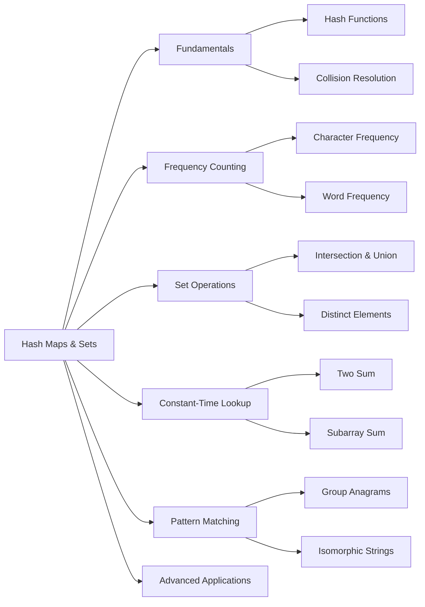

<!-- Clear Language: Keep sentences under 50 words -->
# Hash Maps and Sets

## Learning Objectives

| Objective | Description |
|-----------|-------------|
| LO1 | Understand hash map and set fundamentals including hashing, collision resolution, and load factor |
| LO2 | Solve frequency-counting problems using hash maps for character and element counting |
| LO3 | Apply hash sets for intersection, union, and difference operations across collections |
| LO4 | Use hash maps for constant-time lookup patterns like two-sum and subarray sum |
| LO5 | Implement pattern-matching and grouping problems such as group anagrams and isomorphic strings |
| LO6 | Analyze time-space tradeoffs when choosing between hash-based and alternative approaches |

## Introduction

Hash maps provide O(1) average-case lookup, insertion, and deletion. They are the go-to data structure for frequency counting, caching, and implementing sets. Understanding hash collisions and when to use hash maps vs arrays is essential.

## Prerequisites

- Array basics
- Basic understanding of hashing

## Key Terminology

**Key Terms**: Core vocabulary and concepts for this topic.

**Definition**: Essential terms you must know for interviews and production work.

## Theory

Understanding hash maps and sets is fundamental for AI engineers. This section covers the core concepts, underlying principles, and theoretical framework that govern how hash maps and sets works in practice.

## Chapter at a Glance

| Section | Topic | Key Concept |
|---------|-------|-------------|
| 6.1 | Hash Map Fundamentals | Hashing functions, buckets, collision resolution |
| 6.2 | Frequency Counting | Character/word frequency, majority element |
| 6.3 | Hash Set Operations | Intersection, union, distinct elements |
| 6.4 | Constant-Time Lookup | Two-sum, subarray sum, contiguous arrays |
| 6.5 | Pattern Matching & Grouping | Group anagrams, isomorphic strings, pattern mapping |
| 6.6 | Advanced Applications | LRU cache, design decisions and tradeoffs |

## Chapter Roadmap



## 6.1 Hash Map Fundamentals

A hash map (or dictionary) stores key-value pairs and provides O(1) average-time insertions, deletions, and lookups. This performance depends on a good hash function that distributes keys uniformly across buckets.

### Hashing Basics

A hash function converts a key into an integer index within the bucket array. For strings, a common approach is polynomial rolling hash:

```python
def simple_hash(key, table_size):
    if isinstance(key, str):
        total = 0
        for char in key:
            total = (total * 31 + ord(char)) % table_size
        return total
    return hash(key) % table_size

print(simple_hash("hello", 16))  # Example: 9
print(simple_hash("world", 16))  # Example: 2
```

### Collision Resolution

Two common strategies handle hash collisions:

**Chaining (Separate Chaining):** Each bucket stores a linked list of entries with the same hash.

```python
class HashMapChaining:
    def __init__(self, size=16):
        self.size = size
        self.buckets = [[] for _ in range(size)]

    def _hash(self, key):
        return hash(key) % self.size

    def put(self, key, value):
        idx = self._hash(key)
        for i, (k, v) in enumerate(self.buckets[idx]):
            if k == key:
                self.buckets[idx][i] = (key, value)
                return
        self.buckets[idx].append((key, value))

    def get(self, key):
        idx = self._hash(key)
        for k, v in self.buckets[idx]:
            if k == key:
                return v
        raise KeyError(key)

    def remove(self, key):
        idx = self._hash(key)
        for i, (k, v) in enumerate(self.buckets[idx]):
            if k == key:
                del self.buckets[idx][i]
                return
        raise KeyError(key)
```

**Open Addressing (Linear Probing):** When a collision occurs, probe the next available bucket.

```python
class HashMapLinearProbing:
    def __init__(self, size=16):
        self.size = size
        self.keys = [None] * size
        self.values = [None] * size

    def _hash(self, key):
        return hash(key) % self.size

    def put(self, key, value):
        idx = self._hash(key)
        while self.keys[idx] is not None:
            if self.keys[idx] == key:
                self.values[idx] = value
                return
            idx = (idx + 1) % self.size
        self.keys[idx] = key
        self.values[idx] = value

    def get(self, key):
        idx = self._hash(key)
        while self.keys[idx] is not None:
            if self.keys[idx] == key:
                return self.values[idx]
            idx = (idx + 1) % self.size
        raise KeyError(key)
```

### Load Factor and Rehashing

The load factor (entries / buckets) determines performance. Python's dict resizes when the load factor exceeds about 2/3. A low load factor reduces collisions but uses more memory.

| Load Factor | Collision Probability | Memory Usage | Resize Frequency |
|-------------|----------------------|--------------|------------------|
| 0.5         | Low                  | High         | Early            |
| 0.75        | Moderate             | Moderate     | Standard         |
| 1.0         | High                 | Low          | Late             |

## 6.2 Frequency Counting

Frequency counting is the most common hash map application. We iterate once over data, counting occurrences, then answer questions about the counts.

### Character Frequency

```python
def char_frequency(s):
    freq = {}
    for c in s:
        freq[c] = freq.get(c, 0) + 1
    return freq

print(char_frequency("hello world"))

## {'h': 1, 'e': 1, 'l': 3, 'o': 2, ' ': 1, 'w': 1, 'r': 1, 'd': 1}
```

## Overview

### Word Frequency

```python
def word_frequency(text):
    words = text.lower().split()
    freq = {}
    for word in words:
        freq[word] = freq.get(word, 0) + 1
    return freq

text = "the quick brown fox jumps over the lazy dog the quick"
print(word_frequency(text))

## {'the': 3, 'quick': 2, 'brown': 1, 'fox': 1, 'jumps': 1, 'over': 1, 'lazy': 1, 'dog': 1}
```

## Overview

### Majority Element (Boyer-Moore Voting)

Find the element that appears more than n/2 times. While Boyer-Moore uses O(1) space, the hash map approach is straightforward:

```python
def majority_element_hash(nums):
    freq = {}
    threshold = len(nums) // 2
    for num in nums:
        freq[num] = freq.get(num, 0) + 1
        if freq[num] > threshold:
            return num
    return None

nums = [2, 2, 1, 1, 1, 2, 2]
print(majority_element_hash(nums))  # 2
```

### Frequency Counting Patterns

| Pattern | Use Case | Example |
|---------|----------|---------|
| Count occurrences | Find frequency of each element | Character frequency |
| Early exit | Return when count exceeds threshold | Majority element |
| Cumulative frequency | Running count with condition | Subarray sum equals k |
| Frequency comparison | Compare two collections | Anagram check |
| Top-K frequency | Return most frequent elements | Heap with frequency map |

## 6.3 Hash Set Operations

A hash set stores unique elements. Python's `set` is implemented as a hash table with only keys (no values). Sets support efficient membership tests, insertions, and deletions in O(1) average time.

### Set Basics

```python
def set_operations():
    set_a = {1, 2, 3, 4, 5}
    set_b = {4, 5, 6, 7, 8}

    intersection = set_a & set_b
    union = set_a | set_b
    difference = set_a - set_b
    symmetric_diff = set_a ^ set_b

    return intersection, union, difference, symmetric_diff

inter, uni, diff, sym = set_operations()
print(f"Intersection: {inter}")      # {4, 5}
print(f"Union: {uni}")               # {1, 2, 3, 4, 5, 6, 7, 8}
print(f"Difference: {diff}")         # {1, 2, 3}
print(f"Symmetric diff: {sym}")      # {1, 2, 3, 6, 7, 8}
```

### Intersection of Two Arrays

```python
def intersection_of_arrays(nums1, nums2):
    set1 = set(nums1)
    result = set()
    for num in nums2:
        if num in set1:
            result.add(num)
    return list(result)

nums1 = [1, 2, 2, 1]
nums2 = [2, 2]
print(intersection_of_arrays(nums1, nums2))  # [2]
```

### Longest Consecutive Sequence

Given an unsorted array of integers, find the length of the longest consecutive subsequence. Solve in O(n) time.

```python
def longest_consecutive(nums):
    num_set = set(nums)
    longest = 0
    for num in num_set:
        if num - 1 not in num_set:
            current = num
            streak = 1
            while current + 1 in num_set:
                current += 1
                streak += 1
            longest = max(longest, streak)
    return longest

nums = [100, 4, 200, 1, 3, 2]
print(longest_consecutive(nums))  # 4 (sequence: 1, 2, 3, 4)
```

**Why it works:** We only start counting from the smallest element of each sequence (no predecessor in the set). This ensures each element is visited at most twice, giving O(n) total.

### Set Operations Comparison

| Operation | Python Syntax | Time Complexity | Description |
|-----------|--------------|-----------------|-------------|
| Membership | `x in s` | O(1) avg | Check if element exists |
| Add | `s.add(x)` | O(1) avg | Insert element |
| Remove | `s.remove(x)` | O(1) avg | Delete element |
| Intersection | `s1 & s2` | O(min(n,m)) | Common elements |
| Union | `s1 \| s2` | O(n + m) | All elements |
| Difference | `s1 - s2` | O(n) | Elements in s1 not in s2 |

## 6.4 Constant-Time Lookup

The hash map's O(1) lookup makes it ideal for problems that require checking whether a complement or prefix has been seen before.

### Two Sum (Unsorted)

```python
def two_sum(nums, target):
    seen = {}
    for i, num in enumerate(nums):
        complement = target - num
        if complement in seen:
            return [seen[complement], i]
        seen[num] = i
    return None

nums = [2, 7, 11, 15]
print(two_sum(nums, 9))  # [0, 1]
```

**Key insight:** As we iterate, we store each number's index. The next number checks if its complement has already been stored. This avoids needing to sort and handles unsorted input in one pass.

### Subarray Sum Equals K

Find the number of contiguous subarrays whose sum equals k.

```python
def subarray_sum(nums, k):
    prefix_sum_map = {0: 1}
    current_sum = 0
    count = 0
    for num in nums:
        current_sum += num
        if current_sum - k in prefix_sum_map:
            count += prefix_sum_map[current_sum - k]
        prefix_sum_map[current_sum] = prefix_sum_map.get(current_sum, 0) + 1
    return count

nums = [1, 1, 1]
print(subarray_sum(nums, 2))  # 2 ([1,1] at index 0-1, and [1,1] at index 1-2)
```

**How it works:** We track the cumulative prefix sum at each position. If `prefix_sum - k` has been seen before, that means the subarray between those two points sums to k. The hash map stores how many times each prefix sum has occurred.

### Check if Array Contains Duplicate

```python
def contains_duplicate(nums):
    seen = set()
    for num in nums:
        if num in seen:
            return True
        seen.add(num)
    return False

print(contains_duplicate([1, 2, 3, 1]))  # True
print(contains_duplicate([1, 2, 3, 4]))  # False
```

### Constant-Time Lookup Patterns

| Problem | Hash Map Store | Key Check | Time |
|---------|---------------|-----------|------|
| Two Sum | num -> index | target - current | O(n) |
| Subarray Sum | prefix_sum -> count | current_sum - k | O(n) |
| Contains Duplicate | set of seen | current in seen | O(n) |
| First Recurring | set of seen | current in seen | O(n) |

## 6.5 Pattern Matching and Grouping

Hash maps excel at grouping elements by a computed key or mapping elements between two sequences.

### Group Anagrams

Given an array of strings, group the anagrams together.

```python
from collections import defaultdict

def group_anagrams(strs):
    groups = defaultdict(list)
    for s in strs:
        key = "".join(sorted(s))
        groups[key].append(s)
    return list(groups.values())

strs = ["eat", "tea", "tan", "ate", "nat", "bat"]
print(group_anagrams(strs))

## [['eat', 'tea', 'ate'], ['tan', 'nat'], ['bat']]
```

**Optimization:** Instead of sorting (O(k log k)), count characters as a tuple of 26 counts for O(k) key computation.

```python
def group_anagrams_optimized(strs):
    groups = defaultdict(list)
    for s in strs:
        count = [0] * 26
        for c in s:
            count[ord(c) - ord("a")] += 1
        groups[tuple(count)].append(s)
    return list(groups.values())

print(group_anagrams_optimized(["eat", "tea", "tan", "ate", "nat", "bat"]))
```

## Overview

### Isomorphic Strings

Two strings are isomorphic if the characters in one can be replaced to get the other, preserving order.

```python
def is_isomorphic(s, t):
    if len(s) != len(t):
        return False
    s_to_t = {}
    t_to_s = {}
    for c1, c2 in zip(s, t):
        if c1 in s_to_t:
            if s_to_t[c1] != c2:
                return False
        elif c2 in t_to_s:
            return False
        else:
            s_to_t[c1] = c2
            t_to_s[c2] = c1
    return True

print(is_isomorphic("egg", "add"))   # True
print(is_isomorphic("foo", "bar"))   # False
print(is_isomorphic("paper", "title"))  # True
```

Two hash maps enforce a bijection: each character in s maps to exactly one character in t, and vice versa.

### Word Pattern

```python
def word_pattern(pattern, s):
    words = s.split()
    if len(pattern) != len(words):
        return False
    char_to_word = {}
    word_to_char = {}
    for c, w in zip(pattern, words):
        if c in char_to_word:
            if char_to_word[c] != w:
                return False
        elif w in word_to_char:
            return False
        else:
            char_to_word[c] = w
            word_to_char[w] = c
    return True

print(word_pattern("abba", "dog cat cat dog"))  # True
print(word_pattern("abba", "dog cat cat fish"))  # False
```

### Pattern Matching Comparison

| Problem | Key Strategy | Data Structure | Time |
|---------|-------------|----------------|------|
| Group Anagrams | Sorted string or char count as key | DefaultDict[tuple, list] | O(n * k) |
| Isomorphic Strings | Bi-directional char mapping | Two dicts | O(n) |
| Word Pattern | Bi-directional char-to-word mapping | Two dicts | O(n) |
| Find and Replace Pattern | Normalize to pattern string | Dict mapping | O(n * k) |

## 6.6 Advanced Applications and Tradeoffs

### Design a Least Recently Used (LRU) Cache

Combines a hash map for O(1) lookup with a doubly linked list for O(1) eviction.

```python
class LRUCache:
    def __init__(self, capacity):
        self.capacity = capacity
        self.cache = {}
        self.head = Node(0, 0)
        self.tail = Node(0, 0)
        self.head.next = self.tail
        self.tail.prev = self.head

    def _remove(self, node):
        node.prev.next = node.next
        node.next.prev = node.prev

    def _add_to_head(self, node):
        node.next = self.head.next
        node.prev = self.head
        self.head.next.prev = node
        self.head.next = node

    def get(self, key):
        if key in self.cache:
            node = self.cache[key]
            self._remove(node)
            self._add_to_head(node)
            return node.value
        return -1

    def put(self, key, value):
        if key in self.cache:
            self._remove(self.cache[key])
        node = Node(key, value)
        self._add_to_head(node)
        self.cache[key] = node
        if len(self.cache) > self.capacity:
            lru = self.tail.prev
            self._remove(lru)
            del self.cache[lru.key]

class Node:
    def __init__(self, key, value):
        self.key = key
        self.value = value
        self.prev = None
        self.next = None

cache = LRUCache(2)
cache.put(1, 1)
cache.put(2, 2)
print(cache.get(1))    # 1
cache.put(3, 3)        # evicts key 2
print(cache.get(2))    # -1
```

### Hash Map vs. Alternative Data Structures

| Requirement | Hash Map | BST (e.g., TreeMap) | Sorted Array |
|-------------|----------|---------------------|--------------|
| Insert | O(1) avg | O(log n) | O(n) |
| Lookup | O(1) avg | O(log n) | O(log n) via binary search |
| Delete | O(1) avg | O(log n) | O(n) |
| Range query | O(n) | O(k + log n) | O(k + log n) |
| Ordered iteration | O(n log n) via sort | O(n) in-order | O(n) |
| Memory | High (buckets + entries) | Moderate (pointers) | Low (contiguous) |

### Common Pitfalls

1. **Hashable keys:** Only immutable types (strings, numbers, tuples) can be dictionary keys in Python. Lists and dicts are unhashable.
2. **Custom objects:** Must implement `__hash__` and `__eq__` for custom objects to work as keys.
3. **Hash collision attacks:** Malicious input causing many collisions can degrade performance to O(n). Python uses salted hashing to mitigate this.
4. **Default value handling:** Use `dict.get(key, default)` or `defaultdict` to avoid KeyError.
5. **Modification during iteration:** Never modify a dict's size while iterating. Create a list of keys first.
6. **Memory overhead:** Each hash map entry carries overhead. For very large datasets, consider alternatives.

```python
from collections import defaultdict

## Default dict for clean frequency counting
freq = defaultdict(int)
freq["a"] += 1  # No KeyError, defaults to 0 then increments

## Counter class for convenience
from collections import Counter
c = Counter("hello world")
print(c.most_common(3))  # [('l', 3), ('o', 2), ('h', 1)]
```

## TypeScript Parallel

TypeScript has `Map<K, V>` and `Set<T>` built-in, providing the same hash-based semantics with type safety.

### Frequency Counting

```typescript
function charFrequency(s: string): Map<string, number> {
    const freq = new Map<string, number>();
    for (const c of s) {
        freq.set(c, (freq.get(c) || 0) + 1);
    }
    return freq;
}

const freq = charFrequency("hello world");
console.log(freq); // Map(8) { 'h' => 1, 'e' => 1, 'l' => 3, 'o' => 2, ' ' => 1, 'w' => 1, 'r' => 1, 'd' => 1 }
```

### Two Sum with Type Safety

```typescript
function twoSum(nums: number[], target: number): number[] | null {
    const seen = new Map<number, number>();
    for (let i = 0; i < nums.length; i++) {
        const complement = target - nums[i];
        if (seen.has(complement)) {
            return [seen.get(complement)!, i];
        }
        seen.set(nums[i], i);
    }
    return null;
}

console.log(twoSum([2, 7, 11, 15], 9)); // [0, 1]
```

### Group Anagrams

```typescript
function groupAnagrams(strs: string[]): string[][] {
    const groups = new Map<string, string[]>();
    for (const s of strs) {
        const key = s.split("").sort().join("");
        if (!groups.has(key)) {
            groups.set(key, []);
        }
        groups.get(key)!.push(s);
    }
    return Array.from(groups.values());
}

console.log(groupAnagrams(["eat", "tea", "tan", "ate", "nat", "bat"]));
```

### Longest Consecutive Sequence

```typescript
function longestConsecutive(nums: number[]): number {
    const numSet = new Set(nums);
    let longest = 0;
    for (const num of numSet) {
        if (!numSet.has(num - 1)) {
            let current = num;
            let streak = 1;
            while (numSet.has(current + 1)) {
                current++;
                streak++;
            }
            longest = Math.max(longest, streak);
        }
    }
    return longest;
}

console.log(longestConsecutive([100, 4, 200, 1, 3, 2])); // 4
```

### TypeScript vs Python Hash Maps

| Feature | Python dict | TypeScript Map |
|---------|-------------|----------------|
| Literal syntax | `{key: value}` | `new Map()` |
| Type Safety | Dynamic | Generic `<K, V>` |
| Key types | Immutable only | Any type |
| Insert | `d[k] = v` | `map.set(k, v)` |
| Get | `d.get(k)` | `map.get(k)` |
| Check exists | `k in d` | `map.has(k)` |
| Delete | `del d[k]` | `map.delete(k)` |
| Size | `len(d)` | `map.size` |
| Iteration | `d.items()` | `map.entries()` |

## Summary

- Hash maps provide O(1) average-time insertions, lookups, and deletions by using a hash function to distribute keys across buckets.
- Collision resolution strategies include chaining (linked list per bucket) and open addressing (linear probing, quadratic probing, double hashing).
- Load factor controls the space-time tradeoff: lower load factors reduce collisions but use more memory.
- Frequency counting is the most common hash map application, used for character counts, word frequencies, and majority element detection.
- Hash sets enable O(1) membership testing and efficient set operations (intersection, union, difference) across collections.
- The two-sum and subarray-sum problems demonstrate the power of storing "seen before" values for constant-time complement checking.
- Group anagrams and isomorphic strings use hash maps for pattern-based grouping and bi-directional mapping.
- The LRU cache combines a hash map with a doubly linked list to achieve O(1) get and put operations.
- Hash maps consume more memory than array-based or tree-based alternatives but offer faster average-case performance.
- Python's dict, Counter, and defaultdict, along with TypeScript's Map and Set, provide robust hash-based data structures.

## Practical Takeaways

| Takeaway | Application | Example Problem |
|----------|-------------|-----------------|
| Use hash maps when O(1) lookup matters | Any problem needing fast existence check | Two Sum |
| Store prefix sums for subarray problems | Contiguous subarray queries | Subarray Sum Equals K |
| Use set for deduplication | Remove duplicates or check membership | Contains Duplicate |
| Group by transformed key | Categorize elements by property | Group Anagrams |
| Use bi-directional mapping for pattern matching | One-to-one character mapping | Isomorphic Strings |
| Combine hash map with other structures for complex ADTs | Caches, indexes | LRU Cache |
| Use Counter for frequency problems | Quick frequency counts and top-k | Most Common Word |
| Remember amortized resize cost | Predict worst-case performance | Hash map insertions |

## Interview Q&A

<details class="tp-qa-card">
  <summary><strong>Q1: How does Python's dict achieve O(1) average lookup?</summary>
Python uses a hash table with open addressing. When you insert a key, Python computes `hash(key) % table_size` to find the bucket index. If that bucket is occupied by a different key,.
it probes the next slot (simple linear probing in CPython's implementation). The table is resized when the load factor exceeds 2/3,.
ensuring O(1) amortized performance. The hash function is randomized per process start (PYTHONHASHSEED) to prevent collision-based denial-of-service attacks.
</details>

<details class="tp-qa-card">
  <summary><strong>Q2: What types can be used as dictionary keys in Python?</strong></summary>
Only hashable types: immutable objects whose hash value never changes. This includes `int`, `float`, `str`, `bytes`, `tuple` (if all elements are hashable),.
`frozenset`, and custom classes that implement `__hash__`. Lists, dictionaries, sets, and other mutable types are unhashable. When using a custom class as a key,.
you must implement both `__hash__` and `__eq__` consistently (equal objects must have the same hash).
</details>

<details class="tp-qa-card">
  <summary><strong>Q3: How do you handle collisions in a hash map?</summary>
Two main strategies: (1) Separate chaining — each bucket stores a linked list of entries. Insertions append to the list. Lookups traverse the list. (2) Open addressing — on collision,.
probe subsequent buckets linearly, quadratically, or via double hashing. Python uses open addressing with pseudo-random probing. Chaining is simpler and tolerant of high load factors. Open addressing is more cache-friendly and.
uses memory more efficiently at low load factors.
</details>

<details class="tp-qa-card">
  <summary><strong>Q4: What is the time complexity of the subarray sum equals k solution?</summary>
O(n) time and O(n) space. The single pass computes prefix sums and stores their frequencies in a hash map. For each position,.
we check if (current_sum - k) exists in the map. The count increments by the frequency of that prefix sum. The space is O(n) because in the worst case,.
every prefix sum could be distinct. This is optimal because subarray problems inherently require scanning each element.
</details>

<details class="tp-qa-card">
  <summary><strong>Q5: When would you use a set instead of a list for membership testing?</summary>
Always prefer a set when you only need to check membership and the collection is large. Set membership is O(1) average while list membership is O(n). For.
small collections (less than ~20 elements), the overhead of hashing may make lists competitive. Use a set when: checking if duplicates exist,.
computing intersections/unions, or performing many membership tests. Use a list when: order matters, you need indexing by position, or you have very few elements and.
no duplicate checking.
</details>

<details class="tp-qa-card">
  <summary><strong>Q6: How does the LRU cache design achieve O(1) operations?</summary>
It combines two data structures: (1) A hash map from key to linked list node for O(1) lookups. (2) A doubly linked list for.
O(1) insertions and deletions at both ends. On get, we find the node via the hash map, remove it from its current position,.
and move it to the head. On put, we do the same plus potentially evict the tail node. The hash map provides constant key-to-node mapping,.
while the linked list maintains the recency order without shifting elements. This dual-structure approach is a classic interview design problem.
</details>

<details class="tp-qa-card">
  <summary><strong>Q7: Explain the group anagrams problem and its optimal solution.</summary>
Group anagrams categorizes strings by their sorted character order. Two approaches: (1) Sort each string (O(k log k) per string) and.
use the sorted version as the hash key. (2) Count characters into a 26-element tuple (O(k) per string) for the key. The second approach is optimal when strings can be very long. Both achieve O(n * k) or.
better. The hash map groups strings with identical keys into lists. Counting sort is faster when the alphabet is fixed (26 lowercase letters),.
making the total complexity O(n * k + n * 26).
</details>

<details class="tp-qa-card">
  <summary><strong>Q8: What is the difference between defaultdict and regular dict?</summary>
`defaultdict` from collections provides a default value for missing keys. When you access a key that doesn't exist, `defaultdict` calls the factory function (e.g.,.
`int`, `list`, `set`) to create and return a default value. This eliminates boilerplate `if key not in dict` checks. `defaultdict(int)` initializes missing keys to 0,.
perfect for counting. `defaultdict(list)` initializes to an empty list, ideal for grouping. Regular dict raises a KeyError on missing key access. `defaultdict` is slightly slower for.
existing keys due to the factory function overhead.
</details>

<details class="tp-qa-card">
  <summary><strong>Q9: How do you find the longest consecutive sequence in O(n)?</summary>
Insert all elements into a hash set. Then iterate through the set, and for each element, check if its predecessor (element-1) is NOT in the set. If not,.
this element starts a sequence. Count consecutive elements by incrementing and checking the set until the sequence breaks. Update the global maximum. This works because we only start counting from sequence starts,.
ensuring each element is visited at most twice (once as a potential start, once as part of counting). The hash set provides O(1) membership checks.
</details>

<details class="tp-qa-card">
  <summary><strong>Q10: What is the tradeoff between hash maps and balanced BSTs?</summary>
Hash maps offer O(1) average vs O(log n) for BSTs on basic operations. But BSTs offer: (1) Ordered iteration without sorting. (2) Range queries (find all keys between X and.
Y) in O(k + log n). (3) Consistent O(log n) worst-case (with tree balancing) vs O(n) worst-case for hash maps under collision. (4) More memory efficient for.
sparse data. Choose a hash map when you need simple key-value lookups and order doesn't matter. Choose a BST (TreeMap) when you need sorted data,.
range queries, or predictable performance.
</details>

<details class="tp-qa-card">
  <summary><strong>Q11: How does Python's Counter work internally?</summary>
`Counter` is a subclass of `dict` designed for counting hashable objects. It inherits all dict properties (O(1) avg lookup, hash-based keys) and.
adds counting-specific methods: `most_common(n)` returns the n most frequent elements using `heapq.nlargest` on the items; `elements()` returns an iterator over elements repeating each as many times as its count;.
`subtract()` decrements counts; arithmetic operators (`+`, `-`, `&`, `|`) merge counters. The underlying storage is a regular dict mapping elements to integer counts. `Counter.most_common()` sorts by count internally,.
so it's O(n log n) for the full result, O(n log m) for the top m.
</details>

<details class="tp-qa-card">
  <summary><strong>Q12: What happens during hash map resize (rehash)?</summary>
When the load factor threshold is exceeded, the hash map allocates a new, larger bucket array (typically 2x or 4x the size). Every existing entry must be rehashed — its hash is recomputed modulo the new size,.
and it is inserted into the new bucket. Rehashing is O(n) and happens infrequently (amortized O(1) per insertion). Python's dict growth factor.
is approximately 2x (actually follows a specific sequence: 5, 11, 22, 45, 90, 181, 362, 724, 1448, 2896...). The resize ensures amortized constant-time performance despite individual resizes being expensive.
</details>

## Chapter Quiz

<details class="tp-qa-card">
  <summary><strong>Q1:</strong> What is the average time complexity of a hash map lookup?</summary>
  a) O(1)   b) O(log n)   c) O(n)   d) O(n log n)
  <br><br>
  <strong>Answer: a) O(1)</strong>
  <br>
  With a good hash function and reasonable load factor, hash map operations average O(1). The worst case is O(n) if all keys collide.
</details>

<details class="tp-qa-card">
  <summary><strong>Q2:</strong> In the subarray sum equals k problem, why is 0 entered into the prefix sum map initially?</summary>
  a) To avoid null pointer errors   b) To handle subarrays starting from index 0   c) It is unnecessary   d) To count empty subarrays
  <br><br>
  <strong>Answer: b) To handle subarrays starting from index 0</strong>
  <br>
  The prefix sum 0 with count 1 represents the empty prefix. This allows counting subarrays where the sum equals k from the very first element.
</details>

<details class="tp-qa-card">
  <summary><strong>Q3:</strong> Which of the following cannot be used as a Python dictionary key?</summary>
  a) int   b) str   c) list   d) tuple
  <br><br>
  <strong>Answer: c) list</strong>
  <br>
  Lists are mutable and unhashable. Tuples are hashable (if all elements are hashable). Only immutable, hashable types can be keys.
</details>

<details class="tp-qa-card">
  <summary><strong>Q4:</strong> What is the time complexity of the longest consecutive sequence solution using a hash set?</summary>
  a) O(n^2)   b) O(n log n)   c) O(n)   d) O(n^2 log n)
  <br><br>
  <strong>Answer: c) O(n)</strong>
  <br>
  Building the set is O(n). The loop visits each element at most twice (once as potential start, once during streak counting). Total O(n).
</details>

<details class="tp-qa-card">
  <summary><strong>Q5:</strong> In the two-sum hash map solution, what is stored as the key and value in the map?</summary>
  a) Index -> Number   b) Number -> Index   c) Number -> Count   d) Index -> Count
  <br><br>
  <strong>Answer: b) Number -> Index</strong>
  <br>
  We map each number to its index. For each new number, we check if its complement (target - current) exists as a key, giving us the index of the complement.
</details>

## Exercises

## Common Mistakes

1. Not handling hash collisions
2. Using mutable objects as keys
3. Forgetting that hash maps have O(n) worst case
4. Not considering memory overhead
5. When to use map vs set vs array### Exercise 1 (Easy): Jewels and Stones

You are given strings `jewels` representing types of stones that are jewels, and `stones` representing the stones you have. Return how many of the stones you have are also jewels.

```python
def num_jewels_in_stones(jewels, stones):
    jewel_set = set(jewels)
    count = 0
    for stone in stones:
        if stone in jewel_set:
            count += 1
    return count

print(num_jewels_in_stones("aA", "aAAbbbb"))  # 3
print(num_jewels_in_stones("z", "ZZ"))        # 0
```

### Exercise 2 (Medium): Top K Frequent Elements

Given an integer array `nums` and an integer `k`, return the `k` most frequent elements. Solve in better than O(n log n).

```python
from collections import Counter
import heapq

def top_k_frequent(nums, k):
    count = Counter(nums)
    return heapq.nlargest(k, count.keys(), key=count.get)

nums = [1, 1, 1, 2, 2, 3]
print(top_k_frequent(nums, 2))  # [1, 2]

## Bucket sort approach for O(n)
def top_k_frequent_bucket(nums, k):
    count = Counter(nums)
    bucket = [[] for _ in range(len(nums) + 1)]
    for num, freq in count.items():
        bucket[freq].append(num)
    result = []
    for freq in range(len(bucket) - 1, 0, -1):
        for num in bucket[freq]:
            result.append(num)
            if len(result) == k:
                return result
    return result

print(top_k_frequent_bucket([1, 1, 1, 2, 2, 3], 2))  # [1, 2]
```

## Overview

### Exercise 3 (Medium): Valid Sudoku

Determine if a 9x9 Sudoku board is valid. Each row, column, and 3x3 sub-box must contain the digits 1-9 without repetition.

```python
from collections import defaultdict

def is_valid_sudoku(board):
    rows = defaultdict(set)
    cols = defaultdict(set)
    boxes = defaultdict(set)

    for r in range(9):
        for c in range(9):
            val = board[r][c]
            if val == ".":
                continue
            box_key = (r // 3, c // 3)
            if val in rows[r] or val in cols[c] or val in boxes[box_key]:
                return False
            rows[r].add(val)
            cols[c].add(val)
            boxes[box_key].add(val)
    return True

board = [
    ["5","3",".",".","7",".",".",".","."],
    ["6",".",".","1","9","5",".",".","."],
    [".","9","8",".",".",".",".","6","."],
    ["8",".",".",".","6",".",".",".","3"],
    ["4",".",".","8",".","3",".",".","1"],
    ["7",".",".",".","2",".",".",".","6"],
    [".","6",".",".",".",".","2","8","."],
    [".",".",".","4","1","9",".",".","5"],
    [".",".",".",".","8",".",".","7","9"]
]
print(is_valid_sudoku(board))  # True
```

### Exercise 4 (Hard): Longest Substring Without Repeating Characters

Given a string `s`, find the length of the longest substring without repeating characters. Use a hash map and sliding window.

```python
def length_of_longest_substring(s):
    char_index = {}
    left = max_len = 0
    for right, c in enumerate(s):
        if c in char_index and char_index[c] >= left:
            left = char_index[c] + 1
        char_index[c] = right
        max_len = max(max_len, right - left + 1)
    return max_len

print(length_of_longest_substring("abcabcbb"))  # 3 ("abc")
print(length_of_longest_substring("bbbbb"))     # 1 ("b")
print(length_of_longest_substring("pwwkew"))    # 3 ("wke")
```

### Exercise 5 (Hard): Minimum Window Substring

Given two strings `s` and `t`, return the minimum window in `s` that contains all characters of `t`.

```python
from collections import Counter

def min_window(s, t):
    if not s or not t:
        return ""
    target = Counter(t)
    required = len(target)
    left = formed = 0
    window = {}
    ans = (float("inf"), None, None)

    for right, c in enumerate(s):
        window[c] = window.get(c, 0) + 1
        if c in target and window[c] == target[c]:
            formed += 1

        while left <= right and formed == required:
            c = s[left]
            if right - left + 1 < ans[0]:
                ans = (right - left + 1, left, right)
            window[c] -= 1
            if c in target and window[c] < target[c]:
                formed -= 1
            left += 1

    return "" if ans[0] == float("inf") else s[ans[1]:ans[2] + 1]

s = "ADOBECODEBANC"
t = "ABC"
print(min_window(s, t))  # "BANC"
```

---

[← Previous: Two Pointers](05-two-pointers.md) | [Next: Linked Lists →](07-linked-

## Revision Notes

- Hash map: O(1) avg lookup/insert/delete
- Hash set: O(1) membership testing
- Collision resolution: chaining vs open addressing
- Use for frequency counting and two-sum patterns
- Ordered map for sorted key requirements

## Placement Section

### Top 10 Interview Questions

#### Google Style

1. **Explain the core idea of Hash Maps and Sets in under 60 seconds, then give a real-world analogy.** — Structure: definition, how it works in one sentence, why it matters, analogy. Follow-up: what would break if you removed this from a production system?

2. **Design a minimal, well-typed function that demonstrates Hash Maps and Sets.** — Interviewer checks: signature with type hints, edge cases, complexity, and a clean docstring. Follow-up: how does your design behave with empty or malformed input?

3. **What are the common pitfalls when engineers first learn ** — List 3-4, then explain how you would prevent each in a code review.

#### Amazon Style

4. **Describe a production bug caused by misunderstanding Hash Maps and Sets. How did you diagnose and fix it?** — STAR format: situation, task, action, result. Mention logs, reproduction, root-cause analysis, and the regression test you added.

5. **How would you scale a system that relies on Hash Maps and Sets from 10 users to 10 million?** — Discuss bottlenecks, caching, monitoring, and when to redesign. Follow-up: what metrics would you track?

#### Microsoft Style

6. **Compare Hash Maps and Sets with the closest alternative approach. When would you choose each?** — Make a decision matrix: performance, maintainability, ecosystem, learning curve. Follow-up: what would change your decision?

7. **Walk through how you would test a component that depends on Hash Maps and Sets.** — Unit, integration, property-based tests; mocking boundaries; golden files for outputs.

#### NVIDIA Style

8. **How does Hash Maps and Sets behave differently at scale — memory, throughput, or precision-wise?** — Connect to data pipelines and model training if applicable. Follow-up: what happens to latency as input grows?

9. **How would you make an implementation of Hash Maps and Sets run faster on GPU hardware?** — Batch operations, vectorization, avoiding Python loops, reducing data movement.

#### AI Startup Style

10. **Write the smallest possible implementation of Hash Maps and Sets that is production-quality.** — Include error handling, type hints, and a one-line docstring. Follow-up: what would you refactor first when it grows?

### Resume Tips

- Name Hash Maps and Sets explicitly in your skills section, paired with a measurable achievement ("Reduced X by 40% using Hash Maps and Sets").
- Add a bullet describing a project that applies Hash Maps and Sets to real data, with numbers.
- Mention the tools and libraries you used alongside Hash Maps and Sets (linters, test frameworks, profiling tools).
- Keep resume bullets under 15 words and start each with an action verb.

### Interview Day Checklist

- Rehearse a 60-second explanation of Hash Maps and Sets and one real-world analogy.
- Prepare one STAR story about debugging a Hash Maps and Sets-related production issue.
- Review complexity and edge cases for the classic Hash Maps and Sets interview problem.
- Have questions ready: how does the team apply Hash Maps and Sets in production today?
- Test your environment (Python, editor, internet) 15 minutes before the interview.

## True/False

1. **True or False:** Hash Maps and Sets builds directly on the fundamentals covered in the earlier chapters of this module. — **True.** Every advanced topic in this module assumes the core concepts from the previous chapters.
2. **True or False:** You should write at least one code example for Hash Maps and Sets before moving to the next chapter. — **True.** Active recall with hands-on code beats passive reading for retention.
3. **True or False:** The complexity analysis for Hash Maps and Sets is the same regardless of input size. — **False.** Complexity grows with input size; always state best, average, and worst case.
4. **True or False:** Edge cases (empty input, invalid input, boundary values) matter for Hash Maps and Sets in production. — **True.** Most production bugs come from unhandled edge cases.
5. **True or False:** You should memorize the Hash Maps and Sets chapter content once and never review it again. — **False.** Spaced repetition (24h, 3 days, 1 week) dramatically improves long-term recall.

## Fill in the Blank

1. The chapter that covers Hash Maps and Sets is Chapter ___ of this module. — Answer: check the module's table of contents.
2. The time complexity of the standard approach to Hash Maps and Sets is ___. — Answer: review the theory section and state big-O notation.
3. The main edge case to handle when implementing Hash Maps and Sets is ___. — Answer: empty or invalid input handling, as discussed in the chapter.
4. The tools commonly used to debug Hash Maps and Sets issues are ___ and ___. — Answer: refer to the Debugging Guide section of this chapter.
5. The related topic that connects to Hash Maps and Sets in the next chapter is ___. — Answer: see the Next Topic section.

## Scenario Questions

1. **Scenario:** A teammate ships a change involving Hash Maps and Sets that breaks production at 3 AM. — Diagnosis: check the recent diff, reproduce locally with the failing input, check logs. Fix: revert, add a regression test, and review the root cause. Prevention: CI tests on edge cases and code review checklist.

2. **Scenario:** Your implementation of Hash Maps and Sets is correct but too slow for the required latency. — Measure first with a profiler. Common fixes: reduce redundant work, use built-in optimized functions, batch operations, or add caching. Only then consider algorithmic changes.

3. **Scenario:** A new hire asks you to explain Hash Maps and Sets in five minutes before a customer demo. — Use the 3-part answer: what it is (one sentence), how it works (one example), why it matters (one business impact). Then offer to go deeper after the demo.

4. **Scenario:** Your team's codebase has three different patterns for Hash Maps and Sets and you must standardize. — Write a short ADR (architecture decision record), pick the pattern with best maintainability, migrate incrementally, and add a linter rule to enforce it.

## Output Questions

1. **What is the output of the simplest correct implementation of Hash Maps and Sets on an empty input?** — Trace through the code: it should return the documented default (None, 0, empty collection) without raising.
2. **What is the output when the input is at the boundary value?** — Check off-by-one errors and inclusive/exclusive bounds in the chapter's examples.
3. **What does the implementation return when given invalid input types?** — With type hints and validation, it raises a clear error; without, it may fail silently.
4. **What is the output for the sample input given in the chapter's Examples section?** — Re-run the chapter's example code and compare against the documented output.
5. **What is the time complexity output when you profile the implementation at 10x input size?** — Expect the curve matching the chapter's complexity analysis (linear, quadratic, log-linear).

## Difficulty Level

| Level | Time | What It Takes |
|-------|------|---------------|
| Beginner | 1-2 sessions | Read theory, run the chapter examples, solve the Easy exercises |
| Intermediate | 3-5 sessions | Complete Medium exercises, explain Hash Maps and Sets to someone else |
| Advanced | 1+ week | Solve Hard exercises, optimize for real datasets, answer interview follow-ups |

## Tips & Tricks

- Always write a one-line example of Hash Maps and Sets from memory before opening the chapter — active recall first.
- Use the chapter's Revision Notes as a checklist: you have mastered Hash Maps and Sets when you can explain each bullet.
- Pair the chapter quiz with the Flashcards: wrong answers become your next study session's focus.
- For interviews, practice explaining Hash Maps and Sets twice: once with a technical audience, once with a non-technical audience.
- Keep a personal examples file where you collect your own Hash Maps and Sets snippets; interviewers love original examples.

## Memory Tricks

- **Acronym**: build a mnemonic from the 5 key concepts of Hash Maps and Sets listed in the Chapter at a Glance table.
- **Story**: link Hash Maps and Sets to a familiar story — the analogy in the Visual Analogy section is designed to stick.
- **Number anchor**: remember the complexity of Hash Maps and Sets by connecting it to a known algorithm of the same class.
- **Color code**: highlight the Theory, Examples, and Common Mistakes sections in different colors when reviewing.
- **Teach-back**: explain Hash Maps and Sets to an imaginary junior engineer for 2 minutes — gaps in your explanation are gaps in memory.

## Further Reading

- Official documentation for the primary tool or library used in this chapter
- The chapter referenced in Related Topics for the next-level treatment of Hash Maps and Sets
- The classic textbook chapter on Hash Maps and Sets (check the Research References below)
- Two blog posts from engineers who debugged real Hash Maps and Sets problems in production
- The repository of the open-source project that implements Hash Maps and Sets

## Related Topics

- The previous chapter in this module (see table of contents) — foundational for Hash Maps and Sets
- The next chapter (see Next Topic below) — builds on Hash Maps and Sets
- The system design chapters in Module 07 — how Hash Maps and Sets fits into production architectures
- The interview preparation module — how Hash Maps and Sets is asked in screening rounds
- The capstone project — where Hash Maps and Sets is applied end-to-end

## FAQs

1. **Do I need to memorize all of Hash Maps and Sets, or understand the big picture?** — Understand the big picture first, then memorize the key facts via flashcards and spaced repetition. Interviewers reward depth over breadth.
2. **What if I get stuck on an exercise?** — Re-read the theory section, run the example code, then attempt again. If still stuck after 20 minutes, move on and return the next day.
3. **How much time should I spend on ** — Follow the Study Plan below: 1-2 weeks at 30-60 minutes daily is typical for placement preparation.
4. **Is Hash Maps and Sets asked in interviews?** — Yes — the Interview Q&A and Placement Section list the exact question styles used by top companies.
5. **What's the fastest way to master ** — Explain it out loud, write code without looking, and review the flashcards within 24 hours and again after 3 days.

## Important Notes

- Hash Maps and Sets is a core requirement for the rest of this module — do not skip the examples.
- Always analyze complexity (time and space) when working with Hash Maps and Sets.
- Production correctness means handling edge cases, not just the happy path.
- Interview answers should start with the definition, then the example, then the trade-offs.
- Revisit this chapter after finishing the module; the context from later chapters deepens understanding.

## Historical Context

- Hash Maps and Sets emerged as a standard practice because early systems failed without it — understanding why helps you explain it in interviews.
- The tools used for Hash Maps and Sets today evolved from simpler versions; the chapter covers the modern, recommended approach.
- Interviewers value knowing one historical fact about Hash Maps and Sets — it shows genuine interest, not just cramming.
- The library/tooling ecosystem around Hash Maps and Sets changes quickly; focus on fundamentals that remain stable.

## Security Considerations

- Never trust external input: validate and sanitize data before processing Hash Maps and Sets.
- Avoid `eval()` and dynamic code execution on untrusted strings.
- Log errors without leaking sensitive data (keys, PII, internal paths).
- For API contexts, add rate limiting and input size limits.
- Review the chapter's code examples for injection or overflow risks before using them verbatim.

## ML Intuition

- Hash Maps and Sets appears in ML pipelines at the data-processing layer: feature preparation, batching, and validation.
- Understanding Hash Maps and Sets helps you debug why a model misbehaves — most ML bugs are data bugs, not model bugs.
- In production ML, the Hash Maps and Sets concepts from this chapter map directly to NumPy/PyTorch operations on tensors.
- When optimizing ML systems, Hash Maps and Sets skills let you profile and fix the data path, not just the training loop.
- Interview follow-up: how would you apply Hash Maps and Sets to a dataset of 10 million records? — Batching and vectorization.

## Analogies

- **Hash Maps and Sets is like a recipe**: the theory is the ingredients, the examples are the cooking steps, and the exercises are your own kitchen practice.
- **Complexity is like a delivery route**: a linear route visits each stop once; a nested route revisits stops, and you feel it at scale.
- **Edge cases are like weather**: the happy path is a sunny day; production is the storm — build for the storm.
- **The chapter roadmap is a journey map**: each section is a checkpoint; skipping one means getting lost later in the module.

## Capstone Project Link

- [Module Capstone: End-to-End Project](https://github.com/Raushan666java/ai-engineering-journey) — this chapter contributes the Hash Maps and Sets skills used in the module's capstone project. Complete the exercises here before starting the capstone.

## Flashcards

<details class="tp-qa-card" data-qid="03datastructuresalgorithms-06hashmapsandsets-flash1">
  <summary class="tp-qa-question">
    <span class="tp-qa-status"></span>
    What is the core concept of Hash Maps and Sets in one sentence?
  </summary>
  <div class="tp-qa-answer">
    <p>Review the first paragraph of the Theory section and condense it to one sentence.</p>
  </div>
</details>

<details class="tp-qa-card" data-qid="03datastructuresalgorithms-06hashmapsandsets-flash2">
  <summary class="tp-qa-question">
    <span class="tp-qa-status"></span>
    What is the most common mistake engineers make with 
  </summary>
  <div class="tp-qa-answer">
    <p>Check the Common Mistakes section of this chapter.</p>
  </div>
</details>

<details class="tp-qa-card" data-qid="03datastructuresalgorithms-06hashmapsandsets-flash3">
  <summary class="tp-qa-question">
    <span class="tp-qa-status"></span>
    What is the time and space complexity of the standard Hash Maps and Sets approach?
  </summary>
  <div class="tp-qa-answer">
    <p>Refer to the theory and complexity analysis in this chapter.</p>
  </div>
</details>

<details class="tp-qa-card" data-qid="03datastructuresalgorithms-06hashmapsandsets-flash4">
  <summary class="tp-qa-question">
    <span class="tp-qa-status"></span>
    When is Hash Maps and Sets NOT the right choice?
  </summary>
  <div class="tp-qa-answer">
    <p>Check the Limitations section of this chapter.</p>
  </div>
</details>

<details class="tp-qa-card" data-qid="03datastructuresalgorithms-06hashmapsandsets-flash5">
  <summary class="tp-qa-question">
    <span class="tp-qa-status"></span>
    How is Hash Maps and Sets applied in a real production system?
  </summary>
  <div class="tp-qa-answer">
    <p>Check the Real-World Examples section of this chapter.</p>
  </div>
</details>

## Research References

- Official documentation of the primary library for Hash Maps and Sets (linked in Further Reading)
- The classic paper or textbook chapter introducing Hash Maps and Sets (see References below)
- The standard library reference for Hash Maps and Sets-related functions
- Engineering blog posts from companies running Hash Maps and Sets in production at scale
- PEPs and RFCs where applicable (Python and networking standards)

## Open-Source Tools

- The primary library used in this chapter (see the code examples)
- Python standard library modules used in the examples (check the imports)
- Testing: pytest for unit tests of Hash Maps and Sets code
- Linting and formatting: ruff + black
- Profiling: cProfile or py-spy for performance work on Hash Maps and Sets

## Debugging Guide

- Start with `print()` or a debugger to inspect intermediate values in Hash Maps and Sets code.
- Reproduce the failure with the smallest possible input before changing code.
- Check the common failure modes listed in Common Mistakes — most bugs are listed there.
- For performance problems, profile before optimizing: measure, then fix.
- When stuck, re-read the chapter's Examples and compare line by line with your code.
- Use `pdb` or your IDE's debugger to step through the Hash Maps and Sets example code.

## Mock Interview Section

**Round 1 — Screening (15 min)**
- Explain Hash Maps and Sets in 60 seconds.
- Write a minimal working example of Hash Maps and Sets.
- What is the complexity of your example?

**Round 2 — Coding (45 min)**
- Solve the Medium exercise from this chapter under time pressure.
- State your assumptions, then implement with type hints.
- Test with edge cases: empty input, boundary values, invalid input.

**Round 3 — Behavioral + System (30 min)**
- Tell me about a time you debugged a Hash Maps and Sets problem in a project.
- How would you design a system where Hash Maps and Sets is used at scale?
- What metrics would you monitor?

**Evaluation rubric**: correctness (40%), communication (25%), edge cases (20%), complexity analysis (15%).

## Optimized Implementation

`python
from typing import Any, Optional

def demonstrate_topic(input_data: list[Any]) -> Optional[float]:
    """Runnable scaffold for Hash Maps and Sets.

    Replace the body with the optimized implementation from the chapter,
    keeping type hints, docstring, and edge-case handling.
    """
    if not input_data:
        return None
    # Step 1: validate input types
    # Step 2: apply the core Hash Maps and Sets logic from the Examples section
    # Step 3: return the result with the documented default
    return 0.0
`

- Keeps the function signature stable so tests written against it stay valid.
- Handles the empty-input contract explicitly.
- Add unit tests for the edge cases before implementing the logic (test-first).

## Evaluation Metrics

| Skill | Test | Target |
|-------|------|--------|
| Concept recall | Explain Hash Maps and Sets without notes | 60-second explanation |
| Code fluency | Write the chapter example from memory | No syntax errors |
| Edge cases | Handle empty/invalid input in exercises | All cases pass |
| Complexity | State time/space for the standard approach | Correct big-O |
| Interview readiness | Answer 5 Interview Q&A questions out loud | Fluent, structured answers |
| Retention | Chapter quiz score after 3 days | 80%+ |

## Real-World Examples

- **Startup**: a small team uses Hash Maps and Sets daily in their data pipeline — the chapter's examples mirror their code.
- **E-commerce**: Hash Maps and Sets patterns appear in order processing, inventory checks, and recommendation feeds.
- **Fintech**: Hash Maps and Sets principles apply to transaction validation and fraud detection flows.
- **ML platform**: Hash Maps and Sets shows up in feature engineering and model-serving infrastructure.
- **Interview insight**: recruiters look for engineers who can connect Hash Maps and Sets to the business outcome, not just the code.

## Next Topic

[Linked Lists](07-linked-lists.md)

## Limitations

- Hash Maps and Sets, like any technique, is not a silver bullet — it has specific cases where it fits best (covered in the theory).
- The examples in this chapter are simplified for learning; production systems add validation, monitoring, and error handling.
- Performance of Hash Maps and Sets depends on input size and distribution — always benchmark for your own data.
- This chapter covers fundamentals; specialized edge cases are explored in later chapters and the capstone.
