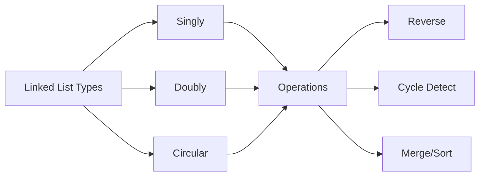

<!-- Clear Language: Keep sentences under 50 words -->
# Linked Lists

## Learning Objectives

| Objective | Description |
|-----------|-------------|
| LO1 | Understand singly linked list, doubly linked list, and circular linked list structures |
| LO2 | Implement linked list operations: traversal, insertion, deletion, reversal |
| LO3 | Solve cycle detection and cycle-related problems using Floyd's algorithm |
| LO4 | Apply fast-slow pointer techniques for middle finding and palindrome checking |
| LO5 | Implement in-place reordering operations (reverse, rotate, reorder) |
| LO6 | Use dummy nodes and recursion to simplify linked list problems |

## Introduction

Stacks and queues are fundamental LIFO and FIFO data structures. They appear in countless problems from balanced parentheses to BFS traversal. Mastering these structures helps you solve problems involving ordering, nesting, and processing sequences.

## Prerequisites

- Array basics
- Basic programming

## Key Terminology

**Key Terms**: Core vocabulary and concepts for this topic.

**Definition**: Essential terms you must know for interviews and production work.

## Theory

Understanding linked lists is fundamental for AI engineers. This section covers the core concepts, underlying principles, and theoretical framework that govern how linked lists works in practice.

## Chapter at a Glance

| Section | Topic | Key Concept |
|---------|-------|-------------|
| 7.1 | Linked List Fundamentals | Singly, doubly, circular; Node structure |
| 7.2 | Basic Operations | Insert, delete, traverse, search |
| 7.3 | Reversal Techniques | Iterative, recursive, in-place reversal |
| 7.4 | Cycle Detection | Floyd's algorithm, cycle start, cycle length |
| 7.5 | Advanced Operations | Palindrome check, merge, add numbers |
| 7.6 | Doubly Linked Lists | Operations, insertion, deletion |

## Chapter Roadmap



A linked list is a linear data structure where elements (nodes) are stored at non-contiguous memory locations, connected via pointers.

## 7.1 Linked List Fundamentals

**Singly linked list**: Each node has a value and a next pointer. Traversal is one-directional.

**Doubly linked list**: Each node has prev and next pointers. Traversal is bi-directional.

**Circular linked list**: The last node points back to the head. Can be singly or doubly linked.

```python
class ListNode:
    def __init__(self, val=0, next=None):
        self.val = val
        self.next = next

class DoublyListNode:
    def __init__(self, val=0, prev=None, next=None):
        self.val = val
        self.prev = prev
        self.next = next

## Build: 1 -> 2 -> 3 -> None
head = ListNode(1)
head.next = ListNode(2)
head.next.next = ListNode(3)

## Build: 1 <-> 2 <-> 3 <-> None
d1 = DoublyListNode(1)
d2 = DoublyListNode(2)
d3 = DoublyListNode(3)
d1.next = d2; d2.prev = d1
d2.next = d3; d3.prev = d2
```

## 7.2 Basic Operations

**Traversal**:

```python
def traverse(head):
    current = head
    while current:
        print(current.val, end=" -> ")
        current = current.next
    print("None")

def get_length(head):
    count = 0
    while head:
        count += 1
        head = head.next
    return count
```

**Insertion**:

```python
def insert_at_beginning(head, val):
    new_node = ListNode(val)
    new_node.next = head
    return new_node

def insert_at_end(head, val):
    if not head:
        return ListNode(val)
    current = head
    while current.next:
        current = current.next
    current.next = ListNode(val)
    return head

def insert_at_position(head, val, pos):
    if pos == 0:
        return insert_at_beginning(head, val)
    current = head
    for _ in range(pos - 1):
        if not current:
            raise IndexError("Position out of bounds")
        current = current.next
    new_node = ListNode(val)
    new_node.next = current.next
    current.next = new_node
    return head
```

**Deletion**:

```python
def delete_node(head, key):
    if not head:
        return None
    if head.val == key:
        return head.next
    current = head
    while current.next and current.next.val != key:
        current = current.next
    if current.next:
        current.next = current.next.next
    return head
```

## 7.3 Reversal Techniques

**Iterative reversal**:

```python
def reverse_iterative(head):
    prev = None
    curr = head
    while curr:
        next_temp = curr.next
        curr.next = prev
        prev = curr
        curr = next_temp
    return prev  # new head
```

**Recursive reversal**:

```python
def reverse_recursive(head):
    if not head or not head.next:
        return head
    new_head = reverse_recursive(head.next)
    head.next.next = head
    head.next = None
    return new_head
```

**Reverse k nodes at a time**:

```python
def reverse_k_group(head, k):
    count = 0
    curr = head
    while curr and count < k:
        curr = curr.next
        count += 1
    if count < k:
        return head
    prev = None
    curr = head
    for _ in range(k):
        next_temp = curr.next
        curr.next = prev
        prev = curr
        curr = next_temp
    head.next = reverse_k_group(curr, k)
    return prev
```

## 7.4 Cycle Detection

Floyd's cycle detection determines if a linked list has a cycle using two pointers.

```python
def has_cycle(head):
    slow = fast = head
    while fast and fast.next:
        slow = slow.next
        fast = fast.next.next
        if slow == fast:
            return True
    return False

def detect_cycle_start(head):
    slow = fast = head
    while fast and fast.next:
        slow = slow.next
        fast = fast.next.next
        if slow == fast:
            slow = head
            while slow != fast:
                slow = slow.next
                fast = fast.next
            return slow
    return None

def cycle_length(head):
    meeting = detect_cycle_start(head)
    if not meeting:
        return 0
    count = 1
    curr = meeting.next
    while curr != meeting:
        count += 1
        curr = curr.next
    return count
```

## 7.5 Advanced Operations

**Palindrome check**:

```python
def is_palindrome(head):
    if not head or not head.next:
        return True
    slow = fast = head
    while fast and fast.next:
        slow = slow.next
        fast = fast.next.next
    second_half = reverse_iterative(slow)
    first_half = head
    while second_half:
        if first_half.val != second_half.val:
            return False
        first_half = first_half.next
        second_half = second_half.next
    return True
```

**Merge two sorted lists**:

```python
def merge_two_lists(l1, l2):
    dummy = ListNode(0)
    curr = dummy
    while l1 and l2:
        if l1.val < l2.val:
            curr.next = l1
            l1 = l1.next
        else:
            curr.next = l2
            l2 = l2.next
        curr = curr.next
    curr.next = l1 or l2
    return dummy.next
```

**Remove nth node from end**:

```python
def remove_nth_from_end(head, n):
    dummy = ListNode(0)
    dummy.next = head
    first = second = dummy
    for _ in range(n + 1):
        first = first.next
    while first:
        first = first.next
        second = second.next
    second.next = second.next.next
    return dummy.next
```

**Add two numbers** (represented as reversed lists):

```python
def add_two_numbers(l1, l2):
    dummy = ListNode(0)
    curr = dummy
    carry = 0
    while l1 or l2 or carry:
        v1 = l1.val if l1 else 0
        v2 = l2.val if l2 else 0
        total = v1 + v2 + carry
        carry = total // 10
        curr.next = ListNode(total % 10)
        curr = curr.next
        if l1: l1 = l1.next
        if l2: l2 = l2.next
    return dummy.next
```

## 7.6 Doubly Linked Lists

```python
class DLLNode:
    def __init__(self, val=0):
        self.val = val
        self.prev = None
        self.next = None

def insert_at_front(head, val):
    new_node = DLLNode(val)
    new_node.next = head
    if head:
        head.prev = new_node
    return new_node

def delete_node_dll(head, node):
    if head == node:
        head = node.next
    if node.next:
        node.next.prev = node.prev
    if node.prev:
        node.prev.next = node.next
    return head

def traverse_forward(head):
    result = []
    while head:
        result.append(head.val)
        head = head.next
    return result

def traverse_backward(tail):
    result = []
    while tail:
        result.append(tail.val)
        tail = tail.prev
    return result
```

---

## TypeScript Parallel

```typescript
class ListNode {
    val: number;
    next: ListNode | null = null;
    constructor(val: number) { this.val = val; }
}

function hasCycle(head: ListNode | null): boolean {
    let slow = head, fast = head;
    while (fast && fast.next) {
        slow = slow!.next;
        fast = fast.next.next;
        if (slow === fast) return true;
    }
    return false;
}

function reverseList(head: ListNode | null): ListNode | null {
    let prev = null, curr = head;
    while (curr) {
        const next = curr.next;
        curr.next = prev;
        prev = curr;
        curr = next;
    }
    return prev;
}

function mergeTwoLists(l1: ListNode | null, l2: ListNode | null): ListNode | null {
    const dummy = new ListNode(0);
    let curr = dummy;
    while (l1 && l2) {
        if (l1.val < l2.val) { curr.next = l1; l1 = l1.next; }
        else { curr.next = l2; l2 = l2.next; }
        curr = curr.next;
    }
    curr.next = l1 || l2;
    return dummy.next;
}
```

---

## Summary

- Linked lists provide O(1) insertion/deletion at known positions but O(n) random access
- Singly linked lists have next pointers only; doubly linked lists add prev pointers for bi-directional traversal
- Iterative reversal uses three pointers (prev, curr, next) to reverse links in O(n) time
- Floyd's cycle detection uses fast and slow pointers to detect cycles in O(n) time with O(1) space
- The dummy node pattern simplifies edge cases for insertion and deletion operations
- Fast-slow pointers find the middle element, detect cycles, and help check palindromes
- Recursive solutions for linked lists often use the call stack naturally but risk stack overflow for large lists
- The merge two sorted lists problem uses a dummy node and compares values iteratively
- Doubly linked lists enable O(1) deletion of a known node without traversing from head
- Linked lists are used to implement LRU caches, hash table chaining, and adjacency lists for graphs

## Practical Takeaways

| Scenario | Do This | Avoid This |
|----------|---------|------------|
| Iterative reversal | Use prev, curr, next three pointers | Recursive reversal for large lists |
| Edge cases like head deletion | Use dummy sentinel node | Special-casing head |
| Cycle detection | Floyd's fast-slow algorithm | Hash set of visited nodes |
| Finding middle | Fast-slow pointers | Counting length then traversing again |
| Remove nth from end | Two pointers with n+1 gap | Reversing then removing |
| Merge sorted lists | Dummy node + compare | Creating new nodes unnecessarily |

## Interview Q&A
<details class="tp-qa-card" data-qid="dsa07-q1">
  <summary class="tp-qa-question"><span class="tp-qa-status"></span>
    Q1: What are the time complexities of linked list operations?
  </summary>
  <div class="tp-qa-answer">
    <table><tr><th>Operation</th><th>Singly</th><th>Doubly</th></tr>
    <tr><td>Access by index</td><td>O(n)</td><td>O(n)</td></tr>
    <tr><td>Search</td><td>O(n)</td><td>O(n)</td></tr>
    <tr><td>Insert at head</td><td>O(1)</td><td>O(1)</td></tr>
    <tr><td>Insert at tail</td><td>O(n)</td><td>O(1) with tail pointer</td></tr>
    <tr><td>Delete known node</td><td>O(n)</td><td>O(1)</td></tr></table>
  </div>
  <button class="tp-qa-mark-btn">✅ Mark Reviewed</button>
  <button class="tp-qa-bookmark-btn">🔖 Bookmark</button>
</details>

<details class="tp-qa-card" data-qid="dsa07-q2">
  <summary class="tp-qa-question"><span class="tp-qa-status"></span>
    Q2: How do you detect a cycle in a linked list?
  </summary>
  <div class="tp-qa-answer">
    <p>Use Floyd's cycle detection: slow pointer moves 1 step, fast moves 2 steps. If they meet, a cycle exists.</p>
    <p>Phase 2: Reset slow to head, move both 1 step each. They meet at cycle start.</p>
  </div>
  <button class="tp-qa-mark-btn">✅ Mark Reviewed</button>
  <button class="tp-qa-bookmark-btn">🔖 Bookmark</button>
</details>

<details class="tp-qa-card" data-qid="dsa07-q3">
  <summary class="tp-qa-question"><span class="tp-qa-status"></span>
    Q3: Explain how to reverse a linked list iteratively.
  </summary>
  <div class="tp-qa-answer">
    <p>Use three pointers: prev (None initially), curr (head), next_temp. At each step, save curr.next, point curr.next to prev, advance prev and curr.</p>
    <p>Time: O(n), Space: O(1).</p>
  </div>
  <button class="tp-qa-mark-btn">✅ Mark Reviewed</button>
  <button class="tp-qa-bookmark-btn">🔖 Bookmark</button>
</details>

<details class="tp-qa-card" data-qid="dsa07-q4">
  <summary class="tp-qa-question"><span class="tp-qa-status"></span>
    Q4: How do you find the middle of a linked list?
  </summary>
  <div class="tp-qa-answer">
    <p>Fast-slow pointers: move slow by 1, fast by 2. When fast reaches end, slow is at the middle.</p>
    <p>For even length, slow points to the first middle (or second, depending on implementation).</p>
  </div>
  <button class="tp-qa-mark-btn">✅ Mark Reviewed</button>
  <button class="tp-qa-bookmark-btn">🔖 Bookmark</button>
</details>

<details class="tp-qa-card" data-qid="dsa07-q5">
  <summary class="tp-qa-question"><span class="tp-qa-status"></span>
    Q5: How does the dummy node pattern simplify linked list code?
  </summary>
  <div class="tp-qa-answer">
    <p>A dummy node points to head. Operations that modify the head (like deletion) no longer need special cases for empty lists or head removal.</p>
    <p>Return dummy.next as the new head.</p>
  </div>
  <button class="tp-qa-mark-btn">✅ Mark Reviewed</button>
  <button class="tp-qa-bookmark-btn">🔖 Bookmark</button>
</details>

<details class="tp-qa-card" data-qid="dsa07-q6">
  <summary class="tp-qa-question"><span class="tp-qa-status"></span>
    Q6: Implement merge of two sorted linked lists.
  </summary>
  <div class="tp-qa-answer">
    <p>Use a dummy node. Compare current nodes of both lists, attach the smaller one to result, advance that list's pointer.</p>
    <p>When one list exhausts, attach the rest of the other. Time: O(m+n), Space: O(1).</p>
  </div>
  <button class="tp-qa-mark-btn">✅ Mark Reviewed</button>
  <button class="tp-qa-bookmark-btn">🔖 Bookmark</button>
</details>

<details class="tp-qa-card" data-qid="dsa07-q7">
  <summary class="tp-qa-question"><span class="tp-qa-status"></span>
    Q7: How do you remove the nth node from the end of a linked list?
  </summary>
  <div class="tp-qa-answer">
    <p>Use two pointers with a gap of n+1 nodes. Move first n+1 steps ahead, then move both until first reaches end. Second points to the node before the one to delete.</p>
  </div>
  <button class="tp-qa-mark-btn">✅ Mark Reviewed</button>
  <button class="tp-qa-bookmark-btn">🔖 Bookmark</button>
</details>

<details class="tp-qa-card" data-qid="dsa07-q8">
  <summary class="tp-qa-question"><span class="tp-qa-status"></span>
    Q8: How do you check if a linked list is a palindrome?
  </summary>
  <div class="tp-qa-answer">
    <p>Find the middle using fast-slow. Reverse the second half. Compare first half with reversed second half. Optionally restore the list.</p>
    <p>Time: O(n), Space: O(1).</p>
  </div>
  <button class="tp-qa-mark-btn">✅ Mark Reviewed</button>
  <button class="tp-qa-bookmark-btn">🔖 Bookmark</button>
</details>

<details class="tp-qa-card" data-qid="dsa07-q9">
  <summary class="tp-qa-question"><span class="tp-qa-status"></span>
    Q9: What is the advantage of a doubly linked list over a singly linked list?
  </summary>
  <div class="tp-qa-answer">
    <p>Doubly linked lists allow O(1) deletion of a known node (with its pointer). They support bi-directional traversal. However, they use more memory (extra prev pointer).</p>
    <p>Used in: LRU cache, browser history, undo/redo systems.</p>
  </div>
  <button class="tp-qa-mark-btn">✅ Mark Reviewed</button>
  <button class="tp-qa-bookmark-btn">🔖 Bookmark</button>
</details>

<details class="tp-qa-card" data-qid="dsa07-q10">
  <summary class="tp-qa-question"><span class="tp-qa-status"></span>
    Q10: How do you add two numbers represented as linked lists?
  </summary>
  <div class="tp-qa-answer">
    <p>Traverse both lists, adding corresponding digits plus carry. Create a new node with result % 10, carry = result / 10. Continue until both lists and carry are exhausted.</p>
  </div>
  <button class="tp-qa-mark-btn">✅ Mark Reviewed</button>
  <button class="tp-qa-bookmark-btn">🔖 Bookmark</button>
</details>

<details class="tp-qa-card" data-qid="dsa07-q11">
  <summary class="tp-qa-question"><span class="tp-qa-status"></span>
    Q11: How do you reverse k nodes at a time in a linked list?
  </summary>
  <div class="tp-qa-answer">
    <p>Count k nodes. If there are less than k, return head. Otherwise, reverse k nodes iteratively, then recursively call on the rest. Connect the reversed segment with the next reversed segment.</p>
  </div>
  <button class="tp-qa-mark-btn">✅ Mark Reviewed</button>
  <button class="tp-qa-bookmark-btn">🔖 Bookmark</button>
</details>

<details class="tp-qa-card" data-qid="dsa07-q12">
  <summary class="tp-qa-question"><span class="tp-qa-status"></span>
    Q12: Compare arrays and linked lists.
  </summary>
  <div class="tp-qa-answer">
    <p>Arrays: O(1) access, O(n) insertion/deletion (except end). Cache-friendly. Linked lists: O(n) access, O(1) insertion/deletion at known position. Not cache-friendly.</p>
    <p>Choose arrays for random access, linked lists for frequent insertions/deletions.</p>
  </div>
  <button class="tp-qa-mark-btn">✅ Mark Reviewed</button>
  <button class="tp-qa-bookmark-btn">🔖 Bookmark</button>
</details>

## Chapter Quiz

**Q1**: What is the time complexity of searching for a value in a linked list?
a) O(1)  b) O(log n)  c) O(n)  d) O(n^2)
<details class="tp-qa-card" data-qid="dsa07-quiz1"><summary>Show Answer</summary><div class="tp-qa-answer"><p><strong>Answer: c) O(n)</strong></p></div></details>

**Q2**: In Floyd's cycle detection, where do the slow and fast pointers first meet?
a) At the head  b) At the cycle start  c) Somewhere inside the cycle  d) At tail
<details class="tp-qa-card" data-qid="dsa07-quiz2"><summary>Show Answer</summary><div class="tp-qa-answer"><p><strong>Answer: c) Somewhere inside the cycle</strong></p></div></details>

**Q3**: What data structure is used to implement an LRU cache?
a) Array  b) Hash Map + Doubly Linked List  c) Stack  d) Queue
<details class="tp-qa-card" data-qid="dsa07-quiz3"><summary>Show Answer</summary><div class="tp-qa-answer"><p><strong>Answer: b) Hash Map + Doubly Linked List</strong></p></div></details>

**Q4**: What operation is O(n) for singly linked lists but O(1) for doubly?
a) Access by index  b) Delete known node  c) Insert at head  d) Traverse forward
<details class="tp-qa-card" data-qid="dsa07-quiz4"><summary>Show Answer</summary><div class="tp-qa-answer"><p><strong>Answer: b) Delete known node</strong></p></div></details>

**Q5**: What is the space complexity of iterative linked list reversal?
a) O(1)  b) O(n)  c) O(log n)  d) O(n^2)
<details class="tp-qa-card" data-qid="dsa07-quiz5"><summary>Show Answer</summary><div class="tp-qa-answer"><p><strong>Answer: a) O(1)</strong></p></div></details>

## Exercises

**Easy** - Reverse a singly linked list iteratively and recursively

**Medium** - Merge k sorted linked lists into one sorted list

**Medium** - Detect and remove cycle from a linked list

**Hard** - Implement LRU Cache with O(1) get and put using doubly linked list + hash map

**Hard** - Flatten a multi-level doubly linked list where each node has child pointers

---

## Common Mistakes

1. Using stack when queue is needed (and vice versa)
2. Not handling empty stack/queue operations
3. Forgetting that stacks can be implemented with arrays
4. Not using monotonic stack for next greater element
5. Mixing up push/pop vs enqueue/dequeue

## Revision Notes

- Stack: LIFO — push, pop, peek
- Queue: FIFO — enqueue, dequeue, peek
- Monotonic stack for next greater/smaller element
- BFS uses queue, DFS uses stack
- Two stacks can simulate a queue

## Placement Section

### Top 10 Interview Questions

#### Google Style

1. **Explain the core idea of Linked Lists in under 60 seconds, then give a real-world analogy.** — Structure: definition, how it works in one sentence, why it matters, analogy. Follow-up: what would break if you removed this from a production system?

2. **Design a minimal, well-typed function that demonstrates Linked Lists.** — Interviewer checks: signature with type hints, edge cases, complexity, and a clean docstring. Follow-up: how does your design behave with empty or malformed input?

3. **What are the common pitfalls when engineers first learn ** — List 3-4, then explain how you would prevent each in a code review.

#### Amazon Style

4. **Describe a production bug caused by misunderstanding Linked Lists. How did you diagnose and fix it?** — STAR format: situation, task, action, result. Mention logs, reproduction, root-cause analysis, and the regression test you added.

5. **How would you scale a system that relies on Linked Lists from 10 users to 10 million?** — Discuss bottlenecks, caching, monitoring, and when to redesign. Follow-up: what metrics would you track?

#### Microsoft Style

6. **Compare Linked Lists with the closest alternative approach. When would you choose each?** — Make a decision matrix: performance, maintainability, ecosystem, learning curve. Follow-up: what would change your decision?

7. **Walk through how you would test a component that depends on Linked Lists.** — Unit, integration, property-based tests; mocking boundaries; golden files for outputs.

#### NVIDIA Style

8. **How does Linked Lists behave differently at scale — memory, throughput, or precision-wise?** — Connect to data pipelines and model training if applicable. Follow-up: what happens to latency as input grows?

9. **How would you make an implementation of Linked Lists run faster on GPU hardware?** — Batch operations, vectorization, avoiding Python loops, reducing data movement.

#### AI Startup Style

10. **Write the smallest possible implementation of Linked Lists that is production-quality.** — Include error handling, type hints, and a one-line docstring. Follow-up: what would you refactor first when it grows?

### Resume Tips

- Name Linked Lists explicitly in your skills section, paired with a measurable achievement ("Reduced X by 40% using Linked Lists").
- Add a bullet describing a project that applies Linked Lists to real data, with numbers.
- Mention the tools and libraries you used alongside Linked Lists (linters, test frameworks, profiling tools).
- Keep resume bullets under 15 words and start each with an action verb.

### Interview Day Checklist

- Rehearse a 60-second explanation of Linked Lists and one real-world analogy.
- Prepare one STAR story about debugging a Linked Lists-related production issue.
- Review complexity and edge cases for the classic Linked Lists interview problem.
- Have questions ready: how does the team apply Linked Lists in production today?
- Test your environment (Python, editor, internet) 15 minutes before the interview.

## True/False

1. **True or False:** Linked Lists builds directly on the fundamentals covered in the earlier chapters of this module. — **True.** Every advanced topic in this module assumes the core concepts from the previous chapters.
2. **True or False:** You should write at least one code example for Linked Lists before moving to the next chapter. — **True.** Active recall with hands-on code beats passive reading for retention.
3. **True or False:** The complexity analysis for Linked Lists is the same regardless of input size. — **False.** Complexity grows with input size; always state best, average, and worst case.
4. **True or False:** Edge cases (empty input, invalid input, boundary values) matter for Linked Lists in production. — **True.** Most production bugs come from unhandled edge cases.
5. **True or False:** You should memorize the Linked Lists chapter content once and never review it again. — **False.** Spaced repetition (24h, 3 days, 1 week) dramatically improves long-term recall.

## Fill in the Blank

1. The chapter that covers Linked Lists is Chapter ___ of this module. — Answer: check the module's table of contents.
2. The time complexity of the standard approach to Linked Lists is ___. — Answer: review the theory section and state big-O notation.
3. The main edge case to handle when implementing Linked Lists is ___. — Answer: empty or invalid input handling, as discussed in the chapter.
4. The tools commonly used to debug Linked Lists issues are ___ and ___. — Answer: refer to the Debugging Guide section of this chapter.
5. The related topic that connects to Linked Lists in the next chapter is ___. — Answer: see the Next Topic section.

## Scenario Questions

1. **Scenario:** A teammate ships a change involving Linked Lists that breaks production at 3 AM. — Diagnosis: check the recent diff, reproduce locally with the failing input, check logs. Fix: revert, add a regression test, and review the root cause. Prevention: CI tests on edge cases and code review checklist.

2. **Scenario:** Your implementation of Linked Lists is correct but too slow for the required latency. — Measure first with a profiler. Common fixes: reduce redundant work, use built-in optimized functions, batch operations, or add caching. Only then consider algorithmic changes.

3. **Scenario:** A new hire asks you to explain Linked Lists in five minutes before a customer demo. — Use the 3-part answer: what it is (one sentence), how it works (one example), why it matters (one business impact). Then offer to go deeper after the demo.

4. **Scenario:** Your team's codebase has three different patterns for Linked Lists and you must standardize. — Write a short ADR (architecture decision record), pick the pattern with best maintainability, migrate incrementally, and add a linter rule to enforce it.

## Output Questions

1. **What is the output of the simplest correct implementation of Linked Lists on an empty input?** — Trace through the code: it should return the documented default (None, 0, empty collection) without raising.
2. **What is the output when the input is at the boundary value?** — Check off-by-one errors and inclusive/exclusive bounds in the chapter's examples.
3. **What does the implementation return when given invalid input types?** — With type hints and validation, it raises a clear error; without, it may fail silently.
4. **What is the output for the sample input given in the chapter's Examples section?** — Re-run the chapter's example code and compare against the documented output.
5. **What is the time complexity output when you profile the implementation at 10x input size?** — Expect the curve matching the chapter's complexity analysis (linear, quadratic, log-linear).

## Difficulty Level

| Level | Time | What It Takes |
|-------|------|---------------|
| Beginner | 1-2 sessions | Read theory, run the chapter examples, solve the Easy exercises |
| Intermediate | 3-5 sessions | Complete Medium exercises, explain Linked Lists to someone else |
| Advanced | 1+ week | Solve Hard exercises, optimize for real datasets, answer interview follow-ups |

## Tips & Tricks

- Always write a one-line example of Linked Lists from memory before opening the chapter — active recall first.
- Use the chapter's Revision Notes as a checklist: you have mastered Linked Lists when you can explain each bullet.
- Pair the chapter quiz with the Flashcards: wrong answers become your next study session's focus.
- For interviews, practice explaining Linked Lists twice: once with a technical audience, once with a non-technical audience.
- Keep a personal examples file where you collect your own Linked Lists snippets; interviewers love original examples.

## Memory Tricks

- **Acronym**: build a mnemonic from the 5 key concepts of Linked Lists listed in the Chapter at a Glance table.
- **Story**: link Linked Lists to a familiar story — the analogy in the Visual Analogy section is designed to stick.
- **Number anchor**: remember the complexity of Linked Lists by connecting it to a known algorithm of the same class.
- **Color code**: highlight the Theory, Examples, and Common Mistakes sections in different colors when reviewing.
- **Teach-back**: explain Linked Lists to an imaginary junior engineer for 2 minutes — gaps in your explanation are gaps in memory.

## Further Reading

- Official documentation for the primary tool or library used in this chapter
- The chapter referenced in Related Topics for the next-level treatment of Linked Lists
- The classic textbook chapter on Linked Lists (check the Research References below)
- Two blog posts from engineers who debugged real Linked Lists problems in production
- The repository of the open-source project that implements Linked Lists

## Related Topics

- The previous chapter in this module (see table of contents) — foundational for Linked Lists
- The next chapter (see Next Topic below) — builds on Linked Lists
- The system design chapters in Module 07 — how Linked Lists fits into production architectures
- The interview preparation module — how Linked Lists is asked in screening rounds
- The capstone project — where Linked Lists is applied end-to-end

## FAQs

1. **Do I need to memorize all of Linked Lists, or understand the big picture?** — Understand the big picture first, then memorize the key facts via flashcards and spaced repetition. Interviewers reward depth over breadth.
2. **What if I get stuck on an exercise?** — Re-read the theory section, run the example code, then attempt again. If still stuck after 20 minutes, move on and return the next day.
3. **How much time should I spend on ** — Follow the Study Plan below: 1-2 weeks at 30-60 minutes daily is typical for placement preparation.
4. **Is Linked Lists asked in interviews?** — Yes — the Interview Q&A and Placement Section list the exact question styles used by top companies.
5. **What's the fastest way to master ** — Explain it out loud, write code without looking, and review the flashcards within 24 hours and again after 3 days.

## Important Notes

- Linked Lists is a core requirement for the rest of this module — do not skip the examples.
- Always analyze complexity (time and space) when working with Linked Lists.
- Production correctness means handling edge cases, not just the happy path.
- Interview answers should start with the definition, then the example, then the trade-offs.
- Revisit this chapter after finishing the module; the context from later chapters deepens understanding.

## Historical Context

- Linked Lists emerged as a standard practice because early systems failed without it — understanding why helps you explain it in interviews.
- The tools used for Linked Lists today evolved from simpler versions; the chapter covers the modern, recommended approach.
- Interviewers value knowing one historical fact about Linked Lists — it shows genuine interest, not just cramming.
- The library/tooling ecosystem around Linked Lists changes quickly; focus on fundamentals that remain stable.

## Security Considerations

- Never trust external input: validate and sanitize data before processing Linked Lists.
- Avoid `eval()` and dynamic code execution on untrusted strings.
- Log errors without leaking sensitive data (keys, PII, internal paths).
- For API contexts, add rate limiting and input size limits.
- Review the chapter's code examples for injection or overflow risks before using them verbatim.

## ML Intuition

- Linked Lists appears in ML pipelines at the data-processing layer: feature preparation, batching, and validation.
- Understanding Linked Lists helps you debug why a model misbehaves — most ML bugs are data bugs, not model bugs.
- In production ML, the Linked Lists concepts from this chapter map directly to NumPy/PyTorch operations on tensors.
- When optimizing ML systems, Linked Lists skills let you profile and fix the data path, not just the training loop.
- Interview follow-up: how would you apply Linked Lists to a dataset of 10 million records? — Batching and vectorization.

## Analogies

- **Linked Lists is like a recipe**: the theory is the ingredients, the examples are the cooking steps, and the exercises are your own kitchen practice.
- **Complexity is like a delivery route**: a linear route visits each stop once; a nested route revisits stops, and you feel it at scale.
- **Edge cases are like weather**: the happy path is a sunny day; production is the storm — build for the storm.
- **The chapter roadmap is a journey map**: each section is a checkpoint; skipping one means getting lost later in the module.

## Capstone Project Link

- [Module Capstone: End-to-End Project](https://github.com/Raushan666java/ai-engineering-journey) — this chapter contributes the Linked Lists skills used in the module's capstone project. Complete the exercises here before starting the capstone.

## Flashcards

<details class="tp-qa-card" data-qid="03datastructuresalgorithms-07linkedlists-flash1">
  <summary class="tp-qa-question">
    <span class="tp-qa-status"></span>
    What is the core concept of Linked Lists in one sentence?
  </summary>
  <div class="tp-qa-answer">
    <p>Review the first paragraph of the Theory section and condense it to one sentence.</p>
  </div>
</details>

<details class="tp-qa-card" data-qid="03datastructuresalgorithms-07linkedlists-flash2">
  <summary class="tp-qa-question">
    <span class="tp-qa-status"></span>
    What is the most common mistake engineers make with 
  </summary>
  <div class="tp-qa-answer">
    <p>Check the Common Mistakes section of this chapter.</p>
  </div>
</details>

<details class="tp-qa-card" data-qid="03datastructuresalgorithms-07linkedlists-flash3">
  <summary class="tp-qa-question">
    <span class="tp-qa-status"></span>
    What is the time and space complexity of the standard Linked Lists approach?
  </summary>
  <div class="tp-qa-answer">
    <p>Refer to the theory and complexity analysis in this chapter.</p>
  </div>
</details>

<details class="tp-qa-card" data-qid="03datastructuresalgorithms-07linkedlists-flash4">
  <summary class="tp-qa-question">
    <span class="tp-qa-status"></span>
    When is Linked Lists NOT the right choice?
  </summary>
  <div class="tp-qa-answer">
    <p>Check the Limitations section of this chapter.</p>
  </div>
</details>

<details class="tp-qa-card" data-qid="03datastructuresalgorithms-07linkedlists-flash5">
  <summary class="tp-qa-question">
    <span class="tp-qa-status"></span>
    How is Linked Lists applied in a real production system?
  </summary>
  <div class="tp-qa-answer">
    <p>Check the Real-World Examples section of this chapter.</p>
  </div>
</details>

## Research References

- Official documentation of the primary library for Linked Lists (linked in Further Reading)
- The classic paper or textbook chapter introducing Linked Lists (see References below)
- The standard library reference for Linked Lists-related functions
- Engineering blog posts from companies running Linked Lists in production at scale
- PEPs and RFCs where applicable (Python and networking standards)

## Open-Source Tools

- The primary library used in this chapter (see the code examples)
- Python standard library modules used in the examples (check the imports)
- Testing: pytest for unit tests of Linked Lists code
- Linting and formatting: ruff + black
- Profiling: cProfile or py-spy for performance work on Linked Lists

## Debugging Guide

- Start with `print()` or a debugger to inspect intermediate values in Linked Lists code.
- Reproduce the failure with the smallest possible input before changing code.
- Check the common failure modes listed in Common Mistakes — most bugs are listed there.
- For performance problems, profile before optimizing: measure, then fix.
- When stuck, re-read the chapter's Examples and compare line by line with your code.
- Use `pdb` or your IDE's debugger to step through the Linked Lists example code.

## Mock Interview Section

**Round 1 — Screening (15 min)**
- Explain Linked Lists in 60 seconds.
- Write a minimal working example of Linked Lists.
- What is the complexity of your example?

**Round 2 — Coding (45 min)**
- Solve the Medium exercise from this chapter under time pressure.
- State your assumptions, then implement with type hints.
- Test with edge cases: empty input, boundary values, invalid input.

**Round 3 — Behavioral + System (30 min)**
- Tell me about a time you debugged a Linked Lists problem in a project.
- How would you design a system where Linked Lists is used at scale?
- What metrics would you monitor?

**Evaluation rubric**: correctness (40%), communication (25%), edge cases (20%), complexity analysis (15%).

## Optimized Implementation

`python
from typing import Any, Optional

def demonstrate_topic(input_data: list[Any]) -> Optional[float]:
    """Runnable scaffold for Linked Lists.

    Replace the body with the optimized implementation from the chapter,
    keeping type hints, docstring, and edge-case handling.
    """
    if not input_data:
        return None
    # Step 1: validate input types
    # Step 2: apply the core Linked Lists logic from the Examples section
    # Step 3: return the result with the documented default
    return 0.0
`

- Keeps the function signature stable so tests written against it stay valid.
- Handles the empty-input contract explicitly.
- Add unit tests for the edge cases before implementing the logic (test-first).

## Evaluation Metrics

| Skill | Test | Target |
|-------|------|--------|
| Concept recall | Explain Linked Lists without notes | 60-second explanation |
| Code fluency | Write the chapter example from memory | No syntax errors |
| Edge cases | Handle empty/invalid input in exercises | All cases pass |
| Complexity | State time/space for the standard approach | Correct big-O |
| Interview readiness | Answer 5 Interview Q&A questions out loud | Fluent, structured answers |
| Retention | Chapter quiz score after 3 days | 80%+ |

## Real-World Examples

- **Startup**: a small team uses Linked Lists daily in their data pipeline — the chapter's examples mirror their code.
- **E-commerce**: Linked Lists patterns appear in order processing, inventory checks, and recommendation feeds.
- **Fintech**: Linked Lists principles apply to transaction validation and fraud detection flows.
- **ML platform**: Linked Lists shows up in feature engineering and model-serving infrastructure.
- **Interview insight**: recruiters look for engineers who can connect Linked Lists to the business outcome, not just the code.

## Next Topic

[Stacks and Queues](08-stacks-and-queues.md)

## Limitations

- Linked Lists, like any technique, is not a silver bullet — it has specific cases where it fits best (covered in the theory).
- The examples in this chapter are simplified for learning; production systems add validation, monitoring, and error handling.
- Performance of Linked Lists depends on input size and distribution — always benchmark for your own data.
- This chapter covers fundamentals; specialized edge cases are explored in later chapters and the capstone.
