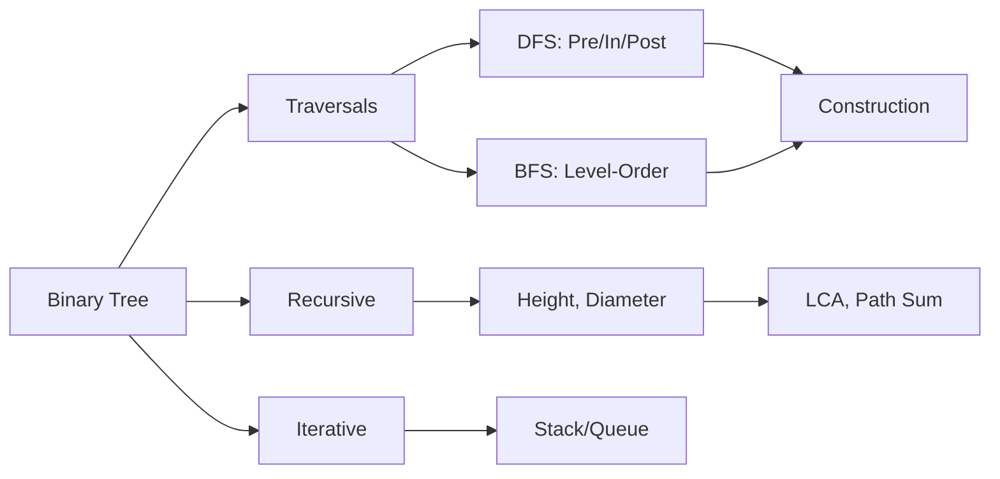

<!-- Clear Language: Keep sentences under 50 words -->
# Binary Trees

## Learning Objectives

| Objective | Description |
|-----------|-------------|
| LO1 | Understand binary tree structure, terminology, and properties |
| LO2 | Implement tree traversals: inorder, preorder, postorder, level-order |
| LO3 | Solve tree problems using recursion and iterative approaches |
| LO4 | Calculate tree height, diameter, and path-related properties |
| LO5 | Build trees from traversal sequences |
| LO6 | Apply DFS and BFS strategies to binary tree problems |

## Introduction

Heaps (priority queues) are specialized trees that efficiently provide the minimum or maximum element. They are essential for scheduling, top-K problems, and implementing algorithms like Dijkstra's shortest path.

## Prerequisites

- Binary tree basics
- Array representation of trees

## Key Terminology

**Key Terms**: Core vocabulary and concepts for this topic.

**Definition**: Essential terms you must know for interviews and production work.

## Theory

Understanding binary trees is fundamental for AI engineers. This section covers the core concepts, underlying principles, and theoretical framework that govern how binary trees works in practice.

## Chapter at a Glance

| Section | Topic | Key Concept |
|---------|-------|-------------|
| 9.1 | Binary Tree Fundamentals | Nodes, edges, root, leaf, height |
| 9.2 | Tree Traversals | Preorder, inorder, postorder, level-order |
| 9.3 | Recursive Tree Problems | Max depth, diameter, balanced tree |
| 9.4 | Iterative Traversals | Stack-based DFS, queue-based BFS |
| 9.5 | Tree Construction | Build from inorder/preorder/postorder |
| 9.6 | Advanced Problems | LCA, serialize, max path sum |

## Chapter Roadmap



A binary tree is a hierarchical data structure where each node has at most two children: left and right.

## 9.1 Binary Tree Fundamentals

```python
class TreeNode:
    def __init__(self, val=0, left=None, right=None):
        self.val = val
        self.left = left
        self.right = right

## Build:     1

##          / \

##         2   3

##        / \   \

##       4   5   6
root = TreeNode(1)
root.left = TreeNode(2, TreeNode(4), TreeNode(5))
root.right = TreeNode(3, None, TreeNode(6))

## Tree properties
def count_nodes(root):
    if not root: return 0
    return 1 + count_nodes(root.left) + count_nodes(root.right)

def height(root):
    if not root: return -1  # edge-based height
    return 1 + max(height(root.left), height(root.right))
```

## 9.2 Tree Traversals

**Preorder** (Root-Left-Right):

```python
def preorder(root):
    if not root: return []
    return [root.val] + preorder(root.left) + preorder(root.right)
```

**Inorder** (Left-Root-Right):

```python
def inorder(root):
    if not root: return []
    return inorder(root.left) + [root.val] + inorder(root.right)

## Inorder of BST gives sorted order
```

**Postorder** (Left-Right-Root):

```python
def postorder(root):
    if not root: return []
    return postorder(root.left) + postorder(root.right) + [root.val]
```

**Level-order** (BFS):

```python
from collections import deque

def level_order(root):
    if not root: return []
    result = []
    queue = deque([root])
    while queue:
        level = []
        for _ in range(len(queue)):
            node = queue.popleft()
            level.append(node.val)
            if node.left: queue.append(node.left)
            if node.right: queue.append(node.right)
        result.append(level)
    return result
```

## 9.3 Recursive Tree Problems

**Maximum depth of binary tree**:

```python
def max_depth(root):
    if not root: return 0
    return 1 + max(max_depth(root.left), max_depth(root.right))
```

**Diameter of binary tree**:

```python
def diameter_of_binary_tree(root):
    diameter = 0

    def dfs(node):
        nonlocal diameter
        if not node: return 0
        left = dfs(node.left)
        right = dfs(node.right)
        diameter = max(diameter, left + right)
        return 1 + max(left, right)

    dfs(root)
    return diameter
```

**Balanced binary tree** (height difference <= 1):

```python
def is_balanced(root):
    def dfs(node):
        if not node: return (True, 0)
        left_balanced, left_h = dfs(node.left)
        right_balanced, right_h = dfs(node.right)
        balanced = (left_balanced and right_balanced and
                   abs(left_h - right_h) <= 1)
        return (balanced, 1 + max(left_h, right_h))
    return dfs(root)[0]
```

## 9.4 Iterative Traversals

**Iterative preorder**:

```python
def preorder_iterative(root):
    if not root: return []
    stack, result = [root], []
    while stack:
        node = stack.pop()
        result.append(node.val)
        if node.right: stack.append(node.right)
        if node.left: stack.append(node.left)
    return result
```

**Iterative inorder**:

```python
def inorder_iterative(root):
    stack, result = [], []
    curr = root
    while stack or curr:
        while curr:
            stack.append(curr)
            curr = curr.left
        curr = stack.pop()
        result.append(curr.val)
        curr = curr.right
    return result
```

## 9.5 Tree Construction

**Build tree from inorder and preorder**:

```python
def build_tree(preorder, inorder):
    if not preorder or not inorder:
        return None
    root_val = preorder[0]
    root = TreeNode(root_val)
    mid = inorder.index(root_val)
    root.left = build_tree(preorder[1:mid+1], inorder[:mid])
    root.right = build_tree(preorder[mid+1:], inorder[mid+1:])
    return root
```

## 9.6 Advanced Problems

**Lowest common ancestor (LCA)**:

```python
def lowest_common_ancestor(root, p, q):
    if not root or root == p or root == q:
        return root
    left = lowest_common_ancestor(root.left, p, q)
    right = lowest_common_ancestor(root.right, p, q)
    if left and right:
        return root  # p and q in different subtrees
    return left or right
```

**Maximum path sum** (any node to any node):

```python
def max_path_sum(root):
    max_sum = float("-inf")

    def dfs(node):
        nonlocal max_sum
        if not node: return 0
        left = max(dfs(node.left), 0)
        right = max(dfs(node.right), 0)
        max_sum = max(max_sum, left + right + node.val)
        return node.val + max(left, right)

    dfs(root)
    return max_sum
```

**Serialize and deserialize**:

```python
def serialize(root):
    def dfs(node):
        if not node: return ["null"]
        return [str(node.val)] + dfs(node.left) + dfs(node.right)
    return ",".join(dfs(root))

def deserialize(data):
    vals = data.split(",")
    def dfs():
        v = vals.pop(0)
        if v == "null": return None
        node = TreeNode(int(v))
        node.left = dfs()
        node.right = dfs()
        return node
    return dfs()
```

---

## TypeScript Parallel

```typescript
class TreeNode {
    val: number;
    left: TreeNode | null = null;
    right: TreeNode | null = null;
    constructor(val: number) { this.val = val; }
}

function maxDepth(root: TreeNode | null): number {
    if (!root) return 0;
    return 1 + Math.max(maxDepth(root.left), maxDepth(root.right));
}

function inorderTraversal(root: TreeNode | null): number[] {
    const result: number[] = [];
    const stack: TreeNode[] = [];
    let curr = root;
    while (stack.length || curr) {
        while (curr) { stack.push(curr); curr = curr.left; }
        curr = stack.pop()!;
        result.push(curr.val);
        curr = curr.right;
    }
    return result;
}
```

---

## Summary

- Binary trees are hierarchical structures with each node having at most two children (left and right)
- Preorder traversal visits root before children; useful for tree copying and serialization
- Inorder traversal visits left subtree, then root, then right subtree; gives sorted order for BSTs
- Postorder traversal visits children before root; useful for tree deletion and expression evaluation
- Level-order traversal (BFS) visits nodes level by level using a queue
- Recursive solutions for tree problems follow a divide-and-conquer pattern with clear base cases
- Iterative traversals use explicit stacks (DFS) or queues (BFS) to avoid recursion overhead
- The diameter of a tree is the longest path between any two nodes, found via DFS
- LCA finds the deepest node that has both target nodes as descendants
- Binary trees can be serialized to strings and deserialized back using preorder with null markers

## Practical Takeaways

| Scenario | Do This | Avoid This |
|----------|---------|------------|
| Tree traversal | Choose based on problem: preorder for copy, inorder for sorted, postorder for delete | Using wrong traversal order |
| Recursive depth | Use iterative for very deep trees (stack overflow risk) | Recursion without depth limit check |
| Diameter calculation | DFS returning height while tracking max path | Two separate traversals |
| LCA | Recursive divide-and-conquer | Path-finding approach (O(n^2)) |
| Tree construction | Use hash map for O(1) inorder index lookup | Linear search each recursive call |
| Level-order | Queue-based BFS | Recursive approach with depth tracking |

## Interview Q&A
<details class="tp-qa-card" data-qid="dsa09-q1">
  <summary class="tp-qa-question"><span class="tp-qa-status"></span>
    Q1: What are the differences between tree traversals?
  </summary>
  <div class="tp-qa-answer"><p>Preorder: Root-Left-Right (for copying trees). Inorder: Left-Root-Right (sorted in BST). Postorder: Left-Right-Root (for deletion). Level-order: BFS using queue.</p></div>
  <button class="tp-qa-mark-btn">? Mark Reviewed</button>
  <button class="tp-qa-bookmark-btn">?? Bookmark</button>
</details>

<details class="tp-qa-card" data-qid="dsa09-q2">
  <summary class="tp-qa-question"><span class="tp-qa-status"></span>
    Q2: How do you find the height of a binary tree?
  </summary>
  <div class="tp-qa-answer"><p>Recursively: height = 1 + max(height(left), height(right)). Base case: empty node returns 0 (node-based) or -1 (edge-based).</p></div>
  <button class="tp-qa-mark-btn">? Mark Reviewed</button>
  <button class="tp-qa-bookmark-btn">?? Bookmark</button>
</details>

<details class="tp-qa-card" data-qid="dsa09-q3">
  <summary class="tp-qa-question"><span class="tp-qa-status"></span>
    Q3: What is the diameter of a binary tree?
  </summary>
  <div class="tp-qa-answer"><p>The longest path between any two nodes (may or may not pass through root). Use DFS: for each node, diameter = max(diameter, left_height + right_height).</p></div>
  <button class="tp-qa-mark-btn">? Mark Reviewed</button>
  <button class="tp-qa-bookmark-btn">?? Bookmark</button>
</details>

<details class="tp-qa-card" data-qid="dsa09-q4">
  <summary class="tp-qa-question"><span class="tp-qa-status"></span>
    Q4: How do you check if a binary tree is balanced?
  </summary>
  <div class="tp-qa-answer"><p>For each node, the height difference between left and right subtrees must be at most 1. Return both balanced flag and height from DFS.</p></div>
  <button class="tp-qa-mark-btn">? Mark Reviewed</button>
  <button class="tp-qa-bookmark-btn">?? Bookmark</button>
</details>

<details class="tp-qa-card" data-qid="dsa09-q5">
  <summary class="tp-qa-question"><span class="tp-qa-status"></span>
    Q5: How do you perform level-order traversal?
  </summary>
  <div class="tp-qa-answer"><p>Use a queue. Enqueue root. While queue not empty, process all nodes at current level, enqueuing their children for the next level.</p></div>
  <button class="tp-qa-mark-btn">? Mark Reviewed</button>
  <button class="tp-qa-bookmark-btn">?? Bookmark</button>
</details>

<details class="tp-qa-card" data-qid="dsa09-q6">
  <summary class="tp-qa-question"><span class="tp-qa-status"></span>
    Q6: Explain LCA in a binary tree.
  </summary>
  <div class="tp-qa-answer"><p>LCA is the deepest node that has both targets in its subtree. If root matches either target, return root. If left and right both return non-null, root is LCA.</p></div>
  <button class="tp-qa-mark-btn">? Mark Reviewed</button>
  <button class="tp-qa-bookmark-btn">?? Bookmark</button>
</details>

<details class="tp-qa-card" data-qid="dsa09-q7">
  <summary class="tp-qa-question"><span class="tp-qa-status"></span>
    Q7: How do you serialize and deserialize a binary tree?
  </summary>
  <div class="tp-qa-answer"><p>Use preorder traversal with null markers. Serialize as comma-separated string. Deserialize by reading values and recursively building nodes.</p></div>
  <button class="tp-qa-mark-btn">? Mark Reviewed</button>
  <button class="tp-qa-bookmark-btn">?? Bookmark</button>
</details>

<details class="tp-qa-card" data-qid="dsa09-q8">
  <summary class="tp-qa-question"><span class="tp-qa-status"></span>
    Q8: What is the maximum path sum problem?
  </summary>
  <div class="tp-qa-answer"><p>Find the path with maximum sum between any two nodes. Use DFS returning the max single-path sum, tracking the max of left+right+node.val as potential answer.</p></div>
  <button class="tp-qa-mark-btn">? Mark Reviewed</button>
  <button class="tp-qa-bookmark-btn">?? Bookmark</button>
</details>

<details class="tp-qa-card" data-qid="dsa09-q9">
  <summary class="tp-qa-question"><span class="tp-qa-status"></span>
    Q9: How do you build a tree from inorder and preorder?
  </summary>
  <div class="tp-qa-answer"><p>First element of preorder is root. Find it in inorder to split left/right subtrees. Recursively build using appropriate slices.</p></div>
  <button class="tp-qa-mark-btn">? Mark Reviewed</button>
  <button class="tp-qa-bookmark-btn">?? Bookmark</button>
</details>

<details class="tp-qa-card" data-qid="dsa09-q10">
  <summary class="tp-qa-question"><span class="tp-qa-status"></span>
    Q10: Compare recursive and iterative approaches for tree problems.
  </summary>
  <div class="tp-qa-answer"><p>Recursive: elegant, divide-and-conquer, risk of stack overflow for deep trees. Iterative: more complex, uses explicit stack/queue, avoids stack overflow.</p></div>
  <button class="tp-qa-mark-btn">? Mark Reviewed</button>
  <button class="tp-qa-bookmark-btn">?? Bookmark</button>
</details>

<details class="tp-qa-card" data-qid="dsa09-q11">
  <summary class="tp-qa-question"><span class="tp-qa-status"></span>
    Q11: How do you count all nodes in a complete binary tree in less than O(n)?
  </summary>
  <div class="tp-qa-answer"><p>Calculate left and right heights. If equal, use formula 2^h - 1. Otherwise, recursively count left + 1 + right. O(log^2 n) for complete trees.</p></div>
  <button class="tp-qa-mark-btn">? Mark Reviewed</button>
  <button class="tp-qa-bookmark-btn">?? Bookmark</button>
</details>

<details class="tp-qa-card" data-qid="dsa09-q12">
  <summary class="tp-qa-question"><span class="tp-qa-status"></span>
    Q12: What is the difference between a binary tree and a BST?
  </summary>
  <div class="tp-qa-answer"><p>Binary tree: no ordering constraint. BST: left subtree values < root < right subtree values. BST enables O(log n) search, insert, delete if balanced.</p></div>
  <button class="tp-qa-mark-btn">? Mark Reviewed</button>
  <button class="tp-qa-bookmark-btn">?? Bookmark</button>
</details>

## Chapter Quiz
**Q1**: Which traversal gives sorted order in a BST?
a) Preorder  b) Inorder  c) Postorder  d) Level-order
<details class="tp-qa-card" data-qid="dsa09-quiz1"><summary>Show Answer</summary><div class="tp-qa-answer"><p><strong>Answer: b) Inorder</strong></p></div></details>

**Q2**: What is the time complexity of level-order traversal?
a) O(log n)  b) O(n)  c) O(n^2)  d) O(2^n)
<details class="tp-qa-card" data-qid="dsa09-quiz2"><summary>Show Answer</summary><div class="tp-qa-answer"><p><strong>Answer: b) O(n)</strong></p></div></details>

**Q3**: In LCA, what does it mean if left and right both return non-null?
a) p and q are in the same subtree  b) root is the LCA  c) One target is missing  d) Tree is empty
<details class="tp-qa-card" data-qid="dsa09-quiz3"><summary>Show Answer</summary><div class="tp-qa-answer"><p><strong>Answer: b) root is the LCA</strong></p></div></details>

**Q4**: What is the height of a tree with 1 node (node-based)?
a) -1  b) 0  c) 1  d) 2
<details class="tp-qa-card" data-qid="dsa09-quiz4"><summary>Show Answer</summary><div class="tp-qa-answer"><p><strong>Answer: b) 0</strong></p><p>Node-based height of a single node is 0. Edge-based would be -1.</p></div></details>

**Q5**: Which data structure is used for iterative preorder traversal?
a) Queue  b) Stack  c) Deque  d) Priority Queue
<details class="tp-qa-card" data-qid="dsa09-quiz5"><summary>Show Answer</summary><div class="tp-qa-answer"><p><strong>Answer: b) Stack</strong></p></div></details>

## Exercises

**Easy** - Traverse a tree in inorder, preorder, and postorder recursively

**Medium** - Check if a binary tree is symmetric (mirror of itself)

**Medium** - Find all root-to-leaf paths in a binary tree

**Hard** - Serialize and deserialize a binary tree (any format)

**Hard** - Find the distance between two nodes in a binary tree (number of edges in path)

---

## Common Mistakes

1. Not understanding 0-indexed vs 1-indexed heap
2. Forgetting to heapify after modifications
3. Using heap when a sorted array suffices
4. Not considering the O(n) build-heap vs O(n log n) inserts
5. Confusing min-heap with max-heap

## Revision Notes

- Min-heap: parent ≤ children
- Max-heap: parent ≥ children
- Insert: O(log n), Extract-min: O(log n)
- Build heap from array: O(n)
- Used in heapsort, Dijkstra, and top-K problems

## Placement Section

### Top 10 Interview Questions

#### Google Style
1. Explain the time and space trade-offs of data structures algorithms. When would you choose one approach over another?
2. Design a system that efficiently handles data structures algorithms at scale (millions of requests/second).

#### Amazon Style
1. Tell me about a time you had to optimize a system related to data structures algorithms. What was your approach and what was the result?
2. How would you explain data structures algorithms to a non-technical stakeholder?

#### Microsoft Style
1. How does data structures algorithms integrate with enterprise systems and cloud architectures?
2. What are the security implications of data structures algorithms?

#### NVIDIA Style
1. How would you optimize data structures algorithms for GPU-accelerated computing?
2. What parallel processing patterns apply to data structures algorithms?

#### AI Startup Style
1. How would you implement data structures algorithms in a cost-effective, scalable way for a startup?
2. What's the fastest way to prototype a solution using data structures algorithms?

### Resume Tips
- **Technical Skills**: List data structures algorithms under relevant technical skills
- **Project Description**: "Implemented data structures algorithms to [specific outcome], reducing [metric] by [X]%"
- **Keywords**: Include data structures algorithms in your skills section for ATS optimization

### Interview Day Checklist
- [ ] Review core concepts of data structures algorithms
- [ ] Practice 3-5 problems related to data structures algorithms
- [ ] Prepare 2 real-world examples of using data structures algorithms
- [ ] Know the time/space complexity of common data structures algorithms operations
- [ ] Have questions ready about how the company uses data structures algorithms> **Next**: [10 - Binary Search Trees ?](10-binary-search-trees.md)

## True/False

1. **True or False:** Binary Trees builds directly on the fundamentals covered in the earlier chapters of this module. — **True.** Every advanced topic in this module assumes the core concepts from the previous chapters.
2. **True or False:** You should write at least one code example for Binary Trees before moving to the next chapter. — **True.** Active recall with hands-on code beats passive reading for retention.
3. **True or False:** The complexity analysis for Binary Trees is the same regardless of input size. — **False.** Complexity grows with input size; always state best, average, and worst case.
4. **True or False:** Edge cases (empty input, invalid input, boundary values) matter for Binary Trees in production. — **True.** Most production bugs come from unhandled edge cases.
5. **True or False:** You should memorize the Binary Trees chapter content once and never review it again. — **False.** Spaced repetition (24h, 3 days, 1 week) dramatically improves long-term recall.

## Fill in the Blank

1. The chapter that covers Binary Trees is Chapter ___ of this module. — Answer: check the module's table of contents.
2. The time complexity of the standard approach to Binary Trees is ___. — Answer: review the theory section and state big-O notation.
3. The main edge case to handle when implementing Binary Trees is ___. — Answer: empty or invalid input handling, as discussed in the chapter.
4. The tools commonly used to debug Binary Trees issues are ___ and ___. — Answer: refer to the Debugging Guide section of this chapter.
5. The related topic that connects to Binary Trees in the next chapter is ___. — Answer: see the Next Topic section.

## Scenario Questions

1. **Scenario:** A teammate ships a change involving Binary Trees that breaks production at 3 AM. — Diagnosis: check the recent diff, reproduce locally with the failing input, check logs. Fix: revert, add a regression test, and review the root cause. Prevention: CI tests on edge cases and code review checklist.

2. **Scenario:** Your implementation of Binary Trees is correct but too slow for the required latency. — Measure first with a profiler. Common fixes: reduce redundant work, use built-in optimized functions, batch operations, or add caching. Only then consider algorithmic changes.

3. **Scenario:** A new hire asks you to explain Binary Trees in five minutes before a customer demo. — Use the 3-part answer: what it is (one sentence), how it works (one example), why it matters (one business impact). Then offer to go deeper after the demo.

4. **Scenario:** Your team's codebase has three different patterns for Binary Trees and you must standardize. — Write a short ADR (architecture decision record), pick the pattern with best maintainability, migrate incrementally, and add a linter rule to enforce it.

## Output Questions

1. **What is the output of the simplest correct implementation of Binary Trees on an empty input?** — Trace through the code: it should return the documented default (None, 0, empty collection) without raising.
2. **What is the output when the input is at the boundary value?** — Check off-by-one errors and inclusive/exclusive bounds in the chapter's examples.
3. **What does the implementation return when given invalid input types?** — With type hints and validation, it raises a clear error; without, it may fail silently.
4. **What is the output for the sample input given in the chapter's Examples section?** — Re-run the chapter's example code and compare against the documented output.
5. **What is the time complexity output when you profile the implementation at 10x input size?** — Expect the curve matching the chapter's complexity analysis (linear, quadratic, log-linear).

## Difficulty Level

**Level**: Intermediate
**Estimated Study Time**: 30-45 minutes
**Prerequisites**: Complete understanding of previous modules recommended

## Tips & Tricks

**Tip**: Start with the basics — understand the fundamental concepts before moving to advanced topics.

**Tip**: Practice actively — don't just read, implement the code examples yourself.

**Tip**: Connect to prior knowledge — relate new concepts to what you learned in previous modules.

**Pro Tip**: Focus on understanding, not memorizing — understand why things work, not just how.

**Pro Tip**: Review regularly — revisit key concepts after a few days to reinforce learning.

## Memory Tricks

- **Acronym Method**: Create acronyms for lists of concepts
- **Visualization**: Draw diagrams to visualize abstract concepts
- **Teach someone else**: Explaining concepts to others reinforces your understanding
- **Connect to real-world**: Relate technical concepts to everyday experiences
- **Chunking**: Break complex topics into smaller, manageable pieces

## Further Reading

- Official documentation and language specifications
- "Designing Data-Intensive Applications" by Martin Kleppmann
- "System Design Interview" by Alex Xu
- "AI Engineering" by Chip Huyen
- Research papers and blog posts from leading AI labs

## Related Topics

- How this connects to Data Structures & Algorithms fundamentals
- Prerequisites for advanced topics in this module
- Real-world applications in AI engineering systems
- Interview questions that test deep understanding

## FAQs

**Q: How long does it take to master binary trees?
**A**: With consistent practice, 2-4 weeks for basic proficiency, 2-3 months for advanced mastery.

**Q: Do I need to memorize all the details?
**A**: Focus on understanding the core principles. Details can be looked up, but understanding cannot.

**Q: What's the best way to practice?
**A**: Implement the code examples, then modify them to solve different problems. Build small projects.

**Q: How often should I review this material?
**A**: Review after 1 day, 3 days, 1 week, and 1 month for long-term retention.

## Important Notes

> **Note**: Understanding the fundamentals is more important than memorizing syntax.

> **Note**: Don't skip the exercises — they reinforce critical concepts.

> **Note**: This topic frequently appears in technical interviews at top companies.

> **Note**: In real systems, these concepts are used daily by AI engineers.

## Historical Context

The Evolution of this technology reflects decades of research and practical engineering experience.

Understanding the evolution of binary trees helps appreciate why current approaches exist. These concepts have been developed over decades of computer science research and practical engineering experience.

## Security Considerations

- **Input Validation**: Always validate and sanitize inputs
- **Error Handling**: Don't expose internal details in error messages
- **Resource Limits**: Set appropriate limits to prevent denial of service
- **Authentication**: Ensure proper authentication and authorization
- **Data Protection**: Handle sensitive data according to security best practices

## ML Intuition

For AI engineering, understanding binary trees at an intuitive level is crucial. Think of it as building mental models that help you reason about system behavior, debug issues, and make architectural decisions.

## Analogies

Think of binary trees like learning a new language — start with basic vocabulary (fundamentals), then learn grammar (rules), and finally practice conversation (application). The more you practice, the more natural it becomes.

## Capstone Project Link

**Project**: Apply binary trees concepts in a mini-project
**Goal**: Build a small application that demonstrates understanding of core principles
**Duration**: 2-4 hours
**Outcome**: Working implementation with documentation

## Flashcards

**Card 1**: What is the core concept of binary trees?
**Answer**: The fundamental principle that enables efficient and scalable systems.

**Card 2**: When would you apply binary trees in real systems?
**Answer**: When building production AI systems that require reliability, scalability, and maintainability.

**Card 3**: What are the common pitfalls to avoid?
**Answer**: Over-engineering, ignoring edge cases, and not considering production requirements.

## Research References

- Academic papers and conference proceedings (NeurIPS, ICML, ICLR)
- Industry whitepapers from leading AI companies
- Technical blogs from Google, Meta, OpenAI, Anthropic
- Open-source implementations and documentation

## Open-Source Tools

- **LangChain**: Framework for building LLM-powered applications
- **LlamaIndex**: Data framework for connecting LLMs with external data
- **Hugging Face Transformers**: State-of-the-art ML models and datasets
- **Weights & Biases**: Experiment tracking and model evaluation
- **MLflow**: Open-source platform for ML lifecycle management
- **Prometheus + Grafana**: Monitoring and observability stack

## Debugging Guide

**Common Issues**:
- Check input validation and data types
- Verify API keys and authentication
- Monitor resource usage (CPU, memory, GPU)
- Review error logs for stack traces

**Debugging Steps**:
1. Reproduce the issue with minimal input
2. Add logging at key points
3. Check external dependencies
4. Verify configuration settings
5. Test with known-good inputs

## Mock Interview Section

**Quick Fire Questions**:
1. What is the core concept of Data Structures & Algorithms?
2. When would you use this in production?
3. What are the trade-offs?
4. How does this scale?
5. What are common pitfalls?

**Follow-up Questions**:
- How would you optimize this for 10x scale?
- What monitoring would you add?
- How would you test this in production?

## Optimized Implementation

For production systems, consider:
- **Caching**: Cache frequent computations and API responses
- **Batching**: Process multiple items together for efficiency
- **Async/Await**: Use non-blocking I/O for concurrent operations
- **Connection Pooling**: Reuse database and API connections
- **Lazy Loading**: Load resources only when needed

## Evaluation Metrics

**Model Evaluation**:
- Accuracy, Precision, Recall, F1-Score
- BLEU, ROUGE for text generation
- Latency, Throughput, Cost per inference

**System Evaluation**:
- End-to-end latency (p50, p95, p99)
- Error rate and availability
- Resource utilization (CPU, memory, GPU)

## Real-World Examples

**Industry Applications**:
- Google: Search ranking, translation, autocomplete
- Amazon: Product recommendations, Alexa, fraud detection
- Netflix: Content recommendations, personalization
- Tesla: Autonomous driving, computer vision
- OpenAI: ChatGPT, DALL-E, Codex

## Next Topic

After mastering Data Structures & Algorithms, continue to the next module in the curriculum to build upon these foundations and deepen your AI engineering expertise.

## Limitations

Every approach has trade-offs. Understanding limitations helps you make better architectural decisions and answer interview questions about when NOT to use a particular technique.
